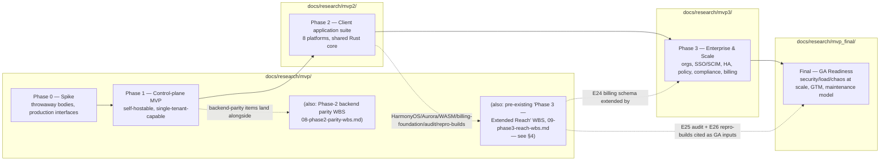

# HelixVPN — Unified Phase Roadmap

**Revision:** 1
**Last modified:** 2026-07-04T12:00:00Z
**Status:** active — the single top-level index reconciling every phase document under `docs/research/`

> **Purpose.** `docs/research/` accumulated four generations of planning documents
> (`mvp/`, `mvp2/`, `mvp3/`, `mvp_final/`) written at different times, and — as documented
> honestly in §4 below — using **three different, mutually inconsistent phase-numbering
> schemes**. This document is the **single index** a new reader (or a new agent session)
> should start from: it lists every phase, what it delivers, where its documents live, how
> phases depend on each other, and it resolves the directory-naming-vs-phase-numbering
> confusion explicitly rather than silently. It does not re-specify any phase's content —
> every phase's authoritative content stays in its own document set, linked below.

---

## Table of contents

- [1. The canonical phase list](#1-the-canonical-phase-list)
- [2. Phase dependency graph](#2-phase-dependency-graph)
- [3. Per-phase entry/exit gate summary](#3-per-phase-entryexit-gate-summary)
- [4. Naming/structure reconciliation (read this before anything else)](#4-namingstructure-reconciliation-read-this-before-anything-else)
- [5. Consolidated open decisions requiring operator input](#5-consolidated-open-decisions-requiring-operator-input)
- [Sources](#sources)

---

## 1. The canonical phase list

This is the numbering this project uses **going forward**, adopted specifically for this
reconciliation (see §4 for why it differs from numbering already embedded in some existing
documents):

| Phase | One-paragraph description | Primary docs | Depends on |
|---|---|---|---|
| **Phase 0 — Spike** | Throwaway *bodies* on *production interfaces*, proving the hard technical risks before committing to the full build: the WireGuard data path through a gateway edge, one QUIC/MASQUE obfuscation mode, the iOS Network Extension memory ceiling (the reason the shared core is Rust, not Go), and a Go-vs-Rust edge-language benchmark. Nothing here ships to a user; the interfaces it proves (the `Transport` trait, the FFI surface, the reconciler) survive into Phase 1. | `docs/research/mvp/final/06-phase0-spike-wbs.md`; architecture context in `docs/research/mvp/04_VPN_CLD/HelixVPN-Architecture-Refined.md` §12 | none (first phase) |
| **Phase 1 — Control-plane MVP** | The self-hostable core: the Go modular-monolith control plane (`helixd` — identity, registry, ipam, pki, policy, coordinator, events, telemetry, api), Postgres with Row-Level Security and no durable connection/traffic table (schema-lint enforced), Redis Streams as the event backbone, the `WatchNetworkMap` push-based reconciliation protocol, the policy compiler (default-deny, `AllowedIPs` + verdict maps), `helixvpnctl`, and rootless Podman quadlet deployment. One client platform (Linux or Android) proves the vertical slice end-to-end. | `docs/research/mvp/final/07-phase1-mvp-wbs.md`; spine `docs/research/mvp/final/SPECIFICATION.md` §8.1 | Phase 0 |
| **Phase 2 — Client application suite** | The 8-platform, 7-OS client application layer built on a shared Rust core (`helix-core`, 70–85% code reuse): Tauri v2 desktop (macOS/Windows/Linux), Flutter mobile (Android/iOS/HarmonyOS), Qt6/QML (Aurora OS), and a browser extension + PWA companion for Web. Also covers, per the *pre-existing* Phase-2 backend-parity WBS, the full obfuscation transport set, DAITA traffic shaping, multi-hop, post-quantum handshake, and HA/multi-region groundwork on the control-plane side. | `docs/research/mvp2/README.md` (entry point), `docs/research/mvp2/MVP2_OVERVIEW.md`, `docs/research/mvp2/MVP2_ARCHITECTURE.md`; backend-parity WBS `docs/research/mvp/final/08-phase2-parity-wbs.md` | Phase 1 |
| **Phase 3 — Enterprise & Scale** | Takes the working MVP + client suite to an enterprise-ready, horizontally-scalable, commercially deployable platform: organizations/teams/permission-based RBAC above the existing tenant model, enterprise SSO (SAML alongside OIDC) + SCIM provisioning + device-posture/conditional-access, multi-region HA hardening (resolving open questions left in the Phase-2 HA design), an advanced policy engine (time/context-aware conditions, per-app split-tunnel templates, destination-category egress controls, SIEM export), compliance-grade observability (tamper-evident audit retention, a SOC2/ISO27001/GDPR control map), marketplace/billing, and advanced networking (site-to-site mesh, dual-stack IPv6, QoS, hardened DPI-resistance). | `docs/research/mvp3/MVP3_ENTERPRISE_SCALE.md` | Phase 2 (client suite Tier-1 platforms working) |
| **Final — GA Readiness** | The last phase before General Availability: a follow-up security audit scoped to the Phase-3 enterprise surface, load/chaos testing at commercial scale, four-audience documentation completeness, an on-call/incident-response process, go-to-market readiness (pricing, legal, 8 app-store listings, onboarding), and the long-term maintenance model (LTS/versioning policy, deprecation policy, FFI/API backward-compatibility guarantees, security-patch SLA). | `docs/research/mvp_final/MVP_FINAL_GA_READINESS.md` | Phase 3 |

`docs/research/mvp4/TBD.md` exists as an empty placeholder and is **out of scope for this
reconciliation** — it has no defined content yet and is not one of the phases this document
indexes; a future pass should either populate it with a genuinely new phase or remove it as
redundant once Phase 3/Final absorb its intended scope (this is itself an open item, §5).

---

## 2. Phase dependency graph

---

## 3. Per-phase entry/exit gate summary

| Phase | Entry condition | Exit condition (all must hold, with captured evidence) |
|---|---|---|
| Phase 0 | none | Gates G1–G6 pass: ≥80% bare-link WG throughput; MASQUE survives a DPI UDP block at ≥50% of plain-WG throughput; iOS NE memory ceiling proven with ≥30% headroom; Go-vs-Rust edge benchmark decided; FFI drives the core end-to-end from Dart; push-based reconcile converges with zero polling. |
| Phase 1 | Phase 0 gates green | The 8-criterion MVP Definition of Done (`mvp/final/07-phase1-mvp-wbs.md`): self-host from zero, enroll connector+client, authorized reach proven + unauthorized denied, auto-escalation to MASQUE under a block, policy edit reflected <1s, device revoke <1s, kill-switch+DNS-leak proven, no durable connection log exists. |
| Phase 2 | Phase 1 DoD green | Full Mullvad feature-parity matrix green; desktop/mobile/Aurora/HarmonyOS/Web builds pass the same 8 MVP DoD criteria on-device; multi-hop + P2P/NAT-traversal + PQ handshake interop proven; HA failover <30s with transport preserved (per the *pre-existing* Phase-2 backend WBS, `08-phase2-parity-wbs.md`), **and** Tier-1 client platforms (macOS/Windows/Linux/Android) have a working build per `mvp2/MVP2_OVERVIEW.md` §4.2. |
| Phase 3 | Phase 2 Tier-1 client suite working | All gates `G30`–`G37` in `mvp3/MVP3_ENTERPRISE_SCALE.md` §10.2 green: org/RBAC model live with RLS intact; SAML+SCIM+posture E2E proven; multi-region HA chaos-tested; advanced policy engine (conditions+templates+SIEM export) proven; tamper-evident audit + control mapping delivered; billing/marketplace rollup + reseller model proven; site-to-site/dual-stack/QoS proven; full-suite retest with zero no-logging-as-code (S6/S7) regression. |
| Final (GA) | Phase 3 gates green, **and** the pre-existing `mvp/final/09-phase3-reach-wbs.md` gates `G20`–`G26` at least `pass` or honestly `pending_device`/`operator_blocked` | All gates `G40`–`G44` in `mvp_final/MVP_FINAL_GA_READINESS.md` §5.2 green: follow-up security audit zero unresolved Critical/High; commercial-scale load+chaos evidence captured; four-audience docs complete; on-call+game-day proven; pricing/legal/8-store-listings/onboarding complete; LTS/deprecation/compat-matrix/patch-SLA published; operator explicit go/no-go recorded. |

---

## 4. Naming/structure reconciliation (read this before anything else)

The directory layout under `docs/research/` does **not** number phases 1:1 with directory
suffixes, and the corpus that accumulated over time actually contains **three different,
mutually inconsistent phase-numbering narratives**. This section names all three, states which
one is canonical going forward, and cross-references the others without silently rewriting them
(per this project's own no-guessing/no-silent-renumbering discipline — a directory rename or
content rewrite is a visible, deliberate operator decision, not something a documentation pass
does quietly).

### 4.1 Narrative A — `docs/research/mvp/final/SPECIFICATION.md`'s internal Phase 0–3

The most detailed and most-referenced narrative, embedded in the `mvp/` directory's own spine
document (§8) and its per-phase WBS docs:

- Phase 0 — Spike
- Phase 1 — MVP (self-hostable)
- **Phase 2 — Parity + Reach**: full transport set, DAITA, multi-hop, PQ handshake, **desktop
  apps** (Windows/macOS), policy-as-code/GitOps, **HA + multi-region**. Note this is
  *backend/control-plane feature completion*, not the full 8-platform client suite.
- **Phase 3 — Extended Reach**: HarmonyOS NEXT + Aurora OS native tunnel shims, an in-browser
  WASM MASQUE proxy, **billing-optional multi-tenant** Console + audit, third-party security
  audit + reproducible builds. Detailed in `docs/research/mvp/final/09-phase3-reach-wbs.md`.

### 4.2 Narrative B — `docs/research/mvp2/MVP2_OVERVIEW.md` §3.1's internal Phase 1–4

A second, independently-written narrative embedded in the MVP2 overview's own "Project Context"
section:

- Phase 1 (MVP1) — "Server Infrastructure & Admin Backend" — marked **`[COMPLETED]`**
- Phase 2 (MVP2) — "Client Applications (8 platforms)" — **"THIS DOCUMENT"**
- Phase 3 (MVP3) — "Enterprise Features & Ecosystem" — **`[PLANNED]`**
- Phase 4 (MVP4) — "Advanced Anti-Censorship & Post-Quantum" — **`[PLANNED]`**

**This narrative is flagged here as internally inconsistent with the actual project state, not
resolved.** Its Phase 1 description ("VPN Server Network: globally distributed WireGuard server
fleet," "Billing Integration: subscription management... `[COMPLETED]`") does not match the
actual Phase 0/1 specification in `mvp/final/SPECIFICATION.md` (a single self-hostable
control-plane MVP with billing explicitly out of scope until the Phase-3 "billing-optional"
epic, and no claim of a globally-distributed managed server fleet). This reads as boilerplate
carried over from a generic SaaS-VPN framing rather than a description of *this* project's
actual, spec-only, not-yet-built Phase 0/1. It is called out here for operator awareness. It is
**not corrected in this pass** — `docs/research/mvp2/` is a parallel workstream's document set
and is explicitly out of scope for this reconciliation's edits (per the constraint that this
reconciliation only creates new files and does not modify `mvp/` or `mvp2/`).

### 4.3 Narrative C — this document's canonical numbering (§1 above)

The numbering this reconciliation adopts, matching the directory-to-phase mapping the operator
specified for this work: `mvp/` = Phase 0 + Phase 1, `mvp2/` = Phase 2, `mvp3/` = Phase 3,
`mvp_final/` = Final/GA. **This is the numbering used going forward** for any new
cross-phase document (this one, and the two it indexes).

### 4.4 The concrete collision, and how it is resolved without duplication

Narrative A's "Phase 3 — Extended Reach" and this reconciliation's "Phase 3 — Enterprise & Scale"
(`mvp3/MVP3_ENTERPRISE_SCALE.md`) are **both labeled Phase 3**, and they are **genuinely
different in scope**:

| | Narrative A's "Phase 3" (`mvp/final/09-phase3-reach-wbs.md`) | This reconciliation's "Phase 3" (`mvp3/MVP3_ENTERPRISE_SCALE.md`) |
|---|---|---|
| Scope | Platform reach (HarmonyOS/Aurora native shims, WASM browser proxy) + hardening (third-party audit, reproducible builds) + a billing-optional multi-tenant *foundation* | Organizational scale: orgs/teams/RBAC, enterprise SSO/SCIM/device-trust, multi-region HA hardening, advanced policy engine, compliance observability, full marketplace/billing, advanced networking |
| ID namespace | `HVPN-P3-NNN`, gates `G20`–`G26` | `HVPN-ENT-NNN`, gates `G30`–`G39` (deliberately distinct, no collision) |
| Relationship | — | **Extends, never duplicates**: `mvp3/`'s billing model (§3.4, §8) is built directly on top of Narrative A's `HVPN-P3-E24` billing schema (`plan`/`subscription`/`usage_counter`); `mvp3/`'s decision register cites Narrative A's `HVPN-P3-E25` audit epic rather than re-scoping it |

**This reconciliation's recommendation (an open decision, not silently applied — see §5):**
treat Narrative A's Phase 3 as a **platform-completion and hardening track** that runs alongside
— and is a prerequisite input to — this reconciliation's Phase 3 (enterprise/scale) and Final
(GA) phases, rather than renaming either document set. The dependency graph in §2 shows this
explicitly: Narrative A's WBS feeds artifacts (the billing schema, the audit report, the
reproducible-build attestation) into both `mvp3/` and `mvp_final/`, without either document
needing to be rewritten. If the operator later prefers a clean single numbering (e.g. relabeling
Narrative A's Phase 3 as "Phase 2c" or "Phase 2.5," since HarmonyOS/Aurora/WASM-proxy are
genuinely deferred *client-platform* work), that is a deliberate rename tracked as an open item
(§5) — not something this document performs unilaterally.

---

## 5. Consolidated open decisions requiring operator input

Pulled together from both new phase documents, plus the reconciliation work above, so an
operator reviewing this roadmap sees every outstanding decision in one place:

| # | Decision | Source | Recommendation |
|---|---|---|---|
| R-1 | Whether to rename/renumber Narrative A's "Phase 3 — Extended Reach" (`mvp/final/09-phase3-reach-wbs.md`) to remove the Phase-3 label collision described in §4.4 | this document, §4.4 (also `mvp3/MVP3_ENTERPRISE_SCALE.md` D-ENT-1) | keep both cross-referenced as-is for now; revisit if the label collision causes real confusion once a unified `docs/workable_items.db` is populated with both `HVPN-P3-*` and `HVPN-ENT-*` rows |
| R-2 | Whether/how to correct `mvp2/MVP2_OVERVIEW.md` §3.1's inconsistent "MVP1 completed / global server fleet / billing already live" framing (§4.2) | this document, §4.2 | flagged, not corrected here (out of scope for this reconciliation pass — belongs to the `mvp2/` workstream owner) |
| R-3 | Pricing model for the subscription tiers | `mvp3/MVP3_ENTERPRISE_SCALE.md` §11 D-ENT-2; `mvp_final/MVP_FINAL_GA_READINESS.md` §7 D-GA-1 | not specified — highest-priority business decision blocking GA go-to-market work |
| R-4 | Which compliance certification (SOC2, ISO27001, or neither) to pursue, and whether before or after GA | `mvp3/` §11 D-ENT-3; `mvp_final/` §7 D-GA-4 | not specified — depends on target market (US enterprise vs. EU enterprise vs. self-host-only) |
| R-5 | Whether the organization layer above tenant (`mvp3/` §3.1) is needed for the first enterprise release, or can trail RBAC/SSO/HA | `mvp3/MVP3_ENTERPRISE_SCALE.md` §11 D-ENT-4 | recommend shipping RBAC+SSO+HA first; org/reseller layer can trail |
| R-6 | DLP posture — confirm "metadata/category-only egress control, no payload inspection" as final product positioning | `mvp3/MVP3_ENTERPRISE_SCALE.md` §6.3, §11 D-ENT-5 | recommend accepting the boundary; payload inspection contradicts the no-logging-as-code architecture |
| R-7 | SLA percentages and security-patch-SLA time windows | `mvp3/` §11 D-ENT-6; `mvp_final/` §7 D-GA-3 | draft numbers proposed in both documents; need operator/legal confirmation before publishing |
| R-8 | LTS cadence | `mvp_final/MVP_FINAL_GA_READINESS.md` §7 D-GA-2 | recommend calendar-based cadence; not decided |
| R-9 | GA launch sequencing across the 8 client platforms (simultaneous vs. staged by platform-readiness) | `mvp_final/` §7 D-GA-5 | recommend staged, gated by the HarmonyOS/Aurora device-proof gates (`G21`/`G22`) already in `mvp/final/09-phase3-reach-wbs.md` |
| R-10 | Disposition of `docs/research/mvp4/TBD.md` (empty placeholder, no defined scope, not indexed by this roadmap) | this document, §1 | either populate with a genuinely new phase or remove once Phase 3/Final absorb its intended scope |

---

## Sources

- `docs/research/mvp/final/SPECIFICATION.md` — Narrative A's spine (§4.1).
- `docs/research/mvp/final/06-phase0-spike-wbs.md`, `07-phase1-mvp-wbs.md`, `08-phase2-parity-wbs.md`, `09-phase3-reach-wbs.md` — the four existing WBS documents cross-referenced throughout.
- `docs/research/mvp2/README.md`, `docs/research/mvp2/MVP2_OVERVIEW.md` — Narrative B (§4.2), the Phase-2 client-suite platform matrix (§1, §3).
- `docs/research/mvp3/MVP3_ENTERPRISE_SCALE.md` — this reconciliation's Phase 3 (§1, §4.4).
- `docs/research/mvp_final/MVP_FINAL_GA_READINESS.md` — this reconciliation's Final/GA phase (§1).
- `docs/research/mvp3/TBD.md`, `docs/research/mvp4/TBD.md`, `docs/research/mvp_final/TBD.md` — the placeholder files found at the start of this work; `mvp3/`'s and `mvp_final/`'s scope is now defined by the documents above, `mvp4/` remains an open item (§5, R-10).

*End of unified phase roadmap.*
