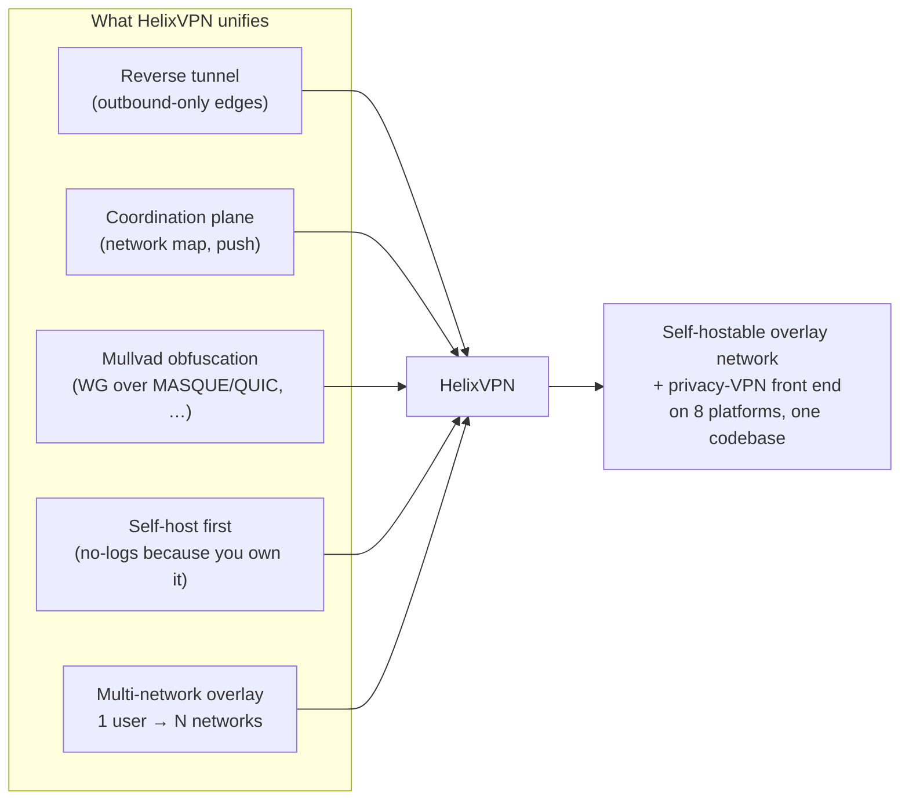
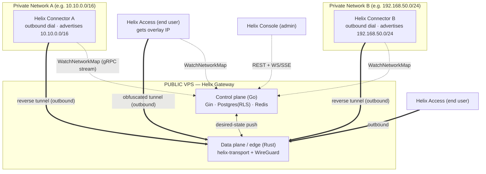
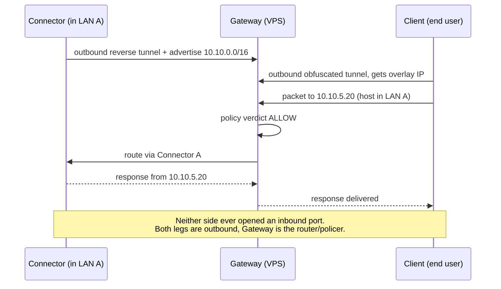
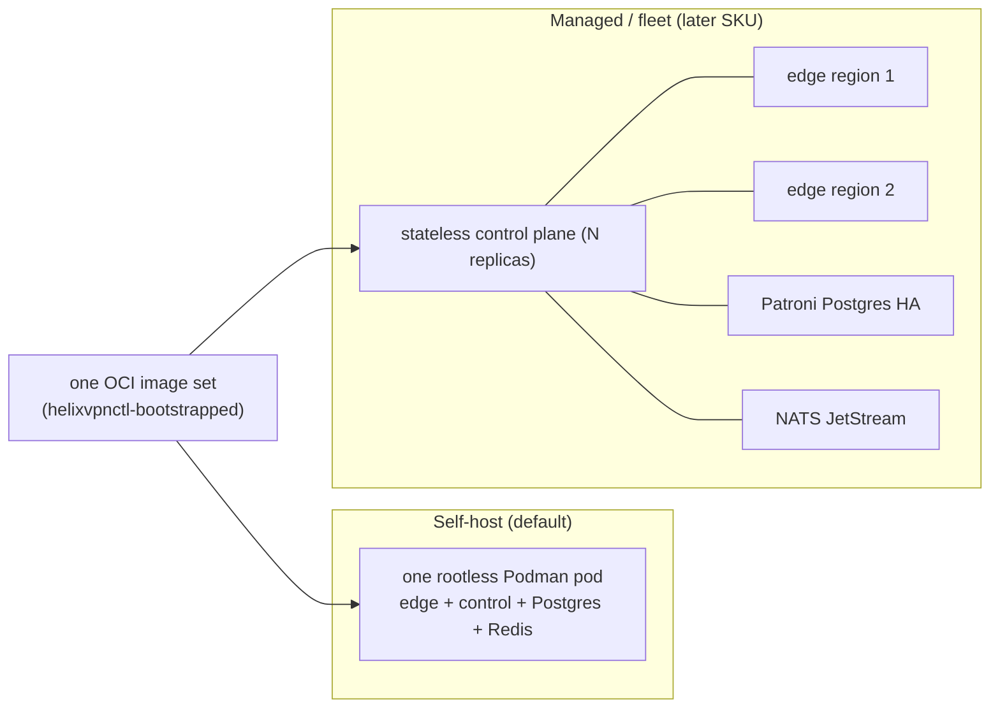

# Product Definition, Scope, Roles & Principles

**Revision:** 2
**Last modified:** 2026-06-26T12:00:00Z

> **Document role.** This is document `00` of the HelixVPN master technical
> specification set under `docs/research/mvp/final/`. It establishes the
> *invariants every later document inherits*: what the product is and is not,
> who uses it, the three-role topology, the licensing/hosting stance, the
> per-phase scope boundary, the seven non-negotiable principles, the
> Mullvad-parity acceptance matrix, and — crucially — the **eight open
> architectural decisions (D1–D8)** (D1–D7 technical + D8 licensing, §7.2) that
> downstream documents (`01`-transport,
> `02`-control-plane, `03`-client-core, …) must resolve. Where a decision is
> still open this document gives **options plus a recommendation** (§11.4.6
> no-guessing, §11.4.66 decision discipline); it never silently picks a camp.
>
> **Evidence base.** Cross-document synthesis of the 16 source research docs in
> `docs/research/mvp/` (eleven independent LLM analyses `00`,`01_DSK`,`02_QWN`,
> `03_ZAI`,`05_YBO`,`06_GRK`,`07_GMI`,`08_CPL`,`09_GCT`,`10_KMI`,`11_MST`
> plus the five refined `04_VPN_CLD` docs). Citations are inline by id, e.g.
> `[04_ARCH §1]` = `04_VPN_CLD/HelixVPN-Architecture-Refined.md` §1,
> `[05_YBO]` = the operator mandate brief, `[research-masque]` = the MASQUE
> research note.
>
> **Status of this document:** SPEC-ONLY. It describes *what to build and why*;
> it does not build it. Two-to-three refinement passes follow.

---

## Table of contents

- [1. Executive product definition](#1-executive-product-definition)
- [2. What HelixVPN is — and is explicitly NOT](#2-what-helixvpn-is--and-is-explicitly-not)
- [3. The three roles: Connector ⇄ Gateway ⇄ Client](#3-the-three-roles-connector--gateway--client)
- [4. "Two-way" and "multi-network" — precise meaning](#4-two-way-and-multi-network--precise-meaning)
- [5. Personas and the three app classes](#5-personas-and-the-three-app-classes)
- [6. Prior art and positioning](#6-prior-art-and-positioning)
- [7. Hosting model, licensing & commercial stance](#7-hosting-model-licensing--commercial-stance)
- [8. The seven non-negotiable principles](#8-the-seven-non-negotiable-principles)
- [9. Mullvad feature-parity matrix (acceptance checklist)](#9-mullvad-feature-parity-matrix-acceptance-checklist)
- [10. Scope per phase (in / out)](#10-scope-per-phase-in--out)
- [11. Open architectural decisions D1–D8 (options + recommendation)](#11-open-architectural-decisions-d1d8-options--recommendation)
- [12. Glossary of normative terms](#12-glossary-of-normative-terms)
- [13. Cross-document contracts this document fixes](#13-cross-document-contracts-this-document-fixes)
- [Sources verified](#sources-verified)

---

## 1. Executive product definition

**HelixVPN is a self-hostable overlay network with a privacy-VPN front end.**

The one-sentence pitch `[04_ARCH §1]`:

> *Cloudflare Tunnel + WARP, rebuilt as Tailscale-style coordination, with
> Mullvad's obfuscation stack, fully self-hostable, on one shared codebase.*

Decomposed, that pitch names four lineages, each of which HelixVPN
deliberately unifies:

| Lineage borrowed from | What HelixVPN takes | Source |
|---|---|---|
| **Cloudflare Tunnel + WARP** | the *connector dials out* model (no inbound port-forward) and MASQUE/QUIC transport | `[00]`, `[04_ARCH §0/§3.3]` |
| **Tailscale / Headscale** | the *coordination & desired-state "network map"* model (push-don't-poll, ACL-compiled topology) | `[04_ARCH §4.4]`, plurality of analyses |
| **Mullvad** | the *obfuscation + privacy bar* (QUIC/MASQUE, Shadowsocks, UoT, LWO, DAITA, multi-hop, kill-switch, no-logging, anonymous accounts) | `[04_ARCH §6]`, `[02_QWN]`, `[11_MST]` |
| **NetBird** | the *closest OSS shape* (WireGuard + management/signal server, self-hosted) as an architectural sanity check | `[04_ARCH §1.3]` |

The **founding constraint** that gave rise to the project `[05_YBO]`,
`[00]`: a remote user must obtain full, policy-scoped access to one *or many*
internal / home / lab networks **without any inbound port-forward on those
networks**. Internal hosts dial *outbound* to a public gateway (a reverse
tunnel); the gateway relays and routes. The headline differentiator over every
incumbent is **`1 user → N joined private networks`** — a multi-network,
bidirectional, policy-routed gateway — which no self-hostable product ships
today `[04_ARCH §1.3]`.

> **Reconciled (§11.4.35, 2026-06-26) — `UNVERIFIED` (§11.4.99).** "no
> self-hostable product ships [a 1→N multi-network policy-routed gateway] today"
> is a **competitive-market claim**, not an architectural fact of HelixVPN. It is
> plausible from the prior-art map (§6) but MUST be re-verified against current
> product feature sets in the §11.4.99 latest-source pass before any external-facing
> use. This matches the marker already carried by
> [`v01-product/product-vision-and-positioning.md`](v01-product/product-vision-and-positioning.md)
> §2.2/§8 (R-V4). The *architectural* fact — that HelixVPN's design delivers 1→N
> policy-routed networks — is cited and is **not** `UNVERIFIED`.



---

## 2. What HelixVPN is — and is explicitly NOT

Pinning the negative space is as load-bearing as the positive definition: it
keeps every downstream document from drifting into adjacent products.

### 2.1 HelixVPN **IS**

1. A **WireGuard-cryptographic-core overlay** where obfuscation/transport is a
   *pluggable layer underneath* WireGuard, never a crypto fork `[04_ARCH §2/§3]`.
2. A **three-role system** — Connector, Gateway, Client — with a strict
   control-plane / data-plane split `[04_ARCH §1.1/§2]`.
3. **Self-hostable by one person** (single rootless-Podman pod), with the *same
   images* scaling to an HA multi-region fleet `[04_ARCH §2 principle 6, §10]`.
4. A **cross-platform app suite** on a shared codebase, targeting iOS, Android,
   **Aurora OS**, **HarmonyOS NEXT**, Windows, Linux, macOS, and Web `[05_YBO]`.
5. An **event-driven, push-based** control plane: state changes propagate as
   events; agents reconcile to a declared desired-state `[04_ARCH §4.3/§4.4]`.
6. A **no-logging-by-construction** privacy product: only aggregate counters and
   ephemeral presence persist; no durable connection / traffic / packet table
   ever exists — CI-enforced `[04_ARCH §4.5/§7]`.

### 2.2 HelixVPN is **NOT**

| NOT | Why it is excluded | Where the boundary is enforced |
|---|---|---|
| **NOT a forked or re-rolled WireGuard crypto.** | The crypto core is the audited WireGuard Noise IK construction. We change only how the *encrypted datagrams look on the wire*. | Transport spec `01`; CI lint forbids touching WG crypto primitives. |
| **NOT a separate "QUIC protocol" alongside WG.** | Mullvad's QUIC mode *is* WireGuard tunneled over MASQUE/HTTP-3, not a different protocol `[04_ARCH §0]`, `[research-masque]`. | D1 below; transport spec `01`. |
| **NOT a full system VPN in a browser.** | Browsers cannot open a TUN device. The Web build is **Console (management)** + an *optional* in-page WASM MASQUE proxy that proxies the **browser's own** traffic only `[04_ARCH §5.7]`. | Client/app spec `03`/`05`; §10 scope below. |
| **NOT a logging / lawful-intercept / DLP appliance.** | No-logging is an architectural build property, not a toggle. *Control* actions are audited; *traffic* never is. | Data-model spec `02`; CI schema-lint. |
| **NOT a generic SDN / service-mesh / L7 API gateway.** | HelixVPN operates at L3 (IP overlay) with L4 port policy. It is not Envoy/Istio and does not terminate application TLS for inspection. | Policy spec; §2.1 scope. |
| **NOT a consumer "free VPN" ad-funded service.** | The default deployment is self-hosted; a managed offering is an optional later SKU, not the product's reason to exist. | §7 below. |
| **NOT dependent on inbound port-forwarding** on any joined network. | The reverse-tunnel insight from the original brief is foundational. | Principle 3 (§8); Connector spec. |

> **§11.4.6 honesty marker.** Two product claims have *hard physical limits* and
> MUST be stated to users without hand-waving `[04_ARCH §5.7]`:
> (a) **"fully responsive web app" ≠ system VPN** — it is the Console + a
> browser-scoped proxy; (b) **iOS Network Extension ~15 MB working-set ceiling**
> is a measured historical constraint that shapes the core-language decision
> (D2) and is verified on-device in Phase 0 gate G3, never assumed.

---

## 3. The three roles: Connector ⇄ Gateway ⇄ Client

The entire system is three roles and three control relationships
`[04_ARCH §1.1]`, `[05_YBO]`, consensus across all 10 analyses.



### 3.1 Connector (network-side agent)

- A **first-party agent installed on a host inside each private network**.
- **Dials outbound** to the Gateway — *no inbound port-forward, ever* `[05_YBO]`.
- Authenticates (device cert + enrollment token), then **advertises the CIDRs**
  that network exposes (`route.advertised`).
- Routes Gateway-bound traffic *into* its LAN and LAN responses *back out*.
- Runs **headless** (daemon) with an optional slim config UI; on appliance
  hardware it can run on Android/embedded `[04_ARCH §1.2/§5.4]`.
- Shares the **same Rust core** as the Client, in *advertise/route* mode rather
  than *capture-this-device's-traffic* mode `[04_ARCH §5.4]`.

### 3.2 Gateway (public VPS — the rendezvous hub)

- The only role with a public address. Two strictly separated planes:
  - **Control plane (Go/Gin/Postgres/Redis)** — source of truth for identity,
    devices, networks, routes, policy; distributes desired-state in real time;
    **never sits in the packet path** (principle 1).
  - **Data plane / edge (Rust + kernel WireGuard)** — terminates obfuscated
    transports, unwraps to WireGuard, applies the per-peer verdict map, routes
    between users and the networks they are authorized to reach.
- Authenticates connectors and clients, holds the routing/policy table,
  relays/routes traffic `[04_ARCH §1.1/§4]`.

### 3.3 Client (end user — Mullvad-style)

- The **Access app**. Dials into the Gateway, receives an **overlay IP**, and
  reaches the *subset of joined networks its policy allows*.
- Can also use the Gateway as a **plain privacy exit** (full-tunnel to the
  internet) — the Mullvad use case `[04_ARCH §1.1]`.
- Drives the *same Rust core* as the Connector (capture mode) + a per-platform
  tunnel shim.

### 3.4 The control relationships (one sentence each)

| Relationship | Channel | Direction | Purpose |
|---|---|---|---|
| Connector → Gateway control | gRPC `WatchNetworkMap` (server-stream over HTTP/2 or HTTP/3) | Connector dials out | receive snapshot+deltas; advertise prefixes |
| Client → Gateway control | gRPC `WatchNetworkMap` | Client dials out | receive *policy-filtered* peer/route map |
| Console → Gateway control | REST (Gin) + WS/SSE | admin dials out | CRUD + live updates |
| Connector/Client → Gateway data | obfuscated transport → WireGuard | edge dials out | the encrypted packet path (fail-static) |

---

## 4. "Two-way" and "multi-network" — precise meaning

The operator brief uses two phrases that the original `Home_VPN.md` did not
fully deliver `[04_ARCH §0]`, `[05_YBO]`. Their *exact* engineering meaning:

### 4.1 "Two-way VPN"

**Both halves dial outbound and the Gateway routes between them.** It does **not**
mean a single point-to-point tunnel:



The "two ways" are the **network-side leg** (Connector → Gateway) and the
**user-side leg** (Client → Gateway). The Gateway *stitches and polices*
between them. This is the core correction over the original one-way
"reverse tunnel for my home" model `[04_ARCH §0/§1.1]`.

### 4.2 "Multi-network"

**`1 user → N joined private networks`, each policy-scoped.** Multiple Connectors
each advertise their own CIDRs; the Gateway compiles them into one *policed
overlay*; a single user reaches the subset of those networks its ACL grants.
This implies three first-class problems the spec set MUST solve `[04_ARCH §3.4]`:

1. **Overlapping RFC1918 ranges.** Two connectors can both expose
   `192.168.1.0/24`. The overlay must present each as a *distinct* address space
   so they never collide — this is **D4** (§11), a v1 must-decide.
2. **Per-user ACL routing.** Default-deny; `group:contractors → net:warehouse:554/tcp`
   compiles to per-peer `AllowedIPs` + an nftables/eBPF verdict map.
3. **Split horizon.** Connectors cannot reach each other, and clients cannot
   reach networks they are not granted, unless policy says so. Microsegmentation
   is the default `[04_ARCH §3.4]`.

---

## 5. Personas and the three app classes

One design system, one Dart UI core, one generated API client across all three
apps. Access + Connector additionally share one Rust VPN/transport core
`[04_ARCH §1.2/§5]`.

| App class | Persona | Primary jobs | Platforms | Cores used |
|---|---|---|---|---|
| **Helix Access** | End user ("I want into my lab / a privacy exit") | connect, pick exit/network, toggle obfuscation, kill-switch, split-tunnel | iOS, Android, Aurora, HarmonyOS, Windows, Linux, macOS (Web = limited) | `helix-ui` + `helix-core` + tunnel shim |
| **Helix Connector** | Network operator ("expose my LAN safely") | onboard a network, advertise CIDRs, set local ACLs, run headless | Linux/Windows/macOS daemon + optional UI; Android/embedded for appliances | `helix-core` (advertise/route mode) + optional `helix-ui` |
| **Helix Console** | Admin ("manage tenants/users/devices/policy") | tenants, users, devices, networks, routes, policies, audit, billing-optional | Web (responsive) + Desktop (same Flutter build) | `helix-ui` (admin flavor) + API client **only** — no core, no tunnel |

### 5.1 Persona detail

- **End user (Access).** Wants the Mullvad experience: one big connect button,
  automatic obfuscation, kill-switch, no account email required (anonymous device
  token). Memory- and battery-sensitive (mobile) `[04_ARCH §1.2/§5.6]`.
- **Network operator (Connector).** Wants "install one agent inside the LAN, it
  dials out, done." Cares about which prefixes are advertised, local ACLs, and
  *not* opening a router port `[05_YBO]`, `[04_ARCH §1.1]`.
- **Admin (Console).** Wants tenant/user/device/policy CRUD, a live topology
  view, an audit trail of *control* actions, and (optionally) multi-tenant
  billing. Runs in a browser or as a desktop app — no tunnel involved
  `[04_ARCH §1.2/§5.4]`.

### 5.2 The single-tree flavoring contract

All three apps build from one Flutter tree via a flavor entrypoint
`runHelixApp(flavor, home, capabilities)` `[04_UI]`, where `flavor ∈ {Access,
Connector, Console}`; Console is the *only* build that omits `core_ffi`
(no Rust tunnel core). This contract is fixed here and detailed in client doc
`03`/`05`.

---

## 6. Prior art and positioning

| System | Self-host | Obfuscation | Multi-network overlay | 1st-party cross-platform apps | What HelixVPN borrows |
|---|---|---|---|---|---|
| **Mullvad** | ✗ (service) | ✅ best-in-class (QUIC/MASQUE, Shadowsocks, UoT, LWO, DAITA) | ✗ (privacy exit only) | ✅ | the obfuscation + privacy bar |
| **Tailscale** | partial (Headscale) | ✗ | ✅ (mesh + subnet routers) | ✅ | the coordination / network-map model |
| **NetBird** | ✅ | limited | ✅ | ✅ | closest OSS shape (WG + mgmt/signal) |
| **Cloudflare Tunnel + WARP** | ✗ | MASQUE | ✅ | ✅ | connector-dials-out + MASQUE |
| **Twingate / Zscaler** | ✗ | n/a | ✅ ZTNA | ✅ | the ZTNA policy model |
| **HelixVPN** | ✅ | ✅ full Mullvad-parity stack | ✅ | ✅ on 8 platforms, one codebase | the self-hosted *union* of all of the above |

**Differentiators to lead with** `[04_ARCH §1.3]`: (1) self-hosted *and*
Mullvad-grade obfuscation including MASQUE/QUIC; (2) genuine 8-platform reach
including Aurora + HarmonyOS that no incumbent ships; (3) one shared
Rust+Flutter codebase; (4) event-driven real-time control plane.

---

## 7. Hosting model, licensing & commercial stance

### 7.1 Hosting model — settled

**Self-hosted / home-lab first; the same code can serve managed later**
`[04_ARCH §2 principle 6, §13]`, consensus. Rationale: a privacy product's
no-logs claim is *credible because you own the box*, not because a vendor
promises it `[SYNTHESIS §2]`. Two deployment shapes, one image set:



### 7.2 Licensing (**D8**) — **OPEN DECISION, recommendation given**

> **Reconciled (§11.4.35, 2026-06-26):** the licensing decision is **D8** in the
> decision register (§11). `SPECIFICATION.md` §9 and the decision-register already
> number it D8, and
> [`v01-product/product-vision-and-positioning.md`](v01-product/product-vision-and-positioning.md)
> §3.1 cites "[00 §7.2]" as D8's source — this section is therefore the **canonical
> definition** of D8 and it is summarised in §11.1.

The licensing model is *not yet settled* `[04_ARCH §13]` ("decide the licensing
… before public release"). Because it materially shapes the repository split
(§11.4.28/.74 decoupled reusable components → own `vasic-digital` repos), it is
surfaced here as decision **D8**, not a default.

| Option | Description | Pros | Cons |
|---|---|---|---|
| **L-A: AGPLv3** (copyleft) | strong network-copyleft; managed competitors must open their changes | maximal community-protection; aligns with WireGuard/Mullvad ethos | scares some enterprise self-hosters; complicates a future closed managed SKU |
| **L-B: Source-available (e.g. BSL → Apache after N years)** | source visible, commercial-use clause, time-delayed OSS | protects a future managed business; still auditable (privacy claim) | not OSI-"open"; community friction |
| **L-C: Apache-2.0 / MIT (permissive) core + commercial Console/managed add-ons** | open core, paid edges | broadest adoption; clean for the reusable Rust/Flutter cores reused by other Helix projects | a competitor can run a managed clone with no give-back |

**Recommendation: L-C (open-permissive reusable cores + L-B source-available
for the managed/multi-tenant Console layer).** Rationale: the three reuse
pillars — `helix-core` (Rust), `helix-ui` (Flutter), `helix-proto` — are
*designed to be reused by other Helix-ecosystem projects* `[04_ARCH §11]`,
`[SYNTHESIS §6]` and therefore want a permissive license; the *commercial
surface* (multi-tenant billing, fleet orchestration) is exactly the
BSL-protectable layer. This split also satisfies §11.4.28 (owned submodules are
decoupled, reusable, project-not-aware) — a permissive core is the most reusable.
**This decision is OWNER-GATED** (§11.4.66) before public release; until
resolved, all repos carry an explicit `LICENSE.PENDING` marker, never an
assumed license (§11.4.6).

### 7.3 No-logging as a hosting invariant

Independent of hosting shape, **no durable connection/traffic/packet table may
exist** (§8 principle 7). For the managed SKU this is the *contractual* no-logs
promise; for self-host it is *self-evident*. Either way it is CI-enforced
(schema-lint), not a runtime toggle `[04_ARCH §4.5/§7]`.

---

## 8. The seven non-negotiable principles

Verbatim from `[04_ARCH §2]`, each with its engineering rationale and the
downstream document that enforces it. These are **invariants**: a later
document may add constraints but may not weaken any of these (mirrors the
constitution inheritance rule §11.4.35).

### P1 — Control plane and data plane are strictly separated
The Go control services **never sit in the packet path**. If the control plane
is down, existing tunnels keep forwarding (**fail-static**).
*Rationale:* a coordination outage must never become a connectivity outage; it
also keeps the GC'd Go runtime off the hot path. *Enforced by:* control-plane
spec `02` (Go emits desired-state only); edge spec (Rust forwards from a cached
verdict map). *Anti-pattern forbidden:* any synchronous Go call on a per-packet
basis.

### P2 — WireGuard is the cryptographic core; transports are pluggable
Obfuscation is a swappable layer **under** WireGuard, never a fork of the crypto
`[04_ARCH §2/§3]`.
*Rationale:* the audited Noise IK / Curve25519 / ChaCha20-Poly1305 construction
is the trust anchor; censorship resistance is a *wire-shape* problem solved
beneath it (this is literally Mullvad's model, and why "QUIC" = WG-over-MASQUE,
not a new protocol) `[research-masque]`. *Enforced by:* transport spec `01`
(the `Transport` trait — see D1) + CI lint forbidding edits to WG crypto.

### P3 — Outbound-only from edges
Connectors and Clients **always dial the Gateway**. No private network ever
needs an inbound hole `[05_YBO]`.
*Rationale:* the founding constraint; it is what makes "expose my LAN without
touching my router" true and removes the largest attack surface (a public
inbound port). *Enforced by:* Connector/Client spec; the Gateway is the only
role that listens publicly.

### P4 — Push, don't poll
State changes propagate over persistent channels as **events**; agents reconcile
to a declared desired-state ("network map"), Tailscale-`MapResponse`-style
`[04_ARCH §4.4]`.
*Rationale:* polling/cron-restart loops (the original doc's model) cannot meet
the **p99 < 1 s** convergence target and waste battery/CPU. *Enforced by:*
control-plane spec `02` (`WatchNetworkMap` server-stream + Redis Streams event
bus — see D3) + reconciler in `helix-core`.

### P5 — One core per concern, reused everywhere
Rust transport/VPN core shared by Client, Connector, *and* Gateway edge; Go
domain libraries shared across control services; Dart UI core shared across all
three apps `[04_ARCH §2/§5.5]`.
*Rationale:* the obfuscation code that *wraps* on the client is the *same code*
that *unwraps* on the edge — one implementation, three consumers — eliminating
drift and triplicated bugs. *Enforced by:* repo layout (§13); three reuse
pillars (Rust core / Flutter UI / schema-generated clients).

### P6 — Self-hostable by one person, scalable to many gateways
A single rootless-`podman` deploy for a homelab; the *same images* scale to an
HA, multi-region fleet `[04_ARCH §2/§10]`.
*Rationale:* the homelab user and the managed operator must not need different
codebases; growth is a deployment topology change, not a rewrite. *Enforced by:*
deploy spec (Podman quadlets, §11.4.76 containers submodule, §11.4.161 rootless).

### P7 — No-logging by construction
The data plane keeps only **counters and ephemeral routing state**; no
connection/content logs. Privacy is a *build property*, not a config toggle
`[04_ARCH §2/§7]`.
*Rationale:* a no-logs claim you can *grep the schema for* is stronger than a
policy promise. *Enforced by:* data-model spec `02` (no `connections`/`traffic`/
`packet` durable table; live presence lives in TTL'd Redis) + **CI schema-lint
fails the build** if such a table appears `[04_ARCH §4.5]`. This composes with
the constitution anti-bluff covenant (§11.4 / §11.4.69 captured-evidence).

> **Representative CI guard (illustrative skeleton, not the product) — the
> mechanical teeth of P7:**
>
> ```go
> // tools/schemalint/nolog.go — fails the build on a durable traffic table.
> var forbiddenDurableTables = []string{"connections", "traffic", "packets", "sessions_log", "flows"}
>
> func LintNoDurableTraffic(schema *pg.Schema) []Violation {
>     var v []Violation
>     for _, t := range schema.Tables {
>         for _, banned := range forbiddenDurableTables {
>             if strings.EqualFold(t.Name, banned) && t.IsDurable() {
>                 v = append(v, Violation{Table: t.Name,
>                     Rule: "P7-no-logging", Msg: "durable traffic/connection table forbidden"})
>             }
>         }
>     }
>     return v
> }
> ```

---

## 9. Mullvad feature-parity matrix (acceptance checklist)

This table is the **acceptance checklist for "all Mullvad power features"**
`[04_ARCH §6]`, `[05_YBO]`. Every row maps to a concrete component in a later
document; nothing is aspirational. The "Phase" column ties each feature to the
scope table in §10.

| # | Mullvad feature | What it does | HelixVPN implementation | Phase | Spec doc |
|---|---|---|---|---|---|
| F1 | WireGuard-only crypto | modern audited tunnel | `helix-core` WG (kernel fast path, `boringtun` fallback) | P0/P1 | `01`,`03` |
| F2 | **QUIC obfuscation (MASQUE / RFC 9298)** | WG-over-HTTP/3, looks like web | `helix-transport` CONNECT-UDP via `quinn`+`h3`; edge terminates `:443/udp` | P0/P1 | `01` (D1) |
| F3 | MASQUE CONNECT-IP (RFC 9484) | native IP-over-HTTP/3 datapath | `quinn`+`h3` CONNECT-IP path (advanced, no inner WG) | P2 | `01` |
| F4 | Shadowsocks obfuscation | WG-in-Shadowsocks | `helix-transport` Shadowsocks wrap (`shadowsocks-rust` core) | P2 | `01` |
| F5 | UDP-over-TCP | WG when UDP fully blocked | `helix-transport` UoT | P2 | `01` |
| F6 | LWO (lightweight obfs) | cheap WG signature evasion | `helix-transport` LWO (XOR/padding) | P1 | `01` |
| F7 | Automatic obfuscation | try methods until one works | client escalation ladder, driven by handshake-failure events | P1 | `01`,`03` |
| F8 | Custom WG port / 443 / 53 | port-based evasion | edge multi-listener + port-hopping | P1 | `01` |
| F9 | **DAITA** (anti traffic-analysis) | constant packet size + cover traffic | optional shaping layer above WG (`maybenot`-style state machine) | P2 | `01` |
| F10 | Multi-hop | entry/exit separation | nested WG, control-plane orchestrated | P2 | `01`,`02` |
| F11 | Kill-switch | no leaks if tunnel drops | OS firewall rules driven by `helix-core` state machine | P1 | `03` |
| F12 | Split tunneling | per-app / per-route bypass | per-route `AllowedIPs` + per-app rules (Android/desktop) | P1 | `03` |
| F13 | DNS leak protection | force tunnel DNS | core sets tunnel DNS; blocks plaintext :53 off-tunnel | P1 | `03` |
| F14 | No-logging | no connection logs | architectural: ephemeral Redis presence, no durable table | P1 | `02` |
| F15 | Anonymous account (no email) | anonymous identity | optional anonymous device-token enrollment alongside OIDC | P1 | `02` |
| F16 | Post-quantum handshake | PQ-safe key exchange | WG PQ pre-shared layer / ML-KEM (FIPS-203) in `pki` + core; hybrid never PQ-only | P2 | `01`,`02` |
| F17 | Per-device management | see/revoke devices | `registry` + Console; `device.revoked` → instant edge enforcement (<1s) | P1 | `02` |

**HelixVPN-beyond-Mullvad rows** (the differentiators, not present in Mullvad):

| # | Feature | Implementation | Phase |
|---|---|---|---|
| X1 | Multi-network overlay (1 user → N nets) | Connectors advertise CIDRs; Gateway compiles policed overlay | P1 |
| X2 | Outbound-only network onboarding | Connector reverse tunnel | P1 |
| X3 | Self-hostable Mullvad-class stack | rootless Podman pod + `helixvpnctl` | P1 |
| X4 | Direct P2P + NAT traversal + DERP-style relay | STUN-like discovery, hole punching, `helix-relay` fallback | P2 |
| X5 | 8-platform reach incl. Aurora + HarmonyOS NEXT | Flutter forks + native tunnel shims | P1/P3 |

---

## 10. Scope per phase (in / out)

The phase spine is the CLD roadmap `[04_P0]`,`[04_P1]`,`[04_P2]`,`[04_ARCH §12]`,
`[SYNTHESIS §4]`. Each phase's scope is a binding boundary: a feature listed
**OUT** for a phase MUST NOT be built in that phase (it becomes a tracked
workable item per §11.4.93). The phase→task→subtask decomposition lives in the
later phase documents; this section fixes only the *boundary*.

### 10.1 Phase 0 — Spike (~3–4 weeks, throwaway bodies on production interfaces)

**Goal:** de-risk the make-or-break unknowns before committing to the MVP shape.
Surviving artifacts are *interfaces*, not implementations: the `Transport`
trait, the `helix-wg` boringtun wrapper, the orchestrator + status enum, the FFI
surface `[04_P0]`.

| IN scope (P0) | OUT of scope (P0) |
|---|---|
| Exit gates G1–G6 (below) | any production-quality code; any persistence beyond a static map |
| Plain-UDP WG client→gw→connector LAN datapath | Console / Access / Connector *product* UIs |
| MASQUE/QUIC through a simulated DPI UDP block | Postgres data model, RLS, multi-tenancy |
| **iOS NEPacketTunnelProvider Rust core under memory ceiling (G3 — make-or-break)** | obfuscation transports beyond plain-UDP + one MASQUE spike |
| Go-vs-Rust edge benchmark (G4 decides D5) | HA, multi-region, P2P, multi-hop, DAITA, PQ |
| `flutter_rust_bridge` FFI drives core from Dart (G5) | Aurora / HarmonyOS / Windows / macOS shims |
| Push-based reconcile from a *static* map (G6) | event bus, policy compiler, real coordinator |

**Exit gates** `[04_P0]`: **G1** plain-UDP WG client→gw→connector LAN (≥80%
bare-link throughput); **G2** MASQUE/QUIC through a DPI UDP block (≥50% of
plain); **G3** iOS NE Rust core under memory ceiling with ≥30% headroom
(*make-or-break*); **G4** Go-vs-Rust edge benchmark → decides D5; **G5**
`flutter_rust_bridge` FFI drives core from Dart; **G6** push-based reconcile from
a static map. Test rig: Linux netns + nftables DPI sim + `tc netem`.

### 10.2 Phase 1 — MVP (self-hostable)

**Goal:** a genuinely self-hostable product meeting the MVP Definition-of-Done.

| IN scope (P1) | OUT of scope (P1 → P2/P3) |
|---|---|
| Go modular monolith: identity / registry / ipam / pki / policy / coordinator / events / telemetry / api / store | full transport set (Shadowsocks, UoT, hardened LWO ladder) → P2 |
| Postgres + RLS data model (no connection/traffic tables — CI-lint enforced) | DAITA, multi-hop, direct P2P + NAT traversal, post-quantum → P2 |
| protobuf `Coordinator` over Connect, server-streaming `WatchNetworkMap` (snapshot+deltas, peers pre-policy-filtered, need-to-know) | Windows (wireguard-nt+service) + macOS NE desktop apps → P2 |
| coordinator (in-mem topology graph, minimal deltas, **p99 < 1 s**) | HA + multi-region (stateless coordinators, Patroni PG, NATS) → P2 |
| Redis Streams event backbone | GitOps/policy-as-code → P2 |
| identity (OIDC + anonymous device tokens) + enrollment (device-gen WG keypair, private key never leaves) + short-lived mTLS device cert + **revoke < 1 s** | HarmonyOS NEXT + Aurora OS builds → P3 |
| policy compiler (Tailscale-ACL-flavored, default-deny, fail-closed → `AllowedIPs` + nftables/eBPF verdict maps) | WASM browser MASQUE proxy → P3 |
| Gin REST + WS/SSE; `helixvpnctl` (Cobra) + Podman quadlets | billing-optional multi-tenant; third-party audit + reproducible builds → P3 |
| Auto obfuscation ladder: plain / LWO / QUIC-MASQUE | |
| Access app on iOS + Android + Linux; Connector daemon; Console (web) | |

**MVP Definition-of-Done — 8 acceptance criteria** `[04_P1]` (each requires
captured runtime evidence per §11.4.69; none may be a metadata-only PASS):

1. self-host from zero on a clean VPS via `helixvpnctl init`;
2. enroll a Connector **and** a Client;
3. reach an authorized LAN host **and** deny an unauthorized one;
4. auto-escalate to MASQUE when plain WG is blocked;
5. policy edit reflected in **< 1 s** with no restart;
6. device revoke enforced in **< 1 s**;
7. kill-switch + DNS-leak protection verified (no leak on tunnel drop);
8. no durable connection log (schema-lint + runtime check) **and** all three
   apps drive the system.

### 10.3 Phase 2 — Parity + Reach

**IN:** full transport set (+Shadowsocks, UDP-over-TCP, hardened LWO, auto-ladder
with per-network memory + regional priors); **DAITA** via `maybenot`; **direct
P2P + NAT traversal** (STUN-like discovery, hole punching, DERP-style
`helix-relay` fallback); **multi-hop** nested WG; **post-quantum** handshake
(ML-KEM/FIPS-203 PSK, hybrid-never-PQ-only; Rosenpass as an alternative);
desktop apps (Windows `wireguard-nt`+service, macOS NE); policy-as-code/GitOps;
HA + multi-region (stateless coordinators, Patroni PG, NATS JetStream)
`[04_P2]`. **OUT:** HarmonyOS/Aurora/WASM (→P3); managed billing (→P3).

### 10.4 Phase 3 — Extended reach

**IN:** HarmonyOS NEXT + Aurora OS builds (real native tunnel-shim work — the
**biggest platform risk**), WASM browser MASQUE proxy, billing-optional
multi-tenant, third-party audit + reproducible builds `[04_ARCH §12]`,
`[SYNTHESIS §4]`. **OUT (explicitly deferred / non-goals):** lawful-intercept,
L7 inspection, ad-funded free tier — these remain product non-goals (§2.2), not
"later phases".

```mermaid
gantt
    title HelixVPN phase boundary (scope spine, not a schedule commitment)
    dateFormat  X
    axisFormat %s
    section Phase 0
    Spike + exit gates G1-G6        :p0, 0, 4
    section Phase 1
    MVP self-host (8-criteria DoD)   :p1, 4, 16
    section Phase 2
    Parity + Reach (transports/P2P/PQ/HA) :p2, 16, 32
    section Phase 3
    Extended reach (Harmony/Aurora/WASM/audit) :p3, 32, 44
```



---

## 11. Open architectural decisions D1–D8 (options + recommendation)

These are the decisions where the refined `04_VPN_CLD` docs pivoted to one camp
while the broader 10-LLM consensus diverged `[SYNTHESIS §3]`. Per §11.4.6 /
§11.4.66 each is presented as **options + a recommendation**, never silently
resolved. Each `Dn` is **OWNER-CONFIRMABLE**; the recommendation is what the
spec set proceeds on *unless overridden*, and each names the **resolution gate**
(the moment evidence forces the choice).

### D1 — Primary obfuscating transport

| | Camp A | Camp B |
|---|---|---|
| Option | **MASQUE/QUIC** = WG-over-HTTP-3 (RFC 9298/9297/9221) — Mullvad's *actual* mechanism `[04_ARCH §3.3]`,`[04_P0]`,`[research-masque]` | **Hysteria2 + Salamander** (QUIC+obfs, turnkey) primary, WG fallback (plurality of the 10 analyses) |
| For | true Mullvad parity; single Rust impl shared client↔edge (P5); "QUIC ≠ separate protocol, it IS WG-over-MASQUE" `[04_ARCH §0]` | ships faster (turnkey lib); battle-tested censorship circumvention |
| Against | more implementation surface (`quinn`+`h3`+MASQUE layer) | a *different* protocol, not WG-over-the-wire → not true parity; second crypto stack to trust |

**Recommendation: D1 = MASQUE/QUIC (Camp A) as the parity transport, with the
escalation ladder (F7) able to *also* carry a Hysteria2-style mode as one rung.**
Rationale: P2 (WG core, pluggable transports) makes MASQUE the *correct* parity
answer, and one Rust `helix-transport` crate serves client+edge (P5). Hysteria2's
"ships faster" advantage is captured by adding it as a *ladder rung*, not as the
architectural core. **Resolution gate:** Phase-0 G2 (MASQUE through a DPI block
≥50% of plain) — if G2 fails, re-open D1 with G2 evidence.

### D2 — Shared client-core language

| | Camp A | Camp B |
|---|---|---|
| Option | **Rust** core + Flutter UI (plurality: `04_*`,`02_QWN`,`03_ZAI`,`08_CPL`,`10_KMI`,`11_MST`) | **Go** core + Flutter UI (reuses Hysteria2's Go) (`01_DSK`,`07_GMI`) |
| For | wins on iOS NE memory ceiling (~15 MB) + WASM target; no GC on hot path; matches Mullvad/WARP precedent | simpler; reuses Hysteria2 Go directly; faster initial velocity |
| Against | steeper FFI surface (flutter_rust_bridge + UniFFI) | GC + runtime risk under the iOS NE memory ceiling; weaker WASM story |

**Recommendation: D2 = Rust core (Camp A).** The iOS NE ~15 MB ceiling is the
single hardest constraint `[04_ARCH §5.7]`; a GC'd Go data plane is risky there,
and Rust is the only choice that also reaches WASM cleanly. **Resolution gate:**
Phase-0 G3 (iOS NE Rust core ≥30% memory headroom — *make-or-break*). G3 is the
literal decider; if Rust cannot fit, D2 *and* the whole client strategy re-open.

### D3 — Event bus

| | Camp A | Camp B |
|---|---|---|
| Option | **Redis Streams (MVP) → NATS JetStream (scale)** (`04_P1`,`02_QWN`,`11_MST`) | **NATS JetStream from start** (`01_DSK`,`10_KMI`) |
| For | honors the mandated stack `[05_YBO]`; one fewer moving part for self-host; bus taxonomy is transport-agnostic so the swap is a transport change | durable subjects + multi-region fan-out from day one; no later migration |
| Against | a later swap for fleet scale | extra infra a single-node self-hoster does not need |

**Recommendation: D3 = Redis Streams for MVP, NATS JetStream in Phase 2.** The
mandated stack `[05_YBO]` names Redis; the event taxonomy is bus-agnostic
(`events:devices`, `events:routes`, …) so Phase-2 fleet scale is a *transport
swap, not a redesign* `[04_ARCH §4.3]`. **Resolution gate:** Phase-2 HA/multi-region
work — the bus interface is fixed in `02` so the swap is mechanical.

### D4 — IP-subnet collision across N joined RFC1918 networks

| | Camp A | Camp B |
|---|---|---|
| Option | **IPv6 ULA /48 per tenant + Tailscale 4via6** mapping of advertised IPv4 LANs `[04_ARCH §3.4]` | **CGNAT 100.64.0.0/10, 1:1 per network** (`07_GMI`,`10_KMI`) |
| For | clean, collision-proof; native v6 overlay; Tailscale-proven | simpler mental model; no v6 dependency on legacy clients |
| Against | requires v6 overlay plumbing everywhere | 100.64/10 space exhaustion with many large networks; NAT bookkeeping |

**Recommendation: D4 = ULA /48 per tenant + 4via6 (Camp A), with per-network
NAT into the connector as the documented fallback for overlapping ranges**
`[04_ARCH §3.4]`. Only `07_GMI`/`10_KMI`/CLD actually solved this; it is a **v1
must-decide** (overlapping `192.168.1.0/24`s are the default real-world case).
**Resolution gate:** Phase-1 IPAM design in `02` — the overlay-addressing scheme
is frozen before the registry/ipam service is built.

### D5 — Gateway edge language (MASQUE termination)

| | Camp A | Camp B |
|---|---|---|
| Option | **Rust** (`quinn`+`h3`, shares `helix-transport` byte-for-byte) `[04_P0 G4]` | **Go** (`quic-go`+`masque-go`, turnkey) |
| For | obfuscation logic shared byte-for-byte client↔edge (P5); off the GC hot path | mature turnkey libs; same language as control plane |
| Against | one more Rust surface on the server | a *second* MASQUE impl to keep in sync with the Rust client → drift risk (violates P5) |

**Recommendation: D5 = Rust edge (Camp A), pending the G4 benchmark.** P5
(one core, three consumers) strongly favors Rust so the wrap/unwrap code is
identical on both ends. **Resolution gate:** Phase-0 G4 (Go-vs-Rust edge
benchmark) is the *explicit decider* — if Go wins decisively on throughput/CPU
*and* a shared-MASQUE drift mitigation is acceptable, D5 flips with G4 evidence.

### D6 — Transport topology (symmetric vs asymmetric per-leg)

| | Camp A | Camp B |
|---|---|---|
| Option | single protocol end-to-end | **asymmetric per-leg**: Hysteria2/QUIC user↔gateway, WireGuard gateway↔networks (`11_MST` — distinctive) |
| For | one transport to reason about/operate | best-fit-per-leg: heavy obfuscation only where censorship lives (user↔gw); plain efficient WG on the trusted gw↔connector leg |
| Against | obfuscation overhead on legs that don't need it | two transport regimes to operate + a translation point at the gateway |

**Recommendation: D6 = asymmetric per-leg as the *operating model*, expressed
through the same `helix-transport` crate (Camp B mechanics, Camp A codebase).**
MST's best-fit-per-leg insight is elegant `[11_MST]` and falls out naturally:
the gateway↔connector leg defaults to plain WG/UDP (P3 outbound, trusted), the
user↔gateway leg runs the obfuscation ladder. This is *not* a second codebase —
it is the same pluggable-transport crate (P2/P5) configured per-leg.
**Resolution gate:** Phase-1 coordinator `WatchNetworkMap` design — per-leg
transport policy is part of the pushed desired-state.

### D7 — MVP ambition

| | Camp A | Camp B |
|---|---|---|
| Option | **lean tunnel-first** (CLI between 2 hosts → API → apps) (`02_QWN`,`01_DSK`,`04_P0`) | full ecosystem / "Connectivity-OS" from v1 (`10_KMI`,`03_ZAI`) |
| For | de-risks the hard parts first; ships something usable fast; matches the Phase-0/Phase-1 split | a grander v1 story |
| Against | less impressive initial surface | enormous scope risk; violates §11.4.4 / iteration discipline |

**Recommendation: D7 = lean Phase-0 spike then the 8-criteria MVP (Camp A).**
This is already the §10 phase spine; the "Connectivity-OS" ambition is the *sum
of the phases*, reached incrementally, not a v1 boulder. **Resolution gate:**
none — this is settled as the document set's organizing principle; recorded here
so the ambition is not silently re-inflated.

### D8 — Licensing model

The licensing decision is **defined in full in §7.2** (options L-A/L-B/L-C +
recommendation); it is registered here as D8 so the decision set is complete and
greppable.

| | Summary |
|---|---|
| Options | **L-A** AGPLv3 · **L-B** source-available (BSL→Apache) · **L-C** permissive (Apache-2.0/MIT) reusable cores + source-available managed Console (§7.2) |
| Recommendation | **L-C** — permissive reusable cores (`helix-core`/`helix-ui`/`helix-proto`, §11.4.28/.74) + source-available (BSL-class) for the commercial multi-tenant/managed layer |
| Against | a competitor could run a managed clone of the permissive core with no give-back (mitigated by the source-available managed layer) |

**Resolution gate:** **OWNER-GATED** (§11.4.66) before public release; until
resolved every repo carries an explicit `LICENSE.PENDING` marker, never an assumed
license (§11.4.6).

### 11.1 Decision summary

| ID | Decision | Recommendation | Resolution gate |
|---|---|---|---|
| D1 | primary obfuscating transport | **MASQUE/QUIC** (Hysteria2 as a ladder rung) | Phase-0 G2 |
| D2 | shared client-core language | **Rust** core + Flutter UI | Phase-0 G3 (make-or-break) |
| D3 | event bus | **Redis Streams** MVP → **NATS** Phase 2 | Phase-2 HA work |
| D4 | IP-subnet collision | **ULA /48 + 4via6** (NAT fallback) | Phase-1 IPAM design |
| D5 | gateway edge language | **Rust** (`quinn`+`h3`) | Phase-0 G4 benchmark |
| D6 | transport topology | **asymmetric per-leg** via one crate | Phase-1 coordinator design |
| D7 | MVP ambition | **lean spike → 8-criteria MVP** | settled |
| D8 | licensing model (§7.2) | **L-C** (permissive reusable cores + source-available managed layer) | OWNER-GATED before public release |

---

## 12. Glossary of normative terms

| Term | Meaning in this spec set |
|---|---|
| **Connector** | network-side agent inside a private network; dials outbound; advertises CIDRs. |
| **Gateway** | the public VPS; control plane (Go) + data plane/edge (Rust). |
| **Client** | end-user Access app; receives an overlay IP. |
| **Overlay IP** | the stable address a node holds in the HelixVPN overlay (see D4). |
| **Network map** | the per-agent, policy-filtered desired-state pushed by the coordinator (`WatchNetworkMap`). |
| **Edge** | the Rust data-plane component of the Gateway terminating obfuscated transports. |
| **Transport** | a pluggable obfuscation layer *under* WireGuard (plain UDP, MASQUE, Shadowsocks, UoT, LWO). |
| **Fail-static** | if the control plane is down, existing tunnels keep forwarding (P1). |
| **No-logging-by-construction** | no durable connection/traffic/packet table exists; CI-enforced (P7). |
| **Tenant** | an isolated organization boundary (Postgres RLS); a self-hoster running networks for multiple clients has multiple tenants. |
| **Phase boundary** | the binding in/out scope per §10; a feature OUT for a phase is a tracked workable item, not built early. |

---

## 13. Cross-document contracts this document fixes

The following invariants are *fixed here* and inherited (never weakened, per
§11.4.35) by every later document:

1. **Three roles, two planes, fail-static** (§3, P1) → `02` control plane, edge spec.
2. **WG crypto core + pluggable transport** (P2, D1) → `01` transport spec.
3. **Rust core + Flutter UI + schema-generated clients** (P5, D2) → `03` client spec, `04` UI/proto.
4. **Push-based `WatchNetworkMap`, p99 < 1 s** (P4, D3, D6) → `02`.
5. **No durable traffic table; control-only audit** (P7, F14) → `02` data model + CI schema-lint.
6. **8-criteria MVP DoD + phase boundaries** (§10) → phase docs; each becomes
   §11.4.93 workable items.
7. **Mullvad-parity matrix as the acceptance checklist** (§9) → every feature
   doc traces a row.
8. **Open decisions D1–D8 carry recommendations + resolution gates** (§11; D8 =
   licensing, defined in §7.2) → each gate is a Phase-0/1/2 task or OWNER-GATED;
   re-opening requires new evidence (§11.4.6/.7).

### 13.1 Helix-ecosystem submodule wiring (must be designed in, not retrofitted)

The source research predates the now-incorporated `submodules/` `[SYNTHESIS §8]`.
This document records the binding so later docs cannot omit it:

| Submodule | Role in HelixVPN | Constitution anchor |
|---|---|---|
| `containers` (vasic-digital) | the mandated container orchestration layer for deploy + on-demand integration-test infra | §11.4.76, §11.4.161 |
| `helix_qa` + `challenges` | anti-bluff QA / Challenge layer for the 8-criteria DoD + parity matrix | §11.4.27, §11.4.5/.69/.107 |
| `docs_chain` | mechanizes spec-doc + workable-items sync (this doc set) | §11.4.106 |
| `security` | security tooling (P7, §7 hardening) | §7 |
| `vision_engine` | video-evidence QA for UI/connection-state flows | §11.4.107/.158 |
| `llm_*` / `panoptic` | mark *not-applicable* unless a concrete need arises (no speculative wiring) | §11.4.6 |

---

## Sources verified

- `04_VPN_CLD/HelixVPN-Architecture-Refined.md` §0–§14 (`[04_ARCH]`) — primary product/architecture source.
- `04_VPN_CLD/HelixVPN-Phase0-Spike.md` (`[04_P0]`), `HelixVPN-Phase1-MVP.md` (`[04_P1]`), `HelixVPN-Phase2-Parity.md` (`[04_P2]`), `HelixVPN-helix-ui-Flutter.md` (`[04_UI]`).
- `05_VPN_YBO.md` (`[05_YBO]`) — operator mandate brief (stack + platform + two-way/multi-network requirements).
- `00_VPN_Initial_Res.md`, `01_VPN_DSK.md`, `02_VPN_QWN.md`, `03_VPN_ZAI.md`, `06_VPN_GRK.md`, `07_VPN_GMI.md`, `08_VPN_CPL.md`, `09_VPN_GCT.md`, `10_VPN_KMI.md`, `11_VPN_MST.md` — the 10 independent analyses cross-referenced for D1–D7 camps.
- `v09-research/_SYNTHESIS.md` (`[SYNTHESIS]`) — cross-document synthesis + decision register.
- `[research-masque]` — RFC 9298 (CONNECT-UDP), RFC 9297 (HTTP Datagrams), RFC 9221 (unreliable QUIC datagrams), RFC 9484 (CONNECT-IP); Mullvad QUIC-mode = WG-over-MASQUE.

*Constitution bindings applied: §11.4.44 (revision header), §11.4.6 (no-guessing — open decisions carry options+recommendation, never silent picks), §11.4.66 (decision discipline), §11.4.17/.35 (universal vs project, inheritance), §11.4.76/.161 (containers/rootless), §11.4.93 (phases→workable items), §11.4.106 (docs_chain sync), §11.4.65/.153 (HTML+PDF[+DOCX] exports follow in refinement).*
