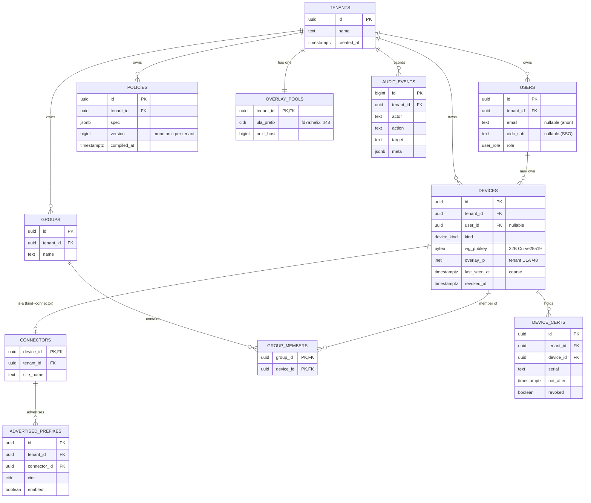
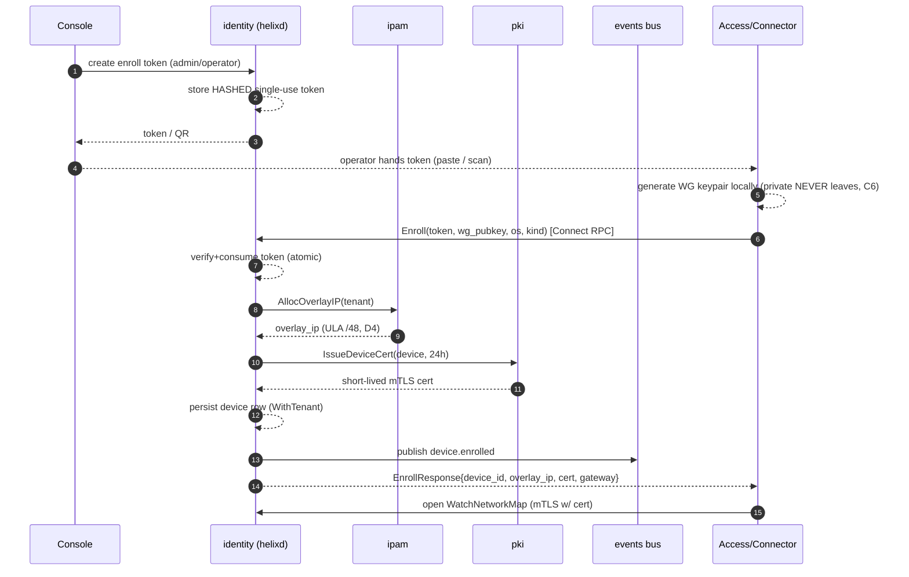
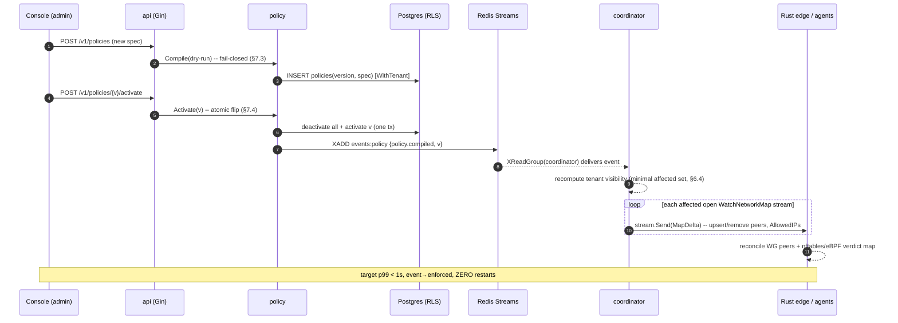

# Control Plane — Go modular monolith, data model, events, coordinator, API

**Revision:** 2
**Last modified:** 2026-07-04T12:00:00Z

**Rev 2 (enterprise-hardening pass, 2026-07-04):** (1) §2 now references the `outbox` table (full
DDL in `v03-control-plane/data-model-ddl.md` §2.12) — closes the reliable-event-publish gap
`reconciliation-flow.md` §3.6 flagged as `UNVERIFIED`; (2) added §11.4 zero-downtime deploy /
rolling-upgrade guidance tying the control plane's fail-static property (C1) to the Phase-2 K8s
rolling-update strategy; (3) added a protobuf versioning cross-reference — see
`v03-control-plane/protobuf-spec.md` §8 for the full compatibility policy (this document does not
duplicate it).

> Master technical specification — document 02 of the HelixVPN set.
> Scope: the **Go control plane** (`helix-go`) — the brain that holds identity, topology
> and policy truth, compiles ACLs, and pushes desired-state network maps to every edge.
> This is a SPEC (describe the implementation; do not build the product). Source evidence
> cited inline by id, e.g. [04_P1 §2], [04_ARCH §3], [02_QWN], [SYNTHESIS §4].

---

## 0. Position in the system & what this document owns

HelixVPN is a self-hostable overlay network with a privacy-VPN front end: three roles —
**Connector** (network-side outbound-only agent advertising CIDRs) ⇄ **Gateway** (public VPS:
control + data plane) ⇄ **Client** (Mullvad-style end-user app) [04_ARCH §1.1, 05_YBO,
SYNTHESIS §1]. This document specifies **only the control plane** — the Go services that
decide *who may reach what* and *which transport to use*, and stream that decision to edges.

It does **not** specify the Rust data plane (doc 01 — moves already-encrypted bytes), the
client UI (doc 05), or the platform tunnel shims (doc 06). The agent wire contract
(`Coordinator` protobuf) is *introduced* here because the control plane is its server, but
its byte-level evolution semantics belong to doc 03 (`WatchNetworkMap` contract); this
document gives the canonical `.proto` and the server-side handlers.

### 0.1 The governing constraints (every line below obeys these)

| # | Invariant | Source |
|---|---|---|
| C1 | **Go is never in the packet path.** The control plane computes and streams desired state; the Rust edge forwards bytes. If control is down, existing tunnels keep forwarding (fail-static). | [04_ARCH §2.1, SYNTHESIS §2] |
| C2 | **Postgres is the single source of truth** for identity/topology/policy; **Redis is ephemeral** (presence + event bus). Losing Redis loses no durable state. | [04_P1, SYNTHESIS §2] |
| C3 | **No-logging by construction.** The schema holds *no* connection/traffic/packet/flow table; a CI schema-lint fails the build if one appears. Only control actions are audited. | [04_ARCH §2.7/§7, 04_P1 §2, SYNTHESIS §7] |
| C4 | **Default-deny, need-to-know.** A peer is delivered to a node only if a compiled policy rule grants it; nodes never learn of peers they cannot reach. | [04_ARCH §3.4/§7, 04_P1 §3] |
| C5 | **Push, don't poll.** Desired state is event-driven (Tailscale `MapResponse`-style): snapshot then deltas over a long-lived stream; convergence p99 < 1 s. | [04_ARCH §2, 04_P1 §4/§10] |
| C6 | **Device private keys never leave the device.** The control plane registers only the 32-byte WG public key. | [04_P1 §6, SYNTHESIS §7] |
| C7 | **Package boundaries == future service boundaries.** A modular monolith whose Phase-2 split is mechanical, not a rewrite. | [04_P1 §1] |
| C8 | **Multi-tenant isolation enforced at the database** via Row-Level Security under a non-superuser role — not merely by `WHERE` clauses. | [04_P1 §2.2] |

### 0.2 Settled stack floor for this layer

**Go + Gin + PostgreSQL + Redis + Podman (rootless)** [05_YBO mandated, confirmed by all 10
analyses, SYNTHESIS §2]. Postgres = truth; Redis = presence + bus; Connect (buf) for agent
RPC; `sqlc` for compile-checked SQL; `goose`/`atlas` for migrations; rootless Podman per
constitution §11.4.161 + `vasic-digital/containers` submodule per §11.4.76 [SYNTHESIS §8].

---

## 1. Module architecture (the modular monolith)

One Go binary (`helixd`), many internal packages, deployed as one rootless container. Packages
talk through **interfaces + events**, never by importing each other's stores [04_P1 §1, C7].

### 1.1 Repository / package layout

```
helix-go/
├── cmd/
│   ├── helixd/              # control-plane binary — wires all modules
│   └── helixvpnctl/         # bootstrap + ops CLI (Cobra)
├── internal/
│   ├── identity/            # tenants, users, OIDC, anonymous device-enroll tokens
│   ├── registry/            # devices, connectors, advertised prefixes, presence
│   ├── ipam/                # overlay IP allocation (ULA /48 per tenant — D4)
│   ├── pki/                 # WG key registry, short-lived device certs, rotation/revoke
│   ├── policy/              # ACL model + pure, versioned compiler
│   ├── coordinator/         # in-mem topology graph, deltas, WatchNetworkMap streams
│   ├── events/              # bus abstraction (Redis Streams MVP → NATS JetStream P2)
│   ├── telemetry/           # Prometheus metrics + control-action audit sink
│   ├── api/                 # Gin REST (apps) + Connect (agents) + WS/SSE
│   └── store/               # Postgres pool, RLS tenant-tx helper, sqlc Queries, migrations
├── proto/                   # helix/agent/v1/*.proto → buf generate (Go/Dart/Rust)
├── openapi/                 # REST contract → generated Dart/TS app clients
└── migrations/              # goose SQL — the schema authority (CI-linted, §2.4)
```

### 1.2 Wiring rules (enforced, not aspirational)

- **R1 — no cross-store imports.** `coordinator` MUST NOT import `internal/store` directly for
  another module's tables; it reads `registry`/`policy`/`pki` through their exported
  interfaces (§1.3). A pre-build gate (`go list -deps` graph check) fails on a forbidden edge.
- **R2 — `coordinator` owns no durable tables.** Its only state is the in-memory per-tenant
  graph + open streams (a cache hydrated from Postgres + events). [04_P1 §4]
- **R3 — every state mutation emits an event.** A write to Postgres that changes topology/policy
  is followed (same logical unit of work) by an `events.Publish` — the bus is the only path by
  which `coordinator` learns of change (§5).
- **R4 — every DB access is tenant-scoped.** No query runs outside `store.WithTenant` (§2.3);
  a `golangci-lint` custom analyzer flags raw `db.Query` outside `store`.

### 1.3 Inter-module interface surface (Go signatures)

```go
// internal/registry/iface.go
type Registry interface {
    EnrollDevice(ctx context.Context, in EnrollInput) (Device, error)
    SetPrefixes(ctx context.Context, connectorID uuid.UUID, cidrs []netip.Prefix) ([]Conflict, error)
    DevicesForTenant(ctx context.Context, t uuid.UUID) ([]Device, error)
    MarkPresence(ctx context.Context, deviceID uuid.UUID, online bool, rttMS uint32) error
}

// internal/policy/iface.go — pure, deterministic, versioned (§7)
type Compiler interface {
    Compile(ctx context.Context, t uuid.UUID, spec Spec) (CompiledPolicy, error) // dry-run safe
    Activate(ctx context.Context, t uuid.UUID, version int64) error              // flips active
}
type CompiledPolicy struct {
    Version    int64
    VisibleTo  map[DeviceID]map[DeviceID]struct{}        // need-to-know peer set (C4)
    AllowedIPs map[DeviceID]map[DeviceID][]netip.Prefix  // coarse WG AllowedIPs
    Verdicts   map[DeviceID]map[DeviceID][]PortRule      // fine port-level edge verdicts
    ExitNodes  map[DeviceID]struct{}
}

// internal/pki/iface.go
type PKI interface {
    IssueDeviceCert(ctx context.Context, deviceID uuid.UUID, ttl time.Duration) (Cert, error)
    Revoke(ctx context.Context, deviceID uuid.UUID) error // < 1s propagation (C5)
}

// internal/events/iface.go — bus-agnostic (D3: Redis Streams now, NATS later)
type Bus interface {
    Publish(ctx context.Context, stream string, env Envelope) (string, error)
    Subscribe(ctx context.Context, group, consumer string, streams ...string) (<-chan Envelope, error)
    Ack(ctx context.Context, stream, group, id string) error
}
```

> **Decision D3 — event bus** [SYNTHESIS §3, 04_P1 §5]. **Recommendation: Redis Streams for
> the MVP, NATS JetStream for scale (Phase 2).** The `Bus` interface above is the seam: the
> envelope (§5.2) is bus-agnostic, so the swap is a transport change, not a rewrite. Camp B
> (NATS from day one [DSK, KMI]) buys multi-region fan-out earlier but adds an operational
> dependency the self-host-first MVP does not need yet — Redis is already mandated for presence
> [05_YBO], so MVP reuses it. We adopt Camp A (CLD) and keep `events.Bus` as the abstraction.

---

## 2. Data model — Postgres DDL with Row-Level Security

The durable store holds **identity, topology, and policy** — never connection/traffic logs
(C3). Eleven tenant-scoped tables + enums.

### 2.1 ER diagram



### 2.2 Core DDL

```sql
-- ============ tenancy & identity ============
CREATE TABLE tenants (
  id          uuid PRIMARY KEY DEFAULT gen_random_uuid(),
  name        text NOT NULL,
  created_at  timestamptz NOT NULL DEFAULT now()
);

CREATE TYPE user_role AS ENUM ('admin','operator','member');

CREATE TABLE users (
  id          uuid PRIMARY KEY DEFAULT gen_random_uuid(),
  tenant_id   uuid NOT NULL REFERENCES tenants(id) ON DELETE CASCADE,
  email       text,                       -- nullable: anonymous device-token users (C6 privacy)
  oidc_sub    text,                       -- nullable: when SSO is used
  role        user_role NOT NULL DEFAULT 'member',
  created_at  timestamptz NOT NULL DEFAULT now(),
  UNIQUE (tenant_id, email),
  UNIQUE (tenant_id, oidc_sub)
);

-- ============ devices (clients AND connectors) ============
CREATE TYPE device_kind AS ENUM ('client','connector');

CREATE TABLE devices (
  id            uuid PRIMARY KEY DEFAULT gen_random_uuid(),
  tenant_id     uuid NOT NULL REFERENCES tenants(id) ON DELETE CASCADE,
  user_id       uuid REFERENCES users(id) ON DELETE SET NULL,
  kind          device_kind NOT NULL,
  name          text NOT NULL,
  wg_pubkey     bytea NOT NULL,           -- 32-byte Curve25519 public key (C6: never the private)
  overlay_ip    inet NOT NULL,            -- allocated from tenant ULA /48 (D4)
  os            text,                     -- ios|android|linux|windows|macos|harmonyos|aurora
  enrolled_at   timestamptz NOT NULL DEFAULT now(),
  last_seen_at  timestamptz,              -- COARSE presence; refreshed from heartbeat, not per-packet (C3)
  revoked_at    timestamptz,
  UNIQUE (tenant_id, wg_pubkey),
  UNIQUE (tenant_id, overlay_ip)
);

CREATE TABLE connectors (
  device_id   uuid PRIMARY KEY REFERENCES devices(id) ON DELETE CASCADE,
  tenant_id   uuid NOT NULL REFERENCES tenants(id) ON DELETE CASCADE,
  site_name   text NOT NULL
);

CREATE TABLE advertised_prefixes (
  id            uuid PRIMARY KEY DEFAULT gen_random_uuid(),
  tenant_id     uuid NOT NULL REFERENCES tenants(id) ON DELETE CASCADE,
  connector_id  uuid NOT NULL REFERENCES connectors(device_id) ON DELETE CASCADE,
  cidr          cidr NOT NULL,
  enabled       boolean NOT NULL DEFAULT true,
  created_at    timestamptz NOT NULL DEFAULT now()
);
CREATE INDEX ON advertised_prefixes (tenant_id, connector_id);

-- ============ groups (for policy) ============
CREATE TABLE groups (
  id          uuid PRIMARY KEY DEFAULT gen_random_uuid(),
  tenant_id   uuid NOT NULL REFERENCES tenants(id) ON DELETE CASCADE,
  name        text NOT NULL,
  UNIQUE (tenant_id, name)
);
CREATE TABLE group_members (
  tenant_id   uuid NOT NULL REFERENCES tenants(id) ON DELETE CASCADE,
  group_id    uuid NOT NULL REFERENCES groups(id) ON DELETE CASCADE,
  device_id   uuid NOT NULL REFERENCES devices(id) ON DELETE CASCADE,
  PRIMARY KEY (group_id, device_id)
);

-- ============ policy (source + compiled marker) ============
CREATE TABLE policies (
  id           uuid PRIMARY KEY DEFAULT gen_random_uuid(),
  tenant_id    uuid NOT NULL REFERENCES tenants(id) ON DELETE CASCADE,
  spec         jsonb NOT NULL,            -- the declarative ACL document (§7)
  version      bigint NOT NULL,           -- monotonic per tenant
  active       boolean NOT NULL DEFAULT false,
  compiled_at  timestamptz,
  created_at   timestamptz NOT NULL DEFAULT now(),
  UNIQUE (tenant_id, version)
);
-- at most one active policy per tenant (instant rollback = re-activate an older version)
CREATE UNIQUE INDEX one_active_policy_per_tenant
  ON policies (tenant_id) WHERE active;

-- ============ overlay IPAM ============
CREATE TABLE overlay_pools (
  tenant_id   uuid PRIMARY KEY REFERENCES tenants(id) ON DELETE CASCADE,
  ula_prefix  cidr NOT NULL,              -- e.g. fd7a:helix:<rand>::/48 (D4 — §3.1)
  next_host   bigint NOT NULL DEFAULT 2   -- ::1 reserved for gateway
);

-- ============ PKI ============
CREATE TABLE device_certs (
  id           uuid PRIMARY KEY DEFAULT gen_random_uuid(),
  tenant_id    uuid NOT NULL REFERENCES tenants(id) ON DELETE CASCADE,
  device_id    uuid NOT NULL REFERENCES devices(id) ON DELETE CASCADE,
  serial       text NOT NULL,
  not_after    timestamptz NOT NULL,
  revoked      boolean NOT NULL DEFAULT false,
  created_at   timestamptz NOT NULL DEFAULT now()
);
CREATE INDEX ON device_certs (tenant_id, device_id) WHERE NOT revoked;

-- ============ audit (CONTROL actions only — never traffic, C3) ============
CREATE TABLE audit_events (
  id          bigint GENERATED ALWAYS AS IDENTITY PRIMARY KEY,
  tenant_id   uuid NOT NULL REFERENCES tenants(id) ON DELETE CASCADE,
  actor       text NOT NULL,             -- user id / "system"
  action      text NOT NULL,             -- e.g. "device.revoke","policy.activate"
  target      text,
  ts          timestamptz NOT NULL DEFAULT now(),
  meta        jsonb
);
CREATE INDEX ON audit_events (tenant_id, ts DESC);
```

**Reliable event publish — the `outbox` table.** Redis is not transactionally joined to Postgres,
so a naive "commit, then XADD" has a lost-event window if the process crashes between the two
(the write is durable; the coordinator never learns of it). The control plane closes this with a
**transactional outbox**: every R3 write stages its event envelope in an `outbox` row **inside**
the same `WithTenant` transaction as the domain mutation, and a background sweeper reliably drains
unpublished rows to the bus. Full DDL + sweeper contract: `v03-control-plane/data-model-ddl.md`
§2.12 (that document is the canonical owner of this table; this overview only summarizes it and
resolves `reconciliation-flow.md` §3.6's `UNVERIFIED` note that the outbox mechanism was designed
but not yet schema-specified anywhere).

**Design notes.**
- `devices` holds **both** clients and connectors (`kind`); `connectors` is a 1:1 detail table so
  a connector inherits all device machinery (enrollment, cert, revoke) [04_P1 §2]. The
  asymmetry (a connector advertises prefixes; a client does not) lives in `advertised_prefixes`.
- `group_members` carries `tenant_id` redundantly (vs. the source's two-column PK) **so RLS can be
  enforced on it directly** — a refinement over [04_P1 §2.1], which left the join table
  un-RLS'd. The composite PK `(group_id, device_id)` is preserved.
- `policies.active` + the partial unique index replace the source's implicit "newest is active";
  this makes **instant rollback** a single `UPDATE ... SET active=true WHERE version=$n` inside a
  tx that clears the prior active — see §7.4.
- **Absent by design (C3):** no `connections`, `sessions`, `flows`, `traffic`, `packets`,
  `netflow`, `bandwidth_samples`. Their absence is a *guarantee*, lint-enforced (§2.4).

### 2.3 Row-Level Security (tenant isolation at the database, C8)

Every tenant-scoped table gets the same policy. The app sets `app.tenant_id` per transaction;
Postgres enforces isolation even if a query forgets a `WHERE` [04_P1 §2.2].

```sql
-- applied to EVERY tenant-scoped table:
-- users, devices, connectors, advertised_prefixes, groups, group_members,
-- policies, overlay_pools, device_certs, audit_events
ALTER TABLE devices ENABLE ROW LEVEL SECURITY;
ALTER TABLE devices FORCE ROW LEVEL SECURITY;   -- applies even to the table owner
CREATE POLICY tenant_isolation ON devices
  USING       (tenant_id = current_setting('app.tenant_id')::uuid)
  WITH CHECK  (tenant_id = current_setting('app.tenant_id')::uuid);

-- the application connects as a NON-SUPERUSER, NON-OWNER role (superusers/owners bypass RLS):
CREATE ROLE helix_app NOLOGIN;
GRANT SELECT, INSERT, UPDATE, DELETE ON ALL TABLES IN SCHEMA public TO helix_app;
GRANT USAGE, SELECT ON ALL SEQUENCES IN SCHEMA public TO helix_app;
-- helixd authenticates as a LOGIN role that is a member of helix_app, never as the owner.
```

> `FORCE ROW LEVEL SECURITY` is the hardening refinement over the source: it closes the gap where
> the table owner (which migrations run as) silently bypasses RLS. `helixd` therefore MUST run as
> `helix_app` (or a member), never as the migration owner. This is asserted by a startup check that
> runs `SELECT rolsuper, rolbypassrls FROM pg_roles WHERE rolname = current_user` and aborts if
> either is true.

The tenant-scoped transaction helper — the **only** way `helixd` touches the DB (R4):

```go
// internal/store/tenant.go
//
// WithTenant runs fn inside a transaction whose RLS scope is pinned to tenantID.
// SET LOCAL is transaction-scoped, so it CANNOT leak across pooled connections.
func (s *Store) WithTenant(ctx context.Context, tenantID uuid.UUID,
    fn func(q *db.Queries) error) error {
    tx, err := s.pool.BeginTx(ctx, pgx.TxOptions{})
    if err != nil {
        return err
    }
    defer func() { _ = tx.Rollback(ctx) }() // no-op after a successful Commit

    // set_config(name, value, is_local=true) == SET LOCAL; transaction-scoped.
    if _, err := tx.Exec(ctx,
        "SELECT set_config('app.tenant_id', $1, true)", tenantID.String()); err != nil {
        return fmt.Errorf("pin tenant: %w", err)
    }
    if err := fn(db.New(tx)); err != nil {
        return err
    }
    return tx.Commit(ctx)
}
```

A handful of operations (tenant creation, cross-tenant ops) need an explicit `WithSystem`
helper that sets `app.tenant_id` to a sentinel and uses a separate `helix_sys` role with
narrowly-granted privileges — never a superuser. Migrations run as the schema owner
(`helix_owner`) out-of-band of request handling.

### 2.4 No-logging CI schema-lint (C3 enforced mechanically)

A pre-build gate parses `migrations/` and the live schema and **fails the build** if any table,
column, or view matches a forbidden traffic-logging shape [04_ARCH §7, 04_P1 §11.4, SYNTHESIS §7]:

```go
// tools/schemalint/main.go (run in pre-build; constitution §11.4.27/§1.1)
var forbiddenTables = regexp.MustCompile(
    `(?i)\b(connections?|sessions?|flows?|traffic|packets?|netflow|bandwidth_samples?|dns_queries?)\b`)
var forbiddenCols  = regexp.MustCompile(
    `(?i)\b(src_ip|dst_ip|dest_ip|src_port|dst_port|bytes_(in|out)|packet_count|payload|sni_host)\b`)
// Exception allowlist: overlay_ip + wg_pubkey on `devices` (identity, not traffic); cidr on
// advertised_prefixes (topology). The lint asserts these are the ONLY ip/port-shaped columns.
```

Paired §1.1 mutation: a test migration that adds a `connections(src_ip, dst_ip, bytes)` table
MUST make the lint FAIL; removing it MUST make it pass. The lint is the runtime signature
(§11.4.108) that proves C3 is live, not merely promised.

---

## 3. IPAM — overlay addressing & the subnet-collision decision (D4)

### 3.1 The problem and the decision

A single user joins **N** private RFC1918 networks (the HelixVPN differentiator [SYNTHESIS §1]).
Two joined home/lab LANs both numbering `192.168.1.0/24` collide — the client cannot tell which
`192.168.1.50` it means. Only three analyses actually solve this [SYNTHESIS §3 D4].

> **Decision D4 — IP-subnet collision.** **Recommendation: IPv6 ULA `/48` per tenant + Tailscale
> `4via6` mapping** (Camp A / CLD [04_ARCH §3.4]).
>
> - **Camp A — ULA /48 + 4via6:** allocate each tenant a random `fd7a:helix:<rand>::/48`
>   (`overlay_pools.ula_prefix`). Every device gets a stable overlay address from it
>   (`devices.overlay_ip`). Colliding IPv4 LANs are reached through a deterministic IPv6
>   encoding (`4via6`): `fd7a:helix:<rand>:<site-id>::/96` + the 32-bit IPv4 host → a unique
>   IPv6 the client can always disambiguate. The control plane assigns a per-connector
>   `site-id` and ships the `4via6` mapping inside the network map.
> - **Camp B — CGNAT `100.64.0.0/10`, 1:1 NAT per network** [GMI, KMI]: each joined network is
>   remapped 1:1 into a slice of the carrier-grade range at the connector; the client always
>   sees `100.x`. Simpler for IPv4-only clients but exhausts `/10` space at scale and needs
>   per-network NAT bookkeeping in the data path.
>
> **Why A:** it is collision-proof by construction (a /48 is astronomically unlikely to clash),
> needs no stateful NAT in the packet path (keeps the edge dumb, C1), and is the documented
> Mullvad/Tailscale precedent. **Trade-off honestly stated:** legacy IPv4-only apps inside a
> client cannot dial a raw `192.168.1.50` without a local resolver shim that rewrites to the
> `4via6` address — the client core ships exactly that shim (doc 01 routing layer). For Phase 1
> the lean path is: overlay addressing is IPv6-ULA; `4via6` for colliding LANs lands with
> multi-network policy in Phase 1, CGNAT remains the Phase-2 fallback for pure-IPv4 connectors.

### 3.2 Allocation algorithm (deterministic, gap-free, concurrency-safe)

```go
// internal/ipam/alloc.go
//
// AllocOverlayIP hands out the next host address from the tenant's ULA /48.
// Runs inside WithTenant; the UPDATE ... RETURNING is atomic so two concurrent
// enrollments never get the same address (the row lock serialises them).
func (a *IPAM) AllocOverlayIP(ctx context.Context, q *db.Queries, t uuid.UUID) (netip.Addr, error) {
    // SELECT ula_prefix, next_host FROM overlay_pools WHERE tenant_id=$1 FOR UPDATE;
    // UPDATE overlay_pools SET next_host = next_host + 1 WHERE tenant_id=$1 RETURNING next_host;
    pool, err := q.BumpOverlayNextHost(ctx, t)
    if err != nil {
        return netip.Addr{}, err
    }
    base := pool.UlaPrefix.Addr().As16()              // fd7a:helix:rrrr::
    host := uint64(pool.NextHost)                      // monotonic per tenant; ::1 = gateway
    // place the host id in the low 64 bits of the /48 (sites use bits [48..64))
    return embedHost(base, host), nil
}
```

`overlay_pools.next_host` is monotonic and never reused (a revoked device's address is *not*
recycled in Phase 1 — simpler and avoids stale-route hazards; a `/48` gives ~2^80 hosts, so
exhaustion is not a real concern). Site-IDs for `4via6` are allocated from a parallel
per-connector counter when a connector attaches.

---

## 4. Agent contract — protobuf (`Coordinator` over Connect)

The static `map.json` of Phase 0 becomes a streamed, versioned, delta-capable protobuf served
over **Connect** (works as gRPC, gRPC-Web, and the Connect protocol — one service serves native
agents over HTTP/2 and a future WASM Console over HTTP/1.1) [04_P1 §3]. The byte-level evolution
rules are doc 03; the canonical `.proto` is here.

```protobuf
// proto/helix/agent/v1/agent.proto
syntax = "proto3";
package helix.coordinator.v1;
option go_package = "github.com/vasic-digital/helix-go/gen/helix/agent/v1;agentv1";

service Coordinator {
  // One-time device enrollment (exchanges an enroll token for identity + cert).
  rpc Enroll(EnrollRequest) returns (EnrollResponse);

  // The spine of the system: open once, get a snapshot, then a delta stream (C5).
  rpc WatchNetworkMap(WatchRequest) returns (stream MapUpdate);

  // Connectors push their advertised prefixes (also settable via Console/API).
  rpc AdvertisePrefixes(AdvertiseRequest) returns (AdvertiseResponse);

  // Lightweight heartbeat / status (presence, current transport, rtt). NO traffic data (C3).
  rpc ReportStatus(StatusReport) returns (StatusAck);
}

message EnrollRequest {
  string     enroll_token = 1;   // issued by Console/identity, short-lived, single-use
  bytes      wg_pubkey    = 2;   // device-generated; private key never leaves device (C6)
  string     os           = 3;
  string     name         = 4;
  DeviceKind kind         = 5;
}
enum DeviceKind { DEVICE_KIND_UNSPECIFIED = 0; CLIENT = 1; CONNECTOR = 2; }

message EnrollResponse {
  string      device_id  = 1;
  string      overlay_ip = 2;    // allocated by IPAM, e.g. "fd7a:helix:1::2" (D4)
  bytes       device_cert = 3;   // short-lived mTLS cert for the control channel
  GatewayInfo gateway     = 4;
}

message WatchRequest {
  string device_id    = 1;
  uint64 known_version = 2;      // 0 => full snapshot; else => deltas since (cheap reconnect)
}

// Either a full snapshot or an incremental delta. Agents reconcile to it.
message MapUpdate {
  uint64 version = 1;
  oneof body {
    NetworkMap snapshot  = 2;
    MapDelta   delta     = 3;
    KeepAlive  keepalive = 4;    // periodic; proves liveness without state churn
  }
}

message NetworkMap {
  Node            self      = 1;
  GatewayInfo     gateway   = 2;
  repeated Peer   peers     = 3;  // peers this node MAY reach (already policy-filtered, C4)
  DnsConfig       dns       = 4;
  TransportPolicy transport = 5;
}

message Node { string device_id = 1; string overlay_ip = 2; }
message GatewayInfo {
  string endpoint   = 1;          // "gw.example:443"
  bytes  wg_pubkey  = 2;
  string masque_sni = 3;          // host to present for MASQUE/HTTP-3 masquerade (doc 01, D1)
}
message Peer {
  string          device_id     = 1;
  bytes           wg_pubkey      = 2;
  repeated string allowed_ips    = 3;  // compiled from policy: only what this node may reach (C4)
  string          endpoint       = 4;  // via gateway relay in MVP; direct candidates in P2
  bool            is_connector   = 5;
  repeated Via6Route via6        = 6;  // 4via6 mappings for colliding IPv4 LANs (D4)
}
message Via6Route { string ipv4_cidr = 1; string via6_prefix = 2; }
message DnsConfig { repeated string resolvers = 1; repeated string search = 2; }

message TransportPolicy {
  // ordered escalation ladder the client walks on handshake failure (doc 01 §Transport)
  repeated string order              = 1;  // ["plain-udp","lwo","masque-h3"]
  bool            allow_user_override = 2;
}

message MapDelta {
  repeated Peer   upsert_peers    = 1;
  repeated string remove_peer_ids = 2;
  TransportPolicy transport       = 3;  // present only if changed
  DnsConfig       dns             = 4;  // present only if changed
}

message AdvertiseRequest  { string device_id = 1; repeated string cidrs = 2; }
message AdvertiseResponse { bool accepted = 1; repeated string conflicts = 2; }

message StatusReport {
  string device_id = 1;
  string transport = 2;          // current transport in use (presence/health only)
  uint32 rtt_ms    = 3;
  // deliberately NO bytes/flows/destinations — presence + health only (C3)
}
message StatusAck {}
message KeepAlive {}
```

**Load-bearing properties** [04_P1 §3]: `known_version` makes reconnects cheap (resume from a
version, no full resync); the server sends **snapshot then deltas**; peers arrive
**already policy-filtered** so a client never learns of nodes it cannot reach (need-to-know, C4).
`buf generate` emits Go (server), Dart (client core), and Rust (edge/connector) stubs from this
one file — no hand-written clients, so the codebases cannot drift [04_ARCH §4.2].

---

## 5. Event backbone — Redis Streams contracts (D3)

Redis Streams is the MVP bus; the §1.3 `events.Bus` interface keeps the envelope bus-agnostic so
NATS JetStream is a Phase-2 transport swap [04_P1 §5, SYNTHESIS §3].

### 5.1 Streams & consumer groups

| Stream | Producers | Consumer groups |
|---|---|---|
| `events:devices`  | identity, registry | coordinator, telemetry, audit |
| `events:routes`   | registry           | coordinator, telemetry |
| `events:policy`   | policy             | coordinator, audit |
| `events:presence` | api (heartbeats)   | coordinator (TTL/online state) |
| `events:gateway`  | edge health probes | coordinator, telemetry |

### 5.2 Envelope (every event — bus-agnostic)

```json
{
  "id":        "<redis-stream-id>",
  "type":      "device.revoked",
  "tenant_id": "uuid",
  "ts":        "RFC3339",
  "actor":     "user-uuid|system",
  "payload":   { "...": "type-specific" },
  "trace_id":  "for correlation"
}
```

### 5.3 Event taxonomy (concrete)

| Type | Payload | Coordinator reaction |
|---|---|---|
| `device.enrolled`            | `{device_id, kind, overlay_ip}`  | add node; if policy grants, push to peers' maps |
| `device.online` / `.offline` | `{device_id}`                    | update presence; peers see relay availability |
| `device.revoked`             | `{device_id}`                    | remove node; push peer-removal delta to everyone who saw it; edge drops sessions |
| `connector.attached`         | `{device_id, site}`              | register connector + allocate site-id (D4) |
| `connector.prefixes.changed` | `{connector_id, cidrs[]}`        | recompute routes; push to nodes whose policy includes it |
| `route.conflict.detected`    | `{cidr, connector_ids[]}`        | flag overlapping-CIDR; surface in Console (§7.3) |
| `policy.updated`             | `{version}`                      | trigger compile (dry-run already done) |
| `policy.compiled`            | `{version}`                      | recompute tenant visibility; push deltas |
| `gateway.failover`           | `{from, to}`                     | re-point affected nodes' gateway endpoint |

### 5.4 Producer / consumer mechanics + DLQ

```go
// produce (registry/policy/etc. via events.Bus)
xid, _ := rdb.XAdd(ctx, &redis.XAddArgs{Stream: "events:policy", Values: env}).Result()

// consume — durable consumer group, at-least-once
res, _ := rdb.XReadGroup(ctx, &redis.XReadGroupArgs{
    Group:   "coordinator", Consumer: hostID,
    Streams: []string{"events:policy", ">"}, Count: 64, Block: 5 * time.Second,
}).Result()
// handle each, then XACK. Stuck/un-acked entries (a crashed consumer) are reclaimed by a
// background sweeper using XAUTOCLAIM — the dead-letter recovery path:
claimed, _, _ := rdb.XAutoClaim(ctx, &redis.XAutoClaimArgs{
    Stream: "events:policy", Group: "coordinator", Consumer: hostID,
    MinIdle: 30 * time.Second, Start: "0-0", Count: 64,
}).Result()
// After N delivery attempts (PEL entry's delivery count), route to events:policy:dlq and alert
// (telemetry counter helix_events_dlq_total) rather than spin forever.
```

At-least-once delivery + **idempotent reactions** (every delta is recomputed from current graph
state, so a replayed event is harmless) [04_P1 §5.4]. `XAUTOCLAIM` + a per-entry delivery-count
ceiling gives a real dead-letter path — replacing Phase 0's file-watch and any cron-restart loop.
This composes with constitution §11.4.147 (no-work-loss): a crashed coordinator's PEL entries are
reclaimed, never silently dropped.

---

## 6. The `coordinator` — building & streaming maps

The coordinator is the brain. It owns no durable tables (R2); it **reacts to events**, recomputes
affected maps, and pushes minimal deltas down open streams [04_P1 §4].

### 6.1 Responsibilities

1. Maintain an in-memory, per-tenant **topology graph** (devices, connectors, prefixes, groups,
   compiled policy), hydrated from Postgres on boot and kept fresh by events.
2. Hold the set of **open `WatchNetworkMap` streams** (one per connected agent).
3. On each relevant event: determine the **affected agents**, compute each one's **delta**, push
   it. Convergence target: **p99 < 1 s** from event to delta-on-wire (a measured SLO, §10).

### 6.2 Map computation (per node)

```
buildMap(node):
  reachable := policy.PeersVisibleTo(node)        # need-to-know filter (C4)
  peers := []
  for p in reachable:
     allowed := policy.AllowedIPs(node -> p)       # compiled CIDRs+ports
     via6    := policy.Via6Routes(node -> p)        # 4via6 for colliding IPv4 LANs (D4)
     peers.append(Peer{p.pubkey, allowed, relayEndpoint(p), p.isConnector, via6})
  return NetworkMap{self, gateway, peers, dns(node), transportPolicy(node)}
```

`relayEndpoint` in MVP always routes peer traffic **through the gateway** (hub-and-spoke); direct
P2P is a Phase-2 optimization [04_P1 §4.2]. This keeps the MVP data path identical to the proven
Phase 0 slice.

### 6.3 Streaming + delta loop (Go)

```go
// internal/coordinator/watch.go
func (c *Coordinator) WatchNetworkMap(ctx context.Context,
    req *connect.Request[agentv1.WatchRequest],
    stream *connect.ServerStream[agentv1.MapUpdate]) error {

    dev := authDevice(ctx)                       // from mTLS device cert (§8.2)
    if dev.Revoked {                             // belt-and-suspenders: revoked never streams
        return connect.NewError(connect.CodePermissionDenied, errRevoked)
    }
    sub := c.subscribe(dev.TenantID, dev.ID)     // registers stream + flips presence online
    defer sub.Close()                            // flips presence offline on disconnect

    // 1. snapshot (or resume from known_version — diff against the client's last seen)
    cur := c.version(dev.TenantID)
    if req.Msg.KnownVersion == 0 || req.Msg.KnownVersion > cur {
        if err := stream.Send(&agentv1.MapUpdate{Version: cur,
            Body: &agentv1.MapUpdate_Snapshot{Snapshot: c.buildMap(dev)}}); err != nil {
            return err
        }
    } else {
        for _, d := range c.deltasSince(dev, req.Msg.KnownVersion) { // catch-up deltas
            if err := stream.Send(deltaUpdate(d)); err != nil { return err }
        }
    }

    // 2. delta loop: events arrive on sub.C, keepalive on a ticker
    ka := time.NewTicker(20 * time.Second); defer ka.Stop()
    for {
        select {
        case <-ctx.Done():  return ctx.Err()
        case d := <-sub.C:  if err := stream.Send(deltaUpdate(d)); err != nil { return err }
        case <-ka.C:        if err := stream.Send(keepAlive()); err != nil { return err }
        }
    }
}
```

### 6.4 Fan-out: events → minimal affected set

The coordinator consumes the event streams (§5), updates its graph, then computes which open
streams are affected and enqueues a delta to each. A `policy.compiled` event recomputes
visibility for the whole tenant; a `connector.prefixes.changed` event touches only nodes whose
policy grants that connector. **Compute the minimal affected set — never broadcast a full resync
on a small change** [04_P1 §4.4]. Each device's per-stream send queue is bounded; a slow consumer
that fills its queue is dropped and forced to reconnect-with-snapshot (back-pressure, not memory
growth — the §10 24h-soak SLO).

---

## 7. Policy model & compiler

Tailscale-ACL-flavored, declarative, **default-deny, fail-closed** [04_P1 §7]. This is the
access-control brain that turns "1 user → N networks" into compiled per-node visibility.

### 7.1 Source document (stored in `policies.spec` jsonb)

```jsonc
{
  "groups": {
    "group:admins":      ["alice@corp", "bob@corp"],
    "group:contractors": ["carol@ext"]
  },
  "hosts": {
    "warehouse-cams": "10.10.0.0/24",      // served by connector A
    "office-lan":     "192.168.50.0/24"    // served by connector B
  },
  "acls": [
    { "action": "accept", "src": ["group:admins"],      "dst": ["*:*"] },
    { "action": "accept", "src": ["group:contractors"], "dst": ["warehouse-cams:554,80"] }
  ],
  "exitNodes": ["group:admins"]            // who may use the gateway as a full-tunnel exit
}
```

### 7.2 Compilation algorithm (pure, deterministic, versioned)

```
compile(tenant, spec) -> CompiledPolicy:
  resolve groups -> sets of device_ids (via users + group_members)
  resolve hosts  -> CIDRs (cross-check vs advertised_prefixes; emit route.conflict if ambiguous)
  for each device d:
     visible[d] = {}                        # peers d may reach (need-to-know, C4)
     for rule in acls where d in resolve(rule.src):
        for dst in rule.dst:
           targets = expand(dst)             # connector(s) serving the CIDR, peer devices, or exit
           for t in targets:
              visible[d] += t
              allowedIPs[d][t] += (dst.cidr)            # coarse WG AllowedIPs (CIDR only)
              verdicts[d][t]   += (dst.cidr, dst.ports) # fine port-level edge verdict map
  return { visible, allowedIPs, verdicts, exitNodes }
```

- Two compiled artifacts, because **WG `AllowedIPs` is CIDR-only, not port-aware** [04_P1 §7.2]:
  (1) coarse per-peer `AllowedIPs` on the data path; (2) a fine **port-level verdict map**
  enforced at the edge via nftables/eBPF (doc 01 §routing). Output is exactly what
  `coordinator.buildMap` consumes.
- **Pure + versioned:** same spec ⇒ same output (a property test asserts determinism). Bump
  `policies.version`, emit `policy.compiled`, coordinator diffs and pushes.

### 7.3 Validation (fail-closed)

`policy.update` runs the compiler **dry-run first** and rejects on: unknown group/host; a `dst`
CIDR not covered by any `advertised_prefixes` row; a rule that would grant a *revoked* device; or
an `exitNodes` entry resolving to a connector (connectors are not exits). Only a clean dry-run
inserts the new `policies` row [04_P1 §7.3]. A `route.conflict.detected` (two connectors
advertising overlapping CIDRs) does not block compile but surfaces in the Console and is resolved
by `4via6` site disambiguation (D4) or operator choice.

### 7.4 Activation & instant rollback

```go
// internal/policy/activate.go — atomic flip; prior version stays compiled for instant rollback
func (p *PolicyService) Activate(ctx context.Context, t uuid.UUID, version int64) error {
    return p.store.WithTenant(ctx, t, func(q *db.Queries) error {
        if err := q.DeactivateAllPolicies(ctx, t); err != nil { return err }        // active=false
        if err := q.ActivatePolicyVersion(ctx, db.ActivateParams{t, version}); err != nil {
            return err                                                              // active=true, sets compiled_at
        }
        // R3: emit on the bus so the coordinator recomputes + pushes
        _, err := p.bus.Publish(ctx, "events:policy",
            events.New("policy.compiled", t, "system", map[string]any{"version": version}))
        return err
    })
}
```

The partial unique index `one_active_policy_per_tenant` (§2.2) guarantees the flip is atomic. A
bad policy is rolled back by `Activate(t, olderVersion)` — instant, no recompile, because every
version's compiled artifact is reproducible from its `spec`.

---

## 8. API surface (Gin REST + Connect + WS/SSE) & authz

One multiplexed HTTP server [04_P1 §8].

| Audience | Protocol | Examples |
|---|---|---|
| Apps (Access / Connector / Console) | **REST via Gin** | `POST /v1/enroll-tokens`, `GET /v1/devices`, `POST /v1/policies`, `POST /v1/policies/{v}/activate`, `GET /v1/networks` |
| Live UI | **WebSocket / SSE** | `GET /v1/stream` → `device.online`, `route.changed`, `handshake.failing` |
| Agents | **Connect/gRPC** | `Coordinator.WatchNetworkMap`, `.Enroll`, `.AdvertisePrefixes`, `.ReportStatus` |

- **One server, multiplexed:** Gin serves REST/WS; Connect handlers mount alongside on the same
  listener (Connect speaks HTTP/2 for native agents, downgrades to HTTP/1.1 for browsers — so a
  future WASM Console calls the same `Coordinator` service) [04_P1 §8].
- **Contracts generated:** OpenAPI → Dart/TS app clients; `buf generate` → Go/Dart/Rust agent
  stubs. No hand-written clients [04_ARCH §4.2].

### 8.1 REST authz (RBAC + RLS backstop)

REST uses OIDC session **or** API token, then RBAC (`admin` > `operator` > `member`); RLS is the
database-level backstop (C8). Gin middleware chain:

```go
// internal/api/middleware.go
r.Use(authn())        // validate OIDC/session/API-token → sets ctx user + tenant
r.Use(rbac())         // role gate per route group
r.POST("/v1/policies", requireRole("admin","operator"), h.CreatePolicy)
r.POST("/v1/devices/:id/revoke", requireRole("admin"), h.RevokeDevice)
r.GET ("/v1/devices", requireRole("admin","operator","member"), h.ListDevices)

// every handler runs its DB work through WithTenant(ctx.TenantID, ...): RLS is the floor even
// if rbac() is misconfigured — defense in depth.
```

| Route group | admin | operator | member |
|---|---|---|---|
| policies (create/activate) | ✓ | ✓ | ✗ |
| devices (revoke) | ✓ | ✗ | ✗ |
| devices/networks (read) | ✓ | ✓ | ✓ |
| enroll-tokens (mint) | ✓ | ✓ | ✗ |

### 8.2 Agent authz (device mTLS)

Agent RPCs (`WatchNetworkMap`/`AdvertisePrefixes`/`ReportStatus`) authenticate with the
short-lived **device mTLS cert** issued at enrollment (§9). `Enroll` is the only unauthenticated
RPC — it instead validates a single-use, hashed **enroll token**. `authDevice(ctx)` resolves the
cert serial → `device_certs` row → `devices` row, and rejects if revoked or expired. A revoked
device's open stream is force-closed within the convergence SLO (§9.3).

---

## 9. Identity, enrollment & PKI

### 9.1 Two identity modes (both MVP) [04_P1 §6.1]

- **Managed (OIDC):** tenant admins log into the Console via any OIDC IdP (Keycloak/Authentik);
  users belong to a tenant, devices to users.
- **Anonymous (privacy mode):** a tenant mints **device enroll tokens** with no email/SSO — the
  Mullvad "account number, no PII" posture (C6). The device gets identity + cert with zero
  personal data stored (`users.email`/`oidc_sub` stay NULL).

### 9.2 Enrollment flow (the device never surrenders its private key, C6)



### 9.3 PKI specifics [04_P1 §6.3]

- **WG keys:** device-generated; only the **public** key is registered. The control plane never
  sees a private key (C6).
- **Control-channel mTLS:** `pki` issues a short-lived (≈24 h) device cert; the agent uses it to
  authenticate the RPC channel and auto-renews over the existing channel before expiry.
- **Revoke (< 1 s):** `device.revoked` (a) removes the device's WG peer from every relevant map
  (delta push), (b) is enforced at the edge (kernel WG peer removed), (c) marks the cert revoked.
  Revocation latency target == convergence SLO (§10).
- **Root / KMS:** the tenant CA key is the one true secret; back it up (KMS or offline). It and
  Postgres are the only stateful things to protect (architecture §10). Credentials handled per
  constitution §11.4.10 (never git-tracked, never logged).

---

## 10. End-to-end reconciliation (the < 1 s promise) & SLOs

### 10.1 Policy-apply reconciliation sequence



This turns the architecture promise ("policy change reflected on all affected edges in < 1 s, no
restarts" [04_ARCH]) into a concrete, measurable behavior — the event-driven, authorized
descendant of Phase 0's G6 file-delta reconcile [04_P1 §9].

### 10.2 Measured SLOs (the anti-bluff acceptance numbers) [04_P1 §10]

| Metric | Target | How measured |
|---|---|---|
| event → delta-on-wire | **p99 < 1 s** | coordinator histogram `helix_reconcile_seconds` from event-receive to `stream.Send` |
| device revoke → edge enforced | **< 1 s** | revoke-to-WG-peer-removed timer on the edge |
| coordinator memory @ 10k streams | bounded, no leak over 24 h soak | `process_resident_memory_bytes` slope ≈ 0 |
| enrollment round-trip | < 500 ms | API histogram |
| policy compile (1k devices) | < 200 ms | compiler benchmark |

### 10.3 Test strategy (per constitution §11.4.27 / §11.4.5 / §1.1)

- **Unit:** policy compiler determinism (same spec ⇒ byte-identical `CompiledPolicy`); IPAM
  no-double-alloc under concurrency.
- **Store:** RLS tests — assert tenant A literally cannot read tenant B's rows even with a crafted
  query and `FORCE ROW LEVEL SECURITY` on, running as `helix_app` [04_P1 §10].
- **Integration:** spin Postgres + Redis on-demand via the `vasic-digital/containers` submodule
  (§11.4.76 — *not* ad-hoc `docker run`); drive enroll → advertise → policy → `WatchNetworkMap`,
  assert the delta stream content and the < 1 s SLO with captured evidence (§11.4.69/§11.4.107).
- **Soak:** N simulated agents holding streams; flap policies; assert convergence SLO and zero
  coordinator memory growth over 24 h.
- **Schema-lint meta-test:** the §2.4 §1.1 mutation (add a `connections` table → lint FAILs).

---

## 11. Container & deployment manifests (rootless Podman, §11.4.161/§11.4.76)

The control plane deploys as rootless Podman quadlets [SYNTHESIS §2/§8]. Manifests illustrate the
runtime shape; `helixvpnctl bootstrap` renders them.

### 11.1 Podman quadlet (the MVP deploy unit)

```ini
# deploy/quadlet/helixd.container  (rootless; read-only rootfs; NET no extra caps)
[Unit]
Description=HelixVPN control plane
After=helix-postgres.service helix-redis.service
Requires=helix-postgres.service helix-redis.service

[Container]
Image=ghcr.io/vasic-digital/helixd:helixvpn-0.1.0   # §11.4.151 release-prefixed tag
# helixd connects to Postgres as the NON-superuser, NON-owner role so RLS is enforced (C8):
Environment=HELIX_DB_URL=postgres://helix_app_login@helix-postgres/helix?sslmode=verify-full
Environment=HELIX_REDIS_URL=redis://helix-redis:6379/0
PublishPort=443:8443
ReadOnly=true
NoNewPrivileges=true
DropCapability=ALL
Volume=helix-ca:/var/lib/helix/ca:Z          # tenant CA key (KMS-backed in prod)

[Service]
Restart=always

[Install]
WantedBy=default.target
```

### 11.2 Docker Compose (developer-loop equivalent)

```yaml
# deploy/compose/dev.yml — local dev only; prod is rootless Podman quadlets above
services:
  postgres:
    image: postgres:16
    environment:
      POSTGRES_DB: helix
      # migrations run as owner; helixd connects as helix_app_login (RLS-enforced)
    command: ["postgres", "-c", "row_security=on"]
  redis:
    image: redis:7
  helixd:
    build: ../../helix-go
    depends_on: [postgres, redis]
    environment:
      HELIX_DB_URL:    postgres://helix_app_login@postgres/helix?sslmode=disable
      HELIX_REDIS_URL: redis://redis:6379/0
    ports: ["8443:8443"]
```

### 11.3 Kubernetes (Phase-2 HA shape — stateless coordinators)

```yaml
# deploy/k8s/helixd-deployment.yaml — Phase 2: coordinators are stateless (graph rebuilt from PG
# on boot + events), so they scale horizontally; Patroni-managed PG + NATS JetStream replace
# single PG + Redis. Shown to prove the Phase-1 seams permit it without reshaping. [04_P2]
apiVersion: apps/v1
kind: Deployment
metadata: { name: helixd }
spec:
  replicas: 3
  selector: { matchLabels: { app: helixd } }
  template:
    metadata: { labels: { app: helixd } }
    spec:
      containers:
        - name: helixd
          image: ghcr.io/vasic-digital/helixd:helixvpn-0.2.0
          securityContext: { runAsNonRoot: true, readOnlyRootFilesystem: true,
                             allowPrivilegeEscalation: false, capabilities: { drop: ["ALL"] } }
          env:
            - { name: HELIX_DB_URL,  valueFrom: { secretKeyRef: { name: helix-db,  key: url } } }
            - { name: HELIX_BUS_URL, valueFrom: { secretKeyRef: { name: helix-bus, key: url } } }
          ports: [ { containerPort: 8443 } ]
```

### 11.4 Zero-downtime deploy & rolling upgrade (the control-plane half of "no downtime")

The control plane's fail-static property (C1 — "if control is down, existing tunnels keep
forwarding") is the reason a control-plane restart is *inherently* lower-stakes than a data-plane
restart, but it is not license to drop in-flight `WatchNetworkMap` streams carelessly — a clean
rollout still matters for convergence latency and Console UX.

- **Single-node (Podman quadlet, Phase 1).** `Restart=always` (§11.1) restarts `helixd` in place
  on upgrade. `App.Run`'s graceful shutdown (`internal/app/run.go` §6.5 of
  `v03-control-plane/architecture-and-wiring.md`) drains in-flight HTTP requests, closes open
  `WatchNetworkMap`/`/v1/stream` connections cleanly (agents observe a clean stream-close, not a
  reset, and reconnect with `known_version` — doc 03 §3.3 — so the reconnect is a cheap delta
  catch-up, not a full resync) before the process exits. There **is** a downtime window on
  single-node (the new container is not up until the old one exits) — this is the honestly-stated
  Phase-1 posture: single-node self-host trades a short control-plane blip (existing tunnels keep
  forwarding, C1) for deploy simplicity. Zero-downtime *control-plane* upgrades are a Phase-2
  multi-replica property (below).
- **Multi-replica (K8s, Phase 2, `v06-deploy/kubernetes.md`).** `helixd` is stateless-on-restart
  (R2 — the coordinator graph rebuilds from Postgres + events on boot; no durable table it owns),
  so a standard Kubernetes `RollingUpdate` strategy (`maxUnavailable: 0, maxSurge: 1`, a `readyz`
  gate per §4.7 so a new pod is not routed to until Postgres+Redis are reachable, and a
  `preStop` hook that triggers the same graceful-shutdown drain as the quadlet path) achieves
  genuine zero-downtime: old replicas keep serving `WatchNetworkMap` streams while new replicas
  come up, and the LB/Service stops routing new connections to a replica once its `preStop` hook
  fires. An agent whose specific replica is cycled sees a clean close + `known_version` reconnect
  to a (possibly different) surviving replica — this is why the graph being rebuilt-from-events
  (not replica-sticky) is load-bearing for zero-downtime, not just for horizontal scaling.
- **Database migrations during a rollout.** Per `v03-control-plane/data-model-ddl.md` §8.4
  (expand-contract), a migration that ships alongside a binary upgrade MUST be additive-only for
  that release (new nullable/defaulted columns, new tables) so the OLD and NEW binary can both run
  against the migrated schema during the rollout window; destructive changes (column/table drops,
  renames) land in a LATER release after every replica confirms running the new binary.

---

## 12. Helix-ecosystem & constitution wiring (this layer)

| Submodule / clause | Use in the control plane |
|---|---|
| `vasic-digital/containers` (§11.4.76/§11.4.161) | sole container orchestration: deploy quadlets + boot Postgres/Redis on-demand for integration tests — no ad-hoc `docker`/`podman` [SYNTHESIS §8] |
| `helix_qa` + `challenges` (§11.4.27/§11.4.5/.69/.107) | anti-bluff QA: the §10.3 integration/soak suites + a Challenge that drives enroll→policy→delta and asserts the < 1 s SLO with captured evidence |
| `docs_chain` (§11.4.106) | mechanizes this spec's HTML/PDF/DOCX export + workable-items (phases→tasks become items) sync |
| `security` (§7) | reviews RLS/mTLS/CA-key handling; pairs with the §2.4 schema-lint |
| §11.4.93/.95 | each Phase-1 task/subtask below becomes a git-tracked workable-items DB row |
| §11.4.151/.155 | release-prefixed image/tag (`helixvpn-0.1.0`) + recording prefixes for QA evidence |
| §11.4.156 | NO active CI — gates run locally (pre-build + meta-test) |

---

## 13. Phase → task → subtask plan (control plane, Phase 1)

Derived from [04_P1] and the §0.1 invariants. Each leaf is a workable item (§11.4.93). Ordering is
risk-descending (§11.4.132): RLS + no-log lint first (they are the irreversible correctness floor).

- **CP-T1 — store + schema + RLS (the truth floor).**
  - CP-T1.1 `migrations/` goose DDL (§2.2) + enums; `helix_app`/`helix_owner`/`helix_sys` roles.
  - CP-T1.2 `FORCE ROW LEVEL SECURITY` + `tenant_isolation` on all 10 tenant tables; startup
    `rolsuper/rolbypassrls` abort check.
  - CP-T1.3 `store.WithTenant` / `WithSystem`; `sqlc` `Queries`; RLS cross-tenant denial test.
  - CP-T1.4 `tools/schemalint` (§2.4) + paired §1.1 mutation (add `connections` → FAIL).
- **CP-T2 — proto + Connect server skeleton.**
  - CP-T2.1 `proto/helix/agent/v1/agent.proto` (§4) + `buf generate` (Go/Dart/Rust).
  - CP-T2.2 Connect handlers mounted on the Gin listener; `authDevice` mTLS resolver (§8.2).
- **CP-T3 — identity + enrollment + PKI.**
  - CP-T3.1 OIDC + anonymous enroll-token mint/store-hashed/consume-atomic (§9.1).
  - CP-T3.2 `Enroll` RPC: verify token → IPAM alloc → device-cert issue → persist → emit
    `device.enrolled` (§9.2).
  - CP-T3.3 device-cert rotation + revoke (< 1 s edge enforcement, §9.3).
- **CP-T4 — ipam (D4).**
  - CP-T4.1 `overlay_pools` ULA `/48` provisioning on tenant create; `AllocOverlayIP` (§3.2).
  - CP-T4.2 per-connector site-id + `4via6` route emission for colliding IPv4 LANs.
- **CP-T5 — events bus (D3).**
  - CP-T5.1 `events.Bus` Redis Streams impl: `XADD`/`XReadGroup`/`XACK` + envelope (§5.2).
  - CP-T5.2 `XAUTOCLAIM` DLQ sweeper + `helix_events_dlq_total` (§5.4).
- **CP-T6 — policy compiler.**
  - CP-T6.1 spec parser + group/host resolution + advertised-prefix cross-check (§7.2).
  - CP-T6.2 two-artifact compile (`AllowedIPs` + port verdict map) + determinism property test.
  - CP-T6.3 dry-run fail-closed validation (§7.3) + atomic activate/rollback (§7.4).
- **CP-T7 — coordinator.**
  - CP-T7.1 in-mem per-tenant graph hydrate-on-boot + event apply (§6.1).
  - CP-T7.2 `WatchNetworkMap` stream loop: snapshot/resume/delta/keepalive + bounded send queue
    (§6.3).
  - CP-T7.3 minimal-affected-set fan-out (§6.4) + `helix_reconcile_seconds` histogram.
- **CP-T8 — api (REST + WS/SSE) + authz.**
  - CP-T8.1 Gin REST routes + OpenAPI gen; RBAC middleware (§8.1).
  - CP-T8.2 `GET /v1/stream` WS/SSE live-event fan-out to the Console.
- **CP-T9 — helixvpnctl + deploy.**
  - CP-T9.1 Cobra `bootstrap`/`migrate`/`tenant`/`enroll-token` ops.
  - CP-T9.2 quadlet rendering (§11.1) + on-demand-infra integration harness via `containers`.
- **CP-T10 — SLO + QA gates.** §10.2 histograms wired; §10.3 integration + 24 h soak + Challenge;
  the 8-criterion MVP DoD asserted end-to-end [04_P1 §11].

### 13.1 MVP definition-of-done the control plane must satisfy [04_P1 §11, SYNTHESIS §4]

Self-host from zero; enroll connector + client; reach an authorized LAN host **and deny an
unauthorized one**; auto-escalate transport when WG is blocked (coordinator ships the
`TransportPolicy` ladder; the escalation itself is doc 01); **policy edit reflected < 1 s, no
restart**; **revoke < 1 s**; kill-switch + DNS-leak (client side, gated by core state the map
drives); **no durable connection log exists** (§2.4 lint green); the three apps drive it all via
generated clients.

---

## 14. Phase-2 forward seams (why this is additive, not a rewrite) [04_P1 §12]

The MVP interfaces extend without reshaping: `TransportPolicy.order` gains
`shadowsocks`/`udp-over-tcp`/`daita`; `Peer.endpoint` gains direct-P2P NAT-traversal candidates
so traffic stops always relaying through the gateway; `coordinator` federates across regional
instances over **NATS JetStream** (the `events.Bus` swap, D3); `pki` adds the PQ pre-shared layer;
the Connect service gains multi-hop path fields; and HarmonyOS/Aurora app shims slot under the
unchanged Flutter UI + Rust core. Phase 2 is additive because Phase 1 drew the seams in the right
places (R1–R4, the `Bus`/`Compiler`/`PKI`/`Registry` interfaces).

---

### Sources

[04_P1] HelixVPN-Phase1-MVP.md (control-plane architecture, DDL, RLS, proto, coordinator, events,
policy, API) · [04_ARCH] HelixVPN-Architecture-Refined.md (control/data separation, ULA /48 + 4via6,
no-logging, default-deny) · [04_P0] HelixVPN-Phase0-Spike.md (G6 file-delta reconcile ancestor) ·
[04_P2] HelixVPN-Phase2-Parity.md (NATS, HA, multi-region seams) · [05_YBO] (Go+Gin+PG+Redis+Podman
mandate) · [02_QWN], [DSK], [GMI], [KMI], [MST] (D3/D4 divergence camps) · [SYNTHESIS] §§1–9
(stack floor, key decisions, ecosystem wiring, constitution bindings).
