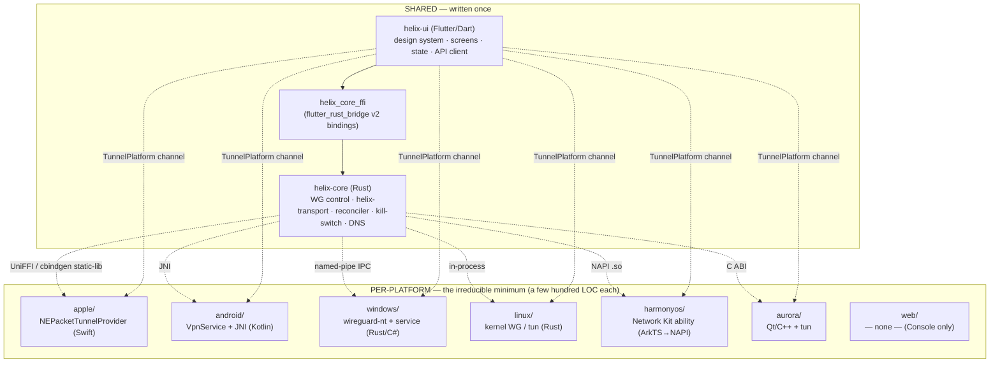
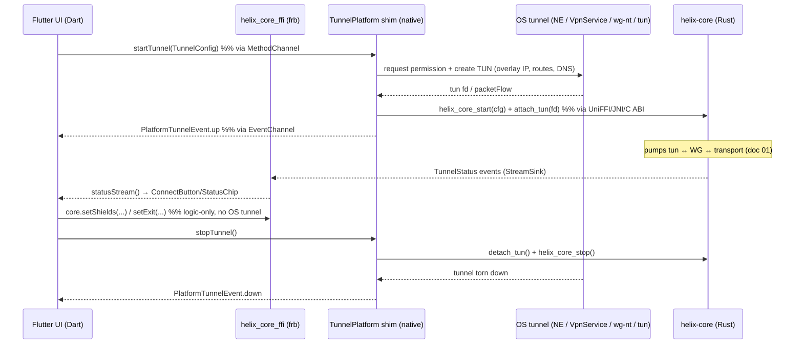

# Clients — helix-core FFI, Flutter helix-ui, per-platform shims

**Revision:** 1
**Last modified:** 2026-06-25T00:00:00Z

> Master technical specification — document **03** of the HelixVPN set under
> `docs/research/mvp/final/`. Scope: the **client stack** — the Rust `helix-core`
> FFI surface consumed by the apps, the Flutter `helix-ui` codebase (design
> system + state + three flavors), and the **per-platform `TunnelPlatform`
> shims** (the only platform-specific code). This is a SPEC: it describes *what
> to build and why*, to phase → task → subtask and near-code granularity. It
> does **not** build the product (two-to-three refinement passes follow).
>
> **Boundary with sibling docs.** This document **consumes** the data-plane
> contract owned by doc `01` (the `Transport` trait, `helix-wg`, the
> orchestrator, the `TunnelStatus` event stream) and the control-plane / proto
> contract owned by doc `02` (REST/WS, `WatchNetworkMap`, enrollment). It
> **owns** everything from the FFI surface upward: how Dart drives the core, how
> every pixel is shared across 3 apps × 8 platforms, and how each OS's tunnel
> lifecycle is isolated behind one channel contract. The Rust *internals* of
> `helix-core` are doc `01`'s; this doc owns only its *exported* surface.
>
> **Evidence base.** Citations inline by id: `[04_ARCH §N]` =
> `04_VPN_CLD/HelixVPN-Architecture-Refined.md`; `[04_UI]` =
> `04_VPN_CLD/HelixVPN-helix-ui-Flutter.md`; `[04_P0]` = `…Phase0-Spike.md`;
> `[04_P1]` = `…Phase1-MVP.md`; `[04_P2]` = `…Phase2-Parity.md`; `[05_YBO]` =
> operator mandate; per-LLM analyses `[02_QWN] [07_GMI] [10_KMI] [11_MST]` etc.;
> `[SYN]` = cross-document synthesis.

---

## Table of contents

- [0. Position in the system & what this document owns](#0-position-in-the-system--what-this-document-owns)
- [1. The shared-codebase strategy: two cores, thin shims](#1-the-shared-codebase-strategy-two-cores-thin-shims)
- [2. melos monorepo layout (`helix-ui/`)](#2-melos-monorepo-layout-helix-ui)
- [3. The FFI surface — Dart ⇄ `helix-core`](#3-the-ffi-surface--dart--helix-core)
- [4. The `TunnelPlatform` shim contract (the only platform-specific code)](#4-the-tunnelplatform-shim-contract-the-only-platform-specific-code)
- [5. Per-platform shim implementations](#5-per-platform-shim-implementations)
- [6. Three flavors from one tree (capability gating)](#6-three-flavors-from-one-tree-capability-gating)
- [7. `helix_design` — the design system](#7-helix_design--the-design-system)
- [8. Riverpod data layer](#8-riverpod-data-layer)
- [9. Why Flutter for 8 platforms (and not the alternatives)](#9-why-flutter-for-8-platforms-and-not-the-alternatives)
- [10. Size / memory / performance budgets](#10-size--memory--performance-budgets)
- [11. Build, codegen, signing, CI](#11-build-codegen-signing-ci)
- [12. Testing strategy + anti-bluff evidence](#12-testing-strategy--anti-bluff-evidence)
- [13. Phase → task → subtask plan](#13-phase--task--subtask-plan)
- [14. Open decisions surfaced by this document](#14-open-decisions-surfaced-by-this-document)
- [15. Cross-document contracts this document fixes](#15-cross-document-contracts-this-document-fixes)
- [Sources verified](#sources-verified)

---

## 0. Position in the system & what this document owns

HelixVPN ships **three first-party app classes** — **Helix Access** (end user),
**Helix Connector** (network operator), **Helix Console** (admin) — across
**eight platforms** (iOS, Android, macOS, Windows, Linux, Web, HarmonyOS NEXT,
Aurora OS), all from **one Flutter codebase** sitting on **one Rust core**
[04_ARCH §5, 04_UI §0, 05_YBO]. The discipline of the whole client stack:

> *One widget tree, three flavors, eight targets — and the only per-platform
> code is the thin tunnel shim.* [04_UI §0]

This document owns four contracts and nothing else:

| # | Contract | Owned here | Consumed from |
|---|---|---|---|
| C1 | **FFI surface** — the exact Dart-facing API of `helix-core` (start/stop/status_stream/exits/shields/advertise) and the **mirrored `TunnelStatus` enum** | §3 | `helix-core` internals → doc `01` |
| C2 | **`TunnelPlatform` shim contract** — the single MethodChannel+EventChannel every OS implements | §4–5 | OS tunnel APIs (NE, VpnService, …) |
| C3 | **Flavor + capability model** — `runHelixApp(flavor, home, capabilities)`; what compiles into Access vs Connector vs Console | §6 | — |
| C4 | **`helix_design` + Riverpod data layer** — tokens, signature components, the "UI is a pure function of the status stream" rule | §7–8 | `helix_api` (REST/WS) → doc `02` |

The load-bearing invariant that justifies the entire split [04_ARCH §5.1,
04_UI §10, SYN §5]:

> **A VPN client is two programs fused: a bounded-memory data-plane core (crypto,
> packet I/O, obfuscation — line-rate, must NOT be Dart, must NOT be reimplemented
> per platform) and a UI/orchestration layer (screens, settings, picker — benefits
> from one cross-platform toolkit).** Hence **Rust core + Flutter UI**, never one
> framework doing everything.

### 0.1 Non-negotiable client invariants

| # | Invariant | Source |
|---|---|---|
| CI1 | `helix_core_ffi` owns *logic and status*; it does **NOT** own the OS tunnel lifecycle — that is the platform shim, because on most platforms the tunnel runs in a separate OS-managed process/extension. | [04_UI §5] |
| CI2 | **The UI is a pure function of the core's status stream.** No polling; the `ConnectButton` reflects a stream the Rust core pushes. | [04_UI §4.2] |
| CI3 | **Console builds to Web; Access/Connector do not need to** — browsers cannot open a TUN. Console depends on `helix_api` *only* (no `helix_core_ffi`). | [04_ARCH §5.7, 04_UI §1] |
| CI4 | **iOS Network Extension memory ceiling (historically ~15 MB working set) is the hardest constraint** and the single strongest reason the core is Rust not Go. Every platform/transport decision defers to it. | [04_ARCH §5.6/§5.7, 04_P0 §6] |
| CI5 | **State must be announced, not just colored** — never rely on color alone for protected/unprotected (accessibility + safety). | [04_UI §9] |
| CI6 | **Never Electron, never webview-wrapped** for native targets. Flutter AOT + Rust core is the *only* way the size/speed targets are reachable on 8 platforms at once. | [04_UI §10, 04_ARCH §5.6] |

---

## 1. The shared-codebase strategy: two cores, thin shims



**Three reuse pillars** [04_ARCH §5.5, SYN §6]:

1. **Rust core** (`helix-core`) — data plane shared by **client + connector +
   gateway edge** (same crate, three consumers — doc `01` I4).
2. **Flutter UI** (`helix-ui`) — every screen shared by **all three apps**.
3. **Schema-generated clients** (`helix-proto`) — Dart/Go/Rust clients generated
   from one schema so the codebases never drift (doc `02`).

The reuse map [04_ARCH §5.5]:

```
helix-core (Rust)        ─┬─► Helix Access (client mode)
  ├ helix-transport       ├─► Helix Connector (advertise/route mode)
  ├ helix-wg control      └─► Gateway edge (server mode)     ← SAME crate, 3 consumers
  └ reconciler

helix-ui (Flutter/Dart)  ─┬─► Helix Access
  ├ helix_design          ├─► Helix Connector (config UI)
  ├ helix_api (generated) └─► Helix Console (web + desktop)
  └ helix_domain (state)

helix-proto (schemas)    ──► generates Dart + Go + Rust clients (no drift)
```

---

## 2. melos monorepo layout (`helix-ui/`)

The Flutter codebase is a `melos`-managed multi-package workspace
[04_UI §1/§11]. Decoupling per §11.4.28/§11.4.74: `helix_design`, `helix_api`,
and `helix_core_ffi` are independently publishable / reusable; project-specific
glue lives only in `helix_domain` and the three `apps/`.

```
helix-ui/
├── melos.yaml                       # workspace task runner (bootstrap/version/run-everywhere)
├── packages/
│   ├── helix_design/                # tokens · theme · widgets · icons · motion  → reusable
│   │   └── lib/
│   │       ├── tokens.dart           # HelixTokens (palette, spacing, radius, type, motion)
│   │       ├── theme.dart            # HelixTheme ThemeExtension on ThemeData
│   │       ├── widgets/              # ConnectButton, StatusChip, ExitPicker, ShieldIndicator,
│   │       │                         #   NetworkTile, PolicyEditor, AdaptiveScaffold
│   │       └── motion.dart
│   ├── helix_core_ffi/              # flutter_rust_bridge bindings to helix-core (Access/Connector)
│   │   ├── lib/
│   │   │   ├── frb_generated.dart    # GENERATED — do not hand-edit
│   │   │   ├── helix_core.dart       # thin idiomatic wrapper over the generated API
│   │   │   └── tunnel_platform.dart  # TunnelPlatform channel contract (§4)
│   │   └── rust/ -> ../../helix-core/crates/helix-ffi   # symlink to the Rust FFI crate
│   ├── helix_api/                   # generated OpenAPI REST client + WS/SSE client (all apps)
│   │   └── lib/{rest_generated.dart, ws_client.dart}
│   ├── helix_domain/                # models, Riverpod providers, use-cases, runHelixApp()
│   │   └── lib/{run_helix_app.dart, providers/, usecases/, models/}
│   └── helix_l10n/                  # ARB localization (en, ru, zh-Hans, …)
├── apps/
│   ├── access/                      # flavor: end-user VPN app (core_ffi + design + domain)
│   │   ├── lib/main_access.dart
│   │   ├── ios/ macos/              # NEPacketTunnelProvider shim (Swift)
│   │   ├── android/                 # VpnService shim (Kotlin)
│   │   ├── windows/ linux/          # service / in-process shims
│   │   ├── ohos/                    # HarmonyOS HAP + ArkTS ability (OpenHarmony SIG fork)
│   │   └── aurora/                  # Aurora RPM + Qt/C++ backend (OMP fork)
│   ├── connector/                   # flavor: network-side config UI (core_ffi advertise mode)
│   │   └── lib/main_connector.dart  # + headless daemon entrypoint (no UI) reuses same core
│   └── console/                     # flavor: admin console — helix_api ONLY, no core_ffi
│       └── lib/main_console.dart    # the ONLY flavor that builds to Web
└── tool/                            # codegen scripts (frb, openapi, intl), drift checks
```

> **Why `console/` has no `core_ffi` dependency:** capability gating (§6) +
> dependency separation. Console never tunnels, so it never links the Rust
> staticlib; this is what lets it build to Web (CI3) and keeps its bundle lean.
> Access + Connector additionally share **one Rust VPN/transport core**; all
> three share **one design system, one Dart UI core, one API client** [04_UI §1].

`helix-ui/` is *one* package-group of the umbrella repo. The Rust crates
(`helix-core/`, `helix-edge/`), the Go control plane (`helix-go/`), the schemas
(`helix-proto/`), and the platform shim roots live as siblings under the
umbrella per [04_ARCH §11] (see doc `00` §13 for the umbrella layout). Each
reusable component graduates to its own `vasic-digital` repo with `upstreams/`
+ `install_upstreams` per §11.4.28/§11.4.36.

---

## 3. The FFI surface — Dart ⇄ `helix-core`

The Phase-0 G5 boundary, promoted to the production contract [04_P0 §9,
04_UI §5]. **flutter_rust_bridge v2 (frb)** generates the Dart⇄Rust glue from the
Rust `helix-ffi` crate; **UniFFI** generates the native-shim bindings (Swift /
Kotlin / C) where a platform extension links the core directly rather than going
through Dart [04_ARCH §5.1]. Two binding generators, one Rust surface — the
canonical Mullvad/WARP pattern.

### 3.1 The Rust-side source of truth (`helix-ffi/src/api.rs`)

This is the *only* hand-authored FFI source; both generators read it. It is a
SPEC sketch — final field sets are ratified at the Phase-0 → Phase-1 graduation
[04_P0 §11].

```rust
// helix-ffi/src/api.rs  — frb + UniFFI generate Dart/Swift/Kotlin/C bindings from this.
// The transport/WG internals are doc 01's; this is purely the EXPORTED surface.

pub struct ClientConfig {
    pub map_path_or_session: String, // file in Phase 0; control-plane session token in Phase 1+
    pub transport: String,           // "auto" | "plain" | "masque" | "shadowsocks" | "uot" | "lwo"
    pub mode: CoreMode,              // Client | Connector
}

#[frb(mirror)]
pub enum CoreMode { Client, Connector }

// ---- lifecycle (logic only — NOT the OS tunnel; the shim owns that, CI1) ----
pub async fn start(cfg: ClientConfig) -> anyhow::Result<()>;
pub async fn stop() -> anyhow::Result<()>;

// ---- the live status stream (maps to the orchestrator broadcast channel, doc 01 §4.5) ----
pub fn status_stream(sink: StreamSink<TunnelStatus>);

// ---- exits / routing (Phase 1+) ----
pub async fn exits() -> anyhow::Result<Vec<ExitOption>>;
pub async fn set_exit(id: String, multi_hop_chain: Option<Vec<String>>) -> anyhow::Result<()>;

// ---- privacy shields ----
pub async fn set_shields(s: Shields) -> anyhow::Result<()>;

// ---- connector mode only ----
pub async fn advertise(cidrs: Vec<String>) -> anyhow::Result<AdvertiseResult>;

// ---- shim handoff: the core never opens the TUN; the shim hands it a packet fd / pump ----
pub fn attach_tun(fd: i32) -> anyhow::Result<()>;       // Android ParcelFileDescriptor, Linux tun fd
pub fn detach_tun() -> anyhow::Result<()>;

#[frb(mirror)]
pub enum TunnelStatus {
    Disconnected,
    Connecting,
    Handshaking,
    Connected { transport: String, path: String, rtt_ms: u32 }, // path = "direct" | "relay"
    Reconnecting,
    Down { reason: String },        // distinct from Disconnected: an unexpected drop
    Danger { kind: String },        // "leak" | "killswitch_tripped" — drives the red palette (§7)
}

#[frb(mirror)]
pub struct Shields {
    pub kill_switch: bool,
    pub dns_protection: bool,
    pub daita: bool,
    pub post_quantum: bool,
    pub split_tunnel: Vec<String>,  // per-route bypass; per-app handled in the shim layer
}

#[frb(mirror)]
pub struct ExitOption {
    pub id: String, pub kind: String, // "privacy_exit" | "network"
    pub label: String, pub country: Option<String>, pub rtt_ms: Option<u32>,
    pub jurisdiction: Option<String>, // for multi-hop labels
}

#[frb(mirror)]
pub struct AdvertiseResult { pub accepted: Vec<String>, pub conflicts: Vec<String> }
```

> **Status-enum note.** The Phase-0 spike shipped the lean five-variant enum
> `Connecting | Handshaking | Connected{transport,rtt} | Reconnecting |
> Down{reason}` [04_P0 §4.5/§9]. This document **mirrors and extends** it to add
> `Disconnected` (clean idle, distinct from `Down`), `path` on `Connected`
> (direct vs relay — surfaced by the `StatusChip`), and `Danger{kind}` (leak /
> kill-switch tripped — drives the red `stateDanger` palette). The Dart mirror in
> §3.2 MUST match byte-for-byte; the FFI contract test (§12) asserts it.

### 3.2 The Dart-facing surface (`helix_core.dart`)

frb mirrors every `#[frb(mirror)]` type into an identical Dart type, so the Dart
`TunnelStatus` is the *generated* mirror, never a hand-written parallel. The
thin wrapper adds ergonomics only:

```dart
// helix_core_ffi/lib/helix_core.dart — idiomatic wrapper over frb_generated.dart
abstract class HelixCore {
  Future<void> start({required String transport, String? mapPathOrSession,
                      CoreMode mode = CoreMode.client});
  Future<void> stop();

  Stream<TunnelStatus> statusStream();          // frb StreamSink → Dart broadcast Stream

  Future<List<ExitOption>> exits();
  Future<void> setExit(String id, {List<String>? multiHopChain});
  Future<void> setShields(Shields s);

  // connector mode:
  Future<AdvertiseResult> advertise(List<String> cidrs);

  // shim handoff (called by the platform shim, not the UI):
  Future<void> attachTun(int fd);
  Future<void> detachTun();
}
```

```dart
// the entire happy path a client app drives (mirrors the Phase-0 G5 demo, [04_P0 §9]):
await core.start(transport: 'auto', mapPathOrSession: session.token);
core.statusStream().listen((s) => /* Riverpod fold, §8 */);
// ...later:
await core.stop();
```

### 3.3 FFI ⇄ shim division of labor (the seam that prevents the classic bug)



The seam: **lifecycle commands flow UI → shim → core** (the OS owns the tunnel
process), while **status events flow core → FFI → UI** (the core owns truth about
protection state). `setShields`/`setExit`/`exits` are pure logic and go straight
UI → FFI without touching the OS tunnel (CI1). This is precisely the boundary
that prevents "UI says connected while the OS tunnel is actually down": the UI
*only* believes the core's `statusStream`, never its own intent (CI2; §8.4).

---

## 4. The `TunnelPlatform` shim contract (the only platform-specific code)

Every shim implements **one contract** and does **only three things**: configure
the OS tunnel, hand packets to/from `helix-core`, and report lifecycle
[04_UI §6]. Everything else is shared Dart.

```dart
// helix_core_ffi/lib/tunnel_platform.dart
// One MethodChannel ("helixvpn/tunnel") + one EventChannel ("helixvpn/tunnel/events").
abstract class TunnelPlatform {
  /// OS asks permission, creates the TUN, links the core, starts the pump.
  Future<void> startTunnel(TunnelConfig cfg);

  /// Tear down: detach core, destroy TUN, release permission hold.
  Future<void> stopTunnel();

  /// Lifecycle only — NOT data. Up/down/permissionDenied/revoked/error.
  Stream<PlatformTunnelEvent> events();
}

class TunnelConfig {
  final String overlayIp;            // e.g. 100.64.0.7/32  (or fd7a:…/128 for v6 overlay)
  final List<String> routes;         // AllowedIPs the OS should send into the tunnel
  final List<String> dnsServers;     // tunnel DNS (kill plaintext :53 off-tunnel)
  final List<String> splitExcludeApps; // Android/desktop per-app bypass (platform-handled)
  final int mtu;                     // negotiated; default 1280 over MASQUE, 1420 plain WG
  final String sessionOrMapToken;    // handed straight to helix_core_start
  TunnelConfig({required this.overlayIp, required this.routes, required this.dnsServers,
    this.splitExcludeApps = const [], this.mtu = 1280, required this.sessionOrMapToken});
}

enum PlatformTunnelEventKind { up, down, permissionDenied, revoked, error }
class PlatformTunnelEvent {
  final PlatformTunnelEventKind kind;
  final String? detail;              // honest reason on error/revoked (§11.4.6: no guessing)
  PlatformTunnelEvent(this.kind, [this.detail]);
}
```

### 4.1 Contract obligations (every shim MUST satisfy)

| # | Obligation | Why |
|---|---|---|
| O1 | `startTunnel` is **idempotent + permission-aware**: if the OS denies VPN permission, emit `permissionDenied` (not `error`) and leave no half-open TUN (§11.4.14 cleanup). | clean UX, no leaks |
| O2 | The shim **hands the core a packet fd / pump**, it does **not** itself crypto/obfuscate. `helix-core` is the only place WG + transport live (doc `01` I4). | one core, no fork |
| O3 | `events()` reports `revoked` when the OS (or admin via `device.revoked`, doc `02`) kills the tunnel out-of-band — the UI must show this within the §11.4.x convergence budget, never claim "connected". | CI2 honesty |
| O4 | On `stopTunnel` the shim restores the OS to a quiescent state (no orphan routes, no leaked DNS, kill-switch firewall rules removed) on **every exit path** (`finally`/`defer`). | §11.4.14 |
| O5 | The shim is the **only untyped seam** (native ⇄ Dart) — it is covered by a per-OS smoke test on real devices (§12), never by mocks-claiming-PASS. | §11.4.27 |

---

## 5. Per-platform shim implementations

The matrix (one row = one `TunnelPlatform` impl) [04_ARCH §5.3, 04_UI §6]:

| Platform | OS mechanism | Shim language | How `helix-core` is loaded | Core↔OS packet path |
|---|---|---|---|---|
| **iOS / macOS** | `NEPacketTunnelProvider` (Network Extension) | Swift | Rust staticlib (`aarch64-apple-ios`) linked into the extension; UniFFI/cbindgen header | `packetFlow.readPackets ⇄ core.attach_tun` |
| **Android** | `VpnService` + foreground service | Kotlin | core `.so` via **JNI** | `ParcelFileDescriptor` fd → `attach_tun(fd)` |
| **Windows** | `wireguard-nt` / `wintun` + privileged **service** | C# (+Rust) | service process hosts the core; Flutter ↔ service over **named-pipe IPC** | wintun ring ⇄ core |
| **Linux** | kernel `wireguard` or `tun` | Rust / Dart FFI | core **in-process** (desktop) or a small helper daemon | tun fd → `attach_tun(fd)` |
| **HarmonyOS NEXT** | Network Kit VPN extension *ability* | **ArkTS** shim → NAPI | core as native `.so` via **N-API**; ArkTS MethodChannel bridges to Flutter | ability tun ⇄ core |
| **Aurora OS** | Qt/C++ network backend + `tun` | **C++** shim | core linked as **C lib** into the Qt backend; Friflex Flutter plugin bridges | Qt backend tun ⇄ core |
| **Web (Console only)** | — none — | n/a | **no tunnel** — Console is API-only (CI3) | — |

> **The payoff** [04_UI §6]: `ConnectButton`, `ExitPicker`, settings, account,
> policy views — *every pixel* — are identical Dart across all of these. Adding
> HarmonyOS or Aurora is "write one shim that satisfies `TunnelPlatform` + bend
> the build," not "port the app." The UI ports for free; the *shim* does not.

### 5.1 iOS / macOS — `NEPacketTunnelProvider` (Swift)

The make-or-break platform (CI4). The core is a Rust **staticlib** linked into a
Network Extension; the extension owns `packetFlow` and pumps it through the core
[04_P0 §6].

```swift
// apps/access/ios/HelixTunnel/PacketTunnelProvider.swift
import NetworkExtension

final class PacketTunnelProvider: NEPacketTunnelProvider {
  override func startTunnel(options: [String:NSObject]?,
                            completionHandler: @escaping (Error?) -> Void) {
    let cfg = decodeTunnelConfig(options)             // overlay IP, routes, DNS, session token
    let settings = NEPacketTunnelNetworkSettings(tunnelRemoteAddress: cfg.gatewayHost)
    settings.ipv4Settings = NEIPv4Settings(addresses: [cfg.overlayIp], subnetMasks: ["255.255.255.255"])
    settings.dnsSettings  = NEDNSSettings(servers: cfg.dnsServers)        // tunnel DNS (anti-leak)
    settings.ipv4Settings?.includedRoutes = cfg.routes.map { NEIPv4Route(...) } // AllowedIPs
    setTunnelNetworkSettings(settings) { [weak self] err in
      guard err == nil, let self else { return completionHandler(err) }
      helix_core_start(cfg.sessionToken, CoreMode.client)                 // UniFFI/cbindgen
      self.pump()                                                        // packetFlow ⇄ core
      completionHandler(nil)
    }
  }

  private func pump() {
    packetFlow.readPackets { [weak self] packets, _ in
      for p in packets { helix_core_tun_out(p) }       // core encrypts + sends via transport
      self?.pump()
    }
    helix_core_set_tun_writer { data in self.packetFlow.writePackets([data], withProtocols: [AF_INET]) }
  }

  override func stopTunnel(with reason: NEProviderStopReason,
                           completionHandler: @escaping () -> Void) {
    helix_core_stop(); completionHandler()             // O4: quiescent restore
  }
}
```

**The memory constraint is the architecture.** The Phase-0 G3 gate
[04_P0 §6.3/§6.4] mandates: build the same `helix-core` as
`aarch64-apple-ios` with `opt-level=z/s` + LTO + `panic=abort` + strip; drive a
sustained **1 GB transfer on a real device** (Simulator memory is *not*
representative); sample the **extension process** RSS via Instruments; run
**plain-UDP and MASQUE separately** (QUIC buffers cost more memory — both must
pass). **Pass = steady-state RSS under the device-enforced ceiling with ≥ 30 %
headroom across a 30-minute soak.** If it fails, the documented fallbacks in
order are: (1) shrink buffers / cap QUIC flow-control windows in the iOS build;
(2) move MASQUE off-device for iOS (plain WG + on-path obfuscation only — partial
feature loss); (3) split the core so only the lean WG datapath is in-extension
and QUIC negotiation lives in the app via app-extension IPC. Each fallback is a
real product decision (§14 D-CLIENT-1) — never hand-waved [04_P0 §6.4].

### 5.2 Android — `VpnService` + JNI (Kotlin)

```kotlin
// apps/access/android/.../HelixVpnService.kt
class HelixVpnService : VpnService() {
  private external fun coreStart(sessionToken: String, fd: Int)   // JNI → helix-core .so
  private external fun coreStop()
  init { System.loadLibrary("helix_core") }

  override fun onStartCommand(intent: Intent?, flags: Int, startId: Int): Int {
    val cfg = TunnelConfig.from(intent)
    val builder = Builder()
      .addAddress(cfg.overlayIp, 32)
      .setMtu(cfg.mtu)
    cfg.routes.forEach { builder.addRoute(it.addr, it.prefix) }       // AllowedIPs
    cfg.dnsServers.forEach { builder.addDnsServer(it) }               // tunnel DNS
    cfg.splitExcludeApps.forEach { builder.addDisallowedApplication(it) } // per-app split
    val pfd: ParcelFileDescriptor = builder.establish()!!            // OS creates TUN
    startForeground(NOTIF_ID, persistentNotification())              // required: bg tunnel
    coreStart(cfg.sessionToken, pfd.fd)                              // hand fd to core (attach_tun)
    return START_STICKY
  }
  override fun onRevoke() { coreStop(); emitEvent(REVOKED) }          // O3: OS killed us
  override fun onDestroy() { coreStop(); stopForeground(true) }       // O4
}
```

### 5.3 Windows — `wireguard-nt`/`wintun` + privileged service (C#/Rust)

Flutter runs unprivileged; the tunnel needs admin. So a **privileged Windows
service** hosts the core and the `wireguard-nt` adapter; the Flutter app talks to
it over a **named pipe** [04_ARCH §5.3, 04_UI §6].

```
[Flutter app (user)] --named-pipe (\\.\pipe\helixvpn)--> [HelixTunnelSvc (SYSTEM)]
                                                              ├─ wireguard-nt / wintun adapter
                                                              └─ helix-core (Rust, in-service)
```

- The service exposes the same `TunnelPlatform` verbs over the pipe
  (`startTunnel`/`stopTunnel`/event stream); the Flutter side is a `TunnelPlatform`
  impl that marshals to the pipe.
- Signing: the service binary + any kernel-adjacent driver are Authenticode-signed
  (§11; §11.4.133 target-system safety — no unsigned privileged code).
- Kill-switch on Windows is WFP (Windows Filtering Platform) rules driven by the
  core's state machine, removed on `stopTunnel` (O4).

### 5.4 Linux — kernel WG / tun (Rust, in-process)

Simplest case: on desktop Linux the core drives the TUN **in-process** (no
separate service needed for a user-launched app; a `setcap cap_net_admin` helper
or a small polkit-gated helper daemon covers the privilege) [04_ARCH §5.3,
04_P0 §9]. Kernel WireGuard is the fast path; `boringtun` userspace is the
fallback (doc `01`). This is the Phase-0 G5 reference platform — "on Linux the
core can drive the TUN directly" [04_P0 §9].

### 5.5 HarmonyOS NEXT — Network Kit ability (ArkTS → NAPI) — Phase 3

HarmonyOS NEXT dropped Android/ART compatibility entirely (native ArkTS/ArkUI/
DevEco only) [04_ARCH §5.2]. Build with the **OpenHarmony SIG Flutter fork**
(`gitee.com/openharmony-sig/flutter_flutter`, `ohos` channel → HAP). The VPN
*ability* and platform plugins are written in **ArkTS** and bridge via
MethodChannel/NAPI to the Rust `.so`; sign in DevEco. The fork lags mainline
Flutter — **pin versions, budget plugin work**: the UI ports for free, the shim
does not [04_UI §6.1]. Biggest platform risk in the program (§13 Phase 3).

### 5.6 Aurora OS — Qt/C++ + tun (Phase 3)

Build with the **OMP Russia Flutter fork** (`gitlab.com/omprussia/flutter`,
`flutter-aurora` → signed RPM); tunnel backend in **Qt/C++**, Flutter plugins via
**Friflex** [04_ARCH §5.2, 04_UI §6.1]. Toolchain is Russian-hosted (GitLab
omprussia / Mos.Hub) and Aurora is enterprise/government-oriented — treat it as
an **enterprise SKU** with its own CI runners and signing, not a consumer
afterthought [04_ARCH §5.7].

### 5.7 Web — no shim (Console only)

Browsers cannot open a TUN device [04_ARCH §5.7, CI3]. The web build is **Helix
Console (management) + account/config**, *plus an optional in-page WASM MASQUE
client* that can proxy *the browser's own* traffic to a joined network — **not**
a system-wide tunnel. State this plainly to users: "fully responsive web app" =
the Console and a browser-scoped proxy, never a device VPN. The web flavor has
**no `TunnelPlatform` implementation and no `helix_core_ffi` dependency**.

---

## 6. Three flavors from one tree (capability gating)

Flutter `--flavor` + distinct entrypoints select the app; shared code is 80–90 %
of each [04_UI §2]. The flavor's **capability set** gates which features
compile/appear — a capability the flavor lacks is **tree-shaken out**, keeping
each binary lean.

```dart
// apps/access/lib/main_access.dart
void main() => runHelixApp(
  flavor: HelixFlavor.access,
  home: const ConnectScreen(),       // the big connect button
  capabilities: const {Capability.tunnel, Capability.account, Capability.splitTunnel},
);

// apps/connector/lib/main_connector.dart
void main() => runHelixApp(
  flavor: HelixFlavor.connector,
  home: const ConnectorDashboard(),  // advertise CIDRs, local status
  capabilities: const {Capability.tunnel, Capability.advertise, Capability.localAcl},
);

// apps/console/lib/main_console.dart
void main() => runHelixApp(
  flavor: HelixFlavor.console,
  home: const ConsoleShell(),        // tenants/devices/networks/policy/audit
  capabilities: const {Capability.admin},   // NO Capability.tunnel → no core_ffi linked
);
```

```dart
// helix_domain/lib/run_helix_app.dart  (the wiring point)
Future<void> runHelixApp({
  required HelixFlavor flavor,
  required Widget home,
  required Set<Capability> capabilities,
}) async {
  final container = ProviderContainer(overrides: [
    flavorProvider.overrideWithValue(flavor),
    capabilitiesProvider.overrideWithValue(capabilities),
    // only flavors with Capability.tunnel get a real HelixCore; Console gets a null impl:
    helixCoreProvider.overrideWith((ref) =>
      capabilities.contains(Capability.tunnel) ? RealHelixCore() : NoCore()),
  ]);
  runApp(UncontrolledProviderScope(container: container,
    child: HelixApp(home: home, theme: helixTheme(flavor))));   // theme per role (§7)
}
```

| Capability | Compiles in | In flavor |
|---|---|---|
| `tunnel` | `helix_core_ffi`, `TunnelPlatform` shim, ConnectButton, ShieldIndicator | Access, Connector |
| `account` | account screen, OIDC + anonymous device-token enrollment | Access |
| `splitTunnel` | per-app/per-route bypass UI | Access |
| `advertise` | CIDR advertise UI, overlapping-CIDR conflict surface | Connector |
| `localAcl` | site-local restriction editor | Connector |
| `admin` | tenants/devices/networks/policy/audit/topology + `helix_api` heavy tables | Console |

> **Console = the only Web build** because it lacks `Capability.tunnel`, so it
> never links the Rust staticlib (CI3). Connector additionally ships a **headless
> daemon entrypoint** (the same Rust core, no Flutter UI) — the Flutter Connector
> UI is the *optional* config surface [04_ARCH §5.4].

---

## 7. `helix_design` — the design system

A VPN client's UI has one emotional center of gravity: **am I protected right
now?** The system makes that state instantly legible, then gets out of the way
[04_UI §3]. Material 3 is the substrate; brand tokens override the defaults so it
never reads as a stock Flutter app (a real risk to design against).

### 7.1 Tokens — the single source of truth

```dart
// helix_design/lib/tokens.dart
class HelixTokens {
  // ---- connection-state palette (the signature semantic colors, mapped to TunnelStatus) ----
  static const stateDisconnected = Color(0xFF6B7280); // neutral grey  ← Disconnected
  static const stateConnecting   = Color(0xFFF59E0B); // amber, in-motion ← Connecting/Handshaking/Reconnecting
  static const stateConnected    = Color(0xFF10B981); // green, safe   ← Connected
  static const stateDanger       = Color(0xFFEF4444); // red           ← Danger{leak|killswitch_tripped}/Down

  static const brandSeed = Color(0xFF3B5BDB);         // drives M3 ColorScheme, overridden per role

  // spacing 4-base: 4 8 12 16 24 32 48 · radius sm8 md12 lg20 pill999
  // type: display/headline/title/body/label (M3 scale, brand font — NOT Roboto default)
  // motion: fast120 base220 slow360, emphasized easing reserved for state change
  // elevation 0..3 used sparingly; flat surfaces, color-as-hierarchy
}
```

`light + dark` are both first-class (privacy users skew dark; respect system +
manual override) [04_UI §3.1/§9]. Tokens are consumed via a `HelixTheme`
`ThemeExtension` so screens never hardcode colors/spacing — they reference roles
(`context.helix.stateConnected`), which keeps the eight platforms visually
identical and re-themeable (a future white-label is a **token swap, not a
refactor**).

```dart
// helix_design/lib/theme.dart — the state→color mapping the whole app reads
extension HelixThemeX on BuildContext {
  Color colorForStatus(TunnelStatus s) => switch (s) {
    Disconnected() => HelixTokens.stateDisconnected,
    Connecting()  || Handshaking() || Reconnecting() => HelixTokens.stateConnecting,
    Connected()   => HelixTokens.stateConnected,
    Danger() || Down() => HelixTokens.stateDanger,
  };
}
```

### 7.2 Signature components

| Component | Purpose | Driven by |
|---|---|---|
| `ConnectButton` | the giant tap target; morphs disconnected→connecting→connected | `statusStream` color+label+motion (§8) |
| `StatusChip` | current transport · path · RTT (`MASQUE · direct · 23ms`) | live `Connected{transport,path,rtt}` |
| `ExitPicker` | choose exit gateway / network / multi-hop chain | `core.exits()`, RTT-sorted, jurisdiction labels |
| `ShieldIndicator` | kill-switch / DNS / DAITA / PQ badges | `Shields` + honest cost note on tap |
| `NetworkTile` | a joined network (Console/Access) | connector health, advertised CIDRs, access level |
| `PolicyEditor` | Console ACL editing | text + **effect-diff** preview (doc `02`) |
| `AdaptiveScaffold` | responsive shell: BottomNav (phone) ⇄ NavigationRail (tablet/desktop) ⇄ extended rail (web) | layout width, **never** `Platform.isX` |

**Avoiding the "default Flutter" look** [04_UI §3.3]: a real brand typeface,
restrained flat surfaces with color-as-hierarchy, one confident accent, generous
spacing, and **motion reserved for state change** (the connect transition is the
one place to spend animation budget). The connection state owns the screen;
settings recede.

**Accessibility (CI5):** semantic labels on `ConnectButton`/`ShieldIndicator`
announce state, large-text + high-contrast support, full keyboard nav on
desktop/web — never rely on color alone for protected/unprotected [04_UI §9].

### 7.3 Responsive / adaptive (one tree, every form factor)

```dart
// breakpoints — branch on SIZE, never on Platform.isX (so a resized desktop window
// behaves like a phone and web "just works")
compact  (< 600)    → BottomNavigationBar · single pane · full-width ConnectButton
medium   (600–1024) → NavigationRail · master/detail
expanded (> 1024)   → extended NavigationRail · multi-pane (Console: list | detail | live events)
```

Touch targets ≥ 48 dp on mobile; pointer + keyboard shortcuts (⌘K command palette
in Console) on desktop/web. Console's heavy tables / topology graph / policy
editor are **deferred-loaded** so they never bloat Access/Connector [04_UI §7].

---

## 8. Riverpod data layer

**Riverpod** is the choice [04_UI §4]: compile-safe DI, first-class turning of
the FFI/WS **streams** into reactive UI, trivial to test (override providers), no
`BuildContext` coupling. (Bloc is the viable alternative if the team prefers
explicit event/state classes — the layering maps onto either; §14 D-CLIENT-2.)

### 8.1 Layering

```
UI (widgets)  ─watch→  Providers (state)  ─call→  Use-cases  ─use→  Repositories
                                                                    ├─ helix_core_ffi  (tunnel control + status stream)
                                                                    ├─ helix_api       (REST: enroll, devices, policy, networks → doc 02)
                                                                    └─ WS/SSE client   (live events for Console → doc 02)
```

### 8.2 The tunnel-state provider (Access / Connector)

```dart
// helix_domain — turn the Rust core's event stream into reactive Dart state
final tunnelStatusProvider = StreamProvider<TunnelStatus>((ref) {
  final core = ref.watch(helixCoreProvider);
  return core.statusStream();           // frb StreamSink → Dart Stream — NO polling (CI2)
});

final connectControllerProvider =
    AsyncNotifierProvider<ConnectController, void>(ConnectController.new);

class ConnectController extends AsyncNotifier<void> {
  @override Future<void> build() async {}
  Future<void> connect({String transport = 'auto'}) async {
    final cfg = await ref.read(sessionProvider).resolve();
    await ref.read(tunnelPlatformProvider).startTunnel(cfg);   // shim creates TUN + links core
  }
  Future<void> disconnect() => ref.read(tunnelPlatformProvider).stopTunnel();
  Future<void> toggle(TunnelStatus? s) =>
    (s is Connected) ? disconnect() : connect();
}
```

```dart
// the ConnectButton is a pure function of the stream — no polling, no manual refresh (CI2)
final status = ref.watch(tunnelStatusProvider);
ConnectButton(
  state: status.valueOrNull ?? const TunnelStatus.disconnected(),
  onTap: () => ref.read(connectControllerProvider.notifier).toggle(status.valueOrNull),
);
```

### 8.3 Console live data

The Console subscribes to the control-plane WS/SSE (`GET /v1/stream`, doc `02`)
and folds events (`device.online`, `route.changed`, `policy.compiled`,
`device.revoked`) into Riverpod state, so device lists, the topology view, and
the audit feed update **live without refresh** [04_UI §4.3]. This is the Phase-1
event taxonomy made visible.

### 8.4 Offline / optimistic behavior (the honesty rule)

Access/Connector keep last-known status + a local *intent* (user wants
connected) so a flaky control channel never makes the UI lie. **The core's
status stream is always the source of truth for *actual* protection state**; the
UI distinguishes intended from actual (e.g. `Reconnecting…`) and never paints
green on intent alone [04_UI §4.4, CI2]. A `Danger` status overrides any
intent and paints the red palette immediately.

---

## 9. Why Flutter for 8 platforms (and not the alternatives)

The brief mandates **iOS, Android, Aurora, HarmonyOS, Windows, Linux, macOS,
Web** [05_YBO]. **Only Flutter reaches all of them** [04_ARCH §5.2]:

| Target | Flutter path | KMP / Compose MP |
|---|---|---|
| iOS / Android | mainline | ✅ |
| Windows / Linux / macOS | mainline | ✅ (Desktop JVM) |
| Web | mainline (CanvasKit / Wasm) | ✅ (Wasm/JS) |
| **Aurora OS** | **OMP fork** `flutter-aurora` → signed RPM (plugins via Friflex) | ❌ none |
| **HarmonyOS NEXT** | **OpenHarmony SIG fork** `ohos` channel → HAP (ArkTS plugins) | ❌ none |

HarmonyOS NEXT dropped Android/ART entirely (native ArkTS/ArkUI/DevEco only) and
Aurora is Qt/QML-native — so an Android APK or a KMP artifact simply will not run
on either. The Flutter forks are the **only** realistic single-codebase path
[04_ARCH §5.2]. **Conclusion: Flutter for UI; KMP is not viable for the full
target set.** Combined with the Rust core, this is the only way to hit
*tiny + fast + 8-platform* simultaneously (CI6).

---

## 10. Size / memory / performance budgets

The brief demands tiny, fast, stable [04_UI §10, 05_YBO]. Concrete targets and
the means:

| Budget | Target | How |
|---|---|---|
| Mobile install size | Access **< ~15–20 MB per ABI** | `--split-per-abi`, tree-shake icons/fonts, no bundled video, lean Rust staticlib (LTO + strip) |
| Cold start | **< 1 s** mid-range mobile | AOT, deferred non-critical providers, no work on the UI thread at launch |
| Idle app memory | single-digit → low-tens MB | Flutter AOT (no Electron); tunnel-core memory is the Rust budget |
| **iOS NE tunnel core RSS** | **under device ceiling, ≥ 30 % headroom** (G3) | Rust core `opt-level=z/s`+LTO+`panic=abort`+strip; real-device 1 GB soak; both transports (CI4, §5.1) |
| Frame budget | 60/120 fps, no jank | `const` widgets, `RepaintBoundary` on animated state, motion only on state change |
| Web (Console) | fast first paint | Wasm/CanvasKit, route-level deferred loading, **no core_ffi weight** |

**Non-negotiable (CI6):** never Electron, never a webview-wrapped app for native
targets. **Flutter AOT + Rust core is the entire reason the size/speed targets
are reachable on eight platforms at once** [04_UI §10]. The iOS NE ceiling is the
*reason the core is Rust not Go* — a Go data plane with its runtime + GC would
risk the ~15 MB working set [04_ARCH §5.6, SYN §5].

---

## 11. Build, codegen, signing, CI

> **§11.4.156 — NO active server-side CI.** GitHub Actions / GitLab pipelines are
> disabled across all owned repos [SYN §9]. The "CI matrix" below describes the
> *local* `melos` build/test ritual + the operator's pre-tag sweep (§11.4.40),
> not a hosted runner. Any preserved workflow file is named `*.disabled-local-only`.

- **`melos`** runs analyze/test/build across packages; each app builds per
  platform via its flavor [04_UI §11].
- **Build matrix:** mainline Flutter for iOS/Android/Win/macOS/Linux/Web;
  **separate (local) runners** for the OpenHarmony SIG fork (HAP, DevEco signing)
  and the OMP fork (Aurora RPM signing) — pinned to specific fork versions and
  **isolated so a fork lag never blocks mainline releases**.
- **Codegen + drift check (the no-drift guarantee):** `flutter_rust_bridge`
  bindings, OpenAPI→Dart client, and `intl` ARBs are generated and **checked for
  drift** — the apps can never silently diverge from the Rust core or the
  control-plane API [04_UI §11, 04_ARCH §4.2]. A drift is a build-blocking
  finding (§12 FFI contract test).
- **Signing/notarization per platform:** Apple notarize; Windows
  Authenticode-sign the service + any driver; HarmonyOS DevEco; Aurora RPM sign
  (§11.4.133 — no unsigned privileged code) [04_UI §11].
- **Recording / release prefixes:** every QA recording is prefixed
  `helixvpn---<feature>---<run-id>.mp4` (§11.4.155); release tags
  `helixvpn-<version>` (§11.4.151) [SYN §9].

---

## 12. Testing strategy + anti-bluff evidence

Every PASS carries captured evidence per §11.4.5/§11.4.69/§11.4.107; the shim is
the only untyped seam and is covered on real devices (O5). [04_UI §12]

| Layer | Tooling | What it proves | Evidence |
|---|---|---|---|
| Widget | `flutter_test` | each component renders per state (`ConnectButton` across **every** `TunnelStatus`) | golden frames |
| Golden | `golden_toolkit` | the design system stays visually stable across themes/breakpoints (light+dark, compact/medium/expanded) | golden PNGs |
| State | Riverpod overrides | controllers/use-cases with a **fake `HelixCore` + fake API** (same generated model types) | test logs |
| Integration | `integration_test` | flavor flows: connect→status, advertise→accepted, policy-edit→effect-diff | run recording |
| **FFI contract** | shared fixtures | the Dart `TunnelStatus`/`ExitOption`/`Shields` mirrors match the Rust `helix-ffi` types **byte-for-byte** (generated, asserted) — a drift FAILs the build | golden fixture diff |
| **Platform shim** | per-OS smoke on **real devices** | tunnel up/down/permission/revoke + the iOS NE memory soak (G3) — never a mock-claiming-PASS (§11.4.27) | device RSS report + window-scoped MP4 (§11.4.159) |

> **Anti-bluff coupling (§11.4.107/§11.4.158).** A green widget test is not proof
> the user is protected. The **integration + platform-shim layers** are the
> evidence: a window-scoped MP4 of the real connect journey on a real device, with
> the `StatusChip` reading `MASQUE · direct · 23ms` confirmed by OCR/vision
> validation, plus the iOS NE Instruments RSS report. Fake the core/API with the
> *same model types the generators produce* so unit tests exercise real contracts;
> but the user-visible claim is only earned by the device recording.

---

## 13. Phase → task → subtask plan

Aligned to the program roadmap [SYN §4, 04_P0/P1/P2/P3]. Each subtask is a
workable item (§11.4.93 SQLite SSoT).

### Phase 0 — prove the client seams (the spike) [04_P0]

- **T0.1 FFI boundary (gate G5).**
  - S0.1.1 Author `helix-ffi/src/api.rs` minimal surface (`start/stop/status_stream`).
  - S0.1.2 frb v2 codegen → `frb_generated.dart`; thin `HelixCore` wrapper.
  - S0.1.3 Flutter-Linux window: one connect/disconnect toggle + a `StatusChip`
    that goes `Connecting → Handshaking → Connected(masque,23ms)` driven *only* by
    the Rust event stream. **G5 pass = that demo recorded** [04_P0 §9].
- **T0.2 iOS NE memory experiment (gate G3 — make-or-break).**
  - S0.2.1 Build `helix-core` as `aarch64-apple-ios` staticlib (z/s+LTO+strip);
    record binary size.
  - S0.2.2 `PacketTunnelProvider` skeleton; pump `packetFlow ⇄ core`.
  - S0.2.3 Real-device 1 GB soak, plain-UDP *and* MASQUE separately; Instruments
    RSS on the **extension** process. **G3 pass = ≥30 % headroom, 30-min soak,
    both transports** [04_P0 §6]. Record the verdict + fallbacks (§5.1).
- **T0.3 Static-map reconcile in the UI (gate G6).** Drive `core.start(mapPath)`
  against `/etc/helix/map.json` (the exact shape Phase-1 `WatchNetworkMap` will
  stream); prove the `ConnectButton` reflects reconcile outcomes.

### Phase 1 — MVP client (self-hostable) [04_P1]

- **T1.1 Promote the FFI surface** to the Phase-1 field set (`exits`, `setExit`,
  `setShields`, `advertise`, `attach_tun`); regenerate + drift-gate.
- **T1.2 `helix_design` v1** — tokens, `HelixTheme`, the 7 signature components,
  light+dark, golden tests.
- **T1.3 Riverpod data layer** — `tunnelStatusProvider`, `ConnectController`,
  `helix_api` (generated REST) + WS client; offline/intent honesty (§8.4).
- **T1.4 Three flavors** — `runHelixApp` + capability gating; Access (Connect/
  Exits/Shields/Account), Connector (Dashboard/Advertise/Local-ACL/headless),
  Console (Devices/Networks/Policy/Audit/Topology, Web build).
- **T1.5 Production shims (desktop+mobile)** — Linux in-process, Android
  VpnService+JNI, iOS/macOS NE, Windows service+pipe. Per-OS real-device smoke.
- **T1.6 Enrollment UX** — device-generated WG keypair (private key never leaves),
  OIDC + anonymous device-token paths, QR enroll-token minting in Console.
- **T1.7 Kill-switch + DNS-leak UI** — `ShieldIndicator` wired to core state;
  `Danger` palette on trip; honest cost notes.

### Phase 2 — parity + reach (client surface) [04_P2]

- **T2.1 ExitPicker multi-hop** — chain builder, jurisdiction labels, RTT sort.
- **T2.2 DAITA + post-quantum shields** — toggles + honest cost notes; `Shields`
  fields wired to core (maybenot DAITA, PQ PSK — doc `01`).
- **T2.3 Direct-vs-relay path indicator** — `StatusChip` `path` field surfaced
  (P2P/NAT-traversal vs DERP-style relay — doc `01`).
- **T2.4 Console policy-as-code / GitOps** — `PolicyEditor` effect-diff + version
  history + one-click rollback.

### Phase 3 — extended reach (the hard platforms) [04_P3, 04_UI §6.1]

- **T3.1 HarmonyOS NEXT** — OpenHarmony SIG fork build, ArkTS Network Kit ability,
  NAPI to the `.so`, DevEco signing. (Biggest platform risk.)
- **T3.2 Aurora OS** — OMP fork build, Qt/C++ tunnel backend, Friflex bridge, RPM
  signing; enterprise SKU CI.
- **T3.3 Web WASM MASQUE proxy** — optional in-page browser-scoped proxy in
  Console (not a system tunnel; CI3).

---

## 14. Open decisions surfaced by this document

Per §11.4.6/§11.4.66 — options + recommendation, never silently resolved. These
are *client-stack* decisions (the program-level D1–D8 live in doc `00`).

| # | Decision | Option A | Option B | Recommendation |
|---|---|---|---|---|
| **D-CLIENT-1** | iOS NE memory fallback (if G3 fails) | shrink buffers / cap QUIC windows in iOS build | move MASQUE off-device for iOS (plain WG only) **or** split-core app-extension IPC | **Gate on G3 measurement** (§5.1). Prefer A (buffer caps) if it reaches ≥30 % headroom; B only if A insufficient. Each is a real product/feature decision — surface to operator [04_P0 §6.4]. |
| **D-CLIENT-2** | App state management | **Riverpod** | Bloc | **Riverpod** — best fit for stream-driven UI + testability; the layering maps onto Bloc if the team prefers explicit event/state classes [04_UI §4]. |
| **D-CLIENT-3** | Native shim binding generator | **UniFFI** (Swift/Kotlin) + frb (Dart) | cbindgen C header everywhere | **UniFFI for native shims, frb for Dart** — UniFFI gives typed Swift/Kotlin; cbindgen is the fallback where UniFFI support is thin (HarmonyOS/Aurora may need raw C) [04_ARCH §5.1, 04_P0 §6.1]. |
| **D-CLIENT-4** | Connector UI | Flutter config UI (optional) **+** headless daemon | headless-only | **Both** — same Rust core; the Flutter UI is the *optional* surface, headless is primary on appliances [04_ARCH §5.4]. |
| **D-CLIENT-5** | Web tunnel ambition | Console + optional WASM MASQUE in-page proxy | Console only | **A (Phase 3)** — be explicit it is browser-scoped, never a device VPN (CI3) [04_ARCH §5.7]. |

---

## 15. Cross-document contracts this document fixes

| Contract | Fixed value | Consumed by |
|---|---|---|
| **FFI surface** (`start/stop/status_stream/exits/setExit/setShields/advertise/attach_tun`) + mirrored `TunnelStatus`/`Shields`/`ExitOption` | §3 | doc `01` (must emit these events), all apps |
| **`TunnelPlatform` channel contract** (`startTunnel/stopTunnel/events`, `TunnelConfig`, `PlatformTunnelEvent`) | §4 | every per-platform shim, doc `02` (`device.revoked` → `revoked` event) |
| **Flavor + capability model** (`runHelixApp`, `Capability.*`) | §6 | the three apps; Console-no-core-ffi rule |
| **Connection-state palette** (`Disconnected/Connecting/Connected/Danger` → tokens) | §7.1 | `helix_design`, every screen |
| **UI-is-a-pure-function-of-the-status-stream** rule (CI2) | §0.1/§8 | all reactive UI; the honesty guarantee |
| **iOS NE memory ceiling = the Rust-core justification** (G3) | §5.1/§10 | doc `01` build flags, the whole "Rust not Go" thesis |

---

## Sources verified

- `04_VPN_CLD/HelixVPN-helix-ui-Flutter.md` `[04_UI]` — §0 (is/is-not), §1 (melos
  layout), §2 (flavors), §3 (design system + tokens + signature components), §4
  (Riverpod), §5 (FFI surface), §6 (per-platform shim matrix + HarmonyOS/Aurora),
  §7 (responsive), §9 (a11y/i18n), §10 (budgets), §11 (build/CI), §12 (testing).
- `04_VPN_CLD/HelixVPN-Architecture-Refined.md` `[04_ARCH]` — §5.1–§5.7
  (two-cores strategy, why Flutter, shim matrix, three apps, reuse map, size/
  memory/speed, honest platform caveats), §9 (observability), §11 (repo layout).
- `04_VPN_CLD/HelixVPN-Phase0-Spike.md` `[04_P0]` — §4.5 (orchestrator +
  `TunnelStatus` broadcast), §6 (iOS NE memory experiment G3 + fallbacks), §9
  (FFI boundary G5 + Rust/Dart skeletons), §10 (static map shape), §11
  (graduation).
- `[05_YBO]` operator mandate — eight-platform requirement; tiny/fast/stable app
  bar. `[SYN]` cross-document synthesis — §4 (phases), §5 (client architecture),
  §6 (repo layout), §9 (constitution bindings).
- Sibling final docs `00-product-scope-and-principles.md` (roles, D1–D8),
  `01-data-plane.md` (Transport trait, `helix-wg`, orchestrator, status events),
  `02` (control plane: REST/WS, `WatchNetworkMap`, enrollment, `device.revoked`).

*Constitution: §11.4.44 (revision header), §11.4.6/§11.4.66 (decisions = options
+ recommendation), §11.4.5/§11.4.69/§11.4.107/§11.4.158/§11.4.159 (captured/
window-scoped evidence), §11.4.28/§11.4.74 (decoupled reusable packages),
§11.4.151/§11.4.155 (release/recording prefixes), §11.4.156 (no active CI),
§11.4.133 (signed privileged code / target safety).*

*End of document 03 — Clients (helix-core FFI, Flutter helix-ui, per-platform shims).*
