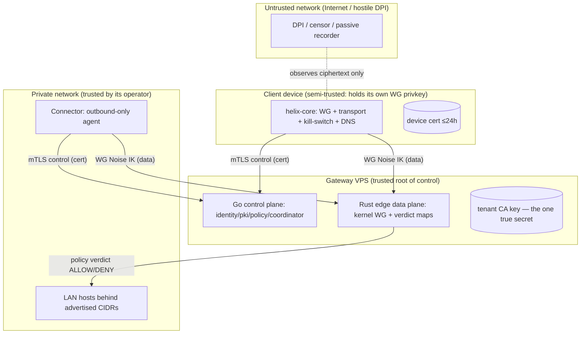
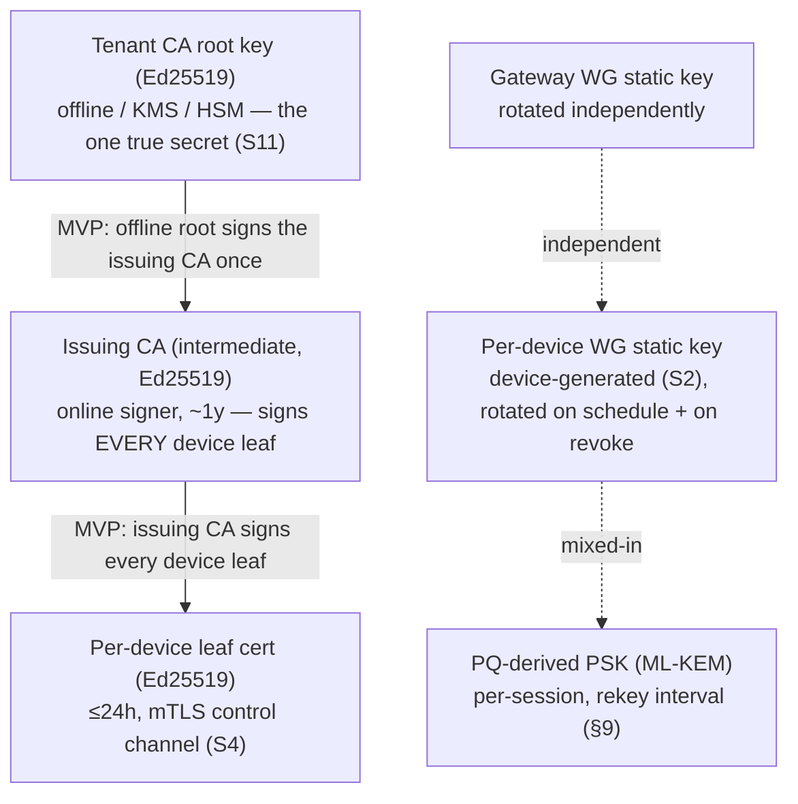
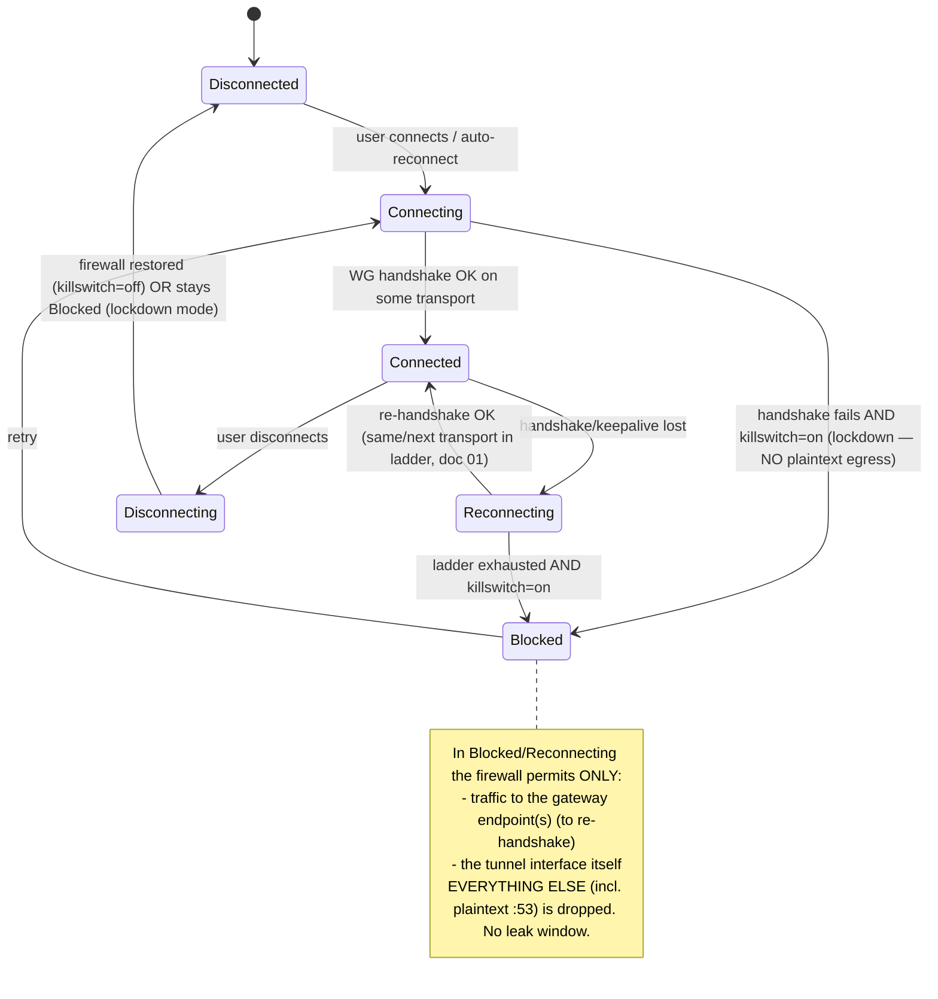

# Security, Privacy & PKI

**Revision:** 2
**Last modified:** 2026-06-26T12:00:00Z

> Master technical specification — document 04 of the HelixVPN set.
> Scope: the **security model, identity, public-key infrastructure, edge hardening,
> no-logging-as-code, kill-switch/DNS-leak protection, audit, and the post-quantum
> handshake**. This is a SPEC (describe the implementation; do not build the product).
> Source evidence cited inline by id, e.g. [04_ARCH §7], [04_P1 §6], [04_P2 §5],
> [research-pki_pq_nat], [SYNTHESIS §7].
>
> Cross-document contracts: the **data plane** (WireGuard core + transports) is doc 01;
> the **Go control plane** (services, DDL, RLS, event bus) is doc 02; the
> **`WatchNetworkMap` coordinator/protobuf** is doc 03; the **Rust client core** (where
> kill-switch/DNS/PQ run) is doc 05; the **platform tunnel shims** are doc 06. This
> document **owns** the security invariants, the `pki` service contract, the enrollment
> protocol, the audit model, and the privacy proofs; it *references* the DDL and the
> `Coordinator` RPC surface defined in docs 02/03 rather than redefining them.

---

## 0. Position in the system & what this document owns

HelixVPN is a self-hostable overlay network with a privacy-VPN front end: three roles —
**Connector** (network-side, outbound-only, advertises CIDRs) ⇄ **Gateway** (public VPS:
control + data plane) ⇄ **Client** (Mullvad-style end-user app) [04_ARCH §1.1, SYNTHESIS §1].
Security is **not a feature layer** bolted on top — it is the spine that makes every other
promise true: zero-trust routing, no-logging, sub-second revocation, and quantum-resistant
handshakes are properties of the *build*, not toggles in a config file [04_ARCH §7, §2.7].

### 0.1 Non-negotiable security/privacy invariants

These bind every later document via §11.4.35 inheritance. A violation of any is a release
blocker, not a tunable.

| # | Invariant | Enforced where | Source |
|---|---|---|---|
| S1 | **Zero-trust default-deny.** No peer reaches anything without an explicit compiled policy rule. The empty policy denies all. | policy compiler (doc 02) → `AllowedIPs` + edge verdict map | [04_ARCH §7, 04_P1 §7] |
| S2 | **Device private keys never leave the device.** Control plane only ever sees the 32-byte Curve25519 *public* key. | enrollment §3; `pki` never has a private-key column | [04_P1 §6.2/§6.3] |
| S3 | **Need-to-know map distribution.** A device's `NetworkMap` contains only the peers/routes its policy already grants — filtering happens server-side before the wire. | coordinator (doc 03) | [04_ARCH §4.4, SYNTHESIS §7] |
| S4 | **Short-lived control-channel mTLS.** Every agent authenticates `WatchNetworkMap`/RPC with a ≤24 h device cert; the WG data channel uses its own Noise IK handshake. | `pki` §4; control channel (doc 02) | [04_P1 §6.3, 04_ARCH §7] |
| S5 | **Revocation latency == convergence SLO (p99 < 1 s).** `device.revoked` drops the WG peer from every relevant map, removes it at the edge, and marks the cert revoked, atomically. | revocation pipeline §4.6 | [04_P1 §6.3, SYNTHESIS §4] |
| S6 | **No durable connection/traffic log — by construction.** The only persistent traffic-derived data is aggregate counters. A CI schema-lint fails the build if a connection-log-shaped table appears. | §6 schema-lint; data model (doc 02) | [04_ARCH §7, 04_P1 §11.4] |
| S7 | **Control actions are audited; traffic is not.** `audit_events` records who-did-what to identity/policy/devices, never destinations/flows. | §7 audit | [04_ARCH §7, 04_P1 §2.1] |
| S8 | **Edge hardening is mandatory.** Rootless Podman, read-only rootfs, seccomp, `NET_ADMIN`-only, no SSH on the data-plane container. | §5 quadlets + seccomp | [04_ARCH §7, §4.7] |
| S9 | **Kill-switch + DNS-leak protection are core-owned state, not hand-edited firewall rules.** No plaintext egress when the tunnel is down or escalating. | §8 state machine (core, doc 05) | [04_ARCH §6 row, 04_P1 §11 DoD] |
| S10 | **PQ is hybrid, never PQ-only.** A post-quantum KEM derives a PSK *mixed into* the classical WG handshake; an attacker must break both. Off → classical WG still secure. | §9 | [04_P2 §5, research-pki_pq_nat] |
| S11 | **The CA root and Postgres are the only secrets to protect.** Data-plane nodes are cattle, reprovisioned from IaC; identity/policy truth and the CA key are the backup set. | §11 secrets | [04_ARCH §10, 04_P1 §6.3] |

### 0.2 What this document deliberately does NOT own

- The WG Noise handshake mechanics and transport obfuscation — doc 01 (§S10 only references the PSK injection point).
- The Postgres DDL canonical definitions and RLS policies — doc 02 (this doc quotes the `pki`/`identity`/`audit` slices and adds the cert-lifecycle tables).
- The `Coordinator` RPC service and `WatchNetworkMap` delta algorithm — doc 03 (this doc defines only the `Enroll` RPC payloads and the revocation delta semantics).
- Where kill-switch/DNS/PQ code physically lives (`helix-core` crates + FFI) — doc 05 (this doc defines the *state machine* and the *protocol*).

---

## 1. Trust model & boundaries

### 1.1 Principal taxonomy



**Trust gradient (high→low):** the **tenant CA key** (root of all device identity) > **Postgres
control-plane truth** > **the Gateway control plane** > **the Rust edge** (sees only ciphertext)
> **the Connector** (trusted by *its* network operator only) > **the Client device** (holds its
own private key but is otherwise least-privileged) > **the network** (fully untrusted)
[04_ARCH §7, research-pki_pq_nat].

### 1.2 Authentication channels (two, never conflated)

| Channel | Auth mechanism | Lifetime | Crypto | Owner doc |
|---|---|---|---|---|
| **Control channel** (`Coordinator.WatchNetworkMap`, `.Enroll`, `.AdvertisePrefixes`, `.ReportStatus`) | mTLS with a short-lived **device cert** signed by the tenant CA | ≤24 h, auto-renew | TLS 1.3 (mutual), Ed25519 leaf keys | doc 02 + this §4 |
| **Data channel** (the tunnel itself) | WireGuard **Noise IK** handshake; peer pubkeys delivered via the policy-filtered map | per-session, rekey ~120 s | Curve25519 + ChaCha20-Poly1305 (+ optional PQ PSK §9) | doc 01 |

The two channels share **nothing** — compromising a device cert does not yield the WG private
key, and stealing the WG key does not authenticate the control RPC. Both must be valid for a
device to both *learn* its peers and *reach* them [04_ARCH §7, S2/S4].

### 1.3 Default-deny realisation (S1)

Zero-trust is not a slogan here; it is mechanical. The policy compiler (doc 02 §7) emits, per
device, exactly two artefacts, both default-empty:

1. **`AllowedIPs`** for the WG peer entry — WireGuard's own cryptokey-routing *already* drops
   any packet whose source/destination is outside `AllowedIPs`. An empty list = the peer can
   send/receive nothing.
2. **An edge verdict map** (nftables named verdict map or eBPF map; doc 01 §8) keyed on
   `(src_overlay_ip, dst_cidr, l4proto, dport)` → `ACCEPT|DROP`. The default verdict is `DROP`.

A device with no policy grant has an empty `AllowedIPs` **and** no verdict entry — it is
cryptographically and administratively isolated even though it is enrolled and online. This is
the "enroll a client; reach an authorized LAN host; *deny* an unauthorized one" acceptance
criterion made concrete [04_P1 §11 DoD #2].

---

## 2. Identity

Two identity modes ship in the MVP; both bind to the same `devices` table and the same cert
chain [04_P1 §6.1].

### 2.1 Managed mode — OIDC

Tenant admins and operators authenticate the **Console/API** via OIDC against any standard IdP
(Keycloak, Authentik, Auth0, Entra, Okta) [04_P1 §6.1]. HelixVPN is an OIDC **Relying Party**,
never an IdP — it stores no passwords.

- **Flow:** Authorization Code + PKCE (RFC 7636), `response_type=code`, `scope=openid profile email`.
  The Console is a public client (PKCE); the API validates the resulting ID token's signature
  against the IdP JWKS and pins `iss`/`aud`.
- **Claim binding:** `oidc_sub` (the stable subject) is the join key to `users.oidc_sub`; `email`
  is stored only when present and only for managed tenants. First login auto-provisions a `users`
  row scoped to the tenant resolved from the IdP realm/`hd` claim or an explicit invite.
- **RBAC:** `users.role ∈ {admin, operator, member}` (doc 02 DDL). Role is asserted from an IdP
  group claim mapping configured per tenant, or assigned in-Console by an admin.

```go
// helix-go/internal/identity/oidc.go — verification skeleton (interface, not impl)
type OIDCVerifier interface {
    // Verify validates signature, iss, aud, exp, nbf against the cached JWKS,
    // and returns the canonical subject + optional email. Never trusts unsigned claims.
    Verify(ctx context.Context, rawIDToken string) (sub string, email *string, groups []string, err error)
}

// Tenant→IdP binding (one IdP per tenant in MVP; multi-IdP is Phase 2).
type TenantOIDC struct {
    TenantID     uuid.UUID
    Issuer       string   // pinned; mismatch ⇒ reject
    ClientID     string   // aud must contain this
    JWKSURL      string   // refreshed on kid-miss with backoff
    GroupClaim   string   // e.g. "groups"; mapped to role via RoleMap
    RoleMap      map[string]Role
}
```

### 2.2 Anonymous mode — device enroll tokens (the Mullvad posture)

A tenant can mint **device enroll tokens** with **no email and no SSO** — the "account number,
no PII" stance [04_P1 §6.1, 04_ARCH §7]. The device obtains identity + cert without any personal
data ever being stored. This is the privacy-VPN front end's default for end users.

- A token is a high-entropy opaque string (256-bit, base32-Crockford for QR friendliness). Only
  its **Argon2id hash** is stored (`enroll_tokens.token_hash`), never the plaintext (S11-class
  secret hygiene). The plaintext is shown/QR'd exactly once.
- Tokens are **single-use** (consumed on `Enroll`) or **bounded multi-use** (admin-set `max_uses`
  for fleet rollout), always with a short TTL (default **1 h**, clamped **[5 m, 24 h]**) and an
  optional `bind_kind` (`client|connector`).
- The resulting `users` row has `email = NULL`, `oidc_sub = NULL`; the device is owned by a
  synthetic "anonymous" user scoped to the tenant. No reverse-link to a human exists by design.

```sql
-- enrollment tokens (owned by identity; canonical home is doc 02, quoted here for §3)
CREATE TABLE enroll_tokens (
  id           uuid PRIMARY KEY DEFAULT gen_random_uuid(),
  tenant_id    uuid NOT NULL REFERENCES tenants(id) ON DELETE CASCADE,
  token_hash   bytea NOT NULL,                 -- Argon2id(token); plaintext never stored
  bind_kind    device_kind,                    -- NULL = any; else pin client|connector
  bind_site    text,                           -- optional connector site label
  max_uses     int  NOT NULL DEFAULT 1,
  used_count   int  NOT NULL DEFAULT 0,
  not_after    timestamptz NOT NULL,
  created_by   text NOT NULL,                  -- actor (audited)
  created_at   timestamptz NOT NULL DEFAULT now(),
  revoked      boolean NOT NULL DEFAULT false
);
CREATE INDEX ON enroll_tokens (tenant_id) WHERE NOT revoked;
-- lookup is by constant-time hash compare over candidate rows, never by plaintext index.
```

### 2.3 RBAC and RLS as defence-in-depth

REST/Console authz uses OIDC session or API token + RBAC; agent RPCs use the device mTLS cert;
**Postgres RLS is the backstop** so a logic bug in the app layer cannot cross tenants [04_P1 §2.2,
§8]. Every privileged identity action is audited (§7).

---

## 3. Enrollment

The single most security-critical protocol in the system: it must mint a network identity
**without the device ever surrendering its WireGuard private key** (S2) and without an
unauthenticated party being able to enroll [04_P1 §6.2].

### 3.1 Enrollment sequence (Mermaid)

```mermaid
sequenceDiagram
    autonumber
    actor Admin as Console/Admin
    participant ID as identity (Go)
    participant PKI as pki (Go)
    participant IPAM as ipam (Go)
    participant Dev as Device (helix-core)
    participant Coord as coordinator (Go)
    participant Edge as Rust edge (kernel WG)

    Admin->>ID: POST /v1/enroll-tokens {kind, site?, ttl, max_uses}
    ID->>ID: token=rand256; store Argon2id(token); emit audit "token.create"
    ID-->>Admin: {token, qr}  (plaintext shown ONCE)
    Admin-->>Dev: out-of-band: paste token / scan QR

    Note over Dev: Device generates WG keypair LOCALLY.<br/>Private key NEVER leaves the device (S2).
    Dev->>Dev: (wg_priv, wg_pub) = X25519.gen()
    Dev->>Dev: (csr_priv, csr) = Ed25519.gen(); CSR CN = pending device-id

    Dev->>Coord: Enroll{enroll_token, wg_pubkey, csr, os, name, kind}
    Coord->>ID: verify token (const-time hash, TTL, uses, bind_kind)
    alt token invalid / expired / exhausted
        ID-->>Coord: DENY
        Coord-->>Dev: PermissionDenied  (no identity leaked)
    else token valid
        ID->>IPAM: allocate overlay IP from tenant ULA /48
        IPAM-->>ID: fd7a:helix:<t>::N
        ID->>ID: INSERT devices(...); used_count++; emit device.enrolled
        ID->>PKI: SignDeviceCert(csr, device_id, not_after=now+24h)
        PKI->>PKI: validate CSR proof-of-possession; sign with tenant CA
        PKI-->>ID: {cert, serial}; INSERT device_certs(...)
        ID-->>Coord: EnrollResponse{device_id, overlay_ip, cert, ca_chain, gateway}
        Coord-->>Dev: EnrollResponse
        Note over Dev: persist cert + overlay IP in OS keystore (Keychain/Keystore/TPM where available)
        Dev->>Coord: WatchNetworkMap (mTLS using new device cert)
        Coord->>Edge: add WG peer (pubkey, AllowedIPs from policy)
        Coord-->>Dev: NetworkMap snapshot (policy-filtered peers)
    end
```

### 3.2 The `Enroll` RPC (protobuf — extends doc 03)

Doc 03 defines the `Coordinator` service; this document adds the CSR field so the device cert
is minted from a device-held private key (proof-of-possession), not handed a server-generated key.

```protobuf
// helix-proto/coordinator.proto  (security additions to the Enroll messages)
message EnrollRequest {
  string     enroll_token = 1;  // single/bounded-use, TTL'd; verified by hash (§2.2)
  bytes      wg_pubkey    = 2;  // 32-byte Curve25519 PUBLIC key; private stays on device (S2)
  bytes      csr          = 3;  // PKCS#10 CSR, Ed25519 leaf key generated on device (S2)
  string     os           = 4;  // ios|android|linux|windows|macos|harmonyos|aurora
  string     name         = 5;
  DeviceKind kind         = 6;
  // OPTIONAL device-attestation evidence (Phase 2): platform key attestation blob.
  bytes      attestation  = 7;  // empty in MVP; verified in Phase 2 (§3.5)
}

message EnrollResponse {
  string      device_id   = 1;
  string      overlay_ip  = 2;  // e.g. "fd7a:helix:1::2"
  bytes       device_cert = 3;  // X.509 leaf, signed by tenant CA, not_after = now+24h
  repeated bytes ca_chain = 4;  // tenant CA (+ intermediate if used) for pinning
  GatewayInfo gateway     = 5;
  uint32      cert_ttl_s  = 6;  // renew-before window hint for the core
}
```

### 3.3 Device-side key handling (Rust skeleton, `helix-core`)

The device generates **two** keypairs locally: the long-lived **WG static key** (X25519) and a
short-lived **control-channel leaf key** (Ed25519). Only public material crosses the wire.

```rust
// helix-core/crates/helix-pki/src/enroll.rs  (skeleton — contract, not full impl)
pub struct EnrolledIdentity {
    pub device_id:  String,
    pub overlay_ip: IpAddr,
    pub wg_secret:  StaticSecret,   // X25519 private — sealed in OS keystore, never serialised out
    pub cert_der:   Vec<u8>,        // current device cert (mTLS leaf)
    pub cert_key:   SigningKey,     // Ed25519 leaf private — also sealed in keystore
    pub ca_chain:   Vec<Vec<u8>>,   // for pinning the control channel
    pub renew_at:   SystemTime,     // = not_after - renewSkew (renewSkew = max(1h, 0.2×TTL), §4.5)
}

pub trait Enroller {
    /// Generates WG + leaf keypairs locally, builds a CSR, calls Coordinator.Enroll,
    /// and persists the result in the platform keystore via `KeyStore`.
    /// PRECONDITION/POSTCONDITION (S2): no private key is ever returned by value to FFI,
    /// logged, or written outside the sealed keystore.
    fn enroll(&self, token: &str, kind: DeviceKind, ks: &dyn KeyStore)
        -> Result<EnrolledIdentity, EnrollError>;
}

/// Platform-backed secret storage. Implemented per shim (doc 06):
/// iOS/macOS Keychain (Secure Enclave where present), Android Keystore (StrongBox),
/// Windows DPAPI/TPM, Linux libsecret/TPM2. Software fallback only with a logged warning.
pub trait KeyStore {
    fn seal(&self, label: &str, secret: &[u8]) -> Result<(), KeyStoreError>;
    fn open(&self, label: &str) -> Result<Zeroizing<Vec<u8>>, KeyStoreError>;
    fn wipe(&self, label: &str) -> Result<(), KeyStoreError>;
}
```

`StaticSecret`, `SigningKey`, and the `Zeroizing` wrapper guarantee the private bytes are zeroed
on drop (`zeroize`); FFI (doc 05/06) exposes *handles and operations*, never the raw key
material — a device-key extraction must defeat the OS keystore, not read a Dart string.

### 3.4 Anti-replay & abuse controls on `Enroll`

- **Constant-time token check.** Candidate `enroll_tokens` rows for the tenant are hash-compared
  in constant time; failure returns `PermissionDenied` with no detail (no oracle on which field
  failed) — prevents token enumeration (research-pki_pq_nat).
- **CSR proof-of-possession.** The CSR signature is verified before signing; the leaf public key
  in the CSR must match the signer — a device cannot enroll a key it does not control.
- **Rate limiting.** Per-source-IP and per-tenant token buckets on `Enroll` (Redis, doc 02 §4.6).
  Repeated failures back off exponentially and emit `auth.enroll.denied` audit events.
- **One pubkey, one device.** `UNIQUE (tenant_id, wg_pubkey)` (doc 02 DDL) rejects re-use of a
  public key across devices.

### 3.5 Phase-2 hardening: platform attestation (forward-looking, not MVP)

The `attestation` field reserves space for **platform key attestation** (Apple DeviceCheck/App
Attest, Android Key Attestation, Windows TPM attestation) so a Phase-2 tenant can require that
the WG/leaf keys are hardware-bound. MVP leaves the field empty and does not gate on it — stated
here so the wire format need not change later [04_P2 §0 "everything additive", S2].

---

## 4. PKI — key hierarchy, certificate lifecycle, rotation, revocation

### 4.1 Key hierarchy



Three **independent** key planes, deliberately uncoupled so a compromise in one does not cascade
[04_ARCH §7, research-pki_pq_nat]:

1. **Control-identity plane** — tenant CA → device leaf certs (this §4). Governs *who may talk to
   the control plane*.
2. **Data plane** — per-device + gateway WG static keys (doc 01). Governs *who may decrypt the
   tunnel*. WG keys are **not** issued by the CA; they are registered public keys.
3. **PQ plane** — ephemeral ML-KEM exchange → WG PSK (§9). Governs *harvest-now-decrypt-later
   resistance*. Per-session, never persisted.

### 4.2 Certificate authority topology (decision, with recommendation)

> **Reconciled (§11.4.35, 2026-06-26) — `D-PKI-CA-TIER`: MVP ships a two-tier issuing CA**
> (source-aligned with the authoritative control-plane spec
> [`v03-control-plane/svc-pki.md` §2] and [`v05-security/pki-and-certs.md`]): an **offline /
> KMS root** signs an **online issuing intermediate** once, and the issuing intermediate signs
> **every** ≤24 h device leaf. The earlier "single-tier (root signs leaves directly) is the MVP
> default, two-tier is Phase 2" framing was stale and is corrected below.

| Option | Description | Pro | Con | Recommendation |
|---|---|---|---|---|
| **A. Single-tier per-tenant CA** | Tenant CA root signs device leaves directly. | Simplest; one key to back up per tenant. | Root key must be reachable by the online signer for every 24 h leaf — the offline-root property is lost, larger compromise blast radius. | **Rejected for MVP** — keeping the root online to sign 24 h leaves defeats S11. |
| **B. Two-tier issuing CA (offline root + online issuing intermediate)** | Offline / KMS root signs the issuing intermediate once; the online issuing intermediate signs every device leaf. | Root stays fully offline (S11); issuing CA rotates without re-establishing the root; cleaner revocation blast radius; matches the control-plane `ca_keys` hierarchy [`v03-control-plane/svc-pki.md` §2]. | More moving parts; issuing-CA rotation tooling (§2.3 of svc-pki). | **MVP default.** Root in KMS/HSM or offline; the online `pki` service signs leaves with the issuing intermediate, never with the root. |

The `ca_chain` in `EnrollResponse` carries **root + issuing CA** from day one so clients pin the
full chain root→issuing→leaf (§3.2). **Phase-2 strengthening** (additive, no reshape, §11.4.6):
add a **2nd intermediate / per-region issuer** + an HSM root-ceremony, growing the issuance fan-out
without changing the wire format.

### 4.3 Certificate profiles (X.509, TLS 1.3 mutual)

| Field | Device leaf | Tenant CA (root) | Issuing CA (intermediate, MVP) |
|---|---|---|---|
| Key alg | Ed25519 | Ed25519 | Ed25519 |
| Validity | ≤24 h | 10 y (offline) | ~1 y |
| `subject` | `CN=<device_id>, O=<tenant_id>` | `CN=HelixVPN Tenant CA <tenant_id>` | `CN=HelixVPN Issuing CA` |
| `subjectAltName` | URI `spiffe://<tenant_id>/device/<device_id>` | — | — |
| `keyUsage` | `digitalSignature` | `keyCertSign, cRLSign` | `keyCertSign, cRLSign` |
| `extKeyUsage` | `clientAuth` (and `serverAuth` for gateway-facing edge cert) | — | — |
| `basicConstraints` | `CA:FALSE` | `CA:TRUE, pathlen:1` | `CA:TRUE, pathlen:0` |
| custom ext | `1.3.6.1.4.1.<PEN>.helix.deviceKind = client|connector` | — | — |

Short leaf validity (≤24 h) is the primary revocation mechanism: even if the < 1 s active
revocation (§4.6) somehow misses, the cert expires within a day. mTLS uses TLS 1.3 only (no
downgrade), with the device cert as the client cert and the tenant CA as the trust anchor on the
server side [04_ARCH §7, research-pki_pq_nat].

### 4.4 Certificate-lifecycle state machine (Mermaid)

```mermaid
stateDiagram-v2
    [*] --> Requested: device sends CSR (Enroll)
    Requested --> Active: pki signs (PoP verified), device_certs row inserted
    Active --> Renewing: now ≥ not_after - renewSkew (= max(1h, 0.2×TTL) ≈ 4.8h for a 24h cert)
    Renewing --> Active: re-sign over existing mTLS channel (new serial)
    Active --> Expired: now ≥ not_after (no renewal)
    Active --> Revoked: device.revoked event (admin / compromise / policy)
    Renewing --> Revoked: device.revoked during renewal
    Expired --> [*]: control channel rejected; device must re-enroll
    Revoked --> [*]: peer dropped everywhere; cert serial blacklisted < 1s (S5)
    note right of Renewing
      Renewal is a re-issue over the AUTHENTICATED channel —
      no new enroll token, no privilege escalation. Same device_id,
      new serial + not_after. WG key unchanged unless rotation due (§4.5).
    end note
```

### 4.5 Rotation policy

- **Device leaf cert:** auto-renewed by the core when `now ≥ not_after − renewSkew`, where
  `renewSkew = max(1h, 0.2 × TTL)` (≈ 4.8 h before a 24 h cert; source-aligned with
  [`v03-control-plane/svc-pki.md` §6.1] / [`v05-security/pki-and-certs.md`]), over the *existing*
  authenticated mTLS channel — no enroll token, no human
  [04_P1 §6.3]. A missed renewal degrades to re-enrollment, not a silent failure.
- **Device WG static key:** rotated on a schedule (default 90 d, tenant-configurable) and
  **immediately on `device.revoked`** of a *sibling* device only if policy requires; the rotating
  device generates a new keypair locally and registers the new pubkey, the coordinator swaps the
  edge peer atomically [04_ARCH §7]. Old key removed from all maps before the new is announced
  (make-before-break ordering avoids a connectivity gap).
- **Gateway WG static key:** rotated independently of devices (`helixvpnctl gateway keys`), pushed
  to all clients as a `NetworkMap` delta (new gateway endpoint/pubkey); clients re-handshake
  [04_ARCH §7, 04_P2 §6.4].
- **PQ PSK:** rotated on every WG rekey interval (§9) — ephemeral, never persisted.

### 4.6 Revocation pipeline — `device.revoked` in < 1 s (S5)

Revocation is the security analogue of the convergence SLO: the same push-don't-poll machinery
that propagates a route change in < 1 s propagates a revocation in < 1 s [04_P1 §6.3, SYNTHESIS §4].

```mermaid
sequenceDiagram
    autonumber
    actor Op as Admin / automated trigger
    participant API as api (Gin)
    participant ID as identity/pki
    participant Bus as Redis Streams (events:devices)
    participant Coord as coordinator
    participant Edge as Rust edge (kernel WG)
    participant Peers as Affected peers' open WatchNetworkMap streams

    Op->>API: POST /v1/devices/{id}:revoke   (RBAC: admin/operator)
    API->>ID: tx{ devices.revoked_at=now; device_certs.revoked=true; emit audit }
    ID->>Bus: XADD device.revoked {device_id, tenant_id, wg_pubkey}
    par fan-out (all within the SLO budget)
        Bus->>Coord: consume device.revoked
        Coord->>Edge: remove WG peer (pubkey) + drop verdict-map entries
        Coord->>Peers: MapDelta{remove peer device_id}  (need-to-know S3)
    and
        Coord->>Coord: blacklist cert serial in the in-mem revocation set
    end
    Note over Edge,Peers: kernel WG peer gone ⇒ no further handshake/data;<br/>open mTLS control stream for the revoked device is force-closed.
```

Mechanics that make < 1 s real and verifiable:
- The revocation write is a single Postgres transaction (`revoked_at` + `device_certs.revoked` +
  audit) so the state is atomic and crash-consistent.
- The edge enforces by **removing the kernel WG peer** (the data-plane truth) and dropping the
  verdict-map rows — not by consulting a CRL on the packet path (S6: no per-packet state lookups).
- The revoked device's **open control stream is force-closed**; its next mTLS attempt fails the
  in-memory serial blacklist and the `device_certs.revoked` check.
- **No CRL/OCSP on the data path.** Short-lived certs + active push obviate online revocation
  checking; an offline edge that misses the push still sees the cert expire ≤24 h (defence-in-depth)
  [research-pki_pq_nat].

```sql
-- device_certs already in doc 02; the revocation-relevant slice:
-- CREATE INDEX ON device_certs (tenant_id, device_id) WHERE NOT revoked;  -- fast "current cert"
-- revocation = UPDATE device_certs SET revoked=true WHERE device_id=$1; (covered by the index flip)
```

### 4.7 `pki` service contract (Go interface — owned here, lives in doc 02's monolith)

```go
// helix-go/internal/pki/pki.go  (contract; implementation batched per §11.4.9)
type PKI interface {
    // SignDeviceCert verifies CSR proof-of-possession and signs a ≤24h leaf with the tenant CA.
    SignDeviceCert(ctx context.Context, t TenantID, deviceID DeviceID, csr []byte, ttl time.Duration) (cert []byte, serial string, err error)
    // Renew re-issues over an authenticated channel; same device_id, new serial+not_after.
    Renew(ctx context.Context, t TenantID, deviceID DeviceID, csr []byte) (cert []byte, serial string, err error)
    // Revoke flips the cert row and returns the serial for the coordinator blacklist set.
    Revoke(ctx context.Context, t TenantID, deviceID DeviceID) (serial string, err error)
    // CAChain returns the pinning chain handed to devices in EnrollResponse.ca_chain.
    CAChain(ctx context.Context, t TenantID) (chain [][]byte, err error)
}

// The CA *private* key is never in process memory in the KMS-backed deployment:
// signing is delegated to the KMS/HSM (e.g. AWS KMS asymmetric sign, PKCS#11). S11.
type CASigner interface {
    Sign(ctx context.Context, t TenantID, tbs []byte) (sig []byte, err error)  // tbs = to-be-signed cert bytes
}
```

---

## 5. Edge hardening (S8)

The Gateway runs two processes: the Go control plane and the Rust data-plane edge. The **edge**
is the only component reachable from the hostile Internet on the data port, so it is the most
hardened [04_ARCH §7, §4.7].

### 5.1 Rootless Podman quadlet — least privilege

Per §11.4.76 (containers submodule) + §11.4.161 (rootless), every component is an OCI image run
via **rootless Podman quadlets** (`.container` units, systemd-managed, no Docker daemon)
[04_ARCH §4.7, SYNTHESIS §2/§9].

```ini
# /etc/containers/systemd/helix-edge.container  (rootless quadlet — the data-plane edge)
[Unit]
Description=HelixVPN Rust edge (data plane)
After=network-online.target

[Container]
Image=ghcr.io/helixdevelopment/helix-edge:1.0
# --- least privilege ---
ReadOnly=true                      # read-only rootfs; only declared volumes are writable
NoNewPrivileges=true               # no setuid escalation
DropCapability=ALL                 # drop everything...
AddCapability=CAP_NET_ADMIN        # ...then add ONLY what kernel WG / tun needs
AddCapability=CAP_NET_RAW          # raw sockets for the obfuscated transports (doc 01)
SecurityLabelType=helix_edge.process   # SELinux type (Phase 2; AppArmor profile on Debian)
SeccompProfile=/etc/helixvpn/seccomp-edge.json   # §5.2 — syscall allowlist
# --- networking ---
AddDevice=/dev/net/tun             # TUN; NO host network namespace sharing
PublishPort=443:443/udp            # MASQUE/QUIC + plain WG
PublishPort=443:443/tcp            # UoT / TCP fallback (doc 01)
# --- writable scratch only ---
Tmpfs=/run:rw,noexec,nosuid,size=16m
Tmpfs=/tmp:rw,noexec,nosuid,size=16m
# --- NO ssh, NO shell tooling in the image (distroless base) ---
Environment=CONTROL_PLANE_ADDR=unix:///run/helix/control.sock

[Service]
Restart=on-failure
RestartSec=2

[Install]
WantedBy=multi-user.target
```

### 5.2 Seccomp syscall allowlist

The edge needs a tiny syscall surface (socket I/O, tun read/write, epoll, futex, mmap). A
**default-deny seccomp profile** (allowlist) blocks everything else — no `ptrace`, no `execve`
of a shell, no `mount`, no `kexec` [04_ARCH §7].

```yaml
# seccomp-edge.json (excerpt, expressed as YAML for readability)
defaultAction: SCMP_ACT_ERRNO          # deny-by-default
architectures: [SCMP_ARCH_X86_64, SCMP_ARCH_AARCH64]
syscalls:
  - names: [read, write, readv, writev, recvmsg, sendmsg, recvfrom, sendto,
            epoll_create1, epoll_ctl, epoll_wait, epoll_pwait, ppoll,
            socket, bind, connect, getsockopt, setsockopt, getsockname,
            futex, mmap, munmap, mprotect, brk, rt_sigaction, rt_sigprocmask,
            clock_gettime, nanosleep, close, fcntl, ioctl, exit, exit_group]
    action: SCMP_ACT_ALLOW
  - names: [ioctl]                      # TUN ioctls are required but narrow…
    action: SCMP_ACT_ALLOW
    args:
      - index: 1                        # …pin TUNSETIFF / TUNSETPERSIST argument values in Phase 2
        op: SCMP_CMP_MASKED_EQ
        value: 0x400454ca
# explicitly absent: execve, ptrace, mount, setuid, kexec_load, init_module, bpf(write)
```

### 5.3 No-SSH, control-plane-only management

There is **no SSH on the data-plane container** and no interactive shell in the image (distroless
base, no `/bin/sh`). All management is via the control plane (`helixvpnctl` → API → coordinator →
edge); the edge is reconfigured by `NetworkMap` deltas, never by hand-editing a config file inside
the box [04_ARCH §7, §4.7]. The original research's `fail2ban`/SSH-key hardening is *replaced*,
not augmented, by no-public-SSH + WireGuard-only management [04_ARCH §7 carry-forward].

### 5.4 Host-level posture (deployment doc 09 owns the full set; security floor here)

- Inbound host firewall: only `:443/udp` + `:443/tcp` (data) and the control API behind mTLS;
  everything else default-drop.
- Kernel: `net.ipv4.conf.all.rp_filter`, disable IP source routing, BPF JIT hardening; the edge
  process under a dedicated unprivileged user namespace (rootless).
- Image supply chain: signed images (cosign), SBOM, reproducible builds (Phase 3 [04_ARCH §12]).

---

## 6. No-logging as code (S6)

The privacy promise is a **build property**, enforced by *absence* and by a CI lint, not by an
operator's good intentions [04_ARCH §7, 04_P1 §11.4].

### 6.1 What is and is not stored

| Stored (durable, Postgres) | NOT stored (ever) |
|---|---|
| Identity: tenants, users, devices (pubkey, overlay IP, coarse `last_seen_at`) | Per-connection records |
| Topology: connectors, advertised prefixes, groups | Per-packet / per-flow records (src, dst, bytes, timestamps) |
| Policy: spec + compiled rules | DNS query logs |
| `device_certs`, `enroll_tokens` (hashed) | Destination IPs / domains visited |
| `audit_events` (control actions only, §7) | Traffic content or metadata of any kind |
| Aggregate counters (handshakes, bytes-total, errors — Prometheus) | Anything correlating a user to a destination |

Live presence/session state is **ephemeral in Redis** (TTL'd), so the durable store never
accumulates a connection log [04_ARCH §4.5]. `last_seen_at` is coarse (refreshed from presence,
not per-packet) and carries no destination.

### 6.2 CI schema-lint (the mechanical enforcement)

A schema test **fails the build** if a durable table appears that is shaped like a connection log:
named `connections|flows|traffic|packets|sessions` (durable), OR any table that has **both** a
`src`/`dst`-type column **and** a `bytes`/`ts`-type column outside `audit_events`
[04_P1 §11.4, §23]. The privacy promise is enforced by tooling, not trust.

```go
// helix-go/internal/store/schemalint/nolog_test.go  (contract; runs in CI, anti-bluff)
var forbiddenTableNames = []string{"connections", "flows", "traffic", "packets", "sessions"}

func TestNoConnectionLogTables(t *testing.T) {
    schema := introspect(t)                 // reads live migrated schema, not the .sql source text
    for _, tbl := range schema.Tables {
        if contains(forbiddenTableNames, tbl.Name) {
            t.Fatalf("S6 VIOLATION: durable table %q is connection-log-shaped", tbl.Name)
        }
        hasSrcDst := tbl.HasColumnMatching(`(?i)^(src|dst|source|dest).*`)
        hasBytesTs := tbl.HasColumnMatching(`(?i)(bytes|octets)`) && tbl.HasColumnMatching(`(?i)(ts|timestamp|at)$`)
        if tbl.Name != "audit_events" && hasSrcDst && hasBytesTs {
            t.Fatalf("S6 VIOLATION: %q has src/dst + bytes/ts shape (looks like a flow log)", tbl.Name)
        }
    }
}
```

**Anti-bluff (§11.4.1/§1.1):** a paired meta-test plants a `CREATE TABLE flows(src inet, dst inet,
bytes bigint, ts timestamptz)` migration in a throwaway schema and asserts the lint FAILs — so the
lint cannot be a tautology that passes everything (§11.4.107(10) self-validated analyzer).

---

## 7. Audit — control actions only (S7)

Every state-changing control action is audited to `audit_events` and streamed live to the Console;
**traffic is never audited** [04_ARCH §7, 04_P1 §2.1].

```sql
-- audit_events (canonical in doc 02; quoted for the security contract)
-- audit_events(id, tenant_id, actor, action, target, ts, meta jsonb)
```

- **Audited actions (closed set — the canonical `AuditAction` enum [`v03-control-plane/svc-telemetry.md`
  §4.2], mirrored in [`v05-security/audit-and-compliance.md` §4]):** `enroll_token.mint`,
  `enroll_token.used`, `device.enrolled`, `device.revoke`, `device.cert.issued`,
  `device.cert.rotated`, `policy.create`, `policy.activate`, `policy.rollback`,
  `connector.attached`, `connector.prefixes.changed`, `tenant.create`, `user.role.change`,
  `auth.login`, `auth.enroll.denied`.

  > **Reconciled (§11.4.35, 2026-06-26):** this list is rewritten to the canonical enum names
  > (the closed `AuditAction` set is the source of truth, §4.2 of svc-telemetry). The prior
  > divergent labels map as: `token.create`→`enroll_token.mint`; `device.enroll`→`device.enrolled`;
  > `device.keyrotate`→`device.cert.rotated`; `policy.update`→`policy.create`/`policy.activate`;
  > `prefix.advertise`/`prefix.withdraw`→`connector.prefixes.changed`;
  > `gateway.keyrotate`→`device.cert.rotated` (the gateway is itself a device row — its credential
  > rotation audits under the same action, no new enum member). `token.revoke` and `policy.compile`
  > have **no** canonical audit action (token revocation + internal policy compilation are not
  > separately audited control actions in the MVP closed set) and are dropped.
- **Never audited:** any packet, flow, destination, DNS query, or byte-count attributable to a
  user — those don't exist (S6), so they cannot be audited even by mistake.
- **Actor binding:** `actor` is the OIDC `sub`/user id for human actions, `"system"` for automated
  ones (e.g. scheduled key rotation), and the device id for agent-initiated control writes.
- **Integrity (Phase 2):** optional hash-chained audit (`meta.prev_hash`) for tamper-evidence —
  reserved, not MVP.
- **Live stream:** `audit_events` writes emit on `events:audit`; the Console subscribes via WS/SSE
  for a real-time security feed (doc 02 §4.3).

---

## 8. Kill-switch & DNS-leak protection (S9)

A privacy VPN that leaks plaintext when the tunnel drops is broken. The kill-switch and DNS-leak
protection are a **core-owned state machine** (`helix-core`, doc 05), not hand-edited firewall
rules an operator can forget [04_ARCH §6 row, 04_P1 §11 DoD #6]. The core drives the OS firewall;
the rules are an *output* of the state machine.

### 8.1 The state machine (Mermaid)



### 8.2 Firewall posture per state (the rules the core emits)

| State | Allowed egress | DNS | Notes |
|---|---|---|---|
| `Disconnected` | all (killswitch off) or none (lockdown) | system | lockdown = "block until connected" toggle |
| `Connecting` / `Reconnecting` | only to gateway endpoint IP:port | blocked (no off-tunnel :53) | prevents leak during escalation ladder (doc 01) |
| `Connected` | only via tunnel `utun`/`wg0` + gateway endpoint | tunnel DNS only; off-tunnel :53 dropped | the only steady-state |
| `Blocked` | only to gateway endpoint (to recover) | blocked | hard lockdown; UI shows "protected, reconnecting" |

### 8.3 DNS-leak specifics

- The core sets the **tunnel DNS** (pushed in the `NetworkMap`: `dns_servers`, `search_domains`)
  and **blocks plaintext :53/:853 off-tunnel** in every non-`Disconnected` state [04_ARCH §6 row].
- On platforms with split-DNS APIs (Apple `NEDNSSettings`, Android `VpnService.Builder.addDnsServer`,
  Windows NRPT), the shim (doc 06) applies the tunnel resolver; the core's firewall rule is the
  belt-and-suspenders backstop so a misbehaving app cannot reach a hardcoded `8.8.8.8`.
- IPv6 leak: if the overlay is IPv6 ULA (4via6, doc 03/D4) but the host has native IPv6, the core
  either routes ULA + blocks native v6 egress, or fully captures v6 — never a partial-capture leak.

### 8.4 Core state-machine skeleton (Rust)

```rust
// helix-core/crates/helix-killswitch/src/sm.rs  (contract — state machine, not full impl)
#[derive(Clone, Copy, PartialEq)]
pub enum LinkState { Disconnected, Connecting, Connected, Reconnecting, Blocked, Disconnecting }

pub trait Firewall {  // implemented per shim (doc 06): nftables(Linux), NE(Apple), WFP(Windows)…
    /// Apply the leak-proof rule set for `state`. MUST be atomic (no transient open window).
    fn enforce(&self, state: LinkState, gw: &[SocketAddr], tun_if: &str, dns: &[IpAddr]) -> Result<(), FwError>;
    /// Restore the host's pre-VPN firewall (only on Disconnected when lockdown=off).
    fn restore(&self) -> Result<(), FwError>;
}

pub struct KillSwitch { fw: Box<dyn Firewall>, lockdown: bool }

impl KillSwitch {
    /// Single authority for the transition; on EVERY transition it re-enforces the firewall
    /// BEFORE the network operation, so no plaintext can escape during the change (S9).
    pub fn transition(&mut self, to: LinkState, ctx: &LinkCtx) -> Result<(), FwError> {
        self.fw.enforce(to, &ctx.gateways, &ctx.tun_if, &ctx.dns)?;   // firewall first…
        // …then the actual link operation (bring up/down peer) proceeds (doc 01).
        Ok(())
    }
}
```

**Anti-bluff validation (§11.4.107/§11.4.69):** the DoD test drops the tunnel mid-transfer and
asserts via packet capture on the host's physical interface that **zero plaintext packets** (incl.
:53) egress during `Reconnecting`/`Blocked` — captured evidence, not an absence-of-error PASS
[04_P1 §11 DoD #6].

---

## 9. Post-quantum handshake (S10)

WireGuard's Curve25519 handshake is vulnerable to **harvest-now-decrypt-later**: an adversary
records ciphertext today and decrypts it once quantum computers mature. HelixVPN closes this **the
way Mullvad does — without forking WireGuard crypto** — by deriving a **pre-shared key (PSK)** from
a post-quantum KEM and mixing it into the WG handshake [04_P2 §5, research-pki_pq_nat].

### 9.1 Approach — PQ-derived PSK, hybrid never PQ-only

WireGuard already supports an optional symmetric PSK mixed into the handshake (the `Q` value in the
Noise IK). If that PSK is established via a **post-quantum KEM**, the session gains PQ resistance
**even though the core handshake stays classical Curve25519** — defence-in-depth: an attacker must
break *both* the classical ECDH **and** the PQ KEM [04_P2 §5.1]. This is why **hybrid, never
PQ-only (S10)**: if the (younger, less-battle-tested) PQ KEM has a flaw, classical WG still protects
you; if quantum breaks classical ECDH, the PQ PSK still protects you.

```mermaid
sequenceDiagram
    autonumber
    participant C as Client (helix-core)
    participant GW as Gateway edge
    Note over C,GW: PQ exchange rides the AUTHENTICATED control channel (mTLS) — no new public listener (S4)
    C->>GW: ML-KEM-768 encapsulation key (FIPS 203)
    GW->>GW: (ciphertext, ss_gw) = Encaps(ek)
    GW->>C: ML-KEM ciphertext
    C->>C: ss_c = Decaps(dk, ciphertext)   (ss_c == ss_gw)
    Note over C,GW: both derive: PSK = HKDF-SHA256(shared_secret, "helix-pq-psk-v1")
    C->>GW: WireGuard Noise IK handshake WITH that PSK mixed in
    Note over C,GW: rotate PSK on each WG rekey interval (~120s); PQ exchange only at setup/rekey, zero per-packet cost
```

### 9.2 KEM choice (decision, with recommendation)

| Option | KEM | Pro | Con | Recommendation |
|---|---|---|---|---|
| **Primary** | **ML-KEM-768 (FIPS 203, standardized Kyber)** | NIST-standardized; good size/speed; broad library support (`ml-kem` Rust crate, BoringSSL) | younger than classical | **Default.** Pluggable in `pki` + `helix-core` [04_P2 §5.2]. |
| **Conservative hybrid** | **ML-KEM-768 + Classic McEliece** | Mullvad's original PQ tunnels combined McEliece + Kyber for exactly this hedge; code-based is a very different hardness assumption | McEliece public keys are large (≈ hundreds of KB) | **Phase-2 opt-in** for high-assurance tenants; only at setup/rekey so the size cost is amortised [04_P2 §5.2/§5.3]. |
| **External protocol** | **Rosenpass** (audited PQ key-exchange daemon feeding WG a PSK) | independent audit; clean separation; reference design | extra daemon + integration | **Evaluate during the Phase-2 PQ spike** — prefer if an audited external protocol beats an in-house KEM exchange [04_P2 §5.4, research-pki_pq_nat]. |

### 9.3 Where it runs & negotiation

- **On the authenticated control channel** (`Coordinator` RPC over mTLS) — so there is **no new
  public listener** and no unauthenticated PQ endpoint to attack [04_P2 §5.3].
- **Capability-negotiated:** a "Quantum-resistant" toggle, **on by default for new tunnels where
  both ends support it** [04_P2 §5.5]. A peer that doesn't support PQ falls back to classical WG —
  which is still secure today.
- **Cost:** PQ ciphertexts are KB-scale, so the exchange happens at **session setup and rekey**,
  not per packet; steady-state overhead is zero [04_P2 §5.5].

```rust
// helix-core/crates/helix-pki/src/pq.rs  (pluggable KEM contract)
pub trait PqKem {
    fn keypair(&self) -> (EncapKey, DecapKey);
    fn encapsulate(&self, ek: &EncapKey) -> (Ciphertext, SharedSecret);
    fn decapsulate(&self, dk: &DecapKey, ct: &Ciphertext) -> SharedSecret;
}
/// PSK = HKDF-SHA256(shared_secret, salt=session_id, info=b"helix-pq-psk-v1") -> 32 bytes,
/// mixed into the WG Noise IK preshared-key slot (doc 01). Rotated every rekey.
pub fn derive_wg_psk(ss: &SharedSecret, session_id: &[u8]) -> WgPsk { /* HKDF */ }
```

**Honest boundary (§11.4.6):** PQ here protects against *future* decryption of *today's* recorded
traffic; it is not a claim that classical WG is broken now. PQ-only would be reckless given the PQ
KEMs' relative youth — hybrid is the deliberate, conservative choice (S10).

---

## 10. Threat model

STRIDE-flavoured, scoped to HelixVPN's roles. Each row: threat → the invariant/mechanism that
addresses it → residual risk (§11.4.6 — stated honestly, never "fully solved").

| # | Threat (STRIDE) | Vector | Mitigation (mechanism) | Residual risk |
|---|---|---|---|---|
| T1 | **Spoofing** a device to the control plane | Forged/stolen control credentials | Short-lived mTLS device cert (S4) + CSR proof-of-possession (§3.4); revoke < 1 s (S5) | Stolen *unexpired* cert usable ≤ renew window until detected → revoke |
| T2 | **Spoofing** at the data plane | Inject WG packets as another peer | WG Noise IK + per-peer static keys; `AllowedIPs` cryptokey routing (S1) | Compromised device key until rotation (§4.5) → revoke + rotate |
| T3 | **Tampering** with the tunnel | Modify ciphertext in flight | ChaCha20-Poly1305 AEAD (doc 01); transport carries opaque WG datagrams (doc 01 I1) | None cryptographic; DoS only |
| T4 | **Repudiation** of admin actions | Admin denies a policy/revoke change | `audit_events` control-action audit (S7) + Phase-2 hash-chain | Pre-Phase-2 audit is not tamper-evident → DB integrity controls |
| T5 | **Information disclosure** — traffic correlation | Operator/host compromise reads a connection log | **No connection log exists** (S6) + CI schema-lint (§6.2); ephemeral Redis presence | Live in-RAM presence on a hot-compromised gateway; aggregate counters only |
| T6 | **Information disclosure** — over-broad map | A device learns peers it shouldn't | Need-to-know map filtering (S3) — peers delivered already policy-filtered | Coordinator bug → covered by anti-bluff map-content tests |
| T7 | **Information disclosure** — DNS/plaintext leak | Tunnel drop / IPv6 leak / DNS fallthrough | Core kill-switch + DNS-leak state machine (S9, §8); v6 capture/block | Pre-tunnel boot window unless lockdown=on |
| T8 | **Information disclosure** — harvest-now-decrypt-later | Passive recorder + future quantum | Hybrid PQ PSK (S10, §9) | PQ KEM novelty → hybrid hedge; classical still protects |
| T9 | **DoS** on the gateway | Flood the public data port | Rate limits (Redis token buckets); stateless edge fail-static (S; doc 01 I3); rootless restart | Volumetric DDoS needs upstream scrubbing (doc 09) |
| T10 | **DoS** on enrollment | Enroll-token brute force | Single/bounded-use TTL'd tokens, Argon2id hash, const-time check, rate limit (§3.4) | None practical; tokens expire |
| T11 | **Elevation of privilege** — container escape | Exploit the edge process | Rootless Podman, read-only rootfs, `cap_drop ALL` + `NET_ADMIN` only, seccomp allowlist, no SSH/shell (S8, §5) | Kernel 0-day in the tiny allowed syscall set |
| T12 | **Elevation of privilege** — CA compromise | Steal the tenant CA key | Two-tier issuing CA in MVP — offline/KMS root + online issuing intermediate (S11, §4.2/§4.7); signing delegated, root stays offline | Online issuing-CA or KMS compromise still mints leaves until rotated → rotate issuing CA (root unaffected), re-enroll; Phase-2 HSM root ceremony hardens the root further |
| T13 | **Spoofing** the gateway to a client | MITM the control/data endpoint | Client pins `ca_chain` (§3.2) for mTLS; WG gateway static key in the signed map (S4) | First-enroll trust-on-the-token; mitigated by out-of-band token delivery |
| T14 | **Cross-tenant leakage** | Multi-tenant self-host bug | Postgres RLS per tenant (§2.3) + app RBAC; fungible relays see only ciphertext (doc 01) | App+RLS both bypassed (defence-in-depth) |
| T15 | **Censorship / blocking** (availability of privacy) | DPI blocks WG | Pluggable obfuscation, auto-ladder, MASQUE/QUIC (doc 01); regional priors (doc 01) | Aggressive active-probing censor → DAITA + transport tuning (doc 01) |

---

## 11. Secrets management & backup

Per S11, the durable secret surface is deliberately tiny [04_ARCH §10, 04_P1 §6.3].

- **The two things to protect:** (1) the **tenant CA key** (root of device identity), (2)
  **Postgres** (identity/topology/policy truth). Everything else (data-plane nodes, edge config) is
  cattle, reprovisioned from IaC in minutes [04_ARCH §10].
- **CA key custody:** the **offline / KMS root + online issuing intermediate** two-tier hierarchy is
  the **MVP baseline** (§4.2, `D-PKI-CA-TIER`): the root signs the issuing CA once and stays offline,
  the online `pki` service signs leaves with the issuing intermediate via `CASigner` (§4.7) so the
  raw root private key is never in `pki` process memory; the Phase-2 upgrade is a **per-region / 2nd
  intermediate issuer + an HSM root ceremony** (§4.2), not the introduction of two tiers. Self-host
  minimal mode: CA keys in an OS keystore / age-encrypted file with a documented operator passphrase
  (§11.4.10 — never git-tracked, `chmod 600`).
- **Backup set:** GPG/age-encrypted offsite backups of Postgres (PITR) + the CA root; restic, 3-2-1,
  quarterly DR drill [04_ARCH §10]. RPO ≈ 0 (config in Git + Postgres PITR), RTO 15–30 min.
- **Secret hygiene (§11.4.10):** enroll tokens hashed (Argon2id), API tokens hashed at rest, no
  credential ever logged or printed by `helixvpnctl`; `.env`/secrets git-ignored project-wide with
  a tracked `.example` + README (§11.4.10/.30).

---

## 12. Phase → task → subtask plan (security workstream)

Each leaf becomes a §11.4.93 workable item (SQLite-backed single source of truth). Anti-bluff:
every closure carries captured evidence (§11.4.5/.69/.107) and a paired §1.1 mutation.

### Phase 0 — Spike (security-relevant slices)
- **0.S1 mTLS control channel** — issue a self-signed dev CA, sign a leaf, prove a Connect RPC over
  mTLS rejects an unsigned/expired cert (captured handshake log).
- **0.S2 key-never-leaves proof** — device generates WG + leaf keys; assert via FFI audit that no
  private byte crosses the FFI boundary or appears in any log (negative captured evidence).

### Phase 1 — MVP
- **1.S1 `identity` OIDC RP** — Authorization Code + PKCE; JWKS verify; tenant→IdP binding; RBAC map.
  - 1.S1.a `OIDCVerifier` (sig/iss/aud/exp); 1.S1.b first-login provisioning; 1.S1.c RBAC role map.
- **1.S2 anonymous enroll tokens** — `enroll_tokens` DDL; Argon2id hash; single/bounded-use TTL;
  const-time verify; rate limit; abuse audit (`auth.enroll.denied`).
- **1.S3 enrollment protocol** — `Enroll` RPC with CSR; device-side keygen (`Enroller`/`KeyStore`);
  IPAM overlay-IP allocation; `device.enrolled` event; sequence per §3.1.
  - 1.S3.a CSR proof-of-possession; 1.S3.b platform keystore sealing (per shim, doc 06);
    1.S3.c re-enroll on missed renewal.
- **1.S4 `pki` two-tier issuing CA** — `PKI`/`CASigner` interfaces; offline/KMS root signs the
  online issuing intermediate once, the issuing intermediate signs every ≤24 h Ed25519 leaf
  (`D-PKI-CA-TIER`, §4.2); `ca_keys` + `device_certs`; KMS-backed signer (with self-host file-CA
  fallback); cert profiles per §4.3; `ca_chain` carries root + issuing from day one.
- **1.S5 cert lifecycle + auto-renew** — renew-before-expiry over mTLS; lifecycle state machine §4.4.
- **1.S6 revocation < 1 s** — revoke pipeline §4.6; edge WG-peer removal + verdict-map drop +
  serial blacklist; close revoked control stream; measure p99 < 1 s (captured timing evidence).
- **1.S7 default-deny realisation** — empty policy ⇒ empty `AllowedIPs` + `DROP` verdict default;
  reach-authorized / deny-unauthorized acceptance test (DoD #2).
- **1.S8 edge hardening** — rootless quadlet (§5.1), seccomp allowlist (§5.2), read-only rootfs,
  `cap_drop ALL`+`NET_ADMIN`, distroless no-SSH; container-escape negative tests.
- **1.S9 no-logging schema-lint** — CI lint §6.2 + paired mutation (plant a `flows` table ⇒ FAIL).
- **1.S10 control-action audit** — `audit_events` writes on every privileged action; live WS feed.
- **1.S11 kill-switch + DNS-leak state machine** — core `KillSwitch`/`Firewall` (§8); per-platform
  firewall impls (doc 06); packet-capture leak test (DoD #6).
- **1.S12 secrets hygiene** — CA key custody (KMS or age-file), token/API-token hashing, backup of
  Postgres + CA root; `helixvpnctl` never prints secrets.

### Phase 2 — Parity + hardening
- **2.S1 PQ handshake** — `PqKem` ML-KEM-768 (FIPS 203) over mTLS; HKDF→WG PSK; capability negotiate;
  rotate on rekey; "Quantum-resistant" toggle on-by-default (§9). Spike: ML-KEM vs Rosenpass vs
  McEliece-hybrid (decision, §9.2).
- **2.S2 per-region / multi-intermediate issuance + HSM root ceremony** — add a 2nd intermediate /
  per-region issuing CA under the (already two-tier, MVP) hierarchy and an HSM-backed root ceremony;
  additive to §4.2, no wire-format change (`ca_chain` already carries root + issuing).
- **2.S3 platform attestation** — verify `EnrollRequest.attestation` (Apple/Android/TPM) (§3.5).
- **2.S4 hash-chained audit** — tamper-evident `meta.prev_hash` (§7).
- **2.S5 WG key rotation** — scheduled + make-before-break edge swap (§4.5).
- **2.S6 multi-region secret topology** — per-region KMS, fungible relays see only ciphertext;
  cross-region revocation propagation < 1 s over NATS (doc 09).

### Phase 3 — Extended
- **3.S1 reproducible builds + cosign-signed images + SBOM** (so users verify binaries match source
  — table stakes for a privacy product) [04_ARCH §12].
- **3.S2 third-party security audit** of the crypto core, enrollment, and no-logging claim.

---

## 13. Verification & anti-bluff (how each invariant is proven, not asserted)

| Invariant | Captured-evidence proof (§11.4.5/.69/.107) |
|---|---|
| S2 key-never-leaves | FFI boundary audit + memory/log scan: zero private bytes cross FFI or hit any log (negative evidence) |
| S4 mTLS | handshake transcript: unsigned/expired/wrong-CA leaf ⇒ rejected; valid ⇒ accepted |
| S5 revoke < 1 s | timestamped trace: `POST :revoke` → edge peer gone → peer's map delta, p99 < 1 s over N runs (§11.4.50) |
| S6 no-logging | CI schema-lint PASS + paired mutation (`flows` table) FAILs (§11.4.107(10)) |
| S7 audit | every privileged action produces an `audit_events` row + live WS event; traffic produces none |
| S8 edge hardening | container introspection: read-only rootfs, cap set = {NET_ADMIN, NET_RAW}, seccomp loaded, no `/bin/sh`; escape attempts blocked |
| S9 kill-switch/DNS | packet capture on physical iface during tunnel drop: zero plaintext incl. :53 egress |
| S10 PQ hybrid | handshake with PQ on ⇒ WG PSK present + ML-KEM exchange observed; PQ off ⇒ classical WG still connects |
| S1/S3 default-deny + need-to-know | reach-authorized PASS, reach-unauthorized DROP; map contains only policy-granted peers |

All of the above run as `helix_qa` + `challenges` suites (§11.4.27) — a Challenge that scores PASS
on a non-functional security control is the same class of defect as a unit-test PASS-bluff
[SYNTHESIS §8/§9]. The kill-switch leak test and the revocation-timing test are the two highest-risk
security validations and run FIRST in the suite per §11.4.132.

---

## Sources verified

- `04_VPN_CLD/HelixVPN-Architecture-Refined.md` §4 (control plane / `pki` service / data model),
  §7 (security architecture), §4.7 (Podman edge), §10 (backups/secrets), §12 (reproducible builds)
  (`[04_ARCH]`).
- `04_VPN_CLD/HelixVPN-Phase1-MVP.md` §2.1 DDL (`device_certs`, `audit_events`), §6 (identity,
  enrollment, PKI), §8 (authz), §9 (quadlets), §11/§11.4 (DoD + no-logging CI lint) (`[04_P1]`).
- `04_VPN_CLD/HelixVPN-Phase2-Parity.md` §5 (post-quantum PSK, ML-KEM/FIPS 203, Classic McEliece
  hybrid, Rosenpass), §3 (NAT traversal / relay-sees-only-ciphertext), §6.4 (gateway key rotation),
  §7 (security audit + reproducible builds) (`[04_P2]`).
- `05_VPN_YBO.md` (`[05_YBO]`) — operator mandate (Go/Gin/Postgres/Redis/Podman stack; rootless).
- `v09-research/_SYNTHESIS.md` §7 (security/privacy invariants), §2/§8/§9 (stack + submodule wiring
  + constitution bindings) (`[SYNTHESIS]`).
- `[research-pki_pq_nat]` — RFC 8446 (TLS 1.3 mutual auth), RFC 7636 (PKCE), RFC 5280 (X.509 / CRL),
  FIPS 203 (ML-KEM / standardized Kyber), Rosenpass PQ key-exchange design, RFC 5869 (HKDF),
  WireGuard optional-PSK mechanics, Mullvad PQ-tunnel (Classic McEliece + Kyber) prior art; cross-
  referenced against latest official sources per §11.4.99.

*Constitution bindings applied: §11.4.44 (revision header), §11.4.6 (no-guessing — every threat row
states residual risk; every decision carries options + recommendation, never a silent pick), §11.4.66
(decision discipline — CA tier, KEM choice surfaced as decisions), §11.4.10/.30 (credentials/secrets
hygiene), §11.4.76/.161 (containers/rootless edge), §11.4.50 (deterministic revocation-timing proof),
§11.4.107(10) (self-validated schema-lint), §11.4.132 (risk-ordered validation: kill-switch +
revocation first), §11.4.93 (phases→workable items), §11.4.65/.153 (HTML+PDF[+DOCX] exports follow in
refinement). §11.4.5/.69/.107 captured-evidence proofs enumerated in §13.*
