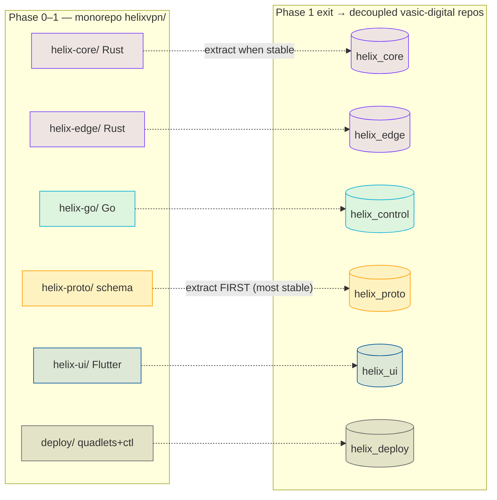
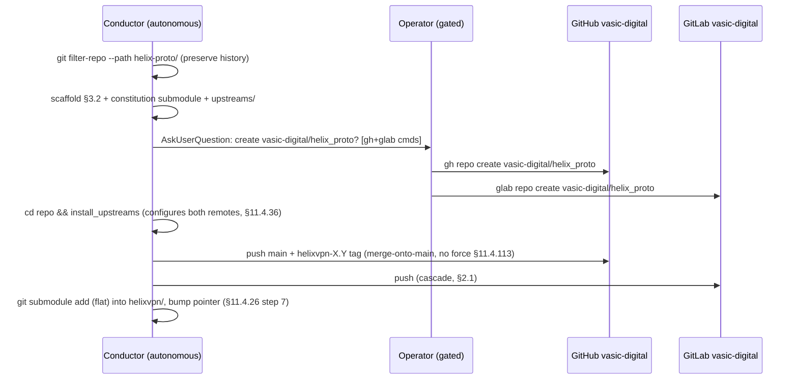
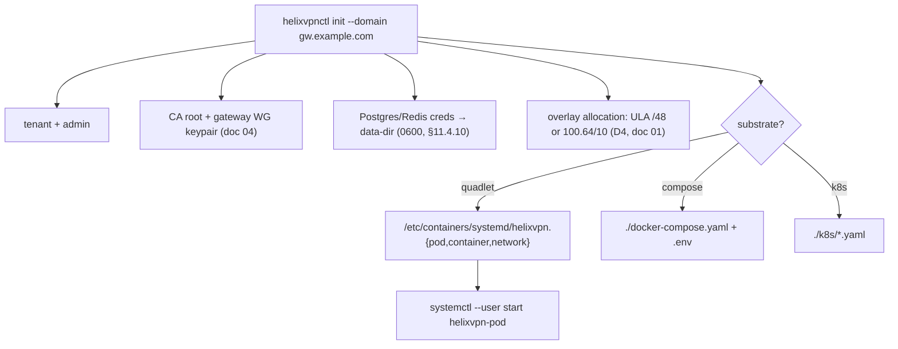
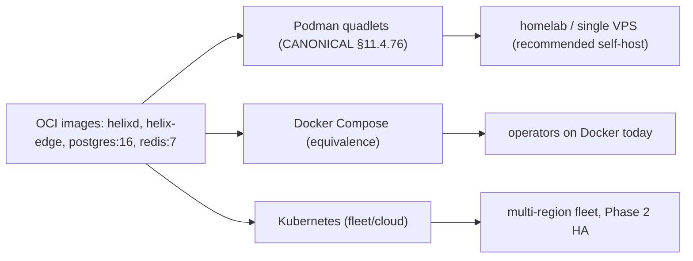
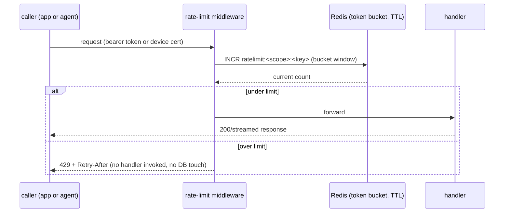

# Repo Layout, Tooling, Deployment & Helix-Ecosystem Integration

**Revision:** 2
**Last modified:** 2026-07-04T12:00:00Z
**Rev 2:** Added §7.5 (Rate Limiting & DDoS Resilience — control-plane API token buckets +
data-plane edge volumetric-attack mitigation, closing the gap left by Architecture-Refined.md
§4.6 mentioning Redis token buckets but no deployment-layer detail existing anywhere in Volume 6).
**Status:** active — subordinate to `SPECIFICATION.md` (the spine). Where this document disagrees with the spine on roles, principles (spine §4), or the decision register (spine §9), the spine wins until amended per §11.4.73.
**Authority:** This document owns the **physical engineering substrate** of HelixVPN: the working monorepo, the decoupled reusable-component repos, schema-first codegen, the `helixvpnctl` operator CLI, the three deployment substrates (Podman quadlets / Docker Compose / Kubernetes), and the wiring of every already-incorporated `submodules/` member into its concrete role. It is a **specification**, not the product — interface sketches, manifests, and skeletons are illustrative, not the shipping implementation (2–3 refinement passes follow).
**Evidence base:** `[04_ARCH §4/§9/§10/§11]` = `04_VPN_CLD/HelixVPN-Architecture-Refined.md`; `[04_P1]` = `HelixVPN-Phase1-MVP.md`; `[04_P0]` = `HelixVPN-Phase0-Spike.md`; `[04_UI]` = `HelixVPN-helix-ui-Flutter.md`; `[05_YBO]` = mandated-stack brief; `[SYNTHESIS]` = `v09-research/_SYNTHESIS.md`; per-LLM ids `[02_QWN] [01_DSK] [07_GMI] [10_KMI] [11_MST]`; `[research-podman_k8s]` = the Podman-Quadlet / `podman kube` / Kubernetes-for-WireGuard deep-research thread (verified against latest official sources per §11.4.99).

---

## 0. How to read this document

This document maps the *logical* architecture (data plane → doc 01, control plane → doc 02, client core + UI → doc 03, security/PKI → doc 04) onto **files, repos, build tools, and deploy units**. Three things are settled and load-bearing here:

1. **Reuse pillars** — three reusable cores (Rust transport/VPN, Flutter UI, schema-generated clients) shared by all roles and apps [04_ARCH §5/§11, SYNTHESIS §6].
2. **Decoupling target** — each reuse pillar becomes its own `vasic-digital` repo per §11.4.28/.29/.74, but **only after the spec stabilizes** (this is sequenced below, not done eagerly).
3. **Rootless-first deploy** — Podman quadlets are the *canonical* substrate (§11.4.76/.161); Compose and Kubernetes are *equivalents* for operators on those substrates, generated from the same OCI images.

Conventions: **MUST / SHOULD / MAY** carry RFC 2119 force. Open choices live in **§12 (Decision callouts)** as options + recommendation per §11.4.66/.101 — never silently resolved.

---

## 1. Two-repo-shape strategy: build in a monorepo, extract reusable repos later

### 1.1 The tension and the resolution

The constitution wants **decoupled, reusable, project-not-aware components** each in its own repo (§11.4.28/.74). The MVP wants **velocity and atomic cross-cutting changes** (one PR touches proto + Go + Rust + Dart). These pull in opposite directions only if treated as simultaneous; they are not. The resolution, recommended and binding for this spec:

> **Phase 0 → Phase 1: one working monorepo `helixvpn/`** with internal workspace boundaries that are *already* the future repo boundaries. **Post-MVP (Phase 1 exit gate): extract** the six stabilized pillars into standalone `vasic-digital` repos and re-consume them as flat submodules. Nothing is extracted before its public surface stops churning (§11.4.124 — don't split before you know the seams).

This mirrors the control-plane "one Go binary, many packages; package boundaries == future service boundaries" discipline [04_ARCH §4.1] applied at the *repository* level. It satisfies §11.4.28 (the boundaries exist from day one; they are merely co-located until stable) without paying the multi-repo coordination tax during the highest-churn phase.



### 1.2 Extraction order (most-stable-first)

| Order | Monorepo dir | Extracted repo (`vasic-digital`) | Why this order |
|---|---|---|---|
| 1 | `helix-proto/` | `helix_proto` | The schema is the contract; it must stabilize first so generated clients stop drifting. Extract at the first frozen `WatchNetworkMap` version [04_P1 §3]. |
| 2 | `helix-core/` | `helix_core` | The `Transport` trait + FFI surface survive Phase 0 by design [04_P0]; extract once iOS memory gate G3 passes and the FFI ABI freezes. |
| 3 | `helix-edge/` | `helix_edge` | Depends on `helix_core` (`helix-transport`); extract right after it. |
| 4 | `helix-ui/` | `helix_ui` | Design system + Riverpod-over-status-stream contract stable by MVP DoD [04_UI]. |
| 5 | `helix-go/` | `helix_control` | Largest churn surface (policy compiler, coordinator); extract last among code. |
| 6 | `deploy/` | `helix_deploy` | Quadlet/Compose/K8s generators + `helixvpnctl`; extract when image names + env contract freeze. |

Each extraction is a **visible commit** citing §11.4.35 ("Lifted from helixvpn monorepo to vasic-digital/helix_proto per §11.4.28"), preserves history via `git filter-repo --path helix-proto/`, and immediately re-consumes the new repo as a flat submodule (§1.4).

---

## 2. Monorepo layout (`helixvpn/`) — file-by-file

The canonical tree, with the load-bearing files spelled out. Directory and file names are **lowercase snake_case** where they are ours to name (§11.4.29); language-mandated layouts (Rust `crates/`, Dart `lib/`, Cargo/Go file names) follow their ecosystem (§11.4.29 exception).

```text
helixvpn/                                  # umbrella working repo (this repository's product code)
├── Cargo.toml                             # Rust workspace root — members: helix-core/crates/*, helix-edge
├── go.work                                # Go workspace — uses ./helix-go (+ extracted submodules later)
├── melos.yaml                             # Dart/Flutter monorepo manager (helix-ui packages)
├── buf.yaml  buf.gen.yaml  buf.lock       # schema-first codegen config (§4)
├── Makefile                               # local task runner (gen / build / test / deploy) — NO CI (§11.4.156)
├── .gitignore                             # build artifacts, .env, *.db-wal/-shm (§11.4.30)
├── .env.example                           # HELIX_RELEASE_PREFIX, infra creds template (§11.4.77/.151)
├── helix-deps.yaml                        # submodule dependency manifest (§11.4.31)
│
├── helix-proto/                           # ── reuse pillar 1: the contract ──
│   ├── proto/helix/v1/
│   │   ├── coordinator.proto              # WatchNetworkMap + NetworkMap + MapDelta [04_P1 §3]
│   │   ├── enrollment.proto               # device enroll / cert issue / revoke
│   │   └── types.proto                    # Peer, Route, TransportPolicy, DnsConfig, KillSwitch
│   ├── openapi/helix-rest.v1.yaml         # Console/Access/Connector REST surface [04_ARCH §4.2]
│   └── gen/                               # GENERATED (gitignored) → go/ dart/ rust/ ts/
│
├── helix-core/                            # ── reuse pillar 2a: Rust client+connector core ──
│   ├── Cargo.toml                         # crate group
│   └── crates/
│       ├── helix-transport/               # Transport trait + masque/hysteria2/ss/uot impls [04_P0]
│       ├── helix-wg/                      # WireGuard control + boringtun fallback [SYNTHESIS §2]
│       ├── helix-reconcile/               # network-map declarative reconciler (diff desired↔actual)
│       ├── helix-netshield/               # kill-switch + DNS-leak state machine (doc 04 §)
│       └── helix-ffi/                     # flutter_rust_bridge v2 + UniFFI surface → Dart/Swift/Kotlin
│
├── helix-edge/                            # ── reuse pillar 2b: Rust gateway data-plane edge ──
│   ├── Cargo.toml                         # depends on helix-core/crates/helix-transport (path dep)
│   └── src/                               # quinn+h3 MASQUE termination + kernel-WG fast path [04_ARCH §4.7]
│
├── helix-go/                              # ── the Go control plane (modular monolith) ──
│   ├── go.mod                             # module helixvpn/helix-go
│   ├── cmd/
│   │   ├── helixd/                        # control-plane binary (all packages wired)
│   │   └── helixvpnctl/                   # operator CLI (Cobra) — §5
│   └── internal/                          # identity registry ipam pki policy coordinator events telemetry api store
│
├── helix-ui/                              # ── reuse pillar 3: Flutter ──
│   ├── melos.yaml                         # (or root melos.yaml governs)
│   └── packages/
│       ├── helix_design/                  # Material-3 + brand tokens, signature components [04_UI]
│       ├── helix_core_ffi/               # Dart bindings to helix-ffi (generated)
│       ├── helix_api_client/             # generated REST+Connect client from helix-proto
│       ├── app_access/                    # end-user flavor
│       ├── app_connector/                 # network-operator flavor
│       └── app_console/                   # admin flavor (web+desktop; NO core_ffi)
│
├── shims/                                 # per-platform TunnelPlatform providers (only platform code)
│   ├── apple/      # NEPacketTunnelProvider (Swift, UniFFI)
│   ├── android/    # VpnService + JNI (Kotlin)
│   ├── windows/    # wireguard-nt/wintun + privileged service (named-pipe IPC)
│   ├── linux/      # kernel WG / tun (Rust)
│   ├── harmonyos/  # Network Kit ability (ArkTS → NAPI → .so)   [Phase 3]
│   └── aurora/     # Qt/C++ + tun                                [Phase 3]
│
├── deploy/                                # ── deployment substrate (→ helix_deploy) ──
│   ├── quadlets/                          # *.pod *.container *.network *.volume (CANONICAL, §11.4.76)
│   ├── compose/docker-compose.yaml        # equivalence target for Docker operators
│   ├── k8s/                               # Helm-less plain manifests + kustomize overlays
│   ├── terraform/                         # gateway VPS provisioning (cloud-init → helixvpnctl join)
│   └── grafana/                           # dashboards-as-code (telemetry counters only)
│
├── submodules/                            # already-incorporated Helix ecosystem (§6)
│   ├── containers/  docs_chain/  helix_qa/  challenges/  security/
│   ├── vision_engine/  llm_orchestrator/  llm_provider/  llms_verifier/
│   ├── panoptic/  doc_processor/
└── constitution/                          # HelixConstitution submodule (canonical root, §11.4.35)
```

### 2.1 Workspace manifests (skeletons)

**Rust workspace** (`Cargo.toml`) — one resolver, shared lockfile, path deps so `helix-edge` reuses `helix-transport` byte-for-byte (the D5 "shares helix-transport" property [SYNTHESIS §3]):

```toml
[workspace]
resolver = "2"
members = [
  "helix-core/crates/helix-transport",
  "helix-core/crates/helix-wg",
  "helix-core/crates/helix-reconcile",
  "helix-core/crates/helix-netshield",
  "helix-core/crates/helix-ffi",
  "helix-edge",
]
[workspace.dependencies]
quinn = "0.11"          # QUIC for MASQUE (h3) — edge + client
h3 = "0.0.6"
boringtun = "0.6"       # userspace WG fallback [SYNTHESIS §2]
tokio = { version = "1", features = ["full"] }
```

**Go workspace** (`go.work`) — keeps `helixd` + `helixvpnctl` in one module pre-extraction; after extraction the `containers`/`challenges` submodules are added via `replace` directives during dev + pinned SHAs in release (§11.4.76 consumption rule):

```text
go 1.24
use ./helix-go
// post-extraction:
// use ./submodules/containers
// replace digital.vasic.containers => ./submodules/containers
```

**Melos** (`melos.yaml`) governs the Flutter tree; `runHelixApp(flavor, …)` produces all three apps from `packages/app_*` [04_UI, SYNTHESIS §5]. Console is the only Web build and omits `helix_core_ffi`.

---

## 3. Decoupled reusable-component repos (the §11.4.28/.29/.36/.74 target)

### 3.1 The six repos and their public contract

Created **after** the spec stabilizes (per §1.2 order). Each is its own GitHub **and** GitLab repo (§2.1 multi-mirror), snake_case (§11.4.29), **flat** under the consumer (no nested own-org `.gitmodules` chains — §11.4.28(C)), with an `upstreams/` recipe dir + `install_upstreams` run on clone (§11.4.36).

| Repo | Language | Public surface (the only thing consumers depend on) | Consumed by |
|---|---|---|---|
| `helix_proto` | proto+OpenAPI | `proto/helix/v1/*.proto`, `openapi/helix-rest.v1.yaml`; ships **generated** Go/Dart/Rust/TS as release artifacts | core, edge, control, ui |
| `helix_core` | Rust | `Transport` trait, `helix-wg` API, `helix-ffi` C-ABI/UniFFI surface | edge, Access/Connector apps, shims |
| `helix_edge` | Rust | gateway data-plane binary + `EdgeConfig` (no public lib API beyond config) | deploy |
| `helix_control` | Go | `helixd` binary + `internal` packages stay private; only the binary + its REST/proto contracts are the surface | deploy, helixvpnctl |
| `helix_ui` | Dart/Flutter | `helix_design` package + `runHelixApp()` entry + Riverpod status-stream contract | the 3 apps |
| `helix_deploy` | Go+YAML+HCL | `helixvpnctl` binary + quadlet/compose/k8s generators | operators |

**Decoupling invariant (§11.4.28(B)):** none of these may hardcode HelixVPN-specific hostnames, asset names, or tenant assumptions. `helix_core` is a generic WG-over-pluggable-transport engine; `helix_proto` is a generic coordination schema; both are reusable by any overlay-network project. Project specifics enter only via **config injection** (env var / config struct / constructor param) — never a hardcoded reach.

### 3.2 Per-repo scaffold checklist (applied to all six)

```text
<repo>/
├── README.md  CLAUDE.md  AGENTS.md  GEMINI.md  QWEN.md   # inherit constitution (§11.4.35/.157)
├── constitution/                                          # HelixConstitution submodule
├── upstreams/                                             # *.sh recipes: GitHub + GitLab remotes (§11.4.36)
│   ├── github.sh   gitlab.sh
├── helix-deps.yaml                                        # own-org Git SSH deps (§11.4.31)
├── .gitignore  .env.example                               # §11.4.30/.77
├── docs/                                                  # Status.md + Status_Summary.md + guides (§11.4.45/.56)
│   └── .docs_chain/contexts/<repo>.yaml                   # docs_chain export+DB sync (§11.4.106)
└── (language tree)
```

`helix-deps.yaml` for `helix_edge` (the only code repo with an own-org build-time dep):

```yaml
schema_version: 1
deps:
  - name: helix_core
    ssh_url: git@github.com:vasic-digital/helix_core.git
    ref: main
    why: "helix-edge reuses the helix-transport crate byte-for-byte (D5)"
    layout: flat
transitive_handling:
  recursive: true
  conflict_resolution: operator-required
language_specific_subtree: false
```

### 3.3 Creation procedure (operator-gated, §11.4.66)

> **Decision D-REPO-CREATE (operator-gated).** Remote repo creation (`gh repo create` / `glab repo create` on `vasic-digital`) is high-blast-radius and **cannot** be done autonomously (§11.4.101 block-only rule). The extraction PR is prepared autonomously (filtered history, scaffold, submodule pointer staged); the actual repo-create + first push is surfaced to the operator with the exact `gh`/`glab` commands. **Recommended:** create all six in one batch at the Phase-1 exit gate so the release tags share the `<PREFIX>-` prefix across every repo in one release (§11.4.151).



---

## 4. Schema-first codegen (zero-drift contract)

The single most important anti-drift mechanism: **all** Go/Dart/Rust/TS clients are *generated* from `helix-proto`; hand-written clients are forbidden so the codebases cannot drift [04_ARCH §4.2, 04_P1 §8].

### 4.1 buf for protobuf (agent contracts)

```yaml
# buf.yaml
version: v2
modules:
  - path: helix-proto/proto
lint:   { use: [STANDARD] }
breaking: { use: [FILE] }     # breaking-change detector vs the frozen contract
```

```yaml
# buf.gen.yaml — Connect (gRPC + gRPC-Web + Connect) so ONE service serves
# native agents over HTTP/2 AND browser clients [04_P1 §3]
version: v2
plugins:
  - remote: buf.build/protocolbuffers/go        ; out: helix-proto/gen/go
  - remote: buf.build/connectrpc/go             ; out: helix-proto/gen/go
  - remote: buf.build/protocolbuffers/dart      ; out: helix-proto/gen/dart
  - remote: buf.build/community/neoeinstein-prost ; out: helix-proto/gen/rust   # prost for Rust
  - remote: buf.build/community/neoeinstein-tonic ; out: helix-proto/gen/rust
```

> **Decision D-CODEGEN-NET.** buf remote plugins need network. Per §11.4.77 the regeneration mechanism must work from a clean clone. **Recommended:** vendor `protoc-gen-*` plugins as pinned binaries under `tools/` (Go `tools.go` + `go install`, Rust via `cargo install --locked`) so `make gen` runs **offline** after a one-time `make gen-tools`; `buf generate --template buf.gen.local.yaml` points at the local binaries. The remote-plugin form stays as the convenience path.

### 4.2 OpenAPI for REST (app surface)

`openapi/helix-rest.v1.yaml` → `oapi-codegen` (Go server stubs for Gin) + `openapi-generator`/`swagger_dart_code_generator` (Dart client for the three apps) [04_P1 §8]. The Console (TS/Web build) consumes the same spec via `openapi-typescript`.

### 4.3 The `make gen` contract (no CI — §11.4.156)

```makefile
gen: gen-proto gen-openapi gen-ffi      ## regenerate ALL clients from schema (run before build)
gen-proto:   ; buf generate --template buf.gen.local.yaml
gen-openapi: ; oapi-codegen -config helix-go/internal/api/oapi.cfg.yaml openapi/helix-rest.v1.yaml
gen-ffi:     ; cd helix-core/crates/helix-ffi && flutter_rust_bridge_codegen generate
verify-gen: gen                          ## §11.4.108 artifact check: regen must be a no-op
	@git diff --exit-code helix-proto/gen helix-ui/packages/helix_core_ffi \
	 || { echo "GENERATED CLIENTS STALE — run make gen"; exit 1; }
```

`verify-gen` is the **drift gate** (the local equivalent of a CI check, run in the pre-commit hook per §11.4.75): a stale generated client fails the local gate. This is the schema-first guarantee made mechanical.

---

## 5. `helixvpnctl` — the operator CLI (Cobra)

Replaces the original deployment doc's pile of bash install scripts with one Go binary [04_ARCH §4.7, 04_P1 §9]. It is the homelab front door (`init` + `systemctl start` = a running gateway) and the GitOps front door (`policy apply`).

### 5.1 Command tree

```text
helixvpnctl
├── init            --domain --data-dir [--substrate quadlet|compose|k8s]   # bootstrap (§5.3)
├── gateway
│   ├── keys                      # rotate gateway WG keys
│   └── status                    # edge health, transport ladder posture
├── enroll-token    --kind connector|client --site NAME [--qr]             # mint enrollment token
├── policy
│   ├── apply       ./policy.jsonc   # dry-run compile → persist → emit policy.updated (GitOps)
│   └── diff        ./policy.jsonc   # show compiled visibility delta without applying
├── device
│   ├── list
│   └── revoke      <id>              # revoke <1s (doc 04)
├── network         advertise|withdraw --connector ID --cidr CIDR
├── deploy
│   ├── quadlet     --out /etc/containers/systemd/   # render canonical units (§7.1)
│   ├── compose     --out ./                          # render docker-compose.yaml (§7.2)
│   └── kube        --out ./k8s/                       # render K8s manifests (§7.3)
└── join            --control URL --token T            # fleet member joins control plane (Phase 2)
```

### 5.2 Skeleton (Cobra + cited behavior)

```go
// helix-go/cmd/helixvpnctl/main.go  (illustrative)
package main

import "github.com/spf13/cobra"

func main() {
	root := &cobra.Command{Use: "helixvpnctl", Short: "HelixVPN gateway operator CLI"}
	root.AddCommand(initCmd(), enrollCmd(), policyCmd(), deviceCmd(), deployCmd())
	_ = root.Execute()
}

func initCmd() *cobra.Command {
	var domain, dataDir, substrate string
	c := &cobra.Command{Use: "init", Short: "Bootstrap a single-node gateway",
		RunE: func(cmd *cobra.Command, _ []string) error {
			// 1. generate tenant + admin user + overlay /48 (or 100.64/10 — D4, doc 01)
			// 2. mint CA root + first gateway WG keypair (doc 04 PKI)
			// 3. write Postgres+Redis creds to data-dir (mode 600, §11.4.10)
			// 4. render deploy units for the chosen substrate (default quadlet, §11.4.76)
			// 5. print: `systemctl --user start helixvpn-pod`  [04_P1 §9]
			return bootstrap(domain, dataDir, substrate)
		}}
	c.Flags().StringVar(&domain, "domain", "", "public gateway FQDN (required)")
	c.Flags().StringVar(&dataDir, "data-dir", "/var/lib/helixvpn", "")
	c.Flags().StringVar(&substrate, "substrate", "quadlet", "quadlet|compose|k8s")
	_ = c.MarkFlagRequired("domain")
	return c
}
```

### 5.3 `init` artifact set (what a fresh `init` writes)



---

## 6. Helix-ecosystem submodule integration (the part the research pre-dates)

The 16 source docs were written *before* `submodules/` was incorporated; the master spec MUST wire each in or mark not-applicable with reason [SYNTHESIS §8]. Below is the binding map. Submodules are **consumed by reference** (§11.4.106/.80 pattern) — never copied, never given HelixVPN-specific code (§11.4.28(B)).

### 6.1 Role map

| Submodule | Module / kind | HelixVPN role | Binding § | Phase |
|---|---|---|---|---|
| **containers** | `digital.vasic.containers` (Go) | **Sole** container-orchestration layer: `helixvpnctl deploy` boot/health/compose primitives **and** on-demand integration-test infra (boot Postgres+Redis+gateway for e2e, tear down) | §11.4.76/.161 | 0–1 |
| **challenges** | `digital.vasic.challenges` (Go) | Challenge engine underpinning anti-bluff acceptance Challenges (MVP DoD as executable Challenges) | §11.4.27/.5/.69 | 1 |
| **helix_qa** | HelixQA (Go) | Anti-bluff QA orchestrator: drives the 8 MVP-DoD acceptance criteria with captured evidence; crash detection; ticket generation | §11.4.27/.107/.158 | 1 |
| **docs_chain** | `vasic-digital/docs_chain` (Go) | Mechanical sync of this spec set (`final/*.md` → HTML/PDF/DOCX) **and** the workable-items SQLite DB ↔ docs | §11.4.106/.65/.93 | 0+ |
| **security** | `digital.vasic.security` (Go) | Control-plane defensive libs: PII redaction in logs (keep no-logging honest), HTTP security headers on REST, AES-256-GCM at-rest for the data-dir secrets, SSRF-deny on outbound, privesc scan of the edge container | §7 (doc 04) | 1 |
| **vision_engine** | VisionEngine (Go) | Video/screenshot evidence analysis for Flutter UI Challenges (connect-flow recordings → OCR/state verify) | §11.4.107/.158/.159 | 1–2 |
| **panoptic** | Panoptic (Go) | UI automation + screenshot/video **capture** harness feeding vision_engine (web+desktop+mobile app drive) | §11.4.107/.154 | 1–2 |
| **doc_processor** | DocProcessor (Go) | Feature-map extraction from this spec → the per-feature Status ledger (§11.4.153) coverage cross-check | §11.4.153 | 1 |
| **llm_provider** | `digital.vasic.llmprovider` (Go) | Provider abstraction (circuit-breaker/retry) **iff** any LLM-assisted op ships (e.g. natural-language policy authoring). Not in the packet/control path. | §11.4.74 | 2 (opt) |
| **llm_orchestrator** | `digital.vasic.llmorchestrator` (Go) | Headless CLI-agent orchestration for the *development* loop (subagent QA), not a product runtime dependency | §11.4.70 | dev-only |
| **llms_verifier** | LLMsVerifier (Go) | Verifies any LLM the dev loop uses ("do you see my code?" gate); **not** a HelixVPN runtime component | §11.4.78 | dev-only |

### 6.2 Not-applicable / dev-only justifications (§11.4.6, no silent drop)

- **llm_orchestrator, llms_verifier** — **dev-loop only.** HelixVPN ships no LLM in its data or control path; these support the autonomous build/QA loop (subagent dispatch, model verification). They are correctly present as submodules (the project uses them to *build* itself) but are **not** linked into `helixd`/`helix-edge`. Marking them runtime-N/A is the honest classification, not an omission.
- **llm_provider** — **conditional.** Only binds if Phase-2 ships LLM-assisted policy authoring (a Console convenience: "natural language → Tailscale-ACL"). If that feature is cut, `llm_provider` stays dev-only. Surfaced as **Decision D-LLM-POLICY** (§12).
- **vision_engine / panoptic** — **test-infra, not product.** They validate the Flutter apps' user-visible flows with captured video evidence per §11.4.107/.159; they never ship inside an app bundle.

### 6.3 containers submodule — the canonical deploy + test-infra seam

`containers` is the **only** sanctioned path to docker/podman/k8s from this project (§11.4.76 — no ad-hoc docker/podman commands outside `pkg/boot`/`pkg/compose`/`pkg/health`). Two concrete uses:

**(A) On-demand integration-test infra** (the §11.4.76 on-demand-infra invariant — operators never `podman machine` by hand; the test entry point boots infra):

```go
// helix-go/internal/store/integration_test.go  (illustrative)
import (
	"digital.vasic.containers/pkg/boot"
	"digital.vasic.containers/pkg/health"
)

func TestWatchNetworkMapDeltaStream(t *testing.T) {
	ctx := context.Background()
	infra := boot.Compose(ctx, boot.Spec{                 // rootless Podman (§11.4.161)
		Services: []boot.Service{
			{Name: "pg",    Image: "docker.io/library/postgres:16", Port: 5432},
			{Name: "redis", Image: "docker.io/library/redis:7",     Port: 6379},
		},
	})
	t.Cleanup(func() { infra.Down(ctx) })                 // §11.4.14 quiescent teardown
	health.WaitReady(ctx, infra, 30*time.Second)          // not a sleep — real readiness probe
	// ... drive enroll → advertise → policy → assert MapDelta [04_P1 §11.1]
}
```

This is anti-bluff-critical (§11.4.76(5)): an integration test claiming to exercise the streamed `WatchNetworkMap` MUST actually boot Postgres+Redis via the submodule — a short-circuit fake that skips boot is a §11.4 violation.

**(B) Deploy generation** — `helixvpnctl deploy {quadlet,compose,kube}` renders manifests through `containers/pkg/compose` primitives so the three substrates derive from one in-code spec rather than three hand-maintained files (§11.4.81 cross-platform-parity: one source, per-substrate render).

### 6.4 docs_chain — spec + workable-items sync

This very document set is a docs_chain corpus. The consumer context lives at `.docs_chain/contexts/helixvpn_spec.yaml` and declares: each `final/*.md` → `.html`/`.pdf`/`.docx` (§11.4.65/.153 four-format), the workable-items SQLite DB (§11.4.93/.95) ↔ a generated `docs/Issues.md` view, and content-hash change detection (§11.4.86, not mtime). The engine is invoked by `make docs-sync` and verified by `make docs-verify` (the deterministic gate, §11.4.106(C)).

```yaml
# .docs_chain/contexts/helixvpn_spec.yaml  (illustrative)
version: 1
nodes:
  - id: spec-00..05
    glob: docs/research/mvp/final/*.md
    transforms:
      - exec: "pandoc {src} -o {src%.md}.html"
      - exec: "weasyprint {src%.md}.html {src%.md}.pdf"
      - exec: "pandoc {src} -o {src%.md}.docx"     # §11.4.153 DOCX adds to the export set
  - id: workable-items
    sync:
      - left: docs/.workable_items.db             # git-tracked SSoT (§11.4.95)
        right: docs/Issues.md
        authority: db                              # DB wins; doc is a view
```

---

## 7. Deployment substrates (three, one image set)

All three substrates run the **same** OCI images (`helixd`, `helix-edge`, plus stock `postgres`/`redis`). Podman quadlets are **canonical** (§11.4.76/.161); Compose and K8s are **equivalents** for operators on those runtimes [research-podman_k8s]. The data-plane edge needs `NET_ADMIN` + UDP/443 (MASQUE) + kernel WG; everything else is unprivileged.



### 7.1 Podman quadlets (canonical, rootless)

The pod groups edge + control + Postgres + Redis for single-node self-host [04_P1 §9.2]. `helixvpnctl init` writes these; `systemctl --user start helixvpn-pod` runs them — **rootless, no Docker daemon** (§11.4.161).

```ini
# /etc/containers/systemd/helixvpn.pod
[Pod]
PodName=helixvpn
PublishPort=443:443/udp        # MASQUE/QUIC ingress
PublishPort=51820:51820/udp    # plain-WG ingress (auto-ladder base, doc 01)
```

```ini
# /etc/containers/systemd/helix-edge.container — DATA PLANE (Phase-0 G4 winner)
[Unit]
Description=HelixVPN data-plane edge
[Container]
Image=ghcr.io/helixdevelopment/helix-edge:1.0
Pod=helixvpn.pod
AddCapability=NET_ADMIN        # ONLY this; drop the rest (doc 04 §)
ReadOnly=true                  # read-only rootfs (§11.4 security invariant)
SecurityLabelType=helixvpn_edge.process   # seccomp/SELinux confinement
# no SSH, no shell in this image
[Install]
WantedBy=default.target
```

```ini
# /etc/containers/systemd/helixd.container — CONTROL PLANE
[Container]
Image=ghcr.io/helixdevelopment/helixd:1.0
Pod=helixvpn.pod
Environment=DATABASE_URL=postgres://helix_app@localhost/helix   # non-superuser → RLS enforced (doc 02)
Environment=REDIS_URL=redis://localhost:6379
Secret=helix_db_pw,type=env,target=PGPASSWORD                   # podman secret, never in unit text
ReadOnly=true
NoNewPrivileges=true
```

```ini
# /etc/containers/systemd/helix-pg.container  (redis analogous)
[Container]
Image=docker.io/library/postgres:16
Pod=helixvpn.pod
Volume=helix-pgdata.volume:/var/lib/postgresql/data:Z
Environment=POSTGRES_USER=helix_owner POSTGRES_DB=helix
Secret=helix_db_pw,type=env,target=POSTGRES_PASSWORD
```

### 7.2 Docker Compose (equivalence target)

For operators on Docker today. Same images, same env contract; loses rootless-by-default (operator runs `docker compose` in rootless mode where available — documented, §11.4.112 honest gap if their host can't).

```yaml
# deploy/compose/docker-compose.yaml
name: helixvpn
services:
  pg:
    image: docker.io/library/postgres:16
    environment: { POSTGRES_USER: helix_owner, POSTGRES_DB: helix }
    secrets: [helix_db_pw]
    volumes: [helix-pgdata:/var/lib/postgresql/data]
  redis:
    image: docker.io/library/redis:7
  helixd:
    image: ghcr.io/helixdevelopment/helixd:1.0
    environment:
      DATABASE_URL: postgres://helix_app@pg/helix    # non-superuser → RLS
      REDIS_URL: redis://redis:6379
    secrets: [helix_db_pw]
    read_only: true
    cap_drop: [ALL]
    depends_on: [pg, redis]
  helix-edge:
    image: ghcr.io/helixdevelopment/helix-edge:1.0
    cap_drop: [ALL]
    cap_add: [NET_ADMIN]            # ONLY NET_ADMIN
    read_only: true
    ports: ["443:443/udp", "51820:51820/udp"]
    depends_on: [helixd]
secrets:
  helix_db_pw: { file: ./secrets/db_pw }   # 0600, gitignored (§11.4.10/.30)
volumes: { helix-pgdata: {} }
```

### 7.3 Kubernetes (fleet / Phase-2 HA)

Plain manifests (kustomize overlays, Helm-less to start) [research-podman_k8s]. The edge runs as a `DaemonSet` with `hostNetwork: true` (so UDP/443 lands on the node IP without an extra hop) + `NET_ADMIN`; control plane is a stateless `Deployment` (HA-ready, doc 02 §); Postgres is a `StatefulSet` (or external managed PG/Patroni in real fleets).

> **Decision D-K8S-EDGE-INGRESS.** WireGuard/MASQUE is **UDP**; most cloud L7 ingress can't carry it. Options: **(a)** `hostNetwork` DaemonSet edge (node IP = gateway IP — simplest, recommended for self-host-on-k8s); **(b)** `Service type=LoadBalancer` with a UDP-capable LB (MetalLB on-prem, NLB on AWS) [research-podman_k8s]; **(c)** `NodePort` UDP (homelab). **Recommended:** (a) for self-host parity with the quadlet model, (b) for managed-cloud fleets.

```yaml
# deploy/k8s/edge-daemonset.yaml
apiVersion: apps/v1
kind: DaemonSet
metadata: { name: helix-edge, namespace: helixvpn }
spec:
  selector: { matchLabels: { app: helix-edge } }
  template:
    metadata: { labels: { app: helix-edge } }
    spec:
      hostNetwork: true                  # UDP/443 on the node IP (D-K8S-EDGE-INGRESS opt a)
      containers:
        - name: edge
          image: ghcr.io/helixdevelopment/helix-edge:1.0
          securityContext:
            readOnlyRootFilesystem: true
            allowPrivilegeEscalation: false
            capabilities: { drop: ["ALL"], add: ["NET_ADMIN"] }
          ports:
            - { containerPort: 443,   protocol: UDP, hostPort: 443 }
            - { containerPort: 51820, protocol: UDP, hostPort: 51820 }
---
# deploy/k8s/helixd-deployment.yaml
apiVersion: apps/v1
kind: Deployment
metadata: { name: helixd, namespace: helixvpn }
spec:
  replicas: 2                            # stateless coordinators → HA (doc 02 §)
  selector: { matchLabels: { app: helixd } }
  template:
    metadata: { labels: { app: helixd } }
    spec:
      containers:
        - name: helixd
          image: ghcr.io/helixdevelopment/helixd:1.0
          env:
            - { name: DATABASE_URL, value: "postgres://helix_app@helix-pg/helix" }
            - { name: REDIS_URL,    value: "redis://helix-redis:6379" }
            - name: PGPASSWORD
              valueFrom: { secretKeyRef: { name: helix-db, key: password } }
          securityContext:
            readOnlyRootFilesystem: true
            runAsNonRoot: true
            capabilities: { drop: ["ALL"] }
---
# deploy/k8s/pg-statefulset.yaml  (abridged)
apiVersion: apps/v1
kind: StatefulSet
metadata: { name: helix-pg, namespace: helixvpn }
spec:
  serviceName: helix-pg
  replicas: 1                            # → Patroni HA in Phase-2 fleet (doc 02 §)
  template:
    spec:
      containers:
        - name: postgres
          image: docker.io/library/postgres:16
          env:
            - { name: POSTGRES_USER, value: helix_owner }
            - { name: POSTGRES_DB,   value: helix }
            - name: POSTGRES_PASSWORD
              valueFrom: { secretKeyRef: { name: helix-db, key: password } }
          volumeMounts: [{ name: data, mountPath: /var/lib/postgresql/data }]
  volumeClaimTemplates:
    - metadata: { name: data }
      spec: { accessModes: ["ReadWriteOnce"], resources: { requests: { storage: 10Gi } } }
```

### 7.4 Substrate recommendation

| Operator profile | Recommended substrate | Why |
|---|---|---|
| Homelab / single VPS (the primary buyer, spine §2) | **Podman quadlets** | Rootless, no daemon, `helixvpnctl init` one-shot — the §11.4.76/.161 canonical path |
| "We run Docker" shops | **Docker Compose** | Same images, lowest friction; rootless where their host allows |
| Multi-region fleet (Phase 2 HA) | **Kubernetes** | DaemonSet edge + stateless `helixd` replicas + Patroni PG = the doc-02 HA story |

---

## 7.5 Rate limiting & DDoS resilience (enterprise hardening)

**Gap closed (this revision).** `04_ARCH §4.6` names "rate limiting (token buckets per API key)"
as a Redis use, but no document in Volume 6 ever operationalized it, and the **data-plane**
volumetric-attack surface (the public UDP/443 + UDP/51820 listeners) had no mitigation story at
all. A public gateway with an unrated API and an un-mitigated UDP listener is not production-grade
— this section closes both halves. It composes with, and does not replace, host-level cloud DDoS
scrubbing (Cloudflare Spectrum / AWS Shield / a bare-metal provider's own filtering), which is an
operator-chosen, infrastructure-layer control outside this spec's scope (§11.4.6 — never assumed
present; the gateway's own defenses below hold even without it).

### 7.5.1 Control-plane API rate limiting (`helixd:8443`)

Two limiter layers, both backed by the Redis token-bucket primitive already declared for presence
[`04_ARCH §4.6`]:

| Layer | Key | Bucket | Enforcement point | On exceed |
|---|---|---|---|---|
| **Per-API-token** | `ratelimit:token:<token_id>` | 60 req/min sustained, burst 20 (mutating routes tighter: `policy set`/`device revoke` at 10/min) | Gin middleware, before any handler runs | `429 Too Many Requests` + `Retry-After`; **no DB write attempted** |
| **Per-source-IP (pre-auth)** | `ratelimit:ip:<src_ip_hash>` | 30 req/min to unauthenticated routes (`/v1/enroll-tokens/redeem`, health) | edge-of-Gin middleware, keyed by a **salted hash** of the source IP (never the raw IP, C3 — the hash is rotated daily so it cannot become a durable per-IP profile) | `429`; repeated violation escalates to the transient-ban list (§7.5.2) |
| **Per-device-cert (agent plane)** | `ratelimit:device:<device_id>` | `WatchNetworkMap` reconnect storms: max 1 reconnect/2s per device (exponential backoff enforced client-side per the reconciler, server-side as a backstop) | Connect-RPC interceptor | connection closed with a structured `RESOURCE_EXHAUSTED` status; the reconciler's own backoff (client-side) is the primary control, this is the belt |

Anti-bluff note (§11.4.69): a `429` decision and its counter are **counts only** — the limiter
never logs the request body, headers, or the resolved plaintext IP; only the salted-hash bucket
key and a monotonic counter exist in Redis (TTL'd, same ephemeral-C2 posture as presence). This
keeps rate-limiting inside the no-logging invariant rather than becoming a side-channel connection
log.



### 7.5.2 Data-plane edge — volumetric / handshake-flood mitigation

The edge's public listeners (`:443/udp` MASQUE, `:51820/udp` plain-WG) are the classic
UDP-amplification and handshake-flood target. Concrete, deployable mitigations, layered
cheapest-first (this is a SPEC — the operator applies the layers their threat model warrants;
none is claimed sufficient alone):

| Layer | Mechanism | Mitigates | Honest limit |
|---|---|---|---|
| **WireGuard's own cookie mechanism** | WG's Noise-IK handshake already includes a stateless cookie-reply under load (upstream WireGuard design, not HelixVPN-specific) — the kernel/`boringtun` implementation rejects malformed/replayed handshake-init packets cheaply, before any per-peer state is allocated | Basic handshake-flood amplification | Does not stop raw bandwidth-saturation floods — that is an upstream-network concern |
| **Per-source-IP handshake-attempt cap** | The edge counts failed-handshake attempts per source IP (in-memory ring buffer, NOT Redis — this is a data-plane, sub-millisecond hot-path counter, never a durable log) over a short window (e.g. 20 attempts/10s) | Repeated failed-handshake probing (the same class MASQUE detection probes exercise) | In-memory only; a restart clears the counters (acceptable — the counters are a rate-limit, not identity) |
| **Transient IP ban (fail2ban-equivalent)** | On exceeding the handshake-attempt cap, the edge inserts a short-TTL (default 10 min) nftables/eBPF DROP rule for that source IP — the same verdict-map mechanism the policy compiler already programs (`01-data-plane.md`), reused for a security verdict rather than a policy verdict | Sustained single-source handshake floods | The ban is an IP, not an identity; NAT'd attackers behind a shared IP could collaterally rate-limit a legitimate peer sharing that IP — documented, not silently assumed away |
| **QUIC/MASQUE initial-packet validation** | `quinn`'s address-validation (Retry packets) is enabled for the MASQUE listener, forcing a round-trip before the server commits per-connection state to an unvalidated source address — this is the QUIC-native analogue of a TCP SYN cookie | QUIC-based amplification/spoofing floods | Adds one RTT to first connect under load; only enabled when the edge is under measured load (a static always-on Retry adds latency for the common case) |
| **Upstream/infra-layer scrubbing (operator-chosen, out of this spec)** | Cloud provider DDoS protection (AWS Shield, Cloudflare Spectrum for UDP, a bare-metal host's own filtering) in front of the gateway's public IP | Raw volumetric bandwidth floods that no application-layer control can absorb | **Not assumed present.** The edge-level controls above are the floor that holds with zero infra dependency; upstream scrubbing is a recommended addition, never a precondition for the spec's own controls to function |

> **Consistency with C3 (no-logging).** Every counter in this section is a **rate-limit
> decision counter**, never a connection-content log: the in-memory handshake-attempt ring buffer
> and the transient-ban nftables rule both hold only `(ip_or_hash, count, expiry)` — no
> destination, no payload, no duration-of-session. A transient ban list is not a connection log
> because it records *attempts to authenticate*, not *sessions established* or *traffic carried*,
> and it self-expires (TTL) rather than accumulating.

### 7.5.3 Anti-bluff evidence plan

| Claim | Captured-evidence proof |
|---|---|
| Per-token 429 fires at the stated threshold | load-test driving 2× the bucket rate → `429` responses measured at the exact threshold; Redis bucket key TTL confirmed |
| Pre-auth per-IP limiter uses a salted hash, never a raw IP | grep the Redis keyspace under load → no plaintext IP present, only hashed keys; paired mutation removing the salt → the same test that inspects the keyspace FAILs (proves the check is real) |
| Edge handshake-flood cap triggers a transient ban | chaos test: script N rapid failed handshakes from one source → verdict-map DROP rule appears with the expected TTL, then self-expires; captured `nft`/eBPF map dump before/after |
| QUIC Retry engages under load | load-test past the configured threshold → first-flight packets receive a Retry before connection establishment; packet capture |
| No rate-limit counter becomes a durable log | `schemalint` (no-logging runtime signature, §11.4.108) stays green with rate-limiting active under load | 

Composes with §11.4.5/.69/.85 (stress+chaos evidence), §11.4.108 (no-logging runtime signature
unaffected by the new counters), and the existing `01-data-plane.md` verdict-map mechanism (the
transient-ban rule reuses the same enforcement point as policy verdicts, not a second firewall
subsystem).

---

## 8. Build & local-dev orchestration (`Makefile`, no CI)

Per §11.4.156 there is **no** active server-side CI; enforcement is the local pre-build sweep + git hooks (§11.4.75). The `Makefile` is the single task surface.

```makefile
# Makefile (illustrative — the local task runner; §11.4.156 no CI)
.PHONY: gen build test deploy docs-sync verify
gen:        ; @$(MAKE) gen-proto gen-openapi gen-ffi          # §4.3
build: gen  ; cargo build --release && go build ./helix-go/... && melos run build
test:       ; cargo test && go test ./helix-go/... && melos run test   # boots infra via containers/pkg/boot (§6.3)
qa:         ; go run ./submodules/helix_qa/cmd/orchestrator --suite mvp-dod   # 8 acceptance Challenges (§6.1)
docs-sync:  ; docs_chain sync   --context .docs_chain/contexts/helixvpn_spec.yaml  # §6.4
docs-verify:; docs_chain verify --context .docs_chain/contexts/helixvpn_spec.yaml  # deterministic gate
deploy:     ; helixvpnctl deploy quadlet --out /etc/containers/systemd/
verify: verify-gen docs-verify                              # local release gate (§11.4.40 pre-tag)
```

The dev inner loop (Phase 0–1): `make gen` → `make build` → `make test` (containers submodule boots Postgres+Redis on demand) → `make qa` (helix_qa drives the MVP-DoD acceptance Challenges with captured evidence). No step requires a remote runner.

---

## 9. Release prefixing & versioning (§11.4.151)

Every release tag/version on the monorepo **and** every extracted reusable repo MUST carry the `<PREFIX>-` prefix, resolved as: (1) `HELIX_RELEASE_PREFIX` from `.env` (authoritative; documented in tracked `.env.example`), else (2) lowercased snake_case root dir name = `helix_vpn`. One release tags all repos with the **same** prefix in one batch (§3.3 recommendation) so `git tag -l 'helix_vpn-*'` enumerates the whole release surface across GitHub + GitLab. OCI images are tagged `<PREFIX>-<version>` to match. No force-push anywhere — every push is merge-onto-latest-main fast-forward (§11.4.113).

---

## 10. Mapping to workable items (§11.4.93)

This document's deliverables become workable items in the git-tracked SQLite SSoT (`docs/.workable_items.db`, §11.4.95). Representative seed items:

| ATM-id (illustrative) | Item | Type | Phase | Dep |
|---|---|---|---|---|
| HVPN-050 | Stand up `helixvpn/` monorepo workspaces (Cargo/go.work/melos/buf) | Task | 0 | — |
| HVPN-051 | `helix-proto` contract + `make gen` + `verify-gen` drift gate | Feature | 0 | HVPN-050 |
| HVPN-052 | `helixvpnctl init` → quadlet render → `systemctl start` (MVP-DoD #1) | Feature | 1 | HVPN-051 |
| HVPN-053 | containers-submodule integration-test infra harness (§6.3) | Task | 1 | HVPN-050 |
| HVPN-054 | docs_chain context for this spec set + workable-items DB sync (§6.4) | Task | 0 | — |
| HVPN-055 | Compose + K8s substrate generators + parity tests (§7.2/§7.3) | Feature | 1–2 | HVPN-052 |
| HVPN-056 | Extract 6 reusable repos to vasic-digital (operator-gated, §3.3) | Task | 1-exit | all |

Each carries status/type/id on all surfaces (§11.4.148), a comprehensive description (§11.4.148-D2), and — for Features — a reproduce-first acceptance Challenge in helix_qa (§11.4.146 + §6.1).

---

## 11. Anti-bluff evidence plan for this document's claims (§11.4.5/.69/.107)

| Claim | Captured-evidence proof (Phase) |
|---|---|
| `make gen` is offline-reproducible (§4.3) | clean-clone container run with network off → `make gen-tools && make gen` exits 0; transcript under `docs/qa/<run-id>/` |
| `verify-gen` catches drift (§4.3) | paired §1.1 mutation: edit a generated file → `verify-gen` FAILs |
| quadlet/compose/k8s run the same image (§7) | three substrates boot the gateway; `helixvpnctl gateway status` GREEN on each; recorded per §11.4.159 |
| integration infra really boots (§6.3) | `go test` with `boot.Compose`; mutation removing `boot.Compose` → test FAILs (proves it wasn't a fake) |
| docs_chain keeps exports in sync (§6.4) | `docs-verify` GREEN; mutation backdating an `.html` → FAIL |
| no nested own-org submodule chains (§3) | `CM-OWNED-SUBMODULE-LAYOUT` audit of the 6 extracted repos GREEN |

---

## 12. Decision callouts (options + recommendation, never silent — §11.4.66/.101)

| id | Decision | Options | Recommendation |
|---|---|---|---|
| **D-REPO-CREATE** | When to extract reusable repos | (a) eager per-pillar; (b) one batch at Phase-1 exit | **(b)** — shared release prefix, stable seams (§3.3) |
| **D-CODEGEN-NET** | buf plugin source | (a) remote plugins; (b) vendored local binaries | **(b)** for `make gen` offline reproducibility (§4.1) |
| **D-K8S-EDGE-INGRESS** | UDP ingress on k8s | (a) hostNetwork DaemonSet; (b) UDP LoadBalancer; (c) NodePort | **(a)** self-host parity, **(b)** managed fleet (§7.3) |
| **D-LLM-POLICY** | Ship LLM-assisted policy authoring? | (a) yes (binds `llm_provider`); (b) no (stays dev-only) | Defer to Phase 2; default **(b)** until product-validated (§6.2) |
| **D-SUBSTRATE-DEFAULT** | `init` default substrate | quadlet / compose / k8s | **quadlet** (§11.4.76/.161 canonical) — flag overrides |

These compose with the spine's decision register (D1–D8); none is resolved here without the operator where it is irreversible/high-blast-radius (§11.4.101).

---

## Sources verified

- `04_VPN_CLD/HelixVPN-Architecture-Refined.md` §4.1–4.7 (modular monolith, API surface, event bus, Podman edge), §10 (deploy/HA/DR, Terraform, GitOps), §11 (repo layout), §12 (reproducible builds) — `[04_ARCH]`.
- `04_VPN_CLD/HelixVPN-Phase1-MVP.md` §2/§3 (repo skeleton, protobuf `WatchNetworkMap`), §8 (codegen — buf + OpenAPI), §9 (`helixvpnctl` + quadlets), §11 (test layers + MVP DoD) — `[04_P1]`.
- `04_VPN_CLD/HelixVPN-Phase0-Spike.md` (surviving `Transport` trait + FFI surface that define extraction seams), `HelixVPN-helix-ui-Flutter.md` (`runHelixApp` flavors, Melos) — `[04_P0] [04_UI]`.
- `05_VPN_YBO.md` (mandated Go/Gin/Postgres/Redis/Podman rootless stack) — `[05_YBO]`.
- `v09-research/_SYNTHESIS.md` §2 (stack floor), §6 (repo layout / reuse pillars), §8 (submodule wiring the research misses), §9 (constitution bindings) — `[SYNTHESIS]`.
- `submodules/{containers,docs_chain,helix_qa,challenges,security,vision_engine,doc_processor,llm_provider,llm_orchestrator,llms_verifier,panoptic}/README.md` (module identities, public surfaces, anti-bluff guarantees) — read in full for §6.
- `[research-podman_k8s]` — Podman Quadlet `.pod`/`.container`/`.network` unit semantics, rootless `systemctl --user` lifecycle, `podman kube generate`, Kubernetes UDP ingress for WireGuard (hostNetwork DaemonSet vs UDP LoadBalancer/MetalLB/NLB vs NodePort), `NET_ADMIN`/`hostPort` requirements for in-cluster tunnels; cross-referenced against latest official Podman + Kubernetes docs per §11.4.99.

*Constitution bindings applied: §11.4.44 (revision header), §11.4.28/.29/.31/.36/.74 (decoupled snake_case flat submodules + upstreams + deps manifest), §11.4.76/.161 (containers submodule sole orchestration + rootless), §11.4.106/.65/.153 (docs_chain sync + HTML/PDF/DOCX exports — generated in refinement), §11.4.93/.95 (phases→workable items in git-tracked SQLite SSoT), §11.4.151 (release prefix), §11.4.156 (no active CI), §11.4.113 (no force-push), §11.4.66/.101 (decision discipline — §12 + D-REPO-CREATE operator-gated), §11.4.27/.107/.146 (anti-bluff QA via helix_qa/challenges/vision_engine), §11.4.6 (no-guessing — every N/A submodule justified, never silently dropped). §11.4.5/.69/.107 captured-evidence proofs enumerated in §11.*
