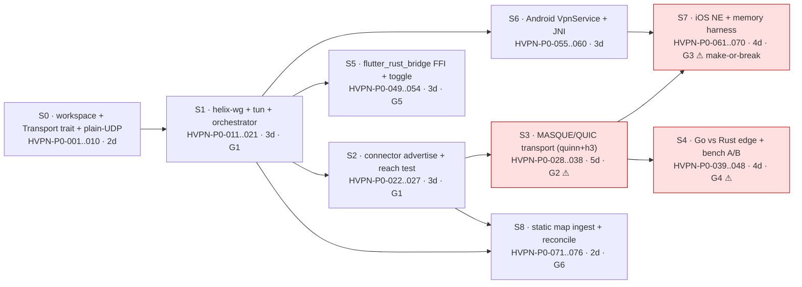
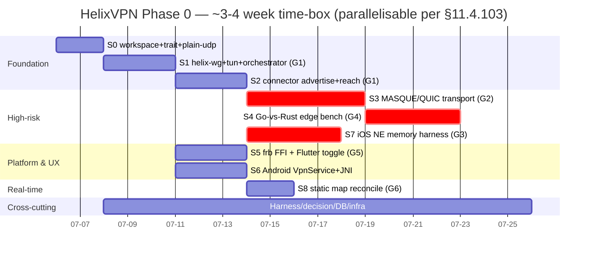

# Phase 0 (Spike) — Work Breakdown: phases → tasks → subtasks

**Revision:** 2
**Last modified:** 2026-07-04T12:00:00Z
**Rev 2:** Independent gap-analysis pass (§14 risk register now cross-references
`v00-meta/decision-register.md`'s per-decision reversal criteria so a gate failure's
architectural consequence is traceable to the exact decision it re-opens, not just
a prose fallback). No contradictions found against `HelixVPN-Phase0-Spike.md` (the
original CLD source) or `v07-execution/{workable-items-model,dependency-graph,
subtask-deepening-p1}.md` — this WBS's 3-tier epic→task→subtask breakdown, gate
evidence methodology (§12), and risk register (§14) were independently verified
already concrete (falsifiable acceptance + captured-evidence method per item);
R5 (task/subtask tier asymmetry, `REFINEMENT_NOTES.md`) does not apply to this
document — Phase 0 was always the 3-tier side of the asymmetry.

> Master technical specification — document 06 of the HelixVPN set.
> Scope: the **complete Work Breakdown Structure (WBS)** for **Phase 0 — the Spike**:
> every exit gate `G1..G6` (question + go/no-go bar), every milestone `S0..S8` decomposed
> into numbered **TASKS** and **SUBTASKS** with stable DB-ready ids `HVPN-P0-NNN`, and the
> surviving interfaces / harnesses (iOS memory rig, Go-vs-Rust edge benchmark, netns +
> nftables-DPI + netem rig with concrete commands). This is a SPEC — it describes the work
> and its interfaces; it does NOT build the product (2–3 refinement passes follow). This
> document is the **single source for the workable-items SQLite DB** (§11.4.93/.95): the
> `HVPN-P0-NNN` rows + fields below are authored to load directly.
>
> Source evidence cited inline by id: [04_P0] = `04_VPN_CLD/HelixVPN-Phase0-Spike.md`;
> [04_ARCH] = `04_VPN_CLD/HelixVPN-Architecture-Refined.md`; [04_P1] = Phase1-MVP;
> [SYNTHESIS]; LLM analyses [02_QWN] [01_DSK] [07_GMI] [10_KMI] [11_MST]; external facts
> [research-masque] (RFC 9297/9298/9221), [research-boringtun], [research-quinn].

---

## 0. How to read this WBS (and the DB schema it populates)

Phase 0 is **time-boxed to ~3–4 focused weeks** [04_P0 §0]. It produces throwaway-quality
*implementations* behind production-quality *interfaces*: the traits, FFI signatures, and
wire contracts here are meant to **survive into Phase 1** [04_P0 intro]. A gate that cannot
be cleared inside the box **is the finding** — escalate the decision rather than overrun
silently [04_P0 §0, §13].

### 0.1 Decomposition hierarchy

```
PHASE 0 (Spike)
 ├── EXIT GATES        G1..G6              — the go/no-go questions (§1)
 ├── MILESTONES        S0..S8              — independently demoable slices (§3..§11)
 │     ├── TASKS       HVPN-P0-NNN         — a unit of delivery (own acceptance + evidence)
 │     │     └── SUBTASKS HVPN-P0-NNN      — the smallest tracked work, each its own row
 └── CROSS-CUTTING     HVPN-P0-077..080    — harness, decision log, DB/CI, infra (§12)
```

Every TASK and every SUBTASK is a **workable item** with the same closed field set, so the
table rows below load 1:1 into the `docs/workable_items.db` schema (§0.3). IDs are
**monotonic, never renumbered** (§11.4.54): allocated once, `parent` expresses hierarchy.

### 0.2 Field dictionary (every item row carries these)

| Field | Meaning |
|---|---|
| `id` | stable `HVPN-P0-NNN` (§11.4.54) — primary key, never reused |
| `parent` | the owning milestone id (`S0..S8`) or task id; `—` for milestone-level tasks |
| `kind` | `task` \| `subtask` \| `gate` |
| `title` | ≥6-word self-contained meaning (§11.4.91) |
| `gate` | which exit gate(s) this item advances: `G1..G6` or `—` |
| `description` | what / how it manifests / acceptance intent (§11.4.148 D2) |
| `depends_on` | upstream `HVPN-P0-NNN` ids that MUST be done first |
| `deliverable` | the concrete artifact produced (file/binary/CSV/report) |
| `acceptance` | falsifiable pass condition with captured PHYSICAL evidence (§11.4.5/.69/.107) |
| `est_effort` | engineer-days (rough, [04_P0 §2] day estimates are the anchor) |
| `test_types` | the §11.4.169 closed-set test-type codes required (§0.4) |

### 0.3 Workable-items DDL (§11.4.93 — this WBS loads into it)

```sql
-- docs/workable_items.db  (git-tracked, §11.4.95). Phase-0 subset of the canonical schema.
CREATE TABLE IF NOT EXISTS items (
    id            TEXT PRIMARY KEY,                       -- 'HVPN-P0-001'
    parent        TEXT REFERENCES items(id),              -- milestone/task ownership
    kind          TEXT NOT NULL CHECK (kind IN ('task','subtask','gate','milestone')),
    type          TEXT NOT NULL CHECK (type IN ('Bug','Feature','Task')) DEFAULT 'Task',
    status        TEXT NOT NULL DEFAULT 'Queued',         -- §11.4.15 closed set
    severity      TEXT NOT NULL DEFAULT 'Normal',
    title         TEXT NOT NULL CHECK (length(title) >= 40),   -- §11.4.91
    gate          TEXT,                                   -- 'G1'..'G6' or NULL
    description   TEXT NOT NULL CHECK (length(description) >= 40),
    depends_on    TEXT NOT NULL DEFAULT '[]',             -- JSON array of ids
    deliverable   TEXT NOT NULL,
    acceptance    TEXT NOT NULL,
    est_effort_d  REAL NOT NULL DEFAULT 1.0,
    test_types    TEXT NOT NULL DEFAULT '[]',             -- JSON array of §11.4.169 codes
    created_at    TEXT NOT NULL,
    modified_at   TEXT NOT NULL
);
CREATE TABLE IF NOT EXISTS gates (
    id            TEXT PRIMARY KEY,                       -- 'G1'..'G6'
    question      TEXT NOT NULL,
    go_no_go_bar  TEXT NOT NULL,
    section       TEXT NOT NULL,
    outcome       TEXT NOT NULL DEFAULT 'pending'
                  CHECK (outcome IN ('pending','pass','fail','rust','go')),
    evidence_path TEXT                                    -- §11.4.5 captured evidence
);
CREATE INDEX IF NOT EXISTS idx_items_parent ON items(parent);
CREATE INDEX IF NOT EXISTS idx_items_gate   ON items(gate);
```

### 0.4 §11.4.169 test-type code map (used in the `test_types` column)

| Code | §11.4.169 test type | Phase-0 instantiation |
|---|---|---|
| `UT` | unit | Rust `#[cfg(test)]`, Dart `test`, Go `_test.go` |
| `IT` | integration (real System, infra via containers submodule §11.4.76) | netns rig + edge + connector, booted on-demand |
| `E2E` | end-to-end | client overlay namespace → `curl http://10.10.0.20/` |
| `FA` | full-automation (§11.4.25/.52/.98, deterministic §11.4.50) | `make spike` one-shot, N=3 identical runs |
| `CH` | Challenges (challenges submodule §11.4.27(B)) | per-gate Challenge scoring on captured evidence |
| `HQA` | HelixQA (helix_qa submodule) | autonomous QA session against the slice |
| `LOAD` | DDoS / load-flood | 1/10/100 concurrent iperf3 + handshake-flood |
| `SEC` | security (§11.4.10 + security submodule) | DPI evasion, wire fingerprint, no-plaintext-leak |
| `SC` | stress + chaos (§11.4.85) | iface flap, packet loss, process kill mid-transfer |
| `CONC` | concurrency / atomicity | three-loop orchestrator under concurrent send/recv |
| `RACE` | race-condition / deadlock | `cargo test --features loom`, `-race` on Go edge |
| `MEM` | memory | RSS sampling — iOS Instruments / `/proc` / `dumpsys` |
| `BENCH` | benchmarking / performance | `bench.sh` throughput / CPU-per-Gbps / p99 CSV |

Per §11.4.169, the ONLY permitted absence of a warranted type is an honest §11.4.3
SKIP-with-reason (e.g. iOS `MEM` on a machine with no device → `topology_unsupported`),
never a silent gap. Four-layer enforcement per §11.4.4(b) applies to every TASK closure.

---

## 1. Exit gates G1..G6 (the questions Phase 0 must answer)

A "no-go" on **G3** or **G4** changes the architecture, not just the schedule — that is
exactly why they are in Phase 0 [04_P0 §0]. Gates load into the `gates` table (§0.3).

| Gate | Question | Go / No-go bar | Section | Decides |
|---|---|---|---|---|
| **G1** | Can `helix-core` (Rust + boringtun) move real traffic client→gateway→connector LAN over **plain UDP**? | iperf3 through-tunnel **≥ 80%** of bare-link throughput; `ping`/`curl` to `10.10.0.20:80` succeeds | §3–§5, §12 | core viability |
| **G2** | Can the **same core** do it over **MASQUE/QUIC** (WG-in-HTTP/3)? | Works through a DPI-style UDP block on :51820; **≥ 50%** of plain-UDP throughput; survives 5% loss better than a UDP-over-TCP strawman; flow classified HTTP/3 with no WG signature | §6, §12 | obfuscation D1 [SYNTHESIS] |
| **G3** | Does the Rust core run inside an **iOS `NEPacketTunnelProvider`** under its memory ceiling with headroom? | Extension-process steady-state RSS under the device-enforced ceiling with **≥ 30% headroom** across a 30-min, 1 GB transfer, for **both** plain-UDP and MASQUE | §10 | **make-or-break** Rust-on-every-platform thesis (D2) |
| **G4** | **Go vs Rust for the gateway edge** — which terminates MASQUE better, all-in? | Decision **recorded** with benchmark numbers (CPU/Gbps, p99, churn, memory) + reuse/velocity assessment | §7, §12, §13 | edge language D5 |
| **G5** | Is the **flutter_rust_bridge FFI** boundary clean enough to drive the core from Dart? | Flutter-Linux app toggles the tunnel and shows live status (`Connecting→Handshaking→Connected{transport,rtt}`) driven only by the core's event stream | §8 | FFI boundary |
| **G6** | Does **push-based reconciliation** work at all (static map → core brings up peers)? | Core consumes a `map.json` delta and converges **without restart**; the newly-advertised network becomes reachable | §11 | push model seed |

```sql
INSERT INTO gates (id,question,go_no_go_bar,section,outcome) VALUES
 ('G1','plain-UDP slice client→gw→connector LAN','iperf3 ≥80% bare link; curl 10.10.0.20:80 OK','§3-§5','pending'),
 ('G2','same core over MASQUE/QUIC through DPI block','≥50% of plain-UDP; survives 5% loss > UoT; classified HTTP/3','§6','pending'),
 ('G3','Rust core in iOS NEPacketTunnelProvider memory','steady RSS < ceiling with ≥30% headroom, both transports, 30-min 1GB','§10','pending'),
 ('G4','Go vs Rust gateway edge for MASQUE','decision recorded with CPU/Gbps, p99, churn, mem + velocity','§7','pending'),
 ('G5','flutter_rust_bridge FFI drives core from Dart','Flutter-Linux toggle + live status from event stream','§8','pending'),
 ('G6','push-based reconcile from static map','map delta → converge, no restart, network reachable','§11','pending');
```

---

## 2. Milestone map (dependency graph + schedule)

S3, S4, S7 are the high-risk milestones; sequence so a failure surfaces early. S0–S2 are
the foundation everything else stands on [04_P0 §2].





> **Parallelism note (§11.4.103/.94):** S5/S6/S8 do not depend on S3/S4 and run as
> background streams concurrently with the high-risk critical path; S4 and S7 must **not**
> share the single benchmark host at once (§11.4.119 single-resource-owner — the bench rig
> is an exclusive resource; partition device ownership).

---

## 3. Milestone S0 — Cargo workspace + `Transport` trait + plain-UDP (HVPN-P0-001..010)

**Proves:** the abstraction compiles and round-trips. **Effort:** ~2d. **Gate:** foundation
for G1. **Demo:** loopback echo test green.

### TASK HVPN-P0-001 — Bootstrap the `helix-core` Cargo workspace skeleton

| Field | Value |
|---|---|
| parent | S0 |
| kind | task · type Task |
| title | Bootstrap helix-core Cargo workspace with the six surviving crates |
| gate | — (foundation for G1/G5) |
| description | Create the `[workspace]` with `crates/{helix-transport,helix-wg,helix-tun,helix-core,helix-ffi}` + `bin/{helix-client,helix-connector}` per [04_P0 §4.1]; pin Rust toolchain (`rust-toolchain.toml`, 1.82+); wire CI-less local check (`cargo check --workspace`) per §11.4.156. |
| depends_on | — |
| deliverable | `helix-core/Cargo.toml` + crate stubs that `cargo check --workspace` passes |
| acceptance | `cargo check --workspace` exit 0; `cargo tree` shows the 6-crate graph; captured terminal recording (§11.4.158) |
| est_effort | 0.5 |
| test_types | `UT` |

Surviving workspace layout (must match Phase 1 monorepo `helix-core/` [04_ARCH §11]):

```
helix-core/
├── Cargo.toml                  # [workspace]
├── rust-toolchain.toml         # channel = "1.82.0"
├── crates/
│   ├── helix-transport/        # Transport trait + registry (shared client+edge+connector)
│   │   ├── src/lib.rs
│   │   ├── src/plain_udp.rs     # S0/S1
│   │   └── src/masque.rs        # S3
│   ├── helix-wg/               # boringtun wrapper
│   ├── helix-tun/              # OS tun abstraction (Linux now)
│   ├── helix-core/             # orchestrator: tun<->wg<->transport + event stream
│   └── helix-ffi/              # flutter_rust_bridge surface (S5)
└── bin/
    ├── helix-client.rs
    └── helix-connector.rs
```

| Subtask | id | deliverable | acceptance | test_types |
|---|---|---|---|---|
| Workspace manifest + 6 crate stubs | HVPN-P0-002 | `Cargo.toml` + `lib.rs` stubs | `cargo check --workspace` exit 0 | `UT` |
| Toolchain pin + dep baseline (`tokio`, `bytes`, `async-trait`, `anyhow`, `tracing`) | HVPN-P0-003 | `rust-toolchain.toml`, locked `Cargo.lock` | `cargo build --workspace` exit 0; lockfile committed | `UT` |

### TASK HVPN-P0-004 — Define the `Transport` trait + registry + `dial()` (THE survivor interface)

> The single most important interface in the project [04_P0 §4.2]: **one trait, three
> consumers, N transports.** Everything obfuscation-related hides behind it. The transport
> NEVER sees plaintext (invariant I1, [01-data-plane §0.1]).

| Field | Value |
|---|---|
| parent | S0 |
| kind | task · type Feature |
| title | Define the surviving Transport trait, TransportConfig, and dial() registry |
| gate | — (underpins G1, G2, G4) |
| description | Author the byte-stable `Transport` trait carrying **unreliable WG datagrams** (I2) + `TransportConfig` enum + `dial()` factory that the auto-escalation ladder later drives. Interface MUST survive into Phase 1 unchanged. |
| depends_on | HVPN-P0-002 |
| deliverable | `helix-transport/src/lib.rs` with the trait + config + `dial()` |
| acceptance | trait object `Box<dyn Transport>` usable from client/connector/edge crates; doctests compile; §11.4.92 multi-pass review marker recorded |
| est_effort | 0.5 |
| test_types | `UT`, `CONC` |

```rust
// helix-transport/src/lib.rs — the survivor interface [04_P0 §4.2]
use async_trait::async_trait;
use bytes::Bytes;
use std::net::SocketAddr;

/// A bidirectional carrier for already-encrypted WireGuard datagrams.
/// The transport NEVER sees plaintext; it only changes how WG bytes look on the wire.
#[async_trait]
pub trait Transport: Send + Sync {
    async fn send(&self, datagram: Bytes) -> Result<(), TransportError>;   // one WG datagram out
    async fn recv(&self) -> Result<Bytes, TransportError>;                 // next WG datagram in (cancel-safe)
    fn kind(&self) -> &'static str;                                        // "plain-udp" | "masque-h3" | ...
    fn effective_mtu(&self) -> u16;                                        // WG MTU after transport overhead
}

#[derive(Clone, Debug)]
pub enum TransportConfig {
    PlainUdp { peer: SocketAddr, bind: SocketAddr },
    Masque   { url: String, sni: String, bind: SocketAddr },   // https://gw:443
    // Phase 1+: Shadowsocks { .. }, UdpOverTcp { .. }, Lwo { .. }
}

#[derive(thiserror::Error, Debug)]
pub enum TransportError {
    #[error("io: {0}")] Io(#[from] std::io::Error),
    #[error("handshake failed: {0}")] Handshake(String),
    #[error("closed")] Closed,
}

/// Build a transport from config. The escalation ladder (auto mode) just
/// constructs the next variant on repeated handshake failure.
pub async fn dial(cfg: TransportConfig) -> Result<Box<dyn Transport>, TransportError> { /* S1/S3 */ }
```

| Subtask | id | deliverable | acceptance | test_types |
|---|---|---|---|---|
| Trait + `TransportError` + `effective_mtu` contract | HVPN-P0-005 | `lib.rs` trait | `cargo doc` clean; trait object-safe | `UT` |
| `TransportConfig` enum + `dial()` factory skeleton | HVPN-P0-006 | `dial()` matching on config | returns `Box<dyn Transport>` for `PlainUdp` | `UT` |
| Transport registry + `kind()` label table (for metrics/logs) | HVPN-P0-007 | registry map `kind→ctor` | round-trips label; no per-flow durable state (I5) | `UT`, `SEC` |

### TASK HVPN-P0-008 — Plain-UDP transport + loopback echo (the throughput baseline)

| Field | Value |
|---|---|
| parent | S0 |
| kind | task · type Feature |
| title | Implement plain-UDP Transport and prove a loopback echo round-trip |
| gate | G1 (baseline that all transports are measured against) |
| description | Trivial `PlainUdp` over `tokio::net::UdpSocket` [04_P0 §4.3]; gives the **baseline** every other transport's `≥50%` bar (G2) is computed against; loopback echo test validates the trait round-trips. |
| depends_on | HVPN-P0-006 |
| deliverable | `helix-transport/src/plain_udp.rs` + `tests/loopback_echo.rs` |
| acceptance | echo test sends 10k 1280-byte datagrams loopback, 0 lost, order-independent; captured CSV of round-trip count | 
| est_effort | 0.5 |
| test_types | `UT`, `IT`, `CONC`, `BENCH` |

```rust
// helix-transport/src/plain_udp.rs
pub struct PlainUdp { sock: tokio::net::UdpSocket, peer: SocketAddr }
#[async_trait]
impl Transport for PlainUdp {
    async fn send(&self, dg: Bytes) -> Result<(), TransportError> { self.sock.send_to(&dg, self.peer).await?; Ok(()) }
    async fn recv(&self) -> Result<Bytes, TransportError> {
        let mut buf = vec![0u8; 1500];
        let n = self.sock.recv(&mut buf).await?; buf.truncate(n); Ok(Bytes::from(buf))
    }
    fn kind(&self) -> &'static str { "plain-udp" }
    fn effective_mtu(&self) -> u16 { 1420 }   // standard WG-over-IPv4
}
```

| Subtask | id | deliverable | acceptance | test_types |
|---|---|---|---|---|
| `PlainUdp` send/recv + MTU=1420 | HVPN-P0-009 | `plain_udp.rs` | loopback single datagram round-trips | `UT`, `IT` |
| Loopback echo soak (10k dg) + datagram-loss census | HVPN-P0-010 | `tests/loopback_echo.rs` + CSV | 0 lost @ loopback; deterministic over N=3 (§11.4.50) | `IT`, `CONC`, `BENCH`, `FA` |

---

## 4. Milestone S1 — `helix-wg` + `helix-tun` + orchestrator (HVPN-P0-011..021) · G1

**Proves:** WG core works through our transport — Linux client ↔ Linux gateway plain-UDP WG
up; ping overlay IP. **Effort:** ~3d.

### TASK HVPN-P0-011 — `helix-wg` boringtun wrapper (handshake / encrypt / timers)

| Field | Value |
|---|---|
| parent | S1 |
| kind | task · type Feature |
| title | Wrap boringtun Tunn state machine into the helix-wg verdict API |
| gate | G1 |
| description | boringtun is the Phase-0 choice [04_P0 §4.4, research-boringtun]: pure-Rust userspace WG, no kernel module, identical on Linux/Android/iOS (the iOS path — no kernel WG on iOS). Wrap `Tunn`; pump its timer; route its four output verdicts into `WgVerdict`. |
| depends_on | HVPN-P0-003 |
| deliverable | `helix-wg/src/lib.rs` (`WgPeer` + `WgVerdict`) |
| acceptance | two `WgPeer`s complete a Noise IK handshake in-process; data packet encrypts→decrypts to identical plaintext; captured test log |
| est_effort | 1.5 |
| test_types | `UT`, `CONC`, `RACE`, `MEM` |

```rust
// helix-wg/src/lib.rs (sketch) — survives into Phase 1 [04_P0 §4.4]
pub struct WgPeer { tunn: boringtun::noise::Tunn /* keys, endpoint */ }
pub enum WgVerdict { WriteToTransport(Bytes), WriteToTun(Bytes), Nothing, Err(WgError) }
impl WgPeer {
    pub fn handle_transport_in(&mut self, datagram: &[u8], scratch: &mut [u8]) -> WgVerdict { /* in: from transport */ }
    pub fn handle_tun_out(&mut self, ip_pkt: &[u8], scratch: &mut [u8]) -> WgVerdict { /* out: from TUN */ }
    pub fn tick(&mut self, scratch: &mut [u8]) -> WgVerdict { /* ~every 100-250ms: keepalive/rekey */ }
}
```

| Subtask | id | deliverable | acceptance | test_types |
|---|---|---|---|---|
| `WgPeer::handle_transport_in` / `handle_tun_out` | HVPN-P0-012 | encrypt/decrypt paths | in-process handshake + data round-trip | `UT`, `CONC` |
| `tick()` timer pump (keepalive/rekey) | HVPN-P0-013 | timer loop | rekey fires after rekey-after-time; no deadlock under loom | `UT`, `RACE` |
| Scratch-buffer allocation discipline (bounded, no per-packet alloc) | HVPN-P0-014 | reusable scratch | RSS flat across 1M packets (`/proc` sample) — feeds G3 | `MEM`, `BENCH` |

### TASK HVPN-P0-015 — `helix-tun` Linux TUN device abstraction

| Field | Value |
|---|---|
| parent | S1 |
| kind | task · type Feature |
| title | Provide the helix-tun Linux TUN device read/write abstraction |
| gate | G1 |
| description | OS TUN abstraction (Linux now; platform shims call in later via the same trait). Owns `/dev/net/tun` open, MTU/route config, async read/write of IP packets. On mobile the platform shim owns the TUN and feeds the same API [04_P0 §9 note]. |
| depends_on | HVPN-P0-003 |
| deliverable | `helix-tun/src/lib.rs` + Linux impl |
| acceptance | brings up `helix0` iface, assigns overlay IP, echoes an injected IP packet back to the reader; captured `ip addr` + pcap |
| est_effort | 0.5 |
| test_types | `UT`, `IT` |

| Subtask | id | deliverable | acceptance | test_types |
|---|---|---|---|---|
| `TunDevice` trait + Linux `/dev/net/tun` impl | HVPN-P0-016 | `lib.rs` + linux.rs | iface appears in `ip link`; read/write works | `IT` |
| MTU/route config + non-blocking async I/O | HVPN-P0-017 | config fns | MTU=1420 set; no busy-spin (CONC check) | `UT`, `CONC` |

### TASK HVPN-P0-018 — Orchestrator three-loop core + event stream + client/connector binaries

| Field | Value |
|---|---|
| parent | S1 |
| kind | task · type Feature |
| title | Build the orchestrator three-loop core, event stream, and dual-mode binaries |
| gate | G1 |
| description | The orchestrator runs three loops — `tun→wg→transport`, `transport→wg→tun`, `timer tick` [04_P0 §4.5] — and exposes a `tokio::sync::broadcast` **event stream** (`Connecting\|Handshaking\|Connected{transport,rtt}\|Reconnecting\|Down{reason}`) that S5's FFI surfaces. `--mode={client\|connector}` selects routing posture: client captures default route; connector advertises `10.10.0.0/24` and NAT-forwards decapsulated packets into `veth-h`. One binary per mode in Phase 0. |
| depends_on | HVPN-P0-008, HVPN-P0-012, HVPN-P0-016 |
| deliverable | `helix-core/src/lib.rs` + `bin/helix-client.rs` + `bin/helix-connector.rs` |
| acceptance | client orchestrator brings up plain-UDP WG to a second local orchestrator; `ping <overlay-ip>` succeeds; event stream emits `Connected{plain-udp,rtt}`; captured recording |
| est_effort | 1.0 |
| test_types | `UT`, `IT`, `E2E`, `CONC`, `RACE` |

The surviving status enum (mirrored across FFI in S5 [04_P0 §4.5/§9]):

```rust
// helix-core: the event the whole UX reads from
pub enum TunnelStatus {
    Connecting, Handshaking,
    Connected { transport: String, rtt_ms: u32 },
    Reconnecting, Down { reason: String },
}
// client:    [app traffic] → TUN → WG encrypt → Transport ──▶ gateway
// connector: gateway ──▶ Transport → WG decrypt → forward into 10.10.0.0/24 (and reverse)
```

| Subtask | id | deliverable | acceptance | test_types |
|---|---|---|---|---|
| Three async loops + `broadcast` event stream + `TunnelStatus` | HVPN-P0-019 | orchestrator | status transitions observed in test harness | `UT`, `CONC`, `RACE` |
| `helix-client` binary (default-route capture, plain-UDP up) | HVPN-P0-020 | `bin/helix-client.rs` | client↔gateway WG up; ping overlay (G1 partial) | `IT`, `E2E` |
| `helix-connector` binary (`--mode=connector`, advertise + NAT-forward) | HVPN-P0-021 | `bin/helix-connector.rs` | decapsulated packets reach `veth-h` and reverse | `IT`, `E2E` |

---

## 5. Milestone S2 — Connector advertise + two-way reach test (HVPN-P0-022..027) · G1

**Proves:** the two-way routing slice — connector advertises `10.10.0.0/24` (a netns LAN);
client reaches `10.10.0.20:80`. **Effort:** ~3d. **Closes G1.**

### TASK HVPN-P0-022 — netns + nftables + netem reproducible test rig

| Field | Value |
|---|---|
| parent | S2 |
| kind | task · type Task |
| title | Stand up the reproducible netns LAN + DPI + impairment test rig |
| gate | G1 (and G2 prep) |
| description | Linux network namespaces simulate the connector's private LAN and a remote service so the whole slice runs on one box and is CI-scriptable later [04_P0 §3]. Three processes: `client`, `gateway`, `connector`. Includes the nft DPI table (for G2) and tc netem impairment (for G2 loss tests), parked but installed here. |
| depends_on | HVPN-P0-021 |
| deliverable | `rig/netns_up.sh`, `rig/netns_down.sh`, `rig/dpi_block.sh`, `rig/impair.sh` |
| acceptance | `rig/netns_up.sh` creates `lanA` with a live `http.server` on `10.10.0.20:80`; idempotent teardown; captured `ip netns exec lanA curl localhost` |
| est_effort | 1.0 |
| test_types | `IT`, `FA`, `SEC` |

The rig (concrete commands [04_P0 §3], to be wrapped in `rig/*.sh`):

```bash
# rig/netns_up.sh — connector-side "private LAN" simulated with a netns
sudo ip netns add lanA
sudo ip link add veth-h type veth peer name veth-lanA
sudo ip link set veth-lanA netns lanA
sudo ip addr add 10.10.0.1/24 dev veth-h               # connector host side
sudo ip -n lanA addr add 10.10.0.20/24 dev veth-lanA   # the "service" host
sudo ip link set veth-h up
sudo ip -n lanA link set veth-lanA up
sudo ip -n lanA route add default via 10.10.0.1
sudo ip netns exec lanA python3 -m http.server 80 --bind 10.10.0.20 &   # the hello service

# rig/dpi_block.sh — DPI/censorship sim for G2: kill plain WG UDP, allow 443
sudo nft add table inet dpi
sudo nft add chain inet dpi fwd '{ type filter hook forward priority 0; }'
sudo nft add rule inet dpi fwd udp dport 51820 drop
sudo nft add rule inet dpi fwd udp dport 443 accept

# rig/impair.sh — impairment for loss-resilience (G2)
sudo tc qdisc add dev "$IFACE" root netem loss 5% delay 40ms 10ms
```

| Subtask | id | deliverable | acceptance | test_types |
|---|---|---|---|---|
| netns LAN + hello-service up/down scripts | HVPN-P0-023 | `netns_up.sh`/`netns_down.sh` | LAN reachable from host; clean teardown leaves no orphan (§11.4.14) | `IT`, `FA` |
| nft DPI table + tc netem scripts (installed, parked for G2) | HVPN-P0-024 | `dpi_block.sh`/`impair.sh` | `nft list ruleset` shows drop:51820/accept:443; netem applied | `IT`, `SEC` |

### TASK HVPN-P0-025 — Two-way routing reach test (G1 close)

| Field | Value |
|---|---|
| parent | S2 |
| kind | task · type Feature |
| title | Prove client reaches connector LAN host through the full plain-UDP chain |
| gate | G1 |
| description | Success = `curl` from the client's overlay namespace to `http://10.10.0.20/` returns the hello page, over plain-UDP [04_P0 §3]. This is the literal G1 close: real traffic client→gateway→connector LAN, both directions. |
| depends_on | HVPN-P0-020, HVPN-P0-023 |
| deliverable | `rig/test_reach.sh` + captured curl output + iperf3 CSV |
| acceptance | `curl http://10.10.0.20/` returns hello page; iperf3 through-tunnel ≥ 80% bare link; deterministic over N=3 (§11.4.50); CSV + recording captured → `gates.G1.outcome='pass'` |
| est_effort | 1.0 |
| test_types | `E2E`, `IT`, `FA`, `BENCH`, `SC`, `CH`, `HQA` |

| Subtask | id | deliverable | acceptance | test_types |
|---|---|---|---|---|
| Reach + return-path E2E (`curl` both directions) | HVPN-P0-026 | `test_reach.sh` | hello page returned; reverse path works | `E2E`, `IT` |
| iperf3 throughput vs bare-link baseline (≥80%) + roam/flap chaos | HVPN-P0-027 | iperf3 CSV row | ≥80% bar met; recovery <3s on iface flap (§11.4.85) | `BENCH`, `SC`, `FA`, `CH` |

---

## 6. Milestone S3 — MASQUE / QUIC transport (HVPN-P0-028..038) · G2 ⚠ high-risk

**Proves:** the QUIC headline — same slice over `:443/udp` HTTP/3; works through a UDP-block
rule. **Effort:** ~5d. **The riskiest Rust bet** [04_P0 §5, §13].

> **Byte flow** [04_P0 §5.1, research-masque]:
> `WG datagram → HTTP Datagram (RFC 9297, ctx-id=0) → QUIC DATAGRAM frame (RFC 9221, unreliable)
> → QUIC/H3 to https://gateway:443 → edge extracts → WG datagram → kernel WG.`
> The CONNECT-UDP request (RFC 9298) establishes the proxied UDP flow **once**; thereafter
> WG datagrams ride as HTTP Datagrams — no per-packet HTTP round trip. WG datagrams are
> independent & loss-tolerant ⇒ carry over QUIC **DATAGRAM frames**, never a QUIC stream
> (avoids head-of-line blocking) — getting this right is half the point of S3 (I2).

### TASK HVPN-P0-028 — quinn + h3 QUIC/HTTP-3 connection with unreliable datagrams

| Field | Value |
|---|---|
| parent | S3 |
| kind | task · type Feature |
| title | Establish a quinn QUIC/HTTP-3 connection exposing unreliable datagrams |
| gate | G2 |
| description | `quinn` (mature QUIC, exposes `send_datagram`/`read_datagram`) + `h3` (HTTP/3 on quinn, less battle-tested than Go's stack) [04_P0 §5.2, research-quinn]. Stand up the QUIC/H3 connection to `gw:443` and verify unreliable datagram exchange before layering MASQUE framing. |
| depends_on | HVPN-P0-006 |
| deliverable | `helix-transport/src/masque.rs` (connection setup) |
| acceptance | QUIC/H3 handshake to a local quinn server; `send_datagram`/`read_datagram` round-trips a 1200-byte payload; tshark shows QUIC long/short headers |
| est_effort | 1.5 |
| test_types | `UT`, `IT`, `SEC` |

| Subtask | id | deliverable | acceptance | test_types |
|---|---|---|---|---|
| quinn client+server endpoints + TLS/SNI config | HVPN-P0-029 | endpoint setup | handshake completes; SNI = masquerade host | `IT`, `SEC` |
| Unreliable datagram round-trip (`send_/read_datagram`) | HVPN-P0-030 | datagram path | 1200-byte payload round-trips; no stream used | `UT`, `IT` |

### TASK HVPN-P0-031 — MASQUE CONNECT-UDP + HTTP-Datagram framing (the hand-rolled bet)

| Field | Value |
|---|---|
| parent | S3 |
| kind | task · type Feature |
| title | Hand-roll CONNECT-UDP and HTTP-Datagram framing over h3 + quinn datagrams |
| gate | G2, G4 |
| description | In Rust, turnkey MASQUE/CONNECT-UDP is thin-to-absent — expect to implement the CONNECT-UDP request (RFC 9298) + HTTP-Datagram framing (RFC 9297) by hand on top of `h3` + quinn datagrams [04_P0 §5.2]. **This relative immaturity vs Go's `masque-go` is itself a Phase-0 finding and a direct input to G4 (§7).** Record effort hours + bespoke LOC. |
| depends_on | HVPN-P0-030 |
| deliverable | `MasqueTransport` impl + `encode_http_datagram`/`decode_http_datagram` |
| acceptance | full slice works end-to-end over MASQUE (no DPI yet); effort/LOC recorded into the G4 decision input; captured pcap shows HTTP Datagram framing |
| est_effort | 2.0 |
| test_types | `UT`, `IT`, `E2E`, `SEC` |

```rust
// helix-transport/src/masque.rs (the parts that matter) [04_P0 §5.2]
pub struct MasqueTransport { conn: quinn::Connection /* + CONNECT-UDP flow ctx from dial() */ }
#[async_trait]
impl Transport for MasqueTransport {
    async fn send(&self, wg: Bytes) -> Result<(), TransportError> {
        let http_dg = encode_http_datagram(/*ctx*/0, &wg);  // RFC 9297 framing
        self.conn.send_datagram(http_dg)?;                  // RFC 9221 QUIC datagram
        Ok(())
    }
    async fn recv(&self) -> Result<Bytes, TransportError> {
        let dg = self.conn.read_datagram().await?;
        Ok(decode_http_datagram(dg)?)                       // strip framing -> WG bytes
    }
    fn kind(&self) -> &'static str { "masque-h3" }
    fn effective_mtu(&self) -> u16 { 1280 }                 // QUIC overhead eats headroom; measure & tune
}
```

| Subtask | id | deliverable | acceptance | test_types |
|---|---|---|---|---|
| CONNECT-UDP request/response over h3 (RFC 9298) | HVPN-P0-032 | dial() Masque path | proxied UDP flow established to gw internal WG socket | `UT`, `IT` |
| HTTP-Datagram encode/decode (RFC 9297, ctx-id=0) + effective_mtu=1280 | HVPN-P0-033 | framing fns | WG bytes survive encode→decode identical; MTU tuned | `UT`, `IT` |
| Bespoke-MASQUE effort + LOC record (G4 input) | HVPN-P0-034 | `decision/masque_effort.md` | hours + LOC captured; honest §11.4.6 finding | `CH`, `HQA` |

### TASK HVPN-P0-035 — DPI-block survival + loss resilience + wire-fingerprint (G2 close)

| Field | Value |
|---|---|
| parent | S3 |
| kind | task · type Feature |
| title | Prove MASQUE survives a DPI UDP block, 5% loss, and looks like HTTP/3 |
| gate | G2 |
| description | S3 must demonstrate [04_P0 §5.3]: (1) slice works with plain WG UDP **blocked** (the nft rule) — real censorship evasion; (2) connection **looks like HTTP/3** to a passive observer (tshark: QUIC headers, no WG signature, SNI = masquerade host); (3) **loss resilience** — under `netem loss 5%`, MASQUE/QUIC sustains higher goodput than a UDP-over-TCP strawman; (4) **overhead quantified** vs plain-UDP for the auto-ladder cost model. Edge serves a believable decoy site to non-CONNECT-UDP probes (native masquerade, §5.4). |
| depends_on | HVPN-P0-031, HVPN-P0-024 |
| deliverable | `bench.sh` MASQUE rows + tshark capture + decoy-page test |
| acceptance | with `dpi_block.sh` active, `curl http://10.10.0.20/` still works over MASQUE; ≥50% of plain-UDP throughput; goodput@5%loss > UoT strawman; tshark classifies HTTP/3, no WG signature → `gates.G2.outcome='pass'` |
| est_effort | 1.5 |
| test_types | `E2E`, `SEC`, `BENCH`, `SC`, `LOAD`, `CH`, `HQA`, `FA` |

| Subtask | id | deliverable | acceptance | test_types |
|---|---|---|---|---|
| End-to-end through DPI UDP block (51820 dropped, 443 allowed) | HVPN-P0-036 | reach test under DPI | hello page returned MASQUE-only | `E2E`, `SEC`, `FA` |
| Loss-resilience vs UoT strawman + overhead quantification | HVPN-P0-037 | `bench.sh` rows | MASQUE goodput@5% > UoT; overhead CSV captured | `BENCH`, `SC`, `LOAD` |
| Wire-fingerprint (tshark) + native decoy site for probes | HVPN-P0-038 | pcap + decoy page | classified HTTP/3, no WG sig; probe → decoy page | `SEC`, `CH`, `HQA` |

---

## 7. Milestone S4 — Go vs Rust gateway edge + A/B benchmark (HVPN-P0-039..048) · G4 ⚠

**Proves:** the edge decision — build **both** edges for MASQUE termination, decide on
numbers [04_P0 §7]. **Effort:** ~4d. Identical job: terminate MASQUE on :443, hand WG to
kernel WG.

| | Rust edge (`helix-edge`) | Go edge |
|---|---|---|
| QUIC/H3 | `quinn` + `h3` (+ hand-rolled CONNECT-UDP) | `quic-go` + **`masque-go`** (turnkey CONNECT-UDP/IP) |
| Code reuse | **Shares `helix-transport` byte-for-byte with clients** | separate impl; must track the Rust one |
| Fits stack | new language in the server tree | matches the Go/Gin control plane exactly |
| Hot-path cost | no GC | GC pauses under load (measure) |
| MASQUE maturity | thinner ecosystem (a Phase-0 risk) | more mature MASQUE tooling |

### TASK HVPN-P0-039 — Rust edge `helix-edge` (MASQUE termination, shares helix-transport)

| Field | Value |
|---|---|
| parent | S4 |
| kind | task · type Feature |
| title | Build the Rust helix-edge terminating MASQUE and handing WG to kernel |
| gate | G4 |
| description | Rust contender [04_P0 §7.1]: reuses `helix-transport` byte-for-byte — the single-implementation guarantee; terminates MASQUE on :443, hands extracted WG datagrams to kernel WG / boringtun gateway socket. |
| depends_on | HVPN-P0-031 |
| deliverable | `helix-edge/` Rust binary |
| acceptance | terminates the S3 client's MASQUE flow; slice reaches `10.10.0.20:80`; captured reach test |
| est_effort | 1.0 |
| test_types | `IT`, `E2E`, `SEC`, `RACE` |

| Subtask | id | deliverable | acceptance | test_types |
|---|---|---|---|---|
| MASQUE listener + WG handoff to kernel WG | HVPN-P0-040 | edge main | slice reaches LAN host via Rust edge | `IT`, `E2E` |
| Native decoy masquerade for non-flow probes | HVPN-P0-041 | decoy handler | probe → website; valid flow → tunnel | `SEC` |

### TASK HVPN-P0-042 — Go edge (quic-go + masque-go, turnkey CONNECT-UDP)

| Field | Value |
|---|---|
| parent | S4 |
| kind | task · type Feature |
| title | Build the Go edge with quic-go and masque-go for MASQUE termination |
| gate | G4 |
| description | Go contender [04_P0 §7.1]: `quic-go` + `masque-go` turnkey CONNECT-UDP/IP; matches the Go/Gin control plane exactly. Same job as the Rust edge for a fair A/B. |
| depends_on | HVPN-P0-024 |
| deliverable | `go-edge/` Go binary |
| acceptance | terminates the same MASQUE flow; slice reaches `10.10.0.20:80`; `-race` clean | 
| est_effort | 1.0 |
| test_types | `IT`, `E2E`, `SEC`, `RACE` |

| Subtask | id | deliverable | acceptance | test_types |
|---|---|---|---|---|
| quic-go + masque-go termination + WG handoff | HVPN-P0-043 | go edge main | slice reaches LAN host via Go edge | `IT`, `E2E` |
| `go test -race` + dev-cost hours record (G4 input) | HVPN-P0-044 | `decision/go_effort.md` | `-race` clean; hours-to-correct-CONNECT-UDP captured | `RACE`, `CH` |

### TASK HVPN-P0-045 — `bench.sh` A/B harness + decision matrix (G4 close)

| Field | Value |
|---|---|
| parent | S4 |
| kind | task · type Feature |
| title | Run the identical A/B benchmark and record the edge-language decision |
| gate | G4 |
| description | One harness, both edges, same rig, same kernel-WG backend [04_P0 §7.2]: throughput (1/10/100 clients), CPU per Gbps (cost-to-serve), p50/p99 RTT (Go GC tail), connection churn (handshakes/sec), memory under churn, dev cost. Fill the decision matrix; record the call in the decision log (§12). **Default lean:** Rust if within ~10–15% on throughput/CPU and hand-rolled CONNECT-UDP isn't a quagmire (single-impl win); else Go + accept dual MASQUE impls (mitigated by shared test vectors + conformance suite). |
| depends_on | HVPN-P0-040, HVPN-P0-043 |
| deliverable | `bench.sh` + `results/edge_ab.csv` + filled decision matrix |
| acceptance | CSV with CPU/Gbps, p99, churn, memory for both edges over N=3 (§11.4.50); decision recorded → `gates.G4.outcome IN ('rust','go')` with evidence path |
| est_effort | 1.5 |
| test_types | `BENCH`, `LOAD`, `SC`, `FA`, `CH`, `HQA` |

`bench.sh` outline (one script drives S4 A/B **and** S7 transport pair → CSV [04_P0 §8]):

```bash
#!/usr/bin/env bash
# bench.sh — comparable results for every transport × edge combination. Outputs one CSV row/run.
set -euo pipefail
EDGE="$1"          # rust-edge | go-edge
TRANSPORT="$2"     # plain-udp | masque-h3
CLIENTS="${3:-1}"  # 1 | 10 | 100
RUN="${4:-1}"      # iteration for §11.4.50 determinism (run N=3)
OUT="results/bench.csv"

bring_up_rig            # rig/netns_up.sh  (lanA + hello service)
start_edge   "$EDGE"    # exclusive owner of :443 (§11.4.119)
start_client "$TRANSPORT" --clients "$CLIENTS"

THRPUT=$(iperf3 -J -c 10.10.0.20 -P "$CLIENTS" | jq '.end.sum_received.bits_per_second')
ADDED_RTT_P50=$(ping_overlay_p50); ADDED_RTT_P99=$(ping_overlay_p99)
GOODPUT_LOSS=$(with_netem 'loss 5% delay 40ms' iperf3_goodput)   # G2 / SC
HS_TIME=$(timestamp_connect_to_first_data)
RECONNECT=$(flap_iface_time_to_recovery)                          # SC, <3s
CPU_PER_GBPS=$(pidstat_at_saturation "$EDGE")                     # cost-to-serve
EDGE_RSS=$(proc_rss_of "$EDGE")
CORE_RSS=$(proc_rss_of helix-client)                             # /proc; iOS via Instruments (§10)
FINGERPRINT=$(tshark_classify_flow)                              # http3 | wg-signature (SEC)

printf '%s,%s,%s,%s,%s,%s,%s,%s,%s,%s,%s,%s,%s\n' \
  "$RUN" "$EDGE" "$TRANSPORT" "$CLIENTS" "$THRPUT" "$ADDED_RTT_P50" "$ADDED_RTT_P99" \
  "$GOODPUT_LOSS" "$HS_TIME" "$RECONNECT" "$CPU_PER_GBPS" "$EDGE_RSS" "$FINGERPRINT" >> "$OUT"
tear_down_rig           # rig/netns_down.sh — leave quiescent (§11.4.14)
```

| Subtask | id | deliverable | acceptance | test_types |
|---|---|---|---|---|
| `bench.sh` harness + CSV schema (transport × edge × clients × run) | HVPN-P0-046 | `bench.sh` | runs all combos; deterministic CSV over N=3 | `BENCH`, `FA` |
| Throughput/CPU-per-Gbps/p99/churn/memory matrix fill | HVPN-P0-047 | `edge_ab.csv` | all six metrics captured both edges; churn under LOAD | `BENCH`, `LOAD`, `SC` |
| Decision-matrix scoring + decision-log entry (§12) | HVPN-P0-048 | `decision/G4.md` | weighted matrix → recorded call + consequence | `CH`, `HQA` |

---

## 8. Milestone S5 — flutter_rust_bridge FFI + Flutter-Linux toggle (HVPN-P0-049..054) · G5

**Proves:** the FFI boundary is clean enough to drive the core from Dart. **Effort:** ~3d.
Use **flutter_rust_bridge v2** — generates Dart⇄Rust glue, handles async + streams; the
surface stays tiny and stable [04_P0 §9].

### TASK HVPN-P0-049 — `helix-ffi` flutter_rust_bridge v2 surface (survivor FFI)

| Field | Value |
|---|---|
| parent | S5 |
| kind | task · type Feature |
| title | Define the helix-ffi flutter_rust_bridge surface that survives into Phase 1 |
| gate | G5 |
| description | The FFI surface graduates into Phase 1 (gains policy/multi-hop fields) [04_P0 §14]. `start(cfg)` spins the orchestrator; `stop()` tears down; `status_stream(sink)` forwards the §4.5 broadcast channel; `TunnelStatus` mirrored via `#[frb(mirror)]`. |
| depends_on | HVPN-P0-019 |
| deliverable | `helix-ffi/src/api.rs` + generated Dart bindings |
| acceptance | `flutter_rust_bridge_codegen` produces Dart bindings that compile; `start/stop/status_stream` callable from a Dart unit test |
| est_effort | 1.5 |
| test_types | `UT`, `IT` |

```rust
// helix-ffi/src/api.rs — flutter_rust_bridge v2 generates Dart bindings [04_P0 §9]
pub struct ClientConfig { pub map_path: String, pub transport: String /* auto|plain|masque */ }
pub async fn start(cfg: ClientConfig) -> anyhow::Result<()> { /* spin up helix-core orchestrator */ }
pub async fn stop() -> anyhow::Result<()> { /* tear down */ }
/// Live status as a stream the UI subscribes to (maps to the §4.5 broadcast channel).
pub fn status_stream(sink: StreamSink<TunnelStatus>) { /* forward core events */ }
#[frb(mirror)]
pub enum TunnelStatus {
    Connecting, Handshaking,
    Connected { transport: String, rtt_ms: u32 },
    Reconnecting, Down { reason: String },
}
```

| Subtask | id | deliverable | acceptance | test_types |
|---|---|---|---|---|
| `start`/`stop`/`ClientConfig` + codegen | HVPN-P0-050 | `api.rs` + bindings | Dart can call start/stop; codegen clean | `UT`, `IT` |
| `status_stream` + `#[frb(mirror)] TunnelStatus` | HVPN-P0-051 | stream binding | Dart receives mapped status events | `UT`, `IT` |

### TASK HVPN-P0-052 — Flutter-Linux toggle + live status chip (G5 close)

| Field | Value |
|---|---|
| parent | S5 |
| kind | task · type Feature |
| title | Ship a Flutter-Linux window with a connect toggle and live status chip |
| gate | G5 |
| description | G5 pass [04_P0 §9]: a Flutter-Linux window with one connect/disconnect toggle and a status chip going `Connecting → Handshaking → Connected (masque, 23ms)` driven **only** by the Rust event stream. On Linux the core drives the TUN directly; on mobile the platform shim owns the TUN and the same FFI drives logic. |
| depends_on | HVPN-P0-051, HVPN-P0-025 |
| deliverable | `app_access/` minimal Flutter-Linux app |
| acceptance | window toggle brings tunnel up/down; chip updates live from the core stream; window-scoped recording (§11.4.159) showing the transition → `gates.G5.outcome='pass'` |
| est_effort | 1.0 |
| test_types | `UT`, `E2E`, `FA`, `CH`, `HQA` |

```dart
// app_access — the entire happy path the spike must show [04_P0 §9]
await HelixCore.start(ClientConfig(mapPath: '/etc/helix/map.json', transport: 'auto'));
HelixCore.statusStream().listen((s) => setState(() => status = s));  // live chip updates
// ...toggle off:
await HelixCore.stop();
```

| Subtask | id | deliverable | acceptance | test_types |
|---|---|---|---|---|
| Toggle button → start/stop wiring | HVPN-P0-053 | toggle widget | tunnel up/down from UI | `E2E` |
| StatusChip bound to `statusStream` + window-scoped capture | HVPN-P0-054 | chip widget + mp4 | chip shows `Connected(masque, NNms)`; recording validated (§11.4.163) | `E2E`, `FA`, `CH`, `HQA` |

---

## 9. Milestone S6 — Android `VpnService` + JNI (HVPN-P0-055..060)

**Proves:** the mobile path is real — Android `VpnService` + JNI loads `helix-core`; tunnel
up on a real phone. **Effort:** ~3d. (Prerequisite for S7's device work.)

### TASK HVPN-P0-055 — Android `VpnService` + JNI bridge to `helix-core`

| Field | Value |
|---|---|
| parent | S6 |
| kind | task · type Feature |
| title | Build the Android VpnService and JNI bridge loading the Rust helix-core |
| gate | — (mobile path; feeds G3) |
| description | Android `VpnService` owns the TUN fd; JNI loads `helix-core` `.so` (`aarch64-linux-android`); the platform shim feeds packets to the same orchestrator API [04_P0 §2 S6, §9 note]. UniFFI generates the Kotlin shim. |
| depends_on | HVPN-P0-019 |
| deliverable | `shims/android/` app + `libhelix_core.so` |
| acceptance | app builds; `VpnService` establishes the TUN; JNI calls reach the core; captured `adb logcat` |
| est_effort | 1.5 |
| test_types | `UT`, `IT`, `MEM` |

| Subtask | id | deliverable | acceptance | test_types |
|---|---|---|---|---|
| `aarch64-linux-android` staticlib + UniFFI Kotlin bindings | HVPN-P0-056 | `.so` + bindings | JNI call into core returns; builds in CI-less local | `UT`, `IT` |
| `VpnService` TUN ownership + packet pump to core | HVPN-P0-057 | VpnService impl | TUN fd handed to core; packets flow | `IT`, `MEM` |

### TASK HVPN-P0-058 — Tunnel up on a real Android phone (E2E reach)

| Field | Value |
|---|---|
| parent | S6 |
| kind | task · type Feature |
| title | Bring the tunnel up on a physical Android device and reach the LAN host |
| gate | — (feeds G3 transport memory baselines) |
| description | Real device, not emulator (memory/behaviour representative). Tunnel up, reach `10.10.0.20:80` via plain-UDP then MASQUE; `dumpsys meminfo` RSS recorded as an Android comparison point for the iOS gate. |
| depends_on | HVPN-P0-057, HVPN-P0-035 |
| deliverable | device recording + `dumpsys meminfo` capture |
| acceptance | `curl`/browser on phone reaches LAN host both transports; RSS captured; §11.4.144 device-availability followed during the run |
| est_effort | 1.5 |
| test_types | `E2E`, `MEM`, `SC`, `CH`, `HQA` |

| Subtask | id | deliverable | acceptance | test_types |
|---|---|---|---|---|
| Plain-UDP + MASQUE reach on device | HVPN-P0-059 | device recording | LAN host reachable both transports | `E2E`, `CH` |
| `dumpsys meminfo` RSS sampling + roam chaos | HVPN-P0-060 | meminfo CSV | RSS captured; survives WiFi↔LTE roam (SC) | `MEM`, `SC`, `HQA` |

---

## 10. Milestone S7 — iOS `NEPacketTunnelProvider` + memory harness (HVPN-P0-061..070) · G3 ⚠ make-or-break

**Proves:** the make-or-break gate — Rust core lives inside a `NEPacketTunnelProvider` under
its memory budget with headroom. **Effort:** ~4d. If the core can't live in the NE, the
"Rust core on every platform" thesis is wounded [04_P0 §6].

> **The constraint** [04_P0 §6.1]: a Network Extension's packet-tunnel process runs with a
> **far tighter memory budget than the host app** — historically ~15 MB, raised on newer iOS
> but still strict and **silently fatal**: exceed it and iOS kills the extension, dropping
> the tunnel. The exact ceiling is device/OS-dependent and **MUST be measured, not assumed**
> (§11.4.6). This tight budget is the single strongest reason the data plane is **Rust** (no
> GC, bounded allocations) rather than Go (D2 [SYNTHESIS]).

### Harness layout [04_P0 §6.2]

```
ios-spike/
├── HelixTunnel/                 # NEPacketTunnelProvider (Swift)
│   └── PacketTunnelProvider.swift
├── libhelix_core.a              # Rust staticlib, aarch64-apple-ios, --release + LTO + strip
└── helix_core.h                 # cbindgen header (or UniFFI-generated)
```

```swift
// PacketTunnelProvider.swift (skeleton) [04_P0 §6.2]
import NetworkExtension
class PacketTunnelProvider: NEPacketTunnelProvider {
  override func startTunnel(options: [String:NSObject]?, completionHandler: @escaping (Error?)->Void) {
    // 1. configure NEPacketTunnelNetworkSettings (overlay IP, routes, DNS)
    // 2. helix_core_start(config)         // Rust core takes over packetFlow read/write
    // 3. pump: packetFlow.readPackets -> helix_core_tun_out;  core -> packetFlow.writePackets
  }
}
```

### TASK HVPN-P0-061 — iOS staticlib build (size-optimised) + cbindgen/UniFFI header

| Field | Value |
|---|---|
| parent | S7 |
| kind | task · type Feature |
| title | Build the size-optimised aarch64-apple-ios staticlib and FFI header |
| gate | G3 |
| description | Build the **same `helix-core`** as `aarch64-apple-ios` staticlib: `opt-level=z`/`s` + LTO + `panic=abort` + strip; record binary size [04_P0 §6.3]. cbindgen (or UniFFI) generates `helix_core.h`. Binary size is itself a recorded finding. |
| depends_on | HVPN-P0-014, HVPN-P0-019 |
| deliverable | `libhelix_core.a` + `helix_core.h` + size report |
| acceptance | staticlib builds for `aarch64-apple-ios`; size recorded; symbols stripped; captured `size` output |
| est_effort | 1.0 |
| test_types | `UT`, `MEM`, `BENCH` |

| Subtask | id | deliverable | acceptance | test_types |
|---|---|---|---|---|
| Release profile (`opt-level=z`, LTO, panic=abort, strip) | HVPN-P0-062 | `Cargo.toml` profile | builds; size captured | `UT`, `BENCH` |
| cbindgen/UniFFI header `helix_core.h` (`helix_core_start`/`_tun_out`) | HVPN-P0-063 | header | header compiles in Xcode; symbols resolve | `UT`, `MEM` |

### TASK HVPN-P0-064 — `NEPacketTunnelProvider` skeleton + packetFlow pump

| Field | Value |
|---|---|
| parent | S7 |
| kind | task · type Feature |
| title | Wire the NEPacketTunnelProvider to drive the Rust core via packetFlow |
| gate | G3 |
| description | Configure `NEPacketTunnelNetworkSettings` (overlay IP, routes, DNS); `helix_core_start(config)`; pump `packetFlow.readPackets → helix_core_tun_out` and `core → packetFlow.writePackets` [04_P0 §6.2]. The shim owns the TUN; the Rust core owns the datapath. |
| depends_on | HVPN-P0-063 |
| deliverable | `ios-spike/HelixTunnel/PacketTunnelProvider.swift` |
| acceptance | tunnel establishes on a real device; `curl`/Safari reaches `10.10.0.20:80` over plain-UDP; captured device recording |
| est_effort | 1.0 |
| test_types | `IT`, `E2E`, `MEM` |

| Subtask | id | deliverable | acceptance | test_types |
|---|---|---|---|---|
| `NEPacketTunnelNetworkSettings` config + `startTunnel` | HVPN-P0-065 | provider | tunnel up; routes/DNS applied | `IT`, `E2E` |
| packetFlow ⇄ core pump (read/write) | HVPN-P0-066 | pump loop | LAN host reachable on device, plain-UDP | `E2E`, `MEM` |

### TASK HVPN-P0-067 — Memory harness: 1 GB / 30-min soak, both transports (G3 verdict)

| Field | Value |
|---|---|
| parent | S7 |
| kind | task · type Feature |
| title | Run the rigorous iOS memory soak deciding the Rust-on-every-platform thesis |
| gate | G3 |
| description | Be rigorous — this number decides architecture [04_P0 §6.3]. Drive a **sustained 1 GB transfer** through the tunnel on a **real device** (Simulator memory is not representative). Sample the **extension process** RSS via Xcode Instruments (Allocations + VM Tracker), not the host app — peak and steady-state. Run **plain-UDP** and **MASQUE** separately (QUIC buffers cost more memory; both must pass). **Pass:** steady-state peak under the device-enforced ceiling with **≥30% headroom** for both transports across a 30-minute soak. **If it fails** [04_P0 §6.4], record fallback ladder: (1) shrink buffers / cap QUIC flow-control windows in the iOS build; (2) move MASQUE off-device for iOS (plain WG + on-path obfs only — partial feature loss); (3) split the core so only the lean WG datapath is in-extension, QUIC negotiation in the app via app-extension IPC. Each fallback is a real product decision. |
| depends_on | HVPN-P0-066, HVPN-P0-035 |
| deliverable | `ios-spike/memory_report.md` (peak/steady RSS, both transports, 30-min) + Instruments trace |
| acceptance | RSS report shows steady-state peak vs ceiling + headroom % for plain-UDP **and** MASQUE; verdict recorded → `gates.G3.outcome IN ('pass','fail')`; if fail, the §6.4 ladder choice is recorded (§11.4.112-style honest finding) |
| est_effort | 2.0 |
| test_types | `MEM`, `SC`, `BENCH`, `FA`, `CH`, `HQA` |

The honest-procedure checklist (each is a falsifiable evidence row, §11.4.5/.107):

1. Build same-core staticlib (size-optimised) — done in HVPN-P0-062.
2. Real device, **not** Simulator — recorded device serial (§11.4.144 followed).
3. Sustained 1 GB transfer through tunnel — `iperf3`/bulk HTTP via the rig.
4. Instruments on the **extension** process (Allocations + VM Tracker) — peak + steady RSS.
5. Plain-UDP run AND MASQUE run, 30-min soak each.
6. Pass = steady peak < ceiling with ≥30% headroom, **both** transports.
7. On fail → record §6.4 fallback ladder choice as the architectural consequence.

| Subtask | id | deliverable | acceptance | test_types |
|---|---|---|---|---|
| Plain-UDP 30-min/1 GB soak + Instruments RSS | HVPN-P0-068 | trace + RSS row | steady peak + headroom % captured (plain) | `MEM`, `SC`, `BENCH` |
| MASQUE 30-min/1 GB soak + Instruments RSS | HVPN-P0-069 | trace + RSS row | steady peak + headroom % captured (masque) | `MEM`, `SC`, `BENCH` |
| Verdict + §6.4 fallback-ladder decision record (G3) | HVPN-P0-070 | `memory_report.md` | go/no-go recorded with headroom; ladder choice if fail | `CH`, `HQA`, `FA` |

---

## 11. Milestone S8 — Static network-map ingest + reconcile (HVPN-P0-071..076) · G6

**Proves:** the real-time model — fake the Go control plane with a file of the **exact
shape** Phase 1's `WatchNetworkMap` will stream, so the reconciler is real [04_P0 §10].
**Effort:** ~2d. The literal seed of the Phase-1 push model.

```json
// /etc/helix/map.json — the desired-state document the core reconciles to [04_P0 §10]
{
  "self":    { "overlay_ip": "fd7a:helix:1::2/128", "transport": "auto" },
  "gateway": { "endpoint": "gw.example:443", "wg_pubkey": "…", "masque_sni": "cdn.example" },
  "peers":   [ { "name": "connectorA", "wg_pubkey": "…", "allowed_ips": ["10.10.0.0/24"] } ],
  "dns":     ["fd7a:helix:1::1"]
}
```

### TASK HVPN-P0-071 — `map.json` schema + reconciler diff engine

| Field | Value |
|---|---|
| parent | S8 |
| kind | task · type Feature |
| title | Define the map.json desired-state schema and the reconciler diff engine |
| gate | G6 |
| description | The file has the exact shape Phase 1's `WatchNetworkMap` protobuf streams [04_P0 §10, §14] — so the reconciler graduates unchanged. The reconciler diffs desired-vs-actual and converges (add/remove peers, switch transport) **without restarting** the process; a file-watch stands in for a stream event. |
| depends_on | HVPN-P0-019 |
| deliverable | `helix-core/src/map.rs` (schema + reconcile diff) |
| acceptance | reconciler computes minimal add/remove deltas from two map versions; unit-tested; no restart of unrelated state |
| est_effort | 1.0 |
| test_types | `UT`, `CONC`, `RACE` |

| Subtask | id | deliverable | acceptance | test_types |
|---|---|---|---|---|
| `map.json` serde schema (self/gateway/peers/dns) | HVPN-P0-072 | `map.rs` types | parses the §10 document; shape matches WatchNetworkMap | `UT` |
| Reconcile diff (desired vs actual peers/transport) + file-watch | HVPN-P0-073 | reconcile fn | minimal deltas; idempotent; no full teardown | `UT`, `CONC`, `RACE` |

### TASK HVPN-P0-074 — Map-delta reconcile, no-restart, new network reachable (G6 close)

| Field | Value |
|---|---|
| parent | S8 |
| kind | task · type Feature |
| title | Prove a map delta brings a new network reachable without restart |
| gate | G6 |
| description | G6 pass [04_P0 §10]: edit `map.json` to add the connector's prefix → the core picks up the delta (file-watch standing in for a stream event) and the client can now reach `10.10.0.20` — no restart, no reconnect of unrelated state. |
| depends_on | HVPN-P0-073, HVPN-P0-025 |
| deliverable | `rig/test_reconcile.sh` + before/after reach recording |
| acceptance | before: `curl 10.10.0.20` fails (no peer); after map edit: succeeds, same process PID, tunnel never dropped → `gates.G6.outcome='pass'` |
| est_effort | 1.0 |
| test_types | `E2E`, `IT`, `FA`, `SC`, `CH`, `HQA` |

| Subtask | id | deliverable | acceptance | test_types |
|---|---|---|---|---|
| Add-peer delta → reachable, PID unchanged | HVPN-P0-075 | reconcile test | new prefix reachable; same PID; no flap | `E2E`, `IT`, `FA` |
| Remove-peer delta + chaos (corrupt map mid-edit) | HVPN-P0-076 | chaos test | bad map rejected, last-good kept (§11.4.85) | `SC`, `CH`, `HQA` |

---

## 12. Cross-cutting deliverables (HVPN-P0-077..080)

These span all milestones — the harness, the decision log, the DB/CI wiring, and the
Helix-ecosystem infra. They are Phase-0 definition-of-done items [04_P0 §11].

### TASK HVPN-P0-077 — Unified measurement harness + comparable CSV methodology

| Field | Value |
|---|---|
| parent | — |
| kind | task · type Task |
| title | Provide the unified measurement methodology and comparable CSV outputs |
| gate | G1, G2, G4 |
| description | One harness, run for every transport × edge combination so results are comparable [04_P0 §8]: throughput, added latency (p50/p99), loss resilience, handshake time, reconnect/roam, edge CPU/Gbps, core RSS per platform, wire fingerprint. `bench.sh` (HVPN-P0-046) is the engine; this item owns the **methodology + pass bars** as the single comparable contract so the decision tables fill themselves. |
| depends_on | HVPN-P0-046 |
| deliverable | `docs/spike/measurement.md` (the §8 metric table as a contract) |
| acceptance | every gate's numbers trace to a methodology row; pass-bars match §1; CSV columns stable |
| est_effort | 0.5 |
| test_types | `BENCH`, `FA`, `CH` |

Measurement contract [04_P0 §8] (the pass bars the CSV is judged against):

| Metric | How | Pass bar |
|---|---|---|
| Through-tunnel throughput | `iperf3 -c <lan-host-via-tunnel>` (TCP+UDP) | plain-UDP ≥80% bare link; MASQUE ≥50% of plain-UDP |
| Added latency | `ping` overlay vs bare; p50/p99 | plain-UDP <2 ms; MASQUE <15 ms added |
| Loss resilience | `tc netem loss 5% delay 40ms`; goodput | MASQUE/QUIC > UoT strawman |
| Handshake time | connect→first-data | <1 s plain; <2 s MASQUE |
| Reconnect/roam | flap client iface; time to recovery | <3 s |
| Edge CPU per Gbps | `pidstat`/`perf` at saturation | record (cost-to-serve) |
| Core RSS per platform | `/proc` (Linux), Instruments (iOS), `dumpsys` (Android) | iOS gate per §10 |
| Wire fingerprint | `tshark` of MASQUE flow | classified HTTP/3, no WG signature |

### TASK HVPN-P0-078 — Decision log + 5-minute demo script

| Field | Value |
|---|---|
| parent | — |
| kind | task · type Task |
| title | Maintain the gate decision log and the narrated five-minute demo script |
| gate | G1–G6 |
| description | The decision log (§13) records G1–G6 outcomes + the edge call; the demo script narrates: plain-UDP slice → block WG → MASQUE survives → flip a map entry → new network reachable [04_P0 §11.7-8, §12]. Decision log is the authoritative Phase-0→Phase-1 entry record. |
| depends_on | HVPN-P0-048, HVPN-P0-070, HVPN-P0-074 |
| deliverable | `docs/spike/decision_log.md` + `docs/spike/demo.md` + recording |
| acceptance | all six gate rows filled with evidence paths; demo recording validated (§11.4.163); `gates` table all non-pending |
| est_effort | 0.5 |
| test_types | `CH`, `HQA`, `FA` |

### TASK HVPN-P0-079 — Workable-items DB seed + docs_chain sync

| Field | Value |
|---|---|
| parent | — |
| kind | task · type Task |
| title | Seed the workable-items SQLite DB from this WBS and wire docs_chain sync |
| gate | — |
| description | This WBS is the single source for `docs/workable_items.db` (§11.4.93/.95). Seed every `HVPN-P0-NNN` row + the six gates; wire `docs_chain` (§11.4.106) so md↔DB stay byte-identical (no force-push, §11.4.113; git-tracked DB, §11.4.95). |
| depends_on | HVPN-P0-002 |
| deliverable | seeded `docs/workable_items.db` + `.docs_chain/contexts/phase0.yaml` |
| acceptance | `workable-items validate` passes; md→db→md round-trip byte-identical; DB committed (tracked) |
| est_effort | 0.5 |
| test_types | `UT`, `IT`, `FA` |

### TASK HVPN-P0-080 — `make spike` one-shot + containers-submodule integration infra

| Field | Value |
|---|---|
| parent | — |
| kind | task · type Task |
| title | Wrap the whole rig in make spike on rootless-Podman integration infra |
| gate | G1, G2 |
| description | The reproducible rig + DPI-block + netem scripts run in one `make spike` [04_P0 §11.3]; integration infra (LAN sim hosts, edge containers) boots **on-demand via the containers submodule** (§11.4.76) in **rootless Podman** (§11.4.161) — no ad-hoc docker. Quadlet manifests describe the edge + connector containers. |
| depends_on | HVPN-P0-022, HVPN-P0-040, HVPN-P0-043 |
| deliverable | `Makefile` (`make spike`) + `deploy/spike/*.container` quadlets |
| acceptance | `make spike` runs S0–S2 + S3 slice headless, deterministic over N=3 (§11.4.50); infra booted via containers submodule; captured run log |
| est_effort | 1.0 |
| test_types | `IT`, `FA`, `SC` |

Rootless-Podman quadlet for the spike edge (boots on-demand, §11.4.76/.161):

```ini
# deploy/spike/helix-edge.container  — rootless Podman quadlet
[Unit]
Description=HelixVPN Phase-0 edge (MASQUE termination)
After=network-online.target

[Container]
Image=localhost/helix-edge:spike
PublishPort=443:443/udp
AddCapability=NET_ADMIN
ReadOnly=true
NoNewPrivileges=true
# rootless: no root, no sudo, no SSH on edge (§7 security invariants)

[Service]
Restart=on-failure

[Install]
WantedBy=default.target
```

---

## 13. Decision log (fill as gates clear) [04_P0 §12]

| Gate | Outcome | Evidence (numbers / capture) | Decision / consequence | Items |
|---|---|---|---|---|
| **G1** plain-UDP slice | ☐ pass ☐ fail | iperf … , ping/curl … | — | HVPN-P0-025/-027 |
| **G2** MASQUE through DPI block | ☐ pass ☐ fail | goodput@5% loss … , tshark … | obfuscation D1 confirmed | HVPN-P0-035/-038 |
| **G3** iOS memory | ☐ pass ☐ fail | peak RSS … / ceiling … / headroom … % | core stays Rust ↔ §6.4 fallback ladder | HVPN-P0-067/-070 |
| **G4** edge language | ☐ Rust ☐ Go | CPU/Gbps R:… G:… ; p99 R:… G:… ; MASQUE effort … | single-impl ↔ dual-impl (D5) | HVPN-P0-045/-048 |
| **G5** FFI | ☐ pass ☐ fail | demo recording | frb v2 ↔ UniFFI | HVPN-P0-052/-054 |
| **G6** reconcile | ☐ pass ☐ fail | map-delta → reachable, no restart | confirms push model | HVPN-P0-074/-076 |

---

## 14. Phase-0 risks + pre-planned fallbacks [04_P0 §13]

| Risk | Likelihood | Fallback | Item(s) | Decision re-opened (reversal criteria) |
|---|---|---|---|---|
| MASQUE/CONNECT-UDP in Rust over budget | med-high | Prototype MASQUE first in Go (`masque-go`) to unblock G2, then port — and let that inform G4 toward Go | HVPN-P0-031/-042 | **D5** (edge language) — reversal fires if this pushes G4 toward Go per `decision-register.md` §2 D5 |
| boringtun quirks / maintenance gaps | med | Swap to `wireguard-go` via cgo for the spike, or kernel WG on Linux for non-iOS gates | HVPN-P0-011 | none registered (implementation swap, not a D-decision) |
| iOS NE memory fails | med | §6.4 ladder; worst case iOS ships plain-WG + on-path obfs only in v1 | HVPN-P0-067 | **D2** (Rust core, make-or-break) — a captured G3 fail re-opens D2 and the whole client strategy per `decision-register.md` §2 D2 / §6 |
| `h3` immaturity blocks datagrams | med | Pin versions; if blocked, carry WG over a QUIC *stream* as a stopgap (accept HoL blocking) purely to pass G2, flag non-final | HVPN-P0-028 | **D1** (MASQUE primary) — a stopgap-stream G2 pass is provisional; genuine reversal needs a captured G2 fail per `decision-register.md` §2 D1 |
| Time-box blown | — | Stop; the unfinished gate **is** the finding — escalate the architectural decision with partial data (§11.4.6) rather than overrun silently | HVPN-P0-078 | whichever gate's decision (D1/D2/D5) is left unresolved stays a recommendation, never a resolution, per `decision-register.md` §0 |

> **Traceability note.** This risk register names the *operational* fallback per
> item; `v00-meta/decision-register.md` §1/§2/§6 is the *canonical* record of which
> program-level decision (D1/D2/D5) each Phase-0 gate resolves and the exact
> captured-evidence condition that would re-open it. The two documents are
> deliberately non-duplicative: this table is "what do we do Monday morning if a
> gate fails," the decision register is "which cross-cutting architectural call
> does that failure re-open, and under what evidence."

---

## 15. How Phase 0 feeds Phase 1 [04_P0 §14]

Every surviving interface graduates: the `Transport` trait (HVPN-P0-004) gains
Shadowsocks/UoT/LWO impls; the static `map.json` shape (HVPN-P0-071) becomes the
`WatchNetworkMap` protobuf streamed by the Go `coordinator` [02-control-plane, 03-protocol];
the FFI surface (HVPN-P0-049) gains policy/multi-hop fields [03-client-core-and-ui]; the
winning edge (G4) becomes `helix-edge` in the monorepo [04_ARCH §11]; the `bench.sh` harness
(HVPN-P0-046) becomes the CI-less local gate suite with the §8 bars as thresholds. Nothing
built here is wasted **if the interfaces hold** — which is the entire discipline of Phase 0.

---

*Constitution bindings applied: §11.4.44 (revision header), §11.4.54 (stable monotonic
`HVPN-P0-NNN` ids), §11.4.91 (≥6-word self-contained titles), §11.4.93/.95 (this WBS is the
git-tracked workable-items DB source; DDL in §0.3), §11.4.106 (docs_chain md↔DB sync),
§11.4.169 (per-item `test_types` from the closed set; §0.4), §11.4.5/.69/.107 (every
acceptance cites captured PHYSICAL evidence), §11.4.6 (no-guessing — measure, don't assume;
gate fail = finding), §11.4.50 (deterministic N=3), §11.4.76/.161 (containers submodule +
rootless Podman for integration infra), §11.4.119 (bench rig = single-owner exclusive
resource), §11.4.144 (device-availability followed during device runs), §11.4.159/.163
(window-scoped validated recordings), §11.4.65/.153 (HTML+PDF[+DOCX] exports follow in
refinement).*
