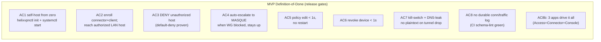
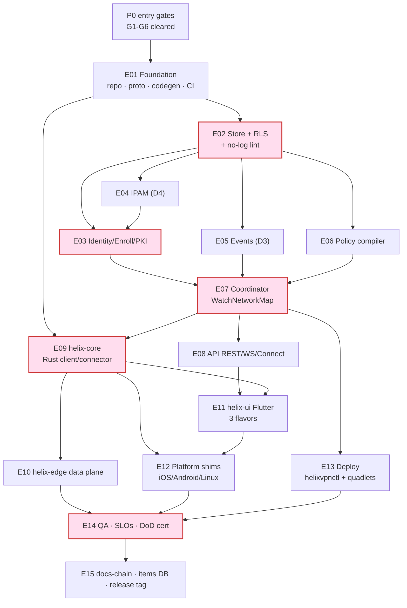

# Phase 1 (MVP) — Work Breakdown: phases → tasks → subtasks

**Revision:** 1
**Last modified:** 2026-06-25T00:00:00Z

> This document is the executable spine of the HelixVPN MVP. It decomposes the
> Phase‑1 self‑hostable MVP into stable, DB‑ready work items
> (`HVPN-P1-NNN`), each carrying *description · depends‑on · deliverable ·
> acceptance · effort · required‑test‑types*, grouped by control‑plane module +
> client core/UI + platform shims + deploy + QA. It is **spec‑only** — it
> describes *what to build and how "done" is proven*, never the product itself.
> Authoritative companions: the data model / DDL / protobuf live in
> [`02-control-plane.md`](02-control-plane.md) (cited here as **[02]**); the data
> plane in [`01-data-plane.md`](01-data-plane.md) **[01]**; the client core + UI
> in [`03-client-core-and-ui.md`](03-client-core-and-ui.md) **[03]**; security /
> privacy / PKI in [`04-security-privacy-pki.md`](04-security-privacy-pki.md)
> **[04]**; product scope in [`00-product-scope-and-principles.md`](00-product-scope-and-principles.md)
> **[00]**. Primary research: **[04_P1]** (`HelixVPN-Phase1-MVP.md`), **[04_P0]**
> (`HelixVPN-Phase0-Spike.md`), **[04_ARCH]**, **[05_YBO]**, **[SYNTHESIS]**.

---

## Table of contents

- [0. How to read this WBS](#0-how-to-read-this-wbs)
- [1. Required‑test‑types vocabulary (§11.4.169)](#1-requiredtesttypes-vocabulary-1114169)
- [2. MVP Definition‑of‑Done — the 8 acceptance gates + SLOs](#2-mvp-definitionofdone--the-8-acceptance-gates--slos)
- [3. Workable‑item schema (§11.4.93 DB‑ready)](#3-workableitem-schema-1114193-dbready)
- [4. Epic map + dependency graph](#4-epic-map--dependency-graph)
- [5. Phase 0 — entry gates (prerequisite)](#5-phase-0--entry-gates-prerequisite)
- [6. E01 — Foundation: repo, proto, codegen, CI floor](#6-e01--foundation-repo-proto-codegen-ci-floor)
- [7. E02 — Store, schema, RLS, no‑log lint](#7-e02--store-schema-rls-nolog-lint)
- [8. E03 — Identity, enrollment, PKI](#8-e03--identity-enrollment-pki)
- [9. E04 — IPAM (D4)](#9-e04--ipam-d4)
- [10. E05 — Event backbone (D3)](#10-e05--event-backbone-d3)
- [11. E06 — Policy model & compiler](#11-e06--policy-model--compiler)
- [12. E07 — Coordinator & WatchNetworkMap](#12-e07--coordinator--watchnetworkmap)
- [13. E08 — API surface + authz](#13-e08--api-surface--authz)
- [14. E09 — helix‑core (Rust client/connector)](#14-e09--helixcore-rust-clientconnector)
- [15. E10 — helix‑edge (data plane)](#15-e10--helixedge-data-plane)
- [16. E11 — helix‑ui (Flutter) + design system](#16-e11--helixui-flutter--design-system)
- [17. E12 — Platform tunnel shims (iOS/Android/Linux)](#17-e12--platform-tunnel-shims-iosandroidlinux)
- [18. E13 — Deploy: helixvpnctl + Podman quadlets + containers submodule](#18-e13--deploy-helixvpnctl--podman-quadlets--containers-submodule)
- [19. E14 — QA, SLOs, DoD certification](#19-e14--qa-slos-dod-certification)
- [20. E15 — Docs‑chain, workable‑items DB, release](#20-e15--docschain-workableitems-db-release)
- [21. DoD ↔ work‑item traceability matrix](#21-dod--workitem-traceability-matrix)
- [22. Effort roll‑up & critical path](#22-effort-rollup--critical-path)
- [Sources](#sources)

---

## 0. How to read this WBS

**Granularity.** Three levels: **Epic** (`HVPN-P1-Enn`, a workstream) → **Task**
(`HVPN-P1-NNN`, a shippable unit, ~1–8 person‑days) → **Subtask**
(`HVPN-P1-NNN.k`, a single PR‑sized change). Every **leaf** (a task with no
subtasks, or a subtask) is a workable item per §11.4.93 and is the unit that
lands in the SQLite single‑source‑of‑truth DB (§3).

**ID scheme (stable, append‑only, §11.4.54).** `HVPN-P1-` prefix; the numeric
block encodes the epic: `Enn` → tasks `nn0..nn9`, e.g. E02 (store) → `020..029`.
Phase‑0 entry gates use `001..006`. IDs are **never renumbered**; new work
appends at the next free number in the block (gaps allowed).

**Field contract (every leaf).**

| Field | Meaning |
|---|---|
| **Desc** | What the item builds, in one or two sentences (§11.4.91 ≥6 words / ≥40 chars). |
| **Deps** | Hard upstream item IDs (must be `complete` first). `—` = none. |
| **Deliverable** | The concrete artefact(s) — file paths, binaries, generated clients. |
| **Acceptance** | The falsifiable PASS condition, captured‑evidence per §11.4.5/.69/.107. |
| **Effort** | T‑shirt + person‑days: XS(1) S(2–3) M(4–6) L(7–10) XL(11–15). |
| **Tests** | Required test types from the §1 closed vocabulary (§11.4.169). |

**Risk ordering (§11.4.132).** Within and across epics, the irreversible
correctness floor (RLS, no‑log lint, PKI revoke, kill‑switch) is sequenced
first; convenience UI last.

**Anti‑bluff (§11.4 / §11.4.27 / §11.4.107).** Every Acceptance line is a
*captured‑evidence* assertion, not "code compiles". A leaf is `complete` only
when its required‑test‑types are green **with** an evidence path recorded in the
item's `test_diary` (§11.4.149) and, where it has a user‑visible surface, a
window‑scoped MP4 recording vision‑verified per §11.4.159/.163. Metadata‑only /
config‑only / grep‑without‑runtime PASS is forbidden.

---

## 1. Required‑test‑types vocabulary (§11.4.169)

§11.4.169 mandates that **every** workable item declare the closed set of test
types it must pass before closure; the universe of types is the §11.4.27
enumeration. The closed vocabulary + canonical abbreviations used in this WBS:

| Abbrev | Type | Floor expectation for HelixVPN MVP |
|---|---|---|
| `UNIT` | Unit | pure logic (compiler, IPAM, delta diff, framing); mocks allowed **only here** (§11.4.27). |
| `INT` | Integration | real Postgres + Redis (testcontainers via `containers` submodule, §11.4.76); no mocks. |
| `E2E` | End‑to‑end | the netns rig [04_P0 §3] fed by the real control plane; `curl` reaches the LAN host. |
| `FA` | Full‑automation | self‑driving, re‑runnable `-count=3`, no human in the loop (§11.4.98). |
| `SEC` | Security | RLS cross‑tenant denial, key‑never‑leaves, mTLS, kill‑switch, DNS‑leak, secret‑leak audit (§04). |
| `CHAOS` | Chaos | mid‑flight SIGKILL / Redis drop / partial write; recovery restores consistent state (§11.4.85). |
| `STRESS` | Stress | sustained load + concurrency (≥10 parallel, ≥100 iters or ≥30 s) + boundary inputs (§11.4.85). |
| `PERF` | Performance | latency p50/p99 vs the SLO budget (§2); GC‑tail watch on Go hot paths. |
| `BENCH` | Benchmarking | throughput / CPU‑per‑Gbps / handshakes‑per‑sec on the `bench.sh` rig [04_P0 §8]. |
| `SCALE` | Scaling | N simulated agents holding streams; convergence + bounded memory over 24 h soak. |
| `UI` | UI | widget + golden tests on the three Flutter flavors. |
| `UX` | UX | flow walkthrough (enroll → connect → reach) with window‑scoped MP4 + vision verdict (§11.4.159). |
| `REC` | Recorded‑evidence | window‑scoped MP4 (§11.4.154/.155) + media‑validation pipeline verdict (§11.4.163). |
| `CHAL` | Challenge / HelixQA | a `challenges` / `helix_qa` bank entry scoring PASS only on captured evidence (§11.4.27/.107). |

`DDOS` is **not‑applicable** at MVP (single‑node self‑host, no public multi‑tenant
surface) — explicitly recorded `NOT_APPLICABLE: single-node-selfhost` per §11.4.6,
re‑armed in Phase 2 (HA / managed). Each task below lists only the **required**
subset; absent types are out‑of‑scope for that item by design, not by omission.

---

## 2. MVP Definition‑of‑Done — the 8 acceptance gates + SLOs

The MVP ships only when **all eight** acceptance criteria (AC1–AC8) and **all
four** SLOs (SLO1–SLO4) pass on a clean baseline (§11.4.40 full‑suite retest,
§11.4.108 runtime‑signature on a fresh deploy). These are the *release gates* —
restated verbatim from [04_P1 §11.2/§11.3] and bound to work‑items in §21.



> AC8 in [04_P1] bundles "no durable log" with "three apps drive it"; this WBS
> splits the app‑coverage clause out as **AC9** for traceability — both are
> required.

**AC1 — Self‑host from zero.** On a fresh rootless host, `helixvpnctl init` +
`systemctl --user start helixvpn-pod` yields a running control plane + edge with
generated tenant/admin/CA/overlay‑`/48`/creds. *Evidence:* recorded terminal
session, healthchecks green, `helix_up == 1`.

**AC2 — Authorized reachability.** Enroll one connector advertising a LAN +
one client; the client's overlay namespace `curl`s an authorized LAN host and
gets the hello page. *Evidence:* E2E netns capture + pcap.

**AC3 — Default‑deny.** The *same* client is denied a LAN host **not** granted
by policy (connection refused/dropped at the edge verdict map). *Evidence:*
negative E2E — packet dropped, no SYN‑ACK.

**AC4 — Transport auto‑escalation.** With plain WG UDP blocked (nft rule), the
client escalates the `TransportPolicy` ladder to MASQUE/H3 and the tunnel stays
up. *Evidence:* `StatusReport.transport == "masque-h3"`, tshark shows HTTP/3 (no
WG signature), reachability preserved [04_P0 §5].

**AC5 — Live policy reconfig.** A Console/CLI policy edit reconfigures all
affected devices in **< 1 s** with **zero process restarts**. *Evidence:*
`helix_reconcile_seconds` p99 < 1 s histogram + Console live‑event log.

**AC6 — Fast revoke.** Revoking a device removes its access in **< 1 s** (peer
dropped from every map + kernel WG peer removed at edge + cert revoked).
*Evidence:* revoke→edge‑enforcement timing capture.

**AC7 — Kill‑switch + DNS‑leak.** On tunnel drop, **no plaintext egress and no
DNS leak** occur (core state machine drives the firewall). *Evidence:* host‑side
pcap during forced drop shows zero leaked packets (§04, §11.4.107 liveness).

**AC8 — No‑logging as code.** No durable connection/traffic/packet table
exists; the CI schema‑lint fails the build if one appears. *Evidence:*
`schemalint` green + paired §1.1 mutation (`connections` table → FAIL) [02 §2.4].

**AC9 — Three apps drive it.** Access (iOS/Android/Linux), Connector daemon,
and Console (web) each exercise AC1–AC7 through generated clients (no
hand‑written API code). *Evidence:* per‑app UX recordings (§11.4.159).

### SLOs (measured, alert‑on‑breach)

| ID | SLO | Target | Item that wires the metric |
|---|---|---|---|
| **SLO1** | event → delta‑on‑wire | p99 **< 1 s** | HVPN-P1-073 |
| **SLO2** | enroll → first NetworkMap | **< 2 s** | HVPN-P1-031 |
| **SLO3** | revoke → edge enforcement | **< 1 s** | HVPN-P1-033 |
| **SLO4** | coordinator memory @ 10k streams | bounded, no leak / 24 h soak | HVPN-P1-074 |

---

## 3. Workable‑item schema (§11.4.93 DB‑ready)

Every leaf in §§5–20 maps 1:1 to a row in the git‑tracked SQLite single source
of truth (`docs/.workable_items.db`, §11.4.93/.95). Loader contract: a
deterministic Go/SQL importer parses this Markdown's leaf blocks and upserts by
`atm_id` (here `HVPN-P1-NNN[.k]`). The DDL the rows must satisfy:

```sql
-- docs/.workable_items.db — Phase-1 WBS projection (subset; full schema in 02/§11.4.93)
CREATE TABLE IF NOT EXISTS items (
  atm_id        TEXT PRIMARY KEY,                  -- 'HVPN-P1-021'
  parent_id     TEXT REFERENCES items(atm_id),     -- epic or parent task ('HVPN-P1-E02')
  kind          TEXT NOT NULL CHECK (kind IN ('epic','task','subtask')),
  title         TEXT NOT NULL CHECK (length(title) >= 6),
  description   TEXT NOT NULL CHECK (length(description) >= 40),  -- §11.4.91/.148
  status        TEXT NOT NULL DEFAULT 'Queued'
                CHECK (status IN ('Queued','In progress','Ready for testing',
                                  'In testing','Reopened','Operator-blocked',
                                  'Obsolete (→ Fixed.md)','Completed (→ Fixed.md)')),
  type          TEXT NOT NULL DEFAULT 'Task' CHECK (type IN ('Bug','Feature','Task')),
  severity      TEXT NOT NULL DEFAULT 'normal',
  epic          TEXT NOT NULL,                      -- 'E02'
  module        TEXT NOT NULL,                      -- 'store','coordinator','helix-core',...
  deps          TEXT NOT NULL DEFAULT '[]',         -- JSON array of atm_ids
  deliverable   TEXT NOT NULL,
  acceptance    TEXT NOT NULL,
  effort_days   INTEGER NOT NULL,
  test_types    TEXT NOT NULL,                      -- JSON: ["UNIT","INT","SEC"]  (§11.4.169)
  dod_refs      TEXT NOT NULL DEFAULT '[]',         -- JSON: ["AC3","SLO1"]
  source_refs   TEXT NOT NULL DEFAULT '[]',         -- JSON: ["04_P1 §7","02 §7.2"]
  created_at    TEXT NOT NULL DEFAULT (datetime('now')),
  modified_at   TEXT NOT NULL DEFAULT (datetime('now'))
);
-- per-item test diary (§11.4.149) — PASS row REQUIRES an evidence path:
CREATE TABLE IF NOT EXISTS test_diary (
  id           INTEGER PRIMARY KEY AUTOINCREMENT,
  atm_id       TEXT NOT NULL REFERENCES items(atm_id),
  date_time    TEXT NOT NULL,
  tested_by    TEXT NOT NULL CHECK (tested_by IN ('User','Operator','AI-agent','HelixQA')),
  result       TEXT NOT NULL CHECK (result IN ('PASS','FAIL','SKIP')),
  test_type    TEXT NOT NULL,                       -- one of §11.4.169 vocab
  evidence_path TEXT,                               -- qa-results/<run-id>/...
  observations TEXT NOT NULL,
  CHECK (result <> 'PASS' OR (evidence_path IS NOT NULL AND length(evidence_path) > 0))
);
```

Example row (one leaf) so the projection is unambiguous:

```sql
INSERT INTO items (atm_id,parent_id,kind,title,description,epic,module,deps,
                   deliverable,acceptance,effort_days,test_types,dod_refs,source_refs)
VALUES (
 'HVPN-P1-022','HVPN-P1-E02','task',
 'FORCE RLS + tenant_isolation on all 10 tenant tables',
 'Enable row-level security with a tenant_isolation USING/WITH CHECK policy on every tenant-scoped table and abort startup if the app role can bypass RLS.',
 'E02','store','["HVPN-P1-021"]',
 'migrations/0002_rls.sql; store/rls_guard.go startup check',
 'A query crafted to read tenant B from a tenant-A session returns ZERO rows (captured); startup aborts when role has rolsuper/rolbypassrls.',
 4,'["UNIT","INT","SEC","CHAOS"]','["AC8","AC2","AC3"]','["02 §2.3","04_P1 §2.2"]');
```

---

## 4. Epic map + dependency graph



Critical path (red): **E02 → E03 → E07 → E09 → E14**. The two Phase‑0
make‑or‑break carries (iOS memory G3, edge language G4) are *resolved before
Phase 1 starts* — Phase 1 assumes Rust core + the G4 edge decision are settled
[04_P0 §0]. Epics E04/E05/E06 fan out in parallel off E02 (disjoint scope →
parallel PWUs, §11.4.58). E13 can start as soon as E07's container shape exists.

---

## 5. Phase 0 — entry gates (prerequisite)

> Phase 0 is **not** Phase‑1 work but is the entry condition; these items track
> the gate verdicts that unblock the MVP. If any gate fails, the linked Phase‑1
> epic re‑plans (e.g. G3 fail → E12.iOS adopts the §6.4 fallback ladder).

**HVPN-P1-E00 — Phase‑0 spike gate certification** `epic · module: spike`

- **HVPN-P1-001 — G1 plain‑UDP data‑path gate.** `S(3) · deps: — · tests: BENCH,E2E`
  - *Desc:* Certify Rust `helix-core`+boringtun moves real traffic client→gateway→connector LAN over plain UDP at ≥80% bare‑link. *Deliverable:* `bench.sh` CSV + ping log [04_P0 §4/§8]. *Acceptance:* iperf3 through‑tunnel ≥80% bare link; ping to LAN host succeeds. *DoD:* AC2 (precursor).
- **HVPN-P1-002 — G2 MASQUE‑through‑DPI gate.** `M(5) · deps: HVPN-P1-001 · tests: BENCH,SEC,E2E`
  - *Desc:* Certify the same core tunnels over MASQUE/H3 through a UDP block at ≥50% of plain, surviving 5% loss. *Deliverable:* tshark capture (classified HTTP/3, no WG signature) + goodput CSV. *Acceptance:* works with `udp dport 51820 drop`; ≥50% plain throughput; QUIC loss‑recovery beats UoT strawman. *DoD:* AC4 (precursor).
- **HVPN-P1-003 — G3 iOS NE memory gate (make‑or‑break).** `M(5) · deps: HVPN-P1-001 · tests: PERF,STRESS,REC`
  - *Desc:* Certify the Rust core in `NEPacketTunnelProvider` stays under the device memory ceiling with ≥30% headroom over a 30‑min / 1 GB transfer, both transports. *Deliverable:* Instruments RSS report (peak+steady) [04_P0 §6]. *Acceptance:* ≥30% headroom plain **and** MASQUE; else trigger §6.4 fallback decision (§11.4.66).
- **HVPN-P1-004 — G4 edge‑language decision.** `S(3) · deps: HVPN-P1-002 · tests: BENCH,PERF`
  - *Desc:* Decide Rust vs Go for the MASQUE‑terminating edge on benchmark numbers (CPU/Gbps, p99, churn, MASQUE effort). *Deliverable:* §12 decision‑log row + A/B CSV. *Acceptance:* recorded decision with evidence; sets E10's language (default lean Rust if within ~10–15%) [04_P0 §7]. *Decision:* D5.
- **HVPN-P1-005 — G5 FFI boundary gate.** `S(2) · deps: HVPN-P1-001 · tests: UI,E2E`
  - *Desc:* Certify flutter_rust_bridge v2 drives connect/disconnect + live status from Dart. *Deliverable:* Flutter‑Linux toggle recording. *Acceptance:* status chip transitions `Connecting→Handshaking→Connected(masque,Nms)` driven only by the core event stream. *Decision:* D2 (Rust core).
- **HVPN-P1-006 — G6 push‑reconcile gate.** `XS(1) · deps: HVPN-P1-001 · tests: E2E,FA`
  - *Desc:* Certify the core converges to a static map delta with no restart (the seed of `WatchNetworkMap`). *Deliverable:* reconcile demo + map‑delta log. *Acceptance:* editing `map.json` brings a new peer up with no process restart; reachability follows.

---

## 6. E01 — Foundation: repo, proto, codegen, CI floor

**HVPN-P1-E01 — Foundation** `epic · module: repo`

- **HVPN-P1-010 — Monorepo + submodule layout.** `M(4) · deps: HVPN-P1-005 · tests: UNIT,FA`
  *Desc:* Stand up the [SYNTHESIS §6] layout — `helix-core/ helix-edge/ helix-go/ helix-proto/ helix-ui/ shims/ deploy/` — each decoupled, reusable, snake_case (§11.4.29), with `upstreams/` + `install_upstreams` per repo (§11.4.36) and the incorporated `submodules/` (containers, helix_qa, challenges, docs_chain, security, vision_engine). *Deliverable:* repo tree + `.gitmodules` + per‑repo `helix-deps.yaml` (§11.4.31). *Acceptance:* `install_upstreams` configures every declared remote; a fresh clone builds each component skeleton; **no active CI** workflows present (§11.4.156, `CM-NO-ACTIVE-CI` green). *Tests:* FA bootstrap on a throwaway clone.
- **HVPN-P1-011 — `helix-proto`: agent protobuf + buf codegen.** `M(4) · deps: HVPN-P1-010 · tests: UNIT,FA`
  *Desc:* Author `proto/helix/agent/v1/agent.proto` (the `Coordinator` service: `Enroll`, `WatchNetworkMap`, `AdvertisePrefixes`, `ReportStatus`, exactly as **[02 §4]** / [04_P1 §3]) and wire `buf generate` → Go + Dart + Rust stubs. *Deliverable:* generated `gen/{go,dart,rust}/...`; `buf.gen.yaml`; `buf lint`/`buf breaking` config. *Acceptance:* one source of truth → three generated clients; `buf breaking` gate fails on an incompatible change; no hand‑written client code exists (§8 [04_P1]).
  - *Skeleton (the contract this WBS depends on — full text in [02 §4]):*
    ```protobuf
    service Coordinator {
      rpc Enroll(EnrollRequest) returns (EnrollResponse);
      rpc WatchNetworkMap(WatchRequest) returns (stream MapUpdate);
      rpc AdvertisePrefixes(AdvertiseRequest) returns (AdvertiseResponse);
      rpc ReportStatus(StatusReport) returns (StatusAck);
    }
    // MapUpdate.oneof{ NetworkMap snapshot | MapDelta delta | KeepAlive } — peers PRE-FILTERED.
    ```
- **HVPN-P1-012 — `helix-proto`: REST OpenAPI + Dart/TS client gen.** `S(3) · deps: HVPN-P1-011 · tests: UNIT,FA`
  *Desc:* Define the OpenAPI 3.1 contract for the app‑facing REST surface (`/v1/enroll-tokens`, `/v1/devices`, `/v1/policies`, `/v1/networks`, `/v1/stream`) and generate Dart + TS clients. *Deliverable:* `openapi/helix.v1.yaml` + generated clients. *Acceptance:* generated client round‑trips a stub server; drift between spec and handler fails the gen check.
- **HVPN-P1-013 — Local dev infra via `containers` submodule.** `S(3) · deps: HVPN-P1-010 · tests: INT,FA`
  *Desc:* On‑demand Postgres+Redis for tests booted **only** through the `containers` submodule `pkg/boot`/`pkg/compose`/`pkg/health` (§11.4.76/.161, rootless Podman) — no ad‑hoc docker. *Deliverable:* `internal/testinfra` wrapper; `make test-infra-up/down`. *Acceptance:* integration tests boot infra on demand; teardown leaves no orphan containers (§11.4.14).

---

## 7. E02 — Store, schema, RLS, no‑log lint

**HVPN-P1-E02 — Store + RLS + no‑log lint (the truth floor)** `epic · module: store`
*Risk‑first (§11.4.132): this epic is the irreversible correctness floor; it ships before any feature reads/writes data.*

- **HVPN-P1-020 — Migrations, enums, DB roles.** `M(4) · deps: HVPN-P1-013 · tests: UNIT,INT`
  *Desc:* Author the full DDL from **[02 §2.2]** / [04_P1 §2.1] via `goose` — `tenants users devices connectors advertised_prefixes groups group_members policies overlay_pools device_certs audit_events` + enums (`user_role`, `device_kind`); create three roles `helix_owner` (DDL), `helix_app` (non‑super, non‑bypass — runtime), `helix_sys` (system tasks). *Deliverable:* `migrations/0001_core.sql..`; `sqlc.yaml`. *Acceptance:* migrations apply+rollback clean on a fresh PG; `\dt` matches the spec; **no** connection/traffic table present.
- **HVPN-P1-021 — `sqlc` typed queries + `store.WithTenant`.** `M(4) · deps: HVPN-P1-020 · tests: UNIT,INT`
  *Desc:* Compile‑time‑checked queries via `sqlc`; `WithTenant(ctx,tid,fn)` runs each request inside a tx that `SET LOCAL app.tenant_id` (tx‑scoped, can't leak across the pool) plus `WithSystem` for cross‑tenant system tasks. *Deliverable:* `internal/store/*.go`, generated `Queries`. *Acceptance:* a query that forgets a `WHERE tenant_id` still returns only the active tenant's rows (proven by INT test).
- **HVPN-P1-022 — FORCE RLS + tenant_isolation policies.** `M(4) · deps: HVPN-P1-021 · tests: UNIT,INT,SEC,CHAOS · DoD: AC8,AC2,AC3`
  *Desc:* `ENABLE`+`FORCE ROW LEVEL SECURITY` and a `tenant_isolation` `USING/WITH CHECK (tenant_id = current_setting('app.tenant_id')::uuid)` on all 10 tenant tables; a startup guard aborts if `helix_app` has `rolsuper`/`rolbypassrls`. *Deliverable:* `migrations/0002_rls.sql`; `store/rls_guard.go`. *Acceptance:* SEC test — a crafted cross‑tenant read returns **zero** rows (captured); startup aborts under a super role. CHAOS — connection drop mid‑tx rolls back, no leak.
  ```sql
  ALTER TABLE devices ENABLE ROW LEVEL SECURITY;
  ALTER TABLE devices FORCE ROW LEVEL SECURITY;
  CREATE POLICY tenant_isolation ON devices
    USING (tenant_id = current_setting('app.tenant_id')::uuid)
    WITH CHECK (tenant_id = current_setting('app.tenant_id')::uuid);
  -- repeat for users, connectors, advertised_prefixes, groups, group_members,
  --            policies, overlay_pools, device_certs, audit_events
  ```
- **HVPN-P1-023 — No‑logging CI schema‑lint + mutation.** `S(3) · deps: HVPN-P1-020 · tests: UNIT,SEC · DoD: AC8`
  *Desc:* `tools/schemalint` fails the build if a durable table named/scoped like a connection log appears (`connections|flows|traffic|packets`, or any table carrying both a `src`/`dst` and a `bytes`/`ts` outside `audit_events`) [02 §2.4]. *Deliverable:* `tools/schemalint/main.go` + pre‑build gate. *Acceptance:* green on the real schema; **paired §1.1 mutation** — inject a `connections(src,dst,bytes,ts)` table → lint FAILs (captured). This is the mechanical enforcement of the privacy promise.

---

## 8. E03 — Identity, enrollment, PKI

**HVPN-P1-E03 — Identity / Enrollment / PKI** `epic · module: identity,pki`
*Risk‑first: revoke‑<1 s and key‑never‑leaves are security‑critical (§04).*

- **HVPN-P1-030 — Dual identity: OIDC + anonymous device tokens.** `M(5) · deps: HVPN-P1-022 · tests: UNIT,INT,SEC`
  *Desc:* Managed mode (tenant admins log in via any OIDC IdP — Keycloak/Authentik) **and** anonymous mode (mint device enroll‑tokens with no email/SSO — the Mullvad "account number, no PII" posture) [04_P1 §6.1]. *Deliverable:* `internal/identity/`; token mint/store‑hashed/consume‑atomic. *Acceptance:* an anonymous device enrolls with zero PII persisted; an OIDC user maps to a tenant/role; tokens are single‑use and short‑lived (consume is atomic under concurrency — SEC).
- **HVPN-P1-031 — `Enroll` RPC (device key never leaves).** `M(5) · deps: HVPN-P1-030,HVPN-P1-040,HVPN-P1-032 · tests: UNIT,INT,SEC,E2E · DoD: AC1,AC2; SLO2`
  *Desc:* Implement `Coordinator.Enroll`: verify token → IPAM‑allocate overlay IP → issue short‑lived device cert → persist device row (only the WG **public** key) → emit `device.enrolled` [04_P1 §6.2]. *Deliverable:* enroll handler + flow test. *Acceptance:* device generates its WG keypair locally; the control plane never receives a private key (SEC asserts absence in logs+DB); **enroll → first NetworkMap < 2 s** (SLO2, captured).
- **HVPN-P1-032 — PKI: device‑cert issuance + tenant CA.** `M(4) · deps: HVPN-P1-022 · tests: UNIT,INT,SEC`
  *Desc:* `internal/pki` issues short‑lived (24 h) mTLS device certs against a per‑tenant CA; the CA root is the one true secret (KMS/offline backup) [04_P1 §6.3, §04]. *Deliverable:* `pki.Issue/Rotate/Revoke`; cert store. *Acceptance:* a cert authenticates the `WatchNetworkMap` channel; CA private key never appears in any app log (secret‑leak audit, §11.4.10.A).
- **HVPN-P1-033 — Cert rotation + revoke‑<1 s.** `M(4) · deps: HVPN-P1-032,HVPN-P1-070 · tests: UNIT,INT,SEC,PERF · DoD: AC6; SLO3`
  *Desc:* Auto‑rotate before expiry over the existing channel; `device.revoke` drops the WG peer from every relevant map + enforces at the edge (kernel WG peer removed) + marks cert revoked, all within the convergence SLO. *Deliverable:* rotation scheduler + revoke path. *Acceptance:* **revoke → edge enforcement < 1 s** (SLO3, captured timing); a revoked cert is rejected immediately (SEC).

---

## 9. E04 — IPAM (D4)

**HVPN-P1-E04 — Overlay IPAM + subnet‑collision (D4)** `epic · module: ipam`

- **HVPN-P1-040 — ULA `/48` provisioning + `AllocOverlayIP`.** `M(4) · deps: HVPN-P1-022 · tests: UNIT,INT,STRESS`
  *Desc:* On tenant create, provision an IPv6 ULA `/48` (`fd7a:helix:<rand>::/48`, `::1` = gateway); `AllocOverlayIP` hands out the next host deterministically + concurrency‑safe [02 §3.2]. **Decision D4: IPv6 ULA /48 per tenant** resolves RFC1918 collisions across N joined LANs (recommended over CGNAT‑100.64 1:1 NAT) [SYNTHESIS §3 D4, 04_ARCH §3.4]. *Deliverable:* `internal/ipam/`. *Acceptance:* 1000 concurrent allocations yield no duplicate/gap (STRESS, captured); allocation is restart‑stable (re‑hydrates `next_host`).
- **HVPN-P1-041 — `4via6` for colliding IPv4 LANs.** `M(5) · deps: HVPN-P1-040,HVPN-P1-060 · tests: UNIT,INT,E2E`
  *Desc:* Map each connector site to a stable site‑id and emit Tailscale‑style `4via6` routes so a client may reach two connectors that both advertise `192.168.50.0/24` without collision. *Deliverable:* site‑id allocator + `4via6` route synthesis feeding `Peer.allowed_ips`. *Acceptance:* E2E — one client reaches the *same* IPv4 CIDR served by two different connectors, disambiguated by site (captured curl to each).

---

## 10. E05 — Event backbone (D3)

**HVPN-P1-E05 — Event backbone: Redis Streams (D3)** `epic · module: events`

- **HVPN-P1-050 — `events.Bus` Redis Streams impl + envelope.** `M(4) · deps: HVPN-P1-013 · tests: UNIT,INT,CHAOS`
  *Desc:* Bus‑agnostic `events.Bus` interface over Redis Streams: `XADD` produce, `XReadGroup` durable consumer groups, `XACK`, the §5.2 envelope (`id,type,tenant_id,ts,actor,payload,trace_id`). **Decision D3: Redis Streams for MVP**, NATS JetStream is the Phase‑2 swap behind the same interface [SYNTHESIS §3 D3, 04_P1 §5]. *Deliverable:* `internal/events/`. *Acceptance:* at‑least‑once delivery with idempotent reactions; a replayed event is harmless (INT); a consumer crash mid‑handle re‑delivers on restart (CHAOS).
- **HVPN-P1-051 — DLQ sweeper (`XAUTOCLAIM`) + metric.** `S(3) · deps: HVPN-P1-050 · tests: UNIT,INT,CHAOS`
  *Desc:* Reclaim stuck pending entries with `XAUTOCLAIM`, route exhausted‑retry entries to a dead‑letter, expose `helix_events_dlq_total`. *Deliverable:* sweeper goroutine + metric. *Acceptance:* a poisoned event lands in DLQ after N retries (captured), the metric increments, the live stream keeps flowing (CHAOS).
- **HVPN-P1-052 — Event taxonomy producers.** `S(3) · deps: HVPN-P1-050 · tests: UNIT,INT`
  *Desc:* Wire the concrete taxonomy from [04_P1 §5.3] — `device.enrolled/online/offline/revoked`, `connector.attached`, `connector.prefixes.changed`, `route.conflict.detected`, `policy.updated/compiled`, `gateway.failover` — emitted by identity/registry/policy/edge. *Deliverable:* typed event constructors. *Acceptance:* each producer emits a well‑formed envelope on its trigger (INT, captured stream read).

---

## 11. E06 — Policy model & compiler

**HVPN-P1-E06 — Policy model + compiler** `epic · module: policy`

- **HVPN-P1-060 — Spec parse + group/host resolution.** `M(5) · deps: HVPN-P1-022 · tests: UNIT,INT,SEC`
  *Desc:* Parse the Tailscale‑ACL‑flavored `policies.spec` jsonb (groups, hosts, acls, exitNodes) [04_P1 §7.1]; resolve `group:*` → device‑id sets (via users + group_members) and `host` → CIDRs, cross‑checking against `advertised_prefixes` (emit `route.conflict.detected` on ambiguity). *Deliverable:* `internal/policy/parse.go,resolve.go`. *Acceptance:* unknown group/host rejected; an ACL granting a revoked device rejected (SEC).
- **HVPN-P1-061 — Two‑artifact compiler (AllowedIPs + verdict map).** `L(7) · deps: HVPN-P1-060 · tests: UNIT,SEC,PERF · DoD: AC2,AC3`
  *Desc:* Pure, deterministic, default‑deny `compile(tenant,spec)→{visible,allowedIPs,exitNodes}` [04_P1 §7.2] producing **two** artefacts: coarse WG `AllowedIPs` (per‑peer CIDR, data path) **and** a port‑level verdict map (nftables/eBPF at the edge, since WG `AllowedIPs` is CIDR‑only). Output is exactly what `coordinator.buildMap` consumes; peers are need‑to‑know filtered. *Deliverable:* `policy/compile.go` + golden‑table tests (spec → expected visible/allowedIPs). *Acceptance:* same spec ⇒ byte‑identical output (determinism property test); a contractor granted only `warehouse-cams:554,80` cannot reach port 22 (verdict‑map SEC test); compile of a 1k‑device tenant < 100 ms (PERF).
- **HVPN-P1-062 — Dry‑run fail‑closed validation + atomic activate/rollback.** `M(4) · deps: HVPN-P1-061 · tests: UNIT,INT,SEC · DoD: AC5`
  *Desc:* `policy.update` runs the compiler in dry‑run first; reject on unknown ref, a `dst` CIDR not covered by any advertised prefix, or a grant to a revoked device. Only a clean compile bumps `policies.version`, persists the compiled artefact, and emits `policy.compiled`; a prior version re‑activates instantly (rollback) [04_P1 §7.3/§7.4]. *Deliverable:* validation + version activation. *Acceptance:* a bad policy never reaches the active version (fail‑closed, captured); rollback restores the prior compiled set atomically (INT).

---

## 12. E07 — Coordinator & WatchNetworkMap

**HVPN-P1-E07 — Coordinator + WatchNetworkMap** `epic · module: coordinator`
*Critical path; the < 1 s convergence promise lives here.*

- **HVPN-P1-070 — In‑memory per‑tenant topology graph.** `M(5) · deps: HVPN-P1-052,HVPN-P1-061,HVPN-P1-032 · tests: UNIT,INT,SCALE`
  *Desc:* Hydrate a per‑tenant graph (devices, connectors, prefixes, groups, compiled policy) from Postgres on boot and keep it fresh by consuming events; the coordinator owns **no durable tables** [04_P1 §4.1]. *Deliverable:* `internal/coordinator/graph.go`. *Acceptance:* graph reconstructable from PG + events alone (proves Phase‑2 stateless‑coordinator seam); applying an event mutates only the affected subgraph (INT).
- **HVPN-P1-071 — `buildMap(node)` per‑node map computation.** `M(4) · deps: HVPN-P1-070 · tests: UNIT,SEC · DoD: AC2,AC3`
  *Desc:* `buildMap` returns `NetworkMap{self,gateway,peers,dns,transport}` where `peers` = `policy.PeersVisibleTo(node)` (need‑to‑know) each with compiled `AllowedIPs`; `relayEndpoint` always routes via the gateway in MVP (hub‑and‑spoke, identical to the proven Phase‑0 slice) [04_P1 §4.2]. *Deliverable:* `coordinator/buildmap.go`. *Acceptance:* a node never appears in another node's map unless policy grants it (SEC — the privacy invariant, captured).
- **HVPN-P1-072 — `WatchNetworkMap` stream loop.** `L(7) · deps: HVPN-P1-071,HVPN-P1-080 · tests: UNIT,INT,E2E,CHAOS · DoD: AC5`
  *Desc:* Implement the streaming RPC: authenticate device by mTLS cert → send snapshot (or resume from `known_version`) → delta loop on the event subscription + keepalive ticker, with a **bounded** per‑stream send queue (slow‑consumer protection) [04_P1 §4.3]. *Deliverable:* `coordinator/watch.go`. *Acceptance:* reconnect with `known_version=N` resumes from deltas (no full resync, captured); a slow/stalled consumer is shed without blocking others (CHAOS).
  ```go
  func (c *Coordinator) WatchNetworkMap(ctx context.Context,
      req *connect.Request[agentv1.WatchRequest],
      stream *connect.ServerStream[agentv1.MapUpdate]) error {
      dev := authDevice(ctx)                     // mTLS device cert (HVPN-P1-032)
      sub := c.subscribe(dev.TenantID, dev.ID); defer sub.Close()
      _ = stream.Send(snapshotOrResume(c.buildMap(dev), req.Msg.KnownVersion))
      ka := time.NewTicker(20 * time.Second); defer ka.Stop()
      for {
        select {
        case <-ctx.Done(): return ctx.Err()
        case d := <-sub.C: if err := stream.Send(deltaUpdate(d)); err != nil { return err }
        case <-ka.C:       _ = stream.Send(keepAlive())
        }
      }
  }
  ```
- **HVPN-P1-073 — Minimal‑affected‑set fan‑out + reconcile metric.** `M(5) · deps: HVPN-P1-072 · tests: UNIT,INT,PERF · DoD: AC5; SLO1`
  *Desc:* On each event compute the **minimal** affected open‑stream set (never broadcast a full resync on a small change) and enqueue per‑stream deltas; instrument `helix_reconcile_seconds` from event‑arrival to delta‑on‑wire [04_P1 §4.4]. *Deliverable:* fan‑out + histogram. *Acceptance:* **event → delta‑on‑wire p99 < 1 s** (SLO1, captured histogram); a 1‑device policy change touches only the affected streams (INT count assertion).
- **HVPN-P1-074 — 24 h soak / 10k‑stream memory bound.** `M(5) · deps: HVPN-P1-073 · tests: SCALE,STRESS,PERF · DoD: SLO4`
  *Desc:* Drive N=10k simulated agents holding streams while flapping policies; assert convergence SLO holds and coordinator RSS is bounded with no leak over 24 h. *Deliverable:* `test/soak/` harness + RSS time‑series. *Acceptance:* SLO1 maintained under load; **coordinator memory bounded, no growth over 24 h** (SLO4, captured graph).

---

## 13. E08 — API surface + authz

**HVPN-P1-E08 — API: Gin REST + Connect + WS/SSE + authz** `epic · module: api`

- **HVPN-P1-080 — Connect handlers mounted on the Gin listener + mTLS resolver.** `M(4) · deps: HVPN-P1-011,HVPN-P1-032 · tests: UNIT,INT,SEC`
  *Desc:* One multiplexed server: Connect handlers (HTTP/2 native agents, downgrade for browsers) mounted alongside Gin REST; `authDevice(ctx)` resolves the device identity from its mTLS cert [04_P1 §8]. *Deliverable:* `internal/api/server.go`, `authz_device.go`. *Acceptance:* a native agent and a gRPC‑Web caller both reach `Coordinator`; an unauthenticated agent RPC is rejected (SEC).
- **HVPN-P1-081 — REST routes + OpenAPI + RBAC.** `M(5) · deps: HVPN-P1-080,HVPN-P1-012 · tests: UNIT,INT,SEC`
  *Desc:* Gin routes (`/v1/enroll-tokens`, `/v1/devices`, `/v1/policies`, `/v1/networks`, `/v1/audit`) behind OIDC/session‑or‑API‑token + RBAC (`admin`/`operator`/`member`), with RLS as the backstop. *Deliverable:* route handlers + RBAC middleware. *Acceptance:* a `member` token cannot mint enroll‑tokens (403, SEC); RLS prevents cross‑tenant reads even if RBAC is bypassed (defense‑in‑depth INT).
- **HVPN-P1-082 — `GET /v1/stream` live WS/SSE fan‑out.** `S(3) · deps: HVPN-P1-081,HVPN-P1-052 · tests: UNIT,INT,E2E`
  *Desc:* Stream control‑plane events (`device.online`, `route.changed`, `handshake.failing`, `policy v N active`) to the Console over WebSocket/SSE [04_P1 §8]. *Deliverable:* `api/stream.go`. *Acceptance:* a policy apply surfaces a live "policy v N active; K devices updated" event to a connected Console within the convergence window (E2E, captured).
- **HVPN-P1-083 — `AdvertisePrefixes` + `ReportStatus` RPCs.** `S(3) · deps: HVPN-P1-080,HVPN-P1-052 · tests: UNIT,INT,SEC`
  *Desc:* `AdvertisePrefixes` accepts connector CIDRs (also settable via Console) emitting `connector.prefixes.changed`; `ReportStatus` carries presence + current transport + rtt **only** (deliberately no bytes/flows/destinations — the no‑logging invariant on the wire). *Deliverable:* both handlers. *Acceptance:* a status report persists no traffic data (SEC asserts the message has no byte/flow fields); advertised prefixes flow into the coordinator graph (INT).

---

## 14. E09 — helix‑core (Rust client/connector)

**HVPN-P1-E09 — helix‑core: Rust client/connector** `epic · module: helix-core`
*The shared client/connector/edge crate; the durable evolution of the Phase‑0 interfaces.*

- **HVPN-P1-090 — `Transport` trait + plain‑UDP + MASQUE impls.** `L(8) · deps: HVPN-P1-002 · tests: UNIT,BENCH,SEC,E2E · DoD: AC4`
  *Desc:* Harden the Phase‑0 `Transport` trait (`send/recv/kind/effective_mtu`, unreliable datagrams) + `plain_udp` + `masque` (quinn + h3 + hand‑rolled CONNECT‑UDP / HTTP‑Datagram framing per RFC 9298/9297/9221) into the production crate `helix-transport` [04_P0 §4.2/§5, 03 §transport]. **Decision D1: MASQUE/QUIC primary obfuscating transport** (true Mullvad parity, single Rust impl) — surfaced against the Hysteria2 alternative [SYNTHESIS §3 D1]. *Deliverable:* `crates/helix-transport/`. *Acceptance:* MASQUE flow classifies as HTTP/3 with no WG signature (tshark, SEC); ≥50% plain throughput (BENCH); same trait drives all three consumers byte‑for‑byte.
- **HVPN-P1-091 — `helix-wg` boringtun wrapper.** `M(5) · deps: HVPN-P1-090 · tests: UNIT,E2E,STRESS`
  *Desc:* Production wrapper around boringtun `Tunn` (handshake, encrypt/decrypt, timer tick, the four `WgVerdict` outputs) — pure‑userspace WG identical on Linux/Android/iOS [04_P0 §4.4]. *Deliverable:* `crates/helix-wg/`. *Acceptance:* sustained 1 GB transfer with no handshake stall (STRESS); rekey at the 2‑min boundary works (captured).
- **HVPN-P1-092 — Orchestrator + network‑map reconciler.** `L(7) · deps: HVPN-P1-091,HVPN-P1-072 · tests: UNIT,E2E,FA,CHAOS · DoD: AC5`
  *Desc:* The three‑loop orchestrator (`tun→wg→transport`, `transport→wg→tun`, timer) + a reconciler that consumes streamed `MapUpdate` (snapshot/delta) and converges peers/AllowedIPs/transport **without restart**; client vs connector routing posture via mode [04_P0 §4.5, 04_P1 §3]. *Deliverable:* `crates/helix-core/`. *Acceptance:* a streamed delta adds/removes a peer with no reconnect of unrelated state (FA); a mid‑stream coordinator restart re‑syncs from `known_version` (CHAOS).
- **HVPN-P1-093 — Auto‑escalation ladder.** `M(5) · deps: HVPN-P1-090,HVPN-P1-092 · tests: UNIT,E2E,SEC · DoD: AC4`
  *Desc:* Walk `TransportPolicy.order` (`["plain-udp","lwo","masque-h3"]`) on handshake failure, honoring `allow_user_override`; emit transport in `ReportStatus`. *Deliverable:* ladder state machine. *Acceptance:* with plain WG blocked the client escalates to MASQUE and stays up (E2E, captured `transport=="masque-h3"`); ladder is deterministic across N runs (§11.4.50).
- **HVPN-P1-094 — Kill‑switch + DNS‑leak protection.** `L(7) · deps: HVPN-P1-092 · tests: UNIT,E2E,SEC,CHAOS · DoD: AC7`
  *Desc:* A core state machine drives the platform firewall so that on tunnel `Down`/`Reconnecting` **no plaintext egress and no DNS leak** occur; DNS is pinned to the overlay resolver while up [04_P1 §11.2, §04]. *Deliverable:* kill‑switch module + per‑OS firewall hooks (called by shims). *Acceptance:* host‑side pcap during a forced drop shows **zero** leaked packets and zero plaintext DNS (SEC, captured); state survives an abrupt interface flap (CHAOS).
- **HVPN-P1-095 — `helix-ffi` (flutter_rust_bridge v2) surface.** `M(4) · deps: HVPN-P1-092 · tests: UNIT,UI,FA`
  *Desc:* The tiny stable FFI: `start(ClientConfig)`, `stop()`, `status_stream(StreamSink<TunnelStatus>)` mirroring the core broadcast channel (`Connecting|Handshaking|Connected{transport,rtt}|Reconnecting|Down{reason}`) [04_P0 §9]. *Deliverable:* `crates/helix-ffi/` + generated Dart bindings. *Acceptance:* Dart drives connect/disconnect and renders live status from the stream alone (UI golden + FA re‑run ×3).

---

## 15. E10 — helix‑edge (data plane)

**HVPN-P1-E10 — helix‑edge data plane** `epic · module: helix-edge`
*Language fixed by Phase‑0 G4 (HVPN-P1-004); default lean Rust sharing `helix-transport` [04_P0 §7].*

- **HVPN-P1-100 — MASQUE termination on `:443/udp` + masquerade.** `L(8) · deps: HVPN-P1-090,HVPN-P1-004 · tests: UNIT,BENCH,SEC,E2E · DoD: AC4`
  *Desc:* Terminate MASQUE/H3, extract HTTP Datagrams → WG → kernel WG; serve a believable decoy site to anything that isn't a valid CONNECT‑UDP flow (native camouflage) [04_P0 §5.4, 01]. *Deliverable:* `helix-edge/` listener. *Acceptance:* a scanner hitting `:443` sees a plain website; a valid client tunnels through (SEC + E2E, captured); CPU/Gbps within the G4 budget (BENCH).
- **HVPN-P1-101 — Kernel‑WG peer programming + relay (hub‑and‑spoke).** `M(5) · deps: HVPN-P1-100,HVPN-P1-072 · tests: UNIT,INT,E2E · DoD: AC2`
  *Desc:* Program kernel WG peers from the coordinator's map and relay peer↔peer traffic via the gateway (MVP hub‑and‑spoke; direct P2P is Phase 2) [04_P1 §4.2]. *Deliverable:* edge↔coordinator sync + WG config apply. *Acceptance:* client reaches an authorized connector LAN host through the relay (E2E, captured curl).
- **HVPN-P1-102 — Edge verdict‑map enforcement (nftables/eBPF) + revoke drop.** `M(5) · deps: HVPN-P1-061,HVPN-P1-101,HVPN-P1-033 · tests: UNIT,INT,SEC,PERF · DoD: AC3,AC6; SLO3`
  *Desc:* Apply the policy compiler's port‑level verdict map at the edge (the port granularity WG `AllowedIPs` lacks) and drop a revoked device's sessions on `device.revoked` [04_P1 §7.2]. *Deliverable:* nftables/eBPF programmer. *Acceptance:* an unauthorized port is dropped (AC3 SEC, captured); revoke removes the kernel peer **< 1 s** (SLO3, captured); enforcement adds negligible p99 (PERF).
- **HVPN-P1-103 — Edge hardening posture.** `S(3) · deps: HVPN-P1-100 · tests: SEC,CHAOS`
  *Desc:* Rootless Podman, read‑only rootfs, seccomp, `NET_ADMIN`‑only, **no SSH** in the edge container, fail‑static (Go/control never in the packet path) [SYNTHESIS §7, §04]. *Deliverable:* edge container manifest + seccomp profile. *Acceptance:* the container runs unprivileged except `NET_ADMIN`; killing the control plane does **not** drop established data‑plane tunnels (fail‑static CHAOS, captured).

---

## 16. E11 — helix‑ui (Flutter) + design system

**HVPN-P1-E11 — helix‑ui: Flutter design system + 3 flavors** `epic · module: helix-ui`
*All UI under OpenDesign tokens (§11.4.162) — light+dark, no ad‑hoc CSS; Riverpod state = pure function of the core status stream [03, 04_ARCH §5].*

- **HVPN-P1-110 — `helix_design` system (OpenDesign tokens, Material 3).** `M(5) · deps: HVPN-P1-010 · tests: UNIT,UI,REC`
  *Desc:* Brand‑tokenized design system (connection‑state palette, signature components: `ConnectButton`, `StatusChip`, `ExitPicker`, `ShieldIndicator`, `AdaptiveScaffold`) with light+dark variants via OpenDesign (§11.4.162), no overlapping labels. *Deliverable:* `helix-ui/packages/helix_design/`. *Acceptance:* visual‑regression goldens pass for every component in both themes (UI); a window‑scoped MP4 shows the palette reacting to connection state (REC, vision‑verified §11.4.159).
- **HVPN-P1-111 — Shared shell `runHelixApp(flavor,…)` + Riverpod core‑status binding.** `M(4) · deps: HVPN-P1-110,HVPN-P1-095 · tests: UNIT,UI,FA`
  *Desc:* One tree → three flavors via `runHelixApp(flavor, home, capabilities)` (Access / Connector / Console), with Riverpod providers derived purely from the `helix-ffi` status stream [03]. *Deliverable:* `helix-ui/app/`. *Acceptance:* the same widget tree renders all three flavors; UI state is a deterministic function of a replayed status stream (FA).
- **HVPN-P1-112 — Access app screens (enroll → connect → reach).** `L(7) · deps: HVPN-P1-111,HVPN-P1-012 · tests: UI,UX,E2E,REC · DoD: AC9`
  *Desc:* End‑user flow: paste/scan enroll token → connect → ExitPicker / authorized‑network list → live status. *Deliverable:* Access flavor screens. *Acceptance:* a real enroll→connect→reach‑LAN journey recorded as a window‑scoped MP4 with a vision verdict that the authorized host loaded (UX/REC, §11.4.159/.143); golden tests for each screen (UI).
- **HVPN-P1-113 — Console (web) admin screens.** `L(7) · deps: HVPN-P1-111,HVPN-P1-082 · tests: UI,UX,E2E,SEC,REC · DoD: AC5,AC9`
  *Desc:* The Web‑only flavor (no `core_ffi`): devices, enroll‑tokens, policy editor (validate→activate→rollback), live event feed via `/v1/stream`. *Deliverable:* Console flavor. *Acceptance:* a policy edit in the Console reflects on devices < 1 s with a live "policy v N active" feed (E2E/REC, AC5); RBAC hides admin actions from `member` (SEC).
- **HVPN-P1-114 — Connector daemon UI/headless control.** `M(4) · deps: HVPN-P1-111,HVPN-P1-083 · tests: UI,E2E,REC · DoD: AC9`
  *Desc:* The Connector flavor: enroll, advertise CIDRs, show advertised prefixes + reachability/health (runs headless on a host with a thin status UI). *Deliverable:* Connector flavor + daemon mode. *Acceptance:* a connector advertises a LAN and its prefixes appear in the Console + a client's map (E2E, captured).

---

## 17. E12 — Platform tunnel shims (iOS/Android/Linux)

**HVPN-P1-E12 — Platform `TunnelPlatform` shims** `epic · module: shims`
*MVP platforms only: iOS, Android, Linux (Windows/macOS = Phase 2; HarmonyOS/Aurora = Phase 3). The shim is the **only** platform‑specific code [SYNTHESIS §5].*

- **HVPN-P1-120 — Linux tun shim (Rust‑native).** `S(3) · deps: HVPN-P1-092 · tests: E2E,FA · DoD: AC1,AC2`
  *Desc:* Linux core drives the TUN directly (kernel WG or userspace); the reference platform for the netns E2E rig. *Deliverable:* `shims/linux/`. *Acceptance:* the Access Linux build runs the full enroll→connect→reach journey on the netns rig (E2E).
- **HVPN-P1-121 — Android `VpnService` + JNI shim.** `M(5) · deps: HVPN-P1-092,HVPN-P1-094 · tests: E2E,UX,REC,SEC · DoD: AC7,AC9`
  *Desc:* `VpnService` owns the TUN; JNI loads `helix-core.so`; the kill‑switch maps to `VpnService` always‑on/lockdown semantics. *Deliverable:* `shims/android/` (Kotlin+JNI). *Acceptance:* tunnel up on a real phone (REC device recording); kill‑switch blocks plaintext on drop (SEC, captured).
- **HVPN-P1-122 — iOS `NEPacketTunnelProvider` shim (within G3 budget).** `L(8) · deps: HVPN-P1-003,HVPN-P1-092,HVPN-P1-094 · tests: E2E,UX,REC,PERF,SEC · DoD: AC7,AC9`
  *Desc:* `NEPacketTunnelProvider` (Swift) configures `NEPacketTunnelNetworkSettings` and pumps `packetFlow` ↔ the Rust core; honor the G3 memory ceiling (apply §6.4 fallbacks only if G3 demanded them) [04_P0 §6]. *Deliverable:* `shims/apple/ios/`. *Acceptance:* tunnel up on a real device within the memory ceiling over a sustained transfer (PERF/REC, captured Instruments RSS); kill‑switch + DNS‑leak hold (SEC).

---

## 18. E13 — Deploy: helixvpnctl + Podman quadlets + containers submodule

**HVPN-P1-E13 — Deploy & operations** `epic · module: deploy`

- **HVPN-P1-130 — `helixvpnctl` bootstrap + ops CLI (Cobra).** `M(5) · deps: HVPN-P1-020,HVPN-P1-130_dep · tests: UNIT,FA,E2E · DoD: AC1`
  *Desc:* The ops CLI replacing bash installers: `init` (generates tenant, admin, CA root, overlay `/48`, PG/Redis creds, gateway WG keys, quadlets), `gateway keys`, `enroll-token`, `policy apply`, `device revoke` [04_P1 §9.1]. *Deliverable:* `cmd/helixvpnctl/`. *Acceptance:* `helixvpnctl init` on a fresh host produces a runnable deploy (FA, captured); `policy apply ./policy.jsonc` validates + activates (E2E).
  ```text
  helixvpnctl init --domain gw.example.com --data-dir /var/lib/helixvpn
  helixvpnctl gateway keys
  helixvpnctl enroll-token --kind connector --site warehouse   # prints token / QR
  helixvpnctl policy apply ./policy.jsonc                        # dry-run compile → activate
  helixvpnctl device revoke <id>
  ```
- **HVPN-P1-131 — Podman quadlets (rootless, systemd‑managed).** `M(4) · deps: HVPN-P1-130,HVPN-P1-103 · tests: INT,FA,SEC · DoD: AC1`
  *Desc:* Render the pod quadlets (`helixd`, `helix-edge`, `postgres`, `redis`) — rootless, read‑only rootfs, `helixd` connects to PG as the **non‑superuser** role so RLS is enforced [04_P1 §9.2, §11.4.161]. *Deliverable:* `deploy/quadlet/*.container`, `helixvpn.pod`. *Acceptance:* `systemctl --user start helixvpn-pod` brings the stack up rootless (FA); the app role cannot bypass RLS (SEC).
  ```ini
  # deploy/quadlet/helixd.container  (rootless; read-only rootfs)
  [Container]
  Image=ghcr.io/helixdevelopment/helixd:1.0
  Pod=helixvpn.pod
  Environment=DATABASE_URL=postgres://helix_app@localhost/helix   # NON-superuser → RLS enforced
  Environment=REDIS_URL=redis://localhost:6379
  ReadOnly=true
  [Container]  # helix-edge — winner of Phase-0 G4
  Image=ghcr.io/helixdevelopment/helix-edge:1.0
  Pod=helixvpn.pod
  AddCapability=NET_ADMIN     # :443/udp MASQUE + kernel WG; no SSH in this container
  ```
- **HVPN-P1-132 — On‑demand integration infra via `containers` submodule.** `S(3) · deps: HVPN-P1-013,HVPN-P1-131 · tests: INT,FA`
  *Desc:* Wire the §14 QA harness to boot the full stack on demand through the `containers` submodule (§11.4.76) so integration/E2E never require a manual `podman up`. *Deliverable:* `deploy/integration/`. *Acceptance:* the E2E suite boots+tears down the stack itself (FA, captured).
- **HVPN-P1-133 — Compose dev‑loop + K8s Phase‑2 shape (reference).** `S(2) · deps: HVPN-P1-131 · tests: INT`
  *Desc:* A Docker Compose dev‑loop equivalent (local only) and a stateless‑coordinator Kubernetes manifest **as reference** proving the Phase‑1 seams permit HA without reshaping [02 §11.2/§11.3]. *Deliverable:* `deploy/compose/dev.yml`, `deploy/k8s/helixd-deployment.yaml`. *Acceptance:* dev compose boots PG+Redis+helixd locally; the K8s manifest is lint‑valid (not deployed at MVP).

---

## 19. E14 — QA, SLOs, DoD certification

**HVPN-P1-E14 — QA · SLOs · DoD certification** `epic · module: qa`
*Anti‑bluff capstone: this epic owns the §11.4.40 full‑suite retest, the §11.4.107 recorded evidence, and the §11.4.27 100%‑type coverage that turn the 8 ACs from claims into proofs.*

- **HVPN-P1-140 — netns + DPI + netem E2E rig (CI‑ready).** `M(5) · deps: HVPN-P1-101,HVPN-P1-120 · tests: E2E,FA`
  *Desc:* Promote the Phase‑0 rig to a reproducible, fully‑automated harness now fed by the **real** control plane: `lanA` netns service, `nft` WG‑block for AC4, `tc netem` loss/delay, `make e2e` [04_P0 §3]. *Deliverable:* `test/e2e/rig/`. *Acceptance:* `make e2e` runs the full slice unattended and re‑runs `-count=3` identically (FA, §11.4.98).
- **HVPN-P1-141 — SLO instrumentation + dashboards.** `S(3) · deps: HVPN-P1-073,HVPN-P1-074,HVPN-P1-031,HVPN-P1-033 · tests: PERF,FA · DoD: SLO1-4`
  *Desc:* Prometheus metrics (`helix_reconcile_seconds`, enroll/revoke timers, coordinator RSS) + Grafana‑as‑code dashboards + alert rules at the §2 SLO targets. *Deliverable:* `deploy/observability/`. *Acceptance:* all four SLOs measured and asserted in CI thresholds (captured histograms, alert‑on‑breach).
- **HVPN-P1-142 — Security test suite (RLS, key‑never‑leaves, mTLS, kill‑switch, leak audit).** `L(7) · deps: HVPN-P1-022,HVPN-P1-031,HVPN-P1-094,HVPN-P1-102 · tests: SEC,CHAOS,SCALE · DoD: AC3,AC6,AC7,AC8`
  *Desc:* Consolidate the security‑critical assertions into one suite driven by the `security` submodule tooling (§04): cross‑tenant RLS denial, private‑key absence, mTLS rejection of bad certs, kill‑switch/DNS‑leak pcap, revoke timing, secret‑leak repo audit (§11.4.10.A). *Deliverable:* `test/security/`. *Acceptance:* every assertion green with captured evidence; paired §1.1 mutations (drop an RLS policy / weaken kill‑switch) FAIL their gate.
- **HVPN-P1-143 — Stress + chaos suite (§11.4.85).** `M(5) · deps: HVPN-P1-072,HVPN-P1-050,HVPN-P1-092 · tests: STRESS,CHAOS,SCALE`
  *Desc:* Sustained‑load + concurrency + boundary + failure‑injection across the control plane (Redis kill mid‑event, PG drop mid‑tx, coordinator SIGKILL with open streams, disk‑full) with categorized recovery [§11.4.85]. *Deliverable:* `test/stress_chaos/`. *Acceptance:* every fault recovers to a consistent state with a captured `recovery_trace.log`; no deadlock/leak under 10× concurrency.
- **HVPN-P1-144 — HelixQA Challenge bank + vision‑verified recordings.** `M(5) · deps: HVPN-P1-112,HVPN-P1-113,HVPN-P1-140 · tests: CHAL,REC,UX · DoD: AC1-AC9`
  *Desc:* Author a `challenges`/`helix_qa` bank where each Challenge dispatches a real user journey and scores PASS only on captured evidence; every user‑visible AC gets a window‑scoped MP4 run through the §11.4.163 media‑validation pipeline (vision verdict vs SPECIFY‑phase patterns) [§11.4.27/.107/.158/.159/.160]. *Deliverable:* `submodules/challenges/banks/helixvpn.yaml` + `docs/qa/<run-id>/`. *Acceptance:* the 8‑AC journey set scores PASS with a vision‑confirmed MP4 per AC (no frozen/bluff frame, §11.4.107); a deliberately broken build scores FAIL (analyzer self‑validated golden‑good/bad).
- **HVPN-P1-145 — Full‑suite retest + DoD certification gate.** `M(4) · deps: HVPN-P1-140,HVPN-P1-141,HVPN-P1-142,HVPN-P1-143,HVPN-P1-144 · tests: FA,E2E,CHAL · DoD: AC1-AC9,SLO1-4`
  *Desc:* The §11.4.40 release‑gate sweep on a clean baseline (pre‑build + post‑build + on‑device + meta‑mutation + Challenge bank + no‑log lint + CONTINUATION sync), asserting all 8 ACs + 4 SLOs end‑to‑end on a fresh §11.4.108 deploy. *Deliverable:* `scripts/release_gate.sh` + the certification report under `docs/qa/release/`. *Acceptance:* all of §21 green simultaneously on a from‑zero install; any red blocks the tag.

---

## 20. E15 — Docs‑chain, workable‑items DB, release

**HVPN-P1-E15 — Docs‑chain, items DB, release** `epic · module: governance`

- **HVPN-P1-150 — Workable‑items DB projection + docs‑chain sync.** `M(4) · deps: HVPN-P1-010 · tests: UNIT,INT,FA`
  *Desc:* Implement the §3 loader: parse this WBS's leaves → upsert `items`/`test_diary` in `docs/.workable_items.db` (git‑tracked, §11.4.95) and register the docs‑chain context so HTML/PDF/DOCX exports + the DB stay in lockstep (§11.4.106/.93/.65/.153). *Deliverable:* `cmd/workable-items/` + `.docs_chain/contexts/wbs.yaml`. *Acceptance:* md↔db byte‑identical round‑trip (§11.4.93); a leaf edit re‑syncs exports out‑of‑the‑box; `verify` is the CI gate.
- **HVPN-P1-151 — Release tagging + multi‑upstream publish.** `S(3) · deps: HVPN-P1-145,HVPN-P1-150 · tests: FA · DoD: AC1-AC9`
  *Desc:* Cut the prefixed release tag (`<HELIX_RELEASE_PREFIX>-1.0.0-mvp` from `.env` else snake_case root dir, §11.4.151) on the main repo **and** every owned submodule with the identical prefix, published to all upstreams via merge‑onto‑latest‑main (no force‑push, §11.4.113). *Deliverable:* the tag set + changelog under `docs/changelogs/`. *Acceptance:* `git tag -l '<PREFIX>-*'` enumerates the whole release across repos; the DoD certification report (HVPN-P1-145) is the tag's evidence; the tag is reachable on every remote.

---

## 21. DoD ↔ work‑item traceability matrix

Each release gate must trace to at least one *implementing* item and one
*proving* (test/QA) item. A gate with no green proving item cannot ship
(§11.4.123 rock‑solid proof).

| Gate | Implementing items | Proving items |
|---|---|---|
| **AC1** self‑host from zero | HVPN-P1-130, 131, 132 | HVPN-P1-144, 145 |
| **AC2** authorized reach | HVPN-P1-031, 071, 101, 041 | HVPN-P1-140, 144 |
| **AC3** default‑deny | HVPN-P1-061, 071, 102 | HVPN-P1-142, 144 |
| **AC4** transport auto‑escalate | HVPN-P1-090, 093, 100 | HVPN-P1-002, 140, 144 |
| **AC5** policy edit < 1 s | HVPN-P1-062, 072, 073, 113 | HVPN-P1-141, 144 |
| **AC6** revoke < 1 s | HVPN-P1-033, 102 | HVPN-P1-141, 142 |
| **AC7** kill‑switch + DNS‑leak | HVPN-P1-094, 121, 122 | HVPN-P1-142, 144 |
| **AC8** no durable log | HVPN-P1-020, 023, 083 | HVPN-P1-023 (mutation), 142 |
| **AC9** three apps drive it | HVPN-P1-112, 113, 114 | HVPN-P1-144 |
| **SLO1** event→delta p99<1s | HVPN-P1-073 | HVPN-P1-141 |
| **SLO2** enroll→map <2s | HVPN-P1-031 | HVPN-P1-141 |
| **SLO3** revoke→edge <1s | HVPN-P1-033, 102 | HVPN-P1-141, 142 |
| **SLO4** coord mem @10k | HVPN-P1-074 | HVPN-P1-141, 143 |

---

## 22. Effort roll‑up & critical path

Indicative person‑day totals (mid‑point of the T‑shirt range) for sizing, **not** a
commitment — Phase‑0 carries (G3/G4) are excluded as prerequisites.

| Epic | Items | ~Person‑days |
|---|---|---|
| E00 Phase‑0 gates (prereq) | 6 | 19 |
| E01 Foundation | 4 | 14 |
| E02 Store + RLS + lint | 4 | 15 |
| E03 Identity/Enroll/PKI | 4 | 18 |
| E04 IPAM | 2 | 9 |
| E05 Events | 3 | 10 |
| E06 Policy compiler | 3 | 16 |
| E07 Coordinator | 5 | 26 |
| E08 API + authz | 4 | 15 |
| E09 helix‑core (Rust) | 6 | 36 |
| E10 helix‑edge | 4 | 21 |
| E11 helix‑ui (Flutter) | 5 | 27 |
| E12 Platform shims | 3 | 16 |
| E13 Deploy | 4 | 14 |
| E14 QA · SLOs · DoD | 6 | 29 |
| E15 Governance/release | 2 | 7 |
| **MVP total (excl. E00)** | **59** | **~273** |

**Critical path** (longest dependency chain to AC certification):
`E01(010→011) → E02(020→021→022) → E03(032) → E07(070→071→072→073) →
E09(092→093/094) → E10(100→101→102) → E14(140→142→144→145) → E15(151)`.
The two parallelizable fan‑outs that keep wall‑clock down: **E04/E05/E06** off
E02 (disjoint scope → concurrent PWUs §11.4.58), and **E11 UI** off E08/E09 in
parallel with E10/E12. Audio‑style "top priority first" maps here to the
**security/correctness floor** (E02 RLS, E03 revoke, E09 kill‑switch) leading
every iteration per §11.4.132.

> Open decisions surfaced (not silently resolved), each with a recommendation
> and the gate that finalizes it: **D1** MASQUE/QUIC primary (rec: yes — Mullvad
> parity, HVPN-P1-090) · **D2** Rust core (rec: yes — G3/G5, settled) · **D3**
> Redis Streams MVP → NATS Phase 2 (rec: yes, HVPN-P1-050) · **D4** IPv6 ULA /48
> + 4via6 (rec: yes — HVPN-P1-040/041) · **D5** edge language (rec: Rust if
> within ~10–15%, decided by G4/HVPN-P1-004) · **D6** asymmetric per‑leg
> transport (rec: defer to Phase 2; MVP is single‑transport hub‑and‑spoke) ·
> **D7** MVP ambition (rec: lean tunnel‑first MVP, this WBS) [SYNTHESIS §3].

---

## Sources

[04_P1] `HelixVPN-Phase1-MVP.md` — control‑plane modular monolith, DDL+RLS, the
`Coordinator` protobuf + `WatchNetworkMap`, Redis‑Streams event taxonomy, policy
compiler, enrollment/PKI, `helixvpnctl` + quadlets, the §11.2 8‑criterion DoD +
§11.3 SLOs + §11.4 no‑log lint (the spine of this WBS). ·
[04_P0] `HelixVPN-Phase0-Spike.md` — G1–G6 entry gates, the `Transport` trait,
boringtun wrapper, MASQUE/CONNECT‑UDP, iOS memory harness, Go‑vs‑Rust edge,
flutter_rust_bridge FFI, netns+DPI+netem rig. ·
[04_ARCH] `HelixVPN-Architecture-Refined.md` — control/data separation, ULA /48 +
4via6 (D4), no‑logging, default‑deny, repo layout. ·
[02] `02-control-plane.md` — authoritative DDL, RLS, IPAM, protobuf, events,
coordinator, API, deploy manifests (this WBS references, never re‑defines). ·
[01] `01-data-plane.md`, [03] `03-client-core-and-ui.md`, [04]
`04-security-privacy-pki.md`, [00] `00-product-scope-and-principles.md`. ·
[05_YBO] Go+Gin+PG+Redis+Podman mandate. ·
[SYNTHESIS] §§1–9 — stack floor, the D1–D7 key decisions, ecosystem wiring
(containers/helix_qa/challenges/docs_chain/security/vision_engine), constitution
bindings (§11.4.27/.40/.58/.76/.85/.93/.106/.107/.113/.132/.151/.156/.159/.161/.162/.163/.169).
