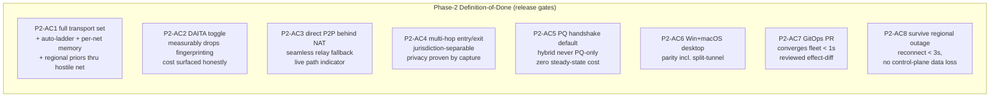
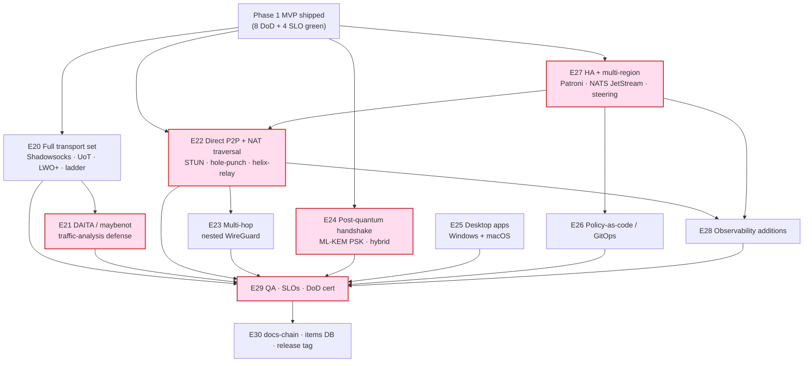
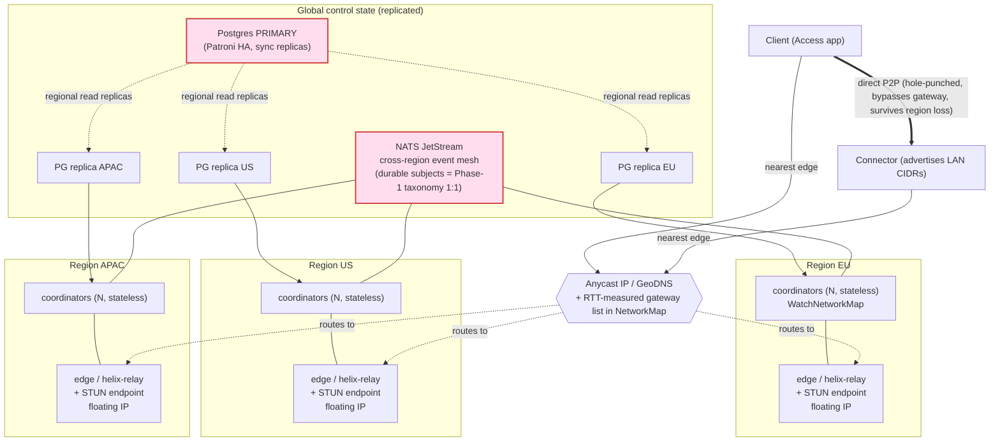

# Phase 2 (Parity + Reach) — Work Breakdown: phases → tasks → subtasks

**Revision:** 2
**Last modified:** 2026-07-04T12:00:00Z
**Rev 2 (hardening pass):** Added §0 cross-reference to
`v07-execution/subtask-deepening-p2.md` (closes REFINEMENT_NOTES.md R5 for
Phase 2); added explicit cross-references from E27 (HA + multi-region) to
`v06-deploy/ha-and-multiregion.md` and `v06-deploy/disaster-recovery.md`; added
§4.1 phase-gate-failure / rollback protocol.

> This document is the executable spine of HelixVPN **Phase 2 — Parity + Reach**:
> the additive evolution that takes the Phase‑1 self‑hostable MVP to **full
> Mullvad feature parity and beyond on reach**. It decomposes the work into
> stable, DB‑ready items (`HVPN-P2-NNN`), each carrying *description · depends‑on ·
> deliverable · acceptance · effort · required‑test‑types*, grouped by capability
> epic. It is **spec‑only** — it describes *what to build and how "done" is
> proven*, never the product itself (2–3 refinement passes follow).
>
> **Phase‑2 discipline (the load‑bearing premise [04_P2 §0/§7]):** *everything is
> additive.* Phase 1 drew the seams — the `Transport` trait, `Peer.endpoint`
> candidate list, federated `Coordinator`, `TransportPolicy.order`, the `NetworkMap`
> delta protocol, PKI hooks — precisely so no Phase‑2 capability reshapes an
> existing interface. New transports are *more impls of the same trait*; NAT
> traversal is *fields the map already reserved*; HA is *topology, same images*.
>
> Authoritative companions (referenced, never re‑defined): data plane
> [`01-data-plane.md`](01-data-plane.md) **[01]**; control plane DDL/protobuf/events
> [`02-control-plane.md`](02-control-plane.md) **[02]**; client core + UI
> [`03-client-core-and-ui.md`](03-client-core-and-ui.md) **[03]**; security/privacy/PKI
> [`04-security-privacy-pki.md`](04-security-privacy-pki.md) **[04]**; product scope
> [`00-product-scope-and-principles.md`](00-product-scope-and-principles.md) **[00]**;
> the Phase‑1 WBS [`07-phase1-mvp-wbs.md`](07-phase1-mvp-wbs.md) **[07]**. Primary
> research: **[04_P2]** (`HelixVPN-Phase2-Parity.md`), **[04_ARCH]**, **[04_P0]**,
> **[04_P1]**, **[11_MST]**, **[07_GMI]**, **[10_KMI]**, **[SYNTHESIS]**, plus the
> external‑fact anchors **[research-masque]**, **[research-hysteria2]**,
> **[research-daita_test]**, **[research-pki_pq_nat]**.
>
> **PR-sized subtask breakdown (closes R5):** every task `HVPN-P2-NNN` below
> decomposes one level further into falsifiable, PR-sized subtasks
> `HVPN-P2-NNN.k` in the companion
> [`v07-execution/subtask-deepening-p2.md`](v07-execution/subtask-deepening-p2.md).
> **HA/DR cross-reference:** E27's fleet topology (§13/§17) is the WBS-level
> view; the full operational HA + DR treatment (RTO/RPO budget, backup/restore
> runbook, region-failover drill checklist, Patroni/CloudNativePG operational
> detail) is owned by
> [`v06-deploy/ha-and-multiregion.md`](v06-deploy/ha-and-multiregion.md) and
> [`v06-deploy/disaster-recovery.md`](v06-deploy/disaster-recovery.md) — E27
> items reference, never duplicate, that detail.

---

## Table of contents

- [0. How to read this WBS](#0-how-to-read-this-wbs)
- [1. Required‑test‑types vocabulary (§11.4.169)](#1-requiredtesttypes-vocabulary-1114169)
- [2. Phase‑2 Definition‑of‑Done — the 8 acceptance gates + 5 SLOs](#2-phase2-definitionofdone--the-8-acceptance-gates--5-slos)
- [2.1 Phase-gate-failure / rollback protocol](#21-phase-gate-failure--rollback-protocol)
- [3. Workable‑item schema (§11.4.93 DB‑ready)](#3-workableitem-schema-1114193-dbready)
- [4. Epic map + dependency graph](#4-epic-map--dependency-graph)
- [5. Phase‑2 entry condition (Phase 1 shipped)](#5-phase2-entry-condition-phase-1-shipped)
- [6. E20 — Full transport / obfuscation set](#6-e20--full-transport--obfuscation-set)
- [7. E21 — DAITA traffic‑analysis defense (maybenot)](#7-e21--daita-trafficanalysis-defense-maybenot)
- [8. E22 — Direct P2P + NAT traversal + helix‑relay](#8-e22--direct-p2p--nat-traversal--helixrelay)
- [9. E23 — Multi‑hop (nested WireGuard)](#9-e23--multihop-nested-wireguard)
- [10. E24 — Post‑quantum handshake (ML‑KEM PSK)](#10-e24--postquantum-handshake-mlkem-psk)
- [11. E25 — Desktop apps (Windows, macOS)](#11-e25--desktop-apps-windows-macos)
- [12. E26 — Policy‑as‑code & GitOps](#12-e26--policyascode--gitops)
- [13. E27 — HA + multi‑region fleet](#13-e27--ha--multiregion-fleet)
- [14. E28 — Observability additions](#14-e28--observability-additions)
- [15. E29 — QA · SLOs · Phase‑2 DoD certification](#15-e29--qa--slos--phase2-dod-certification)
- [16. E30 — Governance: docs‑chain · items DB · release](#16-e30--governance-docschain--items-db--release)
- [17. Multi‑region HA topology (reference diagram)](#17-multiregion-ha-topology-reference-diagram)
- [18. DoD ↔ work‑item traceability matrix](#18-dod--workitem-traceability-matrix)
- [19. Effort roll‑up & critical path](#19-effort-rollup--critical-path)
- [20. Open decisions surfaced (with recommendation)](#20-open-decisions-surfaced-with-recommendation)
- [Sources](#sources)

---

## 0. How to read this WBS

**Granularity.** Three levels: **Epic** (`HVPN-P2-Enn`, a capability workstream)
→ **Task** (`HVPN-P2-NNN`, a shippable unit, ~1–10 person‑days) → **Subtask**
(`HVPN-P2-NNN.k`, a single PR‑sized change). Every **leaf** (a task with no
subtasks, or a subtask) is a workable item per §11.4.93 and is the unit that
lands in the SQLite single‑source‑of‑truth DB (§3).

**ID scheme (stable, append‑only, §11.4.54).** `HVPN-P2-` prefix; the numeric
block encodes the epic: `Enn` → tasks `nn0..nn9`, e.g. E22 (NAT traversal) →
`220..229`. IDs are **never renumbered, reused, or decremented**; new work
appends at the next free number in the block (gaps allowed). Phase‑1 ids
(`HVPN-P1-*`) are a disjoint namespace; cross‑phase deps cite the full id.

**Field contract (every leaf).**

| Field | Meaning |
|---|---|
| **Desc** | What the item builds, in one or two sentences (§11.4.91 ≥6 words / ≥40 chars). |
| **Deps** | Hard upstream item IDs (must be `complete` first). `—` = none. |
| **Deliverable** | The concrete artefact(s) — file paths, crates, generated clients, manifests. |
| **Acceptance** | The falsifiable PASS condition, captured‑evidence per §11.4.5/.69/.107. |
| **Effort** | T‑shirt + person‑days: XS(1) S(2–3) M(4–6) L(7–10) XL(11–15). |
| **Tests** | Required test types from the §1 closed vocabulary (§11.4.169). |

**Risk ordering (§11.4.132).** Within and across epics the *highest‑risk,
hardest‑to‑reverse* capabilities lead: NAT traversal correctness (E22), DAITA
efficacy (E21), and PQ downgrade‑safety (E24) are sequenced before convenience
surfaces (GitOps polish, desktop split‑tunnel UI). Traffic‑analysis defense and
PQ negotiation are the two "subtle, easy to bluff" features — each carries a
*measure‑don't‑assert* acceptance and a self‑validated analyzer (§11.4.107(10)).

**Anti‑bluff (§11.4 / §11.4.27 / §11.4.107).** Every Acceptance line is a
*captured‑evidence* assertion, not "code compiles". A leaf is `complete` only
when its required‑test‑types are green **with** an evidence path in the item's
`test_diary` (§11.4.149) and, where it has a user‑visible surface, a window‑scoped
MP4 vision‑verified per §11.4.159/.163. Two Phase‑2 features are *privacy claims*
that MUST be measured, never asserted: DAITA fingerprinting reduction
(§7 / [research-daita_test]) and PQ session protection (§10). A green pass that
asserts the claim without the measurement is a §11.4 PASS‑bluff.

---

## 1. Required‑test‑types vocabulary (§11.4.169)

§11.4.169 mandates that **every** workable item declare the closed set of test
types it must pass before closure; the universe is the §11.4.27 enumeration. The
closed vocabulary + canonical abbreviations used in this WBS:

| Abbrev | Type | Phase‑2 floor expectation |
|---|---|---|
| `UNIT` | Unit | pure logic (transport framing, ladder FSM, KEM combine, hop‑chain builder); mocks allowed **only here** (§11.4.27). |
| `INT` | Integration | real Postgres/Patroni + NATS + Redis via `containers` submodule testcontainers (§11.4.76); no mocks. |
| `E2E` | End‑to‑end | netns rig [04_P0 §3] with simulated NATs/DPI, fed by the real federated control plane. |
| `FA` | Full‑automation | self‑driving, re‑runnable `-count=3`, no human in the loop (§11.4.98). |
| `SEC` | Security | downgrade‑safety, hop‑isolation capture, relay can't read traffic, mTLS, no‑PQ‑only, key‑never‑leaves (§04). |
| `CHAOS` | Chaos | kill a coordinator / PG primary / a whole region; NATS partition; mid‑rekey SIGKILL (§11.4.85). |
| `STRESS` | Stress | hole‑punch storms, 10k concurrent streams, relay saturation, boundary NAT timings (§11.4.85). |
| `PERF` | Performance | failover‑reconnect p99, relay→direct upgrade latency, DAITA overhead %, cross‑region p99 (§2 SLOs). |
| `BENCH` | Benchmarking | per‑transport goodput/CPU‑per‑Gbps, KEM handshake cost, relay forwarding throughput [04_P0 §8]. |
| `SCALE` | Scaling | N regions × M agents soak; NATS consumer lag + PG replication lag bounded over 24 h. |
| `DDOS` | DDoS | **re‑armed in Phase 2** (public multi‑region surface): STUN endpoint + edge handshake flood, amplification‑refusal (§04). |
| `UI` | UI | widget + golden tests (path indicator, multi‑hop picker, DAITA toggle, PQ chip) on the three flavors. |
| `UX` | UX | flow walkthrough (P2P upgrade, multi‑hop select, region failover) with window‑scoped MP4 + vision verdict (§11.4.159). |
| `REC` | Recorded‑evidence | window‑scoped MP4 (§11.4.154/.155) + media‑validation pipeline verdict (§11.4.163). |
| `CHAL` | Challenge / HelixQA | a `challenges` / `helix_qa` bank entry scoring PASS only on captured evidence (§11.4.27/.107). |

Every task lists only the **required** subset; absent types are out‑of‑scope for
that item by design, not omission. Unlike Phase 1, `DDOS` is now **applicable** —
the multi‑region public edge + STUN endpoints are an internet‑facing surface
(§11.4.6 — the Phase‑1 `NOT_APPLICABLE: single-node-selfhost` deferral is
re‑armed here).

---

## 2. Phase‑2 Definition‑of‑Done — the 8 acceptance gates + 5 SLOs

Phase 2 ships only when **all eight** acceptance criteria (P2‑AC1..AC8) and
**all five** SLOs pass on a clean multi‑region baseline (§11.4.40 full‑suite
retest, §11.4.108 runtime‑signature on a fresh fleet deploy, §11.4.129 huge‑blocker
full‑restart if a release‑blocker surfaces). These are restated from [04_P2
§10.2/§10.3] and bound to work‑items in §18. **The SLOs are themselves
acceptance** — a feature is not "done" until its SLO histogram is green and
alert‑wired.



**P2‑AC1 — Full transport set.** All transports present (plain‑UDP, LWO‑hardened,
MASQUE/H3, Shadowsocks‑wrap, UDP‑over‑TCP); the refined auto‑ladder with
per‑network memory and coordinator‑pushed regional priors keeps a tunnel up
through a hostile‑network simulation. *Evidence:* DPI‑gauntlet E2E + `tshark`
classifier confirming each disguise + per‑network‑memory replay [04_P2 §1,
research-hysteria2].

**P2‑AC2 — DAITA efficacy.** With DAITA on, a closed‑world website‑fingerprinting
classifier's accuracy drops materially vs DAITA‑off, *measured* in the harness;
the bandwidth/latency cost is surfaced honestly in‑app. *Evidence:* the
fingerprinting harness report (accuracy delta) + cover‑traffic overhead metric
[04_P2 §2, research-daita_test].

**P2‑AC3 — Direct P2P + relay fallback.** A direct path establishes between
client and connector behind common NATs; symmetric‑NAT pairs fall back to
`helix-relay` seamlessly; the UI shows the live `direct`/`relay` path. *Evidence:*
NAT‑matrix E2E (pcap proving direct datagrams bypass the gateway) + relay
fallback capture [04_P2 §3].

**P2‑AC4 — Multi‑hop.** A `Client → Entry → Exit` chain proves entry cannot
observe destination and exit cannot observe client IP, with entry/exit in
different regions. *Evidence:* per‑hop packet capture asserting the isolation
invariants [04_P2 §4].

**P2‑AC5 — Post‑quantum handshake.** PQ‑PSK is on by default where both ends
support it (negotiated capability), **always hybrid** (classical + PQ, never
PQ‑only), with zero steady‑state per‑packet cost. *Evidence:* interop matrix
(classical↔PQ negotiation) + downgrade‑safety proof + per‑packet cost benchmark
[04_P2 §5, research-pki_pq_nat].

**P2‑AC6 — Desktop apps.** Windows (`wireguard-nt` + privileged service) and
macOS (`NEPacketTunnelProvider`) reach Linux parity including split‑tunnel.
*Evidence:* per‑platform UX recordings driving connect → reach → split‑tunnel
[04_P2 §6, §11.4.159].

**P2‑AC7 — GitOps.** A merged policy PR converges the whole fleet in **< 1 s**
with a CI‑rendered *effect‑diff* (which devices gain/lose which access) reviewed
before merge. *Evidence:* PR pipeline log + `helix_reconcile_seconds` p99 + the
effect‑diff artefact [04_P2 §7].

**P2‑AC8 — Regional outage survival.** Killing a whole region reconnects affected
clients in **< 3 s** with zero policy/identity loss; existing direct‑P2P sessions
survive untouched. *Evidence:* chaos run capture (region down → reconnect timing
+ post‑recovery state integrity) [04_P2 §8/§10.1].

> **Numeric reconciliation note (found + RESOLVED during hardening pass,
> 2026-07-04).** `SPECIFICATION.md` §8.2 previously stated the Phase‑2 exit
> gate as "failover **< 30 s** with transport preserved" — a coarser
> roadmap-level figure predating this WBS's detailed HA design (§13/§17:
> Anycast + floating IPs + stateless coordinator re‑pin). This WBS's
> **P2‑SLO3 (< 3 s, HVPN-P2-274)** is the refined, instrumented, measured
> target. **`SPECIFICATION.md` §8.2 has already been updated in this same
> hardening pass** to cite "< 3 s (P2‑SLO3)" — both documents now state the
> identical number; no further action is needed on this item.

### SLOs (measured, alert‑on‑breach) — these ARE acceptance

| ID | SLO | Target | Item that wires the metric |
|---|---|---|---|
| **P2‑SLO1** | direct‑path establishment (non‑symmetric NAT) | **> 90% within 10 s** | HVPN-P2-224 |
| **P2‑SLO2** | relay → direct upgrade (when possible) | **< 15 s, no user‑visible reconnect** | HVPN-P2-225 |
| **P2‑SLO3** | gateway failover → client reconnected | **p99 < 3 s** | HVPN-P2-274 |
| **P2‑SLO4** | cross‑region event propagation | **p99 < 2 s** | HVPN-P2-272 |
| **P2‑SLO5** | PQ session adoption (capable pairs) | **> 95%** | HVPN-P2-243 |

---

## 2.1 Phase-gate-failure / rollback protocol

If a P2‑AC/P2‑SLO is red at the planned Phase‑2 exit, the response is scoped
to the failure class — Phase‑2's high-risk tracks are explicitly *parallel*
(§4) precisely so one track's slip does not block the others (§11.4.58):

| Failure class | Response | Cross-reference |
|---|---|---|
| NAT-traversal honesty fails (a false "direct" claim, or symmetric-NAT fallback breaks) | STOP — a false-positive path claim is a §11.4.107 anti-bluff violation, not a schedule problem; root-cause via §11.4.102 before any re-attempt; this is the single non-negotiable gate on the critical path (§4). | §8 E22 acceptance criteria |
| DAITA efficacy is not *measured* as materially better (the golden-bad no-op machine passes, or accuracy delta is negligible) | Do not ship DAITA as a privacy claim — degrade the DoD row to "shipped as opt-in shaping, efficacy unproven" and re-open a tracked follow-up; never assert P2‑AC2 on an unproven measurement (§11.4.6/.107). | HVPN-P2-213/292 |
| PQ downgrade-safety fails (any injected failure path yields weaker-than-classical) | Release-blocking — do not ship PQ default-on until the downgrade FSM is proven fail-closed-or-classical; this reopens D-decision review, not a timeline extension. | HVPN-P2-242; `v00-meta/decision-register.md` §4 D-PKI-CA-TIER family |
| HA/multi-region chaos certification (HVPN-P2-295) fails a specific failure mode | Isolate to the specific component (coordinator/Postgres/NATS/region) per the risk-ordered validation (§11.4.132); re-run **only after** a fix, then the full clean-baseline sweep — never spot-validate the touched component alone (§11.4.130). | `v06-deploy/ha-and-multiregion.md`; `v06-deploy/disaster-recovery.md` |
| A Phase‑2 D-decision (D1/D6/D3/PQ-KEM-mechanism, §20) needs re-opening on captured evidence | Follow the named reversal criteria in `v00-meta/decision-register.md` §6 verbatim — a decision reversal is evidence-driven, never a schedule-pressure shortcut. | `v00-meta/decision-register.md` §6 |
| A **huge-blocker** surfaces during Phase‑2 release validation | Execute §11.4.129 in full: STOP → fix all → process recorded evidence → new tests of every required type → rebuild → reflash → **restart** (not resume) the full multi-region validation. | §11.4.129 |

Per §11.4.58, disjoint-scope epics (E20/E25/E26 vs the critical path E27→E22→
E23→E29) continue in parallel while any single track's gate-failure response
runs — the whole Phase‑2 release is never blocked on a track that is not
itself on the critical path.

---

## 3. Workable‑item schema (§11.4.93 DB‑ready)

Every leaf in §§6–16 maps 1:1 to a row in the git‑tracked SQLite single source
of truth (`docs/.workable_items.db`, §11.4.93/.95). The Phase‑1 loader
(`cmd/workable-items/`, HVPN-P1-150) parses these leaf blocks and upserts by
`atm_id`; Phase 2 reuses it unchanged (the schema below is the same DDL the
Phase‑1 WBS §3 declared, restated for self‑containment). The `phase` discriminator
column lets one DB hold both phases.

```sql
-- docs/.workable_items.db — Phase-2 WBS projection (same schema as [07] §3)
CREATE TABLE IF NOT EXISTS items (
  atm_id        TEXT PRIMARY KEY,                  -- 'HVPN-P2-221'
  parent_id     TEXT REFERENCES items(atm_id),     -- epic or parent task ('HVPN-P2-E22')
  phase         TEXT NOT NULL DEFAULT 'P2' CHECK (phase IN ('P0','P1','P2','P3')),
  kind          TEXT NOT NULL CHECK (kind IN ('epic','task','subtask')),
  title         TEXT NOT NULL CHECK (length(title) >= 6),
  description   TEXT NOT NULL CHECK (length(description) >= 40),  -- §11.4.91/.148
  status        TEXT NOT NULL DEFAULT 'Queued'
                CHECK (status IN ('Queued','In progress','Ready for testing',
                                  'In testing','Reopened','Operator-blocked',
                                  'Obsolete (→ Fixed.md)','Implemented (→ Fixed.md)',
                                  'Completed (→ Fixed.md)','Fixed (→ Fixed.md)')),
  type          TEXT NOT NULL DEFAULT 'Feature' CHECK (type IN ('Bug','Feature','Task')),
  severity      TEXT NOT NULL DEFAULT 'normal',
  epic          TEXT NOT NULL,                      -- 'E22'
  module        TEXT NOT NULL,                      -- 'helix-transport','helix-relay','coordinator',...
  deps          TEXT NOT NULL DEFAULT '[]',         -- JSON array of atm_ids (cross-phase allowed)
  deliverable   TEXT NOT NULL,
  acceptance    TEXT NOT NULL,
  effort_days   INTEGER NOT NULL,
  test_types    TEXT NOT NULL,                      -- JSON: ["UNIT","INT","SEC","DDOS"] (§11.4.169)
  dod_refs      TEXT NOT NULL DEFAULT '[]',         -- JSON: ["P2-AC3","P2-SLO1"]
  source_refs   TEXT NOT NULL DEFAULT '[]',         -- JSON: ["04_P2 §3","11_MST §4"]
  created_at    TEXT NOT NULL DEFAULT (datetime('now')),
  modified_at   TEXT NOT NULL DEFAULT (datetime('now'))
);
-- per-item test diary (§11.4.149) — a PASS row REQUIRES a non-empty evidence path:
CREATE TABLE IF NOT EXISTS test_diary (
  id            INTEGER PRIMARY KEY AUTOINCREMENT,
  atm_id        TEXT NOT NULL REFERENCES items(atm_id),
  date_time     TEXT NOT NULL,
  tested_by     TEXT NOT NULL CHECK (tested_by IN ('User','Operator','AI-agent','HelixQA')),
  result        TEXT NOT NULL CHECK (result IN ('PASS','FAIL','SKIP')),
  test_type     TEXT NOT NULL,                      -- one of the §11.4.169 vocab
  evidence_path TEXT,                               -- qa-results/<run-id>/...
  observations  TEXT NOT NULL,
  CHECK (result <> 'PASS' OR (evidence_path IS NOT NULL AND length(evidence_path) > 0))
);
```

Example row (one leaf) so the projection is unambiguous:

```sql
INSERT INTO items (atm_id,parent_id,phase,kind,title,description,epic,module,deps,
                   deliverable,acceptance,effort_days,test_types,dod_refs,source_refs)
VALUES (
 'HVPN-P2-222','HVPN-P2-E22','P2','task',
 'UDP hole punching across NAT-type matrix',
 'Drive simultaneous WG handshake probes to every peer candidate so full-/restricted-/port-restricted-cone NATs open a direct path, latching WireGuard roaming onto the working endpoint.',
 'E22','helix-core','["HVPN-P2-220","HVPN-P2-221"]',
 'helix-core/src/nat/punch.rs; netns NAT-matrix harness',
 'Direct datagrams captured bypassing the gateway for full/restricted/port-restricted pairs; symmetric pairs cleanly fall through to relay (HVPN-P2-223); no false direct claim.',
 8,'["UNIT","E2E","STRESS","SEC","CHAL"]','["P2-AC3","P2-SLO1"]','["04_P2 §3.2","SYNTHESIS §3 D6"]');
```

---

## 4. Epic map + dependency graph



Critical path (red): **E27 → E22 → E23 → E29** for the networking/reach spine,
with **E24 (PQ)** and **E21 (DAITA)** as parallel high‑risk tracks that converge
at E29. E27 (multi‑region) leads because the STUN endpoints, relay fleet, and
NATS event mesh that E22/E26/E28 consume are *its* outputs (a single‑region P2P
can be prototyped earlier, but production NAT traversal + relay fungibility
depend on the multi‑region edge). E20/E25/E26 fan out as disjoint‑scope PWUs
(§11.4.58) off the shipped MVP. Audio‑style "top priority first" (§11.4.132) maps
here to the **correctness‑and‑downgrade‑safety floor**: NAT‑traversal honesty
(E22), DAITA *measured* efficacy (E21), PQ *never‑weaker‑than‑classical* (E24)
lead every iteration.

---

## 5. Phase‑2 entry condition (Phase 1 shipped)

> Phase 2 is strictly additive; it assumes the Phase‑1 seams exist and are green.
> These items are **not** Phase‑2 work but the gating precondition — they track
> that the reserved seams are present so no Phase‑2 capability has to reshape an
> interface (§11.4.114 — the shipped MVP tag is the known‑good baseline).

**HVPN-P2-E19 — Phase‑1 seam certification (entry gate)** `epic · module: gate`

- **HVPN-P2-190 — Transport‑trait seam present.** `XS(1) · deps: HVPN-P1-090 · tests: UNIT,INT`
  - *Desc:* Confirm the Phase‑1 `Transport` trait + `TransportPolicy.order` ladder exist and accept new impls without signature change, so E20 is purely additive. *Deliverable:* seam‑audit report citing `helix-transport/src/lib.rs`. *Acceptance:* a no‑op stub transport registers + the ladder walks it with zero changes to the trait [04_P0, 04_P1 §5].
- **HVPN-P2-191 — `Peer.endpoint` candidate‑list seam present.** `XS(1) · deps: HVPN-P1-071 · tests: UNIT`
  - *Desc:* Confirm the `NetworkMap.Peer.endpoint` already carries a *candidate list* (not a single addr) reserved in Phase 1 for NAT traversal. *Deliverable:* protobuf audit. *Acceptance:* the field is `repeated EndpointCandidate`; the coordinator can emit a delta populating it [04_P2 §3.1].
- **HVPN-P2-192 — Federated `Coordinator` + PKI hooks present.** `XS(1) · deps: HVPN-P1-070,HVPN-P1-030 · tests: UNIT,SEC`
  - *Desc:* Confirm coordinator statelessness assumptions (rebuildable cache) and PKI PSK hooks reserved in Phase 1 so HA (E27) and PQ (E24) attach without redesign. *Deliverable:* seam audit. *Acceptance:* coordinator hydrates from store+events with no local durable state; PKI exposes a PSK‑injection hook [04_ARCH §10, 04_P2 §5.1].

---

## 6. E20 — Full transport / obfuscation set

Phase 1 proved the `Transport` trait with three impls (plain‑UDP, basic LWO,
MASQUE/H3). Phase 2 fills the matrix — **every new transport is just another
impl of the same trait**, shared byte‑for‑byte across client, connector, and
edge [04_P2 §1]. The trait the new impls satisfy (restated from [01]/[04_P0]):

```rust
// helix-transport/src/lib.rs — the seam (unchanged since Phase 1)
#[async_trait::async_trait]
pub trait Transport: Send + Sync {
    /// Stable, ladder-addressable id, e.g. "plain-udp", "masque-h3", "shadowsocks", "udp-over-tcp".
    fn id(&self) -> &'static str;
    /// Dial the peer endpoint; returns a duplex framed channel carrying WG datagrams.
    async fn dial(&self, ep: &Endpoint, params: &TransportParams) -> Result<Channel, TransportError>;
    /// Listen (edge/connector side) for inbound disguised WG datagrams.
    async fn accept(&self, bind: &Endpoint, params: &TransportParams) -> Result<Channel, TransportError>;
    /// Reliability class — informs the ladder & DAITA timing model.
    fn reliability(&self) -> Reliability; // Datagram { lossy } | Stream { hol_blocking }
}
```

**HVPN-P2-E20 — Full transport / obfuscation set** `epic · module: helix-transport`

- **HVPN-P2-200 — Shadowsocks‑wrap transport.** `M(6) · deps: HVPN-P2-190 · tests: UNIT,INT,E2E,SEC,BENCH,CHAL`
  - *Desc:* Wrap WG datagrams in a Shadowsocks AEAD stream (looks like random/TLS‑ish TCP) for China‑style DPI where even QUIC is throttled, reusing `shadowsocks-rust` crypto primitives rather than re‑implementing AEAD framing. *Deliverable:* `helix-transport/src/shadowsocks.rs` (sketch below); DPI‑gauntlet fixture. *Acceptance:* tunnel survives `udp drop` + `quic drop` nft rules; `tshark` classifier sees no WG/QUIC signature; goodput recorded with the TCP‑HoL caveat noted [04_P2 §1.1, research-hysteria2].

```rust
// helix-transport/src/shadowsocks.rs
pub struct ShadowsocksTransport {
    cipher: AeadKind,            // ChaCha20-Poly1305 | Aes256Gcm
    psk: SecretBytes,           // transport password — SEPARATE from WG keys (§04)
}
#[async_trait::async_trait]
impl Transport for ShadowsocksTransport {
    fn id(&self) -> &'static str { "shadowsocks" }
    async fn dial(&self, ep: &Endpoint, p: &TransportParams) -> Result<Channel, TransportError> {
        let tcp = TcpStream::connect(ep.sockaddr()).await?;
        let aead = AeadStream::client(tcp, self.cipher, &self.psk)?; // salt + AEAD session
        Ok(Channel::stream(LengthPrefixedWg::new(aead)))             // 2-byte len + WG datagram
    }
    async fn accept(&self, bind: &Endpoint, p: &TransportParams) -> Result<Channel, TransportError> { /* mirror */ }
    fn reliability(&self) -> Reliability { Reliability::Stream { hol_blocking: true } }
}
```

- **HVPN-P2-201 — UDP‑over‑TCP (UoT) transport.** `S(3) · deps: HVPN-P2-190 · tests: UNIT,E2E,BENCH`
  - *Desc:* Length‑prefix WG datagrams over a single TCP connection as the last‑resort transport when *all* UDP is blocked, accepting head‑of‑line‑blocking purely to keep a tunnel *possible* (matches Mullvad `udp2tcp`). *Deliverable:* `helix-transport/src/udp_over_tcp.rs`. *Acceptance:* tunnel comes up under `udp drop` (all ports); reachability preserved; HoL penalty measured + documented; ladder ranks it last [04_P2 §1.2].
- **HVPN-P2-202 — LWO hardening (per‑session keyed header obfuscation).** `M(5) · deps: HVPN-P2-190 · tests: UNIT,SEC,BENCH,CHAL`
  - *Desc:* Upgrade the Phase‑1 XOR/padding LWO to a per‑session‑keyed scheme obfuscating exactly the WG header bytes DPI signatures key on (message‑type/reserved fields) plus randomized padding — cheap evasion of *naive* WG fingerprinting without QUIC overhead (Mullvad LWO is the reference). *Deliverable:* `helix-transport/src/lwo.rs` v2. *Acceptance:* a WG‑signature DPI rule that drops Phase‑1 plain‑WG fails to classify LWO‑v2 traffic; overhead < 2% vs plain‑UDP [04_P2 §1.3].
- **HVPN-P2-203 — Refined auto‑escalation ladder + per‑network memory.** `M(6) · deps: HVPN-P2-200,HVPN-P2-201,HVPN-P2-202 · tests: UNIT,E2E,FA,CHAL`
  - *Desc:* Walk `TransportPolicy.order` on repeated handshake failure across the full set with a per‑step failure budget (N handshakes / T seconds), and **remember the working transport per‑network** (SSID/gateway fingerprint) so reconnects on the same hostile network skip straight to what worked. *Deliverable:* `helix-core/src/ladder.rs` FSM + `network_memory` store. *Acceptance:* on a network that blocks UDP+QUIC the client converges to `shadowsocks`, persists it, and on the *next* connect to the same network skips escalation latency (captured timing delta) [04_P2 §1.4].

```rust
// helix-core/src/ladder.rs — escalation FSM (sketch)
pub struct Ladder { order: Vec<TransportId>, budget: FailureBudget, memory: NetworkMemory }
impl Ladder {
    pub async fn connect(&mut self, net: NetworkFingerprint) -> Result<ActiveTransport, LadderError> {
        // 1. fast-path: a remembered transport for THIS network jumps the queue
        let start = self.memory.get(&net).map(|t| self.index_of(t)).unwrap_or(0);
        for t in &self.order[start..] {
            match self.try_handshake(t, &self.budget).await {
                Ok(active) => { self.memory.remember(net, *t); return Ok(active); }
                Err(_) if self.budget.exhausted() => continue,   // escalate
                Err(e) => return Err(e),                         // hard fail (not censorship)
            }
        }
        Err(LadderError::AllExhausted)
    }
}
```

- **HVPN-P2-204 — Coordinator‑pushed regional priors.** `S(3) · deps: HVPN-P2-203,HVPN-P1-072 · tests: UNIT,INT,E2E`
  - *Desc:* Let the coordinator push a `TransportPolicy.order` prior keyed on the client's resolved region (e.g. "CN‑resolved clients start at `shadowsocks`") inside the `NetworkMap`, so users in censored regions skip escalation latency. *Deliverable:* `coordinator/policy/regional_prior.go` + `TransportPolicy.region_prior` map field. *Acceptance:* a client whose probe IP resolves to a censored region receives a reordered ladder in its first map and connects on the prior's head transport [04_P2 §1.4].
- **HVPN-P2-205 — Aggregate censorship‑evasion telemetry.** `S(2) · deps: HVPN-P2-203,HVPN-P1-080 · tests: UNIT,SEC,CHAL`
  - *Desc:* Record **only** "transport X succeeded after N escalations in region R" (aggregate, no per‑user data) feeding the Censorship‑Evasion Success dashboard, with a CI schema‑lint asserting no per‑connection row appears (§11.4 no‑logging). *Deliverable:* `telemetry/evasion.go` + Grafana panel. *Acceptance:* dashboard renders transport‑mix by region; the §11.4 schema‑lint mutation (a per‑user evasion table) FAILs the build [04_ARCH §9, 04_P2 §1.4].
- **HVPN-P2-206 — Hysteria2/Salamander interop evaluation (decision D1/D6).** `S(3) · deps: HVPN-P2-200 · tests: BENCH,E2E`
  - *Desc:* Benchmark a Hysteria2+Salamander obfuscated‑QUIC leg vs MASQUE/H3 on the user↔gateway hop, to decide whether the *asymmetric per‑leg* topology [11_MST] (Hysteria2 user↔gateway, WG gateway↔networks) is worth adopting over the single‑protocol MASQUE end‑to‑end stance [04_ARCH §3.3]. *Deliverable:* §20 decision‑log row + A/B CSV (goodput under loss, brutal‑congestion behaviour, DPI evasion parity). *Acceptance:* a recorded decision with evidence; **recommendation: keep MASQUE/H3 primary** (single Rust impl, true Mullvad‑parity, no second protocol stack) and treat Hysteria2 as an *optional* ladder rung only if the benchmark shows a material reach/goodput win in hostile networks [SYNTHESIS §3 D1/D6, research-hysteria2, research-masque].

---

## 7. E21 — DAITA traffic‑analysis defense (maybenot)

Even fully encrypted, packet **size/timing/frequency** patterns fingerprint
which site a user visits. DAITA defeats this. **Do not roll your own** — adopt
the **maybenot** framework (the engine behind Mullvad's DAITA): a lightweight
state‑machine engine for padding + cover‑traffic "machines" [04_P2 §2,
research-daita_test]. DAITA shaping is a layer **above WireGuard, below the
transport**, orthogonal to *which* transport is in use:

```
TUN → WG encrypt → [DAITA shaping: pad + inject cover] → Transport → wire
```

**HVPN-P2-E21 — DAITA / maybenot** `epic · module: helix-core`

- **HVPN-P2-210 — maybenot engine integration.** `M(6) · deps: HVPN-P2-203 · tests: UNIT,INT,BENCH`
  - *Desc:* Embed the `maybenot::Framework` as a shaping stage over the WG‑datagram stream: per‑outgoing‑datagram `on_packet` may pad and/or schedule cover packets, and a timer‑driven `tick` emits scheduled padding/cover — machines are **config (data), not code**. *Deliverable:* `helix-core/src/daita.rs` (sketch below). *Acceptance:* with a known padding machine loaded, outgoing datagrams are padded to uniform sizes and cover packets emit on schedule (capture asserts size histogram collapses to the target sizes) [04_P2 §2.3].

```rust
// helix-core/src/daita.rs — shaping stage (sketch)
pub struct Daita { framework: maybenot::Framework /* machines = NetworkMap data */ }
impl Daita {
    fn on_packet(&mut self, dg: &mut Bytes, now: Instant) -> Vec<ScheduledAction> { /* pad + schedule cover */ }
    fn tick(&mut self, now: Instant) -> Vec<Bytes> { /* emit due cover/padding packets */ }
}
```

- **HVPN-P2-211 — Machines‑as‑data distribution via NetworkMap.** `S(3) · deps: HVPN-P2-210,HVPN-P1-071 · tests: UNIT,INT,E2E`
  - *Desc:* Add a `daita` field to `NetworkMap` carrying signed maybenot machine definitions so defenses are tuned/updated server‑side without shipping a client build, gated by the architecture parity matrix. *Deliverable:* `proto/networkmap.proto` `DaitaConfig` + `coordinator/daita.go`. *Acceptance:* a coordinator‑pushed machine update changes client shaping behaviour live (no rebuild); machine blobs are signature‑verified before load (tampered blob rejected, captured) [04_P2 §2.3, §04].
- **HVPN-P2-212 — DAITA opt‑in toggle + honest cost surface.** `S(3) · deps: HVPN-P2-210,HVPN-P1-110 · tests: UI,UX,REC`
  - *Desc:* Surface DAITA as a "maximum privacy" opt‑in (off by default, Mullvad's stance) in the Access app with an honest cost note (bandwidth/latency), reflecting the live `cover_ratio`. *Deliverable:* `helix-ui` `DaitaToggle` widget + Riverpod binding to core status. *Acceptance:* UX recording shows toggling DAITA on/off, the cost note, and the live overhead readout (§11.4.159 vision‑verified) [04_P2 §2.3].
- **HVPN-P2-213 — Closed‑world fingerprinting efficacy harness (the privacy claim).** `L(8) · deps: HVPN-P2-210 · tests: FA,SEC,CHAL,BENCH`
  - *Desc:* Build the *measure‑don't‑assert* harness: a closed‑world website‑fingerprinting classifier trained on captured traces, run DAITA‑off vs DAITA‑on, asserting classifier accuracy drops *materially* — with the analyzer itself self‑validated (golden‑good machine reduces accuracy; golden‑bad "no‑op machine" does NOT, §11.4.107(10)). *Deliverable:* `tests/daita/wf_harness/` + accuracy report. *Acceptance:* DAITA‑on accuracy < DAITA‑off accuracy by the documented margin on the project's own fixtures; the golden‑bad no‑op machine FAILs the analyzer (proving the harness can't bluff); cover‑traffic overhead recorded [04_P2 §2.3/§10.1, research-daita_test, §11.4.123].

---

## 8. E22 — Direct P2P + NAT traversal + helix‑relay

Phase 1 relayed **all** peer traffic through the gateway. Phase 2 makes the
gateway a **coordinator + relay‑of‑last‑resort**, with traffic going **directly**
between client and connector wherever NAT allows (the Tailscale/WireGuard roaming
model) — lower latency, far less gateway bandwidth, better scaling [04_P2 §3].

**HVPN-P2-E22 — Direct P2P + NAT traversal + relay** `epic · module: helix-core, helix-relay, coordinator`

- **HVPN-P2-220 — STUN‑like endpoint discovery.** `M(5) · deps: HVPN-P2-191,HVPN-P2-271 · tests: UNIT,INT,E2E,DDOS`
  - *Desc:* Each node learns its candidates — all local interface addresses (host candidates) + a server‑reflexive candidate discovered by probing the gateway's STUN‑like endpoint (which echoes the observed `src ip:port`, revealing the NAT mapping) — reported to the coordinator via `ReportStatus`. *Deliverable:* `helix-core/src/nat/discover.rs` + `helix-edge/src/stun.rs`. *Acceptance:* a node behind NAT reports a correct server‑reflexive `ip:port`; the STUN endpoint refuses amplification (response ≤ request size, rate‑limited — DDoS test) [04_P2 §3.1, §04].
- **HVPN-P2-221 — Candidate distribution via WatchNetworkMap (no new signal service).** `S(3) · deps: HVPN-P2-220 · tests: UNIT,INT,E2E`
  - *Desc:* Reuse the existing `WatchNetworkMap` stream **as the signaling channel**: when two authorized peers come online the coordinator pushes each the other's candidate list as a `Peer.endpoint` delta (NetBird uses a dedicated signal service; HelixVPN folds it into the coordinator). *Deliverable:* `coordinator/signaling.go` (delta builder). *Acceptance:* both peers receive each other's candidates within the SLO1 budget; candidates are policy‑filtered (need‑to‑know — a peer not authorized never appears) [04_P2 §3.3, §04].
- **HVPN-P2-222 — UDP hole punching across the NAT‑type matrix.** `L(8) · deps: HVPN-P2-220,HVPN-P2-221 · tests: UNIT,E2E,STRESS,SEC,CHAL`
  - *Desc:* Both peers simultaneously send WG handshake probes to all of the peer's candidates; for full‑/restricted‑/port‑restricted‑cone NATs a path opens and WireGuard's roaming latches onto whatever source a valid handshake arrives from; symmetric‑on‑both‑ends fails over to relay. *Deliverable:* `helix-core/src/nat/punch.rs` + netns NAT‑matrix harness. *Acceptance:* direct datagrams **captured bypassing the gateway** for full/restricted/port‑restricted pairs; symmetric pairs cleanly fall through to relay; **no false "direct" claim** (a path is "direct" only when a non‑gateway src is observed at the peer, §11.4.107) [04_P2 §3.2].

```rust
// helix-core/src/nat/punch.rs — simultaneous-open (sketch)
pub async fn punch(peer: &PeerCandidates, wg: &WgHandle) -> PathOutcome {
    // fire WG handshake initiations at EVERY candidate concurrently
    let probes = peer.candidates.iter().map(|c| wg.send_handshake_to(c));
    join_all(probes).await;
    // WG roams to whatever valid response source arrives first
    match wg.await_first_valid_response(HOLE_PUNCH_TIMEOUT).await {
        Some(src) if !src.is_gateway() => PathOutcome::Direct(src),  // <-- proven by non-gateway src
        _                              => PathOutcome::RelayFallback, // symmetric / hostile FW
    }
}
```

- **HVPN-P2-223 — helix‑relay (DERP‑style encrypted relay fallback).** `L(8) · deps: HVPN-P2-222,HVPN-P2-273 · tests: UNIT,INT,E2E,SEC,STRESS,BENCH`
  - *Desc:* When direct fails (symmetric NAT / hostile firewall), traffic relays through the edge in `helix-relay` mode over an encrypted relay keyed by destination public key — the relay sees only encrypted WG datagrams **below the WG crypto boundary** (it cannot read traffic), preserving no‑logging even on the relay path; relays are fungible across tenants/regions. *Deliverable:* `helix-edge/src/relay.rs` (mode of the edge). *Acceptance:* symmetric‑NAT pair communicates via relay; a memory/pcap inspection of the relay proves it holds only ciphertext keyed by pubkey (no plaintext, no per‑flow durable record); any region's relay forwards for any tenant [04_P2 §3.4, §04].
- **HVPN-P2-224 — Path selection: start‑relay, upgrade‑to‑direct.** `M(6) · deps: HVPN-P2-222,HVPN-P2-223 · tests: UNIT,E2E,PERF,FA · DoD: P2-SLO1`
  - *Desc:* Start on relay for instant connectivity, attempt direct in the background, and upgrade seamlessly when a direct path is confirmed (latency drop, no user‑visible reconnect); report current path (`direct`/`relay`) in status. *Deliverable:* `helix-core/src/path.rs` selector + `StatusReport.path`. *Acceptance:* **P2‑SLO1** — direct‑path establishment for non‑symmetric NAT **> 90% within 10 s**, measured histogram; relay path is the instant fallback with no connectivity gap [04_P2 §3.5/§10.3].
- **HVPN-P2-225 — Continuous direct‑path health‑check + downgrade.** `S(3) · deps: HVPN-P2-224 · tests: UNIT,E2E,PERF,CHAOS · DoD: P2-SLO2`
  - *Desc:* Continuously health‑check the direct path and downgrade to relay if it degrades, surfacing the current path to the UI; the relay→direct upgrade and direct→relay downgrade are both seamless (no user‑visible reconnect). *Deliverable:* `helix-core/src/path.rs` health loop + UI `PathIndicator`. *Acceptance:* **P2‑SLO2** — relay→direct upgrade **< 15 s** with no reconnect; injected direct‑path degradation downgrades to relay within the health‑check window, captured [04_P2 §3.5/§10.3].
- **HVPN-P2-226 — Path indicator UI + UX.** `S(2) · deps: HVPN-P2-224,HVPN-P1-110 · tests: UI,UX,REC`
  - *Desc:* Show the live `direct`/`relay` path (and NAT‑traversal state) in the Access app via a `PathIndicator` component bound to the core status stream. *Deliverable:* `helix-ui` `PathIndicator` + golden tests. *Acceptance:* UX recording shows the indicator flipping relay→direct on upgrade and direct→relay on injected degradation (§11.4.159 vision‑verified) [04_P2 §3.5].

---

## 9. E23 — Multi‑hop (nested WireGuard)

Generalizes §3.5 of the architecture: a client routes `Client → Entry → Exit →
{internet | connector}` so no single node sees both who you are and where you're
going [04_P2 §4]. Mechanism — **nested WireGuard**, no new wire protocol:

```
Client holds TWO WG sessions:
  outer: Client ↔ Entry   (Entry sees client IP, not destination)
  inner: Client ↔ Exit    (Exit sees destination, not client IP — only sees Entry)
packets: WG_outer( WG_inner( payload ) )  → Entry decapsulates outer → forwards to Exit
transport/obfuscation applies to the OUTER session; inner is plain WG inside it.
```

**HVPN-P2-E23 — Multi‑hop (nested WireGuard)** `epic · module: helix-core, coordinator`

- **HVPN-P2-230 — Hop‑chain computation in the coordinator.** `M(5) · deps: HVPN-P2-191,HVPN-P1-072 · tests: UNIT,INT,SEC`
  - *Desc:* Compute the hop chain (respecting `exitNodes` policy + user selection), assign per‑hop keys, and push a multi‑hop `NetworkMap` with a `hops` list; entry/exit may be gateways in different regions/jurisdictions (the privacy point). *Deliverable:* `proto/networkmap.proto` `Hop`/`hops` + `coordinator/hops.go`. *Acceptance:* a user choosing Entry=EU, Exit=US receives a two‑hop map with distinct per‑hop keys; policy `exitNodes` is enforced (an unauthorized exit is never offered) [04_P2 §4.2].
- **HVPN-P2-231 — Nested‑session construction in helix‑core.** `M(6) · deps: HVPN-P2-230 · tests: UNIT,E2E,BENCH`
  - *Desc:* Build the nested WG sessions from the `hops` map (outer Client↔Entry obfuscated, inner Client↔Exit plain‑WG inside), with the transport/DAITA stack applied to the outer session only. *Deliverable:* `helix-core/src/multihop.rs`. *Acceptance:* end‑to‑end reachability through Entry→Exit; goodput/latency overhead of the second hop measured + documented [04_P2 §4.1].
- **HVPN-P2-232 — Hop‑isolation capture assertions (the privacy proof).** `M(5) · deps: HVPN-P2-231 · tests: SEC,E2E,CHAL`
  - *Desc:* Packet‑capture at each hop proving Entry observes client IP but not destination, and Exit observes destination but not client IP (it only sees Entry) — the actual multi‑hop privacy claim, measured not asserted. *Deliverable:* `tests/multihop/isolation/` capture harness. *Acceptance:* **P2‑AC4** — at Entry, destination is absent from the cleartext it can see; at Exit, the client IP is absent (only Entry's appears); both proven by pcap, with a mutation (collapse to single hop) FAILing the assertion [04_P2 §4, §10.1].
- **HVPN-P2-233 — Multi‑hop picker UI.** `S(3) · deps: HVPN-P2-230,HVPN-P1-110 · tests: UI,UX,REC`
  - *Desc:* Add an entry/exit picker (region/jurisdiction labelled) to the Access app, bound to the policy‑permitted hop set. *Deliverable:* `helix-ui` `MultiHopPicker`. *Acceptance:* UX recording shows selecting Entry/Exit and the resulting two‑hop connection with the path/jurisdiction labels (§11.4.159) [04_P2 §4].

---

## 10. E24 — Post‑quantum handshake (ML‑KEM PSK)

WireGuard's Curve25519 handshake is vulnerable to **harvest‑now‑decrypt‑later**.
Phase 2 closes this the way Mullvad does — **without forking WireGuard's
crypto** — by establishing a post‑quantum‑derived **pre‑shared key (PSK)** over
the already‑authenticated control channel and mixing it into the WG handshake
[04_P2 §5, research-pki_pq_nat]:

```
on session setup, over the (already-authenticated) Coordinator RPC:
  client  → gateway:  PQ-KEM public key   (ML-KEM / Kyber, FIPS 203)
  gateway → client:   KEM ciphertext
  both derive:        shared secret → HKDF → WG PSK
  WG handshake then proceeds with that PSK mixed in.  rotate on each rekey.
```

**HVPN-P2-E24 — Post‑quantum handshake** `epic · module: pki, helix-core`

- **HVPN-P2-240 — ML‑KEM PSK exchange over the control channel.** `L(8) · deps: HVPN-P2-192 · tests: UNIT,INT,SEC,BENCH`
  - *Desc:* Implement the ML‑KEM (FIPS 203) KEM exchange riding the existing authenticated `Coordinator` RPC (no new public listener, no unauthenticated PQ endpoint to attack), deriving the WG PSK via HKDF and rotating it on each rekey interval. *Deliverable:* `pki/pq/mlkem.rs` + `helix-core/src/pq.rs` (sketch below). *Acceptance:* two PQ‑capable peers establish a WG session whose PSK is ML‑KEM‑derived; PSK rotates on rekey (captured); the exchange happens at setup/rekey only [04_P2 §5.1, research-pki_pq_nat].

```rust
// helix-core/src/pq.rs — PQ-PSK negotiation (sketch)
pub enum KemSuite { MlKem768, MlKem768PlusMcEliece /* hybrid-conservative hedge */ }
pub trait PqKem { fn keypair(&self) -> (PqPublic, PqSecret);
                  fn encapsulate(&self, pk: &PqPublic) -> (Ciphertext, SharedSecret);
                  fn decapsulate(&self, ct: &Ciphertext, sk: &PqSecret) -> SharedSecret; }
pub fn derive_wg_psk(classical: &SharedSecret, pq: &SharedSecret) -> WgPsk {
    // HYBRID: PSK = HKDF(classical || pq) — a flaw in EITHER cannot weaken below the other (§AC5)
    Hkdf::<Sha256>::new(None, &[classical.as_bytes(), pq.as_bytes()].concat()).expand_psk()
}
```

- **HVPN-P2-241 — Hybrid combiner (never PQ‑only) + capability negotiation.** `M(5) · deps: HVPN-P2-240 · tests: UNIT,SEC,E2E`
  - *Desc:* Always combine the PQ secret with the classical exchange (defense‑in‑depth: an attacker must break *both*; a flaw in the younger PQ primitive can't *weaken* you below classical), and negotiate the capability so classical‑only ↔ PQ‑capable pairs interoperate. *Deliverable:* `helix-core/src/pq.rs` combiner + `proto` capability flags. *Acceptance:* PQ session never derives the PSK from PQ alone (unit + mutation: PQ‑only combine → FAIL); a PQ‑capable client to a classical‑only gateway negotiates down to classical without error [04_P2 §5.1].
- **HVPN-P2-242 — Downgrade‑safety guard.** `M(5) · deps: HVPN-P2-241 · tests: SEC,E2E,CHAL`
  - *Desc:* Guarantee a PQ failure **never silently drops to weaker‑than‑classical** — a failed PQ exchange either re‑establishes classical (still today's security) or fails closed, never a degraded path; a downgrade is logged as a control event (not traffic). *Deliverable:* `helix-core/src/pq.rs` downgrade FSM + audit hook. *Acceptance:* injecting a PQ‑exchange failure yields either a clean classical session or a fail‑closed, **never** a session weaker than classical (captured); an MITM strip‑PQ attempt is detected/logged [04_P2 §5.1/§10.1, §04].
- **HVPN-P2-243 — PQ default‑on where supported + adoption metric.** `S(3) · deps: HVPN-P2-241,HVPN-P2-280 · tests: UNIT,PERF,REC · DoD: P2-SLO5`
  - *Desc:* Make PQ on by default for new tunnels where both ends advertise support (negotiated), with zero steady‑state per‑packet cost (KEM only at setup/rekey), and surface a "Quantum‑resistant" chip; wire the adoption metric. *Deliverable:* `helix-core` default + `helix-ui` `PqChip` + `helix_pq_sessions_ratio` metric. *Acceptance:* **P2‑SLO5** — PQ adoption among capable pairs **> 95%** (dashboard) + per‑packet benchmark shows ~0 steady‑state delta vs classical [04_P2 §5.2/§10.3].
- **HVPN-P2-244 — Rosenpass alternative evaluation (decision).** `S(3) · deps: HVPN-P2-240 · tests: BENCH,SEC`
  - *Desc:* Evaluate the audited external **Rosenpass** PQ key‑exchange daemon (feeds WG a PSK) vs the in‑house ML‑KEM exchange, on audit pedigree, integration cost, and operational surface. *Deliverable:* §20 decision‑log row + comparison. *Acceptance:* recorded decision; **recommendation: ship the in‑house ML‑KEM PSK exchange** (rides the existing authenticated channel, one fewer daemon, pluggable in `pki`) while keeping a Rosenpass adapter as a `KemSuite` variant for operators who prefer an externally‑audited protocol [04_P2 §5.1, SYNTHESIS §4].

---

## 11. E25 — Desktop apps (Windows, macOS)

The Flutter UI + Rust core already build for desktop (proven on Linux in
Phase 0/1); Phase 2 adds the two remaining first‑class desktop tunnel shims —
everything above the shim is the **same `helix-ui` + `helix-core`** [04_P2 §6].

| Platform | Tunnel mechanism | Shim notes |
|---|---|---|
| **Windows** | `wireguard-nt` / `wintun` | a small Windows **service** runs the privileged tunnel hosting `helix-core`; the Flutter app talks to it over a named‑pipe IPC; code‑sign driver + service. |
| **macOS** | `NEPacketTunnelProvider` | same Network Extension model as iOS but desktop‑class memory (the iOS ceiling does not bite); notarize + sign. |

**HVPN-P2-E25 — Desktop apps** `epic · module: shims/windows, shims/apple, helix-ui`

- **HVPN-P2-250 — Windows privileged service + wireguard‑nt shim.** `L(9) · deps: HVPN-P2-190 · tests: INT,E2E,SEC,REC`
  - *Desc:* Build the Windows service that hosts `helix-core` over `wireguard-nt`/`wintun`, exposing a named‑pipe IPC the unprivileged Flutter app drives (connect/disconnect/status), with a signed driver + signed service. *Deliverable:* `shims/windows/` service + `helix_core_ffi` host + named‑pipe protocol. *Acceptance:* connect → reach an authorized LAN host from Windows; the app is unprivileged, the service holds the tunnel; driver + service Authenticode‑signed (verified) [04_P2 §6].
- **HVPN-P2-251 — macOS NEPacketTunnelProvider shim.** `M(6) · deps: HVPN-P2-190 · tests: INT,E2E,SEC,REC`
  - *Desc:* Build the macOS Network Extension hosting `helix-core` (desktop memory budget), notarized + signed, driving the same UI/core as every other platform. *Deliverable:* `shims/apple/macos/` NE target. *Acceptance:* connect → reach from macOS; notarization + signature verified; UX recording (§11.4.159) [04_P2 §6].
- **HVPN-P2-252 — Desktop split‑tunnel (per‑app routing).** `L(8) · deps: HVPN-P2-250,HVPN-P2-251 · tests: UNIT,E2E,SEC,UX,REC`
  - *Desc:* Implement per‑app routing — the main net‑new platform surface — via Windows WFP filters and macOS app‑bound rules, with the include/exclude app set driven from the shared UI. *Deliverable:* `shims/windows/wfp.rs` + `shims/apple/macos/split.swift` + `helix-ui` split‑tunnel screen. *Acceptance:* a designated app routes outside the tunnel while the rest stays inside (pcap proves the split per‑app on both OSes); UX recording (§11.4.159) [04_P2 §6].
- **HVPN-P2-253 — Desktop kill‑switch + DNS‑leak parity.** `S(3) · deps: HVPN-P2-250,HVPN-P2-251 · tests: SEC,E2E,REC`
  - *Desc:* Bring the Phase‑1 core‑state‑machine kill‑switch + DNS‑leak protection to Windows (WFP) and macOS (NE rules) so desktop reaches Linux parity. *Deliverable:* platform firewall drivers wired to core state. *Acceptance:* on forced tunnel drop, host‑side pcap shows zero plaintext egress + zero DNS leak on both OSes (§11.4.107 liveness) [04_P2 §6, §04].

---

## 12. E26 — Policy‑as‑code & GitOps

Phase 1 applied policy via Console/CLI. Phase 2 makes **Git the source of truth**
[04_P2 §7]. The per‑tenant policy repo + CI pipeline:

```
helixvpn-policy/
├── policy.jsonc            # the ACL document (Phase 1 §7.1 format)
├── networks.jsonc          # host/CIDR ↔ connector mappings
└── ci/apply.yml            # validate → dry-run compile (effect-diff) → apply on merge
```

> **§11.4.156 note:** the consuming HelixVPN repos run **no active server‑side
> CI** — the GitOps "pipeline" is implemented as a **local‑runner / webhook‑driven
> `helixvpnctl` flow** (the apply runner is the tenant's own runner invoking
> `helixvpnctl`, not a GitHub Actions/GitLab pipeline on an owned repo). The
> `ci/apply.yml` is illustrative of the *steps*, executed by the tenant's chosen
> runner.

```
PR opened  → validate schema + `helixvpnctl policy compile --dry-run`
           → post the *diff of effects* (which devices gain/lose which access)
PR merged  → `helixvpnctl policy apply` (authenticated via tenant API token)
           → control plane persists new version, emits policy.compiled
           → coordinator pushes deltas (Phase-1 flow), < 1s convergence
```

**HVPN-P2-E26 — Policy‑as‑code & GitOps** `epic · module: helixvpnctl, policy`

- **HVPN-P2-260 — `helixvpnctl policy compile --dry-run` effect‑diff.** `M(6) · deps: HVPN-P1-062 · tests: UNIT,INT,SEC,CHAL`
  - *Desc:* Render the **compiled effect delta** (not just the text diff) for a proposed ACL change — which devices gain/lose which access — so reviewers approve the *consequence*, not the syntax (a one‑line ACL change can silently grant a contractor camera‑network access). *Deliverable:* `helixvpnctl/policy/effectdiff.go`. *Acceptance:* a PR adding one ACL line produces a human‑readable effect‑diff naming the exact devices/targets affected; a mutation hiding a granted edge FAILs the diff completeness check [04_P2 §7.2].
- **HVPN-P2-261 — GitOps apply runner + tenant‑token auth.** `M(5) · deps: HVPN-P2-260,HVPN-P1-100 · tests: INT,E2E,SEC,FA · DoD: P2-AC7`
  - *Desc:* On merge, the tenant's runner authenticates with a tenant API token and runs `helixvpnctl policy apply`, the control plane persists the new version + emits `policy.compiled`, the coordinator pushes deltas, converging the fleet < 1 s; WG keys never live in the repo (only declarative intent); sensitive references encrypted with sops/age. *Deliverable:* `helixvpnctl policy apply` + the runner flow. *Acceptance:* **P2‑AC7** — a merged PR converges the fleet **< 1 s** (`helix_reconcile_seconds` p99) with the effect‑diff reviewed; the repo contains zero secrets (secret‑leak audit green, §11.4.10) [04_P2 §7.1].
- **HVPN-P2-262 — GitOps round‑trip safety (drift detect + rollback).** `S(3) · deps: HVPN-P2-261 · tests: INT,CHAOS,SEC`
  - *Desc:* Detect drift between Git intent and applied state and support a clean rollback (revert PR → re‑apply previous version), with the apply being idempotent. *Deliverable:* `helixvpnctl policy diff`/`rollback`. *Acceptance:* an out‑of‑band manual change is flagged as drift; a revert PR restores the prior compiled state byte‑identically (captured) [04_P2 §7].

---

## 13. E27 — HA + multi‑region fleet

Phase 1 was a single VPS. Phase 2 is a **fleet**: HA control plane, gateways in
multiple regions, automatic failover — *same images, only topology changes*
[04_P2 §8]. The full reference topology is in §17. **Operational HA/DR detail
(RTO/RPO budget, backup/restore runbook, region-failover drill checklist) is
owned by [`v06-deploy/ha-and-multiregion.md`](v06-deploy/ha-and-multiregion.md)
and [`v06-deploy/disaster-recovery.md`](v06-deploy/disaster-recovery.md) —
this closes the previously-scattered DR gap G1 tracked in
`99-source-coverage-ledger.md`; the items below implement the topology those
docs specify operational procedure for.**

**HVPN-P2-E27 — HA + multi‑region** `epic · module: coordinator, store, events, deploy`

- **HVPN-P2-270 — Stateless coordinator fleet + stream re‑pin.** `L(9) · deps: HVPN-P2-192 · tests: UNIT,INT,CHAOS,SCALE`
  - *Desc:* Run N stateless coordinators per region behind a load balancer (the topology graph is a rebuildable cache hydrated from Postgres + NATS); any coordinator can serve an agent's `WatchNetworkMap` stream and an agent re‑pins to another on failure, resuming via `known_version`. *Deliverable:* `coordinator/` statelessness + `WatchNetworkMap` resume‑from‑version. *Acceptance:* killing a coordinator mid‑stream re‑pins the agent to a sibling and resumes from `known_version` with zero missed deltas (captured); coordinator holds no local durable state (§11.4.108 clean‑restart) [04_P2 §8.2].
- **HVPN-P2-271 — Postgres HA (Patroni) + regional read replicas.** `L(8) · deps: HVPN-P1-020,HVPN-P2-270 · tests: INT,CHAOS,SCALE,SEC`
  - *Desc:* Deploy a single logical primary with synchronous replicas + automated failover (Patroni) and regional read replicas serving coordinator hydration; control‑plane writes are low‑volume (enroll/policy/advertise) so a single primary scales. *Deliverable:* `deploy/patroni/` quadlets + replica wiring. *Acceptance:* killing the PG primary fails over automatically with no committed‑write loss; regional coordinators hydrate from local read replicas; RLS/no‑log invariants hold on replicas (§11.4.85) [04_P2 §8.2, §02].
- **HVPN-P2-272 — NATS JetStream cross‑region event mesh (Redis swap).** `L(8) · deps: HVPN-P2-270 · tests: INT,E2E,CHAOS,SCALE,PERF · DoD: P2-SLO4`
  - *Desc:* Replace single‑Redis with NATS JetStream as the cross‑region event mesh — durable subjects mirror the Phase‑1 stream taxonomy **1:1** (transport‑only swap, as Phase 1 promised); events published in any region propagate to all coordinators. *Deliverable:* `events/nats.go` adapter (same `EventBus` interface as the Redis adapter, D3). *Acceptance:* **P2‑SLO4** — cross‑region event propagation **p99 < 2 s**; the taxonomy is identical to Phase 1 (no event renamed); a region partition + heal shows no event loss (durable subjects replay) [04_P2 §8.2/§10.3, SYNTHESIS §3 D3].

```go
// events/bus.go — the interface is UNCHANGED from Phase 1; only the impl swaps (D3)
type EventBus interface {
    Publish(ctx context.Context, subject string, ev Event) error
    Subscribe(ctx context.Context, subject string, durable string) (<-chan Event, error)
}
// Phase 1: RedisStreamsBus{}   Phase 2: NatsJetStreamBus{}  // same subjects, same taxonomy
```

- **HVPN-P2-273 — Edge/relay fleet + client steering (Anycast/GeoDNS + RTT list).** `M(6) · deps: HVPN-P2-272 · tests: INT,E2E,PERF,DDOS`
  - *Desc:* Deploy the edge/relay fleet across regions with Anycast (single IP routed to nearest edge — ideal for UDP/QUIC) and a GeoDNS fallback, and have clients receive a **candidate gateway list** in the `NetworkMap` to pick by measured RTT; relays are fungible (encrypted‑by‑pubkey). *Deliverable:* `deploy/anycast/` + `NetworkMap.gateways` candidate list. *Acceptance:* a client picks the nearest edge by measured RTT; Anycast routes UDP/QUIC to the closest PoP; STUN/edge handshake flood is rate‑limited (DDoS) [04_P2 §8.3, §04].
- **HVPN-P2-274 — Regional failover flow + floating IPs.** `M(6) · deps: HVPN-P2-273 · tests: E2E,CHAOS,PERF · DoD: P2-AC8, P2-SLO3`
  - *Desc:* On a health probe detecting an edge unreachable, emit `gateway.failover{from,to}`, push a `NetworkMap` delta with the new endpoint, and have clients re‑handshake (transport + PSK re‑established) — existing **direct P2P sessions are unaffected** (they don't depend on the gateway); floating IPs give fast in‑region failover. *Deliverable:* `deploy/failover/` health prober + `gateway.failover` event + delta. *Acceptance:* **P2‑SLO3** — gateway failover → client reconnected **p99 < 3 s**; **P2‑AC8** — killing a whole region reconnects affected clients < 3 s with zero policy/identity loss and surviving direct‑P2P sessions (chaos capture) [04_P2 §8.4/§10.3].

---

## 14. E28 — Observability additions

Extend the Phase‑1 / architecture §9 stack for the new surface — **counts and
health only, never destinations/flows** (the privacy invariant holds everywhere)
[04_P2 §9].

**HVPN-P2-E28 — Observability additions** `epic · module: telemetry, deploy`

- **HVPN-P2-280 — Reach/evasion KPI dashboards.** `M(5) · deps: HVPN-P2-205,HVPN-P2-224,HVPN-P2-243 · tests: INT,SEC,CHAL`
  - *Desc:* Add transport‑mix by region + escalation depth (censorship pressure), direct‑vs‑relay ratio (the scaling KPI), hole‑punch success by NAT‑type bucket, PQ adoption %, and DAITA overhead % — all aggregate, with the §11.4 schema‑lint asserting no per‑connection/destination row backs any panel. *Deliverable:* `deploy/grafana/phase2/` Grafana‑as‑code + the metric exporters. *Acceptance:* dashboards render every KPI from aggregate counters; a mutation introducing a per‑flow source table FAILs the no‑log lint (§11.4 / §02 §2.4) [04_P2 §9].
- **HVPN-P2-281 — Multi‑region health (NATS lag, PG replication, convergence p99).** `S(3) · deps: HVPN-P2-272,HVPN-P2-271 · tests: INT,PERF,SCALE`
  - *Desc:* Add per‑region coordinator health, NATS consumer lag, Postgres replication lag, and cross‑region map‑convergence p99 panels + alerts. *Deliverable:* `deploy/grafana/phase2/multiregion.json` + alert rules. *Acceptance:* the convergence‑p99 panel reflects P2‑SLO4 and alerts on breach; replication‑lag/consumer‑lag alerts fire under an injected partition (captured) [04_P2 §9].

---

## 15. E29 — QA · SLOs · Phase‑2 DoD certification

The integration epic that proves the §2 release gates on a clean multi‑region
baseline (§11.4.40 full‑suite retest, §11.4.118 enumerated discovery coverage,
§11.4.135 standing regression guards). Each surface below is a *measure‑don't‑assert*
gate; the privacy/efficacy claims (DAITA, multi‑hop isolation, PQ) carry
self‑validated analyzers (§11.4.107(10)).

**HVPN-P2-E29 — QA · SLOs · DoD certification** `epic · module: qa`

- **HVPN-P2-290 — NAT‑traversal matrix harness.** `L(8) · deps: HVPN-P2-222,HVPN-P2-223 · tests: E2E,STRESS,FA,CHAL`
  - *Desc:* Automate tests across NAT‑type combinations (full‑cone, restricted, port‑restricted, symmetric) using netns + simulated NATs, asserting direct‑path success where theoretically possible and clean relay fallback where not. *Deliverable:* `tests/nat/matrix/` + the `challenges`/`helix_qa` bank entry. *Acceptance:* every theoretically‑direct pair achieves direct (pcap bypass proof); every symmetric pair relays cleanly; no false direct claim; feeds P2‑SLO1 [04_P2 §10.1].
- **HVPN-P2-291 — Obfuscation conformance gauntlet.** `M(6) · deps: HVPN-P2-200,HVPN-P2-201,HVPN-P2-202 · tests: E2E,SEC,CHAL`
  - *Desc:* Pass each transport through a DPI‑simulation gauntlet (block UDP, block QUIC, block non‑TLS) with a `tshark` classifier confirming the intended disguise. *Deliverable:* `tests/dpi/gauntlet/`. *Acceptance:* **P2‑AC1** — each transport survives its target block and the classifier confirms the disguise (no WG/QUIC signature where the disguise demands none) [04_P2 §10.1].
- **HVPN-P2-292 — DAITA efficacy certification.** `M(5) · deps: HVPN-P2-213 · tests: FA,SEC,CHAL`
  - *Desc:* Certify the closed‑world fingerprinting accuracy drop (the actual privacy claim) with the self‑validated analyzer wired into the meta‑test. *Deliverable:* certification report under `qa-results/`. *Acceptance:* **P2‑AC2** — DAITA‑on classifier accuracy drops materially vs off, golden‑bad no‑op machine FAILs the analyzer, cost surfaced [04_P2 §10.1, research-daita_test].
- **HVPN-P2-293 — PQ interop + downgrade‑safety certification.** `M(5) · deps: HVPN-P2-242,HVPN-P2-243 · tests: SEC,E2E,CHAL`
  - *Desc:* Certify classical‑only ↔ PQ‑capable negotiation and downgrade safety (a PQ failure must never silently drop to weaker‑than‑classical). *Deliverable:* interop matrix report. *Acceptance:* **P2‑AC5** — all capability pairs interoperate; every injected PQ failure yields classical‑or‑fail‑closed (never weaker), captured [04_P2 §10.1, research-pki_pq_nat].
- **HVPN-P2-294 — Multi‑hop isolation certification.** `S(3) · deps: HVPN-P2-232 · tests: SEC,E2E,CHAL`
  - *Desc:* Certify entry cannot observe destination and exit cannot observe client IP via packet‑capture assertions at each hop. *Deliverable:* isolation certification report. *Acceptance:* **P2‑AC4** — both isolation invariants proven by pcap; single‑hop collapse mutation FAILs [04_P2 §10.1].
- **HVPN-P2-295 — HA / chaos certification (kill coordinator, PG primary, region).** `L(8) · deps: HVPN-P2-270,HVPN-P2-271,HVPN-P2-272,HVPN-P2-274 · tests: CHAOS,SCALE,PERF,FA · DoD: P2-AC8, P2-SLO3, P2-SLO4`
  - *Desc:* Kill a coordinator, a Postgres primary, and a whole region; assert stream re‑pin, failover timings, NATS consumer‑lag recovery, and zero policy/identity loss. *Deliverable:* `tests/ha/chaos/` + certification report. *Acceptance:* **P2‑AC8** + **P2‑SLO3** (failover p99 < 3 s) + **P2‑SLO4** (cross‑region p99 < 2 s) all green; no control‑plane data loss; direct‑P2P sessions survive (captured) [04_P2 §10.1].
- **HVPN-P2-296 — DDoS resilience certification (STUN + edge handshake flood).** `M(5) · deps: HVPN-P2-220,HVPN-P2-273 · tests: DDOS,SEC,STRESS`
  - *Desc:* Certify the now‑public STUN endpoints + edge handshake surface refuse amplification and survive a flood with rate‑limiting (the Phase‑1 `NOT_APPLICABLE` re‑armed, §11.4.6). *Deliverable:* `tests/ddos/` + report. *Acceptance:* STUN response ≤ request (no amplification); edge sheds a handshake flood without dropping legitimate tunnels below SLO; captured [04_P2 §9, §04].
- **HVPN-P2-297 — Phase‑2 DoD certification report + discovery sweep.** `M(6) · deps: HVPN-P2-290..296 · tests: FA,CHAL,REC · DoD: all P2-AC + P2-SLO`
  - *Desc:* Run the full‑suite retest on a clean fleet, enumerate the discovery‑coverage set beyond the reported gates (§11.4.118), and produce the certification report binding every P2‑AC/P2‑SLO to its green proving item with captured evidence. *Deliverable:* `docs/qa/<run-id>/phase2-dod/` report (HTML+PDF+DOCX, §11.4.65/.153). *Acceptance:* all 8 P2‑AC + 5 P2‑SLO green with evidence paths; the enumerated discovery set surfaces zero release‑blockers (or triggers §11.4.129) [04_P2 §10.2, §11.4.40].

---

## 16. E30 — Governance: docs‑chain · items DB · release

**HVPN-P2-E30 — Governance / release** `epic · module: governance`

- **HVPN-P2-300 — Phase‑2 items DB projection + docs‑chain sync.** `M(4) · deps: HVPN-P1-150 · tests: UNIT,INT,FA`
  - *Desc:* Project this WBS's leaves into `docs/.workable_items.db` (git‑tracked, §11.4.95) via the Phase‑1 loader (reused unchanged) and register the docs‑chain context so HTML/PDF/DOCX exports + the DB stay in lockstep (§11.4.106/.93/.65/.153). *Deliverable:* loader run + `.docs_chain/contexts/wbs-p2.yaml`. *Acceptance:* md↔db byte‑identical round‑trip (§11.4.93); a leaf edit re‑syncs exports out‑of‑the‑box; `verify` is the gate.
- **HVPN-P2-301 — Phase‑2 release tagging + multi‑upstream publish.** `S(3) · deps: HVPN-P2-297,HVPN-P2-300 · tests: FA · DoD: all P2-AC + P2-SLO`
  - *Desc:* Cut the prefixed release tag (`<HELIX_RELEASE_PREFIX>-2.0.0-parity` from `.env` else snake_case root dir, §11.4.151) on the main repo **and** every owned submodule with the identical prefix, published to all upstreams via merge‑onto‑latest‑main (no force‑push, §11.4.113). *Deliverable:* the tag set + changelog under `docs/changelogs/`. *Acceptance:* `git tag -l '<PREFIX>-2.*'` enumerates the whole release across repos; HVPN-P2-297's certification report is the tag's evidence; the tag is reachable on every remote.

---

## 17. Multi‑region HA topology (reference diagram)

The production fleet for P2‑AC8 / P2‑SLO3 / P2‑SLO4 (§13). Global control state
(HA Postgres + NATS JetStream mesh) is replicated; each region runs stateless
coordinators, an edge/relay, and a STUN endpoint; clients pick the nearest edge
via Anycast/GeoDNS and an RTT‑measured candidate list. Direct‑P2P paths bypass
the gateway entirely and survive regional failure.



Reference deploy artefacts (consumed via the `containers` submodule, §11.4.76,
rootless Podman, §11.4.161):

```ini
# deploy/quadlets/helix-coordinator.container  (Podman quadlet — stateless, N per region)
[Unit]
Description=HelixVPN stateless coordinator (region=%i)
After=network-online.target
[Container]
Image=localhost/helixvpn/coordinator:2.0.0-parity
Environment=HELIX_REGION=%i HELIX_PG_RO=postgres-replica.%i HELIX_NATS=nats://nats-mesh:4222
ReadOnly=true
NoNewPrivileges=true
DropCapability=ALL
# coordinator holds NO durable local state — rebuildable cache (HVPN-P2-270)
[Service]
Restart=always
[Install]
WantedBy=default.target
```

```yaml
# deploy/k8s/nats-jetstream.yaml  (cross-region event mesh, durable, P2-SLO4)
apiVersion: apps/v1
kind: StatefulSet
metadata: { name: nats-mesh }
spec:
  replicas: 3                       # one JetStream peer per region
  serviceName: nats-mesh
  template:
    spec:
      containers:
        - name: nats
          image: nats:2-alpine
          args: ["-js", "-cluster_name", "helix-mesh", "-routes", "nats://nats-mesh:6222"]
          # durable subjects mirror the Phase-1 stream taxonomy 1:1 (transport-only swap, D3)
```

---

## 18. DoD ↔ work‑item traceability matrix

Each release gate must trace to ≥1 *implementing* item and ≥1 *proving* (test/QA)
item. A gate with no green proving item cannot ship (§11.4.123 rock‑solid proof).

| Gate | Implementing items | Proving items |
|---|---|---|
| **P2‑AC1** full transport set | HVPN-P2-200, 201, 202, 203, 204 | HVPN-P2-291, 297 |
| **P2‑AC2** DAITA efficacy | HVPN-P2-210, 211, 213 | HVPN-P2-292, 297 |
| **P2‑AC3** direct P2P + relay | HVPN-P2-220, 221, 222, 223, 224 | HVPN-P2-290, 297 |
| **P2‑AC4** multi‑hop | HVPN-P2-230, 231 | HVPN-P2-232, 294 |
| **P2‑AC5** PQ handshake | HVPN-P2-240, 241, 243 | HVPN-P2-242, 293 |
| **P2‑AC6** desktop apps | HVPN-P2-250, 251, 252, 253 | HVPN-P2-297 (per‑platform REC) |
| **P2‑AC7** GitOps | HVPN-P2-260, 261 | HVPN-P2-261, 262 |
| **P2‑AC8** regional outage survival | HVPN-P2-270, 271, 272, 274 | HVPN-P2-295 |
| **P2‑SLO1** direct‑path > 90% / 10 s | HVPN-P2-224 | HVPN-P2-290 |
| **P2‑SLO2** relay→direct < 15 s | HVPN-P2-225 | HVPN-P2-290 |
| **P2‑SLO3** failover p99 < 3 s | HVPN-P2-274 | HVPN-P2-295 |
| **P2‑SLO4** cross‑region p99 < 2 s | HVPN-P2-272 | HVPN-P2-295, 281 |
| **P2‑SLO5** PQ adoption > 95% | HVPN-P2-243 | HVPN-P2-293, 280 |

---

## 19. Effort roll‑up & critical path

Indicative person‑day totals (mid‑point of the T‑shirt range) for sizing, **not**
a commitment. Phase‑1 deps are prerequisites (excluded).

| Epic | Items | ~Person‑days |
|---|---|---|
| E19 Entry‑seam gates (prereq) | 3 | 3 |
| E20 Full transport set | 7 | 28 |
| E21 DAITA / maybenot | 4 | 20 |
| E22 Direct P2P + NAT traversal | 7 | 35 |
| E23 Multi‑hop | 4 | 19 |
| E24 Post‑quantum handshake | 5 | 24 |
| E25 Desktop apps | 4 | 26 |
| E26 Policy‑as‑code / GitOps | 3 | 14 |
| E27 HA + multi‑region | 5 | 37 |
| E28 Observability | 2 | 8 |
| E29 QA · SLOs · DoD cert | 8 | 41 |
| E30 Governance / release | 2 | 7 |
| **Phase‑2 total (excl. E19)** | **51** | **~259** |

**Critical path** (longest dependency chain to DoD certification):
`E27(270→271→272→273→274) → E22(220→221→222→223→224→225) → E23(230→231→232) →
E29(290→295→297) → E30(301)`. The two high‑risk parallel tracks that converge at
E29 but do **not** sit on the networking critical path: **E24 (PQ)** and **E21
(DAITA)** — each is a measure‑don't‑assert privacy track dispatchable as a
disjoint‑scope PWU (§11.4.58) off the shipped MVP. **E20/E25/E26** also fan out
in parallel. Per §11.4.132 the **correctness‑and‑downgrade‑safety floor** leads
every iteration: NAT‑traversal honesty (HVPN-P2-222, no false direct), PQ
never‑weaker‑than‑classical (HVPN-P2-242), DAITA *measured* efficacy
(HVPN-P2-213) — convenience UI (path indicator, pickers, toggles) last.

---

## 20. Open decisions surfaced (with recommendation)

Surfaced, not silently resolved (§11.4.66/.101) — each with a recommendation and
the item that finalizes it by benchmark/evidence:

- **D1 — Primary obfuscating transport.** Camp A **MASQUE/QUIC** (WG‑over‑HTTP/3,
  RFC 9298/9297/9221 — Mullvad's actual mechanism, single Rust impl) vs Camp B
  **Hysteria2+Salamander** (turnkey, ships faster). *Rec: keep MASQUE/H3 primary*
  (true parity, one transport stack), evaluate Hysteria2 as an optional ladder
  rung only on a material reach win — **HVPN-P2-206** decides
  [SYNTHESIS §3 D1, research-masque, research-hysteria2].
- **D6 — Transport topology.** Single‑protocol end‑to‑end vs **asymmetric per‑leg**
  (Hysteria2/QUIC user↔gateway, WireGuard gateway↔networks) [11_MST]. *Rec: stay
  symmetric MASQUE/H3 user↔gateway + WG inner* unless **HVPN-P2-206** shows the
  per‑leg split wins on goodput under loss in hostile networks.
- **D3 — Event bus.** Redis Streams (MVP) → **NATS JetStream** (scale). *Rec:
  swap to NATS at Phase 2* (the `EventBus` interface is unchanged — transport‑only
  swap) — **HVPN-P2-272** [SYNTHESIS §3 D3].
- **PQ‑KEM mechanism.** In‑house **ML‑KEM PSK exchange** over the authenticated
  channel vs external **Rosenpass** daemon. *Rec: ship in‑house ML‑KEM, keep a
  Rosenpass `KemSuite` adapter* — **HVPN-P2-244** [04_P2 §5.1].
- **Hybrid hedge depth.** ML‑KEM‑only PQ secret vs **ML‑KEM + Classic McEliece**
  conservative hybrid. *Rec: ML‑KEM as primary; McEliece as an opt‑in
  high‑assurance suite* (large keys, setup‑only cost) — **HVPN-P2-240/241**
  [04_P2 §5.1, research-pki_pq_nat].

Decisions whose finalizing item records the evidence land in the §20 decision‑log
(`docs/decisions/`) and update the `source_refs` of the dependent items.

---

## Sources

[04_P2] `HelixVPN-Phase2-Parity.md` — the full transport set, DAITA/maybenot,
direct P2P + NAT traversal + DERP‑style relay, multi‑hop nested WG, PQ‑PSK
handshake, Windows/macOS shims, GitOps effect‑diff, HA multi‑region topology +
failover, observability additions, the §10.2 8‑criterion DoD + §10.3 SLOs (the
spine of this WBS). ·
[04_ARCH] `HelixVPN-Architecture-Refined.md` — control/data separation, the
`Transport` trait stance, MASQUE‑as‑Mullvad‑parity (D1), no‑logging, ULA /48 +
4via6, repo layout, observability §9 privacy invariant. ·
[04_P0] `HelixVPN-Phase0-Spike.md` — the `Transport` trait, boringtun wrapper,
MASQUE/CONNECT‑UDP, netns+DPI+netem rig reused by E29. ·
[04_P1] `HelixVPN-Phase1-MVP.md` — the seams Phase 2 extends (`Coordinator`,
`WatchNetworkMap`, `TransportPolicy.order`, `Peer.endpoint`, PKI PSK hook,
no‑log lint, event taxonomy). ·
[07] `07-phase1-mvp-wbs.md` — the WBS format, the §3 items/test_diary DDL (reused
unchanged), the §11.4.169 test vocabulary, the id/risk‑ordering conventions. ·
[01]/[02]/[03]/[04]/[00] — the authoritative data‑plane / control‑plane /
client‑core / security / scope specs this WBS references, never re‑defines. ·
[11_MST] asymmetric per‑leg transport (D6) + Hysteria2 framing. ·
[07_GMI]/[10_KMI] CGNAT/IPAM and full‑ecosystem framing context. ·
[research-masque] MASQUE / CONNECT‑UDP (RFC 9298/9297/9221) WG‑over‑HTTP/3 as
Mullvad's real QUIC mechanism. ·
[research-hysteria2] Hysteria2 + Salamander obfuscated‑QUIC, brutal congestion,
turnkey DPI evasion (the D1/D6 alternative). ·
[research-daita_test] maybenot machines + closed‑world website‑fingerprinting
efficacy methodology (the measure‑don't‑assert DAITA claim). ·
[research-pki_pq_nat] ML‑KEM (FIPS 203) PSK injection into WG, hybrid‑never‑PQ‑only,
Rosenpass alternative, NAT‑traversal STUN/hole‑punch/relay tradeoffs. ·
[SYNTHESIS] §§1–9 — the stack floor, the D1–D7 key decisions, ecosystem wiring
(containers/helix_qa/challenges/docs_chain), constitution bindings
(§11.4.27/.40/.58/.65/.76/.85/.93/.106/.107/.113/.118/.123/.129/.132/.135/.151/.153/.156/.159/.161/.163/.169).
