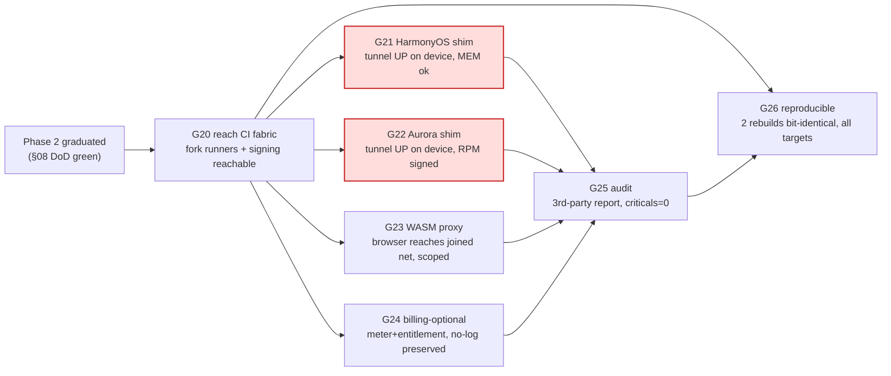
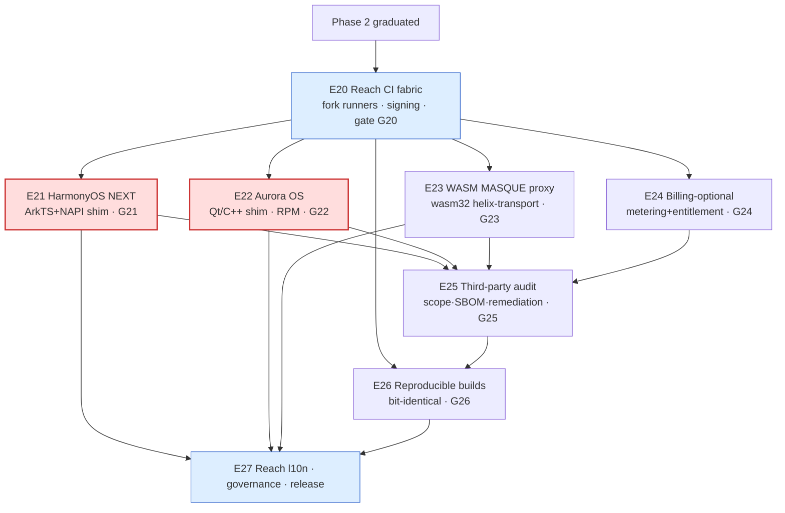
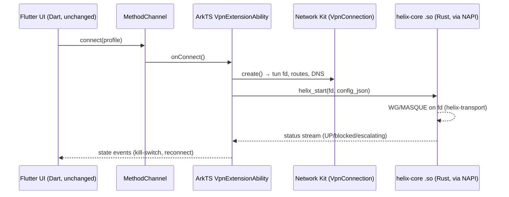
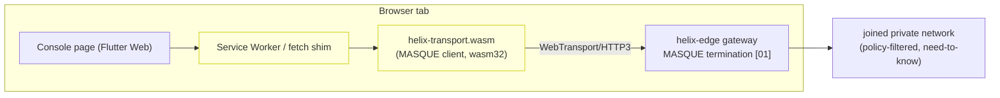
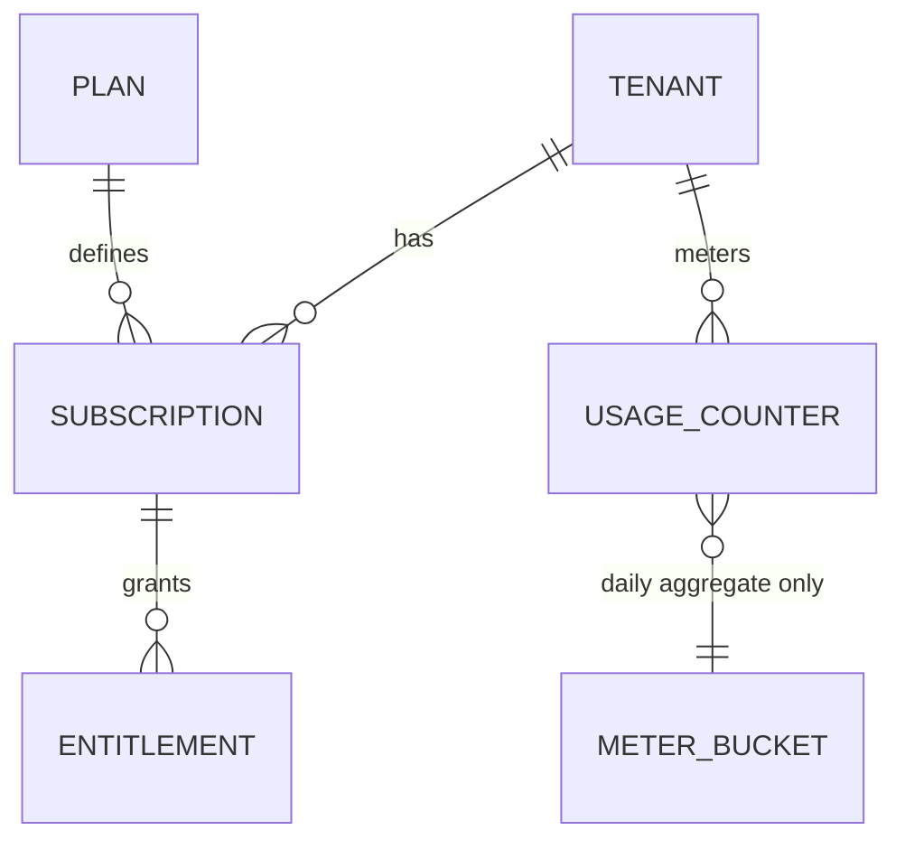

# Phase 3 (Extended Reach) — Work Breakdown: phases → tasks → subtasks

**Revision:** 2
**Last modified:** 2026-07-04T12:00:00Z
**Rev 2 (hardening pass):** Added §0.1 cross-reference to
`v07-execution/subtask-deepening-p3.md` (closes REFINEMENT_NOTES.md R5 for
Phase 3 — this was already substantively addressed by that companion doc; this
revision makes the pointer explicit in the WBS itself rather than leaving it
implicit); added §2.2 phase-gate-failure protocol for the two device-gated
tracks (E21/E22).

> Master technical specification — document 09 of the HelixVPN set. Scope: the
> **complete Work Breakdown Structure (WBS)** for **Phase 3 — Extended Reach &
> Hardening**: the work that Phase 2 explicitly defers [04_P2 §11] —
> **HarmonyOS NEXT** builds, **Aurora OS** builds, the **WASM browser‑scoped
> MASQUE proxy**, **billing‑optional multi‑tenant**, a **third‑party security
> audit**, and **reproducible builds**. Every item carries a stable, append‑only,
> DB‑ready id `HVPN-P3-NNN` (§11.4.54) with the full field set (§11.4.93/.95).
> This is a **SPEC** — it describes *what to build, the interfaces it must
> satisfy, and how "done" is proven with captured evidence* — it does **not**
> build the product (2–3 refinement passes follow).
>
> **Honesty stance (§11.4.6).** Phase 3 contains the project's two highest‑
> uncertainty workstreams: the HarmonyOS NEXT and Aurora OS **native tunnel
> shims**, which are *real native engineering on toolchains we do not yet own
> hardware/CI for* [04_ARCH §5.7, 04_UI §6.1]. This WBS gives **no calendar
> dates**; effort is `engineer‑days` (rough order, wide error bars), every
> hardware‑ or device‑gated acceptance that cannot be proven without the target
> device is marked `UNCONFIRMED:` / `PENDING_DEVICE:` per §11.4.6 with the
> §11.4.3 SKIP‑with‑reason it would carry, never a silent PASS. Gates
> `G20..G26` are the go/no‑go decisions; a gate that cannot be cleared on the
> real device **is the finding** — escalate per §11.4.66/.101/.112, do not
> overrun silently.
>
> Source evidence cited inline by id: **[04_P2]** = `04_VPN_CLD/HelixVPN-Phase2-Parity.md`;
> **[04_ARCH]** = `04_VPN_CLD/HelixVPN-Architecture-Refined.md`; **[04_UI]** =
> `04_VPN_CLD/HelixVPN-helix-ui-Flutter.md`; **[04_P1]** = Phase1‑MVP; **[04_P0]**
> = Phase0‑Spike. Companion specs: **[00]** product scope, **[01]** data plane,
> **[02]** control plane (authoritative DDL/protobuf/deploy — referenced, never
> re‑defined here), **[03]** client core + UI, **[04]** security/privacy/PKI,
> **[05]** repo layout + ecosystem, **[08]** Phase‑2 parity WBS. **[SYNTHESIS]**
> §§1–9. External facts: **[research-masque]** (RFC 9297/9298/9221), **[research-wasm]**
> (wasm32 + WebTransport), LLM analyses [02_QWN] [11_MST] [10_KMI] [07_GMI].

---

## Table of contents

- [0. How to read this WBS (and the DB schema it populates)](#0-how-to-read-this-wbs-and-the-db-schema-it-populates)
- [1. Required‑test‑types vocabulary (§11.4.169)](#1-requiredtesttypes-vocabulary-1114169)
- [2. Phase‑3 entry condition + the go/no‑go gates G20–G26](#2-phase3-entry-condition--the-gonogo-gates-g20g26)
- [2.2 Phase-gate-failure protocol](#22-phase-gate-failure-protocol)
- [3. Workable‑item schema (§11.4.93 DB‑ready)](#3-workableitem-schema-1114193-dbready)
- [4. Epic map + dependency graph](#4-epic-map--dependency-graph)
- [5. E20 — Phase‑3 readiness gate + reach CI fabric](#5-e20--phase3-readiness-gate--reach-ci-fabric)
- [6. E21 — HarmonyOS NEXT build (highest risk)](#6-e21--harmonyos-next-build-highest-risk)
- [7. E22 — Aurora OS build](#7-e22--aurora-os-build)
- [8. E23 — WASM browser‑scoped MASQUE proxy](#8-e23--wasm-browserscoped-masque-proxy)
- [9. E24 — Billing‑optional multi‑tenant](#9-e24--billingoptional-multitenant)
- [10. E25 — Third‑party security audit](#10-e25--thirdparty-security-audit)
- [11. E26 — Reproducible builds](#11-e26--reproducible-builds)
- [12. E27 — Reach localization, governance, release](#12-e27--reach-localization-governance-release)
- [13. Definition‑of‑Done ↔ work‑item traceability](#13-definitionofdone--workitem-traceability)
- [14. Effort roll‑up, critical path & risk register](#14-effort-rollup-critical-path--risk-register)
- [15. Open decisions (D‑P3‑\*) surfaced with recommendations](#15-open-decisions-dp3-surfaced-with-recommendations)
- [Sources](#sources)

---

## 0. How to read this WBS (and the DB schema it populates)

Phase 3 is **additive, not a rewrite** [04_P2 §11]: Phase 2's `Transport` trait,
network‑map protocol, coordinator federation, and the `TunnelPlatform` shim
pattern already accommodate every Phase‑3 surface. The *UI* ports for free across
the new platforms (one Dart tree, §6 [04_UI]); the *tunnel shim* does **not** —
that native‑shim delta is the whole risk and the bulk of the budget.

### 0.1a PR-sized subtask breakdown (closes R5)

Every task `HVPN-P3-NNN` below decomposes one level further into falsifiable,
PR-sized subtasks `HVPN-P3-NNN.k` in the companion
[`v07-execution/subtask-deepening-p3.md`](v07-execution/subtask-deepening-p3.md)
— the third and final part of the R5 closure (`REFINEMENT_NOTES.md`), alongside
`subtask-deepening-p1.md` and `-p2.md`.

### 0.1 Decomposition hierarchy

```
PHASE 3 (Extended Reach)
 ├── ENTRY GATE       Phase-2 graduation (§2.0)         — prerequisite, not in-scope work
 ├── GATES            G20..G26                           — go/no-go questions (§2)
 ├── EPICS            HVPN-P3-Enn                         — a reach workstream (§5..§12)
 │     ├── TASKS      HVPN-P3-NNN                         — a shippable unit (own acceptance + evidence)
 │     │     └── SUBTASKS HVPN-P3-NNN.k                   — smallest tracked PR-sized change
 └── CROSS-CUTTING    E20 (CI fabric) · E27 (l10n/release)
```

Every TASK and SUBTASK is a **workable item** with the same closed field set, so
the rows below load 1:1 into `docs/workable_items.db` (§3). IDs are **monotonic,
never renumbered** (§11.4.54): the numeric block encodes the epic — `E21` →
`210..219`, `E24` → `240..249`; entry/CI gates use `200..209`. New work appends at
the next free number (gaps allowed).

### 0.2 Field dictionary (every item row carries these)

| Field | Meaning |
|---|---|
| `id` | stable `HVPN-P3-NNN[.k]` (§11.4.54) — primary key, never reused |
| `parent` | owning epic (`HVPN-P3-E2n`) or task id; `—` for epic‑level tasks |
| `kind` | `task` \| `subtask` \| `gate` \| `epic` |
| `title` | ≥6‑word self‑contained meaning (§11.4.91) |
| `gate` | which gate(s) this advances: `G20..G26` or `—` |
| `description` | what / how it manifests / acceptance intent (§11.4.148 D2) |
| `depends_on` | upstream ids that MUST be `complete` first; `—` = none |
| `deliverable` | concrete artefact(s): file paths, binaries (.so/.hap/.rpm/.wasm), reports |
| `acceptance` | falsifiable PASS with captured PHYSICAL evidence (§11.4.5/.69/.107); `UNCONFIRMED:`/`PENDING_DEVICE:` where device‑gated (§11.4.6) |
| `est_effort` | engineer‑days, wide error bars — **not** a date commitment |
| `test_types` | the §11.4.169 closed‑set codes required (§1) |

### 0.3 Anti‑bluff floor (§11.4 / §11.4.27 / §11.4.107)

A leaf is `complete` only when its required test types are green **with** an
evidence path recorded in `test_diary` (§11.4.149) and, for any user‑visible
surface, a **window‑scoped MP4** (§11.4.154/.155) vision‑verified per
§11.4.159/.163. For the native platforms (E21/E22) the **runtime signature**
(§11.4.108) is asserted on a **clean install on the real device** — an APK/HAP/RPM
that *builds* is not *done*; the proof is the tunnel up on hardware, captured.
Where no device is reachable, the item is honestly `PENDING_DEVICE:` (§11.4.3
`hardware_not_present`) with a tracked unblock condition (§11.4.148 D3), **never**
a metadata‑only PASS.

### 0.4 §11.4.169 test‑type codes used here

| Code | Type | Phase‑3 instantiation |
|---|---|---|
| `UNIT` | unit | Rust/`#[cfg(test)]`, Dart `test`, Go `_test.go`, ArkTS Jest; mocks **only** here (§11.4.27). |
| `INT` | integration | real System; control plane + edge booted on‑demand via `containers` submodule (§11.4.76); no mocks. |
| `E2E` | end‑to‑end | full enroll → tunnel → reach on the target (device/emulator/browser). |
| `FA` | full‑automation | self‑driving, re‑runnable `-count=3`, no human after start (§11.4.98). |
| `SEC` | security | audit‑scope items, SBOM, leak audits, WASM origin/scope isolation, billing RLS. |
| `MEM` | memory | RSS / heap ceiling on device (HarmonyOS, Aurora, iOS NE budget reuse) — §11.4.107(11). |
| `PERF` | performance | throughput / p99 vs the per‑leg SLO budget [01 §SLO]. |
| `BENCH` | benchmarking | WASM proxy MB/s, native shim CPU‑per‑Gbps on the `bench.sh` rig [04_P0 §8]. |
| `CHAOS` | chaos | interface flap / process kill mid‑transfer / metering‑pipeline SIGKILL (§11.4.85). |
| `STRESS` | stress | sustained + concurrent (≥10 parallel, ≥100 iters or ≥30 s) + boundary inputs (§11.4.85). |
| `UI` | UI | widget + golden tests on the ported flavor (HarmonyOS/Aurora theme). |
| `UX` | UX | enroll→connect→reach walkthrough, window‑scoped MP4 + vision verdict (§11.4.159). |
| `REC` | recorded‑evidence | window‑scoped MP4 (§11.4.154/.155) + media‑validation verdict (§11.4.163). |
| `REPRO` | reproducibility | two independent rebuilds → bit‑identical artefact (E26); **Phase‑3‑specific**. |
| `CHAL` | Challenge / HelixQA | a `challenges`/`helix_qa` bank entry scoring PASS only on captured evidence (§11.4.27/.107). |

`DDOS` becomes **applicable** for the first time in this phase only where billing
exposes a *public* metering/checkout surface (E24); elsewhere it stays
`NOT_APPLICABLE: self-host-single-node` (§11.4.6), re‑armed by the managed SKU.
Each task lists only the **required** subset; absent types are out‑of‑scope by
design, not omission.

---

## 2. Phase‑3 entry condition + the go/no‑go gates G20–G26

### 2.0 Entry condition (prerequisite, not Phase‑3 work)

Phase 3 starts only when **Phase 2 has graduated** [04_P2 §11]: the full transport
set + DAITA + P2P/NAT traversal + multi‑hop + PQ handshake + desktop apps +
HA/multi‑region are shipped and the §08 Phase‑2 DoD is green on a clean baseline
(§11.4.40). Concretely the Phase‑3 work assumes these *already exist*: the
`Transport` trait with MASQUE (`helix-transport`, [03]); the `TunnelPlatform`
shim contract (`helix-core/helix-ffi`, [03 §5]); the multi‑tenant Postgres schema
with FORCE‑RLS and the **no‑durable‑connection‑log** CI lint (`E02`, [02/04]); and
the coordinator `WatchNetworkMap` stream [02]. Phase 3 extends each — it does not
re‑invent any.

### 2.1 The gates



| Gate | Question | Go / no‑go bar | Owning epic |
|---|---|---|---|
| **G20** | Can we *build + sign* for every reach target in CI we control? | OpenHarmony‑SIG fork runner builds a HAP + DevEco‑signs; OMP fork runner builds a signed Aurora RPM; both pinned + isolated so a fork lag never blocks mainline [04_UI §10]. | E20 |
| **G21** | Does the HarmonyOS NEXT tunnel actually carry traffic on a real device, under the memory ceiling? | Enroll → tunnel UP → `curl` reaches an authorized LAN host on a HarmonyOS NEXT device; Network Kit VPN ability active; helix‑core `.so` heap ≥30% headroom under the extension limit (`PENDING_DEVICE:` until hardware) [04_UI §6.1]. | E21 |
| **G22** | Same, on Aurora OS, with a signed RPM. | Enroll → tunnel UP → reach on an Aurora device; Qt/C++ `tun` backend driving helix‑core C ABI; signed RPM installs from the OMP toolchain (`PENDING_DEVICE:`) [04_ARCH §5.7]. | E22 |
| **G23** | Can the in‑browser WASM MASQUE proxy reach a joined network *without* leaking beyond its declared scope? | Console page proxies the browser's own fetch/WebTransport traffic to an authorized host via MASQUE; **no system‑wide tunnel claim**; scope/origin isolation proven; kill on tab‑close [04_ARCH §5.7]. | E23 |
| **G24** | Can we meter + entitle tenants **without** breaking no‑logging? | Per‑tenant aggregate metering + plan/quota enforcement + optional payment adapter; CI schema‑lint still fails on any durable connection/traffic table; billing OFF by default = zero behaviour change. | E24 |
| **G25** | Does an independent third party confirm the security claims? | A scoped external audit (crypto, control plane, shims, WASM) completes; **zero unresolved Critical/High**; report published; remediation loop closed per §11.4.134. | E25 |
| **G26** | Can a user verify the binaries match the source? | Two independent rebuilds of every shipped artefact (Go control plane, Rust edge/core, Flutter apps, .so/.hap/.rpm/.wasm) are **bit‑identical**; a public verification script reproduces them; divergences root‑caused to zero [04_P2 §11]. | E26 |

### 2.2 Phase-gate-failure protocol

Phase 3's failure modes split cleanly along the honesty stance already built
into §0.3/§13 — most gates degrade to an honest non-blocking status rather than
stalling the whole release:

| Failure class | Response | Cross-reference |
|---|---|---|
| G21/G22 (device-gated native shims) cannot be exercised — no hardware/CI access yet | Gate stays `pending_device` (§11.4.3 `hardware_not_present`) — this is **not** a Phase‑3 release blocker for the *other* gates; the release notes state plainly which reach targets are certified vs built-but-pending-device (§13). Reach targets ship independently as their gates clear. | §13 honest-gap rule; risk register R‑P3‑1/R‑P3‑2 |
| G25 (third-party audit) stalls on unfunded engagement | Status `Operator-blocked` with the §11.4.21 unblock detail (fund the engagement); does not block G20/G23/G24/G26 which are self-provisionable. | HVPN-P3-252; §11.4.101 |
| G25 finds unresolved Critical/High findings past the remediation loop | Release-blocking for the *audited surfaces* specifically — a surface with an open Critical/High does not ship even if its own functional gate (G21/G22/G23) is green; iterate §11.4.134 to zero findings before that surface's release. | HVPN-P3-253; §11.4.134 |
| G26 (reproducible builds) — a fork toolchain (OHOS/Aurora) is not yet deterministic | `PENDING_TOOLCHAIN:` keeps that one artefact's row open honestly; does not block the rest of the artefact matrix from certifying bit-identical. | HVPN-P3-262 |
| A **huge-blocker** surfaces during Phase‑3 validation (e.g. a regression in a Phase‑1/2 seam Phase‑3 depends on) | Execute §11.4.129 in full — this is the one case where Phase 3's per-gate independence does NOT apply, because the regression is in shared infrastructure every gate depends on. | §11.4.129 |

The distinguishing rule vs Phases 1–2: because Phase‑3's gates are largely
**independent reach targets** (a HarmonyOS delay does not block the WASM proxy
or reproducible-builds work), a single gate's honest non-pass is *not* by
default a whole-phase blocker — only a cross-cutting regression (shared
seam, or an audit finding blocking multiple surfaces) escalates to a
phase-wide stop.

---

## 3. Workable‑item schema (§11.4.93 DB‑ready)

The Phase‑3 rows extend the same canonical `items` table as Phase 0/1 [06 §0.3,
07 §3] — no schema change, only new rows + the Phase‑3 gate rows. The DDL the
rows must satisfy (Phase‑3 subset shown; `gates` table reused with two new
`outcome` values for device‑gated results):

```sql
-- docs/workable_items.db  (git-tracked, §11.4.95). Phase-3 rows append into the
-- canonical items table defined in [06 §0.3]; repeated here for self-containment.
CREATE TABLE IF NOT EXISTS items (
    id            TEXT PRIMARY KEY,                       -- 'HVPN-P3-210'
    parent        TEXT REFERENCES items(id),              -- epic/task ownership
    kind          TEXT NOT NULL CHECK (kind IN ('task','subtask','gate','epic')),
    type          TEXT NOT NULL CHECK (type IN ('Bug','Feature','Task')) DEFAULT 'Feature',
    status        TEXT NOT NULL DEFAULT 'Queued',         -- §11.4.15 closed set (+Operator-blocked §11.4.21)
    severity      TEXT NOT NULL DEFAULT 'Normal',
    title         TEXT NOT NULL CHECK (length(title) >= 40),
    gate          TEXT,                                   -- 'G20'..'G26' or NULL
    description   TEXT NOT NULL CHECK (length(description) >= 40),
    depends_on    TEXT NOT NULL DEFAULT '[]',             -- JSON array of ids
    deliverable   TEXT NOT NULL,
    acceptance    TEXT NOT NULL,
    est_effort_d  REAL NOT NULL DEFAULT 1.0,
    test_types    TEXT NOT NULL DEFAULT '[]',             -- JSON array of §11.4.169 codes
    created_at    TEXT NOT NULL,
    modified_at   TEXT NOT NULL
);
CREATE TABLE IF NOT EXISTS gates (
    id            TEXT PRIMARY KEY,                       -- 'G20'..'G26'
    question      TEXT NOT NULL,
    go_no_go_bar  TEXT NOT NULL,
    owning_epic   TEXT NOT NULL,
    outcome       TEXT NOT NULL DEFAULT 'pending'
                  CHECK (outcome IN ('pending','pass','fail','pending_device','operator_blocked')),
    evidence_path TEXT                                    -- §11.4.5 captured evidence
);
```

Representative seed (one task row — the rest follow identically; the `INSERT`
generator is `deploy/wbs/seed_p3.sql`, idempotent, upserts by `id`):

```sql
INSERT INTO items (id,parent,kind,type,status,severity,title,gate,description,
                   depends_on,deliverable,acceptance,est_effort_d,test_types,
                   created_at,modified_at)
VALUES (
 'HVPN-P3-211','HVPN-P3-E21','task','Feature','Queued','Critical',
 'HarmonyOS Network Kit VPN extension ability + lifecycle wiring',
 'G21',
 'ArkTS VpnExtensionAbility that opens the Network Kit tunnel fd, hands it to the '
 || 'helix-core .so over NAPI, and drives connect/disconnect/kill-switch from the '
 || 'core status stream; proven by tunnel UP carrying traffic on a real device.',
 '["HVPN-P3-210","HVPN-P3-201"]',
 'shims/harmonyos/entry/src/.../HelixVpnAbility.ets + napi bridge',
 'PENDING_DEVICE: on a HarmonyOS NEXT device, enroll->UP->curl reaches authorized '
 || 'LAN host; window-scoped MP4 + DevEco profiler heap capture; §11.4.3 SKIP '
 || 'hardware_not_present until a device/CI runner is provisioned (G20).',
 8.0,'["UNIT","INT","E2E","MEM","UX","REC","CHAL"]',
 '2026-06-25T00:00:00Z','2026-06-25T00:00:00Z'
);
```

The docs↔DB round‑trip is mechanized by `docs_chain` (§11.4.106); `workable-items
validate` runs in the local pre‑build sweep (§11.4.93). No active CI (§11.4.156) —
the fork "runners" of E20 are **local/self‑hosted** build hosts, never a
`.github/workflows/*.yml`.

---

## 4. Epic map + dependency graph



**Critical path (risk‑ordered §11.4.132):** `E20 → {E21 ∥ E22} → E25 → E26 → E27`.
The two native shims (E21, E22, red) are the make‑or‑break carries and run as
**disjoint‑scope parallel PWUs** (§11.4.58) the moment E20's fork runners exist.
E23 (WASM) and E24 (billing) fan out independently off E20 with no device risk.
E25 (audit) is a **convergence gate**: it cannot start until the surfaces it
audits (E21–E24) are feature‑complete; E26 (reproducible builds) depends on E25
because the audited source tree is what must reproduce. Per §11.4.103, ≥3
background streams stay busy: while E21/E22 await device access (`PENDING_DEVICE`),
E23/E24/E26‑tooling progress on host‑only work.

---

## 5. E20 — Phase‑3 readiness gate + reach CI fabric

**HVPN-P3-E20 — Reach build & signing fabric (local/self‑hosted, no active CI §11.4.156)** `epic · module: deploy,ci`
Gate **G20**. The OpenHarmony‑SIG and OMP Aurora Flutter forks lag mainline and
need isolated, pinned, signing‑capable build hosts so a fork bump never blocks
the mainline release [04_UI §10.*]. Per §11.4.156 these are **self‑hosted Podman
build pods**, not GitHub/GitLab pipelines.

- **HVPN-P3-200 — Pin the OpenHarmony‑SIG Flutter fork + DevEco toolchain in a reproducible pod.** `M(5) · deps: — · gate: G20 · tests: UNIT,FA,REPRO`
  - Desc: A `containers`‑submodule (§11.4.76) Podman quadlet builds a HarmonyOS HAP from the `gitee.com/openharmony-sig/flutter_flutter` `ohos` channel at a pinned SHA; DevEco command‑line tools + signing material mounted as secrets (§11.4.10). Deliverable: `deploy/reach/harmonyos.container` + `docs/reach/harmonyos_toolchain.md`. Acceptance: `podman build` produces a HAP from the sample app; toolchain SHA recorded; secrets never in the image layer (`SEC` leak audit green). Tests: `REPRO` (same SHA → same toolchain digest).
  ```ini
  # deploy/reach/harmonyos.container  (Podman quadlet — §11.4.76/.161 rootless)
  [Unit]
  Description=HelixVPN HarmonyOS HAP builder (OpenHarmony-SIG Flutter fork, pinned)
  [Container]
  Image=localhost/helix/harmonyos-builder:ohos-3.22.0-pinned
  # never the rootful Docker daemon; rootless Podman only (§11.4.161)
  Volume=%h/.helix/secrets/deveco:/secrets/deveco:ro,Z
  Volume=%h/Projects/helix_vpn:/src:ro,Z
  Environment=OHOS_FLUTTER_REV=<pinned-sha> DEVECO_SIGN_PROFILE=/secrets/deveco/helix.p7b
  ReadOnly=true
  NoNewPrivileges=true
  [Service]
  # one-shot build; exits non-zero on signing failure (no fake-pass §11.4)
  Type=oneshot
  ```
- **HVPN-P3-201 — Pin the OMP Aurora `flutter-aurora` fork + RPM signing pod.** `M(5) · deps: — · gate: G20 · tests: UNIT,FA,REPRO,SEC`
  - Desc: Equivalent quadlet for the `gitlab.com/omprussia/flutter` fork producing a **signed Aurora RPM**; Aurora SDK + signing keys mounted read‑only. Russian‑hosted toolchain → isolated network egress policy, mirror‑pinned (§11.4.77 regen mechanism for the SDK tarball). Deliverable: `deploy/reach/aurora.container` + `docs/reach/aurora_toolchain.md`. Acceptance: signed RPM of the sample app builds; `rpm -K` verifies the signature; SDK tarball SHA‑256 matches the recorded manifest. Tests: `SEC` (egress allow‑list), `REPRO`.
- **HVPN-P3-202 — Reach release‑artifact registry + provenance manifest.** `S(3) · deps: HVPN-P3-200,HVPN-P3-201 · gate: G20,G26 · tests: UNIT,FA`
  - Desc: A signed manifest (`reach_artifacts.json`) recording every produced HAP/RPM/.wasm with its source SHA, toolchain digest, and SBOM pointer (feeds E26). Deliverable: `deploy/reach/manifest.go`. Acceptance: manifest entry generated per build, schema‑validated, links resolve.
- **HVPN-P3-203 — G20 readiness certification.** `XS(1) · deps: HVPN-P3-202 · gate: G20 · tests: FA,CHAL`
  - Desc: One‑shot `make reach-ci-gate` that builds + signs both fork artefacts and emits the G20 verdict + evidence paths. Acceptance: HAP and signed RPM both produced from a clean checkout in two consecutive `-count=2` runs; gate row `outcome=pass`.

---

## 6. E21 — HarmonyOS NEXT build (highest risk)

**HVPN-P3-E21 — HarmonyOS NEXT app + Network Kit VPN shim** `epic · module: shims/harmonyos`
Gate **G21**. HarmonyOS NEXT dropped Android/ART compatibility — native ArkTS/
ArkUI + DevEco only — so the only single‑codebase path is the OpenHarmony‑SIG
Flutter fork (HAP) with the VPN extension written in **ArkTS** bridging via
**NAPI** to the Rust `helix-core` `.so` [04_ARCH §5.7, 04_UI §6.1]. The UI ports
for free; the **tunnel ability is real native work** — this is the project's
single biggest platform risk; treat every device‑gated acceptance as
`PENDING_DEVICE` until hardware/CI exists (G20).



- **HVPN-P3-210 — `helix-core` cross‑compile to OpenHarmony (`aarch64‑unknown‑linux‑ohos`) + NAPI surface.** `L(8) · deps: HVPN-P3-200 · gate: G21 · tests: UNIT,INT,MEM,BENCH`
  - Desc: Build `helix-ffi` for the OHOS target; expose a NAPI module (`libhelix_ohos.so`) wrapping the existing UniFFI/FFI surface [03 §5]. Deliverable: `shims/harmonyos/native/` + `cargo` target config. Acceptance: `.so` loads in an ArkTS test harness; `helix_version()` round‑trips; RSS ceiling sampled (`PENDING_DEVICE` on hardware). Tests: `MEM` (heap headroom), `BENCH` (throughput on emulator).
  ```rust
  // shims/harmonyos/native/src/lib.rs — NAPI surface over the SAME helix-core API.
  // No HarmonyOS specifics leak into helix-core (§11.4.28 decoupling): this crate
  // is the ONLY OHOS-aware code; it re-exports the platform-neutral core.
  use napi_ohos::{bindgen_prelude::*, Env, JsObject};
  use helix_ffi::{Core, CoreConfig, Status};   // reused, unchanged

  #[napi]
  pub fn helix_start(tun_fd: i32, config_json: String) -> Result<u32> {
      let cfg: CoreConfig = serde_json::from_str(&config_json)
          .map_err(|e| Error::from_reason(e.to_string()))?;
      // tun_fd is owned by Network Kit; core writes/reads packets, never closes it.
      let handle = Core::start_on_fd(tun_fd, cfg)
          .map_err(|e| Error::from_reason(e.to_string()))?;
      Ok(handle.id())            // opaque handle; ArkTS keeps it for stop()
  }

  #[napi]
  pub fn helix_stop(handle: u32) -> Result<()> {
      Core::stop(handle).map_err(|e| Error::from_reason(e.to_string()))
  }

  // Status pushed to ArkTS via a threadsafe function (kill-switch, escalation).
  #[napi(ts_args_type = "callback: (status: string) => void")]
  pub fn helix_subscribe(handle: u32, callback: JsFunction) -> Result<()> {
      let tsfn: ThreadsafeFunction<String, ErrorStrategy::Fatal> =
          callback.create_threadsafe_function(0, |ctx| Ok(vec![ctx.value]))?;
      Core::on_status(handle, move |s: Status| {
          tsfn.call(serde_json::to_string(&s).unwrap(), ThreadsafeFunctionCallMode::NonBlocking);
      });
      Ok(())
  }
  ```
- **HVPN-P3-211 — Network Kit `VpnExtensionAbility` + lifecycle + kill‑switch.** `L(8) · deps: HVPN-P3-210,HVPN-P3-201 · gate: G21 · tests: UNIT,INT,E2E,MEM,UX,REC,CHAL`
  - Desc: The ArkTS ability that requests VPN consent, creates the `VpnConnection` (tun fd, routes, DNS), hands the fd to the core, and drives connect/disconnect/kill‑switch/auto‑escalate from the core status stream. Deliverable: `shims/harmonyos/entry/src/main/ets/HelixVpnAbility.ets`. Acceptance (`PENDING_DEVICE`): enroll → UP → `curl` reaches authorized LAN host on a HarmonyOS NEXT device; tunnel‑drop blanks plaintext (kill‑switch) per §04; window‑scoped MP4 + DevEco heap capture; §11.4.3 SKIP `hardware_not_present` until G20 provisions a device.
  ```typescript
  // shims/harmonyos/entry/src/main/ets/HelixVpnAbility.ets  (ArkTS)
  import { vpnExtension } from '@kit.NetworkKit';
  import helix from 'libhelix_ohos.so';   // the NAPI module (HVPN-P3-210)

  export default class HelixVpnAbility extends vpnExtension.VpnExtensionAbility {
    private handle: number = 0;
    onConnect(profile: HelixProfile): void {
      const conn = vpnExtension.createVpnConnection(this.context);
      const fd = conn.create({                 // tun fd from Network Kit
        addresses: profile.overlayAddrs,       // ULA /48 + 4via6 (D4, [02])
        routes: profile.allowedRoutes,         // policy-filtered need-to-know
        dnsAddresses: profile.dns,
        mtu: 1280                              // MASQUE-safe floor [research-masque]
      });
      this.handle = helix.helix_start(fd, JSON.stringify(profile.coreConfig));
      helix.helix_subscribe(this.handle, (s: string) => this.onCoreStatus(JSON.parse(s)));
    }
    onDisconnect(): void { if (this.handle) helix.helix_stop(this.handle); }
    private onCoreStatus(s: HelixStatus): void {
      // kill-switch: if s.state === 'down' && killSwitch, drop the default route
      // auto-escalate: core already moved WG→MASQUE; surface 'escalating' to UI
      this.context.eventHub.emit('helix.status', s);
    }
  }
  ```
- **HVPN-P3-212 — Flutter HAP build of the Access + Connector flavors (OHOS channel).** `M(5) · deps: HVPN-P3-211 · gate: G21 · tests: UI,UX,REC`
  - Desc: Produce signed HAPs of the two tunnel flavors via `runHelixApp(flavor,...)` [04_UI §2] on the SIG fork; Dart UI unchanged; ArkTS↔Dart MethodChannel wired. Deliverable: `helix-access.hap`, `helix-connector.hap`. Acceptance: app installs + drives the shim; golden UI tests pass on the OHOS theme; UX walkthrough MP4 vision‑verified (`PENDING_DEVICE`).
- **HVPN-P3-213 — DevEco signing + market metadata + l10n (zh‑Hans first‑tier).** `S(3) · deps: HVPN-P3-212 · gate: G21 · tests: FA,UI`
  - Desc: DevEco signing profile, AppGallery metadata, Simplified Chinese as a first‑tier locale (`helix_l10n`, [04_UI §8]). Deliverable: signing config + `intl_zh.arb`. Acceptance: signed HAP verifies; zh‑Hans strings render with no overflow (UI golden).
- **HVPN-P3-214 — G21 device certification + honest gap doc.** `M(4) · deps: HVPN-P3-211,HVPN-P3-212 · gate: G21 · tests: E2E,FA,CHAL,REC`
  - Desc: The `challenges`/`helix_qa` bank entry that drives enroll→UP→reach→kill‑switch on the device and scores PASS only on captured evidence (§11.4.27/.107). Acceptance: gate row `outcome=pass` with device evidence, **or** `outcome=pending_device` with the §11.4.148 D3 unblock condition (provision a HarmonyOS NEXT device + add it to the §11.4.128 tracked‑device set) — never a faked pass.

---

## 7. E22 — Aurora OS build

**HVPN-P3-E22 — Aurora OS app + Qt/C++ `tun` shim** `epic · module: shims/aurora`
Gate **G22**. Aurora is Qt/QML‑native; the path is the OMP Russia Flutter fork
(`flutter-aurora` → signed RPM) with the tunnel backend in **Qt/C++** linking
`helix-core` as a C library [04_ARCH §5.7, 04_UI §6.1]. Treat as an
**enterprise/government SKU** with its own runners + signing; Russian‑hosted
toolchain (GitLab omprussia / Mos.Hub).

- **HVPN-P3-220 — `helix-core` C ABI for Aurora (`aarch64`/`armv7hl` Sailfish target) + cbindgen header.** `L(7) · deps: HVPN-P3-201 · gate: G22 · tests: UNIT,INT,MEM,BENCH`
  - Desc: Build `helix-ffi` for the Aurora target; emit a stable C header via `cbindgen` so the Qt/C++ backend links it. The SAME core, no Aurora specifics inside it (§11.4.28). Deliverable: `shims/aurora/native/libhelix.a` + `helix.h`. Acceptance: header compiles in a Qt test; `helix_version()` round‑trips; RSS sampled (`PENDING_DEVICE`).
  ```c
  /* shims/aurora/native/helix.h — generated by cbindgen; consumed by Qt/C++.
     Platform-neutral: identical surface to the OHOS NAPI module, different ABI. */
  typedef uint32_t HelixHandle;
  typedef void (*HelixStatusCb)(const char *status_json, void *user);

  HelixHandle helix_start(int tun_fd, const char *config_json);   /* 0 = error */
  void        helix_stop(HelixHandle h);
  void        helix_subscribe(HelixHandle h, HelixStatusCb cb, void *user);
  const char *helix_last_error(void);                             /* thread-local */
  ```
  ```cpp
  // shims/aurora/src/HelixTunnelBackend.cpp — Qt/C++ owns the tun fd + routes;
  // helix-core drives packets. This .cpp is the ONLY Aurora-aware tunnel code.
  void HelixTunnelBackend::connect(const HelixProfile &p) {
      int fd = openTun(p.overlayAddrs, p.allowedRoutes, p.dns, /*mtu=*/1280);
      m_handle = helix_start(fd, p.coreConfigJson().toUtf8().constData());
      if (!m_handle) { emit error(QString::fromUtf8(helix_last_error())); return; }
      helix_subscribe(m_handle, &HelixTunnelBackend::onStatusC, this);
  }
  void HelixTunnelBackend::onStatusC(const char *json, void *self) {
      // marshal onto the Qt event loop; drive kill-switch + UI state
      QMetaObject::invokeMethod(static_cast<HelixTunnelBackend*>(self),
          "onStatus", Qt::QueuedConnection, Q_ARG(QString, QString::fromUtf8(json)));
  }
  ```
- **HVPN-P3-221 — Qt/C++ `tun` lifecycle + Friflex Flutter plugin bridge + kill‑switch.** `L(8) · deps: HVPN-P3-220 · gate: G22 · tests: UNIT,INT,E2E,MEM,UX,REC,CHAL`
  - Desc: Open/route/DNS the Sailfish `tun`, bridge connect/disconnect/status to Flutter via a Friflex‑style plugin, drive kill‑switch + auto‑escalate from the core stream. Deliverable: `shims/aurora/src/` + `aurora/plugins/helix_core_aurora/`. Acceptance (`PENDING_DEVICE`): enroll → UP → reach on an Aurora device; kill‑switch blanks plaintext; MP4 + RSS capture; §11.4.3 SKIP until a device exists.
- **HVPN-P3-222 — Flutter signed‑RPM build (Access + Connector) on the OMP fork.** `M(5) · deps: HVPN-P3-221 · gate: G22 · tests: UI,UX,REC,SEC`
  - Desc: Produce signed Aurora RPMs of the two flavors; Russian (`ru`) first‑tier l10n (Aurora market) [04_UI §8]. Deliverable: `helix-access.rpm`, `helix-connector.rpm`. Acceptance: `rpm -K` verifies; `ru` strings render with no overflow; install on the Aurora emulator (`PENDING_DEVICE` for hardware reach).
- **HVPN-P3-223 — G22 device certification + enterprise‑SKU operational doc.** `M(4) · deps: HVPN-P3-221,HVPN-P3-222 · gate: G22 · tests: E2E,FA,CHAL,REC`
  - Desc: Bank entry driving enroll→UP→reach→kill‑switch on Aurora; plus an ops doc covering the isolated runner + Mos.Hub signing (§11.4.10 secrets). Acceptance: gate `outcome=pass` with device evidence, **or** honest `pending_device` with unblock condition; the toolchain‑provenance risk recorded `UNCONFIRMED:` until an Aurora device is in hand (§11.4.6).

---

## 8. E23 — WASM browser‑scoped MASQUE proxy

**HVPN-P3-E23 — In‑browser WASM MASQUE proxy (Console)** `epic · module: helix-transport,helix-ui`
Gate **G23**. Browsers cannot open a TUN device, so the web build is the **Console
(management) + an *optional* in‑page WASM MASQUE client** that proxies *the
browser's own* traffic to a joined network — **not** a system‑wide tunnel; this
must be stated plainly to users [04_ARCH §5.7, 04_UI §8.3]. The reuse pillar pays
off: `helix-transport` (Rust) already speaks MASQUE; compiling it to `wasm32` over
the browser's WebTransport/HTTP‑3 yields the proxy with no protocol rewrite
[research-masque, research-wasm].



- **HVPN-P3-230 — `helix-transport` `wasm32-unknown-unknown` build + WebTransport binding.** `L(8) · deps: HVPN-P3-202 · gate: G23 · tests: UNIT,INT,BENCH`
  - Desc: Feature‑gate `helix-transport` so the MASQUE/QUIC client compiles to WASM, binding the browser **WebTransport** API for the H3/datagram path (no raw UDP in a browser) [research-wasm]. Deliverable: `helix-core/crates/helix-transport/src/wasm.rs` + `pkg/helix_transport.wasm`. Acceptance: `.wasm` loads in a headless Chromium; a MASQUE `CONNECT‑UDP` session establishes to a test edge; throughput benched (`BENCH`).
  ```rust
  // helix-core/crates/helix-transport/src/wasm.rs
  // The SAME MASQUE state machine; only the I/O leaf differs (WebTransport vs UDP).
  #[cfg(target_arch = "wasm32")]
  use wasm_bindgen::prelude::*;
  #[cfg(target_arch = "wasm32")]
  use web_sys::{WebTransport, WebTransportBidirectionalStream};

  #[wasm_bindgen]
  pub struct WasmMasqueProxy { inner: MasqueSession }   // MasqueSession is shared, unchanged

  #[wasm_bindgen]
  impl WasmMasqueProxy {
      /// `gateway_url` = https://gw.example/.well-known/masque/udp/{target_host}/{port}/
      /// (RFC 9298 connect-udp template) [research-masque].
      #[wasm_bindgen(constructor)]
      pub async fn connect(gateway_url: String, auth_token: String) -> Result<WasmMasqueProxy, JsValue> {
          let wt = WebTransport::new(&gateway_url)?;            // H3 transport
          JsFuture::from(wt.ready()).await?;
          let inner = MasqueSession::over_webtransport(wt, auth_token).await
              .map_err(|e| JsValue::from_str(&e.to_string()))?;
          Ok(Self { inner })
      }
      /// Proxy a single browser fetch to the joined network through MASQUE.
      pub async fn proxy_fetch(&self, req: web_sys::Request) -> Result<web_sys::Response, JsValue> {
          self.inner.proxy_http(req).await.map_err(|e| JsValue::from_str(&e.to_string()))
      }
  }
  ```
- **HVPN-P3-231 — Service‑worker / fetch‑shim integration + scope isolation.** `M(6) · deps: HVPN-P3-230 · gate: G23 · tests: UNIT,INT,E2E,SEC`
  - Desc: Wire the WASM proxy behind a service worker so *only* explicitly‑proxied origins route through MASQUE; everything else uses normal browser networking. Hard scope boundary: the proxy reaches **only** policy‑authorized hosts (need‑to‑know, server‑side enforced) and dies on tab/worker close. Deliverable: `helix-ui/web/helix_proxy_sw.js` + Dart bridge. Acceptance (`SEC`): a non‑authorized host is unreachable; a non‑proxied origin never touches the gateway; tab‑close terminates the session (no lingering tunnel) — all captured.
- **HVPN-P3-232 — Console UX: explicit "browser‑scoped proxy, not a system VPN" affordance.** `S(3) · deps: HVPN-P3-231 · gate: G23 · tests: UI,UX,REC`
  - Desc: A `ShieldIndicator` variant + copy that states the limitation plainly (never imply a system‑wide tunnel); toggle per joined network; live reachability indicator. Deliverable: Flutter Web widgets. Acceptance: golden tests; UX MP4 vision‑verified that the scope wording is present and unambiguous (§11.4.159) — guards against an over‑claim bluff.
- **HVPN-P3-233 — G23 certification + threat note (WASM origin model).** `S(3) · deps: HVPN-P3-231,HVPN-P3-232 · gate: G23 · tests: E2E,SEC,CHAL`
  - Desc: Bank entry: browser reaches an authorized host via the proxy, is denied an unauthorized one, leaks nothing beyond scope; plus a short threat note (origin isolation, token handling in the page, no private‑key‑in‑browser — auth is a short‑lived token, never a WG private key [04 §PKI]). Acceptance: gate `outcome=pass` with captured evidence; the "no key in browser" invariant proven by a SEC assertion.

---

## 9. E24 — Billing‑optional multi‑tenant

**HVPN-P3-E24 — Billing‑optional multi‑tenant + metering** `epic · module: helix-go/billing`
Gate **G24**. The decisive constraint: **billing must not break no‑logging**
[04_ARCH §7, 04 §privacy]. Metering is **aggregate counters only** (bytes per
device per day bucket), never per‑connection/per‑flow records; the CI schema‑lint
that fails the build on any durable connection/traffic table (`E02`, [02/04])
**stays in force and must also reject any billing table that smells like a
traffic log**. Billing is **OFF by default** (self‑host = no billing); turning it
ON is purely additive (entitlement + an optional payment adapter), changing zero
tunnel behaviour.



- **HVPN-P3-240 — Billing schema: plans, subscriptions, entitlements, aggregate meters (RLS + no‑log lint).** `L(7) · deps: — · gate: G24 · tests: UNIT,INT,SEC`
  - Desc: New Postgres tables under FORCE‑RLS, tenant‑scoped, with a **hard invariant**: usage is a daily aggregate bucket keyed by tenant/device/date — no timestamps finer than a day, no peer/host/port columns, no flow rows. Extend the no‑log CI lint (§04) to also fail on a billing column matching the forbidden traffic‑log shape. Deliverable: `helix-go/store/migrations/03x_billing.sql` + lint rule. Acceptance (`SEC`): cross‑tenant read denied (RLS); the lint **fails** a planted `usage_flows(src,dst,port,ts)` table (paired §1.1 mutation), **passes** the aggregate schema.
  ```sql
  -- helix-go/store/migrations/030_billing.sql  (FORCE RLS; aggregate-only; no traffic log)
  CREATE TABLE plan (
    id           uuid PRIMARY KEY DEFAULT gen_random_uuid(),
    code         text NOT NULL UNIQUE,                 -- 'free','team','enterprise'
    max_devices  int  NOT NULL,
    max_networks int  NOT NULL,
    max_bytes_mo bigint,                               -- NULL = unlimited
    meta         jsonb NOT NULL DEFAULT '{}'
  );
  CREATE TABLE subscription (
    id         uuid PRIMARY KEY DEFAULT gen_random_uuid(),
    tenant_id  uuid NOT NULL REFERENCES tenant(id),
    plan_id    uuid NOT NULL REFERENCES plan(id),
    status     text NOT NULL DEFAULT 'active'
               CHECK (status IN ('active','past_due','canceled')),
    started_on date NOT NULL DEFAULT current_date,
    ext_ref    text                                    -- opaque payment-provider id (E24)
  );
  -- USAGE: aggregate ONLY. Day-granular. NO src/dst/host/port/flow columns — by design.
  -- The no-log CI lint (§04) treats any column in (src,dst,peer,host,port,flow,conn,ts<day)
  -- on a usage table as a BUILD FAILURE.
  CREATE TABLE usage_counter (
    tenant_id  uuid NOT NULL REFERENCES tenant(id),
    device_id  uuid NOT NULL REFERENCES device(id),
    day        date NOT NULL,                          -- coarsest granularity, intentional
    rx_bytes   bigint NOT NULL DEFAULT 0,
    tx_bytes   bigint NOT NULL DEFAULT 0,
    PRIMARY KEY (tenant_id, device_id, day)
  );
  ALTER TABLE plan          ENABLE ROW LEVEL SECURITY;  -- plan is global-read, admin-write
  ALTER TABLE subscription  ENABLE ROW LEVEL SECURITY;
  ALTER TABLE subscription  FORCE  ROW LEVEL SECURITY;
  ALTER TABLE usage_counter ENABLE ROW LEVEL SECURITY;
  ALTER TABLE usage_counter FORCE  ROW LEVEL SECURITY;
  CREATE POLICY sub_isolation   ON subscription  USING (tenant_id = current_tenant());
  CREATE POLICY usage_isolation ON usage_counter USING (tenant_id = current_tenant());
  ```
- **HVPN-P3-241 — Aggregate metering pipeline (edge counters → daily upsert).** `M(6) · deps: HVPN-P3-240 · gate: G24 · tests: UNIT,INT,CHAOS,STRESS`
  - Desc: The edge already exposes aggregate rx/tx counters (no flow detail) [01]; a metering consumer folds them into `usage_counter` daily upserts over the event bus. **Crash‑safe**: a SIGKILL mid‑fold must not double‑count nor lose a bucket (idempotent upsert keyed by tenant/device/day). Deliverable: `helix-go/billing/meter.go`. Acceptance: `CHAOS` (kill mid‑fold → exactly‑once bucket); `STRESS` (10k devices, bounded memory).
- **HVPN-P3-242 — Entitlement enforcement in the coordinator (quota → policy/admission).** `M(6) · deps: HVPN-P3-240 · gate: G24 · tests: UNIT,INT,SEC,PERF`
  - Desc: Plan limits (max devices/networks/bytes) become admission checks at enroll + coordinator map build — over‑quota = deny with a clear reason, never a silent drop; **fail‑open vs fail‑closed is an explicit decision (D‑P3‑2)**. Deliverable: `helix-go/billing/entitlement.go` + a `Entitlement` protobuf message. Acceptance: an over‑device‑quota enroll is denied with reason; bytes‑quota breach degrades per the chosen policy; `PERF` shows the check adds <1 ms to map build.
  ```proto
  // helix-proto/billing/v1/entitlement.proto — entitlement, NOT traffic data.
  syntax = "proto3";
  package helix.billing.v1;
  message Entitlement {
    string tenant_id   = 1;
    int32  max_devices = 2;
    int32  max_networks= 3;
    int64  max_bytes_mo= 4;   // 0 = unlimited
    bool   billing_on  = 5;   // false on self-host: enforcement is a no-op
    Quota  used        = 6;   // aggregate snapshot only
  }
  message Quota { int32 devices = 1; int32 networks = 2; int64 bytes_mo = 3; }
  ```
- **HVPN-P3-243 — Optional payment‑provider adapter (interface + one reference impl) behind a feature flag.** `M(5) · deps: HVPN-P3-241 · gate: G24 · tests: UNIT,INT,SEC,DDOS`
  - Desc: A narrow `PaymentProvider` Go interface (create‑customer, attach‑subscription, webhook→subscription‑status) with **one** reference adapter; provider choice is **D‑P3‑3** (recommend a self‑hostable/open option first, a hosted provider as a pluggable alternative — never hardcode one). Webhook endpoint is the first **public** surface → `DDOS` becomes applicable (rate‑limit + signature‑verify). Deliverable: `helix-go/billing/provider/`. Acceptance: webhook signature verified; replay rejected; rate‑limit holds under flood (`DDOS`); billing‑OFF path never calls the adapter.
  ```go
  // helix-go/billing/provider/provider.go — decoupled; no provider name in core (§11.4.28).
  type PaymentProvider interface {
      EnsureCustomer(ctx context.Context, tenantID string) (extRef string, err error)
      AttachSubscription(ctx context.Context, extRef, planCode string) error
      // VerifyWebhook authenticates a provider callback and maps it to a status change.
      VerifyWebhook(ctx context.Context, hdr http.Header, body []byte) (SubscriptionEvent, error)
  }
  type SubscriptionEvent struct {
      TenantRef string
      Status    string // 'active' | 'past_due' | 'canceled'
  }
  ```
- **HVPN-P3-244 — G24 certification: billing ON works, billing OFF is a perfect no‑op, no‑log preserved.** `S(3) · deps: HVPN-P3-242,HVPN-P3-243 · gate: G24 · tests: E2E,SEC,FA,CHAL`
  - Desc: Bank entry proving (a) with billing ON, metering + quota + payment status flow end‑to‑end; (b) with billing OFF (default), behaviour is byte‑identical to pre‑E24 (a §11.4.108 runtime‑signature diff); (c) the no‑log lint still green and the planted traffic‑log table still fails it. Acceptance: gate `outcome=pass`; the no‑op proof is captured (regression‑guard §11.4.135).

---

## 10. E25 — Third‑party security audit

**HVPN-P3-E25 — Independent third‑party security audit** `epic · module: security`
Gate **G25**. A privacy product's claims are worth what an outsider confirms; a
self‑audit is not an audit. This epic prepares the surface, engages an independent
firm, and runs the remediation loop to a published, zero‑Critical/High report
[04_P2 §11]. Uses the `security` submodule (§7) for SAST/SBOM tooling but the
**verdict is the external party's**, captured.

- **HVPN-P3-250 — Audit scope, threat model, and asset inventory.** `M(5) · deps: HVPN-P3-214,HVPN-P3-223,HVPN-P3-233,HVPN-P3-244 · gate: G25 · tests: SEC`
  - Desc: A scoped threat model covering crypto core (WG/MASQUE/PQ PSK), control plane (RLS, enroll, revoke, policy compiler), the four reach surfaces (HarmonyOS/Aurora shims, WASM proxy, billing), and the no‑log invariant. Deliverable: `docs/security/audit_scope.md` + `threat_model.md` (STRIDE per surface). Acceptance: every shipped surface mapped to ≥1 threat + ≥1 audit objective; no surface unlisted (§11.4.118 enumerated coverage).
- **HVPN-P3-251 — SBOM + reproducible‑source snapshot for the auditor.** `S(3) · deps: HVPN-P3-202 · gate: G25,G26 · tests: SEC,REPRO`
  - Desc: A complete SBOM (CycloneDX) for every artefact + a pinned source snapshot the auditor (and later users, E26) can rebuild. Deliverable: `sbom/*.cdx.json` + `docs/security/source_snapshot.md`. Acceptance: SBOM covers 100% of shipped deps; snapshot SHA recorded; `endor`/`aikido`‑class scan (security submodule) green or every finding triaged.
- **HVPN-P3-252 — Engage auditor + run the engagement (operator‑gated).** `L(7) · deps: HVPN-P3-250,HVPN-P3-251 · gate: G25 · tests: SEC,CHAL`
  - Desc: Select + contract an independent firm (**operator decision** — spend/3rd‑party engagement is the exact §11.4.101 block class → §11.4.66 `AskUserQuestion`), share scope + snapshot, receive the report. Deliverable: `docs/security/audit_report_v1.pdf` (external). Acceptance: report received; status tracked `Operator-blocked` with the §11.4.21 unblock detail until the engagement is funded — honest, not faked.
- **HVPN-P3-253 — Remediation loop to zero Critical/High (§11.4.134/.146).** `L(8) · deps: HVPN-P3-252 · gate: G25 · tests: UNIT,INT,SEC,CHAL,REC`
  - Desc: Every finding → systematic‑debug root cause (§11.4.102) → §11.4.115 RED‑on‑the‑vulnerable‑build → fix → §11.4.146 extend‑to‑all‑cases → permanent regression guard (§11.4.135); re‑audit the fixed items until the firm signs off (§11.4.134 iterate‑to‑GO). Deliverable: per‑finding closure logs `docs/security/findings/<id>.md`. Acceptance: zero unresolved Critical/High; each closure carries a falsifiable regression test (no console‑mark‑is‑fixed bluff §11.4.138 analogue).
- **HVPN-P3-254 — G25 certification + public disclosure.** `S(3) · deps: HVPN-P3-253 · gate: G25 · tests: SEC,CHAL`
  - Desc: Publish the report + remediation summary; gate verdict. Acceptance: gate `outcome=pass` only when Critical/High = 0 and the report is published; otherwise honest `fail`/`operator_blocked` with the open‑finding list.

---

## 11. E26 — Reproducible builds

**HVPN-P3-E26 — Reproducible builds (bit‑identical, user‑verifiable)** `epic · module: deploy,security`
Gate **G26**. Table stakes for a privacy product: a user must be able to verify the
shipped binaries match the public source [04_P2 §11]. Every artefact — Go control
plane, Rust edge + core, Flutter apps, the OHOS `.so`/HAP, the Aurora `.a`/RPM, the
`.wasm` — must rebuild bit‑for‑bit from the pinned source + pinned toolchain.

- **HVPN-P3-260 — Determinize the Go + Rust builds (pinned toolchains, trimmed paths, `SOURCE_DATE_EPOCH`).** `M(6) · deps: HVPN-P3-202 · gate: G26 · tests: REPRO,FA`
  - Desc: Pin Go + Rust toolchain versions, set `-trimpath`/`--remap-path-prefix`, fix `SOURCE_DATE_EPOCH`, strip non‑deterministic metadata; build inside a pinned `containers`‑submodule image (§11.4.76). Deliverable: `deploy/repro/build.sh` + pinned image digests. Acceptance (`REPRO`): two clean rebuilds of `helix-go` + `helix-edge` + `helix-core` on two hosts → identical SHA‑256.
- **HVPN-P3-261 — Determinize the Flutter app builds (AOT + asset ordering).** `M(6) · deps: HVPN-P3-260 · gate: G26 · tests: REPRO,FA`
  - Desc: Reproducible Flutter AOT for iOS/Android/desktop/web + the fork HAP/RPM; deterministic asset bundling + l10n ARB ordering. Deliverable: `deploy/repro/flutter.sh`. Acceptance: two rebuilds of each flavor → identical artefact (signature stripped before compare); divergences root‑caused (§11.4.102) to zero. *Note (§11.4.6):* signed installers differ by signature by design — compare the **unsigned payload** digest; record this as the honest boundary.
- **HVPN-P3-262 — WASM + native‑shim reproducibility (`.wasm`, OHOS `.so`, Aurora `.a`).** `M(5) · deps: HVPN-P3-260 · gate: G26 · tests: REPRO`
  - Desc: Extend determinism to the cross‑compiled artefacts; pin the OHOS/Aurora cross‑toolchains. Acceptance: two rebuilds of `helix_transport.wasm` + `libhelix_ohos.so` + Aurora `libhelix.a` → identical SHA‑256 (`PENDING_TOOLCHAIN:` honestly where a fork toolchain is not yet deterministic — a finding, not a pass).
- **HVPN-P3-263 — Public verification script + transparency doc.** `S(3) · deps: HVPN-P3-261,HVPN-P3-262 · gate: G26 · tests: REPRO,FA,CHAL`
  - Desc: A one‑command `verify-reproducible.sh` a user runs against a published release to confirm bit‑identity, + `docs/security/reproducible_builds.md` explaining the model + the honest exceptions (signatures). Deliverable: the script + doc. Acceptance: a third party (the §11.4.165 independent verifier role) runs it and confirms identity on every non‑signature‑bearing artefact; captured.
- **HVPN-P3-264 — G26 certification.** `XS(1) · deps: HVPN-P3-263 · gate: G26 · tests: REPRO,FA,CHAL`
  - Desc: Gate verdict over the full artefact matrix. Acceptance: gate `outcome=pass` only when every non‑signature artefact reproduces bit‑identically on two independent hosts; any `PENDING_TOOLCHAIN` artefact keeps the gate honest (not closed) until resolved.

---

## 12. E27 — Reach localization, governance, release

**HVPN-P3-E27 — Reach l10n, docs‑chain, release tag** `epic · module: helix-ui,docs,deploy`
Cross‑cutting. The reach markets (Aurora=Russia, HarmonyOS=China) make `ru` +
`zh‑Hans` first‑tier, RTL‑ready, with connection‑state clarity weighted highest
for censorship‑region users [04_UI §8].

- **HVPN-P3-270 — First‑tier `ru` + `zh‑Hans` localization completeness + overflow audit.** `M(5) · deps: HVPN-P3-213,HVPN-P3-222 · gate: — · tests: UI,UX,REC`
  - Desc: Complete `helix_l10n` ARBs for `ru`/`zh‑Hans`; golden tests prove no label overflow/overlap (§11.4.162 layout invariant); connection state announced not just colored (a11y, §04 never‑color‑alone). Acceptance: golden UI green in both locales on Access/Connector/Console; UX MP4 vision‑verified.
- **HVPN-P3-271 — Phase‑3 feature Status + Status_Summary set (§11.4.153) with per‑surface video confirmation.** `M(4) · deps: HVPN-P3-214,HVPN-P3-223,HVPN-P3-233,HVPN-P3-244,HVPN-P3-254,HVPN-P3-264 · gate: — · tests: REC,CHAL`
  - Desc: `docs/features/Status.md` + `Status_Summary.md` enumerating every Phase‑3 surface with Implementation/Wiring/Validation/Video‑confirmation, four‑format export (HTML+PDF+DOCX §11.4.153), docs‑chain‑synced (§11.4.106). Acceptance: every confirmed row has a real‑use MP4 (`PENDING_DEVICE` rows honestly marked); §11.4.86 fingerprint matches.
- **HVPN-P3-272 — docs‑chain sync + workable‑items DB load + reproducible‑release tag.** `S(3) · deps: HVPN-P3-271 · gate: — · tests: FA,REPRO`
  - Desc: Load all `HVPN-P3-*` rows into `docs/workable_items.db` (§11.4.93/.95), sync exports (§11.4.65), cut the reach release tag `<prefix>-3.0.0-...` (§11.4.151) and fan out to all upstreams via merge‑onto‑latest‑main (§11.4.113, never force‑push). Acceptance: `workable-items validate` green; tag prefix correct across main + every owned submodule; artefacts reproduce (E26).

---

## 13. Definition‑of‑Done ↔ work‑item traceability

Phase‑3 ships only when **G20–G26 all pass on a clean baseline** (§11.4.40 full‑
suite retest, §11.4.108 runtime‑signature on a fresh install/deploy), **or** the
remaining gates are honestly `pending_device`/`operator_blocked` with tracked
unblock conditions — Phase 3 is the one phase where "ship what's provable, flag
the rest honestly" is the correct stance (§11.4.6), because two surfaces depend on
hardware/engagements the project cannot self‑provision.

| Gate | Question (abbrev) | Primary items | Evidence class |
|---|---|---|---|
| **G20** | reach build+sign in our CI | HVPN-P3-200/201/202/203 | HAP + signed RPM from clean checkout, ×2 |
| **G21** | HarmonyOS tunnel UP on device | HVPN-P3-210/211/212/213/214 | device E2E MP4 + heap capture (`PENDING_DEVICE` ok) |
| **G22** | Aurora tunnel UP on device | HVPN-P3-220/221/222/223 | device E2E MP4 + RSS (`PENDING_DEVICE` ok) |
| **G23** | WASM proxy scoped + reaches net | HVPN-P3-230/231/232/233 | browser E2E + SEC scope proof |
| **G24** | billing meter+entitle, no‑log kept | HVPN-P3-240/241/242/243/244 | RLS+lint SEC, billing‑OFF no‑op diff |
| **G25** | external audit, criticals=0 | HVPN-P3-250..254 | published 3rd‑party report + closures |
| **G26** | reproducible, bit‑identical | HVPN-P3-260..264 | two‑host identical SHA‑256 matrix |

Honest‑gap rule (§11.4.3/.6): a gate is **never** marked `pass` on
metadata/config‑only evidence; a device‑ or engagement‑gated gate that cannot be
proven is `pending_device`/`operator_blocked` with its §11.4.148 D3 unblock
condition — the release notes state plainly which reach targets are *certified*
vs *built‑but‑pending‑device*.

---

## 14. Effort roll‑up, critical path & risk register

Indicative engineer‑day totals (mid‑point of the T‑shirt range) for **sizing,
not a date commitment** — Phase 3's device‑gated items carry the widest error
bars in the whole programme.

| Epic | Items | ~Engineer‑days | Risk |
|---|---|---|---|
| E20 Reach CI fabric | 4 | 14 | medium (toolchain access) |
| E21 HarmonyOS NEXT | 5 | 28 | **high — native shim + device** |
| E22 Aurora OS | 4 | 24 | **high — native shim + device + Russian toolchain** |
| E23 WASM MASQUE proxy | 4 | 20 | medium (browser API maturity) |
| E24 Billing‑optional | 5 | 27 | medium (no‑log invariant must hold) |
| E25 Third‑party audit | 5 | 26 | **high — external + operator‑gated spend** |
| E26 Reproducible builds | 5 | 21 | medium (fork toolchain determinism) |
| E27 Reach l10n/governance | 3 | 12 | low |
| **Phase‑3 total** | **35** | **~172** | — |

**Critical path (risk‑ordered §11.4.132):**
`E20(200/201→203) → {E21(210→211→214) ∥ E22(220→221→223)} → E25(250→252→253→254) → E26(260→263→264) → E27(271→272)`.
E23 + E24 run as parallel background streams off E20 (§11.4.103). The two device
shims sit at the apex of the priority order (highest blast radius + highest
uncertainty) per §11.4.132 — validate them first the moment a device exists.

### Risk register (FACT‑grade, no guessing §11.4.6)

| ID | Risk | Likelihood | Impact | Mitigation / honest stance |
|---|---|---|---|---|
| R‑P3‑1 | **HarmonyOS native shim fails the memory ceiling / Network Kit can't drive an external fd as needed.** | `UNCONFIRMED:` until device | Critical (E21 blocked) | G21 is a make‑or‑break gate; `PENDING_DEVICE` until hardware; escalate per §11.4.66 — do not fake a pass. |
| R‑P3‑2 | **Aurora toolchain is Russian‑hosted (omprussia / Mos.Hub); availability + provenance not self‑verifiable.** | High | High (E22 blocked) | Mirror‑pin the SDK (§11.4.77); isolated egress; treat as enterprise SKU; record provenance `UNCONFIRMED:` until audited. |
| R‑P3‑3 | **Fork Flutter versions lag mainline → build breaks on a mainline bump.** | Medium | Medium | Isolated pinned runners (E20) so a fork lag never blocks the mainline release [04_UI §10]. |
| R‑P3‑4 | **Browser WebTransport/H3 API gaps make WASM MASQUE partial.** | Medium | Medium | Scope to Console‑only proxy; feature‑detect + honest fallback; never claim a system VPN [04_ARCH §5.7]. |
| R‑P3‑5 | **Billing schema silently reintroduces a traffic‑log shape.** | Low | Critical (privacy) | No‑log CI lint extended to billing tables + paired §1.1 mutation (HVPN-P3-240); billing OFF by default. |
| R‑P3‑6 | **Audit engagement unfunded → G25 stalls the release.** | Medium | High | Operator‑gated (§11.4.101/.66); track `Operator-blocked` honestly; reach surfaces can ship `pending_device` while the audit is arranged. |
| R‑P3‑7 | **A fork toolchain is not bit‑reproducible.** | Medium | Medium | `PENDING_TOOLCHAIN:` keeps G26 open honestly for that artefact; root‑cause to zero or document the exception. |

---

## 15. Open decisions (D‑P3‑\*) surfaced with recommendations

Per §11.4.66/.101 — surfaced, never silently resolved; each carries a
recommendation + the gate/item that finalizes it.

- **D‑P3‑1 — HarmonyOS bridge: NAPI vs MethodChannel‑only for the data path.** *Options:* (a) ArkTS owns the fd, core driven via **NAPI** (recommended — keeps the packet path in Rust, smallest copy overhead); (b) all bridging via Flutter MethodChannel (simpler, but routes packets through Dart — rejected on perf/memory). **Rec: (a) NAPI.** Finalized by HVPN-P3-210/211.
- **D‑P3‑2 — Quota breach: fail‑open vs fail‑closed.** *Options:* (a) **fail‑open** (over‑quota keeps existing tunnels, blocks new enroll — recommended for a privacy/uptime product: never cut a live tunnel for a billing state); (b) fail‑closed (hard stop). **Rec: (a) fail‑open with a clear surfaced warning.** Finalized by HVPN-P3-242.
- **D‑P3‑3 — Payment provider.** *Options:* (a) a self‑hostable/open billing layer first, hosted providers as pluggable adapters (recommended — matches the self‑host ethos, avoids vendor lock + a hosted dependency in the privacy path); (b) hardcode one hosted provider (rejected — §11.4.28 coupling). **Rec: (a) interface + reference adapter, provider behind a flag.** Finalized by HVPN-P3-243.
- **D‑P3‑4 — Audit scope breadth.** *Options:* (a) crypto + control plane + all four reach surfaces (recommended — the reach surfaces are the new attack surface and the whole point of Phase 3); (b) crypto + control plane only (cheaper, leaves shims/WASM unaudited — rejected). **Rec: (a) full scope.** Finalized by HVPN-P3-250/252.
- **D‑P3‑5 — Reproducible‑build signature handling.** *Options:* (a) compare **unsigned payload** digests, document signatures as the honest exception (recommended — signed installers cannot be bit‑identical by construction); (b) require identical signed artefacts (impossible — rejected). **Rec: (a).** Finalized by HVPN-P3-261/263.

---

## Sources

[04_P2] `04_VPN_CLD/HelixVPN-Phase2-Parity.md` — §11 "What graduates to Phase 3":
HarmonyOS NEXT + Aurora builds, WASM browser MASQUE proxy, multi‑tenant
billing‑optional, third‑party security audit, reproducible builds; additive‑not‑
rewrite framing. ·
[04_ARCH] `04_VPN_CLD/HelixVPN-Architecture-Refined.md` — §5.6 per‑platform
`TunnelPlatform` shim table (HarmonyOS Network Kit→ArkTS→NAPI; Aurora Qt/C++→tun;
Web no‑tunnel→WASM), §5.7 web‑can't‑tunnel + Aurora‑Russian‑toolchain + HarmonyOS
fork‑lag caveats, §7 no‑logging invariant, §11 repo layout + Phase‑3 line. ·
[04_UI] `04_VPN_CLD/HelixVPN-helix-ui-Flutter.md` — §6 platform shim matrix, §6.1
HarmonyOS/Aurora Phase‑3 reach specifics (OpenHarmony‑SIG `ohos`→HAP, OMP
`flutter-aurora`→signed RPM, DevEco/Mos.Hub signing), §8 l10n (ru/zh‑Hans
first‑tier), §8.3 Console web + WASM proxy, §10 CI matrix + separate fork
runners + per‑platform signing. ·
[04_P1] Phase1‑MVP — the FORCE‑RLS multi‑tenant schema + no‑log CI lint that E24
must preserve, the enroll/PKI + `WatchNetworkMap` E21/E22 reuse. ·
[04_P0] Phase0‑Spike — the `Transport` trait + FFI surface + `bench.sh` rig the
reach shims and the WASM proxy reuse. ·
[02] `02-control-plane.md` (authoritative DDL/RLS/protobuf/deploy, referenced not
re‑defined) · [01] `01-data-plane.md` (edge aggregate counters for metering) ·
[03] `03-client-core-and-ui.md` (`helix-core` FFI surface reused for NAPI/C ABI/
WASM) · [04] `04-security-privacy-pki.md` (no‑log‑as‑code, kill‑switch, short‑
lived token not key in browser) · [00] product scope · [05] repo layout +
ecosystem (`containers`/`security`/`helix_qa`/`challenges`/`docs_chain`/
`vision_engine` wiring) · [08] Phase‑2 parity WBS (entry condition). ·
[research-masque] RFC 9297 (HTTP Datagrams) / 9298 (CONNECT‑UDP) / 9221
(unreliable datagram) — the MASQUE templates the WASM proxy and native shims
carry. · [research-wasm] wasm32 + browser WebTransport/H3 as the only in‑browser
QUIC‑datagram path. ·
[SYNTHESIS] §§1–9 — stack floor, reach‑platform reality, ecosystem wiring,
constitution bindings (§11.4.6 honesty‑about‑uncertainty, §11.4.27/.40/.58/.66/
.76/.85/.93/.101/.103/.106/.108/.113/.118/.132/.134/.146/.151/.153/.156/.159/.161/
.162/.163/.165/.169).
