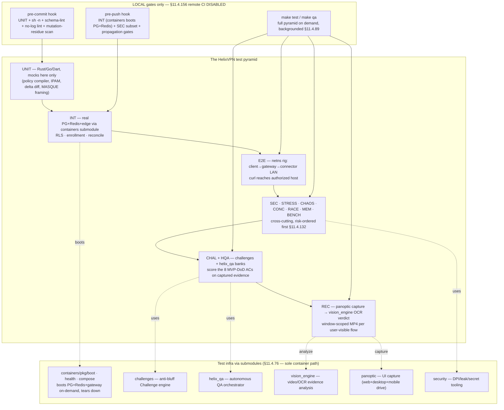
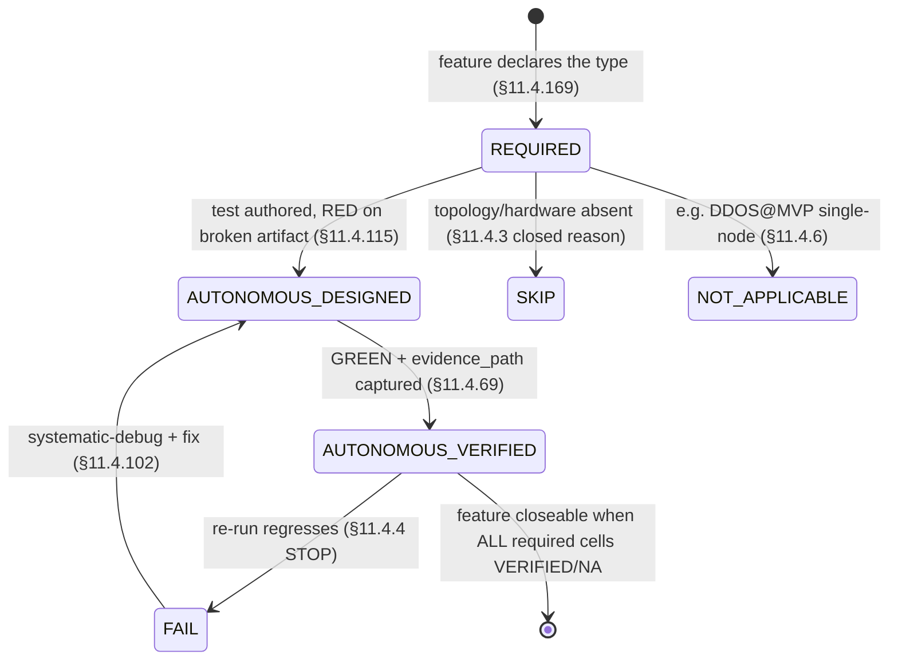

# Testing, Acceptance & Anti-Bluff QA Strategy (constitution §11.4.169)

**Revision:** 1
**Last modified:** 2026-06-25T00:00:00Z

> Master technical specification — document 10 of the HelixVPN set. This is the
> **canonical QA contract**: it defines, once, the §11.4.169 test-type taxonomy,
> the captured-evidence model, the harnesses, the per-phase acceptance gates, and
> the coverage-ledger schema that the Phase-0 and Phase-1 work-breakdown
> documents ([06](06-phase0-spike-wbs.md), [07](07-phase1-mvp-wbs.md)) reference
> by abbreviation. Every other document's per-item `Tests:` column draws from the
> closed vocabulary fixed *here* (§2). It is **spec-only** — it describes *how
> "works for the end user" is mechanically proven*, never the product itself
> (2–3 refinement passes follow).
>
> Authoritative companions cited inline: data plane [01]; control plane [02];
> client core + UI [03]; security/privacy/PKI [04]; repo + ecosystem [05]; Phase-0
> WBS [06]; Phase-1 WBS [07]. Primary research: **[04_P0]**
> (`04_VPN_CLD/HelixVPN-Phase0-Spike.md`), **[04_P1]** (Phase1-MVP), **[04_ARCH]**,
> **[04_UI]** (`HelixVPN-helix-ui-Flutter.md`), **[05_YBO]**, **[SYNTHESIS]**, LLM
> analyses **[02_QWN] [01_DSK] [11_MST] [10_KMI] [07_GMI]**, external facts
> **[research-masque]** (RFC 9297/9298/9221), **[research-boringtun]**,
> **[research-quinn]**, **[research-wireguard]**.

---

## Table of contents

- [0. Doctrine: the anti-bluff covenant applied to a VPN](#0-doctrine-the-anti-bluff-covenant-applied-to-a-vpn)
- [1. §11.4.169 — the universal test-type mandate](#1-1114169--the-universal-test-type-mandate)
- [2. The closed test-type taxonomy (canonical)](#2-the-closed-test-type-taxonomy-canonical)
- [3. The captured-evidence model (§11.4.5 / .69 / .107)](#3-the-captured-evidence-model-1145--69--107)
- [4. The test pyramid + ecosystem topology (§11.4.156 — local, no remote CI)](#4-the-test-pyramid--ecosystem-topology-1114156--local-no-remote-ci)
- [5. Per-type strategy, harness, evidence, gate, skeletons](#5-per-type-strategy-harness-evidence-gate-skeletons)
  - [5.1 UNIT](#51-unit)
  - [5.2 INT — integration (containers submodule infra)](#52-int--integration-containers-submodule-infra)
  - [5.3 E2E — end-to-end (netns rig)](#53-e2e--end-to-end-netns-rig)
  - [5.4 FA — full-automation](#54-fa--full-automation)
  - [5.5 CHAL — Challenges (challenges submodule banks)](#55-chal--challenges-challenges-submodule-banks)
  - [5.6 HQA — HelixQA autonomous sessions](#56-hqa--helixqa-autonomous-sessions)
  - [5.7 SEC — security](#57-sec--security)
  - [5.8 DDOS — denial-of-service / load-flood](#58-ddos--denial-of-service--load-flood)
  - [5.9 STRESS + CHAOS](#59-stress--chaos)
  - [5.10 CONC — concurrency / atomicity](#510-conc--concurrency--atomicity)
  - [5.11 RACE — race-condition / deadlock](#511-race--race-condition--deadlock)
  - [5.12 MEM — memory (iOS NE soak)](#512-mem--memory-ios-ne-soak)
  - [5.13 BENCH + PERF + SCALE](#513-bench--perf--scale)
  - [5.14 UI + UX + REC — recorded-evidence (vision_engine / panoptic)](#514-ui--ux--rec--recorded-evidence-vision_engine--panoptic)
- [6. The coverage ledger (feature × test-type × evidence-state)](#6-the-coverage-ledger-feature--test-type--evidence-state)
- [7. Per-phase acceptance gates](#7-per-phase-acceptance-gates)
- [8. Execution discipline: determinism, risk-order, four-layer, diary](#8-execution-discipline-determinism-risk-order-four-layer-diary)
- [9. The local gate harness (Makefile + git hooks, §11.4.75/.156)](#9-the-local-gate-harness-makefile--git-hooks-1114175156)
- [10. Open decisions surfaced for QA](#10-open-decisions-surfaced-for-qa)
- [Sources](#sources)

---

## 0. Doctrine: the anti-bluff covenant applied to a VPN

A VPN is the worst possible product to bluff-test, because **every failure mode is
silent and invisible to a green summary line**. A kill-switch that "passes" but
leaks one DNS query deanonymises the user. A tunnel that "connects" but routes
plaintext is worse than no VPN. A policy edit that "applies" but leaves a stale
`AllowedIPs` grants access that was revoked. The §11.4 covenant's founding mandate —
*"execution of tests MUST guarantee … full usability by end users"* — is not a
slogan here; it is the only thing standing between the product and a
deanonymisation incident.

Therefore the operative bar for **every** HelixVPN test is not "the assertion
returned true" but **"a packet, a pcap, a counter delta, or a rendered frame —
captured during execution — proves the user-visible security property held."**
Five HelixVPN-specific bluff classes are forbidden by name (each maps to a
constitution clause and is mechanically guarded in §5):

| Bluff class | What it looks like | Forbidden by | Guarded in |
|---|---|---|---|
| **B1 — config-only PASS** | asserting `AllowedIPs` contains the route, never sending a packet | §11.4.69 | §5.3 E2E, §5.7 SEC |
| **B2 — absence-of-error PASS** | "kill-switch enabled, no error" with no leak-capture | §11.4.68 / .107 | §5.7 SEC, AC7 (§7.2) |
| **B3 — wrong-plane PASS** | `dumpsys`/policy field says "connected" while no PCM/packet flows | §11.4.107(2), §11.4.68 | §5.3, §5.13 |
| **B4 — stale-state PASS** | validating against a previous deploy's running daemon | §11.4.108/.139 | §8, §9 |
| **B5 — unvalidated-analyzer PASS** | the pcap/OCR analyzer passes its own golden-bad fixture | §11.4.107(10) | §3.3, §5.14 |

Every PASS in this strategy flows through `ab_pass_with_evidence <desc>
<evidence_path>` (§11.4.69); bare `ab_pass` is a release blocker. A FAIL that
crashes for a script-internal reason (`set -u` undefined var, a broken
`tshark` filter) is **equally forbidden** (§11.4.1) — the harness sources a
shared anti-bluff lib (§9) so script bugs surface at the lib layer, not as fake
product FAILs.

---

## 1. §11.4.169 — the universal test-type mandate

§11.4.169 (the §11.4.27 enumeration, promoted to a per-item closure obligation)
requires that **every workable item declares the closed set of test types it
must pass before it may close**, and that the *absence* of any warranted type is
never silent — it is an explicit `NOT_APPLICABLE: <reason>` or an honest §11.4.3
`SKIP: <closed-set-reason>`, never an omission. This document fixes that closed
set, its HelixVPN instantiation, and its evidence shape. The `Tests:` columns in
[06] and [07] are projections of §2 below.

**Composition (per §11.4.169):** §11.4.4(b) four-layer (pre-build gate + post-build
+ runtime-on-clean-target + paired §1.1 mutation) applies to *every* item closure;
§11.4.50 determinism (N=3 normal / N=10 cycle-validation, identical evidence
hashes) applies to every PASS; §11.4.132 risk-ordering governs run order; §11.4.149
records each run in the item's `test_diary`; §11.4.135 registers a permanent
regression guard for every closed defect.

---

## 2. The closed test-type taxonomy (canonical)

This is the **single source** for the abbreviations used project-wide. Sixteen
types; `DDOS` and `SCALE` are MVP-`NOT_APPLICABLE` by design (single-node
self-host) and re-arm in Phase 2 (HA / managed).

| Abbrev | §11.4.169 type | HelixVPN floor expectation | Primary harness | MVP status |
|---|---|---|---|---|
| `UNIT` | unit | pure logic: policy compiler, IPAM allocator, MapResponse delta diff, MASQUE framing, status FSM. Mocks allowed **only here** (§11.4.27). | `cargo test`, `go test`, `dart test` | required |
| `INT` | integration | real Postgres+Redis+edge booted on-demand via `containers` submodule (§11.4.76); **no mocks**. | testcontainers via `containers/pkg/boot` | required |
| `E2E` | end-to-end | real control plane drives the netns rig; `curl` reaches an authorized LAN host through the real tunnel. | netns + nftables + netem rig [04_P0 §3] | required |
| `FA` | full-automation | self-driving, re-runnable `-count=3`, zero human-in-loop (§11.4.98). | `make spike` / `make qa` one-shot | required |
| `SEC` | security | RLS cross-tenant denial, key-never-leaves-FFI, mTLS, kill-switch, DNS-leak, DPI-evasion, secret-leak audit. | netns + pcap + `security` submodule | required |
| `DDOS` | DDoS / load-flood | handshake-flood + volumetric flood; edge fail-static + rate-limit holds. | `iperf3` flood + custom WG-init flood | **NOT_APPLICABLE: single-node-selfhost** (Phase 2) |
| `STRESS` | stress | sustained load (≥100 iters / ≥30 s), ≥10 parallel, boundary inputs (§11.4.85). | `stress_chaos.sh` `ab_stress_*` | required |
| `CHAOS` | chaos | mid-flight SIGKILL / Redis drop / iface flap / partial write; recovery restores consistent state (§11.4.85). | `stress_chaos.sh` `ab_chaos_*` | required |
| `CONC` | concurrency / atomicity | concurrent IPAM allocs / enrollments / policy edits; no lost update, no double-allocation. | Go `-race` + Postgres txn harness | required |
| `RACE` | race / deadlock | data-race + deadlock detection on the hot paths (reconcile loop, edge verdict swap). | `cargo +nightly` loom + Go `-race` + tsan | required |
| `MEM` | memory | iOS NEPacketTunnelProvider RSS under the ~15 MB historical ceiling, ≥30% headroom; no leak over 24 h soak. | Instruments / `/proc` / `dumpsys meminfo` | required (G3-critical) |
| `BENCH` | benchmarking | throughput, CPU-per-Gbps, handshakes/sec, p99 framing latency. | `bench.sh` [04_P0 §8] + `criterion` | required |
| `PERF` | performance | latency p50/p99 vs the SLO budget (§7.2); Go GC-tail watch on hot paths. | `bench.sh` + histogram metrics | required |
| `SCALE` | scaling | N simulated agents holding streams; convergence + bounded memory / 24 h. | agent-fuzzer + coordinator soak | partial (SLO4 soak); full Phase 2 |
| `UI` / `UX` | UI / UX | Flutter widget + golden tests; flow walkthrough (enroll→connect→reach) with vision verdict. | `flutter test` + `panoptic` drive | required |
| `REC` | recorded-evidence | window-scoped MP4 (§11.4.154/.155) + media-validation pipeline verdict (§11.4.163). | `panoptic` capture → `vision_engine` | required (per user-visible item) |
| `CHAL` / `HQA` | Challenge / HelixQA | a `challenges` / `helix_qa` bank entry scoring PASS only on captured evidence (§11.4.27/.107). | `challenges` + `helix_qa` submodules | required (DoD ACs) |

> **Why `DDOS`/`SCALE` defer.** [04_P1 §11] scopes the MVP to a single rootless
> host with no public multi-tenant surface; a DDoS suite at MVP would test a
> threat the deployment topology does not yet present (§11.4.3 topology-SKIP). The
> seam is built now (rate-limit token buckets [04 §T9], stateless fail-static edge
> [01 I3]) and the suite is authored as a **parked Phase-2 bank** so it re-arms
> mechanically when HA lands, never as an omission.

---

## 3. The captured-evidence model (§11.4.5 / .69 / .107)

### 3.1 Evidence taxonomy mapped to §11.4.69 sink-side classes

Every HelixVPN feature maps to one §11.4.69 sink-side evidence class; a PASS cites
an artifact whose *shape* the class fixes. This table is the contract `vision_engine`
and the `challenges` banks score against.

| Feature class | §11.4.69 class | Captured-evidence shape (the artifact `ab_pass_with_evidence` cites) |
|---|---|---|
| tunnel carries traffic | `network_throughput` | `iperf3 -J` JSON with `sum_received.bits_per_second > 0`; pcap with ≥1 decrypted inner packet |
| authorized reachability | `network_connectivity` | `curl` HTTP 200 body hash from the overlay netns + pcap SYN→SYN-ACK |
| default-deny | `network_connectivity` (negative) | pcap showing SYN out, **zero** SYN-ACK; edge `nft`/eBPF verdict-map counter `drop++` |
| kill-switch / DNS-leak | `wifi_link` / negative | host-side pcap during forced drop: **zero** non-loopback packets, **zero** :53 egress |
| transport escalation | `network_connectivity` | `StatusReport.transport=="masque-h3"` + tshark `http3` classification, no WG signature |
| policy reconcile latency | counter delta | `helix_reconcile_seconds` p99 histogram bucket < 1 s |
| revoke latency | counter delta | revoke-event-ts → edge-peer-removed-ts timing CSV, p99 < 1 s |
| key-never-leaves | negative | FFI boundary scan + log scan: zero private-key bytes cross FFI / hit any log |
| iOS NE memory | `MEM` | Instruments `.trace` / `footprint` RSS series, peak < ceiling, ≥30% headroom |
| UI connect flow | `REC` | window-scoped MP4 (§11.4.154) + `vision_engine` OCR verdict on the ConnectButton state |

### 3.2 §11.4.107 liveness battery (the no-frozen-frame rules, applied)

The §11.4.107 mandate — *a single captured frame/sample is not proof* — instantiates
for HelixVPN as:

1. **Liveness over a window**, not a point. Throughput is sampled over ≥10 s; a
   one-shot `ping` reply is a pre-filter, never the proof (§11.4.107(1)).
2. **Independent counter-advance.** Goodput (`iperf3`) **and** an independent
   kernel WG counter (`wg show <if> transfer` rx/tx bytes advancing) must *both*
   move — a flat WG counter with moving `iperf3` means a decoy/loopback path
   (§11.4.107(2)).
3. **Not-stale cross-check.** After a transport escalation, the post-escalation
   pcap's first inner packet must not be a replay of the pre-escalation flow's
   last packet (§11.4.107(4)).
4. **Loading is a distinct state.** A handshake in progress is `Connecting`, not
   `Connected`; the FSM must reach `Connected` before liveness is judged
   (§11.4.107(3)); timeout+reachable ⇒ FAIL, timeout+unreachable ⇒ SKIP.
5. **Metamorphic relations** where there is no golden source: same LAN host
   reached over WG-UDP vs MASQUE must return the **same body hash**; a paused
   tunnel stops the counter; 2× clients ⇒ ~2× aggregate goodput (§11.4.107(8)).

### 3.3 Self-validated analyzers (§11.4.107(10)) — defeating B5

Every analyzer (pcap classifier, leak detector, OCR verdict, memory parser) ships
with a **golden-good + golden-bad fixture pair** and is wired into the meta-test
sweep. An analyzer that passes its golden-bad fixture is itself the bluff and
FAILs `CM-ANALYZER-SELF-VALIDATED`.

```rust
// tests/analyzers/leak_detector_selfvalidation.rs  (§11.4.107(10))
#[test] fn golden_good_clean_drop_passes() {
    let v = LeakDetector::new().scan_pcap("fixtures/killswitch_clean.pcap");
    assert_eq!(v.verdict, Verdict::Pass);          // a truly-clean drop PASSes
}
#[test] fn golden_bad_leaked_dns_fails() {
    let v = LeakDetector::new().scan_pcap("fixtures/killswitch_leaked_dns.pcap");
    assert_eq!(v.verdict, Verdict::Fail);          // a seeded :53 leak MUST FAIL
    assert!(v.findings.iter().any(|f| f.proto == "dns" && f.dport == 53));
}
```

The paired §1.1 mutation for this gate strips the `dport == 53` clause from the
detector and asserts `golden_bad_leaked_dns_fails` now *passes the leak* → meta-test
FAILs → the mutation is caught. This is the mechanical defeat of B5.

---

## 4. The test pyramid + ecosystem topology (§11.4.156 — local, no remote CI)



**§11.4.156 binding.** There is **no active `.github/workflows/*.yml` or
`.gitlab-ci.yml`** in any HelixVPN repo. The CI workflow file is preserved at
`.github/workflows/qa.yml.disabled-local-only` (a name no provider triggers,
§11.4.75 Layer-5). Enforcement is the **local** git-hook ritual (§9) + the §11.4.40
pre-tag sweep run by the operator. Every gate in the pyramid is a Makefile target
that runs on the developer's host; `containers` boots infra on demand so no shared
runner is required.

---

## 5. Per-type strategy, harness, evidence, gate, skeletons

### 5.1 UNIT

**Covers (HelixVPN).** Pure deterministic logic where a bug is a logic bug, not an
integration bug: the policy compiler (ACL → AllowedIPs + verdict-map, default-deny
correctness), the IPAM allocator (overlay `/48` ULA carve, collision-free
allocation, D4 [SYNTHESIS]), the coordinator delta diff (snapshot→minimal-delta
correctness), MASQUE/HTTP-Datagram framing encode/decode (RFC 9221
[research-masque]), the client status FSM transitions, kill-switch firewall-rule
synthesis.

**Harness.** `cargo test` (Rust core/edge), `go test` (control plane), `dart test`
(UI logic). Property tests via `proptest` (Rust) and `gopter` (Go) for the
compiler and allocator — these are exactly the components where exhaustive
hand-written cases miss the boundary that bites. **Mocks are permitted only at this
layer** (§11.4.27).

**Evidence.** Test output + coverage report; for the compiler a *golden-table*
fixture (`acl.yaml` → expected `AllowedIPs` set) committed as a regression guard
(§11.4.135).

**Gate.** Pre-commit hook (§9). Coverage floor ratchets 70→85→95% over phases
(§11.4.50 feature-coverage matrix).

```rust
// helix-core/crates/helix-policy/src/compile.rs  (interface under test)
pub trait PolicyCompiler {
    /// Compile a tenant ACL into per-peer AllowedIPs + an edge verdict map.
    /// MUST be default-deny: an empty/parse-failed ACL yields ZERO allowed routes.
    fn compile(&self, acl: &Acl, peers: &[PeerId]) -> Result<CompiledPolicy, CompileError>;
}

// helix-core/crates/helix-policy/tests/default_deny.rs
#[test] fn empty_acl_grants_nothing() {                       // the security floor
    let c = TailscaleAclCompiler::default();
    let cp = c.compile(&Acl::empty(), &[peer("alice"), peer("bob")]).unwrap();
    for p in cp.peers() { assert!(cp.allowed_ips(p).is_empty(), "fail-closed violated"); }
}
#[test] fn parse_error_is_fail_closed_not_fail_open() {       // B-class: never fail-open
    let c = TailscaleAclCompiler::default();
    assert!(matches!(c.compile(&Acl::malformed(), &[]), Err(CompileError::Parse(_))));
    // and the caller MUST treat Err as "no routes", proven in the INT layer (§5.2)
}
```

### 5.2 INT — integration (containers submodule infra)

**Covers.** Every seam that touches real infrastructure: Postgres RLS multi-tenant
isolation (a tenant-B query under tenant-A's RLS context returns zero rows),
device enrollment end-to-end (OIDC/anon token → device-generated WG keypair, private
key never persisted server-side → short-lived mTLS cert issued), event backbone
(Redis Streams publish → coordinator consume → delta emitted), the coordinator
`WatchNetworkMap` server-stream (snapshot + deltas, peers already policy-filtered),
no-log schema invariant against the live DB.

**Harness — the `containers` submodule is the ONLY path (§11.4.76).** Integration
tests boot Postgres + Redis (+ edge where needed) **on-demand** via
`containers/pkg/boot`, run against the *real* services, and tear down — no
`docker`/`podman` CLI outside `pkg/boot`/`pkg/compose`/`pkg/health`, no mocks
(§11.4.27). This is the on-demand-infra invariant: `make test` boots infra itself,
the developer never runs `podman` by hand.

```go
// helix-go/internal/store/rls_integration_test.go
//go:build integration
package store

import (
    "context"; "testing"
    "digital.vasic.containers/pkg/boot"     // §11.4.76 sole container seam
    "digital.vasic.containers/pkg/health"
)

func TestRLSCrossTenantDenial(t *testing.T) {
    ctx := context.Background()
    infra, err := boot.Up(ctx, boot.Spec{Postgres: true, Redis: true, Rootless: true}) // §11.4.161
    if err != nil { t.Fatalf("boot infra: %v", err) }
    t.Cleanup(func() { _ = infra.Down(ctx) })            // §11.4.14 quiescence
    if err := health.WaitReady(ctx, infra, health.Postgres); err != nil { t.Fatal(err) }

    db := mustConnect(t, infra.PostgresDSN())
    seedTenant(t, db, "tenant-A", "device-a1")
    seedTenant(t, db, "tenant-B", "device-b1")

    // Under tenant-A's RLS role, tenant-B's devices MUST be invisible (real DB, no mock).
    rows := queryAs(t, db, "tenant-A", `SELECT id FROM devices`)
    requireContains(t, rows, "device-a1")
    requireNotContains(t, rows, "device-b1")            // captured: rowset = evidence (§11.4.5)
    // paired §1.1 mutation: disable the RLS policy → this test MUST FAIL (gate CM-RLS-ENFORCED)
}
```

**Evidence.** The captured rowset / stream transcript; for the no-log invariant the
`schemalint` report. **Gate.** Pre-push hook + `make test`.

```sql
-- the no-log invariant the INT + schema-lint layers enforce (§04, [02 §2.4])
-- CI schema-lint FAILS the build if ANY durable connection/traffic/packet table appears.
-- Allowed: aggregate counters only.
CREATE TABLE traffic_counters (              -- ALLOWED: aggregate, no per-flow rows
    tenant_id   uuid NOT NULL,
    window_start timestamptz NOT NULL,
    rx_bytes    bigint NOT NULL,             -- SUM over window, not per-connection
    tx_bytes    bigint NOT NULL,
    PRIMARY KEY (tenant_id, window_start)
);
-- FORBIDDEN (schemalint paired §1.1 mutation seeds this → gate MUST FAIL):
-- CREATE TABLE connections (src_ip inet, dst_ip inet, started_at timestamptz, ...);
```

### 5.3 E2E — end-to-end (netns rig)

**Covers.** The whole reachability slice on one box: a *real* control plane issues
a NetworkMap, a *real* `helix-core` client builds the tunnel, traffic crosses
`client → gateway → connector LAN`, and `curl http://10.10.0.20/` returns the hello
page. Plus the *negative* E2E (default-deny: a SYN out, zero SYN-ACK) and the
DPI-block E2E (plain WG blocked → MASQUE escalation → reachability preserved). The
rig is the reproducible substrate for AC2/AC3/AC4 (§7.2) and survives Phase-0→1.

**Harness — Linux netns + nftables-DPI + tc-netem [04_P0 §3, 06 §HVPN-P0-022].**
Three processes (`client`, `gateway`, `connector`) in namespaces on one host; an
`nft` table simulates a DPI UDP block; `tc netem` injects loss/delay for resilience.

```bash
# rig/netns_up.sh — connector-side "private LAN" simulated with a netns [06 HVPN-P0-023]
set -euo pipefail
ip netns add lanA
ip link add veth-host type veth peer name veth-lanA
ip link set veth-lanA netns lanA
ip -n lanA addr add 10.10.0.20/24 dev veth-lanA && ip -n lanA link set veth-lanA up
ip netns exec lanA python3 -m http.server 80 --bind 10.10.0.20 &   # the hello service (sink)

# rig/dpi_block.sh — DPI/censorship sim for the AC4 escalation E2E
nft add table inet dpi
nft add chain inet dpi fwd '{ type filter hook forward priority 0; }'
nft add rule  inet dpi fwd udp dport 51820 drop      # kill plain WireGuard
nft add rule  inet dpi fwd udp dport 443  accept     # allow MASQUE/H3

# rig/impair.sh — loss/jitter for the resilience E2E (§11.4.85 adjacency)
tc qdisc add dev "$IFACE" root netem loss 5% delay 40ms 10ms
```

```bash
# rig/test_reach.sh — the E2E assertion (positive + negative), §11.4.50 N=3 deterministic
run_reach() {                                          # $1 = expected: pass|deny
  pcap="qa-results/e2e/$(date +%s)_reach.pcap"
  ip netns exec client tcpdump -i overlay0 -w "$pcap" &  TPID=$!
  body=$(ip netns exec client curl -s --max-time 5 http://10.10.0.20/ || true)
  kill "$TPID" 2>/dev/null
  if [ "$1" = pass ]; then
    [ -n "$body" ] || ab_fail "B1: no body — config-only PASS forbidden"
    grep -q "SYN-ACK"  <(tshark -r "$pcap" -Y 'tcp.flags.syn==1 && tcp.flags.ack==1') \
      && ab_pass_with_evidence "authorized reach" "$pcap"
  else
    [ -z "$body" ] || ab_fail "default-deny breached: got a body"
    tshark -r "$pcap" -Y 'tcp.flags.syn==1 && tcp.flags.ack==1' | grep -q . \
      && ab_fail "deny breached: SYN-ACK present" \
      || ab_pass_with_evidence "default-deny (no SYN-ACK)" "$pcap"
  fi
}
```

**Evidence.** pcap + `curl` body hash + `iperf3 -J` CSV (≥80% bare-link for G1).
**Gate.** `make test` E2E stage; AC2/AC3/AC4 release gates (§7.2). Cleanup is
non-negotiable — `trap 'rig/netns_down.sh' EXIT` leaves the host quiescent
(§11.4.14).

### 5.4 FA — full-automation

**Covers.** The §11.4.98 invariant: **every** E2E / integration / Challenge must be
re-runnable end-to-end with **zero human intervention** after startup. For HelixVPN
this means the whole MVP-DoD demo (`helixvpnctl init` → enroll connector+client →
reach → deny → escalate → revoke) runs as one command, N=3 consecutively, with
self-cleaning state and identical PASS each time (§11.4.50). The single forbidden
human touch-point is credential bootstrap *outside* execution (a `.env` token,
§11.4.10).

**Harness.** `make spike` (Phase 0) and `make qa` (Phase 1) are the one-shot
drivers; the latter dispatches `helix_qa`'s autonomous session (§5.6). Determinism
is mechanical: `ab_run_n_times <name> 3 <fn>` loops, captures an evidence-hash per
iteration, and FAILs if any hash or exit code diverges — there is no
"first-pass-was-a-flake" path (§11.4.50).

```bash
# the §11.4.50 determinism wrapper every FA suite uses
ab_run_n_times() {                       # $1 name  $2 N  $3 fn
  local name="$1" n="$2" fn="$3" h prev=""
  for i in $(seq 1 "$n"); do
    "$fn" "$i"; h=$(sha256sum "qa-results/$name/run_$i/evidence.json" | cut -d' ' -f1)
    [ -z "$prev" ] || [ "$h" = "$prev" ] || ab_fail "non-deterministic: run $i hash diverged"
    prev="$h"
  done
  ab_pass_with_evidence "$name x$n deterministic" "qa-results/$name/"
}
```

### 5.5 CHAL — Challenges (challenges submodule banks)

**Covers.** The eight MVP Definition-of-Done acceptance criteria (AC1–AC9, §7.2) are
authored as **executable Challenges** in the `challenges` submodule — the
constitution's anti-bluff Challenge layer (§11.4.27(B)/.5/.69). A Challenge differs
from a test: it scores PASS **only** on captured evidence matching the §3.1 shape
for that feature class, and is graded by the `challenges` engine, not by the test's
own exit code. This is the structural defence against B1–B3: the Challenge engine
re-reads the pcap/counter/recording, it does not trust the harness's claim.

**Harness.** `challenges` submodule (`digital.vasic.challenges`, Go) consumed via
`replace` in dev / pinned SHA in release [05 §6.1]. A bank file maps each AC to its
on-rig driver + the evidence-class assertion.

```yaml
# challenges/banks/helixvpn_mvp_dod.yaml  (illustrative — one entry per AC)
bank: helixvpn-mvp-dod
challenges:
  - id: HVPN-CHAL-AC2-authorized-reach
    feature_class: network_connectivity        # §11.4.69
    driver: rig/test_reach.sh pass
    evidence:
      kind: pcap
      assert: "frame.tcp.flags.syn==1 && frame.tcp.flags.ack==1 from 10.10.0.20"
      and_body_hash_nonempty: true
    score: pass_only_if_evidence_matches       # never trust exit code alone
  - id: HVPN-CHAL-AC7-killswitch-no-leak
    feature_class: killswitch_negative
    driver: rig/killswitch_drop.sh
    evidence:
      kind: pcap
      assert_zero: "ip && not loopback"        # zero plaintext egress
      assert_zero_dns: "udp.port==53"          # zero DNS leak
    self_validated: true                        # golden-bad seeded-leak pcap MUST score FAIL (§3.3)
```

**Evidence + Gate.** The Challenge engine's per-AC verdict JSON under
`docs/qa/<run-id>/` (§11.4.83); `make qa` is the gate; a release tag is blocked
while any DoD Challenge is non-PASS.

### 5.6 HQA — HelixQA autonomous sessions

**Covers.** `helix_qa` is the **autonomous QA orchestrator** (§11.4.27/.107/.158): it
drives the full MVP-DoD acceptance set end-to-end with no human, detects and
respawns crashed sub-runs (§11.4.147), generates tickets for findings into the
workable-items DB, and emits the real-time sync channel (§11.4.116 JSONL event
stream + atomic status snapshot) that the conductor tails. It is the §11.4.165
independent-verification agent for the runtime layer — structurally separate from
the code author.

**Harness.** `go run ./submodules/helix_qa/cmd/orchestrator --suite mvp-dod`
([05 Makefile `qa:`]). It consumes the `challenges` banks (§5.5), boots infra via
`containers` (§5.2), drives `panoptic` for UI flows (§5.14), and feeds frames to
`vision_engine` (§5.14). Each verdict event carries its evidence path (§11.4.116 —
a PASS with no evidence path is a contradiction → treated as FAIL).

```jsonc
// the §11.4.116 sync channel helix_qa emits (qa-results/helix_qa/events.jsonl, append-only)
{"ts":"2026-…","ev":"session_start","suite":"mvp-dod","build":"<artifact-md5>"}
{"ts":"…","ev":"challenge_start","id":"HVPN-CHAL-AC2-authorized-reach"}
{"ts":"…","ev":"evidence","id":"HVPN-CHAL-AC2-…","path":"qa-results/.../reach.pcap"}
{"ts":"…","ev":"verdict","id":"HVPN-CHAL-AC2-…","result":"PASS","evidence":"qa-results/.../reach.pcap"}
```

**Evidence + Gate.** The events stream + per-AC verdict; `make qa` exit status gates
the release. HelixQA's own meta-test plants a known-broken AC and asserts the
session reports FAIL (§11.4.32 self-meta-test).

### 5.7 SEC — security

**Covers.** The security invariants from [04 §13], each a falsifiable captured-evidence
row:

| Invariant | Captured-evidence proof |
|---|---|
| S1 default-deny | negative E2E (§5.3): SYN out, zero SYN-ACK, edge `drop++` |
| S2 key-never-leaves | FFI boundary scan + log scan: **zero** private-key bytes cross FFI or hit any log [04 §13] |
| S3 mTLS device cert | handshake pcap shows client cert; expired/revoked cert ⇒ stream refused |
| S4 kill-switch | host pcap during forced tunnel drop: zero non-loopback egress [04, §11.4.68] |
| S5 DNS-leak | host pcap during drop + reconnect: zero :53 to a non-tunnel resolver |
| S6 DPI-evasion | tshark classifies MASQUE flow as HTTP/3, **no** WG signature, SNI = decoy host |
| S7 wire-fingerprint | passive observer cannot distinguish HelixVPN MASQUE from generic H3 (entropy + timing) |
| S8 secret-leak audit | `git ls-files \| xargs grep -l <secret>` + `git log -S<secret>` empty (§11.4.10/.10.A) |
| S9 RLS cross-tenant | §5.2 INT rowset isolation |

**Harness.** netns + pcap for S1/S3–S7; the `security` submodule for the DPI/leak/
secret tooling [05 §6 row]; FFI scan tool for S2. Each analyzer is self-validated
(§3.3). **Gate.** Pre-push hook (secret audit + RLS subset) + `make qa` SEC stage.
The secret-leak audit is also a §11.4.10.A pre-store audit run before any credential
lands.

```bash
# rig/killswitch_drop.sh — S4+S5, the anti-bluff kill-switch test (defeats B2)
set -euo pipefail
pcap="qa-results/sec/$(date +%s)_killswitch.pcap"
ip netns exec client tcpdump -i any -w "$pcap" & TPID=$!
ip netns exec client curl -s --max-time 30 http://10.10.0.20/ >/dev/null &  # traffic in flight
sleep 2
rig/force_tunnel_drop.sh                       # core FSM -> Blocked, firewall seals
sleep 5
ip netns exec client nslookup example.com 2>/dev/null || true   # try to leak a DNS query
kill "$TPID" 2>/dev/null
# PASS only if, after the drop, ZERO non-loopback packets AND ZERO :53 left the host:
LEAK=$(tshark -r "$pcap" -Y 'frame.time_relative>2 && ip && not (ip.addr==127.0.0.1)' | wc -l)
DNS=$(tshark  -r "$pcap" -Y 'frame.time_relative>2 && udp.port==53' | wc -l)
[ "$LEAK" -eq 0 ] && [ "$DNS" -eq 0 ] \
  && ab_pass_with_evidence "kill-switch sealed, no DNS leak" "$pcap" \
  || ab_fail "LEAK=$LEAK DNS=$DNS — plaintext/DNS escaped the seal"
```

### 5.8 DDOS — denial-of-service / load-flood

**Covers (Phase 2; seam built MVP).** Two threats: (a) **handshake flood** — a torrent
of WG/MASQUE init packets must not exhaust the gateway (rate-limited via Redis token
buckets [04 §T9]); (b) **volumetric flood** — the stateless edge must fail-static
(drop, never crash; rootless auto-restart [01 I3]). At MVP this is
`NOT_APPLICABLE: single-node-selfhost` (§11.4.6) and **authored as a parked bank**
that re-arms in Phase 2 when the public multi-tenant surface exists.

**Harness (parked).** `iperf3` N-client flood + a custom Noise-IK-init flood
generator; assert p99 handshake latency for a *legitimate* client stays bounded
while the flood runs, and the edge process never OOM/crashes (counter `wg_init_dropped`
rises, `helix_edge_up` stays 1). **Evidence.** legit-client latency CSV + edge
liveness counter during flood. **Gate.** Phase-2 release gate; MVP records the SKIP
reason in the coverage ledger (§6).

### 5.9 STRESS + CHAOS

**Covers.** Resilience of every fix (§11.4.85 mandate — happy-path-only is a bluff at
the resilience layer). **STRESS:** sustained reconcile churn (≥100 policy edits / ≥30 s),
≥10 concurrent enrollments, boundary inputs (empty ACL, max-peer map, off-by-one
overlay range). **CHAOS:** mid-transfer SIGKILL of the edge (tunnel recovers, no
plaintext leak during the gap), Redis drop mid-reconcile (coordinator degrades
gracefully, no lost delta), interface flap (client roams, tunnel re-establishes
< 3 s), partial-write of the network-map snapshot (recovery restores a consistent
map, never a torn one), connector process kill (peer drops from every map within
the convergence budget).

**Harness.** `stress_chaos.sh` exposing `ab_stress_run`, `ab_stress_concurrent`,
`ab_chaos_kill_pid_during`, `ab_chaos_drop_network_during`,
`ab_chaos_iface_flap_during` — each composing with `ab_pass_with_evidence` and a
`trap '...' EXIT` cleanup (§11.4.14 — corrupt-restore / process-restart mandatory).

```bash
# CHAOS: kill the edge mid-transfer, assert recovery AND no leak during the gap (§11.4.85)
ab_chaos_kill_pid_during "$(edge_pid)" 'ip netns exec client iperf3 -t 20 -c 10.10.0.20' \
  --on-kill 'sleep 3' \
  --assert 'tunnel_reestablished_within 3s && killswitch_sealed_during_gap' \
  --evidence "qa-results/chaos/edge_kill_$(date +%s)/"
# the assertion re-reads the gap pcap: zero plaintext egress while the edge was dead (composes S4)
```

**Evidence.** `latency.json` (p50/p95/p99), `recovery_trace.log`, `state_delta_snapshot.json`,
gap-pcap. **Gate.** `make test` STRESS/CHAOS stage; every closed defect registers a
permanent CHAOS guard (§11.4.135).

### 5.10 CONC — concurrency / atomicity

**Covers.** The places where two callers race over shared state: concurrent IPAM
allocation (no two devices get the same overlay IP — a Postgres `SELECT … FOR
UPDATE` / unique-constraint contract), concurrent enrollment of the same device,
concurrent policy edits to the same tenant (last-writer-wins with a version guard,
no lost update), concurrent `WatchNetworkMap` streams receiving deltas while a new
peer enrolls (each stream converges to the same final map). The mandate: any method
reachable from ≥2 goroutines/threads is safe for rapid consecutive calls (project
principle 3).

**Harness.** Go test spawning N goroutines hammering the allocator against real
Postgres (via `containers`), asserting **exactly** N distinct IPs and zero
constraint violations; a property test that the final map is invariant to delta
arrival order.

```go
func TestIPAMNoDoubleAllocationUnderConcurrency(t *testing.T) { // CONC + atomicity
    infra := mustBootPG(t)                      // containers submodule (§5.2)
    alloc := NewIPAMAllocator(infra.PostgresDSN(), mustParseULA("fd7a:115c:a1e0::/48"))
    const N = 64
    got := make([]netip.Addr, N); var wg sync.WaitGroup
    for i := 0; i < N; i++ { wg.Add(1); go func(i int){ defer wg.Done();
        a, err := alloc.Allocate(ctx, deviceID(i)); requireNoErr(t, err); got[i] = a }(i) }
    wg.Wait()
    requireAllDistinct(t, got)                  // captured: the N-set is the evidence
    // paired §1.1 mutation: drop the FOR UPDATE lock → a collision appears → gate FAILs
}
```

**Evidence.** the allocated-set + Postgres constraint-violation count (must be 0).
**Gate.** `make test` CONC stage; run with Go `-race` (overlaps §5.11).

### 5.11 RACE — race-condition / deadlock

**Covers.** Data races and deadlocks on the hot paths: the client reconcile loop
(network-map apply under a concurrent status read — no torn read of `AllowedIPs`),
the edge verdict-map hot-swap (a policy update swaps the verdict map while packets
are being classified — no use-after-free, no half-applied map), the Rust core's
`tick()` keepalive/rekey timer under concurrent send/recv, the Go coordinator's
in-memory topology graph under concurrent stream fan-out.

**Harness.** Rust: `cargo +nightly test --features loom` (exhaustive interleaving of
the reconcile/verdict-swap critical sections) + ThreadSanitizer on the FFI boundary.
Go: `go test -race` on the coordinator + edge. The §11.4 principle 2 (no blocking
op inside a held lock) is asserted by a loom test that the verdict-swap never holds
the classify lock across an allocation.

```rust
// helix-edge/tests/verdict_swap_loom.rs — no torn read, no deadlock under interleaving
#[test] fn verdict_swap_is_atomic_under_loom() {
    loom::model(|| {
        let vm = Arc::new(ArcSwap::from_pointee(VerdictMap::empty()));
        let (vm1, vm2) = (vm.clone(), vm.clone());
        let t = loom::thread::spawn(move || { vm1.store(Arc::new(VerdictMap::allow("10.10.0.0/24"))); });
        let v = vm2.load();                    // classifier reads concurrently
        assert!(v.is_consistent());            // never a half-applied map (no torn read)
        t.join().unwrap();
    });
}
```

**Evidence.** loom/tsan/`-race` clean report (zero findings). **Gate.** `make test`
RACE stage; a `-race` finding is a release blocker (B-class latent bug per
§11.4.145 angle 3).

### 5.12 MEM — memory (iOS NE soak)

**Covers — the make-or-break platform constraint (Phase-0 gate G3 [04_P0]).** iOS
`NEPacketTunnelProvider` runs under a hard memory ceiling (~15 MB historical
[SYNTHESIS §5]); the entire decision to write `helix-core` in **Rust not Go** (D2
[SYNTHESIS §3]) rests on staying under it with ≥30% headroom. MEM also covers: no
RSS growth over a 24 h soak (no leak in the reconcile loop or the QUIC buffer pool),
the coordinator's bounded memory at 10k streams (SLO4 §7.2), and Android
`VpnService` RSS.

**Harness.** iOS: Instruments `Allocations`/`Leaks` + `footprint` against a device
build, peak-RSS series captured as a `.trace`; a soak harness runs a sustained
transfer for 24 h sampling `/proc/<pid>/status` (Linux core), `dumpsys meminfo`
(Android), Instruments (iOS). The G3 gate: peak RSS < ceiling, headroom ≥ 30%,
proven on a **real device** (a simulator does not reproduce the jetsam ceiling —
§11.4.3: no device ⇒ honest `SKIP: hardware_not_present`, never a fake PASS).

```swift
// shims/apple/PacketTunnelProvider+MemoryProbe.swift  (G3 evidence emitter)
func sampleFootprint() -> UInt64 {              // bytes; written to qa-results/mem/ios_rss.csv
    var info = task_vm_info_data_t()
    var count = mach_msg_type_number_t(MemoryLayout<task_vm_info>.size / MemoryLayout<integer_t>.size)
    let kr = withUnsafeMutablePointer(to: &info) {
        $0.withMemoryRebound(to: integer_t.self, capacity: Int(count)) {
            task_info(mach_task_self_, task_flavor_t(TASK_VM_INFO), $0, &count) } }
    return kr == KERN_SUCCESS ? info.phys_footprint : 0   // phys_footprint = the jetsam metric
}
```

**Evidence.** RSS-vs-time CSV + Instruments `.trace`; G3 verdict = peak < ceiling ×
0.7. **Gate.** Phase-0 G3 (release-blocking make-or-break); MVP soak for SLO4.

### 5.13 BENCH + PERF + SCALE

**Covers.** **BENCH:** raw throughput (≥80% bare-link plain-UDP G1; ≥50% of plain
over MASQUE G2 [04_P0]), CPU-per-Gbps for both candidate edge languages (the Go-vs-Rust
G4 decision input, D5 [SYNTHESIS]), handshakes/sec, MASQUE framing latency.
**PERF:** the four SLOs as p99 budgets (§7.2) — event→delta < 1 s, enroll→first-map
< 2 s, revoke→enforcement < 1 s; Go GC-tail watch on the coordinator hot path.
**SCALE:** N simulated agents holding `WatchNetworkMap` streams; convergence p99 < 1 s
and bounded coordinator memory over a 24 h soak (SLO4).

**Harness.** `bench.sh` [04_P0 §8] driving the netns rig with `iperf3 -J` +
per-iteration CSV, run N=3 deterministic (§11.4.50). `criterion` for Rust
micro-benches (framing). A coordinator agent-fuzzer holds N streams and measures
convergence + RSS.

```bash
# bench.sh — the G1/G2/G4 benchmark, deterministic over N=3 [04_P0 §8, 06 HVPN-P0-NNN]
THRPUT=$(iperf3 -J -c 10.10.0.20 -P "$CLIENTS" | jq '.end.sum_received.bits_per_second')
GOODPUT_LOSS=$(with_netem 'loss 5% delay 40ms' iperf3_goodput)       # G2 / resilience
CPU_PER_GBPS=$(awk -v t="$THRPUT" -v c="$EDGE_CPU_SEC" 'BEGIN{print c/(t/1e9)}')  # G4 input
printf '%s,%s,%s,%s,%s\n' "$EDGE_LANG" "$RUN" "$THRPUT" "$GOODPUT_LOSS" "$CPU_PER_GBPS" \
  >> qa-results/bench/edge_compare.csv      # the G4 decision CSV (rust vs go)
```

**Evidence.** the per-metric CSV with min/max/mean/p95 (§11.4.24 resource-stats
discipline); the G4 CSV decides `gates.G4.outcome IN ('rust','go')`. **Gate.**
Phase-0 G1/G2/G4; MVP SLO PERF/SCALE gates; a PERF regression > budget is a release
blocker.

### 5.14 UI + UX + REC — recorded-evidence (vision_engine / panoptic)

**Covers.** The three Flutter flavors (Access / Connector / Console [04_UI]):
**UI** = widget + golden tests on the design-system components (ConnectButton,
StatusChip, ExitPicker, ShieldIndicator) across light+dark (§11.4.162 OpenDesign
parity); **UX** = the real user journey (enroll → connect → reach → see the shield
go green) driven through the app's own UI; **REC** = a **window-scoped MP4**
(§11.4.154/.155 — app window only, never whole desktop) of that journey, fed to the
media-validation pipeline (§11.4.163) for an OCR/vision verdict.

**Harness.** `flutter test` (widget + golden). `panoptic` (UI capture harness, Go
[05 §6]) drives the web/desktop/mobile app and captures the window-scoped MP4;
`vision_engine` (Go) runs OCR/state-verify on the frames — e.g. it reads that the
ConnectButton text transitions `Connect → Connecting → Connected` and the
ShieldIndicator turns green, then cross-checks against the *real* core status
stream (a green shield while the core FSM is `Blocked` is B3 and FAILs). Filenames
carry the §11.4.155 project prefix `helixvpn---connect-flow---<run-id>.mp4`; raw
corpus is git-ignored, curated evidence committed under `docs/qa/<run-id>/`
(§11.4.83).

```dart
// helix-ui/test/connect_button_golden_test.dart  (UI — light+dark, §11.4.162)
void main() {
  for (final brightness in [Brightness.light, Brightness.dark]) {
    testWidgets('ConnectButton golden — $brightness', (tester) async {
      await tester.pumpWidget(HelixTheme(brightness: brightness,
          child: ConnectButton(state: ConnState.connected)));
      await expectLater(find.byType(ConnectButton),
          matchesGoldenFile('goldens/connect_button_connected_$brightness.png'));
    });
  }
}
```

```jsonc
// the §11.4.163 media-validation verdict vision_engine emits for the REC artifact
{ "artifact": "docs/qa/<run-id>/helixvpn---connect-flow---<run-id>.mp4",
  "expected_patterns": ["Connect","Connecting","Connected","shield:green"],   // SPECIFY-phase (§11.4.159(J))
  "matched": ["Connect","Connecting","Connected","shield:green"],
  "cross_check": { "core_fsm_at_green_shield": "Connected" },                  // defeats B3
  "verdict": "PASS", "self_validated": true }                                  // golden-bad MP4 → FAIL (§3.3)
```

**Evidence.** golden PNGs + the window-scoped MP4 + the vision verdict JSON.
**Gate.** `make test` UI stage + `make qa` REC stage; AC9 (three apps drive it).
A user-visible item without a vision-verified REC is a §11.4.153 release blocker.

---

## 6. The coverage ledger (feature × test-type × evidence-state)

The coverage ledger is the §11.4.25/.52/.153 mechanical answer to "is every feature
proven, by every warranted test type, with real evidence?" It is a **git-tracked
SQLite table** (§11.4.93/.95) — a projection of the workable-items DB cross-joined
with the test-type matrix — regenerated by `doc_processor` from the spec feature
map (§11.4.153) on every QA run, and rendered to `docs/qa/coverage_ledger.md`
(+HTML/PDF) by `docs_chain` (§11.4.106).

### 6.1 DDL

```sql
-- docs/.workable_items.db  (git-tracked, §11.4.95) — coverage ledger projection
CREATE TABLE IF NOT EXISTS features (
    feature_id   TEXT PRIMARY KEY,                 -- 'F-KILLSWITCH', 'F-AUTHZ-REACH'
    component    TEXT NOT NULL,                     -- 'helix-core' | 'helix-go' | 'helix-edge' | 'helix-ui'
    title        TEXT NOT NULL CHECK (length(title) >= 40),   -- §11.4.91
    evidence_class TEXT NOT NULL,                   -- §11.4.69 class (network_connectivity, ...)
    phase        TEXT NOT NULL CHECK (phase IN ('P0','P1','P2','P3'))
);
CREATE TABLE IF NOT EXISTS coverage_cells (
    feature_id   TEXT NOT NULL REFERENCES features(feature_id),
    test_type    TEXT NOT NULL,                     -- §2 abbrev: UNIT|INT|E2E|SEC|...
    state        TEXT NOT NULL CHECK (state IN
                  ('REQUIRED','AUTONOMOUS_VERIFIED','AUTONOMOUS_DESIGNED',
                   'OPERATOR_ATTENDED_ONLY','SKIP','NOT_APPLICABLE','FAIL','PENDING')),
    skip_reason  TEXT,                              -- closed set (§11.4.3) when state IN (SKIP,NOT_APPLICABLE)
    evidence_path TEXT,                             -- §11.4.69 — REQUIRED for *_VERIFIED states
    last_run_at  TEXT,
    diary_ref    TEXT,                              -- §11.4.149 test_diary row id
    PRIMARY KEY (feature_id, test_type),
    -- §11.4.69: a VERIFIED cell MUST carry an evidence path (schema makes a bluff impossible)
    CHECK (state NOT IN ('AUTONOMOUS_VERIFIED') OR (evidence_path IS NOT NULL AND length(evidence_path)>0)),
    -- §11.4.3: a SKIP/NA cell MUST carry a closed-set reason
    CHECK (state NOT IN ('SKIP','NOT_APPLICABLE') OR (skip_reason IS NOT NULL))
);
CREATE VIEW v_coverage_gaps AS
  SELECT f.feature_id, c.test_type, c.state
  FROM features f JOIN coverage_cells c USING (feature_id)
  WHERE c.state IN ('PENDING','FAIL','OPERATOR_ATTENDED_ONLY');   -- the release-blocker set
```

### 6.2 State machine for a cell



**Release rule.** A phase ships only when `v_coverage_gaps` is empty for that phase
(every required cell is `AUTONOMOUS_VERIFIED` or `NOT_APPLICABLE` with a reason);
`OPERATOR_ATTENDED_ONLY` is a release blocker until promoted with a tracked
migration item (§11.4.52). The ledger is the §11.4.40 full-suite-retest scoreboard.

### 6.3 Worked rows (illustrative)

| feature_id | UNIT | INT | E2E | SEC | STRESS | CHAOS | CONC | RACE | MEM | BENCH | UI/REC | CHAL |
|---|---|---|---|---|---|---|---|---|---|---|---|---|
| F-AUTHZ-REACH | ✓ | ✓ | ✓ | ✓ | ✓ | ✓ | — | — | — | ✓ | ✓ | AC2 |
| F-DEFAULT-DENY | ✓ | ✓ | ✓ | ✓ | — | ✓ | — | ✓ | — | — | — | AC3 |
| F-KILLSWITCH | ✓ | — | ✓ | ✓ | — | ✓ | — | ✓ | — | — | ✓ | AC7 |
| F-TRANSPORT-ESCALATE | ✓ | ✓ | ✓ | ✓ | ✓ | ✓ | — | ✓ | — | ✓ | — | AC4 |
| F-POLICY-RECONCILE | ✓ | ✓ | ✓ | — | ✓ | ✓ | ✓ | ✓ | — | ✓(SLO1) | — | AC5 |
| F-REVOKE | ✓ | ✓ | ✓ | ✓ | — | ✓ | ✓ | — | — | ✓(SLO3) | — | AC6 |
| F-IOS-NE-MEM | — | — | — | — | — | — | — | — | ✓(G3) | — | — | — |
| F-NO-LOG-SCHEMA | ✓ | ✓ | — | ✓ | — | — | — | — | — | — | — | AC8 |
| F-DDOS-FLOOD | — | — | — | NA¹ | — | — | — | — | — | — | — | NA¹ |

¹ `NOT_APPLICABLE: single-node-selfhost` at MVP; re-arms Phase 2 (§5.8).

---

## 7. Per-phase acceptance gates

### 7.1 Phase 0 — Spike exit gates (G1–G6) [04_P0, 06]

| Gate | Question | Go/No-Go bar | Evidence | Test types |
|---|---|---|---|---|
| **G1** | plain-UDP WG client→gw→connector LAN? | iperf3 ≥ **80%** bare-link; `curl 10.10.0.20:80` OK | pcap + iperf3 CSV | E2E, BENCH, SC, FA, CH |
| **G2** | same core over MASQUE/QUIC through a DPI UDP block? | ≥ **50%** of plain-UDP; survives 5% loss > UoT strawman; tshark classifies HTTP/3, no WG sig | pcap + tshark + CSV | E2E, SEC, BENCH, FA |
| **G3** | iOS NE Rust core under memory ceiling? **(make-or-break)** | peak RSS < ceiling, **≥30%** headroom on a real device | Instruments `.trace` + RSS CSV | MEM |
| **G4** | Go-vs-Rust edge benchmark? | decision recorded from CPU-per-Gbps/p99/churn/mem CSV (N=3) | `edge_compare.csv` | BENCH, PERF, RACE |
| **G5** | flutter_rust_bridge FFI drives core from Dart? | Dart calls `connect()`, receives status stream | FFI round-trip log + UI recording | UNIT, UI, FA |
| **G6** | push-based reconcile from a static map? | a map edit reconciles the slice with no restart | reconcile event log | INT, E2E, FA |

Each gate is a row in the `gates` table ([06 §0.3]); `outcome` flips to `pass`/`fail`/
`rust`/`go` only with an `evidence_path`. A gate that cannot clear inside the time
box **is the finding** — escalate the decision (§11.4.66), never overrun silently.

### 7.2 Phase 1 — MVP Definition-of-Done (AC1–AC9 + SLO1–SLO4) [04_P1, 07]

The MVP ships only when **all nine ACs and all four SLOs** pass on a clean baseline
(§11.4.40 retest + §11.4.108 runtime-signature on a fresh deploy). Each AC is a
`challenges` bank entry (§5.5) scored by `helix_qa` (§5.6).

| AC | Criterion | Captured evidence | Bound item |
|---|---|---|---|
| **AC1** | self-host from zero (`helixvpnctl init` + start) | recorded terminal, healthchecks green, `helix_up==1` | HVPN-P1-… |
| **AC2** | enroll connector+client; reach authorized LAN host | E2E netns capture + pcap (body hash) | F-AUTHZ-REACH |
| **AC3** | DENY unauthorized host (default-deny) | negative E2E: SYN out, zero SYN-ACK | F-DEFAULT-DENY |
| **AC4** | auto-escalate to MASQUE when WG blocked, stays up | `StatusReport.transport=="masque-h3"` + tshark H3 | F-TRANSPORT-ESCALATE |
| **AC5** | policy edit reconfigures all devices < 1 s, no restart | `helix_reconcile_seconds` p99 < 1 s | F-POLICY-RECONCILE |
| **AC6** | revoke device < 1 s | revoke→edge-enforcement timing CSV | F-REVOKE |
| **AC7** | kill-switch + DNS-leak: no plaintext on drop | host pcap, zero leak / zero :53 (§5.7) | F-KILLSWITCH |
| **AC8** | no durable conn/traffic log (schema-lint green) | `schemalint` PASS + §1.1 mutation FAIL | F-NO-LOG-SCHEMA |
| **AC9** | three apps drive it all (Access+Connector+Console) | per-app window-scoped UX recordings + vision verdict | F-UI-FLOWS |

| SLO | Target | Test type | Item |
|---|---|---|---|
| **SLO1** event→delta-on-wire | p99 < 1 s | PERF | HVPN-P1-073 |
| **SLO2** enroll→first NetworkMap | < 2 s | PERF | HVPN-P1-031 |
| **SLO3** revoke→edge enforcement | < 1 s | PERF | HVPN-P1-033 |
| **SLO4** coordinator memory @ 10k streams | bounded / 24 h soak | MEM, SCALE | HVPN-P1-074 |

### 7.3 Phase 2 / 3 — re-armed and new gates

Phase 2 **re-arms** `DDOS` + full `SCALE` (HA multi-region, stateless coordinators,
Patroni PG, NATS JetStream) and adds: DAITA traffic-shaping evidence (maybenot), P2P
NAT-traversal E2E (hole-punch success rate over a STUN/DERP rig), multi-hop nested-WG
E2E, post-quantum handshake interop (ML-KEM hybrid, never PQ-only). Phase 3 adds
HarmonyOS NEXT + Aurora OS platform shim E2E (the biggest platform risk — real
native tunnel-shim work), WASM browser-MASQUE proxy E2E, and a third-party audit +
reproducible-build attestation. Each re-arm flips its coverage-ledger cells from
`NOT_APPLICABLE`/`PENDING` to `REQUIRED` mechanically (§6.2).

---

## 8. Execution discipline: determinism, risk-order, four-layer, diary

**Determinism (§11.4.50).** Every PASS runs N=3 (normal) / N=10 (cycle-validation)
against the same artifact MD5 + same rig, identical evidence-hashes; a divergent run
is auto-FAIL, no flake escape (`ab_run_n_times`, §5.4).

**Risk-ordering (§11.4.132).** The suite runs **highest-risk first**: (a)
most-recently-worked, (b) historically most-problematic, (c) highest crash/leak
likelihood, (d) most-reopened (`reopens_count` from the workable-items DB). For
HelixVPN the irreversible-security floor — kill-switch (AC7), default-deny (AC3),
RLS (S9), revoke (AC6), key-never-leaves (S2) — runs **before** any convenience/UI
test, and only after that set is GREEN with captured evidence does the rest run.

**Four-layer per closure (§11.4.4(b)).** Every workable item closes only with: (1)
a pre-build gate (lint/schema/sh -n/self-validated-analyzer present), (2) a
post-build/runtime test on the deployed artifact, (3) a runtime-signature on a
**clean** deploy (§11.4.108/.139 — never validate against a stale daemon, defeats
B4), (4) a paired §1.1 mutation that makes the gate FAIL (proves the gate is not a
bluff).

**Reproduce-first + extend (§11.4.146).** Every fix authors a RED test that
reproduces the defect on the *current broken* artifact (`RED_MODE=1`), flips to a
GREEN guard (`RED_MODE=0`) on the fix, then **fans out** across the feature's full
case-space (valid/invalid/boundary/concurrent/chaos) and registers a permanent
regression guard (§11.4.135).

**Test diary (§11.4.149).** Every run appends a row to the item's `test_diary`
(date · tested_by ∈ {AI-agent, HelixQA, Operator} · result · observations ·
evidence_path · feature_class). The schema constraint **rejects a PASS row with an
empty evidence_path** — a diary-layer bluff is impossible.

```sql
CREATE TABLE IF NOT EXISTS test_diary (        -- §11.4.149, git-tracked
    diary_id     INTEGER PRIMARY KEY,
    atm_id       TEXT NOT NULL REFERENCES items(atm_id),
    date_time    TEXT NOT NULL,                 -- ISO-8601 UTC
    tested_by    TEXT NOT NULL CHECK (tested_by IN ('AI-agent','HelixQA','Operator','User')),
    result       TEXT NOT NULL CHECK (result IN ('PASS','FAIL','SKIP')),
    observations TEXT NOT NULL,
    evidence_path TEXT, feature_class TEXT,
    CHECK (result <> 'PASS' OR (evidence_path IS NOT NULL AND length(evidence_path) > 0))  -- §11.4.69
);
```

**Operator-escape ⇒ bluff-audit (§11.4.138).** If the operator finds a defect the
green suite missed, that is by definition a PASS-bluff: it triggers a
systematic-debug pass, a bluff-audit naming the exact assertion that should have
caught it (`file:line`), a permanent regression guard in the same commit, and the
audit committed under `docs/research/<scope>/<defect>_bluff_audit/`.

---

## 9. The local gate harness (Makefile + git hooks, §11.4.75/.156)

All enforcement is **local** (§11.4.156 — no active remote CI). The seam:

```makefile
# Makefile — the local gate harness (excerpt; full set in [05])
gen:        ; buf generate && flutter_rust_bridge_codegen generate     # proto + FFI
build:      ; cargo build && go build ./... && melos run build
test:       ; cargo test && go test -race ./helix-go/... && melos run test  # boots infra via containers (§5.2)
e2e:        ; sudo rig/netns_up.sh && rig/test_reach.sh pass && rig/test_reach.sh deny ; sudo rig/netns_down.sh
sec:        ; rig/killswitch_drop.sh && bash scripts/secret_audit.sh     # §5.7
chaos:      ; bash scripts/stress_chaos.sh                               # §5.9
bench:      ; bash bench.sh 3                                            # N=3 deterministic (§5.13)
qa:         ; go run ./submodules/helix_qa/cmd/orchestrator --suite mvp-dod  # 8 ACs, captured evidence (§5.6)
coverage:   ; go run ./tools/coverage_ledger && docs_chain sync --context .docs_chain/contexts/helixvpn_spec.yaml
docs-verify:; docs_chain verify --context .docs_chain/contexts/helixvpn_spec.yaml  # deterministic gate (§11.4.106)
```

**Git-hook layers (§11.4.75):** `pre-commit` runs UNIT + `sh -n` + schema-lint +
no-log lint + mutation-residue scan (§11.4.84); `pre-push` runs INT (containers
boots PG+Redis) + the SEC subset + propagation gates; `post-commit` auto-exports
HTML/PDF/DOCX siblings (§11.4.65/.153). The `qa.yml.disabled-local-only` file is
preserved but inert (§11.4.75 Layer-5). Long suites run backgrounded
(`nohup … & disown`, §11.4.89) so the main work stream is never blocked.

**Container-test infra is rootless (§11.4.161).** `containers/pkg/boot` runs Podman
rootless; no `sudo`, no rootful Docker — the only `sudo` in the whole harness is
`rig/netns_up.sh` (network-namespace creation needs `CAP_NET_ADMIN`), and that is a
documented, scoped exception, never a container-management escalation.

---

## 10. Open decisions surfaced for QA

Per §11.4.66, decisions the QA layer touches but does not silently resolve:

| # | Decision | Options | Recommendation |
|---|---|---|---|
| **QA-D1** | Edge language (G4) drives which RACE toolchain is canonical | Rust (loom+tsan) vs Go (`-race`) | **Rust** — loom's exhaustive interleaving is stronger for the verdict-swap hot path [04_P0 G4]; revisit on the G4 CSV. |
| **QA-D2** | DDoS suite timing | author-now-parked vs defer-authoring | **Author-now-parked** — build the bank in MVP so it re-arms mechanically in Phase 2; the seam (rate-limit, fail-static) exists now [04 §T9]. |
| **QA-D3** | iOS MEM gate on CI-less hosts | real-device-required vs simulator-allowed | **Real-device-required** — the jetsam ceiling does not reproduce in the simulator; no device ⇒ honest `SKIP: hardware_not_present`, never a sim PASS (§11.4.3). |
| **QA-D4** | Vision verdict authority | trust harness verdict vs independent `vision_engine` re-read | **Independent re-read** — `vision_engine` re-reads the MP4 and cross-checks the core FSM (defeats B3); the harness's claim is never the verdict (§11.4.165). |
| **QA-D5** | Challenge engine vs raw test exit codes for DoD | exit-code vs `challenges`-scored | **`challenges`-scored** — the engine re-reads the evidence artifact, structurally defeating B1–B3; exit codes alone are bluffable (§11.4.27). |

---

## Sources

- **[04_P0]** `04_VPN_CLD/HelixVPN-Phase0-Spike.md` — netns+nftables+netem rig, G1–G6
  gates, `bench.sh`, surviving interfaces, iOS memory gate.
- **[04_P1]** `04_VPN_CLD/HelixVPN-Phase1-MVP.md` — MVP DoD (AC1–AC9), SLOs, no-log
  schema-lint, RLS, coordinator/WatchNetworkMap.
- **[04_ARCH]** `04_VPN_CLD/HelixVPN-Architecture-Refined.md` — three roles, transport
  stack, security invariants.
- **[04_UI]** `04_VPN_CLD/HelixVPN-helix-ui-Flutter.md` — Flutter flavors, design system,
  UI/golden test surface.
- **[05_YBO]** founding constraints + mandated stack. **[02_QWN] [01_DSK] [11_MST]
  [10_KMI] [07_GMI]** — LLM analyses (transport plurality, IPAM/D4 solvers, asymmetric
  per-leg transport).
- **[SYNTHESIS]** `v09-research/_SYNTHESIS.md` — settled floor, key decisions D1–D7,
  phased structure, ecosystem-integration gaps.
- **[01] [02] [03] [04] [05] [06] [07]** — companion `final/` documents (data plane,
  control plane, client core+UI, security/PKI, repo+ecosystem, Phase-0 WBS, Phase-1 WBS).
- External facts: **[research-masque]** RFC 9297 (HTTP Datagrams)/9298 (CONNECT-UDP)/9221
  (unreliable datagram); **[research-boringtun]**, **[research-quinn]** (Rust QUIC),
  **[research-wireguard]** (Noise IK).
- Constitution: §11.4.169 (test-type mandate), §11.4.27 (no-fakes/100% type coverage),
  §11.4.5/.69/.107 (captured evidence / sink-side / liveness), §11.4.85 (stress+chaos),
  §11.4.50 (determinism), §11.4.132 (risk-order), §11.4.4(b)/.108/.139/.146/.135 (four-layer
  / runtime-signature / reproduce-first / regression guard), §11.4.149 (test diary),
  §11.4.25/.52/.153 (coverage ledger), §11.4.76/.161 (containers/rootless), §11.4.156
  (no active remote CI), §11.4.75 (local hook layers), §11.4.159/.163/.165 (recorded
  evidence / media validation / independent verification), §11.4.93/.95 (workable-items DB).
```