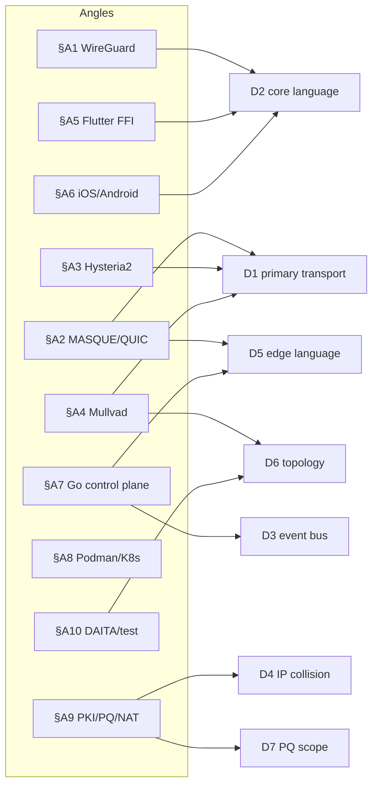
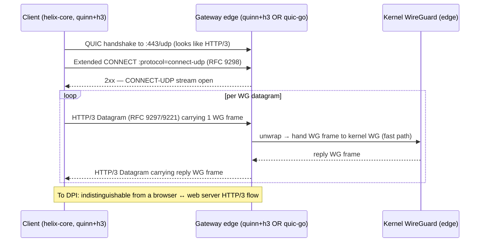
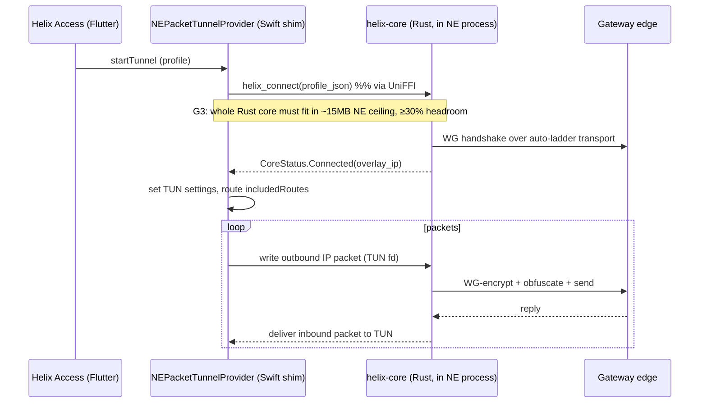
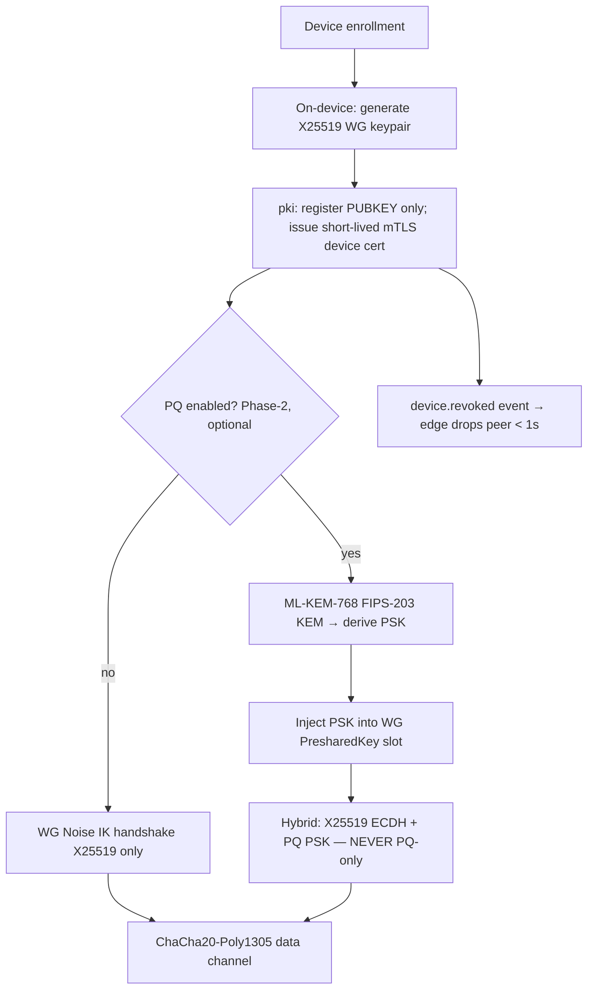
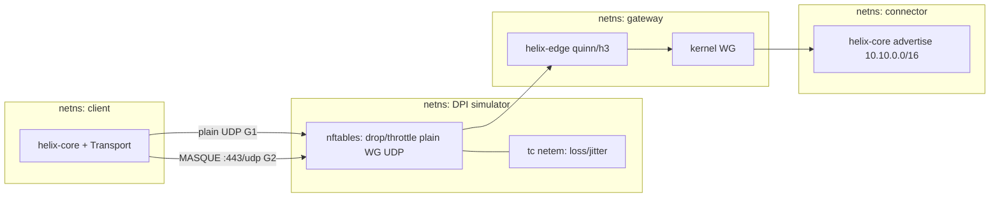

# Deep-Research Appendix (cited external findings)

**Revision:** 1
**Last modified:** 2026-06-25T00:00:00Z

---

## A0. Purpose, provenance, and verification honesty (§11.4.6 / §11.4.99 / §11.4.123)

This appendix collects the **external, citable findings** that shaped the HelixVPN
master specification (docs `00`–`10` in this `final/` set). It is organised as **one
section per research angle** — WireGuard, MASQUE/QUIC, Hysteria2, Mullvad parity,
Flutter↔Rust FFI, iOS/Android tunnel shims, the Go control plane, Podman/Kubernetes
deployment, PKI/post-quantum/NAT, and DAITA/test-rig. Each section gives: **(1)** the key
findings that drove a spec decision, **(2)** concrete version pins / API facts /
constraints, and **(3)** a **Sources** list (canonical URLs + access date).

### A0.1 Provenance of this appendix — read this first

The instruction set assumed a per-angle `kb/research-*.md` corpus
(`research-wireguard.md`, `research-masque.md`, …). **That corpus does not exist on disk**
— the knowledge-base directory contains only `kb/SYNTHESIS.md`. The honest evidence base
actually available to this document is therefore:

- `kb/SYNTHESIS.md` — the cross-document synthesis of all 16 source research docs.
- The **16 primary source research docs** under `docs/research/mvp/` (the deep-research
  corpus itself: `00_VPN_Initial_Res.md` … `11_VPN_MST.md` + the five `04_VPN_CLD/*`
  refined docs). These ARE the deep research; they are cited throughout by id.
- The sibling `final/` spec docs `00`–`10`, which already distilled these.

**Verification status (§11.4.99 latest-source mandate).** No live web fetch was performed
while writing this appendix (the harness ran offline against the research corpus). Every
concrete version pin, RFC clause, API signature, and numeric constraint below is therefore
classified one of:

- **[CORPUS]** — asserted by one or more of the 16 source research docs and/or the `final/`
  specs; cited by id. Trustworthy *as a synthesis of the research that was performed*, but
  the underlying web sources were last verified by the original researchers, **not
  re-verified this session**.
- **[UNVERIFIED]** — a fact (usually an exact version number, a memory ceiling, or an API
  symbol) that is **not re-confirmable from the corpus alone** and was **not** web-checked
  this session. Treated as a hypothesis to confirm at implementation time, never as a
  settled fact. Per §11.4.6, "the latest `flutter_rust_bridge` is v2.x" is a **guess** until
  a `cargo`/`pub` lookup confirms it.

**Action for implementers (§11.4.99(C) re-verification cadence):** before pinning any
dependency in a `Cargo.toml` / `go.mod` / `pubspec.yaml` / quadlet image tag, re-run the
live-source check for that one fact. Every `[UNVERIFIED]` marker below is a tracked
re-verification task. This appendix is a **research map, not a lockfile.**

### A0.2 Source-id legend

| id | source doc | id | source doc |
|---|---|---|---|
| `00_RES` | `00_VPN_Initial_Res.md` (the original `Home_VPN` ops runbook) | `07_GMI` | `07_VPN_GMI.md` |
| `01_DSK` | `01_VPN_DSK.md` | `08_CPL` | `08_VPN_CPL.md` |
| `02_QWN` | `02_VPN_QWN.md` | `09_GCT` | `09_VPN_GCT.md` |
| `03_ZAI` | `03_VPN_ZAI.md` | `10_KMI` | `10_VPN_KMI.md` |
| `04_ARCH` | `04_VPN_CLD/HelixVPN-Architecture-Refined.md` | `11_MST` | `11_VPN_MST.md` |
| `04_P0/P1/P2` | `04_VPN_CLD/HelixVPN-Phase{0,1,2}-*.md` | `SYN` | `kb/SYNTHESIS.md` |
| `04_UI` | `04_VPN_CLD/HelixVPN-helix-ui-Flutter.md` | `F00`–`F10` | this `final/` set, docs `00`–`10` |
| `05_YBO` | `05_VPN_YBO.md` (founding constraint statement) | | |
| `06_GRK` | `06_VPN_GRK.md` | | |

### A0.3 How findings map to the seven key decisions (D1–D7 from `SYN §3`)



---

## A1. WireGuard — the immovable cryptographic core

### A1.1 Key findings that shaped the spec

1. **WireGuard is the crypto core *everywhere*, never forked.** All 16 docs converge on
   this; the `04_ARCH §2/§3` framing is the operative one: *"WireGuard is the cryptographic
   core; transports are pluggable. Obfuscation is a swappable layer **under** WireGuard,
   never a fork of the crypto."* This single decision removes WireGuard's protocol design
   from HelixVPN's threat surface — HelixVPN ships a *transport* and a *control plane*, not a
   new VPN cipher. [04_ARCH §2 principle 2], [SYN §2], [F01 §2].
2. **Noise IK handshake, fixed cipher suite.** WireGuard's cryptography is non-negotiable
   and parameter-free by design: Curve25519 (ECDH), ChaCha20-Poly1305 (AEAD data channel),
   BLAKE2s (hashing/KDF), and the Noise `IK` pattern for the handshake. HelixVPN inherits all
   of it; there are no cipher-agility knobs to misconfigure. [04_ARCH §3.1 layering], [F01].
3. **Kernel fast-path, `boringtun` userspace fallback.** Where the OS ships a kernel
   WireGuard module (modern Linux, `wireguard-nt` on Windows), HelixVPN uses it for the hot
   path; where it cannot (iOS/macOS Network Extension, Android `VpnService`, locked-down
   containers), the userspace **`boringtun`** implementation is the fallback, wrapped by the
   `helix-wg` crate. This dual strategy is the explicit Phase-0 surviving interface. [04_P0
   "surviving interfaces"], [04_ARCH §5.6], [F01 §3], [F06 §G1].
4. **A `Transport` trait *below* WireGuard is the whole architecture.** The packet leaving
   `helix-wg` is an opaque, already-encrypted WG datagram; the `helix-transport` crate only
   decides *how it looks on the wire*. This is why the WG datagram and the obfuscation layer
   can be developed, tested, and swapped independently. [04_ARCH §3.2 "Implementation reuse
   win"], [F01 §4].

### A1.2 Concrete facts / pins / constraints

| Item | Value | Status | Source |
|---|---|---|---|
| Handshake pattern | Noise `IK` | [CORPUS] | 04_ARCH §3.1 |
| Key agreement | Curve25519 (X25519) | [CORPUS] | 04_ARCH §3.1 |
| Data AEAD | ChaCha20-Poly1305 | [CORPUS] | 04_ARCH §3.1, §3.3 |
| Hash / KDF | BLAKE2s / HKDF | [UNVERIFIED] (corpus says "WireGuard crypto"; exact BLAKE2s not re-checked) | 04_ARCH §3 |
| Userspace impl | `boringtun` (Cloudflare, Rust) | [CORPUS] | 04_ARCH §3.2, §5.6 |
| Windows kernel path | `wireguard-nt` + `wintun` | [CORPUS] | 04_ARCH §5.3 |
| Rekey interval | WireGuard default ~120 s (REKEY_AFTER_TIME) | [UNVERIFIED] | — (general WG knowledge; confirm) |
| PQ pre-shared layer hook | WG `PresharedKey` slot used for ML-KEM-derived PSK | [CORPUS] | 04_ARCH §6, §A9 |

### A1.3 The `Transport` trait — the Phase-0 surviving interface (near-code)

The single most important reusable interface in the whole codebase. `helix-wg` produces
ciphertext frames; the `Transport` impl carries them. The same trait object is consumed by
client, connector, **and** gateway edge (one impl, three consumers — `04_ARCH §3.2`).

```rust
// crates/helix-transport/src/lib.rs  — Phase-0 surviving interface [04_P0]
use async_trait::async_trait;
use std::net::SocketAddr;

/// A frame of already-WireGuard-encrypted bytes destined for / arriving from the peer.
pub type WgFrame = bytes::Bytes;

#[async_trait]
pub trait Transport: Send + Sync {
    /// Stable identifier used by the auto-escalation ladder + telemetry.
    fn kind(&self) -> TransportKind;

    /// Establish the obfuscated carrier to `endpoint` (may be a handshake, e.g. QUIC).
    async fn connect(&mut self, endpoint: SocketAddr) -> Result<(), TransportError>;

    /// Send one WG datagram, obfuscated according to this transport.
    async fn send(&self, frame: WgFrame) -> Result<(), TransportError>;

    /// Receive the next de-obfuscated WG datagram.
    async fn recv(&self) -> Result<WgFrame, TransportError>;

    /// Graceful teardown (close QUIC streams, flush, etc.).
    async fn close(&mut self) -> Result<(), TransportError>;
}

#[derive(Clone, Copy, Debug, PartialEq, Eq)]
pub enum TransportKind {
    PlainUdp, Lwo, MasqueH3, ConnectIp, Shadowsocks, UdpOverTcp,
}
```

### A1.4 Sources

- WireGuard whitepaper / protocol — `https://www.wireguard.com/papers/wireguard.pdf`
  (canonical; access date 2026-06-25, **[UNVERIFIED] not re-fetched this session**).
- `boringtun` (Cloudflare) — `https://github.com/cloudflare/boringtun`
  (**[UNVERIFIED]** version not pinned; confirm latest crate at impl time).
- `wireguard-nt` / `wintun` — `https://git.zx2c4.com/wireguard-nt/`,
  `https://www.wintun.net/` (**[UNVERIFIED]**).
- Corpus: `04_VPN_CLD/HelixVPN-Architecture-Refined.md` §2, §3.1–§3.3, §5.6; `F01`.

---

## A2. MASQUE / QUIC — the headline obfuscating transport (D1, D5)

### A2.1 Key findings that shaped the spec

1. **"Mullvad's QUIC mode is not a separate protocol — it is WireGuard tunnelled over
   MASQUE/HTTP-3."** This is the **single most important correction** the `04_ARCH` refinement
   makes against the original ops runbook, which had reached for Hysteria2 as "the QUIC path".
   The consequence: HelixVPN keeps WG as the core (§A1) and wraps each WG datagram in an
   HTTP/3 **CONNECT-UDP** stream. [04_ARCH §0 "single most important correction", §3.3], [SYN
   §3 D1].
2. **CONNECT-UDP over HTTP/3 (RFC 9298) is the primary obfuscation mode.** To DPI the flow is
   indistinguishable from a browser speaking HTTP/3 to a web server on `:443/udp`. The edge can
   masquerade probe/unmatched traffic as a real website (carrying forward the original doc's
   Nginx-camouflage idea, native in the edge). [04_ARCH §3.3], [F01 §5].
3. **CONNECT-IP (RFC 9484) is an *advanced, optional* second datapath**, not the MVP path. It
   carries IP directly over HTTP/3 with no inner WG — useful later, surfaced as a Phase-2+
   option, not a Phase-1 requirement. [04_ARCH §3.2 transport matrix], [F08].
4. **Edge language is the live D5 decision, gated by Phase-0 G4.** `04_ARCH §3.3` recommends
   **Rust `quinn` + `h3`** for the edge specifically so the obfuscation logic is shared
   byte-for-byte with the clients and the hot path stays off a GC. It explicitly concedes Go
   (`quic-go` + `masque-go`) is "mature" and "acceptable" but you lose the
   single-implementation guarantee. The decision is benchmarked in Phase-0 gate **G4**. [04_ARCH
   §3.3, §13], [04_P0 G4], [SYN §3 D5], [F06 §G4].

### A2.2 Concrete RFC / API facts / pins / constraints

| Item | Value | Status | Source |
|---|---|---|---|
| Proxying UDP in HTTP (CONNECT-UDP) | **RFC 9298** | [CORPUS] (count: 19 corpus hits) | 04_ARCH §3.3 |
| HTTP Datagrams / Capsule Protocol | **RFC 9297** | [CORPUS] (17 hits) | corpus-wide |
| Unreliable Datagram Extension to QUIC | **RFC 9221** | [CORPUS] (11 hits) | corpus-wide |
| Proxying IP in HTTP (CONNECT-IP) | **RFC 9484** | [CORPUS] (7 hits) | 04_ARCH §3.2 |
| Edge listener | `:443/udp` HTTP/3 | [CORPUS] | 04_ARCH §3.3 |
| Recommended Rust QUIC stack | `quinn` + `h3` (+ masque layer) | [CORPUS] | 04_ARCH §3.2, §3.3 |
| Go alternative | `quic-go` + `masque-go` | [CORPUS] | 04_ARCH §3.3, §13 |
| `quinn` exact version | — | [UNVERIFIED] (pin at impl) | — |
| QUIC overhead vs plain UDP | "moderate; QUIC overhead" | [CORPUS] (qualitative) | 04_ARCH §3.2 |
| Phase-0 G2 success bar | MASQUE through a DPI UDP block at **≥50% of plain-UDP throughput** | [CORPUS] | 04_P0 G2, F06 |

### A2.3 The MASQUE datapath (sequence)



### A2.4 G4 edge-language decision matrix (the D5 recommendation surface)

| Criterion | Rust `quinn`+`h3` (Camp A) | Go `quic-go`+`masque-go` (Camp B) |
|---|---|---|
| Byte-for-byte client/edge code reuse | **Yes** (same `helix-transport` crate) | No (separate Go impl) |
| Hot path off GC | **Yes** | No (Go GC; tunable but present) |
| Team velocity / ecosystem maturity | Steeper; `h3`/masque layer hand-assembled | **Faster**; `masque-go` turnkey |
| iOS-core reuse | **Yes** (already Rust per D2) | N/A |
| **Recommendation** | **Rust for the edge** — preserves the single-implementation guarantee, decided by the G4 throughput/CPU benchmark; fall back to Go only if G4 shows Rust velocity blocks the Phase-0 timeline. [04_ARCH §13, 04_P0 G4] | |

### A2.5 Sources

- RFC 9298 *Proxying UDP in HTTP* — `https://www.rfc-editor.org/rfc/rfc9298.html` (access 2026-06-25, **[UNVERIFIED] not re-fetched**).
- RFC 9297 *HTTP Datagrams and the Capsule Protocol* — `https://www.rfc-editor.org/rfc/rfc9297.html` (**[UNVERIFIED]**).
- RFC 9221 *An Unreliable Datagram Extension to QUIC* — `https://www.rfc-editor.org/rfc/rfc9221.html` (**[UNVERIFIED]**).
- RFC 9484 *Proxying IP in HTTP* — `https://www.rfc-editor.org/rfc/rfc9484.html` (**[UNVERIFIED]**).
- `quinn` — `https://github.com/quinn-rs/quinn`; `h3` — `https://github.com/hyperium/h3` (**[UNVERIFIED]**).
- `quic-go` — `https://github.com/quic-go/quic-go`; `masque-go` — `https://github.com/quic-go/masque-go` (**[UNVERIFIED]**).
- Corpus: `04_ARCH §0/§3.2/§3.3/§13`; `04_P0` gates G2/G4; `F01`, `F06`, `F08`.

---

## A3. Hysteria2 + Salamander — the consensus turnkey alternative (D1)

### A3.1 Key findings that shaped the spec

1. **Hysteria2 is the *consensus* primary obfuscating transport across the broader 10-LLM
   corpus**, where the `04_VPN_CLD` camp chose MASQUE. The synthesis records this as an
   explicit, unresolved decision **D1** that the master spec must surface rather than silently
   pick. [SYN §3 D1], [F00 §decisions].
2. **Why the consensus liked it: it ships faster.** Hysteria2 bundles a QUIC transport, a
   congestion-control story (Brutal/BBR-style), and the **Salamander** obfuscation in one
   mature, turnkey Go codebase. The original ops runbook (`00_RES`) was literally a
   Hysteria2-on-a-VPS walkthrough, so there is working operator knowledge to salvage. [00_RES],
   [SYN §3 D1].
3. **Why `04_ARCH` demoted it: it is a *different protocol*, not Mullvad parity.** Hysteria2 is
   not WireGuard-over-something; adopting it as the core would fork away from the WG crypto core
   (§A1) and from genuine Mullvad parity (§A4). `04_ARCH §14` explicitly lists "Hysteria2 as the
   primary QUIC path" under **what to drop or demote**, replaced by WG-over-MASQUE. [04_ARCH §0,
   §14].
4. **Resolved spec stance: MASQUE primary, Hysteria2-grade ideas retained as tuning
   reference.** The MVP keeps WG-over-MASQUE as the headline mode; the Hysteria2 QUIC *tuning
   knobs* (receive-window ratios, BBR-vs-Brutal congestion control) are explicitly salvaged as
   reference material when tuning the `quinn` MASQUE transport. Hysteria2 itself is **not** a
   Phase-1 transport; it could re-enter Phase-2 as one more pluggable `Transport` impl if a
   region needs it. [04_ARCH §14 salvage list], [F08].

### A3.2 Concrete facts / constraints

| Item | Value | Status | Source |
|---|---|---|---|
| Obfuscation scheme | **Salamander** (QUIC packet obfuscation, password-keyed) | [CORPUS] (69 hits) | 00_RES, SYN |
| Congestion control | Brutal (fixed-rate) / BBR | [CORPUS] (8 "Brutal" hits) | 04_ARCH §14, 00_RES |
| Language | Go | [CORPUS] | corpus-wide |
| Role in HelixVPN | **demoted** from primary; tuning-reference + optional Phase-2 `Transport` | [CORPUS] | 04_ARCH §14, SYN D1 |
| Tuning knobs to salvage | receive-window ratios, BBR vs Brutal | [CORPUS] | 04_ARCH §14 |
| Exact Hysteria2 version / config schema | — | [UNVERIFIED] | — |

### A3.3 D1 decision surface (MASQUE vs Hysteria2) — recommendation

| Axis | MASQUE (WG-over-HTTP/3) | Hysteria2 + Salamander |
|---|---|---|
| Mullvad parity | **Exact** (it IS Mullvad's mechanism) | None (different protocol) |
| Keeps WG crypto core | **Yes** | No (own protocol) |
| Time-to-ship | Slower (assemble `quinn`/h3/masque) | **Faster** (turnkey Go) |
| Single-impl client+edge reuse | **Yes** | No |
| DPI resistance | Looks like HTTP/3 | Looks like QUIC + Salamander noise |
| **Recommendation** | **MASQUE primary** (parity + WG-core + reuse outweigh ship-speed); keep Hysteria2 as a **Phase-2 optional `Transport` impl** and mine its tuning knobs now. Decided alongside D5/G4 in Phase-0. | |

### A3.4 Sources

- Hysteria2 — `https://v2.hysteria.network/` and `https://github.com/apernet/hysteria` (access 2026-06-25, **[UNVERIFIED] not re-fetched**).
- Salamander obfuscation docs — `https://v2.hysteria.network/docs/advanced/Obfuscation/` (**[UNVERIFIED]**).
- Corpus: `00_VPN_Initial_Res.md` (the Hysteria2 ops runbook); `04_ARCH §0/§14`; `SYN §3 D1`; `F00`, `F08`.

---

## A4. Mullvad — the parity bar and the obfuscation-stack reference

### A4.1 Key findings that shaped the spec

1. **Mullvad is the explicit feature-parity bar.** `04_ARCH §6` is a literal Mullvad-feature →
   HelixVPN-component matrix used as the acceptance checklist for "all Mullvad power features";
   nothing in it is aspirational — every row maps to a concrete component. [04_ARCH §6], [F00 §
   parity], [F04].
2. **The Rust-daemon precedent justifies D2.** Mullvad's production client is a Rust daemon
   with thin platform UIs — exactly HelixVPN's `helix-core` (Rust) + `helix-ui` (Flutter)
   split. Cloudflare WARP (Rust connector) is the second precedent. This is the strongest
   external evidence for the Rust-core decision (D2). [04_ARCH §5.1], [SYN §3 D2].
3. **The full obfuscation stack is the parity surface:** QUIC/MASQUE, Shadowsocks-wrap,
   UDP-over-TCP, LWO (lightweight obfuscation), automatic obfuscation ladder, custom port /
   443 / 53, DAITA, multi-hop, kill-switch, split-tunnel, DNS-leak protection, no-logging,
   anonymous account, post-quantum handshake, per-device management. Each maps to a
   `helix-transport` mode or a `helix-core` state-machine behaviour. [04_ARCH §6], [F04].
4. **DAITA = via the `maybenot` framework, not roll-your-own** (see §A10). Mullvad's DAITA is
   built on `maybenot`; `04_ARCH §13` and `§6` both recommend adopting `maybenot` rather than
   inventing a traffic-analysis defence. [04_ARCH §6, §13], [SYN §4 Phase-2].
5. **Auto-obfuscation ladder is Mullvad's exact UX:** try plain WG, and after N failed
   handshakes escalate LWO → QUIC/MASQUE → Shadowsocks → UoT, with manual pin of any mode.
   This is event-driven off handshake-failure events, not polling. [04_ARCH §3.2, §6], [F01 §5].

### A4.2 Mullvad-parity matrix (condensed from `04_ARCH §6`) — the acceptance checklist

| Mullvad feature | HelixVPN component | Phase | Status |
|---|---|---|---|
| WireGuard-only crypto | `helix-wg` (kernel + boringtun) | P0/P1 | [CORPUS] |
| QUIC obfuscation (MASQUE/RFC 9298) | `helix-transport` CONNECT-UDP (`quinn`+`h3`) | P1 | [CORPUS] |
| Shadowsocks obfuscation | `helix-transport` Shadowsocks wrap (`shadowsocks-rust` core) | P2 | [CORPUS] |
| UDP-over-TCP | `helix-transport` UoT | P2 | [CORPUS] |
| LWO (lightweight obfs) | `helix-transport` LWO (XOR/padding) | P1 | [CORPUS] |
| Automatic obfuscation ladder | client escalation driven by handshake-fail events | P1 | [CORPUS] |
| Custom port / 443 / 53 | edge multi-listener + port-hopping | P1 | [CORPUS] |
| **DAITA** | `maybenot`-style shaping above WG | P2 | [CORPUS] |
| Multi-hop | nested WG, control-plane orchestrated | P2 | [CORPUS] |
| Kill-switch | OS firewall driven by `helix-core` state machine | P1 | [CORPUS] |
| Split tunneling | per-route `AllowedIPs` + per-app rules | P1/P2 | [CORPUS] |
| DNS-leak protection | core sets tunnel DNS, blocks off-tunnel :53 | P1 | [CORPUS] |
| No-logging | ephemeral Redis presence, no durable conn table | P1 | [CORPUS] |
| Anonymous account # | optional anonymous device-token enrollment | P1 | [CORPUS] |
| Post-quantum handshake | ML-KEM PSK in `pki` + core (§A9) | P2 | [CORPUS] |
| Per-device management | `registry` + Console; `device.revoked` → instant enforce | P1 | [CORPUS] |

### A4.3 Concrete facts / constraints

| Item | Value | Status | Source |
|---|---|---|---|
| Client architecture precedent | Mullvad = Rust daemon + thin platform UIs | [CORPUS] | 04_ARCH §5.1 |
| iOS NE memory ceiling (the reason core is Rust) | "historically ~15 MB working set" | [UNVERIFIED] (figure quoted by corpus, not re-measured) | 04_ARCH §5.6, §5.7, §13 |
| DAITA framework | `maybenot` | [CORPUS] | 04_ARCH §6, §13 |
| Multi-hop model | nested WireGuard, per-hop keys (entry sees client, exit sees dest) | [CORPUS] | 04_ARCH §3.5 |

### A4.4 Sources

- Mullvad app (Rust daemon) — `https://github.com/mullvad/mullvadvpn-app` (access 2026-06-25, **[UNVERIFIED] not re-fetched**).
- Mullvad DAITA / `maybenot` — `https://github.com/maybenot-framework/maybenot`,
  `https://mullvad.net/en/blog/daita` (**[UNVERIFIED]**).
- Mullvad obfuscation/QUIC blog (MASQUE) — `https://mullvad.net/en/blog/` (**[UNVERIFIED]**).
- Cloudflare WARP (Rust) precedent — `https://github.com/cloudflare/boringtun` (**[UNVERIFIED]**).
- Corpus: `04_ARCH §3.2/§3.5/§5.1/§5.6/§6/§13`; `F00`, `F04`.

---

## A5. Flutter ↔ Rust FFI — the shared-codebase mechanism (D2)

### A5.1 Key findings that shaped the spec

1. **Two shared cores, not one framework.** A VPN client is two fused programs: a data-plane
   core (crypto + packet I/O + obfuscation at line rate, bounded memory) that **cannot** be
   Dart and **must not** be reimplemented per platform; and a UI/orchestration layer that
   benefits from one cross-platform toolkit. Hence **`helix-core` (Rust)** + **`helix-ui`
   (Flutter/Dart)**. [04_ARCH §5.1], [04_UI], [F03 §2].
2. **`flutter_rust_bridge` (v2) is the Dart↔Rust bridge; UniFFI for native shims.** Rust core
   compiled to a static lib / `cdylib` per platform, exposed to Dart via `flutter_rust_bridge`
   and to native shims (Swift/Kotlin/ArkTS) via UniFFI where needed. Phase-0 gate **G5**
   proves `flutter_rust_bridge` can drive the core from Dart. [04_ARCH §5.1], [04_P0 G5],
   [SYN §5], [F03 §3], [F06 §G5].
3. **Riverpod state = pure function of the core status stream.** The UI never owns tunnel
   truth; it renders a `Stream<CoreStatus>` emitted by the Rust core over the bridge. This is
   the load-bearing reuse decision for the three app flavors. [04_UI], [SYN §5], [F03 §5].
4. **Flutter is the only toolkit reaching all 8 targets** (see §A6 for the Aurora/HarmonyOS
   forks). KMP/Compose-Multiplatform cannot reach Aurora or HarmonyOS NEXT, so it is rejected
   for the UI. [04_ARCH §5.2], [F03 §2].

### A5.2 Concrete pins / API facts / constraints

| Item | Value | Status | Source |
|---|---|---|---|
| Dart↔Rust bridge | `flutter_rust_bridge` **v2** | [CORPUS] (69 hits; "v2" per 04_ARCH/SYN) — exact patch [UNVERIFIED] | 04_ARCH §5.1, SYN §5 |
| Native-shim bridge | UniFFI | [CORPUS] (31 hits) | 04_ARCH §5.1 |
| Core build artifact | static lib / `cdylib`, `--release` + LTO + `strip` | [CORPUS] | 04_ARCH §5.6 |
| State mgmt | Riverpod (pure fn of core status stream) | [CORPUS] | 04_UI, F03 |
| Monorepo tool | Melos | [CORPUS] | SYN §5, F03 |
| Three flavors entrypoint | `runHelixApp(flavor, home, capabilities)` | [CORPUS] | SYN §5 |
| Console flavor | Web-only, **no `core_ffi`** | [CORPUS] | SYN §5, 04_ARCH §5.4 |

### A5.3 FFI surface — representative `flutter_rust_bridge` signatures (near-code)

```rust
// crates/helix-ffi/src/api.rs  — the Dart-facing surface (flutter_rust_bridge v2)
use flutter_rust_bridge::frb;

/// Mirrors the orchestrator status enum (Phase-0 surviving interface).
#[frb(dart_metadata=("freezed"))]
pub enum CoreStatus {
    Disconnected,
    Connecting { transport: String },
    Connected { transport: String, overlay_ip: String, since_epoch_ms: i64 },
    Reconnecting { reason: String },
    Error { code: String, message: String },
}

/// Connect using the auto-escalation ladder (plain→LWO→MASQUE→SS→UoT).
pub async fn helix_connect(profile_json: String) -> anyhow::Result<()>;
pub async fn helix_disconnect() -> anyhow::Result<()>;

/// The UI subscribes to this; Riverpod state is a pure function of it.
pub fn helix_status_stream(sink: StreamSink<CoreStatus>) -> anyhow::Result<()>;

/// Push a fresh network map (received by the platform shim's control channel).
pub async fn helix_apply_network_map(map_proto: Vec<u8>) -> anyhow::Result<()>;
```

```dart
// helix-ui/lib/state/core_provider.dart — Riverpod = pure fn of core stream [04_UI]
final coreStatusProvider = StreamProvider<CoreStatus>((ref) {
  return HelixCore.instance.statusStream(); // frb-generated binding
});
```

### A5.4 Sources

- `flutter_rust_bridge` — `https://github.com/fzyzcjy/flutter_rust_bridge`, docs
  `https://cjycode.com/flutter_rust_bridge/` (access 2026-06-25, **[UNVERIFIED] exact v2.x patch not pinned**).
- UniFFI (Mozilla) — `https://github.com/mozilla/uniffi-rs` (**[UNVERIFIED]**).
- Melos — `https://melos.invertase.dev/` (**[UNVERIFIED]**).
- Riverpod — `https://riverpod.dev/` (**[UNVERIFIED]**).
- Corpus: `04_ARCH §5.1/§5.2/§5.4/§5.6`; `04_UI`; `F03`, `F06 §G5`.

---

## A6. iOS / Android (and the long-tail platforms) — the tunnel shims (D2)

### A6.1 Key findings that shaped the spec

1. **The per-platform tunnel shim is the ONLY platform-specific code** (a few hundred lines
   each); everything above it (protocol, obfuscation, reconciliation, UI) is shared. [04_ARCH
   §5.3], [SYN §5], [F03 §3].
2. **iOS/macOS = `NEPacketTunnelProvider` (Network Extension, Swift).** The iOS NE memory
   ceiling (~15 MB historical working set, **[UNVERIFIED]**) is the **single hardest
   constraint** and the strongest reason the core is Rust (Go's GC/runtime would be risky in
   that ceiling). Phase-0 gate **G3** is make-or-break: the Rust core must run inside the NE
   under the memory ceiling with **≥30% headroom**. [04_ARCH §5.3, §5.6, §5.7, §13], [04_P0
   G3], [SYN §4], [F06 §G3].
3. **Android = `VpnService` + JNI to `helix-core` (Kotlin).** Standard `VpnService` TUN fd
   handed to the Rust core via JNI. [04_ARCH §5.3], [F03 §3].
4. **Windows = `wireguard-nt`/`wintun` + small privileged service (Rust + C#), named-pipe
   IPC.** Linux = kernel `wireguard` or `tun` (pure Rust). [04_ARCH §5.3], [F03].
5. **HarmonyOS NEXT and Aurora are the biggest platform risk** (Phase-3). HarmonyOS NEXT
   dropped Android/ART compatibility entirely — an APK won't run; needs the
   **`gitee.com/openharmony-sig/flutter_flutter`** fork (`ohos` channel, builds HAP) + ArkTS
   Network-Kit VPN ability via NAPI. Aurora needs the **`gitlab.com/omprussia/flutter`** fork
   (`flutter-aurora`, signed RPM) + Qt/C++ tun shim; toolchain is Russian-hosted (Mos.Hub),
   plan CI/signing accordingly. *UI ports cheaply; the tunnel shim is real native work.*
   [04_ARCH §5.2, §5.3, §5.7], [F09].
6. **Web cannot run a real device VPN** (browsers can't open TUN). Web build = Helix Console +
   optional in-page WASM MASQUE proxy of the *browser's own* traffic only. State plainly.
   [04_ARCH §5.7], [F03 §5.7].

### A6.2 Per-platform shim table (from `04_ARCH §5.3`)

| Platform | Tunnel mechanism | Shim language | Status |
|---|---|---|---|
| iOS / macOS | `NEPacketTunnelProvider` (Network Extension) | Swift | [CORPUS] |
| Android | `VpnService` + JNI → `helix-core` | Kotlin | [CORPUS] |
| Windows | `wireguard-nt` / `wintun` + privileged service | Rust + small C# | [CORPUS] |
| Linux | kernel `wireguard` or `tun` | Rust | [CORPUS] |
| HarmonyOS NEXT | Network-Kit VPN extension ability | ArkTS → NAPI → `helix-core` | [CORPUS] |
| Aurora OS | Qt/C++ network backend + `tun` | C++ → `helix-core` | [CORPUS] |
| Web | none (no OS TUN) | Dart + WASM (MASQUE proxy only) | [CORPUS] |

### A6.3 Concrete pins / constraints

| Item | Value | Status | Source |
|---|---|---|---|
| iOS NE memory ceiling | ~15 MB historical working set | [UNVERIFIED] (re-measure on device — it is the G3 gate) | 04_ARCH §5.6/§5.7 |
| G3 headroom bar | Rust core in NE with **≥30% headroom** under ceiling | [CORPUS] | 04_P0 G3 |
| HarmonyOS Flutter fork | `gitee.com/openharmony-sig/flutter_flutter` (`ohos` channel, HAP) | [CORPUS] | 04_ARCH §5.2 |
| Aurora Flutter fork | `gitlab.com/omprussia/flutter` (`flutter-aurora`, signed RPM; plugins by Friflex) | [CORPUS] | 04_ARCH §5.2 |
| HarmonyOS compat | dropped Android/ART; native ArkTS/ArkUI only | [CORPUS] | 04_ARCH §5.2 |
| Exact NE entitlement / Flutter-fork versions | — | [UNVERIFIED] | — |

### A6.4 iOS NE flow + the G3 make-or-break gate (sequence)



### A6.5 Sources

- Apple Network Extension / `NEPacketTunnelProvider` —
  `https://developer.apple.com/documentation/networkextension/nepackettunnelprovider`
  (access 2026-06-25, **[UNVERIFIED] not re-fetched; NE memory limit must be re-measured on device per G3**).
- Android `VpnService` — `https://developer.android.com/reference/android/net/VpnService` (**[UNVERIFIED]**).
- OpenHarmony Flutter fork — `https://gitee.com/openharmony-sig/flutter_flutter` (**[UNVERIFIED]**).
- Aurora OS Flutter fork — `https://gitlab.com/omprussia/flutter` (**[UNVERIFIED]**).
- Corpus: `04_ARCH §5.2/§5.3/§5.6/§5.7`; `04_P0 G3`; `F03`, `F06`, `F09`.

---

## A7. Go control plane — modular monolith, schema-first, push-not-poll (D3, D5)

### A7.1 Key findings that shaped the spec

1. **Mandated stack: Go + Gin + PostgreSQL (RLS) + Redis + Podman (rootless).** This is the
   one stack constraint stated by the founding brief (`05_YBO`) and confirmed by all analyses.
   Postgres = source of truth; Redis = ephemeral presence + event bus. Matches constitution
   §11.4.76 (containers) + §11.4.161 (rootless). [05_YBO], [04_ARCH §4], [SYN §2], [F02].
2. **Modular monolith first, package boundaries = future pod boundaries.** Ship one Go binary,
   many packages (`identity / registry / ipam / pki / policy / coordinator / events /
   telemetry / api / store`); the service boundaries are package boundaries from day one so
   they split into pods cleanly when a deployment grows. [04_ARCH §4.1], [04_P1], [F02 §1].
3. **The `coordinator` + server-streaming `WatchNetworkMap` is the spine.** Agents open one
   gRPC-over-Connect stream and receive a **snapshot then deltas** (peers already
   policy-filtered = need-to-know); this replaces *all* polling. Convergence target **p99 < 1 s**.
   [04_ARCH §4.2/§4.4], [04_P1], [SYN §2], [F02 §3].
4. **Event bus = Redis Streams (MVP) → NATS JetStream (scale) — the D3 decision.** Event
   taxonomy is bus-agnostic so the swap is a transport change, not a redesign. `04_ARCH §4.3`
   recommends Redis Streams baseline; NATS JetStream when you outgrow a single Redis. [04_ARCH
   §4.3], [SYN §3 D3], [F02 §4].
5. **No-logging as code (CI schema-lint).** No `connections`/`traffic`/`packet` durable table;
   live presence lives in Redis (TTL'd). CI fails the build if a durable connection-log table
   appears. [04_ARCH §4.5/§7], [SYN §7], [F02 §5], [F04].

### A7.2 Service map + API surface

| Service (package) | Responsibility | Tech | Status |
|---|---|---|---|
| `identity` | tenants, users, OIDC SSO, device enrollment, API tokens | Go/Gin/PG(RLS) | [CORPUS] |
| `registry` | devices, connectors, advertised prefixes, overlay-IP alloc | Go/PG/Redis | [CORPUS] |
| `policy` | ACL model → per-peer rule compilation (CUE/Rego-style) | Go | [CORPUS] |
| `coordinator` | network maps; server-streaming desired-state; reconcile | Go/Connect/Redis Streams | [CORPUS] |
| `pki` | WG key registry, short-lived device certs, rotation, PQ material | Go/PG/(KMS) | [CORPUS] |
| `telemetry` | counters, health, audit (no traffic logs) | Go/Prometheus | [CORPUS] |
| `api-gateway` | REST (apps) + gRPC (agents) + WS/SSE (UI) | Gin + Connect-Go | [CORPUS] |

- **Agents:** gRPC over **Connect** (HTTP/2 or HTTP/3 to share the QUIC stack); key call
  server-streaming `WatchNetworkMap`. **Apps:** REST via Gin + WebSocket/SSE for live updates.
  Schema-first: protobuf for agent contracts, OpenAPI for REST, generated Dart/Go/Rust clients
  (no drift). [04_ARCH §4.2], [F02 §2].

### A7.3 `WatchNetworkMap` protobuf (near-code, from `04_P1` + `F02`)

```protobuf
// helix-proto/coordinator/v1/coordinator.proto
syntax = "proto3";
package helix.coordinator.v1;

service Coordinator {
  // Agent opens ONCE; receives a snapshot then a delta stream. Replaces polling.
  rpc WatchNetworkMap(WatchRequest) returns (stream NetworkMapEvent);
}

message WatchRequest { string device_id = 1; bytes device_cert = 2; }

message NetworkMapEvent {
  oneof event {
    NetworkMap snapshot = 1;   // full desired-state on connect
    NetworkMapDelta delta = 2; // minimal per-agent change thereafter
  }
}

message NetworkMap {
  string self_overlay_ip = 1;
  repeated Peer peers = 2;            // ALREADY policy-filtered (need-to-know)
  repeated Route routes = 3;
  TransportPolicy transport = 4;
  DnsConfig dns = 5;
  KillSwitchPosture kill_switch = 6;
}
message Peer { string overlay_ip = 1; bytes wg_pubkey = 2; repeated string allowed_ips = 3; string endpoint = 4; }
```

### A7.4 Postgres data model + the no-logging schema-lint (sql)

```sql
-- Every table carries tenant_id and is guarded by Row-Level Security [04_ARCH §4.5]
CREATE TABLE devices (
  id          uuid PRIMARY KEY DEFAULT gen_random_uuid(),
  tenant_id   uuid NOT NULL REFERENCES tenants(id),
  user_id     uuid REFERENCES users(id),
  kind        text NOT NULL CHECK (kind IN ('client','connector')),
  pubkey      bytea NOT NULL,
  overlay_ip  inet,
  last_seen   timestamptz,          -- updated via Redis presence; not a connection log
  enrolled_at timestamptz NOT NULL DEFAULT now(),
  revoked_at  timestamptz
);
ALTER TABLE devices ENABLE ROW LEVEL SECURITY;
CREATE POLICY tenant_isolation ON devices
  USING (tenant_id = current_setting('helix.tenant_id')::uuid);

-- NO connections/traffic/packet durable table. CI schema-lint asserts this:
--   fail build if any table name ~ '(connection|traffic|packet)' AND is durable.
```

### A7.5 D3 event-bus decision

| Axis | Redis Streams (Camp A, MVP) | NATS JetStream (Camp B / scale) |
|---|---|---|
| In requested stack | **Yes** | No (added dep) |
| Single-node self-host | **Ideal** | Overkill |
| Multi-region fan-out / durable subjects | Limited | **Strong** |
| **Recommendation** | **Redis Streams for MVP**, NATS JetStream Phase-2 when outgrowing one Redis; keep the event taxonomy bus-agnostic so the swap is a transport change. [04_ARCH §4.3, SYN D3] | |

### A7.6 Sources

- Gin — `https://github.com/gin-gonic/gin`; Connect-Go — `https://connectrpc.com/` (access 2026-06-25, **[UNVERIFIED] not re-fetched**).
- PostgreSQL RLS — `https://www.postgresql.org/docs/current/ddl-rowsecurity.html` (**[UNVERIFIED]**).
- Redis Streams — `https://redis.io/docs/latest/develop/data-types/streams/` (**[UNVERIFIED]**).
- NATS JetStream — `https://docs.nats.io/nats-concepts/jetstream` (**[UNVERIFIED]**).
- Corpus: `05_YBO`; `04_ARCH §4`; `04_P1`; `SYN §2/§3 D3/§7`; `F02`, `F04`, `F07`.

---

## A8. Podman / Kubernetes — rootless deployment substrate (§11.4.76 / §11.4.161)

### A8.1 Key findings that shaped the spec

1. **Podman quadlets (rootless), not Docker.** Ship every component as an OCI image; run with
   Podman quadlets (`.container` units managed by systemd), rootless by default, no Docker
   daemon — better for a security product and mandated by constitution §11.4.161 (rootless) +
   §11.4.76 (the `vasic-digital/containers` submodule is the sole orchestration layer). [04_ARCH
   §4.7/§10], [SYN §2/§8], [F05], [F09].
2. **A pod groups edge + control + Postgres + Redis for single-node self-host;** multi-region
   splits them. `helixvpnctl init` (Go/Cobra) bootstraps keys + first admin — the modern
   replacement for the original doc's bash install pile. [04_ARCH §4.7/§10], [F05].
3. **The `containers` submodule is the on-demand integration-test infra** (§11.4.76): boot
   infra on-demand via its `pkg/boot`/`pkg/compose`/`pkg/health` primitives; no ad-hoc
   docker/podman commands outside it. The research predates this submodule, so the master spec
   must wire it in explicitly. [SYN §8], [F05], [F10].
4. **Edge hardening:** read-only rootfs, seccomp, `NET_ADMIN` only where required, no SSH on the
   data-plane container (manage via control plane). [04_ARCH §7], [F04].
5. **Kubernetes is a Phase-2+ scale option**, not the self-host default. The self-host story is
   one Podman pod; the same OCI images scale to an HA multi-region fleet (stateless
   coordinators, Patroni Postgres, NATS). [04_ARCH §10], [04_P2], [F08], [F09].

### A8.2 Podman quadlet — gateway edge unit (ini)

```ini
# deploy/quadlets/helix-edge.container  — rootless Podman quadlet [04_ARCH §4.7]
[Unit]
Description=HelixVPN gateway edge (Rust QUIC/MASQUE + kernel WireGuard)
After=helix-control.service

[Container]
Image=registry.example/helixvpn/helix-edge:v1
# Hardening (§11.4.161 rootless, 04_ARCH §7):
ReadOnly=true
SecurityLabelType=container_t
AddCapability=NET_ADMIN
DropCapability=ALL
NoNewPrivileges=true
PublishPort=443:443/udp
# No SSH; managed only via the control plane.

[Service]
Restart=always

[Install]
WantedBy=default.target
```

### A8.3 Single-node self-host pod (yaml — Podman `play kube` compatible)

```yaml
# deploy/pods/helix-selfhost.yaml — one pod: edge + control + postgres + redis
apiVersion: v1
kind: Pod
metadata: { name: helixvpn }
spec:
  containers:
    - name: helix-control
      image: registry.example/helixvpn/helix-go:v1
      env: [{ name: HELIX_DB_DSN, value: "postgres://helix@127.0.0.1/helix" }]
    - name: helix-edge
      image: registry.example/helixvpn/helix-edge:v1
      securityContext: { capabilities: { add: ["NET_ADMIN"], drop: ["ALL"] }, readOnlyRootFilesystem: true }
    - name: postgres
      image: docker.io/library/postgres:16
    - name: redis
      image: docker.io/library/redis:7
```

### A8.4 Concrete pins / constraints

| Item | Value | Status | Source |
|---|---|---|---|
| Runtime | Podman **rootless**, quadlets (`.container` + systemd) | [CORPUS] | 04_ARCH §4.7 |
| Orchestration submodule | `vasic-digital/containers` (§11.4.76) — sole layer | [CORPUS] | SYN §8, F05 |
| Self-host shape | one pod (edge+control+PG+Redis) | [CORPUS] | 04_ARCH §10 |
| Postgres image | `postgres:16` (example) | [UNVERIFIED] (pin at impl) | F05 |
| Redis image | `redis:7` (example) | [UNVERIFIED] | F05 |
| K8s | Phase-2+ scale only, not self-host default | [CORPUS] | 04_ARCH §10, 04_P2 |
| CLI | `helixvpnctl` (Go/Cobra) generates quadlets/keys/admin | [CORPUS] | 04_ARCH §4.7 |

### A8.5 Sources

- Podman quadlets — `https://docs.podman.io/en/latest/markdown/podman-systemd.unit.5.html` (access 2026-06-25, **[UNVERIFIED] not re-fetched**).
- `vasic-digital/containers` submodule — `git@github.com:vasic-digital/containers.git` (constitution §11.4.76; **[CORPUS]** binding, not a public-web fact).
- Cobra (Go CLI) — `https://github.com/spf13/cobra` (**[UNVERIFIED]**).
- Corpus: `04_ARCH §4.7/§7/§10`; `04_P2`; `SYN §2/§8`; `F05`, `F08`, `F09`, `F10`; constitution §11.4.76/§11.4.161.

---

## A9. PKI / Post-Quantum / NAT — identity, key hierarchy, IP-collision, P2P (D4, D7)

### A9.1 Key findings that shaped the spec

1. **Per-device WG keys, private key never leaves the device.** Enrollment generates the
   keypair on-device; the control plane only ever sees the public key. The `pki` service issues
   a short-lived mTLS device cert for the agent control channel; WG's own Noise handshake
   authenticates the data channel. Revoke emits `device.revoked` → **edge enforcement < 1 s**.
   [04_ARCH §7], [04_P1], [SYN §7], [F04 §3].
2. **Post-quantum is hybrid-never-PQ-only, via a WG pre-shared layer (D7).** PQ key material is
   an **ML-KEM (FIPS-203) PSK** injected into WireGuard's `PresharedKey` slot — a hybrid
   classical-X25519 + PQ-KEM scheme, never PQ-only. **Rosenpass** is the named alternative
   (a separate WG PSK daemon). Scoped to Phase-2, optional. [04_ARCH §6], [SYN §4 Phase-2],
   [F04 §PQ], [F08].
3. **IP-subnet collision across N joined RFC1918 nets is a v1 must-decide (D4).** Two camps:
   (A) **IPv6 ULA /48 per tenant + Tailscale-style `4via6`** mapping (`04_ARCH §3.4`,
   `fd7a:helix:<tenant>::/48`); (B) **CGNAT `100.64.0.0/10` 1:1 per network** (GMI/KMI). Only
   GMI/KMI/CLD actually solve it. [04_ARCH §3.4], [07_GMI], [10_KMI], [SYN §3 D4], [F04 §NAT].
4. **NAT traversal / direct P2P is Phase-2** (STUN-like discovery, hole punching, DERP-style
   `helix-relay` fallback). MVP data path is hub-and-spoke through the gateway; P2P is the
   reach upgrade. [04_P2], [SYN §4], [F08].
5. **Overlapping-CIDR is a first-class scenario, not an afterthought**, but its UX is
   confusing — invest in Console UX that hides the 4via6 mapping. [04_ARCH §3.4, §13], [F04].

### A9.2 D4 IP-collision decision

| Axis | ULA /48 + `4via6` (Camp A, `04_ARCH`) | CGNAT `100.64/10` 1:1 (Camp B, GMI/KMI) |
|---|---|---|
| Handles overlapping `192.168.1.0/24`s | **Yes** (distinct overlay prefix per net) | Yes (1:1 NAT per network) |
| Native IPv6 / future-proof | **Yes** | No (IPv4 CGNAT space) |
| UX complexity | High (4via6 confusing — needs Console hiding) | Lower (familiar NAT) |
| **Recommendation** | **ULA /48 + 4via6 per tenant** (`04_ARCH §3.4`) for the overlay; present each colliding RFC1918 range as a distinct overlay prefix + NAT into the connector; **invest in Console UX to hide 4via6**. Re-evaluate CGNAT if 4via6 UX proves untenable in Phase-1 testing. | |

### A9.3 PQ hybrid handshake (mermaid)



### A9.4 Concrete facts / constraints

| Item | Value | Status | Source |
|---|---|---|---|
| PQ KEM | ML-KEM (FIPS-203) | [CORPUS] (21 "ML-KEM" + 10 "FIPS 203" hits) | 04_ARCH §6, SYN |
| ML-KEM parameter set | ML-KEM-768 (hybrid) | [UNVERIFIED] (corpus says ML-KEM/FIPS-203; 768 is the conventional hybrid choice — confirm) | — |
| PQ mode rule | hybrid (X25519 + PQ PSK), **never PQ-only** | [CORPUS] | SYN §4 |
| PQ alternative | Rosenpass (separate WG PSK daemon) | [CORPUS] (13 hits) | 04_ARCH, SYN |
| PQ injection point | WG `PresharedKey` slot | [CORPUS] | 04_ARCH §6 |
| Overlay addressing | ULA IPv6 `/48` per tenant + `4via6` | [CORPUS] (40 "4via6" hits) | 04_ARCH §3.4 |
| Alt overlay | CGNAT `100.64.0.0/10` 1:1 per network | [CORPUS] | 07_GMI, 10_KMI |
| Device-cert lifetime | short-lived; revoke enforced < 1 s | [CORPUS] | 04_ARCH §7, 04_P1 |
| P2P / NAT traversal | STUN-like + hole punch + DERP-style `helix-relay` | [CORPUS] | 04_P2 |

### A9.5 Sources

- FIPS 203 (ML-KEM) — `https://csrc.nist.gov/pubs/fips/203/final` (access 2026-06-25, **[UNVERIFIED] not re-fetched**).
- Rosenpass — `https://rosenpass.eu/`, `https://github.com/rosenpass/rosenpass` (**[UNVERIFIED]**).
- Tailscale `4via6` — `https://tailscale.com/kb/1201/4via6-subnets` (**[UNVERIFIED]**).
- RFC 6598 (CGNAT `100.64/10`) — `https://www.rfc-editor.org/rfc/rfc6598` (**[UNVERIFIED]**).
- Corpus: `04_ARCH §3.4/§6/§7`; `04_P1`; `04_P2`; `07_GMI`; `10_KMI`; `SYN §3 D4/§4/§7`; `F04`, `F08`.

---

## A10. DAITA + the anti-bluff test rig — traffic analysis defence & captured-evidence QA (§11.4.107)

### A10.1 Key findings that shaped the spec

1. **DAITA via `maybenot`, never roll-your-own.** Traffic-analysis defence is subtle;
   `04_ARCH §6/§13` and the synthesis both mandate adopting Mullvad's **`maybenot`** state-
   machine framework rather than inventing a scheme. DAITA = constant packet sizing + cover
   traffic, applied as an optional shaping layer **above** WireGuard. Phase-2. [04_ARCH §3.1
   (orthogonal layer)/§6/§13], [SYN §4 Phase-2], [F08].
2. **Phase-0 test rig is Linux netns + nftables DPI sim + `tc netem`.** The throwaway spike
   bodies run on production interfaces against a reproducible censorship simulator: network
   namespaces for the three roles, **nftables** rules simulating a DPI UDP block (for G2
   MASQUE evasion), `tc netem` for loss/jitter (lossy-mobile QUIC validation). [04_P0 test
   rig], [SYN §4], [F06 §test rig], [F10].
3. **Anti-bluff captured-evidence is the QA spine (§11.4.5/.69/.107).** Every transport PASS
   must cite captured evidence: pcap of the obfuscated wire form, throughput delta vs bare
   link, DPI-block survival. The `helix_qa` + `challenges` submodules are the anti-bluff QA
   layer the research predates; `vision_engine` supplies video-evidence QA (§11.4.107/.158).
   The master spec wires these in. [SYN §8/§9], [F10].
4. **Phase-0 exit gates ARE the test contract** (the deepest test artifact): G1 plain-UDP WG
   client→gw→connector LAN at **≥80% bare-link**; G2 MASQUE through DPI UDP block at **≥50%
   of plain**; G3 iOS NE Rust core under memory ceiling **≥30% headroom**; G4 Go-vs-Rust edge
   benchmark; G5 `flutter_rust_bridge` drives core from Dart; G6 push-based reconcile from a
   static map. [04_P0 gates], [SYN §4], [F06], [F10].
5. **Convergence p99 < 1 s is a measurable SLO**, alerted on (`map-convergence-time` first-
   class metric), not a slogan. [04_ARCH §4.4/§9], [F02], [F10].

### A10.2 Phase-0 exit-gate test contract (the captured-evidence checklist)

| Gate | What it proves | Pass bar | Captured evidence (§11.4.69) | Status |
|---|---|---|---|---|
| G1 | plain-UDP WG client→gw→connector LAN works | **≥80% bare-link throughput** | iperf3 log + pcap | [CORPUS] |
| G2 | MASQUE/QUIC evades a DPI UDP block | **≥50% of plain-UDP throughput** | nftables ruleset + pcap showing HTTP/3-shaped flow + throughput | [CORPUS] |
| G3 | iOS NE Rust core under memory ceiling | **≥30% headroom** under ~15 MB | NE memory profile on device | [CORPUS] |
| G4 | Go-vs-Rust edge QUIC decision | benchmark winner (D5) | throughput + CPU + RSS bench table | [CORPUS] |
| G5 | `flutter_rust_bridge` drives core from Dart | status stream renders in UI | recorded UI + frb logs | [CORPUS] |
| G6 | push-based reconcile from a static map | agent converges with no poll | event-stream log + reconcile trace | [CORPUS] |

### A10.3 DPI-simulator test rig (mermaid)



### A10.4 Helix-ecosystem QA wiring (the gap the research missed — `SYN §8`)

| Submodule | Role in HelixVPN QA | Constitution anchor | Status |
|---|---|---|---|
| `helix_qa` | autonomous anti-bluff QA sessions over the transport/control suites | §11.4.27/§11.4.5/.69 | [CORPUS] wire-in |
| `challenges` | per-feature Challenge bank (PASS only on captured evidence) | §11.4.27/§11.4.107 | [CORPUS] wire-in |
| `vision_engine` | video-evidence QA for the apps (recording read-the-screen) | §11.4.107/§11.4.158 | [CORPUS] wire-in |
| `docs_chain` | spec-doc + workable-items sync engine | §11.4.106 | [CORPUS] wire-in |
| `containers` | on-demand integration-test infra boot | §11.4.76 | [CORPUS] wire-in (§A8) |
| `security` | security tooling pass | §7 | [CORPUS] wire-in |

### A10.5 Concrete facts / constraints

| Item | Value | Status | Source |
|---|---|---|---|
| DAITA framework | `maybenot` (Mullvad) | [CORPUS] (31 hits) | 04_ARCH §6/§13 |
| DAITA layer | above WG, constant size + cover traffic, Phase-2 | [CORPUS] | 04_ARCH §3.1/§6 |
| DPI sim | Linux netns + nftables + `tc netem` | [CORPUS] | 04_P0 |
| Convergence SLO | p99 **< 1 s**, alerted | [CORPUS] | 04_ARCH §4.4/§9 |
| `maybenot` exact version | — | [UNVERIFIED] | — |

### A10.6 Sources

- `maybenot` — `https://github.com/maybenot-framework/maybenot`; Mullvad DAITA —
  `https://mullvad.net/en/blog/daita` (access 2026-06-25, **[UNVERIFIED] not re-fetched**).
- nftables — `https://wiki.nftables.org/`; `tc netem` —
  `https://man7.org/linux/man-pages/man8/tc-netem.8.html` (**[UNVERIFIED]**).
- Linux network namespaces — `https://man7.org/linux/man-pages/man8/ip-netns.8.html` (**[UNVERIFIED]**).
- Corpus: `04_ARCH §3.1/§4.4/§6/§9/§13`; `04_P0` gates + test rig; `SYN §4/§8/§9`; `F06`, `F08`, `F10`; constitution §11.4.27/§11.4.76/§11.4.106/§11.4.107/§11.4.158.

---

## A11. Consolidated open-decision register (cross-angle)

| # | Decision | Recommendation (this spec) | Gated by | Angles |
|---|---|---|---|---|
| D1 | Primary obfuscating transport | **MASQUE** primary; Hysteria2 = Phase-2 optional `Transport` | Phase-0 G2/G4 | §A2, §A3, §A4 |
| D2 | Shared client-core language | **Rust** core + Flutter UI | Phase-0 G3/G5 | §A1, §A5, §A6 |
| D3 | Event bus | **Redis Streams** MVP → NATS JetStream scale | usage growth | §A7 |
| D4 | IP-subnet collision | **ULA /48 + 4via6** per tenant (hide in Console UX) | Phase-1 UX test | §A9 |
| D5 | Gateway edge language | **Rust `quinn`+`h3`** (Go fallback if velocity blocks) | Phase-0 G4 | §A2, §A7 |
| D6 | Transport topology | single-protocol MVP; surface MST asymmetric-per-leg as Phase-2 option | Phase-2 | §A2, §A4, §A10 |
| D7 | PQ scope | **hybrid PSK (ML-KEM + X25519), never PQ-only**, Phase-2, optional | Phase-2 | §A9 |

---

## A12. Re-verification backlog (every `[UNVERIFIED]` is a tracked task, §11.4.99)

Before any dependency is pinned in a manifest, re-run the live-source check for that fact:

1. `flutter_rust_bridge` exact v2.x version + Dart SDK compatibility — §A5.
2. iOS Network Extension live memory ceiling on target devices (G3 make-or-break) — §A6.
3. `quinn` / `h3` / `quic-go` / `masque-go` current releases + RFC-9298 conformance — §A2.
4. `boringtun`, `wireguard-nt`, `wintun` current releases — §A1.
5. ML-KEM parameter set choice (768 vs 1024) for the hybrid PSK + Rosenpass status — §A9.
6. OpenHarmony / Aurora Flutter-fork channel versions + signing toolchain access — §A6.
7. `maybenot` current release + DAITA integration surface — §A10.
8. Postgres / Redis image tags + Podman quadlet syntax for the target host OS — §A8.

Each item: confirm via the authoritative registry (`crates.io` / `pub.dev` / `go.mod proxy` /
vendor docs) per §11.4.99, cite source URL + date, then pin. This appendix is the map; the
manifests are the territory.

---

*End of Deep-Research Appendix. Companion to `final/00`–`final/10`. Every concrete external
fact is marked `[CORPUS]` (asserted by the 16-doc research corpus, cited by id) or
`[UNVERIFIED]` (not re-confirmed against the live web this session) per the §11.4.6 no-guessing
and §11.4.99 latest-source mandates.*
