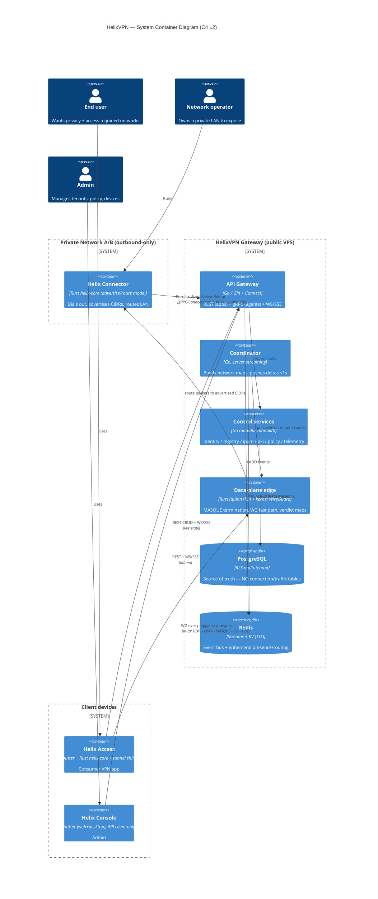
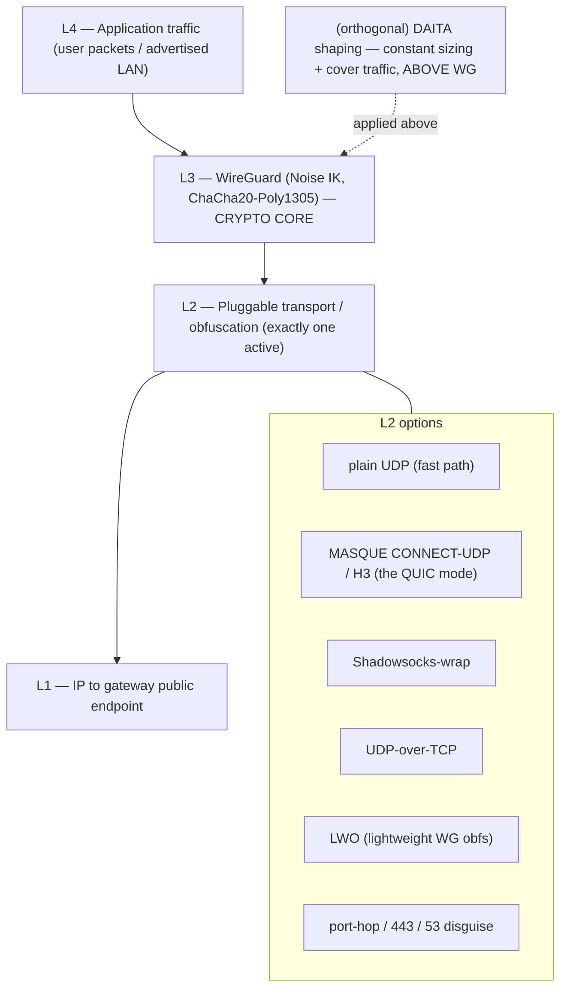
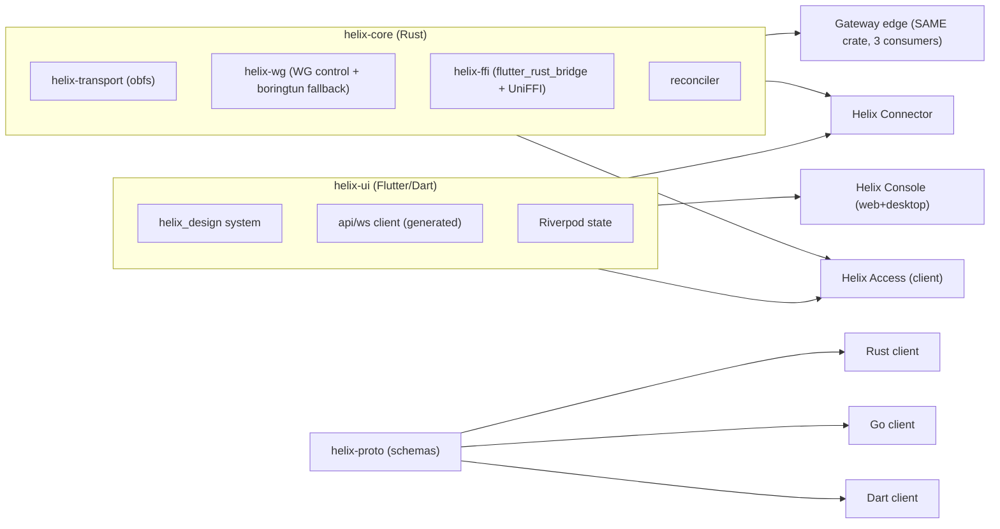
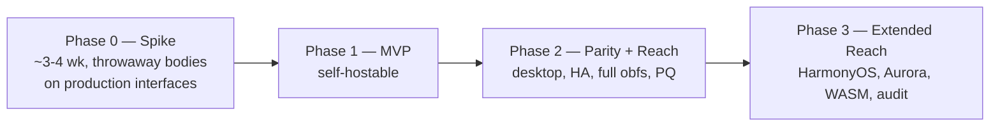

# HelixVPN — Master Technical Specification (spine + index)

**Revision:** 1
**Last modified:** 2026-06-25T00:00:00Z
**Status:** active — authoritative spine for the `docs/research/mvp/final/` document set
**Authority:** This document is the single entry point and architectural spine for HelixVPN. Every other document in `final/` (00..11 + 99) is subordinate to and indexed from here. Where a subordinate document disagrees with this spine on scope, role definitions, the non-negotiable principles (§4), or the decision register (§9), this spine wins until amended per §11.4.73 (spec versioning).
**Evidence base:** Synthesized from 16 source research documents under `docs/research/mvp/` (11 LLM analyses `00,01,02,03,05,06,07,08,09,10,11` + the 5 refined `04_VPN_CLD` documents). Citations use source ids: `[04_ARCH §N]` = `04_VPN_CLD/HelixVPN-Architecture-Refined.md`; `[04_P0]` = Phase0-Spike; `[04_P1]` = Phase1-MVP; `[04_P2]` = Phase2-Parity; `[04_UI]` = helix-ui-Flutter; `[05_YBO]` = mandated-stack brief; `[02_QWN] [01_DSK] [07_GMI] [10_KMI] [11_MST]` etc. = per-LLM analyses; `[SYN]` = cross-document synthesis.

---

## 0. How to read this specification

This is a **specification**, not the product. It describes *what to build and why*, to phase → task → subtask and near-code granularity. It does **not** contain the shipping implementation — that follows in the build phases. Two-to-three refinement passes will iterate on this set.

Reading order for a new engineer:

1. This spine — §1 (what it is) → §3 (roles) → §4 (principles) → §5 (one-screen architecture) → §8 (roadmap) → §9 (decisions).
2. Then the subordinate doc for your area, via the **INDEX (§10)**.
3. The original research for primary-source depth: start with `[04_ARCH]`.

Conventions:

- **MUST / MUST NOT / SHOULD / MAY** carry RFC 2119 force.
- **Open decisions** are never silently resolved; they live in the **Decision Register (§9)** as *options + recommendation* per §11.4.66 / §11.4.101.
- Code blocks are *illustrative interface sketches* (traits, DDL, protobuf, FFI, skeletons), not final implementations.

---

## 1. Executive summary

HelixVPN is a **self-hostable overlay network with a privacy-VPN front end** [04_ARCH §1, SYN §1]. The one-sentence pitch: *Cloudflare Tunnel + WARP, rebuilt as Tailscale-style coordination, with Mullvad's obfuscation stack, fully self-hostable, on one shared codebase.*

The founding constraint [05_YBO, 00]: give remote users full, policy-scoped access to **one or many** internal / home / lab networks **without any inbound port-forward**. Internal hosts dial *outbound* to a public gateway (reverse tunnel); the gateway relays and routes. The headline differentiator over every incumbent: **one user → N joined private networks** (multi-network bidirectional gateway) with per-user ACL routing, *and* Mullvad-grade obfuscation including QUIC/MASQUE, *and* 8-platform reach on one codebase.

The cryptographic core is **WireGuard** everywhere; obfuscation/transport is a **pluggable layer beneath WireGuard** — never a fork of WG crypto [04_ARCH §2/§3]. Mullvad's "QUIC mode" is *not* a separate protocol — it is **WireGuard-over-MASQUE/HTTP-3** [04_ARCH §1, the single most important correction]. That decision drives the entire data-plane design.

The control plane is **Go + Gin + PostgreSQL (RLS) + Redis + Podman (rootless)** [05_YBO, mandated; confirmed by all analyses]. The client/connector/edge share a **Rust core (`helix-core`)**; all three apps share a **Flutter UI (`helix-ui`)**; all language clients are **schema-generated** from `helix-proto` so the codebases never drift [04_ARCH §5/§11].

Privacy is a **build property, not a config toggle**: there is no durable connection/traffic table; CI schema-lint fails the build if one appears [04_ARCH §7, 04_P1].

---

## 2. Product vision

| Axis | Position |
|---|---|
| **Primary buyer** | The self-hoster / home-lab operator / small MSP who runs networks for several clients and wants Mullvad-grade privacy *and* Tailscale-grade coordination *without* a SaaS dependency [SYN §1]. |
| **Stance** | Self-hosted / home-lab **first** (no-logs because *you* own it); the same code serves a managed/multi-tenant offering later. Licensing (source-available + commercial) is an **open decision** — see D8 (§9). |
| **Lead differentiators** | (1) self-hosted **and** Mullvad-grade obfuscation incl. MASQUE/QUIC; (2) **1 user → N networks** bidirectional gateway with ACL routing; (3) genuine **8-platform** reach incl. Aurora + HarmonyOS that no incumbent ships; (4) one shared Rust+Flutter codebase; (5) event-driven real-time control plane (sub-second convergence) [04_ARCH §1.3]. |
| **Prior-art map** | Mullvad (obfuscation bar), Tailscale/Headscale (coordination/network-map model), NetBird (closest OSS shape), Cloudflare Tunnel+WARP (connector-dials-out + MASQUE) — HelixVPN is the self-hosted union [04_ARCH §1.3]. |
| **Non-goals (MVP)** | Browser system-wide VPN (impossible — TUN unavailable in a browser; web = Console + optional in-page WASM MASQUE proxy only [04_ARCH §5.7]); a public managed service (Phase 3+, decision-gated); novel crypto (WireGuard only). |

---

## 3. The three roles and three apps

HelixVPN is defined by **three roles** on a reverse-tunnel hub-and-spoke topology, and **three first-party app classes** that drive them — all from one shared codebase [04_ARCH §1, SYN §1].

| Role | Who runs it | Responsibility | Direction | Reuses |
|---|---|---|---|---|
| **Connector** | Network operator, *inside* a private network | Dials outbound to the gateway, authenticates, **advertises served CIDRs**, routes LAN traffic for authorized clients. The in-network half of "two-way". | Outbound-only | `helix-core` (advertise/route mode) |
| **Gateway** | The public VPS | Rendezvous hub. Runs **control plane** (Go) + **data plane** (Rust edge + kernel WireGuard). Authenticates, holds routing/policy truth, relays/routes between clients and the networks they may reach. | Accepts dials; never initiates into private nets | `helix-core` (edge consumer) + `helix-go` |
| **Client** | End user | Mullvad-style access app. Dials in, gets an overlay IP, reaches its authorized subset of joined networks, or uses the gateway as a plain privacy exit (full-tunnel). | Outbound-only | `helix-core` + `helix-ui` |

| App class | User | Primary jobs | Platforms |
|---|---|---|---|
| **Helix Access** | End user | Connect, pick exit/network, toggle obfuscation, kill-switch, split-tunnel | iOS, Android, Aurora, HarmonyOS, Windows, Linux, macOS (Web limited) [04_ARCH §1.2] |
| **Helix Connector** | Network operator | Onboard a network, advertise CIDRs, set local ACLs, run headless | Linux/Windows/macOS daemon (+ optional Flutter UI); Android/embedded appliance |
| **Helix Console** | Admin | Tenants, users, devices, networks, routes, policies, audit, billing-optional | Web (responsive) + Desktop (same Flutter build; **no `helix-core`**, API client only) |

All three share **one design system, one Dart UI core, one API client**. Access + Connector additionally share **one Rust VPN/transport core** [04_ARCH §1.2/§5.4].

---

## 4. Non-negotiable architectural principles

These are invariant across all phases. Violating any one is a redesign, not a tweak [04_ARCH §2, SYN §7].

1. **Control plane and data plane are strictly separated.** Go services **never** sit in the packet path. If the control plane is down, existing tunnels keep forwarding — **fail-static**.
2. **WireGuard is the cryptographic core; transports are pluggable.** Obfuscation is a swappable layer *under* WireGuard, never a fork of the crypto. (Noise IK, Curve25519, ChaCha20-Poly1305.)
3. **Outbound-only from edges.** Connectors and clients always dial the gateway. No private network ever needs an inbound hole.
4. **Push, don't poll.** State changes propagate over persistent channels as events; agents reconcile to a declared desired-state ("network map", Tailscale `MapResponse`-style). No cron-restart loops.
5. **One core per concern, reused everywhere.** Rust transport/VPN core shared by client, connector, *and* edge. Go domain libs shared across control services. Dart UI core shared across all three apps.
6. **Self-hostable by one person, scalable to many gateways.** One `podman` pod for a homelab; the *same images* scale to HA multi-region.
7. **No-logging by construction.** The data plane keeps only counters + ephemeral routing state. No connection/content logs. Privacy is a **build property**, enforced by CI schema-lint (§10 doc 10).
8. **Schema-first, zero drift.** Protobuf for agent contracts, OpenAPI for REST; Dart/Go/Rust clients are *generated* from `helix-proto`.
9. **Decoupled, reusable components** per constitution §11.4.28/§11.4.74 — each reuse pillar is its own `vasic-digital` repo, snake_case (§11.4.29), flat submodule (§11.4.28), with `upstreams/` (§11.4.36); no nested own-org submodule chains.

---

## 5. One-screen architecture overview

### 5.1 C4-style component view



### 5.2 Data-plane layering (the obfuscation stack)



The transport layer **only changes how the encrypted WG datagrams look on the wire**. Selection is automatic with manual override — the client tries plain WG, and after N failed handshakes escalates LWO → MASQUE/QUIC → Shadowsocks → UoT (Mullvad's exact UX) [04_ARCH §3.2]. Full transport matrix and `Transport` trait → **doc 01-data-plane**.

### 5.3 Reuse map



Three reuse pillars: **Rust core** (client+connector+edge), **Flutter UI** (all apps), **schema-generated clients** (all langs) [04_ARCH §5.5].

---

## 6. Repository & component layout

Each top-level component is a **decoupled, independently reusable** unit → its own `vasic-digital` repo + flat submodule under the umbrella, snake_case, with `upstreams/` recipes (§11.4.28/.29/.36/.74).

```
helixvpn/                         # umbrella
├── helix_core/                   # Rust: WG control, transport, reconciler, FFI    → reusable
│   ├── crates/helix_transport/   #   QUIC/MASQUE, Shadowsocks, UoT, LWO  (client+edge)
│   ├── crates/helix_wg/          #   WireGuard control + boringtun fallback
│   └── crates/helix_ffi/         #   flutter_rust_bridge + UniFFI surface
├── helix_edge/                   # Rust: gateway data-plane edge (uses helix_transport) → reusable
├── helix_go/                     # Go control plane (modular monolith)              → reusable
├── helix_proto/                  # Protobuf + OpenAPI → generated Dart/Go/Rust       → reusable
├── helix_ui/                     # Flutter: design system + screens + 3 flavors      → reusable
│   ├── app_access/  app_connector/  app_console/
├── shims/                        # apple/ android/ windows/ linux/ harmonyos/ aurora/
├── deploy/                       # Podman quadlets, Terraform, Grafana-as-code, helixvpnctl
└── submodules/                   # containers, helix_qa, challenges, docs_chain, security, vision_engine …
```

Helix-ecosystem submodules that the source research predates and the spec **must** wire in [SYN §8]: `containers` (vasic-digital — the §11.4.76 mandated orchestration + on-demand test infra), `helix_qa` + `challenges` (anti-bluff QA/Challenge layer §11.4.27/.5/.69/.107), `docs_chain` (spec-doc + workable-items sync §11.4.106), `security` (§7 tooling), `vision_engine` (video-evidence QA §11.4.107/.158). Each wired or marked not-applicable-with-reason in **doc 05-repo-layout-tooling-and-helix-ecosystem** (deployment/orchestration integration) **and doc 10-testing-acceptance-and-qa** (helix_qa/challenges QA layer).

---

## 7. Cross-cutting contracts (defined once, referenced everywhere)

These three artifacts are the seams every component binds to. They are *summarized* here and *specified in full* in their owning docs.

### 7.1 The `Transport` trait (Rust, owning doc: 01-data-plane)

The single abstraction beneath WireGuard. One implementation, three consumers (client core, connector, edge) [04_ARCH §3.2].

```rust
/// helix_transport: every obfuscation mode implements this.
/// The WG engine sees only a datagram socket; the transport hides how bytes look on the wire.
#[async_trait]
pub trait Transport: Send + Sync {
    /// Stable identifier used by the auto-ladder + telemetry (counts only, never content).
    fn kind(&self) -> TransportKind; // PlainUdp | MasqueH3 | Shadowsocks | UdpOverTcp | Lwo

    /// Establish the obfuscated carrier to `endpoint`. Returns when ready to pass WG datagrams.
    async fn connect(&self, endpoint: &Endpoint, cfg: &TransportCfg) -> Result<TransportConn, TransportError>;

    /// Server side (edge/connector): accept + de-obfuscate, yielding WG datagrams to the WG engine.
    async fn accept(&self, listener: &Listener) -> Result<TransportConn, TransportError>;
}

/// A live carrier: WG datagrams in/out, plus health the auto-ladder reads.
pub trait TransportConn: Send + Sync {
    async fn send(&self, wg_datagram: &[u8]) -> Result<(), TransportError>;
    async fn recv(&self, buf: &mut [u8]) -> Result<usize, TransportError>;
    fn health(&self) -> CarrierHealth; // rtt, loss, handshakes_failed → drives escalation
}
```

### 7.2 The `WatchNetworkMap` stream (protobuf, owning doc: 02-control-plane)

The push-based desired-state spine. Every agent opens it once; polling is abolished [04_ARCH §4.2/§4.4, 04_P1].

```protobuf
syntax = "proto3";
package helix.coordinator.v1;

service Coordinator {
  // Agent opens once; receives a full snapshot then a delta stream. Peers are ALREADY policy-filtered
  // (need-to-know) — an agent never learns of peers it may not reach.
  rpc WatchNetworkMap(WatchRequest) returns (stream NetworkMapEvent);
}

message WatchRequest {
  string device_id = 1;        // mTLS-bound; coordinator re-checks identity
  uint64 known_version = 2;    // 0 = send full snapshot; else resume from delta
}

message NetworkMapEvent {
  oneof body {
    Snapshot snapshot = 1;     // overlay_ip, allowed_peers, routes, transport_policy, dns, killswitch
    Delta    delta    = 2;     // minimal change set for THIS agent
  }
  uint64 version = 3;          // monotonic; convergence SLO: p99 < 1s
}
```

### 7.3 The FFI surface (`helix-ffi`, owning doc: 03-client-core-and-ui)

The Dart↔Rust boundary. Dart drives the core and consumes a status stream; UI state is a *pure function* of that stream [04_UI, 04_ARCH §5.1].

```rust
// helix_ffi (flutter_rust_bridge v2). Mirrors to UniFFI for native shims.
pub fn helix_start(cfg: ClientConfig) -> Result<(), HelixError>;
pub fn helix_stop() -> Result<(), HelixError>;
pub fn helix_set_exit(selection: ExitSelection) -> Result<(), HelixError>; // network | privacy-exit
pub fn helix_pin_transport(kind: Option<TransportKind>) -> Result<(), HelixError>; // None = auto-ladder
/// Hot stream the UI subscribes to; every state change pushes here.
pub fn helix_status_stream(sink: StreamSink<HelixStatus>); // Disconnected|Connecting(TransportKind)|Connected|Reconnecting|Failed
```

---

## 8. Phase roadmap (the spine of phase → task → subtask)

Four phases, each with **hard exit gates**. A phase MUST NOT be declared complete until **every** gate passes with captured anti-bluff evidence (§11.4.5/.69/.107). Detailed task/subtask breakdowns live in the per-phase docs (00/01/.../11) and become **workable items** in the SQLite single-source-of-truth DB (§11.4.93/.95).



### 8.0 Phase 0 — Spike (prove the hard parts) [04_P0]

Throwaway *bodies* on *production interfaces* — the surviving artifacts are the **interfaces**: the `Transport` trait, the `helix-wg` boringtun wrapper, the orchestrator + status enum, the FFI surface. Test rig: Linux netns + nftables DPI sim + `tc netem` loss/jitter. Milestones S0–S8.

**Exit gates (ALL must pass):**

| Gate | Assertion | Evidence |
|---|---|---|
| **G1** | Plain-UDP WireGuard: client → gateway → connector LAN host, **≥80% of bare-link throughput** | iperf3 capture, netns rig |
| **G2** | MASQUE/QUIC tunnel survives a **DPI UDP block**, **≥50% of plain-WG throughput** | nftables block + throughput capture |
| **G3** | **iOS `NEPacketTunnelProvider` runs the Rust core under the memory ceiling with ≥30% headroom** (make-or-break — the reason core is Rust) | on-device RSS profile |
| **G4** | **Go-vs-Rust edge benchmark** decides D5 (MASQUE termination language) | head-to-head throughput/CPU/p99 capture |
| **G5** | `flutter_rust_bridge` FFI drives the core from Dart end-to-end | Flutter harness + status stream log |
| **G6** | Push-based reconcile from a **static** network map converges with zero polling | reconciler trace |

Gate G3 failure ⇒ revisit D2 (core language); G2 failure ⇒ MASQUE library/transport rework before MVP. Owning doc: **00 + 06 + 02**.

### 8.1 Phase 1 — MVP (self-hostable) [04_P1]

Go modular monolith (`identity / registry / ipam / pki / policy / coordinator / events / telemetry / api / store`); Postgres + RLS (no connection/traffic tables — CI-lint enforced); protobuf `Coordinator.WatchNetworkMap` over Connect; coordinator with in-mem topology graph + minimal deltas (**p99 convergence < 1s**); Redis Streams backbone; identity (OIDC + anonymous device tokens) + enrollment (device-generated WG keypair, **private key never leaves device**) + short-lived mTLS device cert + **revoke < 1s**; policy compiler (Tailscale-ACL-flavored, **default-deny, fail-closed** → `AllowedIPs` + nftables/eBPF verdict maps); Gin REST + WS/SSE; `helixvpnctl` (Cobra) + Podman quadlets; hub-and-spoke data path; auto obfuscation ladder (plain / LWO / MASQUE).

**Exit gate = the 8 MVP acceptance criteria (Definition of Done) [04_P1]:**

1. Self-host from zero (one `helixvpnctl init` on a clean VPS).
2. Enroll a connector **and** a client.
3. Client reaches an **authorized** LAN host **and** is **denied** an unauthorized one (default-deny proven).
4. **Auto-escalate to MASQUE** when plain WG is blocked.
5. Policy edit reflected **< 1s, no restart**.
6. Device revoke enforced **< 1s**.
7. Kill-switch **+** DNS-leak protection verified (no leak on tunnel drop).
8. **No durable connection log** exists (schema-lint green) **and** all three apps drive the system.

Owning docs: **00/01/03/04/05/06/07/09/10**.

### 8.2 Phase 2 — Parity + Reach [04_P2]

Full transport set (+Shadowsocks, UDP-over-TCP, hardened LWO; auto-ladder with **per-network memory + regional priors**); **DAITA via maybenot**; **direct P2P + NAT traversal** (STUN-like discovery, hole punching, DERP-style `helix-relay` fallback); **multi-hop** nested WG (entry/exit key separation); **post-quantum** handshake (ML-KEM/FIPS-203 PSK, **hybrid never PQ-only**; Rosenpass as alt); desktop apps (Windows `wireguard-nt` + privileged service; macOS Network Extension); policy-as-code / GitOps; HA + multi-region (stateless coordinators, Patroni Postgres, **NATS JetStream** — the D3 Phase-2 swap).

**Exit gates:** full Mullvad feature-parity matrix green [04_ARCH §6]; multi-hop + P2P + relay-fallback proven across a real NAT; PQ handshake interops + measured; failover < 30s with transport preserved; desktop apps pass the same 8 MVP DoD criteria.

### 8.3 Phase 3 — Extended Reach [04_P2 §12, 04_ARCH §12]

**HarmonyOS NEXT** (OpenHarmony SIG Flutter fork, Network Kit ability — biggest platform risk, real native tunnel-shim work) + **Aurora OS** (OMP Russia Flutter fork, Qt/C++ + tun; Russian-hosted toolchain → enterprise SKU); **WASM browser MASQUE proxy** (browser-scoped, *not* a system VPN); multi-tenant Console + audit + optional billing; **third-party security audit + reproducible builds**.

**Exit gates:** Access app builds + tunnels on HarmonyOS NEXT and Aurora (on-device evidence); web WASM proxy reaches a joined network from the browser; independent audit report + reproducible-build attestation.

---

## 9. Decision register (open decisions — options + recommendation)

Surfaced explicitly per §11.4.66 / §11.4.101 — **not** silently resolved. The refined `04_VPN_CLD` docs pivoted to one camp; the broader 10-LLM consensus sometimes differs [SYN §3]. Each is a tracked workable item; the gate that resolves it is named.

| # | Decision | Camp A | Camp B | Recommendation | Resolved by |
|---|---|---|---|---|---|
| **D1** | Primary obfuscating transport | **MASQUE/QUIC** = WG-over-HTTP-3 (RFC 9298/9297/9221) — Mullvad's *actual* mechanism [04_ARCH §3.3, 04_P0] | **Hysteria2 + Salamander** (turnkey QUIC+obfs) primary, WG fallback [plurality of 10 analyses] | **MASQUE primary** for true Mullvad parity + single Rust impl; keep Hysteria2 tuning knobs as `quinn` reference. Note: "Mullvad QUIC ≠ separate protocol, it IS WG-over-MASQUE" [04_ARCH §1]. | doc 01-data-plane + gate G2 |
| **D2** | Shared client-core language | **Rust** core + Flutter UI [04_*, plurality] | **Go** core + Flutter UI (reuses Hysteria2 Go) [01_DSK, 07_GMI] | **Rust** — wins on iOS NE memory ceiling + WASM. CLD = Rust. | **G3** |
| **D3** | Event bus | **Redis Streams** (MVP) → NATS JetStream (scale) [04_P1, 02_QWN, 11_MST] | **NATS JetStream** from start [01_DSK, 10_KMI] | **Redis Streams MVP, NATS Phase 2** — taxonomy is bus-agnostic, swap is transport-only. | doc 02-control-plane |
| **D4** | IP-subnet collision across N RFC1918 nets | **IPv6 ULA /48 per tenant + Tailscale 4via6** [04_ARCH §3.4] | **CGNAT 100.64/10 1:1 per network** [07_GMI, 10_KMI] | **4via6** for scale + clean overlay; hide the mapping behind Console UX. A **v1 must-decide**. | doc 01-data-plane (addressing) / doc 04-security-privacy-pki (IPAM/policy) |
| **D5** | Gateway edge language (MASQUE termination) | **Rust** (`quinn`+`h3`, shares `helix-transport` byte-for-byte) [04_P0 G4] | **Go** (`quic-go` + `masque-go` turnkey) | **Rust** if G4 benchmark holds — single-implementation guarantee; else Go acceptable. | **G4** |
| **D6** | Transport topology | single protocol end-to-end | **asymmetric per-leg**: Hysteria2/QUIC user↔gateway, WireGuard gateway↔networks [11_MST] | **Surface MST's best-fit-per-leg** as a Phase-2 option; MVP keeps WG end-to-end with pluggable transport. | doc 01-data-plane |
| **D7** | MVP ambition | lean tunnel-first (CLI between 2 hosts → API → apps) [02_QWN, 01_DSK, 04_P0] | full ecosystem / "Connectivity-OS" from v1 [10_KMI, 03_ZAI] | **Lean Phase-0 spike then MVP**; defer the ecosystem to Phase 2/3. | §8 roadmap |
| **D8** | Licensing / positioning | source-available + commercial | pure OSS | **Decide before public release** [04_ARCH §13]; same code serves self-host + managed. | pre-Phase-3 |

---

## 10. INDEX — the `final/` document set

This spine is `SPECIFICATION.md`. Every other document below is an actual sibling file under `docs/research/mvp/final/`. Each carries its own §11.4.44 revision header; `.html`/`.pdf`(/`.docx`) exports per §11.4.65/.153 + `docs_chain` sync (§11.4.106) are a deferred pass-2 deliverable (see `REFINEMENT_NOTES.md`). The **Glossary** is §11 of this spine; the **live Decision Register** is §9 of this spine; the **source-coverage ledger** is doc 99.

| Doc | File | Scope | Owns |
|---|---|---|---|
| **00** | `00-product-scope-and-principles.md` | Product definition (is/is-not), personas, the three roles + three apps, two-way + multi-network model, self-host vs managed + licensing, in/out scope per phase, the 7 non-negotiable principles, the Mullvad-parity feature matrix, and the open decisions **D1–D8** with recommendations | Requirements; principles; decision register |
| **01** | `01-data-plane.md` | Rust data plane: the `Transport` trait, transport matrix (plain UDP, MASQUE CONNECT-UDP `quinn`+`h3`, CONNECT-IP, Shadowsocks, UoT, LWO, Hysteria2 option), `helix-wg` boringtun wrapper, orchestrator + status enum, auto-escalation ladder, routing (ULA /48, 4via6), default-deny ACL → AllowedIPs + nftables/eBPF, multi-hop nested WG, MTU | **D1, D6**; the `Transport` trait |
| **02** | `02-control-plane.md` | Go modular monolith, full Postgres DDL + RLS, the protobuf `Coordinator` service + `WatchNetworkMap` streaming, coordinator brain (in-mem graph, minimal deltas, <1s SLO), Redis Streams backbone + taxonomy + XAUTOCLAIM DLQ, Gin REST + WS/SSE + Connect API surface, reconciliation flow | **D3**; data model; `WatchNetworkMap`; event bus |
| **03** | `03-client-core-and-ui.md` | `helix-core` FFI surface (`start/stop/status_stream`, `TunnelStatus`), Flutter `helix-ui` (`helix_design` system, Riverpod, 3 flavors via `runHelixApp`), per-platform `TunnelPlatform` shims (Apple NE, Android VpnService+JNI, Windows wireguard-nt+service, Linux, HarmonyOS, Aurora, Web-none), memory/size budgets, Melos monorepo | **D2**; FFI; UI/design system; platform shims |
| **04** | `04-security-privacy-pki.md` | Zero-trust default-deny, identity (OIDC + anon device tokens), enrollment + PKI (device keygen, key-never-leaves, short-lived mTLS, revoke<1s), key hierarchy/rotation, edge hardening, no-logging-as-code + CI schema-lint, kill-switch/DNS-leak state machine, post-quantum handshake, threat model | Security/privacy invariants; PKI |
| **05** | `05-repo-layout-tooling-and-helix-ecosystem.md` | Monorepo layout, the planned decoupled `vasic-digital` component repos (deferred), schema-first codegen, `helixvpnctl`, deployment as Podman quadlets **+ Docker Compose + Kubernetes** manifests, and integration of the incorporated `submodules/` (containers §11.4.76, helix_qa+challenges, docs_chain, security, vision_engine) | Repo layout; deploy; ecosystem |
| **06** | `06-phase0-spike-wbs.md` | Phase 0 Spike work-breakdown: gates G1–G6, milestones S0–S8 → tasks → subtasks (`HVPN-P0-NNN`), iOS-memory harness, Go-vs-Rust edge benchmark, netns+nftables-DPI+netem rig | Phase 0 execution plan |
| **07** | `07-phase1-mvp-wbs.md` | Phase 1 MVP work-breakdown (`HVPN-P1-NNN`), the 8-criterion MVP Definition-of-Done + SLOs as acceptance gates | Phase 1 execution plan |
| **08** | `08-phase2-parity-wbs.md` | Phase 2 Parity+Reach work-breakdown (`HVPN-P2-NNN`): full transport set, DAITA, P2P/NAT-traversal, multi-hop, PQ, desktop apps, GitOps, HA/multi-region | Phase 2 execution plan |
| **09** | `09-phase3-reach-wbs.md` | Phase 3 Extended-Reach work-breakdown (`HVPN-P3-NNN`): HarmonyOS NEXT, Aurora OS, WASM MASQUE proxy, billing-optional multi-tenant, third-party audit + reproducible builds | Phase 3 execution plan |
| **10** | `10-testing-acceptance-and-qa.md` | Anti-bluff QA strategy covering every §11.4.169 mandatory test type (unit/integration/e2e/full-automation/Challenges/HelixQA/DDoS/security/stress+chaos/concurrency/race/memory/benchmark), `helix_qa`+`challenges` integration, captured-evidence, per-phase acceptance gates, local-only enforcement (§11.4.156) | QA strategy; test-type coverage |
| **11** | `11-deep-research-appendix.md` | Cited external research per angle (wireguard, masque, hysteria2, mullvad, flutter_ffi, ios_android, go_cp, podman_k8s, pki_pq_nat, daita_test). **Pass-1 status: facts marked `UNVERIFIED` — the web-research phase was rate-limited; pass 2 re-runs it (see `REFINEMENT_NOTES.md` R1).** | External-source bibliography |
| **99** | `99-source-coverage-ledger.md` | Source-coverage proof: every one of the 16 source docs → which final/ doc(s) absorbed it + its unique contribution; honestly-disclosed gaps (§11.4.118) | Coverage proof |
| **—** | `REFINEMENT_NOTES.md` | Pass-1 → pass-2/3 punch-list: what's fixed, the open consistency worklist (R1–R6), and the deferred deliverables (repos, workable-items DB, exports) | The refinement plan |

---

## 11. Glossary

| Term | Definition |
|---|---|
| **Connector** | First-party agent inside a private network; dials outbound to the gateway, advertises CIDRs, routes LAN traffic for authorized clients [04_ARCH §1.1]. |
| **Gateway** | Public VPS running control plane (Go) + data-plane edge (Rust + kernel WG); the rendezvous hub. |
| **Client** | End-user access app; gets an overlay IP, reaches authorized networks or uses the gateway as a privacy exit. |
| **Overlay IP** | Stable per-node address in the tenant overlay (ULA IPv6 `/48` per tenant; advertised IPv4 LANs mapped via 4via6) [04_ARCH §3.4]. |
| **Network map** | Per-agent desired-state document (overlay IP, *policy-filtered* peers, routes, transport policy, DNS, kill-switch posture) pushed over `WatchNetworkMap` [04_ARCH §4.4]. |
| **MASQUE** | RFC 9298 CONNECT-UDP over HTTP/3 — the mechanism that wraps WireGuard datagrams to look like web traffic. The "QUIC mode" [04_ARCH §3.3]. |
| **LWO** | Lightweight WG obfuscation — cheap XOR/padding scheme to evade naive WG signature blocks [04_ARCH §3.2]. |
| **DAITA** | Defence Against AI-guided Traffic Analysis — constant packet sizing + cover traffic applied *above* WG (maybenot-style state machine) [04_ARCH §3.1/§6]. |
| **4via6** | Tailscale-style scheme mapping advertised IPv4 LANs into the tenant's ULA IPv6 space so overlapping RFC1918 ranges never collide [04_ARCH §3.4]. |
| **Auto-ladder** | Client transport escalation: plain UDP → LWO → MASQUE/QUIC → Shadowsocks → UoT, driven by handshake-failure events [04_ARCH §3.2]. |
| **fail-static** | Property that existing tunnels keep forwarding when the control plane is down [04_ARCH §2]. |
| **Verdict map** | nftables/eBPF map compiled from the policy that grants/denies per-peer reachability at the edge [04_ARCH §3.4]. |
| **RLS** | PostgreSQL Row-Level Security — enforces tenant isolation at the database, not just the app layer [04_ARCH §4.5]. |
| **No-logging-as-code** | Architectural guarantee: no durable connection/traffic table exists; CI schema-lint fails the build if one appears [04_ARCH §7]. |
| **`helix-core`** | Rust data-plane core shared by client, connector, and edge (WG control, transport, reconciler, FFI). |
| **`helix-transport`** | Rust crate implementing the `Transport` trait — one obfuscation implementation, three consumers. |
| **`WatchNetworkMap`** | Server-streaming RPC: snapshot + delta stream of desired state; replaces all polling [04_ARCH §4.2]. |
| **PWU** | Parallel Work Unit — a self-contained workable item in the §11.4.58/.93 execution model. |

---

## 12. Provenance & change control

- **Sources:** 16 research documents under `docs/research/mvp/` (see citation key in metadata block). Primary architectural source: `[04_ARCH]`. Cross-cutting synthesis: `[SYN]` (`v09-research/_SYNTHESIS.md`).
- **Versioning (§11.4.73):** primary version bumps for major rewrites (this is V1); `Revision` bumps for additive refinements. This spine is `Revision 1`.
- **Sync (§11.4.106):** `.html`/`.pdf` exports of this and every `final/` doc kept in lockstep via `docs_chain`.
- **Decision discipline (§11.4.66/.101):** open decisions live in §9 + doc 99, never silently resolved.
- **Anti-bluff (§11.4.5/.69/.107):** every phase exit gate requires captured evidence; no gate passes on metadata/config-only signal.

*End of master spine. Subordinate documents 00–11 + 99 elaborate each area to phase → task → subtask and near-code granularity.*
