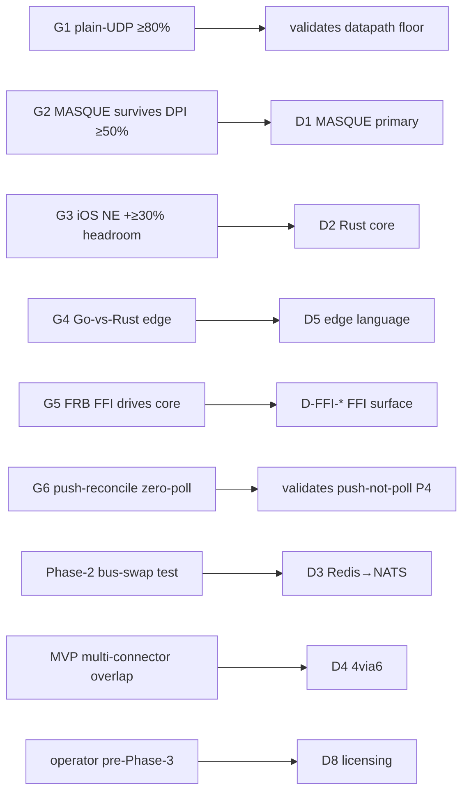

# HelixVPN — Master Decision Register (expanded)

**Revision:** 2
**Last modified:** 2026-06-26T12:00:00Z
**Status:** active — Volume 0 (Spine, meta & governance) nano-detail document
**Rev 2:** Added the §0-mandated explicit reversal line to the seven §4 decisions that lacked one (D-AC-1, D-OPENAPI-AUTHORING, D-CODEGEN-TRACK, D-K8S-EDGE-INGRESS, D-K8S-PG-HA, D-GW-SELECT, D-DESIGN-EXTRACT); fixed the §1 D4 "Resolved by" cross-ref `doc 04/svc-ipam.md` → `v03-control-plane/svc-ipam.md` (svc-ipam.md is a Volume-3 doc).
**Authority:** Subordinate to [`../SPECIFICATION.md`](../SPECIFICATION.md) §9 (the spine decision register D1–D8, which this document expands). Where this register disagrees with the spine on a spine decision's camps or recommendation, the spine wins until amended per §11.4.73. The expansion-surfaced decisions (the `D-…` family) are owned by their volume docs and consolidated here per §11.4.66/.101 (no decision silently resolved).

> **Document role.** The single consolidated decision register for the whole
> HelixVPN `final/` set. It (1) expands the eight spine decisions **D1–D8** with
> the full options, rationale, the gate/evidence that resolves each, and reversal
> criteria; and (2) catalogues every **expansion-surfaced decision** (`D-…`) the
> nano-detail volumes raised — PKI CA tiering, audit enum, codegen tracking, K8s
> ingress/PG-HA, gateway selection, the OpenDesign reconciliation, the repo/design
> extraction timing, and the per-platform/per-client/per-FFI choices — each with
> its owning doc, recommendation, and reversal trigger. Per §11.4.6 no decision is
> presented as settled when the spine marks it open; per §11.4.101 an irreversible /
> high-blast-radius decision is operator-gated and named as such.

---

## Table of contents

- [0. How a decision is recorded](#0-how-a-decision-is-recorded)
- [1. Spine decisions D1–D8 (the master register)](#1-spine-decisions-d1d8-the-master-register)
- [2. Spine decisions — per-decision detail](#2-spine-decisions--per-decision-detail)
- [3. Expansion-surfaced decisions (the `D-…` family) — index](#3-expansion-surfaced-decisions-the-d-family--index)
- [4. Expansion-surfaced decisions — per-decision detail](#4-expansion-surfaced-decisions--per-decision-detail)
- [5. The gate → decision resolution map](#5-the-gate--decision-resolution-map)
- [6. Reversal-criteria summary (when a settled call re-opens)](#6-reversal-criteria-summary-when-a-settled-call-re-opens)
- [Sources verified](#sources-verified)

---

## 0. How a decision is recorded

Per §11.4.66 (interactive-clarification / options-not-free-text) and §11.4.101
(autonomous-decision-over-blocking), every open or surfaced decision carries six
fields:

| Field | Meaning |
|---|---|
| **ID** | `Dn` (spine) or `D-…` (expansion-surfaced), stable. |
| **Decision** | the one-sentence question. |
| **Options** | the mutually-exclusive camps/choices (Camp A / Camp B / a/b/c). |
| **Recommendation** | the current best call (which may be "defer", "both", or a safe default per §11.4.101). |
| **Resolved by** | the named gate (G1–G6), benchmark, or owning doc + operator trigger that converts the recommendation into a binding fact. |
| **Reversal criteria** | the captured evidence that re-opens a settled call (§11.4.6 — a settled call is never silently un-settled; §11.4.7 demotion needs same-conditions evidence). |

A recommendation is **not** a resolution: a decision is resolved only when its
*Resolved by* gate produces captured evidence (§11.4.5/.69/.107) or its operator
trigger fires. Decisions with an irreversible / high-blast-radius action (D8
licensing, repo creation, force-history) are operator-gated (§11.4.101 / §11.4.113).

---

## 1. Spine decisions D1–D8 (the master register)

Reproduced from [SPEC §9] with the resolution gate and reversal criteria made
explicit. The camps are the source-research camps ([99] decision cross-check).

| # | Decision | Camp A | Camp B | Recommendation | Resolved by | Reversal criteria |
|---|---|---|---|---|---|---|
| **D1** | Primary obfuscating transport | **MASQUE/QUIC** = WG-over-HTTP-3 (RFC 9298/9297/9221) — Mullvad's actual mechanism | **Hysteria2 + Salamander** turnkey QUIC+obfs primary, WG fallback | **MASQUE primary** for true Mullvad parity + single Rust impl; keep Hysteria2 knobs as a `quinn` reference | doc 01 + **gate G2** (MASQUE survives DPI ≥50% plain-WG) | G2 fails to reach ≥50% AND a Hysteria2 `quinn` build measurably beats it under the same DPI sim |
| **D2** | Shared client-core language | **Rust** core + Flutter UI | **Go** core + Flutter UI (reuses Hysteria2 Go) | **Rust** — wins on iOS NE memory ceiling + WASM | **gate G3** (iOS NE runs the Rust core with ≥30% headroom) | G3 fails: Rust cannot fit the iOS NE ceiling with headroom → D2 and the whole client strategy re-open |
| **D3** | Event bus | **Redis Streams** (MVP) → NATS JetStream (scale) | **NATS JetStream** from start | **Redis Streams MVP, NATS Phase 2** — the taxonomy is bus-agnostic, swap is transport-only | doc 02 (`svc-events.md`) + a Phase-2 bus-swap integration test | a homelab-scale Redis Streams build cannot hold the convergence SLO at MVP scale (would pull NATS earlier) |
| **D4** | Overlapping-RFC1918 collision across N nets | **IPv6 ULA /48 per tenant + 4via6** | **CGNAT 100.64/10 1:1 per network** | **4via6** for scale + clean overlay; hide the mapping behind Console UX (a v1 must-decide) | doc 01 (routing) + `v03-control-plane/svc-ipam.md` + an MVP multi-connector overlap test | 4via6 client/OS support proves inadequate on a target platform → fall back to documented per-network NAT (FR-303 already provisions it) |
| **D5** | Gateway-edge language (MASQUE termination) | **Rust** (`quinn`+`h3`, shares `helix-transport` byte-for-byte) | **Go** (`quic-go` + `masque-go` turnkey) | **Rust** if G4 holds — single-implementation guarantee; else Go acceptable | **gate G4** (Go-vs-Rust edge head-to-head: throughput/CPU/p99) | G4 shows Go materially ahead on edge throughput/CPU AND the single-impl reuse benefit is judged not worth the gap |
| **D6** | Transport topology | single protocol end-to-end | **asymmetric per-leg** (Hysteria2/QUIC user↔gateway, WG gateway↔networks) | surface MST's best-fit-per-leg as a **Phase-2 option**; MVP keeps WG end-to-end with pluggable transport | doc 01 + `svc-coordinator.md` per-leg transport policy (Phase-2) | a per-leg deployment measurably beats end-to-end WG under real DPI without breaking the single-`helix-transport` reuse |
| **D7** | MVP ambition | lean tunnel-first (CLI 2-host → API → apps) | full ecosystem / "Connectivity-OS" from v1 | **Lean Phase-0 spike then MVP**; defer the ecosystem to Phase 2/3 | §8 roadmap (the phase gates themselves) | operator re-scopes the program (a §11.4.66 decision), not an evidence trigger |
| **D8** | Licensing / positioning | source-available + commercial | pure OSS | **decide before public release**; same code serves self-host + managed | pre-Phase-3 **operator decision** (§11.4.101 — irreversible/high-blast-radius) | n/a until the operator decides; the choice is reversible only at high cost once public, hence the pre-release gate |

---

## 2. Spine decisions — per-decision detail

### D1 — Primary obfuscating transport

- **The question.** Which transport is the *primary* censorship-evasion carrier under WireGuard?
- **Why it matters.** This is the single decision that defines whether HelixVPN reaches genuine Mullvad parity. The pivotal correction (`[04_ARCH §1]`): **Mullvad's "QUIC mode" is not a separate protocol — it IS WireGuard-over-MASQUE/HTTP-3.** Choosing MASQUE is choosing Mullvad's *actual* mechanism, not an analogue.
- **Camp A (MASQUE/QUIC, recommended).** WG datagrams ride RFC 9298 CONNECT-UDP over HTTP/3, framed to look like web traffic. One Rust `helix-transport` impl serves client + edge. (`v02-data-plane/transport-masque-quic.md`)
- **Camp B (Hysteria2+Salamander).** A turnkey QUIC+obfs protocol the plurality of the 10 analyses favoured for speed-to-ship; HelixVPN keeps its tuning knobs as a `quinn` reference rather than adopting the protocol. (08; 99)
- **Resolved by.** Gate **G2** — MASQUE survives an nftables UDP block at ≥50% of plain-WG throughput (`UNVERIFIED` until captured). (06; HVPN-NFR-002)
- **Reversal.** A captured G2 failure to clear ≥50% *and* a head-to-head where a Hysteria2-tuned `quinn` build clears the bar the MASQUE framing could not, under the same DPI sim (§11.4.7 same-conditions evidence).

### D2 — Shared client-core language

- **The question.** Rust or Go for the `helix-core` shared by client + connector + edge?
- **Why it matters.** The iOS `NEPacketTunnelProvider` memory ceiling (historically ~15 MB) is the hardest constraint in the whole product (HVPN-NFR-500); Go's runtime/GC footprint is the risk. WASM reach (browser MASQUE proxy) also favours Rust.
- **Camp A (Rust, recommended; CLD chose it).** Fits the NE ceiling, compiles to WASM, gives byte-for-byte client↔edge reuse. (03)
- **Camp B (Go).** Reuses Hysteria2's Go implementation, single-language with the control plane (DSK/GMI/GCT). (99)
- **Resolved by.** Gate **G3** (make-or-break) — on-device RSS profile shows ≥30% headroom under the NE ceiling. The overview names G3 as the literal decider for D2.
- **Reversal.** G3 captured failure: if Rust cannot fit the NE ceiling with headroom, **D2 and the entire client strategy re-open** (the program's pivot, HVPN-NFR-500).

### D3 — Event bus

- **The question.** Redis Streams or NATS JetStream for the real-time event backbone?
- **Why it matters.** Convergence (p99 < 1s) rides the bus; but the bus is behind a transport-agnostic interface, so the choice is a transport swap, not a redesign.
- **Camp A (Redis MVP → NATS scale, recommended).** Redis Streams + consumer groups + `XAUTOCLAIM` DLQ for the single-node MVP; swap to NATS JetStream at multi-region scale. (`v03-control-plane/svc-events.md`; restated at the wiring layer in `architecture-and-wiring.md` §)
- **Camp B (NATS from start).** DSK/KMI; avoids the later swap at the cost of MVP heft.
- **Resolved by.** doc 02 fixes the MVP bus; a Phase-2 bus-swap integration test (HVPN-NFR-108) proves the interface is genuinely transport-agnostic.
- **Reversal.** A homelab-scale Redis Streams build that cannot hold the convergence SLO would pull NATS earlier (captured load evidence).

### D4 — Overlapping-RFC1918 collision

- **The question.** How does one user reach N networks that all expose e.g. `192.168.1.0/24` without collision?
- **Camp A (ULA /48 + 4via6, recommended).** Each tenant gets an IPv6 ULA /48; advertised IPv4 LANs map into it via 4via6, so overlapping ranges become distinct address spaces; per-network NAT is the documented fallback (FR-303 provisions it). (`v02-data-plane/routing-and-addressing.md`; `v03-control-plane/svc-ipam.md`)
- **Camp B (CGNAT 100.64/10 1:1).** GMI/KMI; a per-network 1:1 map in the shared CGNAT space.
- **Resolved by.** doc 01 (routing) + `svc-ipam.md` + an MVP multi-connector overlap test (FR-302). A **v1 must-decide** — the recommendation is binding for MVP.
- **Reversal.** 4via6 proves inadequate on a target platform/OS → fall back to the already-provisioned per-network NAT path.

### D5 — Gateway-edge language

- **The question.** Rust or Go to *terminate* MASQUE at the gateway edge?
- **Camp A (Rust, recommended if G4 holds).** `quinn`+`h3` shares the client's `helix-transport` byte-for-byte (one obfuscate/de-obfuscate implementation).
- **Camp B (Go).** `quic-go`+`masque-go` turnkey, faster to integrate.
- **Resolved by.** Gate **G4** — Go-vs-Rust edge head-to-head (throughput/CPU/p99). Rust wins unless Go is materially ahead.
- **Reversal.** G4 shows Go materially ahead *and* the single-impl reuse benefit is judged not worth the gap (a captured-benchmark + judgment call).

### D6 — Transport topology

- **The question.** One protocol end-to-end, or best-fit per leg?
- **Camp A (single protocol, MVP).** WG end-to-end with the pluggable transport.
- **Camp B (asymmetric per-leg, Phase-2 option).** Hysteria2/QUIC user↔gateway, plain WG gateway↔connector (11_MST's largest analysis).
- **Resolved by.** doc 01 + `svc-coordinator.md` per-leg transport policy (the coordinator already sets per-node transport policy, so per-leg is a Phase-2 config, not a redesign).
- **Reversal.** A per-leg deployment measurably beats end-to-end WG under real DPI without breaking the single-`helix-transport` reuse guarantee.

### D7 — MVP ambition

- **The question.** Lean tunnel-first MVP, or full "Connectivity-OS" from v1?
- **Recommendation.** Lean Phase-0 spike → MVP; defer the ecosystem to Phase 2/3 (the roadmap §8 is the resolution).
- **Reversal.** Operator re-scopes the program (a §11.4.66 scope decision, not an evidence trigger).

### D8 — Licensing / positioning

- **The question.** Source-available + commercial, or pure OSS?
- **Recommendation.** Decide before public release; the same code serves self-host + managed either way (`[04_ARCH §13]`).
- **Resolved by.** A **pre-Phase-3 operator decision** — irreversible/high-blast-radius once public, so operator-gated per §11.4.101 (the agent does not pick a license autonomously).
- **Reversal.** Effectively one-way once the public license ships; hence the pre-release gate.

---

## 3. Expansion-surfaced decisions (the `D-…` family) — index

These were raised by the nano-detail volume docs during expansion and are owned by
those docs; they are consolidated here (never silently resolved) per §11.4.66/.101.
Each composes with — and none overrides — the spine register D1–D8.

| ID | Decision | Recommendation | Owning doc | Status |
|---|---|---|---|---|
| **D-PKI-CA-TIER** | CA topology | single online issuing CA under an offline/KMS root (spine option B) | `v05-security/pki-and-certs.md` §2.1 | recommended (MVP default) |
| **D-AC-1** | `auth.login`/`auth.enroll.denied` audit rows | reconcile-before-tag: pick add-to-enum vs defer, align master §7 | `v05-security/audit-and-compliance.md` §13.1 | open (reconcile before tag) |
| **D-AC-2** | tamper-evident audit hash chain | Phase-2 additive (append-only grant is the MVP floor) | `v05-security/audit-and-compliance.md` §13.1 | recommended (B) |
| **D-AC-3** | audit retention default | no auto-prune (operator-driven) | `v05-security/audit-and-compliance.md` §13.1 | recommended (A) |
| **D-AC-4** | SIEM connector | generic REST/WS in MVP; named connectors Phase-2 | `v05-security/audit-and-compliance.md` §13.1 | recommended (B) |
| **D-KS-1** | off-tunnel DoH-on-443 posture | accept default + document the split-tunnel residual; MDM disable for managed | `v05-security/kill-switch-and-dns-leak.md` §12.1 | recommended (A default, B managed) |
| **D-KS-2** | Android lockdown enforcement | both layers (core kill-switch always on + surface OS-lockdown prompt) | `v05-security/kill-switch-and-dns-leak.md` §12.1 | recommended (both) |
| **D-KS-3** | iOS extension-restart leak guarantee | measure on-device, mark `UNVERIFIED` until proven (G3/SC) | `v05-security/kill-switch-and-dns-leak.md` §12.1 | recommended (B) |
| **D-CODEGEN-TRACK** | track vs gitignore generated clients | gitignore; `make gen` is the §11.4.77 regeneration mechanism | `v06-deploy/codegen-pipeline.md` | binding (Volume-6) |
| **D-OPENAPI-AUTHORING** | spec-first vs code-first OpenAPI | spec-first (hand-authored contract; handlers validate against it) | `v06-deploy/codegen-pipeline.md` | binding (Volume-6) |
| **D-CODEGEN-NET** | codegen offline-from-clean-clone | vendor pinned local `protoc-gen-*`; `buf generate` offline after `make gen-tools` | `v06-deploy/codegen-pipeline.md` | recommended |
| **D-K8S-EDGE-INGRESS** | how UDP/443 reaches the edge on K8s | `DaemonSet` + `hostNetwork:true` (node IP = gateway IP), NET_ADMIN-only | `v06-deploy/kubernetes.md` §; `[05 §7.3]` | recommended (a) |
| **D-K8S-PG-HA** | Postgres HA on K8s | Patroni/CloudNativePG (a) for self-managed; managed PG (b) otherwise; single `StatefulSet` (c) = dev-only | `v06-deploy/kubernetes.md` §; `ha-and-multiregion.md §3` | recommended (a/b) |
| **D-GW-SELECT** | multi-region gateway selection | geoDNS (a) for Phase-2 MVP; anycast (b) for latency-critical; client-side from map (c) as complement | `v06-deploy/ha-and-multiregion.md` §; `[05]` | recommended (a; b/c complements) |
| **D-LLM-POLICY** | ship LLM-assisted policy authoring? | defer to Phase 2; default no until product-validated | `v06-deploy/repo-layout-and-decoupling.md` §; `helix-ecosystem-integration.md` | recommended (defer; default no) |
| **D-REPO-CREATE** | when to extract reusable `vasic-digital` repos | one batch at Phase-1 exit (shared prefix, stable seams) | `v06-deploy/repo-layout-and-decoupling.md` §10 | recommended (b); operator-gated creation |
| **D-DESIGN-EXTRACT** | when `helix_design` decouples | decoupled day-one (Volume-10 mandate, independent of code churn) | `v06-deploy/repo-layout-and-decoupling.md` §10 | recommended (b) |
| **D-OD-1** | OpenDesign-as-dependency vs authoring layer | OpenDesign = mandatory design *authoring/refinement* layer; `helix_design` owns the canonical tiered JSON tokens + polyglot exporters | `v10-design/opendesign-foundation.md`; REFINEMENT_NOTES | safe default (reversible); operator-confirmation requested |
| **D-CORE-*, D-FFI-*, D-CLIENT-*, D-UI-*** | Rust-core / FFI / client / UI sub-choices | per-doc (Volume 4) | `v04-client/helix-core-rust.md`, `ffi-surface.md`, `helix-ui-flutter.md` | recommended (per doc) |
| **D-APPLE/ANDROID/WIN/LXN/OHOS/AUR-*** | per-platform shim choices | per-doc (Volume 4 shims) | `v04-client/shim-*.md` | recommended (per doc) |
| **D-DAITA-A** | DAITA via maybenot | adopt maybenot state machine above WG | `v02-data-plane/daita.md` | recommended |
| **D-WG-PATH / D-SUBSTRATE-DEFAULT** | kernel vs userspace WG per platform; substrate default | per-platform (kernel where available, boringtun fallback) | `v02-data-plane/wireguard-core.md`; `architecture-and-wiring.md` | recommended |

> **Honest scope note (§11.4.6).** The grep across the volumes surfaces additional
> doc-local `D-…` tags (e.g. `D-WEB-*`, `D-ID*`, `D-S-1`, `D-T-1`) that are *intra-doc*
> design callouts rather than program-level decisions; they remain owned by their
> docs and are not promoted here unless they cross a doc boundary or gate a phase. The
> table above is the consolidated cross-cutting set; the per-doc callouts stay
> authoritative in their owning doc (§11.4.35).

---

## 4. Expansion-surfaced decisions — per-decision detail

### D-PKI-CA-TIER — CA topology (two-tier issuing CA)

- **Question.** Flat single-CA, or a two-tier (offline/KMS root → online issuing intermediate)?
- **Recommendation (MVP default).** A **single online issuing CA under an offline/KMS root** — i.e. spine option B (two-tier, root offline, short-lived online intermediate). The `ca_chain` delivered at enroll has length ≥ 1 so clients pin a chain from day one; promoting topology (adding a second regional intermediate) is *additive* — the chain grows, never reshapes (§11.4.6). (`v05-security/pki-and-certs.md` §2.1; carried from `04-security-privacy-pki.md` §4.2)
- **OPERATOR CONFIRMED (2026-06-26).** Two-tier issuing CA accepted as the MVP default. Proceed with the recommendation.
- **Resolved by.** `v05-security/pki-and-certs.md` is binding; an integration test proves cross-tenant cert validation fails (FR-108) and chain pinning holds.
- **Reversal.** Operational evidence the single online issuing CA is a throughput/availability bottleneck → add a second intermediate (additive, no client break).

### D-AC-1..4 — audit enum & audit surface

- **D-AC-1 (open, reconcile-before-tag).** Whether `auth.login` / `auth.enroll.denied` are rows in the *closed* audit-action enum (MVP) or deferred to Phase 2. The closed enum (`svc-telemetry §4.2`) is the mechanical truth; one option must be picked and master §7 aligned to it **before the release tag** (a §11.4.120 fix-breaks-its-own-gate-class reconciliation). Owning doc: `v05-security/audit-and-compliance.md` §13.1. **Reversal:** n/a — a reconcile-before-tag process choice; once the enum↔master-§7 alignment is picked and tagged, re-opening requires a new audit-action requirement (a §11.4.66 decision).
- **D-AC-2 (recommended: Phase-2).** Tamper-evident audit **hash chain** — the `meta.prev_hash` seam is reserved in MVP but the capability is *not claimed* for MVP (append-only `REVOKE UPDATE,DELETE` is the MVP floor). Reversal: a compliance requirement pulls it into MVP.
- **D-AC-3 (recommended: A).** Audit **retention** default = no auto-prune (operator-driven); control-action audit is low-volume + accountability-valuable, so the operator chooses a period per their regime. Reversal: storage pressure or a regime mandating a default TTL.
- **D-AC-4 (recommended: B).** **SIEM** connector — MVP exposes generic REST/WS surfaces; a named connector is Phase-2 additive. Reversal: an operator standardising on a specific SIEM pre-Phase-2.

### D-KS-1..3 — kill-switch / DNS-leak posture

- **D-KS-1 (recommended: A default, B managed).** Off-tunnel **DoH-on-443**: accept it inside a full tunnel (not an underlay leak) and *document the split-tunnel residual* by default; offer an enterprise DoH-disable control on MDM platforms. The residual is documented, never claimed closed (§6.4 / §11.4.6).
- **D-KS-2 (recommended: both layers).** Android **lockdown**: core kill-switch always on **plus** surfacing the OS Always-on-VPN/lockdown prompt; never silently assume the OS backstop is present.
- **D-KS-3 (recommended: B).** iOS **extension-restart leak window**: do not claim leak-proof; measure on-device (gate G3/SC) and mark `UNVERIFIED` until the pcap exists. Owning doc: `v05-security/kill-switch-and-dns-leak.md` §12.1.

### D-CODEGEN-TRACK / D-OPENAPI-AUTHORING / D-CODEGEN-NET — codegen

- **D-OPENAPI-AUTHORING (binding).** OpenAPI is **spec-first** (hand-authored contract; handlers validated against it), not code-first from handler annotations — so the TS/Dart app clients generate from a stable surface. (`v06-deploy/codegen-pipeline.md`) **Reversal:** n/a — an authoring-workflow process choice; re-opens only if spec-first authoring captures sustained friction on a surface, reverting that surface to code-first.
- **D-CODEGEN-TRACK (binding).** Generated clients are **gitignored**; `make gen` from a clean clone reproduces them deterministically (the schema is the single source of truth; a committed generated tree is a second copy that rots). A `.gitignore-meta/<slug>.yaml` declares the §11.4.77 regeneration mechanism. This is a *visible reconciliation* (§11.4.35) of the overview's "generated code gitignored" intent into the binding Volume-6 decision. **Reversal:** n/a — a process choice; schema-as-SSoT + the §11.4.77 regen make tracking generated trees strictly worse, so no evidence re-opens it.
- **D-CODEGEN-NET (recommended).** `buf` remote plugins need network; per §11.4.77 the regen must work from a clean clone, so vendor pinned local `protoc-gen-*` plugins under `tools/` (`make gen` runs offline after a one-time `make gen-tools`). Reversal: none expected; it strengthens the §11.4.77 guarantee.

### D-K8S-EDGE-INGRESS / D-K8S-PG-HA — Kubernetes

- **D-K8S-EDGE-INGRESS (recommended: a).** A normal pod behind ClusterIP/L7 ingress **cannot** carry UDP/443 (most cloud L7 ingress can't forward UDP; an extra NAT hop breaks the WG endpoint model). The edge therefore runs as a **`DaemonSet` with `hostNetwork:true`** so UDP/443 lands directly on the node IP (node IP = gateway IP), `NET_ADMIN`-only, everything else dropped — parity with the quadlet model. Alternatives (record, not silently dropped): `NodePort`/`LoadBalancer`-UDP/Gateway-API-UDP. (`v06-deploy/kubernetes.md`; `[05 §7.3]`) **Reversal:** a target K8s platform forbids `hostNetwork`/`NET_ADMIN` pods (captured platform constraint) → fall back to the recorded `NodePort`/`LoadBalancer`-UDP / Gateway-API-UDP ingress path.
- **D-K8S-PG-HA (recommended: a/b).** (a) Patroni operator / CloudNativePG (primary + ≥2 replicas, auto-failover) for self-managed fleets — keeps failover in-cluster; (b) external managed Postgres referenced by `DATABASE_URL`; (c) single-replica `StatefulSet` is explicitly **not** production-grade (the single-node parity build only). (`v06-deploy/kubernetes.md`; `ha-and-multiregion.md §3`) **Reversal:** an operator standardises on managed Postgres (b), or a Patroni/CNPG drill captures inadequate in-cluster failover → switch tiers (the (a)/(b)/(c) set is the menu; the pick is operator/evidence-driven, §11.4.66).

### D-GW-SELECT — multi-region gateway selection

- **Options.** (a) **geoDNS** — name resolves to nearest region's edge IP by client geo; health-checked DNS removes a dead region; simplest, DNS-TTL-bound failover. (b) **Anycast** — one advertised IP announced (BGP) from every region; fastest failover, needs BGP/anycast capability. (c) **Client-side from the network map** — coordinator hands each node a region-specific `GatewayInfo.endpoint`.
- **Recommendation.** (a) geoDNS for the Phase-2 MVP (no BGP dependency); (b) anycast for latency-critical fleets with the capability; (c) as a complement — the coordinator already knows each node's region, so it can bias `GatewayInfo` regardless. On a regional failover the coordinator emits `gateway.failover {from,to}` and pushes a `GatewayInfo`-only delta. (`v06-deploy/ha-and-multiregion.md`)
- **Reversal.** geoDNS (a) DNS-TTL failover captures too-slow recovery for a latency-critical fleet → adopt anycast (b) where the BGP/anycast capability exists; the (a)/(b)/(c) options are complementary, so the switch is additive (no client break).

### D-DESIGN-EXTRACT / D-REPO-CREATE — extraction timing

- **D-DESIGN-EXTRACT (recommended: b).** `helix_design` decouples **day-one** as its own `vasic-digital` submodule (the Volume-10 §11.4.162 mandate), independent of code churn — unlike the six code pillars (D-REPO-CREATE). **Reversal:** n/a — a process/timing choice fixed by the Volume-10 §11.4.162 day-one-decoupling mandate; re-opening requires a §11.4.26 constitution amendment.
- **D-REPO-CREATE (recommended: b; operator-gated creation).** Extract the reusable code repos in **one batch at Phase-1 exit** (shared release prefix, stable seams). Remote repo creation (`gh repo create` / `glab`) is irreversible/high-blast-radius and therefore **operator-gated** per §11.4.101 (the agent does not create org repos autonomously). Reversal: none — the timing is a process choice.

### D-OD-1 — OpenDesign reconciliation (operator decision, safe default taken)

- **The finding.** Live web research (§11.4.99) found `nexu-io/open-design` is a **local-first generative-design authoring/refinement app** (DESIGN.md + tokens.css + `od` CLI + MCP) — **not** an npm token-dependency, and it does **not** emit Dart/Swift/Compose/ArkTS/C-Qt. This does not match §11.4.162's literal "install as a project dependency / use its design tokens" phrasing.
- **Safe default adopted (reversible — docs only, §11.4.101).** OpenDesign = the mandatory design *authoring/refinement* layer; the decoupled `vasic-digital/helix_design` submodule owns the canonical tiered JSON token source + the polyglot exporters OpenDesign cannot produce. §11.4.162's **intent** (OpenDesign as the design system) is satisfied.
- **OPERATOR CONFIRMED (2026-06-26).** Option (a) confirmed — the safe default interpretation is accepted. OpenDesign as the authoring/refinement layer + `helix_design` as the token source + exporter is the approved architecture.
- **Owning doc / record.** `v10-design/opendesign-foundation.md`; [`../REFINEMENT_NOTES.md`](../REFINEMENT_NOTES.md) D-OD-1.
- **Reversal.** Operator picks (b) or (c); the docs-only default makes reversal cheap.

---

## 5. The gate → decision resolution map

The Phase-0/1 gates are the evidence engine that converts a *recommendation* into a
*resolution*. This is the reverse index of §1's "Resolved by" column.

| Gate / trigger | Decision it resolves | Evidence kind |
|---|---|---|
| **G2** | D1 (MASQUE primary) | throughput-under-DPI capture |
| **G3** | D2 (Rust core) — make-or-break | on-device RSS profile |
| **G4** | D5 (edge language) | head-to-head throughput/CPU/p99 |
| **G5** | D-FFI-* | Flutter FFI status-stream log |
| MVP multi-connector overlap test | D4 (4via6) | distinct-address-space reach capture |
| Phase-2 bus-swap integration test | D3 (Redis→NATS) | bus-agnostic interface proof |
| `v05-security/pki-and-certs.md` integration | D-PKI-CA-TIER | cross-tenant validation FAIL + chain-pin |
| pre-Phase-3 operator decision | D8 (licensing), D-REPO-CREATE | operator action (not autonomous) |
| reconcile-before-tag | D-AC-1 | enum↔master-§7 alignment |

---

## 6. Reversal-criteria summary (when a settled call re-opens)

Per §11.4.6 (no silent un-settling) + §11.4.7 (demotion needs same-conditions
evidence) + §11.4.114 (last-known-good regression isolation), a resolved decision
re-opens **only** on captured evidence under the conditions that resolved it:

- **D1 → re-open** if G2 captured-fails ≥50% *and* a Hysteria2-`quinn` build clears the same DPI sim.
- **D2 → re-open** if G3 captured-fails the iOS NE headroom (re-opens the whole client strategy).
- **D3 → pull NATS earlier** if Redis Streams captured-fails the convergence SLO at MVP scale.
- **D4 → NAT fallback** if 4via6 captured-fails on a target platform (FR-303 fallback already provisioned).
- **D5 → Go edge** if G4 captures Go materially ahead and reuse is judged not worth the gap.
- **D6 → per-leg** if a per-leg build captured-beats end-to-end WG under real DPI without breaking single-`helix-transport` reuse.
- **D-PKI-CA-TIER → add intermediate** if the single issuing CA captured-bottlenecks (additive, no client break).
- **D-AC-2/3/4, D-KS-* → pull into MVP** on a compliance/operator requirement (a §11.4.66 decision, not autonomous).
- **D8, D-REPO-CREATE, D-OD-1 → operator** — these are operator-gated; the agent never flips them autonomously (§11.4.101).

> **§11.4.6 closing note.** No decision in this register is presented as resolved
> ahead of its gate: D1/D2/D5/D-FFI await G2/G3/G4/G5 (all `UNVERIFIED` until
> captured); D4 is a v1-must-decide whose recommendation is binding for MVP with a
> provisioned fallback; D8 + the repo/OpenDesign calls are operator-gated. A
> recommendation is a *plan*, not a *finding*.

---

## Sources verified

- [`../SPECIFICATION.md`](../SPECIFICATION.md) §9 (decision register D1–D8: camps, recommendations, "resolved by"), §8 (the phase gates G1–G6 that resolve D1/D2/D5).
- [`../99-source-coverage-ledger.md`](../99-source-coverage-ledger.md) §"Decision-coverage cross-check" (D1–D8 camp sources) + gaps G1/G2/G3 (rejected sing-box/Fyne, DR/RTO).
- [`../REFINEMENT_NOTES.md`](../REFINEMENT_NOTES.md) F2 (proto unification), F3 (D8 added), R5 (subtask tiers), D-OD-1 (OpenDesign reconciliation + the three operator options).
- `v05-security/pki-and-certs.md` §2.1 (D-PKI-CA-TIER: single online issuing CA under offline/KMS root, `ca_chain` ≥ 1, additive promotion); `audit-and-compliance.md` §13.1 (D-AC-1..4); `kill-switch-and-dns-leak.md` §12.1 (D-KS-1..3).
- `v06-deploy/codegen-pipeline.md` (D-OPENAPI-AUTHORING, D-CODEGEN-TRACK, D-CODEGEN-NET); `kubernetes.md` (D-K8S-EDGE-INGRESS `DaemonSet`+`hostNetwork`, D-K8S-PG-HA Patroni/CNPG); `ha-and-multiregion.md` (D-GW-SELECT geoDNS/anycast/client-side); `repo-layout-and-decoupling.md` §10 (D-REPO-CREATE, D-DESIGN-EXTRACT, D-LLM-POLICY).
- `v10-design/opendesign-foundation.md` (D-OD-1); the volume D-tag grep across `v02/v03/v04/v05/v06/v10` for the surfaced-decision index (§3).

*Constitution bindings: §11.4.44 (revision header), §11.4.6 (no decision resolved ahead of its gate; recommendations ≠ findings), §11.4.66 (options-not-free-text), §11.4.101 (irreversible/high-blast-radius decisions operator-gated — D8/D-REPO-CREATE/D-OD-1), §11.4.7/.114 (reversal needs same-conditions / known-good evidence), §11.4.73 (spine wins on conflict until amended), §11.4.35 (per-doc callouts stay authoritative in their owning doc), §11.4.65/.153 (HTML+PDF[+DOCX] exports follow in refinement).*
