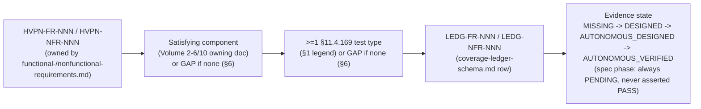

# HelixVPN — Requirements Traceability Matrix (requirement → component → test)

**Revision:** 8
**Last modified:** 2026-07-06T10:44:05Z
**Status:** active — Volume 0 (Spine, meta & governance) nano-detail document
**Rev 8 (GAP-4 closure, 2026-07-06):** Created `v04-client/connector.md` as the single
consolidating nano-detail owner for the Connector requirement band (FR-701..707) and
updated the FR-7xx owning-doc column to point to it. Also repointed NFR-603 to
`connector.md` as its primary owning doc. Updated §6 GAP-4 to **CLOSED**.

**Rev 7 (GAP-3 doc-level closure + DDoS targets, 2026-07-06):** Closed GAP-3 at the
documentation level (`v06-deploy/disaster-recovery.md` consolidates source-coverage ledger gap
G1 and pins RTO/RPO targets/runbooks; the RTO/RPO numbers remain measurement-pending until the
first Phase-2 CHAOS region-failover drill). Pinned quantitative DDoS design targets for
NFR-413/NFR-414 in `v08-testing/ddos.md` §10 and updated the coverage-ledger GAP-6 closure
statement to reference them.

**Rev 6 (GAP-5 doc-level closure):** Updated §6 GAP-5 to **CLOSED at doc level** — all 15
`v08-testing/` nano-detail docs are authored and on disk, the `coverage-ledger-schema.md` is
authored, and every FR/NFR maps to a planned §11.4.169 test type. The residual "evidence state
PENDING" is the honest spec-phase state (no code built yet), not a documentation gap. Added the
`v08-testing/` source-doc list to §8.

**Rev 5 (Phase-1 consolidation pass):** Closed GAP-6 in source docs by syncing the matrix with
`nonfunctional-requirements.md` Rev 2 (NFR-411..414 added there) and the new FR-610 added to
`functional-requirements.md` Rev 4. Added traceability rows for NFR-411/412/413/414 and
NFR-700/701/702/703, plus FR-609/610. Updated §6 GAP-6 to CLOSED. No existing row semantics
changed.
**Rev 4:** Independent gap-analysis pass (enterprise-hardening audit). Added **GAP-6** — the
`DDOS` test-type tag is defined in the §1 legend but traced to **zero** FR/NFR rows, i.e. the API
gateway/edge has no requirement-level rate-limiting/DDoS-resilience obligation despite `04_ARCH`
§4.6 naming a token-bucket mechanism; also flagged RBAC's lone-parenthetical status on FR-601.
Added a §0 Mermaid diagram visualizing the `Req → Component → Test type → Ledger row → Evidence
state` chain the prose already describes, to make the loop legible in one look. No existing row
changed; this document still does not mint new requirement ids (that stays FR/NFR-doc territory).
**Rev 3:** §1 legend — marked **UI/UX/REC** and **META** as *adjacent* types (NOT members of the §11.4.169 13-type set), added a member column; reworded the "Sources verified" MASTER_INDEX citation to cite on-disk existence (`[DONE]`) rather than a "to-be-generated" status as existence proof (§11.4.6).
**Rev 2:** Corrected GAP-3/GAP-5 — `v06-deploy/disaster-recovery.md` and all 15 `v08-testing/` docs are now authored (the stale "not-yet-authored" framing fixed per §11.4.6; residual gaps are pending-measurement, not missing docs).
**Authority:** Subordinate to [`../SPECIFICATION.md`](../SPECIFICATION.md). Requirement ids are owned by [`../v01-product/functional-requirements.md`](../v01-product/functional-requirements.md) (`HVPN-FR-NNN`) and [`../v01-product/nonfunctional-requirements.md`](../v01-product/nonfunctional-requirements.md) (`HVPN-NFR-NNN`); this document does **not** mint new requirements — it cross-references them. Test types are the §11.4.169 closed set owned by [`../10-testing-acceptance-and-qa.md`](../10-testing-acceptance-and-qa.md).

> **Document role.** The closed-loop cross-reference matrix tying every HelixVPN
> requirement (`HVPN-FR-NNN` / `HVPN-NFR-NNN`) to (1) the **satisfying component**
> — the Volume 2–6/10 spec doc that implements it — and (2) the **§11.4.169 test
> type(s)** + **coverage-ledger row** that prove it. It closes the
> `FR → component → test → evidence` loop the FR/NFR docs declare. Per §11.4.6, any
> requirement with **no** satisfying component or **no** test type is flagged a
> **GAP** in §6 (honest, never hidden). Per §11.4.118, §7 states the enumerated
> coverage this matrix claims — and the boundary of that claim.
>
> **SPEC-PHASE HONESTY (§11.4.6 / §11.4.108).** HelixVPN is in specification, not
> build. Every "evidence-state" in this matrix is therefore **PENDING** (designed,
> not yet captured): the coverage-ledger rows are *planned* rows whose state will be
> `MISSING → DESIGNED → AUTONOMOUS_DESIGNED → AUTONOMOUS_VERIFIED` once the Volume-8
> harness runs (`v08-testing/coverage-ledger-schema.md`). This document maps the
> *intended* test type per requirement; it asserts **no** captured PASS. A PASS is
> earned only when the named test produces captured evidence (§11.4.5/.69/.107).

---

## Table of contents

- [0. How to read a traceability row](#0-how-to-read-a-traceability-row)
- [1. The §11.4.169 test-type legend](#1-the-114169-test-type-legend)
- [2. Functional-requirement traceability (HVPN-FR-NNN)](#2-functional-requirement-traceability-hvpn-fr-nnn)
- [3. Non-functional-requirement traceability (HVPN-NFR-NNN)](#3-non-functional-requirement-traceability-hvpn-nfr-nnn)
- [4. MVP Definition-of-Done → requirement → gate](#4-mvp-definition-of-done--requirement--gate)
- [5. Phase-0 gate → requirement coverage](#5-phase-0-gate--requirement-coverage)
- [6. GAP register (§11.4.6 — honest)](#6-gap-register-114-6--honest)
- [7. Coverage claim & boundary (§11.4.118)](#7-coverage-claim--boundary-114118)
- [Sources verified](#sources-verified)

---

## 0. How to read a traceability row

Each FR/NFR is one row with five cross-reference fields:

| Field | Meaning |
|---|---|
| **Req ID** | `HVPN-FR-NNN` / `HVPN-NFR-NNN` (owned by the FR/NFR docs; never minted here). |
| **Satisfying component (owning doc)** | the Volume 2–6/10 spec doc + component that implements it. **GAP** if none. |
| **§11.4.169 test type(s)** | the mandatory test type(s) whose captured evidence will prove it (closed set §1). **GAP** if none. |
| **Coverage-ledger row** | the planned `feature × test-type × evidence-state` ledger key (`LEDG-FR-NNN` / `LEDG-NFR-NNN`). State = **PENDING** in spec phase. |
| **Priority / phase** | MVP / P2 / P3 / P0 / ALWAYS (from the FR/NFR doc). |

The ledger row id is derived 1:1 from the requirement id (`LEDG-FR-001` ↔
`HVPN-FR-001`) so the Volume-8 coverage ledger (`coverage-ledger-schema.md`) can be
populated mechanically from this matrix.

---

## 1. The §11.4.169 test-type legend

The closed mandatory test-type set is the **13** §11.4.169 types (the first 13 rows,
`10-testing-acceptance-and-qa.md` §2 / §5). **UI/UX/REC** and **META** are *adjacent*
types (NOT members of the §11.4.169 13-type set) — UI/UX derives from §11.4.48/.49 +
§11.4.162 and recorded-evidence from §11.4.153/.158/.159; META is the §1.1 paired-
mutation discipline applied to every gate. Each requirement names ≥1 §11.4.169 type
(and, where user-visible, an adjacent UI/UX/REC pass):

| Tag | Test type | §11.4.169 member | Volume-8 §5 home |
|---|---|---|---|
| **U** | unit | yes | §5.1 |
| **INT** | integration (containers-submodule infra) | yes | §5.2 |
| **E2E** | end-to-end (netns rig) | yes | §5.3 |
| **FA** | full-automation (autonomous, re-runnable) | yes | §5.4 |
| **CHAL** | Challenges (challenges-submodule banks) | yes | §5.5 |
| **HQA** | HelixQA autonomous sessions | yes | §5.6 |
| **SEC** | security | yes | §5.7 |
| **DDOS** | DoS / load-flood | yes | §5.8 |
| **STR/CHAOS** | stress + chaos | yes | §5.9 |
| **CONC** | concurrency / atomicity | yes | §5.10 |
| **RACE** | race-condition / deadlock | yes | §5.11 |
| **MEM** | memory (iOS NE soak) | yes | §5.12 |
| **BENCH/PERF/SCALE** | benchmarking / performance / scale | yes | §5.13 |
| **UI/UX/REC** | UI/UX + recorded-evidence (vision_engine) | **adjacent** (§11.4.48/.49/.162/.153/.158/.159) | §5.14 |
| **META** | paired §1.1 meta-test mutation | **adjacent** (§1.1) | every gate |

Every row implicitly also carries **META** (the §1.1 paired mutation per gate) and,
for any user-visible feature, a **CHAL**/**HQA** anti-bluff pass; the columns below
name the *primary discriminating* type(s) to keep the matrix legible.

---

## 2. Functional-requirement traceability (HVPN-FR-NNN)

Satisfying-component owning docs are quoted from `functional-requirements.md`; the
test types are assigned from each FR's acceptance criterion (`[evidence]`-flagged
criteria require captured runtime evidence per §11.4.69).

### A. Connect & transport (FR-0xx)

| Req ID | Satisfying component (owning doc) | §11.4.169 test type(s) | Ledger row | Phase |
|---|---|---|---|---|
| HVPN-FR-001 | WG crypto core — `01`, `v02-data-plane/wireguard-core.md` | SEC (CI crypto-lint) + INT (handshake) | LEDG-FR-001 | MVP |
| HVPN-FR-002 | plain-UDP transport — `v02-data-plane/transport-plain-udp.md` | PERF/BENCH (G1 iperf3) + E2E | LEDG-FR-002 | MVP/P0 |
| HVPN-FR-003 | `Transport` trait — `01` §7.1, `v02-data-plane/transport-trait.md` | U + INT (shared-crate parity) | LEDG-FR-003 | MVP |
| HVPN-FR-004 | MASQUE/QUIC — `v02-data-plane/transport-masque-quic.md` | E2E (DPI sim) + PERF (G2) | LEDG-FR-004 | MVP |
| HVPN-FR-005 | LWO — `v02-data-plane/transport-lwo.md` | E2E (signature-block evasion) | LEDG-FR-005 | MVP |
| HVPN-FR-006 | auto-ladder — `v02-data-plane/transport-selection-ladder.md` | E2E (DoD#4 escalation) + FA | LEDG-FR-006 | MVP |
| HVPN-FR-007 | `helix_pin_transport` — `03`, `v04-client/helix-core-rust.md` | U + INT | LEDG-FR-007 | MVP |
| HVPN-FR-008 | port evasion :443/:53/hop — `transport-masque-quic.md` + edge | E2E + INT | LEDG-FR-008 | MVP |
| HVPN-FR-009 | Shadowsocks-wrap — `v02-data-plane/transport-shadowsocks.md` | E2E | LEDG-FR-009 | P2 |
| HVPN-FR-010 | UDP-over-TCP — `v02-data-plane/transport-udp-over-tcp.md` | E2E (total-UDP-block) | LEDG-FR-010 | P2 |
| HVPN-FR-011 | per-network memory/regional priors — `transport-selection-ladder.md` | INT + FA | LEDG-FR-011 | P2 |
| HVPN-FR-012 | CONNECT-IP — `01`, `transport-masque-quic.md` | E2E (interop) | LEDG-FR-012 | P2 |
| HVPN-FR-013 | full-tunnel privacy exit — `01`, `v04-client/helix-core-rust.md` | E2E (egress-IP) | LEDG-FR-013 | MVP |
| HVPN-FR-014 | split tunneling — `03`, `helix-core-rust.md` | E2E (per-route/per-app) | LEDG-FR-014 | MVP |
| HVPN-FR-015 | transient-drop recovery — `v02-data-plane/orchestrator-and-state.md` | CHAOS + E2E | LEDG-FR-015 | MVP |
| HVPN-FR-016 | MTU mgmt — `transport-plain-udp.md`, `wireguard-core.md` | INT (path-MTU probe) | LEDG-FR-016 | MVP |
| HVPN-FR-017 | DAITA — `v02-data-plane/daita.md` | BENCH (overhead) + E2E | LEDG-FR-017 | P2 |
| HVPN-FR-018 | status stream — `03` §7.3, `v04-client/state-management.md` | U + UI/UX | LEDG-FR-018 | MVP |
| HVPN-FR-019 | per-leg topology — `01` (D6), `svc-coordinator.md` | INT | LEDG-FR-019 | P2 |
| HVPN-FR-020 | P2P + NAT + relay — `01`, `routing-and-addressing.md` | E2E (real NAT) + CHAOS | LEDG-FR-020 | P2 |

### B. Identity & enrollment (FR-1xx)

| Req ID | Satisfying component (owning doc) | §11.4.169 test type(s) | Ledger row | Phase |
|---|---|---|---|---|
| HVPN-FR-101 | OIDC — `v03-control-plane/svc-identity.md` | INT (OIDC login) | LEDG-FR-101 | MVP |
| HVPN-FR-102 | anon device token — `svc-identity.md`, `identity-and-enrollment.md` | INT (no-PII enroll) + SEC | LEDG-FR-102 | MVP |
| HVPN-FR-103 | on-device keygen, key-never-leaves — `identity-and-enrollment.md`, `svc-pki.md` | SEC (schema + wire capture) | LEDG-FR-103 | MVP |
| HVPN-FR-104 | cert+token-gated enroll — `svc-identity.md`, `identity-and-enrollment.md` | SEC + INT | LEDG-FR-104 | MVP |
| HVPN-FR-105 | short-lived mTLS device cert — `svc-pki.md`, `pki-and-certs.md` | SEC + INT (auto-renew) | LEDG-FR-105 | MVP |
| HVPN-FR-106 | control/data key separation — `04` §1.2, `svc-pki.md` | SEC | LEDG-FR-106 | MVP |
| HVPN-FR-107 | revoke < 1s — `svc-registry.md`, `svc-pki.md`, edge | PERF (revoke timing) + SEC | LEDG-FR-107 | MVP |
| HVPN-FR-108 | per-tenant CA — `svc-pki.md`, `pki-and-certs.md` | SEC (cross-tenant FAIL) | LEDG-FR-108 | MVP |
| HVPN-FR-109 | auto cert rotation no-drop — `pki-and-certs.md` | INT (rotate mid-session) | LEDG-FR-109 | MVP |
| HVPN-FR-110 | RLS tenant isolation — `data-model-ddl.md`, `svc-identity.md` | SEC (RLS bypass attempt) | LEDG-FR-110 | MVP |
| HVPN-FR-111 | all-roles enroll — `svc-registry.md` | INT (DoD#2) | LEDG-FR-111 | MVP |

### C. Policy & authorization (FR-2xx)

| Req ID | Satisfying component (owning doc) | §11.4.169 test type(s) | Ledger row | Phase |
|---|---|---|---|---|
| HVPN-FR-201 | default-deny/fail-closed — `svc-policy.md`, `zero-trust-and-default-deny.md` | SEC + E2E + META | LEDG-FR-201 | MVP |
| HVPN-FR-202 | ACL compiler grammar — `svc-policy.md` | U (compile) + INT | LEDG-FR-202 | MVP |
| HVPN-FR-203 | AllowedIPs + verdict map — `svc-policy.md`, `01` §8 | E2E (allow/deny flow) | LEDG-FR-203 | MVP |
| HVPN-FR-204 | authorized-reach + denied — `svc-policy.md`, edge | E2E (DoD#3) | LEDG-FR-204 | MVP |
| HVPN-FR-205 | policy edit < 1s no-restart — `svc-policy.md`, `svc-coordinator.md` | PERF (DoD#5) + E2E | LEDG-FR-205 | MVP |
| HVPN-FR-206 | split-horizon default — `svc-policy.md`, `routing-and-addressing.md` | E2E + SEC | LEDG-FR-206 | MVP |
| HVPN-FR-207 | need-to-know map filtering — `svc-coordinator.md`, `04` (S3) | SEC (snapshot omits) + META | LEDG-FR-207 | MVP |
| HVPN-FR-208 | policy-as-code/GitOps — `svc-policy.md` | INT (repo reconcile) | LEDG-FR-208 | P2 |

### D. Routing, addressing & multi-network (FR-3xx)

| Req ID | Satisfying component (owning doc) | §11.4.169 test type(s) | Ledger row | Phase |
|---|---|---|---|---|
| HVPN-FR-301 | 1→N overlay — `routing-and-addressing.md`, `svc-policy.md` | E2E (≥2 nets) | LEDG-FR-301 | MVP |
| HVPN-FR-302 | overlapping-CIDR resolve — `routing-and-addressing.md`, `svc-ipam.md` | E2E (same-CIDR distinct) | LEDG-FR-302 | MVP |
| HVPN-FR-303 | ULA /48 + 4via6 (+NAT fallback) — `svc-ipam.md`, `routing-and-addressing.md` | E2E + INT | LEDG-FR-303 | MVP |
| HVPN-FR-304 | stable overlay IP — `svc-ipam.md` | INT (persist across reconnect) | LEDG-FR-304 | MVP |
| HVPN-FR-305 | connector advertise + route — `svc-registry.md`, edge, `routing-and-addressing.md` | E2E (DoD#3 path) | LEDG-FR-305 | MVP |
| HVPN-FR-306 | two-way no-inbound — `01`, edge, connector spec | E2E + SEC (no-inbound) | LEDG-FR-306 | MVP |
| HVPN-FR-307 | IPAM pool alloc — `svc-ipam.md` | STR/CHAOS (concurrent enroll) + CONC | LEDG-FR-307 | MVP |

### E. Multi-hop (FR-4xx)

| Req ID | Satisfying component (owning doc) | §11.4.169 test type(s) | Ledger row | Phase |
|---|---|---|---|---|
| HVPN-FR-401 | nested WG per-hop keys — `multihop.md` | E2E (2-hop, egress=exit) | LEDG-FR-401 | P2 |
| HVPN-FR-402 | control-plane path selection — `multihop.md`, `svc-coordinator.md` | INT + E2E | LEDG-FR-402 | P2 |
| HVPN-FR-403 | jurisdiction separation — `multihop.md` | E2E (different regions) | LEDG-FR-403 | P2 |

### F. Kill-switch & leak protection (FR-5xx)

| Req ID | Satisfying component (owning doc) | §11.4.169 test type(s) | Ledger row | Phase |
|---|---|---|---|---|
| HVPN-FR-501 | core-owned kill-switch state — `kill-switch-and-dns-leak.md` | U (state machine) + SEC | LEDG-FR-501 | MVP |
| HVPN-FR-502 | no plaintext on drop/escalate — `kill-switch-and-dns-leak.md` | SEC/E2E (leak pcap, DoD#7) | LEDG-FR-502 | MVP |
| HVPN-FR-503 | DNS forced through tunnel — `kill-switch-and-dns-leak.md` | SEC/E2E (DNS-leak test) | LEDG-FR-503 | MVP |
| HVPN-FR-504 | per-OS firewall from shared SM — `kill-switch-and-dns-leak.md`, shims | SEC + per-OS branch | LEDG-FR-504 | MVP |

### G. Console & administration (FR-6xx)

| Req ID | Satisfying component (owning doc) | §11.4.169 test type(s) | Ledger row | Phase |
|---|---|---|---|---|
| HVPN-FR-601 | CRUD entities — `svc-api.md`, `web-console.md` | INT + E2E (RBAC) | LEDG-FR-601 | MVP |
| HVPN-FR-602 | API-client-only build (no core_ffi) — `web-console.md`, `03` | INT (per-flavor build) | LEDG-FR-602 | MVP |
| HVPN-FR-603 | live WS/SSE no-poll — `svc-api.md` | E2E (live push) | LEDG-FR-603 | MVP |
| HVPN-FR-604 | live topology view — `web-console.md` | UI/UX + E2E | LEDG-FR-604 | MVP |
| HVPN-FR-605 | control-action audit only — `audit-and-compliance.md`, `svc-telemetry.md` | SEC (schema+UI, no-flow) | LEDG-FR-605 | MVP |
| HVPN-FR-606 | multi-tenant isolation — `web-console.md`, RLS | SEC | LEDG-FR-606 | MVP |
| HVPN-FR-607 | optional billing — `web-console.md` | INT | LEDG-FR-607 | P3 |
| HVPN-FR-608 | responsive light+dark Console — `web-console.md`, Volume 10 | UI/UX (visual-regression) | LEDG-FR-608 | MVP |
| HVPN-FR-609 | exportable control-action audit slice — `audit-and-compliance.md`, `svc-telemetry.md` | SEC + INT | LEDG-FR-609 | MVP |
| HVPN-FR-610 | RBAC role→action matrix enforcement — `svc-identity.md`, `svc-api.md` | SEC + INT + E2E | LEDG-FR-610 | MVP |

### H. Connector (FR-7xx)

| Req ID | Satisfying component (owning doc) | §11.4.169 test type(s) | Ledger row | Phase |
|---|---|---|---|---|
| HVPN-FR-701 | [`v04-client/connector.md`](../v04-client/connector.md) (secondary: `helix-core-rust.md` §9.1) | SEC (no-inbound) + E2E | LEDG-FR-701 | MVP |
| HVPN-FR-702 | [`v04-client/connector.md`](../v04-client/connector.md) (secondary: `helix-core-rust.md` §9.2, `shim-linux.md` §9) | INT | LEDG-FR-702 | MVP |
| HVPN-FR-703 | [`v04-client/connector.md`](../v04-client/connector.md) (secondary: `helix-core-rust.md` §9.1) | INT (shared-crate) | LEDG-FR-703 | MVP |
| HVPN-FR-704 | [`v04-client/connector.md`](../v04-client/connector.md) (secondary: `svc-registry.md`, edge) | E2E | LEDG-FR-704 | MVP |
| HVPN-FR-705 | [`v04-client/connector.md`](../v04-client/connector.md) (secondary: `svc-policy.md` §4.2, `helix-core-rust.md` §9.3) | INT (local-ACL honoured + central-deny wins) | LEDG-FR-705 | MVP |
| HVPN-FR-706 | [`v04-client/connector.md`](../v04-client/connector.md) (secondary: `helix-core-rust.md` §9.2, `shim-android.md`) | E2E (embedded target) | LEDG-FR-706 | P2 |
| HVPN-FR-707 | [`v04-client/connector.md`](../v04-client/connector.md) traces availability-following to `v02-data-plane/orchestrator-and-state.md` | CHAOS (drop→resume) | LEDG-FR-707 | MVP |

### I. Observability & telemetry (FR-8xx)

| Req ID | Satisfying component (owning doc) | §11.4.169 test type(s) | Ledger row | Phase |
|---|---|---|---|---|
| HVPN-FR-801 | no durable connection table — `no-logging-as-code.md`, `data-model-ddl.md` | SEC (schema-lint, DoD#8) + META | LEDG-FR-801 | MVP |
| HVPN-FR-802 | ephemeral TTL presence — `svc-events.md`, `no-logging-as-code.md` | INT (TTL expiry) | LEDG-FR-802 | MVP |
| HVPN-FR-803 | Prometheus counters/health — `svc-telemetry.md`, `observability.md` | INT + SEC (no-flow labels) | LEDG-FR-803 | MVP |
| HVPN-FR-804 | convergence/event-lag SLO metrics — `observability.md`, NFR doc | PERF | LEDG-FR-804 | MVP |
| HVPN-FR-805 | counts-only success metrics — `svc-telemetry.md`, `success-metrics.md` | U (label audit) + SEC | LEDG-FR-805 | MVP |

### J. Deployment & self-host (FR-9xx)

| Req ID | Satisfying component (owning doc) | §11.4.169 test type(s) | Ledger row | Phase |
|---|---|---|---|---|
| HVPN-FR-901 | `helixvpnctl init` from zero — `helixvpnctl.md`, `podman-quadlets.md` | E2E/FA (DoD#1) | LEDG-FR-901 | MVP |
| HVPN-FR-902 | rootless Podman (§11.4.161) — `podman-quadlets.md` | INT/SEC (no-root) | LEDG-FR-902 | MVP |
| HVPN-FR-903 | same images scale to HA — `ha-and-multiregion.md` | INT (multi-region) | LEDG-FR-903 | P2 |
| HVPN-FR-904 | `helixvpnctl` subcommands — `helixvpnctl.md` | INT/E2E | LEDG-FR-904 | MVP |
| HVPN-FR-905 | Compose + K8s manifests — `docker-compose.md`, `kubernetes.md` | INT (stack bring-up) | LEDG-FR-905 | P2 |
| HVPN-FR-906 | hardened edge container — `podman-quadlets.md`, `04` (S8) | SEC | LEDG-FR-906 | MVP |
| HVPN-FR-907 | fail-static — edge, `01`, `02` | CHAOS (kill control plane) | LEDG-FR-907 | MVP |
| HVPN-FR-908 | §11.4.77 regen mechanism — `repo-layout-and-decoupling.md` | INT (fresh-clone bootstrap) | LEDG-FR-908 | MVP |

### K. Clients & platform apps (FR-10xx)

| Req ID | Satisfying component (owning doc) | §11.4.169 test type(s) | Ledger row | Phase |
|---|---|---|---|---|
| HVPN-FR-1001 | `runHelixApp` 3 flavors — `helix-ui-flutter.md` | INT (per-flavor build) | LEDG-FR-1001 | MVP |
| HVPN-FR-1002 | shared core, UI=f(stream) — `helix-core-rust.md`, `ffi-surface.md`, `state-management.md` | INT + UI/UX | LEDG-FR-1002 | MVP |
| HVPN-FR-1003 | one-button connect — `helix-ui-flutter.md`, Volume 10 | UI/UX + E2E | LEDG-FR-1003 | MVP |
| HVPN-FR-1004 | iOS NE memory ceiling +≥30% — `shim-apple.md`, `03` | MEM (G3 on-device soak) | LEDG-FR-1004 | MVP/P0 |
| HVPN-FR-1005 | Android VpnService+JNI — `shim-android.md` | E2E + CHAOS (background-kill) | LEDG-FR-1005 | MVP |
| HVPN-FR-1006 | Linux kernel WG+systemd — `shim-linux.md` | E2E | LEDG-FR-1006 | MVP |
| HVPN-FR-1007 | Windows wireguard-nt+service+WFP — `shim-windows.md` | E2E (per-OS) | LEDG-FR-1007 | P2 |
| HVPN-FR-1008 | macOS NE — `shim-apple.md` | E2E (per-OS) | LEDG-FR-1008 | P2 |
| HVPN-FR-1009 | HarmonyOS NEXT — `shim-harmonyos.md` | E2E (on-device) | LEDG-FR-1009 | P3 |
| HVPN-FR-1010 | Aurora OS — `shim-aurora.md` | E2E (on-device) | LEDG-FR-1010 | P3 |
| HVPN-FR-1011 | Web = Console + optional WASM proxy — `web-console.md` | E2E + documentation-honesty | LEDG-FR-1011 | P3 |
| HVPN-FR-1012 | pick exit/network + toggle obfs — `helix-ui-flutter.md`, `ffi-surface.md` | UI/UX + E2E | LEDG-FR-1012 | MVP |
| HVPN-FR-1013 | light+dark all clients — Volume 10 | UI/UX (visual-regression) | LEDG-FR-1013 | MVP |
| HVPN-FR-1014 | all three apps drive system — all client docs | E2E/FA (DoD#8) | LEDG-FR-1014 | MVP |

### L. Post-quantum & advanced privacy (FR-11xx)

| Req ID | Satisfying component (owning doc) | §11.4.169 test type(s) | Ledger row | Phase |
|---|---|---|---|---|
| HVPN-FR-1101 | ML-KEM PSK handshake — `post-quantum.md` | SEC + INT (interop+measure) | LEDG-FR-1101 | P2 |
| HVPN-FR-1102 | hybrid never PQ-only — `post-quantum.md` | SEC (PQ-off still secure) | LEDG-FR-1102 | P2 |
| HVPN-FR-1103 | Rosenpass evaluation — `post-quantum.md` | (documented evaluation) — **see GAP-2** | LEDG-FR-1103 | P2 |

---

## 3. Non-functional-requirement traceability (HVPN-NFR-NNN)

Each NFR already names its **Verify by** test type in `nonfunctional-requirements.md`;
this table adds the satisfying-component owning doc + ledger row. `UNVERIFIED`
targets are the NFR doc's; this matrix does not assert them met.

| Req ID | Statement (short) | Satisfying component (owning doc) | §11.4.169 test type | Ledger row | Phase |
|---|---|---|---|---|---|
| HVPN-NFR-001 | plain-UDP ≥80% bare-link | `transport-plain-udp.md` | PERF/BENCH (G1) | LEDG-NFR-001 | P0 |
| HVPN-NFR-002 | MASQUE ≥50% through DPI | `transport-masque-quic.md` | PERF/BENCH (G2) | LEDG-NFR-002 | P0 |
| HVPN-NFR-003 | convergence p99 < 1s | `svc-coordinator.md` | PERF | LEDG-NFR-003 | MVP |
| HVPN-NFR-004 | revoke < 1s | `svc-pki.md`, `svc-coordinator.md`, edge | PERF + SEC | LEDG-NFR-004 | MVP |
| HVPN-NFR-005 | bounded handshake latency | `wireguard-core.md` | INT | LEDG-NFR-005 | MVP |
| HVPN-NFR-006 | bounded ladder escalation | `transport-selection-ladder.md` | INT | LEDG-NFR-006 | MVP |
| HVPN-NFR-007 | bounded datapath added latency | `transport-*` | BENCH | LEDG-NFR-007 | P2 |
| HVPN-NFR-008 | MTU no-fragment | `transport-plain-udp.md`, `wireguard-core.md` | INT | LEDG-NFR-008 | MVP |
| HVPN-NFR-009 | admin policy-edit < 1s (superset) | `svc-policy.md`, `svc-coordinator.md` | E2E/FA | LEDG-NFR-009 | MVP |
| HVPN-NFR-100 | ≥10k streams/coordinator | `svc-coordinator.md` | STR/CHAOS (soak) | LEDG-NFR-100 | MVP |
| HVPN-NFR-101 | coordinator memory slope ≈0 | `svc-coordinator.md` | STR/CHAOS + MEM | LEDG-NFR-101 | MVP |
| HVPN-NFR-102 | minimal-affected-set fan-out | `svc-coordinator.md` | U + PERF | LEDG-NFR-102 | MVP |
| HVPN-NFR-103 | many connectors/tenant | `svc-ipam.md` | INT | LEDG-NFR-103 | MVP |
| HVPN-NFR-104 | 1 user → N nets | `routing-and-addressing.md`, `svc-policy.md` | E2E | LEDG-NFR-104 | MVP |
| HVPN-NFR-105 | reconnect-storm absorbed | `svc-coordinator.md`, `svc-events.md` | STR (storm) | LEDG-NFR-105 | MVP |
| HVPN-NFR-106 | per-tenant churn isolation | `svc-coordinator.md` | CONC + RACE | LEDG-NFR-106 | MVP |
| HVPN-NFR-107 | stateless multi-replica coordinators | `architecture-and-wiring.md`, `ha-and-multiregion.md` | INT (multi-replica) | LEDG-NFR-107 | P2 |
| HVPN-NFR-108 | bus swap Redis→NATS | `svc-events.md`, `ha-and-multiregion.md` | INT (bus swap) | LEDG-NFR-108 | P2 |
| HVPN-NFR-200 | fail-static, 0 drops | edge, `01` | CHAOS | LEDG-NFR-200 | ALWAYS |
| HVPN-NFR-201 | DB/Redis blip no-restart | `architecture-and-wiring.md` | CHAOS | LEDG-NFR-201 | MVP |
| HVPN-NFR-202 | Redis loss degrades gracefully | `svc-events.md`, `no-logging-as-code.md` | CHAOS | LEDG-NFR-202 | MVP |
| HVPN-NFR-203 | no-work-loss XAutoClaim | `svc-events.md` | CHAOS | LEDG-NFR-203 | MVP |
| HVPN-NFR-204 | coordinator restart transparent | `svc-coordinator.md` | CHAOS/INT | LEDG-NFR-204 | MVP |
| HVPN-NFR-205 | region-failover RTO/RPO (`UNVERIFIED`) | `v06-deploy/disaster-recovery.md` | CHAOS (drill) — GAP-3 doc-level CLOSED; targets verified by Phase-2 drill | LEDG-NFR-205 | P2 |
| HVPN-NFR-206 | gateway failover re-point | `svc-coordinator.md`, `ha-and-multiregion.md` | INT/CHAOS | LEDG-NFR-206 | P2 |
| HVPN-NFR-207 | poison→DLQ | `svc-events.md` | CHAOS/INT | LEDG-NFR-207 | MVP |
| HVPN-NFR-300 | no durable flow table | `no-logging-as-code.md`, `data-model-ddl.md` | SEC | LEDG-NFR-300 | ALWAYS |
| HVPN-NFR-301 | schema-lint not a tautology | `no-logging-as-code.md` | META (§1.1) | LEDG-NFR-301 | ALWAYS |
| HVPN-NFR-302 | bus carries no traffic shape | `svc-events.md` | SEC (payload-lint) | LEDG-NFR-302 | MVP |
| HVPN-NFR-303 | audit = control-only | `audit-and-compliance.md`, `svc-telemetry.md` | U + INT | LEDG-NFR-303 | MVP |
| HVPN-NFR-304 | ephemeral presence | `svc-events.md` | INT (TTL) | LEDG-NFR-304 | MVP |
| HVPN-NFR-305 | coarse `last_seen_at` | `no-logging-as-code.md` | U + INT | LEDG-NFR-305 | MVP |
| HVPN-NFR-306 | counts-only metric labels | `svc-telemetry.md` | U (label-cardinality) | LEDG-NFR-306 | MVP |
| HVPN-NFR-307 | anonymous identity | `svc-identity.md`, `identity-and-enrollment.md` | INT | LEDG-NFR-307 | MVP |
| HVPN-NFR-308 | no-logging runtime signature | `no-logging-as-code.md` | E2E CHAL (deployed-DB) | LEDG-NFR-308 | MVP |
| HVPN-NFR-400 | WG crypto never forked | `wireguard-core.md` | SEC + META | LEDG-NFR-400 | ALWAYS |
| HVPN-NFR-401 | outbound-only edges | `01`, edge | SEC | LEDG-NFR-401 | ALWAYS |
| HVPN-NFR-402 | need-to-know peer filtering | `svc-coordinator.md` | E2E + META | LEDG-NFR-402 | MVP |
| HVPN-NFR-403 | mTLS + instant revoke | `pki-and-certs.md` | SEC | LEDG-NFR-403 | MVP |
| HVPN-NFR-404 | kill-switch 0 leak | `kill-switch-and-dns-leak.md` | SEC/E2E | LEDG-NFR-404 | MVP |
| HVPN-NFR-405 | DNS-leak 0 plaintext | `kill-switch-and-dns-leak.md` | SEC/E2E | LEDG-NFR-405 | MVP |
| HVPN-NFR-406 | WG private key never leaves | `identity-and-enrollment.md` | INT + SEC | LEDG-NFR-406 | MVP |
| HVPN-NFR-407 | hybrid PQ | `post-quantum.md` | SEC + INT | LEDG-NFR-407 | P2 |
| HVPN-NFR-408 | RLS at DB | `data-model-ddl.md` | SEC/INT | LEDG-NFR-408 | MVP |
| HVPN-NFR-409 | anti-bluff gauntlet per change | Volume 8 | META (per-gate mutation) | LEDG-NFR-409 | ALWAYS |
| HVPN-NFR-410 | censorship-evasion ladder | `transport-selection-ladder.md` | E2E (DPI-sim) | LEDG-NFR-410 | MVP |
| HVPN-NFR-411 | runtime secrets rotatable without rebuild | `repo-layout-and-decoupling.md`, `data-model-ddl.md` | SEC + INT | LEDG-NFR-411 | MVP |
| HVPN-NFR-412 | WG/device + edge transport key rotation cadence | `pki-and-certs.md`, `wireguard-core.md` | SEC + INT | LEDG-NFR-412 | MVP |
| HVPN-NFR-413 | control-plane API rate limiting | `svc-api.md`, `architecture-and-wiring.md` | STRESS + SEC | LEDG-NFR-413 | MVP |
| HVPN-NFR-414 | data-plane edge DDoS/UDP-flood/amplification resilience | `svc-api.md` (enroll limits), edge (`v02-data-plane/routing-and-addressing.md` / `transport-masque-quic.md`) | DDOS | LEDG-NFR-414 | MVP |
| HVPN-NFR-500 | iOS NE +≥30% headroom | `shim-apple.md` | MEM (G3) | LEDG-NFR-500 | P0 |
| HVPN-NFR-501 | battery-sensitive push | `orchestrator-and-state.md`, `shim-*` | BENCH (battery) | LEDG-NFR-501 | MVP |
| HVPN-NFR-502 | small core footprint | `helix-core-rust.md` | BENCH (artifact-size) | LEDG-NFR-502 | MVP |
| HVPN-NFR-503 | ≤60% host RAM (§12.6) | Volume 8 harness | BENCH (host sampler) | LEDG-NFR-503 | ALWAYS |
| HVPN-NFR-504 | control-plane bounded mem | `svc-coordinator.md` | STR/CHAOS + MEM | LEDG-NFR-504 | MVP |
| HVPN-NFR-505 | lightweight samplers | `observability.md` | BENCH | LEDG-NFR-505 | MVP |
| HVPN-NFR-506 | slow-consumer drop not buffer | `svc-coordinator.md` | STR + MEM | LEDG-NFR-506 | MVP |
| HVPN-NFR-600 | one Flutter tree 3 flavors | `helix-ui-flutter.md` | INT | LEDG-NFR-600 | MVP |
| HVPN-NFR-601 | core byte-for-byte shared | `transport-trait.md`, `helix-core-rust.md` | INT (shared-core parity) | LEDG-NFR-601 | MVP |
| HVPN-NFR-602 | MVP iOS/Android/Linux | `shim-apple.md`, `shim-android.md`, `shim-linux.md` | E2E/FA | LEDG-NFR-602 | MVP |
| HVPN-NFR-603 | connector headless Linux/Win/macOS | [`v04-client/connector.md`](../v04-client/connector.md) (secondary: `shim-linux.md` §9, `shim-windows.md`, `shim-apple.md`) | INT | LEDG-NFR-603 | MVP |
| HVPN-NFR-604 | Console web+desktop | `web-console.md` | E2E (responsive) | LEDG-NFR-604 | MVP |
| HVPN-NFR-605 | P2 Windows+macOS | `shim-windows.md`, `shim-apple.md` | E2E | LEDG-NFR-605 | P2 |
| HVPN-NFR-606 | P3 HarmonyOS+Aurora (`UNVERIFIED`) | `shim-harmonyos.md`, `shim-aurora.md` | E2E (per-shim) | LEDG-NFR-606 | P3 |
| HVPN-NFR-607 | Web honestly scoped | `web-console.md` | E2E + doc-honesty | LEDG-NFR-607 | P3 |
| HVPN-NFR-608 | light+dark visual-regression | Volume 10 | UI/UX | LEDG-NFR-608 | P3 |
| HVPN-NFR-609 | cross-platform parity (§11.4.81) | per-OS test branches | per-OS branch | LEDG-NFR-609 | ALWAYS |
| HVPN-NFR-700 | zero-downtime rolling upgrades | `ha-and-multiregion.md`, `architecture-and-wiring.md` | CHAOS + INT | LEDG-NFR-700 | P2 |
| HVPN-NFR-701 | backward-compatible Postgres migrations | `data-model-ddl.md`, `codegen-pipeline.md` | INT | LEDG-NFR-701 | P2 |
| HVPN-NFR-702 | protobuf/OpenAPI wire-compatibility window | `protobuf-spec.md`, `codegen-pipeline.md` | U + META | LEDG-NFR-702 | MVP |
| HVPN-NFR-703 | infra sizing/cost forecast formula | `observability.md`, `ha-and-multiregion.md` | BENCH | LEDG-NFR-703 | P2 |

---

## 4. MVP Definition-of-Done → requirement → gate

The 8-criteria MVP DoD (`functional-requirements.md` §M, [SPEC §8.1]) is the MVP
acceptance checklist; each criterion maps to FRs whose ledger rows must reach
`AUTONOMOUS_VERIFIED` with captured evidence.

| DoD # | Criterion | FRs | Primary test type | NFR SLO |
|---|---|---|---|---|
| DoD-1 | self-host from zero | FR-901, FR-902 | E2E/FA | — |
| DoD-2 | enroll connector + client | FR-104, FR-111, FR-701 | INT/SEC | — |
| DoD-3 | authorized-reach + denied | FR-204, FR-201, FR-305, FR-306 | E2E | — |
| DoD-4 | auto-escalate to MASQUE | FR-006, FR-004 | E2E | NFR-410 |
| DoD-5 | policy edit < 1s no-restart | FR-205 | PERF | NFR-003/009 |
| DoD-6 | revoke < 1s | FR-107 | PERF/SEC | NFR-004 |
| DoD-7 | kill-switch + DNS-leak | FR-501..504 | SEC/E2E | NFR-404/405 |
| DoD-8 | no durable log + all 3 apps | FR-801, FR-1014 | SEC + E2E/FA | NFR-300/308 |

---

## 5. Phase-0 gate → requirement coverage

The Phase-0 spike gates (G1–G6, [SPEC §8.0]) are the earliest evidence; they prove
the make-or-break requirements *and resolve the spine decisions* (see
[`decision-register.md` §5](decision-register.md#5-the-gate--decision-resolution-map)).

| Gate | Requirement(s) proven | Decision resolved |
|---|---|---|
| G1 | FR-002, NFR-001 | (datapath floor) |
| G2 | FR-004, NFR-002 | D1 |
| G3 | FR-1004, NFR-500 | D2 (make-or-break) |
| G4 | (edge benchmark) | D5 |
| G5 | FR-018 (FFI), FR-1002 | D-FFI-* |
| G6 | FR-015/reconcile (push) | (validates P4 push-not-poll) |

---

## 6. GAP register (§11.4.6 — honest)

Surfaced, never hidden. A GAP = a requirement whose satisfying component or test is
*not yet fully pinned*, or a coverage seam this matrix exposes. GAP-1 through GAP-5
are not missing *requirements* (the FR/NFR set is enumerated for those); each is a
*pin-the-detail* item tracked as a §11.4.93 workable item. **GAP-6 is the one
exception** — it is the inverse seam: a test type (`DDOS`) with zero requirements
mapped to it, which this independent audit pass surfaces as a genuinely missing
requirement recommendation (not silently assumed covered).

- **GAP-1 — FR-705 (connector local-ACL × central policy interaction) — CLOSED in source docs (2026-07-05).** The precedence rule (local-deny overrides central-allow; central-deny overrides local-allow; compiled output = central policy minus local-deny; connector advertises `local_denylist` to the coordinator) is now pinned and backported into `v03-control-plane/svc-policy.md` §2/§4/§5/§7/§8/§10 and `v04-client/helix-core-rust.md` §9.3. **Owner:** `v03-control-plane/svc-policy.md` + `v04-client/helix-core-rust.md`. **Test:** INT (local-ACL honoured + central-deny wins).
- **GAP-2 — FR-1103 (Rosenpass) is an *evaluation*, not a built capability.** Its acceptance criterion is "a documented evaluation exists", so it has **no runtime test type** (correctly — it is a decision-input doc, not a feature). Recorded so the absence of a runtime test is *intentional*, not an oversight. **Owner:** `v05-security/post-quantum.md`.
- **GAP-3 — NFR-205 / DR runbook RTO/RPO — CLOSED at doc level (2026-07-06).**
  `v06-deploy/disaster-recovery.md` consolidates the `[03_ZAI]` RTO/RPO budget, KMS-encrypted
  backups, and Terraform-driven region-failover/restore runbooks, closing source-coverage ledger
  gap G1 at the **documentation** level. The residual item is an explicit **measurement pending**
  note: the §1 RTO/RPO numbers are stated as **TARGETS** (§11.4.6), not measured baselines, and
  will be verified by the first **CHAOS region-failover drill in Phase 2** (NFR-205's
  release-blocking gate). Until that drill produces captured evidence, the targets stay
  `UNVERIFIED` and the coverage ledger honestly records the evidence state as `PENDING`.
  **Owner:** `v06-deploy/disaster-recovery.md` (G1 closed; numbers pending the Phase-2 drill).
- **GAP-4 — Connector has no single owning nano-detail doc. — CLOSED (2026-07-06).** [`v04-client/connector.md`](../v04-client/connector.md) now consolidates FR-701..707 and is the primary owning doc for the Connector requirement band; secondary implementation authority remains in `helix-core-rust.md` §9, `svc-registry.md`, `routing-and-addressing.md`, and the Volume-4 shims. The traceability rows for FR-701..707 have been updated to point to `connector.md`.
- **GAP-5 — `v08-testing/` docs and coverage-ledger schema authored — CLOSED at doc level.** Volume 8's 15 nano-detail docs (the 13 §11.4.169 per-type docs + `coverage-ledger-schema.md` + `test-rig.md`) now EXIST on disk; the `LEDG-*` ledger rows trace to `coverage-ledger-schema.md` (authored) and the per-type harness docs. Every FR/NFR maps to ≥1 planned §11.4.169 test type. The residual "evidence state PENDING" is the honest spec-phase state: no code is built, so no test has produced a captured PASS — that is a *build-phase* pending state, not a documentation gap. **Owner:** `docs/research/mvp/final/v08-testing/*` (authored); future implementation phases (P0–P3) will move evidence states from `PENDING` to `AUTONOMOUS_VERIFIED`.
- **GAP-6 — `DDOS`/RBAC/rate-limiting traceability gap — CLOSED in source docs (2026-07-05).** The original finding (Rev 4) was that the `DDOS` §11.4.169 type had zero requirement owners and RBAC was only parenthetical. The fix has been applied:
  - `v01-product/nonfunctional-requirements.md` already added **NFR-413** (control-plane API rate limiting) and **NFR-414** (data-plane edge DDoS/UDP-flood/amplification resilience, `Verify by: DDOS`).
  - `v01-product/functional-requirements.md` added **FR-610** (RBAC role→action matrix enforcement).
  - This matrix now lists `LEDG-NFR-413`, `LEDG-NFR-414`, and `LEDG-FR-610` with their owning docs and test types.
  - **Residual:** NFR-413/414 quantitative targets remain `UNVERIFIED` until Phase-2 benchmarks run; this is honest per §11.4.6, not a missing requirement.

> **No requirement is orphaned of a *component*.** Every FR/NFR above names ≥1
> satisfying owning doc (GAP-4 is now closed with `v04-client/connector.md` as the
> consolidated Connector owner). Every FR/NFR names ≥1 §11.4.169 test type *except*
> FR-1103 (intentionally an evaluation, GAP-2). The GAPs are pin-the-detail /
> doc-locality / pending-measurement seams (all owning docs now authored), all
> tracked, none a hidden hole (§11.4.118).

---

## 7. Coverage claim & boundary (§11.4.118)

**What this matrix claims.** Every enumerated requirement in
`functional-requirements.md` (HVPN-FR-001…1014, 14 capability bands A–L, now
including FR-609/610) and `nonfunctional-requirements.md`
(HVPN-NFR-001…414 and HVPN-NFR-700…703, 8 families) is mapped to a satisfying
component **and** a §11.4.169 test type **and** a `LEDG-*` ledger row, with the
§6 GAP register surfaced (GAP-1 and GAP-6 closed in source docs as of 2026-07-05;
GAP-3, GAP-4 and GAP-5 closed at doc level as of 2026-07-06).

**What it does NOT claim (§11.4.6 honest boundary).**

1. **No captured PASS.** Spec phase → every evidence-state is **PENDING**; this is an
   intent map, not a result. A requirement is "met" only when its named test produces
   captured evidence (§11.4.5/.69/.107) and its ledger row reaches `AUTONOMOUS_VERIFIED`.
2. **Not provably exhaustive.** A capability a later Volume-2–6 doc introduces that
   the overview did not enumerate becomes a *new* FR via the §11.4.93 workable-item
   path — this matrix covers the *enumerated* set, which is necessary, not provably
   complete (the §11.4.118 unknown-unknown boundary).
3. **`UNVERIFIED` targets stay unproven.** Every quantitative target the FR/NFR docs
   mark `UNVERIFIED` (≥80%/≥50% throughput, p99 < 1s, iOS NE headroom, RTO/RPO,
   ML-KEM sizes) is reproduced here as the *named gate's* to prove, never asserted met.

The reverse loop closes mechanically: `LEDG-FR-NNN` ↔ `HVPN-FR-NNN` ↔ owning doc ↔
§11.4.169 type, so the Volume-8 coverage ledger (`coverage-ledger-schema.md`) and the
§11.4.93 workable-items DB can both be populated from this single matrix.

---

## Sources verified

- [`../v01-product/functional-requirements.md`](../v01-product/functional-requirements.md) — the FR ids, statements, acceptance criteria, owning-doc column, priority, §M DoD map, §N parity-matrix map, and the FR-705 pinned local-ACL × central-policy precedence contract (GAP-1 CLOSED).
- [`../v01-product/nonfunctional-requirements.md`](../v01-product/nonfunctional-requirements.md) — the NFR ids, targets, the **Verify by** §11.4.169 test type column, priority, §9 NFR→principle map, §10 convergence chain, and the `UNVERIFIED`/`TARGET` markers (G1/G2/G3/iOS-NE/RTO).
- [`../10-testing-acceptance-and-qa.md`](../10-testing-acceptance-and-qa.md) §2/§5 — the closed §11.4.169 test-type taxonomy (the §1 legend), §6 the coverage-ledger model (PENDING evidence-state), §7 per-phase acceptance gates.
- [`../SPECIFICATION.md`](../SPECIFICATION.md) §7 (cross-cutting contracts → FR-003/018/205), §8 (phase gates G1–G6 + 8-criteria DoD → §4/§5), §9 (decisions → `decision-register.md`).
- [`../MASTER_INDEX.md`](../MASTER_INDEX.md) Volumes 2–10 (owning-doc filenames) + the on-disk existence (now `[DONE]`) of the `v08-testing/` docs and `v06-deploy/disaster-recovery.md` — verified as files present on disk, not inferred from a "to-be-generated" status (GAP-3, GAP-5).
- [`../99-source-coverage-ledger.md`](../99-source-coverage-ledger.md) gap G1 (DR/RTO consolidation → GAP-3).
- `04_VPN_CLD/HelixVPN-Architecture-Refined.md` §4.6 (Redis usage — token-bucket rate limiting named but untraced → GAP-6, Rev 4).
- [`glossary.md`](glossary.md) (Rev 3 **API Gateway** / **Rate limiting** / **RBAC** / **Tenant** entries, cross-referencing this document's GAP-6).

*Constitution bindings: §11.4.44 (revision header), §11.4.6 (no captured PASS asserted; `UNVERIFIED` targets owned by named gates; GAPs surfaced not hidden), §11.4.108 (evidence-state is the runtime-signature dimension — PENDING until captured on a clean deployment), §11.4.118 (enumerated-coverage claim + its boundary in §7), §11.4.169 (every requirement → a mandatory test type), §11.4.93 (each requirement + GAP → a workable item), §11.4.25 (coverage-ledger discipline), §11.4.65/.153 (HTML+PDF[+DOCX] exports follow in refinement).*
