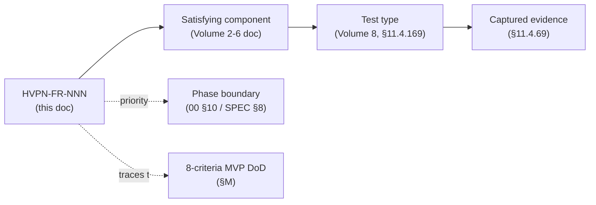

# Functional Requirements (HVPN-FR-NNN)

**Revision:** 4
**Last modified:** 2026-07-05T14:20:00Z

> **Rev 4 (2026-07-05, Phase-1 consolidation pass).** Added HVPN-FR-610 (RBAC
> role→action matrix enforcement) to close the RBAC ownership gap identified in
> [`../v00-meta/requirements-traceability.md`](../v00-meta/requirements-traceability.md)
> GAP-6. FR-610 is additive; §M DoD-traceability and §N parity-coverage tables are
> unaffected.
>
> **Rev 3 (2026-07-04, independent gap-analysis pass).** Added HVPN-FR-609
> (scoped, exportable audit slice for incident-response/compliance reporting) to
> back the MSP-operator incident-response journey added to
> [`personas-and-roles.md`](personas-and-roles.md) §2.2 (sibling file in this
> same `v01-product/` directory — relative link, not `v01-product/…` again).
> No other FR changed; the §M DoD-traceability and §N parity-coverage tables are
> unaffected (FR-609 is additive, not DoD/parity-mapped).

> **Reconciled (§11.4.35, 2026-06-26):** FR-101's RBAC role set is aligned to the
> authoritative `svc-identity.md` enum `{member, operator, admin}` (no "tenant
> owner"). FR-019 is restated as a fixed asymmetric per-leg default for MVP with
> map-driven per-leg policy deferred to P2. Owning-doc citations to the
> non-existent "Connector spec" / "edge spec" are repointed to concrete files
> (`v04-client/helix-core-rust.md` advertise/route mode + `v03-control-plane/svc-registry.md`
> for the connector; `01-data-plane.md` for the edge).

> **Document role.** Volume 1 deep document that enumerates **every functional
> requirement** of HelixVPN as a numbered, traceable list (`HVPN-FR-NNN`),
> grouped by capability area. It is the requirements spine the components and
> tests trace back to (the planned
> [`../v00-meta/requirements-traceability.md`](../v00-meta/requirements-traceability.md)
> closes the FR → component → test loop). It deepens the capability set of the
> overview [`00-product-scope-and-principles.md`](../00-product-scope-and-principles.md)
> — the Mullvad-parity matrix (§9), the differentiators (X1–X5), the seven
> principles (§8), and the 8-criteria MVP DoD (§10.2) — into testable statements.
>
> Non-functional requirements (perf/scale/availability/privacy/security SLOs) are
> a sibling document
> ([`nonfunctional-requirements.md`](nonfunctional-requirements.md), planned,
> `HVPN-NFR-NNN`); this document owns *functional* behaviour only. Where a
> requirement carries a quantitative target that is really an SLO (e.g. p99 < 1 s
> convergence), it is stated here as the functional acceptance gate and
> cross-referenced to the NFR doc.
>
> **Status:** SPEC-ONLY. Each FR's *satisfying component* names the Volume 2–6 doc
> that implements it; if that doc has not yet fixed the detail, the FR is the
> binding intent and the detail is `UNVERIFIED` (§11.4.6). Quantitative targets
> are quoted from the overview/spine/security-overview, never invented.
>
> **Convention.** RFC 2119 force (MUST/SHOULD/MAY) per [SPEC §0]. Priority ∈
> {**MVP** (Phase 1), **P2** (Phase 2), **P3** (Phase 3)} per the phase scope
> [00 §10], [SPEC §8]. Each FR row: **ID · Statement · Acceptance criterion ·
> Satisfying component (owning doc) · Priority**. Acceptance criteria requiring
> captured runtime evidence (§11.4.69) are flagged `[evidence]`.

---

## Table of contents

- [0. Numbering, priority & traceability](#0-numbering-priority--traceability)
- [A. Connect & transport (FR-0xx)](#a-connect--transport-fr-0xx)
- [B. Identity & enrollment (FR-1xx)](#b-identity--enrollment-fr-1xx)
- [C. Policy & authorization (FR-2xx)](#c-policy--authorization-fr-2xx)
- [D. Routing, addressing & multi-network (FR-3xx)](#d-routing-addressing--multi-network-fr-3xx)
- [E. Multi-hop (FR-4xx)](#e-multi-hop-fr-4xx)
- [F. Kill-switch & leak protection (FR-5xx)](#f-kill-switch--leak-protection-fr-5xx)
- [G. Console & administration (FR-6xx)](#g-console--administration-fr-6xx)
- [H. Connector (FR-7xx)](#h-connector-fr-7xx)
- [I. Observability & telemetry (FR-8xx)](#i-observability--telemetry-fr-8xx)
- [J. Deployment & self-host (FR-9xx)](#j-deployment--self-host-fr-9xx)
- [K. Clients & platform apps (FR-10xx)](#k-clients--platform-apps-fr-10xx)
- [L. Post-quantum & advanced privacy (FR-11xx)](#l-post-quantum--advanced-privacy-fr-11xx)
- [M. MVP Definition-of-Done traceability](#m-mvp-definition-of-done-traceability)
- [N. Parity-matrix → FR coverage](#n-parity-matrix--fr-coverage)
- [Sources verified](#sources-verified)

---

## 0. Numbering, priority & traceability

- IDs are stable and never reused (`HVPN-FR-NNN`, zero-padded). Areas are
  allocated number bands (A=0xx, B=1xx, … L=11xx) so insertions stay grouped.
- Every FR has exactly one **owning doc** (the Volume 2–6 spec that implements +
  tests it). The FR is the *what*; the owning doc is the *how*.
- Priority follows the phase boundary [00 §10]; an FR marked **P2/P3** MUST NOT be
  built before its phase (it is a tracked §11.4.93 workable item until then).
- Acceptance criteria are deliberately *falsifiable*: a metadata-only / config-only
  PASS is forbidden (§11.4 / §11.4.69); `[evidence]` marks criteria that require
  captured runtime evidence.

---

## A. Connect & transport (FR-0xx)

Owning docs: [`../01-data-plane.md`](../01-data-plane.md) and Volume 2
(`transport-*.md`, `transport-selection-ladder.md`, `obfuscation-and-dpi.md`).
Parity rows F1–F9 [00 §9].

| ID | Statement | Acceptance criterion | Owning doc | Priority |
|---|---|---|---|---|
| HVPN-FR-001 | The data channel MUST use WireGuard (Noise IK, Curve25519, ChaCha20-Poly1305) as the cryptographic core; obfuscation is a layer **beneath** WG, never a crypto fork. | A CI lint forbids edits to WG crypto primitives; a tunnel establishes with stock WG crypto. `[evidence]` handshake capture. | `01`, `v02-data-plane/wireguard-core.md` | MVP |
| HVPN-FR-002 | A Client MUST establish a plain-UDP WireGuard tunnel to the Gateway (fast path) reaching ≥80% of bare-link throughput. | G1: iperf3 capture client→gw→connector LAN ≥80% bare link. `[evidence]` | `v02-data-plane/transport-plain-udp.md` | MVP |
| HVPN-FR-003 | The data plane MUST expose obfuscation modes through a single `Transport` trait (one implementation, three consumers: client, connector, edge). | `Transport` trait compiles; client+edge share the same crate byte-for-byte. | `01` (§7.1 trait), `v02-data-plane/transport-trait.md` | MVP |
| HVPN-FR-004 | The Client MUST support MASQUE/QUIC (WG-over-HTTP-3, RFC 9298/9297/9221) obfuscation that survives a DPI UDP block. | G2: MASQUE survives an nftables UDP block at ≥50% of plain-WG throughput. `[evidence]` | `v02-data-plane/transport-masque-quic.md` | MVP |
| HVPN-FR-005 | The Client MUST support lightweight obfuscation (LWO — keyed WG-header obfs + padding) as a cheap signature-evasion rung. | A naive WG-signature block is evaded with LWO; tunnel passes traffic. `[evidence]` | `v02-data-plane/transport-lwo.md` | MVP |
| HVPN-FR-006 | The Client MUST automatically escalate transports on handshake failure: plain → LWO → MASQUE/QUIC (→ Shadowsocks → UoT in P2). | DoD#4: when plain WG is blocked, the client auto-escalates to MASQUE without user action. `[evidence]` | `v02-data-plane/transport-selection-ladder.md` | MVP |
| HVPN-FR-007 | The Client MUST allow the user to manually pin a transport (overriding the auto-ladder). | `helix_pin_transport(kind)` pins; `None` restores auto. | `03` (FFI), `v04-client/helix-core-rust.md` | MVP |
| HVPN-FR-008 | The edge MUST support port-based evasion (custom WG port / :443 / :53) and port-hopping. | Tunnel establishes on :443/udp and :53; a multi-listener accepts. `[evidence]` | `v02-data-plane/transport-masque-quic.md`, `01` (edge / data-plane) | MVP |
| HVPN-FR-009 | The Client MUST support Shadowsocks-wrapped WG (AEAD) as an obfuscation rung. | WG-in-Shadowsocks tunnel passes traffic under a QUIC/UDP-hostile network. `[evidence]` | `v02-data-plane/transport-shadowsocks.md` | P2 |
| HVPN-FR-010 | The Client MUST support UDP-over-TCP as the last-resort transport when UDP is fully blocked. | Tunnel survives a total UDP block via UoT. `[evidence]` | `v02-data-plane/transport-udp-over-tcp.md` | P2 |
| HVPN-FR-011 | The auto-ladder SHOULD use per-network memory + regional priors to pick the likely-working transport first. | The ladder records last-working transport per network and tries it first. | `v02-data-plane/transport-selection-ladder.md` | P2 |
| HVPN-FR-012 | The edge MUST support MASQUE CONNECT-IP (RFC 9484) as a native IP-over-HTTP/3 datapath (advanced, no inner WG). | CONNECT-IP path passes IP packets; interop verified. `[evidence]` | `01` (CONNECT-IP), `transport-masque-quic.md` | P2 |
| HVPN-FR-013 | The Client MUST be able to use the Gateway as a plain privacy exit (full-tunnel to the internet), the Mullvad use case. | Full-tunnel routes all traffic via the Gateway exit; egress IP is the Gateway's. `[evidence]` | `01`, `v04-client/helix-core-rust.md` | MVP |
| HVPN-FR-014 | The Client MUST support split tunneling (per-route, and per-app on Android/desktop). | A bypassed route/app egresses outside the tunnel; tunneled routes stay in. `[evidence]` | `03`, `v04-client/helix-core-rust.md` | MVP |
| HVPN-FR-015 | The Client MUST recover the tunnel automatically after a transient carrier drop, preserving the selected transport. | A simulated drop reconnects without user action; transport preserved. `[evidence]` | `v02-data-plane/orchestrator-and-state.md` | MVP |
| HVPN-FR-016 | The data plane MUST manage MTU correctly per transport (e.g. 1420 for plain WG; reduced under MASQUE). | No fragmentation/black-hole; large-payload transfer succeeds on each transport. `[evidence]` | `v02-data-plane/transport-plain-udp.md`, `wireguard-core.md` | MVP |
| HVPN-FR-017 | The data plane SHOULD support DAITA (constant packet sizing + cover traffic) as an orthogonal shaping layer **above** WG. | DAITA shaping produces constant-size packets; measured overhead within budget. `[evidence]` | `v02-data-plane/daita.md` | P2 |
| HVPN-FR-018 | The Client MUST present connection state transitions (Disconnected/Connecting(transport)/Connected/Reconnecting/Failed) to the UI via a hot status stream. | `helix_status_stream` emits each transition; UI is a pure function of it. `[evidence]` | `03` (§7.3 FFI), `v04-client/state-management.md` | MVP |
| HVPN-FR-019 | The transport topology MUST ship a **fixed asymmetric per-leg default in MVP** — user↔gateway runs the obfuscation ladder, gateway↔connector is plain WG/UDP; **map-driven configurable per-leg transport policy is P2.** | MVP: the default asymmetric legs are honoured (user↔gw escalates the ladder, gw↔connector is plain WG) with no per-leg config surface. P2: per-leg transport policy is overridable from the pushed network map. `[evidence]` | `01` (D6), `v03-control-plane/svc-coordinator.md` | MVP (fixed default) / P2 (configurable) |
| HVPN-FR-020 | The data plane MUST support direct P2P + NAT traversal with a DERP-style relay fallback. | A P2P session forms across a real NAT; relay fallback engages when hole-punching fails. `[evidence]` | `01`, `v02-data-plane/routing-and-addressing.md` | P2 |

---

## B. Identity & enrollment (FR-1xx)

Owning docs: [`../04-security-privacy-pki.md`](../04-security-privacy-pki.md),
[`../v05-security/identity-and-enrollment.md`](../v05-security/identity-and-enrollment.md),
[`../v03-control-plane/svc-identity.md`](../v03-control-plane/svc-identity.md),
[`../v03-control-plane/svc-pki.md`](../v03-control-plane/svc-pki.md). Parity rows
F15, F17.

| ID | Statement | Acceptance criterion | Owning doc | Priority |
|---|---|---|---|---|
| HVPN-FR-101 | The control plane MUST support OIDC identity for human principals (RBAC roles `admin` / `operator` / `member`, per `svc-identity.md`). | OIDC login yields a tenant-scoped identity with the correct RBAC role. `[evidence]` | `svc-identity.md` | MVP |
| HVPN-FR-102 | The control plane MUST support anonymous device-token enrollment (no email / no PII) alongside OIDC. | A device enrolls and connects with no PII captured. `[evidence]` | `svc-identity.md`, `identity-and-enrollment.md` | MVP |
| HVPN-FR-103 | A device MUST generate its WireGuard keypair on-device; the private key MUST NEVER leave the device. | The `pki`/registry schema has no private-key column; only the 32-byte public key is transmitted. `[evidence]` schema + wire capture. | `identity-and-enrollment.md`, `svc-pki.md` | MVP |
| HVPN-FR-104 | Enrollment MUST be gated by a device cert + enrollment token. | An unenrolled/untokened device is refused; a valid token enrolls. `[evidence]` | `svc-identity.md`, `identity-and-enrollment.md` | MVP |
| HVPN-FR-105 | Every agent MUST authenticate the control channel with a short-lived (≤24 h, auto-renew) tenant-CA-signed mTLS device cert. | A control RPC with an expired/absent cert is rejected; auto-renew succeeds before expiry. `[evidence]` | `svc-pki.md`, `pki-and-certs.md` | MVP |
| HVPN-FR-106 | The control channel and data channel MUST share no key material (cert compromise ≠ WG key; WG-key theft ≠ control auth). | Compromising one channel does not authenticate the other (tested). `[evidence]` | `04` (§1.2), `svc-pki.md` | MVP |
| HVPN-FR-107 | An admin MUST be able to see and revoke a device; revocation MUST be enforced at the edge within p99 < 1 s. | DoD#6: device revoke enforced <1 s — WG peer dropped, cert revoked, edge verdict removed atomically. `[evidence]` | `svc-registry.md`, `svc-pki.md`, edge | MVP |
| HVPN-FR-108 | The CA hierarchy MUST be per-tenant; the tenant CA key is the single root secret to protect. | Each tenant has its own CA; cross-tenant cert validation fails. `[evidence]` | `svc-pki.md`, `pki-and-certs.md` | MVP |
| HVPN-FR-109 | Device certs MUST rotate automatically without user interaction or tunnel interruption. | A cert rotation occurs mid-session with no tunnel drop. `[evidence]` | `pki-and-certs.md` | MVP |
| HVPN-FR-110 | The system MUST support multi-tenant identity isolation enforced at the database (RLS), not only the app layer. | A cross-tenant read is denied by Postgres RLS even with app-layer bypass attempt. `[evidence]` | `data-model-ddl.md`, `svc-identity.md` | MVP |
| HVPN-FR-111 | Enrollment MUST be available to all three system roles (Client, Connector, and — for HA — additional edges). | Both a Connector and a Client enroll (DoD#2). `[evidence]` | `svc-registry.md` | MVP |

---

## C. Policy & authorization (FR-2xx)

Owning docs: [`../v03-control-plane/svc-policy.md`](../v03-control-plane/svc-policy.md),
[`../v05-security/zero-trust-and-default-deny.md`](../v05-security/zero-trust-and-default-deny.md).
Principle P-zero-trust; parity row (no-logging adjacency).

| ID | Statement | Acceptance criterion | Owning doc | Priority |
|---|---|---|---|---|
| HVPN-FR-201 | Policy MUST be default-deny and fail-closed: the empty policy denies all; a compiler error denies rather than opens. | An unpoliced device has empty `AllowedIPs` and no verdict entry → reaches nothing. `[evidence]` | `svc-policy.md`, `zero-trust-and-default-deny.md` | MVP |
| HVPN-FR-202 | The policy compiler MUST accept a Tailscale-ACL-flavored model (`group:X → net:Y:port/proto`). | A sample ACL compiles to per-peer `AllowedIPs` + verdict map. `[evidence]` | `svc-policy.md` | MVP |
| HVPN-FR-203 | Policy MUST compile to two enforcement artefacts per device: WG `AllowedIPs` and an edge verdict map keyed `(src_overlay_ip, dst_cidr, l4proto, dport)`. | Both artefacts emitted; an allowed flow passes, a denied flow drops at the edge. `[evidence]` | `svc-policy.md`, `01` (§8 verdict map) | MVP |
| HVPN-FR-204 | A Client MUST reach an authorized LAN host AND be denied an unauthorized one. | DoD#3: authorized host reachable, unauthorized denied (default-deny proven). `[evidence]` | `svc-policy.md`, edge | MVP |
| HVPN-FR-205 | A policy edit MUST take effect within p99 < 1 s with no service restart. | DoD#5: an ACL change is enforced <1 s, no restart. `[evidence]` | `svc-policy.md`, `svc-coordinator.md` | MVP |
| HVPN-FR-206 | Split horizon MUST be the default: Connectors cannot reach each other and Clients cannot reach un-granted networks unless policy says so. | Two connectors are mutually unreachable absent a rule; a client is denied a non-granted network. `[evidence]` | `svc-policy.md`, `routing-and-addressing.md` | MVP |
| HVPN-FR-207 | Map distribution MUST be need-to-know: a device's network map contains only the peers/routes its policy already grants (filtered server-side, before the wire). | A device's `WatchNetworkMap` snapshot omits non-granted peers. `[evidence]` | `svc-coordinator.md`, `04` (S3) | MVP |
| HVPN-FR-208 | Policy SHOULD be expressible as policy-as-code / GitOps. | A policy committed to a repo reconciles into the control plane. `[evidence]` | `svc-policy.md` | P2 |

---

## D. Routing, addressing & multi-network (FR-3xx)

Owning docs: [`../v02-data-plane/routing-and-addressing.md`](../v02-data-plane/routing-and-addressing.md),
[`../v03-control-plane/svc-ipam.md`](../v03-control-plane/svc-ipam.md). Differentiators
X1/X2 [00 §9], multi-network model [00 §4.2], D4.

| ID | Statement | Acceptance criterion | Owning doc | Priority |
|---|---|---|---|---|
| HVPN-FR-301 | The Gateway MUST give one user policy-scoped access to N joined private networks (the 1→N overlay). | A single user reaches granted hosts across ≥2 distinct connector networks. `[evidence]` | `routing-and-addressing.md`, `svc-policy.md` | MVP |
| HVPN-FR-302 | The system MUST resolve overlapping RFC1918 ranges across connectors so two networks both exposing `192.168.1.0/24` never collide. | Two connectors advertising the same CIDR are reachable as distinct address spaces. `[evidence]` | `routing-and-addressing.md`, `svc-ipam.md` | MVP |
| HVPN-FR-303 | The overlay MUST assign each tenant an IPv6 ULA /48 and map advertised IPv4 LANs into it via 4via6 (D4 recommendation), with per-network NAT as a documented fallback. | An advertised IPv4 LAN is reachable through its 4via6 mapping; NAT fallback documented + testable. `[evidence]` | `svc-ipam.md`, `routing-and-addressing.md` | MVP |
| HVPN-FR-304 | Each node MUST receive a stable overlay IP. | A node's overlay IP persists across reconnects. `[evidence]` | `svc-ipam.md` | MVP |
| HVPN-FR-305 | A Connector MUST advertise the CIDRs its network exposes (`route.advertised`), and the Gateway MUST route authorized client traffic into that LAN and responses back out. | DoD#3 path: client → gateway → connector LAN host and back. `[evidence]` | `svc-registry.md`, edge, `routing-and-addressing.md` | MVP |
| HVPN-FR-306 | The Gateway MUST route between the network-side leg (Connector→Gateway) and the user-side leg (Client→Gateway) — the "two-way" model — without either side opening an inbound port. | Both legs are outbound; the Gateway stitches them; no inbound listener on any private network. `[evidence]` | `01` (edge / data-plane), `v04-client/helix-core-rust.md` (advertise/route mode), `svc-registry.md` | MVP |
| HVPN-FR-307 | The IPAM service MUST allocate from the tenant overlay pool and track host allocations + 4via6 mappings. | Pool allocation is collision-free under concurrent enrollment. `[evidence]` stress test. | `svc-ipam.md` | MVP |

---

## E. Multi-hop (FR-4xx)

Owning docs: [`../v02-data-plane/multihop.md`](../v02-data-plane/multihop.md),
`02`/`03`. Parity row F10.

| ID | Statement | Acceptance criterion | Owning doc | Priority |
|---|---|---|---|---|
| HVPN-FR-401 | The Client MUST support multi-hop (entry/exit separation) via nested WireGuard with per-hop keys. | A two-hop path forms; entry and exit use separate keys; egress IP is the exit's. `[evidence]` | `multihop.md` | P2 |
| HVPN-FR-402 | Multi-hop path selection MUST be control-plane-orchestrated (entry/exit chosen via the network map). | The coordinator delivers the entry/exit pair; the client establishes the nested tunnels. `[evidence]` | `multihop.md`, `svc-coordinator.md` | P2 |
| HVPN-FR-403 | Multi-hop SHOULD allow entry/exit jurisdiction separation (entry and exit in different regions). | Entry and exit resolve to different regions when configured. `[evidence]` | `multihop.md` | P2 |

---

## F. Kill-switch & leak protection (FR-5xx)

Owning docs: [`../v05-security/kill-switch-and-dns-leak.md`](../v05-security/kill-switch-and-dns-leak.md),
`03`. Parity rows F11/F13; invariant S9.

| ID | Statement | Acceptance criterion | Owning doc | Priority |
|---|---|---|---|---|
| HVPN-FR-501 | The kill-switch MUST be core-owned state (driven by `helix-core`'s state machine), not hand-edited firewall rules. | The kill-switch is set/cleared by the core state machine; no manual rule editing path. `[evidence]` | `kill-switch-and-dns-leak.md` | MVP |
| HVPN-FR-502 | No plaintext egress MUST occur when the tunnel is down OR while escalating transports. | DoD#7: on tunnel drop, no packet leaks outside the tunnel. `[evidence]` leak capture. | `kill-switch-and-dns-leak.md` | MVP |
| HVPN-FR-503 | The Client MUST force DNS through the tunnel and block plaintext :53 off-tunnel (DNS-leak protection). | DoD#7: DNS queries resolve only through the tunnel; off-tunnel :53 is blocked. `[evidence]` | `kill-switch-and-dns-leak.md` | MVP |
| HVPN-FR-504 | The kill-switch MUST be implemented per-OS via the OS firewall, driven by the same core state machine across platforms. | Each supported OS enforces the kill-switch via its firewall from the shared state machine. `[evidence]` | `kill-switch-and-dns-leak.md`, platform shims | MVP |

---

## G. Console & administration (FR-6xx)

Owning docs: [`../v03-control-plane/svc-api.md`](../v03-control-plane/svc-api.md),
[`../v04-client/web-console.md`](../v04-client/web-console.md),
[`../v05-security/audit-and-compliance.md`](../v05-security/audit-and-compliance.md).
Persona: business-admin / tenant-owner [00 §5.3].

| ID | Statement | Acceptance criterion | Owning doc | Priority |
|---|---|---|---|---|
| HVPN-FR-601 | The Console MUST provide CRUD for tenants, users, devices, networks, routes, and policies. | Each entity is creatable/readable/updatable/deletable subject to RBAC. `[evidence]` | `svc-api.md`, `web-console.md` | MVP |
| HVPN-FR-602 | The Console MUST be an API-client-only build with no tunnel core (`runHelixApp(Console, …)` omits `core_ffi`). | The Console build links no Rust tunnel core; runs in browser + desktop from the same Flutter tree. `[evidence]` | `web-console.md`, `03` | MVP |
| HVPN-FR-603 | The Console MUST receive live state updates (WS/SSE) — no polling for topology/state. | A policy/device change pushes to the Console live. `[evidence]` | `svc-api.md` | MVP |
| HVPN-FR-604 | The Console MUST present a live topology view of tenants/networks/devices/routes. | The topology view reflects current state and updates on change. `[evidence]` | `web-console.md` | MVP |
| HVPN-FR-605 | The Console MUST surface an audit trail of **control** actions (who-did-what to identity/policy/devices), never destinations/flows. | `audit_events` shows control mutations; no traffic destinations recorded. `[evidence]` schema + UI. | `audit-and-compliance.md`, `svc-telemetry.md` | MVP |
| HVPN-FR-606 | The Console MUST support multi-tenant management with strict per-tenant isolation. | An admin of tenant A cannot see tenant B's resources. `[evidence]` | `web-console.md`, RLS | MVP |
| HVPN-FR-607 | The Console MAY provide optional multi-tenant billing. | Billing flows function for the managed SKU when enabled; absent by default. | `web-console.md` | P3 |
| HVPN-FR-608 | The Console MUST be responsive across phone/tablet/desktop and ship light + dark themes from the OpenDesign system. | Visual-regression suite passes light+dark; no element overlap/overlay (§11.4.162). `[evidence]` | `web-console.md`, Volume 10 | MVP |
| HVPN-FR-609 | The Console MUST let an admin/operator filter and export a control-action audit slice (device/user/time-window/tenant-scoped) for incident-response or compliance reporting, containing zero traffic/destination data and zero rows outside the caller's authorized tenant scope. | An exported slice for tenant A + a time window contains only tenant-A control-action rows (RLS-bounded export, not just RLS-bounded live view); the export itself is an audited control action. `[evidence]` | `audit-and-compliance.md`, `svc-telemetry.md` | MVP |
| HVPN-FR-610 | The control plane MUST enforce an RBAC role→action matrix: a principal with role `member` MUST NOT perform `operator` actions, and a principal with role `operator` MUST NOT perform `admin` actions. | A `member`-role token invoking an admin-only route (e.g. mint enroll-token, revoke device, delete tenant) returns 403; an `operator`-role token invoking an admin-only route returns 403; RLS still blocks cross-tenant reads even if RBAC is bypassed. `[evidence]` | `svc-identity.md`, `svc-api.md` | MVP |

---

## H. Connector (FR-7xx)

Owning docs: [`../v04-client/helix-core-rust.md`](../v04-client/helix-core-rust.md)
(advertise/route mode) + Volume 4 platform shims (`shim-*.md`) +
[`../v03-control-plane/svc-registry.md`](../v03-control-plane/svc-registry.md)
(there is no standalone "Connector spec" file — the Connector is the same
`helix-core` in advertise/route mode plus its registry contract).
Differentiator X2; persona connector-operator [00 §5.2].

| ID | Statement | Acceptance criterion | Owning doc | Priority |
|---|---|---|---|---|
| HVPN-FR-701 | The Connector MUST dial outbound to the Gateway and MUST NOT require any inbound port-forward. | The Connector establishes the tunnel with zero inbound exposure on its network. `[evidence]` | `helix-core-rust.md` (advertise/route mode), `svc-registry.md` | MVP |
| HVPN-FR-702 | The Connector MUST run headless (daemon) with an optional slim config UI. | The daemon runs without a UI; the optional UI configures it. `[evidence]` | `helix-core-rust.md` (advertise/route mode) | MVP |
| HVPN-FR-703 | The Connector MUST share the same Rust `helix-core` as the Client, in advertise/route mode (not capture mode). | The Connector links the same crate; runs in advertise/route mode. | `helix-core-rust.md` | MVP |
| HVPN-FR-704 | The Connector MUST advertise its network's CIDRs to the Gateway and route authorized traffic into the LAN. | Advertised CIDR appears in the registry; authorized client reaches a LAN host. `[evidence]` | `svc-registry.md`, `01` (edge) | MVP |
| HVPN-FR-705 | The Connector SHOULD support local ACLs scoped to its own network, interacting with central policy by the precedence rule defined in `svc-policy.md`. | A local ACL on the connector is honoured for its network; local-deny overrides central-allow, central-deny overrides local-allow, and the connector advertises its `local_denylist` to the coordinator. `[evidence]` | `svc-policy.md`, `helix-core-rust.md` (advertise/route mode) | MVP |
| HVPN-FR-706 | The Connector MUST be runnable on Android/embedded appliance hardware in addition to Linux/Windows/macOS. | A Connector build runs on an embedded/Android target. `[evidence]` | `helix-core-rust.md` (advertise/route mode), `shim-android.md` | P2 |
| HVPN-FR-707 | The Connector MUST follow availability-following on drop: detect, log offline, reconnect with defined timings, resume (§11.4.144 alignment). | A simulated drop is logged offline, reconnected, and resumed with no silent gap. `[evidence]` | `orchestrator-and-state.md` | MVP |

---

## I. Observability & telemetry (FR-8xx)

Owning docs: [`../v03-control-plane/svc-telemetry.md`](../v03-control-plane/svc-telemetry.md),
[`../v06-deploy/observability.md`](../v06-deploy/observability.md),
[`../v05-security/no-logging-as-code.md`](../v05-security/no-logging-as-code.md).
Principle P7; parity row F14.

| ID | Statement | Acceptance criterion | Owning doc | Priority |
|---|---|---|---|---|
| HVPN-FR-801 | The data plane MUST persist only aggregate counters + ephemeral routing/presence state — NO durable connection/traffic/packet table. | DoD#8: a CI schema-lint fails the build if a connection-log-shaped durable table appears; runtime check confirms none. `[evidence]` | `no-logging-as-code.md`, `data-model-ddl.md` | MVP |
| HVPN-FR-802 | Live presence/routing state MUST live in TTL'd Redis (ephemeral), never a durable table. | Presence entries expire on TTL; no durable persistence of presence. `[evidence]` | `svc-events.md`, `no-logging-as-code.md` | MVP |
| HVPN-FR-803 | The control plane MUST expose health + counters as Prometheus metrics. | Prometheus scrapes counters/health; metrics carry no flow/destination data. `[evidence]` | `svc-telemetry.md`, `observability.md` | MVP |
| HVPN-FR-804 | The system MUST expose convergence + event-lag SLOs as observable metrics. | Convergence p99 and event-lag are measurable from metrics. `[evidence]` | `observability.md`, NFR doc | MVP |
| HVPN-FR-805 | Telemetry MUST be derivable as counts only (no flows) for product success metrics. | Success-metric dashboards use counts; no per-flow data exists to query. `[evidence]` | `svc-telemetry.md`, `success-metrics.md` | MVP |

---

## J. Deployment & self-host (FR-9xx)

Owning docs: [`../05-repo-layout-tooling-and-helix-ecosystem.md`](../05-repo-layout-tooling-and-helix-ecosystem.md),
[`../v06-deploy/helixvpnctl.md`](../v06-deploy/helixvpnctl.md),
[`../v06-deploy/podman-quadlets.md`](../v06-deploy/podman-quadlets.md),
[`../v06-deploy/ha-and-multiregion.md`](../v06-deploy/ha-and-multiregion.md).
Principle P6; differentiator X3.

| ID | Statement | Acceptance criterion | Owning doc | Priority |
|---|---|---|---|---|
| HVPN-FR-901 | A self-hoster MUST stand up a Gateway from zero on a clean VPS with one `helixvpnctl init`. | DoD#1: `helixvpnctl init` brings up edge + control + Postgres + Redis in one rootless Podman pod. `[evidence]` | `helixvpnctl.md`, `podman-quadlets.md` | MVP |
| HVPN-FR-902 | Deployment MUST be rootless Podman (one pod for homelab), per §11.4.161. | The pod runs rootless; no root/sudo escalation. `[evidence]` | `podman-quadlets.md` | MVP |
| HVPN-FR-903 | The same OCI image set MUST scale to an HA multi-region fleet without a code rewrite (deployment topology change only). | The same images deploy as N stateless coordinators + Patroni PG + NATS. `[evidence]` | `ha-and-multiregion.md` | P2 |
| HVPN-FR-904 | `helixvpnctl` MUST provide init / key management / enrollment-token / policy / revoke commands. | Each subcommand functions end-to-end. `[evidence]` | `helixvpnctl.md` | MVP |
| HVPN-FR-905 | Deployment MUST also be expressible as Docker Compose and Kubernetes manifests. | Equivalent Compose + K8s manifests bring up the stack. `[evidence]` | `docker-compose.md`, `kubernetes.md` | P2 |
| HVPN-FR-906 | The edge/data-plane container MUST be hardened: read-only rootfs, seccomp, `NET_ADMIN`-only, no SSH (S8). | The container runs with only `NET_ADMIN`, read-only rootfs, seccomp profile; no SSH. `[evidence]` | `podman-quadlets.md`, `04` (S8) | MVP |
| HVPN-FR-907 | The system MUST be fail-static: if the control plane is down, existing tunnels keep forwarding. | DoD-adjacent: control plane stopped mid-session → existing tunnel keeps forwarding. `[evidence]` | `01` (edge / data-plane), `02` | MVP |
| HVPN-FR-908 | Any gitignored build-essential artefact MUST have a documented regeneration/re-obtain mechanism (§11.4.77). | A fresh clone regenerates required artefacts via `scripts/setup.sh`. `[evidence]` | `repo-layout-and-decoupling.md` | MVP |

---

## K. Clients & platform apps (FR-10xx)

Owning docs: [`../03-client-core-and-ui.md`](../03-client-core-and-ui.md) and
Volume 4 (`helix-core-rust.md`, `ffi-surface.md`, `helix-ui-flutter.md`,
`shim-*.md`). Differentiator X5; persona privacy-consumer/end-user.

| ID | Statement | Acceptance criterion | Owning doc | Priority |
|---|---|---|---|---|
| HVPN-FR-1001 | The three apps (Access, Connector, Console) MUST build from one Flutter tree via `runHelixApp(flavor, home, capabilities)`. | All three flavors build from one tree; capability gating differs per flavor. `[evidence]` | `helix-ui-flutter.md` | MVP |
| HVPN-FR-1002 | Access + Connector MUST share one Rust `helix-core`; UI is a pure function of the FFI status stream. | Both apps link the same core; UI state derives from `helix_status_stream`. `[evidence]` | `helix-core-rust.md`, `ffi-surface.md`, `state-management.md` | MVP |
| HVPN-FR-1003 | The Access app MUST ship a one-button connect experience (Mullvad-style). | One tap connects with auto-obfuscation; minimal user decisions. `[evidence]` | `helix-ui-flutter.md`, Volume 10 | MVP |
| HVPN-FR-1004 | The iOS `NEPacketTunnelProvider` MUST run the Rust core under the platform memory ceiling with ≥30% headroom. | G3 (make-or-break): on-device RSS profile shows ≥30% headroom under the ~15 MB ceiling. `[evidence]` | `shim-apple.md`, `03` | MVP |
| HVPN-FR-1005 | The Android app MUST integrate `VpnService` + JNI (builder/protect/fd handoff) with background-kill resilience. | The app tunnels on Android; survives background; fd handoff correct. `[evidence]` | `shim-android.md` | MVP |
| HVPN-FR-1006 | The Linux client MUST integrate kernel WG/tun + systemd. | The Linux client tunnels via kernel WG. `[evidence]` | `shim-linux.md` | MVP |
| HVPN-FR-1007 | The Windows client MUST integrate `wireguard-nt`/wintun + a privileged service with named-pipe IPC and WFP split-tunnel. | The Windows app tunnels via wireguard-nt; split-tunnel via WFP works. `[evidence]` | `shim-windows.md` | P2 |
| HVPN-FR-1008 | The macOS client MUST integrate the Network Extension (`NEPacketTunnelProvider`) desktop app. | The macOS app tunnels via NE. `[evidence]` | `shim-apple.md` | P2 |
| HVPN-FR-1009 | The Access app MUST build and tunnel on HarmonyOS NEXT (OpenHarmony Flutter fork, Network Kit VPN ability). | On-device: the app tunnels on HarmonyOS NEXT. `[evidence]` (biggest platform risk) | `shim-harmonyos.md` | P3 |
| HVPN-FR-1010 | The Access app MUST build and tunnel on Aurora OS (omprussia Flutter, Qt/C++ tun shim, signed RPM). | On-device: the app tunnels on Aurora. `[evidence]` | `shim-aurora.md` | P3 |
| HVPN-FR-1011 | The Web build MUST be Console (management) only, with an OPTIONAL in-page WASM MASQUE proxy that proxies the **browser's own** traffic — never a system VPN. | The Web build manages the system; the WASM proxy (when present) reaches a joined network from the browser only. `[evidence]` | `web-console.md` | P3 |
| HVPN-FR-1012 | The Access app MUST let the user pick exit/network and toggle obfuscation. | Exit/network selection + obfuscation toggle function. `[evidence]` | `helix-ui-flutter.md`, `ffi-surface.md` | MVP |
| HVPN-FR-1013 | All client apps MUST ship light + dark theme variants per the OpenDesign system, with no element overlap/overlay. | Visual-regression light+dark passes (§11.4.162). `[evidence]` | Volume 10 | MVP |
| HVPN-FR-1014 | All three apps MUST drive the system end-to-end (DoD#8 second clause). | DoD#8: Access + Connector + Console all drive the live system. `[evidence]` | all client docs | MVP |

---

## L. Post-quantum & advanced privacy (FR-11xx)

Owning docs: [`../v05-security/post-quantum.md`](../v05-security/post-quantum.md),
`01`/`02`. Parity row F16; invariant S10.

| ID | Statement | Acceptance criterion | Owning doc | Priority |
|---|---|---|---|---|
| HVPN-FR-1101 | The handshake MUST support a post-quantum KEM (ML-KEM / FIPS-203) deriving a PSK mixed into the classical WG handshake. | A PQ-enabled handshake interops and is measured; the PSK is mixed in. `[evidence]` | `post-quantum.md` | P2 |
| HVPN-FR-1102 | PQ MUST be hybrid, never PQ-only: with PQ off, classical WG remains secure; with PQ on, an attacker must break both. | Disabling PQ leaves a secure classical tunnel; enabling adds the PQ layer. `[evidence]` | `post-quantum.md` | P2 |
| HVPN-FR-1103 | The system MAY evaluate Rosenpass as an alternative PQ mechanism. | A documented evaluation of Rosenpass vs ML-KEM PSK exists. | `post-quantum.md` | P2 |

---

## M. MVP Definition-of-Done traceability

The 8-criteria MVP DoD [00 §10.2], [SPEC §8.1] maps onto the FRs above. Every DoD
criterion MUST be satisfied with captured runtime evidence (§11.4.69); none may be
a metadata-only PASS.

| DoD # | Criterion | Satisfying FR(s) |
|---|---|---|
| DoD-1 | Self-host from zero via `helixvpnctl init` | FR-901, FR-902 |
| DoD-2 | Enroll a Connector AND a Client | FR-104, FR-111, FR-701 |
| DoD-3 | Reach an authorized LAN host AND deny an unauthorized one | FR-204, FR-201, FR-305, FR-306 |
| DoD-4 | Auto-escalate to MASQUE when plain WG is blocked | FR-006, FR-004 |
| DoD-5 | Policy edit reflected < 1 s, no restart | FR-205 |
| DoD-6 | Device revoke enforced < 1 s | FR-107 |
| DoD-7 | Kill-switch + DNS-leak protection (no leak on drop) | FR-501, FR-502, FR-503, FR-504 |
| DoD-8 | No durable connection log AND all three apps drive the system | FR-801, FR-1014 |

---

## N. Parity-matrix → FR coverage

Every Mullvad-parity row [00 §9] and HelixVPN-beyond-Mullvad row maps to ≥1 FR, so
the parity matrix is the acceptance checklist and nothing is orphaned.

| Parity row | Feature | FR(s) | Priority |
|---|---|---|---|
| F1 | WireGuard-only crypto | FR-001 | MVP |
| F2 | QUIC obfuscation (MASQUE) | FR-004 | MVP |
| F3 | MASQUE CONNECT-IP | FR-012 | P2 |
| F4 | Shadowsocks | FR-009 | P2 |
| F5 | UDP-over-TCP | FR-010 | P2 |
| F6 | LWO | FR-005 | MVP |
| F7 | Automatic obfuscation | FR-006 | MVP |
| F8 | Custom WG port / 443 / 53 | FR-008 | MVP |
| F9 | DAITA | FR-017 | P2 |
| F10 | Multi-hop | FR-401, FR-402, FR-403 | P2 |
| F11 | Kill-switch | FR-501, FR-502, FR-504 | MVP |
| F12 | Split tunneling | FR-014 | MVP |
| F13 | DNS leak protection | FR-503 | MVP |
| F14 | No-logging | FR-801, FR-802 | MVP |
| F15 | Anonymous account (no email) | FR-102 | MVP |
| F16 | Post-quantum handshake | FR-1101, FR-1102 | P2 |
| F17 | Per-device management | FR-107 | MVP |
| X1 | Multi-network overlay (1 user → N nets) | FR-301, FR-302, FR-303 | MVP |
| X2 | Outbound-only network onboarding | FR-701, FR-306 | MVP |
| X3 | Self-hostable Mullvad-class stack | FR-901, FR-903 | MVP |
| X4 | Direct P2P + NAT traversal + relay | FR-020 | P2 |
| X5 | 8-platform reach incl. Aurora + HarmonyOS | FR-1004..FR-1011 | MVP/P2/P3 |

> **Coverage honesty (§11.4.118).** This FR set covers the overview's enumerated
> capability set (parity matrix F1–F17, differentiators X1–X5, the 8 DoD criteria,
> and the seven principles). It is *necessary, not provably exhaustive*: a capability
> introduced by a later Volume 2–6 doc that the overview did not enumerate becomes a
> new FR via the §11.4.93 workable-item path. FR-705 local-ACL × central-policy
> precedence is now pinned in `svc-policy.md` and `helix-core-rust.md`. No requirement
> quotes a quantitative target not present in the overview/spine/security-overview.

---

## Sources verified

- [`00-product-scope-and-principles.md`](../00-product-scope-and-principles.md) §8
  (seven principles → FR-001/201/801/901/907), §9 (parity matrix F1–F17, X1–X5 →
  §N), §10.2 (8-criteria MVP DoD → §M), §3/§4 (roles + two-way/multi-network →
  FR-3xx/7xx), §11 (decisions D1/D4/D6 → FR-004/303/019).
- [`SPECIFICATION.md`](../SPECIFICATION.md) §7 (the three cross-cutting contracts:
  `Transport` trait → FR-003, `WatchNetworkMap` → FR-205/207, FFI → FR-018), §8
  (phase roadmap + gates G1–G6 → FR-002/004/1004, DoD → §M), §9 (decision register).
- [`04-security-privacy-pki.md`](../04-security-privacy-pki.md) §0.1 (S1–S11 →
  FR-103/106/107/201/207/801/906), §1.2/§1.3 (auth channels + default-deny).
- [`MASTER_INDEX.md`](../MASTER_INDEX.md) Volume 1 row (declared scope: "Every FR,
  numbered (HVPN-FR-NNN), with acceptance"); owning-doc filenames cross-referenced
  from the Volume 2/3/4/5/6/10 rows.

*Honesty note (§11.4.6): every quantitative acceptance target (≥80%/≥50%
throughput, p99 < 1 s convergence/revocation, ~15 MB / ≥30% memory headroom) is
quoted from the overview/spine/security-overview, never invented. FR-705's
local-ACL × central-policy precedence is now pinned in `svc-policy.md` and
`helix-core-rust.md`; residual `UNVERIFIED` markers (e.g. FR-1103 evaluation)
remain where the owning doc explicitly does not pin runtime behaviour. `[evidence]`
flags criteria requiring captured runtime evidence per §11.4.69 — none may pass on
metadata/config-only signal.*

*Constitution bindings: §11.4.44 (revision header), §11.4.6 (no-guessing —
UNVERIFIED on un-pinned contracts; targets quoted not invented), §11.4.69
(captured-evidence acceptance), §11.4.93 (each FR → workable item), §11.4.118
(coverage honesty), §11.4.169 (acceptance tied to mandatory test types, Volume 8),
§11.4.65/.153 (HTML+PDF[+DOCX] exports follow in refinement).*
