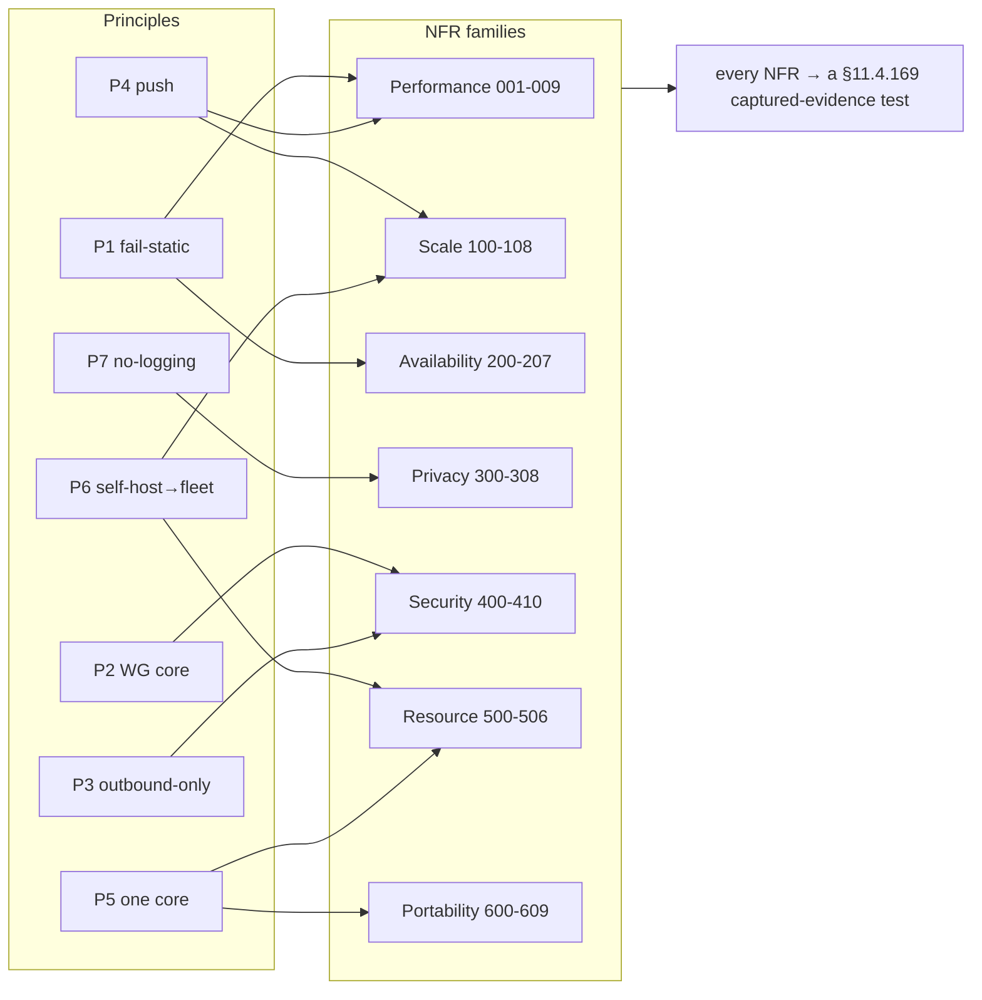
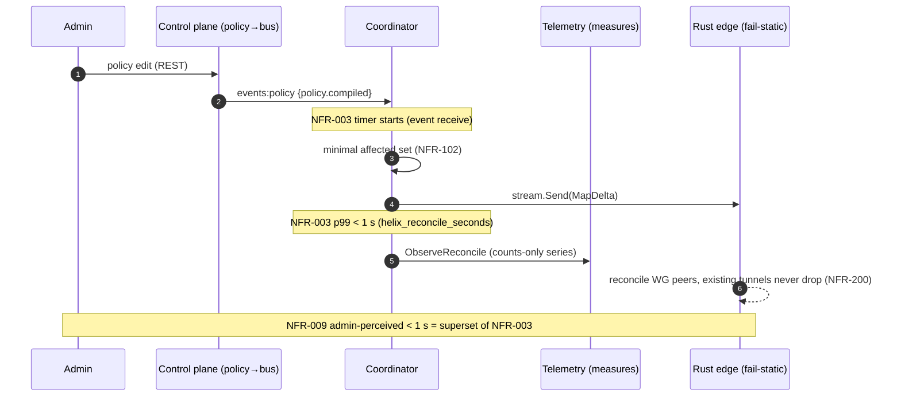

# Non-Functional Requirements (HVPN-NFR-NNN)

**Revision:** 1
**Last modified:** 2026-06-26T12:00:00Z

> **Document role.** This is the Volume 1 (Product & Requirements) nano-detail
> spec enumerating every HelixVPN **non-functional requirement (NFR)** —
> performance, scale, availability/HA, privacy, security, resource, and
> portability — each numbered `HVPN-NFR-NNN`. It is the quantified counterpart
> to the *seven non-negotiable principles* and the *Mullvad-parity matrix* of
> the Volume 1 overview (`00-product-scope-and-principles.md`). Where a value is
> a **target not yet proven on hardware** it is stated as a TARGET and marked
> `UNVERIFIED` per §11.4.6 (no-guessing) — a number that only a Phase-0/1 gate or
> a captured benchmark can confirm is never asserted as established fact here.
>
> **Document is a SPEC.** It states *what quality bars the product must meet and
> how each is verified*; it does not build the product. Every NFR carries a
> measurable target plus the §11.4.169 test type that proves it, so each row is
> falsifiable rather than aspirational (§11.4 / §11.4.169).
>
> **Evidence base.** Cross-references the Volume 1 overview
> (`00-product-scope-and-principles.md` — principles P1–P7, parity matrix F1–F17,
> decisions D1–D7, scope §10), the control-plane coordinator SLO
> (`v03-control-plane/svc-coordinator.md` §7 — convergence p99 < 1 s), the
> telemetry counts-only metric registry (`v03-control-plane/svc-telemetry.md`
> §3 — what may be measured), the no-logging invariant
> (`v05-security/no-logging-as-code.md` — the privacy NFRs as testable bars), and
> the transport ladder (`v02-data-plane/transport-selection-ladder.md`). Source
> research is cited by the same ids the overview uses (`[04_ARCH §N]`, `[04_P0]`,
> `[04_P1]`).

---

## Table of contents

- [1. How to read an NFR row](#1-how-to-read-an-nfr-row)
- [2. Performance NFRs (HVPN-NFR-001…)](#2-performance-nfrs-hvpn-nfr-001)
- [3. Scale NFRs (HVPN-NFR-100…)](#3-scale-nfrs-hvpn-nfr-100)
- [4. Availability & HA NFRs (HVPN-NFR-200…)](#4-availability--ha-nfrs-hvpn-nfr-200)
- [5. Privacy NFRs (HVPN-NFR-300…)](#5-privacy-nfrs-hvpn-nfr-300)
- [6. Security NFRs (HVPN-NFR-400…)](#6-security-nfrs-hvpn-nfr-400)
- [7. Resource NFRs (HVPN-NFR-500…)](#7-resource-nfrs-hvpn-nfr-500)
- [8. Portability NFRs (HVPN-NFR-600…)](#8-portability-nfrs-hvpn-nfr-600)
- [9. NFR → principle → verification traceability](#9-nfr--principle--verification-traceability)
- [10. The convergence-NFR dependency chain](#10-the-convergence-nfr-dependency-chain)
- [Sources verified](#sources-verified)

---

## 1. How to read an NFR row

Every NFR is one row with five fixed fields, so each is independently testable
(§11.4 — a quality bar with no measurement is a PASS-bluff at the requirements
layer):

| Field | Meaning |
|---|---|
| **ID** | `HVPN-NFR-NNN`, stable, append-only — the cross-doc reference key (§11.4.54 discipline applied to NFRs). |
| **Statement** | the qualitative requirement (one sentence). |
| **Target** | the measurable bar (number + unit + percentile/condition). `TARGET` = not yet proven on hardware (`UNVERIFIED` §11.4.6). |
| **Verify by** | the §11.4.169 test type whose captured evidence proves it (unit / integration / e2e / performance / soak-stress / chaos / security / memory / benchmarking). |
| **Priority** | `P0` (Phase-0 gate / make-or-break), `MVP` (Phase-1 DoD), `P2`/`P3` (later phase), `ALWAYS` (every phase). |

Priority bands map to the §10 scope spine of the overview: a `P0` NFR is a
make-or-break Phase-0 exit gate; an `MVP` NFR is part of the 8-criteria
Definition-of-Done; a `P2`/`P3` NFR binds when its phase opens.

> **Honest-number rule (§11.4.6).** Several targets below originate from the
> refined research as *design targets* (e.g. the iOS NE memory ceiling, the
> ≥80%-bare-link throughput gate). They are reproduced as TARGETs and marked
> `UNVERIFIED` — the Phase-0 gate or the named benchmark is what converts a
> TARGET into an established fact. No target is restated here as if already
> measured.

---

## 2. Performance NFRs (HVPN-NFR-001…)

Performance is dominated by two budgets: **datapath throughput/latency** (the
Rust data plane, doc 01) and **control-plane convergence** (the coordinator,
`svc-coordinator.md`).

| ID | Statement | Target | Verify by | Priority |
|---|---|---|---|---|
| HVPN-NFR-001 | Plain-UDP WireGuard datapath sustains near-bare-link throughput client→gateway→connector-LAN. | **≥ 80 %** of bare-link throughput (Phase-0 gate G1) — TARGET `UNVERIFIED` | performance / benchmarking (iperf3 over the netns rig) | P0 |
| HVPN-NFR-002 | MASQUE/QUIC obfuscated datapath retains usable throughput through a DPI UDP block. | **≥ 50 %** of plain-UDP throughput (Phase-0 gate G2) — TARGET `UNVERIFIED` | performance / benchmarking | P0 |
| HVPN-NFR-003 | Control-plane convergence: a policy/topology change reaches every affected agent's `WatchNetworkMap` stream. | **p99 < 1 s** event→delta-on-wire (`helix_reconcile_seconds`) | performance (synthetic policy-flap load) | MVP |
| HVPN-NFR-004 | Device revoke is enforced (peer-removal delta on wire + stream force-close). | **< 1 s** revoke-event→`sub.cancel()` (`helix_revoke_enforce_seconds` p99) | performance + security | MVP |
| HVPN-NFR-005 | WireGuard handshake completes within a bounded latency on a healthy link. | handshake-complete **TARGET ≤ 1 s** typical; rung success = WG handshake, not carrier connect — `UNVERIFIED` exact bound | integration (handshake-timing capture) | MVP |
| HVPN-NFR-006 | Transport-ladder escalation to a working rung is bounded per attempt (no unbounded hang). | per-rung budget enforced; cursor advances monotonically (L-I8); total ≤ Σ rung budgets — `UNVERIFIED` calibrated value | integration (ladder transition trace) | MVP |
| HVPN-NFR-007 | Datapath added latency (encryption + obfuscation overhead) stays within an obfuscation-aware budget. | plain-UDP overhead **TARGET** near-zero; MASQUE adds QUIC/H3 framing cost, bounded — `UNVERIFIED` measured value | benchmarking (per-rung latency histogram) | P2 |
| HVPN-NFR-008 | MTU is chosen so WG-in-transport never fragments on a 1500-byte path. | WG MTU **1420** plain; transport-specific reductions for MASQUE/Shadowsocks documented per rung | integration (path-MTU probe, no-fragment assert) | MVP |
| HVPN-NFR-009 | Admin-perceived "policy edit reflected" end-to-end (REST→compile→activate→bus→delta). | **< 1 s** as the MVP DoD-5 criterion (superset of NFR-003, per-hop timers) | e2e / full-automation | MVP |

> **Note on NFR-003 vs NFR-009 (§11.4.6).** NFR-003 measures the coordinator's
> `event-receive → stream.Send` segment only; NFR-009 is the wider admin-edit
> path the DoD asserts and is a *superset* — they are tracked as distinct series
> (`svc-coordinator.md` §7.1, `svc-telemetry.md` §6.1), not conflated.

---

## 3. Scale NFRs (HVPN-NFR-100…)

Scale targets are stated as MVP single-node bars plus Phase-2 fleet bars. Where
the MVP number is a sizing target not yet load-proven it is `UNVERIFIED`.

| ID | Statement | Target | Verify by | Priority |
|---|---|---|---|---|
| HVPN-NFR-100 | A single self-hosted gateway pod serves a homelab-scale fleet of concurrent agents. | **TARGET ≥ 10 k** concurrent `WatchNetworkMap` streams per coordinator (the soak-test figure) — `UNVERIFIED` | soak-stress (24 h, N=10 k streams) | MVP |
| HVPN-NFR-101 | Coordinator memory stays bounded under sustained stream load (no leak). | `process_resident_memory_bytes` slope **≈ 0** over 24 h @ 10 k streams | soak-stress / memory | MVP |
| HVPN-NFR-102 | The minimal-affected-set fan-out keeps per-event work small regardless of tenant size. | `helix_fanout_affected_nodes` **≪ tenant size** for a small change | unit + performance | MVP |
| HVPN-NFR-103 | One gateway supports many joined private networks (connectors) per tenant. | **TARGET** connectors/tenant bounded only by overlay-IP space (ULA /48, D4) — `UNVERIFIED` concrete ceiling | integration (multi-connector overlay) | MVP |
| HVPN-NFR-104 | One user reaches N joined networks (the multi-network differentiator X1). | `1 user → N nets`, N bounded by policy + IPAM, not architecture | e2e (multi-network reach) | MVP |
| HVPN-NFR-105 | Reconnect storm (mass gateway flap) is absorbed without deadlock or unbounded buffering. | 10 k simultaneous reconnects: bounded send queues, no deadlock, drops counted not buffered | stress (reconnect-storm) | MVP |
| HVPN-NFR-106 | Per-tenant isolation does not let one tenant's churn block another. | per-tenant `tenantState` sharding; one tenant's lock never held across another | concurrency / race-deadlock | MVP |
| HVPN-NFR-107 | Control plane scales horizontally to stateless multi-replica coordinators. | coordinators stateless (graph rebuilt from Postgres+events on boot); N replicas, no sticky state | integration (multi-replica) | P2 |
| HVPN-NFR-108 | Event backbone scales from single-node Redis Streams to multi-region NATS JetStream. | bus interface (D3) transport-agnostic; swap is mechanical, not a redesign | integration (bus swap) | P2 |

---

## 4. Availability & HA NFRs (HVPN-NFR-200…)

The load-bearing availability property is **fail-static** (P1): a control-plane
outage is never a connectivity outage.

| ID | Statement | Target | Verify by | Priority |
|---|---|---|---|---|
| HVPN-NFR-200 | Existing tunnels keep forwarding while the control plane is down (fail-static, P1). | **0** tunnel drops on control-plane outage; edge forwards from cached verdict map | chaos (kill control plane mid-traffic) | ALWAYS |
| HVPN-NFR-201 | A Postgres/Redis blip does not restart the gateway process. | liveness probe dependency-free; readiness gates new traffic only, never kills serving streams | chaos (DB/Redis blip) | MVP |
| HVPN-NFR-202 | Presence backend (Redis) loss degrades gracefully, never errors a tunnel (fail-static). | `IsOnline`→`ErrPresenceUnavailable`; coordinator assumes reachable-via-relay degraded; no tunnel error | chaos (drop Redis mid-stream) | MVP |
| HVPN-NFR-203 | A crashed coordinator consumer loses no events (no-work-loss). | XAutoClaim reclaim of stalled PEL entries; **0** lost events across a kill | chaos (kill consumer mid-apply) | MVP |
| HVPN-NFR-204 | A coordinator restart is transparent to connected agents (resume by known_version). | agents resume from `known_version` against the rebuilt-from-Postgres graph; snapshot fallback on ring gap | chaos / integration (restart mid-stream) | MVP |
| HVPN-NFR-205 | Multi-region HA: stateless coordinators + Patroni Postgres + NATS JetStream survive a region loss. | **TARGET** region-failover within an RTO/RPO budget — `UNVERIFIED` (Phase-2 DR runbook owns the number) | chaos (region-failover drill) | P2 |
| HVPN-NFR-206 | Gateway failover re-points agents to a healthy gateway endpoint. | `gateway.failover` event → every tenant agent gets an updated endpoint within the convergence SLO | integration / chaos | P2 |
| HVPN-NFR-207 | Poison events never spin the consumer; they route to a DLQ after a delivery-count ceiling. | delivery-count ≥ cap → DLQ + alert; **no** infinite retry | chaos / integration (DLQ) | MVP |

> **Availability SLO numbers are deferred to the DR doc (§11.4.6).** The concrete
> uptime %, RTO, and RPO budgets live in `v06-deploy/disaster-recovery.md`
> (which closes ledger gap G1); reproducing a specific "99.9 %" here would be a
> fabricated number — NFR-205 names the budget's *owner*, not a guessed value.

---

## 5. Privacy NFRs (HVPN-NFR-300…)

Privacy is the product's reason to exist; these NFRs make the no-logging
guarantee **testable** rather than promissory. They are bound by
`no-logging-as-code.md` — what may be measured is constrained by what may exist.

| ID | Statement | Target | Verify by | Priority |
|---|---|---|---|---|
| HVPN-NFR-300 | No durable connection/traffic/packet/flow/session table exists anywhere in the schema (P7, S6). | schema-lint **exit 0** against migrations AND the live `information_schema` | security (schema-lint, pre-build + post-deploy runtime signature) | ALWAYS |
| HVPN-NFR-301 | The schema-lint is not a tautology (it actually catches a planted flow table). | planted `flows(src,dst,bytes,ts)` migration → lint **FAILs**; removed → PASSes (paired §1.1) | meta-test (§1.1 golden-bad/good) | ALWAYS |
| HVPN-NFR-302 | The event bus carries no traffic shape (C3 on the bus). | zero src/dst/bytes/dns fields in any event payload struct; payload-lint green | security (payload-lint, build + publish-time) | MVP |
| HVPN-NFR-303 | Audit records control actions only, never traffic; the `meta` jsonb cannot smuggle a flow. | closed action vocabulary; `meta` key matched against forbidden regex → `ErrAuditMetaShape` | unit + integration (audit meta guard) | MVP |
| HVPN-NFR-304 | Live presence is ephemeral (Redis TTL), never persisted to Postgres. | `presence:{tenant}:{device}` TTL = 3× heartbeat; **no** durable session row; loss of Redis loses no durable state | integration (presence TTL/expiry) | MVP |
| HVPN-NFR-305 | The one durable presence derivative (`last_seen_at`) cannot reconstruct a session timeline. | coarsened to **≥ 5 min** (`LAST_SEEN_COARSEN`), carries no destination | unit + integration | MVP |
| HVPN-NFR-306 | `/metrics` exposes aggregate counters only — no per-user, per-flow, per-destination, or per-tenant-label series. | every collector's label set ⊆ allow-list; **no** `tenant_id`/`device_id`/`*_ip` label | unit (label-cardinality audit) | MVP |
| HVPN-NFR-307 | Anonymous identity is supported (no email, no SSO required). | a tenant mints device enroll tokens with `users.email = NULL`, `oidc_sub = NULL`; no reverse-link to a human | integration (anonymous enroll) | MVP |
| HVPN-NFR-308 | The no-logging guarantee holds as a runtime signature, not a source grep (§11.4.108). | schema-lint green against the **deployed** DB, asserted post-deploy | e2e Challenge (deployed-DB lint) | MVP |

> **Honest boundary (§11.4.6).** These NFRs guarantee *durable-store + bus +
> audit* absence of traffic data. They do **not** claim a hot-compromised running
> gateway holds nothing in RAM (live presence keys + aggregate counters are the
> residual surface T5 in `no-logging-as-code.md` §14). The privacy NFR set is
> "no durable user↔destination correlation ever exists," never "an attacker with
> root on a live box sees nothing."

---

## 6. Security NFRs (HVPN-NFR-400…)

| ID | Statement | Target | Verify by | Priority |
|---|---|---|---|---|
| HVPN-NFR-400 | WireGuard's audited crypto core is never forked; obfuscation is a layer *under* it (P2). | WG Noise IK / Curve25519 / ChaCha20-Poly1305 untouched; CI lint forbids edits to WG crypto primitives | security + meta-test | ALWAYS |
| HVPN-NFR-401 | Edges are outbound-only; no private network needs an inbound port (P3). | only the gateway listens publicly; connectors/clients dial out | security (no-inbound assertion) | ALWAYS |
| HVPN-NFR-402 | Default-deny, need-to-know: a node only ever learns peers a compiled rule grants (C4). | a node with no `VisibleTo` entry sees **zero** peers; deny-unauthorized peer never appears in any snapshot | e2e + meta-test (skip-filter mutation FAILs) | MVP |
| HVPN-NFR-403 | Device identity is mTLS with short-lived certs and instant revocation. | short-lived device cert; revoke enforced **< 1 s** (NFR-004); impersonation (`device_id`≠cert) rejected | security | MVP |
| HVPN-NFR-404 | Kill-switch prevents any leak if the tunnel drops. | **0** packets off-tunnel on tunnel drop (OS firewall state machine) | security / e2e (leak test on drop) | MVP |
| HVPN-NFR-405 | DNS-leak protection forces tunnel DNS and blocks plaintext off-tunnel :53. | **0** plaintext DNS off-tunnel | security / e2e (DNS-leak test) | MVP |
| HVPN-NFR-406 | The device private WG key never leaves the device. | key generated on-device at enrollment; only the public key is registered (C6) | integration + security | MVP |
| HVPN-NFR-407 | Post-quantum handshake is hybrid (PQ pre-shared layer), never PQ-only. | ML-KEM/FIPS-203 PSK layered on WG; classical handshake retained — hybrid-never-PQ-only | security + integration | P2 |
| HVPN-NFR-408 | Multi-tenant isolation is enforced at the database (RLS), not only in app code. | `FORCE ROW LEVEL SECURITY`; tenant A cannot read tenant B even with a crafted query as `helix_app` | security / integration (RLS) | MVP |
| HVPN-NFR-409 | Every change crosses the mandatory anti-bluff test gauntlet before release. | each §11.4.169 type present + paired §1.1 mutation that flips its gate RED | meta-test (per-gate mutation) | ALWAYS |
| HVPN-NFR-410 | Censorship-evasion: the ladder reaches a working obfuscated transport under DPI/UDP-block. | escalation reaches MASQUE (or a later rung) and completes a WG handshake under a DPI sim | e2e (DPI-sim escalation) | MVP |

---

## 7. Resource NFRs (HVPN-NFR-500…)

The single hardest constraint in the whole product is the **iOS Network
Extension memory ceiling** — it shapes decision D2 (Rust core).

| ID | Statement | Target | Verify by | Priority |
|---|---|---|---|---|
| HVPN-NFR-500 | The Rust client core runs inside the iOS `NEPacketTunnelProvider` memory budget with headroom (make-or-break). | working-set under the iOS NE ceiling with **≥ 30 % headroom** (Phase-0 gate G3) — the historical ~15 MB ceiling is a measured constraint, **TARGET `UNVERIFIED` until G3 on-device** | memory (on-device NE soak) | P0 |
| HVPN-NFR-501 | Mobile client is battery-sensitive: push-don't-poll, no busy loops. | event-driven reconcile (no cron/poll); **TARGET** measurable battery delta vs idle — `UNVERIFIED` | benchmarking (battery/CPU on-device) | MVP |
| HVPN-NFR-502 | The client core fits a small binary footprint on size-constrained platforms. | **TARGET** core `.so`/`.a` size budget per platform — `UNVERIFIED` concrete bytes | benchmarking (artifact-size check) | MVP |
| HVPN-NFR-503 | Project procedures (build/test/tooling) never exceed 60 % of host RAM (§12.6). | host-side resource ceiling **≤ 60 %** total RAM | benchmarking (host resource sampler §11.4.24) | ALWAYS |
| HVPN-NFR-504 | The control-plane process holds bounded memory under sustained load (no leak). | `process_resident_memory_bytes` slope ≈ 0 over 24 h (= NFR-101, server side) | soak-stress / memory | MVP |
| HVPN-NFR-505 | Telemetry samplers (observers) stay lightweight (Heisenberg constraint). | a resource sampler stays under its own RSS/CPU budget (§11.4.24: < 50 MB RSS, < 5 % CPU) | benchmarking | MVP |
| HVPN-NFR-506 | Slow-consumer streams are dropped, not buffered unboundedly (back-pressure not growth). | per-stream `SEND_QUEUE_CAP` bound; overflow → drop + reconnect-with-snapshot | stress / memory | MVP |

> **NFR-500 is the program's pivot (§11.4.6).** The overview names G3 as the
> literal decider for D2: if Rust cannot fit the iOS NE ceiling with headroom,
> D2 *and the whole client strategy* re-open. The ~15 MB figure is reproduced as
> the historical measured constraint and marked `UNVERIFIED` until the G3
> on-device capture exists — it is never asserted here as a settled fact.

---

## 8. Portability NFRs (HVPN-NFR-600…)

HelixVPN targets **8 platforms on one shared codebase** (Rust core + Flutter UI
+ per-platform tunnel shims). Portability NFRs are per-platform reachability
bars, phased per §10.

| ID | Statement | Target | Verify by | Priority |
|---|---|---|---|---|
| HVPN-NFR-600 | All three apps build from one Flutter tree via the `runHelixApp(flavor,…)` entrypoint. | flavors `{Access, Connector, Console}`; Console omits `core_ffi` (no tunnel core) | integration (per-flavor build) | MVP |
| HVPN-NFR-601 | The Rust core is shared byte-for-byte across Client, Connector, and Gateway edge (P5). | one `helix-transport` crate; wrap-on-client == unwrap-on-edge | integration (shared-core parity) | MVP |
| HVPN-NFR-602 | MVP Access app runs on iOS, Android, and Linux. | three platforms green on the 8-criteria DoD | e2e / full-automation | MVP |
| HVPN-NFR-603 | Connector daemon runs headless on Linux/Windows/macOS (+ Android/embedded for appliances). | headless daemon + optional slim UI; advertise/route mode | integration | MVP |
| HVPN-NFR-604 | Console runs responsively as Web and as a desktop Flutter build. | one Flutter build serves Web + Desktop; admin flavor, API-client only | e2e (responsive Web + desktop) | MVP |
| HVPN-NFR-605 | Phase-2 desktop apps reach Windows (`wireguard-nt`+service) and macOS (NE). | Windows + macOS Access apps green | e2e | P2 |
| HVPN-NFR-606 | Phase-3 extends to HarmonyOS NEXT and Aurora OS (the biggest platform risk). | native tunnel-shim work green on both — **TARGET `UNVERIFIED`** (no incumbent precedent) | e2e (per-platform shim) | P3 |
| HVPN-NFR-607 | The Web build is honestly scoped: Console + an *optional* browser-scoped WASM MASQUE proxy, never a system VPN. | no TUN device in-browser; the WASM proxy proxies the browser's own traffic only | e2e + documentation honesty check | P3 |
| HVPN-NFR-608 | Every UI surface ships light + dark variants and passes visual-regression (§11.4.162 OpenDesign). | light+dark per component; no overlap/overlay; visual-regression green | UI / visual-regression | P3 |
| HVPN-NFR-609 | Cross-platform parity: any platform-specific primitive has a per-OS equivalent or an honest gap (§11.4.81). | `uname -s`-dispatched equivalents or documented kernel-gap SKIP — never a silent Linux-only pass | per-OS test branches | ALWAYS |

---

## 9. NFR → principle → verification traceability

Each NFR family traces to the overview's non-negotiable principles (P1–P7) and
the parity matrix (F1–F17 / X1–X5), so no quality bar floats unanchored
(§11.4.25 coverage discipline).

| NFR family | Principle(s) | Parity / differentiator rows | Primary §11.4.169 test types |
|---|---|---|---|
| Performance (001–009) | P1 (fail-static keeps Go off hot path), P4 (push) | F1, F2, F7 | performance, benchmarking, integration |
| Scale (100–108) | P4, P6 (self-host→fleet) | X3 | soak-stress, stress, concurrency |
| Availability/HA (200–207) | P1 (fail-static) | X3 | chaos, integration |
| Privacy (300–308) | P7 (no-logging by construction) | F14, F15 | security (schema/payload lint), meta-test |
| Security (400–410) | P2 (WG core), P3 (outbound-only) | F11, F12, F13, F16, F17, X2, X4 | security, e2e, meta-test |
| Resource (500–506) | P5 (one core), P6 | F1, X5 | memory, benchmarking |
| Portability (600–609) | P5 (one core, reused) | X5 | integration, e2e, UI/visual-regression |

---

## 10. The convergence-NFR dependency chain

NFR-003 (p99 < 1 s convergence) and NFR-004 (< 1 s revoke) are the two
headline real-time bars; they depend on a chain of lower NFRs holding, and the
telemetry service makes each link a falsifiable series (counts/timing only,
never traffic — `svc-telemetry.md` §3).

The dependency order (each lower NFR is a precondition of the SLO above it):

1. **NFR-101 / NFR-506** (bounded memory + back-pressure) — without these the
   coordinator could not hold 10 k streams to *deliver* a sub-second delta.
2. **NFR-102** (minimal-affected-set) — a tenant-wide broadcast on every change
   would blow the 1 s budget; the minimal set keeps per-event work small.
3. **NFR-203 / NFR-207** (no-work-loss + DLQ) — a stuck/lost event never
   converges at all, so reliability is a precondition of latency.
4. **NFR-200** (fail-static) — convergence is a *coordination* property; even
   when it is breached, connectivity (the edge datapath) must not be.

> **§11.4.6 closing note.** Every numeric target in §2–§8 marked `UNVERIFIED` is
> owned by a specific Phase-0/1/2 gate or named benchmark (G1, G2, G3, G4, the
> soak/stress suite, the DR runbook). The verification column is the contract:
> an NFR is "met" only when its named test produces captured evidence
> (§11.4.5/§11.4.69), never when the number is merely written down here.

---

## Sources verified

- `docs/research/mvp/final/00-product-scope-and-principles.md` — principles
  P1–P7 (§8), Mullvad-parity matrix F1–F17 + X1–X5 (§9), phase scope + exit
  gates G1–G6 + 8-criteria MVP DoD (§10), decisions D1–D7 incl. the iOS NE
  ceiling shaping D2 (§11), the "fully-responsive-web ≠ system VPN" honesty
  marker (§2.2).
- `docs/research/mvp/final/v03-control-plane/svc-coordinator.md` §7 — the
  convergence < 1 s SLO, `helix_reconcile_seconds`, revoke < 1 s, the
  minimal-affected-set fan-out, the 24 h no-leak soak.
- `docs/research/mvp/final/v03-control-plane/svc-telemetry.md` §3 — the
  counts-only Prometheus registry, the forbidden-label cardinality bound (no
  `tenant_id`/`device_id`/ip labels), the SLO→alert mapping; §10 the test matrix.
- `docs/research/mvp/final/v05-security/no-logging-as-code.md` — the no-logging
  invariant as testable NFRs (schema-lint, payload-lint, audit meta guard,
  ephemeral presence, coarse `last_seen_at`, the §11.4.108 runtime signature),
  the honest-boundary residual risk T5.
- `docs/research/mvp/final/v02-data-plane/transport-selection-ladder.md` — the
  escalation-ladder budgets, monotonic-cursor invariant (L-I8), and aggregate
  no-per-user telemetry (I5) behind NFR-006 / NFR-410.

*Constitution bindings applied: §11.4.44 (revision header), §11.4.6 (no-guessing
— every unproven target marked `UNVERIFIED` and owned by a named gate/benchmark,
never asserted as measured fact), §11.4.169 (each NFR names the test type whose
captured evidence proves it), §11.4.25 (coverage ledger discipline — §9
traceability), §11.4.54 (stable append-only `HVPN-NFR-NNN` ids), §11.4.81
(cross-platform parity — NFR-609), §11.4.108 (runtime signature — NFR-308),
§11.4.65/§11.4.153 (HTML+PDF[+DOCX] exports follow in refinement).*
