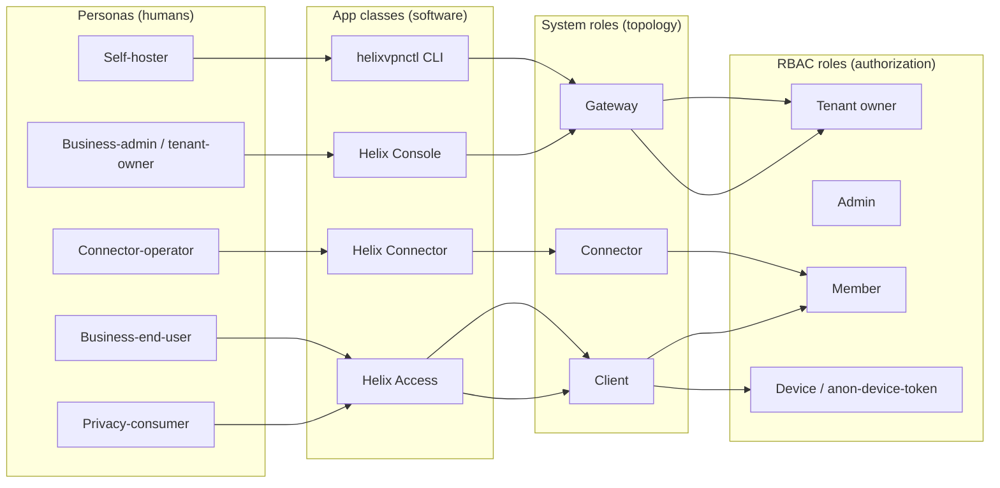
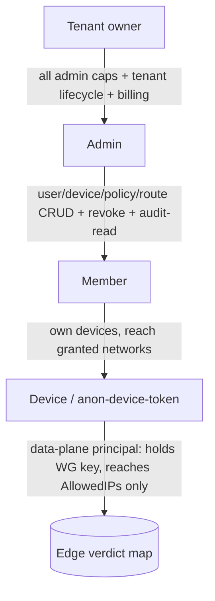
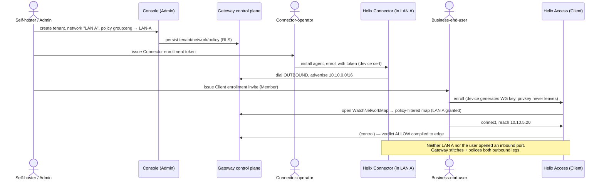
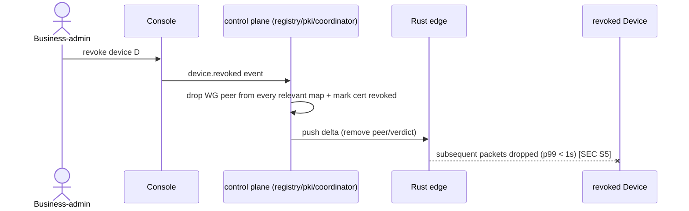
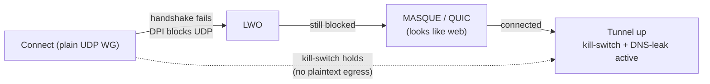

# Personas, Jobs-to-be-Done & the RBAC Role Model

**Revision:** 1
**Last modified:** 2026-06-26T12:00:00Z

> **Document role.** Volume 1 deep document that expands §5 (personas and the
> three app classes) and §3 (the three system roles) of the overview
> [`00-product-scope-and-principles.md`](../00-product-scope-and-principles.md)
> into a full persona catalogue (jobs-to-be-done, journeys, pain points, success
> criteria) **and** the RBAC role/capability model. It distinguishes two
> orthogonal axes that the overview keeps separate and that downstream readers
> routinely conflate:
>
> 1. **System roles** — *Connector / Gateway / Client* — the topological role a
>    node plays in the data path [00 §3], [SPEC §3].
> 2. **Identity/RBAC roles** — *tenant owner / admin / member / device
>    (anon-device-token)* — the authorization a principal holds in the control
>    plane [00 §12 "Tenant"], (security overview S1–S5).
>
> A persona is a *human*; an app class is the *software* a persona drives; a
> system role is the *topological position*; an RBAC role is the *permission
> grant*. This document maps all four.
>
> **Status:** SPEC-ONLY. The RBAC capability matrix here is the *product-level*
> view; the authoritative API-level permission contract is
> [`../v03-control-plane/svc-identity.md`](../v03-control-plane/svc-identity.md)
> and the enforcement points are
> [`../04-security-privacy-pki.md`](../04-security-privacy-pki.md) (S1/S3).
> Where this document and svc-identity disagree on a capability, svc-identity
> wins (§11.4.35). Any capability not yet fixed by svc-identity is marked
> `UNVERIFIED`.
>
> **Evidence base.** `[00 §N]` = the overview; `[SPEC §N]` = the spine;
> `[SEC S#]` = the security overview invariants
> [`../04-security-privacy-pki.md`](../04-security-privacy-pki.md).

---

## Table of contents

- [1. The four-axis model](#1-the-four-axis-model)
- [2. Persona catalogue](#2-persona-catalogue)
  - [2.1 Privacy-consumer](#21-privacy-consumer)
  - [2.2 Business-admin / tenant-owner](#22-business-admin--tenant-owner)
  - [2.3 Business-end-user](#23-business-end-user)
  - [2.4 Connector-operator](#24-connector-operator)
  - [2.5 Self-hoster](#25-self-hoster)
- [3. Persona → app-class → system-role → RBAC-role mapping](#3-persona--app-class--system-role--rbac-role-mapping)
- [4. The RBAC role model](#4-the-rbac-role-model)
- [5. Persona × capability matrix](#5-persona--capability-matrix)
- [6. Cross-persona journeys](#6-cross-persona-journeys)
- [7. Cross-document contracts this document fixes](#7-cross-document-contracts-this-document-fixes)
- [Sources verified](#sources-verified)

---

## 1. The four-axis model

The mapping is *not* one-to-one: a self-hoster wears the tenant-owner RBAC role
*and* operates Connectors *and* uses an Access client — one human, several roles.
The matrix in §5 makes every cell explicit so no capability is assumed.

| Axis | Closed set | Source of truth |
|---|---|---|
| Persona | privacy-consumer, business-admin/tenant-owner, business-end-user, connector-operator, self-hoster | this doc §2 |
| App class | Helix Access, Helix Console, Helix Connector, `helixvpnctl` | [00 §5], [SPEC §3] |
| System role | Client, Gateway, Connector | [00 §3], [SPEC §3] |
| RBAC role | tenant owner, admin, member, device (anon-device-token) | [00 §12], [SEC S1–S5], svc-identity |

---

## 2. Persona catalogue

Each persona is given: **JTBD** (jobs-to-be-done), **primary journey**, **pain
points it removes**, and **success criteria** (tied where possible to the
8-criteria MVP Definition-of-Done [00 §10.2], [SPEC §8.1]). Success criteria
that are not yet a fixed acceptance gate are marked `UNVERIFIED`.

### 2.1 Privacy-consumer

> *"I want into a privacy exit (or my own lab) with one button, no email, and no
> way for anyone to log what I do."* — the Mullvad use case [00 §5.1].

| Field | Detail |
|---|---|
| **Drives** | Helix Access app (iOS, Android, desktop; Web limited) |
| **System role** | Client [00 §3.3] |
| **RBAC role** | Device, via **anonymous device token** (no email) [00 §9 F15] |
| **JTBD** | (1) connect to a privacy exit with one tap; (2) get automatic obfuscation that just works when a network blocks WG; (3) never leak when the tunnel drops; (4) hold an anonymous identity with no PII |
| **Primary journey** | install → anonymous device-token enrollment (key generated on-device, private key never leaves) → one-button connect → auto-ladder escalates plain → LWO → MASQUE if blocked → kill-switch + DNS-leak protection active throughout [00 §9 F7/F11/F13/F15], [SEC S2/S9] |
| **Pain points removed** | account email requirement (anonymous token); manual obfuscation fiddling (auto-ladder); leak-on-drop (core-owned kill-switch); trust-the-vendor no-logs (no-logging-as-code) |
| **Success criteria** | DoD#4 (auto-escalate to MASQUE when WG blocked); DoD#7 (kill-switch + DNS-leak verified, no leak on drop); anonymous enrollment succeeds with no PII captured |
| **Sensitivities** | memory- and battery-sensitive on mobile [00 §5.1]; the iOS NE ~15 MB ceiling is a hard constraint (G3) |

### 2.2 Business-admin / tenant-owner

> *"I manage tenants, users, devices and policy for an organization (or several
> client orgs), and I need a live topology view and an audit trail of control
> actions."* [00 §5.3]

| Field | Detail |
|---|---|
| **Drives** | Helix Console (Web responsive + Desktop — same Flutter build, **no tunnel core**) [00 §5, §5.2] |
| **System role** | none in the data path — Console is API-client-only, drives the Gateway control plane [00 §5] |
| **RBAC role** | **Tenant owner** (or delegated **Admin**) |
| **JTBD** | (1) CRUD tenants/users/devices/networks/routes/policies; (2) see/revoke devices instantly; (3) author default-deny ACLs that compile to reachability; (4) read a control-action audit trail; (5) optionally manage multi-tenant billing |
| **Primary journey** | log in (OIDC) → create a tenant → invite members → approve/enroll devices → author policy (`group:contractors → net:warehouse:554/tcp`) → watch it converge in <1 s → revoke a lost device and watch enforcement in <1 s → review `audit_events` [00 §9 F17], [SPEC §8.1 DoD#5/#6], [SEC S5/S7] |
| **Pain points removed** | policy edits requiring restarts (push-based, <1 s); device revoke lag (<1 s edge enforcement); destinations/flows leaking into audit (audit is control-only) |
| **Success criteria** | DoD#5 (policy edit reflected <1 s, no restart); DoD#6 (device revoke enforced <1 s); audit records who-did-what-to-identity/policy/devices, never destinations [SEC S7] |
| **Sensitivities** | tenant isolation must be airtight — Postgres RLS, not app-layer only [SEC S6/RLS] |

### 2.3 Business-end-user

> *"My admin set me up; I just want into the work networks I'm allowed to reach,
> and to be cleanly denied the ones I'm not."* (derived from the ZTNA half of the
> dual model [00 §3, §4.2])

| Field | Detail |
|---|---|
| **Drives** | Helix Access app |
| **System role** | Client |
| **RBAC role** | **Member** (an identity that belongs to a tenant, holds enrolled devices, but cannot administer the tenant) |
| **JTBD** | (1) connect and reach exactly the subset of joined networks policy grants; (2) be transparently denied unauthorized networks (default-deny, not an error to debug); (3) see only the peers/routes need-to-know permits |
| **Primary journey** | receive an enrollment invite/token from the admin → device generates its WG keypair (private key never leaves) → enroll → receive a **policy-filtered** network map (only granted peers/routes) → reach authorized LAN host, denied unauthorized one [00 §4.2, §9 F17], [SEC S1/S3] |
| **Pain points removed** | over-broad access (need-to-know map — the user never even learns of peers it cannot reach [SEC S3]); confusing all-or-nothing VPNs (policy-scoped 1→N) |
| **Success criteria** | DoD#3 (reach an authorized LAN host AND deny an unauthorized one — default-deny proven); the user's map contains only granted peers [SEC S3] |
| **Sensitivities** | must not be able to enumerate the tenant topology beyond its grants (need-to-know is server-side, pre-wire) |

### 2.4 Connector-operator

> *"Install one agent inside my LAN, it dials out, done — I never touch my
> router."* [00 §5.2]

| Field | Detail |
|---|---|
| **Drives** | Helix Connector (headless daemon on Linux/Windows/macOS + optional slim UI; Android/embedded for appliances) [00 §3.1, §5] |
| **System role** | **Connector** [00 §3.1] |
| **RBAC role** | typically **Member**-level (a connector identity enrolled into a tenant with the right to advertise prefixes); a self-hoster operating their own connector is also tenant owner (§2.5) |
| **JTBD** | (1) onboard a network without opening any inbound port; (2) advertise the CIDRs the network exposes (`route.advertised`); (3) set local ACLs; (4) run headless and reconnect resiliently |
| **Primary journey** | install agent on a LAN host → enroll (device cert + enrollment token) → dial outbound to the Gateway (reverse tunnel) → advertise CIDRs → Gateway routes authorized client traffic into the LAN and responses back out — neither side ever opened an inbound port [00 §3.1, §4.1, §8 P3] |
| **Pain points removed** | router port-forwarding (outbound-only); inbound attack surface (none); per-network bespoke VPN configs (same Rust core in advertise/route mode) |
| **Success criteria** | DoD#2 (enroll a Connector); DoD#3 (an authorized client reaches a LAN host behind the advertised CIDR); the Connector establishes the tunnel with zero inbound exposure |
| **Sensitivities** | overlapping RFC1918 ranges across connectors must not collide (D4 → 4via6) [00 §4.2 #1] |

### 2.5 Self-hoster

> *"I run the whole thing myself — Gateway, Connector(s), and my own Access
> client — because no-logs is credible only when I own the box."* [00 §7.1]

| Field | Detail |
|---|---|
| **Drives** | `helixvpnctl` (Cobra CLI) for bring-up + Console + Connector + Access — wears **all** software hats |
| **System role** | operates Gateway, one or more Connectors, and a Client |
| **RBAC role** | **Tenant owner** of their own tenant(s) (a self-hoster running networks for multiple clients has multiple tenants [00 §12]) |
| **JTBD** | (1) stand up a Gateway from zero on a clean VPS with one command; (2) own the no-logs guarantee by owning the deployment; (3) scale the same images from one homelab pod to an HA fleet without a rewrite |
| **Primary journey** | `helixvpnctl init` on a clean VPS (one rootless Podman pod: edge + control + Postgres + Redis) → enroll a Connector and a Client → reach a LAN host → confirm no durable connection log exists (schema-lint + runtime check) [00 §7.1, §10.2 DoD#1/#8], [SPEC §8.1] |
| **Pain points removed** | SaaS coordination dependency (self-hosted); vendor-trusted no-logs (self-evident ownership + CI-enforced schema); separate codebases for homelab vs fleet (same images, P6) |
| **Success criteria** | DoD#1 (self-host from zero via `helixvpnctl init`); DoD#8 (no durable connection log AND all three apps drive the system); the same images scale to HA (Phase 2) |
| **Sensitivities** | the CA root key + Postgres are the only secrets to protect — data-plane nodes are cattle [SEC S11] |

---

## 3. Persona → app-class → system-role → RBAC-role mapping

| Persona | Primary app class | Other apps used | System role(s) | RBAC role(s) | Uses tunnel core? |
|---|---|---|---|---|---|
| Privacy-consumer | Helix Access | — | Client | Device (anon-device-token) | yes (`helix-core` capture mode) |
| Business-admin / tenant-owner | Helix Console | (Access as a user) | none in data path | Tenant owner (or Admin) | no (Console is API-client only) |
| Business-end-user | Helix Access | — | Client | Member (+ Device per enrolled device) | yes |
| Connector-operator | Helix Connector | (Console to verify routes) | Connector | Member (+ Device); or Tenant owner if self-hosting | yes (`helix-core` advertise/route mode) |
| Self-hoster | `helixvpnctl` + Console + Connector + Access | all | Gateway + Connector + Client | Tenant owner | yes (as Connector/Client) |

> **Note (the single-tree flavoring contract, [00 §5.2]).** All three apps build
> from one Flutter tree via `runHelixApp(flavor, home, capabilities)`,
> `flavor ∈ {Access, Connector, Console}`; **Console is the only build that omits
> `core_ffi`** (no Rust tunnel core). The "Uses tunnel core?" column above is a
> direct consequence of this contract. Owned by
> [`../03-client-core-and-ui.md`](../03-client-core-and-ui.md).

---

## 4. The RBAC role model

The control plane authorizes principals by **RBAC role within a tenant**. A
**tenant** is an isolated organization boundary enforced by Postgres RLS [00 §12],
[SEC S6/RLS]. The closed role set:

### 4.1 Role definitions

| RBAC role | Definition | Distinguishing capability | Authenticated by |
|---|---|---|---|
| **Tenant owner** | The principal who owns a tenant; the self-hoster's default role for their own tenant; can have ≥1 tenant | tenant lifecycle (create/delete tenant), billing (optional SKU), assign/revoke Admins | OIDC identity [00 §9 F15] |
| **Admin** | Delegated administrator within a tenant | full CRUD on users/devices/networks/routes/policies; device revoke; audit read | OIDC identity |
| **Member** | A user that belongs to a tenant and owns enrolled devices, without admin rights | enroll own devices; connect; reach granted networks; advertise prefixes (connector identities) | OIDC identity |
| **Device / anon-device-token** | A *data-plane* principal — an enrolled device holding its own WG keypair; the anonymous-device-token variant has no human identity behind it (the privacy-consumer case) | open `WatchNetworkMap`; reach `AllowedIPs`; nothing administrative | short-lived mTLS device cert (≤24 h, tenant-CA-signed) [SEC S4], + WG Noise IK for data [SEC §1.2] |

### 4.2 Two authentication channels, never conflated

Per the security overview [SEC §1.2], a principal authenticates on two
*independent* channels:

1. **Control channel** (`Coordinator.WatchNetworkMap`/`.Enroll`/…): short-lived
   device cert (mTLS, ≤24 h, auto-renew), tenant-CA-signed [SEC S4].
2. **Data channel** (the tunnel): WireGuard Noise IK; peer pubkeys delivered via
   the policy-filtered map [SEC §1.2].

Compromising one does not yield the other. A device must be valid on **both** to
*learn* its peers and *reach* them. This is why the **Device** RBAC role is the
join point between identity (control) and reachability (data).

### 4.3 Default-deny is the RBAC ground state (S1)

A Member's device with no policy grant has an **empty `AllowedIPs` and no edge
verdict entry** — cryptographically and administratively isolated even though
enrolled and online [SEC S1, §1.3]. RBAC roles grant *administrative* capability;
*reachability* is a separate, additive, default-empty grant compiled by the policy
service. Holding the Member role does **not** imply reaching any network.

### 4.4 Anonymous device tokens (the privacy lane)

The anonymous-device-token enrollment is a first-class path alongside OIDC
[00 §9 F15]: a device enrolls and obtains a control identity with **no email / no
PII**, generating its WG keypair on-device (private key never leaves) [SEC S2].
This is the privacy-consumer's RBAC role — a Device principal with no human
Member/Admin behind it. Owned by
[`../v05-security/identity-and-enrollment.md`](../v05-security/identity-and-enrollment.md)
+ [`../v03-control-plane/svc-identity.md`](../v03-control-plane/svc-identity.md).

> **UNVERIFIED** — the precise capability ceiling of an anonymous-device-token
> principal (e.g. whether it may advertise prefixes, or only consume a
> privacy-exit) is fixed by `svc-identity`, not here. Until svc-identity pins it,
> this document assumes anon tokens are **privacy-exit/consume-only** (the
> consumer case), which is the conservative default per §11.4.6.

---

## 5. Persona × capability matrix

Capabilities are grouped by control-plane domain. Legend: ✅ allowed · ⛔ denied ·
🔒 allowed only on own resources · 🅟 policy-gated (granted additively, default-deny
§4.3). The authoritative permission contract is `svc-identity`; rows it has not
yet fixed are `UNVERIFIED` (flagged inline).

| Capability | Privacy-consumer (Device/anon) | Business-end-user (Member) | Connector-operator (Member) | Business-admin (Admin) | Self-hoster (Tenant owner) |
|---|---|---|---|---|---|
| Connect / open tunnel | ✅ | ✅ | ✅ (advertise/route mode) | n/a (Console) | ✅ |
| Use Gateway as privacy exit | ✅ | ✅ | n/a | n/a | ✅ |
| Reach a joined private network | ⛔ (anon = exit-only, `UNVERIFIED`) | 🅟 | 🅟 (its own LAN) | n/a | 🅟 |
| Advertise CIDRs (`route.advertised`) | ⛔ | ⛔ | ✅ (for its connector) | ✅ (set on behalf) | ✅ |
| Enroll a device | 🔒 (self only) | 🔒 (own devices) | 🔒 (own connector) | ✅ (any in tenant) | ✅ |
| See own devices | 🔒 | 🔒 | 🔒 | ✅ (all) | ✅ |
| Revoke a device | 🔒 (own) | 🔒 (own) | 🔒 (own connector) | ✅ (any, <1 s) | ✅ |
| Author / edit ACL policy | ⛔ | ⛔ | local ACLs only (`UNVERIFIED` scope) | ✅ | ✅ |
| CRUD users | ⛔ | ⛔ | ⛔ | ✅ | ✅ |
| CRUD networks / routes | ⛔ | ⛔ | 🔒 (its own routes) | ✅ | ✅ |
| Read control-action audit | ⛔ | ⛔ | ⛔ | ✅ | ✅ |
| Manage tenants (create/delete) | ⛔ | ⛔ | ⛔ | ⛔ (`UNVERIFIED` — may be delegable) | ✅ |
| Manage billing (optional SKU) | ⛔ | ⛔ | ⛔ | ⛔ (`UNVERIFIED`) | ✅ |
| Bring up Gateway (`helixvpnctl init`) | ⛔ | ⛔ | ⛔ | ⛔ | ✅ (operator/host privilege, not RBAC) |

> **Honesty note (§11.4.6).** The matrix is the *product-intent* view. Three cells
> are `UNVERIFIED` because the exact grant is fixed by `svc-identity`/`svc-policy`,
> not by a product narrative: (a) whether an anon device token may reach a private
> network or is exit-only; (b) the scope of a Connector-operator's "local ACLs"
> vs central policy; (c) whether tenant-lifecycle and billing are delegable to
> Admin or owner-exclusive. Each is a tracked refinement item; the conservative
> default (narrower grant) is assumed until pinned, per §11.4.6/§11.4.101.

---

## 6. Cross-persona journeys

### 6.1 Onboarding a network so a remote user can reach it (the founding journey)

This is the canonical multi-persona flow that realizes the founding constraint
[00 §2.1, §4.1] — three personas, no inbound port-forward:

### 6.2 Lost-device revocation (admin + device, <1 s)

### 6.3 Privacy-consumer auto-obfuscation under DPI (one persona, one journey)

The escalation ladder is driven by handshake-failure events; throughout, the
kill-switch holds so no plaintext egress occurs while escalating [00 §9 F7/F11],
[SEC S9].

---

## 7. Cross-document contracts this document fixes

1. **Four-axis separation** (§1) — persona ≠ app class ≠ system role ≠ RBAC role;
   every later document MUST keep these distinct (the overview conflates persona
   and app class loosely in §5; this document is the disambiguation authority for
   Volume 1).
2. **Persona → RBAC mapping** (§3, §5) — consumed by
   [`functional-requirements.md`](functional-requirements.md) (each FR names the
   persona/role it serves) and bound to the authoritative
   [`../v03-control-plane/svc-identity.md`](../v03-control-plane/svc-identity.md).
3. **Device is the join point** of control identity and data reachability (§4.2) —
   inherited from [SEC §1.2], not redefined.
4. **Default-deny is the RBAC ground state** (§4.3) — RBAC grants administrative
   capability; reachability is a separate additive default-empty grant
   ([SEC S1], [`../v03-control-plane/svc-policy.md`](../v03-control-plane/svc-policy.md)).
5. **Anonymous device tokens are first-class** (§4.4) — the privacy lane;
   owned by `svc-identity` + `identity-and-enrollment.md`.
6. **The single-tree flavoring contract** (§3 note) governs "which persona's app
   carries the tunnel core" — inherited from [00 §5.2].

---

## Sources verified

- [`00-product-scope-and-principles.md`](../00-product-scope-and-principles.md) §3
  (three roles), §4 (two-way + multi-network), §5 + §5.1/§5.2 (personas, app
  classes, flavoring contract), §9 (parity matrix — F15 anon account, F17 device
  mgmt), §10.2 (8-criteria DoD), §12 (glossary — tenant).
- [`SPECIFICATION.md`](../SPECIFICATION.md) §3 (roles + app classes), §8.1 (MVP
  DoD), §9 (D2 client core).
- [`04-security-privacy-pki.md`](../04-security-privacy-pki.md) §0.1 (S1–S11
  invariants), §1.1 (trust gradient), §1.2 (two auth channels), §1.3 (default-deny
  realization) — authoritative for the RBAC enforcement model.
- [`MASTER_INDEX.md`](../MASTER_INDEX.md) Volume 1 row (declared scope: "Each
  persona: jobs-to-be-done, journeys, pain points, success") + Volume 3 row
  (`svc-identity` as the authoritative permission contract).
- Cross-refs forward: `svc-identity.md`, `svc-policy.md`,
  `identity-and-enrollment.md`, `03-client-core-and-ui.md`.

*Honesty note (§11.4.6): the persona success criteria are tied to the 8-criteria
MVP DoD where one exists; the RBAC capability matrix is the product-intent view,
with every cell whose grant is not yet fixed by `svc-identity`/`svc-policy` marked
`UNVERIFIED` and defaulted to the narrower grant. No permission was asserted as
final that the authoritative control-plane docs have not yet pinned.*

*Constitution bindings: §11.4.44 (revision header), §11.4.6 (UNVERIFIED on
un-pinned capabilities, conservative default), §11.4.35 (svc-identity wins on
conflict; inherits security invariants), §11.4.104 (participant/identity model
alignment), §11.4.65/.153 (HTML+PDF[+DOCX] exports follow in refinement).*
