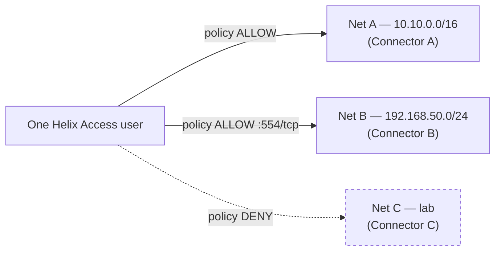
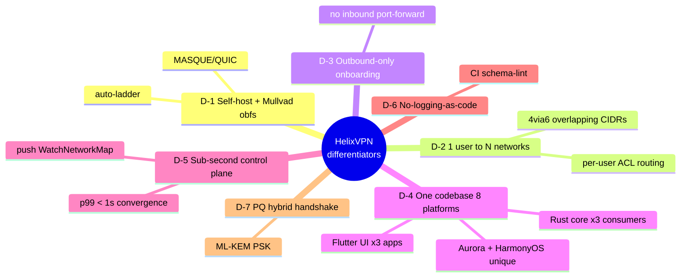

# Product Vision & Positioning

**Revision:** 1
**Last modified:** 2026-06-26T12:00:00Z

> **Document role.** This is the Volume 1 (Product & Requirements) deep document
> that fixes *why HelixVPN exists, what category it competes in, who came before,
> and what makes it different*. It deepens §1/§2/§6/§7 of the volume overview
> [`00-product-scope-and-principles.md`](../00-product-scope-and-principles.md)
> and §1/§2 of the spine [`SPECIFICATION.md`](../SPECIFICATION.md). It is the
> narrative spine the functional requirements
> ([`functional-requirements.md`](functional-requirements.md)) and the persona
> model ([`personas-and-roles.md`](personas-and-roles.md)) trace back to.
>
> **Status:** SPEC-ONLY — this describes the product's *position*, it does not
> build it. Every market or competitor *claim* that is not an architectural fact
> of HelixVPN is marked `UNVERIFIED` (§11.4.6): comparative-product facts move
> over time and are subject to the §11.4.99 latest-source re-verification pass
> (tracked in [`REFINEMENT_NOTES.md`](../REFINEMENT_NOTES.md) R1). Architectural
> claims about HelixVPN itself are cited to the overview/spine, not asserted from
> memory.
>
> **Evidence base.** The synthesised overview and spine (themselves a synthesis
> of the 16 source research docs), cited inline as `[00 §N]` (the overview) and
> `[SPEC §N]` (the spine). Where the overview cites a primary source by id
> (`[04_ARCH §N]`, `[05_YBO]`, `[research-masque]`) that chain is preserved.

---

## Table of contents

- [1. Vision statement](#1-vision-statement)
- [2. The problem HelixVPN exists to solve](#2-the-problem-helixvpn-exists-to-solve)
- [3. Market category — the consumer/business convergence](#3-market-category--the-consumerbusiness-convergence)
- [4. Prior-art deep-dive](#4-prior-art-deep-dive)
- [5. Differentiators](#5-differentiators)
- [6. Explicit non-goals](#6-explicit-non-goals)
- [7. Positioning statement & messaging spine](#7-positioning-statement--messaging-spine)
- [8. Strategic risks to the positioning](#8-strategic-risks-to-the-positioning)
- [9. Cross-document contracts this document fixes](#9-cross-document-contracts-this-document-fixes)
- [Sources verified](#sources-verified)

---

## 1. Vision statement

**HelixVPN is a self-hostable overlay network with a privacy-VPN front end** —
one codebase that a single person can stand up for a homelab and that the same
images scale to an HA multi-region fleet [00 §1], [SPEC §1].

The one-sentence pitch, verbatim from the architecture source [00 §1]
(`[04_ARCH §1]`):

> *Cloudflare Tunnel + WARP, rebuilt as Tailscale-style coordination, with
> Mullvad's obfuscation stack, fully self-hostable, on one shared codebase.*

The vision is deliberately a **union**, not a new point product. Four mature
lineages each solved one piece; no shipping product unifies all four *and* is
self-hostable [00 §1]:

| Lineage | The one thing it proved | HelixVPN inherits |
|---|---|---|
| Cloudflare Tunnel + WARP | a connector can **dial outbound** so no inbound port-forward is ever needed; MASQUE/QUIC is a viable censorship-resistant transport | the outbound-only edge model + MASQUE transport `[04_ARCH §0/§3.3]` |
| Tailscale / Headscale | coordination as a **pushed desired-state network map** (ACL-compiled topology), not a polling mesh | the push-based control plane `[04_ARCH §4.4]` |
| Mullvad | a privacy bar — full obfuscation stack, anonymous accounts, no-logging — is a *product*, not a research demo | the obfuscation + privacy bar `[04_ARCH §6]` |
| NetBird | the closest OSS shape (WireGuard + management/signal server, self-hosted) as a sanity check | architectural validation of the WG-core + control-server split `[04_ARCH §1.3]` |

The synthesis target: a product that is **self-hosted AND Mullvad-grade
obfuscated AND multi-network-routed AND reachable on 8 platforms from one
codebase** — the combination the overview names as the core differentiator
[00 §6], [SPEC §2].

---

## 2. The problem HelixVPN exists to solve

### 2.1 The founding constraint

The project was born from one concrete operator need [00 §1] (`[05_YBO]`,
`[00]`):

> A remote user must obtain full, **policy-scoped** access to one *or many*
> internal / home / lab networks **without any inbound port-forward** on those
> networks.

Every incumbent forces a trade here: you either open a router port (a public
inbound attack surface), or you accept a SaaS coordination dependency, or you
give up obfuscation, or you give up self-hosting. HelixVPN's thesis is that
**none of those trades is necessary** — internal hosts dial *outbound* to a
public gateway (a reverse tunnel), the gateway relays and routes, and the whole
thing is software you run yourself [00 §2.1], [SPEC §1].

### 2.2 The headline capability gap in the market

The differentiator the overview leads with is **`1 user → N joined private
networks`** — a multi-network, bidirectional, policy-routed gateway, which the
overview states "no self-hostable product ships today" [00 §1] (`[04_ARCH §1.3]`).

> **UNVERIFIED** — "no self-hostable product ships today" is a competitive-market
> claim, not an architectural fact of HelixVPN. It is plausible from the prior-art
> map (§4) but MUST be re-verified against current product feature sets in the
> §11.4.99 latest-source pass before it appears in any external-facing material
> (R1). The *architectural* fact — that HelixVPN's design provides 1→N
> policy-routed networks — is cited and is not UNVERIFIED.

The user reaches the *subset of joined networks its ACL grants* and is denied the
rest — default-deny microsegmentation, not all-or-nothing access [00 §4.2].

### 2.3 The privacy problem — credibility of "no-logs"

A privacy VPN's no-logs promise is only as strong as your trust in the operator.
HelixVPN's structural answer: **no-logging is a build property you can verify, not
a policy you must trust** — there is no durable connection/traffic/packet table in
the schema, and CI schema-lint fails the build if one appears [00 §8 P7],
[SPEC §4.7]. For a self-hoster the claim is *self-evident* (you own the box); for
a future managed SKU it is the *contractual* promise backed by the same
CI-enforced schema [00 §7.3]. This is detailed in
[`../v05-security/no-logging-as-code.md`](../v05-security/no-logging-as-code.md)
and the security overview
[`../04-security-privacy-pki.md`](../04-security-privacy-pki.md) (S6/S7).

---

## 3. Market category — the consumer/business convergence

HelixVPN sits at a convergence point of two categories that have historically
been separate products [00 §6], [SPEC §2]:

| Category | Canonical examples | What HelixVPN takes |
|---|---|---|
| **Consumer privacy VPN** | Mullvad, IVPN, ProtonVPN | obfuscation stack, anonymous accounts, kill-switch, no-logging, one-button connect |
| **Business overlay network / ZTNA** | Tailscale, NetBird, Twingate, Zscaler, Cloudflare Access | coordination/network-map, per-user ACL routing, device posture, multi-tenancy, audit |

The same Gateway serves **both** use cases from one deployment [00 §3.3]:

1. **Privacy-exit mode** (the Mullvad use case) — the Client full-tunnels to the
   internet through the Gateway; the Gateway is a plain privacy exit.
2. **Overlay-access mode** (the ZTNA use case) — the Client reaches the subset of
   joined private networks its policy allows, via Connectors that dialed out.

The convergence is not a marketing framing; it falls out of the architecture. The
*same Rust core* captures the device's traffic in both modes; the *same control
plane* compiles policy in both modes; the difference is only which exit/route the
network map grants [00 §5], [SPEC §3]. This is why a single codebase can address a
consumer persona (privacy-consumer) and three business personas (business-admin,
business-end-user, connector-operator) — all enumerated in
[`personas-and-roles.md`](personas-and-roles.md).

> **UNVERIFIED** — the strategic claim that "the consumer privacy-VPN and business
> ZTNA categories are converging" is an industry-trend assertion, not an
> architectural fact. It is the *rationale* for the dual model, but its
> market-truth is out of scope for this spec and is not relied on by any
> requirement; requirements derive from the architecture, not the trend.

### 3.1 Hosting/commercial stance (settled direction, open licence)

The hosting model is settled: **self-host / home-lab first; the same code can
serve managed later** [00 §7.1], [SPEC §2]. The *licensing* model is an **open
decision (D8)** — surfaced with options + recommendation, never silently picked
[00 §7.2], [SPEC §9]:

- **Recommendation:** permissive (Apache-2.0/MIT) for the reusable cores
  (`helix-core`, `helix-ui`, `helix-proto`) so they are maximally reusable by
  other Helix-ecosystem projects (§11.4.28/.74), plus source-available (BSL-class)
  for the commercial multi-tenant Console/managed layer [00 §7.2].
- **Status:** OWNER-GATED (§11.4.66) before public release; until resolved every
  repo carries an explicit `LICENSE.PENDING` marker, never an assumed licence
  (§11.4.6) [00 §7.2].

---

## 4. Prior-art deep-dive

This is the positioning map from [00 §6], expanded with *what HelixVPN borrows,
what it deliberately diverges on, and the honesty caveat per competitor*. The
comparison rows are competitive-product facts and carry an `UNVERIFIED` blanket
caveat (§4.6).

### 4.1 Mullvad — the obfuscation & privacy bar

- **What it is:** a consumer privacy VPN with a best-in-class obfuscation stack
  (QUIC/MASQUE, Shadowsocks, UDP-over-TCP, lightweight obfs, DAITA), multi-hop,
  kill-switch, anonymous account numbers, and a strong no-logging stance [00 §6].
- **What HelixVPN borrows:** the *entire obfuscation + privacy feature set* — it
  is the acceptance checklist (the Mullvad-parity matrix, [00 §9]). The single
  most load-bearing inherited insight: **Mullvad's "QUIC mode" is not a separate
  protocol — it is WireGuard-over-MASQUE/HTTP-3** [00 §2.2], (`[research-masque]`).
  This shapes the entire data plane (D1).
- **What HelixVPN diverges on:** Mullvad is a *service* you cannot self-host, and
  it is a *privacy exit only* — no multi-network overlay, no Connector model.
  HelixVPN is self-hostable and adds the 1→N overlay.

### 4.2 Tailscale / Headscale — the coordination model

- **What it is:** a WireGuard mesh with a coordination server that pushes a
  desired-state "network map" (`MapResponse`) to each node, ACL-compiled topology,
  subnet routers, and (via Headscale) partial self-hosting [00 §6].
- **What HelixVPN borrows:** the **push-don't-poll coordination model** (P4) — the
  `WatchNetworkMap` server-stream is explicitly Tailscale-`MapResponse`-style
  [00 §8 P4], [SPEC §7.2]; the ACL → per-peer `AllowedIPs` compilation; and the
  **4via6** scheme for mapping overlapping advertised IPv4 LANs into a per-tenant
  ULA IPv6 space (D4) [00 §11 D4].
- **What HelixVPN diverges on:** Tailscale is a mesh (peers connect to peers);
  HelixVPN's MVP is a reverse-tunnel hub-and-spoke (edges dial the Gateway), with
  direct P2P + DERP-style relay deferred to Phase 2 (X4) [00 §9]. Tailscale lacks
  a full Mullvad-grade obfuscation stack.

### 4.3 WireGuard-based incumbents (NetBird, Netmaker, Firezone, wg-easy)

- **What they are:** self-hostable WireGuard control planes / mesh managers. The
  overview names **NetBird** as the closest OSS shape (WireGuard + management/signal
  server, self-hosted) [00 §6].
- **What HelixVPN borrows:** the architectural validation that a WG-crypto-core +
  a separate control/signal server is the right split — HelixVPN's P2 (WG is the
  crypto core, transports are pluggable beneath it) is the same instinct, made
  strict [00 §8 P2].
- **What HelixVPN diverges on:** these incumbents generally lack Mullvad-grade
  obfuscation (MASQUE/QUIC, DAITA), and none ship a first-party 8-platform app
  suite including Aurora + HarmonyOS from a shared codebase. HelixVPN treats
  obfuscation as a first-class pluggable layer, not an add-on.

> **UNVERIFIED** — the specific capability gaps attributed to NetBird/Netmaker/
> Firezone/wg-easy (e.g. "lacks MASQUE obfuscation", "no Aurora/HarmonyOS app")
> are competitive-product facts at a point in time. Re-verify in the §11.4.99 pass
> before external use (R1).

### 4.4 Cloudflare Tunnel + WARP — connector-dials-out + MASQUE

- **What it is:** an outbound-only connector (`cloudflared`) that dials the
  Cloudflare edge, plus WARP, a consumer client using MASQUE [00 §6].
- **What HelixVPN borrows:** the **connector-dials-out** model (the founding
  constraint, P3) and **MASQUE as a transport** [00 §6] (`[04_ARCH §0/§3.3]`).
- **What HelixVPN diverges on:** Cloudflare's coordination + edge are a
  proprietary global SaaS; HelixVPN is self-hostable, with the edge as a Rust
  component you run. HelixVPN's obfuscation is Mullvad-parity, broader than WARP.

### 4.5 Twingate / Zscaler — the ZTNA policy model

- **What they are:** enterprise Zero-Trust Network Access — per-user/per-app
  policy, no inbound exposure, identity-driven [00 §6].
- **What HelixVPN borrows:** the **ZTNA default-deny policy model** — need-to-know
  peer distribution, per-user ACL → reachability [00 §6], (S1/S3 in the security
  overview).
- **What HelixVPN diverges on:** these are SaaS, not self-hostable, and operate
  higher in the stack; HelixVPN is an L3 IP overlay with L4 port policy (it is
  explicitly NOT an L7 inspection appliance, §6) [00 §2.2].

### 4.6 Positioning matrix (from the overview)

This is the [00 §6] matrix, reproduced as the canonical positioning table. The
non-HelixVPN cells carry the §4 `UNVERIFIED` blanket caveat.

| System | Self-host | Obfuscation | Multi-network overlay | 1st-party cross-platform apps | What HelixVPN borrows |
|---|---|---|---|---|---|
| Mullvad | ✗ (service) | ✅ best-in-class | ✗ (privacy exit only) | ✅ | the obfuscation + privacy bar |
| Tailscale | partial (Headscale) | ✗ | ✅ (mesh + subnet routers) | ✅ | the coordination / network-map model |
| NetBird | ✅ | limited | ✅ | ✅ | closest OSS shape (WG + mgmt/signal) |
| Cloudflare Tunnel + WARP | ✗ | MASQUE | ✅ | ✅ | connector-dials-out + MASQUE |
| Twingate / Zscaler | ✗ | n/a | ✅ ZTNA | ✅ | the ZTNA policy model |
| **HelixVPN** | ✅ | ✅ full Mullvad-parity stack | ✅ | ✅ on 8 platforms, one codebase | the self-hosted *union* of all of the above |

---

## 5. Differentiators

The four differentiators the overview tells us to lead with [00 §6]
(`[04_ARCH §1.3]`), each tied to the architecture that delivers it and the spec
doc that owns it. None is aspirational — each maps to a concrete component.

### D-1 — Self-hosted AND Mullvad-grade obfuscation (incl. MASQUE/QUIC)

The combination is the headline. Mullvad has the obfuscation but is a service;
the self-hostable WG incumbents lack the obfuscation. HelixVPN ships both: a
pluggable `Transport` layer beneath WireGuard (plain UDP, LWO, MASQUE/QUIC,
Shadowsocks, UoT) selectable via an auto-escalation ladder [00 §9 F1–F8],
[SPEC §5.2]. Owned by [`../01-data-plane.md`](../01-data-plane.md) (D1).

### D-2 — Multi-network overlay: 1 user → N policy-scoped networks

The capability no incumbent self-hostable product combines with obfuscation:
multiple Connectors each advertise their CIDRs, the Gateway compiles them into one
*policed* overlay, and a single user reaches the granted subset [00 §4.2, §9 X1].
This implies three first-class problems the spec solves — overlapping RFC1918
ranges (D4 → 4via6), per-user ACL routing (default-deny → verdict maps), and split
horizon (microsegmentation by default) [00 §4.2]. Owned by
[`../v02-data-plane/routing-and-addressing.md`](../v02-data-plane/routing-and-addressing.md)
+ [`../v03-control-plane/svc-policy.md`](../v03-control-plane/svc-policy.md).

### D-3 — Outbound-only network onboarding (no inbound port-forward, ever)

The founding constraint, made a principle (P3): Connectors and Clients always dial
the Gateway; no private network ever needs an inbound hole [00 §8 P3, §9 X2]. This
removes the single largest attack surface (a public inbound port) and is what makes
"expose my LAN without touching my router" literally true. Owned by the Connector
spec + the security overview.

### D-4 — One shared Rust + Flutter codebase across 8 platforms

The same Rust `helix-core` wraps obfuscation on the client and *unwraps* it on the
edge (P5 — one implementation, three consumers); the same Flutter `helix-ui` builds
all three apps via a flavor entrypoint [00 §8 P5, §5.2], [SPEC §3]. The platform
reach — iOS, Android, **Aurora OS**, **HarmonyOS NEXT**, Windows, Linux, macOS, Web
— is a differentiator no incumbent matches, with Aurora + HarmonyOS being unique
[00 §9 X5]. Owned by [`../03-client-core-and-ui.md`](../03-client-core-and-ui.md)
and Volume 4.

### D-5 — Event-driven, sub-second control plane

State changes propagate as events; agents reconcile to a pushed desired-state with
a **p99 < 1 s** convergence SLO, including policy edits and device revocation
[00 §8 P4], [SPEC §8.1]. Polling/cron-restart loops cannot meet this. Owned by
[`../v03-control-plane/svc-coordinator.md`](../v03-control-plane/svc-coordinator.md).

### D-6 — No-logging-as-code (verifiable, not promised)

Privacy is a build property: no durable traffic table, CI-enforced (P7) [00 §8 P7].
The mechanical teeth are a CI schema-lint that fails the build on a forbidden
durable table [00 §8 illustrative guard]. Owned by
[`../v05-security/no-logging-as-code.md`](../v05-security/no-logging-as-code.md).

### D-7 — Post-quantum-ready, hybrid-never-PQ-only

A PQ KEM (ML-KEM / FIPS-203) derives a PSK mixed into the classical WG handshake;
an attacker must break both, and disabling PQ leaves classical WG secure [00 §9 F16],
(S10). Owned by [`../v05-security/post-quantum.md`](../v05-security/post-quantum.md).

---

## 6. Explicit non-goals

The negative space is load-bearing — it keeps every downstream document from
drifting into an adjacent product. These are from [00 §2.2] and [SPEC §2], stated
as binding product non-goals (not "later phases").

| Non-goal | Why excluded | Where enforced |
|---|---|---|
| **NOT a forked/re-rolled WireGuard crypto** | the crypto core is the audited WG Noise IK construction; HelixVPN changes only how encrypted datagrams *look on the wire* | [`../01-data-plane.md`](../01-data-plane.md); CI lint forbids touching WG crypto primitives [00 §2.2] |
| **NOT a separate "QUIC protocol" alongside WG** | Mullvad's QUIC mode *is* WG-over-MASQUE/HTTP-3, not a different protocol | D1; transport spec `01` (`[research-masque]`) |
| **NOT a full system VPN in a browser** | browsers cannot open a TUN device; Web = Console (management) + an *optional* in-page WASM MASQUE proxy that proxies the **browser's own** traffic only | [`../v04-client/web-console.md`](../v04-client/web-console.md); §10 scope [00 §2.2] |
| **NOT a logging / lawful-intercept / DLP appliance** | no-logging is an architectural build property, not a toggle; *control* actions are audited, *traffic* never is | data-model spec `02`; CI schema-lint [00 §2.2] |
| **NOT a generic SDN / service-mesh / L7 API gateway** | HelixVPN operates at L3 (IP overlay) + L4 port policy; it is not Envoy/Istio and does not terminate application TLS for inspection | policy spec; §2.1 scope [00 §2.2] |
| **NOT a consumer "free VPN" ad-funded service** | the default deployment is self-hosted; a managed offering is an optional later SKU, not the reason to exist | §7 [00 §2.2] |
| **NOT dependent on inbound port-forwarding** on any joined network | the reverse-tunnel insight is foundational (P3) | Principle 3; Connector spec [00 §2.2] |

### 6.1 Two honesty markers (hard physical limits, stated to users)

Per §11.4.6, two product claims have *hard physical limits* and MUST be stated to
users without hand-waving [00 §2.2] (`[04_ARCH §5.7]`):

1. **"Fully responsive web app" ≠ system VPN.** The Web build is the Console plus a
   browser-scoped proxy; it cannot tunnel the whole OS (no TUN in a browser).
2. **iOS Network Extension ~15 MB working-set ceiling.** A measured historical
   constraint that shapes the core-language decision (D2) and is verified on-device
   in Phase-0 gate G3, never assumed [00 §2.2], [SPEC §8.0 G3].

---

## 7. Positioning statement & messaging spine

### 7.1 The positioning statement (for-…-who-…-is-…-unlike)

> **For** self-hosters, home-lab operators, and small MSPs **who** need both
> Mullvad-grade privacy and Tailscale-grade multi-network coordination without a
> SaaS dependency, **HelixVPN is** a self-hostable overlay network with a
> privacy-VPN front end that gives one user policy-scoped access to many private
> networks — without any inbound port-forward — on 8 platforms from one codebase.
> **Unlike** Mullvad (a service, privacy-exit only), Tailscale (no full
> obfuscation), or the self-hostable WG incumbents (no Mullvad-grade obfuscation),
> HelixVPN is the self-hosted *union* of all of them. [00 §6], [SPEC §2]

### 7.2 Per-audience messaging

| Audience | Lead message | Proof point |
|---|---|---|
| Privacy consumer | "Mullvad's privacy stack, on a box *you* own — verifiable no-logs, not promised no-logs" | D-1, D-6 |
| Home-lab operator | "Reach your lab from anywhere without opening a single router port" | D-2, D-3 |
| Small MSP / business admin | "One overlay, N client networks, per-user default-deny policy, control-action audit" | D-2, D-5 |
| Platform-diverse org | "One app suite on iOS, Android, Aurora, HarmonyOS, Windows, Linux, macOS, Web" | D-4 |

> **UNVERIFIED** — buyer/audience segmentation and the relative appeal of each
> message are go-to-market hypotheses, not architectural facts. They are recorded
> as the messaging spine, not as requirements.

---

## 8. Strategic risks to the positioning

Honest disclosure per §11.4.6/§11.4.118 — the positioning rests on assumptions
that can fail; each is a tracked risk, not a silent confidence.

| Risk | Description | Mitigation / where tracked |
|---|---|---|
| R-V1 | The iOS NE ~15 MB memory ceiling could make the shared-Rust-core client strategy infeasible on iOS, undermining D-4 (one codebase) | Phase-0 gate **G3** is make-or-break and decides D2; failure re-opens the client strategy [SPEC §8.0] |
| R-V2 | MASQUE may not survive real DPI at acceptable throughput, undermining D-1 | Phase-0 gate **G2** (MASQUE through a DPI block ≥50% of plain); failure re-opens D1 [00 §11 D1] |
| R-V3 | Aurora + HarmonyOS native tunnel-shim work is the "biggest platform risk" — the unique D-4 reach could slip to Phase 3 or fail | scoped to Phase 3 with on-device exit gates [00 §10.4], [SPEC §8.3] |
| R-V4 | The "no self-hostable product ships 1→N + obfuscation today" claim (D-2) may be eroded by a competitor | UNVERIFIED-tagged; re-verified each §11.4.99 pass (R1) |
| R-V5 | Licensing (D8) unresolved could fork the community vs the managed-SKU business | OWNER-GATED decision before public release; `LICENSE.PENDING` until then [00 §7.2] |

---

## 9. Cross-document contracts this document fixes

This document does not invent product scope — it *positions* the scope fixed by
the overview and spine. The contracts it relies on and forwards:

1. **The four-lineage union pitch** (§1) → inherited from [00 §1], [SPEC §1];
   every differentiator (§5) traces to a borrowed lineage.
2. **The dual consumer+business model** (§3) → the same Gateway/core serves
   privacy-exit and overlay-access; consumed by
   [`personas-and-roles.md`](personas-and-roles.md) (which enumerates the
   resulting personas) and [`functional-requirements.md`](functional-requirements.md)
   (which numbers the resulting requirements).
3. **The seven non-goals** (§6) → binding boundaries from [00 §2.2]; every FR in
   [`functional-requirements.md`](functional-requirements.md) MUST stay inside
   them.
4. **Differentiators map to owning specs** (§5) → each D-n names the Volume 2–5
   doc that delivers it; the requirements traceability matrix
   (`../v00-meta/requirements-traceability.md`, planned) closes the loop.
5. **Open decisions stay open** (D1/D2/D4/D8 referenced) → never silently resolved
   here; they live in [00 §11] / [SPEC §9].

---

## Sources verified

- [`00-product-scope-and-principles.md`](../00-product-scope-and-principles.md) §1
  (product definition), §2 (is/is-not + honesty markers), §6 (prior art +
  differentiators), §7 (hosting/licensing), §8 (principles), §9 (parity matrix),
  §10 (phase scope), §11 (decisions D1–D7) — primary spine for this document.
- [`SPECIFICATION.md`](../SPECIFICATION.md) §1 (executive summary), §2 (product
  vision), §3 (roles/apps), §8 (roadmap/gates), §9 (decision register incl. D8).
- [`04-security-privacy-pki.md`](../04-security-privacy-pki.md) §0.1 (S6/S7
  no-logging + control-only audit) — the privacy/no-logging product promise.
- [`MASTER_INDEX.md`](../MASTER_INDEX.md) Volume 1 row (this document's declared
  scope: "Vision, market, prior-art deep-dive, differentiators, non-goals").
- Primary-source chain preserved from the overview: `[04_ARCH §0/§1/§2/§3.3/§5.7]`,
  `[05_YBO]`, `[research-masque]` (RFC 9298/9297/9221/9484).

*Honesty note (§11.4.6): every competitive-market claim (prior-art capability gaps,
"no product ships X today", category-convergence trend, audience segmentation) is
marked `UNVERIFIED` and deferred to the §11.4.99 latest-source verification pass
(REFINEMENT_NOTES R1). Architectural claims about HelixVPN are cited to the
overview/spine. No competitor capability was asserted from training memory.*

*Constitution bindings: §11.4.44 (revision header), §11.4.6 (no-guessing —
UNVERIFIED markers on all market claims), §11.4.66 (open decisions carry options +
recommendation), §11.4.99 (latest-source re-verification deferred + tracked),
§11.4.35 (inherits, never weakens, the overview's invariants), §11.4.65/.153
(HTML+PDF[+DOCX] exports follow in refinement).*
