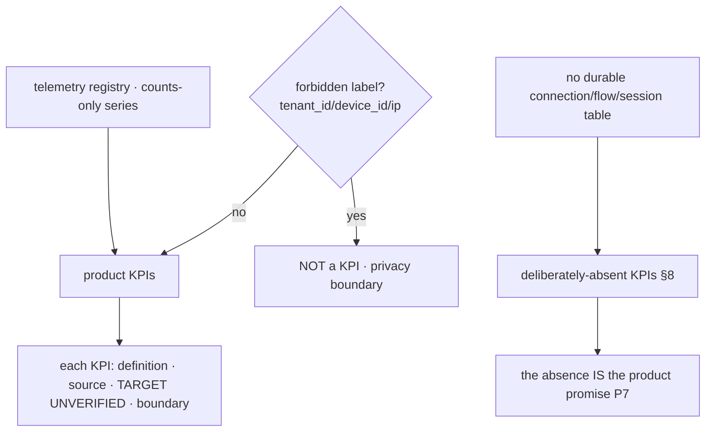
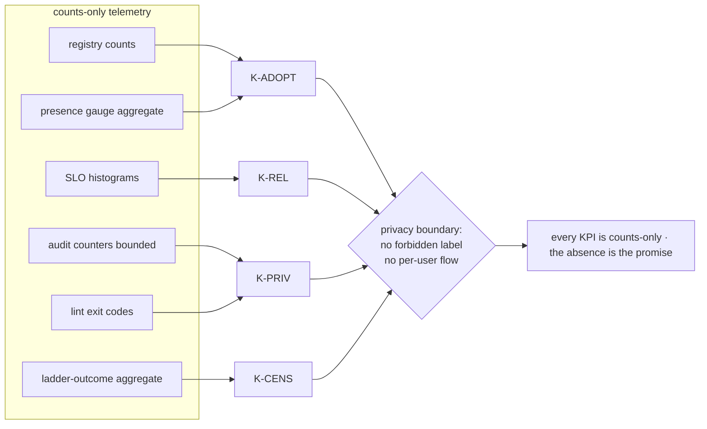

# Success Metrics (KPIs) — counts-only, no-flow-by-construction

**Revision:** 1
**Last modified:** 2026-06-26T12:00:00Z

> **Document role.** This is the Volume 1 (Product & Requirements) nano-detail
> spec defining HelixVPN's product **KPIs** and the **telemetry that derives
> them** — strictly **counts and aggregates only**. The defining constraint of
> this document is that it is bound by `v05-security/no-logging-as-code.md`: a
> KPI we *cannot* measure without a per-user flow, a destination, or a
> timestamp-of-use is a KPI we **deliberately do not have** — and that absence
> is a *product feature*, not a gap. Every KPI names its counts-only metric
> source (citing `v03-control-plane/svc-telemetry.md`) and the privacy boundary
> it respects.
>
> **Document is a SPEC.** It states *what we measure, from which counts-only
> series, against which target, within which privacy boundary*; it does not build
> the product. Every numeric target is a TARGET marked `UNVERIFIED` per §11.4.6 —
> a product KPI threshold is a business target, not a measured fact, until the
> instrumented series produces data.
>
> **Evidence base.** Cross-references the Volume 1 overview (principles P7
> no-logging, parity F14; differentiators X1–X5; the MVP DoD §10.2), the
> telemetry counts-only metric registry and its forbidden-label cardinality bound
> (`v03-control-plane/svc-telemetry.md` §3), the coordinator convergence SLO
> (`v03-control-plane/svc-coordinator.md` §7), and the no-logging invariant
> (`v05-security/no-logging-as-code.md` §2 the stored-vs-never-stored partition).

---

## Table of contents

- [1. The measurement charter (the privacy boundary is the design)](#1-the-measurement-charter-the-privacy-boundary-is-the-design)
- [2. What we can measure vs what we deliberately cannot](#2-what-we-can-measure-vs-what-we-deliberately-cannot)
- [3. Adoption & reach KPIs (counts-only)](#3-adoption--reach-kpis-counts-only)
- [4. Reliability & performance KPIs (SLO-derived)](#4-reliability--performance-kpis-slo-derived)
- [5. Privacy-integrity KPIs (the guarantee is itself a KPI)](#5-privacy-integrity-kpis-the-guarantee-is-itself-a-kpi)
- [6. Censorship-resistance KPIs (aggregate ladder outcomes)](#6-censorship-resistance-kpis-aggregate-ladder-outcomes)
- [7. Self-host adoption KPIs (the differentiator)](#7-self-host-adoption-kpis-the-differentiator)
- [8. The deliberately-absent metrics (and why each absence is a feature)](#8-the-deliberately-absent-metrics-and-why-each-absence-is-a-feature)
- [9. KPI → metric source → privacy-boundary traceability](#9-kpi--metric-source--privacy-boundary-traceability)
- [Sources verified](#sources-verified)

---

## 1. The measurement charter (the privacy boundary is the design)

Most products measure success with per-user funnels, destination analytics, and
session timelines. HelixVPN **cannot** — by construction (P7 / S6): no durable
connection/traffic/flow/session table exists, the event bus carries no
src/dst/bytes/dns field, and `/metrics` forbids any `tenant_id`/`device_id`/ip
label. Every KPI in this document is therefore derived from **aggregate
counters, SLO histograms, and bounded gauges** — never from a per-user trail.

The charter, stated as three rules every KPI obeys:

1. **Counts and aggregates only.** A KPI's source is a Prometheus counter,
   histogram, or bounded gauge from the telemetry registry
   (`svc-telemetry.md` §3), or an aggregate roll-up of those — never a per-user
   row (there is none).
2. **No forbidden label.** A KPI may slice by a *bounded* label (`action`,
   `event_type`, `stream`, build `version`) but **never** by `tenant_id`,
   `device_id`, `overlay_ip`, or any traffic/PII-shaped key — that label set is
   forbidden by the cardinality guard (`svc-telemetry.md` §3.1).
3. **The absence is a feature.** Where a conventional KPI would need a
   per-user flow / destination / timestamp-of-use, HelixVPN has no such KPI **on
   purpose** (§8). "We can't tell you which sites a user visited or when they
   were online" is the product promise, surfaced as a measurement boundary.

> **§11.4.6 honesty.** Every numeric target below is a *business TARGET* marked
> `UNVERIFIED` — KPI thresholds are goals, not measurements. A KPI is "met" only
> when its named counts-only series produces data showing it; the threshold
> written here is never asserted as already achieved.

---

## 2. What we can measure vs what we deliberately cannot

The closed partition, drawn directly from the no-logging stored-vs-never-stored
model (`no-logging-as-code.md` §2) projected onto the KPI layer:

| Measurable (counts/aggregates exist) | Deliberately NOT measurable (no data exists) |
|---|---|
| Total devices enrolled (registry count) | Which destinations any device reached |
| Devices currently online (bounded presence gauge, aggregate) | When a specific user was online (no session timeline; `last_seen_at` coarse ≥ 5 min) |
| Total connectors / advertised networks (topology count) | Which user used which network at which time |
| Handshakes total, by transport-kind (aggregate counter) | Per-user transport history / per-user flow |
| Convergence/revoke SLO percentiles (histograms) | Per-user latency or per-destination latency |
| Aggregate bytes-total (no per-peer, no per-user) | Per-user / per-destination byte counts |
| Audit control-action counts, by `action` (bounded) | Any traffic event (none is audited — none exists) |
| Ladder escalation outcomes, aggregate by rung | Which user escalated on which network (no SSID, no endpoint, I5) |

> The right column is not "unimplemented" — it is **architecturally impossible**
> to measure because the data is never written (S6). This is the §11.4.112
> structural property turned into a product virtue: the metric cannot be
> reconstructed because there is nothing to reconstruct it from.

---

## 3. Adoption & reach KPIs (counts-only)

| KPI | Definition | Counts-only source | Target | Privacy boundary |
|---|---|---|---|---|
| **K-ADOPT-1 Devices enrolled** | total devices ever enrolled per tenant (and global aggregate) | registry row count; `device.enrolled` audit counter (`helix_audit_events_total{action="device.enrolled"}`) | **TARGET** growth curve — `UNVERIFIED` | aggregate count; `/metrics` exposes the global counter, per-tenant only behind authenticated `/v1/stats` (no `tenant_id` label on scrape) |
| **K-ADOPT-2 Active devices** | devices currently online | `helix_presence_online_devices` (bounded gauge, reconciled from `SCARD`) | **TARGET** — `UNVERIFIED` | aggregate gauge; no per-device identity; cannot reconstruct *who* or *when-historically* |
| **K-ADOPT-3 Networks joined** | total connectors attached + advertised prefixes (the X1 multi-network differentiator) | registry/topology counts (`advertised_prefixes` rows) | **TARGET** — `UNVERIFIED` | topology count (a connector's *offered* network), never a *visited* destination |
| **K-ADOPT-4 Multi-network reach** | distribution of networks-reachable-per-user (the `1 user → N nets` headline) | derived aggregate from compiled-policy `VisibleTo` cardinality (counts, not identities) | **TARGET** — `UNVERIFIED` | a *count* of granted networks per role/group, never a per-user destination log |
| **K-ADOPT-5 Apps in use** | which of the three app classes (Access/Connector/Console) are active | `helix_build_info` + open-stream class aggregate | **TARGET** — `UNVERIFIED` | aggregate by app flavor; no per-install identity |

> **K-ADOPT-2 boundary (§11.4.6).** "Active devices" is an *instantaneous*
> aggregate count derived from the ephemeral presence set — it deliberately
> cannot answer "was device X online yesterday at 14:00" because presence is
> TTL'd and `last_seen_at` is coarsened to ≥ 5 min and carries no destination
> (no-logging §2.2). The point-in-time count is the metric; the timeline is the
> deliberately-absent one (§8).

---

## 4. Reliability & performance KPIs (SLO-derived)

These KPIs are roll-ups of the SLO histograms the coordinator + telemetry
already expose (`svc-coordinator.md` §7, `svc-telemetry.md` §3.2). They measure
*system* quality, never *user* behaviour.

| KPI | Definition | Counts-only source | Target | Privacy boundary |
|---|---|---|---|---|
| **K-REL-1 Convergence SLO attainment** | % of time `p99(helix_reconcile_seconds) < 1 s` | `helix_reconcile_seconds` histogram | **TARGET p99 < 1 s** (DoD-5) — `UNVERIFIED` | histogram has no per-user/tenant label; pure system latency |
| **K-REL-2 Revoke SLO attainment** | % of revokes enforced < 1 s | `helix_revoke_enforce_seconds` histogram | **TARGET < 1 s** — `UNVERIFIED` | aggregate revoke timing; no per-device label |
| **K-REL-3 Availability (fail-static)** | tunnel-drops attributable to control-plane outages | chaos-test outcome + `helix_presence_backend_up` gauge | **TARGET 0** drops on control-plane outage (NFR-200) | system gauge; no per-tunnel identity |
| **K-REL-4 Event-pipeline health** | DLQ accumulation + stream backlog | `helix_events_dlq_total`, `helix_stream_pending_entries` | **TARGET** DLQ flat, backlog bounded — `UNVERIFIED` | stream/group labels only (bounded) |
| **K-REL-5 No-leak resource posture** | coordinator memory slope over soak | `process_resident_memory_bytes` deriv | **TARGET slope ≈ 0** over 24 h (NFR-101) | process gauge; no user data |
| **K-REL-6 Handshake success rate** | successful WG handshakes / attempts (aggregate) | aggregate handshake counter (edge `/metrics`) | **TARGET** — `UNVERIFIED` | aggregate by transport-kind, never per-user |

> **K-REL-1 is the product's flagship quality KPI.** It is the parity-grade
> real-time promise (P4) made into a falsifiable series. It carries **no** tenant
> or device label (§3.1 cardinality guard), so it measures the *system's*
> convergence, never any user's activity.

---

## 5. Privacy-integrity KPIs (the guarantee is itself a KPI)

The most important KPIs invert the usual relationship: the *strength of the
privacy guarantee* is measured, and any erosion is a release-blocking failure.

| KPI | Definition | Counts-only source | Target | Privacy boundary |
|---|---|---|---|---|
| **K-PRIV-1 No-logging gate green** | schema-lint exit-0 against migrations AND the deployed DB | `schemalint` exit code (pre-build + post-deploy runtime signature) | **TARGET 100 %** green (NFR-300/308) | meta-only; the gate proves *absence*, stores nothing |
| **K-PRIV-2 Lint not a tautology** | paired §1.1 mutation: planted `flows` table → lint FAIL | meta-test result | **TARGET** golden-bad FAILs every build (NFR-301) | meta-only |
| **K-PRIV-3 Bus payload clean** | zero traffic-shaped field in any event payload | payload-lint result | **TARGET 0** forbidden fields (NFR-302) | meta-only |
| **K-PRIV-4 Audit control-only** | audit rows are control actions only; meta-shape guard active | `helix_audit_events_total{action}` (closed vocab) + reject counter | **TARGET** 0 traffic-shaped meta rejected-into-store (NFR-303) | bounded `action` label only |
| **K-PRIV-5 Metric cardinality bound** | every collector's label set ⊆ allow-list | label-audit unit test | **TARGET 100 %** pass (NFR-306) | the KPI *enforces* the boundary it lives under |
| **K-PRIV-6 Anonymous-enroll availability** | tenants can enroll devices with no email/SSO | integration test result | **TARGET** available (NFR-307, F15) | the feature that makes the boundary user-meaningful |

> **K-PRIV-5 is reflexive.** It measures that the KPI layer itself never grew a
> forbidden label — the success metric for "we did not accidentally start
> tracking users" is itself a counts-only, label-bounded check. A green
> K-PRIV-1..6 is the captured-evidence proof (§11.4.69) that the privacy promise
> is mechanically intact, not merely asserted.

---

## 6. Censorship-resistance KPIs (aggregate ladder outcomes)

The transport ladder records **aggregate, no-per-user** escalation outcomes
(I5) — exactly enough to know "is obfuscation working in aggregate" without ever
knowing *who* escalated *where*.

| KPI | Definition | Counts-only source | Target | Privacy boundary |
|---|---|---|---|---|
| **K-CENS-1 Obfuscation success rate** | % of connect attempts that reach a working rung (aggregate) | aggregate ladder-outcome counter by terminal rung | **TARGET** high — `UNVERIFIED` | aggregate by rung-kind; no SSID, no endpoint, no per-user (I5) |
| **K-CENS-2 DPI-survival throughput** | obfuscated throughput as % of plain (the Phase-0 G2 bar) | benchmark capture (netns DPI rig) | **TARGET ≥ 50 %** of plain (NFR-002) — `UNVERIFIED` until G2 | benchmark, not production user data |
| **K-CENS-3 Escalation-depth distribution** | how far up the ladder attempts go, in aggregate | histogram of terminal-rung index (counts) | **TARGET** — `UNVERIFIED` | aggregate distribution; no per-network identity (fingerprint hash only) |
| **K-CENS-4 Time-to-working-rung** | aggregate latency to a successful WG handshake under escalation | aggregate timing histogram | **TARGET** bounded (NFR-006) — `UNVERIFIED` | aggregate timing; no per-user trace |

> **K-CENS boundary (§11.4.6).** The ladder's per-network memory persists a
> fingerprint *hash* + rung index — so K-CENS-3 can report "X% of networks
> needed MASQUE" in aggregate but **cannot** name a network, an SSID, or a user.
> The escalation event trace is the captured evidence (L-I9) and carries no
> destination.

---

## 7. Self-host adoption KPIs (the differentiator)

Self-hostability (P6 / X3) is the product's reason to exist; its success is
measured by deployment-shape counts, never by reaching into deployed instances
(a self-hoster's instance is theirs — HelixVPN cannot and must not phone home
per-user data).

| KPI | Definition | Counts-only source | Target | Privacy boundary |
|---|---|---|---|---|
| **K-SELF-1 Self-host bootstrap success** | a clean VPS reaches a working deployment via `helixvpnctl init` (DoD-1) | bootstrap test / Challenge outcome | **TARGET 100 %** on the supported path — `UNVERIFIED` | test outcome; no telemetry from operator instances by default |
| **K-SELF-2 8-criteria DoD attainment** | how many of the MVP DoD criteria pass on a clean self-host | DoD acceptance-suite result (8 criteria) | **TARGET 8/8** — `UNVERIFIED` | acceptance evidence, not user data |
| **K-SELF-3 Single-pod resource fit** | the self-host pod runs within homelab resource bounds + the §12.6 60 % ceiling | host resource sampler (§11.4.24) | **TARGET** within budget — `UNVERIFIED` | host-side metric on the *test* host, not operator instances |
| **K-SELF-4 Image-set parity** | the same OCI image set serves self-host and fleet (no code fork) | build/artifact check | **TARGET** one image set — `UNVERIFIED` | artifact metadata, not user data |

> **No phone-home by default (§11.4.6 / P7).** A self-hosted instance does not
> emit per-user telemetry to any HelixVPN-operated endpoint; K-SELF KPIs are
> measured from the *project's own* acceptance suite and test hosts, never by
> harvesting operator deployments. A managed SKU may collect *aggregate*
> operational counters from its *own* fleet under the same counts-only boundary —
> never per-user flows.

---

## 8. The deliberately-absent metrics (and why each absence is a feature)

This is the document's thesis table: the conventional KPIs HelixVPN
**deliberately does not have**, each paired with the product promise its absence
encodes.

| Conventional KPI we do NOT have | Why it cannot exist | The feature the absence encodes |
|---|---|---|
| **Destinations per user / "top sites"** | no durable destination column anywhere (S6) | "we never know where you go" — the core privacy promise |
| **Per-user session timeline / "usage hours"** | presence is ephemeral TTL; `last_seen_at` coarse ≥ 5 min, no destination | "we can't reconstruct when you were online" |
| **Per-user bandwidth / data-cap analytics** | no per-user/per-peer byte counts; only aggregate bytes-total | "we don't meter or profile your traffic" |
| **Per-user transport history** | ladder memory is a fingerprint hash + rung index, no per-user link (I5) | "we don't track which networks you fought censorship on" |
| **DNS query analytics / "popular domains"** | no DNS query log table (S6) | "we never log your DNS" (F13) |
| **Funnel/cohort analysis keyed to a person** | no `tenant_id`/`device_id` label on metrics; no PII-linked event | "you can be fully anonymous (F15)" |
| **Per-tenant breakdown on public `/metrics`** | forbidden labels; per-tenant only behind authenticated `/v1/stats` | "your population is not leaked to a scraper" |

> **§11.4.112 framing.** Each absence is a *structural impossibility*, not a
> backlog item: the data is never written, so the metric is unreconstructable.
> Reintroducing any of these would require adding a forbidden table/column/label
> that the schema-lint + payload-lint + cardinality guard would *fail the build*
> over (K-PRIV-1..5). The absence is therefore self-enforcing.

---

## 9. KPI → metric source → privacy-boundary traceability

| KPI family | Counts-only source | Principle / parity | Privacy guard that bounds it |
|---|---|---|---|
| Adoption (K-ADOPT) | registry counts, presence gauge, audit counters | X1 multi-network | no `tenant_id`/`device_id` label; per-tenant only behind `/v1/stats` |
| Reliability (K-REL) | SLO histograms, process gauges | P4 push, P1 fail-static | no per-user/tenant label on histograms |
| Privacy-integrity (K-PRIV) | lint exit codes, label-audit tests | P7 no-logging, F15 | the KPIs *are* the boundary enforcers |
| Censorship (K-CENS) | aggregate ladder-outcome counters | F2/F6/F7 | fingerprint hash only; no SSID/endpoint/user (I5) |
| Self-host (K-SELF) | acceptance-suite + build checks | P6/X3 | no phone-home; test-host metrics only |

> **Closing honesty (§11.4.6).** No target in §3–§7 is a measured result; each is
> a business TARGET marked `UNVERIFIED` and met only when its named counts-only
> series produces data. And by design, no KPI anywhere in this document can be
> computed from a per-user flow, a destination, or a timestamp-of-use — because
> that data never exists (P7 / S6). The measurement boundary *is* the product.

---

## Sources verified

- `docs/research/mvp/final/00-product-scope-and-principles.md` — principle P7
  (no-logging by construction §8), parity F13/F14/F15 (§9), differentiators
  X1/X3 (§9), the 8-criteria MVP DoD (§10.2).
- `docs/research/mvp/final/v03-control-plane/svc-telemetry.md` §3 — the complete
  counts-only Prometheus registry (`helix_reconcile_seconds`,
  `helix_revoke_enforce_seconds`, `helix_events_dlq_total`,
  `helix_stream_pending_entries`, `helix_presence_online_devices`,
  `helix_audit_events_total{action}`, `helix_build_info`,
  `process_resident_memory_bytes`); §3.1 the forbidden-label cardinality bound
  (no `tenant_id`/`device_id`/ip label); §5 ephemeral presence; the per-tenant
  `/v1/stats` vs public `/metrics` split.
- `docs/research/mvp/final/v03-control-plane/svc-coordinator.md` §7 — the
  convergence < 1 s and revoke < 1 s SLO histograms feeding K-REL.
- `docs/research/mvp/final/v05-security/no-logging-as-code.md` — the
  stored-vs-never-stored partition (§2), coarse `last_seen_at` (§2.2), the
  schema-lint + payload-lint + meta-shape guard + paired §1.1 mutation feeding
  K-PRIV, the deliberately-absent data classes (§8) and the structural-impossibility
  framing.
- `docs/research/mvp/final/v02-data-plane/transport-selection-ladder.md` — the
  aggregate, no-per-user ladder telemetry (I5) and per-network fingerprint-hash
  memory feeding K-CENS.

*Constitution bindings applied: §11.4.44 (revision header), §11.4.6 (no-guessing
— every KPI target marked `UNVERIFIED`, never asserted as measured), §11.4.69
(KPIs derived only from captured counts-only series), §11.4.112 (the
deliberately-absent metrics framed as structural impossibilities, not backlog),
the no-logging covenant (P7 / S6) bounding what any KPI may measure,
§11.4.65/§11.4.153 (HTML+PDF[+DOCX] exports follow in refinement).*
