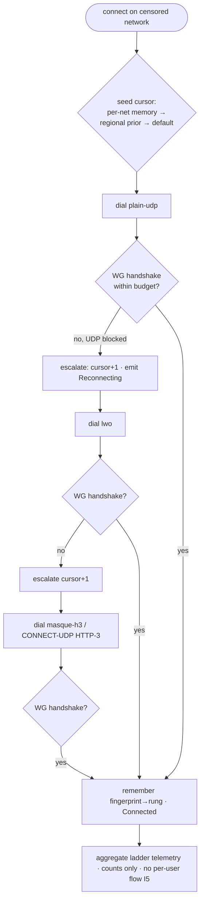
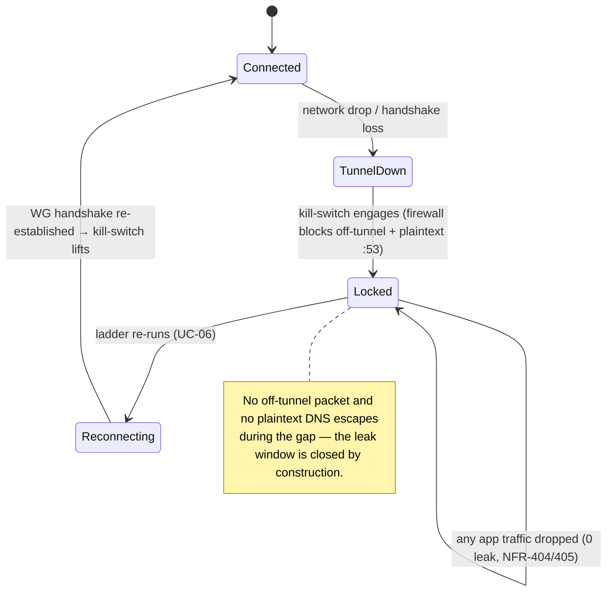
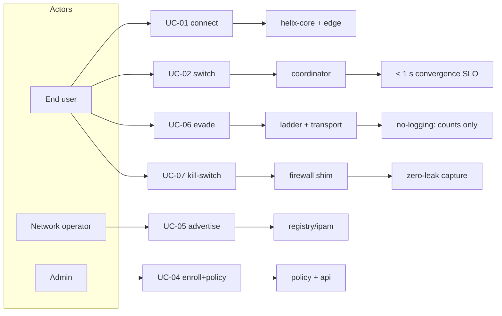

# Use Cases & End-to-End Journeys

**Revision:** 1
**Last modified:** 2026-06-26T12:00:00Z

> **Document role.** This is the Volume 1 (Product & Requirements) nano-detail
> spec enumerating HelixVPN's primary **end-to-end use cases**, each rendered as
> a step-by-step **journey** with a Mermaid sequence diagram, explicit
> preconditions and postconditions, and the exact **components and APIs**
> exercised. It turns the three roles, seven principles, and parity matrix of
> the Volume 1 overview (`00-product-scope-and-principles.md`) into runnable
> narratives that the §11.4.169 test types and the 8-criteria MVP DoD trace onto.
>
> **Document is a SPEC.** It describes *what the user does and what the system
> does in response*; it does not build the product. Each journey is a candidate
> e2e / full-automation test scenario (§11.4.98 — fully self-driving, no manual
> step after start) and is written so its postconditions are captured-evidence
> assertions, not prose claims (§11.4 / §11.4.69).
>
> **Evidence base.** Cross-references the Volume 1 overview (roles §3, two-way /
> multi-network §4, parity matrix §9, scope §10, decisions D1/D4/D6), the
> coordinator streaming contract (`v03-control-plane/svc-coordinator.md` —
> `WatchNetworkMap`, the < 1 s convergence + revoke SLOs, the reaction table),
> the telemetry presence + audit model (`v03-control-plane/svc-telemetry.md`),
> the no-logging invariant (`v05-security/no-logging-as-code.md`), and the
> transport escalation ladder
> (`v02-data-plane/transport-selection-ladder.md`). Research is cited by the
> overview's ids (`[04_ARCH §N]`, `[04_P1]`). Anything unproven is marked
> `UNVERIFIED` per §11.4.6.

---

## Table of contents

- [1. Use-case catalogue & actor model](#1-use-case-catalogue--actor-model)
- [2. UC-01 — Consumer first connect (privacy exit)](#2-uc-01--consumer-first-connect-privacy-exit)
- [3. UC-02 — Switch exit / server](#3-uc-02--switch-exit--server)
- [4. UC-03 — Enable multihop](#4-uc-03--enable-multihop)
- [5. UC-04 — Business admin enrolls a device & sets policy](#5-uc-04--business-admin-enrolls-a-device--sets-policy)
- [6. UC-05 — Connector advertises a route](#6-uc-05--connector-advertises-a-route)
- [7. UC-06 — Censorship-evade via transport escalation](#7-uc-06--censorship-evade-via-transport-escalation)
- [8. UC-07 — Kill-switch trips on network drop](#8-uc-07--kill-switch-trips-on-network-drop)
- [9. Cross-cutting postcondition invariants](#9-cross-cutting-postcondition-invariants)
- [10. Use-case → component → API → test traceability](#10-use-case--component--api--test-traceability)
- [Sources verified](#sources-verified)

---

## 1. Use-case catalogue & actor model

The actors are the three roles of the overview plus the human personas
(`00-...` §3, §5).

| Actor | Role / persona | App |
|---|---|---|
| **End user** | Mullvad-style privacy/lab user | Helix Access |
| **Network operator** | exposes a LAN safely | Helix Connector (daemon) |
| **Admin** | manages tenants/users/devices/policy | Helix Console |
| **Gateway control plane** | Go (identity/registry/ipam/pki/policy/coordinator/events/telemetry/api) | server |
| **Gateway edge** | Rust data plane (transports + WireGuard) | server |

| UC | Title | Primary actor | Phase | Parity / differentiator |
|---|---|---|---|---|
| UC-01 | Consumer first connect (privacy exit) | End user | MVP | F1, F7, F14 |
| UC-02 | Switch exit / server | End user | MVP | F1, X1 |
| UC-03 | Enable multihop | End user | P2 | F10 |
| UC-04 | Admin enrolls a device & sets policy | Admin | MVP | F15, F17, X1 |
| UC-05 | Connector advertises a route | Network operator | MVP | X1, X2 |
| UC-06 | Censorship-evade via transport escalation | End user | MVP | F2, F6, F7, F8 |
| UC-07 | Kill-switch trips on network drop | End user | MVP | F11, F13 |

Each journey below maps to the MVP Definition-of-Done acceptance criteria of
the overview §10.2 where applicable, and each is a §11.4.98-compliant
fully-automatable e2e scenario (no human step after start; non-introspectable
UI falls back to the §11.4.117 pixel oracle).

---

## 2. UC-01 — Consumer first connect (privacy exit)

**Goal.** A new end user installs Access, enrolls anonymously (no email), and
gets a full-tunnel privacy exit to the internet — the Mullvad use case.

**Preconditions.**
- A reachable Gateway (self-hosted or managed) with a public endpoint.
- An enrollment token (anonymous device-token path, no PII) OR an OIDC login.
- Access app installed on a supported platform (iOS/Android/Linux for MVP).

**Postconditions (captured-evidence assertions).**
- The device holds an overlay IP and a short-lived mTLS device cert.
- A WireGuard tunnel is established; the chosen exit carries the device's
  internet traffic (full-tunnel).
- A `presence:{tenant}:{device}` key exists in Redis (TTL'd); **no** durable
  connection row exists (NFR-300 / no-logging).
- An `device.enrolled` audit row exists (control action); **no** traffic audit.

**Components / APIs exercised.** `identity` (enroll), `pki` (device cert),
`registry` (device + overlay-IP), `ipam` (overlay IP), `coordinator`
(`WatchNetworkMap`), `helix-core` (tunnel + ladder), gateway `edge` (transport
+ WG), `telemetry` (presence + audit).

```mermaid
sequenceDiagram
  autonumber
  participant U as Access app (helix-core)
  participant ID as identity/pki
  participant REG as registry/ipam
  participant CO as coordinator
  participant ED as edge (Rust+WG)
  participant TEL as telemetry
  U->>U: generate WG keypair on-device (private NEVER leaves, C6)
  U->>ID: enroll(token | OIDC) + WG pubkey
  ID->>ID: validate token; issue short-lived mTLS device cert
  ID->>REG: register device; allocate overlay IP (ipam, ULA/48)
  ID-->>U: device cert + overlay IP
  U->>CO: WatchNetworkMap(mTLS, known_version=0)
  CO-->>U: snapshot {self overlay IP, gateway endpoint, transport order, peers per policy}
  U->>ED: dial transport (ladder: plain-udp first) → WG handshake
  ED-->>U: WG handshake complete → tunnel up
  U->>ED: full-tunnel internet traffic via exit
  U->>TEL: heartbeat → MarkOnline (presence TTL); device.enrolled audited
  Note over U,TEL: postcondition: tunnel up + presence key + NO durable connection row
```

**Honest boundary (§11.4.6).** On iOS the tunnel runs inside the NE memory
ceiling (NFR-500) — first-connect on iOS is gated by Phase-0 G3 and is
`UNVERIFIED` until that on-device capture exists. The journey's logic is
platform-neutral; the iOS resource fit is the open risk, not the flow.

---

## 3. UC-02 — Switch exit / server

**Goal.** A connected user picks a different exit (privacy server) or a
different joined network, and traffic re-routes without dropping the app
session.

**Preconditions.** UC-01 complete (device connected, has overlay IP + cert).
The target exit/network is one the device's policy grants (need-to-know, C4).

**Postconditions.**
- The new exit/network carries traffic; the old one no longer does.
- Convergence to the new route is **< 1 s** (NFR-003) via a `MapDelta`, with
  **no** client restart (DoD-5 spirit).
- The kill-switch never opens a leak during the transition (NFR-404).

**Components / APIs.** Access UI (`helix-ui` ExitPicker), `helix-core`
(re-pin/reconnect), `coordinator` (delta), `edge` (re-route), `policy`
(VisibleTo / AllowedIPs).

```mermaid
sequenceDiagram
  autonumber
  participant U as Access app
  participant CO as coordinator
  participant ED as edge
  U->>U: user selects new exit/network in ExitPicker
  U->>CO: (re)WatchNetworkMap / pin selection
  CO->>CO: recompute self map (need-to-know filter, C4)
  CO-->>U: MapDelta (upsert new peer/exit, remove old) version++
  Note over CO,U: NFR-003 p99 < 1 s, no restart
  U->>ED: reconcile WG peers to new exit
  ED-->>U: traffic now via new exit; old peer removed
  Note over U: kill-switch holds — no off-tunnel leak during switch (NFR-404)
```

> **Need-to-know enforcement (C4).** The user can only switch to an exit/network
> their compiled policy grants — a non-granted target never appears in the
> snapshot (NFR-402), so the UI cannot offer it. This is the multi-network (X1)
> differentiator surfacing as a routing choice.

---

## 4. UC-03 — Enable multihop

**Goal.** A privacy-conscious user enables entry/exit separation (multihop) so
the entry node never sees the exit destination and vice-versa (parity F10).
Phase 2.

**Preconditions.** P2 multihop available; user connected (UC-01). The tenant's
policy/topology offers ≥2 hops in distinct jurisdictions.

**Postconditions.**
- Traffic traverses nested WireGuard (entry → exit), control-plane orchestrated.
- No single hop holds both the user identity and the destination.
- Latency rises (extra hop) within the obfuscation-aware budget (NFR-007) —
  exact added latency `UNVERIFIED` (P2 benchmark owns it).

**Components / APIs.** Access UI (multihop toggle), `helix-core` (nested WG),
`coordinator` (per-hop keys in the map), `policy` (hop authorization), `edge`.

```mermaid
sequenceDiagram
  autonumber
  participant U as Access app
  participant CO as coordinator
  participant E1 as entry hop
  participant E2 as exit hop
  U->>U: enable multihop (entry, exit) toggle
  U->>CO: WatchNetworkMap (multihop request in policy)
  CO-->>U: map with per-hop keys (entry pubkey, exit pubkey) [P2]
  U->>E1: nested WG: outer tunnel to entry
  E1->>E2: inner tunnel entry→exit (entry cannot read inner dest)
  E2-->>U: internet via exit
  Note over E1,E2: entry sees user, not dest; exit sees dest, not user (F10)
```

> **Phase boundary (§11.4.6).** Multihop is explicitly OUT of MVP scope (overview
> §10.2 → P2). This journey is the P2 contract; its postconditions are
> `UNVERIFIED` until the P2 nested-WG implementation and its e2e capture exist.

---

## 5. UC-04 — Business admin enrolls a device & sets policy

**Goal.** An admin (Console) creates a user/device enrollment, then writes a
default-deny ACL granting a group access to a specific network/port — reflected
on the edge in **< 1 s** with no restart.

**Preconditions.** Admin authenticated to Console (RBAC `admin`/`operator`).
A tenant exists; at least one connector has advertised a network (UC-05).

**Postconditions.**
- An enrollment token is minted (audited `enroll_token.mint`); the device
  enrolls (UC-01) and appears in the registry.
- A policy edit (`group:contractors → net:warehouse:554/tcp`) compiles to
  per-peer `AllowedIPs` + an edge verdict map and reaches affected agents in
  **< 1 s** (NFR-003 / DoD-5).
- Audit holds `policy.create` + `policy.activate` control rows; **no** traffic.

**Components / APIs.** Console (`helix-ui` admin + REST `/v1/...`), `api` (Gin
REST + WS/SSE), `identity` (enroll token), `policy` (compiler), `coordinator`
(fan-out), `telemetry` (audit).

```mermaid
sequenceDiagram
  autonumber
  participant AD as Console (admin)
  participant API as api (Gin REST)
  participant POL as policy compiler
  participant BUS as events bus
  participant CO as coordinator
  participant ED as edge
  AD->>API: POST /v1/enroll-tokens (mint) → audited enroll_token.mint
  API-->>AD: token (shown once; never logged §11.4.10)
  AD->>API: PUT /v1/policy (group:contractors → net:warehouse:554/tcp)
  API->>POL: compile (default-deny, fail-closed)
  POL->>BUS: events:policy {policy.compiled, version}
  BUS-->>CO: deliver
  CO->>CO: projectionDiff → minimal affected set
  CO->>ED: MapDelta (AllowedIPs + verdict map) version++
  Note over CO,ED: NFR-003 p99 < 1 s, no restart (DoD-5)
  AD->>API: GET /v1/audit → policy.create + policy.activate rows (control-only)
```

> **Authorization boundary.** `GET /v1/audit` requires `admin`/`operator`;
> `member` is denied; RLS is the floor so even a mis-scoped query returns only
> the caller's tenant rows (NFR-408). The minted token is shown once and never
> logged (§11.4.10).

---

## 6. UC-05 — Connector advertises a route

**Goal.** A network operator installs the Connector daemon inside a private LAN;
it dials **outbound** to the Gateway and advertises the LAN's CIDRs — no inbound
port-forward, ever (P3 / X2).

**Preconditions.** Connector daemon installed on a host inside the LAN. An
enrollment token for the connector. Outbound reachability to the Gateway.

**Postconditions.**
- The connector holds a device cert + overlay identity and an attached `site`
  (4via6 site id, D4).
- Its advertised CIDRs are registered; authorized users' maps gain reachable
  peers/routes for that network.
- Overlapping RFC1918 ranges across connectors are disambiguated by the overlay
  addressing scheme (ULA /48 + 4via6 / per-network NAT fallback, D4).
- **No** inbound port was opened on the LAN's router (P3 assertion).

**Components / APIs.** Connector (`helix-core` advertise/route mode), `identity`
/`pki`, `registry` (`route.advertised`), `ipam` (site), `coordinator` (reaction
`connector.attached` / `connector.prefixes.changed`), `policy`.

```mermaid
sequenceDiagram
  autonumber
  participant CN as Connector daemon (in LAN)
  participant ID as identity/pki
  participant REG as registry/ipam
  participant CO as coordinator
  participant U as authorized Access user
  CN->>ID: outbound dial + enroll(token) + WG pubkey
  ID-->>CN: device cert; overlay identity; site id (4via6, D4)
  CN->>REG: advertise CIDRs (route.advertised)
  REG->>CO: events {connector.attached, connector.prefixes.changed}
  CO->>CO: recompute maps for nodes whose policy grants these CIDRs
  CO-->>U: MapDelta (new reachable network via this connector)
  Note over CN: NO inbound port opened on the LAN router (P3 / X2)
  Note over CO,U: overlapping 192.168.x ranges disambiguated by D4 overlay addressing
```

> **Conflict handling (§11.4.6).** Two connectors advertising the same RFC1918
> range raise `route.conflict.detected`; the coordinator does **not** push a
> delta for it — the conflict surfaces to Console and 4via6 site disambiguation
> resolves it (D4). The concrete addressing scheme is frozen in the Phase-1 IPAM
> design; until then the collision resolution detail is `UNVERIFIED`.

---

## 7. UC-06 — Censorship-evade via transport escalation

**Goal.** A user on a censored network where plain WireGuard/UDP is blocked
automatically escalates the transport ladder until an obfuscated rung (MASQUE/QUIC)
carries the WG handshake — Mullvad's "automatic obfuscation" (F7), looking like
ordinary web traffic.

**Preconditions.** Device enrolled (UC-01). The current network blocks
plain-UDP WG (DPI / UDP block). The ladder order is the default or a
coordinator-pushed regional prior.

**Postconditions.**
- The ladder advances monotonically within the attempt (L-I8) until a rung
  completes a **WG handshake** (carrier-connect alone is not success, I2).
- The working rung is remembered per-network (fingerprint hash + rung index,
  **no** SSID plaintext, **no** endpoint, no per-connection log — I5).
- Aggregate escalation telemetry is recorded (counts only, no per-user flow).
- Throughput on the obfuscated rung meets the DPI-survival bar (NFR-002 ≥ 50 %
  of plain — TARGET `UNVERIFIED` until G2).

**Components / APIs.** `helix-core` ladder (`ladder.rs`), `helix-transport`
(plain-udp / lwo / masque-h3 / …), `edge` (transport termination), `coordinator`
(`TransportPolicy.order` regional prior), `telemetry` (aggregate ladder
outcomes).



> **No-logging on the evade path (§11.4.6).** Per-network memory persists only a
> fingerprint *hash* + last-good rung index — never the SSID, never the server
> endpoint, never a timestamped per-connection record (I5). The escalation event
> trace IS the captured evidence (L-I9), and it carries no destination. The
> ≥ 50 % DPI-survival throughput is a TARGET pending Phase-0 G2.

---

## 8. UC-07 — Kill-switch trips on network drop

**Goal.** The user's underlying network drops (or the tunnel fails); the
kill-switch blocks all off-tunnel traffic so nothing leaks, and DNS stays forced
through the tunnel (F11 + F13).

**Preconditions.** Device connected with kill-switch enabled (default-on for the
privacy posture). The OS firewall integration is active (`helix-core` state
machine + per-OS firewall driver).

**Postconditions.**
- On tunnel-down, **0** packets traverse the physical interface off-tunnel
  (NFR-404 leak test).
- **0** plaintext DNS queries escape off-tunnel (NFR-405).
- On reconnect (ladder re-runs, UC-06), the kill-switch lifts only once a tunnel
  is re-established — never a leak-window during the gap.

**Components / APIs.** `helix-core` (kill-switch + DNS state machine), per-OS
firewall shim (nftables/WFP/NE rules), `coordinator` (reconnect map), `edge`.



> **Verification (§11.4.69).** The kill-switch postconditions are proven by a
> packet-capture leak test on the physical interface during a forced
> tunnel-drop: a non-zero off-tunnel packet count is a FAIL. The capture IS the
> evidence; "no leak observed" without the capture is a PASS-bluff (§11.4).

---

## 9. Cross-cutting postcondition invariants

Every journey above, regardless of actor, must leave the system in a state that
satisfies these invariants — they are the union of the seven principles and the
no-logging guarantee surfacing as per-journey postconditions:

| Invariant | Holds in every journey because | Verified by |
|---|---|---|
| **Fail-static (P1)** | the edge forwards from a cached verdict map; a control-plane blip during any journey never drops an established tunnel | chaos (kill control plane mid-journey) |
| **Outbound-only (P3)** | every actor *dials out*; the gateway is the only public listener | security (no-inbound assertion) |
| **Need-to-know (C4)** | every map a journey delivers is policy-filtered; a non-granted peer never appears | meta-test (skip-filter mutation FAILs) |
| **< 1 s convergence (P4)** | every map change in a journey is a minimal `MapDelta` | performance (`helix_reconcile_seconds`) |
| **No-logging (P7)** | no journey writes a durable connection/traffic row; presence is ephemeral; audit is control-only | security (schema-lint, deployed DB) |
| **Anonymous identity (F15)** | first-connect (UC-01) needs no email/SSO | integration (anonymous enroll) |

> **Anti-bluff coupling (§11.4 / §11.4.98).** Each journey is authored as a
> fully self-driving e2e scenario: no human action after start, deterministic
> across re-runs (§11.4.50), captured evidence per postcondition. A journey that
> "passes" without its postcondition captures (presence key present, no durable
> row, delta on wire, zero leak) is a PASS-bluff at the use-case layer.

---

## 10. Use-case → component → API → test traceability

| UC | Components | Key APIs / streams | DoD / NFR | §11.4.169 test type |
|---|---|---|---|---|
| UC-01 | identity, pki, registry, ipam, coordinator, core, edge, telemetry | enroll; `WatchNetworkMap`; transport dial | DoD-1/2, NFR-307/304 | e2e / full-automation |
| UC-02 | core, coordinator, edge, policy | `WatchNetworkMap` delta | DoD-5, NFR-003/402 | e2e |
| UC-03 | core, coordinator, edge, policy | map w/ per-hop keys (P2) | F10, NFR-007 | e2e (P2) |
| UC-04 | api, identity, policy, coordinator, telemetry | REST `/v1/...`; events:policy; audit | DoD-3/5, NFR-003/408 | e2e + integration |
| UC-05 | core, identity, pki, registry, ipam, coordinator, policy | `route.advertised`; `connector.attached` | X1/X2, NFR-103/104 | e2e + integration |
| UC-06 | core (ladder), transport, edge, coordinator, telemetry | ladder; `TransportPolicy.order` | DoD-4, NFR-002/410/006 | e2e (DPI-sim) |
| UC-07 | core (kill-switch/DNS), firewall shim, coordinator, edge | firewall state machine | DoD-7, NFR-404/405 | security / e2e (leak test) |



> **Phase honesty (§11.4.6).** UC-01/02/04/05/06/07 are MVP-scoped; UC-03
> (multihop) is P2. P2/P3 postconditions are `UNVERIFIED` until their phase's
> implementation and captured e2e evidence exist — they are the forward
> contract, never asserted as already working.

---

## Sources verified

- `docs/research/mvp/final/00-product-scope-and-principles.md` — three roles +
  control relationships (§3), two-way / multi-network exact meaning (§4),
  personas + app classes (§5), Mullvad-parity matrix F1–F17 + X1–X5 (§9), phase
  scope + 8-criteria MVP DoD (§10), decisions D1 (MASQUE)/D4 (ULA+4via6)/D6
  (asymmetric per-leg) (§11).
- `docs/research/mvp/final/v03-control-plane/svc-coordinator.md` — the
  `WatchNetworkMap` streaming handler, `known_version` resume, the reaction
  table (`device.enrolled`/`device.revoked`/`connector.attached`/
  `connector.prefixes.changed`/`policy.compiled`), need-to-know `VisibleTo`
  filtering (C4), the < 1 s convergence + < 1 s revoke SLOs (§7).
- `docs/research/mvp/final/v03-control-plane/svc-telemetry.md` — ephemeral Redis
  presence (MarkOnline/Refresh/Offline, TTL), the control-action audit vocabulary
  + meta-shape guard, counts-only metrics.
- `docs/research/mvp/final/v05-security/no-logging-as-code.md` — the no-logging
  postcondition invariants (no durable connection row, presence ephemeral, audit
  control-only) every journey must satisfy.
- `docs/research/mvp/final/v02-data-plane/transport-selection-ladder.md` — the
  escalation ladder behind UC-06 (seed order, monotonic cursor L-I8, WG-handshake
  success criterion I2, per-network memory + no-logging I5, aggregate telemetry).

*Constitution bindings applied: §11.4.44 (revision header), §11.4.6 (no-guessing
— P2/P3 postconditions + unproven targets marked `UNVERIFIED`), §11.4.98 (every
journey authored as a fully self-driving e2e scenario, no manual step after
start), §11.4.50 (deterministic re-run), §11.4.69/§11.4.107 (each postcondition
is a captured-evidence assertion), §11.4.117 (pixel-oracle fallback for
non-introspectable UIs), §11.4.25 (use-case → component → test coverage ledger
§10), §11.4.65/§11.4.153 (HTML+PDF[+DOCX] exports follow in refinement).*
