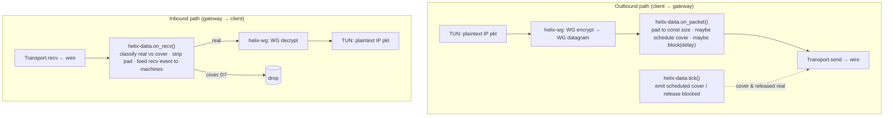
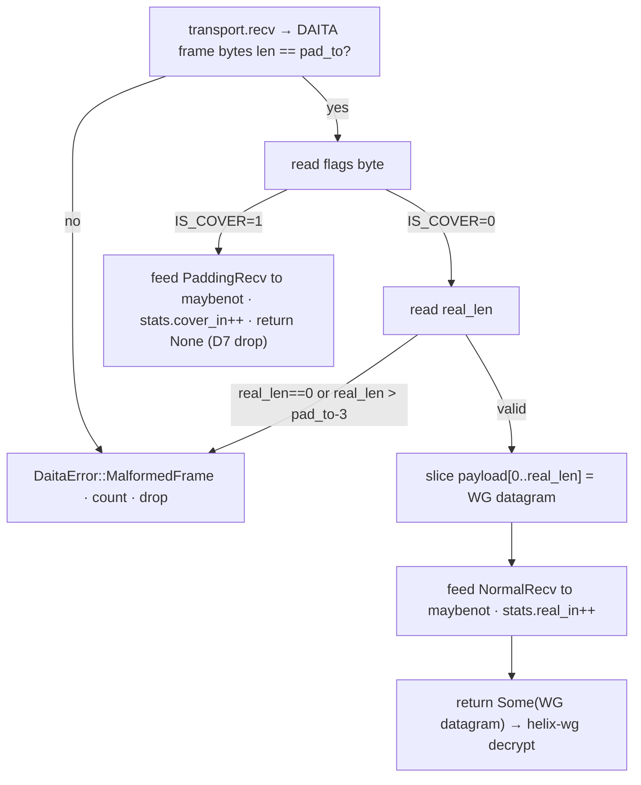
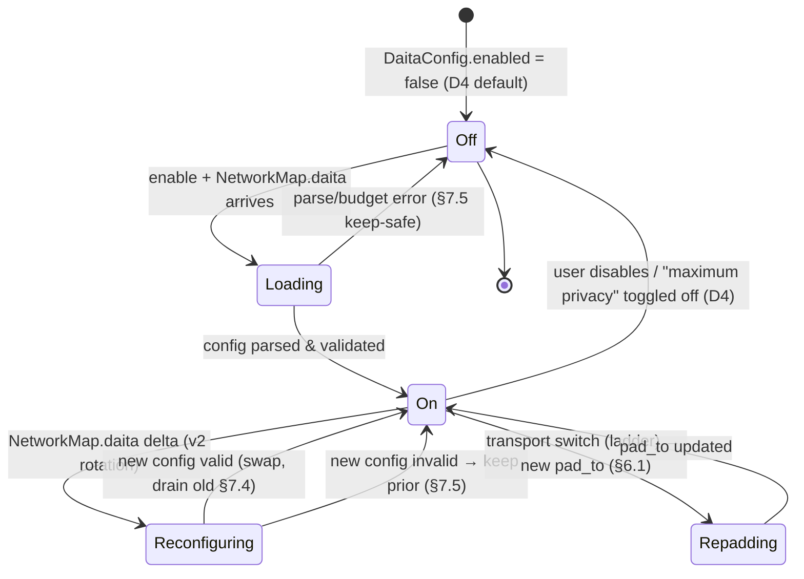
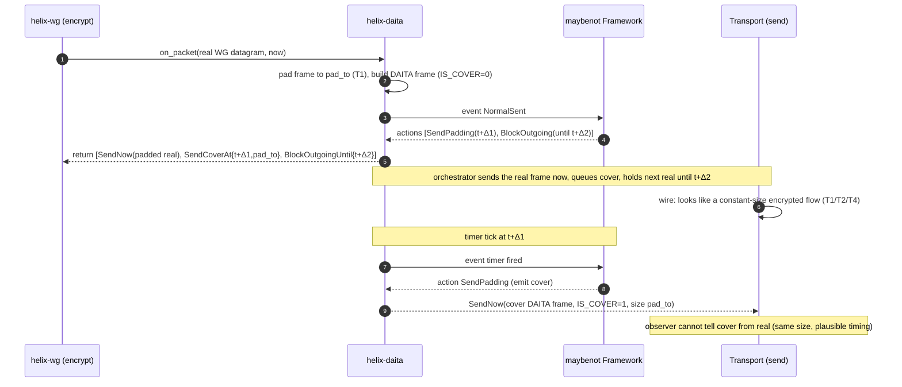

# DAITA (Defense Against AI-guided Traffic Analysis)

**Revision:** 1
**Last modified:** 2026-06-25T00:00:00Z

> Master technical specification — Volume 2 (Data Plane), nano-detail deepening of
> [01-data-plane §9](../01-data-plane.md). Scope: the `helix-daita` crate — the
> **maybenot**-based traffic-shaping stage that pads, injects cover traffic, and
> normalizes timing for the stream of already-encrypted WireGuard datagrams. This is a
> SPEC (describe what to build; do not write the shipping product). Source evidence cited
> inline by id: `[01-DP §N]` = [01-data-plane.md](../01-data-plane.md); `[04_ARCH §N]`,
> `[04_P0 §N]`, `[04_P2 §N]` = `docs/research/mvp/04_VPN_CLD/*`; `[research-daita]`,
> `[research-mullvad]` = the cited research digests; `[SYNTHESIS §N]` = the cross-document
> synthesis. Anything not groundable is marked `UNVERIFIED` per constitution §11.4.6.

---

## 0. Position, ownership, and what this document fixes

DAITA defeats **size / timing / frequency fingerprinting** of fully-encrypted flows: a
passive on-path observer (ISP, network tap, censor) cannot read WireGuard payloads but CAN
observe packet **sizes** and **timing**, and modern ML/DL website-fingerprinting attacks
(Deep Fingerprinting "DF", Robust Fingerprinting "RF") classify which site/service/contact
a user is reaching purely from those size+timing traces [research-mullvad §1, research-daita
§2]. DAITA = **D**efense **A**gainst **AI**-guided **T**raffic **A**nalysis, Mullvad's
mechanism, built on the **maybenot** framework developed with Karlstad University
[research-daita §2].

**The single load-bearing rule** [01-DP §9, 04_P2 §2]: *do **not** roll your own traffic-
analysis defense.* HelixVPN adopts **maybenot** (the same Rust framework Mullvad's DAITA
runs on) as the state-machine engine; `helix-daita` owns only (a) the **placement** (L2.5,
above WireGuard, below the transport), (b) the **per-packet hook** and **timer pump**, (c)
the **constant-size padding / cover-injection / timing-block** actuators, and (d) the
**machine-distribution-as-data** path via `NetworkMap.daita`. The privacy *policy* (which
machines, the website-fingerprinting validation harness, off-by-default opt-in semantics) is
*referenced* here for its data-plane seams and *specified in full* in the security doc
[01-DP §9].

### 0.1 What `helix-daita` owns vs. does not own

| Owns (this document) | Does NOT own |
|---|---|
| The `helix-daita` crate: `Daita`, `DaitaConfig`, the `on_packet` / `tick` / `on_recv` hooks | The maybenot state-machine *engine* internals (vendored crate `maybenot` 2.x [research-daita §1]) |
| Constant-size padding actuator + cover-packet emitter + outgoing-block (timing-norm) actuator | The *content* of defense machines (authored offline as data; security doc) |
| Wiring into the orchestrator's outbound/inbound loops (L2.5 placement) [01-DP §5.1, §9] | The `NetworkMap.daita` wire schema (doc 03 `WatchNetworkMap`) — consumed here, defined there |
| The padding-marker datagram format on the WG-datagram boundary | WireGuard crypto / `Tunn` (helix-wg §4) — DAITA never touches plaintext |
| Off-by-default opt-in gate; honest overhead accounting + back-pressure | The censorship/transport ladder (`helix-transport`, [01-DP §3]) — DAITA is orthogonal to *which* transport runs |
| Test points (unit/integration/sim/perf/chaos) | The website-fingerprinting evaluation corpus + AI-classifier harness (security doc) |

### 0.2 Phase

DAITA is a **Phase-2** capability [SYNTHESIS §4, 01-DP §9, 04_P2 §2]. The Phase-0/1 data
plane reserves its seam — the `[DAITA]` stage in the outbound loop `TUN → WG encrypt →
[DAITA] → Transport` [01-DP §5.1] — but ships the stage as a **transparent pass-through**
(`DaitaMode::Off`) until Phase 2. This document specifies the Phase-2 implementation against
that already-frozen seam.

---

## 1. Threat model & design invariants

### 1.1 Threat model (what DAITA defends; what it does not)

| # | Adversary capability | DAITA response | Source |
|---|---|---|---|
| T1 | Passive on-path observer reads packet **sizes** | Constant-size padding → every emitted datagram is one uniform size | [research-mullvad §1, research-daita §2] |
| T2 | Observer reads **timing / inter-packet gaps** | Probabilistic cover injection + outgoing-block (delay) machines distort timing | [research-daita §1, §3] |
| T3 | Observer detects **idle vs. active** (NetFlow collapse) | Inactivity-padding machine emits cover when the tunnel has been silent | [research-daita §3, research-mullvad §1] |
| T4 | ML/DL **website-fingerprinting** (DF / RF) on size+timing burst shape | Bidirectional cover during bursts reshapes the trace below classifier accuracy | [research-mullvad §1, research-daita §2] |
| T5 | Adversary **trains a model** on the current defense set | v2 server-pushed machine rotation invalidates a model trained on the previous set | [research-mullvad §1 (v2), research-daita §4] |

**Out of scope for DAITA** (honest boundary, §11.4.6): it does **not** hide *that* a VPN is
in use (that is the obfuscating-transport's job, [01-DP §3.3 masque-h3]); it does **not**
protect against an active adversary that injects/drops packets to probe timing (maybenot's
defense is statistical, not adversarial-robust against active perturbation — `UNVERIFIED`
whether HelixVPN adds any active-probe mitigation beyond maybenot's stock behavior); it does
**not** alter WireGuard crypto (T-confidentiality is WG's job, [01-DP §4]).

### 1.2 Data-plane invariants DAITA must preserve

These inherit from [01-DP §0.1] and add DAITA-specific clauses:

| # | Invariant | Rationale |
|---|---|---|
| D1 | DAITA operates on **already-encrypted WG datagrams** — it never sees, pads, or reorders plaintext IP packets. Inherits [01-DP I1]. | Padding/cover must be indistinguishable-from-real to the observer; only post-WG-encrypt bytes are. |
| D2 | DAITA preserves WG's **unreliable-datagram** semantics: it may add datagrams (cover) and grow a datagram (pad), but never merges, splits, reorders, or drops a *real* WG datagram. Inherits [01-DP I2]. | A reordered/dropped real datagram breaks WG roaming/keepalive timing and is itself a fingerprint. |
| D3 | DAITA is **orthogonal to the transport**: identical behavior whether the active transport is `plain-udp`, `masque-h3`, `shadowsocks`, … [01-DP §9, 04_P2 §2.2]. | One shaping stage, N transports — same one-crate-three-consumers discipline as `helix-transport` [01-DP I4]. |
| D4 | DAITA is **off by default**, opt-in only ("maximum privacy"), with an honest bandwidth/latency cost surfaced to the user [01-DP §9, 04_P2 §2.3]. | Cover traffic costs real bytes/CPU/battery; a silent default would be a §11.4.6 dishonesty. |
| D5 | DAITA machines are **data, not code**: distributed via `NetworkMap.daita`, tunable server-side without a client rebuild [01-DP §9, 04_P2 §2.3, research-daita §4 (v2)]. | Matches Mullvad v2 server-pushed model; lets defenses rotate to invalidate trained classifiers (T5). |
| D6 | DAITA enforces maybenot **budgets** (padding fraction, blocking fraction) — it can never exceed the configured overhead ceiling. [research-daita §1, research-mullvad §2]. | Bounds the worst-case cost; prevents a misconfigured machine from saturating the link. |
| D7 | Cover datagrams are **dropped at the peer's DAITA inbound stage** and never delivered to WG/TUN. | A cover datagram that reached `Tunn` would be a malformed WG packet and waste decrypt cycles. |

---

## 2. Placement in the data plane (L2.5)

DAITA is a stage **above WireGuard, below the transport** — layer **L2.5** in the [01-DP §1]
model. It operates on the stream of WG datagrams (padding / injecting cover) **before** they
hit the obfuscating transport, and on inbound datagrams **after** the transport but **before**
WG, to strip cover and account for received-packet events [01-DP §9, 04_P2 §2.2].



Both endpoints run a DAITA instance (symmetric deployment — one at the client, one at the
gateway/relay) [research-mullvad §1, research-daita §2]. The gateway's instance is the same
`helix-daita` crate compiled into `helix-edge` (the third consumer, [01-DP §2]); the relay-
side machine set differs from the client-side set (v1 had 4 client + 3 relay machines
[research-daita §3]) but the *engine and actuators are byte-identical code*.

> **Why above WG, not below the transport-AND-below-WG:** padding/cover must look like real
> encrypted traffic to the observer, so it must be inserted on the **encrypted** datagram
> stream (D1). Placing it *below* the transport (after `masque-h3` framing) would corrupt the
> QUIC/HTTP-Datagram structure; placing it *above* WG-encrypt (on plaintext) would violate D1
> and risk leaking pad structure through WG's own length handling. L2.5 is the only correct
> seam. [01-DP §9, 04_P2 §2.2]

---

## 3. The maybenot framework (the vendored engine)

### 3.1 What it is, and exactly which version

maybenot is an open-source **Rust framework for traffic-analysis defenses** — a generalization
of Tor's Circuit Padding Framework (itself a generalization of WTF-PAD), peer-reviewed at ACM
WPES'23 (doi `10.1145/3603216.3624953`, arXiv `2304.09510`) [research-daita §1, research-mullvad
§2]. A defense is expressed as **a list of probabilistic state machines** plus **limits**
(padding/blocking budgets) [research-daita §1].

**Pinned dependency** (constitution §11.4.99 latest-source, verified 2026-06-25 [research-daita
§1, §"Sources verified"]):

| Crate | Version | Role | Confidence |
|---|---|---|---|
| `maybenot` | **2.2.2** | core framework (events → scheduled actions) | confirmed via libraries.io [research-daita §1] |
| `maybenot-simulator` | **2.2.1** | offline eval / test simulator (§9) | confirmed via crates.io [research-daita §1] |
| `maybenot-ffi` | (tracks core) | C ABI — **not used** by HelixVPN (we consume the Rust crate directly) | [research-daita §1] |
| `maybenot-machines` | **1.0.1** | ready-made machine library (seed defenses) | `UNVERIFIED` — from a search snippet, not a fetched crates.io page [research-daita §"Negative findings"] |

MSRV **1.85** [research-daita §1]. The crate is MIT-licensed [research-mullvad §2]. Per
constitution §11.4.74 (catalogue-first / extend-don't-reimplement): maybenot is a **third-party
upstream** — consumed as a pinned Cargo dependency, **not** vendored into an owned submodule,
and **not** re-implemented. If a needed machine primitive is missing, the path is an upstream PR
to `maybenot-io/maybenot`, never an in-tree fork [01-DP analog, §11.4.74].

> **`maybenot-machines` version caveat (§11.4.6):** the `1.0.1` figure is `UNVERIFIED` (search
> snippet only). The build MUST pin whatever version `cargo` resolves at integration time and
> record the resolved hash in `Cargo.lock`; treat `1.0.1` as a planning placeholder, not a fact.

### 3.2 maybenot execution model (the contract `helix-daita` drives)

An instance repeatedly takes **events** describing the encrypted traffic and emits **0+
scheduled actions** [research-mullvad §2, research-daita §1]:

- **Events in:** `NormalSent`, `NormalRecv`, `PaddingSent`, `PaddingRecv`, timer expiry, etc.
  (the exact maybenot 2.x event enum is the upstream API — `helix-daita` adapts its own packet
  events onto it; the precise variant names are the upstream `maybenot::TriggerEvent` set,
  treated as the vendored API surface).
- **Actions out:** **`SendPadding`** (inject a cover packet) and **`BlockOutgoing`** (delay/hold
  outgoing traffic for a timer = timing normalization) [research-daita §1, research-mullvad §2].
  Each action carries a machine id + a timer.
- **Limits/budgets:** the framework caps how much padding and how much blocking each machine may
  impose (the **padding budget** / **blocking budget**) [research-daita §1, §4].

`helix-daita` is the **integration layer**: it (1) translates HelixVPN packet I/O into maybenot
events, (2) receives maybenot actions, and (3) actuates them on the WG-datagram stream (pad,
emit cover, block) while enforcing D2/D6/D7. The state machines themselves are **data** loaded
from config (D5).

### 3.3 v1 vs v2 — which generation HelixVPN targets

| | DAITA v1 [research-daita §3] | DAITA v2 [research-daita §4, research-mullvad §1] |
|---|---|---|
| Client machines | 4 **hardcoded**: (1) inactivity pad if no send in random **[1.5, 9.5] s**; (2) send for every **3rd** packet received; (3) send for every **5th** packet received; (4) randomized-delay padding when idle | **None hardcoded** — relay **selects from a defense DB** and pushes machines + limits to the client at connect time |
| Relay machines | 3 per defense: NetFlow machine + Interspace-inspired padding + a uniquely-generated anti-DF/RF machine | Server-side DB; rotated to invalidate trained classifiers (T5) |
| Bandwidth overhead | baseline | **~50% lower** (~half the dummy packets) at same protection level [research-daita §4, research-mullvad §1] |
| Update model | client rebuild to change defenses | **server-side rotation, no client update** [research-mullvad §1] |

**HelixVPN target: the v2 model** [01-DP §9 "machines distributed as data", research-daita §4
"parity takeaways"]. The `NetworkMap.daita` field IS the v2 server-push channel (D5). The v1
hardcoded constants ([1.5,9.5] s, 3rd/5th-packet ratios) are retained **only as the seed
machine set** shipped as data for the first Phase-2 release (a known-good baseline authored
offline), not as compiled client logic. This makes HelixVPN's client architecturally v2 from
day one while reusing v1's published, evaluated machines as initial content.

> **§11.4.6 on the constants:** the [1.5, 9.5] s window and 3rd/5th-packet ratios come from
> Tobias Pulls' (maybenot author) blog, authoritative for the *design* but **not** re-published
> by Mullvad as exact production constants [research-daita §"Negative findings"]. HelixVPN treats
> them as the documented seed values and re-tunes against its own evaluation corpus (§9.4) before
> any "matches Mullvad" claim. Exact v2 padding-budget numbers and the relay defense-DB size are
> **not public** [research-daita §"Negative findings", research-mullvad §"Honest gaps"] →
> HelixVPN derives its own budgets empirically.

---

## 4. `helix-daita` — types, traits, and the per-packet hook

The crate lives at `helix-core/crates/helix-daita/` [01-DP §2]. It is a decoupled, reusable
component (own logic, no project-specific reach) per §11.4.28.

### 4.1 Public surface

```rust
// helix-daita/src/lib.rs
use bytes::{Bytes, BytesMut};
use std::time::Instant;

/// The DAITA shaping stage. Wraps a maybenot Framework whose machines are CONFIG
/// loaded from NetworkMap.daita (D5), never code. One instance per endpoint (D3, symmetric).
pub struct Daita {
    mode: DaitaMode,
    fw: Option<maybenot::Framework<Vec<maybenot::Machine>>>, // None when mode == Off (pass-through)
    pad_to: u16,                 // constant target size in bytes (T1); see §6
    budget: Budget,              // D6 enforced ceilings
    rng: DaitaRng,               // ChaCha20-seeded; cover timing must be unpredictable (T2)
    stats: DaitaStats,           // aggregate counters only (I5 / §11.4.6)
    epoch: Instant,              // monotonic base for maybenot timers
}

#[derive(Clone, Copy, Debug, PartialEq, Eq)]
pub enum DaitaMode {
    Off,           // D4 default: transparent pass-through, zero overhead
    On,            // machines active per loaded config
}

/// One action the orchestrator must perform, returned from on_packet()/tick().
/// helix-daita NEVER does I/O itself — it returns intents the orchestrator actuates,
/// keeping the stage testable and cancel-safe (matches the Transport trait discipline).
#[derive(Clone, Debug)]
pub enum ScheduledAction {
    /// Send this (already-padded, real or cover) datagram now.
    SendNow(Bytes),
    /// Send a cover datagram at/after `at` (T2 unpredictable timing).
    SendCoverAt { at: Instant, len: u16 },
    /// Hold outgoing real datagrams until `until` (BlockOutgoing = timing normalization, T2).
    BlockOutgoingUntil { until: Instant },
    /// Release any outgoing block early (machine transition).
    Unblock,
}

#[derive(Clone, Copy, Debug)]
pub struct Budget {
    /// Max fraction of total emitted datagrams that may be padding/cover (e.g. 0.5 = ≤50% cover). D6.
    pub max_padding_frac: f32,
    /// Max fraction of wall-time outgoing traffic may be blocked/delayed. D6.
    pub max_blocking_frac: f32,
    /// Hard ceiling on queued cover actions (back-pressure; §7.3).
    pub max_pending_cover: u16,
}

impl Daita {
    /// Construct from the NetworkMap.daita config (D5). Off-config → pass-through.
    pub fn from_config(cfg: &DaitaConfig, now: Instant) -> Result<Self, DaitaError>;

    /// Hot-swap machines/budget when a new NetworkMap.daita delta arrives (no tunnel restart;
    /// matches the §6.3 reconciler "push, don't poll"). Drains in-flight cover safely (§7.4).
    pub fn reconfigure(&mut self, cfg: &DaitaConfig, now: Instant) -> Result<(), DaitaError>;

    /// OUTBOUND hook — called for every real WG datagram leaving helix-wg, BEFORE the transport.
    /// Pads `dg` in place to the constant size (T1) and feeds a NormalSent event to maybenot;
    /// returns the actions to perform (the real datagram + any scheduled cover/block).
    pub fn on_packet(&mut self, dg: &mut BytesMut, now: Instant) -> Vec<ScheduledAction>;

    /// TIMER hook — called on the orchestrator tick (§7.2 cadence). Emits scheduled cover and
    /// releases expired blocks; feeds timer events to maybenot.
    pub fn tick(&mut self, now: Instant) -> Vec<ScheduledAction>;

    /// INBOUND hook — called for every datagram from the transport, BEFORE helix-wg.
    /// Classifies real vs cover (D7), strips padding, feeds NormalRecv/PaddingRecv to maybenot.
    /// Returns Some(real WG datagram) to forward to WG, or None if it was cover (dropped, D7).
    pub fn on_recv(&mut self, dg: Bytes, now: Instant) -> Result<Option<Bytes>, DaitaError>;

    pub fn mode(&self) -> DaitaMode { self.mode }
    pub fn stats(&self) -> DaitaStats { self.stats.clone() }
}
```

### 4.2 Config types (the parsed form of `NetworkMap.daita`)

```rust
// helix-daita/src/config.rs
/// Parsed from the `daita` field of the NetworkMap (doc 03). The wire form is doc 03's;
/// THIS is the in-memory desired-state the reconciler converges to (§6.3 pattern).
#[derive(Clone, Debug)]
pub struct DaitaConfig {
    pub enabled: bool,                 // D4 — false ⇒ Off pass-through
    pub pad_to: u16,                   // constant packet size target (T1); see §6.1 selection
    pub budget: Budget,                // D6
    /// maybenot machine definitions as DATA (D5). Each is a serialized maybenot machine string
    /// (the framework's own machine serialization) authored offline / generated server-side.
    pub machines: Vec<MachineSpec>,
    pub role: DaitaRole,               // Client | Relay — selects which machine set applies
}

#[derive(Clone, Debug)]
pub struct MachineSpec {
    pub id: u16,                       // stable id (for stats/telemetry attribution)
    pub serialized: String,           // maybenot machine serialization (opaque to helix-daita)
}

#[derive(Clone, Copy, Debug, PartialEq, Eq)]
pub enum DaitaRole { Client, Relay }
```

### 4.3 Error taxonomy

```rust
// helix-daita/src/error.rs
#[derive(thiserror::Error, Debug)]
pub enum DaitaError {
    #[error("machine parse failed (id {id}): {reason}")]
    MachineParse { id: u16, reason: String },     // bad serialized machine → reject config, keep prior (§7.5)
    #[error("budget invalid: {0}")]
    BudgetInvalid(String),                          // frac out of [0,1] etc. → reject config
    #[error("pad target {target} < min real datagram {min}")]
    PadTargetTooSmall { target: u16, min: u16 },    // pad_to must exceed largest unpadded WG datagram
    #[error("oversize real datagram {len} > pad target {target}")]
    Oversize { len: u16, target: u16 },             // a real WG datagram bigger than the const size (§6.2)
    #[error("framework error: {0}")]
    Framework(String),                              // maybenot internal error surfaced
    #[error("malformed inbound DAITA frame")]
    MalformedFrame,                                 // bad pad marker on recv (§5.2)
}
```

Failure stance: `MachineParse` / `BudgetInvalid` on `reconfigure()` **reject the new config and
keep the prior working one** (§7.5 — a bad server push must never break a working tunnel,
§11.4.6/§11.4.101 reversible-safe). `Oversize` and `MalformedFrame` are per-datagram and handled
per §6.2 / §5.2. `PadTargetTooSmall` is a construction-time hard error.

---

## 5. Wire format — the padding marker on the WG-datagram boundary

To pad a WG datagram to a constant size (T1) **and** let the peer distinguish a real WG datagram
from cover (D7) and recover the original length, DAITA wraps each outgoing datagram in a thin
**DAITA frame** *inside* the transport payload but *outside* the WG datagram. The transport
carries the DAITA frame as its opaque datagram; the peer's `on_recv` strips it.

> **Design choice (§11.4.6):** Mullvad's exact DAITA wire framing is **not public** — only that
> padding is to a constant size and cover packets are interspersed [research-mullvad §"Honest
> gaps", research-daita §"Negative findings"]. The format below is **HelixVPN's own
> specification** (`NO external solution found — original work`, §11.4.8), constrained to be
> minimal, length-recoverable, and cover-distinguishable. It is a HelixVPN private contract
> between the two `helix-daita` endpoints; it is never seen by the observer in cleartext (it
> rides inside the encrypted-looking transport payload).

### 5.1 DAITA frame layout (little-endian)

```
 byte 0          : flags        (u8)   bit0 = IS_COVER (1=cover, 0=real) ; bits1..7 reserved=0
 bytes 1..3      : real_len     (u16)  length in bytes of the embedded real WG datagram
                                       (0 when IS_COVER=1)
 bytes 3..3+L    : payload      (L = real_len bytes of the WG datagram; absent when cover)
 bytes 3+L..pad_to : padding    (zero or PRNG fill to reach the constant `pad_to` size, T1)
```

- Total on-wire DAITA-frame size is **always exactly `pad_to`** (T1) regardless of real/cover —
  this is the property the observer sees.
- `IS_COVER=1` frames carry `real_len = 0` and are **all padding**; the peer drops them (D7).
- `real_len` lets the peer slice out the exact WG datagram (D2 — no merge/split: one DAITA frame
  ⇒ exactly one WG datagram or one cover).
- Padding bytes: zero-fill is acceptable because the whole frame is subsequently obfuscated by
  the transport (e.g. QUIC/AEAD under `masque-h3`); `UNVERIFIED` whether zero-fill leaks under a
  *weak* transport (`plain-udp`) — under `plain-udp` the WG datagram itself is already encrypted
  so the DAITA frame's pad sits after ciphertext; to be safe the spec REQUIRES **PRNG fill**
  (not zeros) for padding bytes when the active transport is `plain-udp`/`lwo` (low-obfuscation
  rungs), and permits zero-fill under AEAD/QUIC transports. Implementations MUST default to PRNG
  fill (the conservative choice, §11.4.6).

### 5.2 Inbound classification (`on_recv`)



A frame whose length ≠ `pad_to`, or with an out-of-range `real_len`, is `MalformedFrame`:
counted and dropped (never forwarded to WG). This is the inbound guard for D2/D7.

---

## 6. Constant-size padding — selection, oversize, and MTU interaction

### 6.1 Choosing `pad_to`

The constant size MUST be ≥ the largest real WG datagram that can occur on the active transport,
and ≤ the transport's `effective_mtu()` minus the 3-byte DAITA header (§5.1) [01-DP §10 MTU
table]. Selection rule:

```
pad_to = active_transport.effective_mtu()  -  3 (DAITA header)
```

so a maximum-size WG datagram still fits with its header. Per the [01-DP §10] table:

| Active transport | `effective_mtu()` | DAITA hdr | `pad_to` (const size) | Source |
|---|---|---|---|---|
| `plain-udp` | 1420 | 3 | **1417** | [01-DP §10] |
| `masque-h3` | 1280 | 3 | **1277** | [01-DP §10] |
| `shadowsocks` | ~1380 | 3 | ~1377 | derived [01-DP §10] |
| `udp-over-tcp` | ~1380 | 3 | ~1377 | derived [01-DP §10] |
| `lwo` | ~1400 | 3 | ~1397 | derived [01-DP §10] |

When the ladder ([01-DP §5.3]) switches transports mid-session, `pad_to` changes; `helix-daita`
MUST be re-`reconfigure()`d with the new `pad_to` (the orchestrator drives this on the
`Connected{transport,…}` status transition, §7.6). All padded frames after the switch use the new
constant size — there is no requirement that the constant be identical across transports (the
observer only ever sees one transport at a time, D3).

### 6.2 Oversize handling

A real WG datagram larger than `pad_to - 3` cannot be padded *up* to the constant — padding only
adds bytes, never removes. This is bounded away by §6.1 (the inner WG MTU is already set to
`min(transport.effective_mtu(), path-MTU)` per [01-DP §10 rule 1], and `pad_to` derives from the
same `effective_mtu`), so in correct operation it cannot occur. If it does (a misconfiguration or
a path-MTU race), `helix-daita` returns `DaitaError::Oversize`; the orchestrator MUST lower the
inner WG MTU (re-derive, [01-DP §10 rule 3]) rather than truncate or fragment the DAITA frame.
Truncating would break WG decrypt; this is a hard error, never silent.

### 6.3 Padding cost accounting (the honest-overhead seam, D4)

The mean per-real-datagram overhead is the padding bytes plus the amortized cover bytes:

```
overhead_ratio = (padding_bytes + cover_bytes) / real_payload_bytes
```

`DaitaStats` (§8) tracks `real_payload_bytes`, `padding_bytes`, `cover_bytes`, `cover_count`,
`real_count` as aggregate counters so the orchestrator can surface a real, measured cost figure
to the user (D4) — never an estimated/guessed one (§11.4.6). Budget D6 caps `max_padding_frac`
(e.g. 0.5 ⇒ cover ≤ 50% of emitted datagrams, mirroring the DAITA-v2 "~half the dummy packets"
target [research-daita §4]).

---

## 7. Runtime behavior — loops, timing, back-pressure, reconfigure, lifecycle

### 7.1 Orchestrator wiring

`helix-daita` plugs into the [01-DP §5.1] three loops. The outbound loop gains the `on_packet`
call between WG-encrypt and `Transport.send`; a fourth concern — the DAITA timer — folds into the
existing `timer tick` loop:

```
outbound : TUN → wg.handle_tun_out → daita.on_packet → [SendNow|schedule] → transport.send
inbound  : transport.recv → daita.on_recv → (Some? wg.handle_transport_in → TUN | None? drop)
timer    : every tick → daita.tick → emit due cover / release blocks ; (also wg.tick keepalive)
```

The orchestrator owns the actual `transport.send` I/O; `helix-daita` only returns
`ScheduledAction`s (§4.1) — keeping it pure, deterministic, and unit-testable (no sockets in the
crate).

### 7.2 Timer cadence

maybenot machines schedule sub-millisecond-precision actions. The orchestrator's DAITA tick MUST
fire at a resolution fine enough to honor cover timing without busy-spinning. Spec: a
`tokio::time::sleep_until(next_action_deadline)` driven loop — the crate exposes
`Daita::next_deadline() -> Option<Instant>` (the soonest pending cover/unblock time) so the
orchestrator sleeps exactly until the next action rather than polling on a fixed interval. This
gives unpredictable, machine-driven cover timing (T2) without a fixed 10 ms heartbeat that would
itself be a fingerprint. `UNVERIFIED`: the worst-case timer wake-up jitter on mobile (Android
doze / iOS NE scheduling) — measured in Phase-2 perf tests (§9.3), and machines tuned to tolerate
it (DAITA v1 itself chose *randomized* rather than strict constant-rate defenses partly because
of WireGuard-Go event-reporting latency [research-mullvad §1] — the same realism applies here).

### 7.3 Back-pressure & budget enforcement (D6)

Before emitting a `SendCoverAt`, `helix-daita` checks `Budget`:
- if `pending_cover ≥ max_pending_cover` → **drop the scheduled cover** (count it), do not queue
  unboundedly (a runaway machine must not OOM or saturate the link, §12.6 host-safety analog);
- the rolling `padding_frac` (cover/(cover+real)) is checked against `max_padding_frac`; a cover
  action that would exceed the ceiling is suppressed (the budget is a hard cap, not a target).

This makes D6 mechanical: even a malformed pushed machine cannot exceed the configured overhead.

### 7.4 Reconfigure (hot machine swap, D5)

When a `NetworkMap.daita` delta arrives (server rotated the defense set, v2 model
[research-daita §4]), the orchestrator calls `Daita::reconfigure(new_cfg)`:

1. Parse + validate the new `DaitaConfig` (machines, budget, `pad_to`). On any
   `MachineParse`/`BudgetInvalid` → **return Err, keep the prior config** (§7.5).
2. On success: build the new `maybenot::Framework`, swap it in atomically, and let any in-flight
   scheduled cover/blocks from the old machines **drain naturally** (they remain valid DAITA
   frames). No tunnel restart, matching the [01-DP §6.3] "push, don't poll, converge without
   restart" reconciler discipline and the v2 "improve defenses server-side without a client
   update" property [research-mullvad §1].

### 7.5 Failure isolation — a bad push never breaks a tunnel

A defense machine pushed by the server can be malformed (operator error, partial delta). DAITA
MUST fail **safe-open at the shaping layer but safe for the tunnel**: a rejected config leaves the
prior working machines running (or `Off` pass-through if none was loaded). A DAITA failure is
**never** allowed to take down WG forwarding (fail-static, [01-DP I3] generalized). This is the
§11.4.101 reversible/safe-decision discipline at the data-plane layer.

### 7.6 Lifecycle state machine



### 7.7 Sequence — outbound burst with cover + blocking



---

## 8. Telemetry — aggregate-only, no-logging by construction (I5)

DAITA telemetry is **aggregate counters only**, never per-packet/per-connection durable state
([01-DP I5], §11.4.6, research-mullvad §8 no-logging-as-architecture):

```rust
// helix-daita/src/stats.rs
#[derive(Clone, Debug, Default)]
pub struct DaitaStats {
    pub real_count: u64,          // real WG datagrams shaped
    pub cover_count: u64,         // cover datagrams emitted
    pub real_payload_bytes: u64,  // sum of real_len (for overhead_ratio, §6.3)
    pub padding_bytes: u64,       // bytes added as padding
    pub cover_bytes: u64,         // bytes spent on cover frames
    pub blocked_ms_total: u64,    // cumulative outgoing-block time (timing-norm cost)
    pub cover_dropped_budget: u64,// cover suppressed by D6 budget / back-pressure
    pub malformed_in: u64,        // §5.2 inbound rejects
    pub reconfigure_ok: u32,
    pub reconfigure_rejected: u32,// §7.5 bad-push rejects
}
```

These feed the same aggregate dashboards as the transport ladder ([01-DP §5.3 telemetry: "only
aggregate, no per-user data, I5"]). No machine id is logged against any user; `MachineSpec.id` is
used only for in-memory attribution. The CI schema-lint that fails the build on any durable
connection/traffic table [SYNTHESIS §7] covers `helix-daita` too: it MUST have no per-flow durable
store.

---

## 9. Test points (tie to the §11.4.169 test-type taxonomy)

> **§11.4.6 note on the anchor:** the constitution text available to this author enumerates
> §11.4 sub-anchors through **§11.4.168**; a literal **§11.4.169** test-type-taxonomy anchor was
> requested but is **`UNVERIFIED` against the constitution copy in scope**. The test plan below
> is therefore tied to the *named, verifiable* test-type anchors §11.4.27 (100% test-type
> coverage: unit/integration/e2e/full-automation/security/stress/chaos/performance/benchmark),
> §11.4.85 (stress + chaos), §11.4.50 (deterministic N-iteration consistency), §11.4.5/.69/.107
> (captured-evidence / anti-bluff), and §11.4.43/.115 (RED-first). If §11.4.169 exists in the
> canonical constitution, this section satisfies it by enumerating the same per-feature test
> types; the mapping is one-to-one.

Every DAITA claim ships **captured evidence**, never config-only PASS (§11.4.5/.69/.107). The
maybenot **simulator** (`maybenot-simulator` 2.2.1 [research-daita §1]) is the primary offline
oracle: it lets the build evaluate a machine set against synthetic traffic without a live tunnel,
producing reproducible size/timing traces.

| Test type | What it proves | Evidence artifact | Anchor |
|---|---|---|---|
| **Unit** | `on_packet` pads to exactly `pad_to`; DAITA frame round-trips (`encode`→`on_recv`); `Oversize`/`MalformedFrame` rejected; budget D6 suppresses over-ceiling cover | `cargo test` deterministic vectors | §11.4.27 |
| **Property/round-trip** | for any real WG datagram ≤ `pad_to-3`, `on_recv(on_packet(x)) == x` and cover ⇒ `None` (D2/D7) | proptest corpus + counter-example log | §11.4.27 |
| **Integration (netns)** | client+gateway `helix-daita` over a real `plain-udp`/`masque-h3` tunnel in the `ip netns` + `veth` rig [research-daita §5.1]; tunnel goodput preserved within budget | `tshark` capture: all DAITA frames one size; goodput CSV | §11.4.27 |
| **Defense-efficacy (simulator)** | the shipped machine set reduces a DF/RF classifier's accuracy below a threshold on a captured site-visit corpus | `maybenot-simulator` traces + classifier accuracy report (security doc owns the corpus) | §11.4.27 / security doc |
| **Wire-fingerprint** | with DAITA `On`, packet-size histogram is a single spike at `pad_to`; inter-packet timing shows injected cover (T1/T2/T4) | `tshark`/`tc`-captured size+timing histogram before/after | §11.4.5/.69 |
| **Performance / overhead** | measured `overhead_ratio` ≤ configured budget; CPU/latency delta vs `Off`; timer jitter on mobile (§7.2) | per-transport overhead CSV; p99 added latency; CPU/Gbps | §11.4.27 perf |
| **Determinism (N-iter)** | same machine set + same seed ⇒ identical emitted trace across N runs (RNG seeded) | N=3/10 identical evidence hashes | §11.4.50 |
| **Stress** | sustained high pps with cover at budget ceiling — no unbounded queue, `cover_dropped_budget` increments correctly (§7.3) | latency p50/p95/p99 + queue-depth trace | §11.4.85 |
| **Chaos** | malformed pushed machine on `reconfigure` ⇒ prior config kept, tunnel never drops (§7.5); transport switch mid-burst ⇒ correct `pad_to` repad (§6.1); cover under `netem loss 5%` | recovery trace; `reconfigure_rejected` count; loss-profile goodput | §11.4.85 |
| **Security** | DAITA frame pad uses PRNG fill on low-obf transports (§5.1); no per-flow durable state (CI schema-lint); off-by-default verified (D4) | static-analysis + schema-lint pass; default-Off assertion | §11.4.5 / SYNTHESIS §7 |
| **RED-first** | each fix lands a reproduce-first test capturing the defect on the pre-fix artifact, polarity-switched to a standing guard | RED→GREEN capture pair | §11.4.43/.115 |

**Phase-2 acceptance gate (the DAITA analog of [01-DP §12.1 G-gates]):** DAITA `On` over
`masque-h3` in the netns rig, `tshark` shows **single-size** datagrams + interspersed cover, the
`maybenot-simulator` efficacy report shows the shipped machine set below the DF/RF accuracy
threshold, measured `overhead_ratio` is at/under budget, and toggling DAITA `Off` returns
overhead to zero (D4) — all captured, no config-only PASS.

---

## 10. Open decisions & honest gaps (§11.4.6)

| Ref | Item | Status |
|---|---|---|
| G-DAITA-1 | Exact DAITA-v2 machine/budget **wire schema** (client↔relay push) | **Not public** [research-mullvad §"Honest gaps", research-daita §"Negative findings"]. HelixVPN defines its own via `NetworkMap.daita` (doc 03); not a parity claim. |
| G-DAITA-2 | DAITA-v2 **padding-budget numbers** + relay defense-DB size | **Not public** [research-daita §"Negative findings"]. HelixVPN derives budgets empirically (§9 perf/efficacy). |
| G-DAITA-3 | v1 client constants ([1.5,9.5] s, 3rd/5th-packet ratios) as *production* values | From the maybenot author's blog, authoritative for design, **not** Mullvad-published constants [research-daita §"Negative findings"]. Used as seed data, re-tuned (§3.3). |
| G-DAITA-4 | `maybenot-machines` crate **version** (1.0.1) | **`UNVERIFIED`** (search snippet) [research-daita §"Negative findings"]. Pin at integration, record in `Cargo.lock`. |
| G-DAITA-5 | Active-adversary (packet-injection) robustness of maybenot defenses | **`UNVERIFIED`** — maybenot's published model is statistical vs a passive observer [research-mullvad §1]; HelixVPN claims no more than that. |
| G-DAITA-6 | True photon-level timer jitter on iOS NE / Android doze (§7.2) | Measured in Phase-2 perf tests; machines tuned to tolerate (randomized-not-constant-rate, [research-mullvad §1]). |
| D-DAITA-A | Pad fill: zero vs PRNG under AEAD/QUIC transports | Spec **mandates PRNG fill** as the conservative default (§5.1); zero-fill permitted only under proven-AEAD transports — recorded as a knob, defaulting safe (§11.4.6). |

---

## 11. Build checklist (data-plane DAITA)

Phase-tagged; each maps to a §11.4.93/.95 SQLite tracker item [SYNTHESIS §9].

| Crate / file | Owns | Phase | Gate |
|---|---|---|---|
| `helix-daita/src/lib.rs` | `Daita`, `DaitaMode`, `ScheduledAction`, the three hooks | 0 (Off pass-through) → 2 (On) | reserved seam P0; efficacy P2 |
| `helix-daita/src/config.rs` | `DaitaConfig`/`MachineSpec` (parsed `NetworkMap.daita`, D5) | 2 | reconfigure test |
| `helix-daita/src/frame.rs` | DAITA frame encode/decode (§5), const-pad (§6) | 2 | round-trip + wire-fingerprint |
| `helix-daita/src/budget.rs` | `Budget` enforcement + back-pressure (§7.3, D6) | 2 | stress/chaos |
| `helix-daita/src/error.rs` | `DaitaError` taxonomy (§4.3) | 2 | unit |
| `helix-daita/src/stats.rs` | aggregate-only `DaitaStats` (§8, I5) | 2 | schema-lint (no durable per-flow) |
| `helix-core` wiring | `on_packet`/`tick`/`on_recv` in the three loops (§7.1) + `pad_to` on transport switch (§6.1) | 2 | integration (netns) |
| (vendored) `maybenot` 2.2.2 + `maybenot-simulator` 2.2.1 | engine + offline oracle (pinned dep, §3.1, §11.4.74) | 2 | efficacy report |

---

*End of DAITA nano-detail specification (Volume 2, Data Plane). Pairs with
[01-data-plane.md §9](../01-data-plane.md) (the placement seam), doc 03 `WatchNetworkMap` (the
`NetworkMap.daita` wire schema feeding §4.2 `DaitaConfig`), and the security doc (the defense-
machine content, off-by-default policy, and the website-fingerprinting evaluation harness §9
references). Frozen contracts: the L2.5 placement (§2), the three hooks (§4.1), and the DAITA
frame format (§5.1).*
