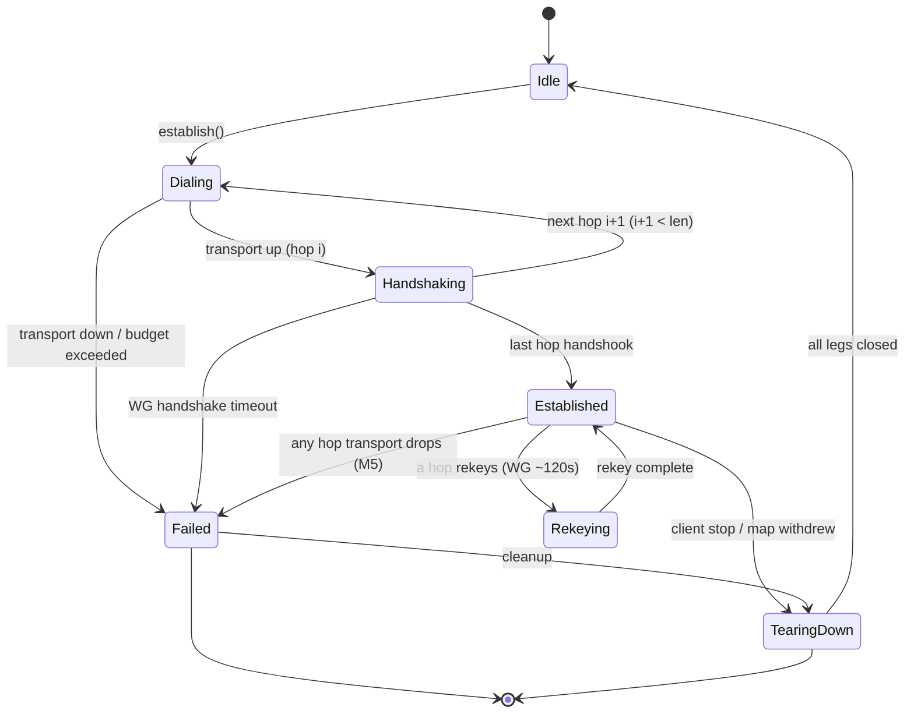
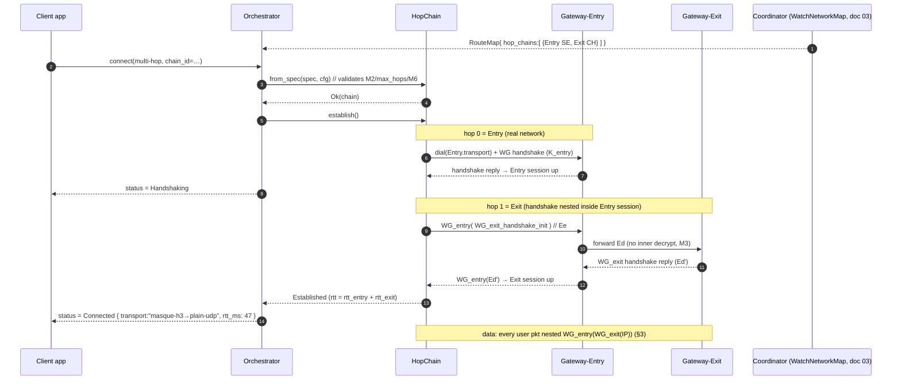

# Multi-Hop (Entry/Exit Separation)

**Revision:** 2
**Last modified:** 2026-07-04T12:00:00Z

> Volume 2 (Data Plane) nano-detail specification. Deepens the **Multi-Hop (nested
> WireGuard)** section of the pass-1 data-plane overview [01-data-plane §11.1]. SPEC-ONLY:
> this document describes *what to build* (Rust traits, structs, enums, fns, wire byte
> layouts, state machines, error taxonomy, config knobs, edge cases, security, performance,
> tests). It does not ship the product. Source evidence cited inline by id, e.g.
> [04_ARCH §3.5], [01-DP §11.1], [SYNTHESIS §3 D6], [research-pki_pq_nat §3].

---

## 0. Position, scope, and what this document owns

HelixVPN multi-hop generalises the original "chain two VPSes" design into a client-driven
**nested-WireGuard tunnel chain** [04_ARCH §3.5, 01-DP §11.1]. The canonical 2-hop topology:

```
Client ──▶ Gateway-Entry ──▶ Gateway-Exit ──▶ { public internet | connector LAN }
```

The defining privacy property — the **Mullvad multi-hop property** [04_ARCH §3.5] — is
**entry/exit separation**:

| Hop | Knows | Does NOT know |
|---|---|---|
| **Entry** (first gateway) | the client's real source IP; that *some* exit follows | the final destination, the plaintext |
| **Exit** (last gateway) | the final destination; the exit-leg ciphertext source | the client's real source IP, the plaintext |

No single relay simultaneously sees *who* the client is **and** *what* it is talking to. This
is achieved structurally, by **nesting two independent WireGuard sessions** so each hop can
only strip its own layer, never the inner one [04_ARCH §3.5].

**This document owns:** the `helix-core/src/hop_chain.rs` module — the nested-WG data
structures, the encapsulation/decapsulation pipeline, the per-hop key model, the hop-chain
state machine, the multi-hop `RouteMap` consumption, the MTU/overhead budget for chains, the
error taxonomy, config knobs, edge cases, and the §11.4.169 test points. It is the Phase-2
work item `helix-core/src/hop_chain.rs` from the build checklist [01-DP §12].

**This document does NOT own** (cross-references): the `Transport` trait and its impls
(owned by [01-DP §3] — each hop reuses an ordinary `Transport` *unchanged*); the `helix-wg`
boringtun wrapper [01-DP §4]; the `WatchNetworkMap` wire contract that *streams* the
multi-hop chain (doc 03); the control-plane chain-selection / jurisdiction policy that
*decides* which Entry+Exit pair to assign (doc 02); the post-quantum PSK layer (security
doc); the kill-switch/DNS-leak interaction (security doc, referenced at §11).

### 0.1 Non-negotiable multi-hop invariants

These extend the data-plane invariants I1–I6 [01-DP §0.1]; an implementation violating any is
a release blocker.

| # | Invariant | Source |
|---|---|---|
| M1 | **No new wire protocol.** A hop chain is N independent WireGuard sessions over N independent `Transport`s; the bytes on each leg are exactly what that leg's `Transport` already carries (I1/I2 preserved per-leg). | [01-DP §11.1], [04_ARCH §3.5] |
| M2 | **Per-hop keys are independent.** The client holds a *distinct* Curve25519 keypair and a *distinct* WG session for every hop. No key is shared across hops. | [04_ARCH §3.5], [research-pki_pq_nat §1.1] |
| M3 | **Strict layering: each hop strips exactly one layer.** Entry decrypts the outer WG session and forwards the *still-encrypted* inner datagram; only Exit can decrypt the inner session. Entry never possesses the inner key. | [04_ARCH §3.5] |
| M4 | **Entry-blindness / Exit-blindness by construction**, not by policy: Entry's `AllowedIPs` for the client peer permit only the Exit overlay address; Exit's view of the source is the Entry leg, never the client. | [04_ARCH §3.5], [01-DP §7] |
| M5 | **Fail-static per hop.** If the control plane is down, an established chain keeps forwarding (I3); a single-hop failure tears down the *whole chain* (no silent half-tunnel) and surfaces `Down`. | [01-DP §0.1 I3] |
| M6 | **Jurisdiction separation is an input, not a guarantee the data plane can verify.** The data plane faithfully chains whatever Entry/Exit the control plane assigns; it cannot itself attest the two gateways are in different jurisdictions (that is doc-02 policy). The data plane MUST expose the assigned `jurisdiction` labels in status so the UX/policy layer can assert the property. | [SYNTHESIS §7], §11.4.6 |

---

## 1. Conceptual model — nested WireGuard

A single-hop tunnel is one WG session inside one `Transport`:

```
[ inner IP packet ] ──WG_exit?── no, single hop:  [ IP ] ─WG(gw)→ [ Transport ] → wire
```

A 2-hop chain composes **two** WG sessions where the *inner* session's encrypted datagram is
the *plaintext payload* of the *outer* session [04_ARCH §3.5, 01-DP §11.1]:

```
            ┌────────────────────────── what the CLIENT does on egress ───────────────────────────┐
 user IP pkt
   │
   ├─① WG-Exit encrypt  (client↔Exit session, key pair K_exit)  →  Ed = WG_exit(IP)
   │        Ed is an opaque WireGuard transport-data message addressed to the Exit overlay IP
   │
   ├─② treat Ed as the *inner IP payload* destined for the Exit overlay address, then
   │   WG-Entry encrypt (client↔Entry session, key pair K_entry)  →  Ee = WG_entry(Ed)
   │
   └─③ Ee handed to the ENTRY-leg Transport.send()  (e.g. masque-h3)  → wire to Entry:443
```

On the return path the client reverses: the Entry `Transport` yields `Ee`, `WG-Entry` decrypts
to `Ed`, `WG-Exit` decrypts to the user IP packet.

The gateways do the middle unwrapping:

```
 ENTRY gateway:  Transport.recv() → Ee → WG_entry.decrypt → Ed (still WG ciphertext)
                 → route Ed toward Exit over the Entry↔Exit Transport (Entry CANNOT read inside Ed; M3)
 EXIT  gateway:  Transport.recv() → Ed → WG_exit.decrypt → user IP packet
                 → forward to {internet | connector} per Exit policy
```

**Key insight (M1):** from each `Transport`'s point of view nothing changed. The Entry leg
carries opaque WG datagrams (`Ee`); the Entry↔Exit leg carries opaque WG datagrams (`Ed`). The
nesting lives entirely in `helix-core`'s encrypt/decrypt ordering — **not** in any new framing
on the wire [01-DP §11.1]. This is why §11.1 says "the transport layer is unchanged."

### 1.1 Generalisation to N hops

The 2-hop case is the MVP target [04_ARCH §3.5]. The data structures generalise to an ordered
chain `[H₀=Entry, H₁, …, H_{n-1}=Exit]`; egress encrypts **innermost-first** (Exit session
applied first, Entry session applied last) and the outermost layer is handed to `H₀`'s
transport. Each intermediate hop strips one layer and forwards. The spec implements and tests
**n ≤ `MAX_HOPS` (default 4)**; n=2 is the only configuration with a Phase-2 acceptance gate,
n=3/4 are validated by unit/integration tests only and gated behind config
(`HopChainConfig.max_hops`). `MAX_HOPS = 4` is a denial-of-amplification ceiling, not a
protocol limit (UNVERIFIED that any source mandates a specific ceiling — chosen here as a safe
default per §11.4.6; tune in Phase 2 from latency budget §10).

---

## 2. Module layout & data model (`helix-core/src/hop_chain.rs`)

The pass-1 sketch [01-DP §11.1] is:

```rust
pub struct HopChain { pub hops: Vec<Hop> }            // [Entry, Exit] for 2-hop
pub struct Hop { pub wg: WgPeer, pub transport: Box<dyn Transport> }
```

This section nano-details it. The full type set:

```rust
// helix-core/src/hop_chain.rs
use crate::status::TunnelStatus;
use crate::wg::{WgPeer, WgVerdict, WgError};                 // [01-DP §4]
use helix_transport::{Transport, TransportConfig, TransportError, dial};
use helix_route::RouteMap;                                  // [01-DP §6.2]
use bytes::{Bytes, BytesMut};
use std::net::IpAddr;
use std::time::{Duration, Instant};

/// An ordered nested-WireGuard tunnel chain. `hops[0]` is ENTRY (outermost on the wire),
/// `hops[len-1]` is EXIT (innermost crypto layer, owns the user IP packet). Invariant M2:
/// every Hop carries a DISTINCT WgPeer (distinct key material).
pub struct HopChain {
    pub hops: Vec<Hop>,            // 1 = single hop (degenerate), 2 = Entry/Exit (MVP), ≤ MAX_HOPS
    state: HopChainState,          // §5 state machine
    cfg: HopChainConfig,           // §7 knobs
    scratch: BytesMut,             // reused egress/ingress encryption buffer (no per-packet alloc)
    metrics: HopChainMetrics,      // aggregate counters only (I5, no per-packet durable state)
}

/// One leg of the chain. The `wg` session and the `transport` are BOTH specific to this leg.
pub struct Hop {
    pub idx: u8,                       // position in the chain, 0 = Entry
    pub role: HopRole,                 // Entry | Intermediate | Exit
    pub wg: WgPeer,                    // distinct client↔hop WireGuard session (M2)
    pub transport: Box<dyn Transport>, // this leg's L2 carrier (may differ per leg — D6 §8)
    pub overlay: IpAddr,               // this hop gateway's overlay address (next-inner dst)
    pub jurisdiction: Jurisdiction,    // label from the map, surfaced for M6 assertion
    health: HopHealth,
}

#[derive(Clone, Copy, Debug, PartialEq, Eq)]
pub enum HopRole { Entry, Intermediate, Exit }

/// Opaque label assigned by the control plane (doc 02). The data plane never INTERPRETS it
/// beyond equality/inequality for the M6 distinct-jurisdiction surface; it is a string id
/// (ISO-3166 alpha-2 or operator-defined region tag), NOT a trust assertion (M6, §11.4.6).
#[derive(Clone, Debug, PartialEq, Eq)]
pub struct Jurisdiction(pub String);

#[derive(Clone, Debug, Default)]
struct HopHealth {
    rtt_ewma_ms: Option<u32>,
    last_recv_age_ms: u64,
    handshake_ok: bool,
}

#[derive(Clone, Debug, Default)]
struct HopChainMetrics {
    chains_established: u64,
    chain_teardowns: u64,
    egress_datagrams: u64,
    ingress_datagrams: u64,
    oversize_drops: u64,           // §6 MTU
    per_hop_handshake_failures: [u32; 8], // indexed by hop idx; aggregate, no per-flow state (I5)
}
```

`HopChain` is owned by the `Orchestrator` [01-DP §5.2] in place of the single
`(WgPeer, Box<dyn Transport>)` pair when multi-hop is active. A single-hop tunnel is the
degenerate `HopChain { hops: vec![Hop{role: Exit, idx: 0, …}] }`, so the orchestrator's two
data loops have ONE code path (chain of length 1 or N) — this is the key simplification that
keeps multi-hop from being a second forwarding engine.

---

## 3. The encapsulation pipeline (egress + ingress)

### 3.1 Egress — innermost-first encryption

```rust
impl HopChain {
    /// Outbound: a plaintext IP packet from the TUN → the outermost (Entry-leg) datagram,
    /// then hand it to hops[0].transport.send(). Innermost (Exit) WG layer applied FIRST.
    /// Returns Ok(()) on send, or a HopChainError that the orchestrator maps to status.
    pub async fn egress(&mut self, ip_pkt: &[u8]) -> Result<(), HopChainError> {
        // ① start with the user IP packet as the innermost plaintext
        let mut layer: Bytes = self.encrypt_exit_layer(ip_pkt)?;          // WG_exit(IP) = Ed
        // ② wrap with each preceding hop, Exit-1 down to Entry (indices len-2 .. 0)
        for i in (0..self.hops.len() - 1).rev() {
            layer = self.encrypt_hop_layer(i, &layer)?;                   // WG_i(layer)
        }
        // ③ outermost layer = Ee → Entry-leg transport
        self.metrics.egress_datagrams += 1;
        self.hops[0].transport
            .send(layer)
            .await
            .map_err(|e| HopChainError::Leg { hop: 0, src: e.into() })
    }

    /// WG-encrypt `inner` for hop `i`'s session. `inner` is treated as the IP payload that
    /// WG_i protects (for i = Exit this is the real user packet; for i < Exit it is the
    /// next-inner hop's ciphertext Ed — opaque to hop i's session, M3).
    fn encrypt_hop_layer(&mut self, i: usize, inner: &[u8]) -> Result<Bytes, HopChainError> {
        self.scratch.clear();
        self.scratch.resize(inner.len() + WG_DATAGRAM_OVERHEAD, 0);
        match self.hops[i].wg.handle_tun_out(inner, &mut self.scratch) {   // [01-DP §4]
            WgVerdict::WriteToTransport(buf) => Ok(Bytes::copy_from_slice(buf)),
            WgVerdict::Nothing => Err(HopChainError::HopNotReady { hop: i as u8 }), // handshake pending
            WgVerdict::Err(e)  => Err(HopChainError::Wg { hop: i as u8, src: e }),
            WgVerdict::WriteToTun(_) => unreachable!("tun_out never yields tun_in"),
        }
    }
    #[inline]
    fn encrypt_exit_layer(&mut self, ip_pkt: &[u8]) -> Result<Bytes, HopChainError> {
        self.encrypt_hop_layer(self.hops.len() - 1, ip_pkt)
    }
}
```

`WG_DATAGRAM_OVERHEAD` is the per-layer WireGuard transport-data overhead: **32 bytes** (4-byte
type/reserved + 4-byte receiver index + 8-byte counter/nonce + 16-byte Poly1305 tag)
[01-DP §10 derivation]. Each nesting level adds this, so a 2-hop chain pays **2× 32 = 64 bytes**
of WG overhead before any transport overhead (the MTU consequence is §6).

### 3.2 Ingress — outermost-first decryption (client side)

```rust
impl HopChain {
    /// Inbound on the client: a datagram arrived on the Entry-leg transport (Ee).
    /// Peel Entry → … → Exit; the Exit layer yields the user IP packet for the TUN.
    /// Handshake replies on any layer are re-emitted out that hop's transport (M5 keepalive).
    pub async fn ingress(&mut self) -> Result<IngressOutcome, HopChainError> {
        let outer = self.hops[0].transport
            .recv().await
            .map_err(|e| HopChainError::Leg { hop: 0, src: e.into() })?;
        self.metrics.ingress_datagrams += 1;
        self.peel(0, outer)
    }

    /// Recursively strip layer `i`. WriteToTransport at layer i = a WG handshake/keepalive
    /// reply for hop i → send it back out hop i's transport (does NOT continue peeling).
    fn peel(&mut self, i: usize, datagram: Bytes) -> Result<IngressOutcome, HopChainError> {
        self.scratch.clear();
        self.scratch.resize(datagram.len(), 0);
        match self.hops[i].wg.handle_transport_in(&datagram, &mut self.scratch) {
            WgVerdict::WriteToTun(plain) if i == self.hops.len() - 1 => {
                // innermost: this is the real user IP packet
                Ok(IngressOutcome::ToTun(Bytes::copy_from_slice(plain)))
            }
            WgVerdict::WriteToTun(inner) => {
                // an intermediate layer decrypted to the NEXT-inner ciphertext → keep peeling
                self.peel(i + 1, Bytes::copy_from_slice(inner))
            }
            WgVerdict::WriteToTransport(reply) => {
                // handshake/keepalive reply for hop i → re-send out hop i's transport
                Ok(IngressOutcome::HopReply { hop: i as u8, datagram: Bytes::copy_from_slice(reply) })
            }
            WgVerdict::Nothing => Ok(IngressOutcome::Consumed),  // e.g. cookie/decoy
            WgVerdict::Err(e)  => Err(HopChainError::Wg { hop: i as u8, src: e }),
        }
    }
}

pub enum IngressOutcome {
    ToTun(Bytes),                                   // deliver to the OS TUN
    HopReply { hop: u8, datagram: Bytes },          // re-send out hop's transport (orchestrator)
    Consumed,                                        // handled internally, nothing to forward
}
```

> **Edge case — peel/encrypt asymmetry on intermediate hops.** On the *client*, the user
> drives `handle_tun_out` (encrypt) for the egress chain and `handle_transport_in` (decrypt)
> for ingress. The *gateways* (Entry/Intermediate) run a DIFFERENT loop: they `decrypt` the
> arriving outer layer with their *server-side* `WgPeer` for the client, then `forward` the
> resulting inner ciphertext over the next leg WITHOUT decrypting it (M3) — they do not own the
> inner key. The gateway forwarding path is specified in §4; `peel` above is the client view.

### 3.3 Packet-flow diagram (2-hop egress)

```mermaid
flowchart LR
    subgraph Client
      TUN[(TUN: user IP pkt)]
      WGx[WG-Exit encrypt<br/>K_exit]
      WGe[WG-Entry encrypt<br/>K_entry]
      TXe[Entry-leg Transport<br/>e.g. masque-h3]
    end
    subgraph EntryGW[Gateway-Entry]
      RXe[Transport.recv]
      WGes[WG-Entry decrypt<br/>server side]
      FWD[forward Ed<br/>NO inner decrypt M3]
      TXi[Entry↔Exit Transport<br/>e.g. plain-udp]
    end
    subgraph ExitGW[Gateway-Exit]
      RXi[Transport.recv]
      WGxs[WG-Exit decrypt<br/>server side]
      OUT[forward to internet<br/>or connector]
    end
    TUN -->|IP| WGx -->|Ed = WG_exit IP| WGe -->|Ee = WG_entry Ed| TXe
    TXe ==>|Ee on wire| RXe --> WGes -->|Ed| FWD --> TXi
    TXi ==>|Ed on wire| RXi --> WGxs -->|IP| OUT
```



---

## 4. Gateway (Entry / Intermediate) forwarding contract

> **Note.** The gateway *role* in a hop chain runs on the `helix-edge` binary [01-DP §11.2, D5]
> using the **same** `helix-transport` + `helix-wg` crates. This section specifies the
> *forwarding contract* the edge must satisfy to participate in a chain; the edge binary's full
> spec is doc 01-DP §11.2 / the edge volume. It is included here because the contract is the
> data-plane half of entry/exit separation.

An Entry (or any non-Exit) gateway, for a given client chain, holds a **server-side `WgPeer`**
for the client's per-hop public key. On a datagram arriving from the client-facing transport:

```rust
// helix-edge: chain-forwarding (one hop's worth)
pub struct ChainForwarder {
    inbound_wg: WgPeer,                 // server side of client↔this-hop WG session
    inbound_tx: Box<dyn Transport>,     // carrier from the previous node (client or prev hop)
    next_tx: Box<dyn Transport>,        // carrier to the NEXT node (next hop or Exit)
    // NO key for any inner layer — M3 enforced structurally (the type holds none)
}

impl ChainForwarder {
    pub async fn pump(&mut self, scratch: &mut [u8]) -> Result<(), ForwardError> {
        let outer = self.inbound_tx.recv().await?;       // Ee
        match self.inbound_wg.handle_transport_in(&outer, scratch) {
            WgVerdict::WriteToTun(inner_ciphertext) => {
                // `inner_ciphertext` is Ed — STILL WireGuard-encrypted for the Exit session.
                // M3: this node CANNOT decrypt it; it only forwards toward the next hop.
                self.next_tx.send(Bytes::copy_from_slice(inner_ciphertext)).await?;
            }
            WgVerdict::WriteToTransport(reply) => {
                self.inbound_tx.send(Bytes::copy_from_slice(reply)).await?; // handshake reply
            }
            WgVerdict::Nothing => {}                       // cookie / decoy / keepalive consumed
            WgVerdict::Err(e) => return Err(ForwardError::Wg(e)),
        }
        Ok(())
    }
}
```

**Why the inner layer is opaque to Entry (M3, the security crux):** the `inbound_wg` session
decrypts the *outer* WG transport-data message. WireGuard's `AllowedIPs` for the client peer on
the Entry gateway are set to **exactly the Exit overlay address** [M4, 01-DP §7]. The decrypted
"IP packet" Entry recovers is `Ed` — but `Ed` is itself a WireGuard message, indistinguishable
from random bytes to anyone without `K_exit`. Entry forwards it to the Exit endpoint over the
Entry↔Exit transport because the routing map says the Exit overlay is reachable via that leg.
Entry has no `K_exit` (it was never given one — M2), so it provably cannot learn the
destination [04_ARCH §3.5]. Symmetrically, the Exit gateway's `inbound_wg` is the client↔Exit
server session; it sees `Ed` arriving from the *Entry* leg, so the source it observes is Entry,
not the client.

```rust
pub enum ForwardError {
    Transport(#[from] TransportError),
    Wg(WgError),
    NextLegDown,
}
```

---

## 5. Hop-chain state machine

The chain has a single lifecycle that gates egress/ingress and drives `TunnelStatus`
[01-DP §5.2]. Egress is permitted only in `Established`; any hop failing transitions the WHOLE
chain (M5 — no half-tunnel).

```rust
#[derive(Clone, Debug, PartialEq, Eq)]
pub enum HopChainState {
    Idle,
    Dialing { hop: u8 },                 // dial()ing hop `hop`'s transport, Entry→Exit order
    Handshaking { hop: u8 },             // WG handshake for hop `hop` in flight
    Established { since: Instant },      // all hops handshook; forwarding live
    Rekeying { hop: u8 },                // a hop is mid-rekey (still forwarding on old keys)
    TearingDown { reason: TeardownReason },
    Failed { hop: u8, reason: TeardownReason },
}

#[derive(Clone, Debug, PartialEq, Eq)]
pub enum TeardownReason {
    ClientRequested,
    HopHandshakeTimeout,     // a hop never completed WG handshake within budget
    HopTransportDown,        // a leg's Transport returned Closed/EndpointBlocked
    MapWithdrew,             // control plane removed this chain from the RouteMap
    Oversize,                // §6 unrecoverable MTU violation
    JurisdictionViolation,   // M6: assigned Entry==Exit jurisdiction with strict policy on (§7)
}
```

### 5.1 Establishment order (Entry-first, then inner)

The chain is brought up **Entry-first, innermost-last**: the Entry transport + Entry WG
handshake must succeed before the Exit handshake can traverse it (the Exit handshake packets
are themselves nested inside the Entry session) [derived from §1 nesting; 04_ARCH §3.5].

```rust
impl HopChain {
    /// Build the whole chain from a multi-hop RouteMap (§8). Dials + handshakes Entry→Exit.
    /// Emits TunnelStatus deltas via the orchestrator's broadcast (caller wires the channel).
    pub async fn establish(
        &mut self,
        on_status: &mut dyn FnMut(TunnelStatus),
    ) -> Result<(), HopChainError> {
        on_status(TunnelStatus::Connecting);
        for i in 0..self.hops.len() {
            self.state = HopChainState::Dialing { hop: i as u8 };
            // hop 0 dials the real network; hops > 0 "dial" by handshaking THROUGH the
            // already-established outer hops (their transport is a virtual leg over the chain).
            self.dial_hop(i).await
                .map_err(|e| { self.state = HopChainState::Failed { hop: i as u8,
                    reason: TeardownReason::HopTransportDown }; e })?;
            self.state = HopChainState::Handshaking { hop: i as u8 };
            on_status(TunnelStatus::Handshaking);
            self.handshake_hop(i).await
                .map_err(|e| { self.state = HopChainState::Failed { hop: i as u8,
                    reason: TeardownReason::HopHandshakeTimeout }; e })?;
        }
        self.state = HopChainState::Established { since: Instant::now() };
        self.metrics.chains_established += 1;
        on_status(TunnelStatus::Connected {
            transport: self.entry_kind_label(),            // e.g. "masque-h3→plain-udp"
            rtt_ms: self.aggregate_rtt_ms(),               // §10 sum of per-hop RTTs
        });
        Ok(())
    }
}
```

`entry_kind_label()` returns a chain label of the form `"<entry-kind>→…→<exit-kind>"` so the
status UX shows the full path (e.g. `"masque-h3→plain-udp"`). `aggregate_rtt_ms()` is the sum
of per-hop RTT EWMAs (latency is additive across a serial chain — §10).

### 5.2 State diagram



> **M5 elaboration.** From `Established`, *any* single hop losing its transport or missing WG
> keepalive past the budget transitions the chain to `Failed{hop}` and then `TearingDown`. The
> orchestrator emits `Down{reason}` and (per the ladder policy [01-DP §5.3]) MAY re-establish.
> The chain is NEVER left in a state where some hops forward and others are dead — that would
> leak (e.g. Entry up but Exit dead → traffic black-holes at Entry, which is also where the
> client's identity is known). Atomicity of teardown is a `CONC`/`RACE` test point (§12).

---

## 6. MTU & overhead budget for chains

Each nesting level adds one WG transport-data header+tag (32 B, §3.1) AND the per-leg transport
overhead. The **inner WG MTU** the client may use is bounded by the *outermost* leg's
`effective_mtu()` minus the cumulative inner-WG overhead [01-DP §10].

For an N-hop chain with hop transports `T₀..T_{n-1}` (T₀ = Entry leg, the wire-facing one):

```
inner_wg_mtu = T₀.effective_mtu()  −  Σ_{i=1..n-1} WG_DATAGRAM_OVERHEAD
             = T₀.effective_mtu()  −  (n-1) · 32
```

Only the Entry leg's transport overhead applies on the wire (the inner legs are encapsulated
*inside* the Entry session, so their transport overhead is paid against the inner budget, not
the path MTU). Worked examples (using [01-DP §10] table values):

| Chain | T₀ (Entry) `effective_mtu()` | inner-WG overhead (n−1)·32 | `inner_wg_mtu` | Note |
|---|---|---|---|---|
| 1-hop (single) | plain-udp 1420 | 0 | **1420** | baseline [01-DP §10] |
| 2-hop udp/udp | plain-udp 1420 | 32 | **1388** | one extra WG layer |
| 2-hop masque/udp | masque-h3 1280 | 32 | **1248** | obfuscated entry leg |
| 3-hop masque/udp/udp | masque-h3 1280 | 64 | **1216** | approaches IPv6 floor 1280 caution |

```rust
impl HopChain {
    /// The inner WG MTU the client must clamp the TUN to. Recomputed on chain (re)establish
    /// and on any per-leg transport change (ladder escalation on the Entry leg).
    pub fn inner_wg_mtu(&self) -> u16 {
        let entry = self.hops[0].transport.effective_mtu();
        let inner_overhead = (self.hops.len() as u16 - 1) * WG_DATAGRAM_OVERHEAD as u16;
        entry.saturating_sub(inner_overhead).max(MIN_INNER_MTU)   // MIN_INNER_MTU = 1280 floor
    }
}
pub const WG_DATAGRAM_OVERHEAD: usize = 32;   // [01-DP §10]
pub const MIN_INNER_MTU: u16 = 1280;          // IPv6 minimum-MTU floor [01-DP §10]
```

Rules (extend [01-DP §10] rules 1–3):
1. The TUN MTU = `min(inner_wg_mtu(), path-MTU-discovered)`; a chain that would force
   `inner_wg_mtu()` below `MIN_INNER_MTU` is **rejected at establish** with
   `TeardownReason::Oversize` rather than silently clamping below the IPv6 floor (a chain that
   cannot carry a 1280-byte inner packet is unusable for IPv6).
2. `TransportError::Oversize` bubbling from ANY inner leg maps to `HopChainError::Leg` →
   `metrics.oversize_drops += 1`; the orchestrator lowers the TUN MTU rather than truncating
   (§11.4.6 — never silently drop bytes).
3. The 2-hop MASQUE/UDP MTU penalty is **measured, not assumed**, in the Phase-2 `BENCH` gate
   (record MTU/throughput/CPU vs single-hop) [01-DP §10, §12].

---

## 7. Configuration knobs

```rust
#[derive(Clone, Debug)]
pub struct HopChainConfig {
    /// Hard ceiling on chain length (denial-of-amplification). Default 4 (§1.1).
    pub max_hops: u8,
    /// Per-hop WG handshake budget before the hop is declared failed.
    /// Default 5 s (WireGuard's own REKEY_TIMEOUT lineage; UNVERIFIED exact value — tune).
    pub hop_handshake_timeout: Duration,
    /// Keepalive-miss budget on an Established hop before M5 teardown. Default 25 s
    /// (≈ WG persistent-keepalive 25 s window; [research-pki_pq_nat baseline]).
    pub hop_keepalive_grace: Duration,
    /// If true, refuse a chain whose Entry.jurisdiction == Exit.jurisdiction (M6 strict mode).
    /// Default true for the privacy "multi-hop" feature; an operator MAY relax for
    /// performance-only chaining (e.g. two hops in one region for routing, not anonymity).
    pub require_distinct_jurisdiction: bool,
    /// Whether the orchestrator re-establishes the chain on M5 teardown (vs surfacing Down).
    /// Default true (auto-reconnect per the ladder [01-DP §5.3]).
    pub auto_reestablish: bool,
}

impl Default for HopChainConfig {
    fn default() -> Self {
        Self {
            max_hops: 4,
            hop_handshake_timeout: Duration::from_secs(5),
            hop_keepalive_grace: Duration::from_secs(25),
            require_distinct_jurisdiction: true,
            auto_reestablish: true,
        }
    }
}
```

`require_distinct_jurisdiction` is the only place the data plane *asserts* M6: it compares the
`Jurisdiction` labels the map supplied. It cannot verify the labels are truthful (M6, §11.4.6)
— it surfaces a `JurisdictionViolation` teardown if Entry==Exit under strict mode so the
control plane's mis-assignment is loud, not silent.

---

## 8. Orchestration via the multi-hop RouteMap (no new wire protocol)

The control plane decides the chain and pushes it via `WatchNetworkMap` (doc 03) as an ordered
list of `PeerRoute`s. The data plane consumes it — **no new protocol** (M1). The existing
`RouteMap`/`PeerRoute` types [01-DP §6.2] carry a chain by adding one field:

```rust
// helix-route/src/map.rs  (extends [01-DP §6.2]; the ONLY multi-hop addition)
pub struct RouteMap {
    pub self_overlay: IpAddr,
    pub peers: Vec<PeerRoute>,                 // policy-filtered (need-to-know, I6)
    pub dns: Vec<IpAddr>,
    pub hop_chains: Vec<HopChainSpec>,         // NEW: ordered chains the client may select
}

/// A control-plane-assigned chain. The client materialises a HopChain from one of these.
pub struct HopChainSpec {
    pub chain_id: u64,                         // stable id for status/telemetry (aggregate, I5)
    pub label: String,                         // human label e.g. "Entry: SE  Exit: CH"
    pub hops: Vec<HopSpec>,                    // ordered Entry → Exit
}
pub struct HopSpec {
    pub wg_pubkey: [u8; 32],                   // this hop gateway's WG public key (M2: distinct)
    pub overlay: IpAddr,                        // this hop's overlay address
    pub endpoint_candidates: Vec<SocketAddr>,  // for the leg's Transport.dial() / NAT (§ [01-DP §8])
    pub transport: TransportConfig,            // per-leg transport (D6 asymmetric-per-leg [SYNTHESIS §3 D6])
    pub jurisdiction: Jurisdiction,            // label for M6
    pub allowed_ips: Vec<IpNet>,               // what this hop's session may carry (M4)
}
```

```rust
impl HopChain {
    /// Build (not yet establish) a chain from a map spec. Validates M2 (distinct keys),
    /// max_hops, and (strict mode) distinct jurisdictions BEFORE any dial.
    pub fn from_spec(spec: &HopChainSpec, cfg: HopChainConfig) -> Result<Self, HopChainError> {
        if spec.hops.is_empty() || spec.hops.len() as u8 > cfg.max_hops {
            return Err(HopChainError::BadChainLength { got: spec.hops.len() as u8, max: cfg.max_hops });
        }
        // M2: every hop pubkey distinct.
        let mut seen = std::collections::HashSet::new();
        for h in &spec.hops {
            if !seen.insert(h.wg_pubkey) {
                return Err(HopChainError::DuplicateHopKey);
            }
        }
        // M6 strict: Entry.jurisdiction != Exit.jurisdiction.
        if cfg.require_distinct_jurisdiction && spec.hops.len() >= 2 {
            let entry = &spec.hops.first().unwrap().jurisdiction;
            let exit  = &spec.hops.last().unwrap().jurisdiction;
            if entry == exit {
                return Err(HopChainError::JurisdictionNotDistinct {
                    entry: entry.clone(), exit: exit.clone() });
            }
        }
        // … construct Hop{} per spec, role = Entry/Intermediate/Exit by position …
        Ok(/* HopChain */ unimplemented_placeholder())
    }
}
```

Reconciliation (push, don't poll) is inherited from [01-DP §6.3]: when the map's
`hop_chains` delta changes (a hop withdrawn, a transport re-pinned, an exit rotated for
jurisdiction policy), the reconciler diffs desired-vs-actual and converges WITHOUT restarting
the orchestrator — converging the chain in **< 1 s** [01-DP §6.3]. A withdrawn chain triggers
`TeardownReason::MapWithdrew`. Per-leg transport selection (D6 asymmetric-per-leg) is "free":
each `HopSpec.transport` is an independent `TransportConfig`, so the Entry leg can be
`masque-h3` while the Entry↔Exit leg is `plain-udp` with NO mechanism change [01-DP §11.3,
SYNTHESIS §3 D6].

### 8.1 Establishment sequence diagram (control-plane orchestrated, 2-hop)



---

## 9. Error taxonomy

```rust
#[derive(thiserror::Error, Debug)]
pub enum HopChainError {
    #[error("chain length {got} invalid (1..={max})")]
    BadChainLength { got: u8, max: u8 },
    #[error("duplicate hop key violates per-hop-key invariant M2")]
    DuplicateHopKey,
    #[error("entry and exit share jurisdiction {entry:?}={exit:?} (M6 strict)")]
    JurisdictionNotDistinct { entry: Jurisdiction, exit: Jurisdiction },
    #[error("hop {hop} not ready (handshake pending)")]
    HopNotReady { hop: u8 },
    #[error("leg {hop} transport error: {src}")]
    Leg { hop: u8, #[source] src: TransportError },
    #[error("hop {hop} wireguard error: {src}")]
    Wg { hop: u8, #[source] src: WgError },
    #[error("hop {hop} handshake timed out")]
    HopHandshakeTimeout { hop: u8 },
    #[error("chain torn down: {0:?}")]
    TornDown(TeardownReason),
}
```

Mapping to `TunnelStatus` [01-DP §5.2] (the orchestrator owns this map):

| `HopChainError` | `TunnelStatus` emitted | Recovery |
|---|---|---|
| `Leg{HandshakeFailed}` / `HopHandshakeTimeout` during establish | `Reconnecting` then ladder-escalate that leg | per-leg ladder [01-DP §5.3] |
| `Leg{Closed/EndpointBlocked}` while `Established` | `Down{reason}` (M5 whole-chain) | `auto_reestablish` |
| `JurisdictionNotDistinct` / `BadChainLength` / `DuplicateHopKey` | `Down{reason}` (no auto-retry — config defect) | surface to control plane / operator |
| `HopNotReady` (egress before established) | drop egress packet, keep state | retried next packet (no status change) |

Honest-failure rule (§11.4.1): every variant fails for a genuine product condition; a chain
that *appears* up but black-holes (e.g. Exit silently dead) MUST surface `Down` within
`hop_keepalive_grace`, never report `Connected` while not forwarding (that is the §11.4
PASS-bluff at the multi-hop layer).

---

## 10. Performance budget

Multi-hop trades latency/throughput for unlinkability. Budgets (Phase-2 `BENCH` gate
[01-DP §12]):

| Metric | Single hop | 2-hop target | Source / rationale |
|---|---|---|---|
| RTT | baseline `r₁` | `r₁ + r₂` (serial sum) | latency is additive along a serial chain; `aggregate_rtt_ms()` reports the sum |
| Throughput | `≥80%` bare link (G1) [01-DP §12] | `≥` single-hop minus the second encrypt/decrypt + extra hop transit | UNVERIFIED exact %, set the gate from the Phase-2 measurement, not a literature guess (§11.4.6) |
| Client CPU/packet | 1× WG seal+open | **2×** WG seal+open (nested) | each layer is one ChaCha20-Poly1305 op [01-DP §4] |
| Inner MTU | 1420 (udp) | 1388 (udp/udp) … 1248 (masque/udp) | §6 |
| Gateway CPU (Entry) | 1× WG open + forward | unchanged: 1× open + forward (M3 — Entry never touches inner crypto) | §4 |
| Convergence on map change | < 1 s [01-DP §6.3] | < 1 s | reconciler is delta-driven, not a restart |

Implementation budget rules: (1) the egress/ingress hot path uses the reused `scratch`
`BytesMut` — **no per-packet heap allocation** per layer (the `Bytes::copy_from_slice` calls
above are the spec's clarity form; the implementation MUST use in-place layering into `scratch`
to hit the CPU budget — a `BENCH`/`MEM` test point §12); (2) per-hop RTT EWMA comes from each
`Transport::health()` [01-DP §3.1] — the chain does not run its own probes; (3) no per-flow
durable state anywhere (I5) — only the aggregate `HopChainMetrics` counters.

---

## 11. Security considerations

1. **Entry/Exit unlinkability is structural, not policy** (M3/M4). It survives a *malicious*
   Entry: a compromised Entry gateway still cannot read `Ed` (no `K_exit`, M2) and cannot learn
   the destination. A compromised Exit cannot learn the client IP (it sees Entry). Only an
   adversary controlling BOTH gateways (or a global passive observer correlating timing) breaks
   it — the classic multi-hop threat model [04_ARCH §3.5]. The data plane's job is to make
   single-gateway compromise insufficient; correlation-resistance is DAITA's job [01-DP §9].
2. **Jurisdiction diversity is an input the data plane cannot attest** (M6, §11.4.6). The
   `require_distinct_jurisdiction` knob makes Entry==Exit *loud* (teardown) but cannot prove the
   labels are honest. The honest boundary MUST be documented to the operator: "the data plane
   chains what the control plane assigns; jurisdiction trust is a control-plane + operator
   responsibility."
3. **Per-hop keys never cross hops** (M2). Enrollment generates a *distinct* WG keypair per hop
   relationship on the device; private keys never leave the device [research-pki_pq_nat §1.3,
   01-DP §4]. The control plane only ever holds the per-hop *public* keys.
4. **No-logging holds per hop** (I5). Each gateway keeps only aggregate counters; a hop chain
   adds no per-connection table. The `chain_id` in telemetry is aggregate ("chain template X
   established N times in region R"), never per-user [01-DP §5.3 telemetry rule].
5. **Kill-switch interaction** (referenced — owned by the security doc): an M5 whole-chain
   teardown MUST trip the kill-switch like any tunnel-down event; a half-up chain (forbidden by
   M5) would be a leak. The state machine's atomic `Failed → TearingDown` is the data-plane
   guarantee the security doc's kill-switch relies on.
6. **Fail-static** (M5/I3): an established chain keeps forwarding if the control plane goes
   away; loss of the control plane does not tear down a working chain. Only a *data-leg* failure
   tears down.
7. **Amplification / resource bound:** `max_hops` (§7) caps chain length so a malicious map
   cannot request a 1000-hop chain to exhaust client CPU/MTU. `from_spec` rejects over-length
   chains before any dial.
8. **Post-quantum is additive per hop** (referenced — security doc): the ML-KEM/FIPS-203 PSK
   [research-pki_pq_nat §2.4] slots into each hop's `Tunn` preshared-key field independently;
   nesting is unaffected because PQ changes the handshake, not the datagram framing [01-DP §4].
   A chain MAY mix PQ and classical hops (e.g. PQ on the Entry leg only) — UNVERIFIED whether
   the MVP mandates PQ on all hops; default to all-or-the-security-doc's-call.

---

## 12. Test points (§11.4.169 mandatory test types)

Every `hop_chain.rs` workable item declares its required test types from the §11.4.169 closed
vocabulary [06-WBS §0.4]. Mapping for this module:

| Code | Test point (captured-evidence per §11.4.5/.69/.107) |
|---|---|
| `UT` | `from_spec` validates M2 (duplicate-key → `DuplicateHopKey`), `max_hops`, M6 strict (Entry==Exit → `JurisdictionNotDistinct`); `inner_wg_mtu()` arithmetic for 1/2/3-hop; encrypt/peel layering order (innermost-first egress, outermost-first ingress); state-machine transition table (every edge in §5.2). |
| `IT` | netns rig [06-WBS §0.4]: real Client + real Entry edge + real Exit edge (booted on-demand via containers submodule §11.4.76); 2-hop chain established; assert `curl` from client reaches the Exit-side target; assert Entry's `WgPeer.AllowedIPs` for the client = only the Exit overlay (M4 captured from edge config). |
| `E2E` | client overlay namespace → through 2-hop chain → `curl http://10.10.0.20/` succeeds; status trace shows `Connecting→Handshaking→Connected{transport:"…→…"}`. |
| `SEC` | **the entry/exit-separation proof**: `tcpdump` on the Entry↔Exit leg shows only opaque WG datagrams (`Ed`) — assert the destination IP/plaintext is NOT recoverable at Entry (M3); `tcpdump` at Exit shows source = Entry, never the client IP (M4); a key-isolation test asserts Entry holds no `K_exit` (M2). DPI/no-plaintext-leak per [06-WBS §0.4 SEC]. |
| `SC` | stress+chaos (§11.4.85): kill the Exit transport mid-transfer → assert WHOLE chain tears down (M5, no half-tunnel) and `Down` emitted within `hop_keepalive_grace`; flap the Entry leg → assert atomic teardown, no leaked forwarding. |
| `CONC`/`RACE` | three-loop orchestrator driving a chain under concurrent egress/ingress; `loom`/`-race` on the atomic `Established→Failed→TearingDown` transition — no torn state where some hops forward and others are dead. |
| `FA` | full-automation deterministic (§11.4.50): `N=3` identical one-shot runs of establish→transfer→teardown produce identical status traces + identical evidence hashes. |
| `BENCH` | `bench.sh` 2-hop vs 1-hop: RTT (assert ≈ `r₁+r₂`), throughput, client CPU/Gbps (assert ≈ 2× WG ops), MTU measured not assumed (§6 row 3), p99 latency CSV [01-DP §10/§12]. |
| `MEM` | RSS sampling of the chain forwarder under sustained transfer (no per-packet alloc — §10 budget); the iOS NE memory ceiling (G3 [01-DP §13]) bounds the client chain state. |
| `CH`/`HQA` | per-gate Challenge scoring the captured SEC/E2E evidence (entry/exit separation proven, not asserted); autonomous HelixQA session against the 2-hop slice [06-WBS §0.4]. |

The ONLY permitted absence of a warranted type is an honest §11.4.3 SKIP-with-reason (e.g.
`MEM` on a host with no iOS device → `topology_unsupported`), never a silent gap [06-WBS §0.4].
Four-layer enforcement per §11.4.4(b) applies to every TASK closure.

---

## 13. Phase placement & checklist

| Item | Owns | Phase | Gate |
|---|---|---|---|
| `helix-core/src/hop_chain.rs` — `HopChain`/`Hop`/state machine/encapsulation | nested-WG egress/ingress, establish, MTU | 2 | — (Phase-2 BENCH/SEC) |
| `helix-edge` `ChainForwarder` (§4) | Entry/Intermediate hop forwarding (M3) | 2 | — |
| `helix-route` `HopChainSpec` map field (§8) | chain delivery via `WatchNetworkMap` | 2 | — |

Multi-hop is **Phase 2 (Parity + Reach)** [SYNTHESIS §4, 01-DP §12]. It is purely additive over
the frozen Phase-0 interfaces (the `Transport` trait §[01-DP §3.1], `helix-wg` §[01-DP §4], the
`TunnelStatus` enum §[01-DP §5.2], the `RouteMap` §[01-DP §6.2]) — it adds one struct module
and one map field, **no new wire protocol** (M1).

### 13.1 Anti-bluff acceptance evidence (§11.4.5/.69/.107)

The release-blocking captured evidence for multi-hop:
- **Entry/exit-separation capture** (the SEC test above): packet captures at Entry and at
  Exit, plus the key-isolation assertion, proving M2/M3/M4 — not a config-only PASS.
- **Whole-chain teardown trace**: ordered `TunnelStatus` events proving M5 atomicity under the
  SC fault injection.
- **2-hop BENCH CSV**: measured RTT/throughput/CPU/MTU vs single-hop, so the latency cost is
  real and quantified, not assumed (§11.4.6).

---

*End of Multi-Hop (Entry/Exit Separation) nano-detail specification. Pairs with doc 01-DP §11.1
(the section it deepens), doc 03 (`WatchNetworkMap` — the live source of the `HopChainSpec`
stream at §8), the security volume (kill-switch/DNS-leak §11.5, post-quantum PSK §11.8), and
doc 02 (control-plane chain & jurisdiction assignment policy — M6).*
