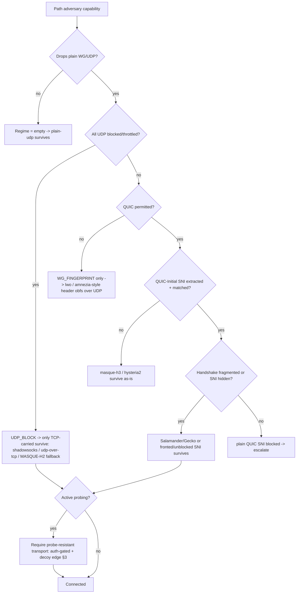
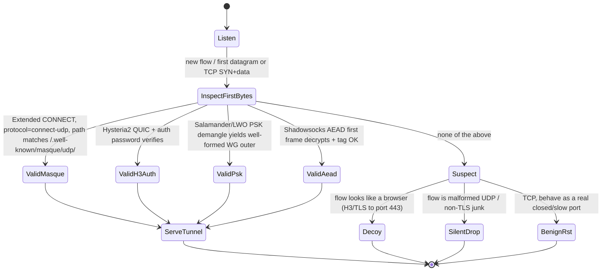
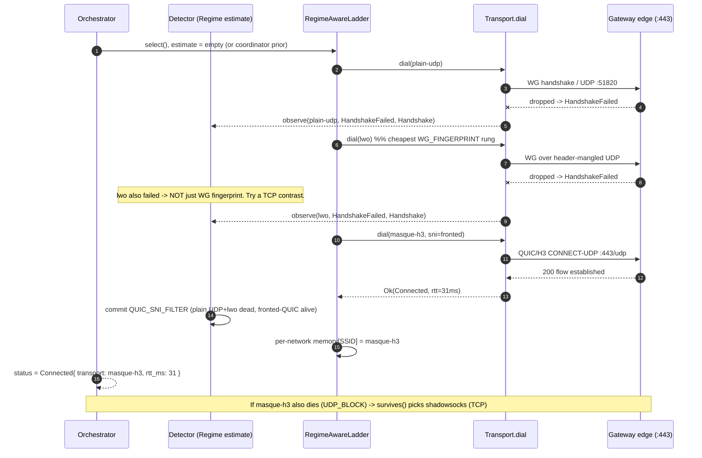
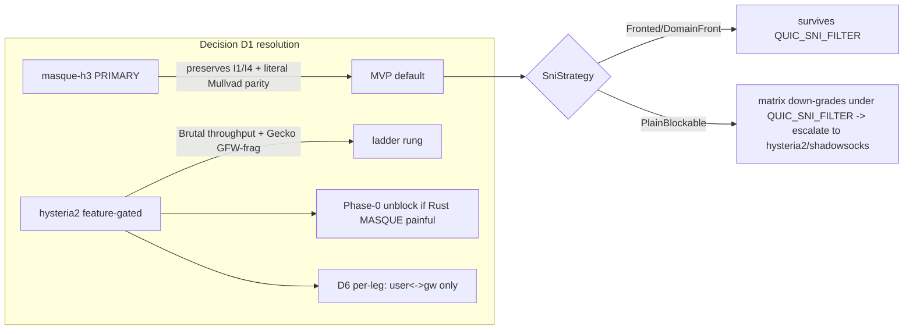

# Obfuscation & DPI/Censorship Landscape

**Revision:** 1
**Last modified:** 2026-06-25T00:00:00Z

> Volume 2 (Data Plane) nano-detail specification. This document deepens the
> *Obfuscation & DPI/Censorship Landscape* surface of the pass-1 data-plane
> overview [01 §3, §3.3–§3.8, §5.3]. It is **SPEC-ONLY**: it describes *what to
> build* (Rust signatures, wire byte-layouts, state machines, error taxonomy,
> config knobs, edge cases, security analysis, performance budget, and the
> §11.4.169 test points), not the shipping product. Every factual claim cites a
> source id — `[01 §N]` (the pass-1 data-plane overview), `[04_ARCH §N]`
> (HelixVPN-Architecture-Refined), `[04_P0 §N]` (Phase0-Spike), `[SYNTHESIS §N]`,
> `[research-hysteria2]`, `[research-masque]`, `[research-daita]`. Facts not
> groundable in the evidence base are flagged `UNVERIFIED:` per §11.4.6.

---

## 0. What this document owns (and what it defers)

The pass-1 overview established the layering invariant — *WireGuard is the
crypto core; obfuscation/transport is a swappable layer **under** WG, never a
fork of WG crypto* [01 §0, §0.1 I1–I6, 04_ARCH §0/§3.1]. It listed the transport
set (`plain-udp`, `masque-h3`, `connect-ip`, `shadowsocks`, `udp-over-tcp`,
`lwo`, `hysteria2`) [01 §3] and surfaced decision **D1** (primary obfuscating
transport: `masque-h3` vs Hysteria2+Salamander) [01 §3.8, SYNTHESIS §3 D1].

**This document owns the censorship side of that picture:**

| # | Owned here | Deferred to |
|---|---|---|
| O1 | The **censorship-regime taxonomy** (GFW QUIC-SNI, hard UDP block, SNI/TLS DPI, active probing, throttling) and the formal **regime → transport survival matrix** | — |
| O2 | **Passive vs active probing resistance** as a typed property of every `Transport`, plus the edge **probe classifier** state machine + decoy responder | `bin/helix-edge.rs` impl (01 §2) |
| O3 | **D1 fully analyzed from all angles** with the cited tradeoff, and the resolved spec stance (primary + ladder + per-leg) | decision log (04_P0 §7) |
| O4 | The **regime-aware escalation ladder** that selects the surviving transport per detected regime, refining the flat ladder of [01 §5.3] | `helix-core/src/ladder.rs` (01 §5.3) |
| O5 | **Wire byte-layouts** of the obfuscation envelopes (LWO header mangling, Salamander scramble, MASQUE HTTP-Datagram, Phantun fake-TCP) so DPI cannot fingerprint them | the per-transport `send`/`recv` (01 §3) |
| O6 | **Anti-fingerprinting** (QUIC/TLS ClientHello mimicry) as an explicit open design problem with a typed config seam | security doc |
| O7 | The §11.4.169 **test points** that prove each survival claim with captured evidence | Volume 8 testing docs |

Out of scope (referenced for seams only): the WG crypto core internals
[01 §4]; DAITA traffic-shaping internals (its *machines* live in the security
doc; only its **placement relative to obfuscation** is noted here at §9)
[01 §9, research-daita]; the control-plane push of `TransportPolicy`
[01 §5.3, doc 03]; multi-hop nesting [01 §11.1].

---

## 1. The censorship-regime taxonomy

A "censorship regime" is the **set of network-layer capabilities the adversary
applies on the path between client and gateway**. HelixVPN does not guess the
regime from a label; it **detects it from observed transport failures** (§4) and
selects the surviving transport. The closed taxonomy below is the type the
detector emits and the survival matrix (§2) is keyed on.

```rust
// helix-transport/src/regime.rs
//
// A detected (or coordinator-asserted) property of the path. NOT a country —
// a capability set. Multiple flags may hold simultaneously (e.g. GFW = QUIC-SNI
// + active-probing + residual-throttle). Bitflags so the survival matrix can AND
// the transport's resistance mask against the regime's threat mask.
bitflags::bitflags! {
    #[derive(Clone, Copy, Debug, PartialEq, Eq, Default)]
    pub struct Regime: u16 {
        /// Plain WireGuard/UDP to :51820 is dropped or RST — WG message-type
        /// fingerprint (types 1–4) and/or invariant sizes (init 148 B,
        /// response 92 B) are matched. [research-hysteria2 §4]
        const WG_FINGERPRINT   = 1 << 0;
        /// ALL UDP (incl. QUIC/443) is dropped or throttled to unusable.
        /// Corporate + China-domestic common. [research-hysteria2 §5(b)]
        const UDP_BLOCK        = 1 << 1;
        /// QUIC is permitted BUT the QUIC-Initial SNI is extracted and matched
        /// against a blocklist (GFW since ~2024-04-07). [research-hysteria2 §5(a)]
        const QUIC_SNI_FILTER  = 1 << 2;
        /// TLS ClientHello SNI on TCP/443 is extracted + blocklist-matched.
        /// [research-hysteria2 §5(c)]
        const TLS_SNI_FILTER   = 1 << 3;
        /// The adversary actively probes the server to confirm a flagged flow
        /// (Shadowsocks-class). [research-hysteria2 §5(d)]
        const ACTIVE_PROBING   = 1 << 4;
        /// Residual/stateful enforcement: after a trigger the 3-tuple/4-tuple is
        /// blocked for a window (GFW: ~3 min, ~500 ms to engage). [research-hysteria2 §5(a)]
        const RESIDUAL_BLOCK   = 1 << 5;
        /// Bandwidth throttling of the suspected flow (not a hard drop).
        const THROTTLE         = 1 << 6;
        /// Packet-size-distribution flagging feeds ACTIVE_PROBING. [research-hysteria2 §5(d)]
        const SIZE_PROFILING   = 1 << 7;
    }
}

/// The threat a transport must defeat to PASS, expressed as the same flags.
/// A transport `survives` a regime iff `transport.resistance() ⊇ regime`
/// (every regime threat bit is covered by a resistance bit), with the UDP_BLOCK
/// special-case (§2.2): UDP-carried transports can NEVER cover UDP_BLOCK.
pub type ThreatMask = Regime;
```

### 1.1 Per-regime mechanism notes (cited facts)

- **`QUIC_SNI_FILTER` (GFW, USENIX Sec '25).** The GFW derives the QUIC-Initial
  decryption key from the packet header (RFC 9001 makes the key header-derivable),
  decrypts the Initial, extracts the SNI, matches a blocklist. It blocked an
  average of **43.8K FQDNs/week** (Oct 2024–Jan 2025) [research-hysteria2 §5(a)].
  **Critical exploitable weakness:** the GFW does **not** reassemble QUIC Initials
  split across more than one UDP datagram — fragmenting the handshake slips past
  [research-hysteria2 §5(a)]. This is the design basis for Salamander/Gecko (§5.3).
- **`RESIDUAL_BLOCK`.** Enforcement is stateful: ~**3-minute** block after a
  trigger, ~**500 ms** to engage, **58% by 3-tuple / 37% by 4-tuple**
  [research-hysteria2 §5(a)]. Consequence: a long-lived tunnel is disrupted; a
  short-lived flow may complete inside the uncensored window. The ladder MUST treat
  a mid-session drop on a previously-working transport as a *residual* event, not a
  fresh dial failure (§4.4).
- **`UDP_BLOCK`.** QUIC / Hysteria2 / MASQUE-over-H3 / WireGuard / AmneziaWG **all
  fail** — they need UDP [research-hysteria2 §5(b)]. Only TCP-carried transports
  (`shadowsocks`, `udp-over-tcp`, MASQUE's HTTP/2 fallback) survive.
- **`ACTIVE_PROBING`.** The GFW passively flags a suspicious flow (partly by
  packet-size distribution → `SIZE_PROFILING`), then actively connects to the
  server to confirm. Mitigation: a probe-resistant front that returns **nothing
  useful** to an unauthenticated prober [research-hysteria2 §5(d)] (§3).
- **Mullvad's public stance (the parity target).** Mullvad shipped WG-over-MASQUE
  QUIC obfuscation 2025-09-09 (desktop v2025.9), auto-tried after failed normal
  attempts, "resembling standard web activity" — and published **no** performance
  numbers and **no** explicit undefended threat [research-hysteria2 §2,
  research-masque §2]. The "looks like HTTP/3" claim rests on **collateral-damage
  deterrence** (blocking QUIC/443 breaks Google/YouTube/Cloudflare), **not** on a
  published ClientHello-mimicry layer — that layer is an open problem (§6).



---

## 2. The regime → transport survival matrix (the load-bearing artifact)

### 2.1 The matrix (facts cited per cell-source)

Each transport declares a **resistance mask** (`ThreatMask`); a transport
*survives* a regime iff its mask covers every threat bit (subject to the
UDP-block carve-out, §2.2). The matrix is the compiled, testable form of
[research-hysteria2 §5] and [01 §3.2 transport matrix].

| Transport | Carrier | `WG_FINGERPRINT` | `UDP_BLOCK` | `QUIC_SNI_FILTER` | `TLS_SNI_FILTER` | `ACTIVE_PROBING` | Throughput on lossy/throttled | Source |
|---|---|---|---|---|---|---|---|---|
| `plain-udp` | UDP | ✗ (raw WG sig) | ✗ | n/a (not QUIC) | n/a | ✗ | baseline | [01 §3.2] |
| `lwo` | UDP | ✓ (header+size mangle) | ✗ | n/a | n/a | partial (no auth front) | ~baseline (−padding) | [01 §3.7, research-hysteria2 §4] |
| `masque-h3` | QUIC/UDP 443 | ✓ (no WG sig on wire) | ✗ | ✓ **iff** proxy SNI unblocked/fronted | n/a | ✓ (decoy edge §3) | standard QUIC CC (fair) | [research-hysteria2 §6, research-masque §2] |
| `hysteria2`+Salamander | QUIC/UDP | ✓ | ✗ | ✓ (SNI/Initial fully scrambled) | n/a | ✓ (password auth front) | **best** (Brutal ignores loss) | [research-hysteria2 §1, §6] |
| `hysteria2`+Gecko | QUIC/UDP | ✓ | ✗ | ✓ (+ handshake fragmentation) | n/a | ✓ | best | [research-hysteria2 §1, §5(a)] |
| `shadowsocks` | TCP | ✓ | ✓ | n/a | ✓ (random-ish TCP) | ✓ **iff** AEAD + probe-resistant front | moderate (HoL) | [01 §3.5, research-hysteria2 §5(d)] |
| `udp-over-tcp` | TCP | ✓ | ✓ | n/a | ✓ **iff** `tls_sni` wrap | partial | moderate (HoL) | [01 §3.6, research-hysteria2 §5(b)] |
| `connect-ip` | QUIC/UDP 443 | ✓ | ✗ | as `masque-h3` | n/a | ✓ | standard QUIC | [01 §3.4, research-masque §1] |

Notes that are **facts**, not preferences:

- **`masque-h3` vs `QUIC_SNI_FILTER` is conditional**: it survives *only if* the
  HTTP/3 proxy's own SNI is unblocked or fronted; otherwise it is SNI-filtered like
  any QUIC [research-hysteria2 §6]. This is why §6 (anti-fingerprinting/SNI
  strategy) is load-bearing, not optional.
- **Hysteria2+Salamander hides the SNI/Initial entirely** → survives
  `QUIC_SNI_FILTER` unconditionally; **Gecko additionally fragments the handshake**
  → directly defeats the GFW no-reassembly weakness [research-hysteria2 §1, §5(a)].
- **Neither QUIC path survives `UDP_BLOCK` alone** — both need a TCP fallback
  (MASQUE: in-protocol HTTP/2; Hysteria2: pair with Phantun udp2tcp or a
  Reality/ShadowTLS sibling) [research-hysteria2 §6].
- **AmneziaWG** is the *lowest-overhead* answer to `WG_FINGERPRINT`-only regimes
  (~3% throughput cost, still UDP) — HelixVPN realizes this class as the `lwo`
  rung rather than a separate transport [research-hysteria2 §4, 01 §3.7].

### 2.2 The matrix as code (compile-time + runtime)

```rust
// helix-transport/src/survival.rs
use crate::regime::{Regime, ThreatMask};
use crate::TransportKind;

/// Each transport's static resistance. Constructed once; unit-tested cell-by-cell
/// against §2.1 (a paired §1.1 mutation flips one cell and a test MUST FAIL).
pub const fn resistance(k: TransportKind) -> ThreatMask {
    use Regime as R;
    match k {
        TransportKind::PlainUdp   => R::empty(),
        TransportKind::Lwo        => R::WG_FINGERPRINT,
        // masque-h3 covers QUIC_SNI_FILTER only when fronted (see `survives`);
        // the static mask claims it, the runtime guard verifies the SNI premise.
        TransportKind::MasqueH3   => R::WG_FINGERPRINT
                                   | R::QUIC_SNI_FILTER | R::ACTIVE_PROBING,
        TransportKind::Hysteria2  => R::WG_FINGERPRINT
                                   | R::QUIC_SNI_FILTER | R::ACTIVE_PROBING | R::THROTTLE,
        TransportKind::Shadowsocks=> R::WG_FINGERPRINT | R::UDP_BLOCK
                                   | R::TLS_SNI_FILTER | R::ACTIVE_PROBING,
        TransportKind::UdpOverTcp => R::WG_FINGERPRINT | R::UDP_BLOCK,
        TransportKind::ConnectIp  => R::WG_FINGERPRINT
                                   | R::QUIC_SNI_FILTER | R::ACTIVE_PROBING,
    }
}

/// True iff `k` is expected to carry a tunnel under `regime`.
/// The UDP_BLOCK carve-out is explicit: a UDP-carried transport can NEVER survive
/// a hard UDP block, regardless of its other resistance bits (§11.4.6 — do not let
/// a mask bug claim the impossible).
pub fn survives(k: TransportKind, regime: Regime) -> bool {
    if regime.contains(Regime::UDP_BLOCK) && carrier_is_udp(k) {
        return false;
    }
    resistance(k).contains(regime & ALL_THREATS_EXCEPT_THROTTLE)
}

pub const fn carrier_is_udp(k: TransportKind) -> bool {
    matches!(k,
        TransportKind::PlainUdp | TransportKind::Lwo
      | TransportKind::MasqueH3 | TransportKind::Hysteria2
      | TransportKind::ConnectIp)
}

const ALL_THREATS_EXCEPT_THROTTLE: Regime =
    Regime::WG_FINGERPRINT.union(Regime::UDP_BLOCK)
        .union(Regime::QUIC_SNI_FILTER).union(Regime::TLS_SNI_FILTER)
        .union(Regime::ACTIVE_PROBING).union(Regime::RESIDUAL_BLOCK)
        .union(Regime::SIZE_PROFILING);
```

**Edge case — the conditional `masque-h3` cell.** `resistance()` statically claims
`QUIC_SNI_FILTER` for `masque-h3`, but that claim holds *only* when the proxy SNI
is fronted/unblocked. The dial path (§6.2) carries an `sni_strategy`; if the
strategy is `PlainBlockable` and the regime has `QUIC_SNI_FILTER`, the ladder MUST
treat `masque-h3` as **not surviving** and skip to `hysteria2`/`shadowsocks`. This
is a runtime refinement of the static mask, asserted by a dedicated test (§7 T-D1-c).

---

## 3. Passive vs active probing resistance (typed, edge-enforced)

### 3.1 The two probing models

- **Passive probing** = the adversary only observes. Resistance = *the bytes on the
  wire carry no transport-distinctive signature*: no WG message-type, no invariant
  size, no plaintext SNI, no QUIC-Initial structure. This is a property of the
  **client-side envelope** (§5).
- **Active probing** = the adversary, having flagged a flow, *connects to the
  gateway* and replays/forges traffic to elicit a distinctive response. Resistance =
  *the edge returns nothing useful to an unauthenticated peer* — it must be
  **indistinguishable from a benign server** to a prober [research-hysteria2 §5(d)].

Both are required for a `QUIC_SNI_FILTER + ACTIVE_PROBING` regime (the GFW). The
client envelope defeats passive; the edge probe-classifier defeats active.

```rust
// helix-transport/src/probe.rs
/// A transport declares, as a type, what kind of probing it defeats.
#[derive(Clone, Copy, Debug, PartialEq, Eq)]
pub struct ProbeResistance {
    /// Passive: no transport-distinctive bytes observable on the wire.
    pub passive_unfingerprintable: bool,
    /// Active: an unauthenticated prober receives an indistinguishable-from-benign
    /// response (decoy site / silent drop / RST as a real closed port would).
    pub active_decoy_or_silent: bool,
    /// The auth secret that gates a "useful" response (separate from WG keys).
    pub auth_gate: AuthGate,
}
#[derive(Clone, Copy, Debug, PartialEq, Eq)]
pub enum AuthGate {
    /// Salamander/LWO PSK: wrong PSK -> packet is indistinguishable noise, edge
    /// silently drops (no response at all). [research-hysteria2 §1, §5(d)]
    PreSharedKey,
    /// Hysteria2 password over the in-QUIC HTTP/3 auth exchange: wrong password ->
    /// the H3 server returns a generic 404/decoy, never a protocol tell. [research-hysteria2 §1]
    Hysteria2Password,
    /// masque-h3: a non-CONNECT-UDP request is served the decoy site (§3.3).
    MasqueExtendedConnect,
    /// Shadowsocks AEAD: a forged/replayed first frame fails AEAD -> edge keeps the
    /// TCP open and behaves like a stuck/slow benign server (no RST tell). [research-hysteria2 §5(d)]
    AeadFirstFrame,
}
```

### 3.2 The edge probe-classifier state machine (`bin/helix-edge.rs`)

The `:443` (and the regime-fallback `:443/tcp`) listener classifies every new flow
**before** committing transport resources. Native edge behavior replacing the
original Nginx-camouflage [01 §3.3, 04_ARCH §3.3].



```rust
// bin/helix-edge.rs (classifier core — spec sketch)
pub enum FlowClass {
    Tunnel(TransportKind),  // authenticated -> hand to the transport de-obfuscator
    Decoy,                  // serve the believable decoy site (probe sees a real website)
    SilentDrop,             // no response at all (Salamander/PSK miss)
    BenignRst,              // TCP: mimic a closed/benign port, no protocol tell
}

/// MUST be constant-time w.r.t. the auth decision to avoid a timing oracle
/// distinguishing "wrong PSK" from "no PSK" (§3.4 security). MUST NOT log the
/// peer addr durably (I5, no per-connection state).
pub fn classify(first: &FirstBytes, decoy: &DecoySite) -> FlowClass { /* … */ }
```

### 3.3 The decoy responder (masquerade)

For any flow that is **not** a valid tunnel, the `:443` listener serves a
believable decoy site so a prober/scanner sees an ordinary HTTP/3 (or HTTPS)
server [01 §3.3, research-masque §2]. Requirements:

- The decoy MUST be a *complete* small site (valid TLS cert for the gateway's
  hostname, real HTML, `200 OK` on `/`), not an empty `444`/blank — a blank
  response is itself a fingerprint.
- The decoy hostname's certificate and the tunnel's SNI MUST be the **same** name
  so SNI inspection of a probe vs a real client cannot distinguish them.
- The decoy MUST be served by the same QUIC/TLS stack (same ClientHello-response
  fingerprint) as the tunnel path, so a probe cannot tell "tunnel server" from
  "web server" by transport fingerprint.

### 3.4 Security analysis of probing resistance

| Threat | Defense | Residual risk |
|---|---|---|
| Timing oracle (auth-fail vs no-auth latency) | constant-time `classify()`; identical code path to first I/O | `UNVERIFIED:` exact constant-time guarantee of the underlying QUIC lib — must be measured (§7 T-SEC-a) |
| Replay of a captured authenticated first frame | Shadowsocks AEAD nonce / Hysteria2 session binding rejects replay; edge keeps TCP open (BenignRst path) so replay yields no tell | replay within a live AEAD window — bounded by per-session key |
| Decoy/tunnel TLS fingerprint mismatch | same QUIC/TLS stack serves both | the *client* ClientHello mimicry is the harder open problem (§6) |
| Size-distribution profiling (`SIZE_PROFILING`) feeding active probing | LWO/Salamander randomized padding flattens the size histogram (§5); DAITA (§9) is the strong form | padding is heuristic; DAITA is the calibrated answer (security doc) |
| Durable per-connection state revealing who connected | I5 no-logging by construction; classifier holds only in-flight state | none by construction [01 §0.1 I5] |

---

## 4. The regime-aware escalation ladder (refines [01 §5.3])

### 4.1 What changes vs the flat ladder

[01 §5.3] walks a static `TransportPolicy.order` on repeated handshake failure.
This document refines that into a **detector-driven** ladder: each failure updates a
`Regime` estimate, and the next rung is chosen as *the highest-throughput transport
whose `survives(k, regime)` is true* — not merely the next array element. The flat
order remains the fallback when detection is inconclusive.

```rust
// helix-core/src/ladder.rs  (extends the §5.3 sketch)
pub struct RegimeAwareLadder {
    order: Vec<TransportKind>,        // coordinator-pushed prior (§5.3 step 5)
    pin: Option<TransportKind>,       // manual override (skip detection)
    budget: FailureBudget,            // { max_handshakes, window } per rung
    estimate: Regime,                 // accumulated from failure signatures (§4.3)
    per_network_memory: PerNetworkMap // SSID/gw-fingerprint -> last working kind (§5.3 step 4)
}

impl RegimeAwareLadder {
    /// Choose the next rung. Preference: survives(estimate) AND highest throughput
    /// class, breaking ties by `order` position (coordinator prior).
    pub fn next_rung(&self) -> Option<TransportKind> { /* … */ }

    /// Fold a dial/runtime failure into the regime estimate (§4.3 mapping).
    pub fn observe(&mut self, k: TransportKind, err: &TransportError, phase: FailPhase);
}

#[derive(Clone, Copy, Debug)]
pub enum FailPhase { Dial, Handshake, MidSession }
```

### 4.2 Failure-signature → regime inference (the detector)

The detector turns concrete `TransportError`s (the taxonomy of [01 §3.1
`error.rs`]) plus the *phase* into `Regime` bits. This is the only place a regime is
*inferred*; it is heuristic and MUST be honest about uncertainty (§11.4.6 — an
inference is a hypothesis until a working transport confirms it).

| Observed | Phase | Inferred bit(s) | Rationale (cited) |
|---|---|---|---|
| `plain-udp` → `HandshakeFailed` but `lwo` over mangled UDP → `Connected` | Handshake | `WG_FINGERPRINT` | only the WG signature was caught [research-hysteria2 §4] |
| every UDP transport → `DialTimeout`/`HandshakeFailed`; a TCP transport → `Connected` | Dial/HS | `UDP_BLOCK` | UDP path dead, TCP alive [research-hysteria2 §5(b)] |
| `masque-h3` plain SNI → `EndpointBlocked`; fronted SNI → `Connected` | Handshake | `QUIC_SNI_FILTER` | SNI was the discriminator [research-hysteria2 §5(a)] |
| `Connected` then `MidSession` drop ~minutes in, redial blocked ~3 min then works | MidSession | `RESIDUAL_BLOCK` | stateful 3-tuple/4-tuple block window [research-hysteria2 §5(a)] |
| `Connected` but goodput collapses while ping survives | MidSession | `THROTTLE` | throttle not drop |
| handshake completes but server appears probed (out-of-band signal, coordinator-pushed) | — | `ACTIVE_PROBING` | passive flag → active probe [research-hysteria2 §5(d)] |

```rust
// helix-core/src/ladder.rs
fn infer(err: &TransportError, phase: FailPhase, last_ok: Option<TransportKind>) -> Regime {
    use TransportError as E; use FailPhase as P;
    match (err, phase) {
        (E::HandshakeFailed(_), P::Handshake) if last_ok == Some(TransportKind::Lwo)
            => Regime::WG_FINGERPRINT,
        (E::DialTimeout, P::Dial) | (E::HandshakeFailed(_), P::Handshake)
            => Regime::empty(), // ambiguous — caller ANDs across multiple observations
        (E::EndpointBlocked, _) => Regime::QUIC_SNI_FILTER | Regime::TLS_SNI_FILTER, // narrowed by carrier
        (E::Closed, P::MidSession) => Regime::RESIDUAL_BLOCK,
        _ => Regime::empty(),
    }
}
```

**Honest boundary (§11.4.6):** a single `DialTimeout` is ambiguous (could be UDP
block, could be packet loss). The detector only *commits* a bit after the
**contrast** observation (the paired success of a differently-carried transport)
or a coordinator-pushed regional prior. Until then `estimate` stays conservative
and the ladder falls back to `order`. The success of a transport is the captured
evidence that confirms the regime (the per-network memory then short-circuits next
time — [01 §5.3 step 4]).

### 4.3 Regime-aware escalation sequence



### 4.4 Residual-block handling (the GFW-specific edge case)

When `MidSession` drop is inferred as `RESIDUAL_BLOCK`, the ladder MUST **not**
immediately re-dial the same transport on the same 3-tuple (it is blocked for the
window). Required behavior:

1. Mark the (transport, local-port) tuple cooling for the configured
   `residual_cooldown` (default `200 s`, > the ~180 s observed GFW window
   [research-hysteria2 §5(a)]; `UNVERIFIED:` the exact per-PoP window — make it a
   config knob, §6.3).
2. Re-dial the *same logical transport* from a **fresh local port** (changes the
   4-tuple) OR escalate to the next surviving rung — whichever the policy prefers
   (`residual_strategy: { RotatePort | Escalate }`).
3. Emit `TunnelStatus::Reconnecting` with a `residual` reason tag so the UX/telemetry
   distinguishes censorship-residual from ordinary roaming.

---

## 5. Wire byte-layouts of the obfuscation envelopes (so DPI cannot match)

This section specifies the **exact bytes on the wire** for each obfuscation layer,
because "looks like X" is only testable against a byte spec. WG's own datagram is
the opaque payload in every case (I1).

### 5.1 The WireGuard signature DPI keys on (what we must hide)

```
WireGuard transport/handshake datagram (the thing DPI fingerprints):
 offset 0      1      2      3      4 ......
       +------+------+------+------+-----------------------------+
       | type |     reserved (3)   | (type-specific body)        |
       +------+------+------+------+-----------------------------+
 type ∈ {1=handshake_init, 2=handshake_resp, 3=cookie, 4=transport_data}
 INVARIANT SIZES the GFW/DPI match: init = 148 bytes, response = 92 bytes.
 [research-hysteria2 §4]
```

DPI matches on: (a) the fixed 1-byte `type` in {1..4} at offset 0, (b) the 3
reserved zero bytes, (c) the invariant 148/92 sizes of handshakes. An obfuscation
layer must break **all three** to defeat `WG_FINGERPRINT` [research-hysteria2 §4].

### 5.2 `lwo` — lightweight WG header obfuscation (Phase 1 basic → Phase 2 keyed)

```
lwo on-wire datagram (per session key K, 8-byte epoch nonce N):
       +--------+----------------------------+----------------------+
       | N (8)  | mangled WG datagram         | random padding (0..P)|
       +--------+----------------------------+----------------------+
 mangle = bytewise XOR of the FIRST 4 bytes (type+reserved) with
          keystream = HKDF(K, N)[0..4]   ; body bytes unchanged (cheap)
 P (pad length) drawn per-packet from a per-session-seeded RNG so the size
   histogram no longer shows the invariant 148/92 spikes (defeats size match).
 Phase 1: XOR only the 4 header bytes + random pad (basic). [01 §3.7]
 Phase 2: keyed per-session scheme over a wider prefix + size-distribution shaping.
```

```rust
// helix-transport/src/lwo.rs  (envelope only; WG payload is opaque)
pub struct Lwo { sess_key: SecretBytes, epoch: [u8;8], pad_rng: PadRng, /* sock */ }
impl Lwo {
    fn wrap(&self, wg: &[u8], out: &mut Vec<u8>) {       // send path
        out.clear();
        out.extend_from_slice(&self.epoch);              // N
        let ks = hkdf4(&self.sess_key, &self.epoch);     // 4-byte keystream
        out.extend_from_slice(wg);
        for i in 0..4 { out[8+i] ^= ks[i]; }             // mangle type+reserved
        let p = self.pad_rng.next_len();                 // 0..=P, defeats size match
        out.resize(out.len()+p as usize, 0);
        self.pad_rng.fill(&mut out[out.len()-p as usize..]);
    }
    fn unwrap(&self, dg: &[u8]) -> Result<Bytes, TransportError> { /* strip N, de-XOR, drop pad */ }
}
```

**Edge cases:** (1) the padding MUST be cryptographically-seeded random, never a
constant byte (a constant tail is itself a signature); (2) `wrap` MUST reject a WG
datagram + max pad that would exceed `effective_mtu()` (`TransportError::Oversize`)
[01 §3.1, §10]; (3) the epoch `N` rotates per the WG rekey so a captured keystream
ages out.

### 5.3 `hysteria2` Salamander / Gecko — full QUIC scramble (feature-gated)

```
Salamander obfuscation of EVERY QUIC packet [research-hysteria2 §1]:
       +---------+--------------------------------------------------+
       | salt(8) | scrambled = QUIC_packet XOR keystream            |
       +---------+--------------------------------------------------+
 keystream = BLAKE2b-256( PSK || salt )          (salt = random 8 bytes/packet)
 Result: no QUIC-Initial structure, no SNI, no recognizable QUIC header on wire.
 -> defeats QUIC_SNI_FILTER (nothing to extract) AND WG_FINGERPRINT (WG is inside QUIC).

Gecko (experimental, builds on Salamander) [research-hysteria2 §1]:
 additionally FRAGMENTS the QUIC handshake into randomly-sized, randomly-padded
 chunks (config min_packet_size / max_packet_size) -> defeats the GFW's
 single-datagram QUIC-Initial inspection (no reassembly). [research-hysteria2 §5(a)]
```

```rust
// helix-transport/src/hysteria2.rs  (feature = "hysteria2")
#[cfg(feature = "hysteria2")]
pub struct Salamander { psk: SecretBytes }     // 32-byte+ pre-shared key
#[cfg(feature = "hysteria2")]
impl Salamander {
    fn scramble(&self, quic_pkt: &mut Vec<u8>, salt: [u8;8]) {
        let ks = blake2b256(&[&self.psk[..], &salt[..]]); // 32-byte keystream block
        // XOR the whole packet, keystream re-keyed per 32-byte block by counter
        xor_keystream(quic_pkt, &self.psk, &salt);
        // wire = salt(8) || scrambled
    }
}
#[cfg(all(feature = "hysteria2", feature = "gecko"))]
pub struct Gecko { inner: Salamander, min_packet_size: u16, max_packet_size: u16 }
```

**Facts that bound this:** apernet/hysteria latest is **app/v2.9.2 (2026-05-23)**,
which *adds Gecko* and *fixes a UDP ACL-bypass security issue* — pin ≥ this version
and track the advisory [research-hysteria2 §1]. Salamander gives two independent
secrets (PSK for wire obfuscation + password for authz) [research-hysteria2 §1] —
both wired to the `AuthGate` of §3.1. Congestion: Hysteria2's **Brutal** ignores
loss ("bandwidth cheating"), the reason it wins on throttled/lossy links — but it is
*aggressive* and MUST be rate-capped to avoid harming the gateway uplink (§6.3 knob)
[research-hysteria2 §1, §6].

### 5.4 `masque-h3` — HTTP-Datagram over QUIC (the RFC-standard envelope)

```
Per WireGuard datagram, MASQUE envelope [research-masque §1, 01 §3.3]:
  WG datagram (opaque)
   └▶ HTTP Datagram (RFC 9297): Quarter-Stream-ID (varint) || payload
        └▶ QUIC DATAGRAM frame (RFC 9221, unreliable; type 0x30/0x31)
             └▶ QUIC short-header packet to https://gateway:443 (HTTP/3)

 Control plane, established ONCE at dial() [research-masque §1]:
   Extended CONNECT (RFC 9220 :protocol = connect-udp)
   :method = CONNECT
   :scheme = https
   :authority = gateway-host
   :path = /.well-known/masque/udp/{target_host}/{target_port}/
   -> proxy opens UDP socket to the WG endpoint, maps QUIC DATAGRAM <-> UDP.
 Thereafter: NO per-packet HTTP round trip; WG rides as HTTP Datagrams. [01 §3.3]
```

```rust
// helix-transport/src/masque.rs  (framing helpers — hand-rolled per research-masque §3)
/// RFC 9297 framing: prepend the Quarter-Stream-ID varint (ctx 0 here) then the WG bytes.
pub fn encode_http_datagram(qsid: u64, wg: &[u8]) -> Bytes { /* varint(qsid) || wg */ }
pub fn decode_http_datagram(dg: Bytes) -> Result<Bytes, TransportError> { /* strip varint */ }
```

**Maturity fact (drives D5/D1, §6.4):** there is **no turnkey Rust crate** for RFC
9298 CONNECT-UDP client+proxy — it is hand-rolled on `quinn` (+ `h3` /
`h3-datagram` v0.0.2, Extended CONNECT) exactly as Mullvad did (`quinn_udp`
evidence) [research-masque §3]. Go has `quic-go/masque-go` v0.3.0 (2025-06-24),
turnkey client+proxy [research-masque §4]. The **HTTP/2 fallback** of RFC
9298/9297 is the in-protocol answer to `UDP_BLOCK` (degraded, TCP-over-TCP-ish, but
connects) [research-hysteria2 §2, research-masque §1].

### 5.5 TCP-carried fallbacks for `UDP_BLOCK`

```
shadowsocks (TCP, AEAD) [01 §3.5]:
  per WG datagram: [ len(2, big-endian) | WG datagram ] -> AEAD-encrypt (chacha20-poly1305
  or aes-256-gcm) -> TCP. AEAD tag + length give the probe-resistant first frame (§3.1 AeadFirstFrame).
  effective_mtu ~1380 (TCP MSS - 2-byte len - AEAD tag) [01 §10].

udp-over-tcp (last resort) [01 §3.6]:
  [ len(2) | WG datagram ] over ONE TCP connection (Mullvad udp2tcp parity); optional
  TLS wrap (tls_sni) to look like HTTPS. Accept head-of-line blocking. effective_mtu ~1380.

Phantun-class udp2tcp (reference, research-hysteria2 §5(b)):
  masquerades UDP as a FAKE TCP stream through L3/L4 NAT/firewall, 12-byte overhead,
  user-mode TCP state machine (no real retransmit penalty). Documented pairing for
  UDP-blocked nets; HelixVPN's udp-over-tcp is the in-tree equivalent rung.
```

---

## 6. Decision D1 — primary obfuscating transport, fully analyzed

> **DECISION D1 — primary obfuscating transport. SURFACED, not silently resolved**
> [SYNTHESIS §3 D1, 01 §3.8, 04_ARCH §0].

### 6.1 The two camps (cited, not editorialized)

- **Camp A — `masque-h3` primary** (CLD/04_ARCH, [01 §3.8]). WG-over-MASQUE (RFC
  9298/9297/9221) is **literal Mullvad parity** — "Mullvad's QUIC mode IS
  WG-over-MASQUE" [04_ARCH §0]. One Rust transport crate shared client↔edge (I4).
  WG stays the crypto core unchanged.
- **Camp B — Hysteria2 + Salamander/Gecko primary** (plurality of the 10-LLM
  analyses, [SYNTHESIS §3 D1]). Mature, turnkey QUIC-obfs stack; **best throughput
  on throttled/lossy links** (Brutal); **out-of-the-box GFW-QUIC evasion** via
  Gecko fragmentation; far more mature self-host tooling — but a **non-standard
  protocol** whose obfuscation is *random noise* rather than *genuine web traffic*
  [research-hysteria2 §6].

### 6.2 The tradeoff matrix (verbatim axes from the research, cited)

| Axis | Hysteria2-primary (+Salamander/Gecko) | MASQUE-primary (RFC 9298) | Source |
|---|---|---|---|
| Standardisation | custom protocol, single main impl (apernet) + sing-box | **IETF RFC 9298**, multiple impls (masque-go, Cloudflare, Apple Private Relay) | [research-hysteria2 §6] |
| Throughput on lossy/throttled | **best** — Brutal ignores loss ("bandwidth cheating") | standard QUIC CC (fair, lower on lossy) | [research-hysteria2 §6] |
| Looks like normal web | Salamander = random noise (hides QUIC, *is* unusual UDP); Gecko fragments | **strong** — genuinely *is* HTTP/3 to an HTTP proxy; blends with web | [research-hysteria2 §6] |
| GFW QUIC-SNI (2024–25) | survives via Salamander (no SNI) / Gecko (frag) | survives **iff** proxy SNI unblocked/fronted | [research-hysteria2 §6] |
| Hard UDP block | fails (needs UDP) — add Phantun | **in-protocol HTTP/2 fallback** | [research-hysteria2 §6] |
| Self-host maturity | very mature, one-click installers, low-RAM | newer; masque-go turnkey, Rust hand-rolled | [research-hysteria2 §6, research-masque §3/§4] |
| WG compatibility | tunnels arbitrary UDP incl. WG | **designed to carry WG UDP** (Mullvad's exact model) | [research-hysteria2 §6] |
| Throughput cost (absolute) | lower (single QUIC layer + WG inside) | **higher** — double crypto + double CC (WG-in-QUIC), Mullvad-acknowledged | [research-masque §2] |

### 6.3 The resolved spec stance (the recommendation, with the seam)

**Adopt Camp A (`masque-h3`) as the primary obfuscating transport for MVP** [01
§3.8], because: (1) it preserves the *WG-crypto-core, pluggable-transport*
invariant — a Hysteria2-primary design makes Hysteria2 *the* protocol, weakening
I1/I4 [01 §3.8]; (2) it is the only literal Mullvad-parity path
[research-hysteria2 §2, research-masque §2]; (3) it keeps one Rust transport crate
shared with the edge (I4) [01 §3.8, D5].

**Provide `hysteria2` (Salamander + optional Gecko) as an additional `Transport`
impl behind a Cargo feature** [01 §3.8], because it is strictly better on the two
axes MASQUE loses (throttled-link throughput via Brutal; out-of-the-box GFW-QUIC
evasion via Gecko). It serves three concrete roles:

1. **A ladder rung** — the surviving transport when `THROTTLE` or a still-effective
   `QUIC_SNI_FILTER` defeats fronted MASQUE (§2.2 / §4).
2. **A Phase-0 unblock** — if hand-rolled `masque-h3`-in-Rust proves a quagmire,
   prototype MASQUE first in Go (`masque-go`) to clear gate G2, then port; meanwhile
   `hysteria2` gives a turnkey QUIC-obfs path [01 §3.8, 04_P0 §13, research-masque §4].
3. **An asymmetric-per-leg option** (decision D6) — Hysteria2 on the user↔gateway leg
   only, plain WG on the gateway↔connector leg [01 §11.3, 11_MST].

The config knobs the seam exposes (defaults are spec-fixed, all tunable per
§11.4.35):

```rust
// helix-transport/src/config_knobs.rs
pub struct ObfsKnobs {
    pub sni_strategy: SniStrategy,           // §6.4 — fronted vs plain (default Fronted)
    pub masque_congestion: Congestion,       // Cubic default; Bbr for lossy mobile [01 §3.3]
    pub hysteria2_brutal_mbps: Option<u32>,  // cap Brutal send rate to protect uplink (REQUIRED if enabled)
    pub gecko_min_packet_size: u16,          // default 100  (frag chunk floor) [research-hysteria2 §1]
    pub gecko_max_packet_size: u16,          // default 1200 (< IPv6 min MTU)   [research-hysteria2 §1]
    pub residual_cooldown_s: u32,            // default 200 (> ~180s GFW window) [research-hysteria2 §5(a)]
    pub residual_strategy: ResidualStrategy, // RotatePort | Escalate (default RotatePort)
    pub lwo_max_pad: u16,                     // default 64 — size-histogram flattening
}
#[derive(Clone, Copy, Debug)] pub enum SniStrategy { Fronted, PlainBlockable, DomainFront }
#[derive(Clone, Copy, Debug)] pub enum ResidualStrategy { RotatePort, Escalate }
```

### 6.4 The anti-fingerprinting / SNI open problem (O6 — do NOT mark solved)

The hardest, **publicly-unsolved** part of MASQUE parity is making the client's
QUIC-Initial / TLS ClientHello *indistinguishable from a real browser* — ALPN `h3`,
realistic SNI, Chrome/Firefox-like transport params [research-masque §2, §5]. Facts:

- Mullvad publishes **no** ClientHello-mimicry/uTLS layer, SNI value, ALPN, or
  domain-fronting detail — its "looks like HTTP/3" rests on collateral-damage
  deterrence, not on a documented mimicry layer [research-masque §2].
- Go's `masque-go` gives **weaker** fingerprint control than Rust+`quinn` (harder to
  do uTLS-equivalent in Go) — a point *for* the Rust edge (D5) precisely because
  fingerprint control is where DPI resistance hinges [research-masque §4, §5].

**Spec stance:** treat QUIC/TLS fingerprint mimicry as an **explicit open design /
risk item**, not a checkbox. The `SniStrategy` enum (§6.3) is the seam:
`Fronted` (proxy behind an unblocked CDN SNI), `DomainFront` (TLS SNI ≠ HTTP
:authority where the fronting CDN permits), `PlainBlockable` (no mimicry — the
honest baseline that the survival matrix down-grades under `QUIC_SNI_FILTER`,
§2.2). The chosen strategy and its captured wire evidence (a `tshark` capture
classified as HTTP/3 with **no WG signature**, the G2 check [01 §3.3, 04_P0 §8]) are
the proof; "it looks like a browser" without that capture is a §11.4.6 guess.



---

## 7. Test points (§11.4.169) — proving each survival claim with captured evidence

Every survival claim in §2 and every detector inference in §4 is a falsifiable
test. The rig is the [research-daita §5] Linux-netns + nftables-DPI-sim + `tc
netem` stack, booted on-demand via the `containers` submodule (§11.4.76). Each
leaf records an evidence path in `test_diary` (§11.4.149); no metadata-only PASS.

| Test id | §11.4.169 types | What it proves | Rig / evidence | Source |
|---|---|---|---|---|
| **T-MATRIX** | `UNIT` | `resistance()`/`survives()` match §2.1 cell-by-cell | table-driven Rust unit test; paired §1.1 mutation flips one cell → FAIL | §2.2 |
| **T-WGFP** | `INT`,`E2E` | `plain-udp` blocked by a WG-type nftables match, `lwo` survives | netns; `nft` rule matching type∈{1..4}+148/92 sizes; `tshark` shows mangled header | [research-hysteria2 §4, research-daita §5.4] |
| **T-UDPBLOCK** | `INT`,`E2E` | under `nft drop udp`, `shadowsocks`/`udp-over-tcp` connect, all UDP transports fail | netns drop-all-UDP; tunnel up over TCP; `iperf3` goodput | [research-hysteria2 §5(b), research-daita §5.3] |
| **T-QUIC-SNI** | `INT`,`E2E`,`SEC` | plain-SNI `masque-h3` blocked, fronted-SNI/`hysteria2`+Salamander survive | netns DPI sim extracting QUIC-Initial SNI (mimics GFW key-derivation); `tshark` no-SNI on Salamander | [research-hysteria2 §5(a)] |
| **T-GECKO-FRAG** | `INT` | Gecko handshake fragmentation slips a single-datagram-Initial inspector | DPI sim that only inspects 1st datagram; capture multi-datagram Initial | [research-hysteria2 §5(a)] |
| **T-PROBE** | `SEC`,`FA` | active prober to `:443` gets decoy/silent/RST, never a tunnel tell | scripted prober (forged first bytes); assert decoy HTML / no-response / benign-RST; re-runnable `-count=3` | §3, [research-hysteria2 §5(d)] |
| **T-SEC-a** | `SEC` | `classify()` auth decision is constant-time (no timing oracle) | timing histogram wrong-PSK vs no-PSK; assert overlap | §3.4 (`UNVERIFIED:` underlying-lib CT — must measure) |
| **T-RESIDUAL** | `INT`,`CHAOS` | mid-session `RESIDUAL_BLOCK` triggers cooldown + port-rotate, not blind redial | netns stateful-block qdisc; assert `Reconnecting{residual}` + fresh 4-tuple after window | §4.4, [research-hysteria2 §5(a)] |
| **T-LADDER** | `FA`,`E2E` | detector commits the right `Regime` and `survives()` picks the surviving rung | full ladder run; assert ordered `TunnelStatus` trace; `-count=3` deterministic (§11.4.50) | §4.3 |
| **T-MTU** | `UNIT`,`PERF` | each envelope's `effective_mtu()` is measured, `Oversize` enforced | wrap a max datagram; assert `TransportError::Oversize`; measure on wire | [01 §10] §5.2 |
| **T-G2-WIRE** | `REC`,`SEC` | `masque-h3` flow classifies as HTTP/3 with **no WG signature** | `tshark` capture (the G2 wire-fingerprint check) + window-scoped MP4 vision verdict (§11.4.159) | [01 §3.3, 04_P0 §8] |
| **T-THROTTLE** | `PERF`,`STRESS` | Hysteria2/Brutal sustains goodput under `netem` throttle where MASQUE collapses | `tc netem rate`+loss; `iperf3` goodput bars; assert Brutal cap honored | [research-hysteria2 §6, research-daita §5.2/§5.3] |
| **T-LOSS** | `PERF` | under `netem loss 5%`, `masque-h3`/QUIC beats the `udp-over-tcp` strawman | Gilbert-Elliott bursty loss; goodput compare | [01 §5.3, research-daita §5.2] |

**Anti-bluff floor (§11.4 / §11.4.107):** a survival claim is `complete` only when
its T-id is green **with** a captured artifact — a `tshark` capture, an `iperf3`
CSV, a probe-response transcript — recorded in `test_diary`; the wire-fingerprint
claims additionally carry a window-scoped MP4 + media-validation verdict
(§11.4.159/.163). "The transport survives regime X" with no captured DPI-sim
evidence is a §11.4 PASS-bluff.

---

## 8. Performance budget (the honest cost of obfuscation)

| Transport | Relative throughput vs `plain-udp` | CPU cost | Why | Source |
|---|---|---|---|---|
| `plain-udp` | 1.00 (the G1 ≥80%-bare-link baseline) | lowest | no obfuscation | [01 §3.2, 04_P0 §8] |
| `lwo` | ~0.98 (−padding) | near-zero | XOR 4 header bytes + pad | [01 §3.7] |
| `masque-h3` | **< 1.0, materially** | **highest** | **double crypto + double congestion control** (WG-in-QUIC, two AEAD layers) — Mullvad-acknowledged "computationally very expensive" | [research-masque §2] |
| `hysteria2`+Salamander | higher than MASQUE on lossy/throttled | moderate | single QUIC layer; Brutal ignores loss | [research-hysteria2 §6] |
| `shadowsocks`/`udp-over-tcp` | moderate (HoL penalty) | moderate | TCP HoL blocking, AEAD | [01 §3.5/§3.6] |

**Spec requirement (§11.4.6, anti-bluff):** the MASQUE throughput penalty MUST be
**measured** (WG-direct vs WG-over-MASQUE, the Phase-0 G2 record: MTU / throughput /
CPU vs plain-udp) — do **not** claim parity speed [research-masque §5, 01 §10,
04_P0 §5.3]. The numeric penalty is `UNVERIFIED:` until the G2 benchmark lands;
Mullvad published no figures [research-hysteria2 §2]. MTU budget per envelope is
fixed at [01 §10] (`plain-udp` 1420, `masque-h3` 1280-measure-and-tune,
`shadowsocks`/`udp-over-tcp` ~1380, `lwo` ~1400).

---

## 9. Relationship to DAITA (placement only — internals deferred)

DAITA (size/timing/frequency defense) sits at **L2.5 — above WG, below the
transport** [01 §9, research-daita §2]. Its relationship to *this* document's
concern: DAITA is the **calibrated** answer to `SIZE_PROFILING` (which feeds
`ACTIVE_PROBING`), where the LWO/Salamander per-packet random padding (§5) is the
**cheap heuristic** form. Both flatten the size histogram; DAITA additionally
normalizes *timing* and injects bidirectional cover traffic [research-daita §2].

**Ordering invariant (load-bearing):** DAITA shapes the **stream of WG datagrams
before** they hit the obfuscating transport — so the transport obfuscates an
*already-shaped* stream. The obfuscation envelope (§5) MUST NOT undo DAITA's size
normalization (e.g. `lwo` padding is *additive* to DAITA's constant-size padding,
not a replacement). DAITA's machines (maybenot 2.2.2 core, server-pushed v2 model)
are config from the NetworkMap, specified in the security doc [research-daita §1/§4,
01 §9]; this document only fixes the placement and the no-conflict rule.

---

## 10. Edge cases & failure-mode catalogue (implementation-ready)

| # | Edge case | Required behavior | Cite |
|---|---|---|---|
| EC1 | Ambiguous single `DialTimeout` | do NOT commit a regime bit; fall back to `order`; commit only on contrast success | §4.2 |
| EC2 | `masque-h3` with `PlainBlockable` SNI under `QUIC_SNI_FILTER` | treat as not-surviving; skip to `hysteria2`/`shadowsocks` | §2.2, §6.4 |
| EC3 | GFW residual block mid-session | cooldown (default 200 s) + port-rotate or escalate; emit `Reconnecting{residual}` | §4.4 |
| EC4 | LWO/Salamander padding pushes datagram > MTU | `TransportError::Oversize`; orchestrator lowers inner WG MTU | §5.2, [01 §10] |
| EC5 | Hysteria2 Brutal uncapped harms gateway uplink | `hysteria2_brutal_mbps` is REQUIRED when the feature is enabled; reject config if unset | §6.3 |
| EC6 | Active prober replays a captured AEAD/auth first frame | nonce/session binding rejects; edge stays on BenignRst path, no tell | §3.4 |
| EC7 | Decoy site returns blank/444 | forbidden — blank is itself a fingerprint; decoy MUST be a complete small site | §3.3 |
| EC8 | `masque-h3` proxy SNI ≠ decoy cert name | forbidden — same name required or SNI distinguishes probe from client | §3.3 |
| EC9 | Hysteria2 < v2.9.2 (UDP ACL-bypass CVE-class) | pin ≥ app/v2.9.2 (2026-05-23); reject older | §5.3, [research-hysteria2 §1] |
| EC10 | UDP_BLOCK + TLS_SNI_FILTER together (maximally hostile) | only `shadowsocks`/`udp-over-tcp` with `tls_sni` + AEAD front survive; if those fail → honest `Down{reason}` not a fake PASS | §2.1, §11.4.6 |

---

## 11. Error taxonomy extensions (regime-aware)

The base `TransportError` [01 §3.1 `error.rs`] is sufficient for the *carrier*; this
document adds the **regime-classification** wrapping the orchestrator records (it
does NOT change the wire taxonomy — `EndpointBlocked` is still the DPI verdict on
the wire).

```rust
// helix-core/src/ladder.rs  — orchestrator-side annotation, not a transport error
#[derive(Clone, Debug)]
pub struct RegimeVerdict {
    pub err: TransportErrorKind,   // the carrier-level error (mirrors §3.1 taxonomy)
    pub phase: FailPhase,          // Dial | Handshake | MidSession
    pub inferred: Regime,          // bits this observation contributes (may be empty)
    pub confidence: Confidence,    // Hypothesis until a contrast success confirms (§11.4.6)
    pub evidence_path: Option<String>, // §11.4.149 test_diary / capture path
}
#[derive(Clone, Copy, Debug)] pub enum Confidence { Hypothesis, Confirmed }
```

`EndpointBlocked` remains the single wire-level "DPI/firewall dropped this"
signal [01 §3.1]; the *regime* is an orchestrator inference layered on top, always
`Hypothesis` until a differently-carried transport succeeds (then `Confirmed`, and
the per-network memory short-circuits it next time) [§4.2, 01 §5.3 step 4].

---

## 12. What this document explicitly does NOT decide

- The **numeric** MASQUE throughput penalty — `UNVERIFIED:` pending the Phase-0 G2
  benchmark [research-masque §5, 04_P0 §5.3]; Mullvad published none
  [research-hysteria2 §2].
- The **exact ClientHello mimicry** layer — an open design problem, seamed by
  `SniStrategy` (§6.4), specified for resolution in the security doc, not here
  [research-masque §2, §5].
- The **gateway edge language** (D5 Rust-vs-Go for MASQUE termination) — settled by
  the Phase-0 G4 benchmark; this document assumes Rust for the single-implementation
  guarantee and notes the Go (`masque-go`) conformance-suite-mitigated fallback
  [01 §11.2, research-masque §4].
- DAITA machine internals and the post-quantum PSK — referenced for seams only
  (§9), specified in the security doc [01 §9, research-daita].

---

*End of nano-detail specification: Obfuscation & DPI/Censorship Landscape (Volume
2, Data Plane). Pair with the pass-1 overview [01 §3, §5.3] (the transports and the
flat ladder this document makes regime-aware), the security doc (DAITA machines,
ClientHello mimicry, PQ PSK), and Volume 8 testing docs (the §11.4.169 test-type
harnesses behind §7). The `Regime` type (§1), the `survives()` matrix (§2), the
probe `AuthGate` (§3), and the regime-aware ladder (§4) are the frozen contracts
this document adds; their implementations may evolve.*
