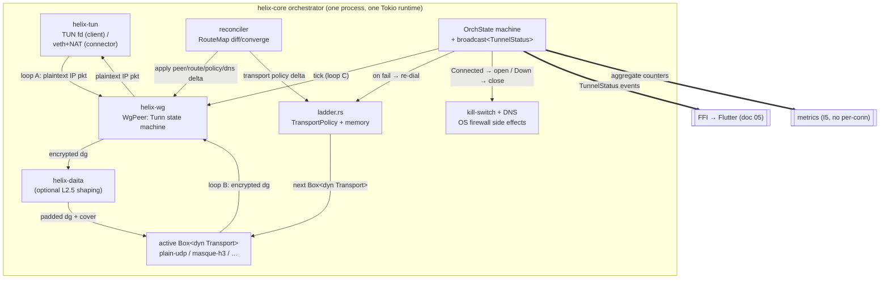
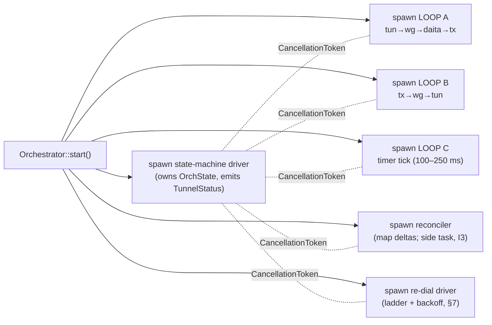
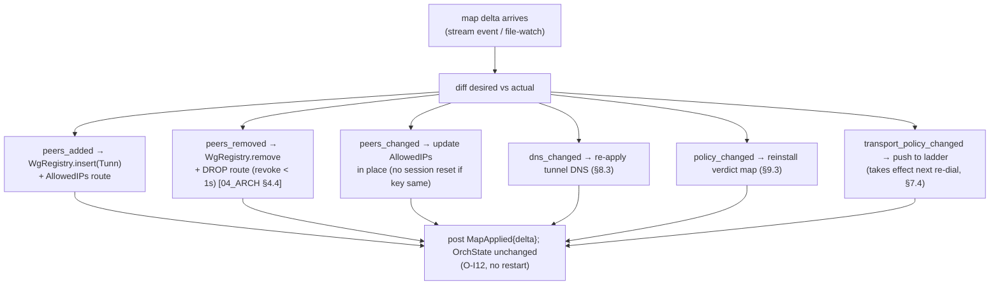
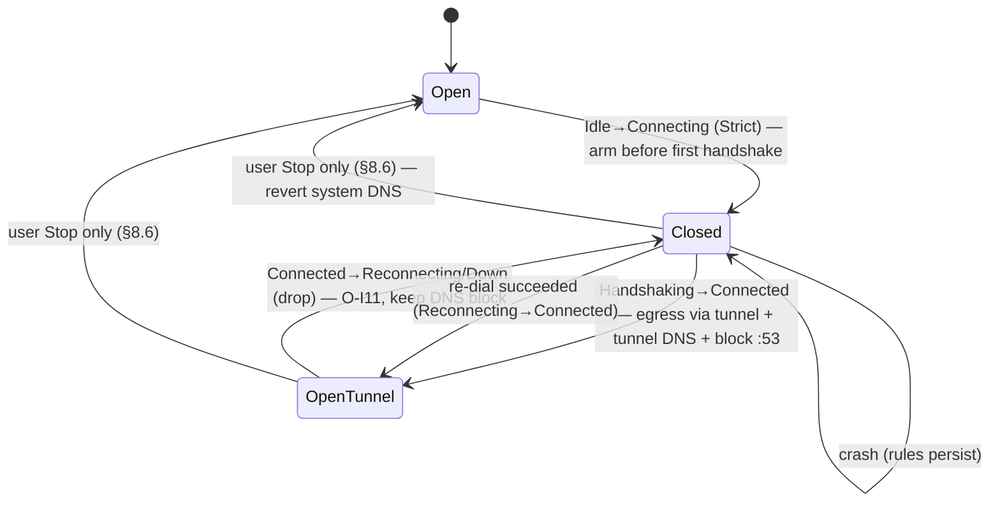

# helix-core Orchestrator & State Machine

**Revision:** 1
**Last modified:** 2026-06-25T00:00:00Z

> Master technical specification — Volume 2 (Data Plane), nano-detail deep-dive.
> This document **deepens** the *Orchestrator, status stream, and auto transport selection*
> section of doc 01 [01-DP §5.1, §5.2] into an implementation-ready specification of the
> `crates/helix-core` orchestrator: its three async loops, the `tokio::broadcast` status
> stream, network-map reconciliation, the reconnection backoff state machine, the
> kill-switch + DNS coupling, and the `--mode=connector` posture that shares the same core.
> SPEC-ONLY: it describes **what to build**, not the shipping product. Sources cited inline by
> id — `[01-DP §N]` = doc 01 `final/01-data-plane.md`; `[04_ARCH §N]` =
> `04_VPN_CLD/HelixVPN-Architecture-Refined.md`; `[04_P0 §N]` =
> `04_VPN_CLD/HelixVPN-Phase0-Spike.md`; `[04_P2 §N]` = Phase-2 refined doc;
> `[SYNTHESIS §N]` = the cross-document synthesis; `[01-LAD §N]` =
> `v02-data-plane/transport-selection-ladder.md`; `[research-masque]` = the cited research
> digests. Any claim not grounded in the evidence base is marked `UNVERIFIED` per
> constitution §11.4.6.

---

## 0. Position, ownership, and invariants

### 0.1 What this document owns

The orchestrator (`crates/helix-core`, file `helix-core/src/orchestrator.rs`
[01-DP §12]) is the **conductor** of the data plane on every role. It owns the wiring that
turns the four frozen Phase-0 contracts — the `Transport` trait [01-DP §3.1], `helix-wg`'s
`WgPeer` [01-DP §4], the `RouteMap` reconciler input [01-DP §6.2], and the `TunnelStatus`
broadcast enum [01-DP §5.2] — into a running tunnel, and it re-converges them without a
process restart as state changes [04_ARCH §4.4, 04_P0 §4.5/§10]. Concretely it owns:

1. The **three async loops** — `tun → wg → (daita) → transport`, `transport → wg → tun`,
   `timer tick` — and the `tokio::select!` driver that multiplexes them (§2, §3).
2. The **`tokio::sync::broadcast` status stream** that surfaces
   `Connecting | Handshaking | Connected{transport,rtt} | Reconnecting | Down{reason}`
   to the FFI, the ladder, and aggregate metrics (§4) [01-DP §5.2, 04_P0 §4.5].
3. The **orchestrator state machine** that decides which `TunnelStatus` is current and
   gates every side effect (kill-switch open/close, DNS apply/revert, ladder kick) (§5).
4. **Network-map reconciliation** — diff desired-vs-actual `RouteMap`, converge peers /
   routes / transport policy / DNS, no restart, `< 1 s` convergence (§6) [04_ARCH §4.4].
5. The **reconnection backoff state machine** — jittered exponential re-dial with roam
   detection, feeding the ladder (§7) [04_P2 §1.4, 04_P0 §8].
6. The **kill-switch + DNS coupling** — OS firewall + tunnel-DNS side effects driven by
   the core state machine, never hand-edited (§8) [04_ARCH §5.6 table, §7].
7. The **connector posture** (`--mode=connector`) — the same core with a forwarding/NAT
   routing posture instead of default-route capture (§9) [04_P0 §4.5].

### 0.2 What this document does NOT own

- The `Transport` trait, `TransportConfig`, `dial()`, per-transport wire framing — frozen
  in doc 01 [01-DP §3]; the orchestrator consumes opaque `Box<dyn Transport>` handles.
- The **ladder selection algorithm** (which rung, per-network memory, regional prior,
  manual `pin`) — owned by `helix-core/src/ladder.rs` and specified in [01-LAD]. This
  document owns the *driver* that asks the ladder for the next transport and reacts to its
  outcome; it treats `ladder::select()` / `ladder::escalate()` as upstream calls (§7.4).
- WireGuard crypto (`helix-wg` `Tunn` state machine) [01-DP §4]; routing/ACL compilation
  (`helix-route`) [01-DP §6–§7]; DAITA shaping (`helix-daita`) [01-DP §9] — the
  orchestrator drives their hooks but does not define them.
- The `WatchNetworkMap` protobuf that *delivers* the `RouteMap` (doc 03); the orchestrator
  consumes the map's *shape* and treats a file-watch on `map.json` as the Phase-0 stand-in
  for the stream [04_P0 §10].
- The FFI bridge that re-emits `TunnelStatus` to Dart (doc 05); this document owns the
  broadcast *sender*, not the FFI *receiver*.

### 0.3 Invariants this document inherits and tightens

| # | Invariant | Source | Orchestrator-specific tightening |
|---|---|---|---|
| I1 | Transport never sees plaintext. | [01-DP I1] | Loop A hands WG-encrypted bytes to `Transport::send`; loop B hands `Transport::recv` bytes to `WgPeer`. The orchestrator never logs nor inspects either side's payload (§3, §10). |
| I2 | Unreliable datagrams, never an ordered stream. | [01-DP I2] | The loops carry one datagram per iteration; a dropped recv is not retried at the orchestrator layer — WG owns loss semantics. |
| I3 | Control plane never in the packet path; fail-static. | [01-DP I3, 04_ARCH §2.1] | If the reconcile source (stream / file-watch) dies, the existing loops keep forwarding; reconciliation is a **side** task, never on the hot path (§6.5). |
| I5 | No-logging by construction; aggregate counters only. | [01-DP I5] | The status stream carries ephemeral state, never durable per-connection records; the only persisted artefact is the ladder's per-network memory hash (§4.5, §10) [01-LAD §6.4]. |
| O-I10 | **Single state authority** — exactly one `OrchState` is current; every `TunnelStatus` emission and every kill-switch / DNS side effect is a function of an `OrchState` transition, never an ad-hoc emit. | derived from [01-DP §5.2] | §5; prevents UI flicker and firewall races. |
| O-I11 | **Kill-switch fails closed** — on any transition *into* `Reconnecting`/`Down`, the firewall stays/goes closed until a `Connected` transition re-opens it; a crash leaves the closed rules installed. | [04_ARCH §5.6 "no leaks if tunnel drops", §7] | §8.2, §8.5. |
| O-I12 | **Reconcile is declarative + restart-free** — a map delta mutates live peer/route/policy state in place; the process is never restarted to apply a change. | [04_ARCH §4.4, 04_P0 §10] | §6. |
| O-I13 | **Connector and client run the identical core** — only the routing posture differs, selected by one flag; no forked loop bodies. | [04_P0 §4.5, 01-DP I4] | §9. |

---

## 1. The orchestrator at a glance



Three data-moving loops, one control state machine, two side-effect sinks (FFI + metrics),
two control inputs (ladder outcomes, reconcile deltas), and one OS-effect sink
(kill-switch/DNS). Everything below is the nano-detail of these eight boxes.

---

## 2. Top-level types & lifecycle

### 2.1 `Orchestrator` struct and construction

```rust
// helix-core/src/orchestrator.rs
use std::sync::Arc;
use std::net::IpAddr;
use tokio::sync::{broadcast, mpsc, watch, Mutex};
use tokio_util::sync::CancellationToken;
use bytes::Bytes;

use helix_transport::{Transport, TransportConfig, TransportError, dial};
use helix_wg::{WgPeer, WgVerdict};
use helix_tun::TunDevice;
use helix_route::{RouteMap, CompiledPolicy};

/// Run-role selected once at startup; the rest of the core is identical (O-I13).
#[derive(Clone, Copy, Debug, PartialEq, Eq)]
pub enum Mode { Client, Connector }

/// All construction inputs. Resolved from CLI flags + the first RouteMap snapshot.
pub struct OrchestratorConfig {
    pub mode: Mode,
    pub tun: TunSpec,                    // client: create/inject fd; connector: forward iface + NAT
    pub initial_map: RouteMap,           // first snapshot (doc 03) or static map.json (Phase 0)
    pub transport_policy: TransportPolicy,// ladder order/pin/budget [01-LAD §3]
    pub kill_switch: KillSwitchConfig,   // §8
    pub dns: DnsConfig,                  // §8.3
    pub tunables: Tunables,              // §11
}

/// The live orchestrator. Owns the broadcast sender; loops hold `Arc<OrchShared>`.
pub struct Orchestrator {
    shared: Arc<OrchShared>,
    cancel: CancellationToken,           // cooperative shutdown of all loops (§2.4)
    join: Vec<tokio::task::JoinHandle<()>>,
}

/// Shared state every loop reads; mutated only via the state machine (O-I10) and reconciler.
pub struct OrchShared {
    pub mode: Mode,
    pub status_tx: broadcast::Sender<TunnelStatus>,     // §4
    pub state: Mutex<StateCell>,                         // OrchState authority (§5)
    pub active_tx: Mutex<Option<Arc<dyn Transport>>>,    // current rung; swapped by re-dial (§7)
    pub wg: Mutex<WgRegistry>,                            // peers keyed by pubkey (§6.3)
    pub tun: TunDevice,
    pub daita: Mutex<Option<helix_daita::Daita>>,        // None unless opted in [01-DP §9]
    pub policy: Mutex<CompiledPolicy>,                    // connector/edge verdict map (§9.3)
    pub counters: Counters,                               // aggregate only (I5)
}

impl Orchestrator {
    /// Build, install the kill-switch in its *armed-closed-until-connected* posture (§8.2),
    /// spawn the three loops + reconciler + ladder driver, and emit `Connecting`.
    pub async fn start(cfg: OrchestratorConfig) -> Result<Self, OrchestratorError> { /* … */ }

    /// Subscribe to the live status stream (FFI, metrics, tests all use this) [01-DP §5.2].
    pub fn subscribe(&self) -> broadcast::Receiver<TunnelStatus> {
        self.shared.status_tx.subscribe()
    }

    /// Push a new desired-state map (Phase 1: from the WatchNetworkMap stream; Phase 0:
    /// from the file-watch). Triggers reconciliation (§6).
    pub async fn apply_map(&self, map: RouteMap) -> Result<(), OrchestratorError> { /* … */ }

    /// User action: pin a transport (manual override) — re-arms the ladder (§7.4) [01-LAD §8].
    pub async fn set_pin(&self, pin: Option<TransportKind>) { /* … */ }

    /// Graceful stop: cancel loops, FIN the transport, revert kill-switch+DNS, emit Down (§2.4).
    pub async fn stop(self) -> Result<(), OrchestratorError> { /* … */ }
}
```

`active_tx` is `Arc<dyn Transport>` (not `Box`) so loop A and loop B share **one** handle and
a re-dial can atomically swap it under the mutex without tearing either loop (§7.3). The
`Transport` trait's `send`/`recv` take `&self` [01-DP §3.1], so `Arc<dyn Transport>` is the
correct shared ownership.

### 2.2 Spawn topology



Six tasks. The state-machine driver is the single writer of `OrchState`; every other task
*requests* a transition by sending an `OrchEvent` on an `mpsc` channel the driver owns (§5.3),
so O-I10 holds without lock contention on the hot loops.

### 2.3 Internal control channels

```rust
/// Loops and the reconciler never mutate OrchState directly — they post events.
pub enum OrchEvent {
    HandshakeStarted,                        // loop B saw first inbound after dial
    HandshakeComplete { rtt_ms: u32 },       // WG session established (§5.4)
    TransportError(TransportError),          // loop A/B carrier failed
    PeerTimeout { pubkey: [u8; 32] },        // tick: no recv within keepalive window
    MapApplied { changed: MapDelta },        // reconciler converged (§6)
    RoamDetected { new_local: IpAddr },      // local iface changed (§7.5)
    PinChanged(Option<TransportKind>),       // user manual override
    Stop,                                    // graceful shutdown
}

pub struct StateCell {
    pub state: OrchState,                     // §5.1
    pub since: tokio::time::Instant,          // dwell time for budgets/metrics
    pub backoff: Backoff,                     // §7.2
    pub event_tx: mpsc::Sender<OrchEvent>,    // loops clone this
}
```

### 2.4 Cancellation & shutdown ordering

`stop()` cancels the `CancellationToken`. Every loop's `tokio::select!` includes a
`_ = self.cancel.cancelled() => break` arm (§3.4), so all three drain on the next iteration.
Shutdown order is **strict** to honour O-I11 (no leak window during teardown):

1. Transition `OrchState → ShuttingDown` (suppresses re-dial; ladder driver exits).
2. `active_tx.close()` (FIN the QUIC/TCP carrier idempotently) [01-DP §3.1].
3. **Keep** the kill-switch closed; revert DNS to system resolvers (§8.4).
4. Cancel loops A/B/C/reconciler; `join` all handles with a bounded timeout
   (`Tunables.shutdown_grace`, default 2 s).
5. On user-initiated stop only: revert the kill-switch to *off* (open) — the user asked to
   disconnect, so traffic flows on the underlay again (§8.6). On crash/abnormal exit the
   closed rules are left installed (O-I11).
6. Emit `Down { reason: "stopped" }` last.

---

## 3. The three loops (nano-detail)

The orchestrator runs three loops [04_P0 §4.5, 01-DP §5.1]. Each is a single `tokio::task`
with an internal `loop { tokio::select! { … } }`. The bodies are cancel-safe: `Transport::recv`
and `TunDevice::recv` are documented cancel-safe [01-DP §3.1], and `WgPeer` calls are
synchronous CPU work between awaits.

### 3.1 Loop A — outbound: `tun → wg → (daita) → transport`

```rust
async fn loop_a(shared: Arc<OrchShared>, cancel: CancellationToken) {
    let mut scratch = vec![0u8; 65535];           // reused encrypt buffer; no per-pkt alloc
    loop {
        tokio::select! {
            biased;                                 // cancel checked first
            _ = cancel.cancelled() => break,
            pkt = shared.tun.recv() => {            // plaintext IP packet from the OS (client)
                let ip_pkt = match pkt { Ok(p) => p, Err(_) => continue };
                // 1. WG encrypt (helix-wg owns the Tunn state machine) [01-DP §4]
                let mut wg = shared.wg.lock().await;
                let verdict = wg.peer_for_dst(&ip_pkt)              // route by AllowedIPs (I6)
                                .map(|p| p.handle_tun_out(&ip_pkt, &mut scratch));
                let enc: &[u8] = match verdict {
                    Some(WgVerdict::WriteToTransport(b)) => b,
                    Some(WgVerdict::Nothing) | None => continue,    // no session yet / no route
                    Some(WgVerdict::WriteToTun(_)) => continue,     // impossible here
                    Some(WgVerdict::Err(_)) => { shared.counters.wg_enc_err.inc(); continue }
                };
                let mut dg = Bytes::copy_from_slice(enc);
                drop(wg);                                            // release before await
                // 2. DAITA shaping (optional, above WG / below transport) [01-DP §9]
                if let Some(d) = shared.daita.lock().await.as_mut() {
                    for act in d.on_packet(&mut dg, tokio::time::Instant::now()) {
                        if let ScheduledAction::SendNow(cover) = act { let _ = send_dg(&shared, cover).await; }
                    }
                }
                // 3. hand to the active transport (I1: opaque encrypted bytes)
                if let Err(e) = send_dg(&shared, dg).await { post_err(&shared, e).await; }
            }
        }
    }
}

/// Single send path; swaps cleanly if a re-dial replaced active_tx mid-flight (§7.3).
async fn send_dg(shared: &OrchShared, dg: Bytes) -> Result<(), TransportError> {
    let tx = shared.active_tx.lock().await.clone()                  // Arc clone; cheap
        .ok_or(TransportError::Closed)?;
    match tx.send(dg).await {
        Err(TransportError::Oversize(n)) => { shared.counters.oversize.inc();
            Err(TransportError::Oversize(n)) }                      // §6.6 MTU edge → caller lowers MTU
        other => other,
    }
}
```

Key points: (1) the `wg` mutex is **released before** any `.await` so loop B can run while
loop A is in DAITA/transport — no cross-loop deadlock (§12 cross-feature analysis); (2) a
WG-encrypt that yields `Nothing` (handshake not yet complete) silently drops the user packet —
WG will buffer the handshake-trigger internally and the app's TCP/QUIC will retransmit; (3)
`Oversize` is propagated, never silently truncated (I2) [01-DP §10].

### 3.2 Loop B — inbound: `transport → wg → tun`

```rust
async fn loop_b(shared: Arc<OrchShared>, cancel: CancellationToken) {
    let mut scratch = vec![0u8; 65535];
    loop {
        let tx = match shared.active_tx.lock().await.clone() {
            Some(t) => t, None => { tokio::time::sleep(IDLE_BACKOFF).await; continue }
        };
        tokio::select! {
            biased;
            _ = cancel.cancelled() => break,
            r = tx.recv() => {
                let dg = match r {
                    Ok(b) => b,
                    Err(e) => { post_err(&shared, e).await;          // §5/§7 drive re-dial
                                tokio::time::sleep(IDLE_BACKOFF).await; continue }
                };
                let mut wg = shared.wg.lock().await;
                match wg.handle_transport_in(&dg, &mut scratch) {
                    WgVerdict::WriteToTun(plain) => {                 // decrypted IP packet
                        // connector: forward into served CIDR + NAT (§9.2); client: write TUN
                        match shared.mode {
                            Mode::Client    => { let _ = shared.tun.send(plain).await; }
                            Mode::Connector => { forward_into_lan(&shared, plain).await; }
                        }
                    }
                    WgVerdict::WriteToTransport(reply) => {            // handshake reply → send back
                        let b = Bytes::copy_from_slice(reply); drop(wg);
                        let _ = tx.send(b).await;
                        post_event(&shared, OrchEvent::HandshakeStarted).await;
                    }
                    WgVerdict::Nothing => { /* keepalive / dupe */ }
                    WgVerdict::Err(_) => shared.counters.wg_dec_err.inc(),
                }
            }
        }
    }
}
```

Loop B is where **handshake progress** is observed: the first inbound datagram after a dial
posts `HandshakeStarted` (→ `Handshaking`), and `helix-wg` reporting an established session
(via `WgPeer::session_established()` polled in loop C, §3.3) posts `HandshakeComplete{rtt}`
(→ `Connected`). The transport carrier connecting is **not** "connected" — the WG handshake is
(I2 tightening, mirrors [01-LAD I2]).

### 3.3 Loop C — timer tick: `tick → keepalive / rekey / liveness`

```rust
async fn loop_c(shared: Arc<OrchShared>, cancel: CancellationToken) {
    let mut scratch = vec![0u8; 4096];
    let mut iv = tokio::time::interval(shared_tick_period());     // 100–250 ms [01-DP §4]
    iv.set_missed_tick_behavior(tokio::time::MissedTickBehavior::Skip); // no burst after stall
    loop {
        tokio::select! {
            biased;
            _ = cancel.cancelled() => break,
            _ = iv.tick() => {
                let mut wg = shared.wg.lock().await;
                for peer in wg.iter_mut() {
                    match peer.tick(&mut scratch) {                  // emits keepalive/rekey [01-DP §4]
                        WgVerdict::WriteToTransport(b) => {
                            let dg = Bytes::copy_from_slice(b); drop_then_send(&shared, dg);
                        }
                        _ => {}
                    }
                    // liveness: WG passive-keepalive is 10 s; declare a peer stale if no
                    // authenticated recv within keepalive_timeout (§7.1, default 25 s — WG's
                    // REKEY-after-no-recv heuristic). UNVERIFIED exact value → see §11 Tunables.
                    if peer.last_recv_age() > shared.tunables.keepalive_timeout {
                        post_event(&shared, OrchEvent::PeerTimeout { pubkey: peer.pubkey() }).await;
                    }
                    if peer.session_just_established() {
                        post_event(&shared, OrchEvent::HandshakeComplete { rtt_ms: peer.rtt_ms() }).await;
                    }
                }
            }
        }
    }
}
```

The 100–250 ms cadence is the [01-DP §4] guidance; `MissedTickBehavior::Skip` prevents a tick
storm after the runtime was starved (host-safety adjacent to §12.6). `PeerTimeout` is the
trigger that moves a healthy `Connected` tunnel into `Reconnecting` (§5.4, §7.1).

### 3.4 Why three loops and not one `select!`

Splitting into three tasks (rather than one mega-`select!`) gives: independent backpressure
(a slow TUN write cannot stall inbound decrypt); per-loop cancel-safety reasoning; and the
ability for loop B to `sleep(IDLE_BACKOFF)` while `active_tx` is `None` during a re-dial
without blocking loop A's drain. The cost is the shared mutexes; they are held only across
synchronous `helix-wg` calls (microseconds), never across `.await`, so contention is bounded
(§13 performance budget). `IDLE_BACKOFF` is a short fixed `10 ms` poll while disconnected —
**not** the reconnection backoff of §7 (that governs *re-dial attempts*, this governs the
busy-wait while a re-dial is in flight).

---

## 4. The status stream (`tokio::broadcast`)

### 4.1 The enum (frozen contract, mirrored across the FFI)

```rust
// helix-core/src/status.rs  (mirrored across the FFI boundary, doc 05) [01-DP §5.2, 04_P0 §4.5]
#[derive(Clone, Debug, PartialEq, Eq)]
pub enum TunnelStatus {
    Connecting,                                   // dialling the first/seeded rung
    Handshaking,                                  // carrier up, WG handshake in flight
    Connected { transport: String, rtt_ms: u32 }, // e.g. ("masque-h3", 23)
    Reconnecting,                                 // a working tunnel dropped; re-dialling
    Down { reason: String },                      // terminal for this attempt; see §4.4 reasons
}
```

`Connected.transport` is the `Transport::kind()` string [01-DP §3.1] (`"plain-udp"`,
`"masque-h3"`, …) so the UI shows *which* rung won [01-LAD §5.4]. `rtt_ms` is the WG-handshake
RTT EWMA from `TransportHealth.rtt_ewma_ms` [01-DP §3.1], refreshed on each `Connected`
re-emit (§4.3).

### 4.2 Channel construction & capacity

```rust
// capacity sized for: FFI receiver + metrics receiver + ladder/test receivers, with slack.
const STATUS_CHANNEL_CAP: usize = 64;
let (status_tx, _rx0) = broadcast::channel::<TunnelStatus>(STATUS_CHANNEL_CAP);
```

`tokio::sync::broadcast` is a **bounded ring** [01-DP §5.2]: each receiver has an independent
read cursor; a slow receiver that falls `STATUS_CHANNEL_CAP` behind gets a
`RecvError::Lagged(n)` on its next `recv()` and is fast-forwarded to the oldest retained value.
This is acceptable for a *status* stream (the receiver only ever needs the **latest** state),
but the FFI/UI receiver MUST treat `Lagged` as "re-read latest", never as an error
(§4.6 receiver contract). Status is **edge-coalesced** (§4.3): emissions are rare (state
changes), so 64 slots is generous; lag only happens if a receiver is wedged.

### 4.3 Emit discipline — coalesce, never spam

Rule (O-I10): the **only** code that calls `status_tx.send(...)` is the state-machine driver,
exactly once per `OrchState` transition, **after** the side effects of that transition have
been applied (kill-switch/DNS first, then emit — so a UI that reacts to `Connected` can trust
the firewall is already open). Re-emitting the *same* logical state is suppressed except for
`Connected`, which is re-emitted when `rtt_ms` changes by more than
`Tunables.rtt_emit_delta_ms` (default 5 ms) so the UI's latency chip updates without flicker.
`Reconnecting` is emitted once per drop, not once per failed re-dial (§7.3).

### 4.4 `Down.reason` closed-ish vocabulary

`Down.reason` is a human/machine string; the orchestrator uses a **stable prefix** so tests
and metrics can classify without parsing prose (§11.4.6 no-guessing):

| `reason` value | Meaning | Emitted from |
|---|---|---|
| `"stopped"` | user/graceful stop | §2.4 |
| `"pinned-transport-failed"` | manual `pin` rung failed; no auto-escalate | [01-LAD §8], §5.4 |
| `"ladder-exhausted"` | every rung in `order` failed its budget | §7.4 |
| `"auth-failed"` | WG handshake rejected (revoked/bad key) | §5.4, §8.5 |
| `"no-route"` | RouteMap has no peer for the requested destination | §6.4 |
| `"host-fatal"` | TUN open / firewall-apply failed at startup | §8.2 |

`Reconnecting` (not `Down`) is the state while *any* rung remains untried within budget; `Down`
is reached only when the attempt is genuinely terminal (O-I10, §5.4).

### 4.5 What the stream MUST NOT carry (I5)

No per-packet, per-flow, per-peer-endpoint, or timestamped-per-connection record ever crosses
the broadcast. `Connected.transport` is a *kind* label, not an endpoint; `rtt_ms` is an
aggregate EWMA. Durable telemetry derived from the stream is **aggregate only**: "transport X
succeeded after N escalations in region R" [01-DP §5.3 step 6, 01-LAD §9] — never the SSID,
never the gateway IP. This is the data-plane half of "no-logging as code" [SYNTHESIS §7].

### 4.6 Receiver contract (FFI / metrics / tests)

```rust
// Reference consumer loop (doc 05 FFI + the test harness both follow this).
let mut rx = orch.subscribe();
loop {
    match rx.recv().await {
        Ok(s)                         => ui_apply(s),                 // render latest
        Err(broadcast::error::RecvError::Lagged(_)) => continue,      // skip-to-latest, NOT an error
        Err(broadcast::error::RecvError::Closed)    => break,         // orchestrator gone
    }
}
```

---

## 5. The orchestrator state machine

### 5.1 States

```rust
#[derive(Clone, Debug, PartialEq, Eq)]
pub enum OrchState {
    Idle,                      // constructed, not started (pre-start only)
    Connecting,                // dialling a rung (carrier handshake in flight)
    Handshaking,               // carrier up; WG Noise IK handshake in flight
    Connected { kind: TransportKind, rtt_ms: u32 },
    Reconnecting { since_drop: tokio::time::Instant }, // re-dialling within budget
    ShuttingDown,              // graceful teardown in progress (§2.4)
    Down { reason: DownReason },// terminal for this attempt
}
```

`OrchState` is the internal authority; `TunnelStatus` (§4.1) is its FFI-facing projection
(`Idle`/`ShuttingDown` have no public projection — they map to `Connecting`/`Down`
respectively at the FFI). The split keeps internal bookkeeping (e.g. `since_drop`) off the wire.

### 5.2 State diagram

```mermaid
stateDiagram-v2
    [*] --> Idle
    Idle --> Connecting : start() / arm kill-switch CLOSED (§8.2)

    Connecting --> Handshaking : carrier up (loop B: HandshakeStarted)
    Connecting --> Reconnecting : TransportError / dial-timeout (budget left)
    Connecting --> Down : ladder-exhausted OR pinned-transport-failed

    Handshaking --> Connected : HandshakeComplete{rtt} / OPEN kill-switch + apply tunnel DNS (§8)
    Handshaking --> Reconnecting : TransportError OR handshake-timeout (budget left)
    Handshaking --> Down : auth-failed (WG reject) — NO retry (§5.4)

    Connected --> Reconnecting : PeerTimeout OR TransportError / CLOSE kill-switch (O-I11)
    Connected --> Connected : rtt drift > delta (re-emit, §4.3) ; MapApplied (reconcile, §6)
    Connected --> ShuttingDown : Stop

    Reconnecting --> Connecting : backoff elapsed → re-dial next rung (§7)
    Reconnecting --> Connected : re-dial succeeded (roam fast-path, §7.5)
    Reconnecting --> Down : ladder-exhausted AND backoff-cap reached (§7.4)
    Reconnecting --> ShuttingDown : Stop

    Connecting --> ShuttingDown : Stop
    Handshaking --> ShuttingDown : Stop
    ShuttingDown --> Down : teardown complete (§2.4) / DNS reverted, kill-switch per §8.6
    Down --> [*]
    Down --> Connecting : start() again (new attempt; reset ladder to top, L-I8 [01-LAD])
```

### 5.3 Driver task (single writer of `OrchState`)

```rust
async fn state_driver(shared: Arc<OrchShared>, mut ev: mpsc::Receiver<OrchEvent>,
                      cancel: CancellationToken) {
    while let Some(event) = tokio::select! {
        _ = cancel.cancelled() => None,
        e = ev.recv()          => e,
    } {
        let mut cell = shared.state.lock().await;
        let next = transition(&cell.state, &event, &shared).await; // pure-ish decision (§5.4)
        if let Some(ns) = next {
            apply_side_effects(&cell.state, &ns, &shared).await;    // kill-switch/DNS FIRST (§4.3)
            cell.since = tokio::time::Instant::now();
            cell.state = ns.clone();
            emit_status(&shared, &ns).await;                        // THEN emit (O-I10)
        }
    }
}
```

`transition()` is the table of §5.2 encoded as a `match (&state, &event)`; it returns
`Option<OrchState>` (`None` = ignore the event in this state, e.g. a stray `HandshakeComplete`
while already `Connected`). `apply_side_effects()` is where O-I11 (kill-switch) and §8 (DNS)
live, ordered before the emit so the FFI never observes `Connected` before the firewall opened.

### 5.4 Decision details (the non-obvious transitions)

- **`Handshaking → Down{auth-failed}` is terminal-without-retry.** A WG handshake that is
  *cryptographically rejected* (peer revoked, key rotated, `device.revoked` propagated
  [04_ARCH §4.4]) will fail identically on every rung — escalating the ladder is pointless and
  would mask a real revocation. `helix-wg` distinguishes "no reply" (network/DPI → retry/
  escalate) from "handshake rejected" (auth → `Down`). UNVERIFIED: boringtun's public API for
  surfacing an *explicit* reject vs a silent timeout — if unavailable, the orchestrator treats
  a handshake that never completes within `handshake_timeout` as the *escalate* class and can
  only infer auth-failure from the control plane (doc 02) signalling a revoke; recorded as a
  follow-up forensic item per §11.4.6.
- **`Connected → Reconnecting` on `PeerTimeout`.** A live tunnel that goes silent (carrier
  still "up" but WG sees no authenticated recv past `keepalive_timeout`) is the roam / NAT-rebind
  / silent-drop case [04_P0 §8 "flap the client iface; recovery < 3 s"]. The kill-switch closes
  immediately (O-I11) so no traffic leaks during the gap.
- **`Reconnecting` budget.** Each re-dial consults the ladder (§7.4); `Reconnecting → Down`
  only when the ladder reports exhaustion *and* the backoff cap is hit (§7.2) — never on a
  single failure (avoids premature `Down`).

---

## 6. Network-map reconciliation

### 6.1 The reconciler contract

Agents are **declarative reconcilers** [04_ARCH §4.4, 04_P0 §10]: they diff a *desired*
`RouteMap` (pushed by the coordinator via `WatchNetworkMap`, doc 03; a file-watch on
`map.json` in Phase 0) against *actual* live state and converge — bring peers up/down, switch
transport policy, update routes, update DNS — **without restarting** (O-I12). Convergence
target: a change reflected on all affected state in **< 1 s** [04_ARCH §4.4].

### 6.2 `RouteMap` (the desired state, frozen shape) [01-DP §6.2]

```rust
pub struct RouteMap {
    pub self_overlay: IpAddr,                  // this node's overlay IP (ULA /48, D4)
    pub peers: Vec<PeerRoute>,                 // already policy-filtered (need-to-know, I6)
    pub dns: Vec<IpAddr>,                       // tunnel DNS servers (§8.3)
    pub transport_policy: TransportPolicy,     // per-leg ladder order/pin/budget [01-LAD §7]
    pub daita: Option<DaitaMachines>,          // optional shaping config (data, not code) [01-DP §9]
}
pub struct PeerRoute {
    pub wg_pubkey: [u8; 32],
    pub endpoint_candidates: Vec<SocketAddr>,  // §8 NAT traversal (Phase 2)
    pub allowed_ips: Vec<IpNet>,               // overlay prefixes this peer is next hop for
    pub via_connector: Option<SiteId>,         // 4via6 site disambiguation [01-DP §6.1]
}
```

### 6.3 Diff algorithm

```rust
/// Pure diff: what changed between actual (live WgRegistry/policy/dns) and desired (new map).
pub struct MapDelta {
    pub peers_added:   Vec<PeerRoute>,
    pub peers_removed: Vec<[u8; 32]>,          // pubkeys to tear down (revocation path)
    pub peers_changed: Vec<PeerRoute>,         // allowed_ips / endpoint changed
    pub dns_changed:   bool,
    pub policy_changed: bool,
    pub transport_policy_changed: bool,
}

fn diff(actual: &WgRegistry, dns: &[IpAddr], pol: &CompiledPolicy, desired: &RouteMap) -> MapDelta {
    // keyed by wg_pubkey; O(n) set difference on a sorted pubkey index
    /* … */
}
```

### 6.4 Apply (converge) — restart-free



A `peers_removed` entry whose pubkey is the **active** peer (the gateway you are tunnelled
through) is the revocation-of-self case: tear the session, close the kill-switch, emit
`Down{reason:"auth-failed"}` (§5.4). A `peers_changed` that only touches `allowed_ips` updates
the routing map **without** resetting the WG session (the key is unchanged) — this is the
"policy edit < 1 s, no restart" MVP gate (AC5) [04_P1 §11.2].

### 6.5 Reconcile is a side task (I3 fail-static)

The reconciler runs as its own `tokio::task`; if its **source** dies (stream disconnect,
file-watch error), the three loops keep forwarding on the last-applied map (fail-static
[04_ARCH §2.1]). The reconciler reconnects to the stream with its own backoff (independent of
§7's data-plane backoff) and re-applies a fresh snapshot on reconnect. A reconcile failure
never tears the tunnel.

### 6.6 MTU coupling on transport change

When `transport_policy_changed` causes the ladder to later swap the active transport (§7.3),
the inner WG MTU is recomputed: `inner_mtu = min(active.effective_mtu(), path_mtu)`
[01-DP §10]. The orchestrator pushes the new MTU into `helix-tun` and into each `WgPeer`'s
fragmentation threshold. An in-flight `Oversize` error (§3.1) during the swap window triggers
an immediate MTU lower rather than a silent drop (I2).

---

## 7. Reconnection backoff state machine

### 7.1 Triggers into reconnect

A reconnect begins on any of: `TransportError` from loop A/B (carrier died), `PeerTimeout`
from loop C (silent WG drop), or `RoamDetected` (local iface changed — §7.5). All three post
events that move `Connected → Reconnecting` (§5.4). Target recovery time is
**< 3 s** for an interface flap / roam [04_P0 §8].

### 7.2 The backoff struct (jittered exponential, capped)

```rust
pub struct Backoff {
    base: Duration,        // first re-dial delay
    cap:  Duration,        // ceiling
    factor: f64,           // multiplier per failed attempt
    jitter: f64,           // 0.0..=1.0 fraction of full jitter (decorrelated)
    attempt: u32,          // resets to 0 on Connected
    rng: SmallRng,
}
impl Backoff {
    /// Decorrelated jitter (AWS-style): next ∈ [base, min(cap, prev*factor)] then jitter.
    fn next_delay(&mut self) -> Duration { /* … */ }
    fn reset(&mut self) { self.attempt = 0; }
}
```

Recommended Tunables (derived, calibrated in Phase 0 against the `< 3 s` roam gate — values
are the *spec recommendation*, not measured; §11.4.6): `base = 250 ms`, `cap = 30 s`,
`factor = 2.0`, `jitter = 1.0` (full decorrelated jitter to avoid thundering-herd re-dials when
a gateway restarts and many clients reconnect together). The **first** re-dial after a drop is
near-immediate (`base`) so a transient blip recovers well under 3 s; only a persistently dead
network climbs toward the 30 s cap.

### 7.3 Re-dial driver + atomic transport swap

```mermaid
sequenceDiagram
    autonumber
    participant SM as State driver
    participant BK as Backoff
    participant LD as Ladder (§7.4)
    participant TX as dial() (helix-transport)
    participant Sh as OrchShared.active_tx

    Note over SM: Connected → Reconnecting (drop)
    SM->>Sh: active_tx = None  (loop B idles, loop A send→Closed)
    SM-->>SM: emit Reconnecting (once, §4.3)
    SM->>BK: next_delay()
    BK-->>SM: d = 250 ms (attempt 0)
    SM->>SM: sleep(d)  [interruptible by Stop / RoamDetected]
    SM->>LD: next_rung()  (same network → memory may keep current rung)
    LD-->>SM: TransportConfig (rung)
    SM->>TX: dial(cfg)  [bounded dial timeout]
    alt dial Ok
        TX-->>SM: Box<dyn Transport>
        SM->>Sh: active_tx = Some(Arc::from(tx))   (atomic swap; loops resume)
        SM-->>SM: → Handshaking (WG handshake over new carrier)
        Note over SM: on HandshakeComplete → Connected; BK.reset()
    else dial Err / budget exceeded
        TX-->>SM: Err
        SM->>LD: escalate()  (advance rung)
        SM->>BK: next_delay()  (grow)
        Note over SM: stay Reconnecting; loop until ladder-exhausted+cap → Down
    end
```

The swap is **atomic** under `active_tx`'s mutex: loop A's `send_dg` (§3.1) and loop B's
per-iteration `active_tx.lock().await.clone()` (§3.2) always see either the old or the new
`Arc`, never a torn handle. While `active_tx == None`, loop A's sends return `Closed` (the
user's app retransmits) and loop B idles on `IDLE_BACKOFF`.

### 7.4 Ladder coupling (this doc drives, [01-LAD] decides)

The re-dial driver calls `ladder::next_rung()` / `ladder::escalate()` [01-LAD §5]; the ladder
owns *which* rung (per-network memory, regional prior, `pin`). The orchestrator owns *when* to
re-dial (backoff timing) and *whether* the attempt is terminal. `ladder-exhausted` (every rung
in `order` failed its budget) + backoff cap reached ⇒ `Down{ladder-exhausted}` (§5.4). A
`pin`ned transport that fails ⇒ `Down{pinned-transport-failed}` with **no** escalation
(L-I7 [01-LAD §8]).

### 7.5 Roam detection (fast-path)

```rust
// A platform iface watcher (netlink on Linux; NWPathMonitor/ConnectivityManager on mobile via
// the shim, doc 06) posts RoamDetected{new_local} when the device's primary address changes.
```

On `RoamDetected` the orchestrator **interrupts** any in-flight backoff sleep and re-dials
*immediately* at the remembered-good rung for the *new* network fingerprint [01-LAD §6], because
WireGuard's roaming will re-latch onto the new source address as soon as a handshake completes
[01-DP §8.2]. This is the difference between a 30 s backoff-climb and the `< 3 s` roam recovery
gate. `RoamDetected` resets `Backoff.attempt = 0`.

---

## 8. Kill-switch + DNS coupling

### 8.1 Principle

The kill-switch and DNS-leak protection are **owned by the core state machine**, not
hand-edited firewall rules [04_ARCH §5.6 carry-forward note, §7]. Every open/close and every
DNS apply/revert is a side effect of an `OrchState` transition (O-I10, §5.3), so there is no
window where the UI shows "connected" but the firewall is open, or "disconnected" while DNS
still points at the tunnel.

### 8.2 Kill-switch posture & arming

```rust
pub struct KillSwitchConfig {
    pub mode: KillSwitchMode,                 // Strict | Permissive | Off
    pub allow_lan: bool,                      // permit RFC1918 LAN even when closed (printers etc.)
    pub allow_gateway_endpoints: Vec<IpNet>,  // the gateway IPs the transport must reach (MUST stay open)
}
pub enum KillSwitchMode {
    Strict,      // closed unless Connected; arm-closed at start (no leak before first connect)
    Permissive,  // closed only after a first successful Connected (then on every drop)
    Off,         // never installs firewall rules
}
```

On `Idle → Connecting` (`start()`), `Strict` mode installs the **closed** ruleset
*immediately* — default-drop all egress except (a) the `allow_gateway_endpoints` (so the
transport can reach `:443`), (b) DHCP/ND for link bring-up, (c) optionally `allow_lan`. This is
"no leaks before the first handshake even completes". `Permissive` waits until the first
`Connected` before it will ever close (so a never-connecting client on a captive-portal network
isn't bricked). A firewall-apply failure at start ⇒ `Down{host-fatal}` (§4.4) — never proceed
with a believed-but-unverified kill-switch (§11.4.6).

### 8.3 DNS coupling

```rust
pub struct DnsConfig {
    pub servers: Vec<IpAddr>,     // tunnel DNS (from RouteMap.dns, §6.2)
    pub block_plaintext_53: bool, // drop off-tunnel :53 (UDP+TCP) when Connected (leak guard)
    pub apply: DnsApplyMethod,    // resolvconf | systemd-resolved | /etc/resolv.conf | shim (doc 06)
}
```

On `Handshaking → Connected`: set tunnel DNS (`RouteMap.dns`) via the platform method, and (if
`block_plaintext_53`) install firewall rules dropping any `:53` egress that is **not** to the
tunnel DNS over the tunnel — closing the classic DNS-leak [04_ARCH §5.6 "force tunnel DNS;
blocks plaintext :53 off-tunnel"]. On `Connected → Reconnecting`/`Down`: the DNS-leak block
**stays** (closed-fails-safe) until either reconnect re-applies tunnel DNS or a user-stop
reverts to system resolvers (§8.6).

### 8.4 Coupling table (the side-effect matrix)

| Transition | Kill-switch | DNS | Source |
|---|---|---|---|
| `Idle → Connecting` (Strict) | install **closed** (allow gw endpoints only) | leave system DNS | §8.2 |
| `Handshaking → Connected` | **open** (allow all egress via tunnel) | apply tunnel DNS + block off-tunnel :53 | [04_ARCH §5.6] |
| `Connected → Reconnecting` | **close** (O-I11) | keep tunnel-DNS block (fail-closed) | §8.1 |
| `* → Down{reason≠stopped}` | **stay closed** | keep block | O-I11 |
| `ShuttingDown → Down{stopped}` (user) | revert to **off** (open) | revert to system DNS | §8.6 |
| crash / panic | closed rules **remain** installed | block **remains** | O-I11 |

### 8.5 `auth-failed` is closed-and-terminal

A revoked device (`auth-failed`, §5.4) reaches `Down` with the kill-switch **closed** and DNS
**blocked** — a revoked client cannot leak traffic onto the underlay by virtue of being
revoked. Recovery requires explicit user action (re-enroll) which goes through `start()` again.

### 8.6 The only open path

The kill-switch is reverted to *open* on **exactly one** path: a user-initiated graceful stop
(`Stop` → `ShuttingDown` → `Down{stopped}`, §2.4 step 5). Every other terminal — crash,
`ladder-exhausted`, `auth-failed`, `host-fatal` — leaves it closed (O-I11). This is the literal
"no leaks if the tunnel drops" guarantee [04_ARCH §5.6].

### 8.7 Kill-switch + DNS state sub-machine



---

## 9. Connector mode (`--mode=connector`)

### 9.1 Same core, different posture (O-I13)

The connector is the **same** `Orchestrator` with `Mode::Connector` [04_P0 §4.5, 01-DP §5.1].
The three loops, the status stream, reconciliation, backoff, and the transport layer are
**byte-for-byte identical** to the client (I4). Only two things differ:

```
client:    [app traffic] → TUN → WG encrypt → [DAITA] → Transport ──▶ gateway
connector: gateway ──▶ Transport → WG decrypt → forward into served CIDR (and reverse)
```

- The connector does **not** capture the device default route; instead it (a) advertises its
  served CIDRs (e.g. `10.10.0.0/24`) in its `RouteMap`, and (b) NATs/forwards decapsulated
  packets into the LAN interface and back [04_P0 §4.5, 01-DP §5.1].
- The connector is **outbound-only** — it dials the gateway; it never listens for inbound
  connections (the founding no-port-forward constraint [SYNTHESIS §1]).

### 9.2 Forwarding & NAT (loop B branch)

`loop_b`'s `WriteToTun` branch (§3.2) dispatches on `mode`: `Client` writes the TUN; `Connector`
calls `forward_into_lan`:

```rust
async fn forward_into_lan(shared: &OrchShared, plain: Bytes) {
    // 1. ACL gate: the decapsulated packet's (src,dst,proto,port) must match the compiled
    //    verdict map (default-deny, I6) [01-DP §7] BEFORE it touches the LAN.
    if shared.policy.lock().await.verdict(&plain) != Verdict::Allow {
        shared.counters.policy_drop.inc(); return;
    }
    // 2. SNAT into the served CIDR and emit on the LAN iface (Linux: the veth/eth handle).
    shared.tun.forward_lan(plain).await;  // helix-tun owns the masquerade + reverse mapping
}
```

The **reverse** path (LAN host → connector → gateway → client) enters via the LAN iface, is
matched to the originating WG session, WG-encrypted (loop A's `peer_for_dst` selects the
gateway peer), and shipped back over the transport. The connector therefore runs loop A driven
by the **LAN iface** rather than a TUN; `TunSpec` abstracts both (`TunDevice::recv` yields the
next inbound packet regardless of source) so loop A's body is unchanged (O-I13).

### 9.3 Verdict map on the connector

The connector installs the **compiled policy** (`CompiledPolicy`, [01-DP §7]) as an
nftables/eBPF verdict map and re-installs it on a `policy_changed` reconcile delta (§6.4) in
`< 1 s`, no restart [04_ARCH §4.4]. Default-deny, fail-closed: if the compiled policy is
absent/stale, drop (I6). This is the "split-horizon / microsegmentation by default" property
[01-DP §7].

### 9.4 Status semantics on the connector

The connector emits the **same** `TunnelStatus` stream (its tunnel to the gateway is what
`Connected{transport,rtt}` describes). The Connector Flutter flavor (doc 05) subscribes to it
exactly as the Access app does — the FFI/UI code is shared (O-I13). `Down` on a connector means
"the connector lost its gateway tunnel"; the kill-switch posture is typically `Off` on a
connector (it is a network appliance, not a privacy client) — `KillSwitchMode` is a config knob
(§8.2, §11), not hardcoded.

---

## 10. Error taxonomy

```rust
// helix-core/src/error.rs
#[derive(thiserror::Error, Debug)]
pub enum OrchestratorError {
    #[error("tun open/inject failed: {0}")]       TunOpen(String),       // → Down{host-fatal}
    #[error("kill-switch apply failed: {0}")]     KillSwitch(String),    // → Down{host-fatal} (§8.2)
    #[error("dns apply failed: {0}")]             Dns(String),           // → Down{host-fatal}
    #[error("transport: {0}")]                    Transport(#[from] TransportError), // → re-dial/escalate
    #[error("wg: {0}")]                           Wg(String),            // enc/dec error (counter, non-fatal)
    #[error("map reconcile: {0}")]                Reconcile(String),     // side task; never tears tunnel (§6.5)
    #[error("ladder exhausted")]                  LadderExhausted,       // → Down{ladder-exhausted}
    #[error("pinned transport failed")]           PinFailed,             // → Down{pinned-transport-failed}
    #[error("shutdown timeout")]                  ShutdownTimeout,       // join exceeded grace (§2.4)
}
```

Classification (drives §5.4): `TunOpen`/`KillSwitch`/`Dns` are **host-fatal** at startup (the
core refuses to run a tunnel it cannot leak-protect). `Transport` errors map to the
re-dial/escalate path (§7). `Wg` enc/dec errors are per-packet, counted, never fatal (a single
malformed datagram does not tear the tunnel). `Reconcile` errors are side-task-only (I3).
`TransportError` variants map to ladder behaviour exactly as [01-DP §3.1 / 01-LAD §5]:
`DialTimeout`/`HandshakeFailed`/`EndpointBlocked` → escalate; `Closed` → re-dial same rung;
`Oversize` → lower MTU (§6.6).

---

## 11. Config knobs (`Tunables`)

```rust
pub struct Tunables {
    // --- loops ---
    pub tick_period: Duration,            // loop C cadence;        default 200 ms  [01-DP §4]
    pub idle_poll: Duration,              // loop B busy-wait when active_tx None;  default 10 ms
    // --- handshake / liveness ---
    pub handshake_timeout: Duration,      // Handshaking→Reconnecting; default 5 s  (derived)
    pub keepalive_timeout: Duration,      // PeerTimeout threshold;   default 25 s  (WG REKEY heuristic, UNVERIFIED exact)
    // --- backoff (§7.2) ---
    pub backoff_base: Duration,           // default 250 ms
    pub backoff_cap: Duration,            // default 30 s
    pub backoff_factor: f64,              // default 2.0
    pub backoff_jitter: f64,              // default 1.0 (full decorrelated)
    // --- status (§4.3) ---
    pub rtt_emit_delta_ms: u32,           // re-emit Connected if rtt drifts >; default 5 ms
    pub status_channel_cap: usize,        // broadcast ring; default 64
    // --- shutdown (§2.4) ---
    pub shutdown_grace: Duration,         // join timeout; default 2 s
    // --- reconcile (§6.5) ---
    pub reconcile_reconnect_base: Duration, // stream re-subscribe backoff; default 1 s
}
```

Every numeric default above tagged "derived" is the **spec recommendation**, to be calibrated
against the Phase-0 gates (G1 throughput, `< 3 s` roam, `< 1 s` reconcile) with captured
benchmark evidence before being frozen (§11.4.6 — a number is a guess until measured) [04_P0 §8].
`keepalive_timeout = 25 s` mirrors WireGuard's REKEY-after-no-recv window but the exact
boringtun-surfaced value is `UNVERIFIED` and is a Phase-0 measurement item.

---

## 12. Edge cases (each maps to a test point, §14)

| # | Edge case | Required behaviour |
|---|---|---|
| E1 | TUN delivers a packet before any WG session exists | loop A `WgVerdict::Nothing` → silent drop; app retransmits; no crash (§3.1). |
| E2 | `active_tx` swapped mid-`send` (re-dial races loop A) | atomic `Arc` swap; old or new handle, never torn (§7.3). |
| E3 | broadcast receiver wedged > 64 events behind | `Lagged` returned; receiver skips-to-latest; orchestrator unaffected (§4.2/§4.6). |
| E4 | Reconcile source dies while `Connected` | loops keep forwarding (fail-static I3); reconciler re-subscribes with backoff (§6.5). |
| E5 | Revoke (`peers_removed` includes active gateway) | tear session, close kill-switch, `Down{auth-failed}`; revoke effective < 1 s (§6.4). |
| E6 | Roam (Wi-Fi→cellular) mid-`Connected` | `RoamDetected` interrupts backoff, immediate re-dial at remembered rung, `< 3 s` recovery (§7.5). |
| E7 | All rungs fail their budget | `Reconnecting→Down{ladder-exhausted}` only after backoff cap; kill-switch stays closed (§7.4, O-I11). |
| E8 | Pinned transport fails | `Down{pinned-transport-failed}`, NO escalation (§7.4, L-I7). |
| E9 | `Oversize` on transport swap (smaller MTU) | lower inner WG MTU, do not truncate (§6.6, I2). |
| E10 | Process panic in a loop | other loops + kill-switch unaffected (closed rules persist O-I11); supervisor restarts core (`start()` resets ladder, L-I8). |
| E11 | Connector packet fails the verdict map | `forward_into_lan` drops + counts; never reaches LAN (§9.2, I6). |
| E12 | `tick` after runtime starvation | `MissedTickBehavior::Skip` — one catch-up tick, no storm (§3.3, §12.6 host-safety). |

---

## 13. Security & performance

### 13.1 Security considerations

- **No plaintext on the status path (I1/I5).** `TunnelStatus` carries only a transport *kind*
  label + aggregate RTT; never endpoints, SSIDs, packets, or per-connection timestamps (§4.5).
  A code-review gate (§11.4.142) must reject any `status_tx.send` payload that embeds an
  endpoint or per-flow datum.
- **Fail-closed everywhere (O-I11).** Crash, exhaustion, revoke, and host-fatal all leave the
  kill-switch closed and DNS blocked (§8.4); only a deliberate user-stop opens it (§8.6).
- **Default-deny on the connector (I6).** Decapsulated packets pass the verdict map *before*
  the LAN (§9.2); a stale/absent policy drops (fail-closed) [01-DP §7].
- **Single state authority (O-I10).** One writer of `OrchState` → no firewall race, no
  "connected-but-leaking" window (§5.3). This is the structural defence against the classic
  VPN kill-switch TOCTOU bug.
- **Revocation latency (SEC).** `device.revoked` → verdict-map drop / session tear in
  **< 1 s**, no restart (§6.4) [04_ARCH §4.4, SYNTHESIS §7].
- **Host-session safety (constitution §12).** Loop C uses `MissedTickBehavior::Skip` and the
  loops never spin-busy except the bounded `idle_poll`; no unbounded memory growth (the
  broadcast ring is fixed, peers are bounded by the map). Reconcile and re-dial backoffs are
  capped so a flapping gateway cannot induce a CPU storm.

### 13.2 Performance budget

| Budget | Target | Source / rationale |
|---|---|---|
| Through-tunnel throughput (plain-udp) | ≥ 80% bare link | G1 gate [04_P0 §8] — orchestrator overhead (mutex + loop dispatch) must be negligible vs WG crypto. |
| Roam / iface-flap recovery | < 3 s | [04_P0 §8] → §7.5 immediate re-dial. |
| Reconcile convergence (map delta → applied) | < 1 s (p99) | [04_ARCH §4.4] → §6 in-place apply. |
| Status emit latency (transition → broadcast) | < 1 ms (UNVERIFIED, measure) | side effects then emit (§4.3); dominated by the firewall syscall, not the channel. |
| Per-packet orchestrator overhead | bounded, no per-packet alloc | reused `scratch` buffers (§3.1/§3.2/§3.3); `Bytes` ref-count, not copy, on the hot path. |
| Mutex hold time (wg/active_tx) | µs-scale; never across `.await` | §3.4 — synchronous helix-wg calls only. |
| Memory | bounded by `peers × Tunn` + fixed channels | I5/§12 host-safety; no per-connection durable state. |

Each "UNVERIFIED" / "measure" budget is a Phase-0 benchmark item with captured CSV evidence
before it is treated as fact (§11.4.6) [04_P0 §8].

---

## 14. Test points (§11.4.169)

Per §11.4.169 every workable item declares its required test types from the §11.4.27 /
[07-WBS §1] closed vocabulary; every PASS cites rock-solid captured evidence
(§11.4.5/.69/.107), never config-only. The escalation/reconnect **event trace** on the
`TunnelStatus` stream IS the captured evidence for the state-machine claims (O-I13 analogue of
[01-LAD I9]).

| Test id | §11.4.169 types | What it proves | Rig / captured evidence | Source |
|---|---|---|---|---|
| OS-1 | `UNIT` | `transition()` table is total + correct: every (state,event) pair → expected `OrchState`/`None` | table-driven unit test over the §5.2 matrix; mocks allowed (unit only, §11.4.27) | §5 |
| OS-2 | `UNIT` | `diff()` produces the exact `MapDelta` for added/removed/changed peers + dns/policy flags | golden desired/actual `RouteMap` pairs | §6.3 |
| OS-3 | `UNIT` | `Backoff::next_delay()` is monotonic-capped + jittered within `[base, cap]`; `reset()` zeroes | property test, fixed RNG seed (deterministic, §11.4.50) | §7.2 |
| OS-4 | `INT` | three loops move real WG datagrams tun↔transport on the netns rig; `curl` reaches LAN host | netns + boringtun + plain-udp; `tcpdump` + curl 200 | [04_P0 §3/§8], §3 |
| OS-5 | `E2E`+`REC` | full status arc `Connecting→Handshaking→Connected{plain-udp,rtt}` driven only by the core stream | Flutter-Linux toggle (G5); window-scoped MP4 + vision verdict (§11.4.159) | [04_P0 §9], §4 |
| OS-6 | `E2E`+`FA` | kill-switch closes on drop — **no plaintext egress** while `Reconnecting`/`Down` | block gateway mid-`Connected`; `tcpdump` underlay shows ZERO leaked app packets | AC7 [04_P1 §11.2], §8 |
| OS-7 | `SEC` | DNS-leak guard: off-tunnel `:53` dropped when `Connected`; system DNS restored on user-stop | `dig @off-tunnel-resolver` blocked; capture; revert verified | [04_ARCH §5.6], §8.3 |
| OS-8 | `E2E` | reconcile restart-free: edit `map.json` → peer reachable, no process restart, `OrchState` unchanged | file-watch delta; `curl` newly-reachable host; pid unchanged (G6) | [04_P0 §10], §6 |
| OS-9 | `E2E`+`PERF` | revoke < 1 s: remove active peer → session torn, `Down{auth-failed}`, kill-switch closed | timestamped status trace; < 1 s revoke→drop | AC6 [04_P1 §11.2], §6.4 |
| OS-10 | `CHAOS` | roam recovery < 3 s: flap the client iface → `RoamDetected` → re-dial → `Connected` | netns iface flap; status trace timing; recovery < 3 s | [04_P0 §8], §7.5 |
| OS-11 | `CHAOS` | mid-`send` transport swap + reconcile-source SIGKILL: loops keep forwarding (fail-static) | kill the file-watch task; traffic continues; reconciler re-subscribes | I3, §6.5 |
| OS-12 | `STRESS` | sustained re-dial churn (gateway flap N×) does not leak, deadlock, or grow memory unbounded | ≥100 flap iters; RSS bounded; no leaked packet; no deadlock | §11.4.85, §7 |
| OS-13 | `INT` | connector posture: gateway→connector→LAN forward + reverse path, ACL-gated (default-deny) | netns LAN; allowed host reachable, unauthorized DROPPED + counted | §9, [04_P0 §4.5] |
| OS-14 | `BENCH` | orchestrator overhead: through-tunnel throughput ≥ 80% bare link (plain-udp) | `iperf3` via `bench.sh`; CSV | G1 [04_P0 §8], §13.2 |
| OS-15 | `CHAL` | a `helix_qa`/`challenges` bank entry scores PASS only on the captured status-arc + leak-free capture | HelixQA autonomous session, evidence-gated (§11.4.27/.107) | [SYNTHESIS §8] |

Each meta-test ships a paired §1.1 mutation (e.g. flip `apply_side_effects` to emit `Connected`
*before* opening the kill-switch → OS-6 must FAIL; weaken the verdict gate in §9.2 → OS-13 must
FAIL) so the gates provably cannot bluff [04_P0 §8, §11.4.5].

---

## 15. What is explicitly out of scope here

The ladder *selection algorithm* (per-network memory, regional prior, manual `pin` internals —
[01-LAD]); the `Transport` trait + per-transport framing [01-DP §3]; WireGuard crypto +
`Tunn` timers [01-DP §4]; `helix-route` ACL→verdict-map compilation [01-DP §6–§7]; DAITA
machines [01-DP §9]; the `WatchNetworkMap` protobuf that delivers the map (doc 03); the FFI
bridge that re-emits `TunnelStatus` to Dart (doc 05); platform iface-watchers + TUN-fd handoff
beyond the `TunSpec` contract (doc 06). This document specifies only the **orchestrator** — the
conductor that wires those frozen contracts into a running, leak-safe, self-converging tunnel
on all three roles.

---

*End of nano-detail specification — Volume 2 (Data Plane), `orchestrator-and-state.md`. Pairs
with `transport-selection-ladder.md` (the §7.4 ladder this orchestrator drives), `transport-trait.md`
(the §3 `Transport` contract), `wireguard-core.md` (the §3/§4 `WgPeer` it pumps), and
`routing-and-addressing.md` (the §6 `RouteMap`/verdict map it reconciles). The `Orchestrator`
struct (§2.1), the `TunnelStatus` enum (§4.1), the `OrchState` machine (§5), and the
`Mode::Connector` posture (§9) are the frozen Phase-0 surviving contracts [04_P0 §14]; their
implementations may evolve, their shapes may not.*
