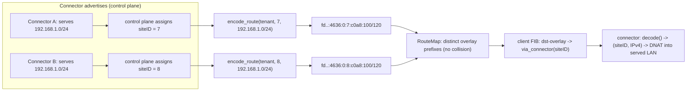
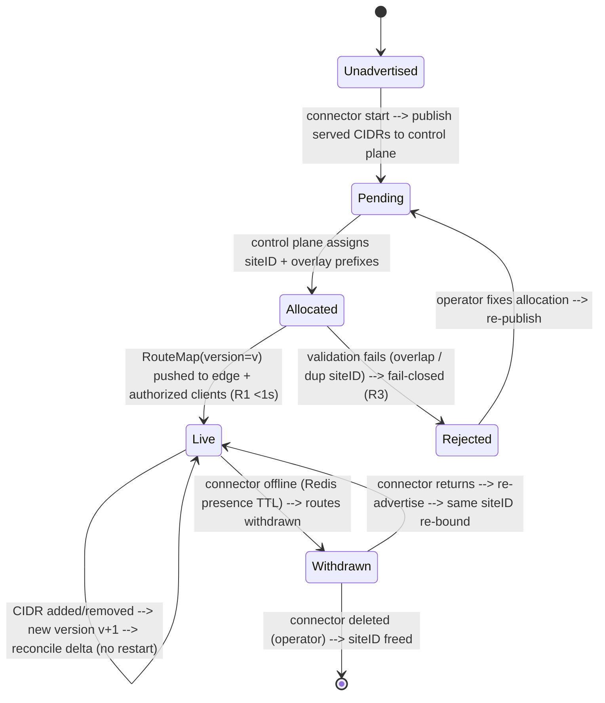
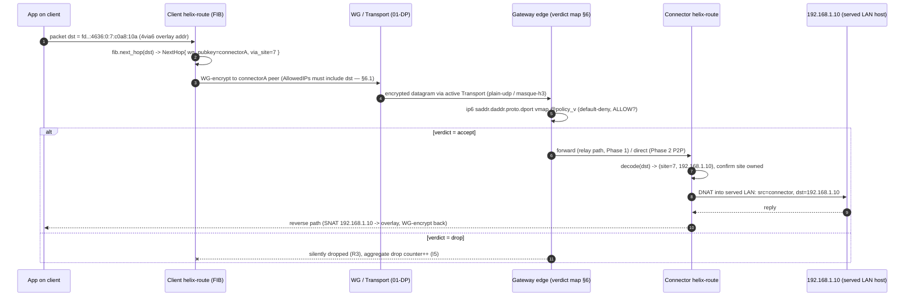
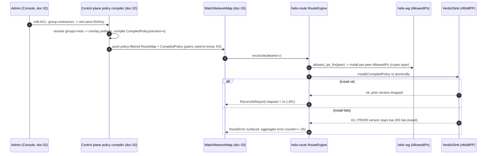
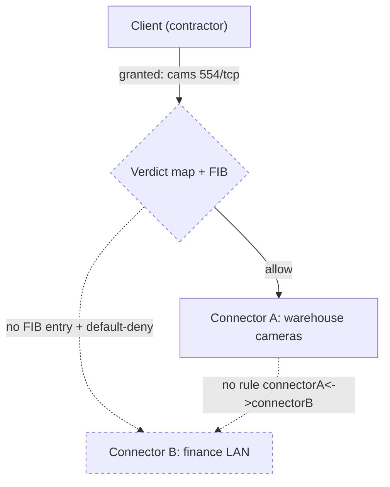

# Overlay Routing & Addressing

**Revision:** 2
**Last modified:** 2026-07-04T12:00:00Z

> Volume 2 (Data Plane) nano-detail specification — deepens the **Overlay addressing &
> multi-network routing** section (§6) and the **Policy/ACL → AllowedIPs + verdict-map**
> section (§7) of the pass-1 data-plane overview [01-DP §6, §7]. This is a SPEC: it describes
> what to build in the `helix-route` crate; it does **not** ship the product. Source evidence
> is cited inline by id — `[01-DP §N]` (final/01-data-plane.md), `[04_ARCH §N]`
> (04_VPN_CLD/HelixVPN-Architecture-Refined.md), `[04_P0 §N]` (Phase0-Spike.md),
> `[research-pki_pq_nat §N]` (scratchpad/kb), `[SYNTHESIS §N]`. Any claim not grounded in the
> evidence base is flagged `UNVERIFIED` per constitution §11.4.6 — never fabricated.

---

## 0. Position, ownership, and the problem this document solves

This document owns the **`helix-route` crate** [01-DP §2 crate layout]: overlay addressing,
the 4via6 mapping engine, the connector-CIDR-advertisement → compiled routing-map pipeline,
the policy/ACL → per-peer `AllowedIPs` + nftables/eBPF verdict-map compiler, and
split-horizon microsegmentation. It is the layer that decides **which overlay address a
node has** and **which next hop / verdict a packet gets** — strictly *above* the WireGuard
crypto core and the `Transport` carrier, both specified in 01-DP.

It does **not** own: the `WatchNetworkMap` protobuf/Connect wire contract (doc 03 — the live
source of the `RouteMap` stream `helix-route` consumes), the Go control-plane policy *authoring*
UI (doc 02 — the ACL DSL is authored there; `helix-route` consumes the *compiled* form), nor
enrollment/PKI (doc 02, [research-pki_pq_nat §1]). The split is: **the control plane authors and
compiles intent; `helix-route` is the data-plane reconciler that converges the compiled
desired-state and installs kernel state** [04_ARCH §4.4, 01-DP §6.3].

### 0.1 The founding requirement

A single user reaches **N joined private networks**, which may carry **colliding RFC1918
ranges** — two connectors each serving `192.168.1.0/24` [01-DP §6, SYNTHESIS §1, §3 D4]. That
collision **MUST be solved at v1** [SYNTHESIS §3 D4]. This document is the v1 solution:
**IPv6 ULA /48 per tenant + Tailscale-style 4via6** ([04_ARCH §3.4], decision **D4 Camp A**),
with **CGNAT 100.64/10 1:1** as the documented IPv4-only fallback (D4 Camp B), analyzed at §8.

### 0.2 Invariants inherited from the data plane (binding here)

| # | Invariant | Source |
|---|---|---|
| I5 | **No-logging by construction**: routing/policy state is aggregate counters only; no per-peer/per-flow durable record. | [01-DP §0.1 I5, 04_ARCH §2.7] |
| I6 | **Default-deny**: no peer reaches anything without an explicit compiled rule expressed as `AllowedIPs` + an edge verdict map. | [01-DP §0.1 I6, 04_ARCH §3.4] |
| R1 | The reconciler **converges without restart**; a route/policy delta reflects on all affected edges in **< 1 s** (p99). | [04_ARCH §4.4, 01-DP §6.3] |
| R2 | Peers are delivered **already policy-filtered** (need-to-know): a node never learns of networks it cannot reach. | [SYNTHESIS §7, 01-DP §7] |
| R3 | The verdict map **fails closed**: absent/stale compiled policy ⇒ drop. | [04_ARCH §7, 01-DP §7] |
| R4 | ACL ACLs/routes target the **IPv6 overlay** address, **never** the underlying IPv4 of a 4via6-mapped LAN. | [research-pki_pq_nat §3.4] |

---

## 1. Crate surface (`helix-route`)

```
helix-route/
├── src/lib.rs          # public façade: RouteEngine, re-exports
├── src/addr.rs         # §2  ULA /48 allocation + node-address layout + types
├── src/via6.rs         # §3  4via6 encode/decode (byte-exact)
├── src/map.rs          # §4  RouteMap desired-state + advertisement ingest
├── src/fib.rs          # §5  longest-prefix-match next-hop table (overlay FIB)
├── src/policy.rs       # §6  ACL→AllowedIPs + CompiledPolicy→verdict-map compiler
├── src/nft.rs          # §6  nftables verdict-map renderer (Phase 1)
├── src/ebpf.rs         # §6  eBPF verdict-map loader (Phase 2, feature = "ebpf")
├── src/reconcile.rs    # §5/§7 declarative reconciler (push, no restart) — R1
└── src/error.rs        # §9  RouteError taxonomy
```

```rust
// helix-route/src/lib.rs — the one object the orchestrator (helix-core) holds.
pub struct RouteEngine {
    tenant:   TenantPrefix,        // §2.1 this node's tenant ULA /48
    self_id:  OverlayAddr,         // §2.3 this node's stable overlay address
    fib:      Fib,                 // §5   longest-prefix-match next-hop table
    policy:   Option<CompiledPolicy>, // §6 None ⇒ fail-closed (R3)
    verdict:  Box<dyn VerdictSink>,    // §6 nft (P1) | ebpf (P2)
    counters: RouteCounters,       // §0.2 I5 aggregate-only telemetry
}

impl RouteEngine {
    /// Converge to a freshly-pushed desired-state RouteMap (doc 03 stream / Phase-0 file).
    /// Diff-and-apply; NEVER restart unrelated state (R1). Returns the applied delta summary.
    pub fn reconcile(&mut self, desired: &RouteMap) -> Result<ReconcileReport, RouteError>;

    /// Install a new compiled policy version atomically (R3: failure leaves prior version live).
    pub fn apply_policy(&mut self, p: CompiledPolicy) -> Result<(), RouteError>;

    /// Resolve the next hop for an overlay destination (used by the connector forward path).
    pub fn next_hop(&self, dst: &OverlayAddr) -> Option<NextHop>;
}
```

---

## 2. Overlay addressing — ULA /48 per tenant

Every node (client, connector, advertised host) gets a **stable overlay address** in the
tenant's ULA /48 [04_ARCH §3.4 "every node ... gets a stable overlay address"]. HelixVPN is
**IPv6-native on the overlay**; advertised IPv4 LANs are surfaced *through* 4via6 (§3), never as
raw overlapping IPv4 [04_ARCH §3.4, research-pki_pq_nat §3.4].

### 2.1 Tenant prefix — RFC 4193 ULA byte layout

> **Honest correction (§11.4.6):** the overview writes the prefix illustratively as
> `fd7a:helix:<tenant>::/48` [01-DP §6.1]. `helix` is **not** valid hex and cannot appear in a
> real address; it is a mnemonic. The implementable layout below uses a real RFC 4193 ULA:
> `fd` + 40-bit random per-tenant Global ID. `UNVERIFIED`: the literal hex `fd7a:115c:a1e0`
> example used downstream is Tailscale's fixed ULA [research-pki_pq_nat §3.4]; HelixVPN
> generates a **fresh random 40-bit Global ID per tenant** at tenant creation (control plane,
> doc 02) — it is NOT Tailscale's constant.

A tenant prefix is a `/48` (RFC 4193 §3.1): the 8-bit ULA prefix `1111110` + L-bit `1`
(`0xfd`), then a 40-bit Global ID. The 16 bits between bit 48 and bit 63 are the **Subnet ID**
field, used here as an **address-class discriminator**; the low 64 bits are the **Interface
ID**.

```
 128-bit overlay address (tenant /48):

  0        8                              48      64                               128
  ┌────────┬──────────────────────────────┬───────┬─────────────────────────────────┐
  │ 0xfd   │  40-bit tenant Global ID (T)  │ 16-bit│        64-bit Interface ID        │
  │ ULA    │  random, per tenant           │ Class │   (class-dependent layout, §2.2) │
  └────────┴──────────────────────────────┴───────┴─────────────────────────────────┘
  └──────── tenant /48 prefix ────────────┘└─ Class field selects the address kind ──┘
```

```rust
// helix-route/src/addr.rs
use std::net::Ipv6Addr;

/// A tenant's ULA /48: 0xfd || 40-bit Global ID. Stored as the 6 high bytes.
#[derive(Clone, Copy, PartialEq, Eq, Hash, Debug)]
pub struct TenantPrefix { pub bytes: [u8; 6] }   // bytes[0] == 0xfd by construction

impl TenantPrefix {
    /// Random per-tenant Global ID per RFC 4193 §3.2.2 (control plane mints once).
    pub fn generate(rng: &mut impl rand_core::RngCore) -> Self {
        let mut b = [0u8; 6];
        rng.fill_bytes(&mut b);
        b[0] = 0xfd;                 // ULA prefix + L=1
        TenantPrefix { bytes: b }
    }
    pub fn contains(&self, a: &Ipv6Addr) -> bool { a.octets()[..6] == self.bytes }
}

/// 16-bit Subnet-ID address class (bits 48..64).
#[derive(Clone, Copy, PartialEq, Eq, Debug)]
#[repr(u16)]
pub enum AddrClass {
    Node   = 0x0000,   // §2.3 clients/connectors/advertised native-v6 hosts
    Via6   = 0x4636,   // §3   4via6-mapped IPv4 LANs  ('F6' mnemonic, fixed constant)
    Relay  = 0x0001,   // reserved: DERP-style relay overlay endpoints (doc, Phase 2)
    // 0x0002..=0x4635 and 0x4637..=0xFFFF reserved; unknown class ⇒ RouteError::UnknownClass
}
```

### 2.2 Address-class layout summary

| Class (`bits 48..64`) | Kind | Interface-ID (`bits 64..128`) layout | §ref |
|---|---|---|---|
| `0x0000` Node | Client / connector / native-v6 host | 64-bit stable random/enrolled Node ID | §2.3 |
| `0x4636` Via6 | 4via6-mapped IPv4 LAN host/route | `0x0000` (16) ‖ siteID (16) ‖ IPv4 (32) | §3.1 |
| `0x0001` Relay | Relay overlay endpoint (Phase 2) | relay node ID | §8 NAT (doc 03) |

### 2.3 Node addressing (class `Node`)

A native overlay node's Interface ID is a **stable 64-bit Node ID** assigned at enrollment and
bound to the device's WG public key in the control plane [research-pki_pq_nat §1.3] (the WG
public key *is* the device identity; the overlay Node ID is its routable handle). It is
**stable across roams** — WireGuard roaming changes the underlay endpoint, never the overlay
address [04_P2 §3.2, 01-DP §8].

```rust
// helix-route/src/addr.rs
/// A fully-qualified overlay address = tenant prefix + class + interface id.
#[derive(Clone, Copy, PartialEq, Eq, Hash, Debug)]
pub struct OverlayAddr(pub Ipv6Addr);

impl OverlayAddr {
    pub fn node(t: TenantPrefix, node_id: u64) -> Self {
        let mut o = [0u8; 16];
        o[..6].copy_from_slice(&t.bytes);
        o[6..8].copy_from_slice(&(AddrClass::Node as u16).to_be_bytes());
        o[8..16].copy_from_slice(&node_id.to_be_bytes());
        OverlayAddr(Ipv6Addr::from(o))
    }
    pub fn class(&self) -> Result<AddrClass, RouteError> {
        let c = u16::from_be_bytes([self.0.octets()[6], self.0.octets()[7]]);
        AddrClass::try_from(c).map_err(|_| RouteError::UnknownClass(c))
    }
}
```

**Edge case — stability under tenant-prefix rotation:** a tenant Global ID is permanent for the
tenant's life. If a tenant is ever re-keyed (operator decision, §11.4.122-class capability
change), every Node ID is re-prefixed but its low-64 ID is preserved, so policy referencing
Node IDs survives a prefix change. `UNVERIFIED`: prefix rotation is not specified in the
evidence base — flagged as a future operator-gated capability, not an MVP path.

---

## 3. 4via6 — overlapping-CIDR overlay mapping

4via6 lets a tenant connect **hundreds/thousands of identical (overlapping-CIDR) IPv4 networks
without renumbering**, by mapping each site's IPv4 route into a **unique IPv6 prefix** whose
address **encodes a site ID + the IPv4 address** [research-pki_pq_nat §3.4, 04_ARCH §3.4]. This
is the engine that lets two connectors both serving `192.168.1.0/24` coexist: each connector
gets a distinct **site ID**, so its `192.168.1.0/24` maps to a *distinct* overlay /120, and the
gateway/connector NATs back into the correct LAN [04_ARCH §3.4 overlapping-CIDR handling, 01-DP §6.1].

### 3.1 Byte-exact encoding (class `Via6`)

The 64-bit Interface ID of a `Via6` address is laid out exactly as Tailscale's
`tailscale debug via <site-id> <ipv4-route>` interface-ID region [research-pki_pq_nat §3.4],
placed inside HelixVPN's tenant /48 + `Via6` class:

```
 4via6 address (class 0x4636):

  0        8                       48        64        80        96               128
  ┌────────┬───────────────────────┬─────────┬─────────┬─────────┬─────────────────┐
  │ 0xfd   │ 40-bit tenant Global ID│ 0x4636  │ 0x0000  │ siteID  │   IPv4 (32 bit) │
  │        │       (T)              │ (Via6)  │ (rsvd)  │ (16 bit)│   big-endian    │
  └────────┴───────────────────────┴─────────┴─────────┴─────────┴─────────────────┘
                                              └──────── Interface ID (64 bit) ───────┘

  Site ID range: 0..=65535 (lower 16 bits only) — matches Tailscale's constraint.
  A mapped IPv4 /N route  →  overlay /(96 + N)   (e.g. /24 → /120, /32 host → /128).
```

```rust
// helix-route/src/via6.rs
use std::net::Ipv4Addr;
use ipnet::{Ipv4Net, Ipv6Net};

pub type SiteId = u16;   // 0..=65535 [research-pki_pq_nat §3.4]

/// Encode an advertised IPv4 host into its 4via6 overlay address.
pub fn encode_host(t: TenantPrefix, site: SiteId, v4: Ipv4Addr) -> OverlayAddr {
    let mut o = [0u8; 16];
    o[..6].copy_from_slice(&t.bytes);
    o[6..8].copy_from_slice(&(AddrClass::Via6 as u16).to_be_bytes());
    // o[8..10] = 0x0000 reserved (already zero)
    o[10..12].copy_from_slice(&site.to_be_bytes());
    o[12..16].copy_from_slice(&v4.octets());
    OverlayAddr(Ipv6Addr::from(o))
}

/// Encode an advertised IPv4 /N route into the overlay /(96+N) prefix it occupies.
pub fn encode_route(t: TenantPrefix, site: SiteId, v4: Ipv4Net) -> Result<Ipv6Net, RouteError> {
    let base = encode_host(t, site, v4.network()).0;
    let plen = 96u8 + v4.prefix_len();             // /24 → /120, /32 → /128
    Ipv6Net::new(base, plen).map_err(|_| RouteError::BadPrefixLen(plen))
}

/// Decode a 4via6 overlay address back to (site, IPv4) for the connector's NAT-back step.
pub fn decode(a: &OverlayAddr) -> Result<(SiteId, Ipv4Addr), RouteError> {
    if a.class()? != AddrClass::Via6 { return Err(RouteError::NotVia6); }
    let o = a.0.octets();
    if o[8] != 0 || o[9] != 0 { return Err(RouteError::ReservedNonZero); }
    let site = u16::from_be_bytes([o[10], o[11]]);
    let v4   = Ipv4Addr::new(o[12], o[13], o[14], o[15]);
    Ok((site, v4))
}
```

**Worked example** [grounded in research-pki_pq_nat §3.4 encoding rules]:

- Tenant Global ID `12:3456:789a` ⇒ tenant prefix `fd12:3456:789a::/48`.
- Connector A served LAN `192.168.1.0/24`, assigned **site 7** ⇒ overlay route
  `fd12:3456:789a:4636:0:7:c0a8:100/120` (`c0a8:0100` = `192.168.1.0`).
- Connector B *also* serving `192.168.1.0/24`, assigned **site 8** ⇒ overlay route
  `fd12:3456:789a:4636:0:8:c0a8:100/120` — **distinct prefix, no collision**.
- Host `192.168.1.10` behind A ⇒ `fd12:3456:789a:4636:0:7:c0a8:10a/128`.

### 3.2 Encode/decode flow diagram



### 3.3 Site-ID allocation (authority = control plane, consumed here)

Site IDs are **allocated by the control plane** (doc 02 IPAM) at connector enrollment and
delivered in `PeerRoute.via_connector` [01-DP §6.2]. `helix-route` does **not** mint site IDs; it
**validates** them (`0..=65535`, unique within a tenant) and rejects a `RouteMap` that contains
a duplicate `(tenant, siteID)` pair or two distinct connectors claiming the same site ID
(`RouteError::DuplicateSiteId`). Allocation policy (control plane): one site ID per connector
that serves at least one *overlapping* CIDR; non-overlapping connectors MAY share `siteID = 0`
(a single "default site") as an optimization. `UNVERIFIED`: the share-site-0 optimization is a
design recommendation, not stated in the evidence base; flagged.

---

## 4. Connector CIDR advertisement → `RouteMap`

Connectors advertise their served CIDRs to the control plane; the control plane compiles a
**routing map** (which connector is the next hop for which overlay prefix) and pushes it to the
gateway edge + to authorized clients via `WatchNetworkMap` [01-DP §6.2, 04_ARCH §3.4]. The data
plane consumes the map into `helix-route`. **Phase 0 fakes the stream with a static `map.json`
of the exact shape Phase 1 streams** [01-DP §6.2, 04_P0 §10], so the reconciler is real even
when the source is static.

### 4.1 Advertised-CIDR ingest record (the wire shape `helix-route` consumes)

The authoritative wire format is the doc-03 `WatchNetworkMap` protobuf; below is the **logical
Rust shape** the reconciler converges to (re-stated from 01-DP §6.2, extended with the
advertisement fields this document owns):

```rust
// helix-route/src/map.rs  — desired-state the reconciler converges to (doc 03 streams it)
pub struct RouteMap {
    pub version:      u64,            // monotonic; reconciler ignores a lower version (R1)
    pub tenant:       TenantPrefix,
    pub self_overlay: OverlayAddr,    // this node's stable overlay IP (§2.3)
    pub peers:        Vec<PeerRoute>, // ALREADY policy-filtered, need-to-know (R2)
    pub dns:          Vec<OverlayAddr>,
}

pub struct PeerRoute {
    pub wg_pubkey:            [u8; 32],
    pub endpoint_candidates:  Vec<std::net::SocketAddr>,  // §8 NAT traversal (doc 03)
    pub allowed_ips:          Vec<Ipv6Net>,   // overlay prefixes this peer is next hop for (R4: v6 only)
    pub via_connector:        Option<SiteId>, // present iff allowed_ips carry 4via6 routes
    pub advertised_v4:        Vec<Ipv4Net>,   // the RAW served LANs (for the connector's own NAT-back)
}
```

**Validation on ingest (`map.rs::validate`)** — every rule rejects, never silently fixes (§11.4.6):

| Check | Reject error |
|---|---|
| `peer.allowed_ips` all within `tenant /48` | `RouteError::OutOfTenant` |
| every `allowed_ips` entry is a valid overlay class (`Node`/`Via6`) | `RouteError::UnknownClass` |
| a `Via6` route's encoded `(site, v4)` matches some `advertised_v4` + `via_connector` | `RouteError::Via6Mismatch` |
| no two peers advertise the **same overlay prefix** | `RouteError::OverlapAdvertise` |
| `via_connector` unique per distinct served-overlapping-LAN connector | `RouteError::DuplicateSiteId` |
| `version > self.fib.version` | (ignored, not an error — stale push) |

The **`OverlapAdvertise` check is the collision firewall**: because two connectors serving the
same IPv4 `/24` get *distinct* 4via6 overlay prefixes (§3.1), their `allowed_ips` never overlap —
a residual overlap means a site-ID allocation bug upstream and is rejected, fail-closed (R3).

### 4.2 Advertisement lifecycle state machine

The connector side of advertisement (the connector publishes its CIDRs; the gateway compiles
and re-pushes) is a small state machine. `helix-route` on the connector drives the
**advertise** path; on the client/edge it drives the **consume** path.



> `UNVERIFIED`: the Redis presence-TTL withdrawal trigger and same-siteID re-bind on return are
> consistent with the "Redis = ephemeral presence" model [SYNTHESIS §2] but the exact TTL and
> re-bind semantics live in the control-plane doc (02/03), not this data-plane doc. The
> data-plane contract is only: *a `RouteMap` with a withdrawn peer ⇒ reconcile that peer down in
> < 1 s, no restart* (R1).

---

## 5. Routing map compilation → longest-prefix-match FIB

`helix-route` compiles the validated `RouteMap` into an **overlay FIB** — a longest-prefix-match
table from overlay destination prefix → next hop (a WG peer + optional 4via6 site). This is the
table the connector forward path and the client routing layer consult.

```rust
// helix-route/src/fib.rs
pub struct Fib {
    pub version: u64,
    trie: ip_network_table::IpNetworkTable<NextHop>,  // LPM over Ipv6Net keys
}

#[derive(Clone)]
pub struct NextHop {
    pub wg_pubkey: [u8; 32],     // which WG peer carries it
    pub via_site:  Option<SiteId>, // Some ⇒ connector must decode()+DNAT into served LAN (§3.1)
}

impl Fib {
    /// Build from a validated RouteMap. O(Σ prefixes); rebuilt wholesale per version,
    /// then swapped atomically so next_hop() never observes a half-applied table (R1).
    pub fn build(map: &RouteMap) -> Result<Fib, RouteError> { /* … */ }

    /// Longest-prefix match. None ⇒ no route ⇒ packet dropped (default-deny composes I6).
    pub fn next_hop(&self, dst: &OverlayAddr) -> Option<&NextHop> {
        self.trie.longest_match(dst.0).map(|(_, nh)| nh)
    }
}
```

### 5.1 Reconciliation — push, don't poll (R1)

The reconciler diffs **desired** (`RouteMap`) vs **actual** (live `Fib` + installed WG peers +
verdict map) and converges: bring peers up/down, switch routes, update the verdict map —
**without restarting** unrelated state [04_ARCH §4.4, 01-DP §6.3]. It **never polls**; it reacts
to map deltas pushed on the open stream (file-watch stands in during Phase 0 [01-DP §6.2]).

```rust
// helix-route/src/reconcile.rs
pub struct ReconcileReport {
    pub from_version: u64, pub to_version: u64,
    pub peers_added: u32, pub peers_removed: u32,
    pub routes_changed: u32, pub policy_reinstalled: bool,
    pub elapsed: std::time::Duration,   // asserted < 1s in the R1 test (§14)
}
```

Convergence target: a route/policy change reflected on all affected edges in **< 1 second** (p99)
[04_ARCH §4.4]. The new `Fib` and the new verdict map are built **off to the side** and swapped
in atomically (build-then-swap), so an in-flight packet never sees a half-built table.

### 5.2 Packet flow — client → connector LAN host (the headline path)



---

## 6. Policy / ACL → `AllowedIPs` + nftables/eBPF verdict map

Default-**deny** (I6). A declarative allow-list (Tailscale-ACL-flavored,
`group:contractors → net:warehouse-cameras:554/tcp`) is **authored + compiled by the control
plane** [04_ARCH §3.4, §7, SYNTHESIS §4]; `helix-route` consumes the **compiled** form and
installs two enforcement layers, **both required** (defense in depth) [01-DP §7]:

1. **WireGuard `AllowedIPs`** — coarse, crypto-enforced routing: each peer's `AllowedIPs` is the
   set of overlay prefixes it may send/receive; WG itself drops a packet whose source/dest does
   not match. This is derived from the FIB + policy and installed on the WG peer (helix-wg, 01-DP §4).
2. **Edge verdict map** — port/proto-granular: an **nftables verdict map** (Phase 1) or **eBPF**
   program (Phase 2 scale) evaluates the compiled rule `(src → dst : proto : ports : action)` per
   flow; default-deny; fails **closed** (absent/stale policy ⇒ drop) (R3).

### 6.1 Compiled types (consumed; re-stated from 01-DP §7 + extended)

```rust
// helix-route/src/policy.rs
pub struct CompiledPolicy { pub version: u64, pub rules: Vec<VerdictRule> }

pub struct VerdictRule {
    pub src:   Ipv6Net,    // overlay src prefix  (R4: v6 only — 4via6 dst, never raw v4)
    pub dst:   Ipv6Net,    // overlay dst prefix
    pub proto: L4Proto,
    pub ports: PortRange,  // inclusive lo..=hi; full range for L4Proto::Any/Icmp
    pub action: Verdict,
}
pub enum Verdict  { Allow, Drop }            // default Drop (I6)
pub enum L4Proto  { Any, Tcp, Udp, Icmp }
pub struct PortRange { pub lo: u16, pub hi: u16 }

/// The per-peer AllowedIPs derivation: union of every dst prefix the peer is permitted to
/// receive on, plus its own self-prefix. Installed on the WG peer (helix-wg).
pub fn allowed_ips_for(peer: &PeerRoute, policy: &CompiledPolicy) -> Vec<Ipv6Net> { /* … */ }
```

**`AllowedIPs` derivation rule:** a peer's `AllowedIPs` = `peer.allowed_ips` (what it is the next
hop for) ∩-consistent-with the policy rules whose `src`/`dst` resolve to that peer — i.e. WG is
configured to carry **only** prefixes the policy actually permits across that peer. This is the
crypto-layer realization of need-to-know (R2): a peer that is granted nothing receives an empty
`AllowedIPs` and can carry no traffic.

### 6.2 nftables verdict-map renderer (Phase 1)

```rust
// helix-route/src/nft.rs
pub trait VerdictSink {
    /// Install a compiled policy version atomically (nft transaction / eBPF map swap).
    /// On error the PRIOR version stays live (R3 — never leaves the edge open).
    fn install(&mut self, p: &CompiledPolicy) -> Result<(), RouteError>;
    fn clear_to_default_deny(&mut self) -> Result<(), RouteError>;  // fail-closed reset
}
pub struct NftSink { /* nft handle, table name "helix" */ }
```

Rendered nftables (Phase 1 representation; eBPF equivalent in Phase 2) [01-DP §7]:

```nft
# edge-installed verdict map — one atomic `nft -f` transaction per CompiledPolicy version
table inet helix {
    map policy_v {
        type ipv6_addr . ipv6_addr . inet_proto . inet_service : verdict
        elements = {
            fd12:3456:789a::a . fd12:3456:789a:4636:0:7:c0a8:14 . tcp . 554 : accept
        }
    }
    chain forward {
        type filter hook forward priority 0; policy drop;   # DEFAULT-DENY (I6) / fail-closed (R3)
        ip6 saddr . ip6 daddr . meta l4proto . th dport vmap @policy_v
    }
}
```

**Atomic install:** the renderer writes the full new table to a temp ruleset and applies it in a
**single `nft -f` transaction**; a failed apply aborts with the prior ruleset intact (R3). A port
*range* rule expands to the nftables interval set form (`th dport . { 554-560 }`); `L4Proto::Any`
omits the proto/port match keys for that element. The **`UNVERIFIED`** eBPF Phase-2 path
(`src/ebpf.rs`, `feature = "ebpf"`) installs the equivalent verdict in an
`LPM_TRIE`+`HASH`-of-rules map and swaps the program atomically — the eBPF data-structure choice
is a design recommendation, not specified in the evidence base; flagged.

### 6.3 ACL-compile + install sequence



---

## 7. Split-horizon microsegmentation

Microsegmentation is the **default**, not an add-on [04_ARCH §3.4, §7, 01-DP §7]:

- **Connectors cannot reach each other** unless an explicit policy rule says so. There is no
  default connector↔connector route in the FIB; cross-connector traffic requires a
  `VerdictRule{ src=connectorA-prefix, dst=connectorB-prefix, action=Allow }` AND matching
  `AllowedIPs`.
- **Clients cannot reach networks they are not granted.** A client's `RouteMap` is delivered
  already policy-filtered (R2) — it never even learns of a connector/CIDR it cannot reach
  [SYNTHESIS §7], so its FIB has no entry for that prefix → `next_hop()` returns `None` → drop.
- **Revocation:** `device.revoked` (doc 02) → the verdict map drops the peer + WG removes the
  peer key in **< 1 second** with no restart [04_ARCH §4.4, SYNTHESIS §7, research-pki_pq_nat §1.1
  "revocation is structurally trivial — remove the public key"]. The crypto layer (WG key removal)
  and the verdict layer (vmap element removal) are removed in the same reconcile pass.



**Split-horizon invariant (testable):** for any two prefixes P, Q with no `Allow` rule between
them, `fib.next_hop` resolution + verdict evaluation MUST drop P→Q in both directions. The
default-deny `forward` chain policy (`policy drop`) guarantees the verdict half; the
need-to-know filtered map guarantees the FIB half.

---

## 8. Decision D4 — 4via6 vs CGNAT 100.64, analyzed

> **DECISION D4 — IP-subnet collision across N joined networks. SURFACED, not silently
> resolved** [SYNTHESIS §3 D4, 04_ARCH §3.4, 01-DP §6.1].

| Axis | **Camp A — ULA /48 + 4via6 (recommended)** | **Camp B — CGNAT 100.64.0.0/10, 1:1 per network** |
|---|---|---|
| Collision handling | Each site gets a distinct overlay /120 via siteID encoding — overlapping `192.168.1.0/24`s never collide [04_ARCH §3.4, research §3.4] | Each joined network is 1:1-NAT'd into a distinct slice of CGNAT space [SYNTHESIS §3 D4 Camp B, GMI/KMI] |
| Scale ceiling | Site ID = 16 bits ⇒ **65 536 sites/tenant**; address space per site = full IPv4 (/120 per /24) [research §3.4] | `100.64.0.0/10` = ~4.19 M addresses total; hand-partitioning ⇒ far fewer **distinct networks** before exhaustion |
| IP family | IPv6-native (the future default); ACLs target the v6 CIDR (R4) [research §3.4] | IPv4; works on IPv4-only edges with no v6 path |
| Proven model | Tailscale 4via6 — connects "hundreds/thousands of identical networks" [research §3.4] | Standard CGNAT 1:1 NAT — simple, ubiquitous tooling |
| Tooling floor | Requires v6 on the subnet router (Tailscale parallel: v1.24+); clients reaching it may be v4 [research §3.4] | Requires no v6; but hairpinning/overlap-edge cases multiply with each added net |
| UX risk | 4via6 mapping is **powerful but confusing** — must be hidden behind Console UX (a named open risk) [04_ARCH §13, §13 risk table] | 1:1 CGNAT mapping is conceptually simpler to surface to an operator |

**Recommendation (adopt Camp A):** ULA /48 + 4via6 scales to far more networks than a
hand-partitioned CGNAT space, is the proven Tailscale model, and is IPv6-native [01-DP §6.1].
**Surface 4via6 as the engine but hide it behind Console UX** — the mapping confuses end users
[04_ARCH §13]. **CGNAT 1:1 remains a documented fallback for IPv4-only edge environments** —
`helix-route` reserves the seam: a `RouteMap` MAY carry an alternative `Cgnat { slice: Ipv4Net }`
next-hop class instead of a `Via6` class, decoded by an analogous `cgnat.rs` decoder. This MVP
specifies **only the 4via6 path**; CGNAT is the documented escape hatch, not built in Phase 1.

### 8.1 CGNAT fallback — concrete design (reversal path, D4 reversal criterion)

> **Gap closed (2026-07-04, independent hardening pass).** §8's prior text reserved the
> `Cgnat{slice}` seam by name but did not specify its mechanics. `decision-register.md` §6 names
> the reversal trigger explicitly: *"4via6 client/OS support proves inadequate on a target
> platform → fall back to documented per-network NAT (FR-303 already provisions it)."* A reversal
> path that is only a struct name is not "already provisioned" — this subsection makes it
> buildable without a fresh design cycle if the trigger fires.

**Why CGNAT would ever be needed:** 4via6 requires the **client OS** to have a working IPv6
stack up to the point of routing traffic into a synthesized `Via6` destination even when the
*advertised* LAN is IPv4-only (§3). A platform/OS combination that cannot route IPv6 at all on
its TUN/VPN interface (`UNVERIFIED`: no cited evidence any of the 8 target platforms lack this —
flagged as the reversal precondition, not a known defect) would need every peer's traffic
represented as IPv4 end-to-end. CGNAT 1:1 is that IPv4-only path.

**Address-space carve-out.** `100.64.0.0/10` (RFC 6598, Shared Address Space) is reserved
entirely for HelixVPN's CGNAT fallback — never used for anything else, so activating the
fallback for one tenant cannot collide with another tenant's 4via6-native traffic on the same
gateway:

```
100.64.0.0/10  =  100.64.0.0 – 100.127.255.255   (4 194 304 addresses, /10)
Per-tenant slice: /10 partitioned into up to 256 tenant /18s (100.64.0.0/18, 100.64.64.0/18, …)
                  each /18 = 16 384 addresses = up to 64 sites of /24 (site = /24 slice of the tenant /18)
```

```rust
// helix-route/src/cgnat.rs  (Phase-2-conditional; built only if D4 reverses per decision-register §6)
use std::net::Ipv4Addr;
use ipnet::Ipv4Net;

pub type TenantCgnatSlot = u8;   // 0..=255, one /18 per tenant within 100.64.0.0/10
pub type CgnatSiteId    = u8;   // 0..=63,  one /24 per site within the tenant's /18

/// A tenant's CGNAT /18 within the shared 100.64.0.0/10 space (RFC 6598).
pub fn tenant_slice(slot: TenantCgnatSlot) -> Ipv4Net {
    let base = u32::from(Ipv4Addr::new(100, 64, 0, 0)) + ((slot as u32) << 14); // /18 stride = 2^14
    Ipv4Net::new(Ipv4Addr::from(base), 18).expect("valid /18 within 100.64/10")
}

/// A site's /24 within its tenant's /18 — the 1:1-NAT target range for that connector's LAN.
pub fn site_slice(slot: TenantCgnatSlot, site: CgnatSiteId) -> Ipv4Net {
    let base = u32::from(tenant_slice(slot).network()) + ((site as u32) << 8); // /24 stride = 2^8
    Ipv4Net::new(Ipv4Addr::from(base), 24).expect("valid /24 within tenant /18")
}

/// 1:1 host mapping: the Nth host of the served LAN <-> the Nth host of the CGNAT /24 slice.
/// Symmetric with `via6::encode_host` (§3.1) but IPv4-only — no v6 anywhere on this path.
pub fn map_host(slot: TenantCgnatSlot, site: CgnatSiteId, lan_host_offset: u8) -> Ipv4Addr {
    let slice_base = u32::from(site_slice(slot, site).network());
    Ipv4Addr::from(slice_base + lan_host_offset as u32)
}
```

**Worked example (mirrors §3.1's 4via6 example so the two schemes are directly comparable):**
tenant assigned CGNAT slot `3` ⇒ tenant /18 = `100.64.192.0/18`. Connector A serving
`192.168.1.0/24`, site `0` ⇒ CGNAT slice `100.64.192.0/24`; host `192.168.1.10` (offset `10`)
⇒ `100.64.192.10`. Connector B, also serving `192.168.1.0/24`, site `1` ⇒ CGNAT slice
`100.64.193.0/24`; the identical host ⇒ `100.64.193.10` — **distinct address, no collision**,
the same collision-firewall property as 4via6 (§3.1), traded against a **64-site-per-tenant
ceiling** instead of 4via6's 65 536.

**FIB and policy integration.** `Fib`/`NextHop` (§5) and `VerdictRule` (§6.1) are IPv6-typed
(`Ipv6Net`) because R4 mandates ACLs target the overlay, never raw v4 (§12). The CGNAT fallback
does **not** relax R4: a `Cgnat`-class route is still reached via the client's IPv6 overlay
tunnel to the gateway (the gateway terminates WireGuard over IPv6 exactly as today); only the
**LAN-side NAT target** — the address the connector 1:1-NATs into — changes from a 4via6-derived
v6-embedded-v4 to a CGNAT v4 slice. Concretely: `PeerRoute.allowed_ips` still carries the
tenant's IPv6 prefixes; a new `PeerRoute.cgnat_route: Option<CgnatRoute>` field carries
`{ slot, site, lan_cidr }` for the connector's own NAT table, decoded by `cgnat.rs` exactly as
`via6::decode` does for the `Via6` class (§3.1) — same validation discipline (`OverlapAdvertise`,
`DuplicateSiteId`-equivalent `DuplicateCgnatSite`, reject-not-fix, §4.1).

**What does NOT change:** the overlay is still IPv6-native end-to-end (§2); only the connector's
NAT-back target address family changes. This means CGNAT is a **connector-local NAT-table
config change**, not a re-architecture — consistent with the reversal being "additive, no
client break" per `decision-register.md` §6.

**Scale ceiling (the honest tradeoff, §11.4.6):** 256 tenants × 64 sites × 254 usable hosts ≈
4.1M mapped hosts total across the *entire* `100.64.0.0/10` space shared by every tenant on a
gateway — materially smaller than 4via6's per-tenant 65 536-site ceiling (§8 table). This is
why CGNAT remains the **fallback**, never the default: it is provisioned to be buildable on
short notice, not to be equally scalable.

---

## 9. Error taxonomy (`helix-route/src/error.rs`)

Every variant is a **finding**, never silently swallowed (§11.4.1/.6). Ingest/validation errors
reject the whole `RouteMap` version (atomic — a bad map never half-applies); install errors leave
the prior version live (R3).

```rust
#[derive(thiserror::Error, Debug)]
pub enum RouteError {
    // --- addressing / via6 (§2/§3) ---
    #[error("overlay class {0:#06x} unknown")]            UnknownClass(u16),
    #[error("address not within tenant /48")]             OutOfTenant,
    #[error("address is not a 4via6 (class Via6)")]       NotVia6,
    #[error("4via6 reserved bytes [8..10] non-zero")]     ReservedNonZero,
    #[error("4via6 (site,v4) != advertised LAN")]         Via6Mismatch,
    #[error("bad ipv6 prefix length {0}")]                BadPrefixLen(u8),
    // --- map ingest / validation (§4) ---
    #[error("two peers advertise overlapping overlay prefix")] OverlapAdvertise,
    #[error("duplicate siteID across distinct connectors")]    DuplicateSiteId(SiteId),
    #[error("siteID {0} out of range 0..=65535")]              SiteIdRange(u32),
    // --- policy / verdict install (§6) ---
    #[error("verdict-map install failed (prior version retained): {0}")] VerdictInstall(String),
    #[error("policy absent — failing closed")]                           PolicyAbsentFailClosed,
    // --- reconcile (§5) ---
    #[error("fib build failed: {0}")]                     FibBuild(String),
    #[error("io: {0}")]                                    Io(#[from] std::io::Error),
}
```

| Error | Trigger | Disposition | Composes |
|---|---|---|---|
| `OverlapAdvertise` | site-ID allocation bug upstream | reject map version, keep prior | R3, §4.1 |
| `DuplicateSiteId` | two connectors claim same site | reject map version | §3.3, §4.1 |
| `Via6Mismatch` | overlay route decodes to a LAN not advertised | reject map version | §3.1, §4.1 |
| `VerdictInstall` | `nft -f` / eBPF swap fails | **prior policy stays live** | R3 |
| `PolicyAbsentFailClosed` | reconcile with `policy = None` | default-deny everything | I6, R3 |

---

## 10. Config knobs

All knobs are **data pushed in the `RouteMap`/`CompiledPolicy`** (server-tunable without a client
rebuild [04_P2 §2.3 pattern]) except the two host-local ones noted. No knob can weaken I6/R3 — a
verdict-map install always carries `policy drop` as the chain default.

| Knob | Where | Default | Range / values | Effect |
|---|---|---|---|---|
| tenant Global ID | control plane, per tenant | random 40-bit | RFC 4193 random | tenant /48 prefix (§2.1) |
| `AddrClass::Via6` constant | compile-time | `0x4636` | fixed | 4via6 subnet discriminator (§2.1) |
| site-ID space | control plane | `0..=65535` | 16-bit | per-tenant site cap (§3.1) |
| `reconcile` debounce | host-local | `0 ms` | `0..=250 ms` | coalesce burst map deltas before rebuild |
| verdict backend | host-local feature | `nft` (P1) | `nft` \| `ebpf` | enforcement engine (§6.2) |
| FIB rebuild mode | compile-time | `wholesale build-then-swap` | fixed | atomicity guarantee (§5) |
| CGNAT fallback | control plane | **off** | off \| `Cgnat{slice}` | IPv4-only escape hatch (§8) |
| DAITA-orthogonal | n/a | n/a | n/a | routing is independent of DAITA/transport (01-DP §9) |

---

## 11. Edge cases (each maps to a §14 test point)

1. **Two connectors, identical `192.168.1.0/24`** — distinct site IDs ⇒ distinct overlay /120s;
   client FIB resolves each to the right connector; no collision (§3.1, §3.2). *Primary v1
   requirement.*
2. **`/32` host advertisement** — `encode_route` yields a `/128`; LPM still resolves; DNAT-back to
   the single host (§3.1).
3. **Overlapping advertisement that survives to ingest** (site-ID bug upstream) — `OverlapAdvertise`
   rejects the whole version, prior map stays live (§4.1, R3).
4. **Stale map (lower version)** — silently ignored, not an error; reconciler keeps the newer FIB
   (§4.1).
5. **Reconcile during in-flight traffic** — build-then-swap means `next_hop()` never observes a
   half-built FIB; an in-flight packet uses either the old or the new table, never a torn one (§5).
6. **Policy absent on reconcile** — `PolicyAbsentFailClosed` → default-deny everything (I6, R3).
7. **Revocation mid-flow** — peer removed from both WG `AllowedIPs` and the verdict map in one
   reconcile pass, < 1 s, no restart (§7, R1).
8. **Connector roam (underlay endpoint change)** — overlay address/Node ID unchanged; only
   `endpoint_candidates` change; FIB/policy untouched (§2.3, 01-DP §8).
9. **Port-range rule** — expands to nftables interval set; boundary ports `lo`/`hi` inclusive (§6.2).
10. **`L4Proto::Any` + `PortRange` full** — proto/port match keys omitted for that vmap element;
    must not accidentally widen another rule (§6.2).
11. **4via6 reserved bytes non-zero** — `ReservedNonZero` reject; guards against a malformed/forged
    overlay address (§3.1, §9).
12. **Site ID 0 shared by non-overlapping connectors** — permitted optimization; the
    `OverlapAdvertise` check still fires if their *overlay* prefixes actually collide (§3.3).
    `UNVERIFIED` optimization — flagged.

---

## 12. Security considerations

- **R4 — ACLs/routes target the v6 overlay, never raw v4.** A rule written against the underlying
  IPv4 of a 4via6 LAN is a category error and is impossible to express (`VerdictRule.src/dst` are
  `Ipv6Net`) [research-pki_pq_nat §3.4]. This prevents a misconfigured rule from matching the wrong
  site's identically-numbered LAN.
- **Fail-closed everywhere (R3, I6).** Absent/stale/failed policy ⇒ drop. The `forward` chain
  default is `policy drop`; a verdict-map install failure retains the prior (restrictive) version,
  never opens the edge.
- **Need-to-know map filtering (R2).** A node's `RouteMap` carries only peers/prefixes it is
  authorized for [SYNTHESIS §7]; the data plane cannot leak the existence of unreachable networks
  because it never receives them.
- **No-logging by construction (I5).** `RouteCounters` are aggregate (packets dropped by
  default-deny, reconcile count, install failures) — never per-peer/per-flow durable state
  [04_ARCH §2.7]. The CI schema-lint that fails the build on any durable connection/traffic table
  [SYNTHESIS §7] applies to the control plane; the data-plane analogue is: `RouteEngine` holds no
  per-flow map keyed by a peer identity beyond the live FIB.
- **Forged overlay address.** WG `AllowedIPs` is the crypto gate: a peer cannot source a packet
  from an overlay prefix outside its `AllowedIPs` — WG drops it before it reaches the verdict map
  (defense in depth, §6).
- **Revocation latency** is bounded by R1 (< 1 s) and is structurally a key-removal
  [research-pki_pq_nat §1.1] — no CRL/OCSP distribution latency.
- **Site-ID exhaustion / forgery.** Site IDs are minted only by the control plane and validated on
  ingest (range + uniqueness); a forged/duplicate site ID rejects the map (§4.1, §9).

---

## 13. Performance budget

| Operation | Target | Rationale / source |
|---|---|---|
| `fib.next_hop()` (LPM) | O(prefix bits) per packet; sub-µs on the forward hot path | `ip_network_table` LPM trie; routing must not bottleneck the WG fast path [01-DP §10 perf framing] |
| Reconcile (build-then-swap FIB + verdict map) | **p99 < 1 s** edge-to-converged | R1 [04_ARCH §4.4] |
| `RouteMap` validation | O(Σ peers·prefixes), bounded by tenant size | reject-fast on the ingest path (§4.1) |
| Verdict-map install | single `nft -f` transaction; atomic | R3 atomicity (§6.2) |
| Memory | O(active prefixes + active rules); aggregate counters only | I5 — no per-flow state [04_ARCH §2.7] |
| 4via6 encode/decode | constant-time byte ops, no allocation | §3.1 fns are pure array writes |

The < 1 s convergence target is the load-bearing data-plane SLO (R1); the FIB swap + verdict-map
transaction are both designed so the only time cost is the wholesale rebuild, which is bounded by
tenant size and runs off the packet path.

---

## 14. Test points (constitution §11.4.169 test-type mapping)

Per §11.4.169 [constitution Status summary 2026-06-25], every PASS cites rock-solid captured
**physical** evidence (§11.4.5/.69/.107); the only permitted absence is an honest §11.4.3
SKIP-with-reason. Four-layer §11.4.4(b) coverage; each row is a coverage-ledger entry.

| §11.4.169 test type | `helix-route` coverage | Captured evidence |
|---|---|---|
| **unit** | `via6::{encode_host,encode_route,decode}` byte-exactness vs the §3.1 worked example; `OverlayAddr::class`; `allowed_ips_for`; `Fib::next_hop` LPM | golden-vector test: site 7 & 8 / `192.168.1.0/24` ⇒ the two distinct /120s (§3.1); assertion log |
| **integration** (real System, infra via containers submodule §11.4.76) | two real connector netns each serving `192.168.1.0/24`; client reaches host behind A vs B with no collision; nft verdict map installed in a real `inet helix` table | `ip -6 route` + `nft list ruleset` capture; `ping6`/`curl` to each LAN host succeeds; pcap |
| **e2e** | client→edge→connector→LAN host through the full 01-DP transport + this FIB+policy; deny an unauthorized dst | `TunnelStatus` trace + pcap showing allow path delivered, deny path dropped |
| **full-automation** (§11.4.25/.52/.98, deterministic §11.4.50) | scripted reconcile: edit static `map.json` → peer reachable, **no restart** (the G6 gate) [01-DP §12.1 G6, 04_P0 §10]; run N=3 identical | `ReconcileReport.elapsed < 1s` × 3 identical runs; before/after route table |
| **Challenges** (challenges submodule §11.4.27(B)) | a Challenge that scores PASS only on a **denied-flow capture** for split-horizon (§7) and a collision-resolved capture (§3) | challenge `result.json` + pcap |
| **HelixQA** (helix_qa submodule) | route/addressing test bank: every §11 edge case as a bank entry; autonomous QA session | bank run report citing each edge-case verdict |
| **DDoS/load-flood** | verdict-map evaluation under a forwarded-packet flood; default-deny holds; no leak | throughput/drop-rate CSV; default-deny verified under load |
| **security** (§11.4.10 + security submodule) | forged-overlay-address rejection; `ReservedNonZero`; R4 (no raw-v4 rule); fail-closed on absent policy | rejection assertions + a fail-closed drop capture |
| **stress + chaos** (§11.4.85) | reconcile under burst map deltas (N≥100); kill the connector mid-flow → routes withdrawn → restored on return (§4.2); corrupt a pushed `map.json` → rejected, prior live | latency p50/p95/p99 CSV; `categorised_errors.txt`; recovery trace |
| **concurrency/atomicity** | build-then-swap FIB while `next_hop()` is read by the forward loop — reader never sees a torn table (§5, edge case 5) | concurrent-reader test: 10 readers + writer, no torn read, evidence hash identical |
| **race-condition/deadlock** | reconcile vs `apply_policy` vs `next_hop` interleavings; no deadlock; atomic version swap | thread-sanitizer / loom-style schedule log |
| **memory** | no per-flow growth under sustained churn (I5); FIB/rule memory = O(active) | RSS time-series under churn; no unbounded growth |
| **benchmarking/performance** | `next_hop` sub-µs; reconcile p99 < 1 s (R1) | criterion bench CSV; reconcile timing histogram |

**Paired §1.1 mutations** (each gate proven non-bluff): (a) mutate `encode_route` to drop the
site ID → the two `192.168.1.0/24`s collide → unit + integration FAIL; (b) flip the `forward`
chain default from `drop` to `accept` → the deny-flow capture PASSes incorrectly → security +
Challenge FAIL; (c) make `VerdictSink::install` swallow its error and clear to accept on failure →
fail-closed (R3) test FAILs; (d) make `validate` accept an `OverlapAdvertise` map → collision
test FAILs. A gate whose mutation does **not** make it FAIL is itself a bluff (§11.4.1).

---

## 15. Frozen contracts & what this document does not own

**Frozen contracts** (consumed downstream, must not break): `OverlayAddr`/`TenantPrefix`/
`AddrClass` (§2), the 4via6 byte layout (§3.1), `RouteMap`/`PeerRoute` (§4.1 — the doc-03
`WatchNetworkMap` materializes this shape), `CompiledPolicy`/`VerdictRule` (§6.1 — the doc-02
compiler emits this). **Not owned here:** the `WatchNetworkMap` protobuf/Connect wire encoding
(doc 03), the ACL DSL authoring + group/net resolution (doc 02), enrollment/PKI + site-ID/Node-ID
*allocation* (doc 02, [research-pki_pq_nat §1]), NAT-traversal endpoint discovery that fills
`PeerRoute.endpoint_candidates` (01-DP §8, doc 03), and the post-quantum PSK (security doc — no
routing impact, [research-pki_pq_nat §2]).

---

*End of Overlay Routing & Addressing (Volume 2, Data Plane). Deepens 01-DP §6–§7. Pair with doc
03 (`WatchNetworkMap` — the live source of the §4.1 `RouteMap`) and doc 02 (policy compiler +
IPAM — the authority for the §3.3 site IDs and §6.1 `CompiledPolicy` this crate consumes). The
4via6 byte layout (§3.1) and the addressing classes (§2.2) are byte-frozen contracts.*
