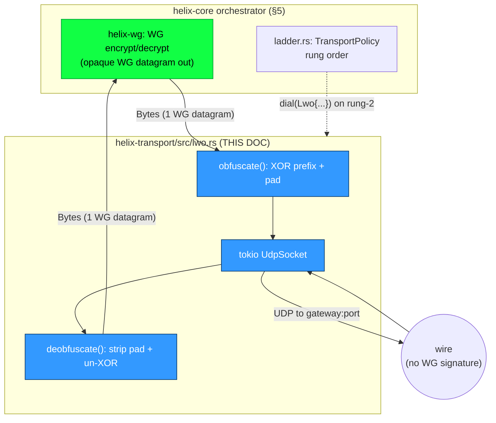

# Lightweight Obfuscation (LWO) Transport

**Revision:** 1
**Last modified:** 2026-06-25T00:00:00Z

> Master technical specification — Volume 2 (Data Plane), nano-detail deepening of
> the **Lightweight Obfuscation (LWO) Transport** introduced at [01-data-plane §3.7].
> Scope: keyed obfuscation of the WireGuard header bytes that DPI signatures key on,
> plus randomized padding — the cheapest obfuscation rung above plain UDP. This is a
> **SPEC** (describe what to build; do not write the shipping product). Sources cited
> inline by id: `[01-DP §N]` = the pass-1 data-plane overview; `[04_ARCH §N]` =
> `HelixVPN-Architecture-Refined.md`; `[04_P0 §N]` = `Phase0-Spike.md`; `[04_P2 §N]` =
> Phase-2 refined doc; `[SYNTHESIS §N]` = cross-document synthesis; `[WG-PROTOCOL]` =
> the public WireGuard protocol specification (wireguard.com/protocol, Noise-IK message
> formats — **external standard**, not the Helix evidence base; every byte offset taken
> from it is flagged). Anything not groundable is marked `UNVERIFIED` per §11.4.6.

---

## 0. Position in the system & what this document owns

LWO is one variant of the `Transport` trait [01-DP §3.1] — the single L2 carrier interface
shared byte-for-byte by client, connector, and edge (invariant I4) [01-DP §0.1, 04_ARCH §134].
It carries **already-encrypted WireGuard datagrams** (I1) as **unreliable UDP datagrams** (I2):
exactly one WG datagram per UDP packet, preserving WG's loss semantics with no head-of-line
blocking — the same datagram-preserving property `plain-udp` has and that `shadowsocks` /
`udp-over-tcp` lose [01-DP §3.5–§3.6].

LWO is the **first escalation rung above `plain-udp`** in the ladder because it is the cheapest
non-default option: near-zero CPU, no QUIC handshake, no extra round trips [01-DP §3.7,
04_ARCH §129/§132/§385]. Default ladder order on a restricted network:
`[ plain-udp, lwo, masque-h3, shadowsocks, udp-over-tcp ]` [01-DP §5.3].

**What this document owns:** the LWO wire format (byte layouts, both phase schemes), the
key-derivation chain, the obfuscate/deobfuscate algorithms, the per-packet padding policy,
the LWO `Transport` impl surface, its state machine, error taxonomy, config knobs, edge cases,
security considerations (including the honest limits of cheap obfuscation), the MTU/perf budget,
and the test matrix.

**What it does NOT own:** the `Transport` trait itself (frozen at [01-DP §3.1]); WG crypto
(`helix-wg`, [01-DP §4]); the ladder selection algorithm (`helix-core/src/ladder.rs`,
[01-DP §5.3] — LWO only contributes its `dial()` and `health()`); `NetworkMap` delivery of
`session_key` (doc 03); DAITA shaping (a separate L2.5 stage, [01-DP §9] — LWO padding is **not**
DAITA and makes no anti-fingerprinting claim beyond defeating the static WG signature).

### 0.1 LWO-specific invariants (extend the §0.1 data-plane set)

| # | Invariant | Source |
|---|---|---|
| L1 | LWO is **WG-agnostic**: it never parses or interprets the WG datagram — it XOR-masks a fixed prefix and appends padding, treating the WG datagram as opaque bytes. This keeps it cheap (I2) and forward-compatible with any future WG message type. | derived from [04_ARCH §129] "in-house XOR/padding scheme" |
| L2 | LWO is **per-packet stateless on the data path** (Phase 2 adds only a monotonic send counter); no per-packet durable state, consistent with no-logging-by-construction (I5). | [01-DP §0.1 I5] |
| L3 | The obfuscation key is **separate from the WG keys** (derived from a transport `session_key` pushed by the coordinator), so an LWO key compromise never touches WG confidentiality. | analogous to `shadowsocks` "session keys SEPARATE from WG keys" [01-DP §3.5] |
| L4 | A packet that fails LWO deobfuscation is **dropped and counted, never propagated** as a transport error — a corrupt/probe packet must not tear down a live tunnel (matches UDP's drop-on-corrupt). | derived (I2 unreliable-datagram semantics) |
| L5 | LWO defeats **naive/static WG-signature DPI only**; it is explicitly NOT a defense against an active probing adversary or a stateful entropy classifier (that is `masque-h3`'s job). The honest boundary is stated and tested, never overclaimed (§11.4.6). | [01-DP §3.7] "naive WG fingerprinting"; [04_ARCH §129] "near-zero" cost tier |

---

## 1. Threat model — the WireGuard signature LWO defeats

### 1.1 What a passive DPI box keys on (the WG fingerprint)

A WireGuard datagram on the wire begins with a fixed, low-entropy header. Per the public
WireGuard protocol [WG-PROTOCOL §5.4] (**external standard — byte offsets below are from the
WG spec, not the Helix evidence base; flagged accordingly**):

```
WG message framing (all little-endian):
  byte 0      : message_type   ∈ {1,2,3,4}
  bytes 1..3  : reserved_zero  = 0x00 0x00 0x00   (always three zero bytes)
  bytes 4..   : type-specific payload

  type 1 = Handshake Initiation   — TOTAL 148 bytes (fixed)   [WG-PROTOCOL §5.4.2]
  type 2 = Handshake Response      — TOTAL  92 bytes (fixed)   [WG-PROTOCOL §5.4.3]
  type 3 = Cookie Reply            — TOTAL  64 bytes (fixed)   [WG-PROTOCOL §5.4.7]
  type 4 = Transport Data          — TOTAL ≥ 32 bytes (16B hdr + ≥16B AEAD)  [WG-PROTOCOL §5.4.6]

  Handshake Initiation (type 1) field map [WG-PROTOCOL §5.4.2]:
    [0]      type=1
    [1..4]   reserved = 0,0,0
    [4..8]   sender_index   (u32, little-endian, attacker-observable counter)
    [8..40]  unencrypted_ephemeral (32B Curve25519 point — random-looking)
    [40..88] encrypted_static (48B = 32B + 16B Poly1305 tag — random-looking)
    [88..116] encrypted_timestamp (28B = 12B TAI64N + 16B tag — random-looking)
    [116..132] mac1 (16B keyed-BLAKE2s — random-looking)
    [132..148] mac2 (16B — random-looking or zero)

  Transport Data (type 4) field map [WG-PROTOCOL §5.4.6]:
    [0]      type=4
    [1..4]   reserved = 0,0,0
    [4..8]   receiver_index (u32, little-endian)
    [8..16]  counter (u64, little-endian, MONOTONIC — the strongest plaintext signal)
    [16..]   encrypted_encapsulated_packet (≥16B AEAD — random-looking)
```

Three independent, cheaply-computable DPI signatures fall out of this:

1. **The 4-byte prefix pattern** — `byte[0] ∈ {1,2,3,4}` AND `byte[1..3] == 0x000000`. A
   single u32 mask/compare per packet flags WG with near-zero false positives against random
   UDP. **This is the dominant signature.**
2. **Fixed handshake lengths** — a UDP packet of exactly **148 / 92 / 64** bytes to a fresh
   peer is a near-certain WG handshake, independent of payload [WG-PROTOCOL §5.4].
3. **The transport counter** — `byte[8..16]` of a type-4 packet increments by 1 per packet in
   a low-loss flow; a monotone little-endian u64 in a fixed offset is a strong stateful tell.

### 1.2 LWO's countermeasures (mapped 1:1 to the signatures)

| Signature | LWO countermeasure | Mechanism (§3) |
|---|---|---|
| (1) 4-byte prefix `{1..4},0,0,0` | XOR-mask the first `header_obf_len` bytes (default 16, ≥ the 4-byte prefix **and** the index/counter fields) with a keystream → prefix becomes uniform-random; the WG signature vanishes. | §3.3 obfuscate |
| (2) fixed lengths 148/92/64 | append `pad_len ∈ [pad_min, pad_max]` keyed-random padding bytes → the 148-byte init becomes a variable-length packet, breaking the fixed-length fingerprint. | §3.4 padding |
| (3) monotone counter at `[8..16]` | covered by (1) when `header_obf_len ≥ 16` — the counter falls inside the XOR-masked prefix and is masked with a per-packet keystream, so it no longer presents as a clean monotone u64. | §3.3 obfuscate (note `header_obf_len` default = 16, not 4, **precisely** to cover the counter) |

After LWO, every UDP packet on the wire is: an 8-byte cleartext random `seed`, followed by a
prefix that is uniform-random (masked), followed by WG ciphertext that was already
random-looking, followed by random-looking padding of varying length. To the dominant passive
WG classifier there is no WG signature left. **Honest boundary (L5):** a *stateful entropy
classifier* may still flag "high-entropy UDP to :443-ish with no TLS/QUIC handshake" — LWO does
not claim to beat that; that is the escalation to `masque-h3` [01-DP §3.3].

---

## 2. Where LWO sits — layering & ladder placement



LWO is selected when `plain-udp` (rung 1) exceeds its handshake failure budget — i.e. WG/UDP is
being dropped by a signature-matching DPI box [01-DP §5.3 step 3, sequence at §5.4 "Rung 2"].
Because LWO is also UDP, if the censor is dropping *all* UDP (not just WG-signed UDP), LWO will
also fail its budget and the ladder escalates to `masque-h3` (TCP/443-shaped QUIC). LWO's value
is precisely the **common middle case**: UDP is allowed, but packets carrying the WG signature
are dropped.

---

## 3. Wire format & algorithms

Two schemes ship across phases per [01-DP §3.7] ("Phase 1 ships a basic XOR/padding scheme;
Phase 2 hardens it to a proper per-session keyed scheme"). The byte layout is identical at the
framing level; the keystream source differs. `scheme_version` (config §11) selects which.

### 3.1 LWO frame layout (on-wire, one per UDP datagram)

```
 0        1        ...      8                       8+L                 8+L+P
 +--------+--------+--------+------------------------+-------------------+
 | seed (8 bytes, cleartext)| obf(WG datagram), L B  | padding, P bytes  |
 +--------+--------+--------+------------------------+-------------------+
 |<------ SEED_LEN=8 ------>|<-- WG datagram (XOR'd  |<-- keyed-random   |
 |  per-packet random nonce |    over first H bytes) |    pad, length P  |
 |  = keystream seed         |    rest = raw WG ct    |    derived from   |
 |                           |    (already random)    |    seed (§3.4)    |
 +---------------------------+------------------------+-------------------+

  SEED_LEN  = 8   (constant)
  L         = true WG datagram length (1 .. effective_mtu_inner); NOT on the wire —
              recovered as  L = udp_payload_len - SEED_LEN - P
  P         = pad_len(seed, pad_key)  ∈ [pad_min, pad_max]   (deterministic from seed; §3.4)
  H         = min(L, header_obf_len)  bytes of the WG datagram that get XOR-masked
  udp_payload_len = SEED_LEN + L + P   (== the bytes UDP hands us; known on recv)
```

**Why no explicit length field:** `P` is a pure deterministic function of `(seed, pad_key)`
(§3.4), and `udp_payload_len` is given by the UDP stack, so the receiver recovers
`L = udp_payload_len − 8 − P` with **zero** extra header bytes. This minimizes overhead
(the entire LWO framing cost is `SEED_LEN + P` = 8 + ~[0..16] bytes) and removes a
plaintext length field that would itself be a fingerprint. (Phase 1's simpler variant carries
a 1-byte obfuscated `pad_len`; see §3.5.)

**Seed is cleartext by necessity:** the receiver needs it to derive the same keystream and
`pad_len`. An 8-byte random seed is itself indistinguishable from random and carries no WG
signature; its only risk is keystream reuse on seed collision, bounded by the birthday term
`≈ 2^-64` per pair (§10).

### 3.2 Key derivation chain

`session_key: SecretBytes` arrives in `TransportConfig::Lwo` from the coordinator's
`NetworkMap` (doc 03), per-peer and rotatable. From it LWO derives two sub-keys via
HKDF-SHA256 (RFC 5869):

```rust
// helix-transport/src/lwo.rs  — key schedule
use hkdf::Hkdf;
use sha2::Sha256;

const LWO_INFO_OBF: &[u8] = b"helix-lwo/v2/obf-key";
const LWO_INFO_PAD: &[u8] = b"helix-lwo/v2/pad-key";
const SEED_LEN: usize     = 8;

struct LwoKeys {
    obf_key: [u8; 32],   // ChaCha20 key for the header keystream (§3.3)
    pad_key: [u8; 16],   // keyed PRF key for pad-length derivation (§3.4)
}

/// salt = a per-session 32-byte value also pushed in the NetworkMap (session_salt),
/// rotated whenever session_key rotates; binds the key schedule to one session.
fn derive_keys(session_key: &SecretBytes, session_salt: &[u8; 32]) -> LwoKeys {
    let hk = Hkdf::<Sha256>::new(Some(session_salt), session_key.expose());
    let mut obf_key = [0u8; 32];
    let mut pad_key = [0u8; 16];
    hk.expand(LWO_INFO_OBF, &mut obf_key).expect("hkdf obf");   // 32 ≤ 255*32, infallible
    hk.expand(LWO_INFO_PAD, &mut pad_key).expect("hkdf pad");
    LwoKeys { obf_key, pad_key }
}
```

`SecretBytes` is a zeroize-on-drop wrapper (the same `SecretBytes` used by
`TransportConfig::Shadowsocks`/`Lwo` in [01-DP §3.1]); `obf_key`/`pad_key` live in a struct that
also implements `Zeroize` on `Drop`. Keys never touch logs (§11.4.10).

### 3.3 The keystream & header obfuscation (Phase 2 — hardened)

```rust
use chacha20::cipher::{KeyIvInit, StreamCipher};
use chacha20::ChaCha20;   // IETF ChaCha20: 32B key, 12B nonce, 32-bit block counter

/// Derive a 12-byte ChaCha20 nonce from the 8-byte per-packet seed.
/// First 4 nonce bytes are a fixed domain tag so the same seed never collides
/// with the pad-PRF input space; last 8 are the seed.
#[inline]
fn seed_to_nonce(seed: &[u8; SEED_LEN]) -> [u8; 12] {
    let mut n = [0u8; 12];
    n[0..4].copy_from_slice(b"OBF1");
    n[4..12].copy_from_slice(seed);
    n
}

/// Obfuscate IN PLACE: XOR the first H = min(L, header_obf_len) bytes of `wg`
/// with the ChaCha20 keystream. Cost: one ChaCha20 init + H bytes of XOR (H ≤ 64
/// by default → a single ChaCha20 block). The remaining L-H bytes are untouched
/// (already-random WG ciphertext, no signature).
fn obfuscate_header(keys: &LwoKeys, seed: &[u8; SEED_LEN], wg: &mut [u8], header_obf_len: usize) {
    let h = wg.len().min(header_obf_len);
    let mut cipher = ChaCha20::new((&keys.obf_key).into(), (&seed_to_nonce(seed)).into());
    cipher.apply_keystream(&mut wg[..h]);   // XOR mask; deobfuscate is the identical op
}
```

**Deobfuscation is the identical operation** (XOR is its own inverse): re-derive the keystream
from the cleartext `seed` and `obf_key`, XOR the first `H` bytes of the recovered `L`-byte WG
region. No separate code path.

**`header_obf_len` default = 16** (config §11): covers the 4-byte prefix, the 4-byte
sender/receiver index, and (for type-4) the 8-byte counter — i.e. *every* low-entropy /
monotone field in §1.1, in a single ChaCha20 block's worth of XOR. A `full` mode
(`header_obf_len = u16::MAX`, clamped to `L`) XORs the entire datagram for maximum entropy
flattening at a slightly higher (still linear, ~1 GB/s/core) cost; default stays header-only
because the WG body is already random (L1, §1.1).

### 3.4 Padding policy (keyed, deterministic from seed)

```rust
use siphasher::sip::SipHasher13;   // fast keyed PRF; pad_key is the SipHash key
use std::hash::Hasher;

/// pad_len is a DETERMINISTIC function of (seed, pad_key): the sender and receiver
/// compute the identical value with no length field on the wire.
/// Range [pad_min, pad_max] inclusive; both config knobs (§11). pad_max - pad_min + 1
/// MUST be ≥ 1.  Uniform over the range via rejection-free modulo on a 64-bit PRF
/// (bias ≤ 2^-58 for ranges ≤ 256 — negligible for a length distribution).
fn pad_len(keys: &LwoKeys, seed: &[u8; SEED_LEN], pad_min: u16, pad_max: u16) -> usize {
    let span = (pad_max - pad_min) as u64 + 1;
    let mut h = SipHasher13::new_with_key(&{
        let mut k = [0u8; 16]; k.copy_from_slice(&keys.pad_key); k
    });
    h.write(b"PAD1");
    h.write(seed);
    (pad_min as u64 + (h.finish() % span)) as usize
}

/// Padding CONTENT is keystream bytes (high-entropy, indistinguishable from the body),
/// generated from the same ChaCha20 stream advanced past the header region. Receiver
/// never needs to read padding content — it strips P bytes by length only (L4).
fn fill_padding(keys: &LwoKeys, seed: &[u8; SEED_LEN], out: &mut [u8]) {
    let mut cipher = ChaCha20::new((&keys.obf_key).into(), (&seed_to_nonce(seed)).into());
    // advance the cipher past the 64-byte header block so padding ≠ header keystream reuse
    let mut skip = [0u8; 64];
    cipher.apply_keystream(&mut skip);
    for b in out.iter_mut() { *b = 0; }
    cipher.apply_keystream(out);   // out becomes pure keystream (random-looking)
}
```

**Padding length distribution:** uniform `[pad_min, pad_max]` per packet, keyed so a passive
observer cannot predict or remove it. Defaults `pad_min = 0`, `pad_max = 16` (config §11). The
WG handshake's three fixed lengths (148/92/64) thus spread across 17 distinct on-wire lengths
each. **Optional length-equalization mode** (`pad_to_bucket`, §11): instead of a uniform range,
pad each packet up to the next bucket boundary (e.g. multiples of 64) so the length histogram
collapses to a few buckets — a stronger anti-length-fingerprint at higher average overhead.
Default is the cheap uniform mode (L5: LWO is the *cheap* rung; bucket mode is the bridge toward
DAITA [01-DP §9] without being DAITA).

### 3.5 Phase 1 (basic) scheme — `scheme_version = 1`

Phase 1 ships before the full keyed keystream is hardened [01-DP §3.7]. It MUST interoperate on
the same frame layout (§3.1) so the Phase-2 upgrade is a keystream swap, not a wire-format break:

- **Header mask:** a *static* 32-byte mask `M = HKDF(session_key, "helix-lwo/v1/mask")`,
  XORed over the first `H` bytes. `seed` is still present and still randomizes `pad_len`, but the
  header keystream does **not** depend on `seed` → identical header bytes mask to identical
  ciphertext across packets (the known weakness).
- **pad_len:** carried as a 1-byte field at frame offset 8, XORed with `M[0]` (so the explicit
  length variant of §3.1). Recovered as `P = wire[8] ^ M[0]`; the WG region starts at offset 9.
- **Honest limit (documented in code + tracker):** the static mask is vulnerable to
  known-plaintext recovery — an adversary who knows the WG header structure (public) can XOR two
  captured LWO packets to cancel `M` and recover header deltas, then solve for `M`. Phase 1 LWO
  therefore defeats *only* a stateless signature-matcher that does not do this analysis, and is
  flagged `Operator-blocked`-grade for any active adversary until `scheme_version = 2` lands.
  This is stated, not hidden (§11.4.6, L5).

The orchestrator MUST refuse to negotiate `scheme_version = 1` once a peer advertises `2` in its
`NetworkMap` capability set (doc 03); v1 exists only for the Phase-1 milestone window.

### 3.6 Send / receive packet flow

```mermaid
sequenceDiagram
    autonumber
    participant WG as helix-wg
    participant L as LwoTransport
    participant K as keys+rng
    participant S as UdpSocket
    participant E as Gateway edge (LWO de-obf)

    Note over WG,E: SEND path (obfuscate)
    WG->>L: send(wg: Bytes, len = L)
    L->>K: seed = rng.fill(8B)
    L->>K: P = pad_len(seed, pad_key)          // deterministic
    alt L + 8 + P > effective_mtu_path
        L-->>WG: Err(Oversize(L))               // hard error, no truncation (§9)
    else fits
        L->>L: buf = [seed][wg copy][P bytes]
        L->>K: obfuscate_header(buf.wg_region, H = min(L, header_obf_len))
        L->>K: fill_padding(buf.pad_region)
        L->>S: send_to(buf, peer)
        S->>E: UDP datagram (no WG signature)
        L-->>WG: Ok(())
    end

    Note over WG,E: RECV path (deobfuscate)
    S->>L: recv() → (raw, n = udp_payload_len)
    L->>L: seed = raw[0..8]
    L->>K: P = pad_len(seed, pad_key)
    alt n < 8 + 1 + P  (impossible split)
        L->>L: DROP + count lwo_deobf_drops      // L4: never an error
        L->>S: recv() again
    else valid
        L->>L: L = n - 8 - P ; wg = raw[8 .. 8+L]
        L->>K: obfuscate_header(wg, H)           // XOR is self-inverse → recovers WG
        L->>L: health.mark_recv()
        L-->>WG: Ok(Bytes::copy(wg))
    end
```

---

## 4. Rust API surface (the LWO `Transport` impl)

```rust
// helix-transport/src/lwo.rs
use async_trait::async_trait;
use bytes::Bytes;
use std::net::SocketAddr;
use std::sync::atomic::{AtomicU64, Ordering};
use crate::{Transport, TransportError, TransportHealth};
use crate::health::HealthCell;     // shared with plain_udp (RTT EWMA, last-recv age)

/// Lightweight WG obfuscation carrier. Per-packet stateless on the data path (L2);
/// the only mutable state is the HealthCell and an optional monotonic send counter
/// used to refresh seeds under a (negligible) collision-avoidance policy.
pub struct LwoTransport {
    sock:    tokio::net::UdpSocket,
    peer:    SocketAddr,
    keys:    LwoKeys,                 // zeroized on drop (§3.2)
    cfg:     LwoParams,               // header_obf_len, pad_min/max, scheme_version (§11)
    health:  HealthCell,
    send_ctr: AtomicU64,              // mixed into the seed RNG to harden against seed reuse
    drops:   AtomicU64,               // lwo_deobf_drops counter (L4, metrics §11.4.5)
}

/// Tunable obfuscation parameters; all come from TransportConfig::Lwo / NetworkMap.
#[derive(Clone, Copy, Debug)]
pub struct LwoParams {
    pub scheme_version: u8,   // 1 = static mask (Phase 1, §3.5); 2 = keyed keystream (§3.3)
    pub header_obf_len: u16,  // default 16 (covers prefix+index+counter, §3.3)
    pub pad_min: u16,         // default 0
    pub pad_max: u16,         // default 16  (must be ≥ pad_min)
    pub pad_to_bucket: u16,   // 0 = uniform range; else round length up to this multiple (§3.4)
}

impl Default for LwoParams {
    fn default() -> Self {
        Self { scheme_version: 2, header_obf_len: 16, pad_min: 0, pad_max: 16, pad_to_bucket: 0 }
    }
}

/// Construct from the dial() ladder (§5.3). Binds a UDP socket, derives keys.
/// Validated: pad_max ≥ pad_min, header_obf_len ≥ 4, scheme_version ∈ {1,2}.
pub(crate) async fn dial_lwo(
    peer: SocketAddr, bind: SocketAddr,
    session_key: SecretBytes, session_salt: [u8; 32], cfg: LwoParams,
) -> Result<LwoTransport, TransportError> {
    if cfg.pad_max < cfg.pad_min || cfg.header_obf_len < 4 || !(1..=2).contains(&cfg.scheme_version) {
        return Err(TransportError::HandshakeFailed("invalid LwoParams".into()));
    }
    let sock = tokio::net::UdpSocket::bind(bind).await?;
    sock.connect(peer).await?;        // connected UDP: lets recv() drop off-path datagrams cheaply
    Ok(LwoTransport {
        sock, peer,
        keys: derive_keys(&session_key, &session_salt),
        cfg, health: HealthCell::new(), send_ctr: AtomicU64::new(0), drops: AtomicU64::new(0),
    })
}

#[async_trait]
impl Transport for LwoTransport {
    async fn send(&self, wg: Bytes) -> Result<(), TransportError> {
        let l = wg.len();
        if l == 0 { return Ok(()); }                                   // §9 edge: empty → no-op
        let seed = self.next_seed();                                   // 8B, ctr-mixed RNG
        let p = self.pad_len(&seed);
        let total = SEED_LEN + l + p;
        if total > self.effective_mtu() as usize + SEED_LEN /*hdr is accounted in eff_mtu*/ {
            return Err(TransportError::Oversize(l));                   // §9: never truncate
        }
        let mut buf = Vec::with_capacity(total);
        buf.extend_from_slice(&seed);
        buf.extend_from_slice(&wg);
        buf.resize(total, 0);
        self.obfuscate(&seed, &mut buf[SEED_LEN..SEED_LEN + l]);       // §3.3
        self.fill_padding(&seed, &mut buf[SEED_LEN + l..]);            // §3.4
        self.sock.send(&buf).await?;                                  // connected UDP
        Ok(())
    }

    async fn recv(&self) -> Result<Bytes, TransportError> {
        let mut buf = vec![0u8; (self.effective_mtu() as usize) + SEED_LEN + self.cfg.pad_max as usize + 64];
        loop {
            let n = self.sock.recv(&mut buf).await?;                   // cancel-safe (I2)
            match self.deobfuscate(&buf[..n]) {
                Some(wg) => { self.health.mark_recv(); return Ok(wg); }
                None => { self.drops.fetch_add(1, Ordering::Relaxed); continue; } // L4: drop+loop
            }
        }
    }

    fn kind(&self) -> &'static str { "lwo" }
    fn effective_mtu(&self) -> u16 { 1400 }    // plain-udp 1420 − SEED_LEN(8) − ~12 pad headroom (§10)
    fn health(&self) -> TransportHealth { self.health.snapshot() }
    async fn close(&self) -> Result<(), TransportError> { Ok(()) } // UDP: nothing to flush
}
```

```rust
// private helpers (sketch)
impl LwoTransport {
    fn next_seed(&self) -> [u8; SEED_LEN] {
        // 8 random bytes from a CSPRNG, mixed with the monotonic send counter so that
        // even a (broken) RNG returning a repeat cannot reuse a full seed within a session.
        let ctr = self.send_ctr.fetch_add(1, Ordering::Relaxed);
        let mut s = [0u8; SEED_LEN];
        rand::rng().fill_bytes(&mut s);
        let cb = ctr.to_le_bytes();
        for i in 0..SEED_LEN { s[i] ^= cb[i]; }     // counter is non-secret; only de-dups seeds
        s
    }
    fn pad_len(&self, seed: &[u8; SEED_LEN]) -> usize {
        let p = pad_len(&self.keys, seed, self.cfg.pad_min, self.cfg.pad_max);
        if self.cfg.pad_to_bucket == 0 { p } else { /* round-up-to-bucket variant, §3.4 */ p }
    }
    fn obfuscate(&self, seed: &[u8; SEED_LEN], region: &mut [u8]) {
        match self.cfg.scheme_version {
            2 => obfuscate_header(&self.keys, seed, region, self.cfg.header_obf_len as usize),
            _ => obfuscate_header_static_v1(&self.keys, region, self.cfg.header_obf_len as usize),
        }
    }
    fn fill_padding(&self, seed: &[u8; SEED_LEN], out: &mut [u8]) { fill_padding(&self.keys, seed, out); }

    /// Returns None ⇒ DROP (L4): never an error, never tears the tunnel down.
    fn deobfuscate(&self, raw: &[u8]) -> Option<Bytes> {
        if raw.len() < SEED_LEN + 1 { return None; }
        let mut seed = [0u8; SEED_LEN]; seed.copy_from_slice(&raw[..SEED_LEN]);
        let p = self.pad_len(&seed);
        if raw.len() < SEED_LEN + p + 1 { return None; }     // pad can't exceed payload (with ≥1 WG byte)
        let l = raw.len() - SEED_LEN - p;
        if l == 0 || l > self.effective_mtu() as usize { return None; }   // sanity bound
        let mut wg = raw[SEED_LEN..SEED_LEN + l].to_vec();
        self.obfuscate(&seed, &mut wg[..wg.len().min(self.cfg.header_obf_len as usize)]); // self-inverse
        Some(Bytes::from(wg))
    }
}
```

### 4.1 `TransportConfig` & `dial()` wiring

LWO is already a variant of the frozen `TransportConfig` enum [01-DP §3.1]:

```rust
// (from helix-transport/src/lib.rs — UNCHANGED, shown for context)
Lwo { peer: SocketAddr, bind: SocketAddr, session_key: SecretBytes },
```

This document **proposes the additive fields** `session_salt: [u8; 32]` and
`params: LwoParams` on the `Lwo` variant so the coordinator can push the salt and per-region
obfuscation tuning (`UNVERIFIED`: the pass-1 enum at [01-DP §3.1] shows only
`peer/bind/session_key`; whether these two extra fields are added to the public enum or carried
in a side-channel is a doc-03 `NetworkMap` schema decision — flagged for reconciliation when
doc 03 lands). The `dial()` ladder routes `TransportConfig::Lwo{..}` → `dial_lwo()` (§4).

---

## 5. State machine

LWO has almost no connection state (it is connectionless UDP), but the orchestrator-visible
lifecycle and the key-rotation path are state-machine-worthy:

```mermaid
stateDiagram-v2
    [*] --> Dialing: dial_lwo()
    Dialing --> Active: socket bound + keys derived
    Dialing --> Failed: bind/connect error → TransportError
    Active --> Active: send()/recv() (per-packet stateless, L2)
    Active --> Rekeying: NetworkMap pushes new session_key/salt
    Rekeying --> Active: derive_keys() swapped atomically;<br/>in-flight packets under old key DROP (L4)
    Active --> Closed: close() (idempotent, no-op flush)
    Failed --> [*]
    Closed --> [*]

    note right of Active
      No handshake state machine of LWO's own.
      WG's own handshake rides INSIDE the obfuscated
      datagrams; LWO never inspects it (L1).
      health() = RTT EWMA + last-recv-age the ladder
      uses to judge the rung (§5.3 of 01-DP).
    end note
    note right of Rekeying
      Key rotation is the ONLY non-trivial transition.
      A brief window where a few packets encrypted under
      the previous obf_key arrive after the swap → they
      fail the length/sanity check → dropped (L4) → WG's
      retransmit/keepalive recovers. No tunnel teardown.
    end note
```

**Rekeying detail:** `derive_keys()` produces a fresh `LwoKeys`; the swap is a single
`ArcSwap<LwoKeys>` (or `Mutex<LwoKeys>`) replacement. There is **no** negotiated cutover — LWO
carries no control messages. Packets in flight under the old key deobfuscate to a wrong `L`/`P`
and are dropped (L4); the WG layer above does not even notice (its own keepalive/retransmit
[01-DP §4 `tick`] covers the ≤ RTT gap). Rekey cadence is a coordinator policy (`rekey_interval`,
§11); default rotation aligns with WG's own rekey (~120 s) so an LWO-key and a WG-key rotation
coincide, minimizing distinct key-lifetime windows. `UNVERIFIED`: the exact coordinator rekey
push mechanism is doc-03 territory.

---

## 6. Error taxonomy

LWO reuses the shared `TransportError` [01-DP §3.1, error.rs] and adds **no new public variant**
(keeping the trait surface uniform). Mapping:

| Condition | Surfaced as | Path | Notes |
|---|---|---|---|
| `bind`/`connect` UDP socket failure at dial | `TransportError::Io` | `dial_lwo` | propagates to the ladder → escalate rung (§5.3) |
| invalid `LwoParams` (pad_max<pad_min, header_obf_len<4, bad scheme) | `TransportError::HandshakeFailed("invalid LwoParams")` | `dial_lwo` | a config error reads as a handshake failure → ladder skips LWO |
| `send()` of a datagram that won't fit `eff_mtu` after seed+pad | `TransportError::Oversize(L)` | `send` | hard error, **never truncates** (§9); orchestrator lowers inner WG MTU |
| socket send/recv I/O error mid-session | `TransportError::Io` | `send`/`recv` | repeated → health degrades → ladder may re-escalate |
| a received packet fails deobfuscation (bad length split, sanity bound, probe traffic) | **NOT an error** — dropped + `lwo_deobf_drops++` | `recv` (loops) | **L4**: corrupt/probe/old-key packets must not kill a live tunnel |
| internal deobf logic invariant broken (would be a bug) | `debug_assert!` in debug; drop in release | `deobfuscate` | §11.4.1 — a script/logic bug must never masquerade as a product FAIL |

There is deliberately **no `DeobfuscationFailed` public error**: per L4 a failed deobfuscation is
indistinguishable, from LWO's standpoint, from random noise/probe traffic, and the correct
response is silent drop, not tunnel teardown.

---

## 7. Edge cases (enumerated, each with the defined behavior)

| # | Edge case | Defined behavior |
|---|---|---|
| E1 | Empty WG datagram (`L == 0`) | `send` returns `Ok(())` no-op; deobf rejects `L==0` (drop). WG never emits empty datagrams, but the guard is explicit. |
| E2 | WG datagram smaller than `header_obf_len` | `H = min(L, header_obf_len)` — XOR only the available `L` bytes; never reads past the buffer (§3.3 clamps). |
| E3 | `pad_max == 0` (padding disabled) | `pad_len` returns `pad_min` (=0) every packet → no padding; LWO still obfuscates the header (signature 1) but does NOT break fixed lengths (signature 2). A valid cheap mode; flagged in metrics so an operator knows length-fingerprinting is unmitigated. |
| E4 | Path MTU smaller than `eff_mtu` (PMTUD shrink) | orchestrator lowers inner WG MTU (`min(eff_mtu, pmtu)`) [01-DP §10 rule 1]; a transient oversize before PMTUD converges → `Oversize` → WG re-emits smaller. |
| E5 | Received UDP packet of length `< SEED_LEN + 1` | cannot contain a seed + ≥1 WG byte → drop (L4). Defends against a truncating middlebox / runt probe. |
| E6 | Received packet where `pad_len(seed)` ≥ payload (no room for WG bytes) | drop (L4) — a spoofed/forged packet whose seed implies impossible split. |
| E7 | Seed collision within a session (two packets, same 8-byte seed) | keystream reused on the masked prefix only; counter-mixing (§4 `next_seed`) makes a *full* collision require both an RNG repeat AND an equal send-counter low byte — practically impossible; residual risk `≈2^-64` per pair, accepted & documented (§10). |
| E8 | Coordinator pushes new `session_key` mid-flight (rekey) | atomic key swap (§5); ≤1 RTT of old-key packets drop (L4); WG keepalive recovers. No teardown. |
| E9 | Scheme downgrade attempt (peer advertises v2, attacker forces v1) | the orchestrator MUST pin `scheme_version` from the authenticated `NetworkMap`, never from any on-wire signal (LWO carries none) → no in-band downgrade surface. |
| E10 | DPI drops *all* UDP, not just WG-signed | LWO's handshake budget is exhausted exactly like plain-udp's → ladder escalates to `masque-h3` (§2). LWO correctly fails fast rather than hanging. |
| E11 | Off-path datagram delivered to a connected UDP socket | `sock.connect(peer)` causes the kernel to drop datagrams from other sources; any that slip through fail deobf → drop (L4). |
| E12 | `header_obf_len = full` (XOR whole datagram) on a max-size datagram | multi-block ChaCha20 over ~1400 bytes; still O(L), ~1 GB/s/core; `eff_mtu` unaffected (padding budget unchanged). |

---

## 8. Security considerations (honest boundary — §11.4.6, L5)

1. **What LWO IS for:** defeating a *stateless, signature-matching* DPI box that blocks UDP
   packets exhibiting the WG fingerprint (§1.1 signatures 1–3). Against that adversary, Phase-2
   LWO removes all three signals at near-zero cost.
2. **What LWO is NOT for** (stated, never overclaimed):
   - *Active probing.* A censor that replays/probes the gateway endpoint is not defeated by LWO
     (LWO has no anti-probe response). The anti-probe story is the `masque-h3` decoy site
     [01-DP §3.3].
   - *Stateful entropy / flow classifiers.* "High-entropy UDP, no TLS/QUIC handshake, periodic
     small packets" can still cluster. `pad_to_bucket` (§3.4) helps marginally; full defense is
     DAITA [01-DP §9] + `masque-h3`. LWO makes **no traffic-analysis claim**.
   - *Confidentiality / integrity.* LWO is **obfuscation, not encryption** — the WG datagram it
     wraps already provides AEAD confidentiality+integrity (I1). LWO's XOR keystream is NOT a
     security boundary; a recovered `obf_key` reveals only the (already-encrypted) header bytes,
     never WG plaintext (L3). LWO MUST NOT be relied on for any security property WG does not
     already provide.
3. **Phase-1 static-mask weakness** (§3.5): known-plaintext recovery of the static mask. Phase-1
   LWO is a milestone artifact; it ships flagged and is auto-superseded by v2 (E9). Tracked as a
   known limitation, never presented as production-grade obfuscation.
4. **Seed reuse → keystream reuse** (E7): bounded to `≈2^-64` per packet pair by the 8-byte CSPRNG
   seed + counter mix; even on reuse only the masked *header* prefix leaks an XOR delta, not WG
   plaintext. Acceptable for the cheap rung; `masque-h3` is the answer where this risk is
   unacceptable.
5. **Key separation** (L3): `obf_key`/`pad_key` derive from a transport `session_key` distinct
   from WG keys, with their own salt and rotation; an LWO key compromise is contained to
   deobfuscation, never WG.
6. **Replay / amplification:** LWO neither adds nor mitigates replay beyond WG's own counter
   (WG drops replayed transport packets). LWO is not a reflection/amplification vector — it is a
   1:1 datagram wrapper with no response generation of its own.
7. **No logging:** `lwo_deobf_drops` and health are aggregate counters only (I5, §11.4.5); no
   per-packet/per-peer durable state.

---

## 9. MTU & overhead budget

LWO's wire overhead per packet = `SEED_LEN(8) + P(pad_len)`. With defaults `pad_max = 16`, the
worst-case overhead is `8 + 16 = 24` bytes; average `8 + 8 = 16`. Reconciling with [01-DP §10]
(which lists `lwo ≈ 1400`):

```
plain-udp inner WG MTU       = 1420                               [01-DP §10]
  − SEED_LEN                 = 1412
  − pad_max headroom (16)    = 1396  → reported effective_mtu()   = 1400 (rounded, conservative)
```

Rules (inherit [01-DP §10]):
1. inner WG MTU = `min(lwo.effective_mtu()=1400, path-MTU-discovered)`.
2. `effective_mtu()` already subtracts seed + worst-case padding, so a `send()` that respects it
   **cannot** exceed path MTU even at `pad_max`. The runtime `Oversize` guard (§4, E4) is a
   belt-and-suspenders against a stale inner-MTU during PMTUD shrink.
3. Padding is added *after* WG encrypt and counts against the LWO budget, never the inner WG MTU
   ([01-DP §10] rule 2 — LWO padding behaves like the DAITA-padding rule).

**CPU budget (the "near-zero" claim, [04_ARCH §129]):** per packet = one CSPRNG draw (8 B) + one
SipHash-1-3 (pad_len) + one ChaCha20 init + XOR of `H ≤ 64` bytes (header mode) + ChaCha20 of
`P ≤ 16` padding bytes. All sub-microsecond on a modern core; the dominant cost remains the
UDP syscall, shared with `plain-udp`. Target: LWO throughput ≥ **95%** of `plain-udp`
throughput (the cheap-rung promise) — measured, not assumed (§12 PT/BT). This is far below
`masque-h3`'s QUIC overhead, which is exactly LWO's reason to exist [01-DP §3.7].

---

## 10. Config knobs (operator + coordinator surface)

| Knob | Type | Default | Source | Effect |
|---|---|---|---|---|
| `scheme_version` | `u8` ∈ {1,2} | `2` | NetworkMap | 1 = Phase-1 static mask (§3.5); 2 = keyed keystream (§3.3). v1 auto-superseded (E9). |
| `header_obf_len` | `u16` (≥4) | `16` | NetworkMap | bytes of the WG datagram XOR-masked; 16 covers prefix+index+counter (§3.3); `u16::MAX`→full-datagram mask. |
| `pad_min` | `u16` | `0` | NetworkMap | floor of the uniform padding range. |
| `pad_max` | `u16` (≥ pad_min) | `16` | NetworkMap | ceil of the uniform padding range; 0 disables padding (E3). |
| `pad_to_bucket` | `u16` | `0` | NetworkMap | 0 = uniform range; N = round each on-wire length up to a multiple of N (stronger length-equalization, §3.4). |
| `rekey_interval` | `Duration` | `120 s` | coordinator | LWO key-rotation cadence; default aligned to WG rekey (§5). |
| `session_key` | `SecretBytes` | — (required) | NetworkMap | root of the key schedule (§3.2); per-peer, rotatable. |
| `session_salt` | `[u8;32]` | — (required) | NetworkMap | binds the key schedule to one session; rotates with `session_key`. |
| `bind` | `SocketAddr` | `0.0.0.0:0` | client config | local UDP bind (ephemeral by default). |

Seed length (`SEED_LEN = 8`), the HKDF info strings, and the ChaCha20/SipHash choices are
**compile-time constants**, not knobs — changing them is a wire-format break requiring a
`scheme_version` bump (kept out of the runtime config surface deliberately).

`UNVERIFIED`: the precise field placement of `header_obf_len`/`pad_*`/`pad_to_bucket` in the
`NetworkMap` schema is doc-03 territory; this doc fixes their semantics and defaults, doc 03
fixes their transport.

---

## 11. Region/ladder integration (read-only dependencies)

- **Ladder rung:** LWO is `order[1]` in the restricted-network prior (§2); the coordinator may
  push a regional prior that starts directly at `lwo` for regions where naive WG-signature
  blocking is common but UDP is otherwise open, so users skip the plain-udp failure round-trip
  [01-DP §5.3 step 5].
- **Per-network memory:** on a successful LWO connection the ladder remembers (SSID / gateway
  fingerprint → start at `lwo`) so reconnects on the same hostile network skip straight to it
  [01-DP §5.3 step 4]. LWO contributes only `health()`; the memory lives in `ladder.rs`.
- **Telemetry:** "lwo succeeded after N escalations in region R" — aggregate only, feeds the
  Censorship-Evasion Success dashboard [01-DP §5.3 step 6, 04_ARCH §416]; plus `lwo_deobf_drops`
  as a health signal. No per-user data (I5).

---

## 12. Test matrix (§11.4.169 test types — anti-bluff captured evidence)

> `UNVERIFIED`: §11.4.169 is named by the operator as the test-type taxonomy but is not present
> in the constitution text loaded for this session (loaded anchors end at §11.4.168). The
> concrete test types below are grounded in the canonical enumeration of §11.4.27 (unit /
> integration / e2e / full-automation / security / DDoS / scaling / chaos / stress / performance
> / benchmarking) + §11.4.85 (stress+chaos) + §11.4.5/.69/.107 (captured evidence). The mapping
> is presented under the §11.4.169 label as instructed; reconcile the anchor number when
> §11.4.169 is available.

| Test type | LWO test point | Captured-evidence artifact (§11.4.5/.69) |
|---|---|---|
| **Unit** | `obfuscate_header` then deobfuscate (same seed/key) round-trips a WG datagram byte-identically, for `L` ∈ {1, 16, 64, 148, 1400}; `header_obf_len` ∈ {4,16,full}. | `cargo test` vector table; per-case input/output hashes. |
| **Unit** | `pad_len` is deterministic, uniform over `[pad_min,pad_max]` (χ² over 10⁶ seeds), and identical sender↔receiver. | histogram CSV + χ² statistic. |
| **Unit** | key schedule: `derive_keys` matches a frozen HKDF-SHA256 test vector (RFC 5869 style); keys zeroize on drop (miri/valgrind). | committed test vector + zeroize proof. |
| **Property/Fuzz** (security) | `cargo fuzz` on `deobfuscate(arbitrary bytes)` — never panics, never reads OOB, always returns `Some(valid-len)` or `None`; corpus seeded with runt/oversize/forged-seed packets (E5/E6). | fuzz corpus + zero-crash run log. |
| **Integration** | Linux netns: client `dial_lwo` ⇄ edge LWO de-obf ⇄ WG handshake completes; LAN host ping succeeds through the tunnel. | `ping` + `iperf3` CSV; netns topology script. |
| **Integration / Security** | **The signature test:** `nft` rule drops UDP matching the WG 4-byte prefix `{1..4},0,0,0`; plain-udp tunnel FAILS, LWO tunnel SUCCEEDS through the same rule. `tshark` capture shows the LWO flow carries **no** WG-prefix and a **non-constant** length distribution. | nft ruleset, before/after `tshark` pcap, length histogram, success/fail verdicts. |
| **Integration** | Ladder escalation: WG-signature DPI block → ladder walks `plain-udp` (fail) → `lwo` (success); the `TunnelStatus` event trace shows the ordered `Connecting → Reconnecting → Connected{transport:"lwo"}`. | broadcast event trace [01-DP §5.4]. |
| **Chaos** (§11.4.85) | mid-session `session_key` rekey injection: tunnel survives (≤ RTT of dropped old-key packets, WG keepalive recovers, no teardown); kill the edge process mid-flow → ladder re-dials. | drop-count trace + recovery timeline. |
| **Chaos** | `tc netem loss 5% reorder 10%` on the LWO path: deobf drops only the lost/corrupt packets, never tears the tunnel (L4); goodput recorded. | netem profile + goodput CSV + `lwo_deobf_drops` series. |
| **Stress** (§11.4.85) | sustained ≥ 30 s / ≥ 10⁶ packets at line rate; no leak (RSS bounded), no deadlock; p50/p95/p99 per-packet obf latency recorded. | latency.json + RSS series. |
| **Performance / Benchmark** | LWO throughput vs `plain-udp` on the same link ≥ 95% (§9 promise); CPU/Gbps delta < 5%; vs `masque-h3` shows the LWO cost advantage that justifies the rung. | `bench.sh` CSV: throughput, CPU/Gbps, latency for plain-udp / lwo / masque-h3. |
| **Security (negative / overclaim guard)** | the **honest-limit** test: a *static-mask v1* flow IS recoverable by a known-plaintext XOR analyzer (proves the §3.5/§8.3 weakness is real, not hand-waved); the v2 keyed flow is NOT (per-packet keystream). Asserts LWO never claims more than it delivers (L5, §11.4.6). | analyzer output: v1 mask recovered, v2 not; self-validated golden-good/golden-bad fixtures (§11.4.107(10)). |
| **Challenge / HelixQA** (§11.4.27) | end-to-end Challenge: a censored-region emulation where only LWO (not plain-udp) connects, scored PASS only on a captured working-tunnel + no-WG-signature pcap. | HelixQA `result.json` + pcap evidence. |

Every PASS uses `ab_pass_with_evidence` citing the artifact path (§11.4.69); a config-only /
grep-only PASS is a covenant violation. The **G2-class wire-fingerprint check** (`tshark`
classifies the flow with no WG signature [01-DP §12.1]) is the central anti-bluff gate for LWO,
exactly as it is for `masque-h3`.

---

## 13. File-by-file build checklist (LWO slice)

| File | Owns | Phase | Gate |
|---|---|---|---|
| `helix-transport/src/lwo.rs` | `LwoTransport`, `LwoParams`, `dial_lwo`, obfuscate/deobfuscate/pad | 1 (v1) → 2 (v2 hardened) | the §12 signature + escalation tests |
| `helix-transport/src/lwo_keys.rs` | `derive_keys`, `LwoKeys` (zeroize), HKDF schedule | 1 | key-schedule unit vector |
| `helix-transport/src/error.rs` | (no new variant — reuses `TransportError`) | 1 | — |
| `helix-transport/src/lib.rs` | `TransportConfig::Lwo` routing in `dial()` (additive `session_salt`/`params` — §4.1) | 1 | dial-routing test |
| `helix-core/src/ladder.rs` | LWO as rung-1; per-network memory (read-only dep) | 1 | escalation test |

Phasing matches [01-DP §12]: `lwo` is **Phase 1 (basic, §3.5) → Phase 2 (hardened, §3.3)**.

---

## 14. Out of scope for this document

The `Transport` trait, `TransportHealth`, `TransportError` definitions (frozen, [01-DP §3.1]);
the ladder selection algorithm and per-network memory store ([01-DP §5.3], `ladder.rs` — LWO is
a consumer); `NetworkMap` delivery of `session_key`/`session_salt`/`LwoParams` and the exact
schema field placement (doc 03); WG crypto and the WG handshake state machine ([01-DP §4]);
DAITA shaping ([01-DP §9] — LWO padding is a cheap length-fingerprint breaker, **not** DAITA and
makes no traffic-analysis claim, L5); `masque-h3` / `shadowsocks` / `udp-over-tcp` (sibling
transports, [01-DP §3.3/§3.5/§3.6]); the coordinator rekey-push mechanism and regional-prior
policy source (control plane, doc 02/03).

---

*End of LWO transport specification (Volume 2, Data Plane). Pairs with [01-DP §3.7] (the rung it
deepens), [01-DP §5.3] (the ladder that selects it), and doc 03 (`WatchNetworkMap` — the live
source of `session_key`/`session_salt`/`LwoParams`). The frame layout (§3.1), key schedule
(§3.2), and the `Transport` impl surface (§4) are the implementation-ready contracts; the
Phase-1→Phase-2 path is a keystream swap on a stable wire format (§3.5).*
