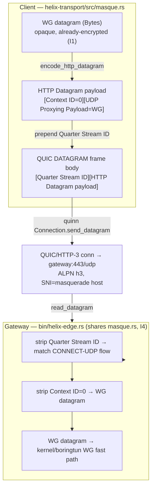
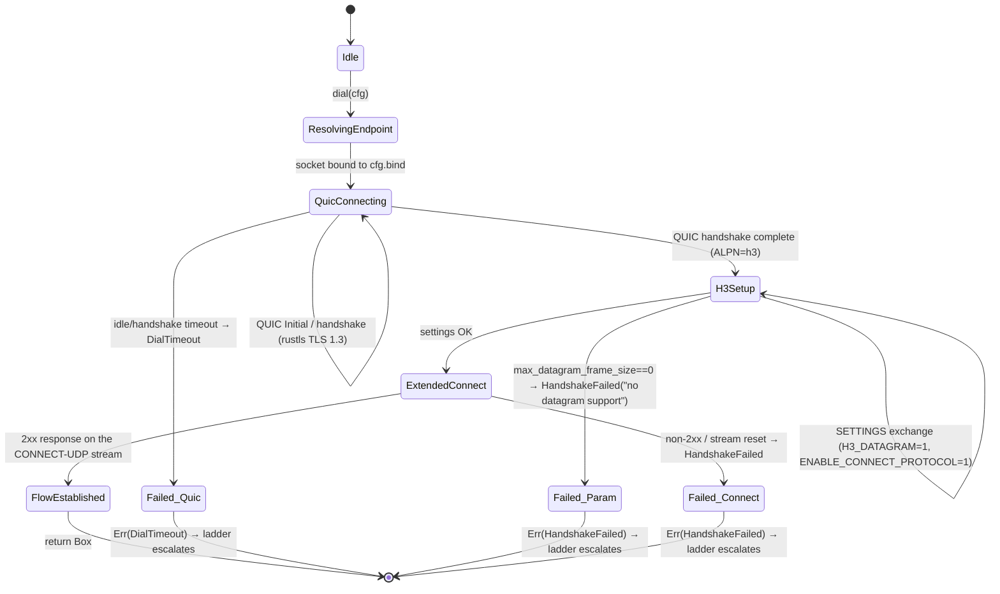
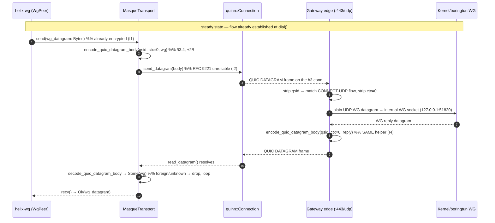
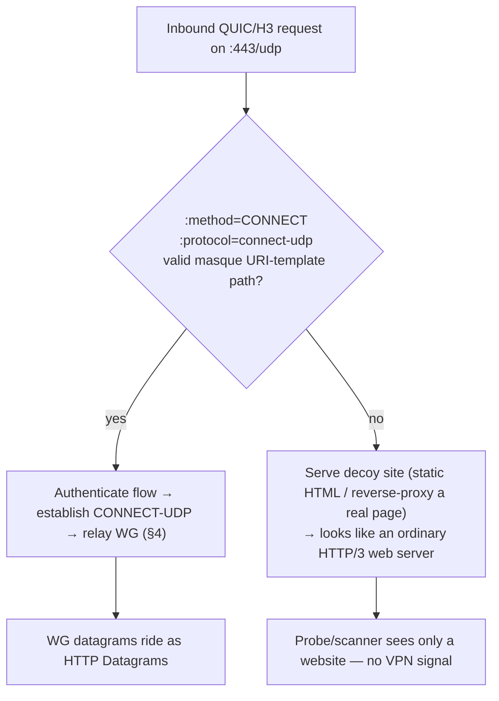

# MASQUE / QUIC Transport

**Revision:** 2
**Last modified:** 2026-07-04T12:00:00Z

> **Rev 2 (enterprise-hardening pass, 2026-07-04):** added §6.4 QUIC anti-amplification
> limit (RFC 9000 §8.1) as an explicit DDoS-resilience mechanism for the gateway edge —
> a gap identified against the parent task's enterprise-hardening checklist (rate-limiting
> / DDoS resilience at the Connector/Gateway roles). No other section changed; all prior
> content (§0–§10) stands.

> Master technical specification — Volume 2 (Data Plane), nano-detail document
> deepening the **MASQUE / QUIC Transport** section of [`01-data-plane.md`](../01-data-plane.md) §3.3.
> Scope: the `masque-h3` implementation of the `Transport` trait — WireGuard datagram
> → HTTP Datagram (RFC 9297) → QUIC DATAGRAM frame (RFC 9221) → HTTP/3 CONNECT-UDP
> (RFC 9298) to `:443/udp`, the hand-rolled CONNECT-UDP framing on `quinn` + `h3`,
> SNI masquerade, browser-HTTP/3 indistinguishability, MTU 1280, and the edge
> termination side. This is a **SPEC** — it describes what to build; it does not
> contain the shipping product. Source evidence cited inline by id:
> `[01-DP §N]` = [`01-data-plane.md`](../01-data-plane.md); `[research-masque §N]`
> = the MASQUE research note; `[04_ARCH §N]` / `[04_P0 §N]` = the refined
> architecture / Phase-0 spike; `[SYNTHESIS §N]` = the cross-document synthesis;
> `[RFC NNNN]` = the cited IETF RFC (all RFC facts are sourced through
> `[research-masque §1]` unless otherwise noted). Facts not grounded in the
> evidence base are marked `UNVERIFIED` per constitution §11.4.6.

---

## 0. Position, invariants, and what this document owns

`masque-h3` is **one** `Transport` impl among N; it is the headline obfuscating
carrier and **Mullvad's actual mechanism** — *Mullvad's "QUIC mode" is not a
separate protocol, it is WireGuard tunnelled over MASQUE/HTTP-3*
[01-DP §0, §3.3; 04_ARCH §0, §22; research-masque §2]. This document owns the
`crates/helix-transport/src/masque.rs` module and its edge-side termination in
`bin/helix-edge.rs`; it does **not** re-specify the `Transport` trait
(owned by [01-DP §3.1]), the WG crypto core (`helix-wg`, [01-DP §4]), the ladder
(`helix-core/src/ladder.rs`, [01-DP §5.3]), or `connect-ip` (RFC 9484, a distinct
datapath, [01-DP §3.4]).

### 0.1 Inherited invariants this module must not break

| # | Invariant | Source | How `masque-h3` upholds it |
|---|---|---|---|
| I1 | Transport **never sees plaintext** — carries only already-encrypted WG datagrams. | [01-DP I1] | The HTTP Datagram payload is the opaque WG datagram byte-for-byte (§3); `masque.rs` never parses it. |
| I2 | Transport carries **unreliable datagrams**, never an ordered byte stream. | [01-DP I2] | WG datagrams ride **QUIC DATAGRAM frames (RFC 9221)**, *not* a QUIC stream — preserving WG loss semantics, avoiding head-of-line blocking [01-DP §3.1; 04_P0 §4.2, §5.1; research-masque §1]. |
| I4 | **One transport crate, three consumers** — the client obfuscation code is the edge de-obfuscation code. | [01-DP I4] | `masque.rs` framing functions (`encode_http_datagram`/`decode_http_datagram`) are shared byte-for-byte by client and `helix-edge` (Decision D5 = Rust edge) [01-DP §11.2; SYNTHESIS §3 D5]. |
| I5 | **No-logging by construction** — only aggregate counters. | [01-DP I5] | The module exports only `TransportHealth` EWMA counters; no per-packet/per-flow durable state (§7). |

### 0.2 Maturity caveat (load-bearing, governs the whole module)

**There is NO turnkey Rust crate that gives RFC 9298 CONNECT-UDP client+proxy out
of the box. You hand-roll it on top of `quinn` + `h3`. This is exactly what
Mullvad did** [research-masque §3, §5]. Concretely the module implements, by hand:
(a) the Extended-CONNECT request/response (RFC 9220 `:protocol` bootstrap),
(b) the Quarter-Stream-ID + context-id HTTP-Datagram mux (RFC 9297/9298),
(c) the proxy UDP-socket relay (edge side) [research-masque §3]. Strong evidence
this is the trodden path: Mullvad's `mullvad-daemon` depends on `quinn`/`quinn_udp`
[research-masque §2]. This immaturity-vs-Go (`masque-go` is turnkey) is itself the
input to Decision D5/G4 [01-DP §11.2; 04_P0 §7; research-masque §4]. The documented
G2 unblock if Rust proves painful: prototype MASQUE first in Go to pass G2, then
port [01-DP §3.8; 04_P0 §13].

---

## 1. The RFC stack (the standardised building blocks)

WG-over-MASQUE is a layering of four published IETF **Proposed Standards** (stable,
not drafts) [research-masque §1]:

| RFC | Role | What `masque-h3` uses from it |
|---|---|---|
| **RFC 9298** — Proxying UDP in HTTP (CONNECT-UDP) | MASQUE control plane. Extended-CONNECT (`:protocol = connect-udp`) to a URI template, proxy opens a UDP socket to the target and relays. | The one-time flow-setup request at `dial()` (§2); the URI template (§4.2). |
| **RFC 9297** — HTTP Datagrams & the Capsule Protocol | The `HTTP Datagram` abstraction + **Quarter Stream ID** multiplexing tying each datagram to its request stream. Over HTTP/3 they ride the QUIC DATAGRAM frame. | The per-WG-datagram framing (§3). |
| **RFC 9221** — QUIC DATAGRAM frame extension | Unreliable, un-retransmitted datagram frame inside a QUIC connection. Negotiated via the `max_datagram_frame_size` transport parameter. | The data-plane carrier (`send_datagram`/`read_datagram`), upholding I2. |
| **RFC 9220** — Bootstrapping WebSockets / Extended CONNECT over HTTP/3 | Adds the `:protocol` pseudo-header that CONNECT-UDP requires over HTTP/3. | The Extended-CONNECT handshake (§2.3). |

Distinct sibling (out of scope here): **RFC 9484 — Proxying IP in HTTP
(CONNECT-IP)** — proxies IP packets, not UDP; *not* what Mullvad uses; specified
separately in [01-DP §3.4] [research-masque §1].

**The canonical data-plane flow** [01-DP §3.3; 04_P0 §5.1; research-masque §1]:

```
client WG datagram (Bytes, already-encrypted, opaque — I1)
  └▶ HTTP Datagram  (RFC 9297, context-id = 0 for the proxied UDP payload)
       └▶ QUIC DATAGRAM frame (RFC 9221, unreliable — matches WG semantics, I2)
            └▶ QUIC / HTTP-3 connection to https://gateway:443  (looks like web)
                 └▶ EDGE: extract HTTP Datagram → WG datagram → kernel WG fast path
```



---

## 2. `dial()` — connection bring-up state machine

`dial(TransportConfig::MasqueH3 { url, sni, bind, congestion })` returns a live
`Box<dyn Transport>` within a bounded timeout, or a `TransportError` that the
ladder maps to escalation [01-DP §3.1, §5.3]. The CONNECT-UDP request establishes
the proxied UDP **flow once at `dial()`**; thereafter WG datagrams ride as HTTP
Datagrams with **no per-packet HTTP round trip** [01-DP §3.3; 04_P0 §5.1;
research-masque §1].

### 2.1 The bring-up state machine



### 2.2 Bring-up step contract (each step is a hard gate, no guessing — §11.4.6)

| Step | Action | Success signal | Failure → `TransportError` |
|---|---|---|---|
| 1. Resolve + bind | Parse `url` → `SocketAddr` (gateway `:443/udp`); bind a `quinn::Endpoint` to `cfg.bind`. | socket bound | `Io` → caller treats as `DialTimeout` |
| 2. QUIC connect | `endpoint.connect_with(client_cfg, addr, &sni)?.await` — rustls TLS 1.3, **ALPN = `h3`**, **SNI = `cfg.sni`** (the masquerade host, §5). | QUIC handshake complete | `DialTimeout` (idle/handshake timeout); `EndpointBlocked` if QUIC Initial is dropped repeatedly (DPI) |
| 3. Datagram param check | Verify peer advertised `max_datagram_frame_size > 0` (RFC 9221 transport parameter) so I2 is honourable. | param present, ≥ 1252 (§3.4) | `HandshakeFailed("peer rejects QUIC datagrams")` |
| 4. H3 SETTINGS | Open the H3 control stream; require `SETTINGS_H3_DATAGRAM=1` (RFC 9297) **and** `SETTINGS_ENABLE_CONNECT_PROTOCOL=1` (RFC 9220) from the server. | both settings = 1 | `HandshakeFailed("server lacks H3 datagram / extended-connect")` |
| 5. Extended CONNECT | Send the CONNECT-UDP request stream (§2.3); record its **Quarter Stream ID** (= stream-id ÷ 4, §3.2). | 2xx response received | `HandshakeFailed(status)`; stream RESET → `HandshakeFailed("connect-udp reset")` |
| 6. Establish flow | Bind `flow_ctx = 0` (context-id of the proxied UDP payload) + `qstream_id`; spawn the recv pump. | `MasqueTransport` constructed | — |

> **Honest gap (§11.4.6).** The numeric `H3_DATAGRAM` / `ENABLE_CONNECT_PROTOCOL`
> SETTINGS identifier code-points and the exact `quinn`/`h3` API surface that
> exposes them are **`UNVERIFIED`** against this evidence base — `h3-datagram`
> is pre-1.0 (`v0.0.2`, "API subject to change") and Extended CONNECT is a
> separate modular `h3` feature [research-masque §3]; the implementer MUST
> pin them against the then-current `h3`/`h3-datagram`/RFC 9297/9220 text and
> capture the negotiated values as evidence (§8), never assume them.

### 2.3 The CONNECT-UDP request line (RFC 9298 over HTTP/3)

The Extended-CONNECT request issued in step 5 [research-masque §1]:

```
:method   = CONNECT
:protocol = connect-udp                         (RFC 9220 Extended CONNECT)
:scheme   = https
:authority= <gateway host:443>                  (matches cfg.sni masquerade host, §5)
:path     = /.well-known/masque/udp/<target_host>/<target_port>/
            └─ default-template-vars resolve to the gateway's INTERNAL WG socket
capsule-protocol = ?1                            (RFC 9297, Capsule Protocol enabled)
```

`<target_host>/<target_port>` resolve to the gateway's **internal** WireGuard
endpoint (e.g. `127.0.0.1/51820`) — the proxy opens a UDP socket there and relays
[01-DP §3.3; 04_P0 §5.1; research-masque §1]. The client never sees that internal
address; it is the URI-template target the edge fixes (§4.2).

> The `.well-known/masque/udp/{target_host}/{target_port}/` template shape is the
> RFC 9298 canonical default [research-masque §1]. HelixVPN **pins the template at
> the edge** (§4.2) so the client sends a fixed `:path`; the exact pinned literal
> is a §11.4.35 project-instantiation value, recorded in the edge config, not
> guessed here.

---

## 3. Wire format — the per-datagram framing (the hand-rolled core)

This is the byte-level contract the implementer hand-rolls (the maturity caveat,
§0.2). Two nested framings sit between the WG datagram and `quinn`'s
`send_datagram(Bytes)`.

### 3.1 QUIC variable-length integer (the encoding primitive)

All length/id fields below are **QUIC varints** (RFC 9000 §16 — the QUIC base over
which RFC 9221/9297 are defined). The 2 most-significant bits of the first byte
select length: `00`→1 byte (6-bit value, 0–63), `01`→2 bytes (14-bit, 0–16383),
`10`→4 bytes (30-bit), `11`→8 bytes (62-bit).

> The varint encoding is RFC-9000-standard QUIC and is **`UNVERIFIED` against this
> evidence base** (the cited research notes do not reproduce RFC 9000 §16); it is
> stated as the well-known QUIC primitive the implementer pins against RFC 9000.
> For HelixVPN's identifiers (`flow_ctx = 0`, small `qstream_id`) the common case
> is the **1-byte** form.

### 3.2 Layer A — HTTP Datagram payload (RFC 9297 + RFC 9298 context)

The **HTTP Datagram Payload** carried for a CONNECT-UDP flow is
(RFC 9297 + RFC 9298 [research-masque §1]):

```
HTTP Datagram Payload (CONNECT-UDP / RFC 9298) {
    Context ID            (QUIC varint)   ; = 0  → the proxied UDP payload itself
    UDP Proxying Payload  (bytes)         ; = the opaque WireGuard datagram (I1)
}
```

- `Context ID = 0` is the registered "UDP packet payload" context for CONNECT-UDP
  [01-DP §3.3; 04_P0 §5.1; research-masque §1]. As a 1-byte varint it is the single
  byte `0x00`.
- The UDP Proxying Payload is the WG datagram **verbatim** — `masque.rs` does not
  inspect it (I1).

So `encode_http_datagram(0, wg)` ⇒ `0x00 || wg` (1 prefix byte for the common
ctx-0 case). `decode_http_datagram` reads the leading varint context-id; a non-zero
context-id is an **unknown context** and the datagram MUST be dropped silently per
RFC 9297 (a future extension context), not surfaced as an error (§6 E-CTX).

### 3.3 Layer B — QUIC DATAGRAM frame body (RFC 9221 + RFC 9297 mux)

Over HTTP/3, an HTTP Datagram rides one QUIC DATAGRAM frame; the frame body is
(RFC 9297 §2.1 [research-masque §1]):

```
QUIC DATAGRAM frame body {
    Quarter Stream ID   (QUIC varint)   ; = (CONNECT-UDP request stream-id) / 4
    HTTP Datagram Payload (bytes)        ; = Layer A above
}
```

- **Quarter Stream ID** ties the datagram to its CONNECT-UDP request stream
  (RFC 9297 multiplexing) [research-masque §1, §3]. The client's first
  client-initiated bidirectional stream is stream-id 0 → Quarter Stream ID 0
  (1-byte varint `0x00`); HelixVPN runs exactly one CONNECT-UDP flow per QUIC
  connection, so `qstream_id` is fixed for the connection's life.
- `quinn` prepends the QUIC DATAGRAM **frame type** + handles the QUIC framing; the
  module supplies only this frame **body** to `Connection::send_datagram(Bytes)`
  [04_P0 §5.2; research-masque §3].

### 3.4 Full on-the-wire byte layout (common case: ctx 0, qstream 0)

```
quinn-supplied:  [ DATAGRAM frame type (0x30/0x31) ]   ← quinn writes this
module-supplied body:
  byte 0:        Quarter Stream ID varint   = 0x00      ← Layer B
  byte 1:        Context ID varint          = 0x00      ← Layer A
  bytes 2..n:    WireGuard datagram (opaque, already-encrypted)   ← I1
```

**Per-datagram framing overhead in the common case = 2 bytes** (Quarter Stream ID
+ Context ID), atop QUIC/UDP/IP headers. This 2-byte module overhead, plus QUIC
short-header + AEAD tag + UDP + IP, is what drives `effective_mtu()` to **1280**
(§3.5). The QUIC DATAGRAM frame-type byte values `0x30`/`0x31` are RFC 9221 and are
`UNVERIFIED` against this evidence base — pinned by `quinn`, captured in §8 wire
evidence, never assumed.

### 3.5 `effective_mtu()` = 1280

`masque-h3` reports **1280** [01-DP §3.3, §10; 04_P0 §5.2]:

- **1280 is the IPv6 minimum-MTU floor** — the largest value guaranteed deliverable
  on any IPv6 path without fragmentation [01-DP §10].
- QUIC + HTTP-Datagram + UDP-proxy overhead "eats headroom"; 1280 is the **measure
  & tune** floor, not a computed exactness [01-DP §3.3, §10; 04_P0 §5.2]. The exact
  MTU penalty is **quantified in Phase 0** (record MTU/throughput/CPU vs plain-udp)
  so the ladder's cost model is real [01-DP §10; 04_P0 §5.3, §8].
- The orchestrator sets inner WG MTU = `min(masque.effective_mtu()=1280,
  path-MTU-discovered)` [01-DP §10]. A WG datagram exceeding the budget after
  framing is a hard `TransportError::Oversize` — never silent truncation [01-DP §10].
- Relation to the RFC 9221 `max_datagram_frame_size` step-3 floor (≥ 1252): 1252 =
  1280 IPv6 floor − 28 (typical IPv6+UDP minimal headroom) is a derived sanity
  floor for "can a ≥1280-inner datagram ever fit"; the precise constant is
  `UNVERIFIED` and MUST be measured (§8), not assumed.

---

## 4. Steady-state datapath (`send` / `recv`)

Once `FlowEstablished`, the module is a pure datagram relay — no HTTP round trips
[01-DP §3.3; 04_P0 §5.1].

### 4.1 The `Transport` impl (signatures + framing wiring)

```rust
// crates/helix-transport/src/masque.rs
use async_trait::async_trait;
use bytes::{Bytes, BytesMut, BufMut, Buf};
use crate::{Transport, TransportError, TransportHealth, HealthCell};

pub struct MasqueTransport {
    conn: quinn::Connection,   // established QUIC/H3 connection to gw:443 (ALPN h3)
    qstream_id: u64,           // Quarter Stream ID of the CONNECT-UDP request stream (§3.3)
    flow_ctx: u64,             // CONNECT-UDP context-id (= 0) established at dial() (§3.2)
    health: HealthCell,        // RTT EWMA + last-recv age + send-error counters (I5, §7)
}

#[async_trait]
impl Transport for MasqueTransport {
    async fn send(&self, wg: Bytes) -> Result<(), TransportError> {
        let body = encode_quic_datagram_body(self.qstream_id, self.flow_ctx, &wg)?; // §3.3+§3.2
        self.conn
            .send_datagram(body)                                  // RFC 9221 unreliable (I2)
            .map_err(map_send_err)?;                              // §6 error mapping
        self.health.mark_send_ok();
        Ok(())
    }

    async fn recv(&self) -> Result<Bytes, TransportError> {
        loop {
            let dg = self.conn.read_datagram().await.map_err(map_recv_err)?;
            match decode_quic_datagram_body(self.qstream_id, self.flow_ctx, dg) {
                Ok(Some(wg)) => { self.health.mark_recv(); return Ok(wg); }
                Ok(None)      => continue, // foreign qstream / unknown ctx → drop, keep reading (§6)
                Err(e)        => return Err(e),
            }
        }
    }

    fn kind(&self) -> &'static str { "masque-h3" }
    fn effective_mtu(&self) -> u16 { 1280 }                       // §3.5
    fn health(&self) -> TransportHealth { self.health.snapshot() }
    async fn close(&self) -> Result<(), TransportError> {
        self.conn.close(0u32.into(), b"bye");                     // QUIC CONNECTION_CLOSE
        Ok(())                                                    // idempotent
    }
}
```

### 4.2 The framing helpers (the I4-shared byte contract)

```rust
/// Encode one outbound WG datagram into a QUIC DATAGRAM frame BODY.
/// Layout (§3.4): [Quarter Stream ID varint][Context ID varint][WG bytes].
/// Shared byte-for-byte with the edge decode path (I4).
fn encode_quic_datagram_body(qsid: u64, ctx: u64, wg: &[u8]) -> Result<Bytes, TransportError> {
    let need = varint_len(qsid) + varint_len(ctx) + wg.len();
    // Enforce the transport budget BEFORE handing to quinn (§3.5, §6 Oversize).
    if need > MASQUE_MAX_DATAGRAM_BODY { return Err(TransportError::Oversize(need)); }
    let mut b = BytesMut::with_capacity(need);
    put_varint(&mut b, qsid);     // Layer B (§3.3)
    put_varint(&mut b, ctx);      // Layer A context-id (§3.2)
    b.put_slice(wg);              // opaque WG datagram (I1)
    Ok(b.freeze())
}

/// Decode one inbound QUIC DATAGRAM frame body back to a WG datagram.
/// Returns Ok(None) for a datagram that is NOT our flow (foreign Quarter Stream ID
/// or unknown context-id) — RFC 9297 says drop silently, keep the connection (§6).
fn decode_quic_datagram_body(exp_qsid: u64, exp_ctx: u64, mut dg: Bytes)
    -> Result<Option<Bytes>, TransportError>
{
    let qsid = get_varint(&mut dg).ok_or(TransportError::Quic("trunc qsid".into()))?;
    if qsid != exp_qsid { return Ok(None); }            // not our CONNECT-UDP flow → drop
    let ctx  = get_varint(&mut dg).ok_or(TransportError::Quic("trunc ctx".into()))?;
    if ctx != exp_ctx   { return Ok(None); }            // unknown context (future ext) → drop
    Ok(Some(dg))                                        // remainder = WG datagram, verbatim
}

// QUIC varint primitives (RFC 9000 §16, §3.1). `UNVERIFIED` exactness — pin to RFC 9000.
fn varint_len(v: u64) -> usize { if v < 64 {1} else if v < 16384 {2} else if v < 1<<30 {4} else {8} }
fn put_varint(b: &mut BytesMut, v: u64) { /* 2-MSB length tag + big-endian value */ }
fn get_varint(b: &mut Bytes) -> Option<u64> { /* read tag, then 1/2/4/8 bytes */ }

/// Largest module-supplied DATAGRAM body that fits the negotiated QUIC datagram
/// limit; derived from the peer's max_datagram_frame_size (step 3) MINUS quinn's
/// own frame-type byte. Computed at dial(), never hardcoded (§3.5).
const MASQUE_MAX_DATAGRAM_BODY: usize = /* set from negotiated max_datagram_frame_size */ 1300;
```

### 4.3 Send / recv sequence



---

## 5. SNI masquerade & browser-HTTP/3 indistinguishability

### 5.1 What is actually claimed (and what is not — §11.4.6 honest boundary)

The **public, documented** DPI-resistance mechanism is **collateral-damage
deterrence**: the flow is HTTP/3 on QUIC/UDP 443; blocking it risks breaking the
open web (Google, YouTube, Cloudflare all run HTTP/3), so censors face a high
false-positive cost [research-masque §2; 04_ARCH §3.3]. To a passive observer the
flow is **indistinguishable from a browser doing HTTP/3** to a web server
[01-DP §3.3; 04_P0 §5.3].

**What is NOT publicly documented by Mullvad, and therefore an OPEN design problem,
not a solved checkbox** [research-masque §2, §5]: the exact TLS/QUIC ClientHello
fingerprint matching (uTLS-style), the SNI value used, the ALPN set ordering,
domain-fronting, and how closely the QUIC Initial mimics Chrome/Firefox. **A serious
parity effort MUST treat QUIC/TLS fingerprint mimicry as an explicit research/risk
item, never claim it is done.** This module therefore specifies the *seams* for
fingerprint control and marks the fingerprint policy itself `UNVERIFIED` /
research-tracked.

### 5.2 SNI + ALPN config seam

```rust
// TransportConfig::MasqueH3 carries the fingerprint-relevant knobs:
//   url        : "https://<gateway-host>:443"   — the dialled endpoint
//   sni        : "<masquerade host>"            — TLS SNI sent in the QUIC Initial (§5.3)
//   congestion : Cubic | Bbr                    — CC profile (§6.3, lossy-mobile knob)
```

- **SNI = the masquerade host**, set to a believable web hostname; the edge's
  certificate MUST be valid for it (§5.4) so the TLS handshake completes cleanly and
  the flow "looks like web" [01-DP §3.3; 04_P0 §5.3].
- **ALPN MUST be exactly `h3`** (and only `h3`) — a non-`h3` ALPN, or an extra
  protocol, is a fingerprint deviation from real browser HTTP/3 (§5.5).
- The Phase-0 `tshark`/`tls SNI` capture (G2) verifies SNI matches the masquerade
  host and the flow classifies as HTTP/3 with **no WG signature** [01-DP §3.3, §12.1;
  04_P0 §5.3, §8].

### 5.3 The QUIC/TLS fingerprint surface (research-tracked, `UNVERIFIED`)

The following are the parameters a uTLS-equivalent would have to mimic for a real
browser. HelixVPN exposes them as a future `FingerprintProfile` config object;
their **target values are `UNVERIFIED` and an open research item** [research-masque
§2, §5] — the spec mandates the *seam*, not specific values:

| Surface | Why it matters | Status |
|---|---|---|
| TLS ClientHello cipher/extension order | uTLS-style mimicry of Chrome/Firefox | `UNVERIFIED` — research item; Mullvad does not publish |
| QUIC transport parameters (incl. `max_datagram_frame_size`, idle timeout, flow-control windows) | a non-browser-like set is a fingerprint | seam: derive from a captured browser profile; values `UNVERIFIED` |
| ALPN | must be `h3` only | specified (§5.2) |
| SNI value | must be a plausible web host | specified (§5.2), value is §11.4.35 project config |
| QUIC version / Initial packet shape | Chrome/Firefox-like Initial | `UNVERIFIED` — research item |

### 5.4 Edge masquerade (decoy site for non-CONNECT-UDP traffic)

The edge `:443` listener serves a **believable decoy site** to anything that is
*not* a valid CONNECT-UDP flow (probes, scanners) — native edge behaviour replacing
the original doc's Nginx-camouflage idea [01-DP §3.3; 04_P0 §5.4; 04_ARCH §3.3].
Phase 0 ships a static "it's just a website" page behind the same QUIC listener
[04_P0 §5.4]. Classification rule (§4 edge side):



### 5.5 Indistinguishability acceptance (the G2 wire-fingerprint gate)

`tshark` capture of the `masque-h3` flow MUST classify it as **HTTP/3 with no WG
signature**, with SNI matching the masquerade host, while plain WG/UDP is
`nft`-blocked [01-DP §3.3, §12.1; 04_P0 §5.3, §8]. This is the G2 / S3 gate and the
`SEC`-DPI test point (§8).

---

## 6. Error taxonomy, edge cases, and ladder mapping

The module maps every failure onto the shared `TransportError` enum [01-DP §3.1]; the
ladder consumes `DialTimeout` / `HandshakeFailed` / `EndpointBlocked` as escalation
triggers and `Closed` as a reconnect trigger [01-DP §5.3].

### 6.1 Error mapping table

| Condition (masque-h3) | `TransportError` | Ladder effect [01-DP §5.3] |
|---|---|---|
| QUIC handshake idle/timeout at `dial()` | `DialTimeout` | escalate to next rung |
| QUIC Initial repeatedly dropped (DPI on :443) | `EndpointBlocked` | escalate; note region telemetry (I5, aggregate) |
| peer `max_datagram_frame_size == 0` (step 3) | `HandshakeFailed("no datagram support")` | escalate |
| missing H3 settings (step 4) | `HandshakeFailed("no h3-datagram / extended-connect")` | escalate |
| CONNECT-UDP non-2xx / stream RESET (step 5) | `HandshakeFailed(status)` | escalate |
| `send_datagram` over budget | `Oversize(n)` | orchestrator lowers inner WG MTU or fragments at L3 [01-DP §10] |
| `send_datagram` transient (datagram queue full / blocked) | `Quic(msg)` | counted in `health.send_errors`; caller retries/keeps state |
| QUIC `CONNECTION_CLOSE` / path lost mid-session | `Closed` | orchestrator → `Reconnecting`, re-`dial()` (per-network memory may re-pin masque-h3) |
| `read_datagram` foreign Quarter Stream ID | (none) → drop, keep reading | no effect — RFC 9297 silent drop (§4.2) |
| `read_datagram` unknown context-id (≠ 0) | (none) → drop, keep reading | no effect — future-extension context (§3.2) |

### 6.2 Edge cases (each is a test point, §8)

- **E-CTX — unknown context-id:** an inbound HTTP Datagram with context-id ≠ 0 is a
  registered-future-extension payload; **drop silently, do not error, do not close**
  the connection (RFC 9297) [research-masque §1]. (Test: `UNIT` framing.)
- **E-QSID — foreign Quarter Stream ID:** datagram for a different stream/flow on the
  same QUIC connection; drop silently and continue the `recv` loop (§4.1). HelixVPN
  runs one flow per connection, so this is normally adversarial/spurious. (Test: `UNIT`.)
- **E-TRUNC — truncated framing:** a datagram too short to hold the qsid/ctx varints
  → `Quic("trunc …")` and the orchestrator treats it as a single lost datagram (I2 —
  WG tolerates loss), **not** a connection kill. (Test: `UNIT` + `CHAOS`.)
- **E-OVERSIZE — datagram > budget:** enforced *before* `quinn` (§4.2) → `Oversize`;
  orchestrator lowers inner MTU rather than silently truncating [01-DP §10].
  (Test: `UNIT` + `BENCH` MTU sweep.)
- **E-0RTT — early data:** 0-RTT QUIC resumption is **disabled by default** for the
  obfuscation path (a 0-RTT Initial is a distinguishable fingerprint and risks
  replay); seam exists to enable per `FingerprintProfile` once §5.3 is settled.
  Status `UNVERIFIED` — research-tracked. (Test: `SEC`-DPI.)
- **E-RECONNECT — roaming / NAT-rebind:** QUIC connection migration may carry the
  flow across a client IP change; if migration fails the module surfaces `Closed`
  and the ladder re-dials, with WG's own roaming latching onto the new path
  [01-DP §8]. (Test: `CHAOS` iface-flap.)
- **E-DRAIN — `close()` idempotency:** `close()` calls `conn.close()` once; a second
  call is a no-op (`Ok(())`) (§4.1). (Test: `UNIT`.)

### 6.3 Congestion-control knob

`congestion: Cubic | Bbr` selects the `quinn` congestion controller [01-DP §3.1, §3.3]:
**`Cubic` default**; **`Bbr` for lossy mobile** networks (the Hysteria "Brutal"
lineage / `quinn` window-ratio tuning is the reference) [01-DP §3.3, §11_arch tuning
note]. Loss resilience is the reason mobile got this feature: under `netem loss 5%`,
`masque-h3` MUST sustain higher goodput than the UDP-over-TCP strawman
[01-DP §3.3, §12.1; 04_P0 §5.3, §8].

### 6.4 Edge DDoS resilience — the QUIC anti-amplification limit (enterprise hardening)

**Gap closed (2026-07-04):** the edge's `:443/udp` listener is a public, unauthenticated
QUIC endpoint before a client completes address validation — exactly the shape of a
reflection/amplification vector (a spoofed-source client sends a small QUIC Initial,
the server replies with a larger Handshake/response to the *spoofed* victim address).
QUIC (RFC 9000 §8.1) closes this by construction, and `helix-edge` MUST enforce it, not
merely inherit it silently from `quinn`:

- **The 3× rule.** Until the client's address is validated (by successfully processing
  an Initial packet whose UDP datagram was padded to ≥ 1200 bytes, or by returning a
  Retry token the client echoes back), the server **MUST NOT send more than three times
  the number of bytes received** from that (as-yet-unvalidated) address. `quinn`
  implements this limit internally; `helix-edge` MUST NOT bypass or relax it via any
  transport-config knob, and the Phase-0 G4/G2 benchmark harness MUST capture the
  enforced ratio (bytes-sent : bytes-received per unvalidated 4-tuple) as evidence, not
  assume `quinn`'s default is wired in correctly.
- **Retry tokens under load.** When the edge's concurrent-unvalidated-handshake count
  crosses an operator-tunable threshold (`masque_retry_threshold`, default: an
  evidence-calibrated value from the Phase-0 rig, `UNVERIFIED` until measured), the edge
  SHOULD start issuing QUIC Retry packets (stateless, HMAC-tagged token, no
  per-source-IP state held) before accepting the CONNECT-UDP flow — the standard QUIC
  answer to a handshake flood, symmetric to WireGuard's own MAC1/cookie-reply defence
  (`helix-wg` §14.3, [`wireguard-core.md`](wireguard-core.md)). This composes with, and
  does not replace, connection-ID-based routing/load-balancing at the edge.
- **Amplification-factor test point.** A new `LOAD`/`SEC` test point (feeds §8 table):
  send an Initial from a spoofed/unvalidated source, assert the edge's *response* byte
  count never exceeds 3× the request byte count before validation, captured via a pcap
  byte-count ratio — never a config-only assertion that "quinn handles it."
- **Composition with the edge decoy (§5.4).** A non-CONNECT-UDP probe that never
  completes address validation is bounded by the same 3× ceiling regardless of whether
  it is ultimately routed to the decoy site or the CONNECT-UDP handler — the
  anti-amplification limit is a QUIC-transport-layer property, applied before HTTP/3
  request routing even begins.

This closes a concrete DDoS-resilience gap: without an explicit test asserting the 3×
ratio, "quinn handles amplification" is an unverified assumption, not a proven property
of `helix-edge`'s configuration (§11.4.6 no-guessing). Cross-references: the
Connector/Gateway-role rate-limiting design lives in
[`v06-deploy/ha-and-multiregion.md`](../v06-deploy/ha-and-multiregion.md) and
[`v06-deploy/kubernetes.md`](../v06-deploy/kubernetes.md) (edge ingress hardening);
this subsection is the transport-layer half of that story.

---

## 7. Performance budget & no-logging counters

### 7.1 The acknowledged tax (anti-bluff — do NOT claim parity speed)

`masque-h3` wraps the WG tunnel in a QUIC tunnel; this is **computationally
expensive and reduces throughput** — the **double-encryption + double-congestion-
control tax** (WG crypto inside QUIC crypto = two AEAD layers; QUIC CC over UDP atop
WG's own pacing) [research-masque §2, §5]. Mullvad explicitly acknowledges this and
advises "use only when needed" [research-masque §2]. The spec **MUST require captured
throughput evidence WG-direct vs WG-over-MASQUE and MUST NOT claim parity speed**
[research-masque §5; 01-DP §10].

### 7.2 Quantified budget (Phase-0 gates, captured not assumed)

| Metric | masque-h3 target | Source |
|---|---|---|
| Through-tunnel throughput | **≥ 50% of plain-UDP** | [04_P0 §8; SYNTHESIS §4 G2] |
| Added latency (p50/p99) | **< 15 ms added** vs bare | [04_P0 §8] |
| Handshake time (connect→first-data) | **< 2 s** | [04_P0 §8] |
| Loss resilience @ `netem loss 5%` | **goodput > UoT strawman** | [01-DP §3.3; 04_P0 §5.3, §8] |
| MTU | **1280** (penalty quantified vs plain-udp) | [01-DP §3.5, §10; 04_P0 §5.2] |
| Wire fingerprint | **HTTP/3, no WG signature** (`tshark`) | [01-DP §12.1; 04_P0 §8] |

> The plain-udp baseline these are measured against is **≥ 80% of bare link** (the
> G1 gate) [01-DP §3.2; 04_P0 §8]. So masque-h3's floor is ≥ 50% of (≥ 80% of bare).

### 7.3 No-logging counters (I5)

The module exports **only** the aggregate `TransportHealth` snapshot — `rtt_ewma_ms`,
`last_recv_age_ms`, `send_errors` [01-DP §3.1, I5] — plus optional aggregate
escalation telemetry ("transport masque-h3 succeeded after N escalations in region
R") with **no per-connection/per-packet durable state** [01-DP §5.3 step 6, I5].
No SNI, no flow-id, no peer address is logged durably.

---

## 8. Test points (tie to §11.4.169 test types)

Every claim ships captured evidence, not config-only PASS (§11.4.5/.69/.107;
[01-DP §12.1]). Test-type abbreviations are the canonical taxonomy of
[`10-testing-acceptance-and-qa.md` §2].

| Test point | §11.4.169 type | What it proves | Captured evidence |
|---|---|---|---|
| Framing round-trip — `encode_quic_datagram_body`∘`decode` = identity for ctx 0, qsid 0 (§3.4) | `UNIT` | byte-exact framing; mocks allowed only here (§11.4.27) | `cargo test` vectors + golden hex fixtures |
| E-CTX / E-QSID / E-TRUNC silent-drop (§6.2) | `UNIT` | unknown-context / foreign-stream / truncated datagram dropped, connection survives | assertion log |
| `effective_mtu()=1280` enforced; E-OVERSIZE before quinn (§4.2) | `UNIT` + `BENCH` | budget enforced, no silent truncation | MTU-sweep CSV |
| Slice works with **plain WG/UDP `nft`-blocked** (S3/G2) | `E2E` + `FA` | real censorship evasion, not "QUIC also works" | netns rig run log [04_P0 §3]; `-count=3` re-runnable (§11.4.98) |
| Flow classifies as **HTTP/3, no WG signature**, SNI = masquerade host (§5.5) | `SEC` (DPI) | browser-HTTP/3 indistinguishability (public layer) | `tshark`/pcap capture [01-DP §12.1; 04_P0 §8] |
| QUIC/TLS fingerprint mimicry (§5.3) | `SEC` (DPI) | **research-tracked `UNVERIFIED` gap** — not a PASS until §5.3 settled; tracked item, honest SKIP-with-reason (§11.4.3) | risk-item ticket + capture diff vs browser profile |
| Anti-amplification enforcement (§6.4): unvalidated-source response bytes ≤ 3× request bytes | `SEC` + `LOAD` | edge does not amplify toward a spoofed victim (RFC 9000 §8.1) | pcap byte-count ratio per unvalidated 4-tuple |
| Throughput WG-direct vs WG-over-MASQUE; CPU-per-Gbps; handshake/sec (§7) | `BENCH` + `PERF` | quantified tax — **no parity claim** (§7.1) | `bench.sh` CSV [04_P0 §8] |
| Loss resilience @ `netem loss 5%` beats UoT (§6.3, §7.2) | `BENCH` + `STRESS` | QUIC loss recovery (the mobile rationale) | goodput comparison [04_P0 §5.3] |
| Sustained ≥30 s / ≥100-iter framing under load; ≥10 parallel conns | `STRESS` | no leak, no deadlock in the recv pump | `stress_chaos.sh` `ab_stress_*` (§11.4.85) |
| Mid-flight QUIC `CONNECTION_CLOSE` / iface-flap → `Closed` → re-dial recovery (E-RECONNECT) | `CHAOS` | recovery restores a consistent flow | `ab_chaos_*` recovery trace (§11.4.85) |
| recv-pump data-race / deadlock on the hot path | `RACE` | concurrency-safe `send`/`recv`/`close` | `cargo +nightly` loom / tsan |
| Edge: probe / scanner → **decoy site**, valid CONNECT-UDP → relay (§5.4) | `SEC` + `E2E` | masquerade classification correct | pcap of probe→decoy + valid→relay |
| Self-validated analyzer for the `tshark` "is-HTTP/3" verdict (golden-good HTTP/3 pcap PASS, golden-bad WG-signature pcap FAIL) | `CHAL` / `HQA` | the DPI analyzer itself cannot bluff (§11.4.107(10)) | `challenges`/`helix_qa` bank entry |
| iOS: masque-h3 buffers under the NE memory ceiling (run plain-udp AND masque separately) | `MEM` | QUIC buffers fit ≥30% headroom (G3-critical) | Instruments / `/proc` RSS [04_P0 §6] |

> **Anti-bluff stance (§11.4.6).** The DPI-evasion `SEC` test proves only the
> **public** "looks like HTTP/3 / collateral-damage" layer. The QUIC/TLS fingerprint
> mimicry layer (§5.3) is an **open research problem** [research-masque §2, §5];
> until it is settled it MUST be carried as a tracked risk item with an honest
> SKIP-with-reason, **never** reported as a passing checkbox.

---

## 9. Decisions this module is downstream of (surfaced, not re-resolved)

| Decision | Resolution this module assumes | Source |
|---|---|---|
| **D1** primary obfuscating transport | `masque-h3` **primary** (true Mullvad parity, single Rust impl, WG stays crypto core); Hysteria2 a feature-gated ladder rung | [01-DP §3.8; SYNTHESIS §3 D1] |
| **D5** gateway edge language | **Rust** (`quinn`+`h3`+hand-rolled CONNECT-UDP) so the edge shares this module byte-for-byte (I4); Go (`quic-go`+`masque-go`) is the conformance-suite-mitigated fallback decided by G4 benchmark | [01-DP §11.2; 04_P0 §7; research-masque §4] |
| **D6** transport topology | per-leg `TransportPolicy` makes masque-h3 a user↔gateway-leg choice for free; no module change | [01-DP §11.3] |

The G2-unblock contingency (prototype CONNECT-UDP in Go via `masque-go`, then port
to this module) is the documented escape if MASQUE-in-Rust over-runs budget
[01-DP §3.8; 04_P0 §13; research-masque §4]; it does not change the trait contract
(§4.1) or the wire format (§3) — those are the I4-frozen surfaces.

---

## 10. File-by-file build checklist (this module)

| File / symbol | Owns | Phase | Phase-0 gate |
|---|---|---|---|
| `crates/helix-transport/src/masque.rs` — `MasqueTransport` (§4.1) | the `Transport` impl | 0 | G2 / S3 |
| `…/masque.rs` — `dial()` bring-up FSM (§2) | QUIC connect → H3 settings → Extended CONNECT → flow | 0 | G2 / S3 |
| `…/masque.rs` — `encode/decode_quic_datagram_body` + varint helpers (§3, §4.2) | the hand-rolled RFC 9297/9298 framing (I4-shared) | 0 | G2 / S3 (UNIT) |
| `…/masque.rs` — `FingerprintProfile` seam (§5.3) | SNI/ALPN/transport-param fingerprint knobs (research-tracked) | 0→2 | SEC (DPI), `UNVERIFIED` |
| `bin/helix-edge.rs` — CONNECT-UDP termination + decoy classifier (§5.4) | edge relay + masquerade | 0 | G2 / G4 / S3-S4 |
| error mapping `map_send_err`/`map_recv_err` (§6.1) | `TransportError` taxonomy bridge | 0 | S3 |

---

*End of nano-detail document — MASQUE / QUIC Transport. Parent overview:
[`01-data-plane.md`](../01-data-plane.md) §3.3, §10, §11.2. Sibling nano-docs in
this volume cover the other `Transport` impls (`plain-udp`, `shadowsocks`,
`udp-over-tcp`, `lwo`, `connect-ip`, `hysteria2`) against the same frozen trait
[01-DP §3.1]. The `Transport` trait (§4.1 here), the 1280 MTU (§3.5), and the
encode/decode framing byte contract (§3) are I4-frozen surfaces shared
client↔edge; their internals may evolve, the wire bytes may not without a
coordinated client+edge change. Fingerprint mimicry (§5.3) and the precise
`h3`/`h3-datagram` SETTINGS/API surface (§2.2) are the two `UNVERIFIED`,
research-tracked items the implementer MUST pin against current RFC + crate text
and capture as evidence (§8) — never assume.*
