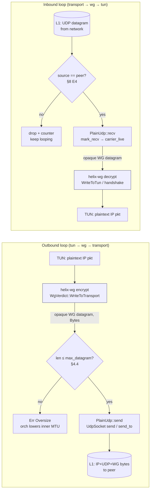

# Plain-UDP Transport

**Revision:** 1
**Last modified:** 2026-06-25T00:00:00Z

> Master technical specification — Volume 2 (Data Plane), nano-detail document.
> Deepens the *Plain-UDP Transport* section (`§3.2`) of [01-data-plane §3.2]. This is a
> SPEC — it describes the `helix-transport::plain_udp` module to be built, not the shipping
> product. Source evidence cited inline by id: [01-DP §N] = `final/01-data-plane.md`;
> [04_ARCH §N] = `04_VPN_CLD/HelixVPN-Architecture-Refined.md`; [04_P0 §N] =
> `HelixVPN-Phase0-Spike.md`; [SYNTHESIS §N] = the cross-document synthesis;
> [10-QA §N] = `final/10-testing-acceptance-and-qa.md`. External WireGuard protocol
> constants (not part of this evidence base) are tagged `[WG-PROTO]` and, where their exact
> value is not load-bearing for this module, annotated honestly per constitution §11.4.6.

---

## 0. Scope & contract summary

`plain-udp` is the **default fast-path transport**: it carries already-encrypted WireGuard
datagrams directly inside UDP, with **zero obfuscation**, over a single `tokio::net::UdpSocket`
[01-DP §3.2, 04_P0 §4.3]. It is the lowest-latency, lowest-CPU carrier and the **throughput
baseline** every other transport is measured against (the `G1` Phase-0 gate: through-tunnel
`iperf3` ≥ 80% of bare-link [04_P0 §G1, §8]).

This document owns, to nano-detail:

1. The `PlainUdp` type and its full `Transport` implementation (§3).
2. The on-the-wire byte layout — what plain-udp puts on L1, and why it treats the payload as
   opaque (I1) (§4).
3. The connection lifecycle state machine (§5).
4. **Failure detection that triggers ladder escalation** — the hard part, because UDP is
   connectionless and rarely errors on `send` (§6).
5. Error taxonomy, config knobs, edge cases, security, performance budget (§7–§11).
6. The concrete test points, tied to the §11.4.169 test-type taxonomy [10-QA §1] (§12).

**Invariants inherited unchanged** [01-DP §0.1]: I1 the transport never sees plaintext (it
carries opaque WG datagrams); I2 the transport carries **unreliable datagrams**, never an
ordered stream; I4 one transport crate, three consumers (client / connector / edge). plain-udp
is the simplest possible witness to all three.

```
File:  helix-transport/src/plain_udp.rs   (the unit this doc specifies)
Trait: helix-transport/src/lib.rs::Transport   (the contract; frozen Phase-0 interface)
Errors: helix-transport/src/error.rs::TransportError
```

---

## 1. When plain-udp is used — selection conditions

plain-udp is **ladder rung 0** in every `TransportPolicy.order` [01-DP §5.3]. The orchestrator
selects it in these cases (closed set):

| # | Condition | Source |
|---|---|---|
| C1 | **Unrestricted network, auto mode** — `order[0] == plain-udp`; the default first attempt on every fresh connect. | [01-DP §5.3 "Default order"], [04_ARCH §3.2] |
| C2 | **Per-network memory hit** — a prior successful plain-udp connect on this SSID / gateway fingerprint is remembered and re-tried first. | [01-DP §5.3 step 4], [04_P2 §1.4] |
| C3 | **Manual pin** — user sets `TransportPolicy.pin = PlainUdp`, skipping the ladder entirely (Mullvad "WireGuard / automatic" UX). | [01-DP §5.3 step 1], [04_ARCH §3.2] |
| C4 | **Cooperative-leg policy** — on the `gateway↔connector` leg of an asymmetric topology (D6), where the connector dials out of a cooperative network, plain-udp is the standing carrier. | [01-DP §11.3 D6], [SYNTHESIS §3 D6] |
| C5 | **Phase-0 spike** — the only fully-implemented transport alongside `masque-h3`; the `G1` vertical slice runs on plain-udp. | [04_P0 §4.3, §S0/§S1] |

It is **escalated away from** (rung 0 → rung 1) only when its handshake-failure budget is
exceeded (§6.4). It is never *de-escalated to* mid-session: a working tunnel that was
established on a higher rung does not opportunistically downgrade to plain-udp without a fresh
ladder walk (the per-network memory in C2 applies only at the next connect).

---

## 2. Module dependencies

| Dependency | Role | Note |
|---|---|---|
| `tokio` (`net`, `time`, `sync`) | async `UdpSocket`, timers, `Notify` | the single async runtime [01-DP §3.2] |
| `bytes::Bytes` | zero-copy datagram buffers | the `Transport` send/recv currency [01-DP §3.1] |
| `async_trait` | object-safe async `Transport` | matches the trait def [01-DP §3.1] |
| `socket2` | raw socket options (`SO_SNDBUF`, `IP_MTU_DISCOVER`, `SO_BINDTODEVICE`, `recvmmsg`) | needed for the knobs in §11; `tokio::net::UdpSocket::from_std` adopts the configured fd |
| `std::sync::atomic` | lock-free `HealthCell` counters | hot-path health updates without a mutex (§3.3) |

No obfuscation crate, no extra crypto crate — plain-udp adds **nothing** to the datagram. WG
(`helix-wg` [01-DP §4]) is the only cryptography in the path.

---

## 3. Public API — full signatures

### 3.1 The `PlainUdp` type

```rust
// helix-transport/src/plain_udp.rs
use std::net::SocketAddr;
use std::sync::Arc;
use bytes::Bytes;
use tokio::net::UdpSocket;
use crate::{Transport, TransportError, TransportHealth};

/// The baseline carrier: one UDP socket, peer endpoint, opaque WG datagrams (I1, I2).
/// Cheap to clone-share via `Arc`; the orchestrator holds it behind `Box<dyn Transport>`.
pub struct PlainUdp {
    sock:   Arc<UdpSocket>,   // bound + (optionally) connected; see §3.4 / §11
    peer:   SocketAddr,       // gateway/connector endpoint (fixed unless §3.6 rebind)
    health: HealthCell,       // §3.3 — lock-free liveness counters
    opts:   UdpSocketOpts,    // §11 — recorded so health/rebind logic can read them
}
```

Field rationale (nano-detail):

- `sock: Arc<UdpSocket>` — `Arc` (not bare `UdpSocket`) because `send` and `recv` run on **two
  independent task loops** (`tun→wg→transport` and `transport→wg→tun`) [01-DP §5.1]; both hold
  a clone. `tokio::net::UdpSocket::send`/`recv` take `&self`, so a single socket is shared
  read+write concurrently with no lock — UDP send and recv on one fd are independent kernel
  operations.
- `peer: SocketAddr` — resolved from `TransportConfig::PlainUdp { peer, bind }` [01-DP §3.1],
  itself sourced from the `RouteMap`'s `PeerRoute.endpoint_candidates[0]` pushed by the
  coordinator (doc 03) [01-DP §6.2]. v4 **or** v6 (§8 E5).
- `health: HealthCell` — the only state the *transport* surfaces upward; the WG handshake state
  lives in `helix-wg`, fused with this by the ladder (§6.3).

### 3.2 The `Transport` impl (complete)

This refines the Phase-0 sketch [01-DP §3.2, 04_P0 §4.3] into the production form: pooled recv
buffer, RTT-unaware send, health marking, idempotent close.

```rust
#[async_trait::async_trait]
impl Transport for PlainUdp {
    async fn send(&self, dg: Bytes) -> Result<(), TransportError> {
        // Oversize guard FIRST (I-budget §4.4): never hand the kernel a datagram the path
        // cannot carry — that yields a silent drop or EMSGSIZE depending on DF (§8 E2).
        if dg.len() > self.opts.max_datagram {
            return Err(TransportError::Oversize(dg.len()));
        }
        let n = if self.opts.connect_peer {
            self.sock.send(&dg).await          // connected socket (ICMP errors surface, §6.2)
        } else {
            self.sock.send_to(&dg, self.peer).await
        };
        match n {
            Ok(_sent) => { self.health.mark_sent(); Ok(()) }
            Err(e)    => { self.health.mark_send_err(); Err(map_io(e)) } // §7
        }
    }

    async fn recv(&self) -> Result<Bytes, TransportError> {
        // One MTU-sized scratch per call; pooled in the production impl (§10 P4).
        let mut buf = vec![0u8; self.opts.recv_scratch]; // default 1500 (§11)
        let n = if self.opts.connect_peer {
            self.sock.recv(&mut buf).await
        } else {
            // recv_from so we can drop datagrams whose source != peer (§8 E4, anti-spoof)
            let (n, from) = self.sock.recv_from(&mut buf).await.map_err(map_io)?;
            if !self.source_accepted(from) { return Err(TransportError::Closed /*see §6.2 note*/); }
            Ok::<usize, std::io::Error>(n)
        }.map_err(map_io)?;
        self.health.mark_recv();   // liveness clock reset (§6.2 D2)
        buf.truncate(n);
        Ok(Bytes::from(buf))
    }

    fn kind(&self) -> &'static str { "plain-udp" }

    fn effective_mtu(&self) -> u16 { 1420 }  // standard WG-over-IPv4 (§4.4) [04_P0 §4.3]

    fn health(&self) -> TransportHealth { self.health.snapshot() }

    async fn close(&self) -> Result<(), TransportError> {
        // UDP is connectionless: no FIN. Closing = dropping the socket. Idempotent — a second
        // close is a no-op. The fd is released when the last Arc clone drops (§5 Closed).
        Ok(())
    }
}
```

> **Honest correction vs the Phase-0 sketch.** [01-DP §3.2] / [04_P0 §4.3] show `recv` returning
> on a bare `self.sock.recv(&mut buf)` with no source check and no oversize guard. That is a
> deliberately trivial spike body. The production `recv` here adds the §8 E4 source filter and
> the §3.2 `send` adds the §4.4 oversize guard — both required to avoid the bluff failure modes
> §6/§8 enumerate. The wire behaviour (an unmodified WG datagram in a UDP payload) is identical.

### 3.3 `HealthCell` — lock-free liveness

`TransportHealth` [01-DP §3.1] is `{ rtt_ewma_ms: Option<u32>, last_recv_age_ms: u64,
send_errors: u32 }`. plain-udp populates it without a mutex on the hot path:

```rust
use std::sync::atomic::{AtomicU64, AtomicU32, Ordering};

pub(crate) struct HealthCell {
    last_recv_epoch_ms: AtomicU64, // monotonic ms since process start of the last recv
    send_errors:        AtomicU32,
    sent:               AtomicU64, // counters (no per-packet log — I5 no-logging)
    recvd:              AtomicU64,
    rtt_ewma_ms:        AtomicU32, // 0 == "unset" → mapped to None in snapshot()
    start:              std::time::Instant,
}

impl HealthCell {
    fn mark_recv(&self)     { self.last_recv_epoch_ms.store(self.now_ms(), Ordering::Relaxed);
                              self.recvd.fetch_add(1, Ordering::Relaxed); }
    fn mark_sent(&self)     { self.sent.fetch_add(1, Ordering::Relaxed); }
    fn mark_send_err(&self) { self.send_errors.fetch_add(1, Ordering::Relaxed); }

    /// RTT is NOT measured by plain-udp itself (it cannot — it does not parse WG, I1).
    /// `helix-wg` measures handshake RTT and pushes it here via `set_rtt` (§6.3).
    pub(crate) fn set_rtt(&self, ms: u32) { self.rtt_ewma_ms.store(ms.max(1), Ordering::Relaxed); }

    fn snapshot(&self) -> TransportHealth {
        let r = self.rtt_ewma_ms.load(Ordering::Relaxed);
        TransportHealth {
            rtt_ewma_ms: if r == 0 { None } else { Some(r) },
            last_recv_age_ms: self.now_ms().saturating_sub(self.last_recv_epoch_ms.load(Ordering::Relaxed)),
            send_errors: self.send_errors.load(Ordering::Relaxed),
        }
    }
    fn now_ms(&self) -> u64 { self.start.elapsed().as_millis() as u64 }
}
```

**Why RTT is set externally:** plain-udp obeys I1 (never parses the payload), so it cannot tell
a handshake-response datagram from a transport-data datagram. Liveness it *can* measure
(`last_recv_age_ms` = "a datagram of any kind arrived"). RTT it cannot — that requires matching
a WG handshake-init to its response, which only `helix-wg` sees. `helix-wg` calls
`HealthCell::set_rtt` on each completed handshake (§6.3). This keeps the I1 boundary clean.

### 3.4 Construction — the `dial()` entry & bind

`dial(TransportConfig::PlainUdp { peer, bind })` [01-DP §3.1] resolves to:

```rust
impl PlainUdp {
    /// Bind, apply socket options, optionally connect(), return a live carrier.
    /// Returns within the orchestrator's bounded dial timeout; never blocks (§6.4).
    pub async fn dial(peer: SocketAddr, bind: SocketAddr, opts: UdpSocketOpts)
        -> Result<Self, TransportError>
    {
        // 1. Build the raw socket with socket2 so we can set DF / buffers / SO_BINDTODEVICE
        //    BEFORE the fd is adopted by tokio (some options must precede bind).
        let domain = if bind.is_ipv6() { socket2::Domain::IPV6 } else { socket2::Domain::IPV4 };
        let raw = socket2::Socket::new(domain, socket2::Type::DGRAM, Some(socket2::Protocol::UDP))?;
        raw.set_nonblocking(true)?;
        apply_opts(&raw, &opts)?;                       // §11 — DF, buffers, bind-device, DSCP
        raw.bind(&bind.into())?;                         // EADDRINUSE → §7 / §8 E7
        if opts.connect_peer { raw.connect(&peer.into())?; } // surfaces ICMP errors (§6.2)
        let sock = UdpSocket::from_std(raw.into())?;     // adopt into tokio
        Ok(Self { sock: Arc::new(sock), peer, health: HealthCell::new(), opts })
    }
}
```

`dial()` itself does **no WireGuard handshake** — binding a UDP socket cannot fail for
"endpoint blocked" the way a TCP/QUIC connect can. The *connect-time* failure surfaces later, at
the WG layer, as a handshake that never completes (§6). This is the crucial asymmetry that
shapes plain-udp's failure-detection design: **`dial()` succeeds almost always; the failure is
discovered after handshake-init, not at dial.**

### 3.5 No `TransportConfig` secrets

`TransportConfig::PlainUdp { peer, bind }` carries **no `SecretBytes`** — unlike `Shadowsocks`
(`psk`), `Lwo` (`session_key`), or `Hysteria2` (`salamander_pw`) [01-DP §3.1]. plain-udp has no
transport-layer key material; all secrecy is WG's. This is a security property, not a gap
(§9 S1).

### 3.6 Endpoint rebind (roaming)

The `peer` may change once Phase-2 NAT traversal fills multiple `endpoint_candidates`
[01-DP §8]. plain-udp exposes a non-trait helper the orchestrator calls when WG roaming latches
onto a new source address:

```rust
impl PlainUdp {
    /// Switch the peer endpoint without re-binding the local socket (keeps the source port
    /// stable so the gateway's NAT mapping survives). For connected sockets this re-issues
    /// connect(); for unconnected it just swaps `self.peer`. Cheap, lock-free under &mut.
    pub fn rebind_peer(&mut self, new_peer: SocketAddr) -> Result<(), TransportError> { /* … */ }
}
```

Phase-0/Phase-1 never call this (single fixed gateway endpoint). It exists so the §8 E6 roaming
edge case is handled by construction in Phase 2, not retrofitted.

---

## 4. Wire format — byte layout

plain-udp is the one transport whose wire bytes equal the WG bytes — there is **no framing of
its own**. Understanding what is on the wire is what makes the security analysis (§9) and the
failure-detection design (§6) precise.

### 4.1 L1/L2 stack (one user-bound WG datagram on plain-udp/IPv4)

```
+---------------------------------------------------------------+
| IPv4 header   (20 bytes, no options)                          |  ← L1 (kernel)
+---------------------------------------------------------------+
| UDP header    (8 bytes:  src port | dst port | len | csum)    |  ← L1 (kernel)
+---------------------------------------------------------------+
| WireGuard datagram  (≤ 1452 bytes on a 1500-byte path)        |  ← L2 payload = opaque to plain-udp (I1)
|   byte 0      : message type   (1)                            |
|   bytes 1..4  : reserved (zero) (3)                           |   [WG-PROTO] — informational only;
|   bytes 4..   : type-specific body (handshake / transport)   |   plain-udp NEVER reads these.
+---------------------------------------------------------------+
```

- The **WG datagram is byte-identical** to what a stock WireGuard peer would emit. plain-udp
  copies it from `Bytes` into the UDP payload unmodified and back. That is the entire transform.
- Default endpoint: the gateway's WG UDP port (`51820` in the Phase-0 rig; `nft … udp dport
  51820 drop` is the DPI block that triggers escalation [04_P0 §3, §S?]). The production
  `peer.port()` comes from the `RouteMap`, not hard-coded.

Packet flow through plain-udp (the two hot loops [01-DP §5.1]; the carrier is a thin opaque
copy at the L2 boundary):



The only plain-udp-owned steps are the **Oversize guard**, the **source filter**, and the
**1:1 byte copy** to/from the socket — everything cryptographic (blue) is `helix-wg`'s, honouring
I1.

### 4.2 The payload is opaque (I1) — what plain-udp does and does not do

| plain-udp DOES | plain-udp DOES NOT |
|---|---|
| copy the WG `Bytes` into one UDP datagram (1:1, no fragmentation, no coalescing) | parse, decrypt, validate, or reorder the WG payload |
| enforce a max size (`Oversize` guard, §4.4) | add length prefixes, headers, padding, or obfuscation |
| drop datagrams from a non-`peer` source (§8 E4) | maintain per-flow or per-packet durable state (I5) |
| reset the liveness clock on any recv | distinguish handshake vs transport-data (that is WG's job) |

### 4.3 WG message taxonomy (informational — transport does NOT branch on it)

These are **external WireGuard protocol constants** `[WG-PROTO]`, included only so the §6
failure analysis is concrete. plain-udp treats all four identically (opaque payload, I1). Exact
byte sizes are protocol facts outside this evidence base; they are **not load-bearing for this
module** and any consumer that needs them parses WG inside `helix-wg`, never here:

| `type` (byte 0) | Meaning | Approx. fixed size | Relevance to plain-udp |
|---|---|---|---|
| `1` | Handshake Initiation | `UNVERIFIED: ~148 B` `[WG-PROTO]` | the *first* datagram plain-udp sends after dial; its loss-without-response is the core failure signal (§6) |
| `2` | Handshake Response | `UNVERIFIED: ~92 B` `[WG-PROTO]` | the *first* inbound datagram on a healthy connect; its arrival = liveness + RTT sample (§6.3) |
| `3` | Cookie Reply | `UNVERIFIED: ~64 B` `[WG-PROTO]` | load/DoS defence; opaque to plain-udp |
| `4` | Transport Data | variable, **32 B WG overhead** (4 type+reserved · 4 receiver-index · 8 counter · 16 Poly1305 tag) | steady-state payload; the 32-B figure is the grounded basis of the MTU budget §4.4 [04_P0 §4.3 via 01-DP §10] |

> The 32-byte transport-data overhead **is** grounded — it is the `32 WG hdr/tag` term in the
> `1500 − 20 IP − 8 UDP − 32 = 1420` MTU derivation [04_P0 §4.3, 01-DP §10]. The init/resp/cookie
> sizes are marked `UNVERIFIED` per §11.4.6 because they are not in the evidence base and are not
> needed by this module.

### 4.4 MTU & overhead budget

plain-udp adds **zero** transport overhead on top of WG, so it reports the highest
`effective_mtu()` of any carrier [01-DP §10]:

```
effective_mtu = 1420   (IPv4: 1500 − 20 IP − 8 UDP − 32 WG hdr/tag ≈ 1420)   [04_P0 §4.3]
```

| Path | L1 MTU | IP hdr | UDP hdr | WG hdr/tag | inner WG MTU |
|---|---|---|---|---|---|
| IPv4 (typical) | 1500 | 20 | 8 | 32 | **1420** [04_P0 §4.3] |
| IPv6 | 1500 | 40 | 8 | 32 | `UNVERIFIED: ~1400` (derived: 1500−40−8−32; not asserted in evidence base) |
| IPv6 min-MTU floor | 1280 | 40 | 8 | 32 | `UNVERIFIED: ~1200` (derived) |

Budget rules [01-DP §10]:

1. **Inner WG MTU = `min(effective_mtu(), path-MTU-discovered)`** — the orchestrator sets WG's
   MTU from `effective_mtu()` clamped by PMTU (§11 `set_df = true` enables honest PMTUD).
2. `max_datagram` (the `Oversize` threshold, §3.2) = `effective_mtu() + 32` (the WG header/tag),
   i.e. the largest *WG datagram* a 1420-byte inner MTU can produce ≈ **1452 bytes** on IPv4.
   A larger datagram is a hard `TransportError::Oversize` — never silently truncated (§8 E2).
3. plain-udp performs **no L3 fragmentation**; if the path MTU drops below the configured inner
   MTU, the orchestrator lowers the inner WG MTU (it does not ask the transport to fragment).

---

## 5. Connection lifecycle state machine

plain-udp's own lifecycle is intentionally tiny — it has no handshake of its own. The
*tunnel* state (Connecting/Handshaking/Connected/…) is the orchestrator's `TunnelStatus`
[01-DP §5.2]; plain-udp contributes the **carrier** sub-states below, observed via `health()`.

```mermaid
stateDiagram-v2
    [*] --> Unbound
    Unbound --> Bound: dial() — bind + apply opts + (connect)
    Bound --> Live: first send() succeeds (WG handshake-init out)
    Live --> Healthy: recv() observed (last_recv_age_ms small) — a datagram came back
    Healthy --> Live: last_recv_age_ms grows past keepalive interval (no recv yet, still ok)
    Live --> Stale: last_recv_age_ms > liveness_timeout AND handshake not complete
    Healthy --> Stale: last_recv_age_ms > liveness_timeout (peer went silent mid-session)
    Stale --> Live: a recv() arrives again (transient loss recovered)
    Bound --> Errored: send() returns EHOSTUNREACH/ECONNREFUSED (connected socket, ICMP) 
    Live --> Errored: send() returns ICMP-derived error (connected socket)
    Errored --> [*]: close() — drop socket; ladder escalates
    Stale --> [*]: failure budget exceeded → close() → ladder escalates (§6.4)
    Healthy --> Closed: close() (orchestrator teardown / pin change)
    Live --> Closed: close()
    Closed --> [*]
```



State meanings (what the orchestrator reads from `TransportHealth`):

| Carrier state | Detected by | Tunnel-level meaning |
|---|---|---|
| `Bound` | `dial()` returned `Ok` | socket exists; nothing sent yet |
| `Live` | `sent > 0`, `recvd == 0`, `send_errors == 0` | handshake-init(s) out, **awaiting response** — the critical window (§6) |
| `Healthy` | `recvd > 0`, `last_recv_age_ms < keepalive` | datagrams flowing both ways |
| `Stale` | `last_recv_age_ms > liveness_timeout` | peer silent; transient or terminal (§6.2 D2) |
| `Errored` | `send_errors > 0` from an ICMP-derived `io::Error` (connected socket) | endpoint actively rejecting (§6.2 D3) |
| `Closed` | `close()` / `Arc` dropped | carrier gone |

---

## 6. Failure detection that triggers escalation

This is the heart of the document. The escalation ladder [01-DP §5.3] walks to the next rung on
`DialTimeout` / `HandshakeFailed` / `EndpointBlocked` exceeding a per-rung failure budget. For
plain-udp specifically, **`dial()` almost never fails** (§3.4) — so the failure signal must be
synthesised from *liveness* + *WG handshake progress*, not from a `send` error.

### 6.1 Why UDP `send` rarely errors (the connectionless trap)

A bare (unconnected) `UdpSocket::send_to` returns `Ok` as soon as the datagram is queued to the
kernel — even if the destination is a black hole. There is no SYN/ACK, no connection refusal at
the transport. Consequently:

- **A DPI block that silently drops `udp dport 51820`** [04_P0 §3] produces **zero send errors**.
  plain-udp's `send` keeps returning `Ok`; the only symptom is that **no response ever arrives**.
- Therefore plain-udp's failure detector is fundamentally a **timeout-on-no-recv** detector,
  optionally sharpened by **ICMP errors on a connected socket**.

### 6.2 The detection signals (closed set)

| ID | Signal | Source | Maps to |
|---|---|---|---|
| D1 | **Dial failure** — `bind`/`connect` syscall error (rare: `EADDRINUSE`, bad bind addr) | `dial()` (§3.4) | `TransportError::Io` → orchestrator may retry bind or `DialTimeout` |
| D2 | **Liveness timeout** — `health().last_recv_age_ms > liveness_timeout_ms` while the WG handshake has **not** completed | `HealthCell` + `helix-wg` handshake state (§6.3) | synthesised `HandshakeFailed("no response")` |
| D3 | **ICMP rejection** — on a **connected** socket (`opts.connect_peer = true`), an ICMP *port/host/net unreachable* surfaces as `send`/`recv` returning `ECONNREFUSED` / `EHOSTUNREACH` / `ENETUNREACH` | kernel → `io::Error` (§3.2) | `EndpointBlocked` (D3 is a *fast* signal — no need to wait the full liveness timeout) |
| D4 | **Source mismatch flood** — many inbound datagrams whose source ≠ `peer` (spoof / wrong-NAT) | `recv_from` filter (§8 E4) | counter only; does not by itself escalate, but suppresses false "Healthy" |
| D5 | **Persistent send error** — `EMSGSIZE` (DF + oversize), `ENOBUFS`, `EPERM` (firewall) | `send` `io::Error` (§3.2) | `Io`; repeated → budget toward escalation |

**D3 is why the spec recommends `connect_peer = true` for the fixed-gateway client leg** (§11):
it converts a silent black hole into a *fast, explicit* `EndpointBlocked`, cutting escalation
latency from `liveness_timeout` (seconds) to one RTT. The trade-off: a connected socket pins the
peer, so it must be `rebind_peer`'d (§3.6) on Phase-2 roaming. For the connector leg (cooperative
network, fixed gateway) `connect_peer = true` is strictly better.

### 6.3 Fusing carrier liveness with WG handshake state (the I1-clean seam)

Because plain-udp cannot see WG (I1), the *authoritative* "is the tunnel up?" verdict is the WG
handshake state in `helix-wg`, not the carrier. The orchestrator fuses them:

```
tunnel_up  ==  helix_wg.handshake_complete()           // WG says a session key exists
carrier_live == health().last_recv_age_ms < liveness_timeout  // plain-udp says bytes flow
```

- `helix-wg` emits `WgVerdict::WriteToTransport(handshake_init)` on connect; the orchestrator
  `send`s it via plain-udp. plain-udp marks `sent`.
- If a response arrives, `recv` yields it, plain-udp marks `recv` (→ `carrier_live`), and
  `helix-wg.handle_transport_in` completes the handshake (→ `tunnel_up`) and reports RTT, which
  the orchestrator feeds to `HealthCell::set_rtt` (§3.3).
- If **no** response arrives within `liveness_timeout` AND `!helix_wg.handshake_complete()`,
  that is **D2** → the orchestrator synthesises `HandshakeFailed("plain-udp: no response")` and
  charges the rung's failure budget.

This division is deliberate: plain-udp stays a dumb opaque carrier; the smart "did the crypto
handshake succeed?" decision lives where the crypto lives.

### 6.4 The failure budget & escalation trigger

The rung's `FailureBudget { max_handshakes: u8, window: Duration }` [01-DP §5.3] is evaluated by
the ladder, fed by plain-udp's signals:

```
on each connect attempt for rung=plain-udp:
  send WG handshake-init (retry per WG's own backoff, ~5 s × max_handshakes)
  await EITHER:
    tunnel_up                       → Connected{transport:"plain-udp", rtt}    (emit, remember §C2)
    D3 (ICMP EndpointBlocked)       → immediate budget hit (fast path)
    D2 (liveness_timeout, no resp)  → budget hit
  if budget exceeded (handshakes ≥ max_handshakes within window):
    close() this PlainUdp; orchestrator emits Reconnecting; ladder → rung 1 (lwo) [01-DP §5.3]
```

Recommended Phase-1 defaults (project-tunable knob, §11): `max_handshakes = 3`,
`window = 15 s`, `liveness_timeout_ms = 4000`. These mirror "a few seconds before escalating"
[04_ARCH §3.2 "after N failed handshakes"] and are calibrated, not hard-coded, against the
Phase-0 `G1` rig (§12) per §11.4.6/§11.4.107(13).

### 6.5 Sequence — plain-udp failure → escalation to rung 1

```mermaid
sequenceDiagram
    autonumber
    participant Orch as Orchestrator (helix-core)
    participant Wg as helix-wg (Tunn)
    participant Tx as PlainUdp (rung 0)
    participant Net as Network / DPI
    participant Lad as Ladder (TransportPolicy)

    Orch->>Tx: dial(PlainUdp{peer=gw:51820, connect_peer=true})
    Tx-->>Orch: Ok (bound + connected)  %% dial almost never fails (§3.4)
    Orch->>Wg: start handshake
    Wg-->>Orch: WriteToTransport(handshake_init #1)
    Orch->>Tx: send(init#1)
    Tx->>Net: UDP :51820 (opaque WG bytes)
    Net--xTx: DROP (nft udp dport 51820 drop)  %% silent black hole

    alt connected socket → ICMP arrives (D3, fast)
        Net-->>Tx: ICMP port-unreachable
        Tx-->>Orch: send()/recv() = Err(EndpointBlocked)
        Orch->>Lad: budget hit (fast)
    else no ICMP → liveness timeout (D2)
        Note over Tx,Orch: no recv; health.last_recv_age_ms climbs
        Wg-->>Orch: WriteToTransport(handshake_init #2, #3)  %% WG retries ~5s apart
        Orch->>Tx: send(init#2), send(init#3)
        Tx->>Net: dropped each time
        Orch->>Orch: liveness_timeout 4s, !handshake_complete → synth HandshakeFailed (D2)
        Orch->>Lad: budget hit ×3 within 15s window
    end

    Lad->>Lad: max_handshakes exceeded → escalate rung 0 → rung 1
    Orch->>Tx: close()  %% drop socket
    Orch-->>Orch: emit TunnelStatus::Reconnecting
    Lad->>Orch: next = lwo (rung 1) [01-DP §5.3]
    Note over Orch,Net: ladder continues lwo → masque-h3 → shadowsocks → udp-over-tcp
```

---

## 7. Error taxonomy & mapping

plain-udp produces a strict subset of `TransportError` [01-DP §3.1 `error.rs`]. The `map_io`
helper classifies `std::io::Error`:

```rust
fn map_io(e: std::io::Error) -> TransportError {
    use std::io::ErrorKind::*;
    match e.kind() {
        ConnectionRefused                 => TransportError::EndpointBlocked, // ICMP port-unreach (D3)
        HostUnreachable | NetworkUnreachable => TransportError::EndpointBlocked, // ICMP net/host (D3)
        // EMSGSIZE has no stable ErrorKind on all platforms → matched via raw_os_error below
        _ if is_emsgsize(&e)              => TransportError::Oversize(0),     // DF + too big (D5/E2)
        _                                 => TransportError::Io(e),          // ENOBUFS, EPERM, …
    }
}
```

| `TransportError` | Cause on plain-udp | Triggers escalation? | Detect signal |
|---|---|---|---|
| `DialTimeout` | `dial()` exceeded the orchestrator's bound dial timeout (rare; bind hang) | yes | D1 |
| `HandshakeFailed(String)` | **synthesised** by orchestrator on D2 (liveness timeout, no WG response) | yes (budget) | D2 |
| `EndpointBlocked` | ICMP unreachable on connected socket | yes (fast) | D3 |
| `Oversize(usize)` | datagram > `max_datagram`; or `EMSGSIZE` with DF set | no — caller bug / PMTU; orchestrator lowers inner MTU (§4.4) | D5/E2 |
| `Closed` | `recv` after `close()`; or source-mismatch sentinel (§3.2 note) | n/a (teardown) | — |
| `Io(io::Error)` | `ENOBUFS`, `EPERM` (firewall), `EADDRINUSE` (bind) | repeated → budget | D1/D5 |
| `Quic(_)` | **never** — plain-udp has no QUIC | — | — |

> Note (§3.2 source-mismatch): returning `Closed` for a spoofed-source datagram is a placeholder;
> the production impl **loops internally** (drops the bad datagram, keeps awaiting a good one)
> rather than surfacing an error, so one spoofed packet cannot tear the tunnel. Treat the inline
> `return Err(Closed)` in §3.2 as shorthand for "continue the recv loop" — captured as test
> point T-EDGE-4 (§12).

---

## 8. Edge cases (closed enumeration)

| ID | Edge case | Required behaviour | Test |
|---|---|---|---|
| E1 | **0-length datagram** received | accept; `Bytes::new()`; mark recv (a WG keepalive can be tiny but is ≥ 32 B — a true 0-length is a probe, still counts as liveness) | T-EDGE-1 |
| E2 | **Oversize on send** (`dg.len() > max_datagram`) | hard `Oversize` BEFORE syscall; never truncate; never split | T-EDGE-2 (UNIT) |
| E3 | **recv buffer too small** (`n == recv_scratch`, possible truncation) | the WG payload ≤ inner MTU < `recv_scratch=1500`, so truncation cannot occur for in-spec datagrams; an `n == scratch` event is logged as a counter anomaly (over-MTU peer) and the datagram dropped (WG would reject a truncated tag anyway) | T-EDGE-3 |
| E4 | **Source-address mismatch** (`recv_from` source ≠ `peer`) | drop + counter (D4); do **not** mark recv (else a spoofer keeps `carrier_live` falsely true); keep looping | T-EDGE-4 (SEC) |
| E5 | **Dual-stack v4/v6 peer** | bind domain follows `bind.is_ipv6()`; a v6 bind with `IPV6_V6ONLY=false` can reach v4-mapped peers (§11 knob); `effective_mtu` adjusts (§4.4) | T-EDGE-5 |
| E6 | **Peer roams** (Phase 2, new candidate) | `rebind_peer` (§3.6); keep local port stable so gateway NAT mapping survives | T-EDGE-6 (Phase 2) |
| E7 | **`EADDRINUSE` on bind** | surface `Io`; orchestrator picks an ephemeral port (bind `0.0.0.0:0`) and retries once before `DialTimeout` | T-EDGE-7 |
| E8 | **`ENOBUFS` under send burst** | `Io`; the send loop applies bounded backpressure (await `writable()`), never busy-spins; counts toward D5 only if persistent | T-EDGE-8 (STRESS) |
| E9 | **Socket closed under an in-flight `recv`** | `recv` returns `Closed`; the recv loop exits cleanly (cancel-safe — `recv` is `select!`-usable per the trait contract [01-DP §3.1]) | T-EDGE-9 (RACE) |
| E10 | **DF set, path MTU shrinks** | `EMSGSIZE` → `Oversize`; orchestrator lowers inner WG MTU and the next send fits (§4.4 rule 3) | T-EDGE-10 |

---

## 9. Security considerations

plain-udp is the **least private** transport by design — it is the fast path for *unrestricted*
networks, not the evasion path. Its security posture:

| ID | Property | Detail |
|---|---|---|
| S1 | **No transport secrets** | `TransportConfig::PlainUdp` carries no key (§3.5). Nothing to leak at the transport layer; WG owns all confidentiality/integrity (Noise IK, ChaCha20-Poly1305) [01-DP §4, SYNTHESIS §2]. |
| S2 | **Trivially DPI-fingerprintable** | the wire bytes ARE WireGuard (byte 0 = WG message type, fixed handshake sizes) [WG-PROTO]; a censor's `udp dport 51820 drop` or a WG-signature rule blocks it instantly [04_P0 §3]. This is *expected* — when blocked, the ladder escalates to an obfuscating rung (lwo/masque-h3) [01-DP §5.3]. plain-udp must **not** be presented to the user as censorship-resistant. |
| S3 | **Source-spoof resistance** | the `recv_from` source filter (E4) drops datagrams not from `peer`; combined with WG's cryptographic peer authentication, a spoofed source cannot inject into the tunnel — it can at most waste a buffer. No amplification: plain-udp never replies to an unsolicited datagram (it only echoes WG, which itself does not amplify). |
| S4 | **Kill-switch interface pin** | `opts.bind_device = Some("wg-kill0")` (`SO_BINDTODEVICE`) binds the socket to the protected interface so a route flap cannot leak cleartext onto the physical NIC. The kill-switch state machine (security doc) drives this; plain-udp only honours the option. |
| S5 | **No-logging by construction (I5)** | `HealthCell` holds only aggregate atomics (`sent`/`recvd`/`send_errors`) — never a per-packet or per-connection durable record [01-DP §0.1 I5, SYNTHESIS §7]. |
| S6 | **PMTU/DF honesty** | `set_df = true` (§11) prevents on-path fragmentation that could be a side channel and yields honest `EMSGSIZE` (E10) rather than silent black-holing. |
| S7 | **ICMP trust** | D3 trusts ICMP unreachable to escalate *faster*, but ICMP is unauthenticated. A forged ICMP could force a premature escalation (DoS-to-slow-path, not a confidentiality break). Mitigation: ICMP only **accelerates** an escalation that the liveness timeout (D2) would reach anyway; it never causes a *downgrade* or key exposure. Recorded as an accepted residual risk (§11.4.6 — stated, not hidden). |

---

## 10. Performance budget

plain-udp is the **baseline** — every other transport is measured as a fraction of it
[01-DP §3.2, 04_P0 §8].

| ID | Metric | Target | Source |
|---|---|---|---|
| P1 | through-tunnel throughput (TCP+UDP `iperf3`) | **≥ 80% of bare-link** (the `G1` gate) | [04_P0 §G1, §8] |
| P2 | added latency vs bare path (`ping` overlay) | **< 2 ms** added, p50 and p99 | [04_P0 §8 table] |
| P3 | CPU | lowest of all transports (no obfuscation, no extra crypto) | [01-DP §3.2, 04_ARCH §3.2] |
| P4 | per-recv allocation | one pooled MTU buffer; production uses a `BytesMut` slab + `recvmmsg` batch (§11 `recv_mmsg_batch`) to amortise syscalls — the §3.2 `vec![0u8;1500]` per call is the spike form, replaced by a pool | derived [04_P0 §8 "CPU/Gbps"] |
| P5 | handshake-to-Connected | one RTT after a non-blocked path (no transport handshake to add) | derived (§6) |

Performance levers (nano-detail, all §11 knobs):

- **`SO_SNDBUF` / `SO_RCVBUF`** sized to ≥ BDP so bursts do not `ENOBUFS` (E8) / drop on recv.
- **GSO/GRO** (Linux `UDP_SEGMENT` / `UDP_GRO`): batch multiple WG datagrams per syscall on the
  edge's high-fan-in path. `UNVERIFIED` whether Phase-0/1 enables it — flagged as a Phase-2
  edge-throughput lever, not asserted as shipped.
- **`recvmmsg`** (P4) batches inbound datagrams; the recv loop yields a `Vec<Bytes>` internally
  and feeds them to WG one at a time (preserving I2 unreliable-datagram semantics).

---

## 11. Configuration knobs — `UdpSocketOpts`

```rust
#[derive(Clone, Debug)]
pub struct UdpSocketOpts {
    pub send_buf_bytes:   usize,          // SO_SNDBUF      — default 2 MiB
    pub recv_buf_bytes:   usize,          // SO_RCVBUF      — default 4 MiB (edge: larger)
    pub recv_scratch:     usize,          // per-recv buffer — default 1500 (≥ max_datagram)
    pub max_datagram:     usize,          // Oversize guard  — default effective_mtu()+32 = 1452
    pub set_df:           bool,           // IP_MTU_DISCOVER=DO / IP_DONTFRAG — default true (PMTUD)
    pub connect_peer:     bool,           // UdpSocket::connect() → ICMP errors (D3) — default true (fixed gw)
    pub bind_device:      Option<String>, // SO_BINDTODEVICE — kill-switch pin (S4) — default None
    pub dscp:             Option<u8>,     // IP_TOS / IPV6_TCLASS — default None
    pub v6_only:          bool,           // IPV6_V6ONLY — default false (dual-stack, E5)
    pub recv_mmsg_batch:  usize,          // recvmmsg batch (Linux) — default 64
    // --- ladder-facing (read by the orchestrator, not the socket) ---
    pub liveness_timeout_ms: u64,         // D2 — default 4000
    pub max_handshakes:   u8,             // failure budget — default 3      [04_ARCH §3.2]
    pub budget_window_ms: u64,            // failure budget window — default 15000
}
```

Every numeric default is **calibrated against the Phase-0 `G1` rig**, not adopted from
literature, per §11.4.6 / §11.4.107(13). They are project knobs (§11.4.35) the coordinator may
override per-network via the pushed `TransportPolicy` [01-DP §5.3].

---

## 12. Test points — tied to §11.4.169 [10-QA §1]

Each row is a workable-item test obligation; abbreviations are the [10-QA §1] taxonomy. Every
PASS cites captured evidence (§11.4.5/.69/.107), never config-only.

| ID | Test point | §11.4.169 type | Evidence / harness |
|---|---|---|---|
| T-UNIT-1 | `effective_mtu() == 1420`; `max_datagram == 1452` | `UNIT` | `cargo test` assert |
| T-UNIT-2 | Oversize guard: `send(1453 B)` → `Err(Oversize(1453))`, **no syscall** | `UNIT` | `cargo test` (mock socket) |
| T-UNIT-3 | `map_io` classification table (ECONNREFUSED→EndpointBlocked, EMSGSIZE→Oversize, …) | `UNIT` | table-driven `cargo test` |
| T-UNIT-4 | `HealthCell` snapshot math: `last_recv_age_ms`, `rtt None↔Some`, atomic counters | `UNIT` | `cargo test` |
| T-S0 | loopback echo: `dial()` two `PlainUdp`, `send`/`recv` round-trips a WG-sized blob (the `S0` milestone) | `INT` | netns loopback [04_P0 §S0] |
| T-G1 | through-tunnel `iperf3` ≥ 80% bare-link + `ping` LAN host succeeds (the `G1` gate, throughput **baseline**) | `BENCH`/`E2E`/`PERF` | netns+netem rig, `bench.sh` [04_P0 §G1, §8] |
| T-FAIL-D2 | DPI drop (`nft udp dport 51820 drop`) → no response → D2 liveness timeout → synth `HandshakeFailed` → ladder escalates rung 0→1; captured as an ordered `TunnelStatus` trace | `E2E`/`SEC` | netns + nftables [04_P0 §3] |
| T-FAIL-D3 | connected socket + ICMP port-unreachable → `EndpointBlocked` within one RTT (faster than D2) | `E2E` | netns reject rule |
| T-EDGE-1..10 | the §8 edge cases (0-len, oversize, source-mismatch drop, dual-stack, EADDRINUSE, ENOBUFS, cancel-safe recv, DF/PMTU) | `UNIT`/`SEC`/`RACE`/`STRESS` | per-row harness in §8 |
| T-STRESS-1 | ≥ 100 iters / ≥ 30 s sustained + ≥ 10 parallel sockets; no leak, no `ENOBUFS` storm (§11.4.85) | `STRESS` | `stress_chaos.sh ab_stress_*` [10-QA §5.9] |
| T-CHAOS-1 | kill the edge mid-`iperf3`; assert the tunnel recovers (reconnect/escalate) **and no cleartext leaks during the gap** | `CHAOS` | `ab_chaos_kill_pid_during` [10-QA §5.9] |
| T-RACE-1 | concurrent `send`+`recv` on the shared `Arc<UdpSocket>`; `cargo +nightly` loom / tsan — no data race, no deadlock | `RACE` | loom model [10-QA §1] |
| T-SEC-1 | source-spoof injection (E4): spoofed-source datagrams dropped, `carrier_live` not falsely set, WG never accepts | `SEC` | pcap + netns [10-QA §1] |
| T-REC-1 | window-scoped MP4 of the `G1` slice + media-validation verdict (per user-visible-claim, §11.4.154/.163) | `REC` | `panoptic`→`vision_engine` [10-QA §1] |
| T-CHAL-1 | a `challenges`/`helix_qa` bank entry scoring PASS only on the captured `G1` evidence (§11.4.27/.107) | `CHAL`/`HQA` | `challenges` submodule [10-QA §1] |

> `DDOS` and `SCALE` are `NOT_APPLICABLE` for plain-udp at MVP (single-node self-host topology,
> §11.4.3 topology-SKIP) and re-arm in Phase 2 [10-QA §1 table]. The plain-udp paired §1.1
> meta-test mutation: invert the Oversize guard (`>` → `<`) and assert T-UNIT-2 FAILs — proving
> the guard test is not a bluff.

---

## 13. Frozen contract & out-of-scope

- **Frozen Phase-0 interface** [01-DP §3.1, 04_P0 §14]: the `Transport` trait method set
  (`send`/`recv`/`kind`/`effective_mtu`/`health`/`close`) is a frozen contract; `PlainUdp`'s
  *implementation* (pooling, `recvmmsg`, GSO) may evolve, its *signatures* may not.
- **Out of scope here** (owned elsewhere): the `Transport` trait & `dial()` registry, the
  escalation-ladder algorithm, and `TransportPolicy` live in [01-DP §3.1 / §5.3]; WG handshake
  state and `WgVerdict` in `helix-wg` [01-DP §4]; the `RouteMap` that sources `peer` in
  `helix-route` [01-DP §6.2]; the obfuscating transports (`lwo`, `masque-h3`, `shadowsocks`,
  `udp-over-tcp`) in their own v02 docs. The kill-switch state machine (which drives `bind_device`,
  S4) is referenced for its seam only and specified in the security doc.

*End of `transport-plain-udp.md` (Volume 2 — Data Plane). Pair with `01-data-plane.md` §3.2
(the parent section this deepens), the `transport-masque-h3.md` nano-spec (the rung-2
obfuscating counterpart whose MTU/CPU penalty is measured against this baseline), and
`10-testing-acceptance-and-qa.md` §1 (the §11.4.169 test-type contract the §12 points instantiate).*
