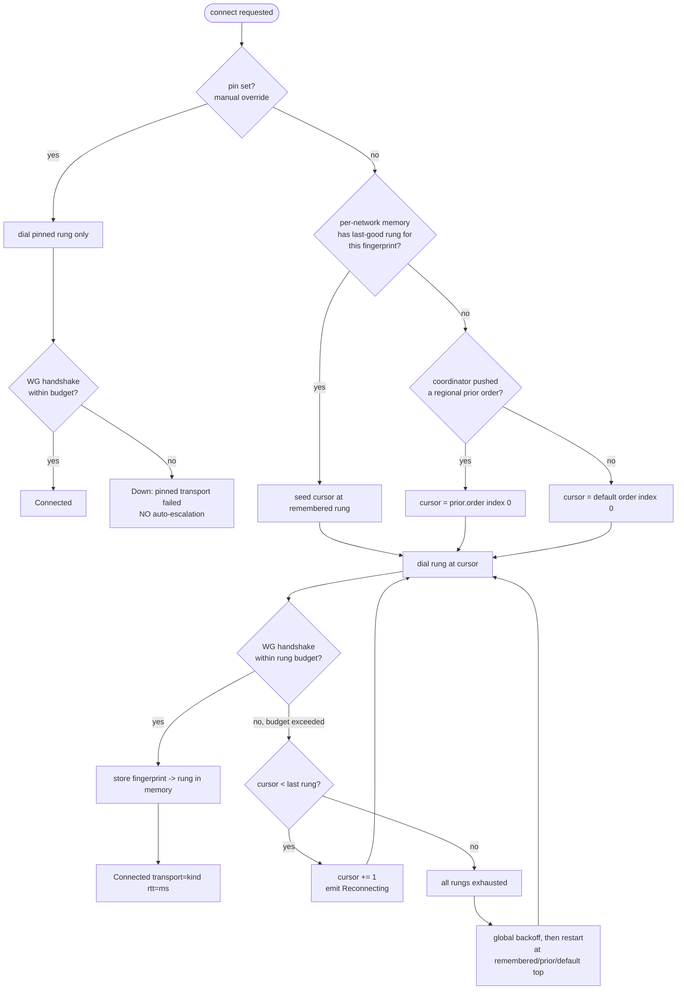
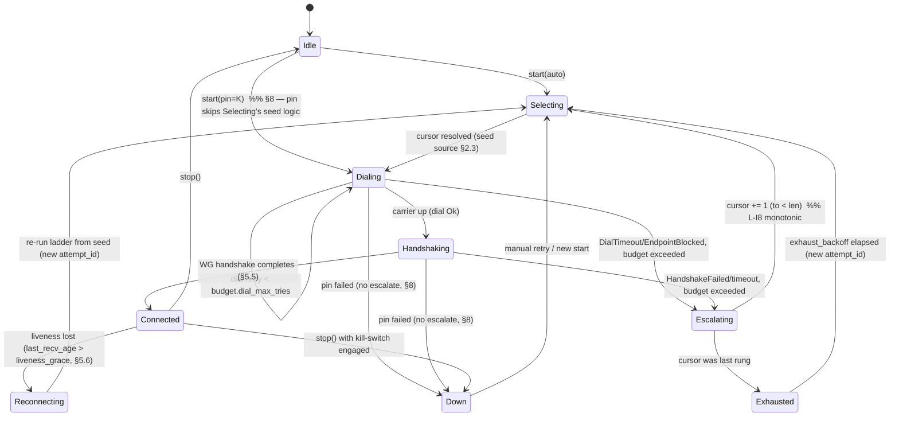
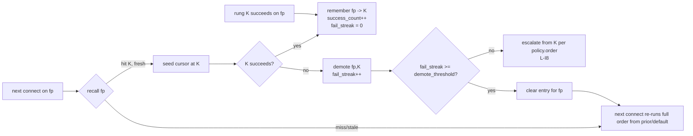
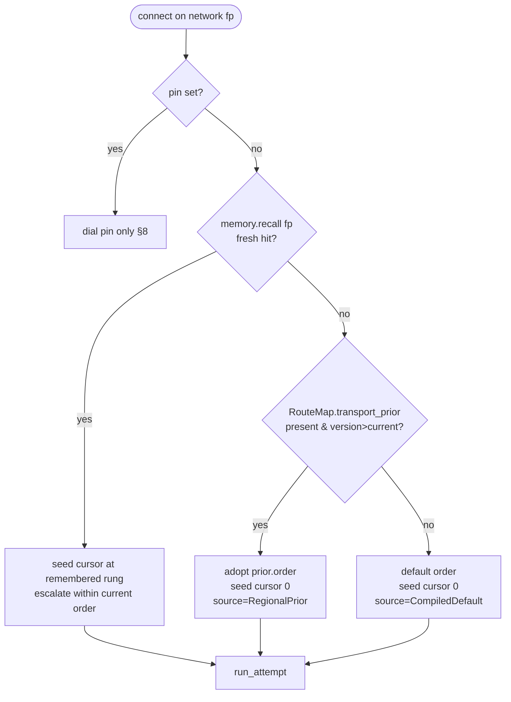

# Automatic Transport Selection Ladder

**Revision:** 1
**Last modified:** 2026-06-25T00:00:00Z

> Master technical specification — Volume 2 (Data Plane), nano-detail deep-dive.
> This document **deepens** the *Auto transport selection — the escalation ladder*
> section of doc 01 [01-DP §5.3, §5.4] into an implementation-ready specification of the
> ladder state machine, its timers, per-network memory, coordinator-pushed regional priors,
> manual override, telemetry, and the byte layouts of every persisted/streamed artefact.
> SPEC-ONLY: it describes **what to build**, not the shipping product. Sources cited inline by
> id — `[01-DP §N]` = doc 01 `final/01-data-plane.md`; `[04_ARCH §N]` =
> `04_VPN_CLD/HelixVPN-Architecture-Refined.md`; `[04_P0]`/`[04_P2]` = Phase-0/Phase-2 refined
> docs; `[research-masque]`, `[research-hysteria2]`, `[research-daita_test]` = the cited research
> digests; `[SYNTHESIS §N]` = the cross-document synthesis. Any claim not grounded in the
> evidence base is marked `UNVERIFIED` per constitution §11.4.6.

---

## 0. Position, ownership, and invariants

### 0.1 What this document owns

The ladder is the **client-side control logic** that, given an ordered list of candidate L2
transports (`plain-udp → lwo → masque-h3 → shadowsocks → udp-over-tcp`, with `hysteria2` and
`connect-ip` as feature-gated rungs), picks the one that actually carries WireGuard datagrams to
the gateway on the current network, and re-picks automatically when a rung stops working
[01-DP §5.3, §3.1]. It is the code behind `helix-core/src/ladder.rs` [01-DP §12]. It owns:

1. The **ladder state machine** + its transition timers/budgets (§3, §4).
2. The driver that calls `helix_transport::dial()` and reacts to `TransportError` (§5).
3. **Per-network memory** — remember-what-worked keyed by network fingerprint (§6).
4. Consumption of the **coordinator-pushed regional prior** `TransportPolicy.order` (§7).
5. **Manual override** (`pin`) — Mullvad's "force this transport" toggle (§8).
6. **Aggregate, no-per-user telemetry** of escalation outcomes (§9, invariant I5).

### 0.2 What this document does NOT own

It does **not** define the `Transport` trait, `TransportConfig`, `dial()`, or the wire framing of
any transport — those are frozen contracts in doc 01 [01-DP §3]. It does **not** own the
`WatchNetworkMap` protobuf that *delivers* the regional prior — that is doc 03; this document
specifies only the **shape the ladder consumes** and treats the protobuf as the upstream source
(§7.1). It does **not** own WireGuard crypto (`helix-wg` [01-DP §4]), routing/ACL (`helix-route`
[01-DP §6–§7]), DAITA (`helix-daita` [01-DP §9]), or the FFI surface (doc 05). It surfaces
`TunnelStatus` events but does not own the FFI bridge that re-emits them.

### 0.3 Invariants this document inherits and tightens

| # | Invariant | Source | Ladder-specific tightening |
|---|---|---|---|
| I1 | Transport never sees plaintext. | [01-DP I1] | The ladder operates on **opaque** `Box<dyn Transport>` handles + health snapshots; it never inspects datagram bytes. |
| I2 | Unreliable datagrams, never an ordered stream. | [01-DP I2] | The ladder's success criterion is a completed **WG handshake** over the rung, not a TCP/QUIC connect — a connected carrier with no WG handshake is **not** a successful rung (§5.5). |
| I5 | No-logging by construction; only aggregate counters. | [01-DP I5, 04_ARCH §2.7] | Per-network memory persists a **fingerprint hash + last-good rung index**, never the SSID plaintext, never a server endpoint, never a timestamped per-connection log (§6.4, §9). |
| L-I7 | **Automatic with manual override** — Mullvad's exact UX. | [04_ARCH §3.2, 01-DP §5.3] | `pin` short-circuits the ladder entirely; auto mode walks `order` with per-rung budgets (§3, §8). |
| L-I8 | **Escalation is monotonic within one connect attempt** — never oscillate up-and-down inside a single attempt; only reset to the top on a new attempt or successful reconnect. | derived from [04_P2 §1.4] | Prevents thrash; §3.3, §4.4. |
| L-I9 | **Every PASS carries captured evidence** (the escalation event trace IS the evidence). | [01-DP §12.1, §11.4.5/.69/.107] | §9, §10. |

---

## 1. The ladder model in one picture



The cursor only ever **advances** within one attempt (L-I8). The three seed sources — per-network
memory, regional prior, default — are tried in that priority order (§2.3). `pin` bypasses all of it
(§8).

---

## 2. Ordered rung taxonomy & the policy object

### 2.1 `TransportKind` — the ordinal the ladder walks

```rust
// helix-core/src/ladder.rs
// The closed set of ladder rungs. Ordinal order is the *default* escalation order
// (cheapest/fastest first → most evasive/most expensive last) [01-DP §5.3, 04_P2 §1.4].
#[derive(Clone, Copy, Debug, PartialEq, Eq, Hash, PartialOrd, Ord)]
#[repr(u8)]
pub enum TransportKind {
    PlainUdp    = 0,  // baseline, lowest latency/CPU  [01-DP §3.2]
    Lwo         = 1,  // cheap header obfuscation, first escalation rung [01-DP §3.7]
    MasqueH3    = 2,  // CONNECT-UDP / HTTP-3 — primary obfuscation (D1 camp A) [01-DP §3.3]
    Hysteria2   = 3,  // QUIC+Salamander/Gecko, feature="hysteria2" (D1 camp B) [01-DP §3.8]
    Shadowsocks = 4,  // WG-in-Shadowsocks AEAD over TCP [01-DP §3.5]
    UdpOverTcp  = 5,  // last resort when ALL udp/quic blocked [01-DP §3.6]
    ConnectIp   = 6,  // RFC 9484 IP-over-H3, feature="connect-ip", advanced [01-DP §3.4]
}

impl TransportKind {
    /// Stable wire/metric label — MUST equal the matching `Transport::kind()` string [01-DP §3].
    pub const fn label(self) -> &'static str {
        match self {
            TransportKind::PlainUdp => "plain-udp",
            TransportKind::Lwo => "lwo",
            TransportKind::MasqueH3 => "masque-h3",
            TransportKind::Hysteria2 => "hysteria2",
            TransportKind::Shadowsocks => "shadowsocks",
            TransportKind::UdpOverTcp => "udp-over-tcp",
            TransportKind::ConnectIp => "connect-ip",
        }
    }
    /// Compact persistence/telemetry code (1 byte) — the discriminant.
    pub const fn code(self) -> u8 { self as u8 }
    pub fn from_code(b: u8) -> Option<TransportKind> { /* match 0..=6 → variant; else None */ }

    /// Carrier requires UDP/QUIC reachability (fails on a hard UDP block) — used by the
    /// network-class hint (§6.5) to skip provably-dead rungs early.
    /// plain-udp/lwo/masque-h3/hysteria2/connect-ip = true; shadowsocks/udp-over-tcp = false
    /// [research-hysteria2 §5(b): "QUIC/Hysteria2/MASQUE-over-H3/WireGuard all fail … need UDP"].
    pub const fn needs_udp(self) -> bool {
        !matches!(self, TransportKind::Shadowsocks | TransportKind::UdpOverTcp)
    }
}
```

**Why this ordinal order** (each rung is strictly more evasive *and* more expensive than the prior):
`plain-udp` is the ≥80%-bare-link baseline [01-DP §3.2, 04_P0 §0]; `lwo` is "near-zero-cost evasion
of naive WG fingerprinting" [01-DP §3.7]; `masque-h3` "genuinely *is* HTTP/3 to an HTTP proxy"
(strong blend-in) but pays the double-crypto/double-CC throughput tax
[research-masque §2; research-hysteria2 §6]; `hysteria2` wins raw throughput on lossy/throttled
links (Brutal CC) but is a non-standard "random noise" wire [research-hysteria2 §1, §6]; the two
TCP carriers carry the head-of-line-blocking penalty and exist purely to keep a tunnel *possible*
[01-DP §3.5, §3.6, 04_P2 §1.2]. `connect-ip` is last and feature-gated because it loses I1 at the
gateway [01-DP §3.4].

> **DECISION D1 dependency.** Where `hysteria2` sits in the default order is contingent on D1
> [01-DP §3.8, SYNTHESIS §3 D1]. This spec places it *after* `masque-h3` (adopting Camp A:
> `masque-h3` primary) and only when `feature = "hysteria2"` is compiled in; if the project later
> resolves D1 to Camp B, the coordinator's regional prior (§7) re-orders it to index 0 for the
> relevant regions **without a client rebuild** — the ladder reads order from policy, not from the
> enum ordinal (§2.2). The enum ordinal is only the *fallback default* when no prior is pushed.

### 2.2 `TransportPolicy` — the per-leg ladder configuration

This refines the doc-01 sketch [01-DP §5.3] with the fields the ladder actually needs:

```rust
// helix-core/src/ladder.rs
#[derive(Clone, Debug)]
pub struct TransportPolicy {
    /// The escalation order to walk in auto mode. Source priority (§2.3):
    ///   coordinator regional prior > compiled default. Never empty (validated, §2.4).
    pub order: Vec<TransportKind>,

    /// Manual override (Mullvad "force transport X"). When `Some`, the ladder dials ONLY
    /// this rung and NEVER auto-escalates (§8). Survives reconnects until the user clears it.
    pub pin: Option<TransportKind>,

    /// Per-rung failure budget before escalating to the next rung (§4).
    pub budget: FailureBudget,

    /// Global backoff applied after the WHOLE order is exhausted, before restarting (§4.3).
    pub exhaust_backoff: Backoff,

    /// Monotonic version of the policy (from the regional-prior delta, §7.1). The ladder
    /// adopts a higher-versioned policy mid-session on the next attempt boundary, never
    /// mid-attempt (L-I8). Lower/equal version deltas are ignored (§7.4).
    pub version: u64,

    /// Provenance for telemetry + UX ("why is my order what it is"). No per-user data.
    pub source: PolicySource,
}

#[derive(Clone, Copy, Debug, PartialEq, Eq)]
pub enum PolicySource { CompiledDefault, RegionalPrior, OperatorOverride }

impl TransportPolicy {
    /// The compiled fallback used when no prior has arrived yet (e.g. first launch, offline).
    /// Unrestricted-network default: try the fast path first, escalate on failure [01-DP §5.3].
    pub fn compiled_default() -> Self {
        TransportPolicy {
            order: vec![
                TransportKind::PlainUdp,
                TransportKind::Lwo,
                TransportKind::MasqueH3,
                #[cfg(feature = "hysteria2")] TransportKind::Hysteria2,
                TransportKind::Shadowsocks,
                TransportKind::UdpOverTcp,
            ],
            pin: None,
            budget: FailureBudget::default(),
            exhaust_backoff: Backoff::default(),
            version: 0,
            source: PolicySource::CompiledDefault,
        }
    }
}
```

### 2.3 Seed-source priority (which rung the ladder STARTS at)

For a given connect attempt the **starting cursor** is resolved deterministically (no guessing,
§11.4.6):

```
1. if policy.pin.is_some()            → dial pin ONLY, no ladder           (§8)
2. else if per-network memory hit     → start cursor at remembered rung    (§6) [01-DP §5.3 step 4]
       (clamped into policy.order; if remembered rung absent from order → fall through)
3. else if policy.source == RegionalPrior → start cursor at order[0]       (§7) [01-DP §5.3 step 5]
4. else                               → start cursor at order[0] (default) (§2.2)
```

Per-network memory **out-ranks** the regional prior because a remembered success on *this exact
network* is stronger evidence than a region-wide statistical prior — the difference between "VPN
that sometimes connects" and "VPN that just works" [01-DP §5.3 step 4, 04_P2 §1.4]. The regional
prior still governs the *order of escalation* if the remembered rung subsequently fails (§6.3).

### 2.4 Policy validation (fail-loud, never silent)

`order` MUST be non-empty, contain no duplicate `TransportKind`, and reference only rungs the build
actually compiled (e.g. `Hysteria2`/`ConnectIp` only when their feature is enabled). A regional
prior that references an uncompiled rung is **filtered** (the rung is dropped from `order` with a
counted `policy_rung_unavailable` telemetry tick, §9), not rejected wholesale — so a partial-feature
client still gets a usable subset. An *empty-after-filter* order falls back to `compiled_default()`
(§2.2) and counts `policy_empty_fallback`. Validation runs on every adopted policy delta (§7.4).

---

## 3. The ladder state machine

### 3.1 States

```rust
// helix-core/src/ladder.rs
#[derive(Clone, Debug)]
pub enum LadderState {
    /// No attempt in flight; awaiting a `start` command. Cursor undefined.
    Idle,
    /// Resolving the seed source (§2.3) and constructing the next TransportConfig.
    Selecting { cursor: usize, attempt_id: u64 },
    /// `dial()` in flight for `order[cursor]`; waiting up to `budget.dial_timeout`.
    Dialing { cursor: usize, attempt_id: u64, rung_started: Instant, dial_tries: u8 },
    /// Carrier up; waiting for the WG handshake to complete over it (§5.5),
    /// up to `budget.handshake_timeout`.
    Handshaking { cursor: usize, attempt_id: u64, rung_started: Instant },
    /// WG handshake completed → tunnel live. Steady state. Holds the live transport.
    Connected { cursor: usize, kind: TransportKind, rtt_ms: u32, since: Instant },
    /// A rung failed within budget; escalating to `order[cursor+1]` on the same attempt (L-I8).
    Escalating { from: usize, to: usize, attempt_id: u64, reason: EscalationReason },
    /// Entire order exhausted; in `exhaust_backoff` before a fresh attempt (new attempt_id).
    Exhausted { attempt_id: u64, until: Instant },
    /// Connected tunnel lost liveness (no recv past `liveness_grace`); re-running the ladder
    /// from the seed source while keeping the old transport for fail-static forwarding (§5.6).
    Reconnecting { prev_kind: TransportKind, attempt_id: u64 },
    /// Terminal-for-now: pinned transport failed (no escalation, §8) OR a non-retryable error.
    Down { reason: DownReason },
}
```

`attempt_id` is a monotonic `u64` minted at each *fresh* top-of-ladder entry (start, exhaust-restart,
reconnect). It scopes per-attempt budgets and lets late `dial()` results from a superseded attempt be
discarded (§5.4 cancel-safety).

### 3.2 `LadderState` → `TunnelStatus` projection

The ladder never owns the FFI; it projects its internal state onto the doc-01 `TunnelStatus`
broadcast enum [01-DP §5.2] so Flutter/metrics/telemetry see a stable surface:

| `LadderState` | Emitted `TunnelStatus` |
|---|---|
| `Idle` | (none / `Down{reason:"idle"}` on first stop) |
| `Selecting`, `Dialing` | `Connecting` |
| `Handshaking` | `Handshaking` |
| `Connected{kind,rtt_ms,..}` | `Connected { transport: kind.label().into(), rtt_ms }` |
| `Escalating`, `Exhausted` | `Reconnecting` |
| `Reconnecting` | `Reconnecting` |
| `Down{reason}` | `Down { reason: reason.to_string() }` |

The **ordered sequence** of these events on one escalation is itself the captured-evidence trace the
acceptance gate checks (§9, §10.4) [01-DP §12.1].

### 3.3 State diagram



`Connected → Reconnecting` is the **only** downgrade path, and it always re-enters at the seed source
(memory/prior/default), never mid-cursor — preserving L-I8 across the connected→lost boundary.

---

## 4. Timers, budgets, and backoff

### 4.1 `FailureBudget` — per-rung failure tolerance

A rung is abandoned when it exhausts its budget; the budget is **per rung, per attempt** [01-DP §5.3,
04_P2 §1.4]. The doc-01 sketch `{ max_handshakes: u8, window: Duration }` [01-DP §5.3] is refined to
separate the *dial* phase (is the carrier reachable) from the *handshake* phase (does WG complete):

```rust
// helix-core/src/ladder.rs
#[derive(Clone, Copy, Debug)]
pub struct FailureBudget {
    /// Max wall-clock for a single `dial()` before it counts as one failed try.
    pub dial_timeout: Duration,
    /// Max `dial()` retries on the SAME rung before escalating (handles transient packet loss).
    pub dial_max_tries: u8,
    /// Max wall-clock waiting for the WG handshake to complete after the carrier is up (§5.5).
    pub handshake_timeout: Duration,
    /// Max WG handshake retransmits over an up carrier before escalating.
    pub max_handshakes: u8,
    /// Hard ceiling on total time spent on ONE rung across all its tries before forced escalate.
    pub rung_deadline: Duration,
}

impl Default for FailureBudget {
    fn default() -> Self {
        FailureBudget {
            dial_timeout:      Duration::from_secs(3),   // [04_P0 §4.5 bounded dial; tuned in P0]
            dial_max_tries:    2,
            handshake_timeout: Duration::from_secs(5),   // ≈ WG handshake retransmit window
            max_handshakes:    3,
            rung_deadline:     Duration::from_secs(10),  // do not let one rung eat >10s
        }
    }
}
```

> `UNVERIFIED` (calibration): the concrete millisecond values above are **engineering defaults to be
> calibrated in Phase 0** against the netns rig [04_P0 §8, research-daita_test §5.2–5.3], not values
> taken from any cited source. Per §11.4.6/§11.4.107(13), thresholds MUST be tuned on the project's
> own fixtures, not hardcoded from literature. The *structure* (dial vs handshake split, per-rung
> deadline) is the spec; the numbers are the tunable surface.

### 4.2 Per-rung cost weighting (smarter than uniform budgets)

`plain-udp` should fail **fast** (it is either reachable or DPI-blocked within an RTT or two);
`masque-h3`/`hysteria2` deserve a slightly longer handshake window because the QUIC handshake itself
has more round trips and the GFW residual-censorship window (~500 ms to start blocking, [research-
hysteria2 §5(a)]) means a short-lived QUIC handshake can complete inside the uncensored window. The
budget is therefore scaled per rung:

```rust
/// Multiplier applied to the base budget per rung. UDP fast-fail; QUIC gets headroom.
pub fn rung_budget(base: FailureBudget, kind: TransportKind) -> FailureBudget {
    let mul = match kind {
        TransportKind::PlainUdp | TransportKind::Lwo            => 0.7, // fail fast
        TransportKind::MasqueH3 | TransportKind::Hysteria2
            | TransportKind::ConnectIp                          => 1.3, // QUIC handshake headroom
        TransportKind::Shadowsocks | TransportKind::UdpOverTcp  => 1.0, // TCP connect+handshake
    };
    base.scaled(mul)   // scales the three Durations; clamps integers ≥1
}
```

> `UNVERIFIED` (weights): the 0.7/1.0/1.3 multipliers are design heuristics for Phase-0 calibration,
> not sourced constants. The *rationale* (UDP fast-fail, QUIC headroom for the ~500 ms residual-
> censorship window) is grounded in [research-hysteria2 §5(a)].

### 4.3 `Backoff` — after the WHOLE order is exhausted

```rust
#[derive(Clone, Copy, Debug)]
pub struct Backoff {
    pub initial: Duration,   // first wait after exhausting the order
    pub max: Duration,       // ceiling
    pub factor: f32,         // exponential factor
    pub jitter_frac: f32,    // ± fraction of the computed wait (decorrelates clients, §11.1)
}
impl Default for Backoff {
    fn default() -> Self {
        Backoff { initial: Duration::from_secs(2), max: Duration::from_secs(60),
                  factor: 2.0, jitter_frac: 0.25 }
    }
}
```

Exhaust-backoff is **per attempt-cycle**, doubling each full-order exhaustion up to `max`, with
±`jitter_frac` so a region-wide outage does not produce a synchronized reconnect stampede on the
gateway (§11.1). It resets to `initial` on any successful `Connected`.

### 4.4 Timing budget worked example (default order, hostile network)

```mermaid
gantt
    title Worst-case escalation latency on a DPI network (default budgets, no memory/prior)
    dateFormat  X
    axisFormat  %Ss
    section plain-udp (rung 0, mul 0.7)
    dial+handshake fail   :0, 7
    section lwo (rung 1, mul 0.7)
    dial+handshake fail   :7, 7
    section masque-h3 (rung 2, mul 1.3)
    dial+handshake OK     :14, 6
    section connected
    Connected masque-h3   :crit, 20, 4
```



Worst case to reach `masque-h3` from cold with no memory/prior ≈ **rung0 + rung1 deadlines + masque
handshake** ≈ 10 s + 10 s + ~6 s under the default `rung_deadline` ceiling. **This is exactly the
latency per-network memory (§6) and regional priors (§7) exist to eliminate on the second connect**
[01-DP §5.3 steps 4–5, 04_P2 §1.4]. After one success the same network reconnects straight to
`masque-h3` (memory hit), and a CN-resolved client starts at `shadowsocks`/`masque-h3` (prior),
never paying the 20 s walk.

---

## 5. The driver: dialing, escalation, and the success criterion

### 5.1 Driver entry points (signatures)

```rust
// helix-core/src/ladder.rs
pub struct Ladder {
    policy: TransportPolicy,
    state: LadderState,
    memory: Arc<NetworkMemory>,          // §6
    status_tx: broadcast::Sender<TunnelStatus>,  // [01-DP §5.2]
    telemetry: TelemetrySink,            // §9
    next_attempt_id: u64,
}

impl Ladder {
    /// Begin a connect attempt on the current network. Resolves the seed source (§2.3),
    /// then drives the state machine to `Connected` or `Down`/`Exhausted-loop`.
    /// `fp` is the current network fingerprint (§6.1). Cancel-safe: dropping the future
    /// closes the in-flight transport.
    pub async fn connect(&mut self, fp: NetworkFingerprint) -> Result<(), LadderError>;

    /// Replace the active policy (e.g. a regional-prior delta arrived, §7). Adopted at the
    /// next attempt boundary if `new.version > self.policy.version` (§7.4); never mid-attempt.
    pub fn update_policy(&mut self, new: TransportPolicy);

    /// User pinned/cleared a transport (Mullvad force-mode, §8). Triggers an immediate
    /// reconnect using the new pin on the next attempt boundary.
    pub fn set_pin(&mut self, pin: Option<TransportKind>);

    /// Called by the orchestrator when liveness is lost on the connected transport (§5.6).
    pub fn on_liveness_lost(&mut self);

    /// Current projected status (also pushed on the broadcast).
    pub fn status(&self) -> TunnelStatus;
}
```

### 5.2 Mapping `TransportConfig` from `TransportKind` + `RouteMap`

The ladder holds `TransportKind`s; `dial()` needs a fully-resolved `TransportConfig` [01-DP §3.1].
The concrete endpoint, SNI, PSK, and method come from the `RouteMap`/`PeerRoute` pushed by the
coordinator (doc 03) [01-DP §6.2]:

```rust
/// Resolve a dialable config for `kind` toward the current gateway, pulling endpoint/secret
/// material from the live RouteMap. Returns None if the build lacks the rung's feature or the
/// map lacks required material (→ skip rung, count `rung_unresolvable`, §9).
fn resolve_config(kind: TransportKind, gw: &GatewayEndpoint, rm: &RouteMap)
    -> Option<TransportConfig>;
// e.g. MasqueH3 → TransportConfig::MasqueH3{ url: gw.h3_url, sni: gw.sni,
//                                            bind, congestion: Congestion::Bbr }  [01-DP §3.3]
//      Shadowsocks → needs gw.ss_psk + method; if absent → None (skip rung)
```

`congestion` defaults to `Bbr` for the mobile/lossy obfuscated rungs (the Hysteria "Brutal" lineage
tuning that sustains goodput under loss [01-DP §3.3, research-hysteria2 §1]) and `Cubic` for the
unrestricted baseline.

### 5.3 The escalation algorithm (pseudocode, normative)

```
fn run_attempt(seed_cursor, attempt_id):
    cursor = seed_cursor
    loop:
        kind = policy.order[cursor]
        cfg  = resolve_config(kind, gw, route_map)
        if cfg is None:                      # uncompiled feature / missing secret
            telemetry.tick(rung_unresolvable, kind); goto escalate_or_exhaust
        budget = rung_budget(policy.budget, kind)
        emit Connecting
        match dial_with_budget(cfg, budget, attempt_id):   # §5.4
            CarrierUp(transport):
                emit Handshaking
                match await_wg_handshake(transport, budget, attempt_id):   # §5.5
                    Ok(rtt):
                        memory.remember(fp, kind, policy.version)          # §6.2
                        telemetry.success(kind, escalations = cursor - seed_cursor, region_tag)  # §9
                        emit Connected{ kind, rtt }
                        return Connected(transport)
                    Err(reason):                       # HandshakeFailed/timeout
                        transport.close().await
                        # fall through to escalate
            Err(reason):                               # DialTimeout/EndpointBlocked
                # fall through to escalate
        escalate_or_exhaust:
        if policy.pin.is_some():                       # §8 — pinned, never escalate
            emit Down{ reason = PinnedTransportFailed(kind) }; return Down
        if cursor + 1 < policy.order.len():
            emit Reconnecting; telemetry.tick(escalated_from, kind)
            cursor += 1                                 # L-I8 monotonic advance
            continue
        else:
            return Exhausted                            # → exhaust_backoff, new attempt (§4.3)
```

### 5.4 Cancel-safety & superseded attempts

`dial()` is cancel-safe [01-DP §3.1]; the driver wraps each rung in `tokio::time::timeout` and a
`select!` against an `attempt_epoch` watch channel. When `set_pin`/`update_policy`/`on_liveness_lost`
mints a new `attempt_id`, the epoch bumps, every in-flight `dial()`/`await_wg_handshake` future is
dropped (closing its half-open transport), and any straggler result tagged with a stale `attempt_id`
is **discarded** — preventing a late success on an abandoned rung from clobbering a newer attempt
(a §11.4.84-class residue at the runtime layer). This is the analogue of Mullvad's "client now
randomly selects one of several in-addresses per connection attempt" robustness
[research-masque §2], applied to per-rung attempts.

### 5.5 The success criterion is the WG handshake, NOT the carrier (I2)

A connected `Transport` only means *bytes can flow*; the rung is "working" **only** when a WireGuard
handshake completes over it (`helix-wg` emits its first decrypted/keepalive verdict)
[01-DP §4, I2]. This is load-bearing for DPI realism: a DPI box may let the QUIC/TLS *carrier* connect
(so it can fingerprint inside) yet drop the WG datagrams — a carrier-only success would be a
PASS-bluff at the ladder layer [§11.4.107 liveness; research-masque §5(d) active probing]. The
handshake-complete signal crosses from `helix-wg` to the ladder via a oneshot the orchestrator wires:

```rust
/// Resolves when `helix-wg` reports the WG handshake completed over `t`, or errors on timeout.
async fn await_wg_handshake(t: &dyn Transport, b: FailureBudget, epoch: u64)
    -> Result<u32 /*rtt_ms*/, EscalationReason>;
```

`rtt_ms` reported on success is the WG-handshake RTT (from `Transport::health().rtt_ewma_ms`
[01-DP §3.1]), surfaced in `Connected{rtt_ms}`.

### 5.6 Liveness loss on a Connected tunnel (downgrade trigger)

While `Connected`, the orchestrator samples `Transport::health()` [01-DP §3.1]. If
`last_recv_age_ms > liveness_grace` (default 15 s; ≥ WG persistent-keepalive interval so a quiet but
alive tunnel is not falsely downgraded), the ladder transitions `Connected → Reconnecting` and
re-runs from the seed source. **Fail-static**: the *previous* transport keeps forwarding any traffic
WG still encrypts until the new rung is `Connected`, honoring I3 (control/liveness churn never
black-holes an existing tunnel) [01-DP I3]. `liveness_grace` is calibrated against `tc netem` loss
profiles in Phase 0 so transient loss does not trigger needless re-ladders
[research-daita_test §5.2].

---

## 6. Per-network memory — remember what worked per network

> "On success, **remember the working transport per-network** (SSID / gateway fingerprint) so
> reconnects on the same hostile network skip straight to what worked — the difference between
> 'VPN that sometimes connects' and 'VPN that just works'" [01-DP §5.3 step 4, 04_P2 §1.4].

### 6.1 The network fingerprint (privacy-preserving key)

The memory key MUST NOT store the SSID plaintext, BSSID, or gateway endpoint (I5, §11.4.10) — those
are identifying. The key is a **keyed hash** of stable network identifiers, so the on-disk cache
reveals nothing about *which* networks the user joins:

```rust
// helix-core/src/netmem.rs
/// Opaque, non-reversible network identity. 16 bytes = BLAKE2s-128 over the network signals,
/// keyed by a device-local secret so two devices on the same SSID produce different keys
/// (defeats cross-device correlation of the cache file). [I5; §11.4.10]
#[derive(Clone, Copy, PartialEq, Eq, Hash)]
pub struct NetworkFingerprint([u8; 16]);

pub struct NetworkSignals<'a> {
    pub ssid:           Option<&'a str>,   // wifi SSID if available (hashed, never stored raw)
    pub gateway_mac:    Option<[u8; 6]>,   // L2 default-gw MAC (best stable LAN identifier)
    pub local_subnet:   Option<IpNet>,     // e.g. 192.168.1.0/24
    pub connection_type: ConnType,         // Wifi | Ethernet | Cellular | Unknown
}

impl NetworkFingerprint {
    /// fp = BLAKE2s-128( device_secret || ssid? || gateway_mac? || subnet? || conntype )
    /// Cellular networks (no stable LAN id) fold the carrier/conntype only → coarse but stable.
    pub fn derive(sig: &NetworkSignals, device_secret: &[u8; 32]) -> NetworkFingerprint;
}

#[derive(Clone, Copy, PartialEq, Eq)] pub enum ConnType { Wifi, Ethernet, Cellular, Unknown }
```

> `UNVERIFIED` (algorithm choice): BLAKE2s-128 + device-keying is a spec design choice consistent with
> WireGuard's own BLAKE2s usage [01-DP §4] and the I5/§11.4.10 privacy constraint; no cited source
> prescribes the exact fingerprint construction. Mullvad's internal per-network-memory representation
> is not public — treat this layout as HelixVPN's own design, not a parity reproduction.

### 6.2 The memory store (signatures)

```rust
// helix-core/src/netmem.rs
pub struct NetworkMemory { /* in-mem LRU + atomic-write persistence (§6.4) */ }

impl NetworkMemory {
    /// Record that `kind` succeeded on `fp` under policy `policy_version`.
    /// Idempotent; updates `last_good` + bumps `success_count`, refreshes `last_seen_epoch_day`.
    pub fn remember(&self, fp: NetworkFingerprint, kind: TransportKind, policy_version: u64);

    /// Look up the remembered starting rung for `fp`, if any AND not stale (§6.5).
    /// Returns the rung to seed the cursor at (§2.3 step 2). None ⇒ fall through to prior/default.
    pub fn recall(&self, fp: NetworkFingerprint, now_epoch_day: u32) -> Option<TransportKind>;

    /// On repeated failure of the remembered rung, demote it so next time we don't re-pay it
    /// (§6.3). After `demote_threshold` consecutive failures the entry is cleared.
    pub fn demote(&self, fp: NetworkFingerprint, failed: TransportKind);

    /// Persist the in-mem map to disk atomically (write-temp+rename). Called debounced (§6.4).
    pub fn flush(&self) -> std::io::Result<()>;
}
```

### 6.3 Remember/demote lifecycle



Crucially, after a memory hit the ladder still **escalates upward from the remembered rung** if it
fails (it does not reset to `order[0]`) — the remembered rung was the *minimum* that worked, so a
network that got worse only needs to climb further, not restart from the bottom [01-DP §5.3 step 4].

### 6.4 On-disk byte format (the persisted cache)

The cache is a small, fixed-layout binary file at the platform config dir
(`$XDG_CONFIG_HOME/helixvpn/netmem.bin` on Linux; analogous per-platform), `chmod 600`, listed in
`.gitignore` with `recall()` itself as the §11.4.77 "regenerate by re-learning" mechanism (it is a
pure cache — losing it costs one slow connect, never correctness):

```
netmem.bin  (little-endian, append-tolerant, atomically rewritten via temp+rename)
┌────────────────────────────────────────────────────────────────────────┐
│ Header (16 bytes)                                                        │
│   magic        u32  = 0x484C4E4D ("HLNM")                                │
│   format_ver   u16  = 1                                                  │
│   reserved     u16  = 0                                                  │
│   entry_count  u32                                                       │
│   crc32        u32  (over all entries; mismatch ⇒ discard whole file)    │
├────────────────────────────────────────────────────────────────────────┤
│ Entry[entry_count]  (24 bytes each)                                      │
│   fingerprint  [u8;16]   BLAKE2s-128 network key (§6.1)                  │
│   last_good    u8        TransportKind::code() (§2.1)                    │
│   fail_streak  u8        consecutive failures of last_good               │
│   success_cnt  u16       capped at u16::MAX                              │
│   last_seen    u32       days since unix epoch (coarse → no fine timing) │
└────────────────────────────────────────────────────────────────────────┘
```

**No plaintext SSID, no endpoint, no per-connection timestamp** — only the irreversible fingerprint,
a 1-byte rung, and a day-granularity recency (coarse enough not to be a behavioral log, satisfying I5
[01-DP I5, §11.4.10]). Total size for 256 remembered networks ≈ 16 + 256×24 ≈ 6.1 KiB. Writes are
debounced (≤1 flush / 5 s) and atomic (temp file + `rename`) so a crash mid-write never corrupts the
cache (the CRC + magic gate discards a torn file and re-learns).

### 6.5 Staleness, eviction, and the network-class fast-skip

- **Staleness:** `recall()` ignores entries older than `memory_ttl_days` (default 30) — a transport
  that worked a month ago on a network whose DPI policy has since changed is weak evidence; re-learn.
- **Eviction:** LRU by `last_seen`, capped at `max_entries` (default 256) — bounded disk + bounded
  cross-network correlation surface.
- **Network-class fast-skip:** if the current network has *already* demonstrated a hard UDP block
  (any UDP/QUIC rung failed with `EndpointBlocked` this session), the ladder may skip the remaining
  `needs_udp()==true` rungs and jump to `shadowsocks`/`udp-over-tcp` — because "QUIC/Hysteria2/
  MASQUE-over-H3/WireGuard all fail [on a hard UDP block]" [research-hysteria2 §5(b)]. This is a
  *within-attempt* optimization (still monotonic, L-I8): once UDP is proven dead, climbing through
  three more UDP rungs is wasted latency.

---

## 7. Coordinator-pushed regional priors

> "The coordinator may push a **regional prior** (e.g. clients from CN-resolved IPs start at
> `shadowsocks`) via `TransportPolicy.order`, so users in censored regions do not pay the escalation
> latency every time" [01-DP §5.3 step 5, 04_P2 §1.4].

### 7.1 Source: a `transport_prior` field on the NetworkMap (doc 03 owns the protobuf)

The regional prior rides the **existing** `WatchNetworkMap` server-stream [01-DP §6.2, SYNTHESIS §2]
— no new channel (push, don't poll; reconcile, don't restart [01-DP §6.3, 04_ARCH §4.4]). This
document specifies only the **shape the ladder consumes**; doc 03 owns the wire protobuf:

```rust
// helix-route/src/map.rs — additive field the reconciler surfaces to the ladder
pub struct RouteMap {
    // … existing fields [01-DP §6.2] …
    pub transport_prior: Option<TransportPrior>,   // pushed regional prior; None ⇒ use default
}

/// The coordinator's recommended ladder for THIS client on THIS network leg.
pub struct TransportPrior {
    pub order:    Vec<TransportKind>,   // recommended escalation order (e.g. [shadowsocks, masque-h3, udp-over-tcp] for CN)
    pub version:  u64,                  // monotonic; ladder ignores ≤ current (§7.4)
    pub leg:      LegId,                // user↔gateway vs gateway↔connector (per-leg, D6 §11.3 of doc 01)
    pub reason:   PriorReason,          // why (for UX + telemetry; NOT per-user data)
}
pub enum LegId { UserToGateway, GatewayToConnector }
pub enum PriorReason { GeoCensored, OperatorPolicy, DefaultUnrestricted, LearnedAggregate }
```

The coordinator derives the prior **server-side** from the client's *resolved source region* (it
already terminates the connection, so it sees the source IP's geo without the client reporting it)
and from the **aggregate** censorship-evasion telemetry (§9) — "transport X succeeded after N
escalations in region R" feeds back into the prior for region R, closing the loop [01-DP §5.3 step 6,
04_ARCH §9]. No per-user history is consulted; the prior is a region-wide statistic.

### 7.2 Worked regional-prior table (illustrative, coordinator-configurable)

| Resolved region / condition | Pushed `order` | Rationale (sourced) |
|---|---|---|
| Unrestricted | `[plain-udp, lwo, masque-h3, …]` (= default) | fast path first [01-DP §5.3] |
| CN (GFW QUIC-SNI block) | `[masque-h3, shadowsocks, udp-over-tcp]` or `[hysteria2, …]` | GFW blocks QUIC by SNI but MASQUE survives iff the H3 proxy SNI is unblocked; Salamander/Gecko-obfuscated QUIC survives by hiding SNI [research-hysteria2 §5(a), §6] |
| Hard-UDP-block region/corp | `[shadowsocks, udp-over-tcp]` | "QUIC/…/WireGuard all fail … need UDP" [research-hysteria2 §5(b)] |
| Operator override | exactly as configured | OperatorPolicy |

> `UNVERIFIED` (specific orders): the *exact* per-region orders are coordinator policy data, tuned by
> operators against live conditions and the §9 aggregate feedback — they are **not** fixed by this
> spec. The table illustrates the mapping logic grounded in the cited censorship-regime research; the
> values are examples, not normative constants.

### 7.3 Prior vs memory vs default — combined decision



Note the **order** that a memory hit escalates within is still the *currently adopted* policy order
(prior-or-default) — memory chooses the *start rung*, the prior/default chooses the *escalation
sequence above it* (§6.3). This composes cleanly: a CN client whose memory says "shadowsocks worked"
seeds at shadowsocks but, if that fails, climbs `udp-over-tcp` per the CN prior, never wandering back
to plain-udp.

### 7.4 Reconcile semantics (push-don't-poll, no restart)

The ladder adopts a new prior via `update_policy()` (§5.1) **only** when
`new.version > self.policy.version` (monotonic; stale/replayed deltas ignored — the §11.4.116
"snapshot reporting a lower version is a contradiction" discipline). Adoption takes effect at the
**next attempt boundary** (L-I8), never mid-attempt; a prior arriving while `Connected` does **not**
tear down a working tunnel — it is staged and applied on the next `Reconnecting`/manual reconnect.
Convergence target inherited from the control plane: a pushed prior reflected on the client in **< 1
second** of the delta arriving [04_ARCH §4.4, 01-DP §6.3].

---

## 8. Manual override (`pin`) — Mullvad force-mode parity

Mullvad lets the user **force** a transport ("`mullvad obfuscation set mode quic`")
[research-masque §2, research-hysteria2 §2]; HelixVPN mirrors this with `TransportPolicy.pin`
[01-DP §5.3]:

- `set_pin(Some(kind))` → the ladder dials **only** `kind`, with the rung budget, and on failure
  goes straight to `Down{ PinnedTransportFailed(kind) }` — **no auto-escalation** (the user asked for
  exactly this transport; silently using a different one would violate their explicit intent and
  could be a privacy regression, e.g. falling back from an obfuscated rung onto plain-udp on a
  monitored network). The UX surfaces the failure and the option to clear the pin.
- `set_pin(None)` → return to auto (ladder + memory + prior).
- A pin is honored on **every** reconnect until cleared (it is policy, not per-attempt state).
- `pin` does **not** write per-network memory on success (a forced choice is not evidence about what
  the network *requires*, only about what the user *preferred*) — so clearing the pin later falls
  back to genuine learned/prior behavior, not a memory entry biased by the override. (Telemetry still
  counts a pinned success under `source=OperatorOverride`, §9.)

```rust
#[derive(Clone, Debug)]
pub enum DownReason {
    PinnedTransportFailed(TransportKind),  // §8 — no escalation by design
    AllRungsExhausted,                     // every rung failed; in exhaust-backoff loop
    NoRouteMap,                            // map not yet received (control plane bootstrap)
    KillSwitchEngaged,                     // fail-closed: egress blocked, tunnel intentionally down
    NonRetryable(String),                  // config/build error (e.g. uncompiled pinned feature)
}
```

---

## 9. Telemetry — aggregate only, no per-user data (I5)

> "Telemetry records **only** 'transport X succeeded after N escalations in region R' (aggregate, no
> per-user data, I5) → feeds the Censorship-Evasion Success dashboard" [01-DP §5.3 step 6, 04_ARCH §9].

```rust
// helix-core/src/ladder_telemetry.rs
/// A single aggregate-safe outcome. Emitted at most once per connect attempt. Contains NO
/// fingerprint, NO endpoint, NO timestamp finer than the day, NO SSID — only counters + coarse tags.
#[derive(Clone, Debug)]
pub struct LadderOutcome {
    pub winning_kind:  Option<TransportKind>,  // None ⇒ exhausted (no rung worked)
    pub escalations:   u8,                      // rungs climbed before success (cursor - seed)
    pub region_tag:    RegionTag,              // coarse, k-anonymized bucket (e.g. "CN","EU","XX")
    pub policy_source: PolicySource,           // default / regional-prior / operator-override
    pub udp_blocked:   bool,                    // did any needs_udp rung hit EndpointBlocked?
}
pub trait TelemetrySink: Send + Sync {
    fn record(&self, o: LadderOutcome);            // batched, sampled, sent to control plane
    fn tick(&self, counter: &'static str, kind: TransportKind);  // e.g. "rung_unresolvable"
}
```

Hard constraints (CI-enforced per [01-DP I5, SYNTHESIS §7] — "CI schema-lint fails build if any
durable connection/traffic/packet table appears"):

- `region_tag` is a **k-anonymized coarse bucket** (country/region class), never a city/ASN/IP; a
  bucket with `< k` clients in the window is reported as `XX` (no-region). `UNVERIFIED`: the concrete
  `k` is an operator privacy parameter, not a sourced constant.
- No `LadderOutcome` field may be joined to a device id, user id, or fingerprint at the sink.
- The escalation **event trace** (`TunnelStatus` sequence) is captured **locally** as anti-bluff
  evidence (§10.4) and is NOT shipped — only the post-hoc aggregate `LadderOutcome` is.

---

## 10. Edge cases, security, performance, and test points

### 10.1 Error → ladder-action taxonomy

The doc-01 `TransportError` [01-DP §3.1, error.rs] maps to ladder actions as follows:

| `TransportError` | Phase | Ladder action |
|---|---|---|
| `DialTimeout` | dial | retry on same rung up to `dial_max_tries`; then escalate |
| `HandshakeFailed(_)` | dial/WG | escalate (carrier or WG handshake refused) |
| `EndpointBlocked` | dial | escalate **and** set session `udp_blocked` if `needs_udp()` (enables §6.5 fast-skip) |
| `Oversize(_)` | runtime | NOT an escalation trigger — lower inner WG MTU [01-DP §10]; ladder stays put |
| `Closed` | runtime (connected) | treat as liveness-lost → `Reconnecting` (§5.6) |
| `Io(_)` | any | transient: retry within `dial_max_tries`; persistent → escalate |
| `Quic(_)` | dial/runtime (QUIC rungs) | escalate (QUIC handshake/transport error) |

### 10.2 Enumerated edge cases (each is a test point, §10.4)

1. **Carrier connects but WG never handshakes** (DPI lets QUIC through to fingerprint, drops WG) →
   `Handshaking` times out → escalate; NOT a false success (§5.5) [research-masque §5(d)].
2. **Remembered rung now blocked** → demote, climb from it, clear after `demote_threshold` (§6.3).
3. **Prior references an uncompiled rung** (`hysteria2` without the feature) → filter it, count
   `policy_rung_unavailable`, continue with the subset (§2.4).
4. **Hard UDP block mid-order** → after first `EndpointBlocked` on a UDP rung, fast-skip remaining
   UDP rungs to the TCP carriers (§6.5) [research-hysteria2 §5(b)].
5. **Policy delta arrives while `Connected`** → staged, applied at next attempt boundary, tunnel not
   torn down (§7.4, L-I8).
6. **Network changes mid-session** (roam Wi-Fi → cellular) → fingerprint changes → orchestrator
   triggers `on_liveness_lost` → re-ladder under the new `fp`'s memory/class (§6.1, WG roaming
   latches the new path [01-DP §8.2]).
7. **All rungs exhausted** → exhaust-backoff with jitter, restart from seed (§4.3); never a tight
   spin loop (host-safety §12, §11.1).
8. **Pinned-feature missing at runtime** → `Down{ NonRetryable }`, not a silent fallback (§8).
9. **Torn `netmem.bin`** → CRC/magic mismatch discards file, re-learns; never a crash, never corrupt
   recall (§6.4).
10. **Stale superseded `dial()` result** → discarded by `attempt_id` epoch (§5.4).

### 10.3 Security considerations

- **No privacy regression on override/escalation.** The ladder MUST NOT silently downgrade from an
  obfuscated rung to a less-evasive one *while a pin is set* (§8); in auto mode, escalation only ever
  moves toward *more* evasive rungs (monotonic, L-I8) — it never falls *back* to plain-udp within an
  attempt once an obfuscated rung is reached.
- **Fingerprint cache is non-identifying.** Device-keyed BLAKE2s-128, no SSID/endpoint/fine-timing
  (§6.1, §6.4) — the cache file leaks nothing about which networks the user joins, even if exfiltrated
  (§11.4.10).
- **Telemetry cannot deanonymize.** Coarse k-anonymized region bucket, no device join key, schema-lint
  forbids durable per-connection rows (§9, [SYNTHESIS §7]).
- **DPI-realism is a probe, not an assumption.** The success criterion is the WG handshake over the
  carrier (§5.5); the wire-fingerprint of the *carrier* (e.g. masque-h3 classifies as HTTP/3 with no
  WG signature via `tshark`) is verified by the SEC test, not assumed [01-DP §12.1 G2,
  research-masque §5].
- **GFW residual-censorship awareness.** Budgets give QUIC rungs handshake headroom because the GFW's
  QUIC block is *residual* (≈500 ms to start, 3-min block) so a fast QUIC handshake can complete in
  the uncensored window [research-hysteria2 §5(a)]; the ladder must not abandon a QUIC rung before
  that window has had a fair chance (§4.2).
- **No-guessing on cause.** A rung failure is classified from the concrete `TransportError`
  (§10.1), never reported as "probably blocked" — `EndpointBlocked` vs `DialTimeout` vs
  `HandshakeFailed` are distinct, captured facts (§11.4.6).

### 10.4 Performance budget

| Metric | Target | Source / rationale |
|---|---|---|
| Memory-hit reconnect (warm) | seed straight to last-good rung; **0 wasted escalations** | the entire point of §6 [04_P2 §1.4] |
| Prior-seeded first connect (censored region) | start at the region's working rung; **0–1 escalations** typical | §7 [01-DP §5.3 step 5] |
| Cold worst-case (no memory/prior, DPI net) | bounded by `Σ rung_deadline` to the working rung (≈20 s to masque-h3, §4.4) | §4.4 |
| Ladder CPU overhead | negligible vs transport crypto; the ladder is control logic, not a data path | the data path is `helix-wg`+transport [01-DP §3,§4] |
| `netmem.bin` size | ≤ ~6 KiB for 256 networks; ≤1 flush/5 s debounced | §6.4 |
| Exhaust-backoff | exponential 2 s→60 s ±25% jitter; **no tight spin** | §4.3, §11.1 host-safety |

The MASQUE throughput tax itself ("computationally very expensive … affects throughput" [research-
masque §2]) is a **transport** budget owned by doc 01 §10/§11; the ladder only *chooses* the rung, so
its job is to spend the cheapest rung that works — which is precisely why the default order is
cheapest-first and memory/prior exist to avoid over-escalating.

### 10.5 Test points (tied to §11.4.169 closed test-type vocabulary)

Using the §11.4.169 code map [06-P0 §0.4]: `UT` unit, `IT` integration, `E2E`, `FA`
full-automation/deterministic, `SEC` security, `SC` stress+chaos, `CONC` concurrency, `RACE`
race/deadlock, `BENCH` performance, `CH` Challenges, `HQA` HelixQA. Every PASS carries captured
evidence per §11.4.5/.69/.107 — for the ladder the evidence is the **ordered `TunnelStatus` event
trace** [01-DP §12.1].

| # | Test | Type(s) | Evidence captured |
|---|---|---|---|
| T1 | Escalation order walked on repeated `HandshakeFailed` (mock transports) | `UT`,`CONC` | ordered `TunnelStatus` trace `Connecting→Reconnecting…→Connected{masque-h3}` |
| T2 | Carrier-up-but-WG-never-handshakes → escalate, not false success (§5.5) | `UT`,`SEC` | trace shows `Handshaking`→`Reconnecting`, never `Connected` on the dead rung |
| T3 | Per-network memory: 2nd connect on same `fp` seeds at last-good rung, 0 escalations (§6) | `IT`,`E2E`,`FA` | two traces; 2nd has `escalations=0`; netns rig [research-daita_test §5.1] |
| T4 | Regional prior pushed → CN-tagged client starts at prior `order[0]` (§7) | `IT`,`E2E` | RouteMap delta + trace showing seed at prior rung |
| T5 | Pin forces rung, no escalation on failure (§8) | `UT`,`SEC` | trace ends `Down{PinnedTransportFailed}`, no other rung dialed |
| T6 | Hard-UDP-block fast-skip to TCP carriers (§6.5) over `nft drop udp` | `IT`,`SEC` | nftables UDP-drop + trace skips udp rungs [research-daita_test §5.4] |
| T7 | Deterministic: T1/T3 produce **identical** traces over N=3 runs (§11.4.50) | `FA` | three byte-identical evidence hashes |
| T8 | Cancel-safety: pin/policy change mid-dial discards stale result (§5.4) | `RACE`,`CONC` | `loom`/`-race`; no stale `Connected` after epoch bump |
| T9 | `netmem.bin` torn-write recovery + atomic flush (§6.4) | `SC` | kill mid-flush; next boot recalls cleanly OR discards torn file |
| T10 | Exhaust-backoff bounded, jittered, no spin loop (§4.3) | `SC`,`BENCH` | timer trace; CPU sample stays flat during backoff |
| T11 | End-to-end escalation through a real DPI-sim slice to a live edge | `E2E`,`CH`,`HQA` | edge+connector booted via containers submodule [01-DP §12.1 G2] |
| T12 | Paired §1.1 mutation: break `await_wg_handshake` to accept carrier-only → T2 MUST fail | `UT` (meta) | mutation makes the gate FAIL (proves the gate is real) |

Per §11.4.169 the only permitted absence of a warranted type is an honest §11.4.3 SKIP-with-reason
(e.g. `MEM` on a host with no iOS device → `topology_unsupported`), never a silent gap.

---

## 11. How this mirrors Mullvad's UX

| Mullvad behavior (cited) | HelixVPN ladder mechanism |
|---|---|
| Auto-tries QUIC obfuscation **after a few failed normal connection attempts** [research-masque §2, research-hysteria2 §2] | Default `order` puts `masque-h3` after `plain-udp`/`lwo`; the failure budget (§4) is the "few failed attempts" before escalation |
| User can **force** a transport (`mullvad obfuscation set mode quic`) [research-masque §2] | `TransportPolicy.pin` — dials only that rung, no auto-escalation (§8) |
| Client **randomly selects one of several in-addresses per connection attempt** for robustness [research-masque §2] | `attempt_id` epoching + per-attempt re-resolution from `RouteMap.endpoint_candidates` (§5.4); endpoint selection is doc-01's NAT-traversal field [01-DP §6.2, §8] |
| Positioned for "restrictive networks that allow web traffic only" [research-masque §2] | Regional prior seeds censored-region clients straight at the web-blending rung (§7); never pays the cold-walk |
| Throughput cost acknowledged, "use only when needed" [research-masque §2] | Cheapest-rung-first order + per-network memory ensures the expensive obfuscation is used **only** where it is actually required (§2.1, §6, §10.4) |
| Server-pushed defense selection (DAITA v2 negotiated model) [research-daita_test §4] | Same control-plane push pattern: the coordinator pushes the prior as NetworkMap data, no client rebuild (§7.1, §7.4) |

### 11.1 Host-session-safety note (constitution §12)

The exhaust-backoff (§4.3) with jitter, the debounced cache flush (§6.4), and the bounded per-rung
deadlines (§4.1) jointly guarantee the ladder is a **low, bounded** CPU/IO load even under a total
regional outage — no tight reconnect spin, no unbounded disk churn, no memory growth (LRU-capped
cache §6.5). This satisfies §12 host-safety and the §12.6 ≤60% memory ceiling for the client process.

---

## 12. Frozen-contract surface & cross-document seams

| Artefact | Owner | This doc's relation |
|---|---|---|
| `Transport` trait, `TransportConfig`, `dial()`, `TransportError` | doc 01 §3 (frozen) | consumed verbatim; never modified |
| `TunnelStatus` broadcast enum | doc 01 §5.2 (frozen) | projected onto (§3.2) |
| `RouteMap` / `PeerRoute` / `endpoint_candidates` | doc 01 §6.2 (frozen) | source of resolved configs (§5.2) + regional prior (§7.1) |
| `WatchNetworkMap` protobuf delivering `transport_prior` | **doc 03** | this doc specifies only the *shape consumed*; doc 03 owns the wire |
| Per-leg `TransportPolicy` (D6 asymmetric topology) | doc 01 §11.3 | `LegId` on the prior (§7.1) makes per-leg ladders free |
| FFI re-emission of `TunnelStatus` + pin command | doc 05 | out of scope; surfaced via §3.2 / §5.1 |
| §11.4.169 test-type vocabulary | doc 06/07/10 | §10.5 cites the closed-set codes |

New types introduced **by this document** (additive to doc 01, not modifications): `TransportKind`,
`TransportPolicy` (refined), `FailureBudget`, `Backoff`, `LadderState`, `EscalationReason`,
`DownReason`, `NetworkFingerprint`, `NetworkSignals`, `NetworkMemory`, `TransportPrior`, `LegId`,
`PriorReason`, `LadderOutcome`, `RegionTag`, `PolicySource`, `TelemetrySink`, and the `Ladder`
driver. All live in `helix-core/src/ladder.rs`, `helix-core/src/netmem.rs`, and
`helix-core/src/ladder_telemetry.rs` [01-DP §2, §12]; the `transport_prior` field is additive on
`helix-route/src/map.rs`.

---

*End of nano-detail specification — Automatic Transport Selection Ladder (Volume 2, Data Plane).
Deepens [01-DP §5.3, §5.4]. Pair with doc 03 (`WatchNetworkMap` — the live source of the
`transport_prior` seam §7.1) and doc 01 (the frozen `Transport`/`TunnelStatus`/`RouteMap` contracts).
Every `UNVERIFIED` mark flags a value/structure that is HelixVPN design rather than a sourced fact,
per constitution §11.4.6 — those are the calibration surfaces Phase 0 resolves with captured
evidence, not guesses to ship.*
