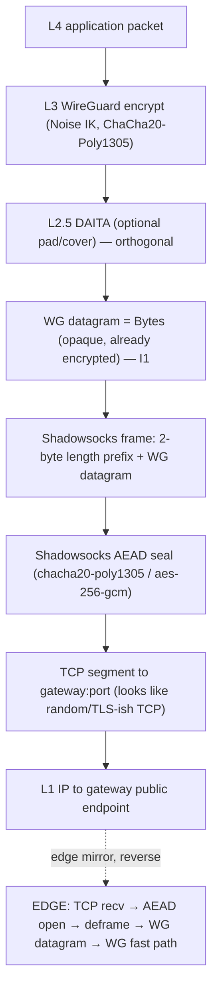
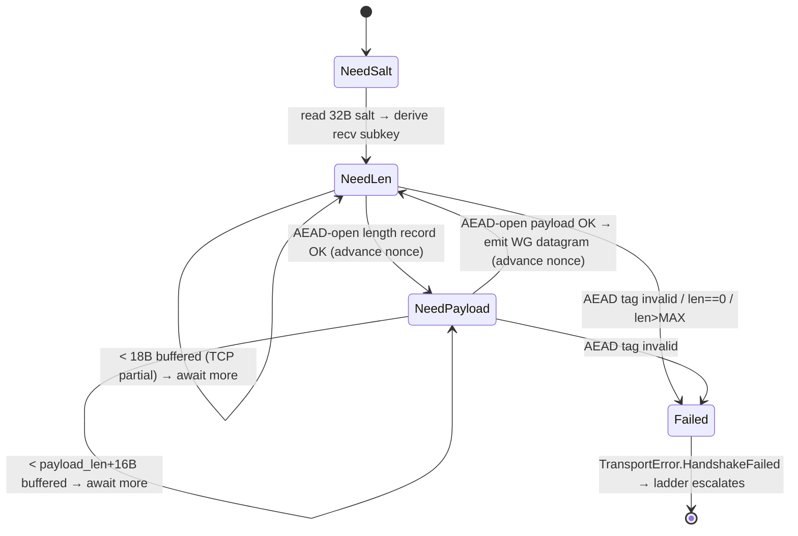
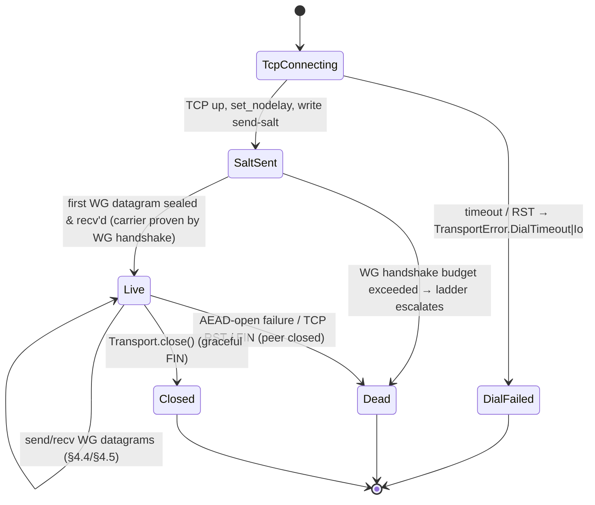

# Shadowsocks-Wrap Transport

**Revision:** 1
**Last modified:** 2026-06-25T00:00:00Z

> Volume 2 (Data Plane) nano-detail specification — deepens the **Shadowsocks-Wrap
> Transport** section of [01-data-plane §3.5]. SPEC ONLY: this document describes the
> `helix-transport/src/shadowsocks.rs` implementation to be built; it is not the shipping
> code. Source evidence cited inline by id: [01-DP §N] = `final/01-data-plane.md`;
> [04_ARCH §N] = `04_VPN_CLD/HelixVPN-Architecture-Refined.md`; [04_P2 §N] = Phase-2
> refined doc; [SYNTHESIS §N]; [research-hysteria2 §N]. Wire-format byte layouts that are
> standard Shadowsocks/SIP protocol knowledge but **not** present in the HelixVPN evidence
> base are flagged `UNVERIFIED` per constitution §11.4.6 and MUST be confirmed against the
> `shadowsocks-rust` source before implementation.

---

## 0. Position, purpose, and what this transport owns

`shadowsocks` is one of the **N pluggable L2 carriers** implementing the `Transport` trait
[01-DP §3.1]. It wraps already-encrypted WireGuard datagrams inside a **Shadowsocks AEAD
byte-stream over a single TCP connection**, so that on the wire the flow looks like random /
TLS-ish encrypted TCP — the canonical evasion for **China-style DPI regimes where even QUIC
is throttled or SNI-filtered** [04_ARCH §3.2, §3.5; 04_P2 §1.1; research-hysteria2 §5a].

### 0.1 Why this transport exists (threat it answers)

The QUIC-primary path (`masque-h3`) is the headline obfuscation [01-DP §3.3], but it **fails
in two regimes** that Shadowsocks-wrap is specifically the answer to:

| Regime | `masque-h3` outcome | `shadowsocks` outcome | Source |
|---|---|---|---|
| GFW SNI-based QUIC censorship (blocking QUIC by SNI since ~2024-04) | blocked unless the H3 proxy SNI is unblocked/fronted | survives — no QUIC, no SNI on the wire | [research-hysteria2 §5a, §6] |
| Hard UDP block / UDP throttling (corporate + China domestic) | fails (needs UDP) | survives — rides TCP | [research-hysteria2 §5b] |
| Active-probing of suspicious TCP endpoints | n/a | mitigated by AEAD + auth (no response to an unauthenticated prober) | [research-hysteria2 §5d] |

It is therefore the **second-to-last rung** of the escalation ladder: above `masque-h3`
(tried when QUIC is blocked) and above `udp-over-tcp` (the absolute last resort) [01-DP §5.3].

### 0.2 Invariants this transport MUST preserve

Inherited from the data-plane non-negotiable invariants [01-DP §0.1]:

| # | Invariant as it binds `shadowsocks` |
|---|---|
| I1 | The transport carries only already-encrypted WG datagrams; the Shadowsocks AEAD layer **never sees plaintext** and the WG keys are **never** the Shadowsocks keys (separate secret, §3). |
| I2 | The carrier conceptually transports **discrete WG datagrams**, never an application byte stream. Because the L1 substrate is TCP (ordered, reliable), datagram boundaries MUST be reconstructed by an explicit length-prefix framing (§4) — TCP's stream nature is hidden behind a datagram API; head-of-line blocking is the accepted cost (§7). |
| I4 | One crate, three consumers: the same `shadowsocks.rs` obfuscates on the client and de-obfuscates on the edge [01-DP §I4]. |
| I5 | No-logging: only aggregate counters (bytes, frame count, AEAD-failure count); never per-connection durable state. |

### 0.3 Out of scope

WG crypto (§4 of [01-DP]); the ladder *policy* that selects this transport (specified in
[01-DP §5.3], consumed here); DAITA placement (above WG, below transport — orthogonal,
[01-DP §9]); the control-plane delivery of the pre-shared Shadowsocks password (doc 02/03 —
this doc consumes it as `SecretBytes`). The `udp-over-tcp` sibling rung is [01-DP §3.6].

---

## 1. Layering & encapsulation (where the bytes go)



The Shadowsocks AEAD layer sits **strictly between** the WG-datagram producer (the
orchestrator's `send`) and the TCP socket. It adds exactly two things on top of the opaque WG
bytes: (a) a **2-byte length prefix** so discrete datagrams survive the byte stream (§4), and
(b) **AEAD confidentiality + integrity + a per-record nonce chain** so DPI sees only
high-entropy bytes [04_ARCH §3.5; 04_P2 §1.1; 01-DP §3.5].

---

## 2. Public surface — trait impl, config, ciphers

### 2.1 `Transport` impl signature

`ShadowsocksTransport` implements the frozen `Transport` trait [01-DP §3.1] unchanged — the
orchestrator cannot tell it apart from `plain_udp` or `masque-h3` at the API level (that is the
whole point of the trait, I4).

```rust
// helix-transport/src/shadowsocks.rs
use async_trait::async_trait;
use bytes::{Bytes, BytesMut};
use tokio::net::TcpStream;
use tokio::sync::Mutex;
use std::net::SocketAddr;

/// WG datagrams wrapped in a Shadowsocks AEAD byte-stream over a single TCP connection.
/// China-style-DPI evasion rung of the ladder [01-DP §3.5]. NEVER sees plaintext (I1).
pub struct ShadowsocksTransport {
    /// Send half — AEAD-sealing writer over the TCP write half. Mutex because `Transport::send`
    /// takes `&self` but the AEAD nonce counter + TCP write half are single-owner (§4.4).
    tx: Mutex<SsWriter>,
    /// Recv half — AEAD-opening reader over the TCP read half + a reassembly buffer (§4.5).
    rx: Mutex<SsReader>,
    peer: SocketAddr,
    method: SsMethod,
    health: HealthCell,
    /// Aggregate counters only (I5): frames sent/recv, bytes, aead_open_failures.
    counters: SsCounters,
}

#[async_trait]
impl Transport for ShadowsocksTransport {
    async fn send(&self, datagram: Bytes) -> Result<(), TransportError>;   // §4.4
    async fn recv(&self) -> Result<Bytes, TransportError>;                 // §4.5
    fn kind(&self) -> &'static str { "shadowsocks" }
    fn effective_mtu(&self) -> u16 { SS_EFFECTIVE_MTU }                    // 1380 (§6)
    fn health(&self) -> TransportHealth { self.health.snapshot() }
    async fn close(&self) -> Result<(), TransportError>;                   // §5.4 (FIN the TCP carrier)
}
```

### 2.2 Config variant (already in the frozen `TransportConfig` enum)

The `Shadowsocks` variant is part of the frozen `TransportConfig` enum [01-DP §3.1]; this doc
specifies its semantics, it does **not** add a field.

```rust
// (reproduced from helix-transport/src/lib.rs [01-DP §3.1] — frozen contract)
TransportConfig::Shadowsocks {
    peer:   SocketAddr,   // gateway TCP endpoint, e.g. gw:443/tcp or gw:8388/tcp (§9 port choice)
    method: SsMethod,     // AEAD cipher selection (§2.3)
    psk:    SecretBytes,  // pre-shared Shadowsocks password — SEPARATE from WG keys (I1, §3)
}

#[derive(Clone, Copy, Debug, PartialEq, Eq)]
pub enum SsMethod {
    Chacha20Poly1305,   // SIP004 AEAD "chacha20-ietf-poly1305" — default (§2.3)
    Aes256Gcm,          // SIP004 AEAD "aes-256-gcm" — AES-NI hosts (§2.3)
}
```

`peer`, `method`, and `psk` are resolved from the `NetworkMap` pushed by the coordinator
(doc 03); they are never compiled in [01-DP §3.1]. `SecretBytes` is a zeroize-on-drop wrapper
(§3.3).

### 2.3 Cipher choice — which AEAD, and why

Two SIP004 AEAD methods are offered [01-DP §3.5 `SsMethod`]; both are reused from the
`shadowsocks-rust` crypto primitives rather than re-implemented [04_P2 §1.1].

| `SsMethod` | Primitive | Tag | Nonce | When the ladder/config picks it |
|---|---|---|---|---|
| `Chacha20Poly1305` (**default**) | ChaCha20-Poly1305 (IETF) | 16 B | 12 B (LE counter, §4.3) | Default. Constant-time in software; best on ARM / non-AES-NI mobile. Same AEAD family WG itself uses, so no new primitive class on the device. |
| `Aes256Gcm` | AES-256-GCM | 16 B | 12 B (LE counter, §4.3) | Hosts with AES-NI / ARMv8 crypto extensions where hardware AES beats ChaCha. Selected by config when the gateway advertises it for that region. |

Both use a **32-byte master key** derived from the `psk` (§3.1) and a **per-direction random
salt** at connection start (§4.1). Tag length is 16 bytes; nonce is a 12-byte little-endian
counter incremented once per AEAD record (§4.3). `UNVERIFIED (SIP004 byte sizes — standard
Shadowsocks AEAD spec, not in HelixVPN evidence base; confirm against shadowsocks-rust
`crypto` module before implementing).`

**Hardening option (Phase 2):** the SIP022 "AEAD-2022" edition (BLAKE3-keyed, fixed
32/16-byte PSK, per-session subkey, built-in replay window) is materially more
probe-resistant than SIP004. It is **not** the default because the frozen `SsMethod` enum
names SIP004 ciphers; adding `Aead2022Blake3Chacha20Poly1305` is a tracked Phase-2 work item,
not an MVP requirement. `UNVERIFIED (SIP022 design — external Shadowsocks-2022 spec, not in
HelixVPN evidence base).`

---

## 3. Key schedule & secret handling

### 3.1 Master key derivation (SIP004 path)

```rust
/// Derive the 32-byte AEAD master key from the user PSK.
/// SIP004 uses the legacy Shadowsocks "EVP_BytesToKey" (MD5-chain) KDF over the password
/// to produce the cipher key length (32 B for both offered methods).
fn ss_master_key(psk: &SecretBytes, key_len: usize) -> SecretBytes; // key_len = 32
```

`UNVERIFIED (EVP_BytesToKey MD5-chain KDF — this is the SIP004 master-key derivation in the
Shadowsocks ecosystem, NOT in the HelixVPN evidence base. It is a known-weak KDF; §11 records
the recommendation to move to SIP022 BLAKE3 PSK in Phase 2. Confirm the exact `shadowsocks-rust`
KDF call before implementing.)`

### 3.2 Per-connection subkey (the actual AEAD key)

Each TCP connection generates a fresh random **salt** per direction; the per-direction
**subkey** that actually seals/opens records is derived by **HKDF-SHA1** over
`(master_key, salt, info="ss-subkey")` [SIP004 convention].

```rust
fn ss_subkey(master_key: &SecretBytes, salt: &[u8]) -> SecretBytes; // HKDF-SHA1, 32-byte out
```

`UNVERIFIED (HKDF-SHA1 + "ss-subkey" info string — SIP004 spec, not in HelixVPN evidence base;
confirm against shadowsocks-rust.)` This per-connection salt is what makes two connections with
the same `psk` produce unrelated wire bytes — required to resist the GFW's packet-size /
correlation heuristics [research-hysteria2 §5d].

### 3.3 Secret lifetime

- `psk: SecretBytes` and every derived key are wrapped in a `Zeroize`-on-drop container; no key
  material is ever logged (I5) or written to durable storage.
- The orchestrator MUST drop `ShadowsocksTransport` (and thus the keys) on `close()` and on
  ladder de-selection; keys do not outlive the TCP connection.
- The Shadowsocks `psk` is **categorically distinct** from the WG private key (I1): a leak of
  the `psk` exposes only the obfuscation layer, never WG confidentiality. Credential handling
  follows constitution §11.4.10 (never git-tracked, `chmod 600`, rotation on suspected leak).

---

## 4. Wire format & framing state machine (the nano-detail core)

### 4.1 Connection-open wire layout (per direction, once)

```
┌───────────────────────────────────────────────────────────────────────┐
│ DIRECTION HEADER (sent once, first bytes on the TCP stream, per side)   │
├───────────────────────────────────────────────────────────────────────┤
│  salt[salt_len]   (random, plaintext on the wire; salt_len == key_len)  │
└───────────────────────────────────────────────────────────────────────┘
   then a sequence of AEAD records (§4.2) for the life of the connection
```

`salt_len = 32` for both offered methods. The salt is sent **in the clear** (it is an input to
the receiver's subkey derivation, not a secret). `UNVERIFIED (salt-first SIP004 framing —
Shadowsocks AEAD spec, not in HelixVPN evidence base.)`

### 4.2 Per-datagram record layout (SIP004 AEAD)

Each WG datagram becomes **exactly one logical Shadowsocks "chunk"**, encoded as two AEAD
records — a length record then a payload record:

```
┌──────────────────────────────────────────────────────────────────────────────┐
│ LENGTH RECORD                                                                  │
│   ciphertext: AEAD_seal(subkey, nonce_n,   plaintext = u16_be(payload_len))    │  2 B plaintext
│   tag:        16 B                                                             │  → 2 + 16 = 18 B
├──────────────────────────────────────────────────────────────────────────────┤
│ PAYLOAD RECORD                                                                 │
│   ciphertext: AEAD_seal(subkey, nonce_n+1, plaintext = WG_datagram[payload_len])│  payload_len B
│   tag:        16 B                                                             │  → payload_len + 16 B
└──────────────────────────────────────────────────────────────────────────────┘
```

- `payload_len` = the WG datagram length, encoded **big-endian u16**. SIP004 caps a single chunk
  payload at **0x3FFF (16383) bytes**; WG datagrams (≤ ~1420 B over IPv4) are always far below
  this cap, so a WG datagram is **never split across chunks** — preserving I2's 1-datagram ↔
  1-frame mapping.
- The two records consume **two consecutive nonces** (`nonce_n`, `nonce_n+1`) from the
  per-direction counter (§4.3). The 16-byte tag on the **length** record is what makes the
  length itself unforgeable (a DPI box cannot inject a fake length to desync the stream).

`UNVERIFIED (0x3FFF chunk cap + 2-byte BE length + double-record framing — SIP004 AEAD wire
spec, not in HelixVPN evidence base; confirm against shadowsocks-rust before implementing. The
2-byte length prefix + AEAD-tag overhead IS grounded in [01-DP §3.5, §10].)`

### 4.3 Nonce discipline

```rust
/// Per-direction 12-byte little-endian counter, incremented by 1 after EACH AEAD record
/// (so a datagram consumes two increments: one for the length record, one for the payload).
struct AeadNonce([u8; 12]);
impl AeadNonce {
    fn zero() -> Self { Self([0u8; 12]) }
    fn next(&mut self) -> [u8; 12] { let n = self.0; le_increment(&mut self.0); n }
}
```

Rules:
1. Send and receive maintain **independent** counters (send counter on `SsWriter`, recv counter
   on `SsReader`).
2. The counter starts at **0** for the first record after the salt and is **never reset** within
   a connection; nonce reuse is a fatal AEAD violation → close the connection.
3. On counter exhaustion (2^96 records — unreachable in practice) the connection MUST be torn
   down and re-dialled rather than wrap.

`UNVERIFIED (LE 12-byte per-record counter starting at 0 — SIP004 nonce convention, not in
HelixVPN evidence base.)`

### 4.4 `send` algorithm

```rust
async fn send(&self, datagram: Bytes) -> Result<(), TransportError> {
    if datagram.len() > SS_MAX_FRAME { return Err(TransportError::Oversize(datagram.len())); } // §6
    let mut w = self.tx.lock().await;               // serialize writers (single nonce chain)
    // 1. length record
    let len_pt = (datagram.len() as u16).to_be_bytes();           // 2 B BE
    let len_ct = w.seal(&len_pt)?;                                // AEAD record (2 + 16 B)
    // 2. payload record
    let pay_ct = w.seal(&datagram)?;                             // AEAD record (n + 16 B)
    // 3. one write (or vectored write) — never interleave with another datagram's records
    w.tcp.write_all_vectored(&[&len_ct, &pay_ct]).await
        .map_err(TransportError::Io)?;
    self.counters.inc_sent(datagram.len());
    Ok(())
}
```

**Atomicity requirement:** the length record and its payload record MUST hit the socket as one
indivisible unit relative to other `send` calls (the `Mutex<SsWriter>` guarantees this).
Interleaving two datagrams' records would desync the receiver's nonce chain (§8 E3).

### 4.5 `recv` algorithm + reassembly state machine

Because TCP delivers a byte stream, `recv` runs a small state machine that buffers partial
records until a whole length-record then a whole payload-record are available:

```rust
enum RxState { NeedSalt, NeedLen, NeedPayload { payload_len: usize } }

async fn recv(&self) -> Result<Bytes, TransportError> {
    let mut r = self.rx.lock().await;
    loop {
        match r.state {
            RxState::NeedSalt => {
                r.fill_at_least(SALT_LEN).await?;            // read 32-byte salt
                r.derive_subkey_from_salt();                 // §3.2 (recv subkey)
                r.state = RxState::NeedLen;
            }
            RxState::NeedLen => {
                r.fill_at_least(2 + TAG_LEN).await?;         // 18-byte length record
                let len = r.open_len_record()?;              // AEAD open → u16 BE, advance nonce
                if len == 0 || len > SS_MAX_FRAME { return Err(TransportError::HandshakeFailed("bad ss frame len".into())); }
                r.state = RxState::NeedPayload { payload_len: len };
            }
            RxState::NeedPayload { payload_len } => {
                r.fill_at_least(payload_len + TAG_LEN).await?; // payload record
                let wg = r.open_payload_record(payload_len)?;  // AEAD open → WG datagram, advance nonce
                r.state = RxState::NeedLen;                     // ready for next datagram
                self.health.mark_recv();
                self.counters.inc_recv(wg.len());
                return Ok(wg);                                 // exactly one WG datagram (I2)
            }
        }
    }
}
```



`fill_at_least(n)` reads from the TCP socket into the reassembly buffer until ≥ `n` bytes are
buffered; on EOF before `n` it returns `TransportError::Closed`. The state machine is
**cancel-safe** (an awaited `recv` dropped inside a `select!` leaves `RxState` + buffer intact)
[01-DP §3.1 cancel-safe requirement].

---

## 5. Dial / connection lifecycle state machine

### 5.1 `dial()` for the Shadowsocks variant

```rust
// dispatched from helix-transport::dial() [01-DP §3.1] for TransportConfig::Shadowsocks
async fn dial_shadowsocks(
    peer: SocketAddr, method: SsMethod, psk: SecretBytes,
) -> Result<Box<dyn Transport>, TransportError> {
    // 1. TCP connect within the ladder's bounded dial timeout (§5.3 budget)
    let tcp = tokio::time::timeout(DIAL_TIMEOUT, TcpStream::connect(peer))
        .await.map_err(|_| TransportError::DialTimeout)?
        .map_err(TransportError::Io)?;
    tcp.set_nodelay(true).map_err(TransportError::Io)?;          // §7 latency: disable Nagle
    let (rh, wh) = tcp.into_split();
    // 2. derive master key, generate per-direction send salt
    let mk = ss_master_key(&psk, 32);
    let send_salt = random_salt(SALT_LEN);
    let mut writer = SsWriter::new(wh, ss_subkey(&mk, &send_salt), AeadNonce::zero(), method);
    // 3. emit our salt (plaintext) as the FIRST bytes on the stream
    writer.write_salt(&send_salt).await?;                        // §4.1
    // 4. reader starts in NeedSalt — peer's salt arrives lazily on first recv (§4.5)
    let reader = SsReader::new(rh, mk.clone(), method);          // recv subkey derived on first salt byte-run
    Ok(Box::new(ShadowsocksTransport { tx: Mutex::new(writer), rx: Mutex::new(reader), /* … */ }))
}
```

**Key point — there is no application-level Shadowsocks handshake to wait on.** Unlike
`masque-h3` (a CONNECT-UDP request/200 round trip [01-DP §3.3]), the Shadowsocks AEAD layer is
**connectionless at the obfuscation layer**: once the TCP connection is up and our salt is
flushed, the carrier is "live" and the **first real liveness signal is the WG handshake
completing through it** [04_ARCH §3.5]. `dial()` returning `Ok` therefore means "TCP + salt
sent", not "peer reachable"; the orchestrator's WG handshake over this transport is the actual
end-to-end proof, and a WG-handshake timeout maps to a ladder escalation (§8 E5).

### 5.2 Connection state machine (carrier lifecycle)



### 5.3 Dial-timeout & ladder budget

`dial_shadowsocks` returns within `DIAL_TIMEOUT` (the ladder's bounded per-rung budget,
`FailureBudget { max_handshakes, window }` [01-DP §5.3]). A `DialTimeout`/`Io(RST)` at TCP
connect, or a WG-handshake budget overrun after the carrier is live, escalates the ladder to
the **next rung (`udp-over-tcp`)** [01-DP §5.3]. On success the orchestrator emits
`TunnelStatus::Connected { transport: "shadowsocks", rtt_ms }` [01-DP §5.2] and the ladder
**remembers `shadowsocks` per-network** (SSID / gateway fingerprint) so a reconnect on the same
hostile network skips straight to it [01-DP §5.3 step 4].

### 5.4 `close()`

```rust
async fn close(&self) -> Result<(), TransportError> {
    let mut w = self.tx.lock().await;
    let _ = w.tcp.shutdown().await;   // graceful FIN; idempotent — second call is a no-op
    Ok(())
}
```

Idempotent per the trait contract [01-DP §3.1]. Keys zeroize on `ShadowsocksTransport` drop
(§3.3). No half-open lingering: a FIN is sent; an unacked peer is reaped by TCP keepalive / the
OS.

---

## 6. MTU & overhead budget

```rust
pub const SS_EFFECTIVE_MTU: u16 = 1380; // [01-DP §10]
pub const TAG_LEN: usize       = 16;
pub const SALT_LEN: usize       = 32;
pub const SS_MAX_FRAME: usize   = 0x3FFF; // SIP004 chunk cap (UNVERIFIED, §4.2)
```

`effective_mtu()` reports **1380** [01-DP §10]: derived as `TCP MSS (~1460 over IPv4) − 2-byte
length prefix − AEAD tag`, left conservative to leave room for the per-datagram framing overhead
[01-DP §3.5, §10]. Per-WG-datagram on-wire overhead:

| Component | Bytes | Note |
|---|---|---|
| TCP/IP headers | 40 (IPv4) / 60 (IPv6) | per TCP segment, amortised across coalesced datagrams |
| salt | 32 | **once per connection**, not per datagram |
| length record (2 B len + tag) | 18 | per datagram |
| payload record tag | 16 | per datagram |
| **per-datagram AEAD/framing total** | **34** | (18 + 16); independent of TCP/IP |

Rules (inherited [01-DP §10]): the inner WG MTU = `min(SS_EFFECTIVE_MTU, path-MTU-discovered)`;
DAITA padding (if active) is added after WG-encrypt and counts against the transport budget, not
the inner MTU; an oversize WG datagram (> `SS_MAX_FRAME`) is a hard `TransportError::Oversize`
— never silently truncated. The exact 1380 value is **measured in Phase 2 bring-up**, not
assumed [01-DP §10, §12.1].

---

## 7. Performance cost vs the UDP transports

Shadowsocks-wrap rides **TCP**, so it inherits TCP semantics the UDP/QUIC transports do not
[01-DP §3.5; 04_ARCH §3.5; 04_P2 §1.1]:

| Axis | `plain-udp` | `masque-h3` (QUIC) | `shadowsocks` (this doc) |
|---|---|---|---|
| Substrate | UDP datagrams | QUIC DATAGRAM frames (unreliable, RFC 9221) | **single TCP byte-stream** |
| Head-of-line blocking | none | none (QUIC datagrams independent) | **yes** — one lost/late TCP segment stalls every WG datagram behind it (§8 E2) |
| TCP-over-TCP meltdown | n/a | n/a | **risk** — WG over TCP carrying TCP app traffic can double-retransmit under loss; mitigated only by being last-resort, not default |
| Loss behaviour | WG drops, recovers | QUIC recovers, WG loss-tolerant | TCP retransmits + reorders → latency spikes, no goodput collapse but jittery |
| CPU cost | lowest | QUIC + H3 framing | AEAD seal/open per datagram + TCP stack (moderate [04_ARCH §3.5 "moderate"]) |
| Nagle | n/a | n/a | **disabled** (`TCP_NODELAY`, §5.1) to avoid 40 ms coalescing latency |
| Goodput @ 5% loss | baseline | beats UoT strawman [01-DP §3.3] | below QUIC; acceptable because it is the *survival* rung, not the *fast* rung |

**Design stance** [01-DP §3.5, §5.3]: the ladder prefers `shadowsocks` **only when UDP and
QUIC are blocked**. Its job is to keep a tunnel *possible* under China-style DPI, not to be
fast; the head-of-line-blocking + TCP-over-TCP penalties are the accepted cost of surviving a
regime where the faster transports do not connect at all [research-hysteria2 §5a, §6]. It sits
**above** `udp-over-tcp` on the ladder because the AEAD wrap gives genuine "looks-random"
camouflage that bare length-prefixed `udp-over-tcp` lacks [01-DP §3.6].

---

## 8. Error taxonomy & edge cases

All errors surface through the frozen `TransportError` enum [01-DP §error.rs]; no new variants.

| # | Edge case | Detection | Mapped error / action |
|---|---|---|---|
| E1 | TCP connect refused / reset / timeout at dial | `connect()` err / `DIAL_TIMEOUT` elapsed | `DialTimeout` / `Io` → ladder escalates to `udp-over-tcp` |
| E2 | TCP segment loss/reorder mid-stream (HOL block) | OS TCP stalls `recv` | **not an error** — `recv` blocks until reassembly completes; surfaces as latency, accounted in §7 |
| E3 | Nonce desync (two datagrams' records interleaved) | impossible by construction (`Mutex<SsWriter>` atomic write, §4.4) | prevented; if ever observed → fatal `HandshakeFailed`, close + re-dial |
| E4 | AEAD tag verification failure on recv (corruption / active tamper / wrong psk) | `open_*_record` returns AEAD error | `HandshakeFailed("ss aead open")` → close + escalate; counter `aead_open_failures++` |
| E5 | WG handshake never completes over a live carrier (silent drop / fake-accept by middlebox) | orchestrator WG-handshake budget overrun | escalate ladder (carrier "Dead", §5.2); the WG handshake is the real liveness oracle (§5.1) |
| E6 | Oversize WG datagram (> `SS_MAX_FRAME`) | length check in `send` (§4.4) | `Oversize(len)` → orchestrator lowers inner MTU / L3-fragments [01-DP §10] |
| E7 | Bad decrypted length (0 or > MAX) on recv | check after length-record open (§4.5) | `HandshakeFailed("bad ss frame len")` → close (a tamper/desync signal) |
| E8 | Peer FIN / half-close mid-stream | `fill_at_least` hits EOF | `Closed` → orchestrator reconnects (ladder remembers `shadowsocks` for this network) |
| E9 | Salt never arrives (peer sends no bytes) | `recv` blocks in `NeedSalt` past WG-handshake budget | orchestrator-side timeout → E5 path |
| E10 | Active prober connects, sends junk | AEAD open fails on first record (no valid salt+subkey) | server side returns nothing useful → prober learns nothing [research-hysteria2 §5d]; client side: E4 |

**Anti-bluff (§11.4.1):** every error path MUST fail only for a genuine carrier/product defect.
A script-internal panic (buffer underflow, nonce-counter overflow handled by §4.3 rule 3) is a
defect to fix at source, never a FAIL-bluff.

---

## 9. Security considerations

1. **Separate trust domain (I1).** The Shadowsocks `psk` protects only the obfuscation envelope.
   WG confidentiality/integrity is independent and unchanged; a `psk` compromise downgrades the
   wire to "visibly WG-shaped TCP" but never decrypts user traffic. This layering is why
   Shadowsocks-wrap is safe to use even though SIP004's KDF is weak (§3.1).
2. **Active-probing resistance** [research-hysteria2 §5d]. The GFW passively flags suspicious
   TCP endpoints (partly by packet-size distribution) then **actively probes** the server. The
   AEAD-from-the-first-record design means an unauthenticated prober that sends arbitrary bytes
   gets an AEAD-open failure and **no protocol response** — the server returns nothing useful
   (E10). To strengthen this, the edge SHOULD (a) randomise/avoid distinctive response timing,
   and (b) on AEAD failure behave like a generic closed/decoy service (mirror of the
   `masque-h3` edge decoy [01-DP §3.3]). `UNVERIFIED (edge decoy-on-probe behaviour for the SS
   port — design recommendation; the masque decoy IS grounded [01-DP §3.3], its SS analogue is
   not separately attested in the evidence base).`
3. **Packet-size fingerprinting.** SIP004's per-connection random salt + AEAD high-entropy
   output defeat static signatures, but constant 18-byte length records can leak a cadence. The
   Phase-2 SIP022 migration (§11) and optional DAITA padding [01-DP §9] address residual
   size/timing leakage; do not claim size-unfingerprintability for SIP004 alone (§11.4.6).
4. **Replay.** SIP004 has no built-in replay window across connections; the per-connection nonce
   chain prevents intra-connection replay, but a recorded-and-replayed whole connection is only
   stopped by WG's own handshake anti-replay (the inner layer). Note this honestly; SIP022 adds
   a replay filter.
5. **No-logging (I5).** Only aggregate counters (§2.1 `SsCounters`); never per-connection or
   per-datagram durable records. AEAD-failure counts are aggregate, not keyed to a peer.
6. **Key zeroization (§3.3).** All key material is `Zeroize`-on-drop; the `psk` is never logged
   (constitution §11.4.10) and never crosses the FFI boundary as plaintext (doc 05).

---

## 10. Config knobs (consumed from the NetworkMap)

| Knob | Type | Source | Default | Effect |
|---|---|---|---|---|
| `peer` | `SocketAddr` | NetworkMap | — | gateway TCP endpoint (§9 port: 443/tcp to blend with HTTPS, or a dedicated SS port) |
| `method` | `SsMethod` | NetworkMap | `Chacha20Poly1305` | AEAD cipher (§2.3) |
| `psk` | `SecretBytes` | NetworkMap (per-tenant secret) | — | obfuscation password (§3) |
| ladder rung index | derived | `TransportPolicy.order` [01-DP §5.3] | after `masque-h3`, before `udp-over-tcp` | when the ladder reaches this transport |
| regional prior | `TransportPolicy.order` push | coordinator [01-DP §5.3 step 5] | CN-resolved clients MAY start at `shadowsocks` | skip escalation latency in censored regions |
| `DIAL_TIMEOUT` | `Duration` | ladder `FailureBudget` [01-DP §5.3] | bounded | TCP-connect + carrier-up budget before escalation |
| `TCP_NODELAY` | `bool` | fixed | `true` (§5.1) | disable Nagle for latency |

No knob is compiled in; all are resolved from the coordinator-pushed map [01-DP §3.1, §6.2].

---

## 11. Phasing & evolution

| Phase | Deliverable | Source |
|---|---|---|
| 1 | `lwo` ships first; `shadowsocks` scaffolded behind the ladder but `udp-over-tcp`/`shadowsocks` are tagged **Phase 2** | [01-DP §12 file-by-file] |
| 2 | Full `shadowsocks.rs` (SIP004 AEAD, both methods), ladder integration, per-network memory, regional priors | [01-DP §12; 04_P2 §1.1] |
| 2+ | SIP022 "AEAD-2022" method (BLAKE3 PSK, replay window) as a hardening `SsMethod` addition; DAITA padding interplay | §2.3, §9; `UNVERIFIED (SIP022 — external spec)` |

The `Transport` trait, `TransportConfig::Shadowsocks` variant, and `SsMethod` enum are **frozen
contracts** [01-DP §3.1, §12 closing note]; only the `shadowsocks.rs` body evolves.

---

## 12. Test points — §11.4.169 comprehensive test-type coverage

Every PASS cites rock-solid captured **physical** evidence (§11.4.5/.69/.107); the only
permitted absence is an honest §11.4.3 SKIP-with-reason, never a silent gap (§11.4.169). The
closed enumerated set, instantiated for this transport:

| Test type (§11.4.169) | Concrete test point for `shadowsocks` | Captured evidence |
|---|---|---|
| **unit** | framing round-trip (`send`→`recv` over an in-memory duplex): 1-datagram = 1-frame (I2); nonce monotonicity; length-record AEAD detects a flipped length byte (E7); `Oversize` boundary at `SS_MAX_FRAME` (E6); cancel-safety of `recv` in `select!`; salt-first ordering (§4.1). Mocks permitted **only here** (§11.4.27). | test logs + assertion traces |
| **integration** (real System, infra via containers submodule §11.4.76) | real `shadowsocks-rust`-derived crypto against a real `helix-edge` over a real TCP socket in a Linux netns; WG handshake completes end-to-end through the carrier (§5.1). | pcap of the netns link + WG handshake success log |
| **e2e** | client→gateway→connector LAN-host reachability with `shadowsocks` pinned; `ping`/`curl` to an advertised LAN host succeeds. | `tshark` capture + reachability log |
| **full-automation** (§11.4.25/.52/.98, deterministic §11.4.50) | the **headline DPI test**: `nft` block all UDP **and** QUIC on :443; assert the ladder auto-escalates plain-udp→lwo→masque-h3→**shadowsocks** and the tunnel survives; `tshark` shows high-entropy TCP with **no WG signature, no QUIC, no SNI**; N=3 identical runs (§11.4.50). | ordered `TunnelStatus` event trace + wire capture, ×3 identical |
| **Challenges** (challenges submodule §11.4.27(B)) | a Challenge bank entry that drives the DPI-block scenario and scores PASS only on positive captured wire evidence. | Challenge `result.json` + evidence path |
| **HelixQA** (helix_qa submodule) | written test-bank entry exercising the carrier under an autonomous QA session. | HelixQA session artefacts |
| **DDoS / load-flood** | flood the SS TCP port with junk/half-open connections; assert the edge does not leak resources, active-probers get no useful response (E10), legitimate carriers stay up. | connection-count + latency telemetry under flood |
| **security** (§11.4.10 + security submodule) | active-probing emulation (send junk → expect AEAD-fail, no protocol response, decoy behaviour, §9.2); wrong-`psk` rejection (E4); `psk` never logged / never git-tracked (§11.4.10). | prober transcript + log-scan proof |
| **stress + chaos** (§11.4.85) | sustained N≥100-iteration send/recv with `tc netem loss 5% reorder`; mid-stream TCP RST injection (E8) → clean reconnect; corrupt one AEAD tag mid-stream (E4) → connection closed not desynced. | per-iteration latency/goodput JSON + recovery trace |
| **concurrency / atomicity** | many concurrent `send` calls assert the `Mutex<SsWriter>` keeps each datagram's two records contiguous (no interleave, E3). | interleave-detector log over K parallel senders |
| **race-condition / deadlock** | concurrent `send`/`recv`/`close` under loom-style or stress scheduling; assert no deadlock between `tx`/`rx` mutexes, `close` idempotent during in-flight `recv`. | scheduler/stress run report |
| **memory** | long-lived connection: assert the reassembly buffer (`SsReader`) does not grow unbounded under a slow/partial-segment peer; keys zeroize on drop (§3.3). | RSS/heap trace + zeroize assertion |
| **benchmarking / performance** | measure goodput + CPU/Gbps + p99 latency vs `plain-udp` baseline and `masque-h3`; quantify the HOL-blocking penalty (§7); confirm `effective_mtu()=1380` is measured not assumed (§6). | `bench.sh` CSV (throughput @ 1/10/100 clients, CPU/Gbps, p99) |

Four-layer §11.4.4(b) enforcement: pre-build gate (framing unit tests + `sh -n`/`cargo check`)
+ post-build (integration in netns) + runtime (full-automation DPI escalation) + paired §1.1
meta-test mutation (e.g. strip the length-record AEAD tag check → the E7 unit test MUST FAIL).
Coverage ledger row per §11.4.25/.52: `shadowsocks × {invariant-1..6} × status`.

---

## 13. Cross-references

- `Transport` trait / `dial()` ladder / `TransportError` — [01-DP §3.1]
- `masque-h3` (the QUIC primary this transport backstops) — [01-DP §3.3]
- `udp-over-tcp` (the rung below) — [01-DP §3.6]
- escalation ladder & per-network memory — [01-DP §5.3, §5.4]
- MTU/overhead budget — [01-DP §10]
- China GFW / active-probing / Shadowsocks evasion facts — [research-hysteria2 §5a, §5b, §5d, §6]
- AEAD-2022 / Phantun udp2tcp alternatives surveyed — [research-hysteria2 §3, §5b]

*End of Shadowsocks-Wrap Transport nano-detail specification (Volume 2, Data Plane). All
wire-format byte layouts flagged `UNVERIFIED` are standard Shadowsocks SIP004 protocol facts
absent from the HelixVPN evidence base and MUST be confirmed against `shadowsocks-rust` before
implementation, per §11.4.6.*
