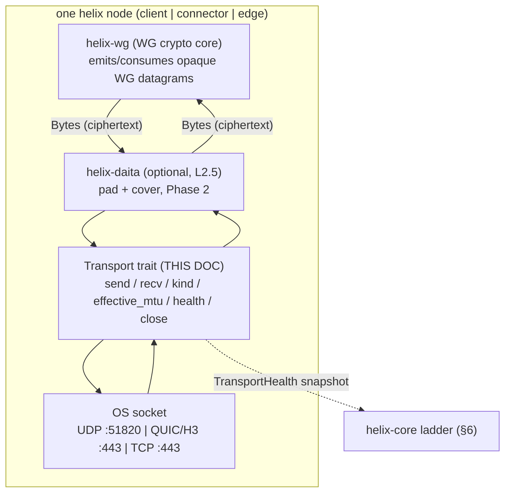
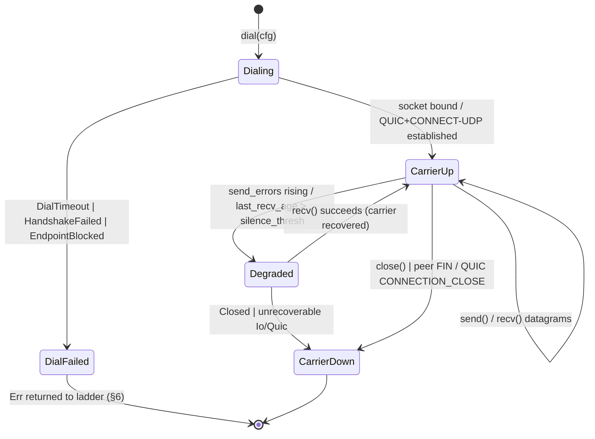
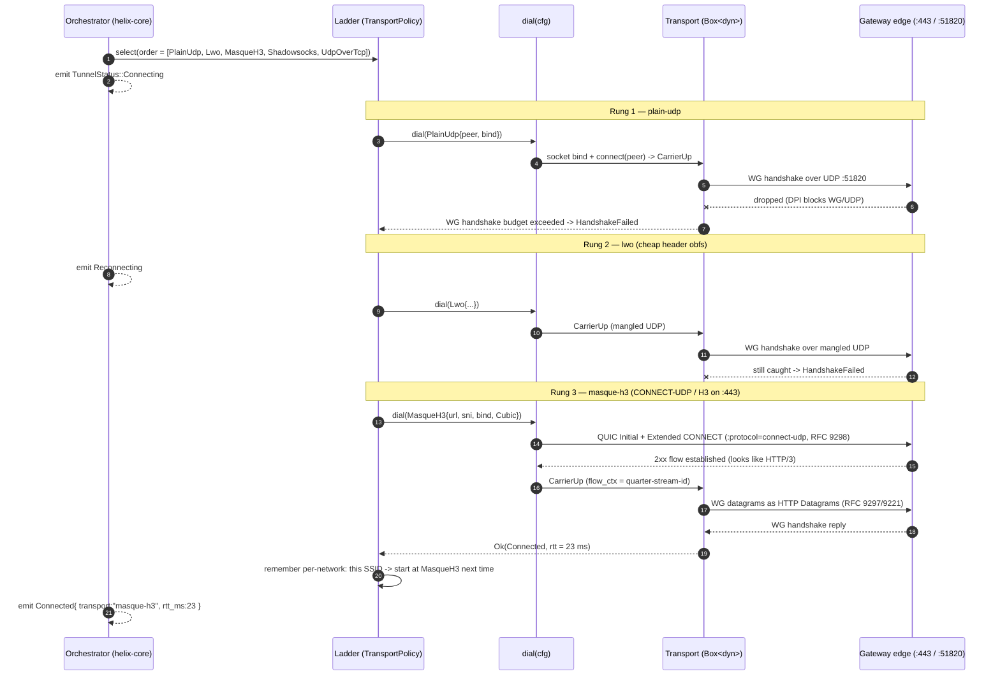
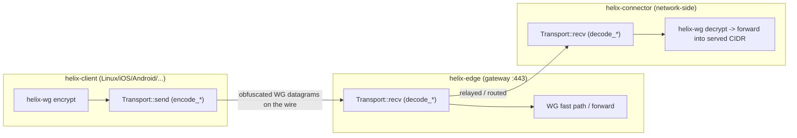

# The Transport Trait

**Revision:** 2
**Last modified:** 2026-07-04T12:00:00Z

> **Rev 2 (consistency reconciliation, 2026-07-04):** added §2.4 reconciling this
> document's frozen trait signature against `SPECIFICATION.md` §7.1's illustrative
> sketch (see below) — no signature or behavioural change, documentation-only.

> Volume 2 (Data Plane) nano-detail specification — deepens §3 ("The Transport
> trait") of the pass-1 data-plane overview [01-data-plane §3]. SPEC ONLY:
> describe **what to build** (signatures, wire formats, state machines, error
> taxonomy, edge cases, security, performance budget, test points); do **not**
> write the shipping product. Source evidence cited inline by id —
> `[01-DP §N]` (final/01-data-plane.md), `[04_ARCH §N]`
> (04_VPN_CLD/HelixVPN-Architecture-Refined.md), `[04_P0 §N]`
> (04_VPN_CLD/HelixVPN-Phase0-Spike.md), `[04_P2 §N]`
> (04_VPN_CLD/HelixVPN-Phase2-Parity.md), `[research-masque]`
> (v09-research/research-masque.md), `[SYNTHESIS §N]`
> (v09-research/_SYNTHESIS.md). Anything not grounded in that evidence base is
> tagged `UNVERIFIED` per constitution §11.4.6 — never fabricated.

---

## 0. Position, ownership, and the one-sentence contract

`helix-transport` is the data plane's **L2 carrier crate**: a decoupled,
project-agnostic Rust crate (`vasic-digital/helix_core` workspace, snake_case,
flat submodule per §11.4.28/.29/.74) [01-DP §2, SYNTHESIS §9]. It owns exactly
one public abstraction — the `Transport` trait — plus its config enum, its
constructor (`dial`), its error taxonomy, and the concrete impls
(`plain_udp`, `masque`, `connect_ip`, `shadowsocks`, `udp_over_tcp`, `lwo`,
`hysteria2`) [01-DP §2, §3].

**The one-sentence contract.** A `Transport` is a *bidirectional carrier for
already-encrypted, unreliable WireGuard datagrams between this node and exactly
one peer endpoint* — it never sees plaintext (invariant I1), never reorders or
retransmits (invariant I2), and is the *same code on client, connector, and
edge* (invariant I4) [01-DP §0.1, §3, 04_P0 §4.2].

This document does **not** own: the WG crypto core (`helix-wg`, §4 of
[01-DP]), the orchestrator three-loop (`helix-core`, [01-DP §5]), the
`WatchNetworkMap` wire contract that *sources* `TransportConfig` (doc 03), nor
the per-platform TUN shims (doc 06). It owns the seam between `helix-wg` above
and the OS socket below.



---

## 1. Non-negotiable transport invariants (the contract every impl must keep)

These bind **every** `Transport` impl. A violation is a release blocker
(§11.4 anti-bluff at the data-plane layer) [01-DP §0.1].

| # | Invariant | Mechanical consequence in this trait | Source |
|---|---|---|---|
| **I1** | The transport never sees plaintext; it carries only already-encrypted WG datagrams. | `send`/`recv` operate on opaque `Bytes`; no impl ever parses the WG header beyond what an obfuscation layer mangles (lwo), and even then it mutates ciphertext bytes, never decrypts. | [04_P0 §4.2] |
| **I2** | The transport carries **unreliable datagrams**, never an ordered byte stream; WG's own loss/reorder semantics are preserved; no head-of-line blocking. | MASQUE uses QUIC DATAGRAM frames (RFC 9221), **not** a QUIC stream. TCP-based carriers (`shadowsocks`, `udp-over-tcp`) accept the HoL penalty *only* as last resort and frame each datagram independently so a parser can still emit per-datagram. | [04_P0 §4.2 design note], [research-masque §1] |
| **I3** | Control plane is never in the packet path; transports keep forwarding if control is down (fail-static). | A `Transport`, once dialed, holds **no** live dependency on the coordinator — it only needs its `TransportConfig` snapshot (resolved at `dial`). | [01-DP §0.1] |
| **I4** | One transport crate, three consumers. | The trait + impls compile identically into `helix-client`, `helix-connector`, `helix-edge`; the edge's de-obfuscation is the inverse of the same `encode_*`/`decode_*` functions the client uses. | [04_ARCH §3.2, §5.5] |
| **I5** | No-logging by construction. | `Transport` impls hold only aggregate counters in `TransportHealth`; **no per-packet, per-connection durable state** is written. Tracing is opt-in, counters-only, never payload. | [01-DP §0.1] |
| **DG** | **Datagram-message boundary preservation.** One `send(dg)` ⇒ exactly one `recv()` on the peer yields that same `dg`'s bytes (modulo loss). No coalescing, no splitting across `recv` calls. | UDP/QUIC-DATAGRAM are message-oriented natively; TCP carriers MUST re-impose the boundary with an explicit length prefix (§4.3, §4.4). | derived from I2 |

> **Honest boundary (§11.4.6).** I2 is preserved *over UDP and QUIC-DATAGRAM
> natively*. Over TCP (`shadowsocks`, `udp-over-tcp`) the wire is an ordered
> stream; the impl re-creates datagram boundaries with a length prefix but
> **cannot** restore loss-tolerance — a lost/late TCP segment HoL-blocks every
> following datagram. This is an accepted, documented degradation, not a bug;
> the ladder (§6) prefers TCP carriers last for exactly this reason
> [01-DP §3.5, §3.6].

---

## 2. The `Transport` trait — full signature & per-method nano-contract

The pass-1 trait [01-DP §3.1] is the frozen Phase-0 surface [04_P0 §4.2, §14].
This section pins the exact semantics of every method: argument ownership,
cancel-safety, blocking behaviour, and the closed set of errors each may return.

```rust
// helix-transport/src/lib.rs
use async_trait::async_trait;
use bytes::Bytes;
use std::net::SocketAddr;
use std::time::Duration;

/// A bidirectional carrier for ALREADY-ENCRYPTED WireGuard datagrams.
/// Invariants: I1 (never plaintext), I2 (unreliable datagrams, never a stream),
/// DG (1 send => 1 recv, boundary-preserving). All async methods are cancel-safe:
/// dropping the returned future at any await point leaves the Transport usable.
#[async_trait]
pub trait Transport: Send + Sync {
    /// Send exactly one WG datagram toward the single peer endpoint.
    /// Ownership: takes `Bytes` by value (cheap ref-counted clone upstream).
    /// Returns Ok(()) once the datagram is handed to the OS / QUIC stack
    /// (NOT once the peer acks — there is no ack; this is fire-and-forget, I2).
    /// Errors: Oversize (dg.len() > effective_mtu+headroom), Closed, Io, Quic,
    ///         EndpointBlocked (ICMP port-unreachable / connection refused seen).
    async fn send(&self, datagram: Bytes) -> Result<(), TransportError>;

    /// Receive the next WG datagram from the peer.
    /// Cancel-safe: usable as a branch in `tokio::select!`; a cancelled recv
    /// MUST NOT drop an already-dequeued datagram (no data loss on cancel).
    /// Blocks (async) until one full datagram is available or the carrier dies.
    /// Errors: Closed (graceful peer FIN / QUIC CONNECTION_CLOSE), Io, Quic.
    async fn recv(&self) -> Result<Bytes, TransportError>;

    /// Stable, lowercase, hyphenated label for logs/metrics/status:
    /// "plain-udp" | "masque-h3" | "connect-ip" | "shadowsocks"
    /// | "udp-over-tcp" | "lwo" | "hysteria2". MUST match `TransportKind` (§3.3).
    fn kind(&self) -> &'static str;

    /// MTU (bytes) the upper layer (WG) may use over this transport, AFTER
    /// per-transport overhead (§7). Constant for the lifetime of the impl
    /// UNLESS path-MTU discovery lowers it (then it MAY shrink, never grow
    /// above the dialed ceiling). Always <= 1420 and >= 1280 (IPv6 floor).
    fn effective_mtu(&self) -> u16;

    /// Cheap, lock-light snapshot of liveness for the ladder's decisions (§6).
    /// MUST be callable at >= 10 Hz without contending the hot send/recv path.
    fn health(&self) -> TransportHealth;

    /// Graceful close: flush QUIC / send TCP FIN / drop the UDP socket.
    /// IDEMPOTENT — a second call is a no-op Ok(()). After close, send/recv
    /// return Err(Closed). MUST complete within CLOSE_GRACE (§5.6).
    async fn close(&self) -> Result<(), TransportError>;
}
```

### 2.1 Per-method nano-contract table

| Method | Concurrency | Cancel-safe? | Returns Ok when | Hot-path? | May trigger ladder escalation? |
|---|---|---|---|---|---|
| `send` | callable concurrently with `recv` from another task; MUST be `&self` (interior mutability) | yes — partial send is impossible at the datagram level (UDP/QUIC-DATAGRAM are atomic; TCP send is buffered & resumable) | datagram handed to OS/QUIC tx queue | yes | only via repeated `EndpointBlocked`/`Io` raising `send_errors`, surfaced through `health()` to §6 |
| `recv` | one logical reader; MUST NOT be called from two tasks simultaneously (`UNVERIFIED`: impls MAY internally serialize, but the orchestrator runs a single recv loop per transport [01-DP §5.1]) | yes — a cancelled `recv` re-queues any partially-read state | one whole datagram dequeued | yes | no (recv errors map to `Down`/`Reconnecting` at orchestrator, §5) |
| `kind` | lock-free, const | n/a | always | metrics only | no |
| `effective_mtu` | lock-free, near-const | n/a | always | per-config only | no |
| `health` | lock-light snapshot of atomics | n/a | always | sampled, not hot | feeds §6 decisions |
| `close` | idempotent | n/a (not awaited under select normally) | carrier flushed/closed | teardown | no |

### 2.2 Object-safety, sizing, and dynamic dispatch

- `Transport` is **object-safe**: `dial` returns `Box<dyn Transport>`
  [01-DP §3.1]. No generic methods, no `Self`-returning methods, no associated
  consts in the public surface — all preserved so `dyn` dispatch works.
- The orchestrator holds the active carrier as `Box<dyn Transport>` and swaps
  it atomically on a ladder escalation (§6.4) — a single `Box` pointer write
  under the orchestrator's transport lock, never mid-datagram.
- `Send + Sync` are **required** supertraits: the carrier is shared between the
  send loop and recv loop tasks (`Arc<dyn Transport>` inside the orchestrator)
  [01-DP §5.1]. `UNVERIFIED`: whether the orchestrator wraps in `Arc` vs moves
  the `Box` into a single combined loop is an orchestrator decision (doc owns
  §5.1), not a trait constraint.

### 2.3 `TransportHealth` — the liveness snapshot

```rust
#[derive(Clone, Debug)]
pub struct TransportHealth {
    /// EWMA of RTT in ms; None until the first RTT sample lands.
    /// RTT source: per-transport — UDP/lwo: WG keepalive echo timing
    /// (UNVERIFIED: helix-wg owns keepalive RTT; transport MAY expose a
    /// carrier-level probe instead); MASQUE/hysteria2: quinn's path RTT
    /// estimate (quinn exposes `Connection::rtt()`); TCP carriers: socket RTT
    /// via TCP_INFO where available, else None.
    pub rtt_ewma_ms: Option<u32>,
    /// Wall-clock ms since the last successful recv() of a datagram.
    /// The ladder uses this for "carrier went silent" detection (§6.3).
    pub last_recv_age_ms: u64,
    /// Monotonic count of send() errors since dial (Io/EndpointBlocked/Quic).
    /// Reset only on a fresh dial(), never decremented (I5: aggregate counter).
    pub send_errors: u32,
}
```

EWMA recommendation (`UNVERIFIED`, calibrate per §11.4.107(13) on real fixtures,
not literature-hardcoded): `rtt_ewma = 7/8 * rtt_ewma + 1/8 * sample` (the
classic TCP SRTT α=1/8 [RFC 6298] is the documented starting point; final α set
by Phase-0 BENCH evidence).

### 2.4 Reconciliation vs `SPECIFICATION.md` §7.1 (documentation-only)

**Gap identified (2026-07-04):** the master spine's §7.1 "Cross-cutting contracts" shows
an earlier, deliberately-illustrative sketch of the `Transport` trait —
`kind() -> TransportKind`, `connect()`/`accept()` returning a separate `TransportConn`
object with its own `send`/`recv`/`health`. That sketch **predates** this nano-detail
deepening and differs at the surface level from the frozen signature in §2 above (where
`Transport` itself exposes `send`/`recv`/`kind`/`effective_mtu`/`health`/`close`, and
construction is via the free function `dial()` rather than `connect`/`accept` methods on
the trait). `SPECIFICATION.md` §0 explicitly self-declares its code blocks as
**"illustrative interface sketches, not final implementations"** — so this is not a
release-blocking contradiction per the parent task's reconciliation rule (§11.4.35: a
per-doc callout stays authoritative in its owning doc), but it is a genuine drift worth
recording so a reader does not implement against the stale sketch:

- **Canonical, frozen signature:** this document (§2) and [01-DP §3.1] — both agree
  byte-for-byte (verified 2026-07-04) — are the binding Phase-0 contract.
- **`TransportKind`** (§3.3 below) is real and does exist, but it is the ladder's
  *policy-ordering* enum (`TransportPolicy.order: Vec<TransportKind>`), not the return
  type of `Transport::kind()` (which returns `&'static str` for logs/metrics, §2).
  `SPECIFICATION.md`'s sketch conflates the two; they are related but distinct types
  here.
- **`CarrierHealth`** in the spine sketch is this document's `TransportHealth` (§2.3
  above) — same concept, renamed during the nano-detail pass.
- **Action recorded, not taken here:** this document is not the owner of
  `SPECIFICATION.md`; a future editorial pass on the spine (outside this document's file
  scope) should update §7.1's sketch to mirror the signature in this section, or add a
  forward-pointer here so implementers are never tempted to code against the older
  illustrative form. Recorded per §11.4.6 (no silent drift) rather than left implicit.

---

## 3. `TransportConfig`, supporting types, and the wire-config seam

### 3.1 The config enum (one variant per L2 carrier)

`TransportConfig` is the **resolved** per-carrier dial parameters. Every variant
is hydrated from the `NetworkMap` pushed by the coordinator (doc 03) — endpoints,
SNI, PSKs, session keys all arrive *already policy-filtered* (need-to-know, I6)
[01-DP §3.1, §6.2]. The data plane never invents an endpoint or a secret.

```rust
// helix-transport/src/lib.rs
#[derive(Clone, Debug)]
pub enum TransportConfig {
    /// Baseline UDP carrier; lowest latency/CPU; throughput baseline (§7).
    PlainUdp     { peer: SocketAddr, bind: SocketAddr },

    /// CONNECT-UDP over HTTP/3 (RFC 9298/9297/9221) — the headline obfs (§4.2).
    MasqueH3     { url: String, sni: String, bind: SocketAddr, congestion: Congestion },

    /// IP-over-HTTP/3 (RFC 9484). Advanced, feature-gated, Phase 2+ (§4.5).
    ConnectIp    { url: String, sni: String, bind: SocketAddr },

    /// WG-in-Shadowsocks AEAD over TCP (China-grade DPI) (§4.3).
    Shadowsocks  { peer: SocketAddr, method: SsMethod, psk: SecretBytes },

    /// WG datagrams length-prefixed over one TCP conn; last resort (§4.4).
    UdpOverTcp   { peer: SocketAddr, tls_sni: Option<String> },

    /// Lightweight per-session keyed header obfs + padding (§4.6).
    Lwo          { peer: SocketAddr, bind: SocketAddr, session_key: SecretBytes },

    /// Hysteria2 + Salamander QUIC-obfs carrier; feature-gated; decision D1.
    #[cfg(feature = "hysteria2")]
    Hysteria2    { url: String, sni: String, salamander_pw: SecretBytes },
}

#[derive(Clone, Copy, Debug, PartialEq, Eq)] pub enum Congestion { Cubic, Bbr }
#[derive(Clone, Copy, Debug, PartialEq, Eq)] pub enum SsMethod  { Chacha20Poly1305, Aes256Gcm }
```

Field semantics:

| Field | Type | Meaning | Constraint |
|---|---|---|---|
| `peer` | `SocketAddr` | the gateway/connector L1 endpoint to send datagrams to | v4 or v6; resolved, never a hostname |
| `bind` | `SocketAddr` | local socket bind addr (`0.0.0.0:0` / `[::]:0` for ephemeral) | UDP carriers only |
| `url` | `String` | full HTTPS URL of the gateway H3 listener, e.g. `https://gw.example:443` | scheme MUST be `https`; informs the RFC 9298 URI template (§4.2.1) |
| `sni` | `String` | TLS SNI presented in the QUIC Initial / ClientHello | drives the fingerprint-mimicry research item (§8.3) |
| `congestion` | `Congestion` | quinn CC: `Cubic` default, `Bbr` for lossy mobile | [01-DP §3.3] |
| `method` | `SsMethod` | Shadowsocks AEAD cipher | reuse `shadowsocks-rust` primitives [04_P2 §1.1] |
| `psk` / `session_key` / `salamander_pw` | `SecretBytes` | per-transport secret, **separate from WG keys** | §3.2; zeroized on drop |
| `tls_sni` | `Option<String>` | if `Some`, wrap the TCP carrier in TLS to look like HTTPS | optional camouflage [01-DP §3.6] |

### 3.2 `SecretBytes` — the secret-handling type (§11.4.10 binding)

`SecretBytes` is the closed type for every transport secret. It is **distinct
from WG keys** — a transport-layer password/PSK, never the device's WG private
key (which never leaves the device, doc 02) [01-DP §3.5, §4].

```rust
// helix-transport/src/secret.rs
/// A transport secret (SS PSK, lwo session key, salamander password).
/// - Debug/Display REDACT (prints "SecretBytes(<redacted>)") — §11.4.10 no-leak.
/// - Zeroize on Drop (memory scrubbed) — uses `zeroize` crate.
/// - No Serialize/Deserialize derive: secrets arrive via the doc-03 wire path,
///   never serialized into a tracked artifact (§11.4.10 / §11.4.30).
pub struct SecretBytes(/* zeroize::Zeroizing<Vec<u8>> */);

impl std::fmt::Debug for SecretBytes {
    fn fmt(&self, f: &mut std::fmt::Formatter<'_>) -> std::fmt::Result {
        f.write_str("SecretBytes(<redacted>)")   // never the bytes (§11.4.10)
    }
}
```

Security rules (release-blocking, §11.4.10): (1) `SecretBytes` MUST `impl Drop`
zeroizing the buffer; (2) `Debug`/`Display` MUST redact; (3) no
`derive(Serialize)`; (4) no logging API ever accepts `SecretBytes`. The SEC
test type (§9) plants a secret value and asserts a repo-wide + log-capture grep
finds it nowhere.

### 3.3 `TransportKind` — the carrier identifier the ladder orders

`TransportKind` is the lightweight, secret-free enum the ladder (§6) sorts and
the coordinator pushes in `TransportPolicy.order` [01-DP §5.3]. One-to-one with
`TransportConfig` variants and with `kind()` strings.

```rust
// helix-transport/src/lib.rs
#[derive(Clone, Copy, Debug, PartialEq, Eq, Hash)]
pub enum TransportKind {
    PlainUdp, MasqueH3, ConnectIp, Shadowsocks, UdpOverTcp, Lwo,
    #[cfg(feature = "hysteria2")] Hysteria2,
}
impl TransportKind {
    pub const fn label(self) -> &'static str { /* matches kind() strings (§2) */ }
}
```

---

## 4. Per-carrier dial detail & wire formats (byte layouts)

Each subsection pins the on-wire byte layout the impl must produce/consume so
the *client encode* and *edge decode* (I4) are provably inverse. WG datagram =
the opaque ciphertext payload from `helix-wg`; its own header layout (message
type, sender/receiver index, counter, AEAD tag) is owned by WG and treated as
opaque here [01-DP §4].

### 4.1 `plain-udp` — baseline (Phase 0, always available)

Wire = the WG datagram, raw, in one UDP payload. No framing added.

```
L1 IP | UDP(:51820) | [ ---- WG datagram (opaque ciphertext) ---- ]
```

`effective_mtu()` = **1420** (`1500 − 20 IPv4 − 8 UDP − ~52 WG hdr+tag` headroom
per [04_P0 §4.3]; `1440` over IPv6 path-MTU `UNVERIFIED` — measured in Phase 0
BENCH, the table value 1420 is the conservative IPv4 default) [01-DP §10].
`dial` = bind the UDP socket, `connect(peer)` (so `send`/`recv` need no addr),
return immediately — there is **no carrier handshake** (the WG handshake rides
on top, owned by `helix-wg`). Fastest dial (sub-ms).

### 4.2 `masque-h3` — CONNECT-UDP over HTTP/3 (the headline obfuscation)

The "QUIC mode" — Mullvad's literal mechanism, WG-over-MASQUE [04_ARCH §0,
research-masque §2]. Four-RFC layering [research-masque §1]:

```
WG datagram (Bytes, opaque ciphertext)
  └▶ HTTP Datagram (RFC 9297): [ Quarter-Stream-ID (varint) | Context-ID=0 (varint) | WG payload ]
       └▶ QUIC DATAGRAM frame (RFC 9221, UNRELIABLE — matches WG loss semantics, I2)
            └▶ QUIC / HTTP-3 connection to https://gw:443  (looks like a browser doing H3)
                 └▶ EDGE: CONNECT-UDP proxy (RFC 9298) strips framing → WG datagram → kernel WG
```

#### 4.2.1 CONNECT-UDP establishment (once, at `dial`)

Per RFC 9298 + RFC 9220 Extended CONNECT [research-masque §1]:

1. Open a QUIC/H3 connection to `url` (`quinn` + `h3`), TLS SNI = `sni`, ALPN =
   `h3`. Negotiate `max_datagram_frame_size` transport param > 0 (RFC 9221) —
   if the peer does not offer QUIC datagrams, `dial` fails `HandshakeFailed`
   (the carrier is unusable without unreliable datagrams, I2) [research-masque §1].
2. Issue an **Extended CONNECT** request stream: `:method = CONNECT`,
   `:protocol = connect-udp`, `:scheme = https`, `:authority = <host:port>`,
   `:path = /.well-known/masque/udp/{target_host}/{target_port}/` (RFC 9298 URI
   template; `{target}` = the gateway's local WG endpoint) [research-masque §1].
3. On `2xx` the flow is established; record the **Quarter-Stream-ID** (= the
   request stream id / 4) used to tag every datagram to this flow (RFC 9297).
   This is `flow_ctx` in the pass-1 sketch [01-DP §3.3].
4. Thereafter WG datagrams ride as HTTP Datagrams with **no per-packet HTTP
   round trip** [01-DP §3.3, 04_P0 §5.1].

> **Maturity caveat (release-relevant, not a spec defect).** There is **NO
> turnkey Rust crate** for RFC 9298 CONNECT-UDP; it is hand-rolled on `quinn`
> + `h3` + `h3-datagram` (v0.0.2, pre-1.0) [research-masque §3]. The impl MUST
> hand-write: the Extended-CONNECT request/response, the Quarter-Stream-ID
> datagram mux, and (edge side) the UDP-socket relay. Mullvad's published
> `quinn_udp` dependency confirms this is the trodden path [research-masque §2].
> Budget as real engineering; this immaturity is the input to decision D5
> (edge language, [01-DP §11.2]).

#### 4.2.2 HTTP-Datagram byte layout (the per-packet hot path)

```
HTTP/3 Datagram (RFC 9297) payload, carried in one QUIC DATAGRAM frame (RFC 9221):
┌────────────────────────────┬──────────────────────────┬───────────────────────┐
│ Quarter Stream ID (QUIC     │ Context ID (QUIC varint)  │ Proxied UDP payload   │
│ varint, identifies the      │ = 0x00 for the raw UDP    │ = the WG datagram     │
│ CONNECT-UDP request stream) │ payload (RFC 9298 §5)     │ (opaque, I1)          │
└────────────────────────────┴──────────────────────────┴───────────────────────┘
```

`encode_http_datagram(flow_ctx, wg)` prepends the two varints; `send_datagram`
hands it to `quinn` [01-DP §3.3]. `decode_http_datagram(dg)` strips them back to
the WG bytes. Edge = the exact inverse (I4). Context-ID 0 = raw UDP payload per
RFC 9298 §5 [research-masque §1].

`effective_mtu()` = **1280** (measure & tune): QUIC long/short header + DATAGRAM
frame header + the two varints eat headroom; 1280 is the IPv6 minimum-MTU floor
and a safe default [01-DP §3.3, §10]. The exact penalty is **quantified in
Phase-0 BENCH** (record MTU/throughput/CPU vs plain-udp) so the ladder cost
model is real [04_P0 §5.3].

#### 4.2.3 Masquerade (decoy on non-CONNECT-UDP probes)

The edge `:443` listener serves a believable decoy site to anything that is
**not** a valid CONNECT-UDP flow (scanners/probes) — native edge behaviour,
not Nginx camouflage [01-DP §3.3, 04_P0 §5.4]. Verified by the SEC/IT G2 check:
`tshark` classifies the flow as HTTP/3 with **no WG signature** [04_P0 §8].

### 4.3 `shadowsocks` — WG-in-Shadowsocks AEAD over TCP

WG datagrams wrapped in a Shadowsocks AEAD stream — "looks like random/TLS-ish
TCP" where even QUIC is throttled [01-DP §3.5, 04_P2 §1.1]. Reuse
`shadowsocks-rust` crypto primitives, do not re-implement AEAD framing
[04_P2 §1.1].

Per-datagram wire (re-imposes the DG boundary over the TCP stream):

```
TCP stream (after SS AEAD session established) carries repeated frames:
[ 2-byte length prefix (big-endian, = WG datagram len) | WG datagram ]  ──► AEAD-encrypt each chunk
recv: AEAD-decrypt ──► read 2-byte len ──► read len bytes ──► one WG datagram (DG boundary restored)
```

`dial` = TCP connect to `peer`, derive the SS session subkey from `psk` +
salt (per SS AEAD spec, owned by `shadowsocks-rust`), no extra app handshake.
`effective_mtu()` ≈ **1380** (TCP MSS − 2-byte length prefix − AEAD tag) [01-DP §10].
Carries the I2 HoL caveat (TCP); ladder rung above QUIC.

### 4.4 `udp-over-tcp` — last resort (all UDP blocked)

WG datagrams length-prefixed over one TCP connection — matches Mullvad's
`udp2tcp` [01-DP §3.6, 04_P2 §1.2]. Optional TLS wrap (`tls_sni`) to look like
HTTPS. Lowest ladder rung; exists only to keep a tunnel *possible*.

```
TCP (optionally inside TLS if tls_sni=Some) stream of frames:
[ 2-byte length prefix (big-endian) | WG datagram ] [ 2-byte len | WG datagram ] ...
```

`effective_mtu()` ≈ **1380** (TCP MSS − length prefix) [01-DP §10]. Full HoL
penalty accepted by design.

### 4.5 `connect-ip` — IP-over-HTTP/3 (RFC 9484, advanced, feature-gated)

Proxies **IP packets** (not inner WG) over HTTP/3 via CONNECT-IP [01-DP §3.4,
research-masque §1]. **Spec stance:** Phase 2+, behind a Cargo feature; default
path stays inner-WG-over-`masque-h3`. CONNECT-IP **loses I1's "transport never
sees plaintext"** at the gateway (the gateway terminates IP), so it is **not**
offered to privacy clients by default — only explicit site-to-site routing where
the gateway is already a trusted router [01-DP §3.4]. `effective_mtu()` ≈ 1300
(IP-over-H3, no inner-WG header but QUIC overhead) [01-DP §10].

### 4.6 `lwo` — lightweight WG obfuscation (cheap evasion)

Per-session keyed obfuscation of the WG header bytes DPI signatures key on
(message-type / reserved fields) + randomized padding — near-zero-cost evasion
of *naive* WG fingerprinting without QUIC overhead [01-DP §3.7, 04_P2 §1.3].
Mullvad's "LWO" is the design reference. Phased: Phase-1 basic XOR/padding,
Phase-2 hardened per-session keyed scheme [01-DP §3.7].

```
Over UDP, per datagram:
  obfuscate(session_key, wg) = [ mangle WG header bytes via keystream(session_key) | WG body | random pad (len ∈ [0, P]) ]
  deobfuscate inverts the mangle + strips pad (pad length carried in a keyed field — UNVERIFIED exact field; Phase-1 design owns it)
```

I1 preserved: lwo mutates **ciphertext** bytes; it never decrypts. First (cheap)
escalation rung above plain-udp [01-DP §3.7]. `effective_mtu()` ≈ 1400
(plain-udp minus padding budget) [01-DP §10].

### 4.7 `hysteria2` — decision D1 carrier (feature-gated)

WG datagrams over Hysteria2's QUIC-datagram channel + Salamander packet obfs;
**reuses the same `quinn` dependency** as `masque-h3`; the obfs differs, the
WG-datagram contract is identical (I2) [01-DP §3.8]. **D1 recommendation:
`masque-h3` is primary** (literal Mullvad parity, single Rust impl, keeps WG the
crypto core); `hysteria2` ships as an *additional* `Transport` impl behind a
Cargo feature — a ladder rung and a Phase-0 unblock if MASQUE-in-Rust proves
painful [01-DP §3.8, SYNTHESIS §3 D1]. **DECISION D1 is SURFACED, not silently
resolved** (§11.4.66).

### 4.8 MTU & overhead summary (`effective_mtu()` per carrier)

| Carrier | `effective_mtu()` | Basis | Source |
|---|---|---|---|
| `plain-udp` | **1420** | 1500 − 20 IP − 8 UDP − ~52 WG | [01-DP §10, 04_P0 §4.3] |
| `masque-h3` | **1280** (measure & tune) | QUIC + HTTP-Datagram + 2 varints; IPv6 floor | [01-DP §10, 04_P0 §5.2] |
| `connect-ip` | ~1300 | IP-over-H3, QUIC overhead | derived [01-DP §10] |
| `shadowsocks` | ~1380 | TCP MSS − 2B len − AEAD tag | derived [04_P2 §1.1] |
| `udp-over-tcp` | ~1380 | TCP MSS − len prefix | derived [04_P2 §1.2] |
| `lwo` | ~1400 | plain-udp − pad budget | derived [04_P2 §1.3] |
| `hysteria2` | ~1280 | QUIC + Salamander, same family as masque | `UNVERIFIED` (measure) |

Rules [01-DP §10]: (1) inner WG MTU = `min(active.effective_mtu(),
path-MTU-discovered)`; (2) DAITA padding is added **after** WG encrypt and counts
against the transport budget, not the inner MTU; (3) `Oversize` is a **hard
error** — the orchestrator lowers inner MTU / L3-fragments rather than silently
truncate.

---

## 5. Lifecycle state machine (connect / handshake / up / reconnect / down)

A `Transport`'s lifecycle has two coupled layers: the **carrier** layer (this
crate — socket/QUIC/TCP up-or-down) and the **tunnel** layer (`helix-wg`
handshake on top, owned by [01-DP §4]). The orchestrator's `TunnelStatus`
[01-DP §5.2] is the *user-facing* projection of both.

### 5.1 Carrier-level states (owned by a single `Transport` impl)



- **Dialing**: `dial(cfg)` runs within a bounded `DIAL_TIMEOUT` (§5.5). For
  `plain-udp` this is a socket bind (sub-ms); for `masque-h3` it is the full
  QUIC + Extended-CONNECT establishment (§4.2.1).
- **CarrierUp**: datagrams flow. No WG state here — the carrier is oblivious to
  whether the WG handshake on top has completed (I1).
- **Degraded**: a *soft* state surfaced via `health()` (rising `send_errors` /
  growing `last_recv_age_ms`), not a hard error. The orchestrator/ladder reads
  it to pre-emptively escalate before a hard failure (§6.3).
- **CarrierDown**: terminal; `send`/`recv` return `Err(Closed)`. Reached by
  `close()` (graceful) or an unrecoverable error.

### 5.2 Tunnel-level states (orchestrator projection — the UX seam)

The orchestrator composes carrier state with the WG handshake into
`TunnelStatus`, broadcast to FFI + metrics + ladder via `tokio::sync::broadcast`
[01-DP §5.2]:

```rust
// helix-core/src/status.rs  (consumed here; OWNED by [01-DP §5.2])
#[derive(Clone, Debug)]
pub enum TunnelStatus {
    Connecting,                                    // dial in flight (carrier Dialing)
    Handshaking,                                   // carrier up, WG handshake in flight
    Connected { transport: String, rtt_ms: u32 },  // carrier up + WG established
    Reconnecting,                                  // carrier down/escalating; ladder advancing
    Down { reason: String },                       // all rungs exhausted / fatal
}
```

### 5.3 Combined lifecycle (carrier ⇄ WG ⇄ status)

```mermaid
stateDiagram-v2
  [*] --> Connecting : orchestrator start()
  Connecting --> Handshaking : carrier CarrierUp (dial Ok)
  Connecting --> Reconnecting : dial Err (DialTimeout/HandshakeFailed/EndpointBlocked)
  Handshaking --> Connected : WG handshake reply received (helix-wg)
  Handshaking --> Reconnecting : WG handshake budget exceeded
  Connected --> Connected : datagrams flow; periodic WG keepalive/rekey
  Connected --> Reconnecting : carrier Degraded->Down OR WG rekey fails
  Reconnecting --> Handshaking : next ladder rung dial Ok (§6)
  Reconnecting --> Down : ladder exhausted (all rungs failed)
  Down --> Connecting : operator/auto retry (backoff)
  Connected --> [*] : close()
```



> **Boundary note (§11.4.6).** `Connected{rtt_ms}` is emitted only after the
> **WG** handshake reply lands (a `helix-wg` event), not merely on `CarrierUp` —
> a carrier can be up while the WG tunnel never establishes (e.g. wrong WG
> peer key). The status enum reflects *tunnel* liveness, the truth the user
> cares about [01-DP §5.2].

### 5.4 Reconnect / roaming semantics

- **WG roaming is free.** WireGuard latches onto whatever source address a valid
  handshake/keepalive arrives from; a network change (Wi-Fi→cellular) that keeps
  the carrier reachable needs **no transport re-dial** — WG roams on top
  [01-DP §8 step 2]. The transport only re-dials when the *carrier* dies
  (socket error, QUIC CONNECTION_CLOSE).
- **Per-network memory.** On a successful dial, the ladder remembers the working
  `TransportKind` keyed by network identity (SSID / gateway fingerprint) so a
  reconnect on the same hostile network skips straight to what worked
  [01-DP §5.3 step 4]. This is ladder state (§6), not transport state.
- **Reconnect backoff** (`UNVERIFIED` exact schedule — orchestrator owns it):
  recommended exponential backoff with jitter between full ladder sweeps to
  avoid thundering-herd re-dials; the per-rung failure budget (§6.2) governs
  within a sweep.

### 5.5 Timeout & budget constants (carrier-level)

| Constant | Recommended default | Meaning | Source |
|---|---|---|---|
| `DIAL_TIMEOUT` | 5 s (`UNVERIFIED`, tune) | max time for `dial` before `DialTimeout` | [01-DP §3.1 "bounded dial timeout"] |
| `silence_thresh` (last_recv_age) | 15 s (`UNVERIFIED`) | carrier→Degraded if no recv | derived from §6.3 |
| `CLOSE_GRACE` | 2 s (`UNVERIFIED`) | max time `close()` may take to flush | §2 close contract |
| per-rung `FailureBudget` | `{ max_handshakes: 3, window: 10 s }` (`UNVERIFIED`) | dials/handshakes before escalate | [01-DP §5.3] |

All four are **calibrated on Phase-0 fixtures** (§11.4.107(13) no-hardcoded-from-
literature) and recorded in the BENCH evidence, not asserted [04_P0 §8].

### 5.6 `close()` semantics

`close` is **idempotent** and bounded by `CLOSE_GRACE`. Per carrier: `plain-udp`
drops the socket (Ok immediately); `masque-h3`/`hysteria2` call
`quinn::Connection::close(0, b"bye")` and let quinn flush [01-DP §3.3];
`shadowsocks`/`udp-over-tcp` send TCP FIN. After `close`, `send`/`recv` return
`Err(Closed)`. A second `close` is a no-op `Ok(())`.

---

## 6. `dial()` and the escalation-ladder constructor

### 6.1 `dial` — the single constructor

```rust
/// Build a live, CarrierUp Transport from a resolved config.
/// Returns within DIAL_TIMEOUT (§5.5). On DialTimeout/HandshakeFailed/
/// EndpointBlocked the LADDER (§6.4) escalates to the next rung.
/// On Ok, the returned Box<dyn Transport> is in state CarrierUp (§5.1).
pub async fn dial(cfg: TransportConfig) -> Result<Box<dyn Transport>, TransportError> {
    match cfg {
        TransportConfig::PlainUdp { peer, bind }      => /* §4.1 */,
        TransportConfig::MasqueH3 { url, sni, bind, congestion } => /* §4.2 */,
        TransportConfig::ConnectIp { .. }             => /* §4.5 feature-gated */,
        TransportConfig::Shadowsocks { peer, method, psk } => /* §4.3 */,
        TransportConfig::UdpOverTcp { peer, tls_sni } => /* §4.4 */,
        TransportConfig::Lwo { peer, bind, session_key } => /* §4.6 */,
        #[cfg(feature = "hysteria2")]
        TransportConfig::Hysteria2 { url, sni, salamander_pw } => /* §4.7 */,
    }
}
```

`dial` is the **only** way to obtain a `Transport`; impls expose no public `new`
that bypasses the bounded-timeout + state-machine guarantees.

### 6.2 The ladder policy (owned by `helix-core/src/ladder.rs`, consumed here)

```rust
// helix-core/src/ladder.rs  ([01-DP §5.3])
pub struct TransportPolicy {
    pub order:  Vec<TransportKind>, // coordinator-pushed; e.g. regional prior (§6.5)
    pub pin:    Option<TransportKind>, // user manual override — skip the ladder
    pub budget: FailureBudget,      // { max_handshakes: u8, window: Duration } per rung
}
pub struct FailureBudget { pub max_handshakes: u8, pub window: Duration }

// Default order (unrestricted network):           [ PlainUdp ]
// Restricted prior (censored region, coordinator): [ PlainUdp, Lwo, MasqueH3, Shadowsocks, UdpOverTcp ]
```

### 6.3 Selection algorithm (the rung-walk) [01-DP §5.3]

1. Start at `pin` if set (manual override), else `order[0]`.
2. Resolve the rung's `TransportKind` to a `TransportConfig` (hydrate secrets
   from the NetworkMap), call `dial(cfg)`.
3. On `Ok(carrier)` within the rung's `FailureBudget` → done; the WG handshake
   proceeds on top; emit `Connected{transport, rtt}` once WG establishes.
4. On `DialTimeout`/`HandshakeFailed`/`EndpointBlocked` **exceeding the rung's
   budget** → escalate to the next rung; emit `Reconnecting`.
5. A `Degraded` carrier (§5.1) that crosses `silence_thresh` is treated as a
   soft failure and triggers escalation **without** waiting for a hard error
   (pre-emptive, reads `health()`).
6. On success, **remember the working `TransportKind` per-network** (SSID /
   gateway fingerprint) — reconnects on the same hostile network skip straight
   to what worked [01-DP §5.3 step 4].
7. Telemetry records **only** "transport X succeeded after N escalations in
   region R" (aggregate, no per-user data, I5) → Censorship-Evasion Success
   dashboard [01-DP §5.3 step 6].

### 6.4 Atomic carrier swap

On escalation the orchestrator: `close()` the failed carrier (best-effort,
ignore error) → `dial` the next rung → on Ok, atomically swap the active
`Box<dyn Transport>` under the transport lock (§2.2) → resume the send/recv
loops against the new carrier. The swap never happens mid-datagram (datagrams
are atomic, DG).

### 6.5 Regional prior & per-leg topology

- The coordinator may push a **regional prior** (e.g. CN-resolved clients start
  at `Shadowsocks`) so users in censored regions don't pay escalation latency
  every time [01-DP §5.3 step 5].
- **Per-leg topology (decision D6)** is free: each leg is an independent
  `Transport` selection. The coordinator pushes a `TransportPolicy.order`
  *per leg* — user↔gateway may start at `masque-h3`/`hysteria2` while
  gateway↔connector stays `plain-udp` on cooperative networks. **No code change
  beyond per-leg policy** [01-DP §11.3, SYNTHESIS §3 D6]. **D6 SURFACED.**

### 6.6 Ladder sequence (the headline diagram)



---

## 7. Error taxonomy

```rust
// helix-transport/src/error.rs  ([01-DP §3.1])
#[derive(thiserror::Error, Debug)]
pub enum TransportError {
    #[error("dial timed out")]               DialTimeout,
    #[error("handshake failed: {0}")]        HandshakeFailed(String), // -> ladder escalation
    #[error("peer endpoint blocked")]        EndpointBlocked,         // DPI/firewall verdict
    #[error("transport closed")]             Closed,
    #[error("oversize datagram {0} > mtu")]  Oversize(usize),
    #[error("io: {0}")]                       Io(#[from] std::io::Error),
    #[error("quic: {0}")]                     Quic(String),
}
```

### 7.1 Per-variant semantics & ladder coupling

| Variant | Raised by | Carrier-state effect | Ladder action | Source |
|---|---|---|---|---|
| `DialTimeout` | `dial` exceeding `DIAL_TIMEOUT` | Dialing→DialFailed | **escalate** to next rung | [01-DP §3.1] |
| `HandshakeFailed(why)` | `dial` (QUIC/CONNECT-UDP failed) **or** orchestrator (WG handshake budget exceeded) | Dialing→DialFailed | **escalate** (the canonical escalation trigger) | [01-DP §3.1, §5.3] |
| `EndpointBlocked` | `send`/`dial` on ICMP port-unreachable / TCP RST / connection-refused (DPI/firewall verdict) | CarrierUp→CarrierDown | **escalate** | [01-DP §3.1] |
| `Closed` | `send`/`recv` after `close` or peer FIN / QUIC CONNECTION_CLOSE | →CarrierDown | orchestrator → `Reconnecting`/`Down` | [01-DP §3.1] |
| `Oversize(n)` | `send` when `datagram.len() > effective_mtu + headroom` | none (rejects the one datagram) | **no escalation**; orchestrator lowers inner MTU / L3-fragments (§4.8 rule 3) | [01-DP §3.1, §10] |
| `Io(e)` | any syscall error | varies; repeated → Degraded | counted in `send_errors`; sustained → escalate | [01-DP §3.1] |
| `Quic(s)` | quinn errors (masque/hysteria2/connect-ip) | varies | sustained → escalate | [01-DP §3.1] |

### 7.2 Error classification rules (§11.4.6 no-guessing)

- An error is **never** labelled "transient/flaky" without captured evidence
  (§11.4.6/.50) — the RACE/SC test types (§9) deterministically reproduce each
  class N times.
- `EndpointBlocked` vs `Io` discrimination is **observational, not guessed**:
  `EndpointBlocked` requires a concrete signal (ICMP unreachable, RST, refused);
  ambiguous silence is `last_recv_age` Degraded, not `EndpointBlocked`.
- `HandshakeFailed` carries a `String` reason (e.g. "no QUIC datagram support",
  "CONNECT-UDP 4xx", "WG no handshake reply in budget") for the §6 telemetry —
  **never** a secret value (§11.4.10).

---

## 8. How the same trait serves client, connector, and edge (I4)

**One trait, three consumers, N transports** [04_P0 §4.2]. The byte-for-byte
shared-code guarantee is the whole point of the crate [01-DP §0.1 I4].



### 8.1 Client role

Captures the device default route, encrypts in `helix-wg`, optionally shapes in
`helix-daita`, then `Transport::send`s. Runs the **ladder** (§6) — it is the only
role that *escalates* (the edge/connector accept whatever carrier the client
dials). `effective_mtu()` sets the inner WG MTU [01-DP §5.1, §10].

### 8.2 Connector role

The **same core**, different routing posture: instead of capturing the default
route it (a) advertises served CIDRs, (b) NATs/forwards decapsulated packets
into the LAN [01-DP §5.1]. It is a `Transport` **recv-side** consumer for
gateway↔connector traffic; on cooperative networks this leg typically stays
`plain-udp` (per-leg D6, §6.5) [01-DP §11.3]. One binary,
`--mode={client|connector}` [01-DP §5.1].

### 8.3 Edge role (gateway MASQUE termination — decision D5)

The edge is the **third consumer of `helix-transport`** [01-DP §2]. It runs the
**inverse** of every `encode_*`/`decode_*`: `decode_http_datagram` where the
client `encode`d, terminating CONNECT-UDP and emitting plain WG datagrams to the
kernel WG fast path (§4.2). **Decision D5 (Rust vs Go edge) is SETTLED BY THE
PHASE-0 G4 BENCHMARK** [01-DP §11.2, SYNTHESIS §3 D5]: this spec **assumes Rust**
(shares `helix-transport` byte-for-byte, no GC on the hot path), with Go
(`quic-go`+`masque-go`) as the conformance-suite-mitigated fallback if
MASQUE-in-Rust proves painful (dual impls kept in sync by **shared test vectors
+ a cross-edge conformance suite**) [01-DP §11.2, research-masque §4]. **D5
SURFACED.**

> **Conformance-suite contract (anti-bluff, §11.4.27/.50).** If the Go edge is
> adopted, the I4 guarantee is preserved by a **shared `encode/decode` test
> vector corpus**: a frozen set of `(WG datagram, on-wire bytes)` pairs that
> BOTH the Rust client `encode` and the Go edge `decode` (and vice versa) must
> satisfy bit-for-bit. A divergence is a release blocker — it is the mechanical
> proof that "the client obfuscates with the same logic the edge de-obfuscates."

---

## 9. Test points — tied to the §11.4.169 closed test-type vocabulary

Every `Transport` workable item declares its required test types from the
§11.4.169 closed set; the ONLY permitted absence of a warranted type is an honest
§11.4.3 SKIP-with-reason, never a silent gap [06-phase0-spike-wbs §0.4]. Four-
layer enforcement per §11.4.4(b) applies to every closure.

| Code (§11.4.169) | Type | Concrete test point for `helix-transport` | Evidence (§11.4.5/.69/.107) |
|---|---|---|---|
| `UT` | unit | `encode_http_datagram`/`decode_*` round-trip is identity for random WG-sized `Bytes`; `effective_mtu` boundary; `TransportError` mapping; `SecretBytes` Debug redaction + zeroize-on-drop | `cargo test` output; redaction assertion |
| `IT` | integration (real System, netns + edge + connector booted via containers submodule §11.4.76) | `dial` each carrier against a real edge; `send`→peer `recv` yields identical bytes; CONNECT-UDP flow really establishes | netns capture; per-carrier round-trip log |
| `E2E` | end-to-end | client overlay ns → `curl http://10.10.0.20/` over **each** carrier, incl. plain-UDP **blocked** (MASQUE only) | `curl` hello-page capture (G1/G2) |
| `FA` | full-automation (§11.4.25/.52/.98, deterministic §11.4.50) | one-shot `make spike`, **N=3 identical** ladder-escalation runs producing the same ordered `TunnelStatus` trace | 3× identical status-trace artifacts |
| `CH` | Challenges (challenges submodule §11.4.27(B)) | per-gate Challenge scores the captured G1/G2 evidence, not config | Challenge `result.json` |
| `HQA` | HelixQA (helix_qa submodule) | autonomous QA session drives dial→escalate→connected across carriers | HelixQA session evidence |
| `LOAD` | DDoS / load-flood | 1/10/100 concurrent carriers + handshake-flood at `dial`; no fd leak, bounded mem | iperf3 + handshake-flood CSV |
| `SEC` | security (§11.4.10 + security submodule) | (a) `tshark` shows MASQUE flow = HTTP/3, **no WG signature** (G2); (b) secret-leak grep: plant a `SecretBytes` value, prove it appears in **no** log/tracked file; (c) no-plaintext-leak: `recv` bytes never decrypted in-crate (I1) | `tshark` classification; grep-empty proof |
| `SC` | stress + chaos (§11.4.85) | iface flap, `netem loss 5%` (MASQUE goodput > UoT strawman [04_P0 §5.3]), process-kill mid-transfer → reconnect; `close` during in-flight `send` | goodput-under-loss CSV; recovery trace |
| `CONC` | concurrency / atomicity | concurrent `send` (task A) + `recv` (task B) on one carrier; atomic carrier-swap (§6.4) under load drops zero datagrams mid-swap | concurrency harness log |
| `RACE` | race / deadlock | `cargo test --features loom` on the health-cell + swap; `-race` on the Go edge if adopted | loom report |
| `MEM` | memory | RSS under iOS NE ceiling for plain-udp **and** masque (G3 make-or-break); no per-datagram heap growth | `/proc`/Instruments RSS sample |
| `BENCH` | benchmarking / performance | `bench.sh`: per-carrier throughput / CPU-per-Gbps / p99 incl. GC tail; `effective_mtu` **measured not assumed** | throughput/CPU/p99 CSV |

### 9.1 Carrier-specific acceptance gates (Phase 0) [01-DP §12.1, 04_P0 §8]

- **G1 plain-udp** — `iperf3` through-tunnel **≥ 80%** bare link + `curl` to LAN
  host succeeds (`BENCH` + `E2E`).
- **G2 masque-h3 through DPI block** — works with plain WG **blocked** (`nft`
  rule), `tshark` classifies HTTP/3 with **no WG signature**, goodput @ 5%
  `netem` loss **beats the UoT strawman** (`SC` + `SEC` + `E2E`).
- **Per-transport** — `effective_mtu()` **measured** (not assumed); ladder
  escalation captured as an **ordered `TunnelStatus` event trace** (`FA`);
  `Oversize` is a hard error, proven by a denied-oversize capture.

### 9.2 Anti-bluff rule for this crate (§11.4.5/.69/.107)

Every `Transport` PASS ships **captured wire/throughput evidence**, never a
config-only or grep-only PASS. A green `send`/`recv` unit test does **not** prove
a carrier works end-to-end — the IT/E2E netns round-trip with a real edge is the
authoritative evidence [04_P0 §8, §12.1]. The MASQUE "looks like a browser"
claim is proven by the `tshark` G2 capture, **not** asserted [04_P0 §5.4, §8].

---

## 10. Security considerations

| # | Consideration | Mitigation in this spec | Source |
|---|---|---|---|
| S1 | **Plaintext never reaches the transport** | I1 enforced by `Bytes`-opaque API; SEC test proves no in-crate decrypt; even lwo mutates ciphertext only | [01-DP §0.1 I1] |
| S2 | **Transport secrets must not leak** | `SecretBytes`: redacted `Debug`, zeroize-on-drop, no `Serialize`, never logged; SEC plant-and-grep proof (§9) | §3.2, §11.4.10 |
| S3 | **QUIC/TLS fingerprint mimicry is an OPEN problem** | Mullvad does NOT publish its anti-fingerprint layer (uTLS-style ClientHello/SNI/ALPN/transport-param mimicry of a real browser). Treat as an **explicit research/risk item**, not a solved checkbox; `sni`/`congestion` are the seams. **Do not claim DPI-proof.** | `[research-masque §2, §5]` (honest gap) |
| S4 | **No durable per-connection state** | I5: only aggregate `TransportHealth` counters; no per-packet/per-conn durable log; telemetry is "transport X after N escalations in region R" aggregate | [01-DP §0.1 I5, §5.3] |
| S5 | **Default-deny survives the carrier** | the transport carries only what WG `AllowedIPs` + the edge verdict map permit; a carrier compromise does not bypass policy (defense in depth, [01-DP §7]) | [01-DP §7] |
| S6 | **Double-crypto / double-CC cost is real** | WG-over-MASQUE = WG AEAD inside QUIC AEAD + QUIC CC over UDP; throughput loss is acknowledged, BENCH must capture WG-direct vs WG-over-MASQUE — **do not claim parity speed** | `[research-masque §2, §5]` |
| S7 | **Masquerade decoy** | edge serves a believable decoy to non-CONNECT-UDP probes; verified by SEC G2 | [01-DP §3.3, 04_P0 §5.4] |

---

## 11. Performance budget

| Metric | Budget / target | Basis | Source |
|---|---|---|---|
| `plain-udp` throughput | **≥ 80%** of bare-link (the G1 baseline every carrier is measured against) | G1 gate | [01-DP §3.2, 04_P0 §8] |
| `masque-h3` throughput | **≥ 50%** of plain-udp (G2 bar); real loss from double-crypto/double-CC | G2 gate; acknowledged tax | [04_P0 §8, research-masque §2] |
| `masque-h3` goodput @ 5% loss | **>** UDP-over-TCP strawman (the mobile-loss reason this feature exists) | G2 sub-bar | [01-DP §3.3, 04_P0 §5.3] |
| `effective_mtu` (masque) | 1280 floor, **measured & tuned** in Phase 0 (not assumed) | MTU budget | [01-DP §10, 04_P0 §5.2] |
| iOS NE RSS (plain-udp + masque) | under device ceiling with **≥ 30% headroom** (G3 make-or-break) | G3 gate | [04_P0 §1 G3] |
| `health()` sample cost | callable ≥ 10 Hz without contending hot send/recv | §2.3 contract | derived |
| CC selection | `Cubic` default; `Bbr` for lossy mobile (Hysteria "Brutal" lineage as window-ratio reference) | tuning knob | [01-DP §3.3, 04_ARCH §14] |
| `dial` latency | `plain-udp` sub-ms (bind only); `masque-h3` = QUIC+CONNECT-UDP RTT (bounded by `DIAL_TIMEOUT`) | §4.1, §4.2 | derived |

All budgets are **captured in the Phase-0 BENCH CSV** (throughput @ 1/10/100
clients, CPU/Gbps, p99 incl. GC tail, handshake churn/sec, memory under churn)
[04_P0 §7.2, §8] — measured evidence, never asserted (§11.4.6/.123).

---

## 12. Frozen-contract status & cross-doc seams

The `Transport` trait (§2), `TransportConfig`/`TransportKind` (§3),
`TransportError` (§7), and `dial` (§6) are **frozen Phase-0 contracts** designed
to survive into Phase 1 — their *implementations* may evolve, their *surface*
may not without an explicit decision (§11.4.66) [04_P0 §4.2, §14, 01-DP §13].

Cross-doc seams: `TransportConfig` is **sourced** by doc 03
(`WatchNetworkMap` — the live source of the static `map.json` seam [01-DP §6.2]);
`effective_mtu()` feeds `helix-wg` inner-MTU ([01-DP §4, §10]); the carrier
lifecycle projects into `TunnelStatus` owned by `helix-core` [01-DP §5.2]; the
edge consumer's MASQUE termination is settled by Phase-0 G4 (decision D5,
[01-DP §11.2]). Out of scope here: WG crypto internals (doc 01 §4), orchestrator
loops (doc 01 §5.1), platform TUN shims (doc 06).

---

*End of nano-detail specification — The Transport Trait (Volume 2, Data Plane).
Pairs with [01-DP §3] (the overview this deepens), doc 03 (`WatchNetworkMap`,
the `TransportConfig` source), and the security doc (QUIC/TLS fingerprint
mimicry research item S3). Surfaced decisions: **D1** primary obfs transport
(§4.7), **D5** edge language (§8.3), **D6** per-leg topology (§6.5) — all
presented, none silently resolved (§11.4.66).*
