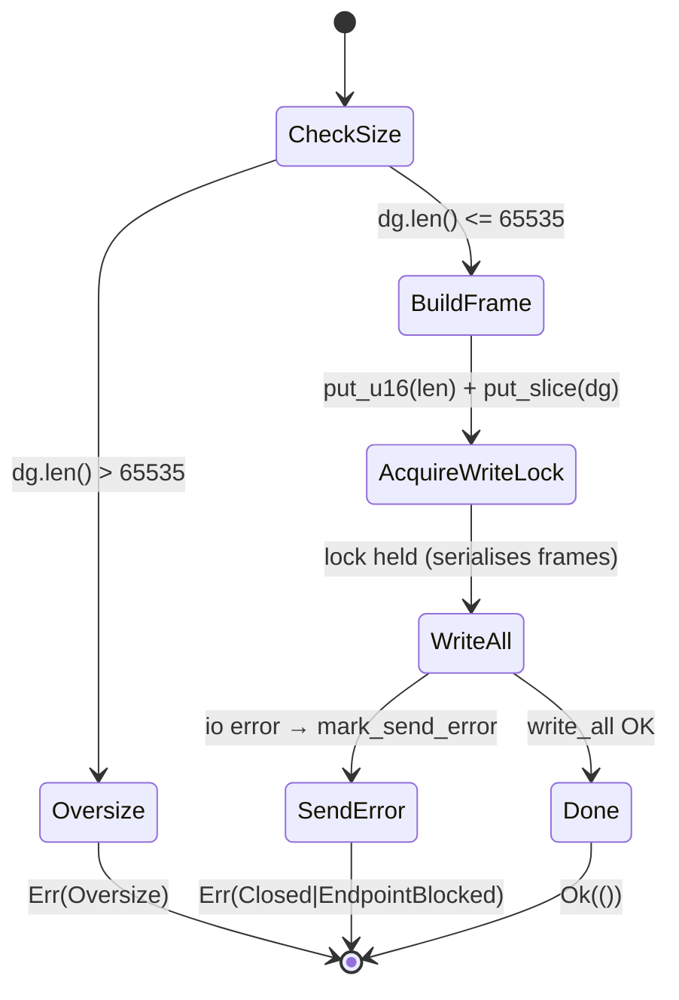
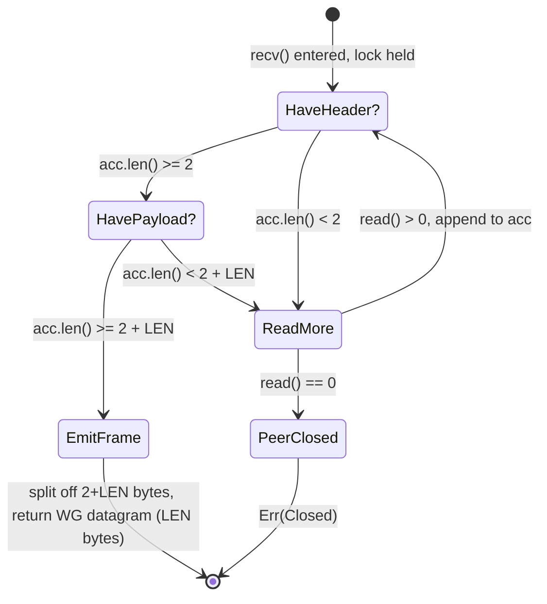
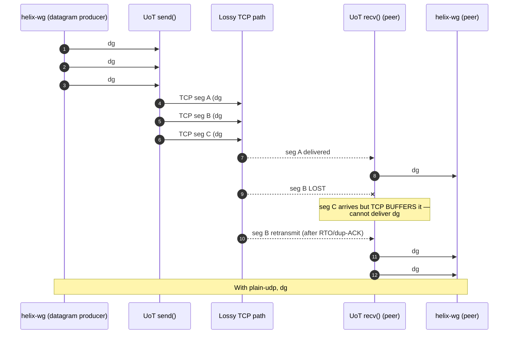

# UDP-over-TCP Transport

**Revision:** 1
**Last modified:** 2026-06-25T00:00:00Z

> Master technical specification — Volume 2 (Data Plane), nano-detail document.
> Deepens the *`udp-over-tcp` — last resort when all UDP is blocked* section (`§3.6`) of
> [01-DP §3.6]. This is a SPEC — it describes the `helix-transport::udp_over_tcp` module to
> be built, **not** the shipping product. Source evidence cited inline by id:
> [01-DP §N] = `final/01-data-plane.md`; [04_ARCH §N] =
> `04_VPN_CLD/HelixVPN-Architecture-Refined.md`; [04_P2 §N] = the Phase-2 refined doc;
> [SYNTHESIS §N] = the cross-document synthesis; [11-DR §N] = `final/11-deep-research-appendix.md`;
> [10-QA §N] = `final/10-testing-acceptance-and-qa.md`. External protocol constants not part of
> this evidence base (WireGuard message sizes, TCP/TLS header sizes) are tagged `[WG-PROTO]` /
> `[TCP]` / `[TLS]` and, where their exact value is not load-bearing, annotated honestly per
> constitution §11.4.6. Anything not grounded in the evidence base is marked `UNVERIFIED`.

---

## 0. Scope & contract summary

`udp-over-tcp` (UoT) is the **lowest rung of the transport escalation ladder** [01-DP §5.3]: it
length-prefixes already-encrypted WireGuard datagrams over a **single TCP connection**, matching
Mullvad's `udp2tcp` / the Rust `udp-over-tcp` crate [01-DP §3.6, 04_ARCH §3.2, 04_P2 §1.2,
11-DR A4]. It exists for exactly one purpose: **keep a tunnel possible on networks where all UDP
is blocked** — the failure mode where `plain-udp`, `lwo`, `masque-h3` (QUIC/UDP), and
`shadowsocks`-over-QUIC all fail because the path drops UDP entirely [11-DR A3 "Hard UDP block"].
It pays a **head-of-line-blocking (HoL) penalty** by construction (TCP imposes an ordered,
reliable byte stream over WG's unreliable datagrams) and is therefore ranked **last** in every
ladder order — preferred only when nothing faster connects [01-DP §3.6, §0.1 I2].

This document owns, to nano-detail:

1. The `UdpOverTcp` type and its full `Transport` implementation (§4).
2. The on-the-wire framing — the 2-byte big-endian length prefix + opaque WG datagram, the
   optional TLS wrap, byte-exact layouts (§5).
3. The connection lifecycle + framer/deframer state machines (§6).
4. The HoL-blocking tradeoff — why it is unavoidable, what it costs, how the orchestrator
   bounds its damage (§7).
5. Error taxonomy, config knobs, edge cases, security, performance budget (§8–§12).
6. The concrete test points, tied to the §11.4.169 test-type taxonomy [10-QA §1] (§13).

**Invariants inherited unchanged** [01-DP §0.1]:

| # | Invariant | How UoT honours it |
|---|---|---|
| I1 | Transport never sees plaintext. | UoT frames an **opaque** WG datagram; it never inspects, parses, or decrypts the payload — the length prefix is the only byte it adds. |
| I2 | Transport carries unreliable datagrams, not an ordered stream. | UoT **violates the spirit** of I2 at the wire (TCP is ordered+reliable) but **preserves the contract at the trait boundary**: `send`/`recv` still exchange whole WG datagrams. WG's own loss/replay handling runs unchanged on top; the cost is HoL latency, not a semantic break (§7). This is the documented, accepted tradeoff of the last rung. |
| I4 | One transport crate, three consumers. | The same `udp_over_tcp.rs` runs on client (frames out), edge (deframes in), and connector; framing is symmetric. |
| I5 | No-logging by construction. | Only aggregate counters (bytes, frames, reconnects) — never per-datagram durable state. |

```
File:   helix-transport/src/udp_over_tcp.rs   (the unit this doc specifies)
Trait:  helix-transport/src/lib.rs::Transport  (the contract; frozen Phase-0 interface) [01-DP §3.1]
Config: helix-transport/src/lib.rs::TransportConfig::UdpOverTcp { peer, tls_sni } [01-DP §3.1]
Errors: helix-transport/src/error.rs::TransportError [01-DP §3.1]
Phase:  2 (full transport set) [01-DP §12, 04_P2 §1.2]; the `Transport` trait it implements is frozen Phase-0.
```

---

## 1. When `udp-over-tcp` is selected — selection conditions

UoT is **ladder rung N (last)** in any restricted-network `TransportPolicy.order`; on an
unrestricted network it is never reached [01-DP §5.3]. The orchestrator selects it in this
closed set of cases:

| # | Condition | Source |
|---|---|---|
| C1 | **All UDP blocked** — `plain-udp`, `lwo`, `masque-h3`, `shadowsocks` (QUIC-carried) each exceeded their per-rung failure budget; the ladder has escalated to its final rung. | [01-DP §5.3 step 3], [11-DR A3] |
| C2 | **Per-network memory hit** — a prior successful UoT connect on this SSID / gateway fingerprint is remembered and re-tried first, so the user does not pay the full escalation latency again on the same hostile network. | [01-DP §5.3 step 4], [04_P2 §1.4] |
| C3 | **Regional prior** — the coordinator pushed a `TransportPolicy.order` that ends in (or, for a known UDP-blackholing region, *starts higher up but still terminates at*) `udp-over-tcp`. | [01-DP §5.3 step 5], [04_P2 §1.4] |
| C4 | **Manual pin** — user sets `TransportPolicy.pin = UdpOverTcp` (rare; deliberate "make it work on this captive/corporate network" choice). | [01-DP §5.3 step 1], [04_ARCH §3.2] |

UoT is **never** the default `order[0]`. The default unrestricted order is `[plain-udp]`; the
restricted prior is `[plain-udp, lwo, masque-h3, shadowsocks, udp-over-tcp]` [01-DP §5.3]. Rule:
the orchestrator MUST exhaust every UDP-capable rung before UoT, because UoT's HoL penalty makes
it the worst-performing carrier (§7).

> **UNVERIFIED (TLS-443 DPI residual):** [11-DR A3] notes that on a path with **SNI/TLS DPI on
> TCP 443**, a naive TLS-wrapped UoT may still be fingerprinted unless it presents a real-site
> TLS fingerprint (VLESS+Reality / ShadowTLS class). HelixVPN's MVP UoT ships the *plain* and
> *opportunistic-TLS-camouflage* variants only (§5.4); a Reality-grade TLS-mimic UoT is a
> **Phase-3 hardening item**, not specified here. Where TLS-443 DPI also blocks UoT, the honest
> outcome is `EndpointBlocked` → no tunnel (the residual-censorship boundary), not a silent
> degraded PASS.

---

## 2. Reference implementations & build stance

| Reference | What it gives us | Stance |
|---|---|---|
| Mullvad `udp-over-tcp` Rust crate | The canonical 2-byte-length-prefix framing this module reproduces; Mullvad's `udp2tcp` obfuscation mode is literally this crate. | **Reuse the framing design; reimplement in-crate** so UoT shares `helix-transport`'s `Transport` trait, error taxonomy, and `HealthCell` (I4) rather than bolting on a foreign socket loop. [11-DR A4], [04_P2 §1.2] |
| `dndx/phantun` (fake-TCP, 12-byte overhead, user-mode TCP, 100% safe Rust) | An alternative *fake-TCP* approach (forges TCP segments over a raw/`AF_PACKET` socket; no real kernel TCP, no HoL because it does not implement TCP retransmit). | **Phase-3 option**, not MVP. Phantun needs `CAP_NET_RAW` / raw-socket privileges and a kernel that lets it inject TCP segments — heavier deploy surface. Recorded as a documented alternative; MVP UoT uses a **real kernel TCP** socket (`tokio::net::TcpStream`) for portability. [11-DR A3, A4] |

**Decision (build stance):** MVP `udp_over_tcp.rs` = **real kernel TCP** (`tokio::net::TcpStream`),
Mullvad-style 2-byte length framing, optional opportunistic TLS wrap. Fake-TCP (Phantun-style) is
a Phase-3 escape hatch for environments where even real-TCP UoT is throttled but raw-socket
injection is available. This keeps the MVP last-rung **portable and unprivileged** at the cost of
real-TCP HoL (§7) — the accepted tradeoff for "keep a tunnel *possible*" [01-DP §3.6].

---

## 3. Module surface (types this document specifies)

```rust
// helix-transport/src/udp_over_tcp.rs
use async_trait::async_trait;
use bytes::{Bytes, BytesMut, Buf, BufMut};
use std::net::SocketAddr;
use std::sync::Arc;
use tokio::io::{AsyncReadExt, AsyncWriteExt};
use tokio::sync::Mutex;

use crate::error::TransportError;
use crate::health::HealthCell;          // shared with plain-udp/masque [01-DP §3.2]
use crate::{Transport, TransportHealth};

/// Wire constant: the length prefix is a 2-byte big-endian (network order) u16,
/// giving a 0..=65535 byte datagram budget — strictly larger than any WG datagram
/// at any effective_mtu (WG max is well under 1500). [01-DP §3.6, §10]
pub const UOT_LEN_PREFIX_BYTES: usize = 2;
pub const UOT_MAX_DATAGRAM: usize = u16::MAX as usize; // 65535

/// The carrier sub-mode: plain TCP, or TCP wrapped in opportunistic TLS to look like HTTPS.
#[derive(Clone, Debug)]
pub enum UotWrap {
    Plain,
    /// Opportunistic TLS camouflage; `sni` is the ClientHello SNI presented to blend with HTTPS.
    /// NOT a security boundary — WG already provides confidentiality (I1). [01-DP §3.6 "Optional TLS wrap"]
    Tls { sni: String },
}

/// Live UoT transport. ONE TCP connection; `send`/`recv` exchange whole WG datagrams.
pub struct UdpOverTcp {
    /// Write half behind a mutex: TCP writes must be atomic per-frame (no interleave). (§6.4)
    wr: Arc<Mutex<WriteHalf>>,
    /// Read half + deframer state behind a mutex: recv() is the sole reader. (§6.5)
    rd: Arc<Mutex<ReadHalf>>,
    peer: SocketAddr,
    kind: &'static str,        // "udp-over-tcp" or "udp-over-tcp-tls"
    health: HealthCell,
}

/// Internal write side (either plain TcpStream write half or a TLS stream write half).
struct WriteHalf { inner: TcpOrTlsWrite }
/// Internal read side carrying the partial-frame reassembly buffer (§6.5).
struct ReadHalf  { inner: TcpOrTlsRead, acc: BytesMut /* unconsumed bytes across reads */ }

/// Sum type so the same framing code drives plain TCP and TLS-wrapped TCP without generics leaking
/// into the Transport object. (`TcpOrTls*` wrap tokio TcpStream halves or tokio-rustls TlsStream halves.)
enum TcpOrTlsWrite { Tcp(/* tokio write half */), Tls(/* tokio-rustls write half */) }
enum TcpOrTlsRead  { Tcp(/* tokio read half  */), Tls(/* tokio-rustls read half  */) }
```

`UdpOverTcp` is constructed only by `dial()` (§4.1); it is never directly instantiated by callers.
The `Arc<Mutex<..>>` split (separate write/read locks) lets `send` and `recv` run concurrently
(full-duplex) while serialising multiple `send`s against each other so frames never interleave on
the wire (§6.4).

---

## 4. The `Transport` impl (nano-detail)

### 4.1 `dial()` — establishing the carrier

`dial(TransportConfig::UdpOverTcp { peer, tls_sni })` constructs a live `UdpOverTcp` within the
bounded dial timeout; on timeout/refusal it returns `DialTimeout` / `HandshakeFailed`, which the
orchestrator treats as "this rung failed" — but since UoT is the **last** rung, a failure here
means the ladder is exhausted and the orchestrator emits `Down { reason }` rather than escalating
[01-DP §5.3, §3.1].

```rust
// helix-transport/src/lib.rs::dial() dispatch arm for UdpOverTcp
pub(crate) async fn dial_udp_over_tcp(
    peer: SocketAddr,
    tls_sni: Option<String>,
    dial_timeout: std::time::Duration,   // from TransportConfig defaults (§11)
) -> Result<UdpOverTcp, TransportError> {
    // 1. TCP connect with a hard timeout (UDP-blocking firewalls often *also* RST :51820/tcp,
    //    so a fast, bounded connect is the common "blocked" signal). [11-DR A3]
    let tcp = tokio::time::timeout(dial_timeout, tokio::net::TcpStream::connect(peer))
        .await
        .map_err(|_| TransportError::DialTimeout)?            // timed out → ladder exhausted
        .map_err(|e| match e.kind() {
            std::io::ErrorKind::ConnectionRefused
            | std::io::ErrorKind::ConnectionReset => TransportError::EndpointBlocked, // RST = DPI/firewall
            _ => TransportError::Io(e),
        })?;

    // 2. Disable Nagle: WG datagrams are latency-sensitive; Nagle would coalesce small frames
    //    and add up to ~40 ms of artificial delay on top of the HoL cost (§7). [TCP]
    tcp.set_nodelay(true).map_err(TransportError::Io)?;

    // 3. Optional TLS wrap (opportunistic HTTPS camouflage; NOT a security boundary). (§5.4)
    let (wr, rd, kind) = match tls_sni {
        None => split_plain(tcp),
        Some(sni) => {
            let tls = tls_client_handshake(tcp, &sni, dial_timeout) // tokio-rustls; ALPN "h2"/"http/1.1"
                .await
                .map_err(|e| TransportError::HandshakeFailed(format!("uot-tls: {e}")))?;
            split_tls(tls)
        }
    };

    Ok(UdpOverTcp {
        wr: Arc::new(Mutex::new(WriteHalf { inner: wr })),
        rd: Arc::new(Mutex::new(ReadHalf  { inner: rd, acc: BytesMut::with_capacity(8 * 1024) })),
        peer,
        kind,
        health: HealthCell::new(),
    })
}
```

Notes:
- **No application handshake of its own.** UoT carries the WG handshake as its first framed
  datagrams; the carrier is "up" the moment the TCP (and optional TLS) connection is established.
  The *tunnel* is up when WG completes its Noise IK handshake **over** UoT — that liveness is the
  orchestrator's concern via `TunnelStatus`, not UoT's [01-DP §5.2].
- **`EndpointBlocked` vs `DialTimeout`:** a TCP **RST** (refused/reset) → `EndpointBlocked`
  (active DPI/firewall verdict); a connect **timeout** → `DialTimeout` (blackhole). Both are
  terminal for the last rung; the distinction feeds the aggregate censorship telemetry
  ("UoT EndpointBlocked in region R" vs "UoT timeout in region R", §13) [01-DP §5.3 step 6].

### 4.2 `send` — frame one WG datagram

```rust
#[async_trait]
impl Transport for UdpOverTcp {
    async fn send(&self, dg: Bytes) -> Result<(), TransportError> {
        // Hard cap: WG datagram must fit the 2-byte length prefix (always true at any MTU,
        // but assert rather than truncate — I1 forbids mangling the opaque payload). (§5.2)
        if dg.len() > UOT_MAX_DATAGRAM {
            return Err(TransportError::Oversize(dg.len()));
        }
        let mut frame = BytesMut::with_capacity(UOT_LEN_PREFIX_BYTES + dg.len());
        frame.put_u16(dg.len() as u16);   // big-endian length prefix [01-DP §3.6]
        frame.put_slice(&dg);             // opaque WG datagram, byte-for-byte (I1)

        // One mutex-guarded write_all: the whole frame lands contiguously; concurrent sends
        // serialise here so two frames never interleave on the byte stream (§6.4).
        let mut wr = self.wr.lock().await;
        wr.inner.write_all(&frame).await.map_err(|e| {
            self.health.mark_send_error();
            map_io_to_transport(e)        // BrokenPipe/Reset → Closed/EndpointBlocked (§8)
        })?;
        // NOTE: no flush() needed — TCP_NODELAY is set, write_all hands bytes to the kernel.
        Ok(())
    }
```

### 4.3 `recv` — deframe the next WG datagram

```rust
    async fn recv(&self) -> Result<Bytes, TransportError> {
        let mut rd = self.rd.lock().await;
        // Pull whole frames out of the reassembly accumulator; read more bytes only when a
        // complete frame is not yet buffered. Cancel-safe: state lives in `rd.acc`, not on the
        // stack, so a dropped recv() future (e.g. in select!) loses no bytes. (§6.5)
        loop {
            if let Some(dg) = try_take_frame(&mut rd.acc)? {   // (§6.6)
                self.health.mark_recv();
                return Ok(dg);
            }
            // Need more bytes: read into a scratch buffer, append to acc.
            let mut scratch = [0u8; 16 * 1024];
            let n = rd.inner.read(&mut scratch).await.map_err(map_io_to_transport)?;
            if n == 0 {
                return Err(TransportError::Closed);   // peer FIN / half-close (§6.3)
            }
            rd.acc.put_slice(&scratch[..n]);
        }
    }
```

### 4.4 `kind`, `effective_mtu`, `health`, `close`

```rust
    fn kind(&self) -> &'static str { self.kind } // "udp-over-tcp" | "udp-over-tcp-tls"

    fn effective_mtu(&self) -> u16 {
        // Inner WG MTU budget left after TCP/TLS + 2-byte length prefix overhead. (§10)
        // Plain UoT ~1380; TLS-wrapped is lower (TLS record overhead) — both reported here.
        match self.kind {
            "udp-over-tcp"     => 1380,  // TCP MSS − 2-byte length prefix [01-DP §10]
            "udp-over-tcp-tls" => 1360,  // additionally TLS record header+tag [TLS] (measure & tune, §10)
            _                  => 1380,
        }
    }

    fn health(&self) -> TransportHealth { self.health.snapshot() }

    async fn close(&self) -> Result<(), TransportError> {
        // Graceful: flush + shutdown(Write) so the peer sees a clean FIN, then drop. Idempotent. (§6.3)
        let mut wr = self.wr.lock().await;
        let _ = wr.inner.flush().await;
        let _ = wr.inner.shutdown().await;   // ignore errors — close is best-effort, idempotent
        Ok(())
    }
}
```

`effective_mtu()` values are **derived** [01-DP §10 marks UoT ~1380 "derived"] and MUST be
re-measured against the path in Phase 2 (record real MSS via the connected socket) rather than
trusted as constants — the §11.4.6 honest stance: the table value is a planning floor, not a
measured fact, until a `BENCH`/`MEM` run confirms it (§13).

---

## 5. Wire format (byte-exact)

### 5.1 The frame

UoT puts a sequence of **length-prefixed frames** onto the TCP byte stream. Each frame:

```
 byte:  0      1      2            2+L-1
       ┌──────┬──────┬─────────────────────┐
       │ LEN (u16 BE) │  WG datagram (opaque, L bytes)   │
       └──────┴──────┴─────────────────────┘
        \____________/ \____________________/
          2-byte prefix     payload = exactly one WG datagram
```

- **LEN**: `u16`, **big-endian / network byte order**, = the length `L` of the WG datagram that
  follows (NOT including the 2 prefix bytes). Range `0..=65535`; in practice `L` ≈ 32..1420
  [WG-PROTO] [01-DP §3.6, §10].
- **Payload**: exactly `L` bytes of **opaque** WG datagram — UoT never inspects it (I1).
- Frames are **back-to-back** on the stream with no separator, no checksum, no sequence number:
  TCP already provides ordering, reliability, and integrity, so UoT adds only the length prefix
  needed to recover datagram boundaries from the byte stream (the sole job of UoT framing) [01-DP §3.6].

### 5.2 Why 2 bytes / big-endian / no checksum

| Choice | Rationale | Source |
|---|---|---|
| **2-byte length** | `u16` covers `0..=65535`, strictly larger than any WG datagram at any `effective_mtu` (max WG payload ≪ 1500) [WG-PROTO]; a 1-byte prefix could not. Matches Mullvad `udp-over-tcp`. | [11-DR A4], [01-DP §3.6] |
| **Big-endian** | Network byte order is the wire convention; symmetric framer/deframer on both ends agree by spec, not by host endianness. | [TCP convention] |
| **No checksum / no seq** | TCP delivers an ordered, error-checked, reliable stream; re-adding a checksum or sequence number would be redundant overhead. WG's own AEAD already authenticates the payload. | [01-DP §3.6, I1] |
| **`Oversize` is a hard error** | If a caller ever hands a datagram `> 65535` (impossible at real MTU but defended), `send` returns `TransportError::Oversize` — UoT MUST NOT truncate or split the opaque payload (I1). | [01-DP §3.1, §10 rule 3] |

### 5.3 Worked example (handshake-init datagram)

A WireGuard handshake-initiation datagram is 148 bytes on the wire [WG-PROTO; value cross-checked
in 11-DR A3 "fixed 148-byte handshake-init"]. UoT frames it as:

```
 00 94 | <148 opaque WG bytes>
  └┬─┘
   └ 0x0094 = 148 (big-endian u16)
total on TCP stream = 2 + 148 = 150 bytes
```

The deframer reads `0x0094` → expects 148 payload bytes → emits exactly the original 148-byte WG
datagram up to `recv`. Byte-for-byte round-trip; no mangling (I1).

### 5.4 The optional TLS wrap (`UotWrap::Tls`)

When `tls_sni` is `Some(sni)`, the entire UoT frame stream rides **inside a TLS record stream** so
a passive observer on TCP :443 sees an HTTPS-looking handshake + encrypted records, not a bare
length-prefixed stream [01-DP §3.6 "Optional TLS wrap (`tls_sni`) to look like HTTPS"].

```
L1:  IP
L2:  TCP  (:443/tcp typically)
        └ TLS records (ClientHello SNI = <sni>, ALPN h2/http1.1)   ← camouflage layer
            └ UoT frames:  [u16 LEN][WG datagram] [u16 LEN][WG datagram] …
                              └ opaque WG datagrams (I1)
```

- **Camouflage only, NOT a security boundary.** WG already provides confidentiality + integrity
  (I1); the TLS layer exists to make the flow resemble HTTPS to DPI, not to protect the payload.
  Its keys are unrelated to WG keys.
- **SNI** is presented to blend with real HTTPS to the gateway's `:443/tcp` listener; the edge's
  `:443` listener already serves a believable decoy site to non-tunnel TLS (the masquerade
  property described for `masque-h3`) [01-DP §3.3 "Masquerade"], so a probe that completes the TLS
  handshake but sends no valid framed WG handshake gets the decoy, not a UoT signature.
- **ALPN** SHOULD advertise `h2` / `http/1.1` to match a browser; the inner bytes are UoT frames
  regardless of the advertised protocol (the ALPN is camouflage, the gateway routes by listener
  config). `UNVERIFIED`: exact ALPN/JA3 mimicry quality is a Phase-3 DPI-hardening concern (§1
  TLS-443 DPI note); MVP ships a standard `tokio-rustls` ClientHello.

---

## 6. State machines & lifecycle

### 6.1 Carrier lifecycle (the `UdpOverTcp` object)

```mermaid
stateDiagram-v2
    [*] --> Dialing: dial(UdpOverTcp{peer, tls_sni})
    Dialing --> TlsHandshake: TCP connected, tls_sni = Some
    Dialing --> Established: TCP connected, tls_sni = None
    Dialing --> DialFailed: timeout / RST
    TlsHandshake --> Established: TLS ClientHello..Finished OK
    TlsHandshake --> DialFailed: TLS error / timeout

    Established --> Established: send() / recv() frames
    Established --> Closing: close() called
    Established --> Broken: io error (BrokenPipe/Reset/FIN)
    Closing --> [*]: FIN sent, dropped
    Broken --> [*]: Closed/EndpointBlocked surfaced to orchestrator
    DialFailed --> [*]: DialTimeout/HandshakeFailed/EndpointBlocked → ladder EXHAUSTED (last rung)

    note right of DialFailed
      UoT is the LAST ladder rung [01-DP §5.3]:
      a failure here = no tunnel possible →
      orchestrator emits Down{reason}, not escalate.
    end note
    note right of Broken
      A mid-session TCP break does NOT silently
      degrade: surface Closed; orchestrator
      re-dials per-network-remembered UoT (C2)
      or emits Reconnecting→Down.
    end note
```



### 6.2 Send-path framing FSM (per datagram)



### 6.3 Close & half-close

- **Graceful close (`close()`):** flush write buffer → `shutdown(Write)` (sends TCP FIN) → drop.
  **Idempotent** — second `close()` is a no-op (locks + best-effort `flush`/`shutdown` ignore
  already-closed errors). The peer's `recv` then observes `read == 0` and returns `Closed`.
- **Peer FIN during `recv`:** `read()` returns `0` → `recv` returns `TransportError::Closed`.
  The orchestrator treats this as a transport drop → `Reconnecting` (re-dial UoT) or, if re-dial
  also fails, `Down` [01-DP §5.2].
- **No silent half-open:** UoT MUST NOT keep `send`ing into a write-closed socket pretending it
  is healthy; the first `send` after a peer RST surfaces `BrokenPipe`/`Reset` → `Closed`/
  `EndpointBlocked` via `map_io_to_transport` (§8). (Honesty over a fake-up tunnel — §11.4.6.)

### 6.4 Write atomicity (why the write half is mutex-guarded)

A WG datagram's frame (`[len][payload]`) MUST land **contiguously** on the TCP stream; if two
`send` calls interleaved their `write_all`s, the deframer on the far end would read a corrupted
length prefix. The `Arc<Mutex<WriteHalf>>` serialises all `send`s: each holds the lock across its
single `write_all(&frame)`, so frames are atomic with respect to one another. `recv` uses a
**separate** lock (`Arc<Mutex<ReadHalf>>`), so the connection is full-duplex (a `send` never
blocks a `recv`). This is the data-race / deadlock surface the `RACE` test type targets (§13).

### 6.5 Receive-path reassembly (the partial-frame problem)

TCP delivers a **byte stream**, not datagrams: one `read()` may return half a frame, several
frames, or a frame split across two reads. The deframer keeps an accumulator `acc: BytesMut`
across `recv` calls and is **cancel-safe** (the accumulator lives in `ReadHalf`, not on the
`recv` future's stack, so dropping a `recv` in a `select!` loses no buffered bytes — the I2
cancel-safety contract [01-DP §3.1]).



### 6.6 `try_take_frame` (the pure deframer — fully testable in isolation)

```rust
/// Pull exactly one complete frame out of `acc` if present; otherwise return Ok(None).
/// Pure function of the buffer → the `UNIT`-testable core of the deframer (§13).
fn try_take_frame(acc: &mut BytesMut) -> Result<Option<Bytes>, TransportError> {
    if acc.len() < UOT_LEN_PREFIX_BYTES {
        return Ok(None);                          // not even a length prefix yet
    }
    // Peek the big-endian u16 length WITHOUT consuming it.
    let len = u16::from_be_bytes([acc[0], acc[1]]) as usize;
    let total = UOT_LEN_PREFIX_BYTES + len;
    if acc.len() < total {
        return Ok(None);                          // payload not fully arrived
    }
    acc.advance(UOT_LEN_PREFIX_BYTES);            // drop the prefix
    let dg = acc.split_to(len).freeze();          // take exactly `len` payload bytes
    Ok(Some(dg))                                  // remaining bytes (next frame, partial) stay in acc
}
```

Edge cases this function MUST handle (each a `UNIT` test, §13):
1. `acc` empty → `None`.
2. `acc` = 1 byte → `None` (header incomplete).
3. `acc` = `[0x00,0x94]` only → `None` (header complete, 0 payload bytes arrived).
4. `acc` = exactly one full frame → `Some(dg)`, `acc` emptied.
5. `acc` = 1.5 frames → `Some(first)`, second frame's partial bytes retained.
6. `acc` = 3 back-to-back frames → three successive `Some` across three calls, no read in between.
7. `LEN == 0` (a zero-length datagram) → `Some(empty Bytes)`. **Policy:** a 0-length frame is a
   protocol anomaly (WG never sends empty datagrams [WG-PROTO]); the *transport* returns it
   faithfully, and `helix-wg` drops it — UoT does not editorialise the opaque payload (I1). A
   flood of 0-length frames is a DoS vector handled by the read-rate guard (§9 G4, §12).

---

## 7. The head-of-line-blocking tradeoff (the defining property)

### 7.1 Why HoL is unavoidable here

WG datagrams are **independent and loss-tolerant** (I2): if datagram *k* is lost, datagram *k+1*
is still useful, and WG's own state machine tolerates loss/reorder/replay. Carrying them over
**reliable, ordered TCP** inverts that: if the TCP segment carrying datagram *k* is lost, TCP
**holds back every later byte** (including datagrams *k+1, k+2, …* already received) until *k* is
retransmitted and ACKed. That stall is **head-of-line blocking** — the structural cost of running
a datagram protocol over a stream protocol [01-DP §0.1 I2, §3.6, 04_P2 §1.2].



### 7.2 What it costs & how the orchestrator bounds the damage

| Effect | Magnitude | Mitigation in spec |
|---|---|---|
| **Added latency under loss** | Each loss event stalls delivery by ≈ 1 TCP RTO (or fast-retransmit RTT). On a 5% loss path this is frequent — exactly the scenario where `masque-h3`/QUIC keeps higher goodput [01-DP §3.3 "Loss resilience", 04_P0 §5.3]. | The ladder **prefers QUIC carriers** precisely because of this; UoT runs only when UDP (hence QUIC) is impossible (§1). The ladder ranks UoT **last** [01-DP §5.3]. |
| **Throughput ceiling** | TCP congestion control + HoL caps goodput below `plain-udp`/QUIC on lossy/throttled links. | Accepted: "exists purely to keep a tunnel *possible*" [01-DP §3.6]. `effective_mtu` and a `BENCH` run quantify it (§13). |
| **WG retransmit interaction** | WG also retransmits its handshake; over reliable TCP, WG retransmits are rarely needed (TCP already delivered them) — mostly benign, occasionally redundant work. | No special handling — WG timers run unchanged (`helix-wg::tick`) [01-DP §4]. |
| **TCP-in-TCP meltdown risk** | If the *inner* tunnelled traffic is itself TCP (the common case), you have TCP-over-WG-over-TCP; under loss the two congestion controllers can interact pathologically. | `UNVERIFIED` (classic "TCP meltdown" lore; not measured in this evidence base). Documented as a known risk; UoT is last-resort so the exposure window is minimised. A `STRESS`/`PERF` run under `netem loss` characterises it (§13) rather than assuming it. |

**Design stance:** UoT does **not** try to fix HoL (that would mean reimplementing QUIC). It
**accepts** HoL as the price of working on a UDP-blackholed network, and the *system* bounds the
damage by only ever reaching UoT as the last rung. This is the honest, no-bluff framing: UoT is
the transport that **works when nothing else can**, explicitly at the cost of being the slowest
[01-DP §3.6].

---

## 8. Error taxonomy (mapping IO → `TransportError`)

UoT reuses the shared `TransportError` enum [01-DP §3.1]; it adds no new variants. The mapping
from `std::io::Error` (and TLS error) to `TransportError` is the load-bearing contract:

```rust
fn map_io_to_transport(e: std::io::Error) -> TransportError {
    use std::io::ErrorKind::*;
    match e.kind() {
        BrokenPipe | ConnectionAborted        => TransportError::Closed,        // local/peer closed write
        ConnectionReset                        => TransportError::EndpointBlocked, // RST mid-session = active block
        UnexpectedEof                          => TransportError::Closed,        // peer FIN mid-frame
        TimedOut                               => TransportError::DialTimeout,   // (read/connect timeout)
        _                                      => TransportError::Io(e),
    }
}
```

| `TransportError` | UoT trigger | Orchestrator response [01-DP §5.3] |
|---|---|---|
| `DialTimeout` | TCP connect (or TLS handshake) exceeded `dial_timeout`. | Last rung → `Down { reason }` (ladder exhausted). |
| `HandshakeFailed(String)` | TLS handshake error (`UotWrap::Tls`). | Last rung → `Down`. |
| `EndpointBlocked` | TCP RST on connect or mid-session reset — active firewall/DPI verdict. | `Down`; record "UoT EndpointBlocked region R" (aggregate, I5). |
| `Closed` | Peer FIN / broken pipe / EOF mid-frame. | `Reconnecting` → re-dial UoT (C2); persistent → `Down`. |
| `Oversize(usize)` | `send` got a datagram `> 65535` (defensive; impossible at real MTU). | Bug-class; surfaced, never truncated (I1). |
| `Io(std::io::Error)` | Any other IO error. | `Reconnecting`; logged as aggregate counter only (I5). |

**§11.4.1 FAIL-bluff guard:** a UoT failure MUST be a *genuine* transport failure, never a script
artifact — e.g. a deframer panic on a malformed length prefix is a §11.4.1 violation; the
deframer returns `Closed`/`Io`, it does not panic (the `RACE`/`CHAOS` tests assert no panic, §13).

---

## 9. Edge cases (closed enumeration)

| # | Edge case | Required behaviour | Test |
|---|---|---|---|
| E1 | Partial frame across reads (half a length prefix, then the rest). | Accumulate in `acc`; emit only on a complete frame (§6.5). | `UNIT` (§6.6 cases 1–6) |
| E2 | Multiple frames in one `read()`. | Emit each on successive `recv` calls without an extra `read` (§6.6 case 6). | `UNIT` |
| E3 | `LEN == 0` frame. | Return empty `Bytes`; `helix-wg` drops it; do not editorialise (I1). | `UNIT` (§6.6 case 7) |
| E4 | `send` of an oversize datagram. | `Err(Oversize)`; never truncate/split (I1). | `UNIT` |
| E5 | Peer RST mid-session. | `recv`/`send` → `EndpointBlocked`/`Closed`; orchestrator re-dials or `Down`. | `CHAOS` |
| E6 | TCP connect succeeds but WG handshake never completes (port-forward to a black hole). | Carrier "up" but tunnel never `Connected`; the orchestrator's WG-handshake timeout fires → escalate/`Down` — UoT itself reports healthy TCP, honestly (it *is* carrying bytes). | `E2E` (negative) |
| E7 | TLS handshake to a non-UoT :443 (decoy site answered). | TLS completes, but no valid framed WG handshake returns → WG handshake timeout → `Down` (the masquerade working *against* a misdirected client). | `SEC` |
| E8 | Slow-loris-style trickle (1 byte/sec) feeding `acc`. | Read-idle + per-frame assembly timeout bounds buffering (§12); surface `Closed` on timeout, do not grow `acc` unbounded. | `STRESS`, `DDOS` (Phase 2) |
| E9 | Concurrent `send`s from multiple tasks. | Serialised by the write mutex; frames never interleave (§6.4). | `RACE`, `CONC` |
| E10 | `recv` future dropped in a `select!` then re-entered. | Cancel-safe: `acc` retains buffered bytes; no datagram lost (§6.5). | `UNIT`, `RACE` |
| E11 | NAT/firewall idle-timeout kills an idle TCP connection silently. | WG keepalives (`helix-wg::tick`) generate periodic framed traffic [01-DP §4]; a dead connection surfaces as `Closed` on next `send`. | `CHAOS` |
| E12 | Maliciously huge `LEN` (e.g. `0xFFFF`) with no payload following. | `try_take_frame` returns `None` and waits; the per-frame assembly timeout (§12) caps the wait → `Closed`; `acc` is bounded by `UOT_MAX_DATAGRAM` so memory cannot blow up. | `SEC`, `STRESS` |

---

## 10. MTU & overhead budget

The inner WG MTU over UoT = `min(effective_mtu(), path-MTU-discovered)` [01-DP §10 rule 1].

| Layer | Overhead | Note |
|---|---|---|
| L1 IP | 20 (v4) / 40 (v6) [IP] | path-dependent |
| L2 TCP | 20 base (+ options) [TCP] | TCP header |
| UoT length prefix | **2** | the only byte UoT adds [01-DP §3.6] |
| (TLS wrap, if `UotWrap::Tls`) | TLS record header 5 + AEAD tag 16 ≈ **21/record** [TLS] | camouflage variant only |
| **Reported `effective_mtu()`** | plain **1380**, TLS **1360** | both **derived** [01-DP §10]; **measure & tune** in Phase 2 (§13) |

Rules (inherited [01-DP §10]):
1. Inner WG MTU = `min(transport.effective_mtu(), path-MTU)`.
2. DAITA padding (if active) is added *after* WG encrypt and counts against the transport budget,
   not the inner MTU [01-DP §10 rule 2, §9].
3. `Oversize` is a hard error — the orchestrator lowers the inner MTU rather than letting UoT
   truncate (I1) [01-DP §10 rule 3].
4. The `effective_mtu()` constants are **planning floors**, not measured facts (§11.4.6); a
   `BENCH`/`MEM` run replaces them with the real connected-socket MSS (§13).

---

## 11. Config knobs

`TransportConfig::UdpOverTcp { peer, tls_sni }` is the public, NetworkMap-resolved config [01-DP
§3.1]. Internal tunables (defaults; coordinator may override per-network via the policy push):

| Knob | Type | Default | Meaning | Source |
|---|---|---|---|---|
| `peer` | `SocketAddr` | from NetworkMap | gateway TCP endpoint (typically `:443/tcp` for TLS variant, or `:51820/tcp`). | [01-DP §3.1] |
| `tls_sni` | `Option<String>` | `None` | `Some(sni)` enables the opportunistic TLS wrap (§5.4). | [01-DP §3.1] |
| `dial_timeout` | `Duration` | 5 s `UNVERIFIED` (planning default; not pinned in evidence base) | bound on TCP+TLS connect before `DialTimeout`. | derived |
| `tcp_nodelay` | `bool` | `true` (always) | disable Nagle (§4.1). | [TCP] |
| `read_idle_timeout` | `Duration` | 30 s `UNVERIFIED` | no bytes (incl. WG keepalive) for this long → `Closed` (§9 E11). | derived |
| `frame_assembly_timeout` | `Duration` | 10 s `UNVERIFIED` | a partial frame must complete within this; else `Closed` (§9 E12 slow-loris guard). | derived |
| `max_acc_bytes` | `usize` | `UOT_MAX_DATAGRAM` (65535) | reassembly buffer hard cap; a single frame can never exceed it (§9 E12). | spec |

All `Duration` defaults are tagged `UNVERIFIED` because the evidence base does not pin them; they
are planning values to be calibrated against the netns rig in Phase 2, **not** invented facts
(§11.4.6). The per-network failure budget that governs *when the ladder escalates to/past UoT*
lives in `TransportPolicy.budget`, not here [01-DP §5.3].

---

## 12. Security considerations

| # | Concern | Spec response | Source |
|---|---|---|---|
| S1 | **Transport must not see plaintext (I1).** | UoT frames an opaque WG datagram; it never parses/decrypts. The 2-byte prefix is the only added byte. | [01-DP §0.1 I1] |
| S2 | **TLS wrap is camouflage, not security.** | WG provides confidentiality/integrity; the TLS layer only resembles HTTPS to DPI. Its compromise does not expose payload. | [01-DP §3.6, I1] |
| S3 | **DPI fingerprinting of a bare length-prefixed stream.** | Plain UoT on a non-443 port is fingerprintable; the TLS variant + edge decoy-site masquerade raises the bar. Reality-grade mimicry deferred to Phase 3 (§1 UNVERIFIED note). | [11-DR A3], [01-DP §3.3] |
| S4 | **Active probing of the :443/tcp listener.** | The edge serves a believable decoy to any TLS client that does not produce a valid framed WG handshake (§9 E7), returning nothing useful to a prober. | [01-DP §3.3 masquerade], [11-DR A3 active-probing] |
| S5 | **Reassembly-buffer DoS (huge `LEN`, slow-loris).** | `max_acc_bytes` caps memory at one max datagram; `frame_assembly_timeout` + `read_idle_timeout` bound trickle attacks; surface `Closed`, never OOM (§9 E8/E12). | spec (§11) |
| S6 | **No-logging by construction (I5).** | Only aggregate counters (bytes, frames, reconnects, EndpointBlocked-per-region); no per-datagram/per-connection durable state. | [01-DP §0.1 I5], [SYNTHESIS §7] |
| S7 | **Deframer robustness (no panic on malformed input).** | `try_take_frame` is total over arbitrary byte input — it returns `None`/`Closed`, never panics (a panic would be a §11.4.1 FAIL-bluff + a DoS). | §6.6, §11.4.1 |
| S8 | **Secret handling.** | UoT holds no WG keys; TLS keys (camouflage) are ephemeral, never logged (§11.4.10). | [§11.4.10] |

---

## 13. Test points (§11.4.169 taxonomy [10-QA §1])

Per §11.4.169 the `udp_over_tcp.rs` workable item declares the closed set of test types below; any
warranted-but-absent type is an explicit `NOT_APPLICABLE: <reason>` / §11.4.3 `SKIP`, never an
omission [10-QA §1]. Four-layer coverage per §11.4.4(b) (pre-build gate + post-build +
runtime-on-clean-target + paired §1.1 mutation) and §11.4.50 determinism (N=3 / N=10) apply to
every PASS.

| Code | Scope for UoT | Captured-evidence shape (§11.4.5/.69/.107) |
|---|---|---|
| `UNIT` | `try_take_frame` (§6.6 cases 1–7), `send` frame builder, `map_io_to_transport`, `effective_mtu` per wrap. Mocks allowed **only here** (§11.4.27). | `cargo test` pass log; property test: `deframe(frame(dg)) == dg` for random `dg` (round-trip identity, I1). |
| `INT` | Real `tokio::net::TcpStream` loopback (+ `tokio-rustls` TLS variant) carrying real WG datagrams between two `helix-wg` instances; no mocks. | testcontainers / loopback log; pcap of the framed stream. |
| `E2E` | netns rig with **all UDP dropped** (`nft` drop udp); ladder escalates to UoT; `curl` reaches an authorized LAN host through the real tunnel [04_P0 §3 rig]. | `curl` HTTP 200 body hash from overlay netns + pcap showing TCP-only carriage + `StatusReport.transport=="udp-over-tcp"`. |
| `FA` | The above E2E self-driving, re-runnable `-count=3`, zero human-in-loop (§11.4.98). | `make qa` one-shot exit 0, identical evidence hashes ×3 (§11.4.50). |
| `SEC` | Decoy-site response to a TLS probe that sends no valid WG handshake (E7); deframer no-panic on fuzzed input (S7); no plaintext on wire (I1) via pcap. | pcap (no WG signature in clear), fuzz corpus pass, decoy-response capture. |
| `STRESS` | ≥100 iters / ≥30 s sustained framed throughput; ≥10 parallel `send`s (write-mutex serialisation); slow-loris + huge-`LEN` buffer-cap (E8/E12) [§11.4.85]. | `stress_chaos.sh ab_stress_*` latency.json; `acc` bytes bounded ≤ 65535 (counter). |
| `CHAOS` | Mid-session TCP RST / FIN / iface flap; recovery re-dials UoT and restores reachability (E5/E11) [§11.4.85]. | `ab_chaos_*` recovery_trace.log; `TunnelStatus` event trace `Connected→Reconnecting→Connected`. |
| `CONC` | Concurrent multi-task `send` + `recv` full-duplex; no interleaved frames, no lost update (E9/E10). | Go/Rust harness pass; ordered-frame assertion. |
| `RACE` | `cargo +nightly` loom / tsan on the write-lock / read-lock + `acc` cancel-safety (§6.4/§6.5). | loom report 0 findings; no panic. |
| `MEM` | `acc` reassembly buffer never exceeds `max_acc_bytes`; no leak over a soak; (iOS path inherits the general MEM ceiling — UoT itself is allocation-light). | `/proc`/Instruments RSS flat over soak; buffer high-water counter. |
| `BENCH` | UoT goodput + p99 framing latency vs `plain-udp` baseline, **under `netem loss 0/1/5%`** — quantifies the HoL penalty (§7) so the ladder cost model is real. | `bench.sh` CSV [04_P0 §8]; goodput-vs-loss curve showing UoT degrading faster than QUIC (the documented tradeoff). |
| `PERF` | latency p50/p99 vs SLO budget; TCP-in-TCP interaction characterised under loss (§7.2 UNVERIFIED risk → measured, not assumed). | histogram metrics; loss-sweep report. |
| `REC` | window-scoped MP4 of the Console/Access showing `Connected { transport: "udp-over-tcp" }` on a UDP-blocked network (§11.4.154/.155) + media-validation verdict (§11.4.163). | `panoptic` capture → `vision_engine` PASS verdict. |
| `CHAL`/`HQA` | A `challenges`/`helix_qa` bank entry scoring PASS only on the E2E captured evidence above (§11.4.27/.107). | bank `result.json` PASS citing the pcap + `curl` artifacts. |
| `DDOS` | handshake-flood / huge-`LEN` flood against the edge :443/tcp UoT listener. | `NOT_APPLICABLE: single-node-selfhost (Phase 2)` [10-QA §1, 04_P1 §11] — parked, re-arms with HA. |
| `SCALE` | N simulated UoT clients holding TCP carriers. | `NOT_APPLICABLE: single-node-selfhost (Phase 2)` [10-QA §1]; partial soak only at MVP. |
| `UI`/`UX` | covered by `REC` + the shared client-core status walkthrough (transport label surfaces in the UI). | `flutter` golden + flow walkthrough vision verdict. |

**Anti-bluff acceptance gate (the one that matters):** the headline UoT claim — *"a tunnel comes
up when all UDP is blocked"* — is proven by the `E2E`/`FA` row: `nft` drops **all** UDP, the
ladder escalates to UoT, and `curl` reaches a real LAN host through the real tunnel, with a pcap
proving TCP-only carriage and **zero** UDP egress. Config-only / "the code path exists" PASS is
forbidden (§11.4 / §11.4.69) — the captured `curl` 200 + pcap is the evidence [01-DP §12.1,
04_P2 §1.2 acceptance].

---

## 14. Build checklist & cross-references

| Item | Owns | Phase | Gate |
|---|---|---|---|
| `helix-transport/src/udp_over_tcp.rs` | `UdpOverTcp`, framing, `dial_udp_over_tcp`, deframer | 2 | — (Phase-2 transport set) [01-DP §12] |
| `TransportConfig::UdpOverTcp` arm in `lib.rs::dial()` | dispatch | 2 | — |
| `helix-core/src/ladder.rs` last-rung ordering | UoT ranked last in restricted `order` | 1→2 | [01-DP §5.3] |

Cross-references: the `Transport` trait + `dial()` ladder [01-DP §3.1]; the escalation sequence
[01-DP §5.3, §5.4]; the MTU budget [01-DP §10]; `plain-udp` (the baseline UoT is measured against,
§7.2) [01-DP §3.2 / `transport-plain-udp.md`]; `masque-h3` (the QUIC carrier the ladder prefers
*before* UoT) [01-DP §3.3 / `transport-masque-quic.md`]; `shadowsocks` (the sibling TCP-riding
carrier with the same HoL caveat) [01-DP §3.5]; the §11.4.169 taxonomy [10-QA §1].

---

*End of UDP-over-TCP transport nano-detail spec (Volume 2, Data Plane). Deepens [01-DP §3.6].
The `Transport` trait it implements is a frozen Phase-0 contract [01-DP §3.1]; this module is a
Phase-2 deliverable [01-DP §12, 04_P2 §1.2]. All `UNVERIFIED` tags mark facts not grounded in the
evidence base (TLS-443 DPI residual, TCP-in-TCP meltdown magnitude, the timeout defaults) and are
to be resolved by measurement, not assumption (§11.4.6).*
