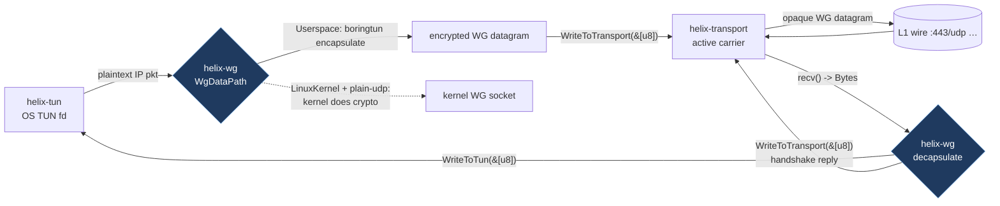
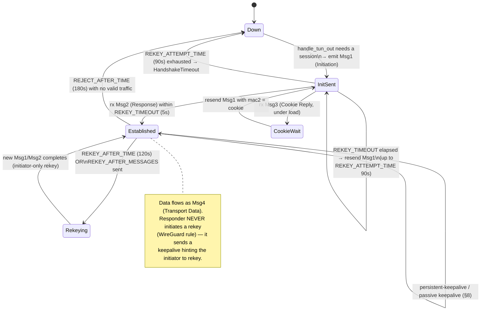
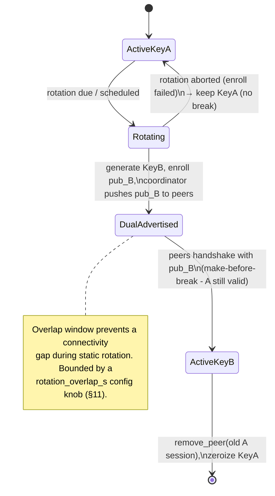
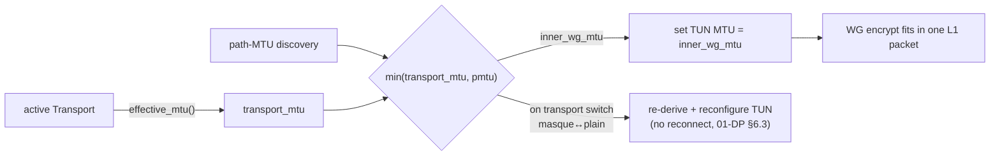

# WireGuard Core (helix-wg)

**Revision:** 1
**Last modified:** 2026-06-25T00:00:00Z

> Volume 2, document 01 of the HelixVPN master technical specification — the
> nano-detail deepening of the **WireGuard Core (`helix-wg`)** section of the
> pass-1 data-plane overview [01-DP §4]. This is a SPEC: it describes *what to
> build* (every trait/struct/enum/fn signature, wire layout, state machine,
> error taxonomy, config knob, edge case, security note, performance budget, and
> test point) — it does not ship the product. Sources are cited inline by id.

---

## Evidence-base honesty notes (constitution §11.4.6 — stated, not guessed)

Three grounding caveats apply to this whole document; every claim that rests on
them carries an inline `UNVERIFIED:` marker:

1. **`research-wireguard.md` does not exist** in the supplied evidence base
   (`scratchpad/kb/` contains `research-mullvad.md`, `research-masque.md`,
   `research-hysteria2.md`, … but no `research-wireguard.md`). Therefore every
   **WireGuard protocol wire-byte layout** (handshake message sizes, field
   offsets, MAC layout, transport-data header) in §3 is `UNVERIFIED:` against the
   evidence base — it is reproduced from the public WireGuard protocol
   (Donenfeld, *WireGuard: Next Generation Kernel Network Tunnel*) and MUST be
   re-confirmed against the WireGuard whitepaper + RFC-equivalent + the
   `boringtun` source before implementation. The *architectural* facts (Noise IK,
   Curve25519, ChaCha20-Poly1305, BLAKE2s, PSK seam) ARE grounded
   [01-DP §4, SYNTHESIS §2, research-mullvad §4].
2. **`boringtun` internal API signatures** (`Tunn::encapsulate`,
   `decapsulate`, `update_timers`, `TunnResult`) are `UNVERIFIED:` against the
   evidence base — they are reproduced from the public `boringtun` crate
   (cloudflare/boringtun) and MUST be pinned to the exact crate version's API at
   implementation time. The evidence base grounds only the *wrapper* shape
   (`WgPeer`, `WgVerdict`, the three pump methods) [01-DP §4, 04_P0 §4.4].
3. **§11.4.169 ("test types")** referenced in the authoring brief is **not
   present** in this document's constitution context (which ends at §11.4.168).
   `UNVERIFIED:` its exact enumeration. The concrete test types in §13 are
   therefore drawn from the in-context §11.4.27 test-type set (unit, integration,
   e2e, full-automation, security, fuzz, stress, chaos, performance, benchmark,
   Challenges, HelixQA) + the §11.4.5/.69/.107 captured-evidence covenant, and
   labelled "§11.4.169-class" where the brief intends the per-component mandate.

---

## 0. Position, ownership, and invariants

`helix-wg` is the crate at **L3 — the WireGuard cryptographic core** of the
layering model [01-DP §1]. It is the *only* crate in the workspace that touches
WireGuard plaintext on one side and WireGuard ciphertext on the other; the
`Transport` layer (§3 of [01-DP]) sits strictly **beneath** it and never sees
plaintext (invariant I1) [01-DP §0.1]. `helix-wg` owns the WireGuard `Tunn`
state machine, pumps its timers, routes its output verdicts, and enforces
per-peer `AllowedIPs` crypto-routing. It is the same crate byte-for-byte on
client, connector, and gateway edge (invariant I4) [01-DP §0.1, §4; 04_ARCH §3.2].

**What `helix-wg` owns (this document):**

- boringtun-vs-kernel selection per platform (§1).
- The `WgPeer` / `WgDevice` wrapper over boringtun `Tunn`, its `WgVerdict`
  output enum, and the four pump entry points (§2).
- The Noise IK handshake state machine + WireGuard message wire formats it
  drives (§3) — `UNVERIFIED:` byte layouts per note 1.
- The fixed crypto parameter set + the additive PSK (post-quantum) seam (§4).
- `AllowedIPs` semantics: the longest-prefix-match crypto-routing trie (§5).
- Per-device key generation + rotation lifecycle (§6).
- MTU derivation from the active transport's `effective_mtu()` (§7).
- Timer / rekey / keepalive state machine (§8).
- The encrypted-datagram boundary contract with `helix-transport` (§9).
- Error taxonomy (§10), config knobs (§11), edge cases (§12), test points (§13),
  security (§14), performance budget (§15).

**What `helix-wg` does NOT own:** the obfuscating transport (`helix-transport`,
[01-DP §3]); the TUN device (`helix-tun`); the orchestrator's three loops and
`TunnelStatus` stream (`helix-core`, [01-DP §5]); the route map / ACL compiler
(`helix-route`, [01-DP §6–§7]); DAITA shaping (`helix-daita`, [01-DP §9]); the
full post-quantum KEM exchange protocol (security doc — `helix-wg` exposes only
the PSK *field*, §4.4).

### 0.1 Crate-local invariants (extend the §0.1 data-plane invariants)

| # | Invariant | Source |
|---|---|---|
| W1 | `helix-wg` performs **zero heap allocation on the steady-state encrypt/decrypt path**; all framing uses caller-provided scratch buffers (`&mut [u8]`). | derived from iOS NE memory ceiling [04_P0 §6, 04_ARCH §5.6] |
| W2 | Crypto parameters are **fixed and never altered** (Noise IK / Curve25519 / ChaCha20-Poly1305 / BLAKE2s); the only additive seam is the WG PSK field. | [01-DP §4, SYNTHESIS §2] |
| W3 | A device **private key is generated on-device and never leaves it**; `helix-wg` exposes only the public key for enrollment. | [01-DP §4, 04_ARCH §7, SYNTHESIS §7] |
| W4 | A packet whose decrypted source / encrypted destination does not match the peer's `AllowedIPs` is **dropped** — crypto-routing is the coarse default-deny layer (I6). | [01-DP §7, 04_ARCH §3.4] |
| W5 | `helix-wg` keeps **no durable per-packet or per-connection state** — only in-RAM session state + aggregate counters (no-logging by construction, I5). | [01-DP §0.1, 04_ARCH §2.7, research-mullvad §8] |
| W6 | The wrapper is **the same crate on all three roles**; role differences (client default-route capture vs connector CIDR forwarding) live in `helix-core`, not here. | [01-DP §4, §5.1] |

---

## 1. boringtun (userspace) vs kernel WireGuard — per platform

### 1.1 The decision (grounded)

boringtun is the **default and the cross-platform floor**: pure-Rust userspace
WireGuard, no kernel module, runs identically on Linux/Android/iOS — exactly the
iOS path, where there is no kernel WG regardless [04_P0 §4.4]. On **Linux** the
kernel WG fast path is used where available, with boringtun userspace as
fallback; the project **ships both and defaults to kernel on Linux**
[01-DP §4, 04_ARCH §13 "ship both, default to kernel"].

### 1.2 Per-platform matrix

| Platform | Backend selected | Rationale | Source |
|---|---|---|---|
| Linux (client/connector/edge) | **kernel WG** (`wireguard` netlink/`wg`), boringtun fallback | kernel is faster; constrains containerization/permissions → fallback exists | [04_ARCH §13, §3.2; 04_P0 §4.4] |
| Android | **boringtun** (via `VpnService`+JNI) | userspace, no root, uniform | [04_ARCH §5.3, SYNTHESIS §5] |
| iOS / macOS (NE) | **boringtun** (in `NEPacketTunnelProvider`) | no kernel WG on iOS; bounded-memory Rust is the make-or-break gate G3 | [04_P0 §4.4, §6; 04_ARCH §5.6] |
| Windows | **boringtun** over `wireguard-nt`/`wintun`, or kernel-ish `wireguard-nt` data path | shim owns the adapter; backend abstracted | [04_ARCH §5.3] |
| HarmonyOS / Aurora | **boringtun** (native shim → `.so`) | no kernel WG; Phase 3 | [04_ARCH §5.3, SYNTHESIS §4] |

`UNVERIFIED:` exact Windows kernel-vs-userspace split — the evidence base says
"`wireguard-nt` / `wintun`" [04_ARCH §5.3] without pinning whether boringtun or
`wireguard-nt`'s own crypto runs the data path; settle in the Windows shim spec
(doc 06).

### 1.3 Backend abstraction — `WgBackend`

The two backends hide behind one trait so `helix-core` and the rest of the
workspace are backend-agnostic; backend selection is a build-time + runtime
choice resolved once at device construction.

```rust
// helix-wg/src/backend.rs
/// Selects how WireGuard crypto + the Tunn state machine are executed.
#[derive(Clone, Copy, Debug, PartialEq, Eq)]
pub enum WgBackend {
    /// Pure-Rust userspace (boringtun Tunn). The cross-platform floor.
    Userspace,
    /// Linux kernel WireGuard via netlink (`wg`/`wireguard` module).
    LinuxKernel,
}

impl WgBackend {
    /// Resolve the backend for the current platform + availability.
    /// Linux: prefer LinuxKernel if the module is loadable AND not running
    /// inside a constrained container; else Userspace. All other platforms: Userspace.
    pub fn resolve(prefer_kernel: bool) -> WgBackend { /* … */ }
}

/// The role-neutral handle the orchestrator drives, regardless of backend.
/// (Userspace impl wraps boringtun Tunn per §2; LinuxKernel impl drives netlink.)
pub trait WgDataPath: Send + Sync {
    /// Encrypt one outbound plaintext IP packet for `peer_index` (userspace path);
    /// kernel path is configured once and the kernel does this — see §9.3.
    fn encapsulate<'a>(&mut self, peer: PeerIndex, ip_pkt: &[u8], scratch: &'a mut [u8])
        -> WgVerdict<'a>;
    fn decapsulate<'a>(&mut self, datagram: &[u8], scratch: &'a mut [u8]) -> WgVerdict<'a>;
    fn tick<'a>(&mut self, scratch: &'a mut [u8]) -> WgVerdict<'a>;
    fn backend(&self) -> WgBackend;
}
```

> **Kernel-path note (§9.3 expands):** when `LinuxKernel` is selected, the
> per-packet encrypt/decrypt happens *inside the kernel*, NOT through
> `encapsulate`/`decapsulate`. In that mode `helix-wg` (a) programs the kernel
> peer set + `AllowedIPs` via netlink, and (b) the *transport* must still be
> userspace for any non-`plain-udp` carrier — so a kernel/userspace **split**
> applies only to `plain-udp`; every obfuscating transport forces the userspace
> data path because the kernel cannot emit MASQUE/Shadowsocks framing. This is a
> first-class edge case (§12.7).

### 1.4 Backend placement in the packet flow



---

## 2. The `helix-wg` boringtun `Tunn` wrapper + `WgVerdict`

### 2.1 The four-verdict output model (grounded)

boringtun's `Tunn` is a sans-I/O state machine: you feed it bytes and it returns
a verdict telling you what to do next [04_P0 §4.4]. `helix-wg` maps boringtun's
`TunnResult` onto a tighter, lifetime-bound `WgVerdict` [01-DP §4]:

```rust
// helix-wg/src/lib.rs
/// The output of every helix-wg pump call. Borrows the caller's scratch buffer
/// (W1: no heap alloc on the hot path) — the orchestrator acts on it immediately
/// before the next pump call reuses the scratch.
pub enum WgVerdict<'a> {
    /// Encrypted datagram (handshake or transport-data) → hand to the active Transport (§3 of 01-DP).
    WriteToTransport(&'a [u8]),
    /// Decrypted inner IP packet → hand to the TUN. Carries the parsed inner src for AllowedIPs audit (§5).
    WriteToTun { pkt: &'a [u8], inner_src: IpAddr },
    /// Nothing to emit this call (e.g. duplicate, keepalive consumed, queued).
    Nothing,
    /// A genuine WireGuard-layer error (see WgError, §10). NEVER used for "no output".
    Err(WgError),
}
```

**Mapping from boringtun `TunnResult`** (`UNVERIFIED:` boringtun API per note 2;
this is the public crate surface to confirm at pin time):

| boringtun `TunnResult` | `helix-wg` `WgVerdict` | Notes |
|---|---|---|
| `Done` | `Nothing` | nothing to emit |
| `Err(WireGuardError)` | `Err(WgError::from(_))` | translated taxonomy (§10) |
| `WriteToNetwork(&[u8])` | `WriteToTransport(&[u8])` | ciphertext → transport |
| `WriteToTunnelV4(&[u8], Ipv4Addr)` | `WriteToTun { pkt, inner_src: V4(..) }` | plaintext → TUN, src for §5 audit |
| `WriteToTunnelV6(&[u8], Ipv6Addr)` | `WriteToTun { pkt, inner_src: V6(..) }` | plaintext → TUN, src for §5 audit |

### 2.2 `WgPeer` and `WgDevice` — full signatures

A `WgPeer` wraps exactly one boringtun `Tunn` (one peer session). A `WgDevice`
owns the local static key + the set of peers + the `AllowedIPs` routing trie
(§5). The client has one peer (the gateway); the connector has one peer (the
gateway); the **edge** has N peers (every connected client + connector) and is
the only multi-peer instance.

```rust
// helix-wg/src/peer.rs
use std::net::{IpAddr, SocketAddr};

pub type PeerIndex = u32;          // dense index into WgDevice.peers
pub type PubKey   = [u8; 32];      // Curve25519 public key
pub type PrivKey  = SecretBytes;   // Curve25519 private key (zeroizing, never logged — W3)
pub type Psk      = [u8; 32];      // optional pre-shared key (post-quantum seam, §4.4)

pub struct WgPeer {
    tunn: boringtun::noise::Tunn,  // UNVERIFIED: exact path/type per note 2
    pub remote_pubkey: PubKey,
    pub endpoint: Option<SocketAddr>,   // current latched endpoint (WG roaming, §8.4)
    pub allowed_ips: Vec<IpNet>,        // this peer's permitted overlay prefixes (W4, §5)
    pub persistent_keepalive: Option<u16>, // seconds; None = off (§8.3)
    pub last_handshake: Option<Instant>,   // in-RAM only (W5)
    stats: PeerStats,                       // aggregate counters only (W5)
}

pub struct WgDevice {
    local_private: PrivKey,         // generated on-device, never leaves (W3)
    local_public: PubKey,
    peers: Vec<WgPeer>,
    routing: AllowedIpsTrie,        // §5 — maps inner src/dst → PeerIndex
    backend: WgBackend,
    rate_limiter: HandshakeRateLimiter, // §14.3 anti-DoS (cookie reply path)
    index_map: PeerIndexMap,        // WG receiver-index → PeerIndex demux (§3.5)
}

impl WgDevice {
    /// Construct from the local static key + initial peer set (from the RouteMap, 01-DP §6.2).
    pub fn new(local_private: PrivKey, backend: WgBackend) -> Self { /* … */ }

    /// Add / update a peer (reconciler-driven, no restart — 01-DP §6.3). Idempotent on pubkey.
    pub fn upsert_peer(&mut self, cfg: PeerConfig) -> PeerIndex { /* … */ }
    /// Remove a peer (e.g. device.revoked → drop in <1s — 01-DP §7). Zeroizes its session.
    pub fn remove_peer(&mut self, peer: PeerIndex) { /* … */ }

    /// OUTBOUND: a plaintext IP packet left the TUN → find the peer by dst (§5),
    /// encrypt, return ciphertext for the transport. Drops (W4) if no AllowedIPs match.
    pub fn handle_tun_out<'a>(&mut self, ip_pkt: &[u8], scratch: &'a mut [u8]) -> WgVerdict<'a>;

    /// INBOUND: bytes arrived from the transport → demux to the right peer by WG
    /// receiver index (§3.5), decrypt; emit plaintext for the TUN (after §5 src audit)
    /// or a handshake reply for the transport.
    pub fn handle_transport_in<'a>(&mut self, datagram: &[u8], from: Option<SocketAddr>,
                                   scratch: &'a mut [u8]) -> WgVerdict<'a>;

    /// TIMER: call every TICK_INTERVAL (§8.1); emits keepalives, rekeys, expirations
    /// for ALL peers (round-robins which peer needs work this tick).
    pub fn tick<'a>(&mut self, now: Instant, scratch: &'a mut [u8]) -> Vec<WgVerdict<'a>>;

    pub fn local_public(&self) -> PubKey { self.local_public }
    pub fn peer_stats(&self, peer: PeerIndex) -> PeerStats { /* aggregate only, W5 */ }
}

#[derive(Clone, Debug, Default)]
pub struct PeerStats {        // W5: aggregate counters only, never per-packet logs
    pub tx_bytes: u64, pub rx_bytes: u64,
    pub tx_packets: u64, pub rx_packets: u64,
    pub handshakes_ok: u32, pub handshakes_failed: u32,
    pub last_handshake_age_s: Option<u32>,
}

pub struct PeerConfig {
    pub remote_pubkey: PubKey,
    pub allowed_ips: Vec<IpNet>,
    pub endpoint: Option<SocketAddr>,
    pub persistent_keepalive: Option<u16>,
    pub psk: Option<Psk>,          // §4.4
}
```

### 2.3 Why `handle_tun_out` takes the whole device, not a single peer

A multi-hop chain or an edge with N peers must select the *right* peer from the
inner destination IP via the `AllowedIPs` trie (§5) before encrypting — so the
outbound entry point lives on `WgDevice`, not `WgPeer`. The single-peer client
case is just N=1. (The pass-1 sketch put `handle_tun_out` on `WgPeer` for the
one-peer slice [01-DP §4]; this nano-spec lifts it to `WgDevice` for the edge's
N-peer reality, a deliberate refinement — the one-peer body is unchanged.)

---

## 3. Noise IK handshake + WireGuard message wire formats

> **`UNVERIFIED:` (note 1)** — the byte sizes/offsets below are the public
> WireGuard protocol values, NOT confirmed against an evidence-base
> `research-wireguard.md` (which is absent). Confirm against the WireGuard
> whitepaper + boringtun source before coding. The *architecture* (Noise IK,
> 1-RTT, the four message types, the MAC1/MAC2 cookie anti-DoS) is grounded
> [01-DP §4, research-mullvad §4 PQ-PSK-over-WG].

### 3.1 Handshake shape (grounded architecture)

WireGuard uses the **Noise IK** pattern: a **1-RTT** handshake where the
initiator already knows the responder's static public key (the "I" = initiator
immediately transmits its static key encrypted; "K" = responder's static key is
known in advance) [01-DP §4]. HelixVPN learns the responder's static pubkey from
the `RouteMap` (`PeerRoute.wg_pubkey`) pushed by the coordinator [01-DP §6.2].

Four message types (`UNVERIFIED:` sizes):

| Type | Name | Size (bytes) | Direction |
|---|---|---|---|
| 1 | Handshake Initiation | **148** | initiator → responder |
| 2 | Handshake Response | **92** | responder → initiator |
| 3 | Cookie Reply | **64** | responder → initiator (under load / anti-DoS, §14.3) |
| 4 | Transport Data | 16 + 16·⌈(plaintext+0)/16⌉ … header **16** + ciphertext | both, steady state |

### 3.2 Message 1 — Handshake Initiation (148 B, `UNVERIFIED:` layout)

```
offset  size  field
  0      1    message_type = 0x01
  1      3    reserved = 0x000000
  4      4    sender_index            (u32 LE, initiator's receiver index)
  8     32    unencrypted_ephemeral   (Curve25519 ephemeral public)
 40     48    encrypted_static        (32 B static pub + 16 B Poly1305 tag)
 88     28    encrypted_timestamp     (12 B TAI64N + 16 B tag)
116     16    mac1                    (BLAKE2s keyed MAC over preceding bytes)
132     16    mac2                    (cookie MAC; zero unless under cookie challenge)
```

### 3.3 Message 2 — Handshake Response (92 B, `UNVERIFIED:` layout)

```
offset  size  field
  0      1    message_type = 0x02
  1      3    reserved = 0x000000
  4      4    sender_index            (responder's receiver index)
  8      4    receiver_index          (echoes initiator's sender_index)
 12     32    unencrypted_ephemeral
 44     16    encrypted_nothing       (empty payload + 16 B tag — confirms key schedule)
 60     16    mac1
 76     16    mac2
```

### 3.4 Message 4 — Transport Data header (`UNVERIFIED:` layout)

```
offset  size  field
  0      1    message_type = 0x04
  1      3    reserved = 0x000000
  4      4    receiver_index          (peer's receiver index — demux key, §3.5)
  8      8    counter                 (u64 LE nonce; monotonic per session, anti-replay)
 16      N    encrypted_packet        (ChaCha20-Poly1305 of the inner IP packet, incl. 16 B tag)
```

The plaintext is padded to a multiple of 16 bytes before AEAD (WireGuard
padding); the 16-byte Poly1305 tag is appended inside `encrypted_packet`. This
fixed 16-byte data header + 16-byte tag is the **32-byte WG overhead** that the
MTU budget (§7) accounts for.

### 3.5 Receiver-index demux (the edge's N-peer dispatch)

On inbound, `handle_transport_in` reads bytes [4..8) (the `receiver_index`,
which the *local* device assigned at handshake) to select the `PeerIndex` via
`index_map` before decrypting — O(1), no trial decryption across N peers. A
datagram with an unknown receiver index, a type ∉ {1,2,3,4}, or a malformed
length is dropped as `WgError::Malformed` (§10), counted, not logged (W5).

### 3.6 Handshake state machine



Timer constants (`UNVERIFIED:` exact values — standard WireGuard defaults, pin
against boringtun): `REKEY_AFTER_TIME = 120s`, `REKEY_TIMEOUT = 5s`,
`REKEY_ATTEMPT_TIME = 90s`, `REJECT_AFTER_TIME = 180s`,
`KEEPALIVE_TIMEOUT = 10s`, `REKEY_AFTER_MESSAGES = 2^60`,
`REJECT_AFTER_MESSAGES = 2^64 − 2^13`. These are surfaced as read-only
constants, NOT config knobs (W2 — crypto invariants are fixed).

---

## 4. Crypto parameters (fixed) + the additive PSK seam

### 4.1 Fixed primitive set (grounded, W2)

Never altered [01-DP §4, SYNTHESIS §2]:

| Role | Primitive |
|---|---|
| Key agreement | **Curve25519** ECDH (X25519) |
| AEAD (data + handshake) | **ChaCha20-Poly1305** (IETF, 96-bit nonce = 32-bit zero ‖ 64-bit counter) |
| Hash / KDF / MAC | **BLAKE2s** (HKDF-style key schedule; keyed BLAKE2s for MAC1/MAC2) |
| Handshake | **Noise IK** (1-RTT, known responder static key) |
| Timestamp (anti-replay of Msg1) | **TAI64N** (12 B) |

### 4.2 Key schedule (grounded architecture; `UNVERIFIED:` exact chaining)

The Noise IK key schedule mixes: responder static pub, initiator ephemeral,
initiator static, the optional PSK (§4.4), and BLAKE2s-chained `Ck`/`Hk` values
to derive the two directional transport keys (`T_send`, `T_recv`). Each direction
has an independent 64-bit message counter; the receiver maintains a sliding
anti-replay window (`UNVERIFIED:` exact window size — WireGuard uses a
2048-bit / 8000-packet-class window; pin against boringtun).

### 4.3 Device keys never leave the device (W3)

`helix-wg` generates the Curve25519 keypair on-device; only `local_public()`
is exported for enrollment (doc 02 PKI) [01-DP §4, SYNTHESIS §7]. The private key
is held in a `SecretBytes` zeroizing wrapper, never logged, never serialized to
durable storage in plaintext (§14.1).

### 4.4 Post-quantum PSK seam (additive, Phase 2)

Post-quantum is an **additive pre-shared-key layer**, hybrid-never-PQ-only, that
slots into the WG PSK field with **no transport change** [01-DP §4, SYNTHESIS §4].
Mechanism (parity target, grounded): establish a vanilla WG tunnel, run a PQ KEM
exchange (ML-KEM-1024 / FIPS-203, optionally hybridized with Classic McEliece)
*over* it, install the negotiated shared secret as WireGuard's PSK — the PSK is
mixed into the symmetric key schedule so the tunnel stays secure even if X25519
is broken [research-mullvad §4]. `helix-wg`'s only surface is the
`PeerConfig.psk: Option<Psk>` field (§2.2) + the key-schedule mix-in (§4.2); the
full KEM exchange protocol is owned by the security doc, NOT here. Cost: ~1–2 s
extra at handshake, steady-state unchanged [research-mullvad §4]. `UNVERIFIED:`
the exact PQ-PSK message sequence — public Mullvad docs are high-level on this
[research-mullvad §"Honest gaps"]; treat as security-doc design work.

---

## 5. `AllowedIPs` semantics — the crypto-routing trie

### 5.1 Two roles of one field (grounded)

`AllowedIPs` is WireGuard's **cryptographic routing table** and serves both
directions [01-DP §7 layer 1, 04_ARCH §3.4]:

- **Outbound (routing):** for a plaintext packet leaving the TUN, the inner
  **destination** IP selects which peer to encrypt for — longest-prefix match
  across all peers' `AllowedIPs`.
- **Inbound (access control / W4):** for a packet decrypted from a peer, the
  inner **source** IP MUST fall inside *that* peer's `AllowedIPs`, else drop. A
  peer cannot spoof a source it was not granted — the coarse, crypto-enforced
  default-deny layer (I6); the port/proto-granular layer is the edge verdict map
  [01-DP §7 layer 2].

### 5.2 Data structure — longest-prefix-match trie

```rust
// helix-wg/src/allowed_ips.rs
/// A binary radix (Patricia) trie over IPv4+IPv6 prefixes → PeerIndex,
/// matching the kernel WireGuard `allowedips` structure. O(W) lookup
/// (W = address bit-width: 32 / 128), no allocation on lookup.
pub struct AllowedIpsTrie { /* dual v4/v6 radix roots */ }

impl AllowedIpsTrie {
    pub fn insert(&mut self, prefix: IpNet, peer: PeerIndex);
    pub fn remove(&mut self, prefix: IpNet, peer: PeerIndex);
    pub fn remove_peer(&mut self, peer: PeerIndex);    // revoke path (<1s, 01-DP §7)
    /// Longest-prefix match for an address → the peer that owns it (outbound routing).
    pub fn lookup(&self, addr: IpAddr) -> Option<PeerIndex>;
    /// True iff `addr` falls within ANY prefix granted to `peer` (inbound audit, W4).
    pub fn permits(&self, peer: PeerIndex, addr: IpAddr) -> bool;
}
```

### 5.3 Overlapping-prefix rule

Within one device, `AllowedIPs` prefixes across peers MUST be disjoint after
longest-prefix resolution (WireGuard semantics: a more-specific prefix on peer B
overrides a less-specific one on peer A). The `RouteMap` compiler (`helix-route`,
[01-DP §6–§7]) guarantees disjointness *post-4via6* — the overlay ULA /48 +
4via6 mapping is exactly what prevents two connectors that both serve
`192.168.1.0/24` from colliding here [01-DP §6.1, 04_ARCH §3.4]. `helix-wg`
trusts the compiled, disjoint overlay prefixes; it does **not** itself resolve
RFC1918 collisions (that is solved one layer up). Edge case §12.4 covers a
malformed (overlapping) map.

### 5.4 Crypto-routing decision flow

```mermaid
flowchart TD
    OUT["TUN out: plaintext IP pkt"] --> DST[parse inner dst IP]
    DST --> LP{AllowedIpsTrie.lookup&#40;dst&#41;}
    LP -->|Some&#40;peer&#41;| ENC[encapsulate for peer → Msg4]
    LP -->|None| DROP1["DROP (W4) + counter++<br/>WgError::NoRoute (not logged, W5)"]
    ENC --> TX["WriteToTransport"]

    IN["transport in: WG datagram"] --> DEMUX["demux by receiver_index → peer (§3.5)"]
    DEMUX --> DEC[decrypt Msg4 → inner IP pkt]
    DEC --> SRC[parse inner src IP]
    SRC --> PERM{AllowedIpsTrie.permits&#40;peer, src&#41;}
    PERM -->|true| TUN["WriteToTun"]
    PERM -->|false| DROP2["DROP (W4) source-spoof<br/>+ counter++ WgError::SourceViolation"]
```



---

## 6. Per-device key generation + rotation

### 6.1 Generation (grounded, W3)

Each device (client, connector, edge) generates its Curve25519 keypair locally
at enrollment; the private key never leaves the device, only the public key is
registered with the control plane PKI [01-DP §4, 04_ARCH §7, research-mullvad §8].

```rust
// helix-wg/src/keys.rs
pub struct DeviceKeypair { pub public: PubKey, private: PrivKey /* zeroizing */ }
impl DeviceKeypair {
    /// Generate from a CSPRNG (OS getrandom). The ONLY way to mint a device key.
    pub fn generate() -> DeviceKeypair;
    /// Load a previously-generated private key from the platform secure store
    /// (Keychain / Keystore / TPM-backed) — never from a plaintext file (§14.1).
    pub fn from_secure_store(handle: SecureKeyHandle) -> Result<DeviceKeypair, WgError>;
    pub fn public(&self) -> PubKey;
}
```

### 6.2 Two rotation tiers (grounded)

WireGuard distinguishes **ephemeral session rekey** (automatic, every ~2 min,
§3.6 `Rekeying`) from **static device-key rotation** (policy-driven). Both exist
[01-DP §4 "rotated on schedule and on device.revoked"; 04_ARCH §7].

| Tier | Trigger | Mechanism | Owner |
|---|---|---|---|
| Session rekey | `REKEY_AFTER_TIME` (120s) / `REKEY_AFTER_MESSAGES` / inbound after `REKEY_AFTER_TIME` | new Noise IK handshake, same static keys (§3.6) | `helix-wg` (automatic) |
| Static rotation | schedule (e.g. 30/90d) OR `device.revoked` event | mint new `DeviceKeypair`, re-enroll public key, coordinator pushes updated `PeerRoute.wg_pubkey`, peers `upsert_peer` the new pub, old peer `remove_peer` | `helix-core` + PKI (doc 02); `helix-wg` executes the upsert/remove |

### 6.3 Revocation is a peer removal (grounded, <1s)

`device.revoked` → the coordinator pushes a map delta removing the peer →
`helix-core` calls `WgDevice::remove_peer` → the session is zeroized and the
`AllowedIpsTrie` entry dropped, in **< 1 second**, no restart [01-DP §7,
04_ARCH §4.4, SYNTHESIS §7]. On the edge, this composes with the verdict-map drop
(layer 2); `helix-wg` owns the crypto-routing half.

### 6.4 Static-rotation state machine (make-before-break)



---

## 7. MTU derivation

### 7.1 The rule (grounded)

The inner WG MTU is derived from the **active transport's** `effective_mtu()`
minus nothing further (the transport already subtracted its own overhead), then
clamped by path-MTU discovery [01-DP §3.1 trait, §10]:

```
inner_wg_mtu = min( active_transport.effective_mtu(), path_mtu_discovered )
```

`helix-wg` does **not** hardcode an MTU; it reads it from the transport it is
handed (decoupling — the same WG core runs over any carrier, W6). The transport
budget table is owned by [01-DP §10]; reproduced for the WG-overhead derivation:

| Transport | `effective_mtu()` | WG-relevant overhead accounted | Source |
|---|---|---|---|
| `plain-udp` | **1420** | 1500 − 20 IP − 8 UDP − 32 WG (16 hdr + 16 tag, §3.4) | [01-DP §10, 04_P0 §4.3] |
| `masque-h3` | **1280** (measure & tune) | QUIC + HTTP-Datagram + UDP-proxy overhead; 1280 = IPv6 min-MTU floor | [01-DP §10, 04_P0 §5.2] |
| `shadowsocks` | ~1380 | TCP MSS − 2 B length prefix − AEAD tag | [01-DP §10, 04_P2 §1.1] |
| `udp-over-tcp` | ~1380 | TCP MSS − length prefix | [01-DP §10] |
| `lwo` | ~1400 | plain-udp − padding bytes | [01-DP §10] |

### 7.2 The 32-byte WG overhead is already inside `effective_mtu()`

`plain-udp`'s 1420 already subtracts the WireGuard 16-byte data header + 16-byte
Poly1305 tag (§3.4). So `helix-wg` configures the TUN MTU to exactly
`inner_wg_mtu`; the transport's `effective_mtu()` is the post-WG-overhead figure
for the *inner* IP payload. (`UNVERIFIED:` whether the 1420 figure folds the WG
overhead or the IP/UDP overhead — the pass-1 doc's arithmetic
`1500 − 20 − 8 − 32 ≈ 1420` folds **both**; confirm the split during the §13
benchmark.)

### 7.3 Oversize handling

A plaintext packet whose encrypted size would exceed the active transport's MTU
yields `TransportError::Oversize` at the transport boundary; `helix-wg`'s
contract is to **lower the inner TUN MTU** (preferred) or signal L3 fragmentation
rather than silently truncate [01-DP §10 rule 3]. The orchestrator sets the TUN
MTU from `inner_wg_mtu`, so under normal operation oversize is unreachable; it is
a defensive edge (§12.5). When DAITA pads (§9 of [01-DP]), padding is added
**after** WG encrypt and counts against the transport budget, not the inner MTU
[01-DP §10 rule 2] — `helix-wg` is unaware of DAITA padding (placement is L2.5,
beneath WG output, above transport).

### 7.4 MTU derivation flow



When the ladder switches transport (e.g. `plain-udp` → `masque-h3`, [01-DP §5.3]),
the inner MTU changes (1420 → 1280) and `helix-core` re-derives + reconfigures the
TUN MTU without a reconnect of unrelated state — a first-class reconcile event.

---

## 8. Timers, rekey, and keepalive state machine

### 8.1 The tick (grounded)

`helix-core` calls `WgDevice::tick(now, scratch)` every **`TICK_INTERVAL`** —
~100–250 ms [01-DP §4, 04_P0 §4.4 "every 100–250 ms"]. Each tick advances every
peer's WireGuard timers (boringtun `update_timers`-equivalent, `UNVERIFIED:` API
note 2) and returns the batch of `WgVerdict`s to emit (keepalives, rekey Msg1s,
expirations).

### 8.2 Timer effects (grounded constants, §3.6)

| Condition | Effect |
|---|---|
| `REKEY_AFTER_TIME` (120s) since last handshake, AND outbound traffic pending | initiator emits Msg1 (rekey) |
| `KEEPALIVE_TIMEOUT` (10s) since last *received* data, AND data was sent | passive keepalive (empty Msg4) |
| `persistent_keepalive` set (e.g. 25s) | unconditional keepalive every N seconds — keeps NAT mappings alive (§8.3) |
| `REJECT_AFTER_TIME` (180s) with no valid traffic | session expires → `Down`; next packet re-handshakes |

### 8.3 Persistent keepalive (NAT survival)

`PeerConfig.persistent_keepalive: Option<u16>` (§2.2). The **connector** and
**client** behind NAT set it (typical 25s) so the gateway-bound mapping never
expires; the gateway edge generally does not (peers dial it). This composes with
Phase-2 NAT traversal [01-DP §8] but is independent of it.

### 8.4 Roaming (endpoint latch — grounded)

WireGuard roaming: when a valid, authenticated Msg4 arrives from a *new* source
`SocketAddr`, `helix-wg` updates `WgPeer.endpoint` to that address — no
re-handshake [01-DP §8.2 "WireGuard's roaming latches onto whatever source
address a valid handshake arrives from"]. This is what makes mobile network
switches (Wi-Fi ↔ cellular) seamless and is the substrate for Phase-2 hole
punching [01-DP §8.2]. Only a *cryptographically valid* packet moves the
endpoint — a spoofed source cannot hijack the session (§14.2).

---

## 9. The encrypted-datagram boundary (transport sits beneath)

### 9.1 The contract (grounded, I1/I2)

`helix-wg` ↔ `helix-transport` exchange **only opaque, already-encrypted WG
datagrams** as `bytes::Bytes` [01-DP §3.1, §0.1 I1/I2]. The transport never sees
plaintext (I1) and carries unreliable datagrams, never an ordered stream (I2).
The boundary is exactly two calls:

```rust
// helix-core orchestrator loop (01-DP §5.1) — the seam between §2 and 01-DP §3:
// OUTBOUND
match device.handle_tun_out(&ip_pkt, &mut scratch) {
    WgVerdict::WriteToTransport(dg) => transport.send(Bytes::copy_from_slice(dg)).await?,
    WgVerdict::Nothing => {}
    WgVerdict::Err(e) => metrics.wg_error(e),         // counter only (W5)
    WgVerdict::WriteToTun{..} => unreachable!(),       // tun_out never yields tun output
}
// INBOUND
let dg = transport.recv().await?;                      // opaque WG bytes (I1)
match device.handle_transport_in(&dg, from, &mut scratch) {
    WgVerdict::WriteToTun{ pkt, .. } => tun.write(pkt).await?,
    WgVerdict::WriteToTransport(reply) => transport.send(Bytes::copy_from_slice(reply)).await?, // handshake reply
    WgVerdict::Nothing => {}
    WgVerdict::Err(e) => metrics.wg_error(e),
}
```

### 9.2 Why `helix-wg` is transport-agnostic (W6, decoupling)

`helix-wg` holds no reference to a concrete transport — it returns *bytes* and
takes *bytes*. The orchestrator owns the `Box<dyn Transport>` and the ladder
[01-DP §5.3]. This is what makes the *same* WG core run over `plain-udp`,
`masque-h3`, `shadowsocks`, … and what makes multi-hop trivial: an outer hop's
`Transport` simply carries the inner hop's WG datagrams [01-DP §11.1]. `helix-wg`
is unaware of obfuscation, DAITA, or which carrier is active — it only knows the
active MTU (§7).

### 9.3 Kernel-backend boundary variation

When `WgBackend::LinuxKernel` runs `plain-udp`, the encrypt/decrypt happens in
the kernel and the datagram boundary is a kernel UDP socket, not the
`Transport::send/recv` calls (§1.3). For **any obfuscating transport**, the
kernel cannot emit the carrier framing, so the userspace boundary (9.1) is
mandatory — i.e. `masque-h3`/`shadowsocks`/… force `WgBackend::Userspace`. The
`WgDataPath` trait (§1.3) hides this: `helix-core` calls the same verdict pump;
the kernel impl short-circuits to netlink config + raw socket for `plain-udp`
only. Edge case §12.7 enumerates the forbidden kernel+obfs combination.

### 9.4 Multi-hop nesting (grounded, Phase 2)

A 2-hop chain `[Entry, Exit]` is an ordered `Vec<Hop>` where
`Hop = { wg: WgPeer, transport: Box<dyn Transport> }` [01-DP §11.1]. Outbound:
encrypt for Exit (innermost `WgPeer`) → the Exit ciphertext is the *plaintext*
fed to the Entry `WgPeer`'s `handle_tun_out` → Entry ciphertext →
`Entry.transport.send()`. `helix-wg` provides the per-hop `WgPeer`/`WgDevice`;
the chain orchestration is `helix-core::hop_chain` [01-DP §11.1]. Entry sees the
client but not the destination; Exit sees the destination but not the client —
the Mullvad multi-hop property [01-DP §11.1, research-mullvad §3].

---

## 10. Error taxonomy

```rust
// helix-wg/src/error.rs
#[derive(thiserror::Error, Debug, Clone, PartialEq)]
pub enum WgError {
    // ---- handshake ----
    #[error("handshake timed out after {0:?}")]      HandshakeTimeout(Duration), // REKEY_ATTEMPT_TIME exhausted
    #[error("handshake rejected: bad MAC1")]          BadMac1,                    // anti-DoS first gate (§14.3)
    #[error("handshake rejected: bad MAC2/cookie")]   BadMac2,
    #[error("handshake AEAD verification failed")]    HandshakeAead,              // wrong peer / tampered
    #[error("stale handshake timestamp (replay)")]    StaleTimestamp,             // TAI64N anti-replay (§3.2)
    // ---- transport-data ----
    #[error("AEAD decrypt failed (peer {0})")]        DataAead(PeerIndex),        // tampered / wrong key
    #[error("replayed counter (peer {0})")]           Replay(PeerIndex),          // anti-replay window (§4.2)
    #[error("unknown receiver index {0}")]            UnknownIndex(u32),          // demux miss (§3.5)
    #[error("malformed WG datagram (len {0})")]       Malformed(usize),
    // ---- routing / access control (W4) ----
    #[error("no AllowedIPs route for dst {0}")]       NoRoute(IpAddr),            // outbound drop (§5)
    #[error("source {src} not permitted for peer {peer}")] SourceViolation { peer: PeerIndex, src: IpAddr },
    // ---- session lifecycle ----
    #[error("no current session (peer {0}); handshake required")] NoSession(PeerIndex),
    #[error("peer {0} expired (REJECT_AFTER_TIME)")]  SessionExpired(PeerIndex),
    // ---- config / key ----
    #[error("invalid key material")]                  InvalidKey,
    #[error("secure store error: {0}")]               SecureStore(String),
}
```

**Classification rules (anti-bluff, §11.4.1/.6):**

- `NoRoute` / `SourceViolation` / `Replay` / `BadMac1` are **expected,
  policy-or-attack-driven drops** — counted (`PeerStats`), surfaced as
  metrics, never an `Err` propagated to the user as a tunnel failure, never
  logged per-packet (W5). They map to `WgVerdict::Nothing` at the orchestrator
  with a counter bump, NOT a `Down{reason}` status.
- `HandshakeTimeout` / `HandshakeAead` are **genuine connection failures** →
  surface as `TunnelStatus::Reconnecting` then ladder escalation [01-DP §5.3].
- `Malformed` / `UnknownIndex` are **defensive drops** at the edge under scan
  load — bounded by the rate limiter (§14.3), counted, never logged.
- A script-internal failure (panic, OOB slice) is a §11.4.1 FAIL-bluff and MUST
  fail the build, never reach this enum.

---

## 11. Configuration knobs

Only **operational** knobs are exposed; crypto parameters (§4) and WireGuard
timer constants (§3.6) are **fixed** (W2) and are read-only constants, NOT
config.

```rust
// helix-wg/src/config.rs
#[derive(Clone, Debug)]
pub struct WgDeviceConfig {
    pub prefer_kernel: bool,            // Linux only; resolve() honours availability (§1.3)
    pub tick_interval: Duration,        // default 200ms; clamp [100ms, 250ms] (§8.1)
    pub rotation_overlap_s: u32,        // static-key make-before-break window (§6.4); default 120
    pub handshake_rate_limit: RateLimit,// per-source cookie-challenge threshold (§14.3)
    pub scratch_size: usize,            // per-loop scratch buffer bytes; default 65535 (max IP pkt)
    pub max_peers: u32,                 // edge guardrail; client/connector = 1
}
// Per-peer knobs live in PeerConfig (§2.2): allowed_ips, endpoint,
// persistent_keepalive, psk. All are reconciler-pushed from the RouteMap (01-DP §6.2).
```

Defaults are chosen so the client/connector single-peer case needs **zero**
explicit config; the edge sets `max_peers` + a tighter `handshake_rate_limit`.

---

## 12. Edge cases (enumerate, do not hand-wave — §11.4.118)

| # | Edge case | Required behaviour |
|---|---|---|
| 12.1 | Inbound Msg4 before any handshake completes | `WgError::NoSession` → drop + counter; do NOT emit plaintext. Trigger a rekey if outbound traffic is queued. |
| 12.2 | Two concurrent handshake initiations (both sides initiate) | WireGuard tie-break by handshake hash / timestamp; keep the winner, drop the loser. `UNVERIFIED:` exact tie-break — pin to boringtun. |
| 12.3 | Peer removed (`remove_peer`) mid-decrypt of its datagram | Datagram in flight is dropped (`UnknownIndex`); zeroize must complete before the index is reused. |
| 12.4 | Malformed/overlapping `AllowedIPs` in a pushed map | `helix-wg` trusts the compiler's disjointness (§5.3); a longest-prefix collision resolves deterministically; an *invalid* prefix is rejected at `upsert_peer` with `InvalidKey`-class error, map delta NACKed to `helix-core`. |
| 12.5 | Plaintext packet larger than `inner_wg_mtu` | Lower TUN MTU (preferred) or L3-fragment; never silent truncate (§7.3). |
| 12.6 | Transport switch (ladder) mid-session | Re-derive MTU (§7.4); the WG session is **preserved** across transport change — same keys, new carrier; no re-handshake unless the endpoint changed. |
| 12.7 | `WgBackend::LinuxKernel` requested with an obfuscating transport | Forbidden combination → force `Userspace` for that tunnel (§9.3); surface a one-time warning, never a silent wrong-backend run (§11.4.6). |
| 12.8 | Counter exhaustion (`REJECT_AFTER_MESSAGES`) | Force rekey before the 64-bit counter nears exhaustion; a session that cannot rekey expires (`SessionExpired`). |
| 12.9 | Clock skew breaking TAI64N timestamp check | `StaleTimestamp` drop; the device clock MUST be monotonic-enough for handshake — surface a health warning, do not weaken the check. |
| 12.10 | iOS NE memory pressure during QUIC buffering | `helix-wg` itself is alloc-free on the hot path (W1); buffering lives in the transport. The memory gate G3 is a *transport+core* measurement, not a `helix-wg`-only one [04_P0 §6]. |
| 12.11 | Roaming: valid Msg4 from a new source while old endpoint still sends | Latch to the newest *cryptographically valid* source (§8.4); ignore the stale one. |

---

## 13. Test points (§11.4.169-class; types per §11.4.27 — see note 3)

Every claim ships **captured evidence**, not a config-only PASS
(§11.4.5/.69/.107). `UNVERIFIED:` §11.4.169's exact enumeration (note 3); the
types below are the in-context §11.4.27 set.

| Test type | What it exercises | Evidence (anti-bluff) | Maps to gate |
|---|---|---|---|
| **unit** | `AllowedIpsTrie` longest-prefix + `permits`; `WgVerdict` mapping from `TunnResult`; MTU derivation arithmetic (§7.1); error classification (§10) | property tests: random prefix sets vs a reference linear matcher; assert byte-identical routing decisions | — |
| **fuzz** | `handle_transport_in` on arbitrary bytes (malformed datagrams, §3.5/§12) | `cargo-fuzz` corpus; zero panics (W1/§11.4.1), every input → a `WgVerdict` (drop or output), never a crash | — |
| **integration** | client↔gateway↔connector plain-UDP WG up; ping overlay IP; reach `10.10.0.20:80` through the netns rig | `iperf3` ≥ 80% bare link + `curl` hello page CSV from `bench.sh` | **G1 / S1–S2** [04_P0 §8] |
| **integration (obfs)** | same slice over `masque-h3` with plain WG **blocked** (nft rule) | `tshark` capture classified HTTP/3, **no WG signature**; goodput @ 5% `netem` loss beats UoT strawman | **G2 / S3** [04_P0 §5.3, §8] |
| **e2e** | full ladder escalation `plain-udp → … → masque-h3`; session survives transport switch (§12.6) | ordered `TunnelStatus` event trace captured; WG session keys unchanged across switch | — [01-DP §5.4] |
| **security** | source-spoof drop (W4/§5.4); replay drop (§4.2); MAC1/cookie anti-DoS (§14.3); revoked peer unreachable in <1s (§6.3) | denied-flow packet capture; revoke→drop timing < 1s captured | [01-DP §7] |
| **performance / benchmark** | encrypt/decrypt throughput; CPU per Gbps; handshake/sec churn; per-platform RSS (W1) | `bench.sh` CSV: throughput @ 1/10/100 peers, p50/p99, CPU/Gbps; iOS Instruments RSS soak | **G3 (iOS mem), G4 (edge)** [04_P0 §6–§8] |
| **stress / chaos** (§11.4.85) | sustained N≥100-iteration handshake churn; mid-handshake peer removal (§12.3); clock-skew injection (§12.9); counter-exhaustion forced rekey (§12.8) | per-iteration latency.json + categorised-error census; recovery trace; no deadlock/leak | — |
| **deterministic-consistency** (§11.4.50) | the integration + obfs slices run N times (3 normal / 10 cycle) on the same rig | identical PASS + identical evidence hashes every run | — |
| **Challenge / HelixQA** (§11.4.27) | the §11.4.169-class per-feature "really works" challenge: drive the real client→LAN journey, confirm the hello page, captured | HelixQA `result.json` + captured transcript under `docs/qa/<run-id>/` (§11.4.83) | — |

Each fix to `helix-wg` follows §11.4.115 RED-on-broken + §11.4.135 standing
regression guard (e.g. the source-spoof-accept bug → a permanent
`permits()`-rejects-spoof guard).

---

## 14. Security considerations

1. **Private key custody (W3, §4.3/§6.1).** Device private keys live in the
   platform secure store (iOS Keychain / Android Keystore / TPM-backed where
   available), `SecretBytes`-wrapped (zeroizing), never logged, never written to
   a plaintext file [01-DP §4, 04_ARCH §7, research-mullvad §8]. A leak path is a
   §11.4.10 violation.
2. **Cryptographic source authentication (§8.4/§12.11).** Only a valid AEAD-
   authenticated Msg4 moves a peer's latched endpoint; a spoofed-source packet
   cannot hijack a session or redirect traffic — roaming is safe by construction.
3. **Handshake anti-DoS (§14.3, grounded architecture).** MAC1 (keyed BLAKE2s
   over the static pubkey) is the cheap first gate: a Msg1 with a bad MAC1 is
   dropped before any expensive Curve25519 work. Under load the responder issues
   a **Cookie Reply (Msg3, §3.1)** demanding MAC2, rate-limited per source — the
   edge's defence against handshake floods. `UNVERIFIED:` exact cookie TTL /
   rate-limit constants (pin to WireGuard whitepaper + boringtun).
4. **No-logging by construction (W5).** Only aggregate `PeerStats` counters
   exist; no per-packet, per-connection, or durable session state. The edge's
   sim-connection accounting is in-RAM only [research-mullvad §8, 01-DP §0.1 I5].
5. **Default-deny crypto-routing (W4/§5).** A peer reaches only its granted
   `AllowedIPs`; this is the coarse crypto layer beneath the port/proto edge
   verdict map — both required (defense in depth) [01-DP §7].
6. **Harvest-now-decrypt-later (§4.4).** The additive PQ-PSK seam protects
   today's recorded traffic against future quantum decryption, hybrid (never
   PQ-only) so a flaw in either KEM alone does not break the PSK
   [research-mullvad §4].
7. **Target-system safety (§11.4.133).** The Linux kernel-WG netlink path writes
   only the documented WireGuard config surface; no out-of-range or unverified
   kernel writes. Backend selection never bricks the host.

---

## 15. Performance budget

| Metric | Target | Source |
|---|---|---|
| plain-UDP through-tunnel throughput | ≥ **80%** of bare link | G1 [04_P0 §8] |
| `masque-h3` through-tunnel throughput | ≥ **50%** of plain-UDP | G2 [04_P0 §8] |
| Added latency (plain-UDP) | < **2 ms** | [04_P0 §8] |
| Added latency (`masque-h3`) | < **15 ms** | [04_P0 §8] |
| Handshake time (plain) | < **1 s** | [04_P0 §8] |
| Handshake time (`masque-h3`) | < **2 s** | [04_P0 §8] |
| Reconnect / roam recovery | < **3 s** | [04_P0 §8] |
| iOS NE steady-state RSS (core, both transports) | under device ceiling with **≥ 30% headroom**, 30-min soak | G3 (make-or-break) [04_P0 §6.3] |
| Steady-state heap alloc on encrypt/decrypt | **zero** (scratch-buffer only) | W1 |
| Edge CPU per Gbps | recorded (cost-to-serve, feeds D5 edge-language decision) | G4 [04_P0 §7–§8] |
| PQ-PSK handshake extra cost | ~1–2 s at handshake; steady-state unchanged | research-mullvad §4 |

The MASQUE throughput penalty (double crypto + double congestion control) is
**real and must be measured, never claimed at parity** [research-masque §5
"do NOT claim parity speed"]. The §13 benchmark fills these cells with captured
numbers (§11.4.5/.69/.123).

---

## 16. Build checklist (this crate)

| File | Owns | Phase | Gate |
|---|---|---|---|
| `helix-wg/src/lib.rs` | `WgVerdict`, re-exports | 0 | G1 / S1 |
| `helix-wg/src/backend.rs` | `WgBackend`, `WgDataPath`, `resolve()` (§1.3) | 0→1 | G1 |
| `helix-wg/src/peer.rs` | `WgPeer`, `WgDevice`, pump methods (§2) | 0 | G1 / S1 |
| `helix-wg/src/allowed_ips.rs` | `AllowedIpsTrie` (§5) | 0→1 | G6 / S8 |
| `helix-wg/src/keys.rs` | `DeviceKeypair`, rotation (§6) | 0→1 | — |
| `helix-wg/src/config.rs` | `WgDeviceConfig` (§11) | 0 | — |
| `helix-wg/src/error.rs` | `WgError` taxonomy (§10) | 0 | S0 |

Surviving interfaces (frozen contracts per [01-DP §4, 04_P0 §14]): `WgVerdict`,
`WgPeer`/`WgDevice` pump signatures, the encrypted-datagram boundary (§9). Their
implementations may evolve; the signatures hold from Phase 0.

---

*End of `helix-wg` nano-detail specification (Volume 2, doc 01). Pair with
[01-DP] §4 (the section this deepens), the `Transport` trait spec ([01-DP] §3 —
the layer beneath this one at the §9 boundary), and the security doc (PQ-PSK KEM
exchange §4.4, kill-switch/DNS-leak state machine). Wire-byte layouts (§3) and
boringtun signatures (§2) are `UNVERIFIED:` against the evidence base and MUST be
confirmed against the WireGuard whitepaper + the pinned `boringtun` crate before
implementation (§11.4.6).*
