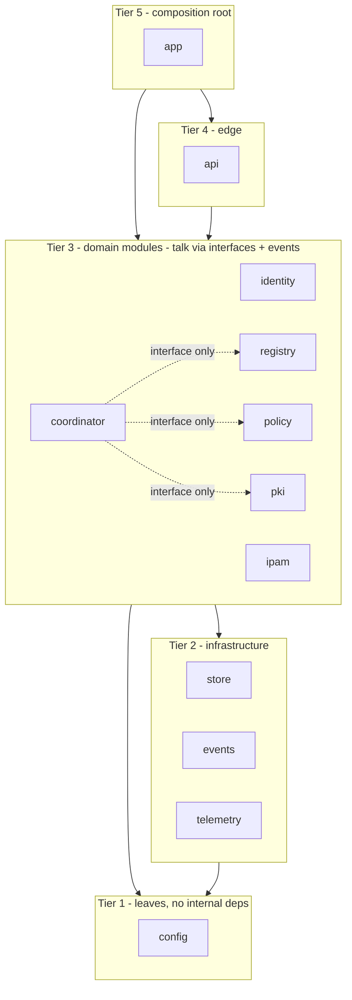

# Control-Plane Architecture & Wiring

**Revision:** 1
**Last modified:** 2026-06-25T00:00:00Z

> Master technical specification — Volume 3, document 03-A of the HelixVPN set.
> Scope: the **Go modular monolith** at the structural level — the binaries
> (`cmd/helixd`, `cmd/helixvpnctl`), the `internal/` package layout, the wiring
> rules that keep package boundaries equal to future service boundaries, the
> dependency-injection / composition root, and the mechanical gates that enforce
> all of it. This document *deepens* the "Control-Plane Architecture & Wiring"
> material of [02_CP §1] — it does not re-specify the data model (§2 of 02_CP),
> the policy compiler (§7), or the agent contract byte-evolution (doc 03-B). It
> stops at the seams where those documents begin and names the interface each
> exposes.
>
> This is a SPEC: it describes the implementation precisely enough to build, but
> builds nothing. Evidence cited inline by id — [02_CP §n] = the pass-1
> control-plane overview, [04_P1] = HelixVPN-Phase1-MVP.md, [04_ARCH §n] =
> HelixVPN-Architecture-Refined.md, [research-go_cp §n] = the cited Go-stack
> research, [SYNTHESIS §n] = the cross-document synthesis. Unproven assertions
> are marked **UNVERIFIED** per constitution §11.4.6 — never fabricated.

---

## 0. What this document owns, and the constraints every line obeys

This document owns the **shape** of the control plane: how one Go binary is
decomposed into packages, how those packages are allowed to reference each
other, how they are assembled at process start, how the assembled graph is
started and stopped, and how the structure is mechanically prevented from
decaying. Functional behaviour (DDL, the compiler algorithm, the wire contract)
lives in sibling documents and is referenced here only at its interface.

### 0.1 Governing invariants (inherited from [02_CP §0.1], restated as wiring law)

| # | Invariant | Wiring consequence specified here | Source |
|---|---|---|---|
| C1 | Go is never in the packet path. | The binary holds **zero** forwarding code; the only outbound network effects are Postgres, Redis, and `stream.Send` deltas. A startup assertion (§6.4) refuses to bind a raw `tun`/`AF_PACKET` socket. | [04_ARCH §2.1] |
| C2 | Postgres = truth, Redis = ephemeral. | `internal/store` is the **only** package importing `pgx`; `internal/events` is the **only** package importing `redis`. A dep-graph gate (§5.1) fails on any other importer. | [04_P1], [SYNTHESIS §2] |
| C3 | No-logging by construction. | No package may declare a struct/table/log-line carrying per-flow data; the schema-lint (sibling §2.4) plus a source-lint (§5.4 here) enforce it. | [04_ARCH §7] |
| C4 | Default-deny, need-to-know. | `coordinator` receives the *already-filtered* peer set from `policy`; it has **no** code path that reads a peer the compiler did not grant (§4.3). | [04_ARCH §3.4] |
| C5 | Push, don't poll; p99 < 1 s convergence. | The composition root wires an **event→coordinator→stream** fan-out with no polling loop; the SLO is a wired histogram, not a comment (§7). | [04_P1 §4/§10] |
| C6 | Device private keys never leave the device. | `pki` and `identity` accept only a 32-byte public key; no field in any internal struct is named/typed to hold a WG private key (§5.4 source-lint denylist). | [04_P1 §6] |
| C7 | **Package boundaries == future service boundaries.** | The central rule of this document: every `internal/<module>` is a Phase-2 extractable service. §3 and §5 make the boundary load-bearing, not aspirational. | [04_P1 §1] |
| C8 | Tenant isolation at the database (RLS). | Every module reaches the DB **only** through `store.WithTenant`; a custom analyzer (§5.3) flags raw `db.Query`/`pool.Exec` outside `internal/store`. | [04_P1 §2.2] |

### 0.2 Settled stack floor for this layer (versions are the build floor, not a guess)

Go **1.25** (minimum required by connect-go v1.20.0 [research-go_cp §2]) ·
Gin **v1.12.0** · `connectrpc.com/connect` **v1.20.0** + `buf` codegen ·
`jackc/pgx/v5` **v5.10.0** + `pgxpool` · `sqlc` **v1.31.1** (sqlc.yaml version
`"2"`, `engine: postgresql`, `sql_package: "pgx/v5"`) · `redis/go-redis/v9` ·
`goose` **v3.27.1** migrations · `spf13/cobra` for the CLI ·
`prometheus/client_golang` for metrics · rootless Podman per §11.4.161 +
`vasic-digital/containers` per §11.4.76 [research-go_cp §1–6, SYNTHESIS §2/§8].
The proto package is **`helix.coordinator.v1`** (unified across the whole spec
set; the Go import alias is `coordinatorv1`).

---

## 1. The two binaries

One Go module (`github.com/vasic-digital/helix-go`), two `main` packages. Both
import only `internal/*` packages — never each other.

### 1.1 `cmd/helixd` — the long-running control plane

`helixd` is the server. Its `main` does **four** things and nothing else
(everything substantive is delegated to the composition root, §6):

```go
// cmd/helixd/main.go
func main() {
    cfg := config.Load()                         // env + flags → typed Config (§1.3)
    if err := config.Validate(cfg); err != nil { // fail-fast on bad config
        fatal("config: %v", err)
    }
    ctx, stop := signal.NotifyContext(context.Background(),
        os.Interrupt, syscall.SIGTERM)           // graceful-shutdown root context
    defer stop()

    app, err := composeApp(ctx, cfg)             // composition root — wires all modules (§6)
    if err != nil {
        fatal("compose: %v", err)
    }
    if err := app.Run(ctx); err != nil {         // blocks until ctx cancelled or fatal
        fatal("run: %v", err)
    }
    // app.Run returns after a clean shutdown sequence (§6.5).
}
```

`fatal` writes a structured log line and exits non-zero. `main` contains **no**
business logic, **no** `pgx`/`redis`/`gin` import, and **no** module
construction — those live in `composeApp` so the wiring is testable in isolation
(a unit test calls `composeApp` against the `containers`-booted infra and asserts
the graph is well-formed, §8).

### 1.2 `cmd/helixvpnctl` — the bootstrap & ops CLI (Cobra)

`helixvpnctl` is a short-lived operator tool. It shares `internal/*` packages
with `helixd` (it is *not* a separate API client — it calls the same module
constructors directly for DB-touching ops, and the REST/Connect API for
runtime ops). Command tree:

```
helixvpnctl
├── bootstrap            # render Podman quadlets + .env.example + first-run wizard (§11 of 02_CP)
├── migrate up|down|status|redo     # goose against $HELIX_DB_URL (runs as helix_owner, BYPASSRLS)
├── tenant create|list|delete       # WithSystem ops: create tenant + overlay_pool (§4 ipam)
├── enroll-token mint|list|revoke   # identity: mint single-use hashed enroll tokens (§9 of 02_CP)
├── policy compile|activate|rollback # policy dry-run/activate via API (admin token)
├── device list|revoke              # registry/pki ops
└── doctor                          # preflight: DB reachable, role is non-superuser, RLS forced, redis up
```

`migrate` is the **one** command that connects as the migration owner
(`helix_owner`, the `BYPASSRLS` role per [research-go_cp §4]); every other
DB-touching subcommand connects as `helix_app_login` and goes through
`store.WithTenant`/`WithSystem`. `doctor` is the operator-facing instantiation
of the §6.4 startup assertions and exits non-zero (machine-greppable) if any
floor invariant is violated.

```go
// cmd/helixvpnctl/cmd/doctor.go — the preflight verdict (composes §6.4)
func runDoctor(cmd *cobra.Command, _ []string) error {
    checks := []doctorCheck{
        {"db-reachable",        checkDBPing},
        {"db-role-nonsuper",    checkRoleNotSuperuser},   // SELECT rolsuper,rolbypassrls (C8)
        {"rls-forced",          checkRLSForcedAllTables}, // every tenant table has FORCE RLS
        {"redis-reachable",     checkRedisPing},
        {"schema-no-traffic",   checkSchemaLintClean},    // sibling §2.4 lint, run live
        {"migrations-current",  checkGooseVersionMatch},
    }
    var failed int
    for _, c := range checks {
        if err := c.fn(cmd.Context()); err != nil {
            fmt.Printf("FAIL  %-20s %v\n", c.name, err); failed++
        } else {
            fmt.Printf("PASS  %-20s\n", c.name)
        }
    }
    if failed > 0 {
        return fmt.Errorf("doctor: %d/%d checks failed", failed, len(checks))
    }
    return nil
}
```

### 1.3 Typed configuration (`internal/config`)

Configuration is a single immutable struct loaded once at start; no package
reads `os.Getenv` directly (a source-lint, §5.4, forbids `os.Getenv` outside
`internal/config`). This keeps config a first-class wiring input.

```go
// internal/config/config.go
type Config struct {
    DBURL          string        // postgres://helix_app_login@host/helix?sslmode=verify-full
    RedisURL       string        // redis://host:6379/0
    ListenAddr     string        // ":8443"
    TLSCertFile    string        // gateway server cert
    TLSKeyFile     string
    CADir          string        // tenant CA material dir (§11.4.10 — never logged)
    DeviceCertTTL  time.Duration // default 24h (§9.3 of 02_CP)
    KeepAlive      time.Duration // stream keepalive, default 20s
    ReconcileSLO   time.Duration // SLO budget for the histogram bucket boundary, default 1s
    SendQueueDepth int           // per-stream bounded queue, default 256 (§4.4 back-pressure)
    OIDCIssuer     string        // optional; empty => anonymous-only mode
    LogLevel       string        // debug|info|warn|error
    Env            string        // dev|staging|prod
}

func Load() Config { /* env first, flag override; no I/O beyond env+flags */ }

// Validate fails fast: DBURL parseable, ListenAddr bindable shape, TTL>0,
// SendQueueDepth>0, TLS pair both-or-neither, prod requires verify-full sslmode.
func Validate(c Config) error
```

Secrets (DB password, CA key) are referenced by URL/path, never embedded in
`Config` as plaintext literals in a way that could be logged; `Config` has a
`String()`/`LogValue()` that redacts the DB password and never prints `CADir`
contents (§11.4.10).

---

## 2. Package layout — the modular monolith

One binary, many `internal/` packages, deployed as one rootless container. The
layout is identical to [02_CP §1.1] and is reproduced here as the authority for
the wiring rules that follow.

```
helix-go/
├── cmd/
│   ├── helixd/                  # control-plane binary — main + composeApp only (§1.1, §6)
│   └── helixvpnctl/             # Cobra ops CLI (§1.2)
├── internal/
│   ├── config/                  # typed Config, env/flag load + validate (§1.3) — leaf, imports nothing internal
│   ├── store/                   # pgxpool, WithTenant/WithSystem (RLS), sqlc Queries — ONLY pgx importer (C2/C8)
│   ├── events/                  # Bus abstraction; Redis Streams impl — ONLY redis importer (C2/D3)
│   ├── telemetry/               # Prometheus registry + control-action audit sink (§7)
│   ├── identity/                # tenants, users, OIDC, anonymous enroll tokens
│   ├── registry/                # devices, connectors, advertised prefixes, presence
│   ├── ipam/                    # overlay ULA /48 allocation + 4via6 site-ids (D4)
│   ├── pki/                     # WG pubkey registry, short-lived device certs, revoke
│   ├── policy/                  # ACL model + pure versioned compiler (§7 of 02_CP)
│   ├── coordinator/             # in-mem topology graph, deltas, WatchNetworkMap streams (owns NO tables, R2)
│   ├── api/                     # Gin REST + Connect (agents) + WS/SSE; auth middleware/interceptors
│   └── app/                     # composition root: composeApp + lifecycle Run/Shutdown (§6)
├── gen/                         # buf-generated Go from proto (helix.coordinator.v1) — generated, never hand-edited
├── proto/                       # helix/coordinator/v1/*.proto → buf generate (Go/Dart/Rust)
├── openapi/                     # REST contract → generated Dart/TS app clients
├── migrations/                  # goose SQL — schema authority (CI-linted, sibling §2.4)
└── tools/
    ├── schemalint/              # no-traffic-table lint (sibling §2.4)
    └── depgraph/                # the wiring-rule gate (§5.1)
```

**Layering (strict, acyclic).** Five tiers; an import may only point *down* a
tier (or sideways within tier 3 *through interfaces only*, never a concrete
store):



The dotted edges are the load-bearing ones: `coordinator` depends on `registry`,
`policy`, `pki` **only through their exported interfaces** (§3), never their
stores. This is what makes C7 mechanical.

---

## 3. Inter-module interface surface (the seams)

Every Tier-3 module exposes a single Go interface in `iface.go`; the concrete
implementation is package-private (lowercase `service` struct). A consumer holds
the **interface**, the composition root supplies the **implementation**. This is
the Phase-2 split seam: replace the interface's in-process implementation with a
Connect client and the module becomes a service with no caller change [04_P1
§12].

```go
// internal/registry/iface.go
type Registry interface {
    EnrollDevice(ctx context.Context, in EnrollInput) (Device, error)
    SetPrefixes(ctx context.Context, connectorID uuid.UUID, cidrs []netip.Prefix) ([]Conflict, error)
    DevicesForTenant(ctx context.Context, t uuid.UUID) ([]Device, error)
    MarkPresence(ctx context.Context, deviceID uuid.UUID, online bool, rttMS uint32) error
    Revoke(ctx context.Context, deviceID uuid.UUID) error
}

// internal/policy/iface.go — pure, deterministic, versioned
type Compiler interface {
    Compile(ctx context.Context, t uuid.UUID, spec Spec) (CompiledPolicy, error) // dry-run safe
    Activate(ctx context.Context, t uuid.UUID, version int64) error              // atomic flip
    ActiveFor(ctx context.Context, t uuid.UUID) (CompiledPolicy, error)          // coordinator hydrate
}

// internal/pki/iface.go
type PKI interface {
    IssueDeviceCert(ctx context.Context, deviceID uuid.UUID, ttl time.Duration) (Cert, error)
    Revoke(ctx context.Context, deviceID uuid.UUID) error // < 1s propagation (C5)
    Resolve(ctx context.Context, certSerial string) (DeviceIdentity, error) // mTLS authDevice (§8.2)
}

// internal/ipam/iface.go
type IPAM interface {
    ProvisionPool(ctx context.Context, t uuid.UUID) error                 // on tenant create
    AllocOverlayIP(ctx context.Context, q *db.Queries, t uuid.UUID) (netip.Addr, error)
    AllocSiteID(ctx context.Context, connectorID uuid.UUID) (uint16, error) // 4via6 (D4)
}

// internal/identity/iface.go
type Identity interface {
    MintEnrollToken(ctx context.Context, t uuid.UUID, kind DeviceKind, ttl time.Duration) (Token, error)
    ConsumeEnrollToken(ctx context.Context, raw string) (TokenClaim, error) // atomic single-use
    AuthenticateOIDC(ctx context.Context, idToken string) (Principal, error)
}

// internal/events/iface.go — bus-agnostic (D3: Redis Streams now, NATS later)
type Bus interface {
    Publish(ctx context.Context, stream string, env Envelope) (id string, err error)
    Subscribe(ctx context.Context, group, consumer string, streams ...string) (<-chan Envelope, error)
    Ack(ctx context.Context, stream, group, id string) error
}

// internal/telemetry/iface.go
type Metrics interface {
    ReconcileObserve(d time.Duration)               // helix_reconcile_seconds
    StreamGauge(delta int)                           // helix_open_streams
    EventDLQInc(stream string)                       // helix_events_dlq_total
    Audit(ctx context.Context, ev AuditEvent) error  // control-action audit sink (C3: never traffic)
}
```

**Interface discipline (enforced by §5.2).** A Tier-3 package's `iface.go` may
import only: the standard library, `github.com/google/uuid`, `net/netip`, and
**its own package's value types**. It MUST NOT import another `internal/<module>`
package — types crossing a seam are either primitives or types owned by the
callee. `coordinator` consuming `policy.CompiledPolicy` is legal because
`CompiledPolicy` is `policy`'s own exported value type; `coordinator` importing
`policy`'s internal `service` is not.

> **Decision D3 (event bus) — restated at the wiring layer.** The `Bus`
> interface is the seam. Redis Streams is the MVP implementation
> (`internal/events/redis.go`), NATS JetStream is a Phase-2 implementation
> (`internal/events/nats.go`) selected by `composeApp` from `Config.Env`/URL
> scheme — a transport swap, not a rewrite [02_CP §1.3, SYNTHESIS §3]. **UNVERIFIED:**
> the NATS implementation does not exist in Phase 1; only the interface and the
> Redis impl are built. The claim "swap is mechanical" is a design property of
> the seam, validated by the Phase-2 plan, not by running code today.

---

## 4. Wiring rules (R1–R6) — enforced, not aspirational

Each rule has (a) a one-line statement, (b) the failure mode it prevents, and
(c) the mechanical gate (§5) that fails the build when violated.

| Rule | Statement | Prevents | Gate |
|---|---|---|---|
| **R1** | No cross-store imports. A module reads another module's data only through the §3 interface, never by importing `internal/store` for the other module's tables. | Hidden coupling that makes the Phase-2 split a rewrite (C7). | §5.1 depgraph |
| **R2** | `coordinator` owns no durable tables. Its only state is the in-memory per-tenant graph + open streams (a cache hydrated from Postgres + events). | A second source of truth competing with Postgres (C2). | §5.1 + §8 hydrate test |
| **R3** | Every topology/policy-changing DB write emits an event in the **same unit of work**. The bus is the only path by which `coordinator` learns of change. | Silent drift: DB changed, edges did not converge (C5). | §5.5 write-emits-event analyzer + §8 |
| **R4** | Every DB access is tenant-scoped: no query runs outside `store.WithTenant`/`WithSystem`. | Cross-tenant leak even with a forgotten `WHERE` (C8). | §5.3 raw-query analyzer |
| **R5** | Only `internal/store` imports `pgx`; only `internal/events` imports `redis`; only `internal/api` imports `gin`/`connect` transport. | Infra leaking into domain logic; untestable modules. | §5.1 import-whitelist |
| **R6** | Domain modules (Tier 3) are constructed with their dependencies passed in (constructor injection); no module reaches a package-level singleton or `init()`-time global. | Untestable graph, hidden order-of-init bugs, two test runs sharing state. | §5.6 no-global analyzer + review |

### 4.1 R1 in practice — the coordinator never imports another store

```go
// internal/coordinator/coordinator.go — CORRECT (depends on interfaces)
type Coordinator struct {
    reg    registry.Registry      // interface, not registry.service
    pol    policy.Compiler        // interface
    pki    pki.PKI                // interface
    bus    events.Bus             // interface
    mx     telemetry.Metrics      // interface
    graph  map[uuid.UUID]*tenantGraph
    subs   *subRegistry           // open WatchNetworkMap streams
    mu     sync.RWMutex
}

// FORBIDDEN (would fail §5.1): import "github.com/vasic-digital/helix-go/internal/store"
//   func (c *Coordinator) loadDevices(...) { c.store.Query("SELECT ... FROM devices") }
// The coordinator must call c.reg.DevicesForTenant(...) instead.
```

### 4.2 R3 in practice — write-and-emit atomicity

The event publish rides **inside** the same `WithTenant` transaction as the
write, so a committed write always has a published event and a rolled-back write
publishes nothing. (Redis publish is not transactional with Postgres; the
contract is "publish on the success path before returning"; idempotent
coordinator reactions, §4.4, tolerate a duplicate, and the §5.5 analyzer catches
a write with no publish on its success path. An at-least-once bus + idempotent
consumer means a missed-publish-after-commit is the only residual risk, mitigated
by a periodic reconcile sweep, §7.4.)

```go
// internal/policy/activate.go — write + emit in one unit of work
func (s *service) Activate(ctx context.Context, t uuid.UUID, version int64) error {
    return s.store.WithTenant(ctx, t, func(q *db.Queries) error {
        if err := q.DeactivateAllPolicies(ctx, t); err != nil { return err }
        if err := q.ActivatePolicyVersion(ctx, db.ActivateParams{TenantID: t, Version: version}); err != nil {
            return err
        }
        _, err := s.bus.Publish(ctx, "events:policy",
            events.New("policy.compiled", t, "system", map[string]any{"version": version}))
        return err // if publish fails, the tx rolls back — no silent half-apply
    })
}
```

### 4.3 R-need-to-know — coordinator cannot read an ungranted peer (C4)

`coordinator.buildMap` consumes only `policy.CompiledPolicy.VisibleTo[node]`; it
has no direct path to "all devices in tenant". The only API it has from
`registry` returns devices, but the *map construction* iterates the
policy-filtered visibility set, so a device the compiler did not grant never
enters a `NetworkMap`. This is verified by a unit test that builds a map for a
node with an empty visibility set and asserts `len(peers)==0` even when the
tenant has many devices (§8).

### 4.4 Back-pressure & idempotency (the bound that keeps the SLO honest)

Each open stream has a bounded send queue (`Config.SendQueueDepth`, default 256).
A consumer that fills its queue is **dropped and forced to reconnect-with-
snapshot** — this is memory back-pressure, not unbounded growth, and is the
mechanism behind the 24 h-soak "memory slope ≈ 0" SLO (§7.3). Every delta is
recomputed from current graph state, so a replayed/duplicate event produces an
identical delta (idempotent), making at-least-once delivery safe [02_CP §5.4].

---

## 5. Mechanical enforcement gates (the wiring cannot decay)

Per §11.4.110 (clash detection) + §11.4.27 (no-fakes) + §1.1 (paired mutation),
each rule has a pre-build gate **and** a paired mutation that proves the gate
catches the violation. All gates run locally (§11.4.156 — no remote CI). The
gates live in `tools/depgraph` and as `golangci-lint` custom analyzers.

### 5.1 `tools/depgraph` — import-graph gate (R1, R2, R5)

Parses `go list -deps -json ./...` and asserts the import edges against a
declared allow-list:

```go
// tools/depgraph/rules.go (illustrative allow-list)
var allowed = map[string][]string{
    "internal/config":      {},                                  // leaf
    "internal/store":       {"internal/config"},                 // + pgx (whitelisted infra)
    "internal/events":      {"internal/config"},                 // + redis
    "internal/telemetry":   {"internal/config", "internal/store"},
    "internal/identity":    {"internal/config", "internal/store", "internal/events", "internal/telemetry"},
    "internal/registry":    {"internal/config", "internal/store", "internal/events", "internal/telemetry", "internal/ipam"},
    "internal/ipam":        {"internal/config", "internal/store"},
    "internal/pki":         {"internal/config", "internal/store", "internal/events", "internal/telemetry"},
    "internal/policy":      {"internal/config", "internal/store", "internal/events", "internal/telemetry"},
    "internal/coordinator": {"internal/config", "internal/events", "internal/telemetry",
                             "internal/registry", "internal/policy", "internal/pki"}, // interfaces only — NO store
    "internal/api":         {"internal/config", "internal/identity", "internal/registry", "internal/ipam",
                             "internal/pki", "internal/policy", "internal/coordinator", "internal/telemetry", "internal/events"},
    "internal/app":         {"*"}, // composition root may import all
}
// Infra whitelist: pgx allowed ONLY under internal/store; redis ONLY under internal/events;
// gin + connectrpc ONLY under internal/api. A violation prints the offending edge and exits 1.
```

**Edge case — `coordinator` MUST NOT appear with `internal/store` in its dep
set.** The gate special-cases this: `coordinator → store` is the canonical R1/R2
violation and produces a dedicated error message naming the rule.

**Paired §1.1 mutation:** add `import _ "…/internal/store"` to
`internal/coordinator/coordinator.go` → `tools/depgraph` MUST exit non-zero;
remove it → exit zero.

### 5.2 Interface-purity check (R1 seam discipline)

A small analyzer asserts each `internal/<module>/iface.go` imports no other
`internal/<module>` package (stdlib + `uuid` + `netip` + own package only, §3).
**Mutation:** make `registry/iface.go` import `internal/policy` → analyzer FAILs.

### 5.3 Raw-query analyzer (R4 — tenant scope)

A `golangci-lint` custom analyzer flags any call to `pool.Query`/`pool.Exec`/
`conn.Query` (the pgx surface) made outside `internal/store`, and any `db.New(`
constructed outside a `WithTenant`/`WithSystem` closure. **Mutation:** add a raw
`s.pool.Query(ctx, "SELECT * FROM devices")` in `internal/registry` → analyzer
FAILs.

### 5.4 Source-lint denylist (C3, C6, config-only-env)

A regex/AST source-lint (a sibling to the schema-lint, sibling §2.4) rejects:

| Class | Denied pattern | Invariant |
|---|---|---|
| Traffic logging | identifiers `src_ip`/`dst_ip`/`bytes_in`/`packet_count`/`flow`/`netflow`/`sni_host` in any struct field, log key, or table | C3 |
| WG private key | identifiers `wg_priv`/`private_key`/`privkey`/`secret_key` typed as `[]byte`/`[32]byte` reachable from `identity`/`pki`/`registry` | C6 |
| Stray env read | `os.Getenv(` outside `internal/config` | §1.3 |
| Stray infra | `import "…/pgx"` outside `store`, `import "…/redis"` outside `events` | R5 |

**Mutation:** add a struct field `SrcIP netip.Addr` to a registry type → lint
FAILs.

### 5.5 Write-emits-event analyzer (R3)

A heuristic AST analyzer: any exported method whose body contains a
`store.WithTenant` closure that calls a mutating sqlc method (`Insert*`/
`Update*`/`Delete*`/`Activate*`/`Deactivate*` on topology/policy tables) MUST
also contain a `bus.Publish` on the closure's success path. This is a
**best-effort** gate (it cannot prove semantic completeness — marked
**UNVERIFIED** as a total guarantee); the authoritative R3 proof is the §8
integration test asserting that a device-revoke write produces a `device.revoked`
event observed on the bus. **Mutation:** delete the `bus.Publish` from
`policy.Activate` → analyzer warns AND the integration test FAILs (no event →
coordinator never converges → SLO assertion times out).

### 5.6 No-global analyzer (R6)

Flags package-level mutable `var` of a service/struct type and non-trivial
`init()` functions in Tier-2/3 packages (constants and registered Prometheus
collectors in `telemetry` are allow-listed). **Mutation:** add
`var defaultCoordinator *Coordinator` package-global → analyzer FAILs.

---

## 6. Composition root & dependency injection (`internal/app`)

The composition root is the **only** place modules are constructed and wired.
Phase 1 uses **explicit constructor injection** (no DI framework) — the wiring is
a single readable function, which is the point: the dependency graph is
auditable in one screen, and the Phase-2 split is "replace one constructor call
with a Connect-client constructor."

### 6.1 Construction order (topological, matches the §2 tiers)

```go
// internal/app/compose.go
type App struct {
    cfg   config.Config
    store *store.Store
    bus   events.Bus
    mx    telemetry.Metrics
    coord *coordinator.Coordinator
    srv   *http.Server          // Gin + Connect multiplexed on one listener (§6.3)
    closers []io.Closer         // reverse-ordered shutdown (§6.5)
}

func composeApp(ctx context.Context, cfg config.Config) (*App, error) {
    // --- Tier 1/2: infrastructure first ---
    st, err := store.Open(ctx, cfg.DBURL)            // pgxpool; verifies non-superuser role (§6.4)
    if err != nil { return nil, fmt.Errorf("store: %w", err) }

    bus, err := events.Open(ctx, cfg.RedisURL)        // Redis Streams impl (D3 seam)
    if err != nil { return nil, fmt.Errorf("bus: %w", err) }

    mx := telemetry.New(st)                           // Prometheus registry + audit sink

    // --- Tier 3: domain modules, dependencies passed in (R6) ---
    ipm := ipam.New(st)
    idn := identity.New(st, bus, mx)
    pkis := pki.New(st, bus, mx, cfg.CADir, cfg.DeviceCertTTL)
    reg := registry.New(st, bus, mx, ipm)
    pol := policy.New(st, bus, mx)
    coord := coordinator.New(reg, pol, pkis, bus, mx, coordinator.Opts{
        KeepAlive:      cfg.KeepAlive,
        SendQueueDepth: cfg.SendQueueDepth,
    })

    // --- Tier 4: API edge (REST + Connect + WS/SSE) ---
    handler := api.New(api.Deps{
        Identity: idn, Registry: reg, IPAM: ipm, PKI: pkis,
        Policy: pol, Coordinator: coord, Metrics: mx, Bus: bus,
        OIDCIssuer: cfg.OIDCIssuer,
    })
    srv := &http.Server{Addr: cfg.ListenAddr, Handler: handler}

    return &App{
        cfg: cfg, store: st, bus: bus, mx: mx, coord: coord, srv: srv,
        closers: []io.Closer{srv2closer(srv), coord, busCloser(bus), st}, // reverse order
    }, nil
}
```

The construction order is **forced** by the type signatures: `registry.New`
*requires* an `ipam.IPAM`, so `ipam` must be built first; the compiler enforces
the topological order, which is itself a (weak) wiring check.

### 6.2 Why explicit injection, not `wire`/`fx` (decision, honest trade-off)

| Option | Pro | Con | Verdict |
|---|---|---|---|
| **Explicit constructors (chosen)** | One readable wiring function; zero magic; compiler-enforced order; trivial to unit-test `composeApp` | Manual edits when a dep is added | **Phase 1** — the graph is small (≤12 modules); readability > automation |
| `google/wire` (codegen) | Compile-time DI, no runtime reflection | Extra build step; generated `wire_gen.go` to review | Phase-2 candidate if the graph grows |
| `uber/fx` (runtime) | Lifecycle hooks, large-app ergonomics | Runtime reflection; obscures the graph; harder anti-bluff audit | Rejected — opacity conflicts with the auditable-wiring goal |

**UNVERIFIED:** the claim "explicit injection scales fine to Phase 2" is a design
judgement; if the module count grows past the point where the wiring function is
unreadable in one screen, migrate to `wire` (it preserves explicit constructors,
so the migration is mechanical).

### 6.3 One listener, two surfaces (Gin + Connect multiplexed)

`api.New` returns a single `http.Handler` that routes Connect RPC paths to the
Connect mux and everything else to Gin, on one `http.Server` [research-go_cp
§1/§2/§7]. Connect handlers are plain `http.Handler`s, so the top-level mux
dispatches by path prefix:

```go
// internal/api/router.go
func New(d Deps) http.Handler {
    gw := gin.New()
    gw.Use(recovery(), reqID(), accessLog(d.Metrics)) // gin.New() not gin.Default() (research-go_cp §1)
    registerREST(gw, d)                                // /v1/* REST (§8.1 of 02_CP)
    registerWS(gw, d)                                  // /v1/stream WS/SSE

    connectMux := http.NewServeMux()
    path, h := coordinatorv1connect.NewCoordinatorHandler(   // helix.coordinator.v1
        newCoordinatorServer(d),
        connect.WithInterceptors(authInterceptor(d.PKI), validateInterceptor()))
    connectMux.Handle(path, h)

    top := http.NewServeMux()
    top.Handle("/helix.coordinator.v1/", connectMux)   // typed RPC + server-streaming
    top.Handle("/grpc.", connectMux)                    // gRPC reflection/health
    top.Handle("/", gw)                                  // everything else → Gin
    // h2c so HTTP/2 (server-streaming) works without TLS in dev; TLS-ALPN in prod.
    return h2c.NewHandler(top, &http2.Server{})
}
```

The Connect server speaks gRPC, gRPC-Web, and the Connect protocol from one
handler with no Envoy [research-go_cp §2], so a future WASM Console reuses the
same `Coordinator` service. **Edge case (research-go_cp §2):** a server-streaming
response is always HTTP 200 even on error — the error rides the trailer; clients
read the trailer status, never the HTTP code. The §8 integration test asserts an
auth failure mid-stream surfaces as a Connect error code, not a 200-with-empty-
body.

### 6.4 Startup assertions (the floor, run before serving)

`App.Run` runs these *before* binding the listener and aborts (exit non-zero) on
any failure — they are the §11.4.108 runtime signatures that prove the floor
invariants are live, not promised:

```go
// internal/app/run.go (assertion list)
func (a *App) preflight(ctx context.Context) error {
    // C8: app role must NOT be superuser/bypassrls (else RLS silently bypassed)
    if super, bypass, _ := a.store.RoleFlags(ctx); super || bypass {
        return fmt.Errorf("refusing to start: DB role has superuser=%v bypassrls=%v (RLS would be bypassed)", super, bypass)
    }
    // C8: every tenant-scoped table must have FORCE ROW LEVEL SECURITY
    if missing, _ := a.store.TablesMissingForceRLS(ctx); len(missing) > 0 {
        return fmt.Errorf("refusing to start: FORCE RLS missing on %v", missing)
    }
    // C1: no packet-path — assert no raw tun/AF_PACKET capability is held
    if hasRawNetCapability() {
        return fmt.Errorf("refusing to start: process holds raw-socket capability (control plane must not be in packet path)")
    }
    // C2: redis reachable but losing it must not block start of existing-tunnel serving (fail-static)
    a.bus.PingOrWarn(ctx)
    return nil
}
```

### 6.5 Lifecycle — `Run` and graceful shutdown

```go
func (a *App) Run(ctx context.Context) error {
    if err := a.preflight(ctx); err != nil { return err }

    // hydrate coordinator graph from Postgres before accepting streams (R2)
    if err := a.coord.Hydrate(ctx); err != nil { return fmt.Errorf("hydrate: %w", err) }

    // start the event consumers (coordinator subscribes to the bus, §5 of 02_CP)
    g, gctx := errgroup.WithContext(ctx)
    g.Go(func() error { return a.coord.ConsumeEvents(gctx) }) // events → graph → deltas
    g.Go(func() error { return a.coord.DLQSweeper(gctx) })    // XAUTOCLAIM reclaim (§5.4 of 02_CP)
    g.Go(func() error {                                       // serve
        if err := a.srv.ListenAndServe(); err != nil && err != http.ErrServerClosed { return err }
        return nil
    })
    g.Go(func() error {                                       // shutdown on ctx cancel
        <-gctx.Done()
        sctx, cancel := context.WithTimeout(context.Background(), 15*time.Second)
        defer cancel()
        _ = a.srv.Shutdown(sctx)        // stop accepting; drain in-flight; close streams gracefully
        a.closeAll()                     // reverse-order closers: srv, coord, bus, store
        return nil
    })
    return g.Wait()
}
```

Shutdown order is the reverse of construction: stop the HTTP server (closing open
`WatchNetworkMap` streams cleanly so agents reconnect-with-snapshot), then the
coordinator (flush queues, mark presence offline), then the bus, then the store
pool. A `coordinator` stream close flips device presence offline (`device.offline`
event) so peers learn the relay is gone.

---

## 7. The <1 s convergence SLO as a wired property

The "p99 < 1 s" promise [C5, 04_P1 §10] is not a comment — it is a wired
histogram with a budget boundary, plus the fan-out path that must stay within it.

### 7.1 The path the budget covers

```mermaid
sequenceDiagram
    autonumber
    participant Mut as mutating module (policy/registry/pki)
    participant PG as Postgres (RLS)
    participant Bus as Redis Streams
    participant Coord as coordinator
    participant Edge as agent stream (WatchNetworkMap)
    Mut->>PG: write (WithTenant tx)
    Mut->>Bus: XADD events:* (same unit of work, R3)
    Bus-->>Coord: XReadGroup delivers Envelope
    Note over Coord: t0 = event-receive (histogram start)
    Coord->>Coord: apply to in-mem graph; compute minimal affected set (§6.4 of 02_CP)
    loop each affected open stream
        Coord->>Edge: stream.Send(MapDelta)
    end
    Note over Coord: t1 = last stream.Send (histogram stop) -- helix_reconcile_seconds = t1-t0
```

The histogram measures **event-receive → last `stream.Send`** for the affected
set — the portion the control plane owns. DB-write and bus-deliver latency are
measured separately (`helix_write_seconds`, bus lag) so a regression is
attributable to the right stage, not lumped.

### 7.2 The wired metrics (`internal/telemetry`)

```go
var (
    reconcile = prometheus.NewHistogram(prometheus.HistogramOpts{
        Name: "helix_reconcile_seconds",
        Help: "event-receive to last stream.Send for the affected set",
        Buckets: []float64{.005, .01, .025, .05, .1, .25, .5, 1, 2.5}, // 1s is a bucket boundary == SLO
    })
    openStreams = prometheus.NewGauge(prometheus.GaugeOpts{Name: "helix_open_streams"})
    dlqTotal    = prometheus.NewCounterVec(prometheus.CounterOpts{Name: "helix_events_dlq_total"}, []string{"stream"})
    rss         = prometheus.NewGauge(prometheus.GaugeOpts{Name: "process_resident_memory_bytes"}) // soak slope≈0
)
```

### 7.3 SLO acceptance numbers (anti-bluff, measured — [02_CP §10.2])

| Metric | Target | Measured by |
|---|---|---|
| event → delta-on-wire | **p99 < 1 s** | `helix_reconcile_seconds` p99 over the soak window |
| device revoke → edge enforced | < 1 s | revoke-to-WG-peer-removed timer on the edge |
| coordinator RSS @ 10k streams | slope ≈ 0 over 24 h | `process_resident_memory_bytes` linear-fit slope |
| enrollment round-trip | < 500 ms | API histogram |
| policy compile (1k devices) | < 200 ms | compiler benchmark |

### 7.4 Reconcile sweep (the R3 residual-risk backstop)

A low-frequency (default 60 s) background sweep recomputes each tenant's graph
from Postgres and diffs it against the in-memory graph; any divergence (the rare
publish-after-commit miss, §4.2) emits the missing delta and increments
`helix_reconcile_repairs_total`. A non-zero repair counter under steady state is
a §11.4.6 forensic signal, not a silent self-heal — it is alerted, investigated,
and the root cause fixed, never normalised.

---

## 8. Error taxonomy & propagation across seams

Errors crossing a §3 interface MUST carry a stable, typed classification so the
API edge maps them to the right HTTP/Connect code and the coordinator reacts
correctly. Hidden `errors.New("failed")` strings are forbidden across seams.

```go
// internal/apperr/apperr.go — the cross-seam error vocabulary
type Kind int
const (
    KindInvalid      Kind = iota // bad input            → 400 / CodeInvalidArgument
    KindUnauthorized             // bad/expired token     → 401 / CodeUnauthenticated
    KindForbidden                // RBAC/RLS/revoked       → 403 / CodePermissionDenied
    KindNotFound                 // missing tenant/device  → 404 / CodeNotFound
    KindConflict                 // version/CIDR collision → 409 / CodeAlreadyExists | CodeAborted
    KindFailedPrecond            // policy dry-run reject  → 412 / CodeFailedPrecondition
    KindExhausted                // send-queue full        → 429 / CodeResourceExhausted
    KindInternal                 // bug / infra            → 500 / CodeInternal
    KindUnavailable              // DB/redis down          → 503 / CodeUnavailable
)
type Error struct { Kind Kind; Op string; Err error; Fields map[string]any }
func (e *Error) Error() string { return e.Op + ": " + e.Err.Error() }
func (e *Error) Unwrap() error { return e.Err }
```

| Edge case | Producing module | Kind | API mapping |
|---|---|---|---|
| Enroll token already consumed | identity | `KindForbidden` | 403 / `PermissionDenied` |
| Enroll token expired | identity | `KindUnauthorized` | 401 / `Unauthenticated` |
| Overlay-IP pool race (lost the row lock) | ipam | retried internally; surfaces `KindConflict` only after N retries | 409 |
| Policy `dst` CIDR not in any `advertised_prefixes` | policy (dry-run) | `KindFailedPrecond` | 412 |
| Two connectors advertise overlapping CIDR | registry | non-blocking `route.conflict.detected` event + `KindConflict` only if hard-collision | 409 or surfaced in Console |
| `exitNodes` resolves to a connector | policy (dry-run) | `KindFailedPrecond` | 412 |
| Watch from a revoked device | api/coordinator | `KindForbidden` | Connect `PermissionDenied`, stream force-closed |
| Slow consumer fills send queue | coordinator | `KindExhausted` | stream dropped → client reconnect-with-snapshot |
| Postgres unreachable on write | store | `KindUnavailable` | 503; existing tunnels keep forwarding (fail-static, C1) |
| Redis unreachable | events | `KindUnavailable` warn; coordinator serves last known graph (fail-static) | 503 on writes that need a publish |

The API edge has a single `mapError(err) connect.Code / http status` translator;
the coordinator special-cases `KindForbidden` (drop the stream) and `KindExhausted`
(back-pressure) and treats everything else on the event path as retryable
(re-queued via the PEL, §5.4 of 02_CP).

---

## 9. Concurrency model & shared-state safety

| State | Owner | Protection | Failure prevented |
|---|---|---|---|
| in-mem per-tenant graph | `coordinator` | `sync.RWMutex` per tenant; reads (buildMap) take RLock, event-apply takes Lock | torn graph during fan-out |
| open-stream registry (`subRegistry`) | `coordinator` | sharded `sync.Map` keyed by device id; each stream has its own bounded chan | head-of-line blocking across agents |
| per-stream send queue | one goroutine per stream | buffered chan depth `SendQueueDepth`; full ⇒ drop+close | unbounded memory (the soak SLO) |
| pgx pool | `store` | `pgxpool` internal; `SET LOCAL` is tx-scoped so tenant context **cannot** leak across pooled conns [research-go_cp §4] | cross-tenant context bleed |
| Redis consumer group | `coordinator` consumers | one consumer name per `helixd` host id; `XAUTOCLAIM` reclaims a crashed consumer's PEL | lost events on coordinator crash (§11.4.147) |

**Load-bearing rule (research-go_cp §4):** the tenant pin is `SET LOCAL`
(transaction-scoped), never plain `SET` — a plain `SET` persists for the pooled
connection's life and the next request inherits the previous tenant's scope (the
#1 silent isolation break). The §5.3 analyzer + the §8 RLS cross-tenant test
together guarantee it.

No blocking call (DB, Redis, network) is ever made while holding the
coordinator's graph lock — the lock is held only for the in-memory apply/diff;
the `stream.Send` fan-out happens after RUnlock, enqueuing into per-stream chans
(constitution mandatory principle 2: no blocking ops in a shared-lock region).

---

## 10. Test points — tied to the §11.4.169 comprehensive test-type mandate

§11.4.169 (the live constitution anchor mandating comprehensive test-type
coverage) requires every component carry the full applicable test-type set with
captured evidence (§11.4.5/§11.4.69) and a paired §1.1 mutation. The wiring layer
maps as follows; each row is a workable item (§11.4.93).

| Test type | What it asserts for the wiring layer | Evidence / fixture |
|---|---|---|
| **Unit** | `composeApp` builds a non-nil graph with all deps non-nil; `config.Validate` rejects every malformed field; `apperr.mapError` is total over `Kind`; coordinator buildMap with empty visibility ⇒ 0 peers (C4) | go test `-count=3` deterministic (§11.4.50) |
| **Dep-graph gate (pre-build)** | R1/R2/R5 import allow-list holds; the §5 analyzers run clean | `tools/depgraph` exit 0; analyzer report |
| **Paired §1.1 mutation** | each gate FAILs on its planted violation (import `store` into `coordinator`; `os.Getenv` in `registry`; `SrcIP` field; drop `bus.Publish`; package-global coordinator) | per-mutation FAIL log captured |
| **Store / RLS** | tenant A cannot read tenant B even with a crafted query under `FORCE RLS`, running as `helix_app` | RLS denial test output [02_CP §10.3] |
| **Integration** | enroll → advertise → policy → `WatchNetworkMap`: assert the delta stream content **and** `helix_reconcile_seconds` p99 < 1 s; assert a revoke produces `device.revoked` (R3) and force-closes the stream | Postgres+Redis booted on-demand via `vasic-digital/containers` (§11.4.76 — not ad-hoc `docker run`); captured stream transcript |
| **Lifecycle** | `App.Run` preflight aborts on a superuser DB role / missing FORCE RLS / raw-socket capability; graceful shutdown closes streams and flips presence offline | preflight FAIL exit-code + shutdown trace |
| **Soak (stress)** | N simulated agents hold streams 24 h while policies flap; assert convergence SLO holds and `process_resident_memory_bytes` slope ≈ 0 (back-pressure works) | RSS time-series, slope fit |
| **Chaos (§11.4.85)** | kill the coordinator mid-fan-out → `XAUTOCLAIM` reclaims its PEL, no event lost (§11.4.147); kill Redis → control plane serves last graph (fail-static, C1) | recovery trace, event-count reconciliation |
| **Schema-lint meta-test** | a planted `connections(src_ip,…)` table makes the no-traffic lint FAIL; removing it passes (C3) | lint FAIL/PASS pair |
| **Challenge (helix_qa)** | drive enroll→policy→delta end-to-end and score PASS only on the captured <1 s evidence (§11.4.5/.69/.107) | Challenge `result.json` + reconcile histogram |

Every PASS uses `ab_pass_with_evidence` citing the captured artefact (§11.4.69);
no metadata-only / grep-only PASS (§11.4 anti-bluff). The dep-graph and analyzer
gates are the §11.4.108 runtime signatures proving the wiring rules are live.

---

## 11. Phase-2 split seam (why boundaries == service boundaries, proven)

C7 is the central claim of this document; here is *why* the Phase-1 wiring makes
the split mechanical, not a rewrite [04_P1 §12]:

1. Every Tier-3 module is consumed **only** through its §3 interface (enforced by
   §5.1/§5.2). To extract `policy` into its own service, write
   `policyclient.New(connAddr) policy.Compiler` (a Connect client that satisfies
   the *same* `Compiler` interface) and change **one line** in `composeApp`
   (`pol := policyclient.New(cfg.PolicyAddr)` instead of `policy.New(...)`). No
   caller of `pol.Compile` changes.
2. `coordinator` already owns no tables (R2) and is stateless-on-restart (rebuilds
   the graph from Postgres + events on boot, §6.5), so it scales horizontally
   behind a load balancer with no reshaping — the Phase-2 K8s `replicas: 3`
   deployment [02_CP §11.3] works because the seam was drawn here.
3. The `events.Bus` interface (D3) swaps Redis Streams → NATS JetStream by
   selecting a different implementation in `composeApp` — multi-region fan-out
   without touching any producer/consumer call site.
4. The wire contract (`helix.coordinator.v1`) is already a network protocol over
   Connect, so an "in-process" module and a "remote" service speak the *same*
   contract; there is no internal-vs-external API divergence to reconcile.

**Honest boundary (§11.4.6):** this document proves the seams *permit* the split;
it does **not** claim the split has been executed or benchmarked. The Phase-2
services, the NATS implementation, and the K8s HA topology are **UNVERIFIED** as
running code in Phase 1 — they are design seams whose correctness is asserted by
the interface discipline and the gates, validated by the §10 tests, and will be
proven by the Phase-2 deliverable, not before.

---

## 12. Helix-ecosystem & constitution wiring (this layer)

| Submodule / clause | Use in the architecture & wiring layer |
|---|---|
| `vasic-digital/containers` (§11.4.76/§11.4.161) | sole container orchestration: boot Postgres/Redis on-demand for the §10 integration/soak/chaos suites; render the rootless quadlets — no ad-hoc `docker`/`podman` |
| `helix_qa` + `challenges` (§11.4.27/§11.4.5/.69/.107/.169) | the §10 test-type matrix + the enroll→policy→delta Challenge asserting <1 s with captured evidence |
| `docs_chain` (§11.4.106) | mechanizes this doc's HTML/PDF/DOCX export + turns the §10 workable items into git-tracked DB rows (§11.4.93) |
| `security` (§7) | reviews the RLS-role/mTLS/CA-key wiring; pairs with the §5.4 source-lint + sibling §2.4 schema-lint |
| §11.4.151/.155 | release-prefixed image tag (`helixvpn-0.1.0`) + recording prefixes for QA evidence |
| §11.4.156 | NO active CI — every §5 gate + §10 test runs locally (pre-build + meta-test) |
| §11.4.113 | no force-push across the helix-go repo + its owned submodules |

---

## Sources

[02_CP] `docs/research/mvp/final/02-control-plane.md` (pass-1 control-plane
overview — package layout §1, DDL/RLS §2, IPAM §3, proto §4, events §5,
coordinator §6, policy §7, API/authz §8, identity/PKI §9, SLOs §10, deploy §11,
phase plan §13) ·
[04_P1] `HelixVPN-Phase1-MVP.md` (modular monolith, R1–R4 wiring, coordinator,
Phase-2 seams §12) ·
[04_ARCH §4] `HelixVPN-Architecture-Refined.md` (control/data separation,
schema-generated clients, no-logging, default-deny) ·
[research-go_cp] Go-stack research (Gin v1.12.0 §1; connect-go v1.20.0 + buf +
protovalidate §2; sqlc v1.31.1 + pgx v5.10.0 §3; Postgres RLS `SET LOCAL` +
`FORCE RLS` §4; Redis Streams `XAUTOCLAIM`/DLQ §5; goose v3.27.1 §6;
single-server composition §7 — all accessed 2026-06-25) ·
[SYNTHESIS] cross-document synthesis (stack floor §2, decisions D3/D4 §3,
ecosystem wiring §8, constitution bindings §9).
