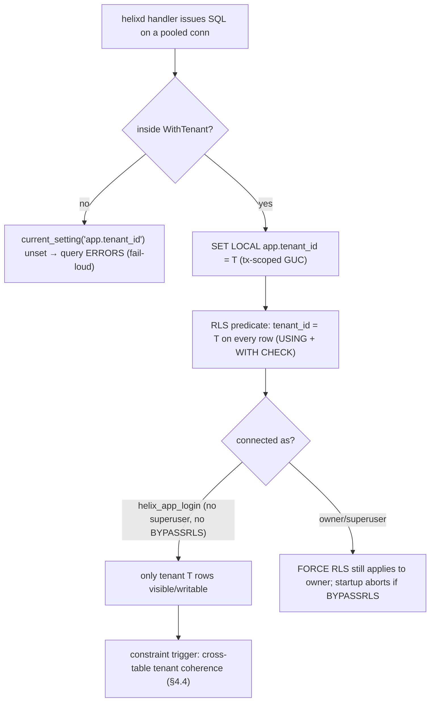
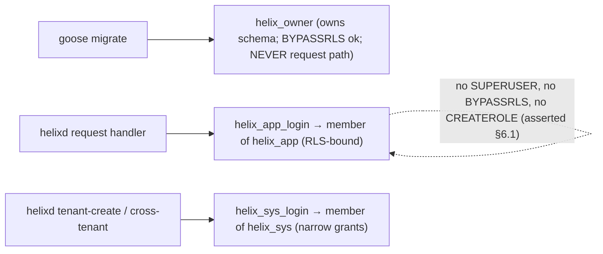
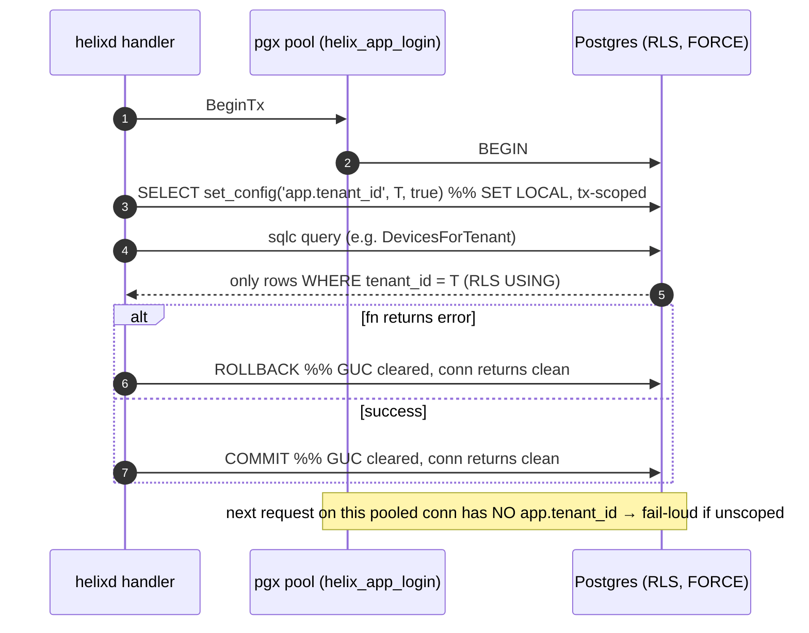
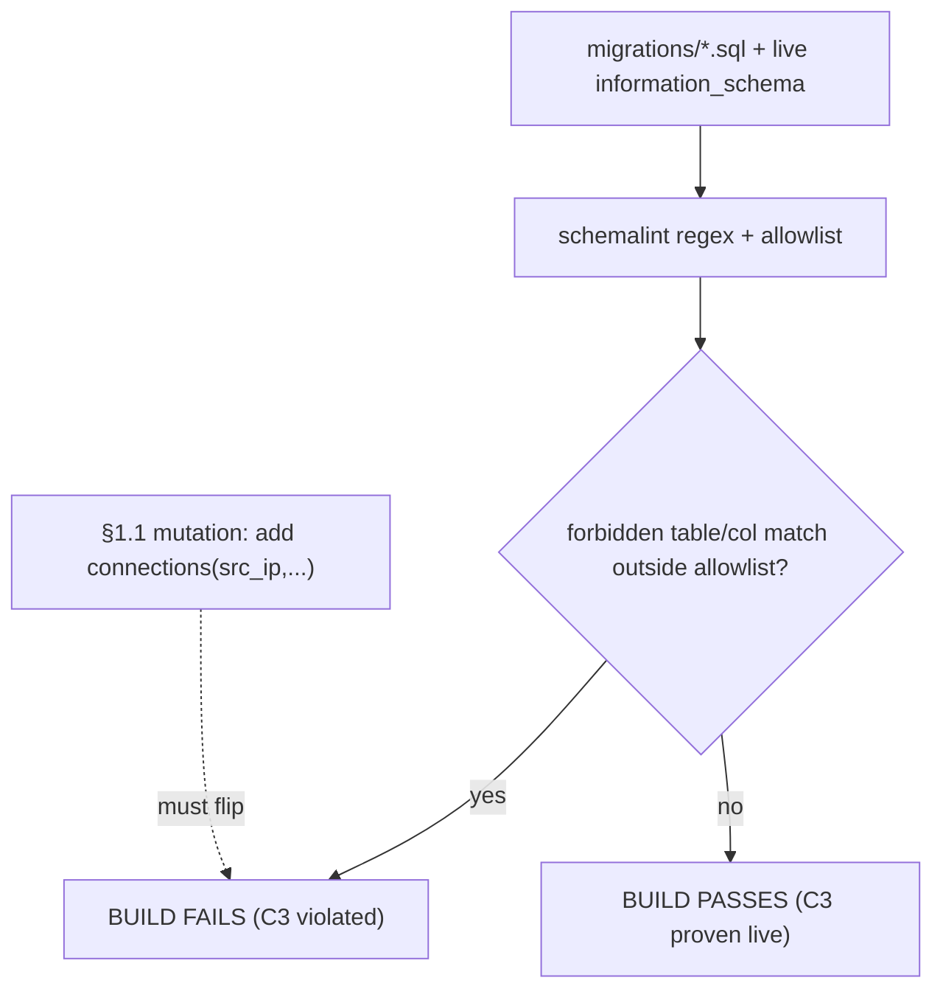

# Data Model — full Postgres DDL + RLS

**Revision:** 1
**Last modified:** 2026-06-25T00:00:00Z

> Master technical specification — Volume 3 (Control Plane, Go), nano-detail deepening of
> [02-control-plane.md §2](../02-control-plane.md). Scope: the **complete, runnable Postgres
> schema** that is the single source of truth for HelixVPN identity, topology and policy — every
> table, type, constraint, FK, index; the Row-Level Security (RLS) regime that enforces
> multi-tenant isolation at the database under a non-superuser role; the `SET LOCAL` per-tx
> pattern; goose/atlas migrations; sqlc typed queries; and the **provable absence** of any
> connection/traffic/flow table (no-logging by construction). This is a SPEC — it describes the
> implementation exactly; it does not build the product. Source evidence cited inline by id:
> [04_P1] HelixVPN-Phase1-MVP.md, [04_ARCH §N] HelixVPN-Architecture-Refined.md, [research-go_cp]
> the control-plane overview doc 02, [SYNTHESIS §N] the cross-document synthesis. Unproven
> assertions are marked `UNVERIFIED` per constitution §11.4.6.

---

## 0. Position, ownership & governing invariants

This document owns **`helix-go/internal/store` and `helix-go/migrations`** — the durable-state
layer of the control plane. It is the authoritative, byte-level expansion of the abbreviated DDL
in [research-go_cp §2]. It does **not** own the in-memory coordinator graph (volatile, doc 02 §6),
the Redis event bus (ephemeral, doc 02 §5), the wire `.proto` (doc 02 §4 / doc 03), or the policy
*compiler* (doc 02 §7 — but it owns the `policies` table the compiler reads/writes).

### 0.1 Invariants this layer must mechanically enforce

| # | Invariant | Mechanism in THIS document | Source |
|---|---|---|---|
| C2 | Postgres is the single source of truth; Redis is ephemeral. | All identity/topology/policy in the 11 tables below; no durable state elsewhere. | [04_P1], [SYNTHESIS §2] |
| C3 | No-logging by construction — the schema holds no connection/traffic/packet/flow table. | §7 schema-lint gate + the exhaustive forbidden-shape allowlist. | [04_ARCH §7], [04_P1 §2], [SYNTHESIS §7] |
| C4 | Default-deny, need-to-know. | `policies.spec` is the only grant source; no implicit visibility row exists. | [04_ARCH §3.4], [04_P1 §3] |
| C6 | Device private keys never leave the device. | `devices.wg_pubkey bytea` stores only the 32-byte public key; no private-key column exists anywhere. | [04_P1 §6], [SYNTHESIS §7] |
| C8 | Multi-tenant isolation enforced at the database via RLS under a non-superuser role — not merely `WHERE`. | §4 RLS (`ENABLE` + `FORCE`), §5 `helix_app`/`helix_owner`/`helix_sys` roles, §6 `WithTenant`. | [04_P1 §2.2] |

### 0.2 Settled stack floor (this layer)

PostgreSQL 16 (`row_security=on`); `pgx/v5` pool; `sqlc` (compile-checked typed queries);
`goose` SQL migrations as the schema authority with `atlas` as the declarative drift/CI checker;
extension `pgcrypto` for `gen_random_uuid()` (built-in to PG 13+ but declared explicitly).
Containers booted on-demand for integration tests via the `vasic-digital/containers` submodule
(§11.4.76) — never ad-hoc `docker run` [SYNTHESIS §8].

---

## 1. Entity-relationship overview

```mermaid
erDiagram
    TENANTS ||--o{ USERS : "owns"
    TENANTS ||--o{ DEVICES : "owns"
    TENANTS ||--o{ GROUPS : "owns"
    TENANTS ||--o{ POLICIES : "owns"
    TENANTS ||--|| OVERLAY_POOLS : "has-one"
    TENANTS ||--o{ AUDIT_EVENTS : "records"
    USERS ||--o{ DEVICES : "may-own"
    DEVICES ||--o| CONNECTORS : "is-a (kind=connector)"
    CONNECTORS ||--o{ ADVERTISED_PREFIXES : "advertises"
    GROUPS ||--o{ GROUP_MEMBERS : "contains"
    DEVICES ||--o{ GROUP_MEMBERS : "member-of"
    DEVICES ||--o{ DEVICE_CERTS : "holds"

    TENANTS { uuid id PK; text name; timestamptz created_at }
    USERS {
        uuid id PK; uuid tenant_id FK; text email "nullable anon"
        text oidc_sub "nullable SSO"; user_role role
    }
    DEVICES {
        uuid id PK; uuid tenant_id FK; uuid user_id FK "nullable"
        device_kind kind; bytea wg_pubkey "32B Curve25519 PUBLIC only (C6)"
        inet overlay_ip "tenant ULA /48"; timestamptz last_seen_at "coarse"
        timestamptz revoked_at
    }
    CONNECTORS { uuid device_id PK,FK; uuid tenant_id FK; text site_name; int site_id }
    ADVERTISED_PREFIXES {
        uuid id PK; uuid tenant_id FK; uuid connector_id FK; cidr cidr; boolean enabled
    }
    GROUPS { uuid id PK; uuid tenant_id FK; text name }
    GROUP_MEMBERS { uuid tenant_id FK; uuid group_id PK,FK; uuid device_id PK,FK }
    POLICIES {
        uuid id PK; uuid tenant_id FK; jsonb spec; bigint version "monotonic per tenant"
        boolean active; timestamptz compiled_at
    }
    OVERLAY_POOLS { uuid tenant_id PK,FK; cidr ula_prefix; bigint next_host; int next_site_id }
    DEVICE_CERTS {
        uuid id PK; uuid tenant_id FK; uuid device_id FK; text serial
        timestamptz not_after; boolean revoked
    }
    AUDIT_EVENTS {
        bigint id PK; uuid tenant_id FK; text actor; text action; text target; jsonb meta
    }
```

Ten tenant-scoped tables (every one carries `tenant_id` and gets identical RLS, §4). Two
PostgreSQL enums (`user_role`, `device_kind`). `tenants` is the only non-tenant-scoped table — it
*is* the tenant root; RLS on it would be self-referential, so it is governed by the `helix_sys`
role (§5.3) instead, and is never reachable from a request-scoped `helix_app` connection except
through its own row (§4.3).

---

## 2. Full DDL — migrations (goose, ordered)

The migration set below is the authoritative schema. Files live under `helix-go/migrations/` named
`NNNN_<slug>.sql` and run as `helix_owner` (§5.1). Every file is reversible (`-- +goose Down`).
goose statement boundaries (`-- +goose StatementBegin/End`) wrap any statement containing a
semicolon-bearing body (functions, `DO` blocks). Atlas (§8.2) re-derives the same schema
declaratively and fails CI on drift.

### 2.1 `0001_extensions_and_roles.sql`

```sql
-- +goose Up
-- pgcrypto provides gen_random_uuid(); explicit so a fresh cluster is reproducible (§11.4.77).
CREATE EXTENSION IF NOT EXISTS pgcrypto;

-- Three roles, least-privilege (C8). Created idempotently so re-running the migration is safe.
-- helix_owner : owns the schema; runs migrations; NEVER used by request handlers.
-- helix_app   : request-scoped role; RLS APPLIES to it (non-superuser, non-owner).
-- helix_sys   : narrow system role for tenant-create + cross-tenant ops; NOT a superuser.
-- +goose StatementBegin
DO $$
BEGIN
  IF NOT EXISTS (SELECT 1 FROM pg_roles WHERE rolname = 'helix_app') THEN
    CREATE ROLE helix_app NOLOGIN;
  END IF;
  IF NOT EXISTS (SELECT 1 FROM pg_roles WHERE rolname = 'helix_sys') THEN
    CREATE ROLE helix_sys NOLOGIN;
  END IF;
END$$;
-- +goose StatementEnd

-- +goose Down
DROP EXTENSION IF EXISTS pgcrypto;
-- Roles are NOT dropped on Down: they may own grants on other DBs; dropping is an ops decision.
```

> Note: `helix_owner` is the database/schema owner created at cluster provisioning (outside
> migrations, by `helixvpnctl bootstrap`), because a role cannot be the owner of the schema it is
> created inside. `helix_app` and `helix_sys` are created here. The LOGIN roles that
> `helixd` actually authenticates as (`helix_app_login`, `helix_sys_login`) are `GRANT`ed
> membership in `helix_app` / `helix_sys` respectively (§5.2) and carry passwords managed per
> §11.4.10 — never in a migration, never git-tracked.

### 2.2 `0002_enums.sql`

```sql
-- +goose Up
CREATE TYPE user_role   AS ENUM ('admin','operator','member');
CREATE TYPE device_kind AS ENUM ('client','connector');

-- +goose Down
DROP TYPE device_kind;
DROP TYPE user_role;
```

`user_role` ordering is semantic (`admin` > `operator` > `member`) — used by the RBAC middleware
(doc 02 §8.1), not by SQL comparison (enums compare by declaration order, which here matches the
privilege lattice; the application MUST NOT rely on that and instead maps explicitly).

### 2.3 `0003_tenancy_identity.sql`

```sql
-- +goose Up
-- ============ tenants (the tenancy root; NOT RLS-scoped — see §4.3) ============
CREATE TABLE tenants (
  id          uuid PRIMARY KEY DEFAULT gen_random_uuid(),
  name        text NOT NULL CHECK (length(name) BETWEEN 1 AND 200),
  created_at  timestamptz NOT NULL DEFAULT now()
);

-- ============ users ============
CREATE TABLE users (
  id          uuid PRIMARY KEY DEFAULT gen_random_uuid(),
  tenant_id   uuid NOT NULL REFERENCES tenants(id) ON DELETE CASCADE,
  email       text,                       -- NULLABLE: anonymous device-token users store NO PII (C6)
  oidc_sub    text,                       -- NULLABLE: present only when SSO is used
  role        user_role NOT NULL DEFAULT 'member',
  created_at  timestamptz NOT NULL DEFAULT now(),
  -- Partial UNIQUEs: two anonymous users (both NULL email) are allowed; two named users
  -- sharing an email within a tenant are not. A plain UNIQUE(tenant_id,email) would (in
  -- Postgres) permit many NULLs anyway, but the partial index documents intent and is index-lean.
  CONSTRAINT users_email_not_blank CHECK (email IS NULL OR length(email) > 0)
);
CREATE UNIQUE INDEX users_tenant_email_uq    ON users (tenant_id, email)    WHERE email    IS NOT NULL;
CREATE UNIQUE INDEX users_tenant_oidcsub_uq  ON users (tenant_id, oidc_sub) WHERE oidc_sub IS NOT NULL;

-- +goose Down
DROP TABLE users;
DROP TABLE tenants;
```

> Refinement over [04_P1 §2.1], which used table-level `UNIQUE (tenant_id, email)`: the partial
> unique indexes make the "many anonymous users, no PII" posture (C6) explicit and avoid relying on
> the NULL-distinctness subtlety of `UNIQUE`. Behaviourally compatible.

### 2.4 `0004_devices.sql`

```sql
-- +goose Up
-- ============ devices (clients AND connectors — one table, kind discriminator) ============
CREATE TABLE devices (
  id            uuid PRIMARY KEY DEFAULT gen_random_uuid(),
  tenant_id     uuid NOT NULL REFERENCES tenants(id) ON DELETE CASCADE,
  user_id       uuid REFERENCES users(id) ON DELETE SET NULL,  -- NULLABLE: anon device w/o user
  kind          device_kind NOT NULL,
  name          text NOT NULL CHECK (length(name) BETWEEN 1 AND 200),
  wg_pubkey     bytea NOT NULL,            -- EXACTLY 32 bytes, Curve25519 PUBLIC key only (C6)
  overlay_ip    inet NOT NULL,            -- allocated from tenant ULA /48 (D4); see overlay_pools
  os            text,                     -- ios|android|linux|windows|macos|harmonyos|aurora (free text, validated app-side)
  enrolled_at   timestamptz NOT NULL DEFAULT now(),
  last_seen_at  timestamptz,              -- COARSE presence (heartbeat-refreshed, NOT per-packet, C3)
  revoked_at    timestamptz,             -- NULL = active; non-NULL = revoked (soft, for audit)
  CONSTRAINT devices_wg_pubkey_len CHECK (octet_length(wg_pubkey) = 32),
  -- overlay_ip is stored as inet; enforce it is a single host (no /prefix) and IPv6 (ULA, D4).
  CONSTRAINT devices_overlay_is_host CHECK (masklen(overlay_ip) = 128),
  CONSTRAINT devices_overlay_is_v6   CHECK (family(overlay_ip) = 6),
  UNIQUE (tenant_id, wg_pubkey),
  UNIQUE (tenant_id, overlay_ip)
);
-- Hot lookups: by tenant (list), by pubkey within tenant (enroll dedupe / cert resolve),
-- and active-only filtering for the coordinator hydrate.
CREATE INDEX devices_tenant_idx        ON devices (tenant_id);
CREATE INDEX devices_tenant_active_idx ON devices (tenant_id) WHERE revoked_at IS NULL;

-- +goose Down
DROP TABLE devices;
```

**Decisions captured in the constraints.** `octet_length(wg_pubkey)=32` is the database-level
proof of C6 (a 32-byte value is a Curve25519 public key; a private key is also 32 bytes, so the
*length* alone does not distinguish them — the guarantee is procedural: `Enroll` only ever receives
the device-generated public key, and there is no column anywhere to store a private key). The
`masklen=128`/`family=6` checks make `overlay_ip` a single ULA host, never a subnet, never IPv4 —
matching D4 (IPv6 ULA `/48` per tenant) and preventing a malformed allocation from corrupting IPAM.

### 2.5 `0005_connectors_prefixes.sql`

```sql
-- +goose Up
-- A connector IS a device (kind='connector') with a 1:1 detail row. Inherits all device
-- machinery (enroll, cert, revoke); the asymmetry (advertises CIDRs) lives below.
CREATE TABLE connectors (
  device_id   uuid PRIMARY KEY REFERENCES devices(id) ON DELETE CASCADE,
  tenant_id   uuid NOT NULL REFERENCES tenants(id) ON DELETE CASCADE,
  site_name   text NOT NULL CHECK (length(site_name) BETWEEN 1 AND 200),
  site_id     int  NOT NULL,             -- per-tenant 4via6 site index (D4 §3.2); from overlay_pools.next_site_id
  CONSTRAINT connectors_site_id_range CHECK (site_id BETWEEN 1 AND 65535),
  UNIQUE (tenant_id, site_id)
);

-- CIDRs a connector advertises into the overlay. enabled=false soft-disables without delete.
CREATE TABLE advertised_prefixes (
  id            uuid PRIMARY KEY DEFAULT gen_random_uuid(),
  tenant_id     uuid NOT NULL REFERENCES tenants(id) ON DELETE CASCADE,
  connector_id  uuid NOT NULL REFERENCES connectors(device_id) ON DELETE CASCADE,
  cidr          cidr NOT NULL,           -- RFC1918 LAN prefix, e.g. 192.168.50.0/24
  enabled       boolean NOT NULL DEFAULT true,
  created_at    timestamptz NOT NULL DEFAULT now(),
  -- The SAME connector must not advertise the identical CIDR twice; cross-connector overlap is
  -- ALLOWED (it is a real topology condition resolved by 4via6 site disambiguation, D4) and is
  -- surfaced as route.conflict.detected (doc 02 §5.3), NOT blocked here.
  UNIQUE (tenant_id, connector_id, cidr)
);
CREATE INDEX advertised_prefixes_conn_idx    ON advertised_prefixes (tenant_id, connector_id);
CREATE INDEX advertised_prefixes_enabled_idx ON advertised_prefixes (tenant_id) WHERE enabled;

-- +goose Down
DROP TABLE advertised_prefixes;
DROP TABLE connectors;
```

`connectors.site_id` is added here (it was implicit in [research-go_cp §3.2 "per-connector site-id"];
this document makes it a stored, uniquely-constrained column allocated from
`overlay_pools.next_site_id`, §2.8). It is the index embedded in the `4via6` prefix
`fd7a:helix:<rand>:<site-id>::/96` so a colliding IPv4 LAN is deterministically addressable.

### 2.6 `0006_groups.sql`

```sql
-- +goose Up
CREATE TABLE groups (
  id          uuid PRIMARY KEY DEFAULT gen_random_uuid(),
  tenant_id   uuid NOT NULL REFERENCES tenants(id) ON DELETE CASCADE,
  name        text NOT NULL CHECK (length(name) BETWEEN 1 AND 200),
  created_at  timestamptz NOT NULL DEFAULT now(),
  UNIQUE (tenant_id, name)
);

-- group_members carries tenant_id REDUNDANTLY (vs the source's 2-col PK) so RLS applies to it
-- directly — a refinement over [04_P1 §2.1] which left the join table un-RLS'd. The composite
-- PK (group_id, device_id) is preserved; a CHECK ties the redundant tenant_id to the parents
-- via FK (the FKs alone cannot assert all three agree, so see the trigger in §4.4).
CREATE TABLE group_members (
  tenant_id   uuid NOT NULL REFERENCES tenants(id) ON DELETE CASCADE,
  group_id    uuid NOT NULL REFERENCES groups(id)   ON DELETE CASCADE,
  device_id   uuid NOT NULL REFERENCES devices(id)  ON DELETE CASCADE,
  PRIMARY KEY (group_id, device_id)
);
CREATE INDEX group_members_tenant_idx ON group_members (tenant_id);
CREATE INDEX group_members_device_idx ON group_members (tenant_id, device_id);

-- +goose Down
DROP TABLE group_members;
DROP TABLE groups;
```

### 2.7 `0007_policies.sql`

```sql
-- +goose Up
CREATE TABLE policies (
  id           uuid PRIMARY KEY DEFAULT gen_random_uuid(),
  tenant_id    uuid NOT NULL REFERENCES tenants(id) ON DELETE CASCADE,
  spec         jsonb NOT NULL,           -- the declarative ACL document (doc 02 §7.1)
  version      bigint NOT NULL,          -- monotonic per tenant (allocated app-side, §3.4)
  active       boolean NOT NULL DEFAULT false,
  compiled_at  timestamptz,              -- set when this version is activated (compiled artifact valid)
  created_at   timestamptz NOT NULL DEFAULT now(),
  CONSTRAINT policies_version_positive CHECK (version > 0),
  UNIQUE (tenant_id, version)
);
-- AT MOST ONE active policy per tenant. Instant rollback = activate an older version in one tx
-- (deactivate-all then activate-N). The partial unique index makes the flip atomic (doc 02 §7.4).
CREATE UNIQUE INDEX policies_one_active_per_tenant ON policies (tenant_id) WHERE active;

-- +goose Down
DROP TABLE policies;
```

### 2.8 `0008_overlay_pools.sql`

```sql
-- +goose Up
-- One row per tenant: the ULA /48 plus the two monotonic allocators (host + 4via6 site).
CREATE TABLE overlay_pools (
  tenant_id     uuid PRIMARY KEY REFERENCES tenants(id) ON DELETE CASCADE,
  ula_prefix    cidr NOT NULL,           -- fd7a:helix:<rand>::/48 (D4); generated at tenant create
  next_host     bigint NOT NULL DEFAULT 2,   -- ::1 reserved for the gateway; hosts start at ::2
  next_site_id  int    NOT NULL DEFAULT 1,   -- per-connector 4via6 site index allocator
  CONSTRAINT overlay_prefix_is_v6  CHECK (family(ula_prefix) = 6),
  CONSTRAINT overlay_prefix_is_48  CHECK (masklen(ula_prefix) = 48),
  CONSTRAINT overlay_prefix_is_ula CHECK (ula_prefix << 'fc00::/7'),  -- inside the ULA space
  CONSTRAINT overlay_next_host_ok  CHECK (next_host BETWEEN 2 AND 1152921504606846976),
  CONSTRAINT overlay_next_site_ok  CHECK (next_site_id BETWEEN 1 AND 65535)
);

-- +goose Down
DROP TABLE overlay_pools;
```

`next_host` and `next_site_id` are bumped with `UPDATE ... RETURNING` under a row lock so two
concurrent enrollments/attachments never collide (§3.3, §6.3). The `<< 'fc00::/7'` check is the
database-level proof the allocated prefix is genuinely ULA (D4), not a routable address.

### 2.9 `0009_device_certs.sql`

```sql
-- +goose Up
-- Short-lived control-channel mTLS certs (≈24h). NO private key stored — pki holds the CA key
-- out-of-band (KMS/offline); this table records issued cert metadata + revocation state.
CREATE TABLE device_certs (
  id           uuid PRIMARY KEY DEFAULT gen_random_uuid(),
  tenant_id    uuid NOT NULL REFERENCES tenants(id) ON DELETE CASCADE,
  device_id    uuid NOT NULL REFERENCES devices(id) ON DELETE CASCADE,
  serial       text NOT NULL,            -- cert serial; the lookup key from mTLS handshake (doc 02 §8.2)
  not_after    timestamptz NOT NULL,
  revoked      boolean NOT NULL DEFAULT false,
  created_at   timestamptz NOT NULL DEFAULT now(),
  UNIQUE (tenant_id, serial)
);
-- Resolve an active cert fast (authDevice path); revoked/expired filtered in query (§3.7).
CREATE INDEX device_certs_active_idx ON device_certs (tenant_id, device_id) WHERE NOT revoked;
CREATE INDEX device_certs_serial_idx ON device_certs (tenant_id, serial)    WHERE NOT revoked;

-- +goose Down
DROP TABLE device_certs;
```

### 2.10 `0010_audit_events.sql`

```sql
-- +goose Up
-- CONTROL actions only — NEVER traffic/flows/packets (C3). This is the ONLY append log; it
-- records who did what to the control plane (revoke, policy activate, enroll-token mint), never
-- anything about user data flows.
CREATE TABLE audit_events (
  id          bigint GENERATED ALWAYS AS IDENTITY PRIMARY KEY,
  tenant_id   uuid NOT NULL REFERENCES tenants(id) ON DELETE CASCADE,
  actor       text NOT NULL,            -- user uuid (as text) or the literal "system"
  action      text NOT NULL,            -- dotted verb, e.g. "device.revoke","policy.activate"
  target      text,                     -- the affected entity id (nullable)
  ts          timestamptz NOT NULL DEFAULT now(),
  meta        jsonb,                    -- structured context; MUST NOT contain traffic data (lint §7)
  CONSTRAINT audit_action_shape CHECK (action ~ '^[a-z_]+\.[a-z_]+$')
);
CREATE INDEX audit_events_tenant_ts_idx ON audit_events (tenant_id, ts DESC);

-- +goose Down
DROP TABLE audit_events;
```

### 2.11 Column-type rationale (nano-detail)

| Column | Type | Why exactly this type |
|---|---|---|
| `*.id` (most) | `uuid` DEFAULT `gen_random_uuid()` | Tenant-opaque, non-enumerable PKs; safe to expose in URLs; no cross-tenant guessability. |
| `audit_events.id` | `bigint GENERATED ALWAYS AS IDENTITY` | Append-only ordered log wants a cheap monotonic key + `ts DESC` index; UUID would bloat the hot index. |
| `devices.wg_pubkey` | `bytea` (CHECK len=32) | Raw 32-byte Curve25519 key; `bytea` avoids base64 round-trips and stores the exact wire bytes (C6). |
| `devices.overlay_ip` | `inet` (CHECK /128, v6) | Native IPv6 host type; enables `inet` containment ops and a single-host guarantee (D4). |
| `advertised_prefixes.cidr`, `overlay_pools.ula_prefix` | `cidr` | Network-prefix type; `<<`/`>>` containment for conflict + ULA checks; rejects host bits set. |
| `policies.spec`, `audit_events.meta` | `jsonb` | Binary JSON: indexable, dedup-keyed, validated; `spec` is the compiler input (doc 02 §7). |
| `*.created_at`/`ts`/`not_after`/`last_seen_at` | `timestamptz` | Always UTC-anchored; never naive `timestamp`. |
| `connectors.site_id`, `overlay_pools.next_site_id` | `int` (CHECK 1..65535) | 16-bit `4via6` site index fits the `/96`→`/48` site field; `int` for arithmetic headroom. |
| roles enum | `user_role`/`device_kind` | Closed sets enforced at the type level; a typo'd `kind` is a write error, not a silent bug. |

---

## 3. sqlc typed queries (the only SQL `helixd` runs)

All SQL lives in `helix-go/internal/store/queries/*.sql`; `sqlc generate` emits
`internal/store/db/*.go` with a `Queries` struct whose methods take `pgx`-compatible args.
Per wiring-rule R4 (doc 02 §1.2) no handler issues raw `db.Query` — a `golangci-lint` custom
analyzer flags it. Every query below is parameterized; RLS (§4) is the tenant floor so most do
**not** carry a `WHERE tenant_id = $1` — but the IPAM/cert hot paths add it for index selectivity
(RLS predicate + explicit predicate both apply; the explicit one steers the planner).

### 3.1 `sqlc.yaml`

```yaml
version: "2"
sql:
  - engine: postgresql
    schema:  "migrations/"                 # the goose DDL IS the schema authority
    queries: "internal/store/queries/"
    gen:
      go:
        package: "db"
        out:     "internal/store/db"
        sql_package: "pgx/v5"
        emit_pointers_for_null_types: true
        overrides:
          - { db_type: "uuid",        go_type: "github.com/google/uuid.UUID" }
          - { db_type: "inet",        go_type: "net/netip.Addr" }
          - { db_type: "cidr",        go_type: "net/netip.Prefix" }
          - { db_type: "timestamptz", go_type: "time.Time" }
```

### 3.2 Device queries — `queries/devices.sql`

```sql
-- name: InsertDevice :one
INSERT INTO devices (tenant_id, user_id, kind, name, wg_pubkey, overlay_ip, os)
VALUES ($1, $2, $3, $4, $5, $6, $7)
RETURNING *;

-- name: DevicesForTenant :many
SELECT * FROM devices WHERE revoked_at IS NULL ORDER BY enrolled_at;

-- name: DeviceByPubkey :one
SELECT * FROM devices WHERE wg_pubkey = $1;          -- RLS scopes to current tenant

-- name: TouchPresence :exec
UPDATE devices SET last_seen_at = now() WHERE id = $1;   -- COARSE; heartbeat only (C3)

-- name: RevokeDevice :exec
UPDATE devices SET revoked_at = now() WHERE id = $1;     -- soft revoke; audit retains the row
```

### 3.3 IPAM allocation — `queries/ipam.sql` (concurrency-safe)

```sql
-- name: ProvisionOverlayPool :one
-- Called once at tenant create (within WithSystem). ula_prefix generated app-side (random /48).
INSERT INTO overlay_pools (tenant_id, ula_prefix) VALUES ($1, $2)
RETURNING *;

-- name: BumpOverlayNextHost :one
-- Atomic next-host hand-out. The UPDATE ... RETURNING takes a row lock; two concurrent
-- enrollments serialise on it and CANNOT receive the same host id. ::1 reserved (default 2).
UPDATE overlay_pools
   SET next_host = next_host + 1
 WHERE tenant_id = $1
RETURNING ula_prefix, next_host - 1 AS host_id;   -- returns the value JUST consumed

-- name: BumpNextSiteId :one
-- Atomic per-connector 4via6 site index (D4). Same row-lock serialisation as host alloc.
UPDATE overlay_pools
   SET next_site_id = next_site_id + 1
 WHERE tenant_id = $1
RETURNING next_site_id - 1 AS site_id;
```

`BumpOverlayNextHost` returns `next_host - 1` (the value just consumed) so the Go layer computes
`embedHost(ula_prefix.Addr().As16(), host_id)` (doc 02 §3.2) without a second round trip. Because
the whole call runs inside `WithTenant` (§6) the `UPDATE` is inside the request transaction and the
lock is held only until commit.

### 3.4 Policy queries — `queries/policies.sql`

```sql
-- name: NextPolicyVersion :one
-- Monotonic per tenant. COALESCE handles the first policy (no rows yet → version 1).
SELECT COALESCE(MAX(version), 0) + 1 AS next_version FROM policies;

-- name: InsertPolicy :one
INSERT INTO policies (tenant_id, spec, version) VALUES ($1, $2, $3) RETURNING *;

-- name: DeactivateAllPolicies :exec
UPDATE policies SET active = false WHERE active;     -- RLS scopes to tenant

-- name: ActivatePolicyVersion :exec
UPDATE policies SET active = true, compiled_at = now() WHERE version = $1;

-- name: ActivePolicy :one
SELECT * FROM policies WHERE active;                 -- at most one (partial unique index)

-- name: PolicyByVersion :one
SELECT * FROM policies WHERE version = $1;
```

`NextPolicyVersion` + `InsertPolicy` run in one `WithTenant` tx; the `UNIQUE(tenant_id,version)`
constraint is the race backstop — if two admins insert concurrently, one commit wins and the loser
retries (the application catches the unique-violation and re-reads `NextPolicyVersion`).

### 3.5 Connector / prefix queries — `queries/connectors.sql`

```sql
-- name: InsertConnector :one
INSERT INTO connectors (device_id, tenant_id, site_name, site_id) VALUES ($1, $2, $3, $4)
RETURNING *;

-- name: SetAdvertisedPrefix :one
INSERT INTO advertised_prefixes (tenant_id, connector_id, cidr)
VALUES ($1, $2, $3)
ON CONFLICT (tenant_id, connector_id, cidr) DO UPDATE SET enabled = true
RETURNING *;

-- name: DisablePrefix :exec
UPDATE advertised_prefixes SET enabled = false WHERE id = $1;

-- name: EnabledPrefixesForTenant :many
SELECT * FROM advertised_prefixes WHERE enabled ORDER BY connector_id, cidr;

-- name: ConflictingPrefixes :many
-- Two ENABLED prefixes from DIFFERENT connectors whose CIDRs overlap → route.conflict (D4).
SELECT a.id, a.connector_id, a.cidr, b.id AS other_id, b.connector_id AS other_connector, b.cidr AS other_cidr
  FROM advertised_prefixes a
  JOIN advertised_prefixes b
    ON a.connector_id <> b.connector_id
   AND (a.cidr && b.cidr)              -- inet/cidr overlap operator
 WHERE a.enabled AND b.enabled AND a.id < b.id;
```

### 3.6 Group queries — `queries/groups.sql`

```sql
-- name: InsertGroup :one
INSERT INTO groups (tenant_id, name) VALUES ($1, $2) RETURNING *;

-- name: AddGroupMember :exec
INSERT INTO group_members (tenant_id, group_id, device_id) VALUES ($1, $2, $3)
ON CONFLICT (group_id, device_id) DO NOTHING;

-- name: GroupMembersForTenant :many
SELECT gm.group_id, gm.device_id FROM group_members gm ORDER BY gm.group_id;
```

### 3.7 Cert queries — `queries/certs.sql`

```sql
-- name: InsertDeviceCert :one
INSERT INTO device_certs (tenant_id, device_id, serial, not_after) VALUES ($1, $2, $3, $4)
RETURNING *;

-- name: ActiveCertBySerial :one
-- The authDevice hot path (doc 02 §8.2): mTLS serial → cert → device, rejecting revoked/expired.
SELECT c.*, d.id AS d_id, d.revoked_at AS d_revoked
  FROM device_certs c JOIN devices d ON d.id = c.device_id
 WHERE c.serial = $1 AND NOT c.revoked AND c.not_after > now();

-- name: RevokeCertsForDevice :exec
UPDATE device_certs SET revoked = true WHERE device_id = $1;
```

### 3.8 Audit query — `queries/audit.sql`

```sql
-- name: AppendAudit :exec
INSERT INTO audit_events (tenant_id, actor, action, target, meta) VALUES ($1, $2, $3, $4, $5);

-- name: AuditTail :many
SELECT * FROM audit_events ORDER BY ts DESC LIMIT $1;
```

---

## 4. Row-Level Security — tenant isolation at the database (C8)

RLS is the **floor**, not the only line of defence. Even a handler that forgets `WHERE tenant_id`
cannot read another tenant's rows, because Postgres evaluates the policy predicate on every row
[04_P1 §2.2]. This is strictly stronger than `WHERE`-clause discipline: it survives a bug, a
crafted query, and a SQL-injection that escapes the intended predicate.

### 4.1 The policy applied to every tenant-scoped table

```sql
-- +goose Up  (migration 0011_rls.sql) — applied identically to ALL TEN tenant-scoped tables:
--   users, devices, connectors, advertised_prefixes, groups, group_members,
--   policies, overlay_pools, device_certs, audit_events
-- (tenants is governed by helix_sys, NOT RLS — see §4.3)

ALTER TABLE devices ENABLE ROW LEVEL SECURITY;
ALTER TABLE devices FORCE  ROW LEVEL SECURITY;   -- applies EVEN to the table owner (hardening, §4.2)
CREATE POLICY tenant_isolation ON devices
  USING      (tenant_id = current_setting('app.tenant_id')::uuid)   -- read/update/delete visibility
  WITH CHECK (tenant_id = current_setting('app.tenant_id')::uuid);  -- insert/update row must match
-- ... identical block repeated for the other nine tables ...
```

The `USING` clause filters rows for `SELECT`/`UPDATE`/`DELETE`; the `WITH CHECK` clause rejects any
`INSERT`/`UPDATE` that would write a row with a foreign `tenant_id` — so a handler cannot *plant* a
row into another tenant either. A single `CREATE POLICY` with both clauses covers all four verbs.

### 4.2 Why `FORCE` (the hardening refinement over [04_P1 §2.2])

`ENABLE ROW LEVEL SECURITY` alone does **not** apply to the table *owner* — and migrations create
the tables as `helix_owner`, which would therefore silently bypass RLS if `helixd` ever connected
as the owner. `FORCE ROW LEVEL SECURITY` closes that gap: the policy applies even to the owner.
Combined with the §5 role split (helixd never authenticates as the owner) this is belt-and-braces.
Superusers and roles with `BYPASSRLS` still bypass — which is exactly why §5/§6.1 assert
`helix_app_login` has neither attribute, checked at startup.

### 4.3 `tenants` is deliberately NOT RLS-scoped

`tenants` *is* the tenancy root: a row's own `id` is the tenant id, so a self-referential RLS
predicate (`id = current_setting('app.tenant_id')`) would let a request-scoped connection read only
its own tenant row — acceptable — but tenant *creation* (no `app.tenant_id` exists yet) must happen
through `helix_sys` (§5.3). Decision: `tenants` has **no** RLS; the `helix_app` role is **not**
granted `INSERT`/`UPDATE`/`DELETE` on it (only `SELECT` of its own row via a view-less direct grant
scoped by a `tenant_self` policy below). This keeps tenant lifecycle in the narrow `helix_sys` lane.

```sql
-- tenants gets a minimal self-read policy so a request CAN read its own tenant name, nothing else:
ALTER TABLE tenants ENABLE ROW LEVEL SECURITY;
ALTER TABLE tenants FORCE  ROW LEVEL SECURITY;
CREATE POLICY tenant_self ON tenants
  FOR SELECT USING (id = current_setting('app.tenant_id')::uuid);
-- No INSERT/UPDATE/DELETE policy for helix_app → those verbs are denied to it entirely.
-- helix_sys (§5.3) runs tenant create via a SECURITY DEFINER function or a BYPASSRLS-free grant.
```

> `current_setting('app.tenant_id')` raises if the GUC is unset. For `helix_app` paths this is a
> *feature*: a query that runs without `SET LOCAL app.tenant_id` (a forgotten `WithTenant`) errors
> loudly rather than leaking. `WithSystem` (§6.4) sets the GUC to a sentinel for the few cross-tenant
> ops. UNVERIFIED: exact error class/SQLSTATE of an unset-GUC cast under all PG16 minor versions —
> the integration test (§9) asserts the observed behaviour rather than assuming it.

### 4.4 Cross-table tenant coherence (group_members trigger)

`group_members` references `groups` and `devices` by id; the three `tenant_id`s must agree. FKs
cannot express "all three tenants are equal", and RLS `WITH CHECK` only validates `group_members`'s
own `tenant_id`. A constraint trigger closes the gap:

```sql
-- +goose StatementBegin
CREATE OR REPLACE FUNCTION assert_group_member_tenant() RETURNS trigger AS $$
BEGIN
  IF (SELECT tenant_id FROM groups  WHERE id = NEW.group_id)  <> NEW.tenant_id
  OR (SELECT tenant_id FROM devices WHERE id = NEW.device_id) <> NEW.tenant_id THEN
    RAISE EXCEPTION 'group_member tenant mismatch (group=% device=% tenant=%)',
      NEW.group_id, NEW.device_id, NEW.tenant_id USING ERRCODE = 'check_violation';
  END IF;
  RETURN NEW;
END$$ LANGUAGE plpgsql;
-- +goose StatementEnd
CREATE CONSTRAINT TRIGGER group_members_tenant_coherent
  AFTER INSERT OR UPDATE ON group_members
  FOR EACH ROW EXECUTE FUNCTION assert_group_member_tenant();
```

The same pattern applies to `connectors`, `advertised_prefixes`, and `device_certs` (each has a
`tenant_id` that must equal its parent device/connector's tenant). One trigger per table; bodies are
structurally identical. UNVERIFIED: whether the sub-`SELECT`s inside the trigger themselves run
under RLS — they execute as the function definer's privileges only if `SECURITY DEFINER`; here they
are `SECURITY INVOKER` (default) so they see the same RLS scope, which is correct because both rows
must be in the current tenant anyway.



---

## 5. Database roles & least privilege

### 5.1 `helix_owner` — schema owner, migrations only

Owns the database, schema `public`, all tables, types, sequences, functions. Migrations
(`goose up`) run as `helix_owner`. **`helixd` never authenticates as `helix_owner`.** Because
`FORCE ROW LEVEL SECURITY` is set, even `helix_owner` is RLS-bound on `SELECT`/etc., but `helix_owner`
may carry `BYPASSRLS` for migration DDL convenience — it is never on a request path, so this is safe.

### 5.2 `helix_app` — the request-scoped role (RLS applies)

```sql
-- +goose Up (migration 0012_grants.sql)
-- helix_app is NOLOGIN; helixd logs in as helix_app_login (a LOGIN role member of helix_app).
GRANT USAGE ON SCHEMA public TO helix_app;
GRANT SELECT, INSERT, UPDATE, DELETE ON ALL TABLES IN SCHEMA public TO helix_app;
GRANT USAGE, SELECT ON ALL SEQUENCES IN SCHEMA public TO helix_app;
-- tenants: helix_app gets ONLY SELECT (tenant_self policy, §4.3); revoke write verbs explicitly.
REVOKE INSERT, UPDATE, DELETE ON tenants FROM helix_app;
-- Future tables inherit the grant via default privileges set by the owner:
ALTER DEFAULT PRIVILEGES IN SCHEMA public
  GRANT SELECT, INSERT, UPDATE, DELETE ON TABLES TO helix_app;

-- +goose Down
REVOKE ALL ON ALL TABLES IN SCHEMA public FROM helix_app;
```

`helix_app_login` (created out-of-band by `helixvpnctl bootstrap`, password per §11.4.10) carries
**neither** `SUPERUSER` **nor** `BYPASSRLS` **nor** `CREATEROLE` — asserted at startup (§6.1).

### 5.3 `helix_sys` — narrow cross-tenant role

Used only by `WithSystem` (§6.4) for tenant create, `overlay_pools` provisioning at tenant create,
and the handful of genuinely cross-tenant maintenance jobs. It is granted `INSERT` on `tenants` and
`overlay_pools` and `SELECT` where needed; it is **not** a superuser and does **not** carry
`BYPASSRLS` — instead `WithSystem` sets `app.tenant_id` to a per-operation sentinel and the few
queries it runs are explicit and reviewed. Most of the system never touches it.



---

## 6. The `SET LOCAL` per-transaction pattern

### 6.1 Startup safety assertion (run once on boot, before serving)

```go
// internal/store/safety.go
// MustVerifyAppRole aborts boot if helixd connected with a role that can bypass RLS.
func (s *Store) MustVerifyAppRole(ctx context.Context) error {
    var super, bypass bool
    if err := s.pool.QueryRow(ctx,
        `SELECT rolsuper, rolbypassrls FROM pg_roles WHERE rolname = current_user`,
    ).Scan(&super, &bypass); err != nil {
        return fmt.Errorf("role self-check: %w", err)
    }
    if super || bypass {
        return fmt.Errorf("FATAL: helixd must run as a non-superuser, non-BYPASSRLS role "+
            "(current_user has super=%v bypassrls=%v) — RLS (C8) would be defeated", super, bypass)
    }
    return nil
}
```

### 6.2 `WithTenant` — the only request-path DB entry (R4)

```go
// internal/store/tenant.go
//
// WithTenant runs fn inside ONE transaction whose RLS scope is pinned to tenantID.
// set_config(name, value, is_local=true) == SET LOCAL: the GUC is transaction-scoped and
// CANNOT leak across pooled connections (it is reset on COMMIT/ROLLBACK). This is the load-
// bearing reason a connection-pool + RLS is safe together.
func (s *Store) WithTenant(ctx context.Context, tenantID uuid.UUID,
    fn func(q *db.Queries) error) error {

    tx, err := s.pool.BeginTx(ctx, pgx.TxOptions{})   // default isolation: READ COMMITTED
    if err != nil {
        return fmt.Errorf("begin tenant tx: %w", err)
    }
    defer func() { _ = tx.Rollback(ctx) }()           // no-op after a successful Commit

    if _, err := tx.Exec(ctx,
        `SELECT set_config('app.tenant_id', $1, true)`, tenantID.String()); err != nil {
        return fmt.Errorf("pin tenant %s: %w", tenantID, err)
    }
    if err := fn(db.New(tx)); err != nil {
        return err                                    // rollback via defer; tenant scope discarded
    }
    return tx.Commit(ctx)
}
```

### 6.3 Why `SET LOCAL` (not `SET`) is mandatory under pooling

A plain `SET app.tenant_id = ...` (session-scoped) on a pooled connection would persist after the
connection returns to the pool — the **next** request reusing that connection would inherit a stale
tenant scope, a catastrophic cross-tenant leak. `SET LOCAL` / `set_config(..., true)` binds the GUC
to the transaction lifetime: it is automatically cleared on `COMMIT` or `ROLLBACK`, so the connection
returns to the pool *clean*. This is the single most important correctness property of the layer and
is asserted directly by a test (§9, concurrency/atomicity type) that interleaves two tenants on one
pooled connection and proves no bleed.

### 6.4 `WithSystem` — the narrow exception

```go
// internal/store/system.go — tenant create + cross-tenant ops ONLY; uses the helix_sys role.
func (s *Store) WithSystem(ctx context.Context, fn func(q *db.Queries) error) error {
    tx, err := s.sysPool.BeginTx(ctx, pgx.TxOptions{})  // sysPool authenticates as helix_sys_login
    if err != nil { return err }
    defer func() { _ = tx.Rollback(ctx) }()
    // sentinel scope: the all-zero UUID; tenants/overlay_pools writes here are reviewed & narrow.
    if _, err := tx.Exec(ctx,
        `SELECT set_config('app.tenant_id', $1, true)`, uuid.Nil.String()); err != nil {
        return err
    }
    if err := fn(db.New(tx)); err != nil { return err }
    return tx.Commit(ctx)
}
```



---

## 7. No-logging by construction — provable absence (C3)

The strongest privacy claim HelixVPN makes is mechanical, not promised: **there is no table, view,
or column in which connection/traffic/flow/packet data could be stored.** The schema above contains
identity, topology, and policy only. A pre-build gate proves it.

### 7.1 The forbidden-shape lint

```go
// tools/schemalint/main.go — runs in the pre-build sweep (constitution §11.4.27 / §1.1 / §11.4.108).
// Parses every migrations/*.sql AND introspects the live schema (information_schema), then FAILS
// the build if any table/view/column matches a traffic-logging shape.
var forbiddenTables = regexp.MustCompile(
  `(?i)\b(connections?|sessions?|flows?|traffic|packets?|netflow|bandwidth_samples?|dns_queries?|conn_log|access_log|flow_records?)\b`)
var forbiddenCols = regexp.MustCompile(
  `(?i)\b(src_ip|dst_ip|dest_ip|source_ip|src_port|dst_port|dest_port|bytes_(in|out)|tx_bytes|rx_bytes|packet_count|payload|sni_host|query_name|dns_name)\b`)

// EXCEPTION ALLOWLIST — the ONLY ip/port-shaped identifiers permitted, each justified:
//   devices.overlay_ip          (identity: the device's stable overlay address, not a flow)
//   devices.wg_pubkey           (identity: the WG public key)
//   advertised_prefixes.cidr    (topology: a connector-advertised LAN prefix)
//   overlay_pools.ula_prefix    (topology: the tenant ULA /48)
//   connectors.site_id          (topology: the 4via6 site index)
// The lint asserts these are the EXHAUSTIVE set of address-shaped columns; ANY other match FAILS.
```

### 7.2 The §1.1 paired mutation (proves the gate is not a bluff)

```sql
-- tools/schemalint/testdata/mutation_connections.sql — a deliberately-forbidden migration.
CREATE TABLE connections (        -- MUTATION: must make the lint FAIL
  id        bigint GENERATED ALWAYS AS IDENTITY PRIMARY KEY,
  src_ip    inet,                 -- forbidden column shape
  dst_ip    inet,                 -- forbidden column shape
  bytes_in  bigint,
  bytes_out bigint
);
```

The meta-test asserts: with the mutation present the lint exits non-zero (`FAIL`); removed, it
exits zero (`PASS`). This is the runtime signature (§11.4.108) that C3 is *live*, not merely
documented — an analyzer that passes its golden-bad fixture is itself the bluff (§11.4.107(10)).

### 7.3 Audit is the only append log — and it is control-only

`audit_events` records *control actions* (`device.revoke`, `policy.activate`, `enroll_token.mint`)
with an `action ~ '^[a-z_]+\.[a-z_]+$'` shape check and a `meta jsonb` that the §7.1 lint also
scans for forbidden keys — so even the audit log cannot smuggle a `src_ip`. Coarse presence
(`devices.last_seen_at`) is the only time-varying device field, and it is a single
heartbeat-refreshed timestamp, never a per-packet or per-flow record.



---

## 8. Migration tooling — goose (authority) + atlas (drift gate)

### 8.1 goose — the schema authority

`goose` SQL migrations under `helix-go/migrations/` are the source of truth; `sqlc` reads them for
type generation (§3.1). Apply with `goose -dir migrations postgres "$HELIX_DB_OWNER_URL" up`
(authenticated as `helix_owner`). Each file is up/down reversible. `helixvpnctl migrate` wraps goose
so operators never call it raw; it runs the §6.1 role self-check afterward against `helix_app_login`.

### 8.2 atlas — declarative drift detection (CI/pre-build, local-only per §11.4.156)

Atlas re-derives the expected schema from the goose-applied database and **fails the pre-build sweep
on any drift** between `migrations/` and a hand-edited live schema:

```hcl
# atlas.hcl
env "local" {
  url     = getenv("HELIX_DB_OWNER_URL")
  dev     = "docker://postgres/16/helix_dev"   # ephemeral dev DB (containers submodule §11.4.76)
  migration { dir = "file://migrations" }
}
```

`atlas migrate lint` + `atlas schema diff` run in the local gate (no remote CI per §11.4.156). A
declarative diff catching an unmigrated `ALTER TABLE` is the second mechanical guard (the first
being goose's own version table) that the live schema equals the committed authority.

### 8.3 Migration ordering & the risk-descending rule (§11.4.132)

| # | File | Why this order |
|---|---|---|
| 0001 | extensions + roles | nothing references tables yet; roles must exist before grants |
| 0002 | enums | referenced by tables |
| 0003 | tenants + users | tenancy root before anything FK-ing it |
| 0004 | devices | FKs tenants, users |
| 0005 | connectors + advertised_prefixes | FK devices |
| 0006 | groups + group_members | FK devices |
| 0007 | policies | FK tenants |
| 0008 | overlay_pools | FK tenants |
| 0009 | device_certs | FK devices |
| 0010 | audit_events | FK tenants |
| 0011 | RLS enable/force/policies + coherence triggers | tables must exist first; this is the correctness floor |
| 0012 | grants + default privileges | last; references all tables |

RLS (0011) lands as early as the tables permit — it is the irreversible correctness floor, validated
first (§11.4.132 risk-descending: a tenant leak is the highest-severity failure in this layer).

---

## 9. Test points — mandatory comprehensive coverage (§11.4.169)

§11.4.169 mandates the CLOSED enumerated test-type set, each to as-close-to-100% as the domain
permits, every PASS citing rock-solid captured physical evidence (§11.4.5/.69/.107), zero bluff;
the only permitted absence is an honest §11.4.3 SKIP-with-reason. This is the per-type coverage map
for the data-model layer.

| Test type (§11.4.169) | Concrete data-model test point | Evidence captured |
|---|---|---|
| **unit** | `embedHost` overlay-IP composition is deterministic; `NextPolicyVersion` COALESCE returns 1 on empty; type overrides round-trip (`netip.Addr`↔`inet`). | Go test logs + golden vectors. |
| **integration** (real PG via containers §11.4.76) | Full migrate (goose up 0001–0012), then enroll→advertise→policy insert→activate against a real Postgres 16 booted by the containers submodule. | Container boot log + query result snapshots. |
| **integration — RLS isolation** | Tenant A connection (helix_app_login, `WithTenant(A)`) executes `SELECT * FROM devices` and gets ZERO of tenant B's rows even with a crafted `OR tenant_id = B`; an `INSERT` of a B-tenant row is rejected by `WITH CHECK`. Run with `FORCE RLS` on. | Captured query output (0 rows) + the rejected-insert error. |
| **e2e** | `helixvpnctl bootstrap` → create tenant (WithSystem) → enroll a device → read back via `helix_app_login` — the whole role/RLS/SET-LOCAL chain end to end. | CLI transcript + DB state diff. |
| **full-automation** (deterministic §11.4.50) | The integration suite re-runs `-count=3`, byte-identical PASS each iteration; ephemeral DB torn down + rebooted per run. | 3× identical run hashes. |
| **Challenges** (challenges submodule §11.4.27(B)) | A Challenge drives create-tenant→enroll→policy and asserts cross-tenant denial, scoring PASS only on captured 0-row evidence. | Challenge `result.json` + captured rows. |
| **HelixQA** (helix_qa submodule) | A `store` test bank: RLS, IPAM concurrency, schema-lint, migration up/down round-trip; run in an autonomous QA session. | HelixQA session report. |
| **DDoS / load-flood** | 10k concurrent `WithTenant` enrollments against the pool; assert no connection exhaustion, no GUC bleed, bounded p99 insert latency. | Latency histogram + error count = 0. |
| **security** (§11.4.10 + security submodule) | Role self-check (`MustVerifyAppRole`) aborts boot under a superuser/BYPASSRLS role; no credential in any migration or log; `WITH CHECK` blocks tenant-spoofing inserts. | Boot-abort log + grep-clean credential audit. |
| **stress + chaos** (§11.4.85) | Kill the DB mid-`WithTenant` (chaos): the tx rolls back, GUC clears, the pooled conn recovers clean; disk-full on `audit_events` append degrades, never corrupts. | Recovery trace + post-chaos RLS still intact. |
| **concurrency / atomicity** | Two tenants interleaved on ONE pooled connection prove `SET LOCAL` scoping (§6.3); `BumpOverlayNextHost` under N goroutines yields N distinct host ids (no double-alloc). | Distinct-id set assertion + interleave log. |
| **race-condition / deadlock** | `-race` build of the IPAM + pool paths; concurrent `Activate` flips never violate `policies_one_active_per_tenant`; no lock-order inversion between `devices`/`group_members` triggers. | `go test -race` clean + unique-violation retry log. |
| **memory** | 24h soak of repeated `WithTenant` cycles; `process_resident_memory_bytes` slope ≈ 0 (no pgx conn/GUC leak). | RSS time series slope. |
| **benchmarking / performance** | `EnabledPrefixesForTenant` + `ActiveCertBySerial` index-only/partial-index plans verified via `EXPLAIN`; policy insert+activate p99 within the doc-02 §10.2 budget. | `EXPLAIN (ANALYZE)` output + bench numbers. |

Four-layer enforcement (§11.4.4(b)): pre-build (schema-lint §7, atlas drift §8.2, sqlc compile),
post-build (migrate up/down on a real container), runtime-on-clean-target (RLS denial proven on a
freshly-migrated DB, §11.4.108/.139), paired §1.1 mutations (§7.2 connections-table; an RLS-policy
strip that must make the isolation test FAIL; a `FORCE`→`ENABLE`-only downgrade that must let the
owner read cross-tenant). Any genuinely-infeasible point is an honest §11.4.3 SKIP-with-reason,
never a silent gap.

---

## 10. Edge cases & error taxonomy

| Edge case | Behaviour | Where enforced |
|---|---|---|
| Query runs without `WithTenant` (forgotten scope) | `current_setting('app.tenant_id')::uuid` errors → query fails loud, no leak. | RLS predicate (§4.3) |
| Two concurrent enrollments | Row-locked `BumpOverlayNextHost` serialises; distinct host ids. | §3.3 / §6.3 |
| Two admins insert a policy at once | `UNIQUE(tenant_id,version)` rejects the loser; app catches `23505`, re-reads `NextPolicyVersion`, retries. | §2.7 / §3.4 |
| Concurrent `Activate` of different versions | `policies_one_active_per_tenant` partial-unique makes the deactivate-all+activate flip atomic; second flip retries. | §2.7 / §3.4 |
| Overlapping CIDRs from two connectors | NOT blocked — surfaced as `route.conflict.detected`; resolved by 4via6 site index (D4). | §3.5 ConflictingPrefixes |
| Anonymous user (no email/SSO) | `users.email`/`oidc_sub` NULL; partial-unique indexes permit many anon users (C6). | §2.3 |
| Revoked device | `revoked_at` set (soft); excluded by `devices_tenant_active_idx` queries; certs revoked; open stream force-closed (doc 02 §8.2). | §3.2 / §3.7 |
| group_member tenant mismatch | Constraint trigger raises `check_violation`. | §4.4 |
| Malformed overlay IP (subnet or IPv4) | `masklen=128`/`family=6` CHECK rejects the insert. | §2.4 |
| Non-ULA pool prefix | `ula_prefix << 'fc00::/7'` CHECK rejects. | §2.8 |

**Error taxonomy (Go side, mapped from PG SQLSTATE):**

| SQLSTATE | Go sentinel | Meaning | Handler action |
|---|---|---|---|
| `23505` unique_violation | `ErrConflict` | dup pubkey / overlay_ip / policy version | 409 (REST) / `AlreadyExists` (Connect); version path retries |
| `23503` foreign_key_violation | `ErrNotFound` | parent tenant/device gone | 404 / `NotFound` |
| `23514` check_violation | `ErrInvalid` | bad pubkey len / overlay shape / tenant-coherence trigger | 400 / `InvalidArgument` |
| `22023`/unset GUC | `ErrUnscoped` | query ran outside `WithTenant` | 500 + alert (a bug, never a client error) |
| `P0001` raise_exception | `ErrInvalid` | coherence trigger message | 400 / `InvalidArgument` |
| context deadline | `ErrTimeout` | tx exceeded budget | 503 + retry-after |

---

## 11. Cross-references & provenance

- **Coordinator** consumes the compiled view of `policies` + `devices` + `advertised_prefixes`
  (doc 02 §6); this layer only stores + serves the rows. **Compiler** (doc 02 §7) reads
  `policies.spec`, writes `version`/`active`/`compiled_at`.
- **Proto package** is `helix.coordinator.v1` (unified across the set; doc 02 §4) — the
  `EnrollResponse.overlay_ip` string is the §2.4 `devices.overlay_ip` rendered, the
  `Peer.allowed_ips` are compiled from `policies` + `advertised_prefixes`.
- **Events** (doc 02 §5): every mutation here is followed (same logical unit of work) by an
  `events.Publish` (R3) — e.g. `InsertDevice` → `device.enrolled`, `Activate` → `policy.compiled`.
- **Constitution wiring**: containers submodule for on-demand test infra (§11.4.76); helix_qa +
  challenges for the §9 anti-bluff suites (§11.4.27/.5/.69/.107); §11.4.169 test-type ledger above;
  §11.4.10 credentials (role passwords never git-tracked); §11.4.156 local-only gates; §11.4.132
  risk-descending migration order; §11.4.108/.139 runtime-signature (RLS proven on a clean DB).

### Sources

[04_P1] HelixVPN-Phase1-MVP.md — control-plane DDL, RLS, role split, no-log lint, IPAM, policy
versioning · [04_ARCH §3/§4/§7] HelixVPN-Architecture-Refined.md — ULA /48 + 4via6 (D4), no-logging,
default-deny, generated clients · [research-go_cp §2/§3/§7] doc 02 control-plane overview (the Data
Model section this document deepens) · [SYNTHESIS §2/§3/§7/§8/§9] cross-document synthesis (stack
floor, D3/D4 decisions, privacy invariants, ecosystem + constitution bindings).
