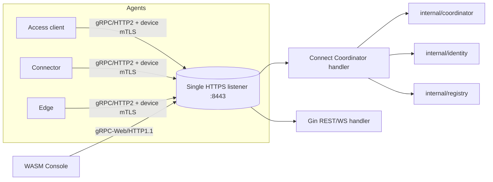
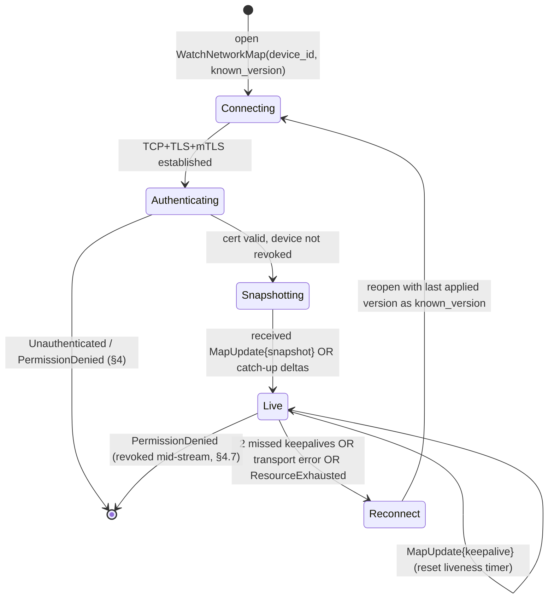
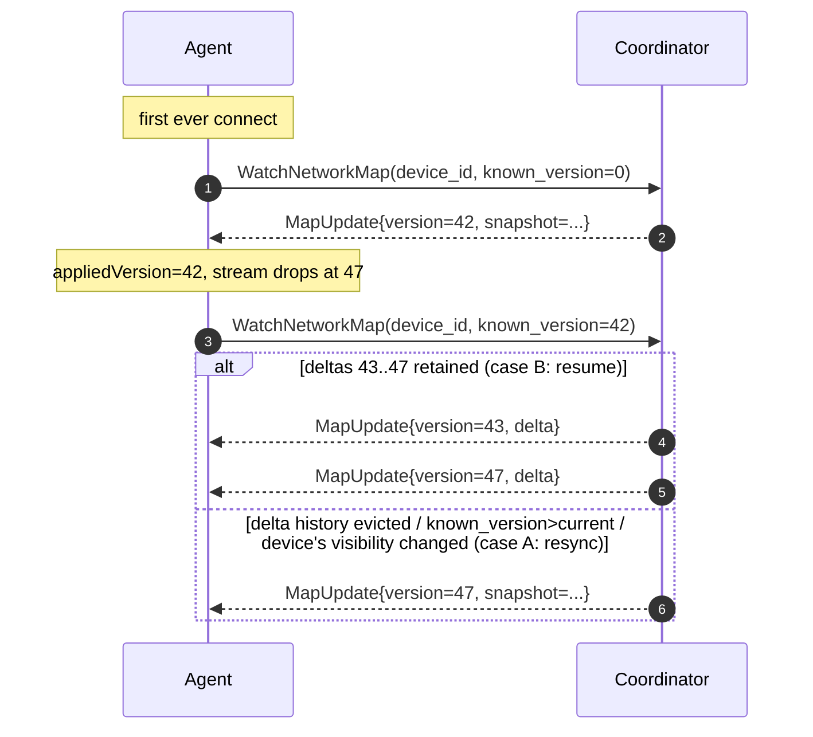
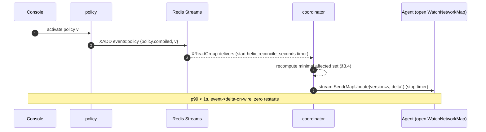

# Protobuf / Connect Service Spec

**Revision:** 2
**Last modified:** 2026-07-04T12:00:00Z

**Rev 2 (enterprise-hardening pass, 2026-07-04):** added §9 "Versioning & compatibility policy" —
closes a production-readiness gap: §8 ("Forward seams") previously described WHAT additive changes
Phase 2 makes but never stated the explicit POLICY governing when a `v2` package is warranted, the
backward-compatibility guarantee for an old agent binary talking to a newer coordinator, or the
deprecation/sunset window for a superseded field. Old §9 "Sources" renumbered to §10.

> Master technical specification — Volume 3 (Control Plane, Go), nano-detail document.
> Scope: the **complete `Coordinator` service contract** — the single `.proto` that every
> HelixVPN agent (Access client, Connector, edge) speaks, served by the Go control plane over
> **Connect** (gRPC / gRPC-Web / Connect protocol on one listener). This document deepens the
> "Agent contract — protobuf" part of [02-control-plane.md §4] into an implementation-ready,
> field-by-field, wire-by-wire specification. It is a SPEC: it describes the contract precisely
> enough to generate code and tests; it does not build the product.
>
> Source evidence cited inline by id: **[04_P1]** = `04_VPN_CLD/HelixVPN-Phase1-MVP.md`,
> **[04_ARCH §N]** = `04_VPN_CLD/HelixVPN-Architecture-Refined.md`, **[research-go_cp]** =
> `final/02-control-plane.md`, **[SYNTHESIS §N]** = the cross-document synthesis. Unproven /
> not-yet-decided facts are marked **UNVERIFIED** per constitution §11.4.6 — never fabricated.

---

## 0. What this document owns, and the one reconciliation it makes

### 0.1 Ownership boundary

This document owns the **canonical `.proto`** for the agent⇄control-plane contract and its
**server-side semantics**: every service method, every message, every field number, every
field's meaning, the snapshot/delta/keepalive state machine, the `known_version` cheap-reconnect
protocol, the policy-prefiltering guarantee, the error taxonomy, the authz rules at the RPC
boundary, the convergence SLO the contract must meet, and the `buf` codegen pipeline that emits
Go/Dart/Rust stubs.

It does **not** own: the byte-level evolution/back-compat rules of `WatchNetworkMap` across
versions (that is the dedicated `WatchNetworkMap` contract document in this same Volume 3); the
Go module wiring, DDL, RLS, IPAM, policy compiler internals, or Redis Streams envelope (those are
[research-go_cp §1–§7]); the Rust data plane (Volume 1); the client UI (Volume 5). Where this
document references those, it cites them and does not redefine them.

### 0.2 Package-name reconciliation (the one correction this document makes)

[research-go_cp §4] declares the proto with a **package/path mismatch**: the package line reads
`package helix.coordinator.v1;` while the file is placed at `proto/helix/coordinator/v1/coordinator.proto`
with `option go_package = ".../gen/helix/coordinator/v1;coordinatorv1"`. Per the Volume-3 authoring
directive, the **unified package across the whole HelixVPN set is `helix.coordinator.v1`**. This
document therefore makes the file path, the `go_package`, and the generated-stub identifiers
agree with that package, so the four surfaces (package, file path, Go import path, Dart/Rust
package) cannot drift:

| Surface | Canonical value (this spec) | Was in [research-go_cp §4] |
|---|---|---|
| proto `package` | `helix.coordinator.v1` | `helix.coordinator.v1` ✓ |
| file path | `proto/helix/coordinator/v1/coordinator.proto` | `proto/helix/coordinator/v1/coordinator.proto` ✗ |
| `option go_package` | `github.com/vasic-digital/helix-go/gen/helix/coordinator/v1;coordinatorv1` | `.../gen/helix/coordinator/v1;coordinatorv1` ✗ |
| Go stub alias (this spec) | `coordinatorv1` | `coordinatorv1` |

This is a visible reconciliation per constitution §11.4.35 (no silent rename): the **wire
identity** (`helix.coordinator.v1.Coordinator`) was already correct in the source; only the file
layout and Go identifiers are brought into line. All Go sketches in [research-go_cp] that import
`coordinatorv1` are understood to mean `coordinatorv1` after this reconciliation; their **behaviour is
unchanged** because protobuf wire compatibility keys off the package + message name, not the file
path or the Go alias.

---

## 1. The complete `.proto` (canonical, normative)

This is the **single source of truth** for the agent contract. Every field number is fixed for
the life of `v1` and MUST NOT be reused or renumbered (proto3 wire rule; enforced by `buf
breaking`, §6.3). Comments are normative where they state a guarantee (C-rules from
[research-go_cp §0.1]).

```protobuf
// proto/helix/coordinator/v1/coordinator.proto
//
// HelixVPN agent⇄control-plane contract. Served over Connect (gRPC / gRPC-Web / Connect).
// Canonical package across the whole HelixVPN set: helix.coordinator.v1 (§0.2).
syntax = "proto3";

package helix.coordinator.v1;

option go_package = "github.com/vasic-digital/helix-go/gen/helix/coordinator/v1;coordinatorv1";

// ---------------------------------------------------------------------------
// Service
// ---------------------------------------------------------------------------
service Coordinator {
  // One-time device enrollment: exchange a single-use enroll token for a durable
  // identity (device_id + overlay_ip) and a short-lived control-channel mTLS cert.
  // The ONLY unauthenticated RPC (it authenticates by the hashed enroll token, §4.1).
  rpc Enroll(EnrollRequest) returns (EnrollResponse);

  // The spine of the system. Open once over the device mTLS channel; receive a
  // snapshot (or resume-deltas, §3.3), then an open-ended delta stream until the
  // agent disconnects. Push, don't poll (C5). Convergence event->delta p99 < 1s (§5).
  rpc WatchNetworkMap(WatchRequest) returns (stream MapUpdate);

  // Connectors push the CIDRs they serve. Idempotent: re-sending the same set is a
  // no-op. Also settable out-of-band via Console/REST (POST /v1/.../prefixes).
  rpc AdvertisePrefixes(AdvertiseRequest) returns (AdvertiseResponse);

  // Lightweight presence/health heartbeat. Carries ONLY transport + rtt. Carries NO
  // bytes / flows / destinations / packet counts — no-logging by construction (C3).
  rpc ReportStatus(StatusReport) returns (StatusAck);
}

// ---------------------------------------------------------------------------
// Enrollment
// ---------------------------------------------------------------------------
message EnrollRequest {
  string     enroll_token = 1;  // single-use, short-lived; server stores only its hash (§4.1)
  bytes      wg_pubkey    = 2;  // 32-byte Curve25519 PUBLIC key; private key never leaves device (C6)
  string     os           = 3;  // "ios"|"android"|"linux"|"windows"|"macos"|"harmonyos"|"aurora"
  string     name         = 4;  // human label, e.g. "alice-pixel-8"
  DeviceKind kind         = 5;  // CLIENT or CONNECTOR
}

enum DeviceKind {
  DEVICE_KIND_UNSPECIFIED = 0;  // proto3 zero value; an EnrollRequest with this kind is rejected (§4.6)
  CLIENT                  = 1;
  CONNECTOR               = 2;
}

message EnrollResponse {
  string      device_id   = 1;  // server-assigned UUID (stringified)
  string      overlay_ip  = 2;  // IPAM-allocated, e.g. "fd7a:helix:1::2" — tenant ULA /48 (D4)
  bytes       device_cert = 3;  // DER mTLS client cert for the control channel (~24h TTL)
  GatewayInfo gateway     = 4;  // where to open WatchNetworkMap + data-plane endpoint
}

// ---------------------------------------------------------------------------
// WatchNetworkMap
// ---------------------------------------------------------------------------
message WatchRequest {
  string device_id     = 1;  // MUST equal the device bound to the mTLS cert (§4.4); else PermissionDenied
  uint64 known_version = 2;  // 0 => full snapshot; else => resume with deltas since this version (§3.3)
}

// Every stream frame. Exactly one body variant is set per frame.
message MapUpdate {
  uint64 version = 1;        // monotonic per tenant; the version this frame brings the agent TO
  oneof body {
    NetworkMap snapshot  = 2;  // full desired state (sent first, or on forced resync)
    MapDelta   delta     = 3;  // incremental change since the agent's prior version
    KeepAlive  keepalive = 4;  // liveness only; carries no state (version unchanged)
  }
}

message NetworkMap {
  Node            self      = 1;  // this agent's own identity within the overlay
  GatewayInfo     gateway   = 2;  // current gateway/relay endpoint + key
  repeated Peer   peers     = 3;  // peers this node MAY reach — ALREADY policy-filtered (C4)
  DnsConfig       dns       = 4;  // overlay DNS the client should use
  TransportPolicy transport = 5;  // obfuscation escalation ladder (doc-01 walks it)
}

message Node {
  string device_id  = 1;
  string overlay_ip = 2;  // this node's own ULA address
}

message GatewayInfo {
  string endpoint   = 1;  // "gw.example:443" — host:port the data plane dials
  bytes  wg_pubkey  = 2;  // gateway WG public key (32-byte Curve25519)
  string masque_sni = 3;  // SNI/host to present for MASQUE/HTTP-3 masquerade (Volume 1, D1)
}

message Peer {
  string             device_id    = 1;
  bytes              wg_pubkey     = 2;  // 32-byte Curve25519 public key
  repeated string    allowed_ips   = 3;  // compiled WG AllowedIPs — ONLY what this node may reach (C4)
  string             endpoint      = 4;  // MVP: gateway relay endpoint; P2 adds direct candidates
  bool               is_connector  = 5;  // true => this peer advertises LAN prefixes
  repeated Via6Route via6          = 6;  // 4via6 mappings for colliding IPv4 LANs (D4)
}

// 4via6: a deterministic IPv6 encoding of a colliding IPv4 CIDR so the client can
// always disambiguate which "192.168.1.0/24" it means (D4, [04_ARCH §3.4]).
message Via6Route {
  string ipv4_cidr   = 1;  // e.g. "192.168.1.0/24"
  string via6_prefix = 2;  // e.g. "fd7a:helix:1:5::/96" — site-scoped IPv6 mapping
}

message DnsConfig {
  repeated string resolvers = 1;  // overlay DNS resolver addresses
  repeated string search    = 2;  // DNS search domains
}

message TransportPolicy {
  repeated string order               = 1;  // ordered ladder, e.g. ["plain-udp","lwo","masque-h3"]
  bool            allow_user_override  = 2;  // may the end user pin a transport in the UI?
}

message MapDelta {
  repeated Peer   upsert_peers    = 1;  // add-or-replace these peers (match by device_id)
  repeated string remove_peer_ids = 2;  // device_ids the agent MUST drop (revoke / lost visibility)
  TransportPolicy transport       = 3;  // PRESENT ONLY IF CHANGED (else unset => unchanged)
  DnsConfig       dns             = 4;  // PRESENT ONLY IF CHANGED (else unset => unchanged)
}

// ---------------------------------------------------------------------------
// AdvertisePrefixes  (connectors only)
// ---------------------------------------------------------------------------
message AdvertiseRequest {
  string          device_id = 1;  // MUST be a CONNECTOR bound to the mTLS cert (§4.4)
  repeated string cidrs     = 2;  // the COMPLETE set the connector serves (declarative, not a diff)
}

message AdvertiseResponse {
  bool            accepted  = 1;  // true => stored; false => see conflicts
  repeated string conflicts = 2;  // human-readable overlap/validation messages (§4.5)
}

// ---------------------------------------------------------------------------
// ReportStatus  (presence + health ONLY — C3)
// ---------------------------------------------------------------------------
message StatusReport {
  string device_id = 1;
  string transport = 2;  // currently-active transport label, e.g. "masque-h3" (health, not traffic)
  uint32 rtt_ms    = 3;  // round-trip estimate in milliseconds (health, not traffic)
  // INTENTIONALLY ABSENT: bytes, flows, destinations, packet counts, SNI, timestamps-per-packet.
}

message StatusAck  {}  // empty: acknowledgement only
message KeepAlive  {}  // empty: liveness frame body
```

### 1.1 Field-number registry (frozen for `v1`)

Field numbers are the wire identity; they are listed here so a reviewer can confirm none is
reused. Reserving a removed number (proto3 `reserved`) is mandatory if any field is ever deleted;
no `v1` field is deleted in this revision, so there are no `reserved` ranges yet.

| Message | # | Field | Type | Notes |
|---|---|---|---|---|
| EnrollRequest | 1 | enroll_token | string | hashed server-side |
| | 2 | wg_pubkey | bytes(32) | public only (C6) |
| | 3 | os | string | enum-shaped string (see §4.6) |
| | 4 | name | string | |
| | 5 | kind | DeviceKind | UNSPECIFIED rejected |
| EnrollResponse | 1 | device_id | string | |
| | 2 | overlay_ip | string | ULA /48 |
| | 3 | device_cert | bytes | DER |
| | 4 | gateway | GatewayInfo | |
| WatchRequest | 1 | device_id | string | must match cert |
| | 2 | known_version | uint64 | 0 = snapshot |
| MapUpdate | 1 | version | uint64 | monotonic/tenant |
| | 2/3/4 | snapshot/delta/keepalive | oneof body | exactly one set |
| NetworkMap | 1 | self | Node | |
| | 2 | gateway | GatewayInfo | |
| | 3 | peers | repeated Peer | policy-filtered (C4) |
| | 4 | dns | DnsConfig | |
| | 5 | transport | TransportPolicy | |
| Peer | 1..6 | device_id, wg_pubkey, allowed_ips, endpoint, is_connector, via6 | mixed | |
| MapDelta | 1..4 | upsert_peers, remove_peer_ids, transport, dns | mixed | 3/4 optional-if-changed |
| AdvertiseRequest | 1/2 | device_id, cidrs | string / repeated string | declarative set |
| AdvertiseResponse | 1/2 | accepted, conflicts | bool / repeated string | |
| StatusReport | 1/2/3 | device_id, transport, rtt_ms | string/string/uint32 | NO traffic fields (C3) |

---

## 2. Connect transport binding

The single `Coordinator` service is served over **Connect** (the `connectrpc.com/connect`
runtime) on the same HTTP listener as the Gin REST API [research-go_cp §8]. Connect makes one
service simultaneously addressable three ways, so native agents and a future WASM Console use the
**same** generated stubs [04_P1 §3]:

| Caller | Wire protocol | HTTP version | Used by |
|---|---|---|---|
| Native agent (Rust/Go/Dart FFI) | gRPC | HTTP/2 | Access client, Connector, edge |
| Browser | gRPC-Web | HTTP/1.1 or /2 | WASM Console (Phase 2/3) |
| Generic HTTP client | Connect protocol | HTTP/1.1 | curl-style ops, debugging |



**Binding rules.**

- `WatchNetworkMap` is a **server-streaming** RPC → Connect `ServerStream[MapUpdate]`. It MUST run
  over HTTP/2 for native agents (HTTP/1.1 server-streaming is not used by agents; the browser uses
  gRPC-Web streaming) [04_P1 §3].
- `Enroll`, `AdvertisePrefixes`, `ReportStatus` are **unary**.
- Compression: the server enables gzip for unary responses; `WatchNetworkMap` frames are small
  (deltas), so per-frame compression is **off by default** to keep p99 latency low (compression
  CPU on tiny frames is net-negative). **UNVERIFIED:** the exact frame-size threshold below which
  compression hurts is to be measured during the §5 soak; until measured, off-by-default stands.
- Idle-timeout: the server sends a `KeepAlive` every **20 s** ([research-go_cp §6.3] ticker). The
  agent treats **2 missed keepalives (~45 s wall, allowing jitter)** as a dead stream and
  reconnects with its last `known_version` (§3.3). **UNVERIFIED:** 45 s is a design default, not
  yet load-tuned.

---

## 3. `WatchNetworkMap` semantics — the state machine

`WatchNetworkMap` is the contract's spine. It delivers desired state as **one snapshot then a
delta stream**, with cheap reconnect via `known_version`. Peers in every frame are
**already policy-filtered** (C4): the wire never carries a peer the receiving node may not reach.

### 3.1 Server-side stream lifecycle (Go signature + sketch)

```go
// internal/coordinator/watch.go
//
// WatchNetworkMap is the Connect server handler. It authenticates the device from the
// mTLS cert (§4.4), registers an in-memory subscription, sends the initial snapshot OR
// catch-up deltas (§3.3), then forwards minimal deltas + keepalives until disconnect.
func (c *Coordinator) WatchNetworkMap(
    ctx context.Context,
    req *connect.Request[coordinatorv1.WatchRequest],
    stream *connect.ServerStream[coordinatorv1.MapUpdate],
) error {
    dev, err := authDevice(ctx)                 // mTLS cert -> device row (§4.4)
    if err != nil {
        return err                               // already a *connect.Error (Unauthenticated)
    }
    if req.Msg.DeviceId != dev.ID.String() {     // body must agree with cert
        return connect.NewError(connect.CodePermissionDenied, errDeviceMismatch)
    }
    if dev.RevokedAt.Valid {                      // belt-and-suspenders: a revoked device never streams
        return connect.NewError(connect.CodePermissionDenied, errRevoked)
    }

    sub := c.subscribe(dev.TenantID, dev.ID)      // registers stream; flips presence ONLINE; emits device.online
    defer sub.Close()                             // flips presence OFFLINE; emits device.offline

    cur := c.version(dev.TenantID)                // current tenant map version
    switch {
    case req.Msg.KnownVersion == 0 || req.Msg.KnownVersion > cur || !c.canResume(dev, req.Msg.KnownVersion):
        // full snapshot path (§3.3 case A)
        if err := stream.Send(snapshotUpdate(cur, c.buildMap(dev))); err != nil {
            return err
        }
    default:
        // resume path: replay compacted deltas (cur >= known_version) (§3.3 case B)
        for _, d := range c.deltasSince(dev, req.Msg.KnownVersion) {
            if err := stream.Send(deltaUpdate(d)); err != nil {
                return err
            }
        }
    }

    ka := time.NewTicker(20 * time.Second)
    defer ka.Stop()
    for {
        select {
        case <-ctx.Done():
            return ctx.Err()                      // client gone / server shutdown
        case d, ok := <-sub.C:
            if !ok {                              // back-pressure drop (§3.5): force reconnect-with-snapshot
                return connect.NewError(connect.CodeResourceExhausted, errSlowConsumer)
            }
            if err := stream.Send(deltaUpdate(d)); err != nil {
                return err
            }
        case <-ka.C:
            if err := stream.Send(keepAliveUpdate(c.version(dev.TenantID))); err != nil {
                return err
            }
        }
    }
}
```

Helper constructors keep the `oneof` invariant (exactly one body set):

```go
func snapshotUpdate(v uint64, m *coordinatorv1.NetworkMap) *coordinatorv1.MapUpdate {
    return &coordinatorv1.MapUpdate{Version: v,
        Body: &coordinatorv1.MapUpdate_Snapshot{Snapshot: m}}
}
func deltaUpdate(d Delta) *coordinatorv1.MapUpdate {
    return &coordinatorv1.MapUpdate{Version: d.Version,
        Body: &coordinatorv1.MapUpdate_Delta{Delta: d.Proto()}}
}
func keepAliveUpdate(v uint64) *coordinatorv1.MapUpdate {
    return &coordinatorv1.MapUpdate{Version: v,
        Body: &coordinatorv1.MapUpdate_Keepalive{Keepalive: &coordinatorv1.KeepAlive{}}}
}
```

### 3.2 Stream state machine (agent's view)



**Agent reconciliation rules (normative).** On each frame the agent:

1. `snapshot` → discard all prior peer state, install `NetworkMap` wholesale, set local
   `appliedVersion = MapUpdate.version`.
2. `delta` → for each `upsert_peers[i]` add-or-replace the peer keyed by `device_id`; for each
   `remove_peer_ids[j]` delete that peer; if `transport` is set, replace transport policy; if
   `dns` is set, replace DNS config; set `appliedVersion = MapUpdate.version`. An unset
   `transport`/`dns` means **unchanged** (do not clear them).
3. `keepalive` → reset the liveness timer; do not change `appliedVersion` (the `version` field on
   a keepalive equals the current tenant version and is informational).

### 3.3 `known_version` cheap-reconnect protocol

`known_version` lets an agent that briefly disconnected resume **without a full resync**
[04_P1 §3, research-go_cp §4].



**Server decision (the `switch` in §3.1).**

- **Case A — full snapshot** when ANY of: `known_version == 0`; `known_version > cur` (client
  claims a future version — clock/replay anomaly, resync defensively); `!canResume` (the compacted
  delta history for this tenant no longer reaches back to `known_version`, OR the device's
  *visibility set* changed in a way a delta cannot express safely — e.g. the device was moved
  between groups so peers it must now FORGET overlap with peers it must now LEARN; resync is the
  correct conservative action per C4 need-to-know).
- **Case B — catch-up deltas** otherwise: replay every retained delta with version in
  `(known_version, cur]` in ascending version order, then enter the live loop.

**Delta retention.** The coordinator keeps a bounded **per-tenant ring buffer** of the last `K`
compacted deltas (default `K = 256` versions; a design default, not yet tuned — **UNVERIFIED** the
optimal K). If `known_version < cur - K`, the history cannot serve the resume → Case A. The ring
is in-memory only (R2: coordinator owns no durable tables); after a coordinator restart the ring
is empty, so the first reconnect from every agent is a Case-A snapshot — acceptable because the
graph itself is rehydrated from Postgres + events on boot [research-go_cp §6.1].

### 3.4 Policy-prefiltering guarantee (C4 on the wire)

Every `Peer` in a `NetworkMap.peers` or `MapDelta.upsert_peers` is already the output of the
policy compiler's `VisibleTo`/`AllowedIPs` for **this** device [research-go_cp §6.2/§7.2]:

- A device NEVER receives a `Peer` it has no compiled rule to reach. "Need-to-know" is enforced at
  map-build time, not by the client filtering. This is a privacy invariant (C4) and a security
  invariant simultaneously: a compromised client learns only its authorized peers.
- `Peer.allowed_ips` is the **coarse, CIDR-only** WG `AllowedIPs` (WireGuard cannot express ports).
  The **fine, port-level** verdicts live in the edge's nftables/eBPF verdict map (Volume 1), not on
  this wire — the proto carries exactly what the data plane's WG layer needs, no more.
- When a policy change REMOVES a device's visibility of a peer, the coordinator emits a
  `MapDelta.remove_peer_ids` entry (not a snapshot, unless §3.3 Case A triggers) so the client drops
  the WG peer immediately.

### 3.5 Back-pressure (slow-consumer safety)

Each subscription has a **bounded send queue** (`sub.C`, default capacity **64** deltas). If the
queue fills (a wedged/slow agent), the coordinator closes `sub.C`; the handler returns
`ResourceExhausted` (§4.2); the agent reconnects with its `known_version` and gets a fresh
snapshot or catch-up. This bounds coordinator memory under a slow consumer — it never grows the
queue unboundedly (the §5 24 h soak asserts zero memory growth) [research-go_cp §6.4].

---

## 4. Authz, error taxonomy, and edge cases

### 4.1 `Enroll` — the only unauthenticated RPC

`Enroll` carries no mTLS cert (the device does not yet have one). It authenticates by a **single-use,
short-lived enroll token** minted by Console/identity and stored **hashed** [research-go_cp §9.1].

Server algorithm (atomic):

```go
// internal/identity/enroll.go (sketch — full impl in research-go_cp §9.2)
func (s *Identity) Enroll(ctx context.Context,
    req *connect.Request[coordinatorv1.EnrollRequest],
) (*connect.Response[coordinatorv1.EnrollResponse], error) {
    m := req.Msg
    if err := validateEnroll(m); err != nil {     // §4.6 input validation
        return nil, err
    }
    // verify+consume token in ONE tx; a replay of a consumed token fails here.
    tok, err := s.consumeToken(ctx, hash(m.EnrollToken))
    if err != nil {
        return nil, connect.NewError(connect.CodeUnauthenticated, errBadOrUsedToken)
    }
    return s.store.WithTenant(ctx, tok.TenantID, func(q *db.Queries) (...) {
        ip, _   := s.ipam.AllocOverlayIP(ctx, q, tok.TenantID)        // D4
        cert, _ := s.pki.IssueDeviceCert(ctx, deviceID, 24*time.Hour) // mTLS
        // INSERT device row; emit device.enrolled on the bus (R3)
    })
}
```

- Token is **single-use**: `consumeToken` deletes/marks it inside the same tx, so two concurrent
  enrolls with the same token: one wins, the other gets `Unauthenticated`.
- Token TTL is short (**UNVERIFIED:** exact TTL — design default 15 min; operator-configurable).
- `wg_pubkey` MUST be exactly 32 bytes (Curve25519). A wrong length → `InvalidArgument` (§4.6).

### 4.2 Connect error-code taxonomy (normative)

Every failure maps to a Connect/gRPC code so all three generated stubs surface it identically. The
table is the contract: a server returning a different code for the same condition is a defect.

| Condition | Connect code | Sentinel | Retriable by agent? |
|---|---|---|---|
| Enroll token bad / already used / expired | `Unauthenticated` | `errBadOrUsedToken` | No (mint a new token) |
| Missing/invalid mTLS cert on an authed RPC | `Unauthenticated` | `errNoCert` | No (re-enroll) |
| `wg_pubkey` not 32 bytes / empty token / `DEVICE_KIND_UNSPECIFIED` | `InvalidArgument` | `errBadField` | No (fix input) |
| `WatchRequest.device_id` ≠ cert's device | `PermissionDenied` | `errDeviceMismatch` | No |
| Device revoked (at open OR mid-stream) | `PermissionDenied` | `errRevoked` | No (re-enroll) |
| `AdvertisePrefixes` from a non-connector device | `PermissionDenied` | `errNotConnector` | No |
| Advertised CIDR malformed / overlaps reserved | `InvalidArgument` | `errBadCIDR` | No (fix CIDRs) |
| Slow consumer, send queue full | `ResourceExhausted` | `errSlowConsumer` | Yes (reconnect w/ known_version) |
| Coordinator graph not yet hydrated (boot) | `Unavailable` | `errNotReady` | Yes (backoff + retry) |
| Postgres/Redis transient failure | `Unavailable` | `errBackendDown` | Yes (backoff) |
| Per-device stream cap exceeded | `ResourceExhausted` | `errTooManyStreams` | Yes (backoff) |
| Context cancelled / deadline | `Canceled` / `DeadlineExceeded` | — | Yes |

**Retry discipline.** Agents retry only `Unavailable`/`ResourceExhausted`/`Canceled`/
`DeadlineExceeded` with exponential backoff + jitter (base 500 ms, cap 30 s — **UNVERIFIED:** exact
schedule, design default). They never retry `Unauthenticated`/`PermissionDenied`/`InvalidArgument`
(those need human/operator action — re-enroll or fix input).

### 4.3 Authz matrix per RPC

| RPC | AuthN | AuthZ predicate |
|---|---|---|
| `Enroll` | hashed enroll token | token valid + unused + unexpired; tenant resolved from token |
| `WatchNetworkMap` | device mTLS cert | cert→device row; not revoked; `device_id` matches cert; tenant = cert's tenant |
| `AdvertisePrefixes` | device mTLS cert | as above **AND** `device.kind == CONNECTOR` |
| `ReportStatus` | device mTLS cert | cert→device row; not revoked; `device_id` matches cert |

`authDevice(ctx)` resolves the **cert serial → `device_certs` row → `devices` row**, rejecting on
revoked/expired [research-go_cp §8.2]:

```go
// internal/api/authdevice.go
func authDevice(ctx context.Context) (registry.Device, error) {
    tlsState, ok := connectTLSFrom(ctx)            // peer cert from the Connect/HTTP2 conn
    if !ok || len(tlsState.PeerCertificates) == 0 {
        return registry.Device{}, connect.NewError(connect.CodeUnauthenticated, errNoCert)
    }
    serial := tlsState.PeerCertificates[0].SerialNumber.String()
    dev, err := lookupBySerial(ctx, serial)         // device_certs JOIN devices, WHERE NOT revoked
    if err != nil {
        return registry.Device{}, connect.NewError(connect.CodeUnauthenticated, errNoCert)
    }
    return dev, nil
}
```

### 4.4–4.7 Edge cases (each is a test point, §7)

- **§4.4 cert/body mismatch.** A device presenting cert for `D1` but sending `WatchRequest{device_id:
  D2}` → `PermissionDenied` (`errDeviceMismatch`). Prevents one valid device impersonating another.
- **§4.5 `AdvertisePrefixes` is declarative, not a diff.** `cidrs` is the **complete** set the
  connector serves; the server diffs against stored prefixes and emits `connector.prefixes.changed`
  only if the set actually changed (idempotent re-send is a no-op, `accepted=true, conflicts=[]`).
  Overlap with another connector's CIDR does NOT reject (returns `accepted=true` + a `conflicts[]`
  advisory) — the overlap is resolved by 4via6 site disambiguation (D4), surfaced in Console via a
  `route.conflict.detected` event [research-go_cp §7.3]. A **malformed** CIDR DOES reject
  (`InvalidArgument`, `errBadCIDR`).
- **§4.6 input validation (fail-closed).** `Enroll`: non-empty token; `wg_pubkey` length == 32;
  `kind ∈ {CLIENT, CONNECTOR}` (UNSPECIFIED rejected); `os` must be one of the seven known strings
  ([research-go_cp DDL `devices.os` comment]) — an unknown `os` is rejected `InvalidArgument` rather
  than stored, so the DB never holds an unrecognized platform tag.
- **§4.7 revoke mid-stream.** When `device.revoked` fires for a device with an open
  `WatchNetworkMap`, the coordinator's event handler closes that subscription; the handler returns
  `PermissionDenied` (`errRevoked`); the edge drops the WG peer. Target: stream force-closed within
  the convergence SLO (< 1 s, §5) [research-go_cp §9.3].

### 4.8 `ReportStatus` no-logging guarantee (C3 on the wire)

`StatusReport` is defined to carry **only** `device_id`, `transport`, `rtt_ms`. The proto has no
field for bytes/flows/destinations, so the contract makes traffic-logging
**structurally impossible** at the wire layer — mirroring the Postgres no-logging guarantee
[research-go_cp §2.4]. A meta-test (§7) asserts the `StatusReport` descriptor has exactly these
three fields; adding a `bytes_total` field MUST make that test FAIL (paired §1.1 mutation). This is
the wire-level runtime signature (§11.4.108) that proves C3, not merely promises it.

---

## 5. Convergence SLO (the < 1 s promise) tied to this contract

The contract exists to make desired-state propagation **fast and measurable**. The
binding SLO for the streaming path [research-go_cp §10.2, 04_P1 §10]:

| Metric | Target | Measured at the contract boundary |
|---|---|---|
| event → `stream.Send(MapDelta)` on wire | **p99 < 1 s** | coordinator histogram `helix_reconcile_seconds`, from event-receive to the `stream.Send` return for the affected `WatchNetworkMap` |
| device revoke → stream force-closed + edge WG peer removed | **< 1 s** | revoke timer; the `errRevoked` return + edge confirmation |
| enrollment round-trip (`Enroll` unary) | **< 500 ms** | `Enroll` server histogram |
| coordinator RSS @ 10k open streams | bounded, ~0 slope over 24 h | `process_resident_memory_bytes` |



The < 1 s number is an **anti-bluff acceptance number** (§11.4.5/§11.4.69): it is asserted with
captured evidence from `helix_reconcile_seconds`, not assumed. A green functional test that does
not also assert the p99 histogram is incomplete for this contract.

---

## 6. `buf` codegen pipeline (Go / Dart / Rust)

One `.proto`, three generated stubs, no hand-written clients — so the Go server, Dart client core
(via flutter_rust_bridge boundary), and Rust edge/connector cannot drift [04_ARCH §4.2,
research-go_cp §4]. The proto lives in `helix-proto` (`proto/helix/coordinator/v1/coordinator.proto`)
[SYNTHESIS §6].

### 6.1 `buf.yaml` (lint + breaking config)

```yaml
# helix-proto/buf.yaml
version: v2
modules:
  - path: proto
lint:
  use:
    - STANDARD
  except:
    - PACKAGE_VERSION_SUFFIX   # we use helix.coordinator.v1 (suffix present) — kept; documented here
breaking:
  use:
    - FILE                     # field-number/type changes within v1 are breaking -> CI gate (§6.3)
```

### 6.2 `buf.gen.yaml` (three language outputs)

```yaml
# helix-proto/buf.gen.yaml
version: v2
plugins:
  # ---- Go (server) ----
  - remote: buf.build/protocolbuffers/go
    out: gen
    opt: paths=source_relative
  - remote: buf.build/connectrpc/go      # Connect Go handlers/clients
    out: gen
    opt: paths=source_relative
  # ---- Dart (client core boundary) ----
  - remote: buf.build/protocolbuffers/dart
    out: gen/dart
  # ---- Rust (edge / connector) ----
  - remote: buf.build/community/neoeinstein-prost   # prost messages
    out: gen/rust/src
  - remote: buf.build/community/neoeinstein-tonic    # tonic service stubs
    out: gen/rust/src
```

**UNVERIFIED:** the exact remote plugin coordinates/versions above are the conventional buf plugin
names; the pinned versions are chosen at implementation time and recorded in `buf.gen.yaml` then
— they are not asserted here as fixed.

### 6.3 Generation + breaking-change gate (runs in the local pre-build, §11.4.156 NO CI)

```bash
buf lint                          # STANDARD rules
buf breaking --against '.git#branch=main'   # field renumber/type-change -> FAIL (protects v1 wire)
buf generate                      # emits gen/ (Go), gen/dart, gen/rust
```

The `buf breaking` gate is the mechanical enforcement that the §1.1 field-number registry stays
frozen: any commit renumbering a `v1` field, changing a field type, or reusing a removed number
fails the gate. Paired §1.1 mutation: a test branch that renames `Peer.allowed_ips` field number 3
→ 7 MUST make `buf breaking` FAIL; reverting MUST make it pass.

---

## 7. Test points (tied to constitution §11.4.169 comprehensive test-type coverage)

§11.4.169 mandates comprehensive coverage across every applicable test type for this contract. Each
row below is an implementation-ready test point; every PASS cites captured evidence
(§11.4.5/§11.4.69/§11.4.107) — a green test that does not exercise the wire is a §11.4 PASS-bluff.

| # | Test type (§11.4.169) | Target | Concrete assertion + evidence |
|---|---|---|---|
| T1 | unit | `oneof body` constructors | each of `snapshotUpdate`/`deltaUpdate`/`keepAliveUpdate` sets exactly one body variant; round-trip `proto.Marshal`/`Unmarshal` is identity |
| T2 | unit | C3 wire guarantee (§4.8) | reflection over `StatusReport` descriptor: field set == {device_id, transport, rtt_ms}; **mutation** add `bytes_total` → test FAILs (§1.1) |
| T3 | unit | field-number registry (§1.1) | golden descriptor snapshot; any number change diffs → FAIL |
| T4 | unit | input validation (§4.6) | table-driven: 31-byte / 33-byte `wg_pubkey`, empty token, `DEVICE_KIND_UNSPECIFIED`, unknown `os` → `InvalidArgument` |
| T5 | integration | Enroll happy path | spin Postgres+Redis via `vasic-digital/containers` (§11.4.76, not ad-hoc docker); `Enroll` → row inserted, `device.enrolled` on bus, response has 32-byte-derived cert + ULA `overlay_ip` |
| T6 | integration | known_version resume (§3.3) | connect w/ `known_version=0` (snapshot), drop, reconnect w/ last version: assert **deltas** delivered (Case B); evict ring → assert **snapshot** (Case A) |
| T7 | integration | policy-prefiltering (§3.4) | two devices, ACL grants only one a connector; assert the ungranted device's stream NEVER carries that `Peer` (need-to-know, C4) |
| T8 | integration | revoke mid-stream (§4.7) | open `WatchNetworkMap`, revoke device, assert stream returns `PermissionDenied(errRevoked)` within < 1 s; captured timer |
| T9 | e2e / full-automation | enroll→advertise→policy→delta | drive Enroll(connector)+Enroll(client) → AdvertisePrefixes → activate policy → assert `MapDelta` content on the client stream + `helix_reconcile_seconds` p99 < 1 s (captured histogram) |
| T10 | security | authz matrix (§4.3) | non-connector calling `AdvertisePrefixes` → `PermissionDenied(errNotConnector)`; missing cert → `Unauthenticated`; cert/body mismatch → `PermissionDenied(errDeviceMismatch)` |
| T11 | security | enroll-token replay (§4.1) | two concurrent `Enroll` with same token: exactly one succeeds, other `Unauthenticated`; consumed token re-use → `Unauthenticated` |
| T12 | fuzz | wire robustness | fuzz `Unmarshal` of `WatchRequest`/`EnrollRequest`/`AdvertiseRequest` with random/truncated bytes; assert no panic, all malformed inputs → `InvalidArgument`, never a crash (§11.4.1 FAIL-bluff guard) |
| T13 | stress | fan-out scale | N=10k simulated agents holding streams; flap a tenant policy; assert all affected streams receive the delta + p99 < 1 s; non-affected streams receive nothing |
| T14 | chaos | slow consumer (§3.5) | wedge one agent's reader; assert its `sub.C` fills, it gets `ResourceExhausted`, reconnects with snapshot; coordinator RSS does NOT grow (other streams unaffected — single-resource isolation) |
| T15 | chaos | backend flap | kill Redis mid-stream; assert open streams keep their last state (fail-static, C1), coordinator returns `Unavailable` on new connects, recovers on Redis return; reclaimed PEL entries not lost (§11.4.147) |
| T16 | performance / soak | 24 h memory | 10k streams, periodic policy flaps for 24 h; assert `process_resident_memory_bytes` slope ≈ 0 (bounded send queues, ring eviction) |
| T17 | contract / compat | `buf breaking` (§6.3) | renumber `Peer.allowed_ips` → `buf breaking` FAILs; revert → passes (paired §1.1 mutation) |
| T18 | contract / codegen | cross-lang stubs | `buf generate` emits Go+Dart+Rust; a Rust `tonic` client and a Go server complete one `WatchNetworkMap` round-trip (prevents stub drift) |
| T19 | challenge (HelixQA) | end-user reachability | a `challenges` entry drives enroll→policy→`WatchNetworkMap`→edge reconcile and asserts the authorized LAN host is reachable AND an unauthorized one is denied, with captured evidence (the MVP DoD slice) |

Integration/e2e infra is booted **on demand via `vasic-digital/containers`** (§11.4.76) — never
ad-hoc `docker run`; QA/anti-bluff via `helix_qa` + `challenges` (§11.4.27/§11.4.5/.69/.107)
[SYNTHESIS §8].

---

## 8. Forward seams (this contract extends without a v1 break) [04_P1 §12]

Phase-2 additions are **field additions** (new field numbers, backward-compatible) or new RPCs,
never v1 renumbers — so `buf breaking` stays green:

- `TransportPolicy.order` gains `shadowsocks`/`udp-over-tcp`/`daita` ladder entries (string values,
  no schema change).
- `Peer.endpoint` is joined by a future `repeated PeerCandidate direct_candidates = 7;` for direct
  P2P NAT-traversal so traffic stops always relaying through the gateway (new field number 7).
- `GatewayInfo` gains a future multi-hop path field for nested-WG multi-hop.
- `EnrollResponse`/`Peer` gain a future PQ pre-shared-key field for the post-quantum handshake.

Each is additive because v1 drew the field-number registry (§1.1) with room and froze it under the
`buf breaking` gate (§6.3). The byte-level rules that make these additions safe across live agents
are the **`WatchNetworkMap` contract** document (this Volume) — referenced, not duplicated here.

---

## 9. Versioning & compatibility policy (production-readiness — old agents vs. a newer coordinator)

§8 shows *what* Phase-2 additions look like; this section states the explicit *policy* a fleet
operator and a client-app release manager both depend on. It is deliberately conservative — the
agent population is never assumed to upgrade in lockstep with the gateway.

### 9.1 The backward-compatibility guarantee (binding for the life of `v1`)

**A coordinator running `helix.coordinator.v1` MUST correctly serve an agent built against ANY
prior `v1` schema revision** (i.e., any commit since the field-number registry in §1.1 was frozen).
This holds because proto3 field addition is additive by construction: an old agent simply does not
populate/read fields it does not know about, and `oneof` + explicit presence (`optional`-shaped
fields via "present only if changed", §1) let the server omit a field from a delta without an old
client mis-interpreting its absence as a value. The `buf breaking` gate (§6.3) is the mechanical
enforcement — a v1-breaking change (renumber, type change, remove-without-`reserved`) fails the
pre-build gate and cannot ship. **The converse is NOT guaranteed**: a NEW agent talking to an OLD
coordinator that predates a field the agent expects is out of scope for `v1` (the coordinator
fleet is operator-controlled and upgraded before client apps are told to rely on a new field) —
this asymmetry (coordinator-first rollout) is the standard server-then-client compatibility
posture and MUST be stated to operators in the upgrade runbook (`v06-deploy/kubernetes.md` /
`v06-deploy/ha-and-multiregion.md`): **upgrade every gateway/coordinator replica before shipping a
client-app release that depends on a field the new coordinator introduces.**

### 9.2 What triggers a `v2` package (never taken lightly)

A NEW major package (`helix.coordinator.v2`, a new `.proto` file tree, NOT a field renumber
inside `v1`) is warranted only when a change cannot be expressed additively under §9.1 — concretely:
(a) a **semantic** change to an existing field's meaning that old clients would misinterpret (e.g.
redefining what `Peer.endpoint` means, not merely adding a new field alongside it); (b) removing an
RPC method entirely (proto3 has no method-level `reserved`, so a removed RPC is a wire break for
any client still calling it); (c) a wholesale replacement of the streaming model itself (e.g. if a
future transport requires bidi-streaming where `WatchNetworkMap` is server-stream-only). Simple
field/message additions (the §8 Phase-2 list: transport ladder entries, `direct_candidates`,
multi-hop path fields, PQ-PSK field) are explicitly **NOT** `v2` triggers — they are the intended
`v1` evolution path. A `v2` package, if ever needed, runs **side-by-side** with `v1` (both served
on the same Connect listener, distinguished by path prefix) for a announced deprecation window
(recommended ≥ 2 minor platform releases) before `v1` handlers are removed — never a flag-day cutover.

### 9.3 Field deprecation (within `v1`, no renumber)

A field that is superseded (e.g. if `Peer.endpoint` were ever replaced by a richer type) is marked
`[deprecated = true]` in a `.proto` comment + a `// DEPRECATED(reason, replacement, since)` comment,
continues to be POPULATED by the server for at least one deprecation window (so old clients keep
working), and its field number is never reused even after the field is eventually dropped —
dropping requires a `reserved <N>;` declaration in the same commit (§1.1's registry is updated to
show the number as `reserved`, not deleted from the table). No field in `v1` is currently
deprecated; this subsection documents the mechanism for when one is.

### 9.4 Anti-bluff test point (added to §7's table)

| # | Test type | Target | Concrete assertion + evidence |
|---|---|---|---|
| T20 | contract / compat | old-agent-vs-new-coordinator | a Go test pins a golden `v1` client stub from an earlier commit (vendored fixture) against the CURRENT coordinator server; assert `WatchNetworkMap`/`Enroll`/`AdvertisePrefixes` all succeed and the old client correctly ignores any new field it doesn't recognize (proto3 unknown-field skip) — captured as a passing round-trip transcript, re-run on every `v1` schema change |

---

## 10. Sources

- **[research-go_cp]** `docs/research/mvp/final/02-control-plane.md` — §4 (proto), §6 (coordinator
  stream loop), §7 (policy compiler outputs the proto carries), §8 (Connect binding + authz), §9
  (enrollment/PKI), §10 (SLOs + test strategy), §0.1 (C-rules).
- **[04_P1]** `docs/research/mvp/04_VPN_CLD/HelixVPN-Phase1-MVP.md` — §3 agent contract (proto
  origin, `known_version`, snapshot-then-deltas, policy-prefiltering), §4 coordinator, §5 events,
  §6 enrollment, §10 SLO, §11 MVP DoD.
- **[04_ARCH §N]** `docs/research/mvp/04_VPN_CLD/HelixVPN-Architecture-Refined.md` — §3.4 ULA /48 +
  4via6 (D4), §4.2 schema-generated clients (no hand-written stubs), §7 no-logging/default-deny.
- **[SYNTHESIS §N]** `v09-research/_SYNTHESIS.md` — §2 stack floor, §3 decisions D1–D7, §6 repo
  layout (`helix-proto`), §7 security invariants, §8 ecosystem submodule wiring, §9 constitution
  bindings.
- Constitution anchors cited: §11.4.5/§11.4.69/§11.4.107 (captured-evidence/anti-bluff),
  §11.4.6 (no-guessing — UNVERIFIED marks), §11.4.27 (test-type coverage), §11.4.35 (visible
  reconciliation), §11.4.76 (containers submodule), §11.4.108 (runtime-signature), §11.4.147
  (no-work-loss), §11.4.156 (no active CI), §11.4.169 (comprehensive test-type coverage), §1.1
  (paired meta-test mutations).
