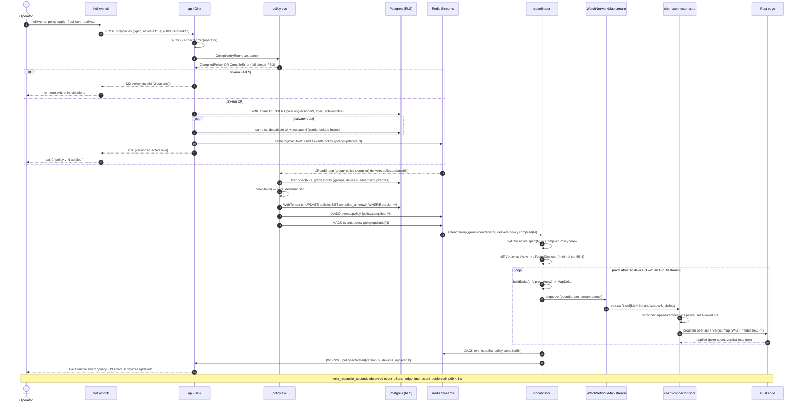
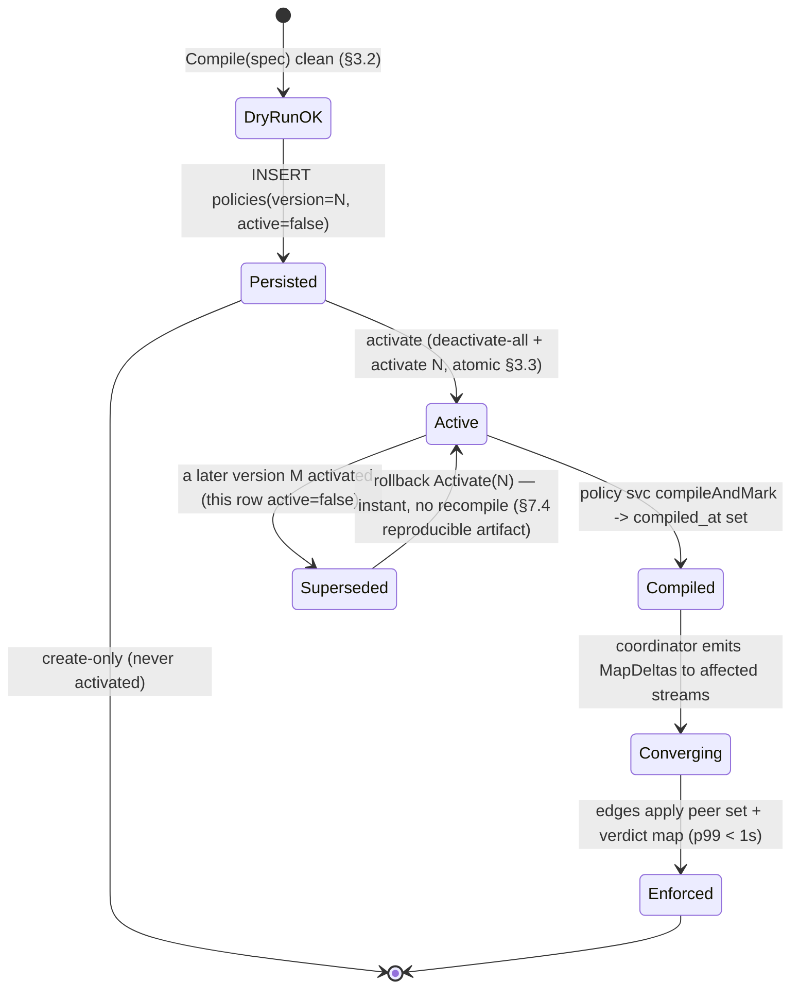
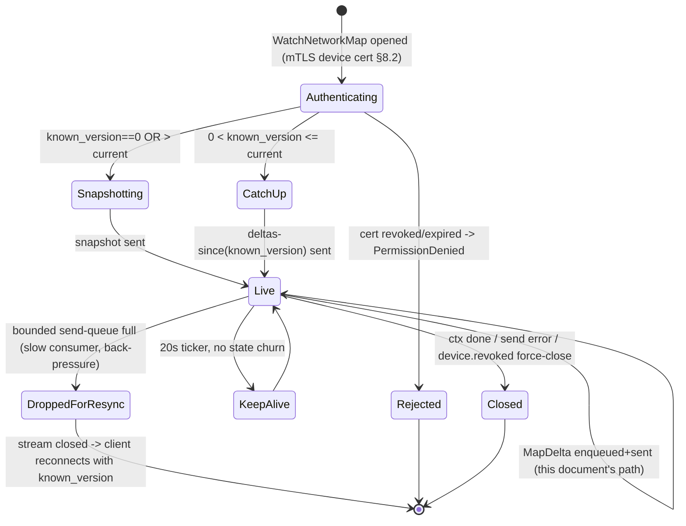

# End-to-End Reconciliation Flow

**Revision:** 1
**Last modified:** 2026-06-25T00:00:00Z

> Master technical specification — Volume 3 (Control Plane, Go), nano-detail deepening of
> [`02-control-plane.md`](../02-control-plane.md) §10 (*End-to-end reconciliation, the <1 s
> promise*). This document specifies the **signature flow** of HelixVPN: the path a policy
> change travels from an admin keystroke (`helixvpnctl policy apply`) to enforced state on
> every affected edge, with a measured convergence target of **event→enforced p99 < 1 s, zero
> restarts**. SPEC-ONLY — it describes the implementation; it does not build the product.
> Source evidence cited inline by id: [04_P1] = `HelixVPN-Phase1-MVP.md`,
> [04_ARCH] = `HelixVPN-Architecture-Refined.md`, [research-go_cp] = `02-control-plane.md`,
> [SYNTHESIS] = the cross-document synthesis. Unproven claims are marked **UNVERIFIED**
> (constitution §11.4.6); nothing is fabricated.

---

## 0. Scope, position, and the canonical names this flow uses

### 0.1 What this document owns

`02-control-plane.md` §10 gives the reconciliation sequence at *overview* altitude. This
document gives the **implementation-ready** version: every hop's concrete Go signature,
SQL, event envelope, state machine, error code, authz check, edge case, the latency budget
that backs the <1 s SLO, and the test points that prove each invariant under
constitution §11.4.169 (mandatory comprehensive test-type coverage).

It owns **only the reconciliation path**. Adjacent concerns are owned elsewhere and merely
referenced here: the policy *compiler internals* ([research-go_cp] §7), the `Coordinator`
*wire byte-evolution* (Volume 3 `WatchNetworkMap` contract doc), the Rust *edge enforcement*
(Volume 1 data plane), and the *client core reconcile* of WG peers (Volume 1 routing layer).
Where this flow hands off to those, the hand-off contract is specified; their internals are not.

### 0.2 The signature flow in one line [04_P1 §10, research-go_cp §10.1]

```
helixvpnctl policy apply
  → REST POST /v1/policies (dry-run compile, fail-closed)
  → persist policies row version N (WithTenant tx)
  → emit policy.updated{N}
  → policy svc consumes → authoritative compile(N) → persist compiled marker → emit policy.compiled{N}
  → coordinator consumes policy.compiled{N} → recompute tenant visibility (minimal affected set)
  → per affected open WatchNetworkMap stream: compute MapDelta → stream.Send
  → client/connector cores reconcile (add/remove WG peers, update AllowedIPs)
  → edge updates peer set + nftables/eBPF verdict map → enforcement live
  ── elapsed event→enforced: target p99 < 1 s, ZERO restarts ──
```

### 0.3 Canonical names (cross-checked, unified across the Volume-3 set)

| Concern | Canonical value | Note |
|---|---|---|
| protobuf package | `helix.coordinator.v1` | unified across the Volume-3 proto set; the `.proto` path is `proto/helix/coordinator/v1/coordinator.proto`, the Go import alias `coordinatorv1` [research-go_cp §4] |
| RPC | `Coordinator.WatchNetworkMap` | the spine; snapshot-then-deltas server stream [04_P1 §3] |
| compiled artifact type | `policy.CompiledPolicy` | `{Version, SpecHash, VisibleTo, AllowedIPs, Verdicts, Via6, ExitNodes}` — canonical defn owned by `svc-policy.md §3` [research-go_cp §1.3] |
| event streams | `events:policy`, `events:routes`, `events:devices` | Redis Streams, consumer group `coordinator` [research-go_cp §5.1] |
| convergence metric | `helix_reconcile_seconds` | histogram, event-receive → `stream.Send` [research-go_cp §10.2] |

---

## 1. The full reconciliation sequence (nano-detail Mermaid)



---

## 2. Stage A — `helixvpnctl policy apply` (the CLI entry)

### 2.1 Command contract (Cobra) [research-go_cp §1.1, §13 CP-T9.1]

```go
// cmd/helixvpnctl/policy_apply.go
//
//   helixvpnctl policy apply -f acl.json [--activate] [--tenant <uuid>] [--dry-run] [--wait]
//
// -f / --file     path to the declarative ACL JSON (§7.1 spec); "-" reads stdin.
// --activate      flip the new version active in the same request (default: false → create-only).
// --dry-run       send the spec with X-Helix-Dry-Run: true; server compiles + validates,
//                 persists NOTHING, returns the would-be version + any violations. Exit 0 iff clean.
// --wait          after a 201, poll GET /v1/policies/{N} until active=true AND compiled_at!=null
//                 (server-side reconcile confirmation), or fail after --wait-timeout (default 5s).
// --tenant        admin-cross-tenant only; ignored for a tenant-scoped token (§8 authz).
type applyOpts struct {
    File     string
    Activate bool
    DryRun   bool
    Wait     bool
    Timeout  time.Duration // default 5s
}
```

- The CLI is a **thin REST client of the generated OpenAPI app client** [research-go_cp §8] —
  it holds no compile logic; the authoritative dry-run runs server-side (§3.2) so a stale CLI
  binary cannot pass a spec the server would reject.
- `--wait` exists so a human / script knows reconciliation reached durable activation; it polls
  the REST surface, NOT the agent stream (the CLI is not an agent). Convergence on the *edges*
  is observed via `helix_reconcile_seconds` (§9), not the CLI.
- Exit codes: `0` success; `1` transport/auth error; `2` `422 policy_invalid` (violations
  printed); `3` `--wait` timeout (created but not confirmed active within timeout).

### 2.2 What the CLI sends

```
POST /v1/policies HTTP/2
Authorization: Bearer <api-token|oidc-session>
Content-Type: application/json
X-Helix-Dry-Run: <true|absent>
Idempotency-Key: <uuid v4 per invocation>     # §3.4 — replay-safe create

{ "spec": { ...ACL document... }, "activate": true }
```

---

## 3. Stage B — `POST /v1/policies`: authz → dry-run → persist → emit

### 3.1 Handler signature and middleware chain [research-go_cp §8.1]

```go
// internal/api/policy_handler.go
//
// Middleware order (fail-closed at each step):
//   authn()  -> validates OIDC session / API token -> ctx{userID, tenantID, role}
//   rbac()   -> requireRole("admin","operator") for this route group
//   handler  -> CreatePolicy
func (h *PolicyHandler) CreatePolicy(c *gin.Context) {
    in, err := bindCreatePolicy(c)            // 400 policy_malformed on bad JSON / schema
    if err != nil { abort(c, 400, "policy_malformed", err); return }

    tenant := mustTenant(c)                    // from authn(); never from request body
    dryRun := c.GetHeader("X-Helix-Dry-Run") == "true"
    idemKey := c.GetHeader("Idempotency-Key")  // §3.4

    // 1. DRY-RUN COMPILE (always, even for a real create) — fail-closed §3.2
    compiled, verr := h.policy.Compile(c, tenant, in.Spec) // pure, no writes
    if verr != nil {
        abort(c, 422, "policy_invalid", verr)  // violations[] in body; nothing persisted
        return
    }
    if dryRun {
        c.JSON(200, dryRunResult{WouldBeVersion: h.nextVersion(c, tenant), Compiled: summarize(compiled)})
        return
    }

    // 2. PERSIST + (optional) ACTIVATE + EMIT — one logical unit of work (R3)
    out, err := h.persistAndEmit(c, tenant, in, idemKey)
    if err != nil { abortFromErr(c, err); return } // §7 error taxonomy
    c.JSON(201, out)                                // {version:N, active:bool}
}
```

### 3.2 Dry-run compile = fail-closed gate [04_P1 §7.3, research-go_cp §7.3]

The dry-run runs the **same pure `Compiler.Compile`** that the policy svc will run
authoritatively (§4). It REJECTS and persists nothing on any of:

| Rejection | Error code | Detail surfaced |
|---|---|---|
| unknown `group:` / `host:` referenced | `policy_unknown_ref` | the dangling name |
| `dst` CIDR not covered by any `advertised_prefixes` row | `policy_unrouted_dst` | the CIDR + nearest connector |
| rule grants a **revoked** device (`devices.revoked_at` set) | `policy_grants_revoked` | device_id |
| `exitNodes` entry resolves to a `kind=connector` (connectors are not exits) | `policy_invalid_exit` | the offending node |
| JSON schema / `action` enum violation | `policy_malformed` | JSON pointer to the field |

A `route.conflict.detected` (two connectors advertising overlapping CIDRs) does **not** block
the compile — it is surfaced (Console + `events:routes`) and resolved by `4via6` site
disambiguation (D4) or operator choice [research-go_cp §7.3]. The dry-run is **pure** — the
constitution-mandated property test asserts `Compile(spec)` produces a byte-identical
`CompiledPolicy` on repeated calls (determinism, §10 test point T-UNIT-1).

### 3.3 Persist + activate + emit (one transaction, R3) [research-go_cp §2.3, §7.4]

```go
// internal/api/policy_handler.go (cont.)
func (h *PolicyHandler) persistAndEmit(ctx context.Context, t uuid.UUID,
    in CreatePolicyIn, idemKey string) (CreatePolicyOut, error) {

    var out CreatePolicyOut
    err := h.store.WithTenant(ctx, t, func(q *db.Queries) error {
        // idempotent create: if this Idempotency-Key already produced a version, return it (§3.4)
        if v, ok, _ := q.PolicyByIdemKey(ctx, db.IdemParams{t, idemKey}); ok {
            out = CreatePolicyOut{Version: v.Version, Active: v.Active}
            return errAlreadyApplied // sentinel -> handler returns 201 with the prior result
        }
        n, err := q.NextPolicyVersion(ctx, t)               // monotonic per tenant (§3.5)
        if err != nil { return err }
        if err := q.InsertPolicy(ctx, db.InsertPolicyParams{
            TenantID: t, Version: n, Spec: in.Spec, Active: false, IdemKey: idemKey,
        }); err != nil { return err }                        // UNIQUE(tenant,version) guards races

        if in.Activate {
            if err := q.DeactivateAllPolicies(ctx, t); err != nil { return err }
            if err := q.ActivatePolicyVersion(ctx, db.ActivateParams{t, n}); err != nil {
                return err                                   // partial-unique-index = atomic flip
            }
        }
        // emit INSIDE the tx's logical UoW: XADD after Commit would risk lost-event on crash;
        // we stage the envelope and publish in an after-commit hook bound to this tx (§3.6).
        h.stageEvent(ctx, events.New("policy.updated", t, actor(ctx),
            map[string]any{"version": n, "activate": in.Activate}))
        out = CreatePolicyOut{Version: n, Active: in.Activate}
        return nil
    })
    if errors.Is(err, errAlreadyApplied) { return out, nil }
    return out, err
}
```

### 3.4 Create idempotency (CLI replay-safe)

`Idempotency-Key` (CLI uuid-v4 per invocation, §2.2) is stored on the `policies` row. A retried
`POST` with the same key returns the **same** `{version:N}` and emits no second event — so a
network retry of `policy apply` never creates a duplicate version. This composes with the
deeper **event-level idempotency** (§8) but is distinct: this guards the *create*; §8 guards the
*reconcile reaction*.

### 3.5 Monotonic per-tenant version (`NextPolicyVersion`)

```sql
-- internal/store/queries/policy.sql  (sqlc)
-- NextPolicyVersion: monotonic, gap-free per tenant, race-safe under concurrent POSTs.
-- The FOR UPDATE on the tenant's max row + UNIQUE(tenant,version) make two concurrent
-- creates serialise (one gets N, the other N+1) rather than collide.
-- name: NextPolicyVersion :one
SELECT COALESCE(MAX(version), 0) + 1 AS next_version
FROM policies WHERE tenant_id = $1 FOR UPDATE;
```

### 3.6 After-commit publish hook (no lost event, no phantom event)

The `policy.updated` envelope is **staged** inside the tx and **published** by a hook fired only
after `tx.Commit` succeeds (research-go_cp R3 "same logical unit of work"). Two failure windows
are handled honestly:

- **Commit OK, XADD fails** → the hook retries with bounded backoff; if still failing it writes
  the envelope to a durable `outbox` row scanned by a sweeper (the transactional-outbox pattern).
  **UNVERIFIED:** the `outbox` table is named here as the recommended mechanism; `02-control-plane.md`
  does not yet specify an outbox table — it is a §11.4.6-honest design addition for this flow,
  to be ratified as a workable item (§11). Without it, a crash between commit and XADD silently
  drops the reconcile trigger.
- **Commit fails** → nothing is staged-published; the version never existed; CLI gets `5xx` and
  may retry under the same `Idempotency-Key` (§3.4).

---

## 4. Stage C/D — policy svc: authoritative compile → `policy.compiled{N}`

### 4.1 Why a second compile (and why it is safe)

The POST-time compile is a **dry-run validator** (ephemeral, fail-closed). The durable,
authoritative compile happens when the **policy svc** consumes `policy.updated{N}`. The compiler
is **pure + deterministic** [04_P1 §7.2, research-go_cp §7.2], so the dry-run artifact and the
authoritative artifact are byte-identical for the same spec + graph snapshot — the second compile
cannot diverge from the validated one (guarded by determinism property test T-UNIT-1). The split
exists so that (a) the REST path returns fast (validate-only) and (b) the compile-of-record is
event-sourced and replay-safe.

### 4.2 Consumer loop [research-go_cp §5.4]

```go
// internal/policy/compiler_consumer.go — consumer group "policy-compiler"
func (p *PolicyService) runCompiler(ctx context.Context) error {
    for env := range p.bus.SubscribeChan(ctx, "policy-compiler", p.hostID, "events:policy") {
        if env.Type != "policy.updated" { _ = p.bus.Ack(ctx, env); continue }
        n := env.Payload["version"].(int64)
        if err := p.compileAndMark(ctx, env.TenantID, n); err != nil {
            // do NOT Ack: XAUTOCLAIM re-delivers; after K attempts -> events:policy:dlq (§7.4)
            p.metrics.compileErr.Inc(); continue
        }
        _, _ = p.bus.Publish(ctx, "events:policy",
            events.New("policy.compiled", env.TenantID, "system", map[string]any{"version": n}))
        _ = p.bus.Ack(ctx, env)
    }
    return ctx.Err()
}

func (p *PolicyService) compileAndMark(ctx context.Context, t uuid.UUID, n int64) error {
    return p.store.WithTenant(ctx, t, func(q *db.Queries) error {
        spec, err := q.PolicySpec(ctx, db.SpecParams{t, n}); if err != nil { return err }
        if _, err := p.compiler.Compile(ctx, t, spec); err != nil {
            return fmt.Errorf("authoritative compile v%d: %w", n, err) // should be impossible post dry-run
        }
        return q.MarkCompiled(ctx, db.MarkCompiledParams{t, n}) // SET compiled_at=now() WHERE version=n
    })
}
```

### 4.3 `policy.compiled{N}` envelope [research-go_cp §5.2]

```json
{
  "id":        "<redis-stream-id>",
  "type":      "policy.compiled",
  "tenant_id": "5f3e...uuid",
  "ts":        "2026-06-25T12:00:00.123Z",
  "actor":     "system",
  "payload":   { "version": 42 },
  "trace_id":  "01J...ULID"        // copied from the originating policy.updated for end-to-end tracing
}
```

The payload carries **only** `version` — never the compiled artifact. The coordinator recomputes
the artifact itself from its hydrated graph + the now-active spec (§5), keeping the event tiny and
the coordinator the single owner of the in-mem graph (R2).

---

## 5. Stage E/F — coordinator: recompute visibility → MapDelta → Send

### 5.1 Coordinator consume + recompute [research-go_cp §6.1, §6.4]

```go
// internal/coordinator/apply.go — consumer group "coordinator"
func (c *Coordinator) onPolicyCompiled(ctx context.Context, t uuid.UUID, n int64) error {
    g := c.graph(t)                              // in-mem per-tenant graph (hydrated on boot + events)
    spec, err := c.loadActiveSpec(ctx, t)        // the version flagged active (== n on the happy path)
    if err != nil { return err }

    vprev := g.Compiled()                        // CompiledPolicy currently applied (may be nil on first)
    vnew, err := c.compiler.Compile(ctx, t, spec)
    if err != nil { return err }                 // do NOT Ack -> redeliver (§7.4)

    affected := diffAffected(vprev, vnew)        // minimal set, §5.3
    g.SetCompiled(vnew)                           // graph now authoritative at version n

    for _, devID := range affected {
        sub, open := c.streams.Get(t, devID)     // is there an OPEN WatchNetworkMap stream?
        if !open { continue }                    // offline device picks it up via snapshot on reconnect
        delta := buildDelta(devID, vprev, vnew, g)
        if delta.Empty() { continue }            // idempotent no-op (§8)
        if !sub.Enqueue(MapUpdate{Version: uint64(n), Delta: delta}) {
            sub.DropForResync()                  // bounded queue full -> force reconnect-with-snapshot (§6.4)
        }
    }
    return nil // Ack only after the full affected set is enqueued (at-least-once + idempotent §8)
}
```

### 5.2 `buildDelta` — the diff that becomes the wire `MapDelta` [research-go_cp §4, §6.2]

```go
// internal/coordinator/delta.go
//
// buildDelta produces the minimal MapDelta moving device d from Vprev to Vnew.
//   upsert_peers   = peers newly visible OR whose AllowedIPs/Verdicts/via6/endpoint changed
//   remove_peer_ids = peers d could see before and may NOT see now (need-to-know revocation, C4)
//   transport/dns  = present ONLY if changed for d
func buildDelta(d DeviceID, vprev, vnew *CompiledPolicy, g *Graph) MapDelta {
    prev := visibleSet(vprev, d)                  // map[DeviceID]struct{}, empty if vprev==nil
    next := visibleSet(vnew, d)

    var del MapDelta
    for p := range prev {                          // removed
        if _, still := next[p]; !still { del.RemovePeerIDs = append(del.RemovePeerIDs, string(p)) }
    }
    for p := range next {                          // added or changed
        if _, had := prev[p]; !had || peerChanged(vprev, vnew, d, p) {
            del.UpsertPeers = append(del.UpsertPeers, g.PeerWire(d, p, vnew)) // builds proto Peer (§5.4)
        }
    }
    if transportChanged(vprev, vnew, d) { del.Transport = g.TransportPolicy(d) }
    if dnsChanged(vprev, vnew, d)       { del.Dns = g.Dns(d) }
    return del
}

// peerChanged compares the compiled edge attributes that the wire Peer carries.
func peerChanged(vprev, vnew *CompiledPolicy, d, p DeviceID) bool {
    return !cidrsEqual(vprev.AllowedIPs[d][p], vnew.AllowedIPs[d][p]) ||
           !verdictsEqual(vprev.Verdicts[d][p], vnew.Verdicts[d][p]) ||
           !via6Equal(vprev, vnew, d, p)
}
```

### 5.3 `diffAffected` — the minimal affected set (never broadcast) [04_P1 §4.4, research-go_cp §6.4]

```go
// internal/coordinator/affected.go
// A device d is affected by Vprev->Vnew iff ANY of:
//   (a) its visible peer set changed,
//   (b) any peer it still sees changed AllowedIPs/Verdicts/via6,
//   (c) its own transport policy or DNS config changed,
//   (d) it became newly visible-to / removed-from some other device's set (so a peer of d
//       must learn d's add/remove — handled by computing the union over both directions).
// Returns a de-duplicated, sorted slice so the fan-out order is deterministic (test T-UNIT-3).
func diffAffected(vprev, vnew *CompiledPolicy) []DeviceID { /* set algebra over the two maps */ }
```

A `policy.compiled` event may affect the **whole tenant** (a broad rule change) or **one device**
(a single grant). A `connector.prefixes.changed` event (a sibling reconcile trigger on
`events:routes`) touches only nodes whose policy grants that connector — the same `diffAffected`
machinery, seeded from a smaller delta. **Compute the minimal set; never resync everyone on a
small change** is the load-bearing rule that keeps fan-out O(affected), not O(tenant).

### 5.4 The wire `MapDelta` (proto, package `helix.coordinator.v1`) [research-go_cp §4]

```protobuf
// proto/helix/coordinator/v1/coordinator.proto  (package helix.coordinator.v1)
message MapUpdate {
  uint64 version = 1;                 // == policies.version N this update converges the node to
  oneof body {
    NetworkMap snapshot  = 2;         // full (reconnect / first stream / dropped-for-resync)
    MapDelta   delta     = 3;         // incremental (the reconcile path of this document)
    KeepAlive  keepalive = 4;
  }
}
message MapDelta {
  repeated Peer   upsert_peers    = 1; // already policy-filtered: only peers d may reach (C4)
  repeated string remove_peer_ids = 2; // need-to-know revocation: d must forget these
  TransportPolicy transport       = 3; // present only if changed
  DnsConfig       dns             = 4; // present only if changed
}
message Peer {
  string             device_id    = 1;
  bytes              wg_pubkey    = 2;  // 32B Curve25519 public key (C6: never the private)
  repeated string    allowed_ips  = 3;  // coarse WG AllowedIPs (CIDR only)
  string             endpoint     = 4;  // gateway relay in MVP (hub-and-spoke); direct in P2
  bool               is_connector = 5;
  repeated Via6Route via6         = 6;  // 4via6 mappings for colliding IPv4 LANs (D4)
}
```

The fine **port-level verdict map** is NOT on the WG `Peer` (WG `AllowedIPs` is CIDR-only). It
travels in the `Peer`'s compiled-verdict extension consumed by the edge's nftables/eBPF layer; the
canonical carrier field is specified in the Volume-3 `WatchNetworkMap` contract doc.
**UNVERIFIED:** the exact proto field for the port-verdict map is not fixed in
`02-control-plane.md` §4 (which shows `allowed_ips` only); this flow assumes the verdict map rides
alongside the `Peer` and defers its byte layout to the contract doc — it MUST NOT be inferred as
absent.

### 5.5 Stream send + version bookkeeping [research-go_cp §6.3]

```go
// internal/coordinator/watch.go — the open-stream side; sub.C receives queued MapUpdates
case d := <-sub.C:
    if err := stream.Send(d); err != nil { return err } // send error -> stream closes -> presence offline
    c.metrics.reconcileSeconds.Observe(time.Since(d.recvAt).Seconds()) // event-receive -> on-wire
    sub.lastSentVersion = d.Version
```

Each stream tracks `lastSentVersion`; a delta is sent only if it advances the node past its last
seen version, and the snapshot/resume branch on (re)connect uses `WatchRequest.known_version` so a
reconnect resumes from a version rather than full-resyncing [research-go_cp §6.3].

---

## 6. Stage G/H — core reconcile + edge enforcement (hand-off contracts)

This flow's responsibility ends at `stream.Send`; the **measured SLO continues to the edge**, so
the hand-off contract is specified (internals are Volume 1).

### 6.1 Client/connector core reconcile (Volume 1 routing layer) [04_P1 §10]

On receiving `MapUpdate{delta}` the core MUST, **idempotently**:

1. For each `upsert_peers[p]`: `wg set <iface> peer <p.wg_pubkey> allowed-ips <p.allowed_ips...>
   endpoint <p.endpoint>` (add or update; re-applying identical state is a kernel no-op).
2. For each `remove_peer_ids[p]`: `wg set <iface> peer <p> remove`.
3. If `transport` present: update the transport escalation ladder (no tunnel teardown — order only).
4. If `dns` present: update resolver/search (driven by core state machine, no restart).
5. Advance the core's `appliedVersion = MapUpdate.version`.

No step restarts the tunnel or the process (the **zero-restarts** invariant) — a peer add/remove
and an `AllowedIPs` change are live `wg set` operations.

### 6.2 Edge enforcement (Rust edge, Volume 1) [04_P1 §10, research-go_cp §10.1]

The edge applies (a) the WG **peer set** (kernel/boringtun) and (b) the **nftables/eBPF verdict
map** (the port-level fine grain WG can't express). The edge emits a `revoke→enforced` /
`apply→enforced` timer that is the terminal point of the `helix_reconcile_seconds` SLO chain
(§9). The edge is **fail-static** (C1): if control is down, existing tunnels keep forwarding;
reconciliation only *changes* state, it is never in the packet path.

---

## 7. Policy version & per-stream reconcile state machines + error taxonomy

### 7.1 Policy version lifecycle (state machine)



### 7.2 Per-stream reconcile state machine



### 7.3 Error taxonomy (per hop, fail-closed)

| Hop | Condition | Surfaced as | Recovery |
|---|---|---|---|
| CLI | transport/auth failure | exit `1` | retry under same `Idempotency-Key` (§3.4) |
| REST authn | bad/expired token | `401 unauthorized` | re-auth |
| REST rbac | role < operator | `403 forbidden` | none (authz denied) |
| REST bind | bad JSON / schema | `400 policy_malformed` | fix spec |
| dry-run | §3.2 validation fail | `422 policy_invalid {violations[]}` | fix spec; nothing persisted |
| persist | `UNIQUE(tenant,version)` race | retried internally (`NextPolicyVersion FOR UPDATE`) | transparent |
| persist | commit fail | `500` | CLI retries (idempotent) |
| publish | commit OK, XADD fail | outbox + sweeper (§3.6, UNVERIFIED table) | event re-published, no double create |
| policy svc | authoritative compile fail | NOT-Ack → redeliver → `events:policy:dlq` after K attempts + `helix_events_dlq_total`++ | alert; (should be impossible post dry-run) |
| coordinator | recompute fail | NOT-Ack → redeliver (idempotent §8) | self-heals on next delivery |
| coordinator | per-stream queue full | `DropForResync` → stream closed | client reconnects-with-snapshot |
| stream send | network/ctx error | stream closes, presence→offline | client reconnects; resume via `known_version` |
| edge | apply fail | edge stays fail-static (C1) | next delta re-applies idempotently |

---

## 8. Idempotency model (deltas from current graph state, replays harmless)

The reconciliation path is **idempotent at three layers**, so at-least-once event delivery
(Redis Streams) is correct without exactly-once machinery [04_P1 §5, research-go_cp §5.4]:

1. **Compute-from-current-state.** Both `policy svc` (authoritative compile) and `coordinator`
   (`onPolicyCompiled`) recompute the *entire* `CompiledPolicy` from the durable spec + the
   in-mem graph — they do **not** apply incremental mutations from event payloads. A redelivered
   `policy.compiled{N}` recomputes the **same** `Vnew`; if the graph is already at `Vnew`,
   `diffAffected(Vnew, Vnew) == ∅` and `buildDelta` returns `Empty()` for every stream →
   `stream.Send` is skipped → a no-op. There is no accumulation, no double-add.
2. **Delta-against-last-sent.** Each stream's `buildDelta` is computed against that stream's
   actually-applied `Vprev`/`lastSentVersion`, so a replay that arrives after the node already
   converged produces an empty delta; a replay that arrives mid-flight produces exactly the
   remaining diff.
3. **Edge-apply idempotence.** `wg set peer ... allowed-ips ...` and verdict-map programming are
   declarative-set operations: re-applying identical desired state is a kernel no-op (§6.1/§6.2).

**Out-of-order safety.** If `policy.compiled{N}` and `{N+1}` are delivered out of order, the
coordinator's `loadActiveSpec` always reads the **currently active** version (single active per
tenant, partial-unique index), so it converges to the latest active spec regardless of event
order; an obsolete `{N}` after `{N+1}` is active recomputes to `Vnew(N+1)` (a no-op if already
applied). The `MapUpdate.version` lets the client reject a delta that would move it *backward*
past its `appliedVersion` (monotonic-version guard, test T-UNIT-4).

**Create-level idempotency** (`Idempotency-Key`, §3.4) is the orthogonal guard at the REST tier:
it prevents a *duplicate version* from a retried POST. Reconcile-level idempotency (this section)
prevents *duplicate effects* from a redelivered event. Both are required.

---

## 9. The <1 s convergence SLO — budget, instrumentation, acceptance

### 9.1 SLO definitions [04_P1 §11.3, research-go_cp §10.2]

| Metric | Target | Measured from → to | Instrument |
|---|---|---|---|
| event → delta-on-wire | **p99 < 1 s** | coordinator event-receive → `stream.Send` | histogram `helix_reconcile_seconds` |
| policy apply → edge enforced | **p99 < 1 s** | `policy.compiled` receive → edge `apply→enforced` timer | edge timer + trace join on `trace_id` |
| device revoke → edge enforced | **< 1 s** | `device.revoked` → WG-peer-removed on edge | edge revoke timer |
| enroll → first NetworkMap | < 2 s | `Enroll` → first snapshot on stream | API histogram |
| policy compile (1k devices) | < 200 ms | `Compile` entry → return | compiler benchmark |
| coordinator memory @ 10k streams | bounded, slope≈0 / 24 h | soak | `process_resident_memory_bytes` |

### 9.2 Latency budget decomposition (design target)

**UNVERIFIED — these per-hop sub-budgets are a design allocation, not a measured result.** The
source docs assert the **p99 < 1 s end-to-end** target [04_P1 §11.3] but do not publish a per-hop
breakdown; the allocation below is this spec's proposed budget, to be *validated* by T-INT-1 /
T-SOAK-1 captured evidence (§10), never asserted as fact before measurement (§11.4.6):

| Hop | Proposed budget | Rationale |
|---|---|---|
| XADD `policy.updated` → policy-svc XReadGroup | ≤ 50 ms | Redis Streams `Block` consume, local |
| authoritative compile (1k devices) | ≤ 200 ms | matches the compile SLO |
| XADD `policy.compiled` → coordinator XReadGroup | ≤ 50 ms | same bus |
| recompute + diffAffected + buildDelta (per tenant) | ≤ 150 ms | in-mem set algebra |
| fan-out enqueue + `stream.Send` (per affected stream) | ≤ 200 ms | bounded queue; back-pressure on slow consumers |
| core reconcile + edge apply | ≤ 300 ms | `wg set` + verdict-map program |
| **end-to-end p99** | **≤ 950 ms** | leaves ~50 ms slack under the 1 s ceiling |

### 9.3 Acceptance (anti-bluff, captured-evidence) [research-go_cp §10.3, §11.4.69/.107]

A reconcile run PASSes only with **captured physical evidence**: the `helix_reconcile_seconds`
p99 sample, the edge `apply→enforced` timer value, the *before/after* `wg show` peer-set diff on
the edge, and the nftables/eBPF verdict-map generation bump — joined on `trace_id`. A green test
with no captured delta-on-wire + edge-applied artifact is a §11.4 PASS-bluff and is rejected.

---

## 10. Authz at each hop (defense in depth)

| Hop | Principal | Check | Backstop |
|---|---|---|---|
| `POST /v1/policies` | user/API-token | `rbac(admin\|operator)` [research-go_cp §8.1] | RLS `tenant_isolation` (C8) |
| persist/activate | server (helix_app role) | `WithTenant` SET LOCAL `app.tenant_id` | `FORCE ROW LEVEL SECURITY` even for owner |
| `policy.updated`/`.compiled` consume | service consumers | tenant_id from envelope drives `WithTenant` | RLS on every query |
| `WatchNetworkMap` open | device | short-lived **mTLS device cert** → `device_certs` → `devices`; reject if revoked/expired (§8.2) | revoked device's open stream force-closed within SLO |
| delta content | — | peers already **policy-filtered** (need-to-know, C4) — a node never receives a peer it may not reach | compile is the only source of `VisibleTo` |

A revoked device (`device.revoked` event) is (a) removed from every relevant map via remove-peer
delta, (b) its open `WatchNetworkMap` stream force-closed, (c) its cert marked revoked — within
the convergence SLO [research-go_cp §9.3]. Revocation reuses this exact reconcile path with a
`remove_peer_ids` delta.

---

## 11. Edge cases (enumerated, each with the defined behavior)

| # | Edge case | Defined behavior |
|---|---|---|
| E1 | device offline when `policy.compiled` fires | no open stream → skipped in fan-out; converges via full **snapshot** on next `WatchNetworkMap` connect (`known_version` resume) [§5.1] |
| E2 | event redelivered (at-least-once) | empty delta → no-op (idempotency §8) |
| E3 | two `policy apply` race to create | `NextPolicyVersion FOR UPDATE` + `UNIQUE(tenant,version)` serialise → N and N+1, no collision [§3.5] |
| E4 | `policy.compiled{N}` arrives after {N+1} active | `loadActiveSpec` reads active version → converges to latest; stale {N} recomputes to a no-op [§8] |
| E5 | slow consumer fills bounded send queue | `DropForResync` → stream closed → client reconnects-with-snapshot (back-pressure, not memory growth) [§5.1, research-go_cp §6.4] |
| E6 | commit OK but XADD fails | transactional outbox + sweeper re-publishes (UNVERIFIED table §3.6); no lost reconcile, no double create |
| E7 | authoritative compile fails post dry-run | NOT-Ack → redeliver → DLQ after K attempts + alert; indicates a graph mutation between dry-run and compile (e.g. a device revoked in between) — the redeliver recompiles against the now-current graph [§4.2] |
| E8 | rollback to older version | `Activate(N_old)` → instant, no recompile (artifact reproducible from spec); emits `policy.compiled{N_old}`; same reconcile path [§7.1, research-go_cp §7.4] |
| E9 | dry-run clean but graph changed before activate (a granted device revoked) | activate-time + compile-time re-checks `policy_grants_revoked`; a now-revoked grant is dropped from `Vnew` (the device simply isn't visible), not an error |
| E10 | client applies delta that would move it backward | client rejects via `MapUpdate.version <= appliedVersion` monotonic guard (§8) |
| E11 | partial fan-out then coordinator crash | event NOT-Acked (Ack only after full affected set enqueued §5.1) → reclaimed by `XAUTOCLAIM` → full set recomputed idempotently (composes §11.4.147 no-work-loss) [research-go_cp §5.4] |
| E12 | `connector.prefixes.changed` overlaps a policy apply | both are reconcile triggers feeding the same `diffAffected`; coordinator processes serially per tenant graph lock → converges to the union; route-conflict surfaced, not silently merged |

---

## 12. Test points (constitution §11.4.169 mandatory test-type coverage)

Every PASS cites rock-solid captured **physical** evidence (§11.4.5/.69/.107); the only permitted
absence is an honest §11.4.3 SKIP-with-reason, never a silent gap. Four-layer §11.4.4(b) per item.

| ID | §11.4.169 type | What it asserts | Evidence artifact |
|---|---|---|---|
| T-UNIT-1 | unit | `Compile(spec)` deterministic — byte-identical `CompiledPolicy` over N runs (dry-run ≡ authoritative §4.1) | hash equality log |
| T-UNIT-2 | unit | `buildDelta` minimality — `Vprev→Vnew` yields exactly the add/remove/changed set, no extra peers | table-driven golden delta |
| T-UNIT-3 | unit | `diffAffected` deterministic order + completeness (covers directions §5.3) | sorted affected-set fixture |
| T-UNIT-4 | unit | client monotonic-version guard rejects backward delta (E10) | rejected-delta assertion |
| T-UNIT-5 | concurrency/atomicity | `NextPolicyVersion FOR UPDATE` + `UNIQUE` → no duplicate version under K concurrent creates (E3) | race log, 0 collisions |
| T-STORE-1 | security | RLS: tenant A cannot read B's `policies`/`devices` even with crafted query under `FORCE ROW LEVEL SECURITY` as `helix_app` | denied-query capture |
| T-INT-1 | integration (real System, containers §11.4.76) | enroll→advertise→`policy apply`→delta-on-wire: assert MapDelta content + edge `wg show` peer-set diff + verdict-map bump | captured delta + edge diff |
| T-INT-2 | integration | event idempotency — replay `policy.compiled{N}` 3× → empty delta, no peer churn (E2/§8) | peer-set unchanged capture |
| T-INT-3 | integration | DLQ path — force authoritative compile fail → `events:policy:dlq` entry + `helix_events_dlq_total`++ (E7) | DLQ entry + metric |
| T-E2E-1 | e2e | netns rig fed by real control plane: `policy apply` → authorized host reachable, unauthorized denied, < 1 s converge | tcpdump reach/deny + timer |
| T-FA-1 | full-automation (§11.4.25/.52/.98, deterministic §11.4.50) | self-driving `policy apply`→reconcile→assert, re-runnable `-count=3` identical | run-transcript + p99 |
| T-CHAL-1 | Challenges (challenges submodule §11.4.27(B)) | drive enroll→policy→delta, score PASS only on captured < 1 s SLO | challenge result.json |
| T-HQA-1 | HelixQA (helix_qa submodule) | reconcile test-bank + autonomous QA session over the flow | HelixQA session evidence |
| T-RACE-1 | race-condition/deadlock | `go test -race` over coordinator fan-out + per-tenant graph lock (E11/E12) | race-detector clean |
| T-PERF-1 | benchmarking/performance | compile(1k devices) < 200 ms; recompute+fanout p99 budget (§9.2) | benchmark histogram |
| T-LOAD-1 | DDoS/load-flood | flap `policy apply` at high rate; assert no unbounded queue, back-pressure drops to resync (E5) | queue-depth + drop counter |
| T-STRESS-1 | stress+chaos (§11.4.85) | kill coordinator mid-fan-out → `XAUTOCLAIM` reclaim → full convergence (E11) | recovery trace |
| T-SOAK-1 | memory | 10k streams, 24 h policy flap; `process_resident_memory_bytes` slope ≈ 0 | RSS slope plot |

---

## 13. Cross-references & sources

This document deepens [research-go_cp §10] and composes with: [research-go_cp §4] (the
`Coordinator` proto / `MapDelta`), §5 (Redis Streams envelope + DLQ), §6 (coordinator delta
loop), §7 (policy compiler + activate/rollback), §8 (REST + agent authz), §9 (enrollment + revoke).

**Sources.** [04_P1] `HelixVPN-Phase1-MVP.md` §3 (agent contract), §4 (coordinator), §5 (events +
idempotency), §7 (policy compiler), §10 (reconciliation signature flow), §11 (testing/SLOs/DoD) ·
[04_ARCH] `HelixVPN-Architecture-Refined.md` §2–§3 (control/data separation, push-don't-poll,
ULA /48 + 4via6), §7 (no-logging, default-deny) · [research-go_cp] `02-control-plane.md`
(canonical DDL/RLS, proto, coordinator, events, policy, API, SLOs) · [SYNTHESIS] §§1–9 (stack
floor, key decisions D3/D4, ecosystem + constitution bindings). Constitution: §11.4.169
(mandatory test-type coverage), §11.4.5/.69/.107 (captured-evidence anti-bluff), §11.4.6
(no-guessing — UNVERIFIED markers), §11.4.76 (containers submodule for integration infra),
§11.4.147 (no-work-loss, E11), §11.4.27 (Challenges/HelixQA).
