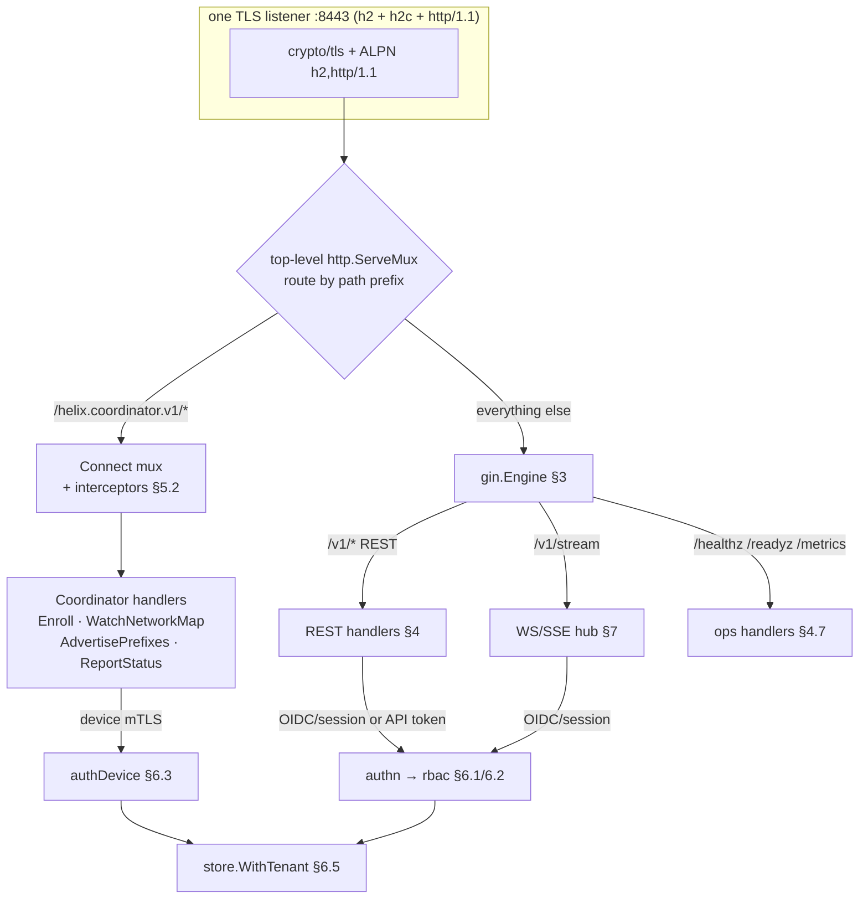
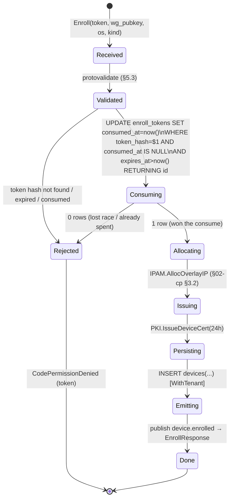
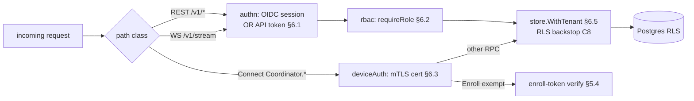
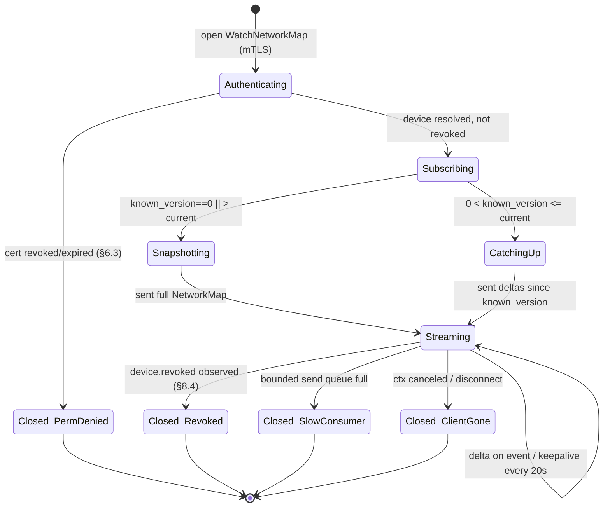
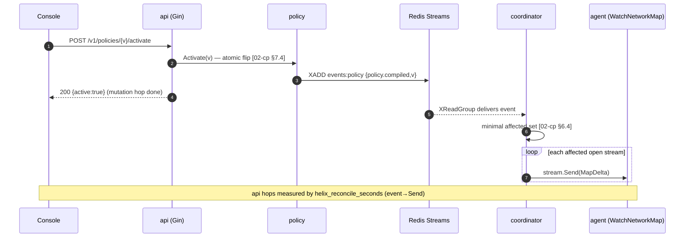
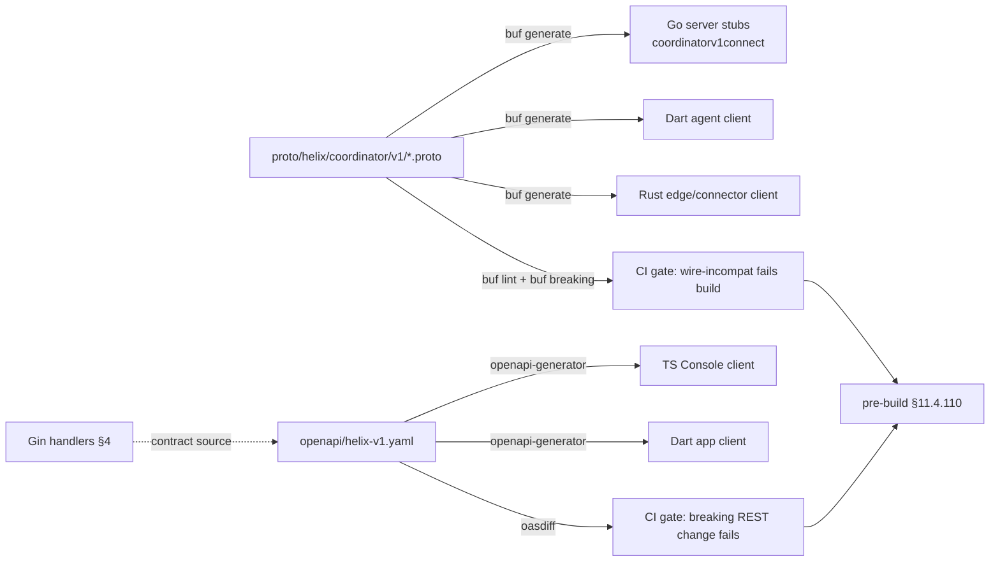

# api service (Gin + Connect + WS/SSE)

**Revision:** 1
**Last modified:** 2026-06-25T00:00:00Z

> Volume 3 nano-detail spec — deepens the **api service** of the Phase-1 control plane
> (pass-1 overview: [`02-control-plane.md` §8](../02-control-plane.md)). Scope: ONE
> multiplexed HTTP server hosting (a) Gin REST for the three apps, (b) WebSocket/SSE live
> event fan-out for the Console, and (c) the Connect/gRPC `Coordinator` service for agents;
> plus the full authorization model (OIDC/session or API token + RBAC for apps; device mTLS
> for agents; Row-Level-Security backstop) and the schema-first contract pipeline
> (OpenAPI + buf, no-drift). This is a SPEC — it describes the implementation; it does not
> build it. Evidence cited inline by id: [04_P1] = `HelixVPN-Phase1-MVP.md`,
> [04_ARCH §N] = `HelixVPN-Architecture-Refined.md`, [research-go_cp] = the cited Go
> control-plane research digest, [02-cp §N] = the pass-1 control-plane doc, [SYNTH §N] =
> cross-document synthesis. Unproven facts are marked **UNVERIFIED** per constitution
> §11.4.6. The proto package is `helix.coordinator.v1`, unified across the spec set
> [02-cp §4].

---

## 0. What this document owns (and does not)

This document owns the **`internal/api` package** — the single network ingress of `helixd`
[04_P1 §1, 02-cp §1.1]. It owns the listener topology, the request-routing mux, the full REST
route table with request/response/error schemas, the WS/SSE stream contract, the Connect
handler wiring, the four-layer authorization chain, and the schema→client codegen gates.

It does **not** redefine: the `Coordinator` `.proto` byte layout (canonical in [02-cp §4];
evolution semantics are doc 03), the policy compiler (doc deepens [02-cp §7]), the coordinator
graph/delta engine ([02-cp §6]), the IPAM algorithm ([02-cp §3]), or the DDL of the eleven
core tables ([02-cp §2]). Those are referenced, not re-specified. This doc adds the DDL that
is **api-owned** — sessions, API tokens, enroll tokens — because they exist solely to serve
the authentication surface.

### 0.1 Invariants this layer must uphold (from [02-cp §0.1])

| # | Invariant inherited | How the api layer honors it |
|---|---|---|
| C3 | No-logging by construction | api emits only Prometheus counters + control-action audit rows; request bodies/headers with peer addresses are never persisted, never logged at INFO. The access log records `method+route-template+status+latency+tenant`, never client IP at rest (§4.6). |
| C4 | Default-deny, need-to-know | every REST route defaults to `requireRole(...)`; an un-annotated route is rejected by a startup audit (§3.4). Connect peers are policy-filtered upstream (coordinator), never here. |
| C5 | Push, don't poll; p99 < 1 s | `/v1/stream` (WS/SSE) and `Coordinator.WatchNetworkMap` are server-push; no app-facing polling endpoint streams desired state. The api layer contributes the **transport hop** of the < 1 s budget (§9). |
| C6 | Device private keys never leave the device | `Enroll` accepts only the 32-byte WG **public** key; the api layer rejects any request body field named like a private key (§5.3 protovalidate + §4.4 REST binding). |
| C8 | Tenant isolation at the database | every handler runs DB work through `store.WithTenant`; RLS is the floor even if RBAC is mis-wired (§6.5). |

---

## 1. Listener topology — one server, three surfaces

A single `*http.Server` bound to one TLS listener serves all three audiences. There is no second
port, no sidecar proxy, no Envoy [research-go_cp §1/§2/§7]. Connect handlers are plain
`http.Handler`s, so a top-level mux routes by path prefix: RPC paths (`/helix.coordinator.v1.*`)
go to the Connect mux; everything else to Gin (which itself owns `/v1/...` REST and
`/v1/stream` WS/SSE) [research-go_cp §1].



### 1.1 The mux wiring (Go)

```go
// internal/api/server.go
type Server struct {
    gin   *gin.Engine                 // REST + WS/SSE
    conn  http.Handler                // Connect mux (Coordinator handlers)
    http  *http.Server
    deps  Deps                        // Registry, PKI, Policy, Bus, Store, Coordinator, OIDC
}

// Mux: Connect paths to conn, all else to gin. connectPathPrefix is the proto package path.
const connectPathPrefix = "/helix.coordinator.v1." // [02-cp §4] package helix.coordinator.v1

func (s *Server) handler() http.Handler {
    mux := http.NewServeMux()
    mux.Handle(connectPathPrefix, s.conn) // matches Coordinator/<Method> routes
    mux.Handle("/", s.gin)                // REST, WS/SSE, ops
    return mux
}

func (s *Server) Run(ctx context.Context, addr string, tlsCfg *tls.Config) error {
    // h2c so native agents get HTTP/2 even on plaintext dev; prod uses TLS-ALPN h2.
    h2s := &http2.Server{}
    s.http = &http.Server{
        Addr:              addr,
        Handler:           h2c.NewHandler(s.handler(), h2s),
        TLSConfig:         tlsCfg,         // ALPN: ["h2","http/1.1"]; ClientAuth: VerifyClientCertIfGiven (§6.3)
        ReadHeaderTimeout: 5 * time.Second,
        IdleTimeout:       120 * time.Second,
        // NO global WriteTimeout: it would kill long-lived WatchNetworkMap / WS streams (§7.4, §8.3).
    }
    go func() { <-ctx.Done(); _ = s.http.Shutdown(context.Background()) }()
    if tlsCfg != nil {
        return s.http.ListenAndServeTLS("", "")
    }
    return s.http.ListenAndServe()
}
```

> **Why no `WriteTimeout`.** `WatchNetworkMap` and `/v1/stream` are intentionally infinite;
> a server-wide `WriteTimeout` severs them mid-stream. Liveness is instead enforced per-stream
> by application keepalives (§7.4, §8.3) and `ReadHeaderTimeout` guards slowloris on new
> connections [research-go_cp §2 — streaming caveats].

### 1.2 `ClientAuth` is `VerifyClientCertIfGiven`, not `RequireAndVerify`

REST/WS callers present no client cert (they use bearer auth); agents present a device mTLS
cert. A single listener therefore uses `tls.VerifyClientCertIfGiven`: the cert is verified
against the tenant CA pool **if presented**, and its absence is permitted (REST path) but a
**presented-and-invalid** cert aborts the TLS handshake. `authDevice` (§6.3) then **requires**
a verified cert on Connect routes; `authn` (§6.1) requires a bearer token on REST routes. This
is the one-listener compromise [research-go_cp §7 single-server]; the per-route requirement is
enforced in the auth layer, not the TLS layer.

---

## 2. api-owned DDL (sessions, API tokens, enroll tokens)

These three tables exist only to serve authentication and live in the api/identity boundary.
They are tenant-scoped and RLS-protected exactly like the core eleven [02-cp §2.3]. Enroll
tokens are referenced by the enrollment flow in [02-cp §9.2]; this doc gives their schema.

```sql
-- ============ browser/console sessions (OIDC login) ============
CREATE TABLE sessions (
  id           uuid PRIMARY KEY DEFAULT gen_random_uuid(),
  tenant_id    uuid NOT NULL REFERENCES tenants(id) ON DELETE CASCADE,
  user_id      uuid NOT NULL REFERENCES users(id)   ON DELETE CASCADE,
  token_hash   bytea NOT NULL,            -- sha256(opaque cookie value); the raw value is never stored
  created_at   timestamptz NOT NULL DEFAULT now(),
  expires_at   timestamptz NOT NULL,
  revoked_at   timestamptz,
  user_agent   text,                      -- coarse; NO IP address (C3)
  UNIQUE (tenant_id, token_hash)
);
CREATE INDEX ON sessions (tenant_id, user_id) WHERE revoked_at IS NULL;

-- ============ programmatic API tokens (CI / Connector daemon / Console automation) ============
CREATE TABLE api_tokens (
  id           uuid PRIMARY KEY DEFAULT gen_random_uuid(),
  tenant_id    uuid NOT NULL REFERENCES tenants(id) ON DELETE CASCADE,
  user_id      uuid REFERENCES users(id) ON DELETE SET NULL,  -- nullable: tenant-scoped service token
  name         text NOT NULL,
  token_hash   bytea NOT NULL,            -- sha256 of the displayed-once secret; raw secret never stored (C6 posture)
  role         user_role NOT NULL,        -- the RBAC role the token carries (§6.2)
  created_at   timestamptz NOT NULL DEFAULT now(),
  last_used_at timestamptz,               -- COARSE; updated at most once/min, async (not per-request, C3)
  expires_at   timestamptz,               -- nullable: non-expiring service token (discouraged)
  revoked_at   timestamptz,
  UNIQUE (tenant_id, name),
  UNIQUE (tenant_id, token_hash)
);
CREATE INDEX ON api_tokens (tenant_id) WHERE revoked_at IS NULL;

-- ============ single-use device enroll tokens (anonymous + managed both) ============
CREATE TABLE enroll_tokens (
  id           uuid PRIMARY KEY DEFAULT gen_random_uuid(),
  tenant_id    uuid NOT NULL REFERENCES tenants(id) ON DELETE CASCADE,
  token_hash   bytea NOT NULL,            -- sha256 of the printed/QR token; raw never stored
  kind         device_kind NOT NULL,      -- the device_kind this token may enroll (client|connector)
  bound_user_id uuid REFERENCES users(id) ON DELETE SET NULL, -- NULL => anonymous enroll (C6 privacy)
  created_by   uuid REFERENCES users(id) ON DELETE SET NULL,  -- minting admin/operator
  created_at   timestamptz NOT NULL DEFAULT now(),
  expires_at   timestamptz NOT NULL,      -- short-lived (default 15 min, §4.1)
  consumed_at  timestamptz,               -- set atomically on Enroll; non-NULL => spent
  consumed_device_id uuid REFERENCES devices(id) ON DELETE SET NULL,
  UNIQUE (tenant_id, token_hash)
);
CREATE INDEX ON enroll_tokens (tenant_id) WHERE consumed_at IS NULL;
```

All three carry `tenant_id` and receive the identical `tenant_isolation` + `FORCE ROW LEVEL
SECURITY` policy of [02-cp §2.3]. **Secrets are stored only as `sha256` hashes**; the raw
token/cookie value is shown to the caller exactly once at mint and never re-derivable — a
DB compromise yields no usable credential (constitution §11.4.10). The atomic single-use
consume of `enroll_tokens` is the load-bearing line of §5.4.

> **No-logging note (C3).** `sessions` and `api_tokens` deliberately omit any IP / port /
> connection column. The §2.4 schema-lint of [02-cp §2.4] runs over these tables too; an added
> `client_ip inet` here would FAIL the lint (paired §1.1 mutation, §10).

---

## 3. Gin REST surface — engine, middleware, routing

### 3.1 Engine construction (production posture)

```go
// internal/api/rest.go — gin.New(), never gin.Default() in prod [research-go_cp §1]
func newGin(d Deps) *gin.Engine {
    r := gin.New()
    r.Use(requestID())          // X-Request-Id in/out; flows into trace_id (§5/§7 envelopes)
    r.Use(structuredLogger())   // route-template + status + latency + tenant; NO client IP at rest (C3)
    r.Use(recovery())           // converts panics → 500 + audit, never leaks stack to client
    r.Use(securityHeaders())    // HSTS, X-Content-Type-Options, no-store on auth routes
    // global body cap: REST bodies are tiny (policy specs are the largest, < 256 KiB).
    r.Use(limitBody(256 << 10))
    return r
}
```

The middleware order is load-bearing: `requestID` → `structuredLogger` → `recovery` →
`limitBody`, then per-group `authn` → `rbac`. `recovery` is above `authn` so a panic in auth
still returns a clean 500 (never a torn connection).

### 3.2 Full REST route table

All routes are versioned under `/v1`. `Role` columns use the closed RBAC set `admin >
operator > member` [02-cp §8.1]. Every route is tenant-scoped via `WithTenant`. The table is
the **authoritative** route list this layer must implement [04_P1 §8, 02-cp §8].

| Method | Path | Purpose | admin | operator | member | Handler |
|---|---|---|:--:|:--:|:--:|---|
| POST | `/v1/enroll-tokens` | Mint a single-use device enroll token (§4.1) | ✓ | ✓ | ✗ | `h.MintEnrollToken` |
| GET  | `/v1/enroll-tokens` | List unconsumed tokens (metadata only) | ✓ | ✓ | ✗ | `h.ListEnrollTokens` |
| DELETE | `/v1/enroll-tokens/:id` | Revoke an unconsumed token | ✓ | ✓ | ✗ | `h.RevokeEnrollToken` |
| GET  | `/v1/devices` | List tenant devices (clients + connectors) (§4.2) | ✓ | ✓ | ✓ | `h.ListDevices` |
| GET  | `/v1/devices/:id` | One device detail | ✓ | ✓ | ✓ | `h.GetDevice` |
| PATCH| `/v1/devices/:id` | Rename / reassign owner | ✓ | ✓ | ✗ | `h.PatchDevice` |
| POST | `/v1/devices/:id/revoke` | Revoke device (< 1 s edge enforce) (§4.3) | ✓ | ✗ | ✗ | `h.RevokeDevice` |
| GET  | `/v1/connectors` | List connectors + advertised prefixes | ✓ | ✓ | ✓ | `h.ListConnectors` |
| POST | `/v1/connectors/:id/prefixes` | Set advertised CIDRs (Console path) | ✓ | ✓ | ✗ | `h.SetPrefixes` |
| GET  | `/v1/groups` | List policy groups | ✓ | ✓ | ✓ | `h.ListGroups` |
| POST | `/v1/groups` | Create group | ✓ | ✓ | ✗ | `h.CreateGroup` |
| PUT  | `/v1/groups/:id/members` | Replace group membership | ✓ | ✓ | ✗ | `h.SetGroupMembers` |
| GET  | `/v1/policies` | List policy versions (active flagged) (§4.5) | ✓ | ✓ | ✓ | `h.ListPolicies` |
| POST | `/v1/policies` | Submit new policy spec (dry-run compile) (§4.5) | ✓ | ✓ | ✗ | `h.CreatePolicy` |
| POST | `/v1/policies/:v/activate` | Activate version v (atomic flip) | ✓ | ✓ | ✗ | `h.ActivatePolicy` |
| GET  | `/v1/networks` | Tenant overlay summary (ULA /48, sites, IPAM) (§4.4) | ✓ | ✓ | ✓ | `h.GetNetworks` |
| GET  | `/v1/audit` | Control-action audit log (paginated) | ✓ | ✓ | ✗ | `h.ListAudit` |
| POST | `/v1/api-tokens` | Mint a programmatic API token | ✓ | ✗ | ✗ | `h.MintAPIToken` |
| DELETE | `/v1/api-tokens/:id` | Revoke an API token | ✓ | ✗ | ✗ | `h.RevokeAPIToken` |
| GET  | `/v1/stream` | WS/SSE live event subscription (§7) | ✓ | ✓ | ✓ | `h.Stream` |
| GET  | `/v1/me` | Current principal (user/role/tenant) | ✓ | ✓ | ✓ | `h.Me` |
| GET  | `/healthz` `/readyz` `/metrics` | ops (no auth; §4.7) | — | — | — | `h.Health/Ready/Metrics` |

### 3.3 Route registration (Go) — RBAC is declared at registration, not inside handlers

```go
// internal/api/routes.go
func (s *Server) registerREST(r *gin.Engine, h *Handlers) {
    v1 := r.Group("/v1", s.authn())                 // every /v1 route authenticates first
    {
        et := v1.Group("/enroll-tokens", requireRole("admin", "operator"))
        et.POST("",        h.MintEnrollToken)
        et.GET ("",        h.ListEnrollTokens)
        et.DELETE("/:id",  h.RevokeEnrollToken)

        dev := v1.Group("/devices")
        dev.GET ("",            requireRole("admin", "operator", "member"), h.ListDevices)
        dev.GET ("/:id",        requireRole("admin", "operator", "member"), h.GetDevice)
        dev.PATCH("/:id",       requireRole("admin", "operator"),           h.PatchDevice)
        dev.POST("/:id/revoke", requireRole("admin"),                       h.RevokeDevice)

        pol := v1.Group("/policies")
        pol.GET ("",             requireRole("admin", "operator", "member"), h.ListPolicies)
        pol.POST("",             requireRole("admin", "operator"),           h.CreatePolicy)
        pol.POST("/:v/activate", requireRole("admin", "operator"),           h.ActivatePolicy)
        // ... remaining groups identically (connectors, groups, networks, audit, api-tokens, stream, me)
    }
}
```

### 3.4 Startup route-authz audit (C4 enforced mechanically)

A boot-time check walks `r.Routes()` and asserts **every** `/v1/*` route carries a
`requireRole` handler in its chain; an unguarded `/v1` route aborts startup. This makes
"default-deny" a runtime signature (§11.4.108), not a convention.

```go
// internal/api/audit_routes.go — runs in NewServer(); fails closed
func assertEveryV1RouteGuarded(routes gin.RoutesInfo) error {
    for _, rt := range routes {
        if strings.HasPrefix(rt.Path, "/v1/") &&
            !chainHasRBAC(rt.HandlerName) {       // handler chain contains requireRole marker
            return fmt.Errorf("route %s %s missing requireRole: §11.4.6/C4 violation",
                rt.Method, rt.Path)
        }
    }
    return nil
}
```

Paired §1.1 mutation (§10): registering a `/v1` route without `requireRole` MUST make this
audit FAIL.

---

## 4. REST request/response schemas (per route)

JSON, `Content-Type: application/json`, validated with go-playground/validator `binding` tags
[research-go_cp §1]. All times are RFC 3339 UTC. All ids are UUIDv4 strings. Errors follow the
unified taxonomy of §8. Below: the load-bearing schemas; the remaining routes follow the same
shape.

### 4.1 `POST /v1/enroll-tokens` — mint device enroll token

```go
type MintEnrollTokenReq struct {
    Kind        string `json:"kind"        binding:"required,oneof=client connector"`
    BindUserID  string `json:"bind_user_id" binding:"omitempty,uuid"` // omit => anonymous (C6)
    TTLSeconds  int    `json:"ttl_seconds"  binding:"omitempty,min=60,max=86400"` // default 900
}
type MintEnrollTokenResp struct {
    ID        string `json:"id"`
    Token     string `json:"token"`       // shown ONCE; only sha256 persisted (§2)
    QRPNG     string `json:"qr_png_b64"`  // base64 PNG of the token for Connector/Access scan
    Kind      string `json:"kind"`
    ExpiresAt string `json:"expires_at"`
}
```

Handler: `WithTenant` → insert `enroll_tokens(token_hash=sha256(raw), kind, bound_user_id,
expires_at)` → `audit_events("enroll_token.mint")`. The raw token is generated from
`crypto/rand` (32 bytes, base32). **Anti-bluff:** the response's `token` is the only place the
raw value ever appears; re-fetching the token returns metadata only.

### 4.2 `GET /v1/devices` — list devices

Query params: `?kind=client|connector`, `?online=true|false`, `?limit=`(≤200, default 50),
`?cursor=`(opaque). Cursor pagination (keyset on `(enrolled_at, id)`), never `OFFSET`.

```go
type DeviceView struct {
    ID         string `json:"id"`
    Kind       string `json:"kind"`
    Name       string `json:"name"`
    OverlayIP  string `json:"overlay_ip"`        // ULA /48 address [02-cp §3]
    OS         string `json:"os,omitempty"`
    Online     bool   `json:"online"`            // from Redis presence (ephemeral) [02-cp §5]
    LastSeenAt string `json:"last_seen_at,omitempty"` // COARSE (C3)
    Revoked    bool   `json:"revoked"`
    OwnerEmail string `json:"owner_email,omitempty"`  // null in anonymous mode (C6)
}
type ListDevicesResp struct {
    Devices    []DeviceView `json:"devices"`
    NextCursor string       `json:"next_cursor,omitempty"`
}
```

`Online` is read from Redis presence (TTL keys, ephemeral) [02-cp §5.1], NOT from a durable
column — losing Redis loses presence, not identity (C2). The wg public key is **not** returned
to apps (it is an agent-plane datum delivered via `WatchNetworkMap`, need-to-know C4).

### 4.3 `POST /v1/devices/:id/revoke` — revoke (admin only)

Empty body. Handler (the < 1 s revoke promise [02-cp §9.3]):

```go
func (h *Handlers) RevokeDevice(c *gin.Context) {
    id := mustUUID(c.Param("id"))
    tn := tenantOf(c)
    err := h.store.WithTenant(c, tn, func(q *db.Queries) error {
        if err := q.MarkDeviceRevoked(c, db.MarkDeviceRevokedParams{Tenant: tn, ID: id}); err != nil {
            return err // sets devices.revoked_at = now()
        }
        if err := q.RevokeDeviceCerts(c, db.RevokeParams{Tenant: tn, Device: id}); err != nil {
            return err // device_certs.revoked = true
        }
        // R3 [02-cp §1.2]: emit so coordinator pushes a peer-removal delta + edge drops the WG peer.
        _, err := h.bus.Publish(c, "events:devices",
            events.New("device.revoked", tn, principalOf(c).Subject, map[string]any{"device_id": id}))
        return err
    })
    writeResultOrError(c, err, http.StatusAccepted) // 202: revoke ACCEPTED; edge enforcement is async-but-<1s
}
```

**Status semantics:** `202 Accepted`, not `200`. The DB write + event publish are synchronous;
the actual WG-peer removal at the edge is event-driven within the convergence SLO (§9). The
response carries `{ "revoked_at": "...", "convergence": "streaming" }`. The matching
`device.revoked` also force-closes the device's open `WatchNetworkMap` stream (§8.4).

### 4.4 `GET /v1/networks` — overlay summary

```go
type NetworksResp struct {
    ULAPrefix   string        `json:"ula_prefix"`     // fd7a:helix:<rand>::/48 [02-cp §3.1]
    GatewayIP   string        `json:"gateway_ip"`     // ::1
    DeviceCount int           `json:"device_count"`
    Connectors  []ConnectorView `json:"connectors"`   // each: site_id, prefixes[], 4via6 mapping
}
type ConnectorView struct {
    DeviceID string   `json:"device_id"`
    SiteName string   `json:"site_name"`
    SiteID   uint32   `json:"site_id"`                // for 4via6 disambiguation (D4) [02-cp §3.2]
    Prefixes []string `json:"prefixes"`
    Via6     []Via6   `json:"via6"`                   // {ipv4_cidr, via6_prefix}
}
```

### 4.5 `POST /v1/policies` — submit spec (dry-run compile, fail-closed)

```go
type CreatePolicyReq struct {
    Spec json.RawMessage `json:"spec" binding:"required"` // the Tailscale-ACL-flavored doc [02-cp §7.1]
}
type CreatePolicyResp struct {
    Version      int64           `json:"version"`
    Active       bool            `json:"active"`           // false until /activate
    CompileStats CompileStats    `json:"compile_stats"`    // devices, rules, edges
    Conflicts    []RouteConflict `json:"conflicts,omitempty"` // overlapping CIDRs — non-fatal warning
}
```

Handler runs `policy.Compiler.Compile` (pure dry-run) BEFORE any insert; a compile error
returns `422 Unprocessable Entity` with the structured `PolicyCompileError` (§8.2) and writes
**nothing** [02-cp §7.3 fail-closed]. Only a clean dry-run inserts the `policies` row and emits
`policy.updated`. `POST /v1/policies/:v/activate` then performs the atomic flip [02-cp §7.4]
and returns `200` with `{ "version": v, "active": true }`; activation emits `policy.compiled`,
which the coordinator turns into per-node deltas within the SLO (§9).

### 4.6 Response envelope & access log (C3)

Success responses are the bare resource JSON (no wrapper). The access log line is structured:

```json
{ "ts":"RFC3339","level":"info","msg":"req",
  "request_id":"...","route":"POST /v1/policies","status":201,
  "latency_ms":42,"tenant":"<uuid>","role":"operator" }
```

It records the **route template** (`/v1/devices/:id`, never the concrete id when the id is
sensitive — device ids are non-sensitive tenant-internal UUIDs, so they are logged), `status`,
`latency`, `tenant`, `role`. It NEVER records client IP, request body, or auth token (C3 +
§11.4.10). DEBUG level may log body shape for local dev only, gated off in prod builds.

### 4.7 Ops endpoints (unauthenticated, no tenant)

- `GET /healthz` — process liveness; returns `200 {"status":"ok"}` always while the process runs.
- `GET /readyz` — dependency readiness; `200` only if Postgres `SELECT 1` and Redis `PING`
  both succeed within 1 s, else `503` with `{"postgres":bool,"redis":bool}`. Used by the
  quadlet `After=`/healthcheck [02-cp §11.1].
- `GET /metrics` — Prometheus exposition (§9.2 histograms). Bound to localhost/scrape network
  only via deploy network policy, never the public listener path — **UNVERIFIED** whether the
  MVP exposes `/metrics` on the same `:8443` or a separate scrape port; recommendation is a
  separate internal listener so it is never internet-reachable.

---

## 5. Connect / gRPC surface — `Coordinator` handlers

The agent-plane RPCs are served via connect-go [research-go_cp §2]. The service + messages are
canonical in [02-cp §4]; this section specifies the **server-side wiring**: handler signatures,
the interceptor chain, request validation, and the auth resolution.

### 5.1 Service methods (package `helix.coordinator.v1`)

| RPC | Kind | Auth | Notes |
|---|---|---|---|
| `Enroll` | unary | enroll token (the only unauthenticated-by-cert RPC) | single-use token → identity + cert (§5.4) |
| `WatchNetworkMap` | **server-stream** | device mTLS | the spine: snapshot then deltas, p99 < 1 s (§8) [02-cp §6.3] |
| `AdvertisePrefixes` | unary | device mTLS (connector) | connector pushes CIDRs; conflict list returned |
| `ReportStatus` | unary | device mTLS | presence + transport + rtt; NO traffic data (C3) |

### 5.2 Interceptor chain (connect-go)

```go
// internal/api/connect.go
func newConnectMux(d Deps) http.Handler {
    interceptors := connect.WithInterceptors(
        recoverInterceptor(),                 // panic → CodeInternal + audit
        requestIDInterceptor(),               // propagate/issue request id → trace_id
        validateInterceptor(),                // protovalidate: buf.validate field constraints [research-go_cp §2]
        deviceAuthInterceptor(d.PKI),         // mTLS cert → device (skips Enroll) (§6.3)
        metricsInterceptor(),                 // helix_rpc_* histograms (§9.2)
    )
    path, handler := coordinatorv1connect.NewCoordinatorHandler(
        &coordinatorServer{d: d}, interceptors)
    mux := http.NewServeMux()
    mux.Handle(path, handler)
    return mux
}

type coordinatorServer struct{ d Deps }

func (s *coordinatorServer) Enroll(
    ctx context.Context, req *connect.Request[coordinatorv1.EnrollRequest],
) (*connect.Response[coordinatorv1.EnrollResponse], error) { /* §5.4 */ }

func (s *coordinatorServer) WatchNetworkMap(
    ctx context.Context, req *connect.Request[coordinatorv1.WatchRequest],
    stream *connect.ServerStream[coordinatorv1.MapUpdate],
) error { return s.d.Coordinator.WatchNetworkMap(ctx, req, stream) } // delegates to [02-cp §6.3]
```

> **Streaming-error caveat (load-bearing) [research-go_cp §2].** In every Connect protocol a
> streaming response is **HTTP 200** even on failure — the real status rides in the trailer /
> end-of-stream. The api layer therefore MUST encode `WatchNetworkMap` errors as
> `connect.NewError(code, ...)` returned from the handler (which connect-go places in the
> trailer), never as an HTTP status; generated agent clients read the trailer status. A test
> asserts a revoked-device stream yields `CodePermissionDenied` in the trailer, not a 4xx
> status (§10).

### 5.3 Request validation — protovalidate, not hand-written

Field constraints live in the `.proto` via `buf.validate` and are enforced by the
`validateInterceptor` [research-go_cp §2]. Example constraints on `EnrollRequest`:

```protobuf
// proto/helix/coordinator/v1/coordinator.proto (constraints overlaid on [02-cp §4] messages)
import "buf/validate/validate.proto";

message EnrollRequest {
  string     enroll_token = 1 [(buf.validate.field).string.min_len = 16];
  bytes      wg_pubkey    = 2 [(buf.validate.field).bytes.len = 32]; // exactly 32B Curve25519 (C6)
  string     os           = 3 [(buf.validate.field).string.max_len = 32];
  string     name         = 4 [(buf.validate.field).string.max_len = 128];
  DeviceKind kind         = 5 [(buf.validate.field).enum.defined_only = true];
}
```

`wg_pubkey.len = 32` mechanically rejects anything that is not a 32-byte public key — a
private key (also 32 bytes) is rejected by the **absence of any private-key field** in the
contract, not by length (C6: the contract has no slot to carry a private key) [02-cp §4].

### 5.4 `Enroll` handler — atomic single-use token consume



The atomic consume is the single `UPDATE ... WHERE consumed_at IS NULL ... RETURNING` — two
concurrent `Enroll` calls with the same token: exactly one gets a row, the loser gets
`CodePermissionDenied` [02-cp §9.2]. `kind` in the request MUST match `enroll_tokens.kind` or
the enroll is rejected (`CodeInvalidArgument`). The whole sequence runs in one `WithTenant`
transaction; the `device.enrolled` publish (§02-cp §5.3) shares the unit of work (R3) — a
rollback un-consumes the token. **Anti-bluff:** the integration test asserts the second
concurrent enroll fails AND that the device row + cert + event all land or none do (§10).

---

## 6. Authorization model (four cooperating layers)



### 6.1 `authn` — OIDC/session OR API token (REST + WS)

```go
// internal/api/authn.go
func (s *Server) authn() gin.HandlerFunc {
    return func(c *gin.Context) {
        // 1. Bearer API token? "Authorization: Bearer hvpn_<...>"
        if raw, ok := bearerToken(c); ok && strings.HasPrefix(raw, "hvpn_") {
            p, err := s.resolveAPIToken(c, sha256sum(raw)) // lookup api_tokens by hash, not-revoked, not-expired
            if err != nil { abort401(c, "invalid_token"); return }
            setPrincipal(c, p); c.Next(); return
        }
        // 2. Session cookie? (Console browser, OIDC login)
        if cookie, err := c.Cookie("helix_session"); err == nil {
            p, err := s.resolveSession(c, sha256sum(cookie)) // sessions by hash, not-revoked, not-expired
            if err != nil { abort401(c, "invalid_session"); return }
            setPrincipal(c, p); c.Next(); return
        }
        abort401(c, "missing_credentials")
    }
}
```

`Principal{TenantID, UserID, Role, Subject}` is stashed on the gin context. OIDC login itself
(`/v1/auth/login` → IdP redirect → `/v1/auth/callback` → set `helix_session` cookie) is a
thin standard OIDC Authorization-Code+PKCE flow against any IdP (Keycloak/Authentik) [02-cp
§9.1]; the callback validates the IdP id-token, upserts the `users` row keyed on
`(tenant_id, oidc_sub)`, and mints a `sessions` row. **UNVERIFIED:** whether the MVP supports
multi-IdP-per-tenant or one IdP per tenant — the schema (`users.oidc_sub` unique per tenant)
supports one issuer per tenant; multi-issuer is a Phase-2 extension.

### 6.2 `rbac` — role gate (closed set admin > operator > member)

```go
func requireRole(allowed ...string) gin.HandlerFunc {
    set := toSet(allowed)
    return func(c *gin.Context) {
        if !set[principalOf(c).Role] { abort403(c, "insufficient_role"); return }
        c.Next()
    }
}
```

The role-per-route matrix is §3.2. RBAC is the **app-facing** gate; it is defense-in-depth
ATOP RLS, never instead of it [02-cp §8.1].

### 6.3 `deviceAuth` — agent mTLS (Connect)

```go
// connect interceptor; resolves the verified client cert → device, rejecting revoked/expired
func deviceAuthInterceptor(pki PKI) connect.UnaryInterceptorFunc {
    return func(next connect.UnaryFunc) connect.UnaryFunc {
        return func(ctx context.Context, req connect.AnyRequest) (connect.AnyResponse, error) {
            if req.Spec().Procedure == coordinatorEnrollProcedure {
                return next(ctx, req) // Enroll is cert-exempt; token-authed instead (§5.4)
            }
            cert := peerCert(ctx) // from tls.ConnectionState.PeerCertificates[0]
            if cert == nil {
                return nil, connect.NewError(connect.CodeUnauthenticated, errNoCert)
            }
            dev, err := pki.ResolveDevice(ctx, cert.SerialNumber) // device_certs → devices
            if err != nil || dev.Revoked || time.Now().After(dev.CertNotAfter) {
                return nil, connect.NewError(connect.CodePermissionDenied, errRevokedOrExpired)
            }
            return next(deviceCtx(ctx, dev), req) // device on ctx for the handler
        }
    }
}
```

A stream variant (`StreamingHandlerFunc`) does the identical resolution for
`WatchNetworkMap`/`AdvertisePrefixes`/`ReportStatus`. The cert is verified at the TLS layer
against the tenant CA pool (§1.2); the interceptor adds the **authorization** check
(not-revoked, not-expired) on top of TLS authentication [02-cp §8.2].

### 6.4 Tenant resolution for agents

An agent's tenant is **derived from its device cert**, never from a request field — the
`device_certs` row carries `tenant_id`, so a device cannot assert a tenant it does not belong
to. REST/WS principals carry tenant from the session/api-token row. There is **no**
client-supplied tenant header anywhere (it would be a forgeable trust boundary).

### 6.5 RLS backstop (C8) — the floor under both gates

Every handler — REST and Connect — runs its DB work inside `store.WithTenant(ctx,
principal.TenantID, fn)` [02-cp §2.3]. `SET LOCAL app.tenant_id` is transaction-scoped, so
tenant context cannot leak across pooled connections [research-go_cp §4]. If RBAC is
misconfigured or a handler forgets a `WHERE`, RLS still denies cross-tenant rows. A
`golangci-lint` custom analyzer flags any `db.Query`/`pool.Exec` outside `store` (R4 [02-cp
§1.2]).

> **The three-layer guarantee.** authn proves *who*; rbac proves *may-this-role*; RLS proves
> *only-this-tenant's-rows* at the database. A bug in any one layer is caught by the next.
> This is the constitution §11.4 anti-bluff posture applied to authz: no single point whose
> failure silently grants cross-tenant access [SYNTH §7].

---

## 7. WebSocket / SSE live stream — `/v1/stream`

The Console subscribes to live control-plane events (device online/offline, route changed,
handshake failing, policy compiled) without polling [04_P1 §8, 02-cp §8]. This is the **app**
live channel; agents use `WatchNetworkMap` (§8). Both are server-push (C5).

### 7.1 Protocol negotiation

`GET /v1/stream` upgrades to WebSocket if the client sends `Upgrade: websocket`; otherwise it
serves **SSE** (`Accept: text/event-stream`) as the fallback (browsers behind proxies that
block WS) [04_P1 §8]. Both deliver the identical event envelope (§7.2). Auth is the standard
`authn` (session cookie or API token) — the WS upgrade carries the cookie; the SSE request
carries the bearer/cookie.

### 7.2 Event envelope (app-facing — a projection of the §02-cp §5.2 bus envelope)

```json
{ "type": "device.online",
  "tenant_id": "<uuid>",
  "ts": "RFC3339",
  "data": { "device_id": "<uuid>", "name": "alice-laptop" },
  "trace_id": "<request-or-event-id>" }
```

The app-facing envelope is a **filtered, tenant-scoped projection** of the internal bus
envelope: only events for the subscriber's tenant, only types the subscriber's role may see,
and `actor`/internal payload fields are stripped to the app-relevant subset. The hub never
forwards another tenant's event — the projection is the C4 need-to-know boundary at the live
channel.

### 7.3 Subscribable event types (app projection)

| `type` | Source bus event [02-cp §5.3] | Role floor |
|---|---|---|
| `device.online` / `device.offline` | `device.online`/`.offline` | member |
| `device.enrolled` / `device.revoked` | same | operator |
| `route.changed` | `connector.prefixes.changed` | member |
| `route.conflict` | `route.conflict.detected` | operator |
| `policy.compiled` | `policy.compiled` | operator |
| `handshake.failing` | derived from `gateway`/edge health | operator |
| `gateway.failover` | `gateway.failover` | operator |

### 7.4 Hub mechanics & backpressure

```go
// internal/api/stream.go — one goroutine per subscriber; bounded send queue
type subscriber struct {
    tenant uuid.UUID
    role   string
    out    chan []byte // bounded (cap 256); full => drop subscriber, force reconnect
    done   chan struct{}
}

func (h *Hub) run(ctx context.Context) {
    evs := h.bus.SubscribeFanout(ctx, "coordinator-ws", busStreams...) // consumer group
    for {
        select {
        case <-ctx.Done(): return
        case env := <-evs:
            for _, s := range h.subsFor(env.TenantID) {       // tenant-scoped fan-out (C4)
                if !roleMaySee(s.role, env.Type) { continue }  // role projection (§7.3)
                msg := projectAppEnvelope(env, s.role)
                select {
                case s.out <- msg:                              // delivered
                default: h.drop(s)                              // slow consumer → drop, not memory growth
                }
            }
        }
    }
}
```

A WS keepalive ping every 20 s (and SSE comment heartbeat) proves liveness without a global
`WriteTimeout` (§1.1). A subscriber whose 256-deep queue fills is **dropped** and must
reconnect — back-pressure, never unbounded memory (mirrors the coordinator's bounded
send-queue discipline [02-cp §6.4]).

### 7.5 SSE wire format

```
event: device.online
id: <event-id>
data: {"type":"device.online","tenant_id":"...","ts":"...","data":{...},"trace_id":"..."}

: keepalive
```

The `id:` line lets the browser `EventSource` send `Last-Event-ID` on reconnect; the hub does
NOT replay from the bus on reconnect in the MVP (the Console re-fetches current state via REST,
then resumes the live stream) — **UNVERIFIED** whether Phase 1 implements `Last-Event-ID`
replay; the lean MVP path is reconnect-then-refetch, replay is a Phase-2 nicety.

---

## 8. `WatchNetworkMap` at the api boundary (server-stream)

The handler body lives in `coordinator` [02-cp §6.3]; the api layer owns its **entry
conditions** — auth, version negotiation, lifecycle, and the convergence-budget hop.

### 8.1 Stream lifecycle state machine



### 8.2 Version negotiation (cheap reconnect)

`WatchRequest.known_version` [02-cp §4]: `0` ⇒ full snapshot; a non-zero value the server still
holds ⇒ deltas since that version (no full resync); a value **greater** than the server's
current (impossible/forked client state) ⇒ defensive full snapshot. This makes a flapping
agent's reconnect O(delta), not O(full topology) [02-cp §6.3].

### 8.3 Liveness without `WriteTimeout`

A 20 s `KeepAlive` `MapUpdate` (oneof `keepalive`) [02-cp §4] proves the stream is alive and
lets the agent detect a half-open connection; presence is flipped online on subscribe, offline
on `defer sub.Close()` [02-cp §6.3]. No server-wide write deadline severs the stream (§1.1).

### 8.4 Revoke force-close (the < 1 s teardown)

When the coordinator observes `device.revoked` for a device with an open stream, it closes that
stream's context, the handler returns `CodePermissionDenied`, and the agent's generated client
surfaces a terminal error (read from the trailer, §5.2). Combined with the edge dropping the
WG peer, this is the revoke-to-enforced < 1 s path [02-cp §9.3, §10.2]. **Anti-bluff:** the
test measures wall-clock from `POST /v1/devices/:id/revoke` `202` to stream-closed AND
WG-peer-gone, asserting both < 1 s with captured evidence (§10).

---

## 9. Convergence (< 1 s) — the api layer's contribution

The end-to-end < 1 s budget (event → enforced-at-edge) is owned by [02-cp §10]; the api layer
owns two hops of it: (1) REST mutation → bus publish (synchronous, in-handler), and (2)
coordinator delta → `stream.Send` on the open `WatchNetworkMap` / `/v1/stream`.



### 9.1 Budget allocation (target, measured — not asserted)

| Hop | Owner | Target |
|---|---|---|
| REST handler → `bus.Publish` returns | api | < 20 ms (one tx + one XADD) |
| bus deliver → coordinator picks up | events | < 50 ms (XReadGroup BLOCK) |
| coordinator recompute affected set | coordinator | < 100 ms @ 1k devices [02-cp §10.2] |
| coordinator → `stream.Send` on wire | api/coordinator | < 50 ms |
| **event → delta-on-wire (p99)** | **end-to-end** | **< 1 s** [02-cp §10.2] |

These are budget targets; the **acceptance number is the measured `helix_reconcile_seconds`
p99 < 1 s** under the §10 integration/soak load, captured per §11.4.5/§11.4.69 — never a
design estimate presented as a result (§11.4.6).

### 9.2 api-layer metrics (Prometheus)

```
helix_http_requests_total{route,method,status}            # REST counter
helix_http_request_seconds{route,method}                  # REST latency histogram
helix_rpc_seconds{procedure,code}                          # Connect unary/stream histogram
helix_ws_subscribers{tenant}                               # gauge: open /v1/stream subs
helix_ws_dropped_total{reason="slow_consumer"}             # backpressure drops (§7.4)
helix_watch_streams_open{tenant}                           # gauge: open WatchNetworkMap streams
helix_reconcile_seconds                                    # event→Send histogram (the SLO, §9.1)
```

---

## 10. Error taxonomy (unified across REST + Connect)

REST errors carry a stable machine `code` + human `message`; Connect errors carry a
`connect.Code` + the same machine `code` in `connect.ErrorDetail`. The mapping is one table so
a client sees the same `code` regardless of surface.

```go
type APIError struct {
    Code    string `json:"code"`             // stable machine token, e.g. "policy_compile_failed"
    Message string `json:"message"`          // human, safe to surface
    Details any    `json:"details,omitempty"`// structured (e.g. PolicyCompileError)
}
```

| `code` | REST HTTP | Connect code | When |
|---|---|---|---|
| `missing_credentials` | 401 | Unauthenticated | no session/api-token/cert |
| `invalid_token` / `invalid_session` | 401 | Unauthenticated | bad/expired/revoked credential |
| `insufficient_role` | 403 | PermissionDenied | RBAC gate fails (§6.2) |
| `device_revoked` | 403 | PermissionDenied | revoked/expired device cert (§6.3) |
| `enroll_token_invalid` | 403 | PermissionDenied | enroll token missing/expired/consumed (§5.4) |
| `not_found` | 404 | NotFound | resource absent in tenant (RLS-filtered) |
| `validation_failed` | 400 | InvalidArgument | binding/protovalidate failure (§4/§5.3) |
| `policy_compile_failed` | 422 | InvalidArgument | dry-run compile rejected (§4.5, `details`=PolicyCompileError) |
| `prefix_conflict` | 409 | AlreadyExists | overlapping advertised CIDR (hard-conflict path) |
| `rate_limited` | 429 | ResourceExhausted | enroll/mint throttle (§11) |
| `internal` | 500 | Internal | unexpected (panic-recovered, audited, NO stack to client) |

### 10.1 `PolicyCompileError` detail shape (§4.5)

```go
type PolicyCompileError struct {
    Stage   string `json:"stage"`   // "parse" | "resolve_groups" | "resolve_hosts" | "validate"
    Field   string `json:"field"`   // JSON path into spec, e.g. "acls[1].dst[0]"
    Reason  string `json:"reason"`  // closed set: unknown_group | unknown_host | cidr_not_advertised |
                                     //   grants_revoked_device | exit_node_is_connector
    Detail  string `json:"detail"`  // human elaboration
}
```

This is the fail-closed feedback of [02-cp §7.3] surfaced as structured `details` so the
Console can pinpoint the offending rule.

---

## 11. Edge cases (enumerated, with the decided behavior — §11.4.6)

| # | Edge case | Decided behavior |
|---|---|---|
| E1 | REST request with no credentials | `401 missing_credentials`; never default-allow (C4). |
| E2 | Valid session, wrong role for route | `403 insufficient_role`; RLS would also deny, but RBAC fails first (cheaper). |
| E3 | API token valid but device/user it belonged to deleted | token row `revoked_at` cascade-set on user delete? **No** — `api_tokens.user_id ON DELETE SET NULL`; a tenant-scoped service token survives, a user-bound token keeps working until explicitly revoked. Operator revokes via `DELETE /v1/api-tokens/:id`. |
| E4 | Two `Enroll` with the same token (race) | atomic consume → exactly one wins; loser `enroll_token_invalid` (§5.4). |
| E5 | Enroll token `kind=client` used to enroll a connector | `CodeInvalidArgument` (`validation_failed`); `kind` must match (§5.4). |
| E6 | `WatchNetworkMap` opened by a device revoked mid-stream | force-close `CodePermissionDenied` within SLO (§8.4). |
| E7 | `WatchNetworkMap` `known_version` greater than server current | defensive full snapshot (§8.2), never error. |
| E8 | WS subscriber too slow (queue full) | dropped, `helix_ws_dropped_total++`, must reconnect (§7.4); never grows memory. |
| E9 | Cross-tenant resource id in REST path (`GET /v1/devices/<other-tenant-uuid>`) | RLS returns 0 rows → `404 not_found`; the id's existence in another tenant is never disclosed (C8 + C4). |
| E10 | `POST /v1/policies` spec references a host CIDR not advertised | dry-run `422 policy_compile_failed` `reason=cidr_not_advertised`; nothing written (§4.5). |
| E11 | Redis down at request time | mutations that must publish return `503` (readyz also red, §4.7); reads from Postgres still succeed; presence (`Online`) degrades to `false`/unknown, never errors (C2 — losing Redis loses no durable state). |
| E12 | Postgres down | `readyz` red; mutating + reading routes `503`; the listener stays up so health is observable. |
| E13 | Connect client sends streaming request over HTTP/1.1 | server-streaming works over Connect/HTTP-1.1; **bidi** would need HTTP/2 — `WatchNetworkMap` is server-stream only, so HTTP/1.1 agents are supported [research-go_cp §2]. |
| E14 | Oversized policy spec (> 256 KiB) | `limitBody` → `400 validation_failed` before parse (§3.1). |
| E15 | Clock skew on token expiry | expiry checks use server time only; tokens carry server-issued `expires_at`; no client time is trusted (§6.1). |

---

## 12. Schema-first contracts & no-drift gates

Two generated client families, zero hand-written clients [04_ARCH §4.2, 02-cp §8].



### 12.1 Connect / buf (agent plane)

`buf.yaml` (module) + `buf.gen.yaml` (plugins `protoc-gen-go`, `protoc-gen-connect-go`,
`protoc-gen-validate`/protovalidate) [research-go_cp §2]. `buf lint` + `buf breaking` (against
the last released git ref) run in the pre-build sweep so a wire-incompatible proto change fails
**before** it ships [research-go_cp §2]. Generated Go/Dart/Rust stubs are committed
(regeneratable) so the three codebases cannot drift.

### 12.2 OpenAPI (app plane)

The REST contract is `openapi/helix-v1.yaml`. **UNVERIFIED** whether it is hand-authored
(spec-first, handlers validated against it) or generated from handler annotations
(code-first) — the recommendation per [research-go_cp §1] (Gin is the thin edge) is
**spec-first**: author the OpenAPI, generate TS/Dart app clients, and add a request-validation
middleware (kin-openapi) that asserts every request/response conforms — a drift between handler
and spec then FAILs a test (§10). `oasdiff` gates a breaking REST change.

### 12.3 No-drift is a runtime signature

The no-drift guarantee is mechanical, not aspirational: regenerate in CI, `git diff --exit-code`
the generated tree — a stale committed client FAILs the gate (constitution §11.4.108
runtime-signature). Paired §1.1 mutation: hand-edit a generated stub → gate FAILs.

---

## 13. Test points (constitution §11.4.169 — mandatory comprehensive test-type coverage)

§11.4.169 mandates comprehensive test-type coverage; every api capability below is mapped to
the canonical test types (§11.4.27 enumerates them). Each PASS cites captured evidence per
§11.4.5/§11.4.69; mocks/fakes are permitted **only** in unit tests (§11.4.27) — integration/e2e
drive a real Postgres + Redis booted on-demand via the `vasic-digital/containers` submodule
(§11.4.76), never ad-hoc `docker run`.

| Test type | api-layer target | Evidence / assertion |
|---|---|---|
| **Unit** | mux routing (§1.1); `requireRole` matrix (§3.2); error-mapping table (§10); app-envelope projection + role filter (§7.2/§7.3) | table-driven; `Querier`/`Bus` mocked |
| **Unit** | `assertEveryV1RouteGuarded` (§3.4) | every `/v1` route has RBAC; mutation adds unguarded route → FAIL |
| **Integration** | full authn→rbac→WithTenant→RLS chain on a real PG; cross-tenant `GET /v1/devices/:id` → 404 (E9) | RLS denies even with crafted query, running as `helix_app` [02-cp §10.3] |
| **Integration** | `Enroll` atomic single-use consume under concurrency (E4) | exactly-one-wins; device+cert+event all-or-nothing (§5.4) |
| **Integration** | `POST /v1/policies` dry-run fail-closed (E10, §4.5) | bad spec → 422 + `PolicyCompileError`, zero rows written |
| **E2E / full-automation** | enroll → advertise → policy → `WatchNetworkMap` delta-on-wire; assert delta content | captured stream transcript; the 8-criterion MVP DoD [02-cp §13.1] |
| **E2E** | `POST /v1/devices/:id/revoke` → stream force-close + WG-peer-gone < 1 s (E6, §8.4) | wall-clock measured both legs < 1 s |
| **Performance** | `helix_reconcile_seconds` p99 < 1 s under load (§9.1) | histogram captured; budget table met |
| **Performance** | enrollment round-trip < 500 ms [02-cp §10.2] | api histogram |
| **Soak (24 h)** | N agents holding `WatchNetworkMap` + N WS subs; flap policies | `helix_watch_streams_open` stable; RSS slope ≈ 0; `helix_ws_dropped_total` bounded |
| **Stress / chaos** (§11.4.85) | Redis kill mid-mutation (E11); Postgres kill (E12); slow WS consumer (E8) | `readyz` red, clean `503`, no crash, no memory growth, recovery on restore |
| **Security** | streaming-error rides trailer not HTTP status (§5.2); no client IP persisted/logged (C3, §4.6); secrets stored hashed only (§2) | trailer code asserted; schema-lint over `sessions`/`api_tokens`/`enroll_tokens` green |
| **Security** | `wg_pubkey.len=32` rejects non-32B; contract has no private-key slot (C6, §5.3) | protovalidate rejection captured |
| **Meta-test (§1.1)** | every gate above has a paired mutation: unguarded route, hand-edited stub, added `client_ip` column, `ab_pass` without evidence | each mutation makes its gate FAIL |
| **Contract / no-drift** | `buf lint`+`buf breaking` (§12.1); regenerate + `git diff --exit-code` (§12.3); `oasdiff` (§12.2) | stale stub / breaking change → FAIL |
| **Challenge (HelixQA)** | drives enroll→policy→delta and asserts < 1 s SLO with captured evidence | §11.4.27/§11.4.5/.69/.107 [02-cp §12] |

---

## 14. Phase-2 forward seams (additive, not a rewrite)

The api layer's seams permit Phase-2 growth without reshaping [02-cp §14, 04_P1 §12]: the same
multiplexed listener gains a WASM Console calling `Coordinator` over Connect/HTTP-1.1 (already
supported, §5.1); `/v1/stream` `Last-Event-ID` replay (§7.5) becomes a NATS-JetStream-backed
durable subscription when the `events.Bus` swaps (D3); REST gains GitOps policy endpoints
(policy-as-code); device mTLS gains the PQ-PSK layer at the TLS config (§1.1) with no handler
change; and stateless multi-replica api pods sit behind one LB because no api handler holds
durable state — the graph/streams live in `coordinator`, rebuilt from Postgres + events on boot
[02-cp §11.3]. Phase 1 drew the seams (one listener, four auth layers, schema-first contracts,
bounded-queue push) in the right places.

---

### Sources

[04_P1] `HelixVPN-Phase1-MVP.md` §8 (API surface: Gin REST + Connect + WS/SSE; route list;
multiplexed server; generated clients) · [04_ARCH §4.2] `HelixVPN-Architecture-Refined.md`
(schema-generated clients, no drift) · [02-cp] `02-control-plane.md` §1 (modular monolith /
api package), §2 (DDL + RLS + no-log lint), §3 (IPAM / ULA /48 / 4via6), §4 (canonical
`Coordinator` `.proto`, package `helix.coordinator.v1`), §5 (Redis Streams envelope + taxonomy),
§6 (coordinator stream loop), §7 (policy compiler / fail-closed / activate), §8 (REST authz +
agent mTLS), §9 (enrollment + PKI), §10 (SLOs + test strategy), §11–§14 (deploy, ecosystem
wiring, phase plan, forward seams) · [research-go_cp] §1 (Gin v1.12.0 — thin REST edge, same
`http.Server` as Connect), §2 (connect-go v1.20.0 — one handler/three protocols,
server-streaming, HTTP-200-on-stream-error caveat, buf + protovalidate), §3 (sqlc/pgx typed
SQL), §4 (Postgres RLS `SET LOCAL` per-tx tenant context), §5 (Redis Streams consumer groups +
XAUTOCLAIM DLQ), §6 (goose migrations), §7 (single-server composition) · [SYNTH] §2 (settled
stack floor), §7 (security/privacy invariants), §9 (constitution bindings).
