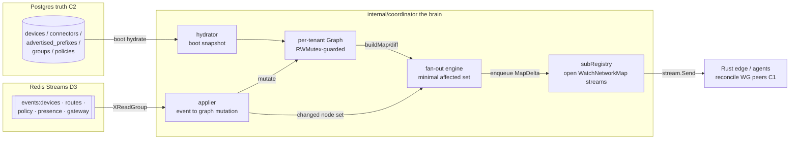
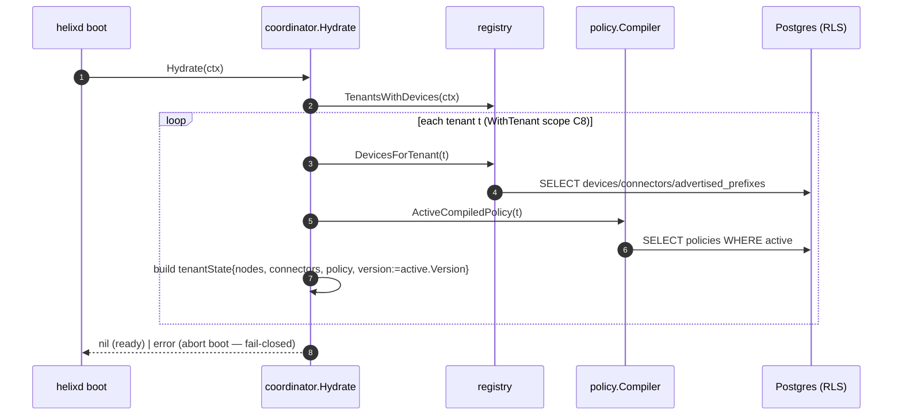
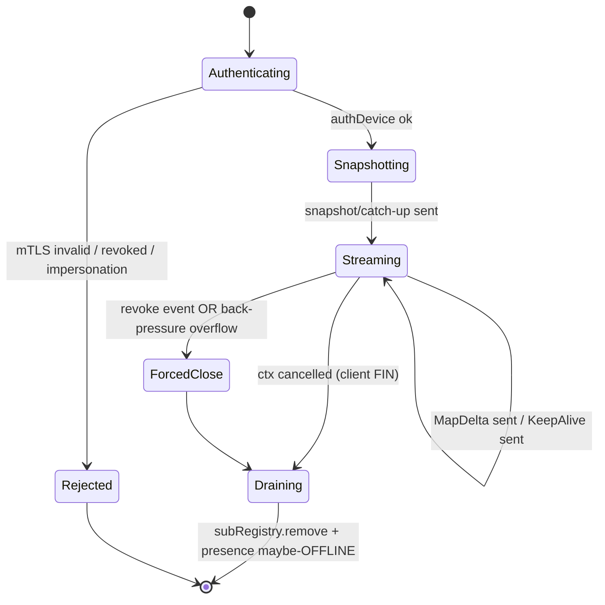

# coordinator service (the brain)

**Revision:** 1
**Last modified:** 2026-06-25T00:00:00Z

> Master technical specification — Volume 3 (Control Plane, Go), document `svc-coordinator`.
> Scope: the **`internal/coordinator`** package — HelixVPN's brain. It holds a per-tenant
> in-memory topology graph (hydrated from Postgres on boot, kept fresh by events), owns every
> open `WatchNetworkMap` stream, and on each event computes the **minimal affected agent set**
> and pushes a `MapDelta` to exactly those agents — convergence p99 < 1 s.
> This document *deepens* the coordinator part of [02_CP §6] to nano-detail and is
> implementation-ready. It is a SPEC (describe the implementation; do not build the product).
> Evidence cited inline by id: [02_CP §N] (pass-1 control-plane spec
> `final/02-control-plane.md`), [04_P1 §N] (`HelixVPN-Phase1-MVP.md`),
> [04_ARCH §N] (`HelixVPN-Architecture-Refined.md`), [research-go_cp §N]
> (`kb/research-go_cp.md`), [SYNTHESIS §N]. Unproven facts are marked `UNVERIFIED` per §11.4.6.

---

## 0. What this package owns, and what it does NOT

The coordinator is the **only** stateful-in-RAM, stateless-on-disk module. It is the runtime
projection of Postgres truth + the live event stream into per-agent network maps.

| It OWNS | It does NOT own |
|---|---|
| The per-tenant in-memory `Graph` (devices, connectors, prefixes, groups, compiled policy, presence). | Any durable table. R2: `coordinator` MUST NOT create/migrate a Postgres table [02_CP §1.2-R2, 04_P1 §4]. |
| The registry of open `WatchNetworkMap` streams (`subRegistry`). | Identity/enrollment (owned by `identity`), IPAM, PKI issuance — read through their interfaces [02_CP §1.3]. |
| The fan-out engine: event → minimal affected set → `MapDelta` enqueue → `stream.Send`. | Policy *compilation* (owned by `policy`; coordinator consumes `CompiledPolicy`) [02_CP §7]. |
| The monotonic per-tenant **map version** counter. | The event *bus transport* (owned by `events`; coordinator is a consumer) [02_CP §5]. |
| The `helix_reconcile_seconds` SLO histogram + back-pressure. | The Rust data path (edge reconciles WG peers from the delta — doc 01) [C1]. |

Governing invariants inherited verbatim from [02_CP §0.1]: **C1** Go never in the packet path
(fail-static); **C2** Postgres = truth, Redis = ephemeral; **C4** default-deny need-to-know
(a node only ever learns peers a compiled rule grants); **C5** push-don't-poll, snapshot-then-deltas,
p99 < 1 s; **C7** package boundary == future service boundary; **C8** RLS at the DB. The
coordinator is the concrete embodiment of **C4 + C5**.

The proto package is **`helix.coordinator.v1`** (unified across the document set); generated Go
import alias `coordinatorv1` [02_CP §4 — note: the §4 `.proto` `option go_package` path retains
the historical `helix/coordinator/v1` directory but the wire `package` is `helix.coordinator.v1`; this
document uses the package name as canonical].

---

## 1. The in-memory topology graph

### 1.1 Position in the system



### 1.2 Graph data structures (Go, nano-detail)

The graph is per-tenant. The coordinator holds a top-level `map[TenantID]*tenantState`, each
`tenantState` independently locked so one tenant's churn never blocks another (per-tenant
sharding is the concurrency unit) [04_P1 §4].

```go
// internal/coordinator/graph.go
package coordinator

import (
	"net/netip"
	"sync"
	"time"

	"github.com/google/uuid"
)

type (
	TenantID = uuid.UUID
	DeviceID = uuid.UUID
)

// DeviceKind mirrors the DB enum device_kind and the proto enum DeviceKind [02_CP §2.2/§4].
type DeviceKind uint8

const (
	KindUnspecified DeviceKind = iota
	KindClient
	KindConnector
)

// PresenceState is the coordinator's view of an agent's liveness (Redis-fed, ephemeral C2).
type PresenceState uint8

const (
	PresenceUnknown PresenceState = iota // never seen since boot
	PresenceOnline                       // an open stream OR a fresh heartbeat
	PresenceOffline                      // stream closed AND heartbeat TTL expired
)

// node is one device (client or connector) in the graph.
type node struct {
	ID         DeviceID
	Kind       DeviceKind
	WGPubKey   [32]byte // Curve25519 public key only (C6: private never registered)
	OverlayIP  netip.Addr
	OS         string
	Presence   PresenceState
	LastRTTMS  uint32     // from ReportStatus; health only, NOT traffic (C3)
	LastSeen   time.Time  // coarse; refreshed by heartbeat, not per-packet (C3)
	Revoked    bool       // belt-and-suspenders mirror of devices.revoked_at
	siteID     uint32     // connectors only: 4via6 site id (D4); 0 for clients
}

// connectorAdv holds a connector's advertised reachable CIDRs.
type connectorAdv struct {
	connectorID DeviceID
	prefixes    []netip.Prefix // from advertised_prefixes WHERE enabled
}

// tenantState is the per-tenant graph + version + the policy projection.
type tenantState struct {
	mu sync.RWMutex

	tenantID TenantID
	version  uint64 // monotonic map version; bumped on every accepted mutation (C5)

	nodes      map[DeviceID]*node
	connectors map[DeviceID]*connectorAdv     // subset of nodes with kind=connector
	gateway    GatewayInfo                    // current gateway endpoint for this tenant
	dns        DnsConfig                      // tenant DNS config
	transport  TransportPolicy                // escalation ladder [02_CP §4]

	// compiled policy projection — the need-to-know truth (C4). Replaced wholesale on
	// policy.compiled; never mutated field-by-field (compilation is pure+versioned §7 [02_CP]).
	policy *CompiledPolicy

	// versionedDeltas is a bounded ring of recent deltas keyed by the version they produced,
	// enabling cheap known_version reconnect catch-up (§3.2). Capacity DELTA_RING_CAP (§6.4).
	versionedDeltas *deltaRing
}

// GatewayInfo / DnsConfig / TransportPolicy mirror the proto messages 1:1 [02_CP §4].
type GatewayInfo struct {
	Endpoint  string
	WGPubKey  [32]byte
	MasqueSNI string
}
type DnsConfig struct {
	Resolvers []string
	Search    []string
}
type TransportPolicy struct {
	Order             []string // e.g. ["plain-udp","lwo","masque-h3"]
	AllowUserOverride bool
}

// CompiledPolicy is produced by internal/policy.Compiler.Compile and consumed read-only here
// [02_CP §1.3/§7]. The coordinator NEVER recomputes it; it diffs successive versions.
// Canonical definition (full field set) is owned by svc-policy.md §3 — this is the
// same struct, reproduced read-only. Do NOT let the field set drift from svc-policy.md.
type CompiledPolicy struct {
	Version    int64
	SpecHash   [32]byte                                 // sha256 of canonical spec (audit/dedup)
	VisibleTo  map[DeviceID]map[DeviceID]struct{}       // need-to-know peer set (C4)
	AllowedIPs map[DeviceID]map[DeviceID][]netip.Prefix // coarse WG AllowedIPs (ARTIFACT 1b)
	Verdicts   map[DeviceID]map[DeviceID][]PortRule     // fine port-level map (ARTIFACT 2; edge-enforced)
	Via6       map[DeviceID]map[DeviceID][]Via6Route    // 4via6 mappings (D4)
	ExitNodes  map[DeviceID]struct{}
}
type Via6Route struct {
	IPv4CIDR   netip.Prefix
	Via6Prefix netip.Prefix
}
```

> **Architectural note (§11.4.6):** `CompiledPolicy` carries the full field set above (canonical
> in `svc-policy.md §3`), but the coordinator's `buildMap` only ships coarse `AllowedIPs` + `Via6`
> over the wire — the proto `Peer` carries `allowed_ips` + `via6` but **not** port verdicts
> [02_CP §4 `Peer`]. The fine `Verdicts` map is enforced at the **edge** (nftables/eBPF, doc 01);
> whether it reaches the edge via a *separate* coordinator stream field or out-of-band is a
> doc-01/doc-03
> decision, NOT resolved here — marked pending, not fabricated.

### 1.3 Coordinator top-level type & lifecycle

```go
// internal/coordinator/coordinator.go
type Coordinator struct {
	mu      sync.RWMutex
	tenants map[TenantID]*tenantState

	registry registry.Registry // §1.3 [02_CP]; boot hydrate + presence reads
	policy   policy.Compiler   // read CompiledPolicy
	bus      events.Bus        // consume events (§4)
	subs     *subRegistry      // open streams (§3)
	metrics  *metrics          // helix_reconcile_seconds etc. (§7)
	clock    func() time.Time  // injectable for deterministic tests (§8)

	hostID string // consumer name for XReadGroup/XAutoClaim (§4) [research-go_cp §5]
}

// Boot lifecycle: NewCoordinator → Hydrate(ctx) → Run(ctx) [04_P1 §4].
func NewCoordinator(deps Deps) *Coordinator { /* wire deps; clock=time.Now */ }

// Hydrate rebuilds every tenant graph from Postgres truth BEFORE consuming any event, so the
// graph is a faithful projection and the first delta is computed against a correct baseline (C2).
func (c *Coordinator) Hydrate(ctx context.Context) error

// Run starts the event-consumer loop (§4) + the XAutoClaim DLQ sweeper + the presence-TTL reaper.
// It blocks until ctx is cancelled; returns ctx.Err(). Idempotent reactions make replay safe.
func (c *Coordinator) Run(ctx context.Context) error
```

### 1.4 Hydration (boot) — exact sequence



Rules: (1) hydration runs inside `store.WithTenant` per tenant (RLS floor, C8) [02_CP §2.3];
(2) the initial `version` for a tenant is the **active policy version** — so a reconnecting agent's
`known_version` is comparable across coordinator restarts (the version namespace is the
policy-version namespace, not a process-local counter — this makes restarts transparent to agents,
§3.2); (3) if `ActiveCompiledPolicy` returns none, the tenant graph is built default-deny (every
node sees zero peers, C4) — never fail-open; (4) a hydration error for ANY tenant aborts boot
(fail-closed, §11.4.6 — never serve a partially-true graph).

---

## 2. Map computation (per node)

`buildMap(node)` and `buildDelta(old, new)` are pure functions of `(graph, policy)` — given the
same graph + policy version they are deterministic (a property test asserts this, §8) [02_CP §6.2].

### 2.1 buildMap — full snapshot for one node

```go
// internal/coordinator/build.go  (caller holds ts.mu.RLock)
func (ts *tenantState) buildMap(self *node) *coordinatorv1.NetworkMap {
	reachable := ts.policy.VisibleTo[self.ID]            // need-to-know filter (C4)
	peers := make([]*coordinatorv1.Peer, 0, len(reachable))
	for pid := range reachable {
		p := ts.nodes[pid]
		if p == nil || p.Revoked {
			continue                                       // never advertise a revoked/absent peer
		}
		peers = append(peers, &coordinatorv1.Peer{
			DeviceId:    p.ID.String(),
			WgPubkey:    p.WGPubKey[:],
			AllowedIps:  cidrsToStrings(ts.policy.AllowedIPs[self.ID][pid]), // compiled CIDRs (C4)
			Endpoint:    ts.relayEndpoint(p),               // via gateway in MVP (hub-and-spoke)
			IsConnector: p.Kind == KindConnector,
			Via6:        via6ToProto(ts.policy.Via6[self.ID][pid]), // 4via6 (D4)
		})
	}
	sortPeersByID(peers)                                   // STABLE order ⇒ deterministic snapshot (§8)
	return &coordinatorv1.NetworkMap{
		Self:      &coordinatorv1.Node{DeviceId: self.ID.String(), OverlayIp: self.OverlayIP.String()},
		Gateway:   ts.gateway.proto(),
		Peers:     peers,
		Dns:       ts.dns.proto(),
		Transport: ts.transport.proto(),
	}
}
```

`relayEndpoint` always returns the gateway relay endpoint in the MVP (hub-and-spoke; direct P2P is
Phase 2 — `Peer.endpoint` gains NAT-traversal candidates without reshaping) [02_CP §6.2/§14].

### 2.2 buildDelta — minimal diff between two graph states for one node

The delta is computed against the node's **last-sent map** (the coordinator tracks per-stream
`lastVersion`; for a fresh recompute it diffs the old vs new peer sets). The diff is by `DeviceID`:

```go
// returns nil if the node's view is byte-unchanged (NO delta sent — quiet for unaffected nodes)
func diffPeers(old, new map[DeviceID]*coordinatorv1.Peer) *coordinatorv1.MapDelta {
	var d coordinatorv1.MapDelta
	for id, np := range new {
		if op, ok := old[id]; !ok || !proto.Equal(op, np) {
			d.UpsertPeers = append(d.UpsertPeers, np) // added or changed
		}
	}
	for id := range old {
		if _, ok := new[id]; !ok {
			d.RemovePeerIds = append(d.RemovePeerIds, id.String()) // peer no longer visible (C4)
		}
	}
	if len(d.UpsertPeers) == 0 && len(d.RemovePeerIds) == 0 &&
		d.Transport == nil && d.Dns == nil {
		return nil // unchanged — this is how the minimal-affected-set stays minimal (§5)
	}
	sortUpserts(&d) // deterministic wire order (§8)
	return &d
}
```

Edge rule: `transport`/`dns` fields are populated in the delta **only if changed** [02_CP §4
`MapDelta`]. A node whose `diffPeers` returns `nil` AND whose transport/dns are unchanged receives
**no** `MapUpdate` for that event (it stays quiet) — this is the literal mechanism of "never
broadcast a full resync on a small change" [02_CP §6.4].

---

## 3. Open-stream registry & the WatchNetworkMap loop

### 3.1 subRegistry — the open-stream index

```go
// internal/coordinator/subs.go
type subscription struct {
	tenantID    TenantID
	deviceID    DeviceID
	lastVersion uint64                          // last version this stream has converged to
	ch          chan *coordinatorv1.MapUpdate   // bounded send queue (cap SEND_QUEUE_CAP, §6.4)
	cancel      context.CancelFunc              // closes the stream on revoke/back-pressure
	mu          sync.Mutex
}

type subRegistry struct {
	mu sync.RWMutex
	// tenant -> device -> set of subs (a device MAY hold >1 stream: reconnect overlap, multi-NIC)
	byTenant map[TenantID]map[DeviceID]map[*subscription]struct{}
}

func (r *subRegistry) add(s *subscription)                          // registers + flips presence online
func (r *subRegistry) remove(s *subscription)                       // deregisters + maybe-offline
func (r *subRegistry) forTenant(t TenantID) []*subscription          // fan-out enumeration
func (r *subRegistry) forDevice(t TenantID, d DeviceID) []*subscription
```

A single device may legitimately hold more than one stream momentarily (a reconnect lands before
the old stream's TCP FIN; a multi-homed device). Fan-out enqueues to **every** matching
subscription; presence flips offline only when the device's **last** subscription closes AND its
heartbeat TTL has lapsed (§4.4).

### 3.2 WatchNetworkMap — the streaming handler (server side)

```go
// internal/coordinator/watch.go
func (c *Coordinator) WatchNetworkMap(
	ctx context.Context,
	req *connect.Request[coordinatorv1.WatchRequest],
	stream *connect.ServerStream[coordinatorv1.MapUpdate],
) error {
	dev, err := authDevice(ctx) // mTLS device cert → device_certs → devices (§8.2 [02_CP])
	if err != nil {
		return connect.NewError(connect.CodeUnauthenticated, err)        // E-AUTH (§4 err taxonomy)
	}
	if dev.Revoked {
		return connect.NewError(connect.CodePermissionDenied, errRevoked) // E-REVOKED
	}
	if req.Msg.DeviceId != "" && req.Msg.DeviceId != dev.ID.String() {
		return connect.NewError(connect.CodePermissionDenied, errDeviceMismatch) // E-IMPERSONATE
	}

	ts := c.tenant(dev.TenantID)
	if ts == nil {
		return connect.NewError(connect.CodeFailedPrecondition, errNoTenant)    // E-NOTENANT
	}

	sctx, cancel := context.WithCancel(ctx)
	sub := newSubscription(dev.TenantID, dev.ID, cancel)
	c.subs.add(sub)        // registers + presence ONLINE + publishes device.online (§4.4)
	defer func() {
		c.subs.remove(sub) // deregister + maybe presence OFFLINE + device.offline
		cancel()
	}()

	// (1) snapshot OR resume-from-known_version (cheap reconnect, C5) [02_CP §6.3, 04_P1 §3]
	ts.mu.RLock()
	cur := ts.version
	switch {
	case req.Msg.KnownVersion == 0 || req.Msg.KnownVersion > cur:
		snap := ts.buildMap(ts.nodes[dev.ID])
		ts.mu.RUnlock()
		if err := stream.Send(&coordinatorv1.MapUpdate{
			Version: cur, Body: &coordinatorv1.MapUpdate_Snapshot{Snapshot: snap},
		}); err != nil {
			return err // E-STREAM-SEND
		}
	default: // 0 < known_version <= cur : replay catch-up deltas if the ring still has them
		deltas, complete := ts.versionedDeltas.since(req.Msg.KnownVersion)
		snap := (*coordinatorv1.NetworkMap)(nil)
		if !complete {
			snap = ts.buildMap(ts.nodes[dev.ID]) // ring evicted the gap → fall back to snapshot
		}
		ts.mu.RUnlock()
		if snap != nil {
			if err := stream.Send(snapshotUpdate(cur, snap)); err != nil { return err }
		} else {
			for _, d := range deltas {
				if err := stream.Send(d); err != nil { return err }
			}
		}
	}
	sub.setLastVersion(cur)

	// (2) live delta loop — events via sub.ch, keepalive on a ticker (C5)
	ka := time.NewTicker(KEEPALIVE_INTERVAL) // 20 s [02_CP §6.3]
	defer ka.Stop()
	for {
		select {
		case <-sctx.Done():
			return sctx.Err()                                  // client disconnect OR forced-close
		case up, ok := <-sub.ch:
			if !ok {
				return connect.NewError(connect.CodeAborted, errBackpressure) // E-BACKPRESSURE
			}
			if err := stream.Send(up); err != nil { return err }
			sub.setLastVersion(up.Version)
		case <-ka.C:
			if err := stream.Send(keepAlive()); err != nil { return err }     // proves liveness
		}
	}
}
```

**Resume semantics (the `known_version` contract, C5):**
- `known_version == 0` ⇒ full snapshot (first connect).
- `known_version > current` ⇒ the client claims a version the server never issued (a stale/forked
  client, or a coordinator that lost+rebuilt state) ⇒ full snapshot (safe re-baseline).
- `0 < known_version <= current` ⇒ replay the `deltaRing` entries `(known_version, current]`; if the
  ring evicted any entry in that span (gap), fall back to a full snapshot. This bounds reconnect
  cost while never serving an incomplete view.

### 3.3 Stream lifecycle state machine



---

## 4. Event consumption & the reaction table (event → recompute)

The coordinator is a durable consumer-group member on the §5 [02_CP] Redis Streams. The consumer
loop is **XAutoClaim-stalled-first, then XReadGroup-new** [research-go_cp §5].

### 4.1 Consumer loop (Go)

```go
// internal/coordinator/consume.go
func (c *Coordinator) consume(ctx context.Context) error {
	streams := []string{"events:devices", "events:routes", "events:policy",
		"events:presence", "events:gateway"}
	for {
		if ctx.Err() != nil { return ctx.Err() }
		// 1. reclaim stalled PEL entries from crashed peers (no-work-loss §11.4.147)
		for _, s := range streams {
			claimed, _, _ := c.bus.AutoClaim(ctx, s, "coordinator", c.hostID,
				EVENT_CLAIM_MIN_IDLE /*30s*/, 64)
			for _, env := range claimed { c.handleEnvelope(ctx, s, env) }
		}
		// 2. read new entries (blocking)
		batch, err := c.bus.ReadGroup(ctx, "coordinator", c.hostID, streams, 64, 5*time.Second)
		if err != nil { continue } // transient; loop reattempts (§11.4.6 no silent give-up)
		for _, env := range batch { c.handleEnvelope(ctx, env.Stream, env) }
	}
}

func (c *Coordinator) handleEnvelope(ctx context.Context, stream string, env events.Envelope) {
	t0 := c.clock()
	defer func() {
		if r := recover(); r != nil { c.metrics.applyPanics.Inc(); /* env stays in PEL → reclaimed */ return }
	}()
	changed, err := c.apply(env)              // mutate graph, return affected node set (§4.3)
	if err != nil {
		if env.DeliveryCount >= EVENT_RETRY_CAP /*5*/ {
			c.bus.DeadLetter(ctx, stream, env)  // route to events:<s>:dlq + ACK (§5.4 [02_CP])
			c.metrics.dlqTotal.Inc()
		}
		return // leave un-ACKed → XAutoClaim retries (at-least-once)
	}
	c.fanout(env.TenantID, changed)           // enqueue MapDelta to minimal set (§5)
	c.bus.Ack(ctx, stream, "coordinator", env.ID)
	c.metrics.reconcile.Observe(c.clock().Sub(t0).Seconds()) // the < 1 s SLO timer (§7)
}
```

**Idempotency (load-bearing):** every reaction recomputes the affected nodes' maps from *current*
graph state, so a replayed/duplicate event is harmless [02_CP §5.4]. `apply` MUST be a pure
graph-state transition — never an increment that double-applies on redelivery.

### 4.2 Reaction table (event → graph mutation → recompute scope)

Concrete and exhaustive for the MVP event taxonomy [02_CP §5.3]. "Recompute scope" is the set of
nodes whose map MIGHT change — the fan-out then diffs each and sends only real deltas (§2.2).

| Event `type` | Payload | Graph mutation | Recompute scope (minimal affected set) |
|---|---|---|---|
| `device.enrolled` | `{device_id,kind,overlay_ip,wg_pubkey}` | add `node`; if connector, add `connectorAdv` | nodes whose `VisibleTo` includes the new device (per active policy) — usually a small set |
| `device.online` | `{device_id}` | set `Presence=Online`, refresh `LastSeen` | nodes that have this device as a peer (relay availability may change `endpoint`) |
| `device.offline` | `{device_id}` | set `Presence=Offline` | same peer set as `device.online` |
| `device.revoked` | `{device_id}` | set `node.Revoked=true`, drop from `nodes`/`connectors` | every node whose last map listed it ⇒ `remove_peer_ids` delta (C4) + force-close that device's own streams (§4.5) |
| `connector.attached` | `{device_id,site}` | set `node.siteID`, register `connectorAdv` | nodes whose policy grants the connector's CIDRs |
| `connector.prefixes.changed` | `{connector_id,cidrs[]}` | replace `connectorAdv.prefixes` | nodes whose policy `dst` resolves to this connector ONLY |
| `route.conflict.detected` | `{cidr,connector_ids[]}` | annotate (no map change) | none — surfaced to Console via `events:gateway`→WS (§7.3 [02_CP]); coordinator does not push |
| `policy.compiled` | `{version}` | load new `CompiledPolicy`, replace `ts.policy`, `version:=v` | tenant-wide: diff old vs new `VisibleTo`/`AllowedIPs`/`Via6` ⇒ only nodes whose projection actually differs get a delta (§4.3) |
| `gateway.failover` | `{from,to}` | replace `ts.gateway` | every node in the tenant (gateway endpoint is in every map) — `transport`/gateway fields in delta |

> `policy.updated` (vs `policy.compiled`) is consumed by the `policy` module to trigger compile,
> NOT by the coordinator [02_CP §5.3]; the coordinator reacts only to `policy.compiled` (the
> compiled artifact is ready). Listing it here would be a fabricated reaction — omitted by design.

### 4.3 apply() — policy.compiled is the only tenant-wide recompute

```go
// the heaviest reaction; all others touch O(small) nodes. Diff old vs new projection so a
// tenant-wide recompile still produces a MINIMAL affected set (§5) [02_CP §6.4].
func (c *Coordinator) applyPolicyCompiled(env events.Envelope) (changed map[DeviceID]struct{}, err error) {
	v := env.Payload["version"].(int64)
	fresh, err := c.policy.CompiledAt(env.TenantID, v) // read-only [02_CP §1.3]
	if err != nil { return nil, err }                  // → retry/DLQ (§4.1)
	ts := c.tenant(env.TenantID)
	ts.mu.Lock()
	defer ts.mu.Unlock()
	if v <= int64(ts.version) { return nil, nil }      // stale/replayed compile — idempotent no-op
	old := ts.policy
	ts.policy = fresh
	ts.version = uint64(v)
	changed = projectionDiff(old, fresh)               // nodes whose VisibleTo/AllowedIPs/Via6 differ
	ts.versionedDeltas.recordBoundary(uint64(v))       // ring boundary for known_version resume
	return changed, nil
}
```

### 4.4 Presence model (Redis-fed, ephemeral C2)

Presence is the union of two signals: (a) **an open `WatchNetworkMap` stream** (authoritative
online), and (b) **a heartbeat** (`ReportStatus`/`events:presence`) with a TTL. A node is `Online`
if it has ≥1 open stream OR a non-expired heartbeat; `Offline` once both lapse. A background
**presence reaper** scans heartbeat TTLs every `PRESENCE_REAP_INTERVAL` and emits `device.offline`
for expired-and-streamless nodes. Losing Redis loses presence but **no durable state** (C2) — on
Redis recovery, open streams re-assert online; the graph itself was never in Redis.

### 4.5 Revoke fast-path (< 1 s, the security-critical reaction)

`device.revoked` is the one reaction with a dual action: (1) the standard fan-out
(`remove_peer_ids` delta to every node that saw the device — C4); (2) `subs.forDevice(t, revoked)`
→ `cancel()` each, **force-closing the revoked device's own streams** so it stops receiving maps
immediately. The edge separately removes the kernel WG peer [02_CP §9.3]. Revocation latency target
== convergence SLO (§7). This is `authDevice`-redundant defense in depth (the stream handler also
checks `dev.Revoked` at open time, §3.2).

---

## 5. Fan-out: minimal affected set → MapDelta

```go
// internal/coordinator/fanout.go
func (c *Coordinator) fanout(t TenantID, changed map[DeviceID]struct{}) {
	if len(changed) == 0 { return }                    // nothing affected → zero sends (§2.2)
	ts := c.tenant(t)
	for did := range changed {
		for _, sub := range c.subs.forDevice(t, did) {
			ts.mu.RLock()
			newMap := ts.buildMap(ts.nodes[did])
			ver := ts.version
			ts.mu.RUnlock()
			delta := diffAgainstLastSent(sub, newMap)  // nil if this stream's view is unchanged
			if delta == nil { continue }
			up := &coordinatorv1.MapUpdate{Version: ver,
				Body: &coordinatorv1.MapUpdate_Delta{Delta: delta}}
			select {
			case sub.ch <- up:                          // enqueued (non-blocking)
			default:                                     // queue FULL → back-pressure (§6.4)
				c.metrics.backpressureDrops.Inc()
				sub.cancel()                             // drop slow consumer → reconnect-with-snapshot
			}
		}
	}
	ts.recordDeltaForResume(t)                          // append to deltaRing for known_version (§3.2)
}
```

**Back-pressure (the 24 h-soak memory SLO, §7):** each stream's `sub.ch` is bounded
(`SEND_QUEUE_CAP`, §6.4). A consumer too slow to drain its queue is **dropped** (`cancel()`), not
buffered unboundedly — it reconnects and gets a fresh snapshot. This converts "slow consumer" from
a memory leak into a bounded reconnect (back-pressure, not growth) [02_CP §6.4].

---

## 6. Concurrency model, ordering, and bounds

### 6.1 Lock hierarchy (deadlock-free by construction)

1. `Coordinator.mu` (RWMutex) — guards the `tenants` map only; held briefly to fetch a `*tenantState`.
2. `tenantState.mu` (RWMutex) — guards one tenant's graph + version + policy + deltaRing.
3. `subRegistry.mu` (RWMutex) — guards the open-stream index.
4. `subscription.mu` — guards `lastVersion`.

**Ordering rule:** never acquire a higher-numbered lock then a lower one. The event applier holds
`tenantState.mu` (write) but enqueues to `sub.ch` **without** holding it (the channel send is
non-blocking, §5). The stream handler holds only `tenantState.mu.RLock` for snapshot reads. No path
holds two `tenantState` locks (tenants are independent). This is the §11.4 concurrency discipline
made mechanical.

### 6.2 Event ordering guarantee

Within one tenant, events are applied in **Redis-Stream-ID order per stream** (XReadGroup returns
ordered IDs). Cross-stream ordering (e.g. `events:devices` vs `events:policy`) is NOT
totally ordered — but reactions are idempotent and recompute from current state, so a
`policy.compiled` that lands before its `device.enrolled` simply produces a smaller delta now and
the correct one when the device event applies (eventual convergence, bounded by the SLO). **UNVERIFIED
(§11.4.6):** strict cross-stream causal ordering is NOT guaranteed by Redis Streams and is not
required for correctness here; if a future invariant needs it, a single merged stream or a vector
clock is the Phase-2 mechanism — not asserted as present.

### 6.3 Version monotonicity

`tenantState.version` is bumped only under `tenantState.mu.Lock`, and only forward. For
`policy.compiled` the version IS the policy version (§4.3); for non-policy mutations
(`device.online`, `prefixes.changed`) the version is incremented by 1 so every wire `MapUpdate`
carries a strictly-increasing `version` an agent can use for `known_version` resume. **UNVERIFIED:**
whether non-policy mutations should share the policy-version namespace or use a separate
monotonic counter is a doc-03 wire-contract decision; this spec uses a single monotonic
`tenantState.version` (incremented for any accepted mutation) as the simplest correct choice and
flags the alternative.

### 6.4 Tunable bounds (named constants — calibrated on the project's own load, §11.4.6)

| Constant | Default | Meaning |
|---|---|---|
| `KEEPALIVE_INTERVAL` | 20 s | keepalive ticker on each stream [02_CP §6.3] |
| `SEND_QUEUE_CAP` | 256 | per-stream bounded delta queue; overflow ⇒ drop+reconnect (§5) |
| `DELTA_RING_CAP` | 1024 | per-tenant recent-delta ring for `known_version` resume (§3.2) |
| `EVENT_CLAIM_MIN_IDLE` | 30 s | XAutoClaim reclaim threshold [research-go_cp §5] |
| `EVENT_RETRY_CAP` | 5 | per-event delivery-count ceiling before DLQ [02_CP §5.4] |
| `PRESENCE_REAP_INTERVAL` | 10 s | heartbeat-TTL reaper cadence (§4.4) |
| `HEARTBEAT_TTL` | 45 s | online-via-heartbeat expiry (§4.4) |

> Defaults are starting points; the SLO suite (§7) re-calibrates them on captured load —
> hardcoding from literature without measuring is the §11.4.6 anti-pattern this note forbids.

---

## 7. The < 1 s convergence SLO & metrics

### 7.1 The reconciliation path the SLO measures

```mermaid
sequenceDiagram
  autonumber
  participant Pol as policy
  participant Bus as Redis Streams
  participant Coord as coordinator
  participant Edge as Rust edge
  Pol->>Bus: XADD events:policy {policy.compiled, v}
  Note over Coord: t0 = event receive (handleEnvelope)
  Bus-->>Coord: XReadGroup delivers
  Coord->>Coord: apply → projectionDiff → minimal changed set
  loop each affected open stream
    Coord->>Edge: stream.Send(MapDelta)
  end
  Note over Coord: t1 = stream.Send returns ; observe(t1-t0)
  Edge-->>Edge: reconcile WG peers + verdict map (doc 01)
  Note over Pol,Edge: SLO: p99(t1-t0) < 1 s, ZERO restarts (C5)
```

### 7.2 Metrics (Prometheus, owned by `telemetry`, fed by coordinator) [02_CP §10.2]

```go
helix_reconcile_seconds      histogram // event-receive → stream.Send; p99 < 1 s is the gate
helix_open_streams           gauge{tenant}
helix_fanout_affected_nodes  histogram // size of the minimal affected set per event (should be small)
helix_backpressure_drops_total counter // slow-consumer drops (§5)
helix_events_dlq_total       counter   // poison events routed to DLQ (§4.1)
helix_presence_online        gauge{tenant}
helix_graph_nodes            gauge{tenant}
process_resident_memory_bytes gauge    // 24 h-soak slope ≈ 0 (no leak)
```

### 7.3 SLO acceptance numbers [02_CP §10.2, 04_P1 §10]

| Metric | Target | Measurement |
|---|---|---|
| event → delta-on-wire | **p99 < 1 s** | `helix_reconcile_seconds` p99 |
| device revoke → stream force-closed | **< 1 s** | revoke-event → `sub.cancel()` timer (§4.5) |
| coordinator memory @ 10k streams | bounded, slope≈0 over 24 h | `process_resident_memory_bytes` |
| minimal-affected-set size (small change) | ≪ tenant size | `helix_fanout_affected_nodes` |
| catch-up reconnect (within ring) | no full snapshot | ring-hit ratio metric |

---

## 8. Error taxonomy & edge cases

### 8.1 Error taxonomy (Connect codes + internal)

| ID | Connect code | Cause | Handling |
|---|---|---|---|
| E-AUTH | `Unauthenticated` | mTLS cert invalid/expired | reject stream; agent re-enrolls/renews cert (§9 [02_CP]) |
| E-REVOKED | `PermissionDenied` | device revoked | reject at open; force-close if mid-stream (§4.5) |
| E-IMPERSONATE | `PermissionDenied` | `WatchRequest.device_id` ≠ cert identity | reject (anti-spoof) |
| E-NOTENANT | `FailedPrecondition` | tenant graph not hydrated | reject; client retries after boot |
| E-BACKPRESSURE | `Aborted` | send queue overflow (slow consumer) | close stream → client reconnect-with-snapshot (§5) |
| E-STREAM-SEND | (propagated) | transport write failed (client gone) | `subs.remove` + presence maybe-offline |
| E-APPLY-RETRY | n/a (internal) | transient graph-apply error | leave un-ACKed → XAutoClaim retry (§4.1) |
| E-APPLY-POISON | n/a (internal) | delivery-count ≥ cap | DLQ + alert; never spin (§4.1) |

A streaming response is always HTTP 200 even on error in Connect/gRPC — errors live in the trailer
[research-go_cp §2]; the handler returns a `*connect.Error` and the client reads the trailer status,
NOT the HTTP code.

### 8.2 Edge cases (each is a concrete test point, §9)

1. **Reconnect storm:** 10k agents reconnect simultaneously (gateway flap). Each sends a snapshot;
   bounded by `SEND_QUEUE_CAP` per stream + per-tenant `tenantState.mu.RLock` snapshot reads. No
   global lock is held during Send.
2. **Revoke-while-streaming:** revoke lands while the device's `WatchNetworkMap` is open ⇒ §4.5
   force-close within the SLO; the device's last map is purged from every peer.
3. **Stale `known_version` (> current):** client claims a future version (forked/rolled-back
   coordinator) ⇒ safe full snapshot (§3.2).
4. **Ring gap on resume:** `known_version` older than `DELTA_RING_CAP` retained ⇒ full snapshot, not
   a partial-and-wrong delta.
5. **Duplicate/replayed event (at-least-once):** idempotent `apply` recomputes from current state ⇒
   `diffPeers` returns `nil` ⇒ zero spurious sends (§4.1).
6. **Policy compile out-of-order (`v <= current`):** no-op (§4.3) — never regresses the graph.
7. **Empty/default-deny tenant:** node with no `VisibleTo` entries ⇒ snapshot has zero peers
   (C4), never fail-open.
8. **Connector advertising overlapping CIDR (`route.conflict.detected`):** coordinator does NOT
   push a delta; the conflict surfaces to Console; 4via6 site disambiguation resolves it (D4)
   [02_CP §7.3].
9. **Multi-stream device (reconnect overlap):** fan-out hits all subs; presence offline only on the
   last close (§3.1/§4.4).
10. **Coordinator restart mid-stream:** agents' streams break; on reconnect they resume by
    `known_version` against the rebuilt-from-Postgres graph (version namespace = policy version, so
    the version is meaningful across restarts, §1.4).

---

## 9. Test strategy (anti-bluff, §11.4.169 comprehensive test-type coverage)

Per §11.4.169 (mandatory comprehensive test-type coverage) every coordinator behaviour maps to ≥1
concrete test of the appropriate type, each producing captured evidence per §11.4.5/§11.4.69 — no
metadata-only PASS. Tests compose with §11.4.27 (no fakes beyond unit), §11.4.85 (stress + chaos),
§11.4.50 (determinism), §11.4.107 (liveness — here the "frame" is the delta-on-wire). Integration
infra (Postgres + Redis) is booted on-demand via `vasic-digital/containers` (§11.4.76), never
ad-hoc `docker run`.

| Test type (§11.4.169) | Concrete coordinator test point | Captured evidence |
|---|---|---|
| **Unit** | `buildMap`/`diffPeers` determinism: same `(graph,policy)` ⇒ byte-identical proto (`proto.Equal`), N=10 (§11.4.50). | golden proto fixtures + diff hashes |
| **Unit** | `projectionDiff` minimality: a 1-rule change touches only the granted nodes — assert `len(changed)` exact. | per-case affected-set assertions |
| **Unit** | `known_version` resume: ring-hit ⇒ deltas; ring-gap ⇒ snapshot; future-version ⇒ snapshot. | decision-table fixtures |
| **Integration** | enroll → advertise → policy.compiled → `WatchNetworkMap`: assert exact delta stream content + version monotonicity, real PG+Redis. | captured `MapUpdate` transcript |
| **Integration** | RLS floor: coordinator hydration as `helix_app` (FORCE RLS) cannot read tenant B (C8). | cross-tenant denial log |
| **E2E / full-automation** | full self-host slice: deny-unauthorized peer never appears in any node's snapshot (C4). | recorded peer-set per node |
| **Performance** | `helix_reconcile_seconds` p99 < 1 s @ 10k streams, 1 policy flip. | histogram capture (§7.3) |
| **Soak (stress)** | 24 h: N agents hold streams, policies flap; assert `process_resident_memory_bytes` slope ≈ 0 + SLO held (§11.4.85). | 24 h memory + p99 time-series |
| **Stress** | reconnect storm (10k simultaneous) — no deadlock, bounded queues (§8.2-1). | latency distribution + drop count |
| **Chaos** | kill a coordinator consumer mid-apply ⇒ PEL reclaim via XAutoClaim, zero lost events (§11.4.147). | before/after event-ID ledger |
| **Chaos** | drop Redis mid-stream ⇒ presence degrades, graph intact, recovers on reconnect (C2, §4.4). | recovery trace |
| **Security** | revoke-while-streaming forces close < 1 s; impersonation (`device_id`≠cert) rejected (§4.5/§8.1). | revoke-to-close timer + reject log |
| **Meta-test (§1.1)** | mutate `diffPeers` to always-emit-full-map ⇒ `helix_fanout_affected_nodes` minimality test FAILs; restore ⇒ passes. | paired RED/GREEN |
| **Meta-test (§1.1)** | mutate `buildMap` to skip the `VisibleTo` filter ⇒ C4 deny-unauthorized E2E FAILs (need-to-know guard). | paired RED/GREEN |

The §1.1 paired mutations are the anti-bluff floor: an analyzer (the test) that passes its own
golden-bad fixture is itself a bluff (§11.4.107(10)) — each coordinator gate ships a mutation that
MUST flip it RED.

---

## 10. Phase-2 forward seams (additive, not a rewrite) [02_CP §14, 04_P1 §12]

The coordinator's seams extend without reshaping: (a) `events.Bus` swaps Redis Streams → NATS
JetStream for multi-region fan-out (the consumer loop is bus-agnostic, §4.1) [02_CP §1.3-D3];
(b) `relayEndpoint` gains direct-P2P NAT-traversal candidates so `Peer.endpoint` stops always
relaying through the gateway [02_CP §6.2]; (c) coordinators become **stateless and horizontally
scalable** — the graph is rebuilt from Postgres + events on boot (R2 makes this true today), so K8s
replicas need no sticky state [02_CP §11.3]; (d) the `version` namespace + `deltaRing` already
support cross-restart resume, which generalises to cross-instance resume under a shared bus.
Phase 1 drew the seams (R1–R4, the `Bus`/`Compiler`/`Registry`/`PKI` interfaces) so Phase 2 is
additive.

---

### Sources

[02_CP] `docs/research/mvp/final/02-control-plane.md` — pass-1 control-plane spec (coordinator §6,
proto §4, events §5, policy §7, SLO §10, invariants §0.1). · [04_P1]
`docs/research/mvp/04_VPN_CLD/HelixVPN-Phase1-MVP.md` (coordinator, WatchNetworkMap, convergence,
SLOs). · [04_ARCH] `docs/research/mvp/04_VPN_CLD/HelixVPN-Architecture-Refined.md` §1–§7
(control/data separation, push-don't-poll, need-to-know, ULA/48+4via6, no-logging). ·
[research-go_cp] `scratchpad/kb/research-go_cp.md` (Connect-RPC server-streaming + trailer-error
semantics §2, RLS `SET LOCAL` §4, Redis Streams XAutoClaim/DLQ §5 — latest versions, accessed
2026-06-25). · [SYNTHESIS] `scratchpad/kb/SYNTHESIS.md` §§1–9 (stack floor, D3/D4 decisions,
ecosystem + constitution bindings).
