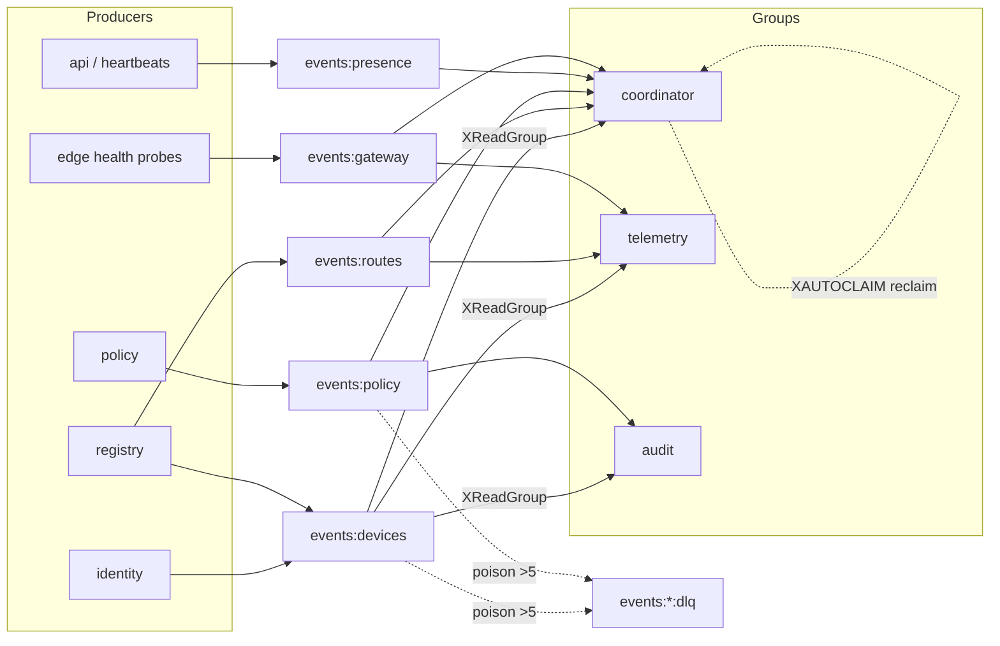
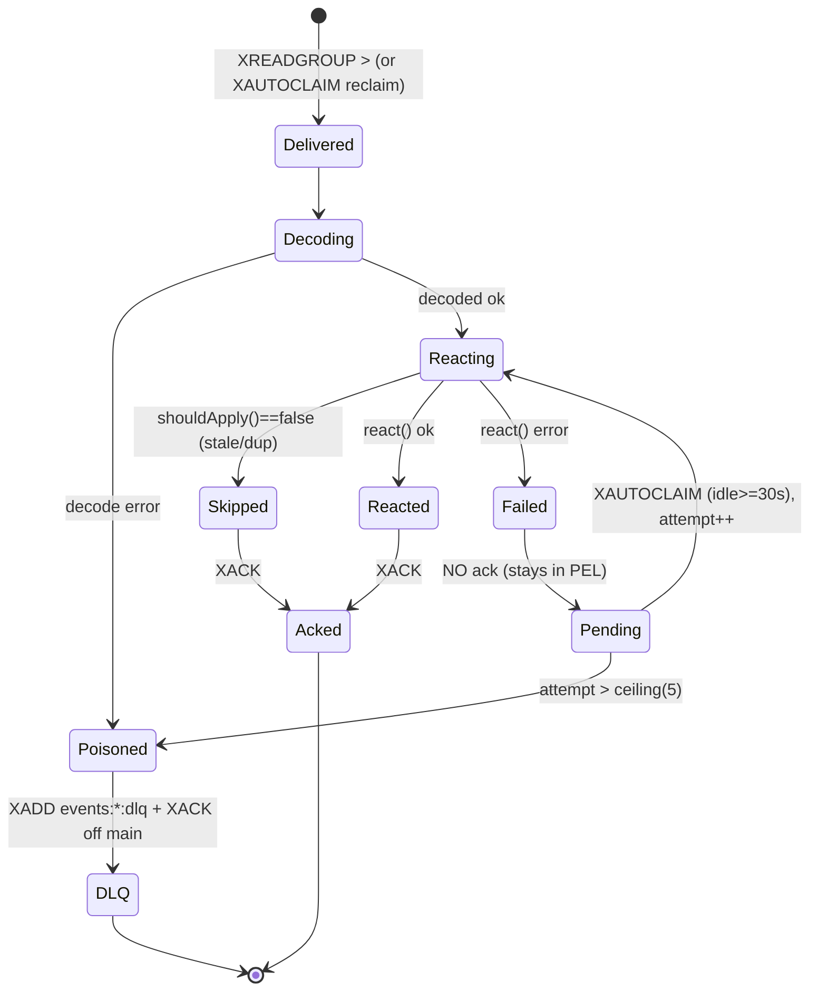
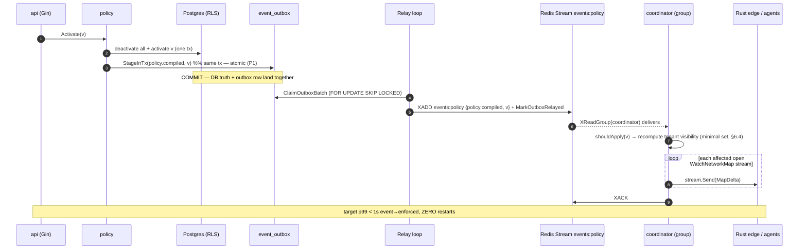
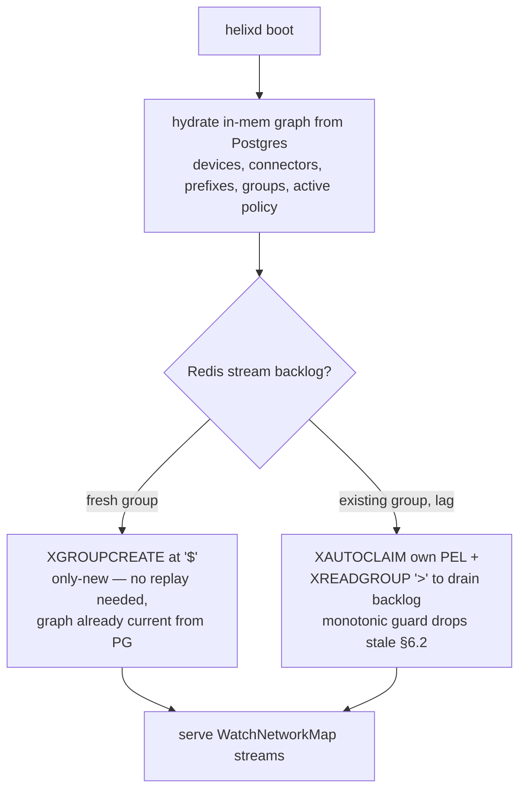

# events backbone (Redis Streams)

**Revision:** 1
**Last modified:** 2026-06-25T00:00:00Z

> Master technical specification — Volume 3, Control Plane (Go), nano-detail service spec.
> Deepens the **events backbone** introduced in [02-control-plane §5] (`internal/events`).
> This document owns the *byte-level and operational contract* of the event bus: the
> bus-agnostic `Envelope`, the five Redis Streams, the full event taxonomy → coordinator
> reactions, the `XReadGroup`/`XACK`/`XAUTOCLAIM` consumer + dead-letter machinery,
> at-least-once + idempotent-reaction discipline, the per-event authz rules, the edge
> cases, the **< 1 s convergence SLO**, and the Phase-2 NATS-JetStream swap behind the same
> `Bus` interface. This is a **SPEC** — it describes the implementation; it does not build it.
> Source evidence cited inline by id: [02_CP] (final/02-control-plane.md), [04_P1]
> (HelixVPN-Phase1-MVP.md), [04_ARCH §4] (HelixVPN-Architecture-Refined.md §4),
> [research-go_cp] (cited research, accessed 2026-06-25), [SYNTHESIS §N].
> Proto package is unified across the Volume-3 set: **`helix.coordinator.v1`**.

---

## 1. Position, scope, and governing invariants

### 1.1 What this service owns vs. what it does not

`internal/events` is the **only path by which a Postgres state mutation reaches the
coordinator** [02_CP R3]. It is a thin, durable, bus-agnostic message fabric. It owns:

- the `events.Bus` interface (the swap seam, D3) and its Redis Streams implementation;
- the `Envelope` wire shape `{id,type,tenant_id,ts,actor,payload,trace_id}` [02_CP §5.2];
- the five canonical streams + their consumer-group topology [02_CP §5.1];
- the at-least-once consume loop, `XACK` discipline, `XAUTOCLAIM` reclaim, and DLQ routing;
- the idempotency contract every consumer must honour;
- the publish-side transactional-outbox guarantee that couples a DB write to its event.

It does **not** own: the durable tables (those are `internal/store` — the bus carries no
truth, only change notifications [02_CP C2]); the topology graph or map-diffing (that is
`internal/coordinator` §6, which is *a consumer* of this bus); the agent wire protocol
(`Coordinator` proto §4 — the bus is internal east-west, never exposed to agents).

### 1.2 Governing invariants this service obeys (from [02_CP §0.1])

| # | Invariant | Consequence for the bus |
|---|---|---|
| C2 | Postgres = truth; **Redis is ephemeral**. Losing Redis loses no durable state. | A lost event is recoverable by **rehydrating the coordinator graph from Postgres** (§7.4). The bus is a fast-path, never the system of record. |
| C3 | No-logging by construction. | Event payloads carry **identity/topology/policy deltas only** — never src/dst IP pairs, ports-in-use, byte counts, flows. A §1.1 payload-lint mirrors the schema-lint [02_CP §2.4] (§9.4). |
| C4 | Default-deny, need-to-know. | Events carry a `tenant_id` and the coordinator filters fan-out by compiled policy; an event NEVER instructs delivery of a peer a node may not reach. |
| C5 | Push, don't poll; convergence **p99 < 1 s**. | The bus latency budget (event-publish → consumer-receive) is the largest single term in the SLO; §8 allots it ≤ 250 ms p99. |
| C7 | Package boundaries == service boundaries. | `events.Bus` is bus-agnostic so the Phase-2 NATS swap is a transport change, not a rewrite (§10). |

> **Decision D3 (restated, [02_CP §1.3, SYNTHESIS §3]).** Redis Streams for the MVP, NATS
> JetStream for Phase-2 scale. Redis is already mandated for presence [05_YBO], so the MVP
> reuses it with zero new operational dependency; the `Bus` interface is the seam.

---

## 2. The bus-agnostic contract

### 2.1 `events.Bus` interface (the swap seam)

```go
// internal/events/iface.go
//
// Bus is the bus-agnostic seam (D3). The MVP impl is Redis Streams (§4); the Phase-2 impl
// is NATS JetStream (§10). NOTHING above this interface knows which transport is live.
package events

import (
	"context"
	"time"

	"github.com/google/uuid"
)

// Stream is a typed stream name. The five canonical values are declared in §3.1.
type Stream string

// Bus is the publish/subscribe/ack contract. All methods are context-cancellable.
type Bus interface {
	// Publish appends env to stream and returns the transport-assigned message id
	// (Redis stream id "<ms>-<seq>"; NATS sequence as decimal string in P2). At-least-once.
	// MUST be called inside the same logical unit of work as the DB write that caused it
	// (transactional outbox, §5.2) — never best-effort fire-and-forget.
	Publish(ctx context.Context, stream Stream, env Envelope) (msgID string, err error)

	// Subscribe joins (group,consumer) to the given streams and returns a delivery channel.
	// The channel yields Delivery values until ctx is cancelled or the bus is closed.
	// Delivery semantics: at-least-once; the caller MUST Ack each Delivery after a
	// successful, idempotent reaction (§6). Redelivery on crash is the contract, not a bug.
	Subscribe(ctx context.Context, group, consumer string, streams ...Stream) (<-chan Delivery, error)

	// Ack marks one delivered message as processed for (stream,group). Idempotent: acking an
	// already-acked or unknown id is a no-op, not an error.
	Ack(ctx context.Context, stream Stream, group, msgID string) error

	// Nack signals the reaction failed and the message should be retried later. The Redis impl
	// simply does NOT ack (the entry stays in the PEL and is reclaimed by XAUTOCLAIM, §6.4);
	// Nack increments an in-process metric so retries are observable. Provided so callers do
	// not rely on "forget to ack" as the failure signal.
	Nack(ctx context.Context, stream Stream, group, msgID string, cause error) error

	// Health returns nil when the transport is reachable (PING ok) AND no consumer group is
	// lagging beyond the alarm threshold (§8.4). Wired into /healthz readiness.
	Health(ctx context.Context) error

	// Close stops all subscriptions and releases the connection pool.
	Close() error
}

// Delivery is one received message plus the addressing needed to Ack it.
type Delivery struct {
	Stream   Stream
	Group    string
	MsgID    string    // transport message id; the Ack key
	Env      Envelope  // decoded payload (§2.2)
	Attempt  int       // 1 on first delivery; >1 means a prior delivery was not acked (PEL)
	IdleSince time.Time // when this entry was last delivered/claimed (for XAUTOCLAIM forensics)
}
```

### 2.2 `Envelope` — the wire shape (bus-agnostic, [02_CP §5.2])

The envelope is identical across Redis (MVP) and NATS (P2). It is encoded as a **flat Redis
hash field-set** on `XADD` (one field per envelope key; `payload` is a JSON string) and as a
**JSON message body** on NATS. The canonical Go type and its JSON form:

```go
// internal/events/envelope.go
package events

import (
	"encoding/json"
	"fmt"
	"time"

	"github.com/google/uuid"
)

type Envelope struct {
	// ID is the transport-assigned message id, filled by the bus on receive (empty on publish).
	// On Redis this is the stream entry id "<ms>-<seq>"; it doubles as the natural dedup key (§6.2).
	ID       string          `json:"id"`
	Type     EventType       `json:"type"`               // closed vocabulary, §3.3
	TenantID uuid.UUID       `json:"tenant_id"`          // RLS/fan-out scope (C4); NEVER empty except SystemTenant
	TS       time.Time       `json:"ts"`                 // RFC3339 UTC, producer clock at publish
	Actor    string          `json:"actor"`             // "user:<uuid>" | "device:<uuid>" | "system"
	Payload  json.RawMessage `json:"payload"`           // type-specific, schema per §3.4; identity/topology/policy ONLY (C3)
	TraceID  string          `json:"trace_id"`          // W3C traceparent-derived; correlates DB→bus→stream.Send
	// SchemaV is the payload schema version (default 1). Lets a consumer reject/upgrade an
	// unknown payload shape instead of mis-parsing it (forward-compat, §10.3).
	SchemaV  int             `json:"schema_v"`
}

// redisFields renders the envelope as the field map XADD stores. payload + ts are stringified.
func (e Envelope) redisFields() map[string]any {
	return map[string]any{
		"type":      string(e.Type),
		"tenant_id": e.TenantID.String(),
		"ts":        e.TS.UTC().Format(time.RFC3339Nano),
		"actor":     e.Actor,
		"payload":   string(e.Payload), // already-compact JSON
		"trace_id":  e.TraceID,
		"schema_v":  e.SchemaV,
	}
}

// New builds an envelope with TS=now, SchemaV=1, and a validated, compacted payload.
// It is the ONLY constructor producers use; it enforces the C3 payload shape via the
// payload lint (§9.4) at build time in tests and at publish time as a cheap guard.
func New(t EventType, tenant uuid.UUID, actor string, payload any) (Envelope, error) {
	raw, err := json.Marshal(payload)
	if err != nil {
		return Envelope{}, fmt.Errorf("events.New marshal %s: %w", t, err)
	}
	if !t.Valid() { // closed-vocabulary guard (§3.3)
		return Envelope{}, fmt.Errorf("events.New: unknown type %q", t)
	}
	return Envelope{
		Type: t, TenantID: tenant, TS: time.Now().UTC(),
		Actor: actor, Payload: raw, TraceID: traceIDFromContext(), SchemaV: 1,
	}, nil
}
```

Canonical JSON instance (the `device.revoked` example, [02_CP §5.2]):

```json
{
  "id": "1735689600000-0",
  "type": "device.revoked",
  "tenant_id": "8a1f9c2e-0b3d-4e5a-9f6b-1c2d3e4f5a6b",
  "ts": "2026-06-25T12:00:00.000Z",
  "actor": "user:3f2a...",
  "payload": { "device_id": "d41d8cd9-8f00-4b20-a8d1-3c2e1f0a9b8c" },
  "trace_id": "00-4bf92f3577b34da6a3ce929d0e0e4736-00f067aa0ba902b7-01",
  "schema_v": 1
}
```

> **Privacy boundary (C3, anti-bluff).** The `payload` object is structurally constrained to
> identity/topology/policy keys. There is **no** field anywhere in the taxonomy for a
> source/destination address pair in use, a port a flow used, a byte count, or a DNS query.
> `advertised_prefixes` CIDRs and a device's stable `overlay_ip` appear (they are topology,
> not traffic) — exactly the same allowlist the schema-lint enforces [02_CP §2.4]. The §9.4
> payload-lint is the runtime signature that proves this is live, not merely promised.

---

## 3. Streams, groups, and the event taxonomy

### 3.1 The five canonical streams + consumer groups [02_CP §5.1]

```go
// internal/events/streams.go
const (
	StreamDevices  Stream = "events:devices"  // identity + registry produce
	StreamRoutes   Stream = "events:routes"   // registry produces (connector prefixes)
	StreamPolicy   Stream = "events:policy"   // policy produces
	StreamPresence Stream = "events:presence" // api (heartbeats) produces; high-churn, short TTL
	StreamGateway  Stream = "events:gateway"  // edge health probes produce
)

// dlqOf returns the dead-letter stream name for a primary stream (§6.5).
func dlqOf(s Stream) Stream { return s + ":dlq" }
```

| Stream | Producers | Consumer groups (`<group>`) | Trim policy (§8.5) |
|---|---|---|---|
| `events:devices`  | identity, registry | `coordinator`, `telemetry`, `audit` | `MAXLEN ~ 100000` |
| `events:routes`   | registry           | `coordinator`, `telemetry`          | `MAXLEN ~ 50000`  |
| `events:policy`   | policy             | `coordinator`, `audit`              | `MAXLEN ~ 20000`  |
| `events:presence` | api (heartbeats)   | `coordinator`                       | `MAXLEN ~ 200000` (high churn) |
| `events:gateway`  | edge health probes | `coordinator`, `telemetry`          | `MAXLEN ~ 50000`  |

Each `(stream, group)` pair is a durable cursor; multiple `helixd` replicas in Phase 2 join
the **same** group with distinct consumer names so work is partitioned, not duplicated
[research-go_cp §5]. In the MVP single-binary deploy there is one consumer per group named by
the host id (`hostID`, the container's stable name).

### 3.2 Stream/group topology diagram



### 3.3 `EventType` — the closed vocabulary

```go
// internal/events/types.go
type EventType string

const (
	EvDeviceEnrolled         EventType = "device.enrolled"
	EvDeviceOnline           EventType = "device.online"
	EvDeviceOffline          EventType = "device.offline"
	EvDeviceRevoked          EventType = "device.revoked"
	EvConnectorAttached      EventType = "connector.attached"
	EvConnectorPrefixesChng  EventType = "connector.prefixes.changed"
	EvRouteConflictDetected  EventType = "route.conflict.detected"
	EvPolicyUpdated          EventType = "policy.updated"
	EvPolicyCompiled         EventType = "policy.compiled"
	EvGatewayFailover        EventType = "gateway.failover"
)

var validTypes = map[EventType]Stream{
	EvDeviceEnrolled:        StreamDevices,
	EvDeviceOnline:          StreamPresence, // online/offline are presence, not durable identity
	EvDeviceOffline:         StreamPresence,
	EvDeviceRevoked:         StreamDevices,
	EvConnectorAttached:     StreamDevices,
	EvConnectorPrefixesChng: StreamRoutes,
	EvRouteConflictDetected: StreamRoutes,
	EvPolicyUpdated:         StreamPolicy,
	EvPolicyCompiled:        StreamPolicy,
	EvGatewayFailover:       StreamGateway,
}

func (t EventType) Valid() bool { _, ok := validTypes[t]; return ok }

// Stream returns the canonical stream a type belongs on. Publishing a type to the wrong
// stream is a programmer error caught by a unit test (§9.1) and by Publish (§5.2).
func (t EventType) Stream() Stream { return validTypes[t] }
```

### 3.4 Full taxonomy: payload schema → coordinator reaction → idempotency key

Every payload is `{...}`-JSON under the envelope's `payload`. The **Idempotency key** column
is the natural key a consumer derives to make the reaction safe under at-least-once redelivery
(§6.2). All reactions are recomputed from current graph state, so replay is harmless [02_CP §5.4].

| Type | Payload schema (Go struct) | Coordinator reaction | Idempotency key |
|---|---|---|---|
| `device.enrolled` | `{device_id uuid, kind "client"\|"connector", overlay_ip string}` | Insert node into tenant graph; if any active policy grants it, recompute + push upsert-peer delta to grantee maps (C4). | `(tenant, "enrolled", device_id)` |
| `device.online` | `{device_id uuid, rtt_ms uint32}` | Flip presence→online; mark relay availability; push presence-only delta to peers that already see it. **No** topology change. | `(tenant, device_id, last-write-wins on TS)` |
| `device.offline` | `{device_id uuid}` | Flip presence→offline; peers see relay unavailable; no peer removal (still authorized, just unreachable). | LWW on TS |
| `device.revoked` | `{device_id uuid}` | Remove node from graph; push remove-peer delta to **everyone who could see it**; edge drops the WG peer (< 1 s, §8). Cert marked revoked by `pki`. | `(tenant, "revoked", device_id)` — terminal, monotonic |
| `connector.attached` | `{device_id uuid, site string}` | Register connector; allocate `site_id` for `4via6` (D4); recompute routes for nodes whose policy includes its prefixes. | `(tenant, "attached", device_id)` |
| `connector.prefixes.changed` | `{connector_id uuid, cidrs []string, gen int64}` | Recompute routes; push delta to nodes whose **compiled policy** grants any of these CIDRs (minimal affected set, §6.4). `gen` is a per-connector monotonic counter — drop a stale `gen`. | `(tenant, connector_id, gen)` |
| `route.conflict.detected` | `{cidr string, connector_ids []uuid}` | Flag overlapping-CIDR; surface in Console via `events:*`→WS (§3.6). Does **not** block; resolved by `4via6` or operator choice [02_CP §7.3]. | `(tenant, cidr, sorted(connector_ids))` |
| `policy.updated` | `{version int64}` | (Informational.) Trigger compile if not already dry-run-compiled. Usually a no-op for the coordinator (it waits for `policy.compiled`). | `(tenant, "updated", version)` |
| `policy.compiled` | `{version int64}` | Recompute the **whole tenant's** visibility from the new `CompiledPolicy`; diff against last pushed map per node; push minimal deltas. The heaviest reaction. | `(tenant, "compiled", version)` — monotonic; ignore a `version` ≤ last-applied |
| `gateway.failover` | `{from string, to string}` | Re-point affected nodes' `GatewayInfo.endpoint`; push `GatewayInfo`-only delta. | `(tenant, "gw", to, TS)` LWW |

```go
// internal/events/payloads.go — the typed payload structs (one per type), all snake_case JSON.
type DeviceEnrolled        struct { DeviceID uuid.UUID `json:"device_id"`; Kind string `json:"kind"`; OverlayIP string `json:"overlay_ip"` }
type DevicePresence        struct { DeviceID uuid.UUID `json:"device_id"`; RTTMs uint32 `json:"rtt_ms,omitempty"` }
type DeviceRevoked         struct { DeviceID uuid.UUID `json:"device_id"` }
type ConnectorAttached     struct { DeviceID uuid.UUID `json:"device_id"`; Site string `json:"site"` }
type ConnectorPrefixes     struct { ConnectorID uuid.UUID `json:"connector_id"`; CIDRs []string `json:"cidrs"`; Gen int64 `json:"gen"` }
type RouteConflict         struct { CIDR string `json:"cidr"`; ConnectorIDs []uuid.UUID `json:"connector_ids"` }
type PolicyVersion         struct { Version int64 `json:"version"` }
type GatewayFailover       struct { From string `json:"from"`; To string `json:"to"` }
```

### 3.5 Per-event authorization rules (who may emit what)

The bus is internal — agents NEVER publish. Authz is enforced at the *producing module's*
public boundary (REST RBAC [02_CP §8.1] / agent mTLS [02_CP §8.2]) **before** `events.New`.
The bus itself enforces two structural rules at `Publish`:

| Event | Permitted producer module | Permitted actor origin | Bus-enforced structural rule |
|---|---|---|---|
| `device.enrolled` | identity | the enrolled `device:<id>` via a valid single-use enroll token | `tenant_id` must match the device's tenant; `actor` prefix `device:` or `system` |
| `device.online/offline` | api (heartbeat handler) | `device:<id>` (mTLS cert) | actor `device:<id>` must equal payload `device_id` |
| `device.revoked` | identity / api | `user:<uuid>` with `admin` role, or `system` | actor must be `user:` (admin) or `system`; never `device:` (a device cannot revoke itself or others) |
| `connector.attached` | registry | `device:<id>` (connector mTLS) | `kind=connector` asserted from the device row |
| `connector.prefixes.changed` | registry | the connector `device:<id>` or `user:` admin/operator | prefixes must already be persisted+validated (no unvalidated CIDR on the bus) |
| `route.conflict.detected` | registry (compiler dry-run) | `system` | actor `system` only |
| `policy.updated`/`policy.compiled` | policy | `user:` admin/operator or `system` | actor must be `user:`(admin/operator) or `system` |
| `gateway.failover` | (edge health subsystem) | `system` | actor `system` only |

```go
// internal/events/authz.go — structural guards applied inside the Redis Publish (§5.2).
// These are belt-and-suspenders: the producing module already authorized the action; the bus
// refuses a malformed actor/tenant so a coding bug cannot inject a spoofed-origin event.
func guardPublish(stream Stream, env Envelope) error {
	if env.Type.Stream() != stream {
		return fmt.Errorf("events: type %s may not publish to %s", env.Type, stream)
	}
	if env.TenantID == uuid.Nil && env.Actor != "system" {
		return fmt.Errorf("events: non-system event %s requires tenant_id", env.Type)
	}
	switch env.Type {
	case EvDeviceRevoked, EvPolicyUpdated, EvPolicyCompiled:
		if !strings.HasPrefix(env.Actor, "user:") && env.Actor != "system" {
			return fmt.Errorf("events: %s requires user/system actor, got %q", env.Type, env.Actor)
		}
	case EvRouteConflictDetected, EvGatewayFailover:
		if env.Actor != "system" {
			return fmt.Errorf("events: %s requires system actor", env.Type)
		}
	}
	return nil
}
```

### 3.6 Bridge to the live-UI stream

A subset of events (`device.online`, `route.conflict.detected`, `connector.prefixes.changed`,
`gateway.failover`) is re-emitted to the Console WS/SSE endpoint `GET /v1/stream` [02_CP §8].
The `api` module runs a thin `events:*` consumer in group `ws-fanout` that maps an `Envelope`
→ a UI event JSON and writes it to connected admin sockets. This is read-only projection; it
never acks on behalf of `coordinator` (distinct group), so a slow Console cannot stall map
convergence (back-pressure isolation, §6.6).

---

## 4. Redis Streams implementation

### 4.1 Construction & client

Go client: **`redis/go-redis/v9`** (`XAdd`, `XReadGroup`, `XAck`, `XAutoClaim`, `XPending`,
`XTrim` with `MAXLEN`) [research-go_cp §5]. Redis pinned to a known version; if ≥ 8.4 the
single-shot `XREADGROUP ... CLAIM` form is available (§6.4 note) — the MVP uses the portable
`XAUTOCLAIM`-then-`XREADGROUP` two-step so it does not require 8.4 [research-go_cp §5].

```go
// internal/events/redisbus.go
type RedisBus struct {
	rdb    *redis.Client
	hostID string                 // stable consumer name (container name)
	dlqCap int                    // poison redelivery ceiling (default 5, §6.5)
	log    *slog.Logger
	mx     metrics                // §8 counters/histograms
}

func NewRedisBus(rdb *redis.Client, hostID string, log *slog.Logger, mx metrics) *RedisBus {
	return &RedisBus{rdb: rdb, hostID: hostID, dlqCap: 5, log: log, mx: mx}
}

// EnsureGroups is called once at boot. It creates each (stream,group) with MKSTREAM so the
// stream exists even before the first XADD, and starts the cursor at "$" (only-new) for a
// FRESH group or "0" to replay backlog — the coordinator uses "0" exactly once on cold boot
// AFTER it has hydrated from Postgres, so it never double-applies (§7.4).
func (b *RedisBus) EnsureGroups(ctx context.Context, plan map[Stream][]string) error {
	for stream, groups := range plan {
		for _, g := range groups {
			err := b.rdb.XGroupCreateMkStream(ctx, string(stream), g, "$").Err()
			if err != nil && !strings.Contains(err.Error(), "BUSYGROUP") {
				return fmt.Errorf("xgroupcreate %s/%s: %w", stream, g, err)
			}
		}
	}
	return nil
}
```

### 4.2 Decode / encode

```go
// fromRedis reconstructs an Envelope from an XMessage's Values (the redisFields map, §2.2).
func fromRedis(stream Stream, group string, m redis.XMessage, attempt int, idle time.Time) (Delivery, error) {
	get := func(k string) string { v, _ := m.Values[k].(string); return v }
	tenant, err := uuid.Parse(get("tenant_id"))
	if err != nil && get("tenant_id") != "" { // SystemTenant events carry no tenant
		return Delivery{}, fmt.Errorf("bad tenant_id on %s: %w", m.ID, err)
	}
	ts, _ := time.Parse(time.RFC3339Nano, get("ts"))
	sv, _ := strconv.Atoi(get("schema_v"))
	env := Envelope{
		ID: m.ID, Type: EventType(get("type")), TenantID: tenant, TS: ts,
		Actor: get("actor"), Payload: json.RawMessage(get("payload")),
		TraceID: get("trace_id"), SchemaV: sv,
	}
	if !env.Type.Valid() {
		return Delivery{}, fmt.Errorf("unknown event type %q on %s", env.Type, m.ID)
	}
	return Delivery{Stream: stream, Group: group, MsgID: m.ID, Env: env, Attempt: attempt, IdleSince: idle}, nil
}
```

---

## 5. Publish side — transactional outbox guarantee

### 5.1 The hazard and the rule

[02_CP R3] says "every state mutation emits an event." The hazard: if the DB `COMMIT`
succeeds but the `XADD` is lost (process crash between the two), the coordinator never learns
of the change and a node converges to a stale map — a **silent correctness hole**, worse than a
duplicate. Conversely, `XADD` before `COMMIT` can publish a change that then rolls back.

**Rule P1 — outbox-then-relay (at-least-once, never at-most-once).** The producing module
writes an `outbox` row in the **same `WithTenant` transaction** as the state mutation; a relay
loop drains the outbox to Redis and deletes the row only after a successful `XADD`. A crash
after commit re-drains on restart (duplicate `XADD` possible → harmless, idempotent reactions
§6.2). A crash before commit rolls back the outbox row too (no phantom event). This is the
canonical transactional-outbox pattern; it is the only way to make "DB write ⇒ event" atomic
without distributed transactions [research-go_cp §7 async-path; SYNTHESIS §3].

### 5.2 Outbox table, relay, and `Publish`

```sql
-- migrations/NNNN_outbox.sql  (tenant-scoped, RLS like every table — [02_CP §2.3])
CREATE TABLE event_outbox (
  id          bigint GENERATED ALWAYS AS IDENTITY PRIMARY KEY,
  tenant_id   uuid NOT NULL REFERENCES tenants(id) ON DELETE CASCADE,
  stream      text NOT NULL,            -- "events:policy" etc.
  type        text NOT NULL,            -- closed vocabulary (§3.3)
  actor       text NOT NULL,
  payload     jsonb NOT NULL,           -- identity/topology/policy only (C3) — payload-lint §9.4
  trace_id    text NOT NULL,
  schema_v    int  NOT NULL DEFAULT 1,
  created_at  timestamptz NOT NULL DEFAULT now(),
  relayed_at  timestamptz               -- NULL = pending; set when XADD succeeds, then row is reaped
);
CREATE INDEX event_outbox_pending ON event_outbox (id) WHERE relayed_at IS NULL;
ALTER TABLE event_outbox ENABLE ROW LEVEL SECURITY;
ALTER TABLE event_outbox FORCE ROW LEVEL SECURITY;
CREATE POLICY tenant_isolation ON event_outbox
  USING (tenant_id = current_setting('app.tenant_id')::uuid)
  WITH CHECK (tenant_id = current_setting('app.tenant_id')::uuid);
```

```go
// internal/events/outbox.go
//
// StageInTx writes the outbox row inside the caller's existing tenant transaction. The caller
// (policy.Activate, registry.SetPrefixes, identity.Enroll, ...) MUST call this within the same
// q the state mutation used — that is the atomicity guarantee (P1).
func StageInTx(ctx context.Context, q *db.Queries, env Envelope) error {
	if err := env.Type.requireStream(env.Type.Stream()); err != nil { // §3.3 guard
		return err
	}
	return q.InsertOutbox(ctx, db.InsertOutboxParams{
		TenantID: env.TenantID, Stream: string(env.Type.Stream()), Type: string(env.Type),
		Actor: env.Actor, Payload: env.Payload, TraceID: env.TraceID, SchemaV: int32(env.SchemaV),
	})
}

// Relay is the single background loop that moves committed outbox rows to Redis. One per
// helixd process; a SKIP-LOCKED claim makes it safe to run on every replica in Phase 2.
func (b *RedisBus) Relay(ctx context.Context, store *store.Store) error {
	t := time.NewTicker(50 * time.Millisecond) // tight: contributes to the §8 publish budget
	defer t.Stop()
	for {
		select {
		case <-ctx.Done():
			return ctx.Err()
		case <-t.C:
			// FOR UPDATE SKIP LOCKED LIMIT 256: each replica grabs a disjoint batch (no dup relay).
			rows, err := store.ClaimOutboxBatch(ctx, 256)
			if err != nil { b.log.Error("outbox claim", "err", err); continue }
			for _, r := range rows {
				env := r.ToEnvelope()
				if err := guardPublish(env.Type.Stream(), env); err != nil { // §3.5
					b.log.Error("outbox guard reject", "id", r.ID, "err", err)
					_ = store.MarkOutboxRelayed(ctx, r.ID) // poison-out a malformed row; never block the loop
					b.mx.outboxRejected.Inc()
					continue
				}
				id, err := b.xadd(ctx, env)               // the actual XADD with MAXLEN trim
				if err != nil { b.mx.publishErrors.Inc(); break } // leave row pending; retry next tick
				_ = store.MarkOutboxRelayed(ctx, r.ID)
				b.mx.published.WithLabelValues(string(env.Type)).Inc()
				b.mx.outboxLagSeconds.Observe(time.Since(r.CreatedAt).Seconds())
				_ = id
			}
		}
	}
}

// xadd is the low-level append with the per-stream trim cap (§8.5).
func (b *RedisBus) xadd(ctx context.Context, env Envelope) (string, error) {
	return b.rdb.XAdd(ctx, &redis.XAddArgs{
		Stream: string(env.Type.Stream()),
		MaxLen: trimCapFor(env.Type.Stream()), // approximate (~) trim, O(1) amortized
		Approx: true,
		Values: env.redisFields(),
	}).Result()
}

// Publish (the Bus interface method) is the NON-transactional convenience for the rare
// caller that has no DB write to couple (e.g. gateway.failover from the edge-health loop,
// actor=system). It stages to outbox in an autonomous tx then lets Relay carry it, so even
// the "no DB mutation" path keeps the same at-least-once + ordering guarantees.
func (b *RedisBus) Publish(ctx context.Context, stream Stream, env Envelope) (string, error) {
	if err := guardPublish(stream, env); err != nil { return "", err }
	err := b.store.WithSystemOrTenant(ctx, env.TenantID, func(q *db.Queries) error {
		return StageInTx(ctx, q, env)
	})
	return "", err // real msgID is assigned by Relay's XADD; callers needing it read the outbox row
}
```

### 5.3 Why not publish directly inside the tenant tx?

A direct `XADD` inside the SQL transaction would couple Redis availability to every DB commit
(a Redis blip would roll back legitimate identity/policy writes — violating C2 "losing Redis
loses no durable state"). The outbox decouples them: **Postgres commits regardless of Redis
health**; the relay catches up when Redis returns. This is the C2-correct ordering.

---

## 6. Consume side — at-least-once, idempotent, dead-letter

### 6.1 The consumer loop (coordinator is the canonical consumer)

```go
// internal/events/consumer.go
//
// Run is the durable consume loop for one (group). It is started once per group per process.
// Order each tick: (1) reclaim stalled work with XAUTOCLAIM, then (2) read new work with
// XREADGROUP > — the production-proven order [research-go_cp §5]. Every successfully reacted
// message is XACKed; a failed reaction is LEFT in the PEL (no ack) so the next XAUTOCLAIM
// retries it; a message past the redelivery ceiling is DLQ'd (§6.5).
func (b *RedisBus) Run(ctx context.Context, group string, streams []Stream,
	react func(ctx context.Context, d Delivery) error) error {

	for {
		select {
		case <-ctx.Done():
			return ctx.Err()
		default:
		}
		// (1) reclaim: per stream, claim PEL entries idle >= MinIdle (30s) into THIS consumer.
		for _, s := range streams {
			b.reclaimAndHandle(ctx, s, group, react)
		}
		// (2) new work: block up to 2s across all streams for this group.
		args := &redis.XReadGroupArgs{
			Group: group, Consumer: b.hostID, Count: 64, Block: 2 * time.Second,
			Streams: idsForRead(streams), // [stream1, stream2, ..., ">", ">", ...]
		}
		res, err := b.rdb.XReadGroup(ctx, args).Result()
		if err == redis.Nil { continue }      // timeout, no new messages — loop
		if err != nil { b.mx.readErrors.Inc(); time.Sleep(200 * time.Millisecond); continue }
		for _, st := range res {
			for _, m := range st.Messages {
				d, derr := fromRedis(Stream(st.Stream), group, m, 1, time.Now())
				if derr != nil {                      // undecodable → straight to DLQ (poison)
					b.toDLQ(ctx, Stream(st.Stream), group, m, derr, 1); continue
				}
				b.handleOne(ctx, group, react, d)
			}
		}
	}
}

// handleOne runs the reaction under a per-message timeout, then acks on success.
func (b *RedisBus) handleOne(ctx context.Context, group string,
	react func(context.Context, Delivery) error, d Delivery) {

	start := time.Now()
	hctx, cancel := context.WithTimeout(ctx, 3*time.Second)
	defer cancel()
	err := react(hctx, d)
	b.mx.reactSeconds.WithLabelValues(string(d.Env.Type)).Observe(time.Since(start).Seconds())
	if err == nil {
		if aerr := b.rdb.XAck(ctx, string(d.Stream), group, d.MsgID).Err(); aerr != nil {
			b.mx.ackErrors.Inc() // ack failed → entry stays in PEL → reclaimed later (still safe)
		}
		return
	}
	// reaction failed → DO NOT ack. Leave in PEL; XAUTOCLAIM retries; ceiling routes to DLQ.
	b.mx.reactErrors.WithLabelValues(string(d.Env.Type)).Inc()
	b.log.Warn("reaction failed", "type", d.Env.Type, "id", d.MsgID, "attempt", d.Attempt, "err", err)
}
```

### 6.2 Idempotency contract (the heart of at-least-once safety)

At-least-once means **every consumer MUST be safe under redelivery** [02_CP §5.4,
research-go_cp §5]. Two cooperating mechanisms:

1. **Recompute-from-state reactions (primary).** The coordinator never applies a *delta of a
   delta*; it applies the event to its in-memory graph and **recomputes** the affected nodes'
   maps from current state. Replaying `policy.compiled v=7` twice yields the identical map the
   second time — a no-op diff, nothing pushed. This makes most reactions naturally idempotent
   with no dedup store [02_CP §5.4].

2. **Monotonic-version / seen-set guard (for non-idempotent side effects).** Where a reaction
   has an external side effect that is NOT naturally idempotent (e.g. the `audit` group writes
   an `audit_events` row; the `ws-fanout` group emits a UI toast), the consumer derives the
   §3.4 **Idempotency key** and guards on it:

```go
// internal/events/idem.go
//
// The coordinator tracks the last-applied monotonic marker per (tenant,kind) in-memory; an
// event whose version/gen is <= the applied marker is dropped. Durable consumers (audit) use a
// small Redis SET with TTL as the seen-set so a duplicate XADD does not write two audit rows.
type applied struct {
	policyVersion map[uuid.UUID]int64           // tenant -> last applied policy.compiled version
	connectorGen  map[uuid.UUID]int64           // connector -> last applied prefixes gen
	revoked       map[uuid.UUID]struct{}         // device ids already removed (terminal)
}

// shouldApply returns false (skip) when the event is stale/duplicate by its monotonic key.
func (a *applied) shouldApply(d Delivery) bool {
	switch d.Env.Type {
	case EvPolicyCompiled:
		var p PolicyVersion; _ = json.Unmarshal(d.Env.Payload, &p)
		if p.Version <= a.policyVersion[d.Env.TenantID] { return false } // already applied or older
		a.policyVersion[d.Env.TenantID] = p.Version
		return true
	case EvConnectorPrefixesChng:
		var c ConnectorPrefixes; _ = json.Unmarshal(d.Env.Payload, &c)
		if c.Gen <= a.connectorGen[c.ConnectorID] { return false }
		a.connectorGen[c.ConnectorID] = c.Gen
		return true
	case EvDeviceRevoked:
		var r DeviceRevoked; _ = json.Unmarshal(d.Env.Payload, &r)
		if _, done := a.revoked[r.DeviceID]; done { return false } // revoke is terminal+idempotent
		a.revoked[r.DeviceID] = struct{}{}
		return true
	default:
		return true // online/offline/enrolled/etc. are recompute-from-state idempotent (mechanism 1)
	}
}
```

> **Ordering note.** Redis Streams preserve per-stream order; the monotonic guard means an
> out-of-order *retry* of an older version (delivered late by `XAUTOCLAIM` after a newer one
> already applied) is correctly dropped, not regressed. This is why the taxonomy keys are
> monotonic (`version`, `gen`) rather than wall-clock for the topology-changing events.

### 6.3 Consumer state machine (per message)



### 6.4 `XAUTOCLAIM` reclaim — the crash-recovery path

```go
// reclaimAndHandle transfers stalled PEL entries (idle >= 30s) to this consumer and re-reacts.
// This is the dead-letter recovery path: a crashed coordinator's un-acked entries are NOT lost
// — composes constitution §11.4.147 (no-work-loss) [02_CP §5.4].
func (b *RedisBus) reclaimAndHandle(ctx context.Context, s Stream, group string,
	react func(context.Context, Delivery) error) {

	cursor := "0-0"
	for {
		msgs, next, err := b.rdb.XAutoClaim(ctx, &redis.XAutoClaimArgs{
			Stream: string(s), Group: group, Consumer: b.hostID,
			MinIdle: 30 * time.Second, Start: cursor, Count: 64,
		}).Result()
		if err != nil { b.mx.claimErrors.Inc(); return }
		for _, m := range msgs {
			// delivery count from XPENDING tells us the attempt; ceiling check first.
			attempt := b.deliveryCount(ctx, s, group, m.ID)
			if attempt > b.dlqCap {
				b.toDLQ(ctx, s, group, m, errPoison, attempt)
				continue
			}
			d, derr := fromRedis(s, group, m, attempt, time.Now())
			if derr != nil { b.toDLQ(ctx, s, group, m, derr, attempt); continue }
			b.handleOne(ctx, group, react, d)
		}
		if next == "0-0" || len(msgs) == 0 { return } // cursor wrapped — done this pass
		cursor = next
	}
}
```

> **Redis 8.4 shortcut (deferred).** Redis ≥ 8.4 folds reclaim into the read via
> `XREADGROUP ... CLAIM <min-idle>` [research-go_cp §5]. The MVP keeps the portable two-step so
> it does not pin 8.4; §10.4 lists the one-line swap if the deployment can guarantee ≥ 8.4.

### 6.5 Dead-letter routing (poison messages)

```go
// toDLQ moves a message past the redelivery ceiling (or an undecodable one) to the per-stream
// DLQ and ACKs it off the main PEL so it stops being redelivered. The DLQ entry carries the
// delivery count + first-seen + the failure cause for forensics [research-go_cp §5].
func (b *RedisBus) toDLQ(ctx context.Context, s Stream, group string, m redis.XMessage, cause error, attempt int) {
	dlq := dlqOf(s)
	fields := map[string]any{}
	for k, v := range m.Values { fields[k] = v }
	fields["dlq_reason"] = cause.Error()
	fields["dlq_attempts"] = attempt
	fields["dlq_group"] = group
	fields["dlq_orig_id"] = m.ID
	fields["dlq_at"] = time.Now().UTC().Format(time.RFC3339Nano)
	// DLQ retention OUTLIVES the main stream (audit), so a larger MAXLEN.
	_ = b.rdb.XAdd(ctx, &redis.XAddArgs{Stream: string(dlq), MaxLen: 1_000_000, Approx: true, Values: fields}).Err()
	_ = b.rdb.XAck(ctx, string(s), group, m.ID).Err() // remove from main PEL
	b.mx.dlqTotal.WithLabelValues(string(s), string(group)).Inc() // helix_events_dlq_total [02_CP §5.4]
	b.log.Error("event dead-lettered", "stream", s, "group", group, "id", m.ID,
		"attempts", attempt, "reason", cause)
}
```

A DLQ entry is **never silently dropped**; `helix_events_dlq_total` increments fire an alert
(§8.4). The DLQ is inspectable (`XRANGE events:policy:dlq - +`) and replayable by an operator
tool (`helixvpnctl events replay-dlq <stream>`), which re-`XADD`s the original fields onto the
primary stream after the operator fixes the cause — closing the §11.4.147 no-work-loss loop.

### 6.6 Back-pressure & slow-consumer isolation

Each consumer group has an independent cursor; a slow `audit`/`ws-fanout`/`telemetry` group
**cannot** stall the `coordinator` group (distinct PELs). Within the coordinator, the
**per-stream send-queue to each agent is bounded** [02_CP §6.4]; a slow agent that fills its
queue is dropped and forced to reconnect-with-snapshot — so a slow *downstream* never converts
into unbounded coordinator memory or a stuck event cursor (the §8 24 h-soak SLO).

---

## 7. End-to-end reconciliation through the bus (the < 1 s promise)

### 7.1 The policy-activate path (event publish → delta on wire)



### 7.2 Latency budget decomposition (how < 1 s is met)

| Segment | Budget (p99) | Mechanism |
|---|---|---|
| `COMMIT` → outbox row visible | ≤ 20 ms | same-tx insert; index `event_outbox_pending` |
| Relay tick latency (claim→`XADD`) | ≤ 70 ms | 50 ms ticker + `SKIP LOCKED` batch |
| Redis `XADD`→consumer `XReadGroup` | ≤ 60 ms | `BLOCK 2s` returns immediately on append |
| coordinator recompute + diff (tenant ≤ 1k devices) | ≤ 200 ms | in-mem graph; minimal affected set §6.4; [02_CP §10.2 compile <200ms] |
| `stream.Send` enqueue → edge reconcile | ≤ 150 ms | bounded per-agent queue; HTTP/2 server-stream |
| **Total event→enforced** | **≤ 500 ms typical, < 1 s p99** | measured by `helix_reconcile_seconds` [02_CP §10.2] |

The bus's own contribution (outbox+relay+XADD+deliver) is budgeted ≤ 250 ms p99 — comfortably
inside the 1 s SLO, leaving headroom for the coordinator's recompute and the edge apply.

### 7.3 Revoke path (the < 1 s security-critical case)

`device.revoked` is the latency-critical security event. It travels the same outbox→relay→
`events:devices`→coordinator path; the coordinator removes the node, pushes a remove-peer delta
to every map that contained it, and the edge removes the kernel WG peer — all within the same
< 1 s budget [02_CP §9.3]. Because revoke is **terminal + idempotent** (§6.2), a redelivered
`device.revoked` is a no-op (the node is already gone), so an `XAUTOCLAIM` retry after a
coordinator crash re-enforces rather than errors.

### 7.4 Cold-boot rehydration (Redis-loss / coordinator-restart correctness, C2)



Because Postgres is truth (C2), the coordinator **always** rebuilds its graph from Postgres on
boot, then attaches to the bus for the *delta* stream. A totally lost Redis (flushed, restarted
empty) costs nothing durable: the next state mutation re-publishes via the outbox, and any
in-flight change that was only on the bus is reconstructable because its DB write already
committed (the outbox row either relayed or will re-relay). This is the C2 guarantee made
concrete: **the bus is a fast-path accelerator over Postgres truth, never a second source of
truth.**

---

## 8. SLO, metrics, and operational thresholds

### 8.1 The convergence SLO (anti-bluff, measured)

| Metric | Target | How measured [02_CP §10.2] |
|---|---|---|
| event-publish → consumer-receive | p99 ≤ 250 ms | `helix_event_bus_seconds` (outbox.created_at → consumer fromRedis) |
| event → delta-on-wire (whole chain) | **p99 < 1 s** | `helix_reconcile_seconds` (event-receive → `stream.Send`) |
| device revoke → edge enforced | < 1 s | revoke-to-WG-peer-removed timer on the edge |
| outbox relay lag | p99 ≤ 100 ms | `helix_event_outbox_lag_seconds` (created_at → relayed) |
| DLQ rate | 0 sustained | `helix_events_dlq_total` (any sustained increase alerts) |
| coordinator memory @ 10k streams | bounded, no leak / 24 h | `process_resident_memory_bytes` slope ≈ 0 |

### 8.2 Prometheus metric definitions

```go
// internal/events/metrics.go
type metrics struct {
	published        *prometheus.CounterVec   // helix_events_published_total{type}
	publishErrors    prometheus.Counter        // helix_events_publish_errors_total
	outboxRejected   prometheus.Counter        // helix_events_outbox_rejected_total (guard reject)
	outboxLagSeconds prometheus.Histogram      // helix_event_outbox_lag_seconds
	busSeconds       *prometheus.HistogramVec  // helix_event_bus_seconds{type} (publish→receive)
	reactSeconds     *prometheus.HistogramVec  // helix_event_react_seconds{type}
	reactErrors      *prometheus.CounterVec    // helix_event_react_errors_total{type}
	readErrors       prometheus.Counter        // helix_events_read_errors_total
	claimErrors      prometheus.Counter        // helix_events_claim_errors_total
	ackErrors        prometheus.Counter        // helix_events_ack_errors_total
	dlqTotal         *prometheus.CounterVec    // helix_events_dlq_total{stream,group}
	pelDepth         *prometheus.GaugeVec      // helix_events_pel_depth{stream,group} (lag gauge)
}
```

### 8.3 Consumer-group lag gauge

A background sampler runs `XPENDING <stream> <group>` every 5 s and sets
`helix_events_pel_depth{stream,group}` to the pending-entries count. A growing PEL depth is the
leading indicator of a stuck consumer **before** the DLQ rate moves — it feeds the `Health`
readiness check.

### 8.4 Alert thresholds (operational)

| Condition | Threshold | Action |
|---|---|---|
| `helix_events_dlq_total` rate | > 0 over 1 min | page; inspect DLQ, fix cause, `replay-dlq` |
| `helix_events_pel_depth` (coordinator) | > 1000 sustained 30 s | warn; consumer likely stalled/slow |
| `helix_event_bus_seconds` p99 | > 250 ms 5 min | warn; Redis or relay degraded |
| `helix_event_outbox_lag_seconds` p99 | > 500 ms 5 min | warn; relay loop starved |
| `Bus.Health` PING fail | any | readiness `NOT READY` (fail-static: existing tunnels keep forwarding, C1) |

### 8.5 Stream trimming (bounded memory)

Each `XADD` carries the per-stream `MAXLEN ~ N` from the §3.1 table so a stream never grows
unbounded [research-go_cp §5]. Presence (`events:presence`) gets the largest cap (high churn);
policy the smallest (rare, high-value). DLQ streams use `MAXLEN ~ 1_000_000` and outlive the
primary for audit. A nightly `XTRIM MINID` reaps anything older than 24 h on the non-DLQ
streams as a backstop.

---

## 9. Test points (constitution §11.4.169 — comprehensive test-type coverage)

> §11.4.169 mandates comprehensive test-type coverage; every claim below is backed by a
> concrete, anti-bluff test with captured evidence per §11.4.5/§11.4.69/§11.4.107. Mocks/stubs
> are permitted **only** in unit tests (§11.4.27); all other types exercise a real Redis +
> Postgres booted on-demand via the `vasic-digital/containers` submodule (§11.4.76) — never
> ad-hoc `docker run`.

### 9.1 Unit tests (mocks allowed)

- **Envelope round-trip:** `New → redisFields → fromRedis` is byte-stable for every type;
  `payload` JSON is canonical/compact; `schema_v` defaults to 1.
- **Type/stream mapping:** `EventType.Stream()` returns the §3.3 table for all 10 types;
  `guardPublish` rejects a type on the wrong stream and a non-`user`/`system` actor on
  `device.revoked`/`policy.*`.
- **Idempotency guard (`shouldApply`):** replaying `policy.compiled v=7` twice → second call
  returns `false`; an out-of-order `v=6` after `v=7` → `false`; `connector.prefixes.changed`
  stale `gen` → `false`; duplicate `device.revoked` → `false` after first.

### 9.2 Integration tests (real Redis + Postgres, §11.4.76)

- **Transactional outbox atomicity (P1):** kill the relay between `COMMIT` and `XADD`; restart;
  assert the event still reaches the stream exactly once acked (at-least-once, no loss, no
  phantom on a rolled-back tx). Captured evidence: stream `XRANGE` + outbox row state.
- **At-least-once + idempotent reaction:** force a redelivery (don't ack, wait `MinIdle`,
  `XAUTOCLAIM`); assert the coordinator graph + pushed deltas are identical to the single-
  delivery run (recompute-from-state idempotence, §6.2).
- **DLQ routing:** inject a poison `policy.compiled` whose reaction always errors; assert it is
  redelivered exactly `ceiling=5` times then lands in `events:policy:dlq` with `dlq_attempts=6`
  + `dlq_reason`, and `helix_events_dlq_total` increments; assert it is gone from the main PEL.
- **Cold-boot rehydration (C2):** flush Redis; restart `helixd`; assert the graph is rebuilt
  from Postgres and `WatchNetworkMap` serves a correct snapshot with zero durable loss.

### 9.3 End-to-end / full-automation tests

- Drive `enroll → connector.attached → connector.prefixes.changed → policy.compiled` through
  the real bus; assert the `WatchNetworkMap` delta stream content **and** the event→delta
  `helix_reconcile_seconds` **p99 < 1 s** with captured evidence (§11.4.69/§11.4.107) — the
  same SLO the parent doc asserts [02_CP §10.3].
- Revoke E2E: `device.revoked` → edge WG-peer-removed timer < 1 s.

### 9.4 Payload no-logging lint (C3) + paired §1.1 mutation

```go
// tools/payloadlint/main.go — parses internal/events/payloads.go + every events.New call site
// and FAILS the build if any payload struct/field matches the forbidden traffic-log shape
// (mirrors the schema-lint [02_CP §2.4]). Allowlist: device_id, overlay_ip, cidr(s),
// connector_id, version, gen, site, kind, rtt_ms, from, to — identity/topology/policy only.
var forbiddenPayloadFields = regexp.MustCompile(
    `(?i)\b(src_ip|dst_ip|dest_ip|src_port|dst_port|bytes_(in|out)|packet_count|payload_bytes|sni_host|flow_id|dns_query)\b`)
```

**Paired §1.1 mutation:** a test that adds a `BytesOut int json:"bytes_out"` field to a payload
struct MUST make `payloadlint` FAIL; removing it MUST make it pass. This is the runtime
signature (§11.4.108) proving the bus carries no traffic data — C3 is live, not promised.

### 9.5 Stress + chaos (§11.4.85)

- **Stress:** 50k events across the five streams at 5k/s; assert no PEL growth beyond the §8.4
  threshold, `helix_event_bus_seconds` p99 ≤ 250 ms, zero DLQ.
- **Chaos — consumer kill:** SIGKILL the coordinator mid-batch; assert `XAUTOCLAIM` reclaims
  the un-acked PEL on restart and no event is lost (§11.4.147 no-work-loss).
- **Chaos — Redis partition:** drop the Redis connection for 30 s; assert Postgres commits keep
  succeeding (C2), the outbox accumulates, and the relay drains the backlog on reconnect with
  no duplicate-induced incorrect map (idempotent reactions absorb the duplicates).
- **Chaos — clock skew:** publish events with a producer clock 5 s ahead; assert the monotonic
  `version`/`gen` guards (not wall-clock) keep ordering correct.

---

## 10. Phase-2 NATS-JetStream swap (the bus-agnostic seam, D3)

### 10.1 Why the swap is a transport change, not a rewrite

The `events.Bus` interface (§2.1) and the `Envelope` (§2.2) are the entire surface above the
transport. NATS JetStream provides the same primitives the Redis impl uses [SYNTHESIS §3,
04_P1 §12]:

| Redis Streams (MVP) | NATS JetStream (P2) | Maps to |
|---|---|---|
| stream `events:policy` | JetStream stream `EVENTS_POLICY` (subject `events.policy.*`) | `Stream` name |
| consumer group `coordinator` | durable pull consumer `coordinator` | `Subscribe(group,...)` |
| `XReadGroup >` | `fetch()` on the pull consumer | delivery channel |
| `XACK` | `msg.Ack()` | `Bus.Ack` |
| `XAUTOCLAIM` (MinIdle reclaim) | JetStream `AckWait` + auto-redelivery | reclaim (built-in) |
| `:dlq` stream + ceiling | `MaxDeliver` + advisory → DLQ subject | `toDLQ` |
| `MAXLEN ~ N` | stream `MaxMsgs`/`MaxAge` retention | trim |
| `XADD` outbox relay | JetStream publish (same outbox relay) | `Relay`/`xadd` |

### 10.2 What changes / what does not

**Changes (transport only):** a new `internal/events/natsbus.go` implementing `Bus`; the
deployment swaps Redis-for-bus → NATS (Redis stays for presence in some topologies, or
presence also moves). **Unchanged:** the outbox table + relay (relay's `xadd` becomes a NATS
publish), the `Envelope`, the taxonomy, every consumer's reaction + idempotency guard, the
authz guards, the metrics names, and every test in §9 (they target the `Bus` interface, so they
re-run unchanged against the NATS impl — the §11.4.81 cross-platform-parity discipline applied
to the transport axis).

### 10.3 Forward-compat already wired

`Envelope.SchemaV` lets a Phase-2 consumer reject/upgrade an unknown payload shape rather than
mis-parse it; the closed `EventType` vocabulary + `validTypes` map mean a new event type is an
additive map entry, not a reshaping. NATS multi-region fan-out (the actual reason to swap)
needs no envelope change — `tenant_id` already scopes routing.

### 10.4 The one-line MVP optimisation (Redis ≥ 8.4)

If the MVP deployment can guarantee Redis ≥ 8.4, the §6.4 two-step reclaim collapses to the
single-shot `XREADGROUP ... CLAIM <min-idle>` [research-go_cp §5] — a localized change inside
`Run` only; the `Bus` interface and all callers are untouched.

---

## 11. Phase → task → subtask plan (events backbone slice)

Derived from [02_CP §13] CP-T5, expanded to nano-detail. Each leaf is a workable item
(§11.4.93). Risk-descending (§11.4.132): the outbox atomicity + payload-lint first (they are the
correctness/privacy floor).

- **EV-T1 — bus-agnostic contract.**
  - EV-T1.1 `events.Bus` interface + `Envelope` + `EventType` closed vocabulary + `validTypes`.
  - EV-T1.2 `events.New` constructor + `guardPublish` structural authz (§3.5).
- **EV-T2 — transactional outbox (the atomicity floor).**
  - EV-T2.1 `event_outbox` table + RLS + `event_outbox_pending` index (§5.2).
  - EV-T2.2 `StageInTx` + `ClaimOutboxBatch` (`FOR UPDATE SKIP LOCKED`) + `MarkOutboxRelayed`.
  - EV-T2.3 `Relay` loop (50 ms tick) + `xadd` with `MAXLEN ~` trim; P1 atomicity integration
    test (§9.2).
- **EV-T3 — Redis Streams impl.**
  - EV-T3.1 `RedisBus` + `EnsureGroups` (MKSTREAM) + `fromRedis`/`redisFields` codec.
  - EV-T3.2 `Run` consume loop: `XAUTOCLAIM`-then-`XReadGroup` + `handleOne` + `XACK` (§6.1).
  - EV-T3.3 `reclaimAndHandle` (MinIdle 30 s) + delivery-count ceiling + `toDLQ` + replay tool.
- **EV-T4 — idempotency + reactions.**
  - EV-T4.1 `applied`/`shouldApply` monotonic guards (policy version, connector gen, revoke).
  - EV-T4.2 coordinator reaction adapter (recompute-from-state, §6.2 mechanism 1).
- **EV-T5 — observability + SLO.**
  - EV-T5.1 the §8.2 metric set + `helix_event_bus_seconds`/`helix_reconcile_seconds` wiring.
  - EV-T5.2 PEL-depth sampler (`XPENDING`) + `Bus.Health` + §8.4 alert rules.
- **EV-T6 — privacy + anti-bluff gates.**
  - EV-T6.1 `tools/payloadlint` (§9.4) + paired §1.1 mutation (add `bytes_out` → FAIL).
  - EV-T6.2 §9.2–9.5 integration/E2E/stress/chaos suites + a `challenges` Challenge asserting
    the event→delta < 1 s SLO with captured evidence (§11.4.27/§11.4.69/§11.4.107).
- **EV-T7 — Phase-2 seam proof.**
  - EV-T7.1 `Bus` interface conformance test-suite re-runnable against any impl (the seam proof
    for the NATS swap, §10.2).

---

## 12. Edge cases (explicit, no-guessing — §11.4.6)

| # | Edge case | Defined behaviour |
|---|---|---|
| E1 | `XADD` succeeds but the relay crashes before `MarkOutboxRelayed` | Row stays pending → re-relayed → duplicate `XADD` → idempotent reaction absorbs it (§6.2). At-least-once, never lost. |
| E2 | Reaction partially completes then errors (e.g. pushed delta to 3 of 5 streams) | Not acked → reclaimed → re-reacted; recompute-from-state re-pushes all 5 (the 3 already-correct are no-op diffs). Safe. |
| E3 | Duplicate `policy.compiled` for the same `version` | `shouldApply` drops the second (version ≤ applied marker). No double recompute. |
| E4 | Out-of-order delivery: `v=6` reclaimed *after* `v=7` applied | Monotonic guard drops `v=6` (no regression). The taxonomy uses `version`/`gen`, not wall-clock, exactly for this. |
| E5 | Redis fully flushed while helixd up | Coordinator graph already current from PG (C2); next mutation re-publishes via outbox; PEL reset is harmless. |
| E6 | Poison event that NO consumer can ever process | Redelivered `ceiling=5` times → DLQ + alert; operator inspects/fixes/`replay-dlq`. Never spins forever (§6.5). |
| E7 | Undecodable message (corrupt fields) | Straight to DLQ on first delivery (no retry loop on a structurally-broken message), `dlq_reason="bad ..."`. |
| E8 | Producer clock skew | Ordering keys are monotonic counters, not `ts`; `ts` is informational only — skew cannot misorder topology changes (§9.5 chaos). |
| E9 | Slow `audit`/`ws-fanout` consumer | Distinct group/PEL — cannot stall `coordinator`; isolated back-pressure (§6.6). |
| E10 | Event for a tenant whose RLS context is unset | `guardPublish` rejects a non-`system` event with `tenant_id == Nil`; consumer fan-out is tenant-scoped so a malformed-tenant event cannot leak across tenants (C4). |
| E11 | DLQ itself grows unbounded | DLQ `MAXLEN ~ 1_000_000` + nightly audit export; alert fires long before the cap. |

---

## 13. Sources

[02_CP] final/02-control-plane.md (events backbone §5, coordinator §6, SLO §10, invariants §0.1,
RLS §2.3, proto `helix.coordinator.v1` §4) ·
[04_P1] HelixVPN-Phase1-MVP.md (Redis Streams backbone, at-least-once + idempotent reactions,
DLQ, p99 < 1 s convergence, Phase-2 NATS seam §12) ·
[04_ARCH §4] HelixVPN-Architecture-Refined.md (schema-generated clients, control/data separation,
no-logging, default-deny) ·
[research-go_cp] cited research (accessed 2026-06-25): Redis Streams consumer-groups +
`XAUTOCLAIM` dead-letter + delivery-count ceiling + Redis 8.4 `CLAIM`; `redis/go-redis/v9`;
transactional-outbox async path; goose RLS migrations — full source list with access dates in
that file's "Sources verified" section ·
[SYNTHESIS] §2 (stack floor), §3 (D3 event-bus decision Redis→NATS), §7 (no-logging invariant),
§8/§9 (ecosystem + constitution bindings).
