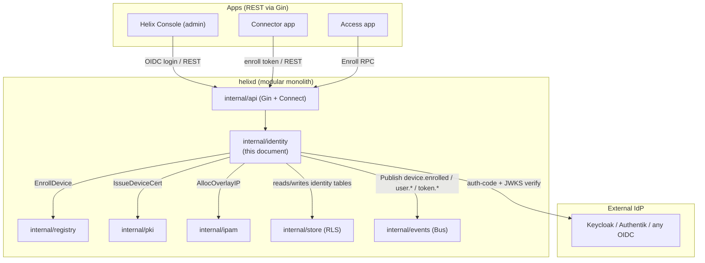
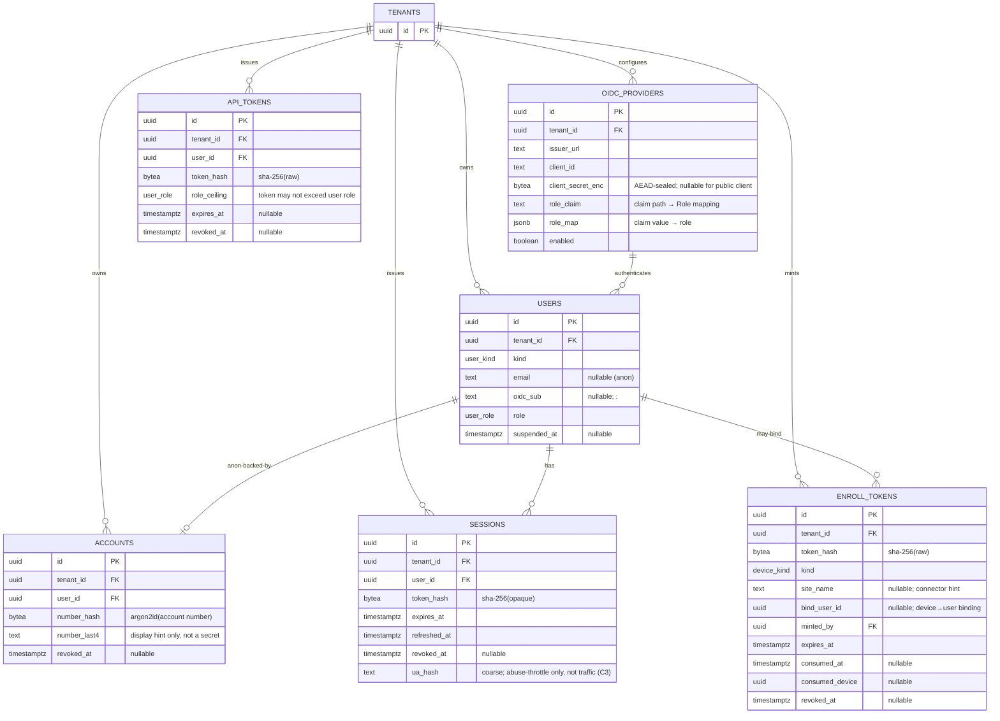
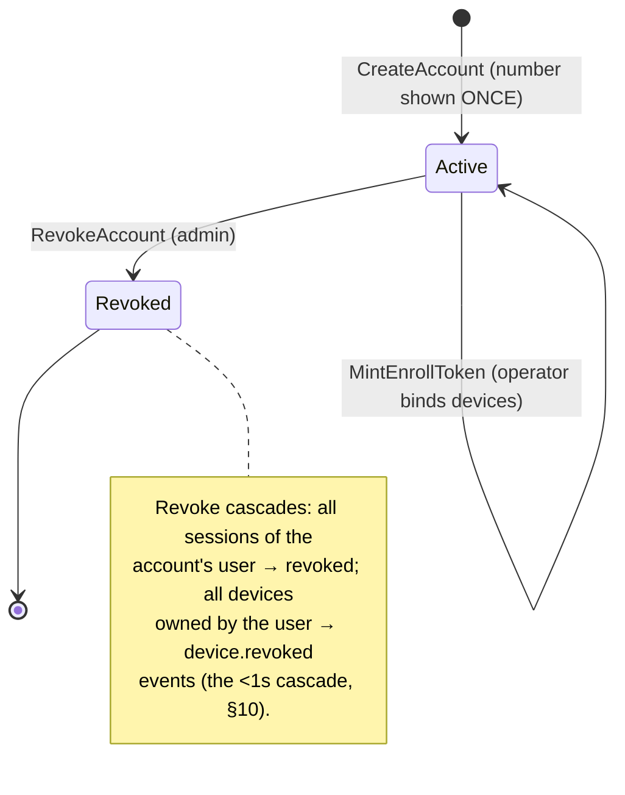
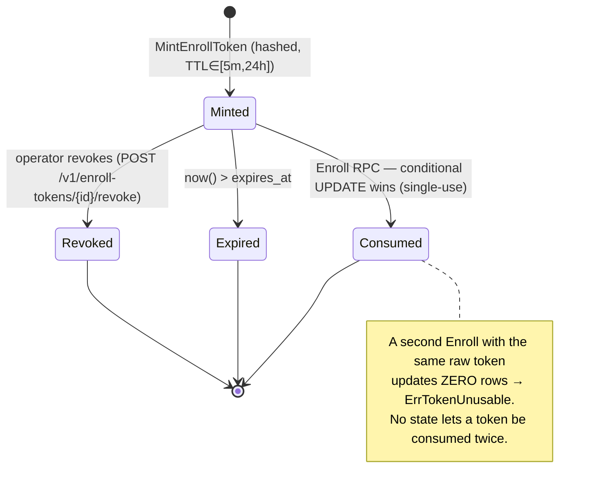
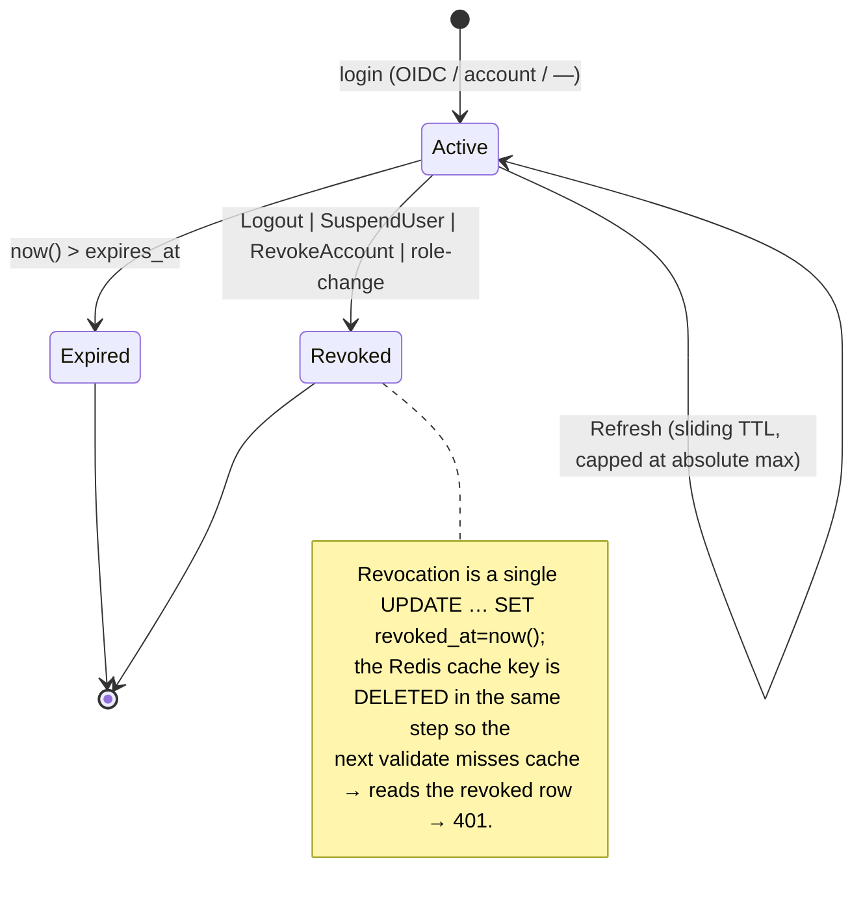

# identity service

**Revision:** 1
**Last modified:** 2026-06-25T00:00:00Z

> Master technical specification — Volume 3 (Control Plane, Go), service nano-detail
> document `svc-identity`. Deepens the identity slice of the pass-1 control-plane overview
> [02-control-plane §9, §8.1]. Scope: **tenants**, **users** (role enum
> `admin`/`operator`/`member`), **OIDC SSO** (Keycloak / Authentik / any IdP) **and
> anonymous device-account tokens** (Mullvad "account number, no PII" model),
> **enroll-token minting**, **sessions + RBAC**, and the **identity API + state
> transitions**. This is a SPEC: it describes the implementation precisely enough to build
> from, and builds nothing. Source evidence cited inline by id — [04_P1 §n]
> (HelixVPN-Phase1-MVP.md), [04_ARCH §n] (HelixVPN-Architecture-Refined.md),
> [research-go_cp §n], [SYNTHESIS §n], [02-CP §n] (the pass-1 doc this deepens). Unproven
> facts are marked `UNVERIFIED` per constitution §11.4.6; nothing is fabricated.

---

## 1. Ownership boundary — what `internal/identity` owns and what it delegates

`identity` is the package that answers **"who is this principal, what tenant are they in,
and what may they do"** — for *humans* (Console/API operators via OIDC or session) and for
the *enrollment handshake* that bootstraps a *device* into a tenant. It deliberately does
**not** own device runtime state, keys, or addressing — those are `registry`, `pki`, `ipam`
[02-CP §1.1, C7]. The split is load-bearing because the Phase-2 service extraction is
mechanical only if the boundaries are clean [04_P1 §1, C7].

| Concern | Owner | `identity`'s relationship |
|---|---|---|
| Tenants, users, roles | **`identity`** | authoritative |
| OIDC providers, sessions, API tokens | **`identity`** | authoritative |
| Enroll-token mint / verify / consume | **`identity`** | authoritative |
| Anonymous device-account (account number) | **`identity`** | authoritative |
| `Enroll` RPC orchestration (token→device) | **`identity`** | orchestrator; calls `ipam`, `pki`, `registry` |
| Device rows, presence, prefixes | `registry` | reads via `registry.Registry` iface [02-CP §1.3] |
| WG pubkey registry, device mTLS cert | `pki` | calls `pki.IssueDeviceCert` [02-CP §1.3] |
| Overlay IP allocation | `ipam` | calls `ipam.AllocOverlayIP` [02-CP §3.2] |
| Policy compile / group resolution | `policy` | emits events `identity` consumes; never imports |


_Diagram 1 — identity service context & dependency edges (R1: no cross-store imports;
`identity` reaches peers only through their exported interfaces [02-CP §1.2])._

### 1.1 The `Identity` interface (Go signatures)

```go
// internal/identity/iface.go
package identity

// Identity is the package's exported surface. api/ and the Enroll RPC handler depend on
// THIS, never on identity's store. All methods run their DB work through store.WithTenant
// (R4) except the explicitly system-scoped CreateTenant.
type Identity interface {
    // ---- tenants (system-scoped) ----
    CreateTenant(ctx context.Context, in CreateTenantInput) (Tenant, error)

    // ---- users + OIDC ----
    BeginOIDC(ctx context.Context, tenantID uuid.UUID, providerID uuid.UUID,
        redirectURI string) (AuthRedirect, error)                  // → state+nonce+PKCE
    CompleteOIDC(ctx context.Context, in OIDCCallback) (Session, User, error) // JIT provision

    // ---- anonymous device-account (Mullvad model) ----
    CreateAccount(ctx context.Context, tenantID uuid.UUID) (AccountSecret, error) // shows number ONCE
    LoginAccount(ctx context.Context, accountNumber string) (Session, error)      // number → session

    // ---- sessions ----
    Authenticate(ctx context.Context, bearer string) (Principal, error) // session OR api-token
    Refresh(ctx context.Context, sessionID uuid.UUID) (Session, error)
    Logout(ctx context.Context, sessionID uuid.UUID) error

    // ---- enroll tokens ----
    MintEnrollToken(ctx context.Context, by Principal, in MintInput) (EnrollTokenSecret, error)
    ConsumeEnrollToken(ctx context.Context, raw string) (ConsumedToken, error) // atomic single-use

    // ---- device enrollment orchestration (the Enroll RPC body) ----
    Enroll(ctx context.Context, in EnrollInput) (EnrollResult, error)

    // ---- lifecycle / revocation (drives the <1s cascade, §10) ----
    SuspendUser(ctx context.Context, by Principal, userID uuid.UUID) error // revokes user's devices
    RevokeAccount(ctx context.Context, by Principal, accountID uuid.UUID) error

    // ---- RBAC ----
    Authorize(p Principal, perm Permission, tenantID uuid.UUID) error // pure; no I/O
}
```

### 1.2 Core domain types

```go
// internal/identity/types.go
package identity

type Role uint8
const (
    RoleMember   Role = iota // default; read-only on most surfaces
    RoleOperator             // mint enroll tokens, manage devices/policies
    RoleAdmin                // everything incl. revoke + user management
)
func (r Role) String() string // "member"|"operator"|"admin"

type AccountKind uint8
const (
    AccountOIDC      AccountKind = iota // user backed by an external IdP subject
    AccountAnonymous                    // privacy mode: account number, no PII (C6)
)

type Tenant struct {
    ID        uuid.UUID
    Name      string
    CreatedAt time.Time
}

type User struct {
    ID        uuid.UUID
    TenantID  uuid.UUID
    Kind      AccountKind
    Email     *string    // nil for anonymous accounts (C6 — never required)
    OIDCSub   *string    // nil unless Kind==AccountOIDC; "<providerID>:<sub>"
    Role      Role
    CreatedAt time.Time
    SuspendedAt *time.Time
}

// Principal is the resolved caller of any request — the output of Authenticate().
type Principal struct {
    Kind     PrincipalKind // User | APIToken | Device | System
    UserID   uuid.UUID     // zero for Device/System
    DeviceID uuid.UUID     // set only for Device principals (mTLS, §8.2 of 02-CP)
    TenantID uuid.UUID
    Role     Role          // System ⇒ synthetic RoleAdmin; Device ⇒ no RBAC (uses policy)
}
type PrincipalKind uint8
const (
    PrincipalUser PrincipalKind = iota
    PrincipalAPIToken
    PrincipalDevice
    PrincipalSystem
)
```

---

## 2. Data model — identity-owned tables (DDL with RLS)

The pass-1 doc carries `tenants` + `users` [02-CP §2.2]. This service **adds five tables**
that the overview elided: `oidc_providers`, `accounts`, `enroll_tokens`, `sessions`,
`api_tokens`. All are tenant-scoped and carry the same `FORCE ROW LEVEL SECURITY` +
`tenant_isolation` policy [02-CP §2.3, C8]. **No table stores a secret in plaintext** —
account numbers, session tokens, enroll tokens, and API tokens are stored only as
hashes (§2.3).

### 2.1 ER diagram (identity subgraph)


_Diagram 2 — identity-owned tables. Every `*_hash` is a one-way digest; the raw secret is
returned to the caller exactly once and never persisted (C6 privacy, §11.4.10 credentials)._

### 2.2 DDL (goose migration — the schema authority [research-go_cp §6])

```sql
-- migrations/0002_identity.sql   ( -- +goose Up )
-- Extends 0001 (tenants, user_role, users) from 02-CP §2.2.

CREATE TABLE oidc_providers (
  id                uuid PRIMARY KEY DEFAULT gen_random_uuid(),
  tenant_id         uuid NOT NULL REFERENCES tenants(id) ON DELETE CASCADE,
  issuer_url        text NOT NULL,                 -- OIDC discovery base (https only, app-checked)
  client_id         text NOT NULL,
  client_secret_enc bytea,                         -- AEAD-sealed w/ server key; NULL = public+PKCE
  scopes            text NOT NULL DEFAULT 'openid email profile',
  role_claim        text NOT NULL DEFAULT 'groups',-- JSON path into ID-token claims
  role_map          jsonb NOT NULL DEFAULT '{}',   -- {"helix-admins":"admin","helix-ops":"operator"}
  default_role      user_role NOT NULL DEFAULT 'member',
  enabled           boolean NOT NULL DEFAULT true,
  created_at        timestamptz NOT NULL DEFAULT now(),
  UNIQUE (tenant_id, issuer_url, client_id)
);

CREATE TYPE account_kind AS ENUM ('oidc','anonymous');
ALTER TABLE users ADD COLUMN kind account_kind NOT NULL DEFAULT 'oidc';
ALTER TABLE users ADD COLUMN suspended_at timestamptz;

CREATE TABLE accounts (                            -- anonymous "account number" (C6)
  id           uuid PRIMARY KEY DEFAULT gen_random_uuid(),
  tenant_id    uuid NOT NULL REFERENCES tenants(id) ON DELETE CASCADE,
  user_id      uuid NOT NULL REFERENCES users(id) ON DELETE CASCADE,
  number_hash  bytea NOT NULL,                     -- argon2id(account number); login key
  number_last4 text  NOT NULL,                     -- "…1234" display hint, not a secret
  created_at   timestamptz NOT NULL DEFAULT now(),
  revoked_at   timestamptz,
  UNIQUE (tenant_id, number_hash)
);

CREATE TABLE enroll_tokens (
  id              uuid PRIMARY KEY DEFAULT gen_random_uuid(),
  tenant_id       uuid NOT NULL REFERENCES tenants(id) ON DELETE CASCADE,
  token_hash      bytea NOT NULL,                  -- sha-256(raw token); raw shown once
  kind            device_kind NOT NULL,            -- client|connector (02-CP §2.2)
  site_name       text,                            -- connector site hint (nullable)
  bind_user_id    uuid REFERENCES users(id) ON DELETE SET NULL, -- device→user (nullable=anon/tenant)
  minted_by       uuid NOT NULL REFERENCES users(id) ON DELETE RESTRICT,
  expires_at      timestamptz NOT NULL,
  consumed_at     timestamptz,
  consumed_device uuid,                            -- devices.id once enrolled (no FK: device may be GC'd)
  revoked_at      timestamptz,
  created_at      timestamptz NOT NULL DEFAULT now(),
  UNIQUE (tenant_id, token_hash)
);
CREATE INDEX ON enroll_tokens (tenant_id) WHERE consumed_at IS NULL AND revoked_at IS NULL;

CREATE TABLE sessions (
  id           uuid PRIMARY KEY DEFAULT gen_random_uuid(),
  tenant_id    uuid NOT NULL REFERENCES tenants(id) ON DELETE CASCADE,
  user_id      uuid NOT NULL REFERENCES users(id) ON DELETE CASCADE,
  token_hash   bytea NOT NULL,                     -- sha-256(opaque 256-bit session token)
  expires_at   timestamptz NOT NULL,
  refreshed_at timestamptz NOT NULL DEFAULT now(),
  revoked_at   timestamptz,
  ua_hash      text,                               -- coarse client hint for throttling (C3: not traffic)
  created_at   timestamptz NOT NULL DEFAULT now(),
  UNIQUE (tenant_id, token_hash)
);
CREATE INDEX ON sessions (tenant_id, user_id) WHERE revoked_at IS NULL;

CREATE TABLE api_tokens (
  id           uuid PRIMARY KEY DEFAULT gen_random_uuid(),
  tenant_id    uuid NOT NULL REFERENCES tenants(id) ON DELETE CASCADE,
  user_id      uuid NOT NULL REFERENCES users(id) ON DELETE CASCADE,
  name         text NOT NULL,
  token_hash   bytea NOT NULL,
  role_ceiling user_role NOT NULL,                 -- effective role = min(user.role, role_ceiling)
  expires_at   timestamptz,
  revoked_at   timestamptz,
  created_at   timestamptz NOT NULL DEFAULT now(),
  UNIQUE (tenant_id, token_hash)
);

-- +goose Down
DROP TABLE api_tokens; DROP TABLE sessions; DROP TABLE enroll_tokens;
DROP TABLE accounts; ALTER TABLE users DROP COLUMN kind; ALTER TABLE users DROP COLUMN suspended_at;
DROP TYPE account_kind; DROP TABLE oidc_providers;
```

### 2.3 RLS + secret-at-rest invariants

Every table above gets the standard policy (one block per table, identical to [02-CP §2.3]):

```sql
ALTER TABLE sessions ENABLE ROW LEVEL SECURITY;
ALTER TABLE sessions FORCE  ROW LEVEL SECURITY;          -- owner does not bypass (research-go_cp §4)
CREATE POLICY tenant_isolation ON sessions
  USING      (tenant_id = current_setting('app.tenant_id')::uuid)
  WITH CHECK (tenant_id = current_setting('app.tenant_id')::uuid); -- BOTH spelled out (research-go_cp §4.3)
```

Invariants (each is a test point, §11):
- **I1 — no plaintext secret column.** `account number`, `session token`, `enroll token`,
  `api token` exist only as `*_hash bytea`. The §2.4-class schema-lint asserts no column
  named `*_secret`, `*_plain`, `password`, `*_token` (without `_hash`) exists [C3, §11.4.10].
- **I2 — login-key uniqueness is per-tenant.** `UNIQUE (tenant_id, number_hash)` /
  `(tenant_id, token_hash)` — a hash collision across tenants is impossible-to-confuse
  because every lookup is RLS-scoped first.
- **I3 — `bind_user_id ON DELETE SET NULL`** so deleting a user never orphans a token row
  in a way that blocks the cascade; a NULL bind = tenant-scoped (anon) device.
- **I4 — `ua_hash` is coarse and abuse-only.** It is NOT a connection log (C3): it stores a
  hash of a static client hint for rate-limit bucketing, never an IP, never per-packet.

---

## 3. Anonymous device-accounts — the Mullvad "account number, no PII" model

[04_ARCH §6 parity matrix: "Account # (no email) → optional anonymous device-token
enrollment alongside OIDC"; 04_P1 §6.1; C6.] An anonymous account is a `users` row with
`kind='anonymous'`, `email=NULL`, `oidc_sub=NULL`, plus an `accounts` row whose only
authenticator is a high-entropy **account number** the operator records out-of-band.

> **Design D-ID1 — account-number format.** A 16-digit decimal number, generated from a
> CSPRNG, displayed grouped `####-####-####-####`. 16 decimal digits ≈ 53.1 bits of
> entropy; this is the *display* secret. To resist online guessing we (a) store only
> `argon2id(number)` (§3.2), (b) rate-limit `LoginAccount` per tenant + `ua_hash` bucket
> (§9.3), and (c) treat the number as a bearer credential the operator must store securely.
> The 16-digit choice mirrors the well-known Mullvad account-number UX; that Mullvad uses
> exactly 16 digits internally is `UNVERIFIED` (not in the cited research) — we adopt 16 as
> *our* design, not as a claim about Mullvad's implementation [§11.4.6].

### 3.1 Account lifecycle


_Diagram 3 — anonymous account lifecycle. There is no "reset password" path: a lost number
is unrecoverable by design (no PII to recover against). The operator mints a new account._

### 3.2 Generation & login (Go)

```go
// internal/identity/account.go
package identity

type AccountSecret struct {            // returned ONCE from CreateAccount; never persisted raw
    AccountID uuid.UUID
    Number    string                   // "1234-5678-9012-3456" — caller MUST record now
}

// CreateAccount provisions an anonymous user + account. The plaintext number is returned to
// the caller and immediately discarded server-side (only argon2id(number) is stored).
func (s *Service) CreateAccount(ctx context.Context, tenantID uuid.UUID) (AccountSecret, error) {
    num := genAccountNumber()                      // 16 CSPRNG digits, grouped on display
    hash := argon2id.Hash([]byte(digitsOnly(num))) // argon2id params §3.3
    var out AccountSecret
    err := s.store.WithTenant(ctx, tenantID, func(q *db.Queries) error {
        u, err := q.InsertUser(ctx, db.InsertUserParams{
            TenantID: tenantID, Kind: db.AccountKindAnonymous, Role: db.UserRoleMember,
        })
        if err != nil { return err }
        acc, err := q.InsertAccount(ctx, db.InsertAccountParams{
            TenantID: tenantID, UserID: u.ID, NumberHash: hash, NumberLast4: last4(num),
        })
        if err != nil { return err }
        out = AccountSecret{AccountID: acc.ID, Number: num}
        return nil
    })
    return out, err
}

// genAccountNumber draws 16 decimal digits from crypto/rand, rejection-sampled to avoid
// modulo bias. NEVER math/rand.
func genAccountNumber() string { /* crypto/rand → 16 unbiased digits → group #### */ }

// LoginAccount turns a recorded number into a Console/API session. argon2id verify is
// constant-time; a miss and a hit cost the same wall-clock (timing-safe, §9.3 throttled).
func (s *Service) LoginAccount(ctx context.Context, tenantID uuid.UUID, number string) (Session, error) {
    // SELECT id,user_id,number_hash FROM accounts WHERE tenant_id=$1 AND revoked_at IS NULL
    //   -- candidate set is small per tenant; verify argon2id over the row(s).
    // On match → mint session for accounts.user_id. On miss → ErrAuthFailed (same latency).
}
```

> **D-ID2 — account login needs a tenant scope.** Because `accounts` is RLS-scoped, the raw
> number alone cannot identify a tenant. MVP: the anonymous-login REST route is
> tenant-addressed (`POST /v1/t/{tenant}/account/login`) for the self-host single-tenant
> common case; a global "number→tenant" directory is explicitly **out of scope** (it would
> be a cross-tenant index, weakening C8). Multi-tenant SaaS anonymous login is a Phase-2
> decision (§12).

### 3.3 argon2id parameters (the at-rest cost) [research-go_cp § — not covered ⇒ `UNVERIFIED` pinning]

`argon2id` with `time=3, memory=64 MiB, threads=4, saltLen=16, keyLen=32` as the **starting**
parameters; these are a conservative 2026 default but are not pinned by the cited research,
so they are `UNVERIFIED` and MUST be re-benchmarked on target hardware before release
(a calibration test asserts a single verify costs 30–150 ms, §11). The library is
`golang.org/x/crypto/argon2` (standard, stable).

---

## 4. OIDC SSO — managed-tenant login (Keycloak / Authentik / any IdP)

[04_P1 §6.1; 04_ARCH §4.1 `identity: Tenants, users, SSO/OIDC`; §7.] Managed tenants log a
human into the Console with the Authorization-Code flow + **PKCE**, validate the ID token
against the IdP's JWKS, and **JIT-provision** a `users` row. The IdP is *any* compliant OIDC
provider (`oidc_providers.issuer_url` drives discovery); Keycloak and Authentik are the
reference IdPs but nothing is provider-specific.

> **D-ID3 — library.** `github.com/coreos/go-oidc/v3` (discovery + JWKS verify) over
> `golang.org/x/oauth2` (code exchange). Exact pinned versions are `UNVERIFIED` (not in the
> cited research corpus, [research-go_cp]); pin at implementation time and record per
> §11.4.99. Rationale: these are the de-facto Go OIDC stack and avoid hand-rolling JWT/JWKS
> (a §11.4.8 "use the mature library" obligation).

### 4.1 Auth-code + PKCE sequence

```mermaid
sequenceDiagram
    autonumber
    participant B as Browser (Console)
    participant API as api (Gin)
    participant ID as identity
    participant R as Redis (state TTL)
    participant IDP as OIDC IdP
    participant PG as Postgres (RLS)
    B->>API: GET /v1/oidc/{provider}/login
    API->>ID: BeginOIDC(tenant, provider, redirectURI)
    ID->>R: SETEX oidc:state:<s> {nonce,verifier,tenant,provider} TTL=10m
    ID-->>API: 302 → IdP authorize?code_challenge=S256&state=<s>&nonce=<n>
    API-->>B: redirect
    B->>IDP: authenticate (IdP-side; Helix never sees the password)
    IDP-->>B: 302 → /v1/oidc/{provider}/callback?code&state
    B->>API: GET callback?code&state
    API->>ID: CompleteOIDC{code,state}
    ID->>R: GETDEL oidc:state:<s>  (single-use; missing ⇒ ErrStateInvalid)
    ID->>IDP: POST /token (code + code_verifier)  [oauth2 exchange]
    IDP-->>ID: id_token (JWT) + access_token
    ID->>IDP: GET /jwks (cached) → verify id_token sig, iss, aud, exp, nonce
    ID->>PG: upsert user by (tenant, oidc_sub) [JIT]; map claim→role
    PG-->>ID: User
    ID->>PG: INSERT session (token_hash)
    ID-->>API: Session{raw cookie} + User
    API-->>B: Set-Cookie helix_session=<raw>; HttpOnly; Secure; SameSite=Lax
```
_Diagram 4 — OIDC login. `state` is single-use (`GETDEL`) and short-lived; `nonce` binds the
ID token to this request; PKCE `S256` protects the code even for public clients [§11.4.99 —
verify against the IdP's current docs before shipping]._

### 4.2 CompleteOIDC — validation & JIT provisioning (Go)

```go
// internal/identity/oidc.go
func (s *Service) CompleteOIDC(ctx context.Context, in OIDCCallback) (Session, User, error) {
    st, err := s.redis.GetDel(ctx, "oidc:state:"+in.State).Result() // single-use; ErrStateInvalid if gone
    if err != nil { return Session{}, User{}, ErrStateInvalid }
    var meta oidcState; json.Unmarshal([]byte(st), &meta)

    prov, err := s.loadProvider(ctx, meta.Tenant, meta.Provider) // RLS-scoped; must be enabled
    if err != nil { return Session{}, User{}, err }

    verifier := s.oidcVerifier(prov)                              // go-oidc, JWKS cached per issuer
    tok, err := prov.oauth2().Exchange(ctx, in.Code,
        oauth2.SetAuthURLParam("code_verifier", meta.Verifier))   // PKCE
    if err != nil { return Session{}, User{}, ErrCodeExchange }
    rawID, _ := tok.Extra("id_token").(string)
    idt, err := verifier.Verify(ctx, rawID)                       // sig+iss+aud+exp
    if err != nil { return Session{}, User{}, ErrIDTokenInvalid }
    var claims struct {
        Sub    string          `json:"sub"`
        Email  *string         `json:"email"`
        Nonce  string          `json:"nonce"`
        Groups json.RawMessage `json:"-"` // extracted via prov.RoleClaim path
    }
    if err := idt.Claims(&claims); err != nil { return Session{}, User{}, ErrClaims }
    if claims.Nonce != meta.Nonce { return Session{}, User{}, ErrNonceMismatch }

    role := mapRole(prov, idt) // role_claim → role_map → default_role; never trust client input

    var u User; var sess Session
    err = s.store.WithTenant(ctx, meta.Tenant, func(q *db.Queries) error {
        sub := prov.ID.String() + ":" + claims.Sub                // namespaced: (provider,sub) unique
        u, err = q.UpsertOIDCUser(ctx, db.UpsertOIDCUserParams{
            TenantID: meta.Tenant, OidcSub: &sub, Email: claims.Email,
            Kind: db.AccountKindOidc, Role: role,                  // role refreshed each login
        })
        if err != nil { return err }
        if u.SuspendedAt != nil { return ErrUserSuspended }        // suspended ⇒ no session
        sess, err = s.newSession(ctx, q, meta.Tenant, u.ID)
        return err
    })
    return sess, u, err
}
```

**Claim→role mapping rules.** `role = role_map[ valueAt(claims, role_claim) ]` falling back to
`oidc_providers.default_role`; if the claim resolves to multiple group values, the **highest**
role wins (`admin > operator > member`). The IdP, not Helix, is the role authority — re-mapped
on **every** login so an IdP-side group removal demotes on next sign-in. A user removed from
all mapped groups falls to `default_role` (default `member`), never silently retains `admin`.

---

## 5. Enroll-token minting & consumption (the device bootstrap secret)

[04_P1 §6.2; 02-CP §9.2.] An enroll token is a single-use, short-lived, hashed secret that an
`operator`/`admin` mints and hands (paste / QR) to a device; the device redeems it exactly
once in the `Enroll` RPC. It is the *only* unauthenticated agent RPC's credential [02-CP §8.2].

### 5.1 Token format & mint (Go)

```go
// internal/identity/enrolltoken.go
type MintInput struct {
    Kind     DeviceKind     // client | connector
    SiteName *string        // connector hint (nullable)
    BindUser *uuid.UUID     // optional device→user binding (nil = tenant-scoped/anon)
    TTL      time.Duration  // clamped to [5m, 24h]; default 1h
}
type EnrollTokenSecret struct { TokenID uuid.UUID; Raw string; ExpiresAt time.Time } // Raw shown ONCE

func (s *Service) MintEnrollToken(ctx context.Context, by Principal, in MintInput) (EnrollTokenSecret, error) {
    if err := s.Authorize(by, PermMintEnrollToken, by.TenantID); err != nil { return EnrollTokenSecret{}, err }
    ttl := clamp(in.TTL, 5*time.Minute, 24*time.Hour)
    raw := "het_" + base32NoPad(randomBytes(32))   // 256-bit; "het_" = helix enroll token, greppable
    sum := sha256.Sum256([]byte(raw))              // store hash only (I1)
    var out EnrollTokenSecret
    err := s.store.WithTenant(ctx, by.TenantID, func(q *db.Queries) error {
        t, err := q.InsertEnrollToken(ctx, db.InsertEnrollTokenParams{
            TenantID: by.TenantID, TokenHash: sum[:], Kind: in.Kind.DB(), SiteName: in.SiteName,
            BindUserID: in.BindUser, MintedBy: by.UserID, ExpiresAt: time.Now().Add(ttl),
        })
        if err != nil { return err }
        out = EnrollTokenSecret{TokenID: t.ID, Raw: raw, ExpiresAt: t.ExpiresAt}
        _, err = s.bus.Publish(ctx, "events:devices",
            events.New("enroll_token.minted", by.TenantID, by.UserID.String(),
                map[string]any{"token_id": t.ID, "kind": in.Kind.String()})) // audit only — NO raw token
        return err
    })
    return out, err
}
```

### 5.2 Atomic single-use consumption (no double-spend)

The double-spend hazard: two devices race the same token. Atomicity is enforced by a
**conditional UPDATE … RETURNING** — the row lock serialises the two transactions and the
`WHERE consumed_at IS NULL` guard guarantees exactly one wins [research-go_cp §4 — same
`UPDATE … RETURNING` atomicity pattern as IPAM in 02-CP §3.2].

```sql
-- name: ConsumeEnrollToken :one
UPDATE enroll_tokens
   SET consumed_at = now(), consumed_device = sqlc.arg(device_id)
 WHERE tenant_id   = current_setting('app.tenant_id')::uuid
   AND token_hash  = sqlc.arg(token_hash)
   AND consumed_at IS NULL          -- single-use guard
   AND revoked_at  IS NULL          -- not revoked
   AND expires_at  > now()          -- not expired
 RETURNING id, kind, site_name, bind_user_id;
```

```go
// ConsumeEnrollToken is called INSIDE the Enroll transaction so token-burn and device-insert
// commit together (or both roll back). Zero rows updated ⇒ token already used / expired / revoked.
func (s *Service) ConsumeEnrollToken(ctx context.Context, q *db.Queries, raw string, deviceID uuid.UUID) (ConsumedToken, error) {
    sum := sha256.Sum256([]byte(raw))
    row, err := q.ConsumeEnrollToken(ctx, db.ConsumeEnrollTokenParams{TokenHash: sum[:], DeviceID: deviceID})
    if errors.Is(err, pgx.ErrNoRows) { return ConsumedToken{}, ErrTokenUnusable } // burned/expired/revoked/wrong
    return ConsumedToken{Kind: row.Kind, Site: row.SiteName, BindUser: row.BindUserID}, err
}
```

### 5.3 Enroll-token state machine


_Diagram 5 — enroll-token states. The only legal terminal-by-success transition is
`Minted → Consumed`; every other terminal state rejects redemption._

---

## 6. The `Enroll` orchestration (identity owns the RPC body)

`Enroll` is the identity-owned handler behind `Coordinator.Enroll` [02-CP §4 proto,
`package helix.coordinator.v1`]. It is the cross-module orchestration that turns a token +
device-generated WG pubkey into a persisted device with an overlay IP and an mTLS cert — all
in **one tenant transaction** so a partial enrollment is impossible. The device's WG private
key never appears (C6); only the 32-byte public key is registered.

```go
// internal/identity/enroll.go
type EnrollInput struct {
    RawToken string; WGPubKey []byte; OS string; Name string; Kind DeviceKind
}
type EnrollResult struct {
    DeviceID  uuid.UUID; OverlayIP netip.Addr; DeviceCert []byte; Gateway GatewayInfo
}

func (s *Service) Enroll(ctx context.Context, in EnrollInput) (EnrollResult, error) {
    if len(in.WGPubKey) != 32 { return EnrollResult{}, ErrBadPubKey }   // Curve25519 = 32B (C6)
    tenantID, ok := s.resolveTokenTenant(ctx, in.RawToken)             // hash → tenant (system-scoped lookup)
    if !ok { return EnrollResult{}, ErrTokenUnusable }
    var res EnrollResult
    err := s.store.WithTenant(ctx, tenantID, func(q *db.Queries) error {
        deviceID := uuid.New()
        ct, err := s.ConsumeEnrollToken(ctx, q, in.RawToken, deviceID)  // ATOMIC burn (§5.2)
        if err != nil { return err }
        if ct.Kind != in.Kind.DB() { return ErrKindMismatch }          // connector-token ⇏ client device
        ip, err := s.ipam.AllocOverlayIP(ctx, q, tenantID)             // §3.2 of 02-CP (ULA /48, D4)
        if err != nil { return err }
        dev, err := s.registry.EnrollDeviceTx(ctx, q, registry.EnrollInput{ // R1: via iface, not store
            ID: deviceID, TenantID: tenantID, UserID: ct.BindUser, Kind: in.Kind,
            Name: in.Name, OS: in.OS, WGPubKey: in.WGPubKey, OverlayIP: ip, Site: ct.Site,
        })
        if err != nil { return err }
        cert, err := s.pki.IssueDeviceCertTx(ctx, q, dev.ID, 24*time.Hour) // §9.3 of 02-CP
        if err != nil { return err }
        res = EnrollResult{DeviceID: dev.ID, OverlayIP: ip, DeviceCert: cert.PEM, Gateway: s.gateway}
        // R3: every topology mutation emits an event (in-tx publish, §5 of 02-CP)
        _, err = s.bus.Publish(ctx, "events:devices",
            events.New("device.enrolled", tenantID, "system",
                map[string]any{"device_id": dev.ID, "kind": in.Kind.String(), "overlay_ip": ip.String()}))
        return err
    })
    return res, err
}
```

**Why one transaction:** token-burn, device-insert, IP-alloc, cert-issue, and the
`device.enrolled` publish are a single unit of work. If the cert issue fails, the token is
**not** burned and the IP is **not** consumed — the device retries with the same token. This
is the §11.4.108 runtime-signature for "enrollment is all-or-nothing." (The `pki`/`registry`
methods take the live `*db.Queries` so they enlist in the same tx — `*Tx`-suffixed variants of
the §1.3 ifaces in 02-CP.)

---

## 7. Sessions + RBAC

### 7.1 Session model

Sessions are **durable in Postgres** (truth, C2) so they survive a Redis flush and are
auditable + revocable; Redis is a **validation cache** only (a `session:<id>` key with the
table TTL, populated on validate, deleted on revoke — losing it costs one DB read, never
correctness) [04_ARCH §4.6, C2]. The raw 256-bit opaque token is delivered once (cookie or
bearer) and stored only as `sha256(raw)`.

```go
// internal/identity/session.go
type Session struct { ID uuid.UUID; Raw string; UserID uuid.UUID; ExpiresAt time.Time } // Raw shown once
const sessionTTL = 12 * time.Hour
const sessionAbsoluteMax = 30 * 24 * time.Hour // refresh cannot extend past account age

func (s *Service) newSession(ctx context.Context, q *db.Queries, t, userID uuid.UUID) (Session, error) {
    raw := "hss_" + base32NoPad(randomBytes(32))   // helix session secret; greppable prefix
    sum := sha256.Sum256([]byte(raw))
    row, err := q.InsertSession(ctx, db.InsertSessionParams{
        TenantID: t, UserID: userID, TokenHash: sum[:], ExpiresAt: time.Now().Add(sessionTTL),
    })
    return Session{ID: row.ID, Raw: raw, UserID: userID, ExpiresAt: row.ExpiresAt}, err
}

// Authenticate resolves a bearer/cookie to a Principal. It accepts session ("hss_") OR
// api-token ("hat_") prefixes and dispatches; device mTLS is resolved upstream (02-CP §8.2)
// and arrives as PrincipalDevice — Authenticate is NOT called for agent RPCs.
func (s *Service) Authenticate(ctx context.Context, bearer string) (Principal, error) {
    switch {
    case strings.HasPrefix(bearer, "hss_"): return s.authSession(ctx, bearer)
    case strings.HasPrefix(bearer, "hat_"): return s.authAPIToken(ctx, bearer) // role=min(user.role,ceiling)
    default: return Principal{}, ErrUnauthenticated
    }
}
```

### 7.2 Session state machine


_Diagram 6 — session states. `Refresh` slides `expires_at` forward by `sessionTTL` but never
past `created_at + sessionAbsoluteMax`; a suspended user's sessions are bulk-revoked (§10)._

### 7.3 RBAC matrix & authorization rules

`admin > operator > member` [02-CP §8.1; 04_ARCH §4.5]. `Authorize` is **pure** (no I/O) so it
is trivially unit-testable and cannot become a hidden DB dependency. Permissions are a closed
enum; routes declare the permission, not the role, so the matrix is the single source of truth.

```go
// internal/identity/rbac.go
type Permission uint16
const (
    PermReadDevices Permission = iota
    PermReadNetworks
    PermMintEnrollToken
    PermManagePolicy        // create/activate policy
    PermRevokeDevice
    PermManageUsers         // invite/suspend users, configure OIDC
    PermCreateAccount       // mint anonymous account
)

// minRole is the closed authority table — the ONLY place role→permission lives.
var minRole = map[Permission]Role{
    PermReadDevices:     RoleMember,
    PermReadNetworks:    RoleMember,
    PermMintEnrollToken: RoleOperator,
    PermManagePolicy:    RoleOperator,
    PermRevokeDevice:    RoleAdmin,
    PermManageUsers:     RoleAdmin,
    PermCreateAccount:   RoleOperator,
}

func (s *Service) Authorize(p Principal, perm Permission, tenantID uuid.UUID) error {
    if p.Kind == PrincipalDevice { return ErrForbidden } // devices use policy (C4), never RBAC
    if p.TenantID != tenantID    { return ErrForbidden } // cross-tenant attempt (RLS is the backstop)
    if p.Kind == PrincipalSystem { return nil }          // system principal is omnipotent in-tenant
    if p.Role < minRole[perm]    { return ErrForbidden }
    return nil
}
```

| Permission | admin | operator | member | Backing route(s) |
|---|---|---|---|---|
| `PermReadDevices` / `PermReadNetworks` | ✓ | ✓ | ✓ | `GET /v1/devices`, `GET /v1/networks` |
| `PermMintEnrollToken` | ✓ | ✓ | ✗ | `POST /v1/enroll-tokens` |
| `PermManagePolicy` | ✓ | ✓ | ✗ | `POST /v1/policies`, `…/activate` |
| `PermCreateAccount` | ✓ | ✓ | ✗ | `POST /v1/accounts` |
| `PermRevokeDevice` | ✓ | ✗ | ✗ | `POST /v1/devices/{id}/revoke` |
| `PermManageUsers` | ✓ | ✗ | ✗ | `POST /v1/users/{id}/suspend`, `POST /v1/oidc-providers` |

**Authz rules (each a test point, §11):**
- **AZ1 — defense in depth.** RBAC is the gate; RLS is the floor [02-CP §8.1]. Even if
  `minRole` is misconfigured, a query for tenant B under tenant A's `Principal` returns zero
  rows (RLS), never a leak.
- **AZ2 — API-token ceiling.** An api-token's effective role is `min(user.role, role_ceiling)`
  — minting an admin-ceiling token as an `operator` is rejected (a token can never *elevate*).
- **AZ3 — no self-revoke lock-out.** The last `admin` of a tenant cannot suspend themselves
  (a `count(admin where not suspended) > 1` guard) — prevents an un-administerable tenant.
- **AZ4 — device principals never authorize via RBAC** (`PrincipalDevice ⇒ ErrForbidden` in
  `Authorize`) — a device's reach is policy-compiled need-to-know, not a role (C4).

---

## 8. Identity API surface (Gin REST) + the Enroll RPC

One multiplexed HTTP server [02-CP §8; research-go_cp §1/§7]. Gin carries the human/REST
identity surface; the single agent-facing identity RPC (`Enroll`) lives on the Connect mux
(`package helix.coordinator.v1` [02-CP §4]). Contracts are generated, not hand-written
[04_ARCH §4.2].

| Method & path | Permission / auth | Handler |
|---|---|---|
| `GET  /v1/oidc/{provider}/login` | unauth (begins flow) | `BeginOIDC` |
| `GET  /v1/oidc/{provider}/callback` | unauth (state-bound) | `CompleteOIDC` |
| `POST /v1/t/{tenant}/account/login` | unauth (rate-limited) | `LoginAccount` |
| `POST /v1/accounts` | `PermCreateAccount` | `CreateAccount` |
| `POST /v1/enroll-tokens` | `PermMintEnrollToken` | `MintEnrollToken` |
| `POST /v1/enroll-tokens/{id}/revoke` | `PermMintEnrollToken` | revoke (UPDATE `revoked_at`) |
| `POST /v1/oidc-providers` | `PermManageUsers` | configure IdP |
| `POST /v1/users/{id}/suspend` | `PermManageUsers` | `SuspendUser` |
| `POST /v1/accounts/{id}/revoke` | `PermManageUsers` | `RevokeAccount` |
| `POST /v1/sessions/refresh` | valid session | `Refresh` |
| `POST /v1/sessions/logout` | valid session | `Logout` |
| `Coordinator.Enroll` (Connect) | enroll token | `Enroll` (§6) |

```go
// internal/api/identity_routes.go — REST wiring (RBAC declared per route, §7.3)
g := r.Group("/v1")
g.Use(authn(idsvc))                                   // resolves Principal or leaves anon for unauth routes
g.POST("/enroll-tokens",        require(PermMintEnrollToken), h.MintEnrollToken)
g.POST("/accounts",             require(PermCreateAccount),   h.CreateAccount)
g.POST("/users/:id/suspend",    require(PermManageUsers),     h.SuspendUser)
g.POST("/oidc-providers",       require(PermManageUsers),     h.ConfigureOIDC)
// unauth flows (their own internal guards): OIDC begin/callback, account login (throttled)
r.GET ("/v1/oidc/:provider/login",    h.BeginOIDC)
r.GET ("/v1/oidc/:provider/callback", h.CompleteOIDC)
r.POST("/v1/t/:tenant/account/login", h.LoginAccount)
```

### 8.1 Request validation

REST bodies bind+validate via Gin's `ShouldBindJSON` + go-playground/validator tags
[research-go_cp §1]; the `Enroll` RPC validates via **protovalidate** field constraints on
the proto (declarative, next to the contract) [research-go_cp §2] — e.g. `wg_pubkey` length
== 32, `enroll_token` non-empty, `kind` ∈ {CLIENT, CONNECTOR}. Validation failures are
`ErrInvalidArgument` (§9), never a panic (§11.4.1 no FAIL-bluff).

---

## 9. Error taxonomy

A closed error set mapped to **both** Connect codes (agent RPCs) and HTTP statuses (REST).
Every error is a real, distinguishable condition — no generic 500 masks an auth decision
[§11.4.1, §11.4.6].

| Sentinel | Connect code | HTTP | Meaning / trigger |
|---|---|---|---|
| `ErrUnauthenticated` | `Unauthenticated` | 401 | no/invalid session or token bearer |
| `ErrAuthFailed` | `Unauthenticated` | 401 | account-number / credential mismatch (constant-time) |
| `ErrForbidden` | `PermissionDenied` | 403 | RBAC denied / cross-tenant / device-via-RBAC (AZ4) |
| `ErrUserSuspended` | `PermissionDenied` | 403 | login by a suspended user |
| `ErrTokenUnusable` | `FailedPrecondition` | 409 | enroll token consumed/expired/revoked/wrong-tenant |
| `ErrKindMismatch` | `InvalidArgument` | 400 | token kind ≠ Enroll kind (connector-token, client device) |
| `ErrBadPubKey` | `InvalidArgument` | 400 | WG pubkey not exactly 32 bytes |
| `ErrStateInvalid` | `InvalidArgument` | 400 | OIDC `state` missing/expired/replayed |
| `ErrNonceMismatch` | `Unauthenticated` | 401 | OIDC ID-token `nonce` ≠ stored |
| `ErrIDTokenInvalid` | `Unauthenticated` | 401 | ID-token sig/iss/aud/exp validation failed |
| `ErrCodeExchange` | `Unavailable` | 502 | IdP token endpoint failure (upstream) |
| `ErrRateLimited` | `ResourceExhausted` | 429 | account-login / mint throttle tripped (§9.3 below) |
| `ErrInvalidArgument` | `InvalidArgument` | 400 | request body / proto-validation failure |
| `ErrConflict` | `AlreadyExists` | 409 | unique violation (e.g. duplicate OIDC sub race) |

### 9.1 Rate-limiting (abuse, not traffic — C3)

`LoginAccount` and `MintEnrollToken` are throttled with a Redis token-bucket per
`(tenant, ua_hash)` and a stricter per-tenant ceiling [04_ARCH §4.6 "rate limiting (token
buckets per API key)"]. Buckets hold counters + timestamps only — never IPs, destinations, or
flows (C3). A tripped bucket returns `ErrRateLimited` (429) with `Retry-After`.

---

## 10. Lifecycle cascades & the <1s convergence SLO

Identity is the **origin** of the revocation cascade whose tail the coordinator measures
[02-CP §10.2, C5]. `SuspendUser` / `RevokeAccount` / device revoke each emit events that the
coordinator turns into peer-removal deltas; the **event→delta-on-wire p99 < 1 s** SLO
[02-CP §10.2] therefore bounds identity-side revocation latency end to end.

```mermaid
sequenceDiagram
    autonumber
    participant Admin as Console (admin)
    participant API as api (Gin)
    participant ID as identity
    participant PG as Postgres (RLS)
    participant Bus as Redis Streams
    participant Coord as coordinator
    participant Edge as Rust edge / agents
    Admin->>API: POST /v1/users/{id}/suspend
    API->>ID: SuspendUser (Authorize PermManageUsers; AZ3 last-admin guard)
    ID->>PG: tx: users.suspended_at=now(); sessions.revoked_at=now() (bulk); per device revoked_at
    ID->>PG: enumerate user's devices → device_certs.revoked=true
    ID->>Bus: XADD events:devices {device.revoked, device_id} ×N  (R3, one per device)
    Bus-->>Coord: XReadGroup delivers each device.revoked
    Coord-->>Coord: remove node; compute minimal affected set (02-CP §6.4)
    loop each peer who could see the revoked device
        Coord->>Edge: stream.Send(MapDelta{remove_peer_ids})
    end
    Edge-->>Edge: kernel WG peer removed; sessions dropped
    Note over Admin,Edge: revoke→edge-enforced p99 < 1s (02-CP §10.2)
```
_Diagram 7 — user-suspension cascade. One `SuspendUser` fans out to: session revoke (human
access dies immediately), cert revoke (control channel dies), and N `device.revoked` events
(data-path peers removed within the convergence SLO). All session/cert writes commit in the
same tenant transaction; the events publish in-tx (R3) so no device is left half-revoked._

```go
// internal/identity/lifecycle.go
func (s *Service) SuspendUser(ctx context.Context, by Principal, userID uuid.UUID) error {
    if err := s.Authorize(by, PermManageUsers, by.TenantID); err != nil { return err }
    return s.store.WithTenant(ctx, by.TenantID, func(q *db.Queries) error {
        if last, _ := q.IsLastActiveAdmin(ctx, userID); last { return ErrForbidden } // AZ3
        if err := q.SuspendUser(ctx, userID); err != nil { return err }
        if err := q.RevokeUserSessions(ctx, userID); err != nil { return err }       // human access dies now
        devs, err := q.DevicesForUser(ctx, userID); if err != nil { return err }
        for _, d := range devs {
            if err := q.RevokeDeviceCert(ctx, d.ID); err != nil { return err }
            if err := q.MarkDeviceRevoked(ctx, d.ID); err != nil { return err }
            if _, err := s.bus.Publish(ctx, "events:devices",
                events.New("device.revoked", by.TenantID, by.UserID.String(),
                    map[string]any{"device_id": d.ID})); err != nil { return err }   // drives <1s cascade
        }
        return s.audit(ctx, q, by, "user.suspend", userID.String())
    })
}
```

---

## 11. Test points — comprehensive test-type coverage (§11.4.169)

Per constitution **§11.4.169** (mandatory comprehensive test-type coverage), composing
§11.4.27 (no-fakes-beyond-unit / 100% type coverage), §11.4.5/§11.4.69 (captured evidence),
§11.4.85 (stress+chaos), §1.1 (paired mutation). Integration spins Postgres+Redis on-demand
via the `vasic-digital/containers` submodule (§11.4.76 — never ad-hoc `docker run`)
[02-CP §10.3]. Every PASS cites a captured-evidence artefact; mocks live **only** in unit tests
(§11.4.27).

| Feature | Unit | Integration (real PG+Redis) | Security / fuzz | Stress / chaos | Paired §1.1 mutation |
|---|---|---|---|---|---|
| **RBAC `Authorize`** | truth-table over every (Role × Permission); AZ1–AZ4 | route gate end-to-end | member-forging-admin denied | — | flip a `minRole` cell → a deny test FAILs |
| **RLS isolation** | — | tenant A cannot read tenant B's `sessions`/`accounts`/`enroll_tokens` even with crafted query, as `helix_app`, `FORCE RLS` on [02-CP §10.3] | cross-tenant probe | 500 conns, no degradation (research-go_cp §4) | drop `FORCE ROW LEVEL SECURITY` → cross-tenant read SUCCEEDS → test FAILs |
| **Enroll-token single-use** | state-machine transitions (Diagram 5) | mint→consume→re-consume=`ErrTokenUnusable` | token-guess fuzz over `het_` space | **N=100 concurrent Enroll of one token ⇒ exactly 1 success** (double-spend) | remove `AND consumed_at IS NULL` guard → 2 successes → test FAILs |
| **OIDC login** | `mapRole` claim→role; nonce/state checks | full auth-code+PKCE vs a Keycloak/Authentik container; JIT provision; role refresh on re-login | tampered ID-token sig rejected; replayed `state` (`GETDEL`) rejected; `alg=none` rejected | — | accept `nonce` mismatch → replayed-token test FAILs |
| **Anonymous account** | `genAccountNumber` unbiased (χ² over digits); argon2id calibration 30–150ms | create→login→session; lost-number unrecoverable | timing-equal hit vs miss (constant-time); online-guess throttle | login brute-force ⇒ `ErrRateLimited` | store plaintext number → schema-lint (I1) FAILs |
| **Session lifecycle** | state machine (Diagram 6); refresh cap | login→validate→refresh→revoke→401; Redis-cache flush still correct (C2) | stolen-cookie revoked instantly | 10k concurrent validates, cache-hit ratio | skip `revoked_at` check on validate → revoked session still 200 → test FAILs |
| **Suspend/revoke cascade** | last-admin guard (AZ3) | suspend→sessions dead + N `device.revoked` emitted; **revoke→edge p99 < 1s** captured (§10) [02-CP §10.2] | suspended user cannot re-login | suspend a user owning 1k devices, all events emitted | drop in-tx publish (R3) → coordinator never removes peer → SLO test FAILs |
| **Secret-at-rest (I1)** | — | schema-lint asserts no plaintext-secret column | grep live schema for `*_token`/`password` w/o `_hash` | — | add a `sessions.token_plain text` column → lint FAILs |

**Bench/SLO targets inherited from [02-CP §10.2]:** enrollment round-trip < 500 ms (identity
owns the token-verify→IPAM→cert→persist→publish path); revoke→edge-enforced p99 < 1 s
(identity originates it). These are measured with captured histograms (`helix_reconcile_seconds`
tail, an enrollment-latency histogram), not asserted — the anti-bluff acceptance numbers.

---

## 12. Phase-2 forward seams (additive, not a rewrite) [02-CP §14, 04_P1 §12]

The identity interfaces extend without reshaping: `oidc_providers` gains SCIM provisioning +
group sync (replacing per-login JIT for large tenants); `accounts` gains optional recovery
codes (still no PII) and a multi-tenant `number→tenant` directory behind an explicit operator
opt-in (the §3.2 D-ID2 deferral); `sessions` gains WebAuthn/passkey step-up for `admin`
actions; `api_tokens` gains fine-grained scopes beyond the role ceiling; the `Identity`
interface itself becomes the seam along which a standalone `identity` service splits from the
monolith (C7) — the `Bus`/`store.WithTenant`/`registry`/`pki`/`ipam` boundaries already in
place mean the extraction is wiring, not redesign.

---

### Sources

[02-CP] 02-control-plane.md — the pass-1 control-plane overview this document deepens (§4 proto
`package helix.coordinator.v1`, §8.1 RBAC, §9 identity/enrollment/PKI, §10 SLOs, §2 DDL/RLS,
C1–C8 invariants). · [04_P1] HelixVPN-Phase1-MVP.md §6 (two identity modes, enrollment flow,
PKI), §2 (users/role enum, RLS), §8 (API/authz). · [04_ARCH] HelixVPN-Architecture-Refined.md
§4.1/§4.5 (identity service, users role enum, RLS data model), §6 (Mullvad parity — anonymous
account #), §7 (security: OIDC + anonymous device tokens, short-lived certs). · [research-go_cp]
§1 (Gin REST edge), §2 (Connect + protovalidate), §3 (sqlc/pgx typed SQL), §4 (Postgres RLS:
non-owner role, `SET LOCAL`, `USING`+`WITH CHECK`, leading `tenant_id` index), §6 (goose
migrations). · [SYNTHESIS] §2 (stack floor), §7 (security/privacy invariants), §9 (constitution
bindings). · Constitution §11.4.6 (no-guessing — `UNVERIFIED` marks), §11.4.10 (credentials),
§11.4.27/§11.4.85/§11.4.169/§1.1 (test-type coverage), §11.4.76 (containers submodule),
§11.4.99 (latest-source verification for OIDC libs/flows).
