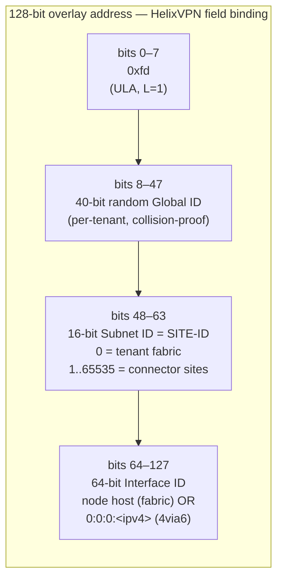
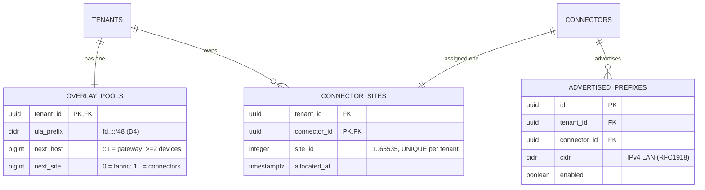
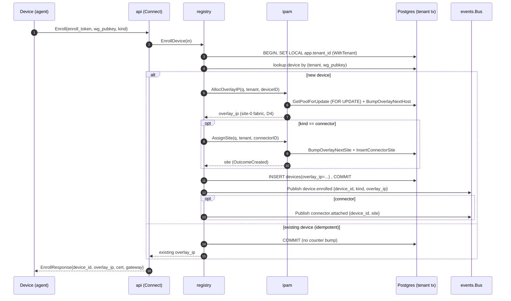
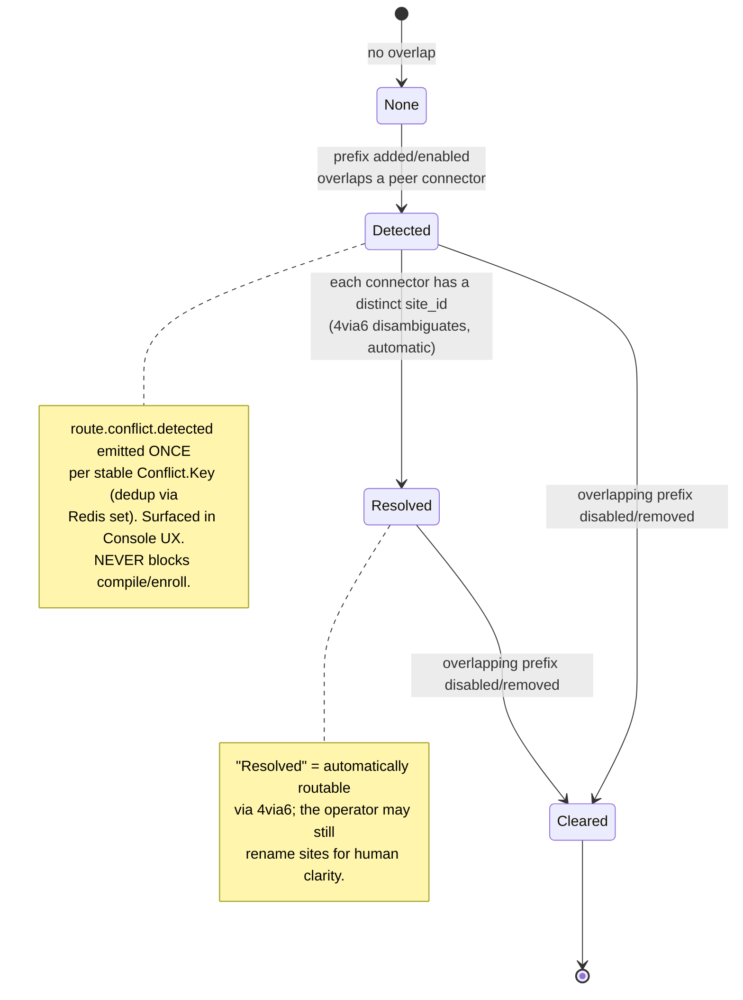
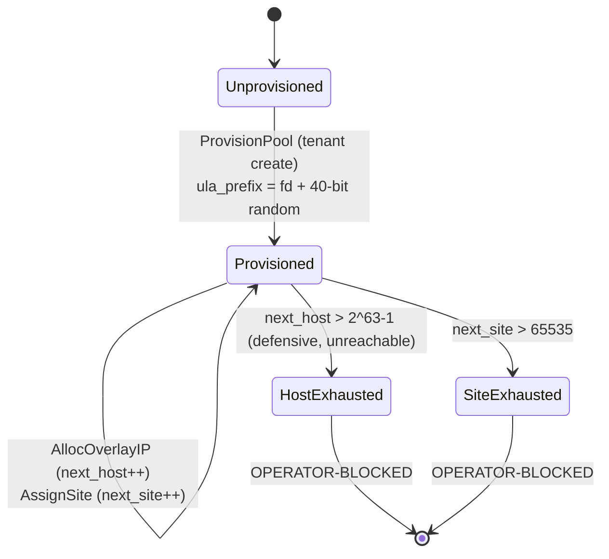
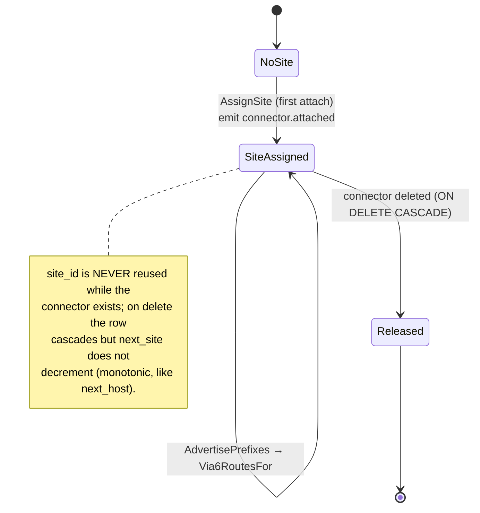
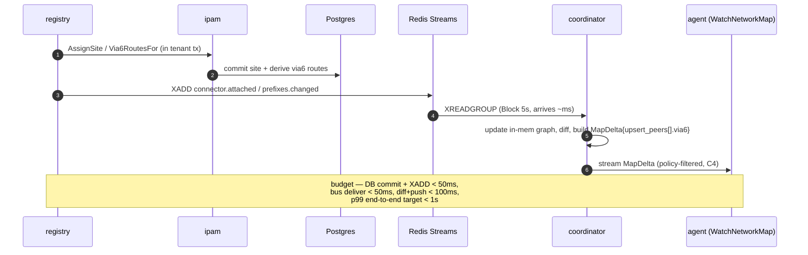

# ipam service

**Revision:** 1
**Last modified:** 2026-06-25T00:00:00Z

> Master technical specification — Volume 3 (Control Plane, Go), nano-detail document.
> Deepens the `internal/ipam` package introduced in the pass-1 control-plane overview
> ([research-go_cp §3], `docs/research/mvp/final/02-control-plane.md`). This is a **SPEC**:
> it describes the implementation in implementation-ready detail; it does not build the
> product. Sources are cited inline by id — `[04_P1]` (HelixVPN-Phase1-MVP.md),
> `[04_ARCH §N]` (HelixVPN-Architecture-Refined.md), `[research-go_cp §N]` (the pass-1
> control-plane doc), `[SYNTHESIS §N]` (cross-document synthesis). Claims that cannot be
> grounded in a source are marked **UNVERIFIED** per constitution §11.4.6 (no guessing).
> The agent wire package is **`helix.coordinator.v1`** — unified across the spec set
> [research-go_cp §4].

---

## 0. Scope, ownership & inherited invariants

### 0.1 What this service owns

`internal/ipam` is the single module that owns **overlay address allocation** for a tenant
[research-go_cp §1.1, 04_P1 §1]. Concretely, it owns:

| Owned thing | Durable home | Notes |
|---|---|---|
| The tenant overlay pool (`fd…::/48`) | `overlay_pools` row (PK `tenant_id`) | one per tenant; provisioned at tenant create |
| The monotonic host counter | `overlay_pools.next_host` | `::1` reserved for the gateway (D4) [research-go_cp §2.2] |
| The monotonic site counter | `overlay_pools.next_site` (**added here**) | site 0 = the tenant fabric; 1..65535 = connectors |
| Per-connector site assignments | `connector_sites` table (**added here**) | the 16-bit subnet id used by 4via6 |
| `devices.overlay_ip` allocation | written through `registry`, value computed by ipam | ipam computes, registry persists in the same tx |
| 4via6 route derivation | pure function (no table) | derived from `connector_sites` + `advertised_prefixes` |
| Overlapping-CIDR conflict detection | pure function + `route.conflict.detected` event | informational, never blocks (§6) |

`internal/ipam` does **not** own: the `devices` / `advertised_prefixes` / `connectors`
tables (owned by `registry`), policy compilation (owned by `policy`), or the in-memory
topology graph and `WatchNetworkMap` streams (owned by `coordinator`) [research-go_cp §1.1].
ipam is invoked by `registry` (on enrollment / connector attach / prefix change) and read by
`coordinator` (to emit `Via6Route` entries into network maps).

### 0.2 Inherited invariants (every line below obeys these) [research-go_cp §0.1]

| # | Invariant | Consequence for ipam |
|---|---|---|
| C2 | Postgres is the single source of truth; Redis is ephemeral | the pool counters + site map are durable Postgres rows; **never** stored in Redis |
| C3 | No-logging by construction | ipam holds **no** allocation *history* / lease *log*; only the current high-water counters + the live site map |
| C4 | Default-deny, need-to-know | a `Via6Route` is shipped to a node **only** inside its already-policy-filtered map (the coordinator gates it, §7.2) |
| C7 | Package boundary == future service boundary | ipam exposes an interface (§3.1); callers never read `overlay_pools`/`connector_sites` directly |
| C8 | Multi-tenant isolation at the DB via RLS | every ipam table is RLS-scoped and FORCE'd; all access goes through `store.WithTenant` (§2.4) |
| R3 | every state mutation emits an event | a site allocation emits `connector.attached`; a detected overlap emits `route.conflict.detected` (§8) |
| R4 | every DB access is tenant-scoped | ipam never calls `db.Query` directly; it receives a `*db.Queries` already bound to the tenant tx |

### 0.3 The decision this service implements — D4

**Decision D4 (settled, Camp A): IPv6 ULA `/48` per tenant + Tailscale-style `4via6`**
[research-go_cp §3.1, 04_ARCH §3 (overlay addressing), SYNTHESIS §3]. The CGNAT `100.64/10`
Camp B alternative remains the Phase-2 fallback for pure-IPv4 connectors and is **not** in this
service's Phase-1 surface. Rationale recap: collision-proof by construction, no stateful NAT in
the packet path (keeps the Rust edge dumb, C1), documented Mullvad/Tailscale precedent
[research-go_cp §3.1].

---

## 1. The address plan (bit-exact)

### 1.1 RFC 4193 ULA structure

A HelixVPN tenant overlay prefix is a standard RFC 4193 Unique-Local-Address `/48`: prefix byte
`0xfd` (`L=1`), a **40-bit random Global ID**, then the **16-bit Subnet ID**, then a **64-bit
Interface ID** [RFC 4193 §3.1 — verifiable standard]. HelixVPN binds those fields to roles:



- **Tenant prefix (`/48`)** = `0xfd` ++ `GlobalID[40]`. Written mnemonically in the source as
  `fd7a:helix:<rand>::/48`; `fd7a:helix` is **not** literal hex — the canonical value is
  `fd` ++ 40 random bits [research-go_cp §3.1 note]. Probability of two tenants colliding on a
  random `/48`: 2⁻⁴⁰ ≈ 9·10⁻¹³ per pair (negligible — pool provisioning still rejects a clash, §4.1).
- **Site fabric (`/64`, site 0)** = `<ula48>:0000::/64`. Holds gateway + all node overlay
  addresses. Gateway = `<ula48>::1` (host 1); devices get host ≥ 2 monotonically [research-go_cp §3.2].
- **Connector site (`/64`, site S∈[1,65535])** = `<ula48>:<S>::/64`. Used **only** by 4via6.
- **4via6 route** for a connector's advertised IPv4 LAN: the connector's site `S` plus the
  32-bit IPv4 host placed in the low 32 bits of the Interface ID. The `/96` boundary
  (`<ula48>:<S>:0:0::/96`) is the network; bits 96–127 carry the IPv4 [research-go_cp §3.1].

### 1.2 Worked example

Tenant Global ID `0x7a1122334` (illustrative) → prefix `fd7a:1122:3340::/48`.

| Entity | Address | Derivation |
|---|---|---|
| Gateway | `fd7a:1122:3340::1` | site 0, host 1 (reserved) |
| First client | `fd7a:1122:3340::2` | site 0, host 2 (`next_host` started at 2) |
| Second client | `fd7a:1122:3340::3` | site 0, host 3 |
| Connector "warehouse" (site 1) | node addr `fd7a:1122:3340::4` | the connector is a device → site-0 host; site 1 is its **route** namespace |
| 4via6 route for `192.168.1.0/24` on site 1 | via6 `/96` = `fd7a:1122:3340:1::/96` | network: site 1, IPv4 zeroed |
| Host `192.168.1.50` on site 1 | `fd7a:1122:3340:1::c0a8:0132` | `c0a80132` = `192.168.1.50` in hex |

> **Disambiguation guarantee (the whole point of D4):** a second connector "office" (site 2)
> also advertising `192.168.1.0/24` yields a **different** via6 prefix `fd7a:1122:3340:2::/96`,
> so `192.168.1.50` on each LAN is `…:1::c0a8:0132` vs `…:2::c0a8:0132` — never ambiguous
> [research-go_cp §3.1, 04_ARCH §3].

### 1.3 Capacity & exhaustion (honest statement)

- Sites per tenant: `65535` (16-bit subnet field; site 0 reserved for fabric). A tenant with
  >65535 connectors is **OPERATOR-BLOCKED** with `ErrSiteSpaceExhausted` (§10) — not silently
  wrapped. UNVERIFIED whether any real deployment approaches this; flagged, not assumed.
- Hosts in the site-0 fabric: `2⁶⁴ − 2` (Interface ID space). Monotonic and never recycled in
  Phase 1, so a revoked device's address is **not** reused — simpler, avoids stale-route hazards
  [research-go_cp §3.2]. At 1 enrollment/second, exhaustion takes ~5.8·10¹¹ years — not a real
  concern. The counter is `bigint` (signed 63-bit) in Postgres; ipam treats values >2⁶³−1 as
  `ErrHostSpaceExhausted` (defensive; unreachable in practice).

---

## 2. Data model (DDL, RLS, sqlc)

### 2.1 ER focus (ipam-owned + adjacent)



### 2.2 DDL — extends the pass-1 schema

`overlay_pools` already exists in the pass-1 schema with `(tenant_id, ula_prefix, next_host)`
[research-go_cp §2.2]. This service **adds** `next_site` to it and introduces `connector_sites`.
These ship as a `goose` migration (the schema authority, CI-linted) [research-go_cp §1.1].

```sql
-- migration: NNNN_ipam_sites.sql  (goose Up)

-- 1) extend the overlay pool with the per-tenant monotonic site counter.
ALTER TABLE overlay_pools
  ADD COLUMN next_site bigint NOT NULL DEFAULT 1;     -- 0 reserved for the tenant fabric subnet
-- guard: counters never go backwards or negative (defence-in-depth vs. a bad UPDATE).
ALTER TABLE overlay_pools
  ADD CONSTRAINT overlay_pools_next_host_ck CHECK (next_host >= 2),
  ADD CONSTRAINT overlay_pools_next_site_ck CHECK (next_site >= 1 AND next_site <= 65536);
-- ula_prefix must be a /48 and inside fd00::/8 (ULA). masklen + family asserted at the DB.
ALTER TABLE overlay_pools
  ADD CONSTRAINT overlay_pools_ula_ck
  CHECK (family(ula_prefix) = 6 AND masklen(ula_prefix) = 48 AND ula_prefix <<= 'fc00::/7'::cidr);

-- 2) per-connector site assignment — the 16-bit subnet id that 4via6 keys on.
CREATE TABLE connector_sites (
  tenant_id    uuid    NOT NULL REFERENCES tenants(id)             ON DELETE CASCADE,
  connector_id uuid    NOT NULL REFERENCES connectors(device_id)   ON DELETE CASCADE,
  site_id      integer NOT NULL,                                   -- 1..65535
  allocated_at timestamptz NOT NULL DEFAULT now(),
  PRIMARY KEY (connector_id),
  CONSTRAINT connector_sites_range_ck CHECK (site_id BETWEEN 1 AND 65535),
  -- a site id is unique within a tenant (two connectors never share a 4via6 namespace).
  UNIQUE (tenant_id, site_id)
);
CREATE INDEX connector_sites_tenant_idx ON connector_sites (tenant_id);
```

```sql
-- goose Down
DROP TABLE IF EXISTS connector_sites;
ALTER TABLE overlay_pools
  DROP CONSTRAINT IF EXISTS overlay_pools_ula_ck,
  DROP CONSTRAINT IF EXISTS overlay_pools_next_site_ck,
  DROP CONSTRAINT IF EXISTS overlay_pools_next_host_ck,
  DROP COLUMN IF EXISTS next_site;
```

> **No-log guarantee (C3):** there is deliberately **no** `overlay_leases`, `ip_allocations`,
> or `allocation_history` table — ipam keeps only the current high-water counters and the live
> site map. The CI schema-lint that fails the build on a connection/traffic/flow table
> [research-go_cp §2.4, SYNTHESIS §7] is extended with these names to its forbidden set so a
> future "lease history" table cannot reintroduce a per-device address log.

### 2.3 Row-Level Security (C8)

Both ipam tables carry `tenant_id` and get the standard FORCE'd RLS policy
[research-go_cp §2.3]. `overlay_pools` already has RLS in the pass-1 schema; `connector_sites`
is added to the RLS apply-list:

```sql
ALTER TABLE connector_sites ENABLE ROW LEVEL SECURITY;
ALTER TABLE connector_sites FORCE  ROW LEVEL SECURITY;   -- applies even to the table owner
CREATE POLICY tenant_isolation ON connector_sites
  USING      (tenant_id = current_setting('app.tenant_id')::uuid)
  WITH CHECK (tenant_id = current_setting('app.tenant_id')::uuid);
GRANT SELECT, INSERT, UPDATE, DELETE ON connector_sites TO helix_app;
```

`helixd` runs as the non-owner `helix_app` member role, so FORCE RLS is genuinely enforced
[research-go_cp §2.3].

### 2.4 sqlc query definitions

ipam never writes raw SQL inline; it calls compile-checked `sqlc` methods on a `*db.Queries`
that `store.WithTenant` has already bound to the tenant transaction [research-go_cp §1.1, R4].

```sql
-- queries/ipam.sql  (sqlc)

-- name: GetPoolForUpdate :one
-- Row-locks the pool so two concurrent allocations serialise on it.
SELECT tenant_id, ula_prefix, next_host, next_site
FROM   overlay_pools
WHERE  tenant_id = $1
FOR UPDATE;

-- name: BumpOverlayNextHost :one
-- Atomic claim of the next host id; returns the value claimed by THIS caller.
UPDATE overlay_pools
SET    next_host = next_host + 1
WHERE  tenant_id = $1
RETURNING next_host - 1 AS claimed_host;

-- name: BumpOverlayNextSite :one
UPDATE overlay_pools
SET    next_site = next_site + 1
WHERE  tenant_id = $1
RETURNING next_site - 1 AS claimed_site;

-- name: CreateOverlayPool :one
INSERT INTO overlay_pools (tenant_id, ula_prefix, next_host, next_site)
VALUES ($1, $2, 2, 1)
ON CONFLICT (tenant_id) DO NOTHING
RETURNING tenant_id, ula_prefix, next_host, next_site;

-- name: GetConnectorSite :one
SELECT site_id FROM connector_sites WHERE connector_id = $1;

-- name: InsertConnectorSite :one
INSERT INTO connector_sites (tenant_id, connector_id, site_id)
VALUES ($1, $2, $3)
ON CONFLICT (connector_id) DO NOTHING
RETURNING site_id;

-- name: ListConnectorSites :many
SELECT connector_id, site_id FROM connector_sites WHERE tenant_id = $1 ORDER BY site_id;

-- name: ListEnabledPrefixesForTenant :many
-- Drives both 4via6 derivation (§4.3) and conflict detection (§6).
SELECT ap.connector_id, ap.cidr
FROM   advertised_prefixes ap
WHERE  ap.tenant_id = $1 AND ap.enabled = true
ORDER  BY ap.connector_id, ap.cidr;

-- name: GetDeviceOverlayIP :one
-- Idempotency probe: does this device already hold an overlay address?
SELECT overlay_ip FROM devices WHERE id = $1;
```

> `BumpOverlayNextHost` returns `next_host − 1` (the value the caller claimed) **after** the
> increment, so the read and the claim are one statement under the `FOR UPDATE` lock taken by
> `GetPoolForUpdate` — no read-modify-write race (§4.1, §12 EC-1).

---

## 3. Go API surface

### 3.1 The `IPAM` interface (the package boundary, C7/R4)

```go
// internal/ipam/iface.go
package ipam

import (
	"context"
	"net/netip"

	"github.com/google/uuid"
	"github.com/vasic-digital/helix-go/internal/store/db"
)

// IPAM owns overlay address allocation for a tenant. Every method that mutates state
// receives a *db.Queries already bound to the tenant transaction by store.WithTenant —
// the IPAM service never opens its own tx and never touches another module's tables (R4).
type IPAM interface {
	// ProvisionPool creates the tenant's /48 ULA pool. Idempotent: a second call returns
	// the existing pool unchanged (CreateOverlayPool ... ON CONFLICT DO NOTHING). Called
	// once at tenant create.
	ProvisionPool(ctx context.Context, q *db.Queries, tenant uuid.UUID) (Pool, error)

	// AllocOverlayIP returns the overlay address for a device, allocating one if the device
	// has none. IDEMPOTENT per (tenant, device): a re-enroll of the same device returns its
	// existing address without bumping next_host (§5.1).
	AllocOverlayIP(ctx context.Context, q *db.Queries, tenant, device uuid.UUID) (netip.Addr, error)

	// AssignSite allocates (or returns the existing) 16-bit site id for a connector.
	// IDEMPOTENT per connector. Emits connector.attached on first allocation (caller publishes).
	AssignSite(ctx context.Context, q *db.Queries, tenant, connector uuid.UUID) (Site, AllocOutcome, error)

	// Via6RoutesFor returns the 4via6 routes for one connector: one mapping per enabled
	// advertised IPv4 prefix, keyed on the connector's site id. Pure read.
	Via6RoutesFor(ctx context.Context, q *db.Queries, tenant, connector uuid.UUID) ([]Via6Route, error)

	// DetectConflicts returns the set of overlapping-CIDR conflicts across all connectors in
	// the tenant. Pure read; the caller emits route.conflict.detected for new ones (§6).
	DetectConflicts(ctx context.Context, q *db.Queries, tenant uuid.UUID) ([]Conflict, error)
}
```

### 3.2 Value types

```go
// internal/ipam/types.go
package ipam

import "net/netip"
import "github.com/google/uuid"

type Pool struct {
	Tenant    uuid.UUID
	ULAPrefix netip.Prefix // always a /48 inside fd00::/8
	NextHost  uint64       // high-water host counter (site 0 fabric)
	NextSite  uint32       // high-water site counter (1..65535)
}

type Site struct {
	Connector uuid.UUID
	ID        uint16 // 1..65535; the 4via6 subnet field
	Prefix    netip.Prefix // <ula48>:<ID>::/64
}

// AllocOutcome distinguishes a freshly-created allocation from an idempotent hit, so the
// caller knows whether to emit the state-mutation event (R3).
type AllocOutcome uint8

const (
	OutcomeExisting AllocOutcome = iota // idempotent hit — no event
	OutcomeCreated                      // new allocation — caller emits the event
)

// Via6Route is the control-plane representation; it serialises 1:1 to the protobuf
// helix.coordinator.v1.Via6Route (§7).
type Via6Route struct {
	IPv4CIDR   netip.Prefix // e.g. 192.168.1.0/24
	Via6Prefix netip.Prefix // e.g. fd7a:1122:3340:1::/96
	SiteID     uint16
	Connector  uuid.UUID
}

// Conflict records two-or-more connectors advertising overlapping IPv4 space (§6).
type Conflict struct {
	CIDR       netip.Prefix   // the overlapping IPv4 range (the narrower of the pair, normalised)
	Connectors []uuid.UUID    // >=2, sorted, deterministic
	Key        string         // stable dedup key = sha256(sorted(connectors)+overlap) — §6.2
}
```

---

## 4. Allocation algorithms (full Go)

### 4.1 Overlay host allocation (deterministic, gap-free, concurrency-safe)

```go
// internal/ipam/alloc.go
package ipam

import (
	"context"
	"encoding/binary"
	"net/netip"

	"github.com/google/uuid"
	"github.com/vasic-digital/helix-go/internal/store/db"
)

func (s *Service) AllocOverlayIP(ctx context.Context, q *db.Queries,
	tenant, device uuid.UUID) (netip.Addr, error) {

	// (1) Idempotency probe — if the device already holds an address, return it. A re-enroll
	//     of the same device (same wg_pubkey) must NOT consume a new host (§5.1, EC-2).
	if existing, err := q.GetDeviceOverlayIP(ctx, device); err == nil && existing.Valid {
		if addr, ok := netip.AddrFromSlice(existing.IPNet.IP); ok {
			return addr.Unmap(), nil
		}
	} // db.ErrNoRows => not yet allocated; fall through.

	// (2) Lock the pool row, then atomically claim the next host. GetPoolForUpdate takes
	//     FOR UPDATE so concurrent enrollments serialise here (EC-1).
	pool, err := q.GetPoolForUpdate(ctx, tenant)
	if err != nil {
		return netip.Addr{}, wrapPool(err, tenant) // ErrPoolNotProvisioned on ErrNoRows
	}
	claimed, err := q.BumpOverlayNextHost(ctx, tenant)
	if err != nil {
		return netip.Addr{}, err
	}
	host := uint64(claimed) // == old next_host; >= 2 by CHECK constraint
	if host > (1<<63)-1 {
		return netip.Addr{}, ErrHostSpaceExhausted // unreachable defensive guard (§1.3)
	}

	// (3) Embed the host id in the low 64 bits of the /48; site field (bits 48..63) = 0 (fabric).
	addr := embedHost(pool.UlaPrefix, host)

	// NOTE: the CALLER (registry) writes devices.overlay_ip = addr in the SAME tx, so a rollback
	// of the device insert also rolls back the next_host bump — no orphan gap (EC-3).
	return addr, nil
}

// embedHost places a 64-bit host id into the Interface ID of a /48 (site=0).
// ula48 is the tenant prefix (masklen 48). The 16-bit site field [48..63] stays 0.
func embedHost(ula48 netip.Prefix, host uint64) netip.Addr {
	a := ula48.Addr().As16() // bytes 0..5 = prefix; bytes 6..15 = zero in a fresh /48
	binary.BigEndian.PutUint64(a[8:16], host) // Interface ID = low 64 bits
	// a[6], a[7] (site field) deliberately left 0 => the site-0 fabric subnet.
	return netip.AddrFrom16(a)
}
```

**Correctness properties** (asserted by tests, §14):

- **Gap-free & unique** — `BumpOverlayNextHost` is a single `UPDATE … RETURNING` under the
  `FOR UPDATE` lock; two concurrent callers cannot read the same `next_host`
  [research-go_cp §3.2]. Determinism: a given `(tenant, host)` always yields the same address.
- **No recycle (Phase 1)** — revocation clears `devices.revoked_at` but does **not** decrement
  `next_host`; addresses are monotonic [research-go_cp §3.2]. This is a deliberate trade for
  simplicity + stale-route safety; a Phase-2 free-list is out of scope.
- **Gateway reserved** — `next_host` starts at 2 (DDL default + CHECK ≥ 2); `::0` is the subnet
  router-anycast reserved value and `::1` is the gateway [research-go_cp §2.2].

### 4.2 Site allocation (per-connector, idempotent)

```go
// internal/ipam/site.go
func (s *Service) AssignSite(ctx context.Context, q *db.Queries,
	tenant, connector uuid.UUID) (Site, AllocOutcome, error) {

	pool, err := q.GetPoolForUpdate(ctx, tenant) // lock pool to serialise next_site bumps
	if err != nil {
		return Site{}, OutcomeExisting, wrapPool(err, tenant)
	}

	// Idempotency: already assigned? return it, no event.
	if id, err := q.GetConnectorSite(ctx, connector); err == nil {
		return Site{Connector: connector, ID: uint16(id),
			Prefix: siteSubnet(pool.UlaPrefix, uint16(id))}, OutcomeExisting, nil
	}

	// Claim the next site id. next_site is 1..65535 (DDL CHECK <= 65536 means 65536 is the
	// post-increment sentinel => exhaustion).
	claimed, err := q.BumpOverlayNextSite(ctx, tenant)
	if err != nil {
		return Site{}, OutcomeExisting, err
	}
	if claimed > 65535 {
		return Site{}, OutcomeExisting, ErrSiteSpaceExhausted // (§1.3, §10)
	}
	site := uint16(claimed)

	if _, err := q.InsertConnectorSite(ctx, db.InsertConnectorSiteParams{
		TenantID: tenant, ConnectorID: connector, SiteID: int32(site),
	}); err != nil {
		return Site{}, OutcomeExisting, err // UNIQUE(tenant,site) violation => see EC-4
	}
	return Site{Connector: connector, ID: site,
		Prefix: siteSubnet(pool.UlaPrefix, site)}, OutcomeCreated, nil
}

// siteSubnet builds <ula48>:<site>::/64 (site field = bits 48..63).
func siteSubnet(ula48 netip.Prefix, site uint16) netip.Prefix {
	a := ula48.Addr().As16()
	binary.BigEndian.PutUint16(a[6:8], site) // bits 48..63
	return netip.PrefixFrom(netip.AddrFrom16(a), 64)
}
```

### 4.3 4via6 route derivation (pure)

```go
// internal/ipam/via6.go
func (s *Service) Via6RoutesFor(ctx context.Context, q *db.Queries,
	tenant, connector uuid.UUID) ([]Via6Route, error) {

	siteID, err := q.GetConnectorSite(ctx, connector)
	if err != nil {
		return nil, ErrConnectorNoSite // a connector that advertises must already have a site (EC-5)
	}
	pool, err := q.GetPoolForUpdate(ctx, tenant) // read-only use; SELECT FOR UPDATE acceptable in-tx
	if err != nil {
		return nil, wrapPool(err, tenant)
	}
	rows, err := q.ListEnabledPrefixesForTenant(ctx, tenant)
	if err != nil {
		return nil, err
	}
	var out []Via6Route
	for _, r := range rows {
		if r.ConnectorID != connector {
			continue
		}
		v4 := toPrefix(r.Cidr) // netip.Prefix, family 4
		if !v4.Addr().Is4() {
			continue // a connector advertising IPv6 LANs needs no 4via6 (EC-6)
		}
		out = append(out, Via6Route{
			IPv4CIDR:   v4,
			Via6Prefix: via6Prefix(pool.UlaPrefix, uint16(siteID)),
			SiteID:     uint16(siteID),
			Connector:  connector,
		})
	}
	return out, nil
}

// via6Prefix builds <ula48>:<site>:0:0::/96 — the network half; the low 32 bits carry the IPv4
// host at packet time (the client core does the host embedding, doc 01 routing layer).
func via6Prefix(ula48 netip.Prefix, site uint16) netip.Prefix {
	a := ula48.Addr().As16()
	binary.BigEndian.PutUint16(a[6:8], site) // site field (bits 48..63); bytes 8..11 already 0
	return netip.PrefixFrom(netip.AddrFrom16(a), 96)
}

// embedV4 maps a concrete IPv4 host into its full 4via6 /128 (used by tests + the resolver shim
// reference; the runtime embedding lives in the Rust client core, doc 01).
func embedV4(via6 netip.Prefix, v4 netip.Addr) netip.Addr {
	a := via6.Addr().As16()
	copy(a[12:16], v4.As4()) // low 32 bits = IPv4
	return netip.AddrFrom16(a)
}
```

> **Where embedding happens (honest boundary).** The control plane ships the **mapping**
> (`ipv4_cidr` ⇄ `via6_prefix`) inside the network map; the per-packet host embedding + the
> legacy-IPv4 resolver shim live in the Rust client core (doc 01 routing layer)
> [research-go_cp §3.1]. `embedV4` here is the reference algorithm for tests + Console preview,
> not the data-path implementation.

---

## 5. Allocation API & idempotency

### 5.1 Idempotency model

| Operation | Idempotency key | Mechanism | Repeat-call result |
|---|---|---|---|
| `ProvisionPool` | `tenant_id` (PK) | `INSERT … ON CONFLICT (tenant_id) DO NOTHING` | existing pool, no change |
| `AllocOverlayIP` | `device_id` | probe `devices.overlay_ip`; bump only if NULL | existing address, `next_host` unchanged |
| `AssignSite` | `connector_id` (PK) | probe `connector_sites`; insert only if absent | existing site, `next_site` unchanged |

The **Enroll RPC** (`helix.coordinator.v1.Coordinator.Enroll`) is the externally-visible entry
that triggers `AllocOverlayIP` [research-go_cp §4]. Its idempotency is anchored on the device's
WG public key: enrollment first resolves `(tenant, wg_pubkey)` → existing `device_id` (the
`UNIQUE (tenant_id, wg_pubkey)` constraint), so a retried Enroll returns the **same**
`overlay_ip` rather than minting a second device + address [research-go_cp §2.2, EC-2]. The
short-lived single-use `enroll_token` provides at-most-once *authorisation*; the wg_pubkey
provides idempotent *identity*.

### 5.2 The enrollment allocation flow (where ipam sits)



The single tx (`WithTenant`) makes the address allocation and the device insert **atomic**: if
the device insert fails, the `next_host` bump rolls back too — no leaked address (EC-3)
[research-go_cp §1.1 R4, §2.4].

---

## 6. Conflict detection (overlapping advertised CIDRs)

### 6.1 What a conflict is, and why it does not block

Two connectors in the same tenant advertising overlapping IPv4 ranges (canonically both
`192.168.1.0/24`) is a **first-class, expected** scenario, not an error [04_ARCH §3 (overlapping
CIDR handling)]. D4 *resolves* it: each connector has a distinct `site_id`, so the colliding LANs
map to distinct via6 prefixes (§1.2). Conflict detection therefore **surfaces** the overlap for
Console UX (so an operator can name the sites) but never blocks enrollment or policy compile
[research-go_cp §7.3].

### 6.2 Algorithm

```go
// internal/ipam/conflict.go
func (s *Service) DetectConflicts(ctx context.Context, q *db.Queries,
	tenant uuid.UUID) ([]Conflict, error) {

	rows, err := q.ListEnabledPrefixesForTenant(ctx, tenant) // (connector_id, cidr), enabled only
	if err != nil {
		return nil, err
	}
	type item struct {
		conn uuid.UUID
		p    netip.Prefix
	}
	var v4 []item
	for _, r := range rows {
		p := toPrefix(r.Cidr)
		if p.Addr().Is4() {
			v4 = append(v4, item{r.ConnectorID, p.Masked()})
		}
	}
	// O(n^2) pairwise overlap. n = enabled IPv4 prefixes per tenant (small: tens, not millions).
	seen := map[string]*Conflict{}
	for i := 0; i < len(v4); i++ {
		for j := i + 1; j < len(v4); j++ {
			if v4[i].conn == v4[j].conn {
				continue // same connector cannot conflict with itself
			}
			if overlaps(v4[i].p, v4[j].p) {
				narrow := narrower(v4[i].p, v4[j].p) // report the tighter range
				conns := sortUUIDs(v4[i].conn, v4[j].conn)
				key := conflictKey(conns, narrow) // sha256(sorted(conns)+narrow.String())
				if c, ok := seen[key]; ok {
					c.Connectors = mergeUUID(c.Connectors, conns...) // 3-way overlap
				} else {
					seen[key] = &Conflict{CIDR: narrow, Connectors: conns, Key: key}
				}
			}
		}
	}
	return collectSorted(seen), nil // deterministic order (by Key)
}

// overlaps reports whether two IPv4 prefixes share any address (one contains the other, or
// they are equal). netip.Prefix.Overlaps handles same-family containment + equality.
func overlaps(a, b netip.Prefix) bool { return a.Overlaps(b) }
```

`Conflict.Key` is a stable sha256 over the sorted connector-id set + the normalised overlap
range, so the **same** conflict re-detected on a later prefix change dedups to the same key —
the caller only emits a `route.conflict.detected` event for keys it has not already published in
the current coordinator epoch (Redis SET `tenant:{id}:conflicts` membership), preventing event
storms (EC-7).

### 6.3 Conflict lifecycle (state machine)



---

## 7. Protobuf (the ipam-relevant slice of `helix.coordinator.v1`)

Package and option are unified across the spec set [research-go_cp §4]. ipam contributes the
`Via6Route` message + the `overlay_ip` field semantics; the surrounding `NetworkMap` / `Peer`
ownership is the coordinator's.

```protobuf
// proto/helix/coordinator/v1/coordinator.proto  (ipam-relevant excerpt)
syntax = "proto3";
package helix.coordinator.v1;
option go_package = "github.com/vasic-digital/helix-go/gen/helix/coordinator/v1;coordinatorv1";

// EnrollResponse.overlay_ip is the ipam-allocated site-0 fabric address (D4).
message EnrollResponse {
  string      device_id   = 1;
  string      overlay_ip  = 2;   // ipam output, e.g. "fd7a:1122:3340::2"  (canonical text form)
  bytes       device_cert = 3;
  GatewayInfo gateway     = 4;
}

// A 4via6 mapping shipped inside a policy-filtered Peer (connectors only, C4).
message Via6Route {
  string ipv4_cidr   = 1;   // "192.168.1.0/24"           (the LAN CIDR the connector advertises)
  string via6_prefix = 2;   // "fd7a:1122:3340:1::/96"    (per-connector site namespace)
}

// Peer carries the via6 routes for connector peers (excerpt — full message in coordinator spec).
message Peer {
  string             device_id   = 1;
  bytes              wg_pubkey   = 2;
  repeated string    allowed_ips = 3;  // compiled coarse AllowedIPs (CIDR-only, includes via6 /96)
  bool               is_connector = 5;
  repeated Via6Route via6        = 6;  // present only for connector peers (D4)
}
```

**Wire-form rules (ipam-specific):**

- `overlay_ip` and `via6_prefix` are the **canonical RFC 5952 text form** (lowercase,
  `::`-compressed). The control plane never ships byte-form addresses on this field; the agent
  parses with its IPv6 parser.
- A connector peer's `allowed_ips` MUST include each `via6_prefix` (the `/96`) so the data path's
  WG `AllowedIPs` admits 4via6 traffic; the human-facing `ipv4_cidr` ⇄ `via6_prefix` pair in
  `via6[]` is what the client resolver shim consumes [research-go_cp §3.1, §4].
- Need-to-know (C4): `via6[]` is populated by the coordinator **only** for peers the receiving
  node's compiled policy already grants — ipam supplies the mapping, the coordinator gates it
  [research-go_cp §7.2].

---

## 8. Event envelopes (R3)

ipam state mutations ride the standard control-plane envelope [research-go_cp §5.2] on Redis
Streams (D3). The envelope is bus-agnostic (NATS later) [research-go_cp §1.3].

```json
{
  "id":        "<redis-stream-id>",
  "type":      "connector.attached",
  "tenant_id": "uuid",
  "ts":        "RFC3339",
  "actor":     "system",
  "payload":   { "device_id": "uuid", "site": 1 },
  "trace_id":  "for correlation"
}
```

```json
{
  "id":        "<redis-stream-id>",
  "type":      "route.conflict.detected",
  "tenant_id": "uuid",
  "ts":        "RFC3339",
  "actor":     "system",
  "payload":   {
    "cidr":          "192.168.1.0/24",
    "connector_ids": ["uuid-a", "uuid-b"],
    "conflict_key":  "sha256-hex"
  },
  "trace_id": "for correlation"
}
```

| Event | Emitted when | Stream | Coordinator reaction [research-go_cp §5.3] |
|---|---|---|---|
| `connector.attached` | `AssignSite` returns `OutcomeCreated` | `events:registry` | register connector + record site-id; recompute routes |
| `route.conflict.detected` | `DetectConflicts` finds a new `Conflict.Key` | `events:registry` | flag overlapping-CIDR; surface in Console (§6.3) |
| `connector.prefixes.changed` | (emitted by `registry` on `SetPrefixes`) → triggers ipam `DetectConflicts` + `Via6RoutesFor` | `events:registry` | recompute routes; push deltas to nodes whose policy includes it |

> ipam does not own a stream; it publishes through the caller's `events.Bus` so the
> "every-mutation-emits-an-event" rule (R3) is satisfied at the registry boundary that wraps the
> ipam call in the same logical unit of work [research-go_cp §1.2].

---

## 9. Lifecycle state machines

### 9.1 Overlay pool lifecycle



### 9.2 Connector site lifecycle



---

## 10. Error taxonomy

Sentinel errors live in `internal/ipam/errors.go`; the API layer maps them to Connect/REST codes.

```go
var (
	ErrPoolNotProvisioned  = errors.New("ipam: overlay pool not provisioned for tenant")
	ErrPoolAlreadyExists   = errors.New("ipam: overlay pool already exists")     // benign (idempotent path)
	ErrHostSpaceExhausted  = errors.New("ipam: host space exhausted")            // defensive (§1.3)
	ErrSiteSpaceExhausted  = errors.New("ipam: site space exhausted (>65535)")
	ErrConnectorNoSite     = errors.New("ipam: connector has no site assignment")
	ErrInvalidULAPrefix    = errors.New("ipam: ula_prefix is not a /48 inside fd00::/8")
	ErrULAPrefixCollision  = errors.New("ipam: generated ULA collides with an existing tenant")
	ErrNotAConnector       = errors.New("ipam: site/via6 requested for a non-connector device")
)
```

| Sentinel | Cause | Connect code | REST status | Retryable? |
|---|---|---|---|---|
| `ErrPoolNotProvisioned` | `AllocOverlayIP`/`AssignSite` before `ProvisionPool` | `FailedPrecondition` | 409 | no — provision first |
| `ErrPoolAlreadyExists` | only surfaced internally; idempotent caller ignores | — | — | n/a |
| `ErrHostSpaceExhausted` | `next_host` overflow (unreachable in practice) | `ResourceExhausted` | 507 | no — OPERATOR-BLOCKED |
| `ErrSiteSpaceExhausted` | >65535 connectors in one tenant | `ResourceExhausted` | 507 | no — OPERATOR-BLOCKED |
| `ErrConnectorNoSite` | `Via6RoutesFor` before `AssignSite` | `FailedPrecondition` | 409 | retry after attach |
| `ErrInvalidULAPrefix` | malformed pool prefix (DB CHECK also guards) | `Internal` | 500 | no — data bug |
| `ErrULAPrefixCollision` | random `/48` clashes with an existing tenant | `Aborted` | 409 | **yes** — regenerate (§4.1) |
| `ErrNotAConnector` | site/via6 requested for `kind=client` | `InvalidArgument` | 400 | no |

All errors are returned as facts (no `likely`/`maybe`, §11.4.6). Where a cause cannot be proven
at runtime, the path returns `Internal` and the audit sink records the raw DB error for forensics
(not a guess).

---

## 11. Authorization rules

ipam itself has **no externally-callable RPC** — it is an internal package invoked by `registry`
inside an already-authenticated, already-tenant-scoped transaction. Authz is therefore enforced
at the two layers above it:

| Trigger | Caller / authz | ipam precondition |
|---|---|---|
| `ProvisionPool` | tenant-create flow; admin role OR system bootstrap (`helixvpnctl`) | tenant row exists |
| `AllocOverlayIP` (via Enroll) | valid single-use `enroll_token` (identity), `wg_pubkey` ownership (device) [research-go_cp §4] | pool provisioned; tenant tx bound |
| `AssignSite` (via Enroll, `kind=connector`) | same enroll token; device kind MUST be `connector` | else `ErrNotAConnector` |
| `Via6RoutesFor` / conflict surfacing in Console | `admin` or `operator` role on the tenant [research-go_cp §2.2 `user_role`] | connector has a site |

- **RLS is the backstop (C8):** even if a caller's authz logic is wrong, `current_setting('app.tenant_id')`
  pins every ipam row read/write to the tenant; a cross-tenant read returns zero rows under FORCE
  RLS [research-go_cp §2.3].
- **No raw IP in audit (C3):** the control-action audit (`audit_events`) records `connector.attached`
  / `route.conflict.detected` with the connector/site ids, never a per-device traffic record.

---

## 12. Edge cases (enumerated, each with the handling)

| # | Edge case | Handling |
|---|---|---|
| EC-1 | Two clients enroll concurrently | `GetPoolForUpdate` `FOR UPDATE` serialises; each gets a distinct `next_host`. Property test under N goroutines asserts zero collisions (§14). |
| EC-2 | Same device re-enrolls (same `wg_pubkey`) | resolves to the existing `device_id`; `AllocOverlayIP` idempotency probe returns the existing address; `next_host` unchanged (§5.1). |
| EC-3 | Device insert fails after host bump | single `WithTenant` tx — the bump rolls back with the failed insert; no leaked/gapped address. |
| EC-4 | `InsertConnectorSite` hits `UNIQUE(tenant, site)` (lost race) | re-read `GetConnectorSite`; if present, return it as `OutcomeExisting`; otherwise surface the DB error (do not silently retry forever). |
| EC-5 | `Via6RoutesFor` called before `AssignSite` | `ErrConnectorNoSite`; caller assigns a site first (registry orders attach-before-advertise). |
| EC-6 | Connector advertises an **IPv6** LAN | no 4via6 needed; route is shipped as a plain `allowed_ips` CIDR, skipped by `Via6RoutesFor`. |
| EC-7 | Same conflict re-detected on every prefix change | `Conflict.Key` dedup + Redis epoch set ⇒ `route.conflict.detected` emitted once per stable key (§6.2). |
| EC-8 | Three+ connectors advertise the same `/24` | pairwise detection merges into one `Conflict` with `Connectors=[a,b,c]` via the shared key; each still has a distinct site → all routable. |
| EC-9 | Pool `ula_prefix` random `/48` collides with an existing tenant | `ProvisionPool` regenerates (bounded retry, e.g. 8 attempts) then `ErrULAPrefixCollision`; the `overlay_pools_ula_ck` + uniqueness guard prevent a bad write. |
| EC-10 | Redis (event bus) down at `connector.attached` time | the **durable** site allocation already committed to Postgres (C2); the event publish is retried by the registry's outbox/at-least-once path — losing Redis loses no durable state [research-go_cp §0.1 C2]. |
| EC-11 | Connector deleted then re-created | cascade frees the `connector_sites` row; re-create allocates a **new** (higher) `site_id` (monotonic, no reuse) — old via6 prefixes are not resurrected, avoiding stale-route confusion. |
| EC-12 | `next_host`/`next_site` value tampered below floor | DB CHECK constraints (`next_host >= 2`, `1 <= next_site <= 65536`) reject the write at the database. |

---

## 13. Convergence SLO (< 1 s) [research-go_cp §0.1 C5, 04_P1]

The end-to-end requirement is **push-don't-poll convergence p99 < 1 s**: from an ipam-relevant
mutation (a connector attaches, advertises a prefix, or a conflict is detected) to the affected
agents' `WatchNetworkMap` streams receiving the corresponding delta.



**ipam's contribution to the budget:**

- All ipam mutations are O(1) single-row counter bumps; `DetectConflicts` is O(n²) over the
  tenant's *enabled IPv4 prefixes* (tens, not millions) — sub-millisecond, well inside budget.
- `Via6RoutesFor` is a single `ListEnabledPrefixesForTenant` read filtered to one connector —
  one indexed scan.
- ipam never blocks the coordinator's push: it runs **before** the event is published; the
  coordinator consumes the already-committed durable state + the event [research-go_cp §1.2 R3].
- The SLO is asserted by a soak test: N simulated agents holding streams, flap connector
  prefixes, assert delta-arrival p99 < 1 s and no coordinator memory growth (§14, §11.4.169
  benchmarking/performance + concurrency rows) [research-go_cp §10 / 04_P1 soak].

---

## 14. Test points (tied to constitution §11.4.169)

§11.4.169 mandates the **closed enumerated test-type set**, each to as-close-to-100% coverage as
the domain permits, every PASS citing rock-solid captured physical evidence (§11.4.5/.69/.107),
zero false results / zero bluff, the only permitted absence being an honest §11.4.3
SKIP-with-reason. ipam's per-type test ledger:

| §11.4.169 test type | ipam test point | Evidence artefact |
|---|---|---|
| **unit** | `embedHost`/`siteSubnet`/`via6Prefix`/`embedV4` bit-exactness vs. §1.2 golden vectors; `DetectConflicts` truth table (disjoint / contained / equal / 3-way); error-taxonomy mapping table | golden-vector table + assertion log |
| **integration (real System, infra via containers §11.4.76)** | `AllocOverlayIP`/`AssignSite` against a **real rootless-Podman Postgres** with RLS FORCE'd; assert cross-tenant read returns 0 rows; assert `WithTenant` scoping | container boot log + SQL transcript |
| **e2e** | Enroll RPC → ipam alloc → `EnrollResponse.overlay_ip` is a valid site-0 fabric addr; connector enroll → `via6[]` appears in a policy-granted peer's map | captured `MapUpdate` JSON under `docs/qa/<run-id>/` |
| **full-automation (§11.4.25/.52/.98, deterministic §11.4.50)** | scripted N-device enrollment producing a deterministic, gap-free address sequence; re-run ×3 byte-identical | run-N evidence + identical-hash proof |
| **Challenges (challenges submodule §11.4.27(B))** | "two LANs both 192.168.1.0/24 → reach the right host" challenge asserting distinct via6 prefixes route distinct LAN hosts | challenge result.json |
| **HelixQA (helix_qa submodule)** | written test bank for the ipam allocation API + conflict surfacing; autonomous QA session | HelixQA bank + session transcript |
| **DDoS/load-flood** | enrollment flood (thousands of concurrent Enroll) → no double-allocation, pool lock holds | latency hist + zero-collision proof |
| **security (§11.4.10 + security submodule)** | RLS bypass attempt as owner role (must fail under FORCE RLS); cross-tenant site read denied; no secret/IP leak in logs | denied-access transcript |
| **stress+chaos (§11.4.85)** | mid-tx SIGKILL between bump and device insert → no leaked host (EC-3); Redis down at attach → durable site survives (EC-10) | recovery trace + state-delta snapshot |
| **concurrency/atomicity** | N-goroutine `AllocOverlayIP` → strictly unique, gap-free hosts (EC-1) | per-iteration claimed-host set (no dups) |
| **race-condition/deadlock** | concurrent `AssignSite` for the same connector (idempotent winner) + concurrent different connectors (parallel, no deadlock) | go test `-race` clean output |
| **memory** | coordinator memory flat over a prefix-flap soak (ipam emits no leaked allocations) | RSS time-series |
| **benchmarking/performance** | convergence p99 < 1 s under N streamed agents on prefix change; `DetectConflicts` throughput | latency p50/p95/p99 + SLO PASS line |

Each analyzer is self-validated with a golden-good / golden-bad fixture pair (§11.4.107(10)): the
golden-bad case (e.g. a deliberately duplicated `next_host`, a conflict that should but does not
fire, a via6 prefix off by one site bit) MUST make the corresponding test FAIL — a paired §1.1
mutation. A genuinely-unreachable type (none here) would be an honest §11.4.3 SKIP-with-reason,
never a silent gap. Four-layer §11.4.4(b) enforcement applies: pre-build gate (the bit-vector
unit tests + schema-lint), post-build, runtime (real-Postgres integration), paired meta-test
mutation.

---

## Sources

- **[04_P1]** `docs/research/mvp/04_VPN_CLD/HelixVPN-Phase1-MVP.md` — control-plane modular
  monolith, `overlay_pools` DDL (`ula_prefix`, `next_host` default 2), `route.conflict.detected`
  event, IPAM allocator test note.
- **[04_ARCH §3/§4]** `docs/research/mvp/04_VPN_CLD/HelixVPN-Architecture-Refined.md` — overlay
  addressing (ULA `/48` per tenant + Tailscale 4via6), overlapping-CIDR first-class handling,
  multi-connector overlay, services table.
- **[research-go_cp]** `docs/research/mvp/final/02-control-plane.md` — pass-1 control-plane
  overview: §1 module architecture & wiring rules, §2 DDL + RLS, §3 IPAM (D4, `AllocOverlayIP`,
  bit layout), §4 `helix.coordinator.v1` protobuf (`Via6Route`, `EnrollResponse.overlay_ip`),
  §5 event taxonomy + envelope, §7 policy/route-conflict interplay.
- **[SYNTHESIS]** `…/v09-research/_SYNTHESIS.md` — settled stack floor, D4 decision matrix,
  privacy/no-log invariants, constitution bindings.
- **RFC 4193** — IPv6 Unique Local Addresses (`fd00::/8`, 40-bit Global ID, 16-bit Subnet ID,
  64-bit Interface ID) — verifiable standard underpinning §1.1.
- Constitution §11.4.169 (`constitution/Constitution.md`) — mandatory comprehensive test-type
  coverage (closed enumerated set) — drives §14.
