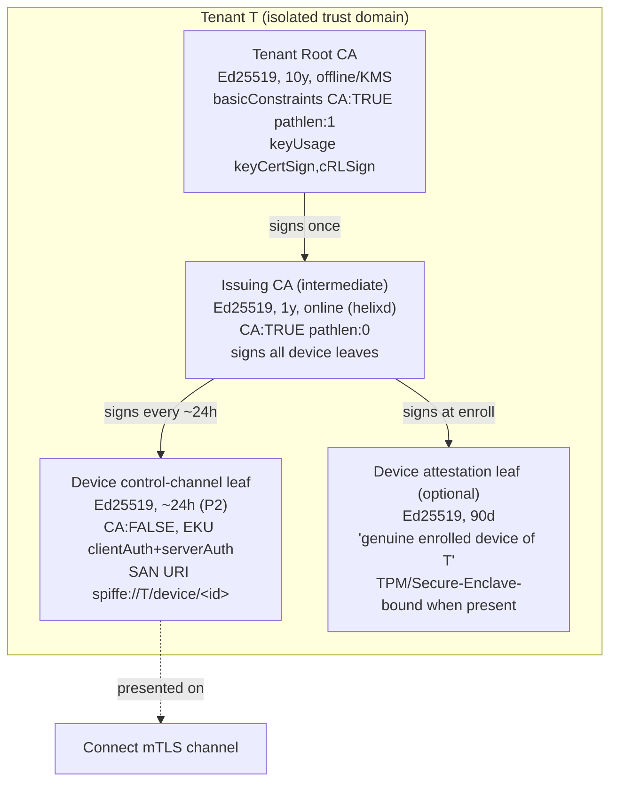
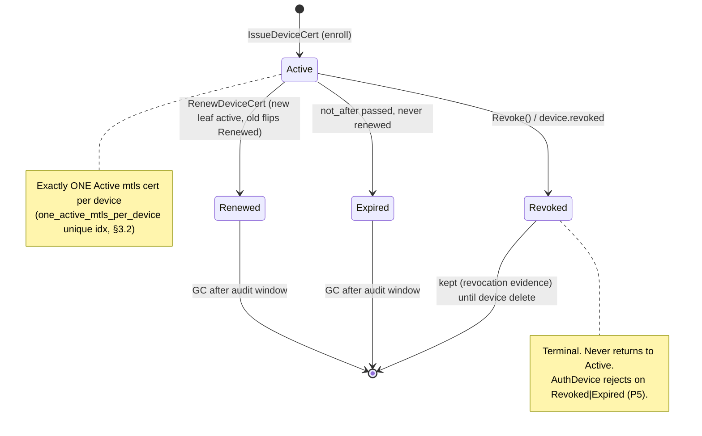
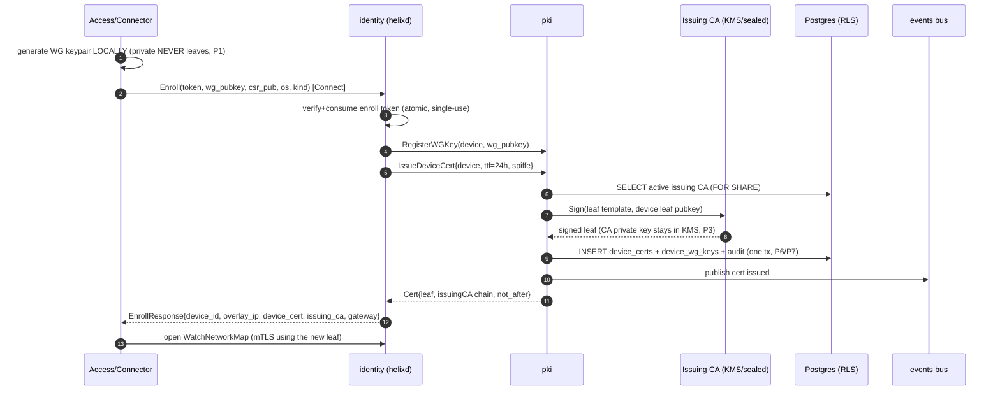
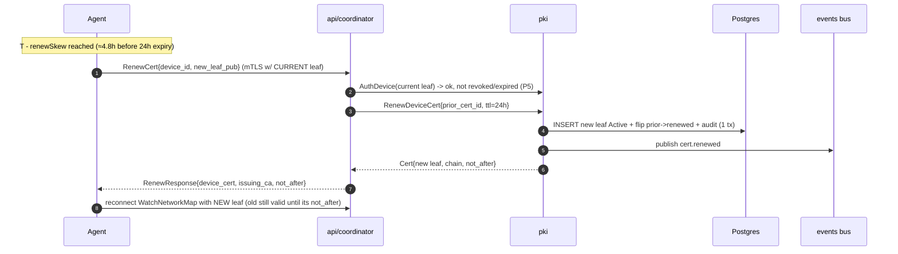

# pki service

**Revision:** 1
**Last modified:** 2026-06-25T00:00:00Z

> Master technical specification — Volume 3 (Control Plane, Go), service `internal/pki`.
> This document is the **nano-detail deepening** of [02-control-plane §9 (Identity,
> enrollment & PKI)] for the `pki` module: the tenant CA hierarchy, short-lived (~24h)
> mTLS device certificates (issue / auto-renew / revoke), the device WireGuard
> public-key registry (private key never leaves the device), the rotation schedule and
> on-revoke behaviour, and the optional post-quantum (ML-KEM) pre-shared material.
> SPEC ONLY — it describes the implementation; it does not build the product.
> Evidence cited inline by id: [04_P1 §n] = HelixVPN-Phase1-MVP.md; [04_ARCH §n] =
> HelixVPN-Architecture-Refined.md; [research-pki_pq_nat §n] = the cited PKI/PQ/NAT
> research; [02-CP §n] = 02-control-plane.md; [SYNTHESIS §n] = the cross-doc synthesis.
> Unproven facts are marked **UNVERIFIED** per constitution §11.4.6.

---

## 1. Scope, position & governing invariants

### 1.1 What this service owns

`internal/pki` is the credential-lifecycle authority of the control plane. It owns
**three** durable concerns and **one** ephemeral concern:

| # | Concern | Durable? | Owns table(s) |
|---|---|---|---|
| O1 | **Tenant CA hierarchy** — per-tenant root + issuing-CA key material + chain | yes | `ca_keys` |
| O2 | **Short-lived mTLS device certificates** — issue / auto-renew / revoke | yes | `device_certs` (extended from [02-CP §2.2]) |
| O3 | **WireGuard public-key registry** — bind 32-byte Curve25519 *public* key to a device; the private key never leaves the device (C6) | yes | `device_wg_keys` |
| O4 | **PQ pre-shared material (optional)** — ML-KEM-derived PSK metadata fed into the WG handshake | yes (metadata only) | `device_pq_material` |

It does **not** own: device rows (`registry`), overlay-IP allocation (`ipam`), policy
visibility (`policy`), enroll-token mint/consume (`identity`), or the data-path WG peer
config (the Rust edge, doc 01). It exposes its capabilities to those modules through the
`PKI` interface (§4.1) and emits events on the bus (§9); it never imports another
module's store (R1 of [02-CP §1.2]).

### 1.2 The WireGuard reality this design is built around

WireGuard has **no native PKI**: one Curve25519 keypair per device, the **public key IS
the device identity**, access = adding the peer's public key to the peer set, and
**revocation is structurally trivial** — remove the public key and the device is instantly
cut off; there is no CA, cert expiry, CRL, OCSP, or enrollment protocol in WireGuard
itself [research-pki_pq_nat §1.1]. Therefore the cert/PKI lifecycle, granular revocation,
and rotation are built **around** WireGuard, not inside it [research-pki_pq_nat §1.1].

The chosen pattern is the SPIFFE/SPIRE-style **two-identity split**
[research-pki_pq_nat §1.2]:

1. a **long-lived device-attestation cert** (a CA-signed leaf proving "I am a genuine
   enrolled device of tenant T"), and
2. a **short-lived mTLS credential** (the per-device control-channel cert, "I am
   authorised to call the control API right now"), auto-rotated by the agent before
   expiry.

Revocation therefore has two cooperating teeth (belt-and-suspenders, the dominant 2025
model) [research-pki_pq_nat §1.2/§1.3]:

- **(a) stop renewing** the short-lived mTLS cert → it self-expires within its TTL, AND
- **(b) remove the WG public key** from every peer set → instant data-path cutoff.

### 1.3 Governing invariants (every clause below obeys these)

| # | Invariant | Source |
|---|---|---|
| P1 | **Device private keys never leave the device.** The control plane receives and stores only the 32-byte WG *public* key. | [02-CP C6], [research-pki_pq_nat §1.3] |
| P2 | **Short-lived control-channel certs.** Default device-cert TTL ≈ **24h** ([04_P1 §6.3]); agent auto-renews ahead of expiry; revocation latency target == the **< 1 s** convergence SLO. | [04_P1 §6.3], [02-CP §9.3/§10.2] |
| P3 | **The tenant CA key is the one true secret.** Back it by KMS/HSM or offline; it + Postgres are the only stateful things to protect. Never git-tracked, never logged (§11.4.10). | [04_P1 §6.3], [04_ARCH §10] |
| P4 | **Hybrid-never-PQ-only PQ.** PQ is a **PSK fed into WG** (Mullvad/Rosenpass pattern), classical X25519 + ML-KEM; never a forked WG handshake, never PQ-only. | [research-pki_pq_nat §2.1/§2.4], [SYNTHESIS §4 Ph2] |
| P5 | **Default-deny, fail-closed.** A revoked or expired credential never authenticates; an unknown serial is rejected, not trusted. | [02-CP C4], [04_P1 §7.3] |
| P6 | **Every credential mutation emits a bus event** (R3) so `coordinator` and `audit` react without polling. | [02-CP §1.2 R3/§5.3] |
| P7 | **Tenant-isolated at the DB.** Every `pki` table is RLS-scoped under `FORCE ROW LEVEL SECURITY` and accessed only via `store.WithTenant` (C8). | [02-CP §2.3] |

---

## 2. CA hierarchy

### 2.1 The three-tier model (per tenant)

Each tenant gets its **own** isolated certificate hierarchy — there is no shared global
root (multi-tenant isolation reaches into the trust anchor, not just the row filter).



- **Tenant Root CA** — Ed25519, validity ~10y, `basicConstraints CA:TRUE, pathlen:1`,
  `keyUsage = keyCertSign,cRLSign`. **Held offline or in KMS/HSM** (P3); used exactly
  once per tenant to sign the issuing CA, then sealed. Its private key never touches the
  request path.
- **Issuing CA (intermediate)** — Ed25519, validity ~1y, `CA:TRUE, pathlen:0`. This is
  the **online** signer `helixd`/`pki` actually uses; rotating or compromising it does
  not require re-establishing the root. Stored encrypted at rest (KMS data key or
  sealed file under `/var/lib/helix/ca`, [02-CP §11.1 `Volume=helix-ca`]).
- **Device leaves** — Ed25519:
  - **Control-channel mTLS leaf** (O2): TTL ≈ 24h (P2), `CA:FALSE`,
    `EKU = clientAuth + serverAuth`, SAN = SPIFFE URI `spiffe://<tenant_id>/device/<device_id>`
    [research-pki_pq_nat §1.2 — structured URI bound at issuance, not IP/hostname].
  - **Device-attestation leaf** (optional, O1 companion): TTL ≈ 90d, proves genuine
    enrollment; TPM / Secure-Enclave-bound when the platform exposes it
    [research-pki_pq_nat §1.2]. **Phase-1 status:** the attestation leaf is *modelled and
    schema-provisioned* but the hardware-binding path is **Phase 2** — Phase 1 issues the
    mTLS leaf only and treats the device row + consumed enroll token as the attestation
    surrogate. Marked so honestly per §11.4.6; do not claim hardware attestation ships in
    Phase 1.

> **Key-algorithm choice — Ed25519 for all CA + leaf signing.** Rationale: small keys,
> fast sign/verify, no parameter pitfalls, broad TLS 1.3 support. **UNVERIFIED** whether
> every target platform's mTLS stack (HarmonyOS Network Kit, Aurora Qt TLS) accepts
> Ed25519 client certs; if a platform rejects them, that tenant's issuing CA MAY be
> provisioned as ECDSA-P256 instead — the `ca_keys.key_alg` column (§3.1) carries the
> choice so the issuer is algorithm-agnostic. This is a per-tenant provisioning decision,
> not a code branch in the hot path.

### 2.2 Chain delivery & verification

- The `EnrollResponse` (§8.1) ships the device leaf **plus the issuing-CA cert** so the
  agent can build and pin the chain root→issuing→leaf.
- The agent pins the **tenant root CA** public key (delivered once at enroll, embedded in
  the bootstrap bundle) and verifies every future leaf/issuing cert against it — so a
  rogue control plane cannot substitute a different root.
- The control plane (Connect server) verifies the **client** leaf against the tenant's
  issuing CA on every handshake (§8.2) — mutual.

### 2.3 CA rotation

- **Issuing-CA rotation** (scheduled ~annually or on suspected compromise): the root signs
  a *new* issuing CA; both old and new issuing certs are trusted during an overlap window
  (= the max device-cert TTL, 24h) so in-flight 24h leaves remain valid; after the window
  the old issuing CA is retired. New leaves are signed by the new issuing CA. Captured as
  rows in `ca_keys` (`status: active|retiring|retired`).
- **Root-CA rotation** (rare, multi-year): cross-sign the new root with the old during a
  long overlap; **operator-gated** (§11.4.66 / §11.4.101 — irreversible, high blast radius,
  cannot be auto-decided). Phase-1 spec models the schema + the manual `helixvpnctl ca
  rotate-root` path; automation is Phase 2.

---

## 3. Data model (DDL + RLS)

Extends [02-CP §2.2]. Three new tables (`ca_keys`, `device_wg_keys`,
`device_pq_material`) + the **extended** `device_certs`. Every table is tenant-scoped and
RLS-forced (P7).

### 3.1 `ca_keys` — the CA hierarchy

```sql
CREATE TYPE ca_tier   AS ENUM ('root','issuing');
CREATE TYPE ca_status AS ENUM ('active','retiring','retired','compromised');
CREATE TYPE key_alg   AS ENUM ('ed25519','ecdsa_p256');

CREATE TABLE ca_keys (
  id            uuid PRIMARY KEY DEFAULT gen_random_uuid(),
  tenant_id     uuid NOT NULL REFERENCES tenants(id) ON DELETE CASCADE,
  tier          ca_tier   NOT NULL,
  status        ca_status NOT NULL DEFAULT 'active',
  key_alg       key_alg   NOT NULL DEFAULT 'ed25519',
  parent_id     uuid REFERENCES ca_keys(id),         -- NULL for root; root.id for issuing
  cert_pem      text NOT NULL,                        -- the CA certificate (public)
  subject_skid  bytea NOT NULL,                       -- Subject Key Identifier (chain build)
  -- PRIVATE KEY HANDLING (P3): exactly one of the two is set, never the raw key in cleartext col.
  key_ref       text,                                 -- KMS/HSM key URN when KMS-backed
  key_sealed    bytea,                                -- envelope-encrypted DER (KMS data key) when file-backed
  not_before    timestamptz NOT NULL,
  not_after     timestamptz NOT NULL,
  created_at    timestamptz NOT NULL DEFAULT now(),
  retired_at    timestamptz,
  CONSTRAINT ca_key_material_present CHECK (key_ref IS NOT NULL OR key_sealed IS NOT NULL),
  CONSTRAINT ca_root_has_no_parent  CHECK ((tier = 'root') = (parent_id IS NULL))
);
-- exactly one ACTIVE issuing CA per tenant at a time (rotation uses 'retiring' overlap)
CREATE UNIQUE INDEX one_active_issuing_ca_per_tenant
  ON ca_keys (tenant_id) WHERE tier = 'issuing' AND status = 'active';
CREATE INDEX ON ca_keys (tenant_id, tier, status);
```

> The raw CA private key is **never** stored in a plaintext column (P3). `key_ref` points
> at a KMS/HSM URN (signing happens in the KMS, the key never enters `helixd` memory) OR
> `key_sealed` holds the DER private key envelope-encrypted under a KMS-wrapped data key
> (decrypted into memory only at sign time, zeroed after). A schema-lint asserts no column
> named `*_private*`/`*_secret*` holds cleartext — see §11.

### 3.2 `device_certs` — extended

The [02-CP §2.2] `device_certs` is extended with the full lifecycle fields:

```sql
CREATE TYPE cert_status AS ENUM ('active','renewed','expired','revoked');
CREATE TYPE cert_usage  AS ENUM ('mtls','attestation');

-- (extends the [02-CP §2.2] table; shown in full for nano-detail)
CREATE TABLE device_certs (
  id            uuid PRIMARY KEY DEFAULT gen_random_uuid(),
  tenant_id     uuid NOT NULL REFERENCES tenants(id) ON DELETE CASCADE,
  device_id     uuid NOT NULL REFERENCES devices(id) ON DELETE CASCADE,
  issuing_ca_id uuid NOT NULL REFERENCES ca_keys(id),
  usage         cert_usage  NOT NULL DEFAULT 'mtls',
  serial        text NOT NULL,                         -- 20-byte random hex; the mTLS lookup key (§8.2)
  spiffe_uri    text NOT NULL,                          -- spiffe://<tenant>/device/<device_id>
  fingerprint   bytea NOT NULL,                         -- SHA-256 of DER leaf (revocation set key)
  cert_pem      text NOT NULL,                          -- the issued leaf (public)
  status        cert_status NOT NULL DEFAULT 'active',
  not_before    timestamptz NOT NULL,
  not_after     timestamptz NOT NULL,                   -- ≈ now()+24h for mtls (P2)
  renewed_from  uuid REFERENCES device_certs(id),       -- chain: predecessor on rotation
  revoked_at    timestamptz,
  revoked_reason text,                                  -- closed-set §10.2 reason code
  created_at    timestamptz NOT NULL DEFAULT now(),
  UNIQUE (tenant_id, serial)
);
-- hot path: resolve a presented serial to a LIVE cert in O(1)
CREATE UNIQUE INDEX device_certs_serial_live
  ON device_certs (tenant_id, serial) WHERE status = 'active';
-- at most one ACTIVE mtls cert per device (renew flips the old to 'renewed')
CREATE UNIQUE INDEX one_active_mtls_per_device
  ON device_certs (device_id) WHERE usage = 'mtls' AND status = 'active';
CREATE INDEX ON device_certs (tenant_id, device_id) WHERE status = 'active';
CREATE INDEX ON device_certs (tenant_id, not_after) WHERE status = 'active'; -- renew sweeper (§6.3)
```

### 3.3 `device_wg_keys` — the WG public-key registry (C6/P1)

The WG identity is separated from the cert lifecycle: a device's WG public key changes on
WG-key rotation (§7) independently of its 24h mTLS cert.

```sql
CREATE TABLE device_wg_keys (
  id            uuid PRIMARY KEY DEFAULT gen_random_uuid(),
  tenant_id     uuid NOT NULL REFERENCES tenants(id) ON DELETE CASCADE,
  device_id     uuid NOT NULL REFERENCES devices(id) ON DELETE CASCADE,
  wg_pubkey     bytea NOT NULL,                         -- 32-byte Curve25519 PUBLIC key (NEVER private, P1)
  active        boolean NOT NULL DEFAULT true,
  rotated_from  uuid REFERENCES device_wg_keys(id),
  created_at    timestamptz NOT NULL DEFAULT now(),
  retired_at    timestamptz,
  CONSTRAINT wg_pubkey_len32 CHECK (octet_length(wg_pubkey) = 32),
  UNIQUE (tenant_id, wg_pubkey)
);
-- exactly one active WG key per device (rotation overlaps then retires the old)
CREATE UNIQUE INDEX one_active_wg_key_per_device
  ON device_wg_keys (device_id) WHERE active;
```

> `devices.wg_pubkey` from [02-CP §2.2] remains the *denormalised current* pubkey (a cache
> of the active row here) so `coordinator.buildMap` reads one table; `device_wg_keys` is
> the authoritative history + rotation ledger. A trigger (or the `pki` write path inside
> one `WithTenant` tx) keeps `devices.wg_pubkey` == the `active` row. The 32-byte CHECK is
> the structural guarantee a private key (also 32 bytes for Curve25519 — so length alone
> cannot distinguish) is never *accepted*: the API contract names the field `wg_pubkey`,
> the agent generates the pair locally and transmits only the public half (P1), and a
> §1.1 mutation test asserts the enroll/rotate handlers reject any payload that is not the
> agent-derived public key (verified by re-deriving the public key from a known private in
> the test fixture and asserting the stored value equals the *public*, never the private).

### 3.4 `device_pq_material` — optional PQ PSK metadata (P4)

PQ is a **PSK fed into WG** [research-pki_pq_nat §2.1]; the control plane stores only the
**metadata** needed to coordinate PSK derivation, **never** the PSK itself nor any PQ
private key (the PSK is established peer-to-peer / device↔gateway, ephemerally).

```sql
CREATE TYPE pq_kem AS ENUM ('none','x25519_mlkem768','x25519_mlkem768_mceliece');

CREATE TABLE device_pq_material (
  id            uuid PRIMARY KEY DEFAULT gen_random_uuid(),
  tenant_id     uuid NOT NULL REFERENCES tenants(id) ON DELETE CASCADE,
  device_id     uuid NOT NULL REFERENCES devices(id) ON DELETE CASCADE,
  kem           pq_kem NOT NULL DEFAULT 'none',
  mlkem_pubkey  bytea,                                  -- ML-KEM-768 encapsulation (PUBLIC) key, ~1184B
  psk_epoch     bigint NOT NULL DEFAULT 0,              -- monotonic; bumps on each PSK rotation (§7.3)
  last_rotated  timestamptz,
  enabled       boolean NOT NULL DEFAULT false,
  created_at    timestamptz NOT NULL DEFAULT now(),
  CONSTRAINT pq_pubkey_when_enabled CHECK (NOT enabled OR mlkem_pubkey IS NOT NULL),
  UNIQUE (tenant_id, device_id)
);
```

> **Stored:** the device's ML-KEM **public** encapsulation key + the PSK epoch counter +
> the negotiated KEM suite. **Never stored:** the derived PSK, the ML-KEM decapsulation
> (private) key, the X25519 private half. The actual PSK is mixed into the WG handshake at
> the endpoints (P4); the control plane only *coordinates which suite + which epoch*
> applies, and ships the peer's `mlkem_pubkey` inside the network map so two endpoints can
> encapsulate to each other. Phase-1 default `kem='none', enabled=false` (PQ is Phase 2 in
> the roadmap, [SYNTHESIS §4]) — the table + plumbing exist so enabling it is config, not a
> schema change.

### 3.5 RLS (identical pattern, all four tables)

```sql
-- applied to ca_keys, device_certs, device_wg_keys, device_pq_material:
ALTER TABLE device_certs ENABLE ROW LEVEL SECURITY;
ALTER TABLE device_certs FORCE  ROW LEVEL SECURITY;   -- applies even to the owner (C8)
CREATE POLICY tenant_isolation ON device_certs
  USING      (tenant_id = current_setting('app.tenant_id')::uuid)
  WITH CHECK (tenant_id = current_setting('app.tenant_id')::uuid);
-- helixd connects as helix_app (non-superuser, non-owner); RLS is the floor under RBAC.
```

All `pki` DB access runs through `store.WithTenant` (R4, [02-CP §2.3]); the CA signing
read of `ca_keys` for the *active issuing CA* runs inside the same tenant tx as the cert
insert so issuance is atomic with its audit row.

---

## 4. Go interface & type surface

### 4.1 The `PKI` interface (extends [02-CP §1.3])

```go
// internal/pki/iface.go
package pki

import (
    "context"
    "crypto/x509"
    "time"
    "github.com/google/uuid"
)

type PKI interface {
    // --- CA lifecycle (O1) ---
    ProvisionTenantCA(ctx context.Context, t uuid.UUID, opt CAOptions) (CAChain, error)
    RotateIssuingCA(ctx context.Context, t uuid.UUID) (CAChain, error)

    // --- device mTLS certs (O2) ---
    IssueDeviceCert(ctx context.Context, in IssueInput) (Cert, error)          // enroll path
    RenewDeviceCert(ctx context.Context, in RenewInput) (Cert, error)          // auto-renew (§6)
    Revoke(ctx context.Context, deviceID uuid.UUID, reason RevokeReason) error // < 1s (P2/§9.3)
    AuthDevice(ctx context.Context, leaf *x509.Certificate) (AuthedDevice, error) // hot path (§8.2)

    // --- WG public-key registry (O3/C6) ---
    RegisterWGKey(ctx context.Context, deviceID uuid.UUID, pub WGPublicKey) error
    RotateWGKey(ctx context.Context, deviceID uuid.UUID, newPub WGPublicKey) (WGRotation, error)
    ActiveWGKey(ctx context.Context, deviceID uuid.UUID) (WGPublicKey, error)

    // --- optional PQ material (O4/P4) ---
    SetPQMaterial(ctx context.Context, deviceID uuid.UUID, m PQMaterial) error
    RotatePSKEpoch(ctx context.Context, deviceID uuid.UUID) (int64, error)
}
```

### 4.2 Concrete types

```go
// internal/pki/types.go

type CAOptions struct {
    KeyAlg      KeyAlg        // ed25519 (default) | ecdsa_p256
    RootTTL     time.Duration // ≈ 10y
    IssuingTTL  time.Duration // ≈ 1y
    KMSKeyRef   string        // non-empty => KMS-backed (P3); else file-sealed
}
type KeyAlg uint8
const ( KeyAlgEd25519 KeyAlg = iota; KeyAlgECDSAP256 )

type CAChain struct {
    RootCertPEM    []byte
    IssuingCertPEM []byte
    IssuingCAID    uuid.UUID
}

type IssueInput struct {
    TenantID uuid.UUID
    DeviceID uuid.UUID
    TTL      time.Duration // default 24h (P2); clamped to [maxRenewSkew, 7d]
    SPIFFE   string        // spiffe://<tenant>/device/<device>
}
type RenewInput struct {
    TenantID  uuid.UUID
    DeviceID  uuid.UUID
    PriorCert uuid.UUID    // device_certs.id being renewed (chain via renewed_from)
    TTL       time.Duration
}

type Cert struct {
    ID         uuid.UUID
    Serial     string
    SPIFFE     string
    LeafPEM    []byte
    IssuingPEM []byte       // chain for the agent
    NotBefore  time.Time
    NotAfter   time.Time
}

type AuthedDevice struct {
    DeviceID uuid.UUID
    TenantID uuid.UUID
    CertID   uuid.UUID
    Revoked  bool          // belt-and-suspenders: caller still rejects (P5)
    Expired  bool
}

type WGPublicKey [32]byte           // Curve25519 PUBLIC key only (P1)
type WGRotation struct {
    OldKey, NewKey WGPublicKey
    RotatedAt      time.Time
}

type PQMaterial struct {
    KEM         PQKem               // none | x25519_mlkem768 | x25519_mlkem768_mceliece
    MLKEMPubKey []byte              // ML-KEM-768 encapsulation (public) key (~1184B)
    Enabled     bool
}
type PQKem uint8
const ( PQNone PQKem = iota; PQX25519MLKEM768; PQX25519MLKEM768McEliece )

type RevokeReason uint8
const (
    RevokeManual RevokeReason = iota // operator/Console action
    RevokeCompromise                 // suspected key compromise
    RevokeSuperseded                 // replaced by re-enroll
    RevokeDeprovision                // device decommissioned
)
```

### 4.3 The signer seam (KMS vs file)

```go
// internal/pki/signer.go — the CA-key signing seam; the private key never leaves the
// chosen backend's trust boundary (P3). Same interface for both backends.
type CASigner interface {
    // Sign produces an X.509 leaf for tmpl signed by the tenant's active issuing CA.
    Sign(ctx context.Context, t uuid.UUID, tmpl *x509.Certificate, leafPub crypto.PublicKey) ([]byte, error)
}
// kmsSigner: tmpl digest sent to KMS Sign API; raw key stays in the HSM/KMS.
// fileSigner: key_sealed envelope-decrypted into a locked, zeroed-after buffer.
```

---

## 5. Certificate issuance — state machine & flow

### 5.1 Device-cert lifecycle state machine



### 5.2 Issuance algorithm (enroll path)

`IssueDeviceCert` runs inside the same `WithTenant` tx as the enroll device-insert
([02-CP §9.2]) so a half-enrolled device with a cert but no row cannot exist.

```go
func (s *Service) IssueDeviceCert(ctx context.Context, in IssueInput) (Cert, error) {
    if in.TTL == 0 { in.TTL = 24 * time.Hour }            // P2 default
    if in.TTL < minTTL || in.TTL > maxTTL {               // [renewSkew, 7d] — fail-closed (P5)
        return Cert{}, ErrCertTTLOutOfRange
    }
    var out Cert
    err := s.store.WithTenant(ctx, in.TenantID, func(q *db.Queries) error {
        ca, err := q.ActiveIssuingCA(ctx, in.TenantID)    // FOR SHARE
        if err != nil { return ErrNoActiveCA }            // §10.2
        serial := randSerial(20)                          // 20 random bytes
        tmpl := leafTemplate(in.SPIFFE, serial, time.Now(), in.TTL) // EKU clientAuth+serverAuth
        leafPEM, err := s.signer.Sign(ctx, in.TenantID, tmpl, in.LeafPub)
        if err != nil { return err }
        row, err := q.InsertDeviceCert(ctx, db.InsertCertParams{
            TenantID: in.TenantID, DeviceID: in.DeviceID, IssuingCaID: ca.ID,
            Usage: "mtls", Serial: serial, SpiffeUri: in.SPIFFE,
            Fingerprint: sha256DER(leafPEM), CertPem: leafPEM,
            NotBefore: tmpl.NotBefore, NotAfter: tmpl.NotAfter,
        })
        if err != nil { return err }                      // unique-idx violation => bug, surfaced
        if err := q.InsertAudit(ctx, audit("cert.issued", in.DeviceID, serial)); err != nil {
            return err
        }
        out = Cert{ID: row.ID, Serial: serial, SPIFFE: in.SPIFFE, LeafPEM: leafPEM,
            IssuingPEM: ca.CertPem, NotBefore: tmpl.NotBefore, NotAfter: tmpl.NotAfter}
        return nil
    })
    if err != nil { return Cert{}, err }
    _, _ = s.bus.Publish(ctx, "events:devices", events.New("cert.issued",
        in.TenantID, "system", map[string]any{"device_id": in.DeviceID, "serial": out.Serial}))
    return out, nil
}
```

### 5.3 Enroll → issue sequence (the device never surrenders its private key, P1)



---

## 6. Auto-renew (the ~24h cadence)

### 6.1 Who drives renewal

The **agent** drives renewal over the **existing authenticated channel** ([04_P1 §6.3],
[research-pki_pq_nat §1.2 — auto-rotated by the agent before expiry]). It renews at
**T − renewSkew** where `renewSkew = max(1h, 0.2 × TTL)` → for a 24h TTL the agent renews
~4.8h before expiry, giving generous margin for a flapping link. The renew RPC is
authenticated by the *current still-valid* leaf, so renewal never needs the enroll token
again.

### 6.2 Renew RPC + algorithm

```go
func (s *Service) RenewDeviceCert(ctx context.Context, in RenewInput) (Cert, error) {
    // caller (api/coordinator) has already AuthDevice'd the CURRENT leaf (P5).
    return s.issueRenew(ctx, in) // same tx shape as §5.2 but:
    //  - new leaf inserted Active
    //  - q.MarkCertRenewed(priorCertID) flips prior -> 'renewed' (one_active_mtls_per_device holds)
    //  - renewed_from = priorCertID (chain)
    //  - WG pubkey unchanged (renewal != WG rotation; those are independent, §7)
    //  - audit "cert.renewed"; bus "cert.renewed"
}
```

> Renewal does **not** rotate the WG key and does **not** interrupt the open
> `WatchNetworkMap` stream (the stream keeps using the still-valid old leaf until the agent
> reconnects with the new one; both leaves are valid during the overlap because the old is
> only flipped to `renewed` — `AuthDevice` accepts `renewed` for the remainder of its
> `not_after` to avoid a mid-stream cutoff). This is the **only** non-`active` status
> `AuthDevice` tolerates, and only until the old `not_after`.

### 6.3 Server-side expiry sweeper (safety net, not the primary path)

A background sweeper (one per `helixd`, leader-elected via a Redis lock so N replicas don't
duplicate) runs every 60s:

```sql
-- mark leaves whose not_after has passed and that were never renewed
UPDATE device_certs SET status='expired'
 WHERE status='active' AND not_after < now();
```

An expired-but-still-streaming device is force-reconnected (its `AuthDevice` now fails →
the stream is closed by the next keepalive boundary). The sweeper is a **safety net** — the
agent's proactive renewal (§6.1) is the primary path; the sweeper only catches agents that
went away. `helix_pki_certs_expired_total` counts sweeps for the §10 SLO.

### 6.4 Renew sequence



---

## 7. WG public-key registry & rotation

### 7.1 Registration (C6/P1)

`RegisterWGKey` stores the 32-byte Curve25519 **public** key as the device's active WG
identity. The private key was generated on the device and is never transmitted
[research-pki_pq_nat §1.3]. The active row also denormalises into `devices.wg_pubkey` so
`coordinator.buildMap` reads one table ([02-CP §6.2]).

### 7.2 WG-key rotation (overlap-then-retire)

WG-key rotation is independent of cert renewal (a device can keep its 24h-cert cadence
while rotating its WG key on a slower schedule or on demand):

```go
func (s *Service) RotateWGKey(ctx context.Context, deviceID uuid.UUID, newPub WGPublicKey) (WGRotation, error) {
    // one tx: insert newPub active, mark old retired (rotated_from set), update devices.wg_pubkey
    // emit wg.key.rotated -> coordinator pushes a MapDelta replacing the peer's wg_pubkey to
    // EVERY node that may reach this device (need-to-know, C4). Edge swaps the WG peer key.
}
```

> **Overlap window:** because the data path is hub-and-spoke through the gateway in MVP
> ([02-CP §6.2]), the gateway holds both old+new WG peer keys for a short window (default
> 30s) so in-flight handshakes complete, then drops the old — preventing a momentary
> blackout. The window is `UNVERIFIED` as a tuned value; it MUST be validated by the §10
> rotation soak (no dropped sessions across rotation) before being treated as fact.

### 7.3 PQ PSK epoch rotation (when enabled, P4)

When `device_pq_material.enabled`, the PSK is rotated by bumping `psk_epoch` and
re-publishing the peer ML-KEM public keys in the network map; the endpoints re-derive a
fresh PSK via X25519+ML-KEM-768 encapsulation and mix it into the WG handshake
[research-pki_pq_nat §2.1/§2.4]. Rosenpass-style aggressive rotation refreshes the
symmetric key every ~2 min [research-pki_pq_nat §2.3]; HelixVPN's control-plane role is
only to bump the epoch + ship the public keys — **the PSK itself is never seen by the
control plane** (P4). Cadence is a tenant setting; the default when enabled is epoch bump
on WG-key rotation + a slow timer (Phase-2 tuning).

---

## 8. Protobuf & API surface

### 8.1 Protobuf additions (`helix.coordinator.v1`)

Extends the [02-CP §4] `Coordinator` service (package **`helix.coordinator.v1`**, unified
across the set). PKI adds `RenewCert` + `RotateWGKey` RPCs and PQ/chain fields:

```protobuf
// proto/helix/coordinator/v1/coordinator.proto  (package helix.coordinator.v1)

service Coordinator {
  // ... Enroll, WatchNetworkMap, AdvertisePrefixes, ReportStatus from [02-CP §4] ...

  // Auto-renew the short-lived mTLS device cert over the EXISTING channel (P2/§6).
  rpc RenewCert(RenewCertRequest) returns (RenewCertResponse);

  // Rotate the device WG public key (independent of cert renewal, §7.2).
  rpc RotateWGKey(RotateWGKeyRequest) returns (RotateWGKeyResponse);
}

message EnrollResponse {                 // extends [02-CP §4]
  string device_id   = 1;
  string overlay_ip  = 2;
  bytes  device_cert = 3;                // short-lived mTLS leaf (DER)
  bytes  issuing_ca  = 4;                // issuing-CA cert so the agent builds the chain (§2.2)
  bytes  root_ca     = 5;                // tenant root CA to PIN (verify future leaves, §2.2)
  GatewayInfo gateway = 6;
  PQParams    pq      = 7;               // PQ suite the tenant negotiated (none in Ph1)
}

message RenewCertRequest {
  string device_id    = 1;
  bytes  new_leaf_pub = 2;               // device-generated leaf PUBLIC key (private stays local, P1)
}
message RenewCertResponse {
  bytes  device_cert = 1;                // new 24h leaf
  bytes  issuing_ca  = 2;
  int64  not_after_unix = 3;
}

message RotateWGKeyRequest  { string device_id = 1; bytes new_wg_pubkey = 2; } // 32B public (P1)
message RotateWGKeyResponse { bool accepted = 1; }

message PQParams {
  enum Kem { KEM_NONE = 0; KEM_X25519_MLKEM768 = 1; KEM_X25519_MLKEM768_MCELIECE = 2; }
  Kem    kem          = 1;
  bytes  mlkem_pubkey = 2;               // peer's ML-KEM-768 encapsulation key when enabled (P4)
  int64  psk_epoch    = 3;
}

// Peer (extends [02-CP §4]) gains the peer's PQ public material so endpoints can encapsulate.
message Peer {
  string device_id    = 1;
  bytes  wg_pubkey     = 2;
  repeated string allowed_ips = 3;
  string endpoint      = 4;
  bool   is_connector  = 5;
  repeated Via6Route via6 = 6;
  PQParams pq          = 7;              // present only when the tenant has PQ enabled (P4)
}
```

> `RenewCert` and `RotateWGKey` carry only **public** key bytes (P1). `buf generate` emits
> Go/Dart/Rust stubs from this one file — the agent's renewal logic cannot drift from the
> server's expectation ([02-CP §4]).

### 8.2 Hot-path device authentication (`AuthDevice`)

Every agent RPC (`WatchNetworkMap`/`AdvertisePrefixes`/`ReportStatus`/`RenewCert`/
`RotateWGKey`) is authenticated by the presented mTLS leaf. `AuthDevice` resolves the leaf
to a device and applies fail-closed checks (P5):

```go
func (s *Service) AuthDevice(ctx context.Context, leaf *x509.Certificate) (AuthedDevice, error) {
    serial := serialHex(leaf.SerialNumber)
    // 1. chain: verify leaf against the tenant issuing CA (root pinned client-side, §2.2)
    if err := s.verifyChain(ctx, leaf); err != nil { return AuthedDevice{}, ErrCertChainInvalid }
    // 2. resolve serial -> live cert row (unique idx device_certs_serial_live, §3.2)
    row, err := s.lookupBySerial(ctx, serial)       // accepts status active OR (renewed && now<not_after)
    if err != nil { return AuthedDevice{}, ErrCertUnknownSerial }     // unknown => reject (P5)
    if row.Status == "revoked" { return AuthedDevice{}, ErrCertRevoked }
    if time.Now().After(row.NotAfter) { return AuthedDevice{}, ErrCertExpired }
    // 3. SPIFFE URI in leaf SAN must match the resolved device (binding, not just serial)
    if leaf.URIs[0].String() != row.SpiffeUri { return AuthedDevice{}, ErrSpiffeMismatch }
    return AuthedDevice{DeviceID: row.DeviceID, TenantID: row.TenantID, CertID: row.ID}, nil
}
```

A **fast revocation cache** (in-memory `map[serial]struct{}` of revoked serials, hydrated
from `device_certs WHERE status='revoked'` on boot and updated by the `device.revoked`
event) lets `AuthDevice` reject a revoked serial without a DB round-trip on the hot path —
the cache is the data structure that makes the **< 1 s** revocation SLO (§10) achievable on
open streams.

### 8.3 REST + authz (admin/operator/console surfaces)

| Route | admin | operator | member | Effect |
|---|---|---|---|---|
| `POST /v1/devices/{id}/revoke` | ✓ | ✗ | ✗ | `Revoke()` → `device.revoked` (§9.3) |
| `POST /v1/devices/{id}/rotate-wg` | ✓ | ✓ | ✗ | `RotateWGKey()` |
| `GET  /v1/devices/{id}/certs` | ✓ | ✓ | own | list cert lifecycle (audit) |
| `POST /v1/ca/rotate-issuing` | ✓ | ✗ | ✗ | `RotateIssuingCA()` |
| `POST /v1/ca/rotate-root` | ✓ | ✗ | ✗ | operator-gated (§2.3, §11.4.66) |
| `POST /v1/tenants/{id}/pq` | ✓ | ✗ | ✗ | enable/disable PQ suite |

RBAC gates the route; RLS is the database floor even if RBAC is misconfigured (defense in
depth, [02-CP §8.1]). Agent RPCs use device mTLS (§8.2); `Enroll` is the only
unauthenticated RPC (it validates a single-use hashed enroll token, [02-CP §8.2]).

---

## 9. Events & revocation convergence

### 9.1 Event envelopes (bus-agnostic, [02-CP §5.2])

```json
{ "id":"<stream-id>", "type":"cert.issued", "tenant_id":"uuid", "ts":"RFC3339",
  "actor":"user-uuid|system", "trace_id":"...", "payload":{"device_id":"uuid","serial":"hex"} }
```

| Type | Stream | Payload | Coordinator / consumer reaction |
|---|---|---|---|
| `cert.issued` | `events:devices` | `{device_id, serial}` | audit; no map change (issue is paired with `device.enrolled`) |
| `cert.renewed` | `events:devices` | `{device_id, serial, prior_serial}` | audit; revocation cache unaffected |
| `device.revoked` | `events:devices` | `{device_id, serial, reason}` | **remove node**; push peer-removal `MapDelta` to everyone who saw it; edge drops WG peer; add serial to revoke cache (§8.2) |
| `wg.key.rotated` | `events:devices` | `{device_id, old_pub, new_pub}` | push `MapDelta` replacing the peer `wg_pubkey` to all nodes that may reach it (C4) |
| `pq.psk.rotated` | `events:devices` | `{device_id, psk_epoch}` | push updated `PQParams` to relevant peers (when PQ enabled) |
| `ca.issuing.rotated` | `events:gateway` | `{tenant_id, old_ca, new_ca}` | extend trust set during overlap window (§2.3) |

### 9.2 Revocation algorithm (the two teeth, P5)

```go
func (s *Service) Revoke(ctx context.Context, deviceID uuid.UUID, reason RevokeReason) error {
    var serial string
    err := s.store.WithTenant(ctx, tenantOf(ctx), func(q *db.Queries) error {
        // tooth (a): stop renewing — mark the LIVE mtls cert revoked (self-expiry safety net)
        c, err := q.RevokeActiveCert(ctx, db.RevokeParams{DeviceID: deviceID,
            Reason: reason.String(), RevokedAt: time.Now()})
        if err != nil { return err }
        serial = c.Serial
        // tooth (b): retire the WG key so the data path is cut even before TTL
        if err := q.RetireWGKey(ctx, deviceID); err != nil { return err }
        return q.InsertAudit(ctx, audit("device.revoke", deviceID, reason.String()))
    })
    if err != nil { return err }
    s.revokeCache.Add(serial)                            // instant hot-path reject (§8.2)
    _, err = s.bus.Publish(ctx, "events:devices", events.New("device.revoked",
        tenantOf(ctx), actorOf(ctx), map[string]any{
            "device_id": deviceID, "serial": serial, "reason": reason.String()}))
    return err
}
```

### 9.3 Revoke → enforced sequence (< 1 s, P2)

```mermaid
sequenceDiagram
    autonumber
    participant Admin as Console (admin)
    participant API as api (Gin)
    participant PKI as pki
    participant Store as Postgres
    participant Cache as revoke cache
    participant Bus as Redis Streams
    participant Coord as coordinator
    participant Edge as Rust edge
    Admin->>API: POST /v1/devices/{id}/revoke
    API->>PKI: Revoke(device, reason)
    PKI->>Store: revoke cert + retire WG key + audit (1 tx)
    PKI->>Cache: add serial (hot-path reject instantly, §8.2)
    PKI->>Bus: XADD device.revoked
    Bus-->>Coord: XReadGroup delivers
    Coord->>Coord: remove node; compute minimal affected set (C4)
    loop each affected open WatchNetworkMap stream
        Coord->>Edge: stream.Send(MapDelta remove_peer_ids=[device])
    end
    Coord->>Edge: force-close the revoked device's OWN stream (cert now in revoke cache)
    Edge->>Edge: remove kernel WG peer -> data path cut
    Note over Admin,Edge: event->enforced p99 < 1 s (§10), ZERO restarts
```

---

## 10. Error taxonomy & SLOs

### 10.1 Error taxonomy (Connect/gRPC code mapping; fail-closed, P5)

| Sentinel | Connect code | When | Caller action |
|---|---|---|---|
| `ErrNoActiveCA` | `FailedPrecondition` | tenant has no active issuing CA at issue time | provision CA (`ProvisionTenantCA`); operator alert |
| `ErrCertTTLOutOfRange` | `InvalidArgument` | requested TTL ∉ [renewSkew, 7d] | clamp / reject |
| `ErrCertChainInvalid` | `Unauthenticated` | leaf fails chain verify vs issuing CA | re-enroll |
| `ErrCertUnknownSerial` | `Unauthenticated` | presented serial not in live set | re-enroll |
| `ErrCertRevoked` | `PermissionDenied` | serial in revoke set | terminal; device must re-enroll |
| `ErrCertExpired` | `Unauthenticated` | `now > not_after`, never renewed | renew / re-enroll |
| `ErrSpiffeMismatch` | `Unauthenticated` | leaf SAN URI ≠ resolved device | reject (possible cert-swap attack) |
| `ErrWGKeyLen` | `InvalidArgument` | WG pubkey ≠ 32 bytes | client bug; reject |
| `ErrWGKeyDuplicate` | `AlreadyExists` | pubkey already bound (tenant unique) | regenerate key |
| `ErrPQDisabled` | `FailedPrecondition` | PQ op on a tenant with PQ disabled | enable suite first |
| `ErrEnrollTokenInvalid` | `Unauthenticated` | token unknown / consumed / expired | mint a fresh token |
| `ErrRevokeRace` | `Aborted` | concurrent revoke/renew on same device | retry (idempotent) |

> All errors are **honest** (§11.4.1 — a FAIL is a real product condition, never a
> set-`-u` crash); none degrades to a silent PASS. `ErrNoActiveCA`/`ErrPQDisabled` are
> `FailedPrecondition` not `Internal` so the caller can act.

### 10.2 Revoke-reason closed set (`device_certs.revoked_reason`)

`{ manual | compromise | superseded | deprovision }` — the §4.2 `RevokeReason` enum
stringified; any other value rejected at the DB CHECK and the API validator (no free-text
reasons leak into the audit trail, keeping §11.4.6 no-guessing).

### 10.3 SLOs (anti-bluff acceptance numbers, [02-CP §10.2])

| Metric | Target | How measured |
|---|---|---|
| device revoke → edge WG-peer removed | **p99 < 1 s** | `helix_pki_revoke_seconds` histogram, revoke-call → edge confirms peer gone |
| cert issue (enroll path) | < 150 ms | `helix_pki_issue_seconds` |
| cert renew round-trip | < 150 ms | `helix_pki_renew_seconds` |
| `AuthDevice` hot path (cache hit) | < 1 ms | `helix_pki_authdevice_seconds` |
| WG-key rotation → no dropped session | 0 drops across overlap | rotation soak (§11), edge session-continuity counter |
| CA issuing-rotation overlap | no leaf rejected during window | 24h overlap soak |

---

## 11. Test points (constitution §11.4.169 — comprehensive test-type coverage)

§11.4.169 mandates comprehensive coverage by every test type the domain warrants (the
§11.4.27 vocabulary); each `pki` capability maps to concrete, anti-bluff test points with
captured evidence (§11.4.5/§11.4.69/§11.4.107). Per §11.4.119 the WG-rotation/revoke tests
own the shared edge resource exclusively; per §11.4.85 stress+chaos are mandatory.

| Test type | Concrete `pki` test point | Evidence / anti-bluff |
|---|---|---|
| **unit** | issuance leaf has EKU clientAuth+serverAuth, 24h `not_after`, SPIFFE SAN; `RevokeReason` round-trips; ML-KEM pubkey length ~1184B | golden cert DER asserted field-by-field |
| **unit (property)** | `IssueDeviceCert` then `AuthDevice` accepts; revoked never authenticates (P5) — fuzz serials | property test, 10k cases |
| **unit (privacy, P1)** | enroll/rotate handlers store the *public* key: re-derive pub from a known WG private fixture, assert stored == public, NEVER the private | §1.1 mutation: feed a private-shaped key → handler MUST reject |
| **integration** | spin Postgres+Redis on-demand via `vasic-digital/containers` (§11.4.76, not ad-hoc docker); enroll → issue → renew → revoke; assert `device_certs` state machine transitions | captured DB snapshots + bus event log |
| **integration (RLS, C8)** | tenant A cannot `SELECT`/`UPDATE` tenant B's `ca_keys`/`device_certs`/`device_wg_keys` even with crafted query, running as `helix_app` under `FORCE ROW LEVEL SECURITY` | denial proven, not assumed |
| **e2e** | full enroll→WatchNetworkMap(mTLS)→renew-over-channel→revoke→stream force-closed, driven by generated agent stub | captured stream transcript |
| **security** | reject `ErrSpiffeMismatch` cert-swap; reject expired/revoked; CA private key never appears in process memory dump nor any log line (P3); schema-lint asserts no cleartext `*_private*`/`*_secret*` column | memory-scan + log-grep evidence; paired §1.1 mutation adds a plaintext key column → lint FAILs |
| **performance / benchmark** | `IssueDeviceCert` < 150 ms; `AuthDevice` cache-hit < 1 ms (§10.3) | `go test -bench` histograms |
| **scaling** | 10k devices each with a live 24h cert; renew-sweeper at 60s cadence stays bounded | `process_resident_memory_bytes` slope ≈ 0 |
| **stress** (§11.4.85) | N≥100 concurrent enroll+revoke on the same tenant; no double-active-cert (unique idx holds); p50/p95/p99 latency recorded | `latency.json` captured |
| **chaos** (§11.4.85) | SIGKILL `helixd` mid-issue (tx atomic → no orphan cert without device row); Redis drop mid-revoke (PEL reclaimed via XAUTOCLAIM, [02-CP §5.4]) → revoke still converges < 1 s on recovery | `recovery_trace.log` |
| **soak (24h)** | continuous 24h-cert renewal churn + WG-key rotations; assert zero dropped sessions across rotation overlap (§7.2 window validated, removing the `UNVERIFIED` tag) | session-continuity counter |
| **Challenge / HelixQA** (§11.4.27/.107) | a Challenge drives enroll→revoke and asserts edge WG-peer removed **< 1 s** with captured runtime evidence (the revoke-SLO anti-bluff) | `result.json` + captured timing |
| **meta-test (§1.1)** | every recommended gate (`CM-PKI-NO-PRIVATE-KEY-STORED`, `CM-REVOKE-SLO`, the schema-lint) has a paired mutation that makes it FAIL | mutation FAILs proven |

---

## 12. Phase → task plan (workable items, §11.4.93)

Risk-descending (§11.4.132): the privacy + revocation correctness floor first.

- **PKI-T1 — CA hierarchy + signer seam.**
  - PKI-T1.1 `ca_keys` DDL + RLS; `ProvisionTenantCA` (root offline/KMS → issuing online).
  - PKI-T1.2 `CASigner` seam (KMS + file-sealed backends, P3); no cleartext key column lint.
  - PKI-T1.3 `RotateIssuingCA` overlap window (§2.3); `helixvpnctl ca rotate-issuing`.
- **PKI-T2 — device mTLS lifecycle.**
  - PKI-T2.1 `device_certs` extended DDL + state machine (§5.1); `IssueDeviceCert` (enroll tx).
  - PKI-T2.2 `RenewDeviceCert` + agent renew RPC (§6) + expiry sweeper (§6.3).
  - PKI-T2.3 `AuthDevice` hot path + revoke cache (§8.2).
- **PKI-T3 — revocation (< 1 s).**
  - PKI-T3.1 `Revoke` two-teeth (§9.2) + `device.revoked` event + stream force-close.
  - PKI-T3.2 `helix_pki_revoke_seconds` SLO histogram + the §11 Challenge.
- **PKI-T4 — WG public-key registry (C6).**
  - PKI-T4.1 `device_wg_keys` DDL + `RegisterWGKey` (P1 privacy mutation test).
  - PKI-T4.2 `RotateWGKey` overlap-then-retire (§7.2) + `wg.key.rotated` delta.
- **PKI-T5 — PQ pre-shared material (optional, Phase-2-ready).**
  - PKI-T5.1 `device_pq_material` DDL + `PQParams` proto + per-tenant enable (§3.4/§8.1).
  - PKI-T5.2 `RotatePSKEpoch` + `pq.psk.rotated` event (control plane never sees the PSK, P4).
- **PKI-T6 — gates + QA.** schema-lint (no cleartext key), `CM-PKI-NO-PRIVATE-KEY-STORED`,
  `CM-REVOKE-SLO`, the §11 test matrix end-to-end with captured evidence.

---

## 13. Phase-2 forward seams (additive, not a rewrite)

The Phase-1 seams extend without reshaping: the optional attestation leaf gains TPM /
Secure-Enclave hardware binding [research-pki_pq_nat §1.2]; `device_pq_material` flips
`enabled=true` with `kem='x25519_mlkem768'` (Mullvad-parity adds `+mceliece`)
[research-pki_pq_nat §2.2/§2.4] and the PSK feeds the WG handshake at the endpoints
(Rosenpass/`wgephemeralpeer` template) [research-pki_pq_nat §2.2]; the `CASigner` swaps
file-sealed → HSM with no caller change; CA-rotation automation replaces the operator-gated
manual path; the revoke cache federates across regional `helixd` over NATS JetStream (the
`events.Bus` swap, [02-CP §14]). Phase 2 is additive because Phase 1 drew the seams — the
`PKI` interface, the signer seam, the four RLS tables, and the bus events — in the right
places.

---

### Sources

[04_P1] HelixVPN-Phase1-MVP.md §6 (identity/enrollment/PKI, device_certs, Enroll RPC,
24h cert, revoke < 1 s) · [04_ARCH] HelixVPN-Architecture-Refined.md §4 (pki module: WG key
registry, short-lived device certs, rotation, PQ handshake material; key hierarchy;
backups = Postgres + PKI root) · [02-CP] 02-control-plane.md §§1.3/2/4/5/8/9/10/14 (PKI
interface, device_certs DDL, RLS, proto `helix.coordinator.v1`, events, authz, enroll
sequence, SLOs) · [research-pki_pq_nat] §1 (WG native identity, no built-in PKI, SPIFFE/SPIRE
two-identity split, short-lived SVID auto-rotate, revocation = stop-renew + remove-pubkey),
§2 (PSK-injection PQ, hybrid-never-PQ-only, Mullvad McEliece+ML-KEM default-on-desktop
2025-01-09, `wgephemeralpeer`, Rosenpass 2-min PSK refresh, FIPS-203 ML-KEM, hybrid
X25519+ML-KEM-768) · [SYNTHESIS] §§2/4/7/9 (stack floor, phased roadmap PQ in Phase 2,
security invariants, constitution bindings). Access date for all research: 2026-06-25.
