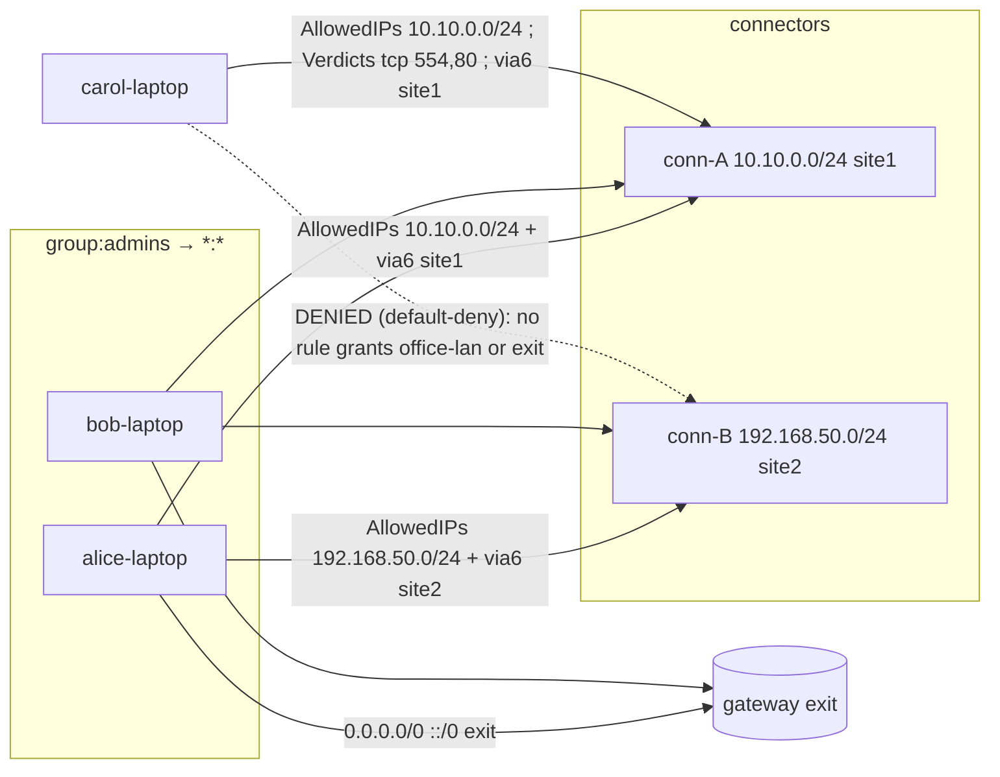
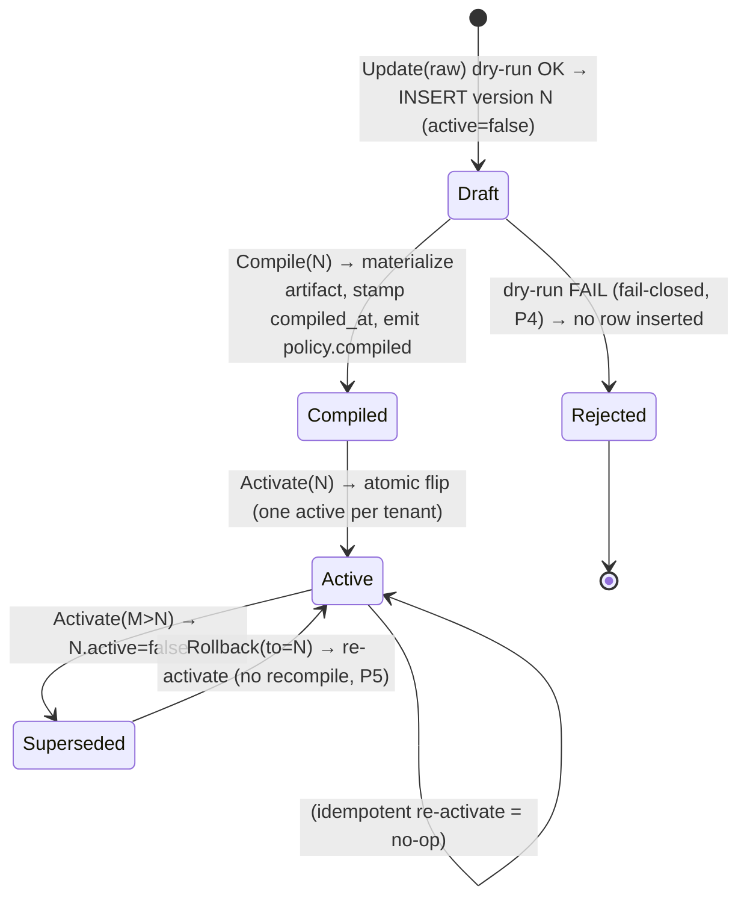
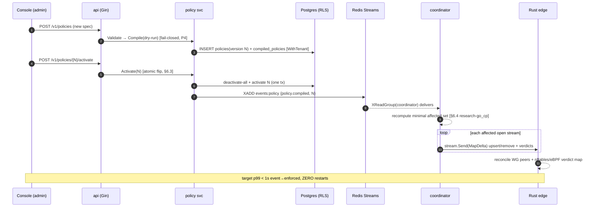

# policy service + compiler

**Revision:** 1
**Last modified:** 2026-06-25T00:00:00Z

> Master technical specification — Volume 3 (Control Plane, Go), nano-detail document
> **svc-policy**. Deepens [02-control-plane.md §7] (policy model & compiler) into an
> implementation-ready contract: the declarative Tailscale-ACL-flavored model, the pure
> versioned compile algorithm, the two compiled artifacts (coarse `AllowedIPs` + port-level
> verdict map), need-to-know visibility, fail-closed dry-run validation, and instant
> monotonic-version rollback. SPEC ONLY — describe the implementation, do not build it.
> Sources cited inline by id: [04_P1] = HelixVPN-Phase1-MVP.md, [04_ARCH §N] =
> HelixVPN-Architecture-Refined.md, [research-go_cp] = 02-control-plane.md, [SYNTHESIS §N].
> Unproven facts are marked **UNVERIFIED** per constitution §11.4.6 — never fabricated.

---

## 0. Position, ownership, and the invariants this document obeys

The `policy` package (`internal/policy/`) is the **access-control brain** of the control
plane: it turns the declarative "who may reach what" ACL document into compiled, per-device,
need-to-know reachability that the `coordinator` (§6 of [research-go_cp]) streams to edges.
It is a **pure, deterministic, versioned compiler** plus a thin transactional service wrapper
[04_P1 §7, research-go_cp §7].

This document owns: the source-document schema (§2), the compiled in-memory artifacts (§3),
the compile algorithm (§4), validation/fail-closed semantics (§5), activation + instant
rollback (§6), the event + protobuf surface the compiler feeds (§7), the error taxonomy (§8),
authz (§9), edge cases (§10), the convergence-budget contribution to the <1 s SLO (§11), and
the §11.4.169 comprehensive test-type coverage (§12).

It does **not** own: the in-memory topology graph or stream fan-out (`coordinator`,
[research-go_cp §6]); the protobuf wire-evolution byte semantics (doc 03 `WatchNetworkMap`
contract); the edge enforcement of the verdict map (Rust data plane, doc 01); IPAM/`4via6`
address allocation (`ipam`, [research-go_cp §3]) — the compiler *consumes* `4via6` site
mappings, it does not assign them.

### 0.1 Governing invariants (every clause below obeys these)

| # | Invariant | Source |
|---|---|---|
| P1 | **Default-deny, need-to-know.** A device appears in another device's map only if a compiled `accept` rule grants the edge. No `deny` verbs in the MVP model — absence is denial. | [04_ARCH §3.4/§7, 04_P1 §7, C4 of research-go_cp] |
| P2 | **Pure + deterministic.** `Compile(tenant, spec, graph)` is a pure function of its inputs; identical inputs ⇒ byte-identical `CompiledPolicy`. No clock, no RNG, no map-iteration-order leakage. | [04_P1 §7.2, research-go_cp §7.2] |
| P3 | **Two artifacts.** WG `AllowedIPs` is CIDR-only (not port-aware), so compile emits BOTH a coarse per-peer `AllowedIPs[][]` AND a fine port-level `Verdicts` map enforced at the edge. | [04_P1 §7.2, research-go_cp §7.2] |
| P4 | **Fail-closed.** `policy.update` dry-run-compiles first; only a clean compile may persist/activate. A compile error rejects the change; it never silently degrades to allow-all or to the prior policy. | [04_P1 §7.3, research-go_cp §7.3] |
| P5 | **Monotonic version + instant rollback.** `policies.version` is monotonic per tenant; at most one `active`. Rollback = re-activate an older version (no recompile needed — every version reproduces its artifact from `spec`). | [04_P1 §7.4, research-go_cp §2.2/§7.4] |
| P6 | **Tenant-scoped at the database.** Every DB touch runs through `store.WithTenant` under RLS `FORCE ROW LEVEL SECURITY`; the compiler reads `registry`/`pki` through interfaces, never their stores (R1/R4 of [research-go_cp §1.2]). | [research-go_cp §1.2/§2.3, C8] |
| P7 | **Cross-checked against advertised reality.** A `dst` host CIDR not covered by any `advertised_prefixes` row fails the dry-run (P4); overlapping advertised CIDRs emit `route.conflict.detected` (non-blocking, resolved by `4via6`). | [04_P1 §7.3, research-go_cp §5.3/§7.3] |
| P8 | **Privacy-preserving identity resolution.** `group` members are resolved by `user`→`device` join; an anonymous (no-email) user still resolves by its synthetic identity, never requiring PII (C6). | [04_P1 §6.1, research-go_cp §9.1] |

---

## 1. Package surface (Go signatures — the seam)

`internal/policy/` exposes exactly the interface the rest of the monolith depends on
[research-go_cp §1.3]. The package splits into `parse.go` (spec → typed AST), `resolve.go`
(groups/hosts → ids/CIDRs), `compile.go` (the pure core), `validate.go` (dry-run gate),
`activate.go` (transactional flip), and `iface.go` (the public surface below).

```go
// internal/policy/iface.go
package policy

import (
	"context"
	"net/netip"

	"github.com/google/uuid"
)

// Compiler is pure + deterministic (P2). Compile is dry-run safe (no writes, no events).
type Compiler interface {
	// Parse validates the jsonb document into a typed Spec; returns a *SpecError list on
	// any structural fault. Pure.
	Parse(raw []byte) (Spec, error)

	// Compile resolves + compiles a Spec against a frozen TopologySnapshot into the two
	// artifacts (P3). Pure: identical (spec, snap) ⇒ byte-identical CompiledPolicy (P2).
	// Returns non-fatal advisories (route conflicts) alongside the result.
	Compile(ctx context.Context, t uuid.UUID, spec Spec, snap TopologySnapshot) (CompiledPolicy, []Advisory, error)
}

// PolicyService is the transactional wrapper: it owns persistence, the dry-run gate (P4),
// activation, rollback, and event emission (R3). NOT pure — it touches the store + bus.
type PolicyService interface {
	// Validate dry-run-compiles raw against the current topology; never persists. Used by
	// `helixvpnctl policy apply --dry-run` and by Update before insert.
	Validate(ctx context.Context, t uuid.UUID, raw []byte) (DryRunReport, error)

	// Update parses+dry-run-compiles, and ONLY on a clean compile inserts a new
	// monotonic policies row (active=false) and emits policy.updated. Fail-closed (P4).
	Update(ctx context.Context, t uuid.UUID, raw []byte, actor string) (Version, error)

	// Compile materializes the compiled artifact for an inserted version, stamps
	// compiled_at, caches it, and emits policy.compiled. Idempotent per version.
	Compile(ctx context.Context, t uuid.UUID, v Version) error

	// Activate atomically flips active to v (clearing the prior active) and emits
	// policy.compiled so the coordinator recomputes + pushes (P5).
	Activate(ctx context.Context, t uuid.UUID, v Version, actor string) error

	// Rollback is sugar over Activate(t, olderVersion) — no recompile (P5).
	Rollback(ctx context.Context, t uuid.UUID, to Version, actor string) error

	// Compiled returns the cached compiled artifact for a version (coordinator hydrate path).
	Compiled(ctx context.Context, t uuid.UUID, v Version) (CompiledPolicy, error)
}

type Version int64

// Advisory = non-fatal compile finding (P7). Surfaced to Console, never blocks compile.
type Advisory struct {
	Kind    AdvisoryKind // ADVISORY_ROUTE_CONFLICT | ADVISORY_UNREACHABLE_RULE | ...
	Message string
	Refs    []string // connector ids / cidrs / rule indexes implicated
}
type AdvisoryKind string

const (
	AdvisoryRouteConflict   AdvisoryKind = "route.conflict"
	AdvisoryUnreachableRule AdvisoryKind = "rule.unreachable" // rule whose src resolves to ∅
	AdvisoryShadowedRule    AdvisoryKind = "rule.shadowed"    // fully subsumed by an earlier rule
)
```

### 1.1 The `TopologySnapshot` input (why Compile is pure)

`Compile` must be a pure function (P2), but groups/hosts resolve against live topology
(users, devices, group membership, advertised prefixes). The service therefore **freezes** a
read-consistent snapshot inside one `WithTenant` transaction and passes it as a value — the
compiler never reaches the store. This is the seam that makes the compiler unit-testable with
table fixtures and makes determinism a property test (§12).

```go
// internal/policy/snapshot.go
type DeviceID = uuid.UUID

type TopologySnapshot struct {
	// identity → device resolution (P8). UserKey is email OR oidc_sub OR the synthetic
	// "device:" + device_id form used for anonymous, group-less direct grants.
	UsersByKey  map[string]uuid.UUID       // "alice@corp"|"oidc:sub"|"device:<uuid>" -> user_id
	DevicesByUser map[uuid.UUID][]DeviceID  // user_id -> its devices
	GroupMembers map[string][]DeviceID      // "group:admins" -> device ids (pre-joined)
	Devices      map[DeviceID]DeviceMeta    // every non-revoked device in tenant
	// advertised reality (P7): connector_id -> enabled CIDRs; and a reverse index
	// covering CIDR -> connector(s) for host resolution + conflict detection.
	ConnPrefixes map[DeviceID][]netip.Prefix
	PrefixOwners []PrefixOwner // sorted; supports longest-prefix + overlap scan
	GatewayID    DeviceID      // the exit/relay node (exitNodes target)
	SnapAt       int64         // unix-nanos; recorded for evidence, NOT used in compile (P2)
}

type DeviceMeta struct {
	ID         DeviceID
	Kind       DeviceKind // CLIENT | CONNECTOR
	WGPubKey   [32]byte
	OverlayIP  netip.Addr
	Revoked    bool       // belt-and-suspenders; revoked never enters visible[] (P1)
}

type PrefixOwner struct {
	CIDR        netip.Prefix
	ConnectorID DeviceID
	Site        uint16 // 4via6 site-id (assigned by ipam); compiler emits, does not assign
}
type DeviceKind uint8

const (
	DeviceKindClient    DeviceKind = 1
	DeviceKindConnector DeviceKind = 2
)
```

> `SnapAt` is recorded for captured-evidence/audit only and **must not** influence the
> compiled bytes (P2) — a unit test asserts two compiles of the same `(spec, snap)` with
> different `SnapAt` produce byte-identical `CompiledPolicy` (§12, determinism property).

---

## 2. Source document — the declarative ACL model (`policies.spec` jsonb)

The operator authors a Tailscale-ACL-flavored JSON document; it is stored verbatim in
`policies.spec jsonb` [04_P1 §7.1, research-go_cp §7.1]. Comments (`//`) are accepted on
ingest (JSONC) and stripped before storage so `spec` is canonical RFC-8259 JSON.

### 2.1 Worked source example (the running example for this whole document)

```jsonc
{
  "schemaVersion": 1,
  "groups": {
    "group:admins":      ["alice@corp", "bob@corp"],
    "group:contractors": ["carol@ext"]
  },
  "hosts": {
    "warehouse-cams": "10.10.0.0/24",      // served by connector A
    "office-lan":     "192.168.50.0/24"    // served by connector B
  },
  "acls": [
    { "action": "accept", "src": ["group:admins"],      "dst": ["*:*"] },
    { "action": "accept", "src": ["group:contractors"], "dst": ["warehouse-cams:554,80"] }
  ],
  "exitNodes": ["group:admins"]            // who may use the gateway as a full-tunnel exit
}
```

### 2.2 Typed AST (the parse target)

```go
// internal/policy/spec.go
type Spec struct {
	SchemaVersion int                  `json:"schemaVersion"`
	Groups        map[string][]string  `json:"groups"`    // "group:NAME" -> member keys
	Hosts         map[string]string    `json:"hosts"`     // "alias" -> CIDR string
	ACLs          []Rule               `json:"acls"`
	ExitNodes     []string             `json:"exitNodes"` // selectors permitted to full-tunnel
}

type Rule struct {
	Action string   `json:"action"` // CLOSED SET: only "accept" in MVP (P1)
	Src    []string `json:"src"`    // selectors: "group:X" | "user@dom" | "*"
	Dst    []string `json:"dst"`    // "host:ports" | "cidr:ports" | "*:*" | "<deviceSel>:ports"
}

// A Dst token parses to this. Ports empty => all ports.
type DstTarget struct {
	Raw      string
	HostName string       // non-empty if a hosts[] alias
	CIDR     netip.Prefix // resolved (host alias OR literal CIDR OR "*"=0.0.0.0/0 + ::/0)
	Wildcard bool         // "*" destination
	Ports    []PortRange  // empty => ALL_PORTS
}

type PortRange struct {
	Proto Proto  // TCP|UDP|ANY (MVP: ANY unless "tcp:"/"udp:" prefix; default ANY)
	Lo    uint16 // inclusive
	Hi    uint16 // inclusive (==Lo for a single port)
}
type Proto uint8

const (
	ProtoAny Proto = 0
	ProtoTCP Proto = 6  // matches IANA protocol number (edge nft uses it directly)
	ProtoUDP Proto = 17
)
```

### 2.3 Grammar (closed-set, validated at parse)

| Element | Accepted form | Rejected → error |
|---|---|---|
| `action` | exactly `"accept"` | any other verb ⇒ `ERR_UNSUPPORTED_ACTION` (no `deny`/`drop` in MVP; default-deny makes them redundant, P1) |
| group name | `group:[a-z0-9_-]+` | missing `group:` prefix ⇒ `ERR_BAD_GROUP_NAME` |
| member key | `email` \| `oidc:<sub>` \| `device:<uuid>` \| nested `group:X` | unknown shape ⇒ `ERR_BAD_MEMBER_KEY` |
| host alias | `[a-z0-9_-]+` mapping to a parseable CIDR | bad CIDR ⇒ `ERR_BAD_HOST_CIDR` |
| `src` token | `group:X` \| member key \| `*` | unresolvable ⇒ `ERR_UNKNOWN_SRC` |
| `dst` token | `<host>:<ports>` \| `<cidr>:<ports>` \| `*:*` | missing `:` ⇒ `ERR_BAD_DST_FORMAT` |
| ports | `*` \| `N` \| `N-M` \| comma list \| `tcp:N`/`udp:N` | non-numeric / `Lo>Hi` ⇒ `ERR_BAD_PORT_SPEC` |
| `exitNodes` entry | `group:X` \| member key | resolves to a connector ⇒ `ERR_EXIT_IS_CONNECTOR` |

> **Nested groups** (a `group:X` member of `group:Y`) resolve transitively with cycle
> detection; a membership cycle ⇒ `ERR_GROUP_CYCLE` (§8). **UNVERIFIED:** the source docs
> [04_P1 §7.1] show only flat groups; nested-group support is a forward-compatible
> superset this spec defines — flag it as a design decision, not an inherited fact.

---

## 3. The compiled artifacts (`CompiledPolicy` — what coordinator consumes)

```go
// internal/policy/compiled.go — the two-artifact output (P3). Returned by Compile and
// cached per (tenant, version). coordinator.buildMap reads it directly [research-go_cp §6.2].
type CompiledPolicy struct {
	Version   Version
	SpecHash  [32]byte // sha256 of canonical spec — ties artifact to source (audit + dedup)

	// ARTIFACT 1 — need-to-know visibility (P1): src device -> reachable peer-device set.
	VisibleTo map[DeviceID]map[DeviceID]struct{}

	// ARTIFACT 1b — coarse WG AllowedIPs (CIDR-only, P3): src -> peer -> CIDRs.
	AllowedIPs map[DeviceID]map[DeviceID][]netip.Prefix

	// ARTIFACT 2 — fine port-level verdict map (P3): src -> peer -> port rules. Edge
	// enforces via nftables/eBPF (doc 01). A peer present in AllowedIPs but with an
	// empty Verdicts entry means "all ports" (the coarse rule already gates it).
	Verdicts map[DeviceID]map[DeviceID][]PortRule

	// 4via6 routes for colliding IPv4 LANs (D4): src -> peer(connector) -> mappings.
	Via6 map[DeviceID]map[DeviceID][]Via6Route

	// exit-node grants: device ids permitted to full-tunnel through the gateway.
	ExitNodes map[DeviceID]struct{}
}

type PortRule struct {
	DstCIDR netip.Prefix
	Proto   Proto
	Lo, Hi  uint16
}
type Via6Route struct {
	IPv4CIDR  netip.Prefix
	Via6Prefix netip.Prefix // fd7a:helix:<rand>:<site-id>::/96 (ipam-assigned site)
}
```

### 3.1 Canonical determinism rules (so `SpecHash` and the artifact are stable, P2)

1. **Canonical spec hash:** `SpecHash = sha256(canonicalJSON(spec))` where `canonicalJSON`
   sorts object keys, strips comments/whitespace, normalizes CIDR text, and sorts every
   string array. Two semantically-identical specs hash identically.
2. **Deterministic maps → deterministic bytes:** all output maps are serialized for the
   determinism property test through a `canonicalEncode` that sorts device-id keys and sorts
   each `[]netip.Prefix` / `[]PortRule` slice by `(addr,bits,proto,lo,hi)`. Go map iteration
   order is non-deterministic, so **the compiler MUST never range a map to build output
   order**; it ranges a pre-sorted key slice. A `go vet`-style custom lint flags `range
   someMap` inside `compile.go` (§12 meta-test).
3. **No ambient inputs:** no `time.Now`, no `rand`, no environment reads inside `Compile`.

---

## 4. The compile algorithm (pure core)

### 4.1 Pseudocode (the authoritative algorithm)

```
compile(tenant, spec, snap) -> (CompiledPolicy, []Advisory, error):
  adv := []
  # ── phase 1: resolve selectors ───────────────────────────────────────────
  groupSet := resolveGroups(spec.groups, snap)        # transitive, cycle-checked → device-id sets
  hostCIDR := {}                                       # alias -> netip.Prefix
  for alias, cidr in spec.hosts:
      p := parsePrefix(cidr)                            # ERR_BAD_HOST_CIDR on fault
      if not coveredByAdvertised(p, snap):             # P7 cross-check
          return _, _, ERR_HOST_NOT_ADVERTISED(alias, p)
      hostCIDR[alias] = p
  # ── phase 2: per-device rule application (default-deny base, P1) ──────────
  out := CompiledPolicy{ all maps empty }
  devOrder := sortedDeviceIDs(snap.Devices)            # deterministic iteration (P2)
  for d in devOrder where not snap.Devices[d].Revoked: # revoked never gets visibility (P1)
      for ri, rule in spec.acls:                        # rules in author order (precedence)
          srcSet := resolveSrc(rule.src, groupSet, snap)
          if d not in srcSet: continue
          if srcSet == ∅: adv += unreachableRule(ri); continue
          for dstTok in rule.dst:
              dt := parseDst(dstTok, hostCIDR)           # ERR_BAD_DST_* on fault
              targets := expandDst(dt, snap)             # → set of (peerDeviceID, cidr, site)
              for (peer, cidr, site) in targets:
                  if peer == d: continue                 # no self-edge
                  if snap.Devices[peer].Revoked: continue
                  out.VisibleTo[d].add(peer)              # ARTIFACT 1 (P1)
                  out.AllowedIPs[d][peer].add(cidr)       # ARTIFACT 1b (coarse, P3)
                  if dt.Ports not ALL:
                      out.Verdicts[d][peer].add(portRules(cidr, dt.Ports))  # ARTIFACT 2
                  if site != 0:
                      out.Via6[d][peer].add(via6(cidr, site, snap))         # D4
  # ── phase 3: exit nodes ───────────────────────────────────────────────────
  for sel in spec.exitNodes:
      for dev in resolveSrc([sel], groupSet, snap):
          if snap.Devices[dev].Kind == CONNECTOR: return _,_, ERR_EXIT_IS_CONNECTOR(dev)
          out.ExitNodes.add(dev)                          # may full-tunnel via gateway
  # ── phase 4: advisories (non-fatal, P7) ──────────────────────────────────
  adv += detectRouteConflicts(snap.PrefixOwners)          # overlapping advertised CIDRs
  adv += dedupAndSortAllSlices(&out)                      # canonical order (P2/§3.1)
  out.SpecHash = sha256(canonicalJSON(spec))
  return out, adv, nil
```

### 4.2 `expandDst` — the destination resolver (the heart)

`expandDst(dt, snap)` maps one parsed `dst` token to the concrete set of peer devices +
CIDRs the source may reach:

- **`*:*` (wildcard):** every non-revoked peer device in the tenant the rule's src is not
  (each peer's overlay CIDR), PLUS every connector's advertised prefixes, PLUS the gateway
  exit (`0.0.0.0/0` + `::/0`). This is the `group:admins → *:*` "reach everything" grant.
- **`<host>:ports`:** look the alias up in `hostCIDR`; the target is the **connector(s)
  serving that CIDR** (`snap.PrefixOwners` longest-prefix match). The peer device id is the
  connector's `device_id`; the CIDR is the host CIDR (or its covered sub-CIDR); the `site` is
  the connector's `4via6` site-id (drives `Via6`, D4).
- **`<cidr>:ports`:** identical to host but the CIDR is literal; still must be covered by an
  advertised prefix (P7) or it is unreachable → compile error at the dry-run gate (§5).
- **`<deviceSelector>:ports`** (a `group:X` or member key used as a destination, e.g.
  client-to-client): the target peer device set is `resolveSrc([sel],…)`; the CIDR is each
  target device's overlay `/128`. **UNVERIFIED:** the source example uses only CIDR/host
  destinations; device-as-destination is a defined superset for client↔client policy — flag
  as design, not inherited.

### 4.3 Worked example output (running example from §2.1)

Given tenant devices — `alice-laptop`, `bob-laptop` (admins' devices), `carol-laptop`
(contractor), `conn-A` (connector serving `10.10.0.0/24`, site-id 1), `conn-B` (connector
serving `192.168.50.0/24`, site-id 2), gateway `gw` — the compiler emits:



Concrete artifact for `carol-laptop` (the precise, port-restricted grant):

```text
VisibleTo[carol-laptop]            = { conn-A }
AllowedIPs[carol-laptop][conn-A]   = [ 10.10.0.0/24 ]
Verdicts[carol-laptop][conn-A]     = [ {10.10.0.0/24, ANY, 554, 554}, {10.10.0.0/24, ANY, 80, 80} ]
Via6[carol-laptop][conn-A]         = [ {10.10.0.0/24, fd7a:helix:rrrr:0001::/96} ]
ExitNodes                          = { alice-laptop, bob-laptop }   # carol absent → no exit
# carol-laptop has NO entry for conn-B or office-lan → default-deny (P1)
```

`alice-laptop`/`bob-laptop` get `AllowedIPs` `[10.10.0.0/24, 192.168.50.0/24, 0.0.0.0/0,
::/0]` toward the relevant peers, **empty `Verdicts`** (all ports, coarse rule suffices, P3),
and membership in `ExitNodes`.

---

## 5. Validation — fail-closed dry-run (P4)

`PolicyService.Update` and `helixvpnctl policy apply` both route through `Validate`, which
dry-run-compiles against a frozen snapshot and rejects on any **blocking** finding. Only a
clean dry-run may persist (`Update`) [04_P1 §7.3, research-go_cp §7.3].

### 5.1 Blocking vs. advisory taxonomy

| Finding | Class | Behavior |
|---|---|---|
| unknown group/host/member selector | **BLOCKING** | reject; `ERR_UNKNOWN_*` |
| `dst` CIDR not covered by any `advertised_prefixes` | **BLOCKING** (P7) | reject; `ERR_HOST_NOT_ADVERTISED` |
| rule that would grant a **revoked** device (as src or dst) | **BLOCKING** | reject; `ERR_GRANTS_REVOKED` |
| `exitNodes` entry resolving to a connector | **BLOCKING** | reject; `ERR_EXIT_IS_CONNECTOR` |
| unsupported `action` (≠ `accept`) | **BLOCKING** | reject; `ERR_UNSUPPORTED_ACTION` |
| group membership cycle | **BLOCKING** | reject; `ERR_GROUP_CYCLE` |
| schemaVersion unknown/future | **BLOCKING** | reject; `ERR_SCHEMA_VERSION` |
| overlapping advertised CIDRs (two connectors) | **ADVISORY** | compile succeeds; emit `route.conflict.detected`; surface in Console; resolved by `4via6` or operator choice [research-go_cp §5.3] |
| rule whose `src` resolves to ∅ (no devices) | **ADVISORY** | `rule.unreachable` |
| rule fully shadowed by an earlier rule | **ADVISORY** | `rule.shadowed` |

```go
// internal/policy/validate.go
type DryRunReport struct {
	OK         bool
	SpecHash   [32]byte
	Blocking   []SpecError  // empty iff OK
	Advisories []Advisory   // surfaced even when OK
	Stats      DryRunStats  // devices affected, peers granted, ports opened (Console preview)
}
type DryRunStats struct {
	DevicesAffected int
	EdgesGranted    int
	ExitNodes       int
}
```

> **Fail-closed proof obligation:** a §1.1 paired mutation makes `Validate` return `OK:true`
> for a spec referencing an unadvertised CIDR; the test asserts `Update` then **refuses** to
> insert. If the mutation slips through (insert happens), the gate FAILs — this is the
> runtime signature (§11.4.108) that P4 is live, not merely promised (§12).

### 5.2 Validation state — what is read, when it can be stale

`Validate` freezes the topology snapshot inside its own `WithTenant` tx; the compile is pure
against that frozen view. A device revoked **after** the dry-run but **before** activation is
caught at activation time by re-checking the active compile against current revocations (§6.3)
and by the coordinator's belt-and-suspenders revoked-stream refusal ([research-go_cp §6.3]).
This is the honest race window (§10.3), not a bluff: the system narrows it to <1 s, it does
not claim zero.

---

## 6. Activation, versioning & instant rollback (P5)

### 6.1 Version lifecycle state machine



### 6.2 DDL the service relies on (from [research-go_cp §2.2], restated for self-containment)

```sql
CREATE TABLE policies (
  id           uuid PRIMARY KEY DEFAULT gen_random_uuid(),
  tenant_id    uuid NOT NULL REFERENCES tenants(id) ON DELETE CASCADE,
  spec         jsonb NOT NULL,            -- canonical ACL document (§2)
  spec_hash    bytea NOT NULL,            -- sha256(canonicalJSON(spec)) — dedup + audit (§3.1)
  version      bigint NOT NULL,           -- monotonic per tenant (P5)
  active       boolean NOT NULL DEFAULT false,
  compiled_at  timestamptz,              -- NULL until Compile(N) materializes the artifact
  created_at   timestamptz NOT NULL DEFAULT now(),
  created_by   text NOT NULL,            -- actor (audit + §11.4.104 attribution)
  UNIQUE (tenant_id, version)
);
-- at most one active policy per tenant; instant rollback = re-activate an older version (P5)
CREATE UNIQUE INDEX one_active_policy_per_tenant ON policies (tenant_id) WHERE active;

-- compiled-artifact cache (so rollback/coordinator-hydrate need not recompile). The artifact
-- is reproducible from spec, so this table is a SPEED cache, NOT a source of truth — it is
-- rebuildable and therefore safe to truncate (constitution §11.4.77 regen = re-run Compile).
CREATE TABLE compiled_policies (
  tenant_id   uuid NOT NULL REFERENCES tenants(id) ON DELETE CASCADE,
  version     bigint NOT NULL,
  spec_hash   bytea NOT NULL,
  artifact    bytea NOT NULL,            -- canonicalEncode(CompiledPolicy) (§3.1)
  built_at    timestamptz NOT NULL DEFAULT now(),
  PRIMARY KEY (tenant_id, version),
  FOREIGN KEY (tenant_id, version) REFERENCES policies (tenant_id, version) ON DELETE CASCADE
);
```

The monotonic version is allocated `SELECT coalesce(max(version),0)+1 FROM policies WHERE
tenant_id=$1` **inside the insert tx** (the RLS tx serializes concurrent updates per tenant,
so no two versions collide; the `UNIQUE(tenant_id, version)` is the backstop).

### 6.3 Atomic activation + rollback (Go)

```go
// internal/policy/activate.go — atomic flip; prior version stays compiled for instant
// rollback (P5). Emits on the bus (R3) so the coordinator recomputes + pushes.
func (p *policyService) Activate(ctx context.Context, t uuid.UUID, v Version, actor string) error {
	return p.store.WithTenant(ctx, t, func(q *db.Queries) error {
		// 0. guard: the version must exist AND be compiled (artifact present).
		row, err := q.GetPolicyVersion(ctx, db.GetPolicyVersionParams{TenantID: t, Version: int64(v)})
		if err != nil {
			return errNotFound(ErrVersionNotFound, v) // ERR_VERSION_NOT_FOUND
		}
		if !row.CompiledAt.Valid {
			return ErrNotCompiled // ERR_NOT_COMPILED — must Compile(v) first (fail-closed, P4)
		}
		// 0b. re-check the active compile against CURRENT revocations (§5.2 race window).
		if bad := p.revokedGrantsAfter(ctx, q, t, v); len(bad) > 0 {
			return ErrGrantsRevoked(bad) // ERR_GRANTS_REVOKED — a device revoked since dry-run
		}
		// 1. atomic flip: clear prior active, set v active (partial unique index guarantees one).
		if err := q.DeactivateAllPolicies(ctx, t); err != nil {
			return err
		}
		if err := q.ActivatePolicyVersion(ctx, db.ActivateParams{TenantID: t, Version: int64(v)}); err != nil {
			return err // unique-violation here ⇒ a concurrent activate; caller retries (idempotent)
		}
		// 2. audit (control action only — never traffic, C3).
		_ = q.InsertAudit(ctx, db.AuditParams{TenantID: t, Actor: actor,
			Action: "policy.activate", Target: fmt.Sprintf("v%d", v)})
		// 3. R3: emit on the bus so the coordinator recomputes + pushes minimal deltas.
		_, err = p.bus.Publish(ctx, "events:policy",
			events.New("policy.compiled", t, actor, map[string]any{"version": int64(v)}))
		return err
	})
}

func (p *policyService) Rollback(ctx context.Context, t uuid.UUID, to Version, actor string) error {
	// instant: no recompile — the older version's artifact is cached/reproducible (P5).
	return p.Activate(ctx, t, to, actor)
}
```

**Why rollback is instant (P5):** every version's `CompiledPolicy` is reproducible from its
`spec` (pure compile, P2) and cached in `compiled_policies`. Re-activating version N flips the
index and emits `policy.compiled{version:N}`; the coordinator diffs its current served version
against N and pushes the (small) delta — no recompile, no rebuild [04_P1 §7.4].

---

## 7. The event + protobuf surface the compiler feeds

### 7.1 Events emitted/consumed (envelope per [research-go_cp §5.2])

The policy service is the **producer** on `events:policy` and a consumer for the
`connector.prefixes.changed` recompile trigger.

| Direction | Type | Payload | Trigger / reaction |
|---|---|---|---|
| emit | `policy.updated` | `{version}` | a clean dry-run inserted version N (active=false) |
| emit | `policy.compiled` | `{version}` | `Compile(N)` materialized the artifact, OR `Activate/Rollback(N)` flipped active — coordinator recomputes tenant visibility + pushes deltas |
| emit | `route.conflict.detected` | `{cidr, connector_ids[]}` | dry-run advisory P7 (overlapping advertised CIDRs) |
| consume | `connector.prefixes.changed` | `{connector_id, cidrs[]}` | recompile the **active** version against new prefixes; if a previously-resolvable host CIDR is now unadvertised, emit `route.conflict.detected` (does NOT auto-deactivate — fail-static, C1) |
| consume | `device.revoked` | `{device_id}` | drop the device from the served compiled view immediately (coordinator removes peer); next activation re-validates (§6.3) |

Canonical envelope (bus-agnostic, [research-go_cp §5.2]):

```json
{
  "id": "<redis-stream-id>",
  "type": "policy.compiled",
  "tenant_id": "8f3c…",
  "ts": "2026-06-25T00:00:00Z",
  "actor": "alice@corp",
  "payload": { "version": 7 },
  "trace_id": "01J…"
}
```

### 7.2 Protobuf the artifact projects into (`helix.coordinator.v1`)

The compiler does not own the wire contract, but its artifact projects 1:1 into the
`coordinator.v1` `Peer` message the coordinator streams [research-go_cp §4, package
`helix.coordinator.v1`]. Restated for the policy↔coordinator boundary:

```protobuf
// proto/helix/coordinator/v1/coordinator.proto — package helix.coordinator.v1 (canonical, unified set)
message Peer {
  string             device_id   = 1;
  bytes              wg_pubkey   = 2;
  repeated string    allowed_ips = 3;  // from CompiledPolicy.AllowedIPs[self][peer] (P3 coarse)
  string             endpoint    = 4;  // gateway relay in MVP
  bool               is_connector = 5;
  repeated Via6Route via6        = 6;  // from CompiledPolicy.Via6[self][peer] (D4)
  repeated PortRule  verdicts    = 7;  // from CompiledPolicy.Verdicts[self][peer] (P3 fine)
}
message PortRule { string dst_cidr = 1; uint32 proto = 2; uint32 lo = 3; uint32 hi = 4; }
message Via6Route { string ipv4_cidr = 1; string via6_prefix = 2; }
```

> `verdicts` (field 7) is the policy-fed addition to the [research-go_cp §4] `Peer` message;
> field numbers ≥7 are reserved so adding it is backward-compatible (doc 03 owns the wire
> evolution rules). The edge applies `allowed_ips` as the WG `AllowedIPs` and `verdicts` as
> the nftables/eBPF port filter (doc 01).

---

## 8. Error taxonomy (the closed set)

```go
// internal/policy/errors.go — every compile/validate/activate fault maps to ONE coded error.
type SpecError struct {
	Code   ErrCode
	RuleIx int      // -1 if not rule-scoped
	Token  string   // the offending selector/cidr/port
	Msg    string   // human, no PII (C6); safe to log
}
type ErrCode string

const (
	// ── parse / structural (BLOCKING) ──
	ErrSchemaVersion    ErrCode = "ERR_SCHEMA_VERSION"     // unknown/future schemaVersion
	ErrUnsupportedAction ErrCode = "ERR_UNSUPPORTED_ACTION" // action != "accept" (P1)
	ErrBadGroupName     ErrCode = "ERR_BAD_GROUP_NAME"
	ErrBadMemberKey     ErrCode = "ERR_BAD_MEMBER_KEY"
	ErrBadHostCIDR      ErrCode = "ERR_BAD_HOST_CIDR"
	ErrBadDstFormat     ErrCode = "ERR_BAD_DST_FORMAT"
	ErrBadPortSpec      ErrCode = "ERR_BAD_PORT_SPEC"      // non-numeric or Lo>Hi
	// ── resolution (BLOCKING) ──
	ErrUnknownSrc       ErrCode = "ERR_UNKNOWN_SRC"
	ErrUnknownHost      ErrCode = "ERR_UNKNOWN_HOST"
	ErrGroupCycle       ErrCode = "ERR_GROUP_CYCLE"        // nested-group membership cycle
	// ── semantic / fail-closed (BLOCKING, P4/P7) ──
	ErrHostNotAdvertised ErrCode = "ERR_HOST_NOT_ADVERTISED" // dst CIDR not in advertised_prefixes
	ErrGrantsRevoked    ErrCode = "ERR_GRANTS_REVOKED"      // rule grants a revoked device
	ErrExitIsConnector  ErrCode = "ERR_EXIT_IS_CONNECTOR"   // exitNodes entry resolves to connector
	// ── lifecycle (BLOCKING) ──
	ErrVersionNotFound  ErrCode = "ERR_VERSION_NOT_FOUND"
	ErrNotCompiled      ErrCode = "ERR_NOT_COMPILED"        // Activate before Compile
)
```

Mapping to API/RPC status (§9): all `ERR_*` parse/resolution/semantic faults → HTTP `422
Unprocessable Entity` (REST) / Connect `InvalidArgument`; `ERR_VERSION_NOT_FOUND` → `404` /
`NotFound`; `ERR_NOT_COMPILED` → `409 Conflict` / `FailedPrecondition`. The error body carries
the `[]SpecError` array so the Console highlights the exact `RuleIx`/`Token` — never a bare
"invalid policy" (anti-bluff, the operator must see *what* failed).

---

## 9. Authz — who may touch policy (RBAC + RLS backstop)

Policy mutation is the highest-privilege control action; it composes [research-go_cp §8.1]
RBAC with the RLS database floor (C8).

| Operation | REST route | admin | operator | member | enforcement |
|---|---|---|---|---|---|
| dry-run validate | `POST /v1/policies:validate` | ✓ | ✓ | ✗ | `requireRole("admin","operator")` |
| create version | `POST /v1/policies` | ✓ | ✓ | ✗ | RBAC + `WithTenant` insert |
| compile version | (implicit on create / `POST /v1/policies/{v}:compile`) | ✓ | ✓ | ✗ | RBAC |
| activate / rollback | `POST /v1/policies/{v}/activate` | ✓ | ✓ | ✗ | RBAC + atomic flip (§6.3) |
| read versions / compiled preview | `GET /v1/policies`, `GET /v1/policies/{v}` | ✓ | ✓ | ✓ (own tenant) | RLS scope |

- **RLS is the floor:** even if RBAC middleware is misconfigured, every handler runs its DB
  work through `WithTenant(ctx.TenantID, …)` under `FORCE ROW LEVEL SECURITY` as the
  non-superuser `helix_app` role — a member cannot read another tenant's policy even with a
  crafted query (C8, [research-go_cp §2.3]).
- **Actor attribution:** `created_by`/audit `actor` is the canonical participant handle
  (constitution §11.4.104); anonymous-mode operators resolve to their synthetic handle, never
  PII (C6/P8).
- **Agents never write policy:** the `Coordinator` RPC surface (`WatchNetworkMap` etc.) is
  read-only w.r.t. policy — devices receive compiled maps, they cannot author specs.

---

## 10. Edge cases (each with the defined behavior — no guessing, §11.4.6)

| # | Edge case | Defined behavior |
|---|---|---|
| E1 | Empty `acls` (only groups/hosts) | Compiles to all-empty visibility → **everyone denied everything** (default-deny floor, P1). Valid, not an error. |
| E2 | `*:*` for a non-admin via a group | Honored — wildcard expands per §4.2; the operator chose to grant broad reach. No implicit narrowing. |
| E3 | Overlapping advertised CIDRs (conn-A & conn-B both `10.0.0.0/24`) | **Advisory** `route.conflict.detected` (P7); compile succeeds; `4via6` site-ids disambiguate at the data path; Console surfaces the conflict for operator choice. |
| E4 | `dst` CIDR is a sub-range of an advertised prefix (`10.10.0.128/25` ⊂ `10.10.0.0/24`) | Allowed — longest-prefix coverage check passes; `AllowedIPs` carries the narrower `/25`; the connector still routes it. |
| E5 | Device revoked between dry-run and activate | Caught at activate (`revokedGrantsAfter` re-check, §6.3) → `ERR_GRANTS_REVOKED`; never streams to a revoked device (coordinator belt-and-suspenders). Honest <1 s race window (§5.2). |
| E6 | A user in two groups with conflicting reach | Union — `accept` rules are additive (no `deny` to subtract, P1). The broader grant wins; documented, not surprising. |
| E7 | `exitNodes` references a group containing a connector | **BLOCKING** `ERR_EXIT_IS_CONNECTOR` — connectors are not exits (a connector full-tunneling the gateway is nonsensical). |
| E8 | Duplicate identical rules | Idempotent — `dedupAndSortAllSlices` collapses them; `rule.shadowed` advisory if fully subsumed. |
| E9 | Spec references a host alias never used in any acl | Allowed (unused alias is harmless); no advisory (operator may stage it). An *acl* referencing an unknown alias is `ERR_UNKNOWN_HOST` (blocking). |
| E10 | Massive tenant (10k devices, 1k rules) | Compile is O(devices × matching-rules × dst-targets); the §11 budget caps it at **<200 ms** (benchmark gate). Output maps pre-sized from snapshot counts to avoid rehash churn. |
| E11 | `connector.prefixes.changed` removes a CIDR a live policy granted | Active version recompiled; the now-unadvertised CIDR drops from `AllowedIPs` → coordinator pushes a peer-removal delta; emits `route.conflict.detected`. Existing tunnels fail-static until the delta lands (C1). Policy is **not** auto-deactivated. |
| E12 | Nested-group cycle (`A∈B`, `B∈A`) | **BLOCKING** `ERR_GROUP_CYCLE` (DFS cycle detection in `resolveGroups`). |

### 10.3 The honest convergence-race boundary (§11.4.6)

The compiler + service guarantee **eventual** per-edge correctness within the <1 s SLO (§11),
**not** a globally-atomic instant across all edges. Between `Activate` and the last edge's
delta apply there is a sub-second window in which different edges enforce different versions.
This is stated as a FACT, not hidden: the MVP target is p99 <1 s, the floor is fail-static
(old tunnels keep forwarding under the old policy until the delta lands, C1) — never a
fail-open gap. **UNVERIFIED:** the exact p99 under 10k concurrent streams is a measured number
the §12 soak test produces; this document states the *target*, not a measured result.

---

## 11. Convergence SLO — the policy service's budget contribution (<1 s)

The end-to-end "policy edit → enforced on all affected edges < 1 s, no restart" promise
[04_ARCH, 04_P1 §10] decomposes; the policy service owns the first two segments:



| Budget segment | Owner | Target | Measured by |
|---|---|---|---|
| dry-run compile (1k devices) | policy | **< 200 ms** | `policy_compile_seconds` histogram + benchmark gate |
| activate flip + emit (tx + XADD) | policy | **< 20 ms** | `policy_activate_seconds` histogram |
| event → delta-on-wire | coordinator | < 1 s p99 (whole budget) | `helix_reconcile_seconds` [research-go_cp §10.2] |
| delta → edge enforced | edge (doc 01) | included in the <1 s | revoke-to-WG-peer-removed timer |

Metrics the policy package exports (Prometheus, [research-go_cp §10.2] family):
`policy_compile_seconds{tenant}`, `policy_activate_seconds{tenant}`,
`policy_compile_errors_total{code}`, `policy_route_conflicts_total{tenant}`,
`policy_active_version{tenant}` (gauge — supports rollback observability).

---

## 12. Test-type coverage (constitution §11.4.169 — comprehensive, anti-bluff)

§11.4.169 mandates comprehensive test-type coverage; every type below has a concrete,
captured-evidence test point [04_P1 §10, research-go_cp §10.3, §11.4.27/§11.4.5/§11.4.69/§1.1].

| Test type | Concrete test point | Captured evidence (§11.4.69) |
|---|---|---|
| **Unit** | `Compile(runningExample)` → assert exact `CompiledPolicy` for `carol-laptop` (§4.3): `VisibleTo={conn-A}`, `Verdicts` tcp 554+80 only, `ExitNodes` excludes carol. | golden `compiled.json` byte-compare |
| **Unit — determinism (P2)** | compile same `(spec,snap)` twice with different `SnapAt` → `canonicalEncode` outputs byte-identical; property test over 1000 random specs. | hash-equality log per iter |
| **Unit — purity lint (§3.1)** | custom analyzer asserts no `time.Now`/`rand`/bare `range map` inside `compile.go`. | analyzer report |
| **Unit — error taxonomy** | table-driven: each `ERR_*` (§8) reproduced by a crafted spec; assert exact `Code`+`RuleIx`. | per-code assertion table |
| **Integration (real PG+Redis via `vasic-digital/containers` §11.4.76)** | drive enroll→advertise→`POST /v1/policies`→`activate`→consume `policy.compiled`→assert coordinator pushed carol the port-restricted delta and **denied** office-lan. | event stream + delta capture |
| **Integration — fail-closed (P4)** | spec citing unadvertised `172.16.0.0/24` → `Update` returns 422 `ERR_HOST_NOT_ADVERTISED`; assert NO `policies` row inserted. | DB row-count before/after |
| **Integration — instant rollback (P5)** | activate v2 (broken-but-valid), then `Rollback(v1)`; assert active flips, no recompile call (spy), coordinator re-pushes v1 delta. | `policy_active_version` gauge trace |
| **RLS (C8)** | as `helix_app`, tenant-A session cannot read tenant-B `policies` even with crafted `WHERE`; `FORCE ROW LEVEL SECURITY` on. | denied-query capture |
| **E2E / full-automation (§11.4.98)** | self-host from zero → enroll connector+client → policy grant → client reaches authorized LAN host + **denied** unauthorized → edit policy → reflected <1 s no restart. | recorded transcript `docs/qa/<run-id>/` |
| **Security** | a member-role token attempting `POST /v1/policies/{v}/activate` → 403; an agent RPC attempting to author policy → rejected. | authz-denial capture |
| **Stress (§11.4.85)** | 10k-device / 1k-rule compile ×100 iters → p95 < 200 ms (E10/§11 budget); 10 concurrent `Update` per tenant → monotonic versions, no collision. | `latency.json` distribution |
| **Chaos (§11.4.85)** | SIGKILL the service mid-`Activate` (after deactivate, before activate) → recovery restores a single active (partial unique index + tx rollback); replay a duplicated `policy.compiled` → idempotent (no double-push). | `recovery_trace.log` |
| **Performance/benchmark** | `BenchmarkCompile1kDevices` < 200 ms; `BenchmarkActivate` < 20 ms — wired to §11 SLO gate. | benchmark output |
| **Meta-test (§1.1 paired mutation)** | (a) strip the §5 dry-run gate → fail-closed integration test must FAIL; (b) make `Compile` range a map for output order → determinism test must FAIL; (c) drop the revoked-grant check → E5 test must FAIL. Each mutation FAILs its gate, restore PASSes. | mutate→FAIL→restore→PASS log |
| **Challenge (HelixQA, §11.4.27)** | `CME-POLICY-001`: drives the running example end-to-end, scores PASS only on captured proof carol reaches `10.10.0.0/24:554` AND is denied `192.168.50.0/24`. | challenge `result.json` |

> Anti-bluff floor: a policy "PASS" is valid only with captured evidence that an authorized
> edge **and** an unauthorized edge behaved correctly — a green compile is necessary, never
> sufficient (the §0.1 covenant). The §1.1 mutations are the runtime signatures (§11.4.108)
> that P1/P2/P4/E5 are live, not promised.

---

## 13. Phase → task mapping (workable items, §11.4.93)

Restates the [research-go_cp §13] CP-T6 leaf into nano-detail work items, risk-descending
(§11.4.132 — fail-closed validation + determinism first, they are the irreversible floor):

- **CP-T6.1** spec parser + typed AST (§2.2/§2.3) + grammar errors (§8).
- **CP-T6.2** `resolve.go`: groups (transitive + cycle, E12) + hosts + advertised cross-check (P7).
- **CP-T6.3** `compile.go`: two-artifact pure core (§4) + canonical determinism (§3.1) + purity lint.
- **CP-T6.4** `validate.go`: fail-closed dry-run gate (§5) + blocking/advisory taxonomy.
- **CP-T6.5** `activate.go`: monotonic version + atomic flip + instant rollback (§6) + compiled cache DDL.
- **CP-T6.6** event emit/consume wiring (§7.1) + `coordinator.v1.Peer.verdicts` projection (§7.2).
- **CP-T6.7** metrics (§11) + the §12 full test-type matrix + `CME-POLICY-001` Challenge.

---

### Sources

[04_P1] HelixVPN-Phase1-MVP.md §§5–7, §10–11 (ACL model, compile algorithm, two artifacts,
fail-closed validation, instant rollback, test strategy, MVP DoD) ·
[04_ARCH] HelixVPN-Architecture-Refined.md §3.4 (multi-network routing/policy, default-deny,
`AllowedIPs`+nftables/eBPF verdict map, ULA /48 + 4via6), §7 (zero-trust, no-logging) ·
[research-go_cp] 02-control-plane.md §1.3 (Compiler interface), §2.2/§2.3 (policies DDL + RLS),
§4 (`helix.coordinator.v1` proto), §5 (events), §6 (coordinator consumption), §7 (policy
model & compiler), §10 (SLOs + test strategy) ·
[SYNTHESIS] §§2–4, §7, §9 (stack floor, key decisions D3/D4, security invariants, constitution
bindings). UNVERIFIED items (nested groups, device-as-destination, measured p99) flagged inline
per §11.4.6.
