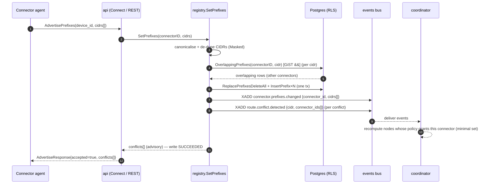

# registry service

**Revision:** 1
**Last modified:** 2026-06-25T00:00:00Z

> Master technical specification — Volume 3 (Control Plane, Go), service document **svc-registry**.
> Deepens the registry portion of [02 §1.3 / §2 / §5] (`docs/research/mvp/final/02-control-plane.md`)
> to nano-detail, implementation-ready precision. This is a SPEC: it describes the implementation;
> it does not build it. Source evidence cited inline by id: [04_P1] HelixVPN-Phase1-MVP.md,
> [04_ARCH §N] HelixVPN-Architecture-Refined.md, [research-go_cp] the 02 pass-1 control-plane doc,
> [SYNTHESIS §N] the cross-document synthesis. Unproven facts are marked **UNVERIFIED** (§11.4.6);
> nothing is fabricated.

---

## 1. Scope, ownership & non-goals

The **registry** is the `internal/registry` module of the Go modular monolith (`helixd`)
[02 §1.1, 04_P1 §1]. It owns the **node inventory** of the overlay: the `devices` table (both
`client` and `connector` kinds), the `connectors` 1:1 detail table, the `advertised_prefixes`
table, and the **ephemeral presence** state in Redis. It is the authority for three questions:

1. **Who is on this tenant's overlay?** — device enrollment record (identity + WG pubkey +
   overlay IP), lifecycle status, and the `connector`-specific `site_name`.
2. **Which CIDRs does each connector serve?** — `advertised_prefixes`, with intra-tenant
   **prefix-conflict detection** (two connectors advertising overlapping CIDRs).
3. **Which nodes are reachable right now?** — coarse online/offline presence (C3: presence is
   not traffic data; it is a heartbeat-driven boolean + last-seen + RTT health sample).

### 1.1 What the registry owns vs. delegates (the module seam, C7)

| Concern | Owner | Registry's relation |
|---|---|---|
| Overlay-IP allocation from the tenant ULA `/48` | **`ipam`** [02 §3] | registry **calls** `ipam.AllocOverlayIP` during enroll; never computes addresses itself |
| Enroll-token mint / verify / consume; OIDC; users | **`identity`** [02 §9] | `identity.Enroll` **drives** registry's `EnrollDevice`; registry never sees a token |
| Device mTLS cert issue / rotate / revoke | **`pki`** [02 §9.3] | registry **calls** `pki.IssueDeviceCert` / observes `pki.Revoke` via event |
| Compiled policy / need-to-know visibility | **`policy`** [02 §7] | registry produces inputs (devices, connectors, prefixes); policy consumes them |
| In-memory topology graph + `WatchNetworkMap` streams | **`coordinator`** [02 §6] | registry **emits events**; coordinator reacts. Registry holds **no** open streams |
| Durable persistence + RLS tenant pinning | **`store`** [02 §2.3] | every registry DB access runs through `store.WithTenant` (R4) |

**Non-goals (out of scope for this document, by design):** overlay-address math and `4via6`
site-id allocation (→ `ipam`, [02 §3]); the `WatchNetworkMap` byte-level stream and delta diffing
(→ `coordinator`, [02 §6] + Volume-3 svc-coordinator); policy compilation and `AllowedIPs`
synthesis (→ `policy`, [02 §7]); cert lifecycle internals (→ `pki`, [02 §9.3]). The registry's
job ends at **"the durable inventory is correct and an event was emitted"**; the coordinator turns
that into desired state on the wire.

### 1.2 Invariants this module must preserve (inherited from [02 §0.1])

- **C2** Postgres is the single source of truth for the device/connector/prefix inventory; Redis
  presence is ephemeral — losing Redis loses **no** durable inventory, only the online/offline
  cache, which re-converges on the next heartbeat.
- **C3** No-logging by construction: the registry stores **no** connection/flow/traffic row.
  `last_seen_at` is a coarse heartbeat timestamp (not per-packet); `rtt_ms` is a health sample,
  not a measurement series. The §2.4 schema-lint [02 §2.4] guards this mechanically.
- **C4** Default-deny / need-to-know: the registry never decides visibility; it supplies the raw
  inventory that `policy` filters. A device record's existence does **not** imply any peer can see
  it.
- **C5** Push, don't poll: every registry mutation that changes topology emits exactly one event
  (R3) so the coordinator converges in **p99 < 1 s** [02 §10.2].
- **C6** Device private keys never leave the device: registry stores only the 32-byte Curve25519
  **public** key (`devices.wg_pubkey`).
- **C8** Multi-tenant isolation at the database via RLS under a non-superuser role.

---

## 2. Domain model (Go types)

```go
// internal/registry/model.go
package registry

import (
	"net/netip"
	"time"

	"github.com/google/uuid"
)

// DeviceKind is the closed set of node roles. Mirrors the SQL enum device_kind
// and the proto enum helix.coordinator.v1.DeviceKind (§2.2, §4 of [02]).
type DeviceKind string

const (
	KindClient    DeviceKind = "client"
	KindConnector DeviceKind = "connector"
)

// DeviceStatus is the DERIVED lifecycle status (NOT a stored column — computed from
// revoked_at + presence, see §5). Closed set; any other value is a programming error.
type DeviceStatus string

const (
	StatusEnrolled DeviceStatus = "enrolled" // persisted, never yet (or not currently) online
	StatusOnline   DeviceStatus = "online"   // heartbeat fresh within the presence TTL
	StatusOffline  DeviceStatus = "offline"  // was online; heartbeat lapsed past TTL
	StatusRevoked  DeviceStatus = "revoked"  // revoked_at IS NOT NULL — terminal
)

// Device is the durable inventory record for both clients and connectors.
type Device struct {
	ID         uuid.UUID
	TenantID   uuid.UUID
	UserID     *uuid.UUID // nullable: anonymous device-token enrollments (C6)
	Kind       DeviceKind
	Name       string
	WGPubKey   [32]byte   // Curve25519 PUBLIC key only (C6)
	OverlayIP  netip.Addr // allocated by ipam from the tenant ULA /48 (D4)
	OS         string     // ios|android|linux|windows|macos|harmonyos|aurora ("" if unknown)
	EnrolledAt time.Time
	LastSeenAt *time.Time // COARSE; refreshed from heartbeat, never per-packet (C3)
	RevokedAt  *time.Time // non-nil => terminal Revoked
}

// Status derives the lifecycle status from the durable record + a presence probe.
// online is the result of registry.IsOnline (Redis presence, §5.3); pure given inputs.
func (d Device) Status(online bool) DeviceStatus {
	switch {
	case d.RevokedAt != nil:
		return StatusRevoked
	case online:
		return StatusOnline
	case d.LastSeenAt != nil:
		return StatusOffline
	default:
		return StatusEnrolled
	}
}

// Connector is the 1:1 detail record for a Device whose Kind == KindConnector.
type Connector struct {
	DeviceID uuid.UUID // PK == devices.id
	TenantID uuid.UUID
	SiteName string
	SiteID   uint32 // per-connector 4via6 site id, allocated by ipam at attach (D4, §6.4 [02])
}

// AdvertisedPrefix is one CIDR a connector serves to the overlay.
type AdvertisedPrefix struct {
	ID          uuid.UUID
	TenantID    uuid.UUID
	ConnectorID uuid.UUID // == connectors.device_id
	CIDR        netip.Prefix
	Enabled     bool
	CreatedAt   time.Time
}

// Conflict is an intra-tenant overlapping-CIDR finding from SetPrefixes (§6.2).
// It is advisory: it does NOT block the write; it is surfaced to the Console and
// resolved by 4via6 site disambiguation (D4) or operator choice [04_P1 §7.3].
type Conflict struct {
	CIDR              netip.Prefix
	WithConnectorID   uuid.UUID    // the other connector whose prefix overlaps
	WithCIDR          netip.Prefix // its overlapping CIDR
	Relation          OverlapKind  // equal | subset | supersets | intersects
}

type OverlapKind string

const (
	OverlapEqual      OverlapKind = "equal"      // identical CIDR
	OverlapSubset     OverlapKind = "subset"     // new ⊂ existing
	OverlapSuperset   OverlapKind = "superset"   // new ⊃ existing
	OverlapIntersects OverlapKind = "intersects" // partial overlap, neither contains the other
)
```

---

## 3. Interface surface (Go signatures — the module contract)

The exported `Registry` interface is the **only** way other modules touch the inventory (R1 — no
cross-store imports) [02 §1.2/§1.3]. This deepens the four-method sketch in [02 §1.3] to the full
nano-detail surface.

```go
// internal/registry/iface.go
package registry

import (
	"context"
	"net/netip"
	"time"

	"github.com/google/uuid"
)

type Registry interface {
	// ---- enrollment / lifecycle (driven by identity.Enroll, §4) ----

	// EnrollDevice persists a new device row, allocating its overlay IP via ipam
	// inside the SAME tx, and emits device.enrolled. Idempotent on (tenant, wg_pubkey):
	// a re-enroll of an existing pubkey returns the existing device (ErrAlreadyEnrolled
	// wrapped) without minting a second row or IP (§7.1). Connector kind also inserts
	// the connectors detail row + allocates a site_id via ipam.
	EnrollDevice(ctx context.Context, in EnrollInput) (Device, error)

	// GetDevice returns one device by id (tenant-scoped via RLS).
	GetDevice(ctx context.Context, deviceID uuid.UUID) (Device, error)

	// GetDeviceByPubKey resolves a 32-byte WG public key to its device (used by the
	// coordinator's authDevice path and by re-enroll idempotency).
	GetDeviceByPubKey(ctx context.Context, pub [32]byte) (Device, error)

	// DevicesForTenant lists all devices of a tenant (clients + connectors), newest first.
	DevicesForTenant(ctx context.Context, tenantID uuid.UUID) ([]Device, error)

	// Revoke flips revoked_at = now() (terminal), tells pki to revoke the cert in the
	// same tx, and emits device.revoked. Idempotent: a second Revoke is a no-op success.
	// Convergence target: edge enforcement < 1 s (C5, §8) [02 §9.3].
	Revoke(ctx context.Context, deviceID uuid.UUID, actor string) error

	// ---- connectors & advertised prefixes ----

	// AttachConnector marks an already-enrolled connector device as attached (site
	// metadata + site_id), emits connector.attached. Called when a connector device
	// first opens its control channel. Idempotent on connector device_id.
	AttachConnector(ctx context.Context, deviceID uuid.UUID, siteName string) (Connector, error)

	// SetPrefixes REPLACES the full enabled-prefix set for a connector (declarative,
	// not additive), runs intra-tenant conflict detection, persists, and emits
	// connector.prefixes.changed + (per conflict) route.conflict.detected. Returns the
	// advisory conflicts WITHOUT failing the write (§6.2). The cidrs slice is canonicalised
	// (Masked()) before storage; an empty slice clears all prefixes for the connector.
	SetPrefixes(ctx context.Context, connectorID uuid.UUID, cidrs []netip.Prefix) ([]Conflict, error)

	// PrefixesForConnector returns the connector's enabled prefixes.
	PrefixesForConnector(ctx context.Context, connectorID uuid.UUID) ([]AdvertisedPrefix, error)

	// PrefixesForTenant returns every enabled prefix of the tenant, joined to its connector
	// (the input the policy compiler cross-checks dst CIDRs against, [02 §7.2]).
	PrefixesForTenant(ctx context.Context, tenantID uuid.UUID) ([]AdvertisedPrefix, error)

	// ---- presence (Redis, ephemeral; §5) ----

	// MarkPresence sets/refreshes the online TTL key for a device and records a coarse
	// rtt_ms health sample (C3). online=false explicitly clears presence (graceful
	// disconnect). Emits device.online / device.offline ONLY on an edge transition (§5.4).
	MarkPresence(ctx context.Context, deviceID uuid.UUID, online bool, rttMS uint32) error

	// IsOnline reports current presence (TTL key existence). Pure read of Redis.
	IsOnline(ctx context.Context, deviceID uuid.UUID) (bool, error)

	// TouchLastSeen advances the COARSE devices.last_seen_at (rate-limited, §5.2) so a
	// per-packet write storm cannot occur (C3). Returns whether a write happened.
	TouchLastSeen(ctx context.Context, deviceID uuid.UUID) (written bool, err error)
}

// EnrollInput is the fully-resolved enrollment request (identity has already verified +
// consumed the enroll token before calling; registry trusts the caller's tenant scope).
type EnrollInput struct {
	TenantID uuid.UUID
	UserID   *uuid.UUID // nil for anonymous device-token enroll (C6)
	Kind     DeviceKind
	Name     string
	WGPubKey [32]byte // 32-byte Curve25519 public key (validated non-zero, §7.2)
	OS       string
	SiteName string        // required iff Kind == KindConnector (else "")
	CertTTL  time.Duration // passed through to pki.IssueDeviceCert (e.g. 24h)
}
```

The registry depends (constructor-injected, never package-imported) on three collaborators —
keeping R1 intact and the Phase-2 service split mechanical [02 §1.2, §14]:

```go
// internal/registry/service.go
type Service struct {
	store *store.Store     // WithTenant only (R4)
	ipam  ipam.IPAM        // AllocOverlayIP, AllocSiteID (§3 of [02])
	pki   pki.PKI          // IssueDeviceCert, Revoke (§9.3 of [02])
	bus   events.Bus       // Publish only — registry CONSUMES nothing; coordinator does (§7 of [02])
	rdb   *redis.Client    // presence TTL keys (ephemeral; C2)
	clk   clock.Clock      // injectable for deterministic tests (§9, §11.4.50)
}

var _ Registry = (*Service)(nil)
```

---

## 4. SQL DDL owned by the registry (subset of [02 §2.2], with refinements)

These three tables (plus the shared `tenants` FK target) are the registry's durable state.
DDL is authored in `migrations/` (goose), CI-linted by the §2.4 no-log schema-lint [02 §2.4].

```sql
-- ============ devices (clients AND connectors) ============
CREATE TYPE device_kind AS ENUM ('client','connector');

CREATE TABLE devices (
  id            uuid PRIMARY KEY DEFAULT gen_random_uuid(),
  tenant_id     uuid NOT NULL REFERENCES tenants(id) ON DELETE CASCADE,
  user_id       uuid REFERENCES users(id) ON DELETE SET NULL,  -- nullable: anon enroll (C6)
  kind          device_kind NOT NULL,
  name          text NOT NULL,
  wg_pubkey     bytea NOT NULL,            -- EXACTLY 32 bytes, Curve25519 PUBLIC key (C6)
  overlay_ip    inet NOT NULL,             -- allocated by ipam from tenant ULA /48 (D4)
  os            text,                      -- ios|android|linux|windows|macos|harmonyos|aurora
  enrolled_at   timestamptz NOT NULL DEFAULT now(),
  last_seen_at  timestamptz,               -- COARSE heartbeat ts, NOT per-packet (C3)
  revoked_at    timestamptz,               -- non-null => terminal Revoked
  UNIQUE (tenant_id, wg_pubkey),           -- re-enroll idempotency key (§7.1)
  UNIQUE (tenant_id, overlay_ip),          -- one device per overlay address
  CONSTRAINT wg_pubkey_len CHECK (octet_length(wg_pubkey) = 32)  -- C6 shape guard
);
-- list-by-tenant (newest-first) and the revoked-filtered hot path:
CREATE INDEX devices_tenant_enrolled_idx ON devices (tenant_id, enrolled_at DESC);
CREATE INDEX devices_tenant_active_idx   ON devices (tenant_id) WHERE revoked_at IS NULL;

-- ============ connectors (1:1 detail of a kind=connector device) ============
CREATE TABLE connectors (
  device_id   uuid PRIMARY KEY REFERENCES devices(id) ON DELETE CASCADE,
  tenant_id   uuid NOT NULL REFERENCES tenants(id) ON DELETE CASCADE,
  site_name   text NOT NULL,
  site_id     integer NOT NULL,            -- per-connector 4via6 site id (ipam, D4); unique/tenant
  attached_at timestamptz NOT NULL DEFAULT now(),
  UNIQUE (tenant_id, site_id)
);

-- ============ advertised_prefixes (CIDRs a connector serves) ============
CREATE TABLE advertised_prefixes (
  id            uuid PRIMARY KEY DEFAULT gen_random_uuid(),
  tenant_id     uuid NOT NULL REFERENCES tenants(id) ON DELETE CASCADE,
  connector_id  uuid NOT NULL REFERENCES connectors(device_id) ON DELETE CASCADE,
  cidr          cidr NOT NULL,             -- canonicalised (network address) before insert
  enabled       boolean NOT NULL DEFAULT true,
  created_at    timestamptz NOT NULL DEFAULT now(),
  UNIQUE (connector_id, cidr)              -- a connector never lists the same CIDR twice
);
CREATE INDEX advertised_prefixes_conn_idx   ON advertised_prefixes (tenant_id, connector_id);
-- conflict-scan support: GiST on inet/cidr for overlap (&&) queries (§6.2).
CREATE INDEX advertised_prefixes_cidr_gist  ON advertised_prefixes USING gist (cidr inet_ops)
  WHERE enabled;
```

**Refinements over [02 §2.2] / [04_P1 §2.1] (each stated, not silent — §11.4.6):**

- `devices.wg_pubkey_len CHECK` — a DB-level guarantee the stored key is exactly 32 bytes,
  closing the gap where a malformed pubkey (truncated / DER-wrapped) could persist. Belt to the
  application validator's suspenders (§7.2).
- `connectors.site_id` is promoted to a real column with `UNIQUE (tenant_id, site_id)` — [02 §3.2]
  describes per-connector site-ids for `4via6` but [04_P1 §2.1] omitted the column; it lives here
  because the registry persists what `ipam` allocates at attach.
- `advertised_prefixes UNIQUE (connector_id, cidr)` + the GiST overlap index make the §6.2 conflict
  scan an index range query rather than a full table sweep.
- All three tables carry `tenant_id` and get the identical RLS policy from [02 §2.3]
  (`ENABLE` + `FORCE ROW LEVEL SECURITY` + `tenant_isolation USING/WITH CHECK tenant_id =
  current_setting('app.tenant_id')::uuid`), enforced under the non-superuser `helix_app` role (C8).

### 4.1 The sqlc query set the registry compiles against

```sql
-- name: InsertDevice :one
INSERT INTO devices (tenant_id, user_id, kind, name, wg_pubkey, overlay_ip, os)
VALUES ($1,$2,$3,$4,$5,$6,$7) RETURNING *;

-- name: GetDeviceByPubKey :one
SELECT * FROM devices WHERE wg_pubkey = $1;          -- RLS pins tenant; UNIQUE makes it ≤1 row

-- name: RevokeDevice :execrows
UPDATE devices SET revoked_at = now() WHERE id = $1 AND revoked_at IS NULL;  -- rows=0 => already revoked

-- name: InsertConnector :one
INSERT INTO connectors (device_id, tenant_id, site_name, site_id)
VALUES ($1,$2,$3,$4) RETURNING *;

-- name: ReplacePrefixesDeleteAll :exec
DELETE FROM advertised_prefixes WHERE connector_id = $1;

-- name: InsertPrefix :one
INSERT INTO advertised_prefixes (tenant_id, connector_id, cidr, enabled)
VALUES ($1,$2,$3,true) RETURNING *;

-- name: OverlappingPrefixes :many
-- intra-tenant overlap scan EXCLUDING the connector being written (GiST && index):
SELECT ap.* FROM advertised_prefixes ap
WHERE ap.enabled AND ap.connector_id <> $1 AND ap.cidr && $2;  -- $2 = candidate cidr

-- name: TouchLastSeen :execrows
UPDATE devices SET last_seen_at = now()
WHERE id = $1 AND (last_seen_at IS NULL OR last_seen_at < now() - interval '30 seconds');
```

---

## 5. Device lifecycle & presence

### 5.1 Lifecycle state machine

Status is **derived** (§2 `Device.Status`), not a stored enum: durable `revoked_at` plus ephemeral
Redis presence yield exactly one of four states. `Revoked` is terminal — there is no un-revoke
(re-admitting a device is a **new** enrollment with a new id, [04_P1 §6.3]).

```mermaid
stateDiagram-v2
    [*] --> Enrolled: EnrollDevice OK\n(device.enrolled emitted)
    Enrolled --> Online: MarkPresence(true)\n(heartbeat; device.online)
    Online --> Offline: presence TTL lapses\nOR MarkPresence(false)\n(device.offline)
    Offline --> Online: MarkPresence(true)\n(device.online)
    Enrolled --> Revoked: Revoke()\n(device.revoked; pki revokes cert)
    Online --> Revoked: Revoke()\n(stream force-closed < 1s, §8)
    Offline --> Revoked: Revoke()
    Revoked --> [*]: terminal (DELETE cascades on tenant teardown)
    note right of Revoked
      revoked_at set; cert revoked;
      coordinator pushes peer-removal
      delta to everyone who saw it (C4)
    end note
```



Transition table (the authoritative truth — every transition has a trigger, a durable effect, and
an emitted event):

| From | To | Trigger | Durable effect | Event emitted | Presence effect |
|---|---|---|---|---|---|
| `[*]` | Enrolled | `EnrollDevice` success | INSERT `devices` (+`connectors` if connector) | `device.enrolled` | none |
| Enrolled / Offline | Online | `MarkPresence(true)` | `TouchLastSeen` (coarse) | `device.online` (edge only) | SET TTL key |
| Online | Offline | TTL expiry **or** `MarkPresence(false)` | none | `device.offline` (edge only) | DEL TTL key |
| any non-terminal | Revoked | `Revoke` | `revoked_at = now()`; `pki.Revoke` | `device.revoked` | DEL TTL key |

### 5.2 `last_seen_at` write-rate guard (C3 — coarse, never per-packet)

A heartbeat may arrive every few seconds; writing `last_seen_at` on each would create a write
storm and edge toward per-flow granularity. The `TouchLastSeen` query (§4.1) writes **only if the
stored value is older than 30 s** — a coarse, debounced presence timestamp. The presence *liveness*
signal that the coordinator reacts to is the Redis TTL key (§5.3), not this column; the column is
the durable "last known coarse" survivor of a Redis flush (C2).

### 5.3 Redis presence keys (ephemeral, C2)

```
key:    helix:presence:<tenant_id>:<device_id>     value: rtt_ms (uint32 as string)
SET ... EX <presence_ttl_seconds>                  # default TTL: 45s (3× the 15s heartbeat period)
```

- **Online** ≡ the TTL key exists. **Offline** ≡ it is absent (expired or explicitly deleted).
- The 45 s TTL = 3 missed 15 s heartbeats before a device is considered offline — tolerant of one
  lost heartbeat without flapping. **UNVERIFIED:** the 15 s heartbeat period and 45 s TTL are
  design defaults; the real cadence is set by the agent `ReportStatus` interval (Volume-3
  svc-coordinator / doc 01) and MUST be co-tuned with it — pending that, these are the floor.
- `rtt_ms` is stored as the key's value purely as a **health sample** (latest only, overwritten),
  never appended to a series (C3).
- Losing all of Redis silently downgrades every device to Offline until its next heartbeat
  re-creates its key — **no durable state lost** (C2); the coordinator treats a presence-miss as
  "relay-via-gateway still works, peer maybe slow", not as a topology change.

### 5.4 Edge-triggered presence events (no event storms)

`MarkPresence` emits `device.online` / `device.offline` **only on a state transition**, computed by
checking key existence before the SET/DEL:

```go
// internal/registry/presence.go
func (s *Service) MarkPresence(ctx context.Context, deviceID uuid.UUID, online bool, rttMS uint32) error {
	d, err := s.GetDevice(ctx, deviceID)            // RLS-scoped; ErrNotFound / ErrRevoked guarded
	if err != nil { return err }
	if d.RevokedAt != nil { return ErrRevoked }     // a revoked device never (re)appears online (§8)
	key := presenceKey(d.TenantID, deviceID)
	was, _ := s.rdb.Exists(ctx, key).Result()        // 1 == currently online
	if online {
		if _, err := s.TouchLastSeen(ctx, deviceID); err != nil { return err }
		if err := s.rdb.Set(ctx, key, rttMS, presenceTTL).Err(); err != nil { return err }
		if was == 0 {                                // OFF -> ON edge only
			return s.bus.Publish(ctx, "events:presence",
				events.New("device.online", d.TenantID, "system", map[string]any{"device_id": deviceID}))
		}
		return nil
	}
	if err := s.rdb.Del(ctx, key).Err(); err != nil { return err }
	if was == 1 {                                    // ON -> OFF edge only
		return s.bus.Publish(ctx, "events:presence",
			events.New("device.offline", d.TenantID, "system", map[string]any{"device_id": deviceID}))
	}
	return nil
}
```

A flapping or chatty heartbeat therefore produces **at most one** transition event, not one per
beat — bounding the coordinator's fan-out work (C5, [02 §6.4]).

---

## 6. Prefix advertisement & conflict detection

### 6.1 Two ways prefixes change (same code path)

A connector advertises CIDRs **either** over the `Coordinator.AdvertisePrefixes` agent RPC
([02 §4], `helix.coordinator.v1`) **or** an operator sets them via the Console REST route
`POST /v1/connectors/{id}/prefixes` [02 §8]. Both converge on `Registry.SetPrefixes`, so conflict
detection and event emission happen exactly once regardless of source.

`SetPrefixes` is **declarative-replace** (the full desired set), not additive — the connector/Console
sends the complete list; the registry diffs against stored state, replaces, and emits one
`connector.prefixes.changed` carrying the new set. This makes a retried RPC idempotent (the same
list yields the same stored state and a no-op-equivalent event).

### 6.2 Conflict-detection algorithm (intra-tenant overlap)

```go
// internal/registry/prefixes.go
func (s *Service) SetPrefixes(ctx context.Context, connectorID uuid.UUID,
	cidrs []netip.Prefix) ([]Conflict, error) {

	canon := make([]netip.Prefix, 0, len(cidrs))
	seen := map[netip.Prefix]struct{}{}
	for _, c := range cidrs {
		if !c.IsValid() { return nil, fmt.Errorf("%w: %v", ErrInvalidCIDR, c) }
		c = c.Masked()                              // canonicalise to network address
		if _, dup := seen[c]; dup { continue }      // de-dupe within the request
		seen[c] = struct{}{}
		canon = append(canon, c)
	}

	var conflicts []Conflict
	err := s.store.WithTenant(ctx, tenantOf(ctx), func(q *db.Queries) error {
		conn, err := q.GetConnector(ctx, connectorID)        // ErrNotConnector if missing (§7)
		if err != nil { return err }

		// 1. detect overlaps against OTHER connectors' enabled prefixes (GiST && index, §4)
		for _, c := range canon {
			rows, err := q.OverlappingPrefixes(ctx, db.OverlappingParams{ConnectorID: connectorID, Cidr: c})
			if err != nil { return err }
			for _, r := range rows {
				conflicts = append(conflicts, Conflict{
					CIDR: c, WithConnectorID: r.ConnectorID,
					WithCIDR: toPrefix(r.Cidr), Relation: classifyOverlap(c, toPrefix(r.Cidr)),
				})
			}
		}

		// 2. declarative replace (delete-all + re-insert) — atomic within the tx
		if err := q.ReplacePrefixesDeleteAll(ctx, connectorID); err != nil { return err }
		for _, c := range canon {
			if _, err := q.InsertPrefix(ctx, db.InsertPrefixParams{
				TenantID: conn.TenantID, ConnectorID: connectorID, Cidr: c}); err != nil {
				return err
			}
		}

		// 3. R3: emit the topology-change event (coordinator recomputes affected nodes)
		if err := s.publishPrefixesChanged(ctx, q, conn, canon); err != nil { return err }
		// 4. emit one route.conflict.detected per DISTINCT (cidr, other-connector) conflict
		for _, cf := range dedupeConflicts(conflicts) {
			if err := s.publishConflict(ctx, q, conn.TenantID, cf); err != nil { return err }
		}
		return nil
	})
	if err != nil { return nil, err }
	return conflicts, nil          // advisory: write SUCCEEDED even when conflicts != nil (§7.3)
}

// classifyOverlap returns the OverlapKind of two overlapping prefixes (both already validated
// to overlap by the && query). Pure; property-tested for symmetry (§9).
func classifyOverlap(a, b netip.Prefix) OverlapKind {
	switch {
	case a == b:                 return OverlapEqual
	case a.Bits() > b.Bits() && b.Contains(a.Addr()): return OverlapSubset   // a ⊂ b
	case a.Bits() < b.Bits() && a.Contains(b.Addr()): return OverlapSuperset // a ⊃ b
	default:                     return OverlapIntersects
	}
}
```

### 6.3 Conflict semantics (advisory, never blocking — [04_P1 §7.3])

A `route.conflict.detected` is **surfaced, not enforced**. Two connectors legitimately advertising
the same RFC1918 CIDR (e.g. two sites both numbering `192.168.1.0/24`) is the exact "1 user → N
networks" collision HelixVPN exists to solve ([SYNTHESIS §1], D4): the conflict is **resolved
downstream** by `4via6` site disambiguation (each connector's `site_id` yields a distinct IPv6
encoding, [02 §3.1]) or by operator policy choice in the Console. The registry's job is to **detect
and report** the overlap so a human (or the compiler's `host`-resolution step, [02 §7.2]) is never
silently ambiguous. Blocking the write would break the multi-network differentiator — so it does not.



---

## 7. Error taxonomy

Sentinel errors (`errors.Is`-comparable) map to transport codes: REST → HTTP status; Connect →
`connect.Code` [02 §4/§8]. No error leaks tenant data across the RLS boundary.

```go
// internal/registry/errors.go
var (
	ErrNotFound          = errors.New("registry: device not found")          // 404 / CodeNotFound
	ErrRevoked           = errors.New("registry: device is revoked")         // 403 / CodePermissionDenied
	ErrAlreadyEnrolled   = errors.New("registry: pubkey already enrolled")   // 409 / CodeAlreadyExists (wraps existing Device)
	ErrNotConnector      = errors.New("registry: device is not a connector") // 409 / CodeFailedPrecondition
	ErrInvalidCIDR       = errors.New("registry: invalid cidr")              // 400 / CodeInvalidArgument
	ErrInvalidPubKey     = errors.New("registry: wg pubkey must be 32 non-zero bytes") // 400 / CodeInvalidArgument
	ErrSiteNameRequired  = errors.New("registry: site_name required for connector kind") // 400 / CodeInvalidArgument
	ErrOverlayExhausted  = errors.New("registry: overlay pool exhausted")    // 500 / CodeResourceExhausted (ipam-bubbled)
	ErrTenantMismatch    = errors.New("registry: cross-tenant access denied") // 403 / CodePermissionDenied (RLS backstop)
)
```

| Condition | Error | REST | Connect |
|---|---|---|---|
| device id not in tenant | `ErrNotFound` | 404 | `CodeNotFound` |
| operate on a revoked device (incl. MarkPresence) | `ErrRevoked` | 403 | `CodePermissionDenied` |
| re-enroll an existing pubkey | `ErrAlreadyEnrolled` (wraps `Device`) | 409 | `CodeAlreadyExists` |
| SetPrefixes / AttachConnector on a `client` device | `ErrNotConnector` | 409 | `CodeFailedPrecondition` |
| malformed CIDR in advertise | `ErrInvalidCIDR` | 400 | `CodeInvalidArgument` |
| pubkey ≠ 32 bytes or all-zero | `ErrInvalidPubKey` | 400 | `CodeInvalidArgument` |
| connector enroll w/o `site_name` | `ErrSiteNameRequired` | 400 | `CodeInvalidArgument` |
| ipam has no free host in the /48 | `ErrOverlayExhausted` | 500 | `CodeResourceExhausted` |
| RLS denies (defense-in-depth) | `ErrTenantMismatch` | 403 | `CodePermissionDenied` |

**§11.4.1 (FAIL-bluffs forbidden):** every sentinel is returned **only** for its real product
condition; an internal script error (nil-deref, query typo) surfaces as a wrapped `%w` infra error
distinct from these — never silently mapped to one of the above. The conflict list is **not** an
error (§6.3).

---

## 8. Authorization rules

| Operation | Caller | Authz gate | Source |
|---|---|---|---|
| `EnrollDevice` | `identity` (after token verify) | enroll token single-use + tenant-scoped; registry trusts the resolved `EnrollInput.TenantID` | [02 §8.2/§9.2] |
| `AdvertisePrefixes` (agent) | connector device | device mTLS cert → `authDevice` resolves cert serial → `device_certs` → `devices`; **must be `kind=connector` and not revoked** | [02 §8.2] |
| `POST /v1/connectors/{id}/prefixes` (Console) | user | RBAC `admin`/`operator`; RLS pins tenant | [02 §8.1] |
| `Revoke` (`POST /v1/devices/{id}/revoke`) | user | RBAC `admin` **only** | [02 §8.1] |
| `GET /v1/devices`, `GET /v1/connectors` | user | RBAC `admin`/`operator`/`member`; RLS scope | [02 §8.1] |
| `MarkPresence` / `ReportStatus` (agent) | device | device mTLS cert; revoked device rejected with `ErrRevoked` | [02 §8.2] |

**Revoke convergence (the < 1 s promise, C5).** `Revoke` runs in one tx: `revoked_at=now()` +
`pki.Revoke` + emit `device.revoked`. The coordinator, on consuming `device.revoked`, (a) removes
the device's WG peer from every map that contained it and pushes the removal delta, and (b)
force-closes the revoked device's own open `WatchNetworkMap` stream
(`connect.CodePermissionDenied`) [02 §6.3]. The registry's contribution to the SLO is **emit the
event inside the same unit of work as the durable flip** (R3) so no window exists where the DB says
revoked but no event was sent. Target: revoke → edge-enforced **< 1 s** [02 §10.2].

```mermaid
sequenceDiagram
    autonumber
    participant Admin as Console (admin)
    participant API as api (Gin)
    participant Reg as registry.Revoke
    participant Store as Postgres (RLS)
    participant PKI as pki
    participant Bus as events bus
    participant Coord as coordinator
    participant Edge as Rust edge
    Admin->>API: POST /v1/devices/{id}/revoke (RBAC admin)
    API->>Reg: Revoke(deviceID, actor)
    Reg->>Store: UPDATE devices SET revoked_at=now() WHERE id=? AND revoked_at IS NULL
    Reg->>PKI: Revoke(deviceID)  [mark cert revoked, same tx]
    Reg->>Bus: XADD events:devices {device.revoked, device_id}
    Bus-->>Coord: deliver device.revoked
    Coord-->>Coord: drop node; compute peer-removal deltas (everyone who saw it, C4)
    Coord->>Edge: stream.Send(MapDelta{remove_peer_ids:[id]})
    Coord->>Edge: force-close revoked device's own stream (PermissionDenied)
    Edge-->>Edge: remove WG peer (kernel) < 1s
    Note over Admin,Edge: revoke → edge enforced, target p99 < 1s (§10.2 [02])
```

---

## 9. Events emitted (the registry's R3 contract)

The registry is a **pure producer** on the bus — it emits, it never consumes (the coordinator
consumes). Envelope per [02 §5.2]: `{id, type, tenant_id, ts, actor, payload, trace_id}`.

| Event type | Emitted by | Payload | Stream | Coordinator reaction [02 §5.3] |
|---|---|---|---|---|
| `device.enrolled` | `EnrollDevice` | `{device_id, kind, overlay_ip}` | `events:devices` | add node; if policy grants, push to peers' maps |
| `device.revoked` | `Revoke` | `{device_id}` | `events:devices` | remove node; push peer-removal delta; edge drops sessions |
| `device.online` / `.offline` | `MarkPresence` (edge only, §5.4) | `{device_id}` | `events:presence` | update presence; peers see relay availability |
| `connector.attached` | `AttachConnector` | `{device_id, site, site_id}` | `events:devices` | register connector; site-id already allocated (D4) |
| `connector.prefixes.changed` | `SetPrefixes` | `{connector_id, cidrs[]}` | `events:routes` | recompute routes; push to nodes whose policy includes it |
| `route.conflict.detected` | `SetPrefixes` (per conflict) | `{cidr, connector_ids[]}` | `events:routes` | flag overlapping-CIDR; surface in Console; resolve via 4via6 |

**Idempotency (C5 / [02 §5.4]):** every payload is recomputed-from-current-graph by the
coordinator, so an at-least-once redelivery is harmless. The registry emits **exactly one** event
per logical mutation inside the same `WithTenant` tx as the durable write (R3) — never before
(would announce an un-persisted change) and never in a separate tx (a crash between the two would
lose the event; the §11.4.147 no-work-loss posture relies on same-tx emission, with the bus's own
`XAUTOCLAIM` DLQ as the consumer-side safety net [02 §5.4]).

---

## 10. Edge cases (each with the defined behavior — §11.4.6, no guessing)

1. **Re-enroll of a live pubkey.** A device that lost its local state re-runs `Enroll` with the
   **same** WG pubkey. `EnrollDevice` finds the existing `(tenant, wg_pubkey)` row, returns it
   wrapped in `ErrAlreadyEnrolled` (no second row, no second IP, no second cert mint) — the caller
   (`identity`) treats this as "resume", returning the existing `device_id`/`overlay_ip`. Prevents
   overlay-IP leakage and double-billing of pool addresses.
2. **Enroll with a fresh pubkey on a replaced device.** A genuinely new keypair → new device id →
   new overlay IP (the old device is independently `Revoke`d by an operator; addresses are **not**
   recycled in Phase 1, [02 §3.2]).
3. **`SetPrefixes` on a `client` device.** `ErrNotConnector` — only `kind=connector` devices have a
   `connectors` row; the `GetConnector` lookup fails precondition before any write.
4. **Empty prefix list.** `SetPrefixes(connectorID, [])` clears all of that connector's prefixes
   (declarative replace), emits `connector.prefixes.changed{cidrs:[]}` — the coordinator removes
   the connector's routes from every dependent map. A legitimate "this site advertises nothing now"
   state, not an error.
5. **Overlapping CIDRs across two connectors.** Detected, `route.conflict.detected` emitted,
   **write still succeeds** (§6.3) — resolved by 4via6/operator, never blocked.
6. **Duplicate CIDR within one request.** De-duped at canonicalisation (§6.2) — stored once.
7. **Non-canonical CIDR (`192.168.1.5/24`).** `Masked()` canonicalises to `192.168.1.0/24` before
   storage and conflict scan — so `.5/24` and `.0/24` are the same stored prefix.
8. **Heartbeat for a revoked device.** `MarkPresence` returns `ErrRevoked` and emits nothing — a
   revoked device can never re-appear online (§5.4 guard). The agent's stream is already force-closed
   (§8).
9. **Redis flush mid-operation.** All devices silently → Offline; durable inventory untouched (C2);
   next heartbeat re-creates the presence key and emits one `device.online`. No topology change, no
   coordinator resync needed.
10. **Concurrent `SetPrefixes` for the same connector.** Serialised by the per-connector
    delete-all+insert inside one tx; the row locks on `advertised_prefixes` rows for that
    `connector_id` make the second writer observe the first's committed state — last-writer-wins on
    the **full set** (declarative semantics), never a torn half-merge.
11. **ipam pool exhausted at enroll.** `AllocOverlayIP` bubbles `ErrOverlayExhausted`; the enroll tx
    rolls back atomically — **no** orphan device row, **no** `device.enrolled` event
    (the emit is inside the same tx). **UNVERIFIED:** a `/48` yields ~2^80 hosts so this is a
    theoretical guard, not an expected Phase-1 condition [02 §3.2].
12. **Connector enrolled but never attached.** `EnrollDevice(kind=connector)` inserts the
    `connectors` row at enroll (site_name from `EnrollInput`); `AttachConnector` is idempotent and
    refreshes `attached_at`/`site` on first control-channel open. A connector that enrolls but never
    opens a stream simply has no presence key (Offline) and serves no routes until `SetPrefixes`.

---

## 11. SLO contribution (the < 1 s convergence promise)

The registry sits on the **left edge** of the [02 §10] reconciliation path: a mutation here must
reach the coordinator fast enough that event→delta-on-wire stays **p99 < 1 s** [02 §10.2]. The
registry's measurable contributions:

| Registry action | Budget within the 1 s | How measured |
|---|---|---|
| `Revoke` durable flip + same-tx event emit | ≤ 50 ms | API histogram `helix_registry_revoke_seconds` (handler entry → `bus.Publish` ack) |
| `SetPrefixes` (≤ 100 CIDRs) conflict-scan + replace + emit | ≤ 100 ms | `helix_registry_setprefixes_seconds` |
| `EnrollDevice` (incl. ipam alloc + pki cert) | < 500 ms round-trip | shares the [02 §10.2] enrollment-round-trip histogram |
| `MarkPresence` edge transition | ≤ 20 ms | `helix_registry_presence_seconds` |

The hard sub-budget is **same-tx emit** (R3): the event MUST be on the bus before the handler
returns success, so the coordinator's clock starts immediately. The end-to-end p99<1s is the
coordinator's SLO ([02 §10.2]); the registry's job is to not consume more than its slice and to
never emit late.

---

## 12. Test points — mapped to §11.4.169 (mandatory comprehensive test-type coverage)

§11.4.169 (live constitution anchor, 2026-06-25) mandates a **closed enumerated test-type set**,
each to as-close-to-100% as the domain permits, every PASS citing rock-solid captured **physical**
evidence (§11.4.5/.69/.107), zero false results, the only permitted absence an honest §11.4.3
SKIP-with-reason. Per registry concern:

| §11.4.169 test type | Concrete registry test point | Evidence / oracle |
|---|---|---|
| **unit** | `Device.Status` derivation truth-table (4 states × revoked/online/last_seen inputs); `classifyOverlap` symmetry + the 4 `OverlapKind`s; CIDR canonicalisation (`.5/24 → .0/24`) | captured table-test output; property test (same inputs ⇒ same `OverlapKind`, §11.4.50) |
| **integration** (real System, infra via `containers` §11.4.76) | enroll → attach connector → `SetPrefixes` → assert `advertised_prefixes` rows + `connector.prefixes.changed` on `events:routes`; Postgres+Redis booted on-demand (NOT ad-hoc `docker run`) | captured event stream + DB row dump |
| **e2e** | full lifecycle: enroll client + connector, advertise, mark presence, revoke; assert derived status flips Enrolled→Online→Revoked and the revoke delta reaches a stub coordinator < 1 s | captured timeline + `helix_registry_revoke_seconds` histogram |
| **full-automation** (§11.4.25/.52/.98, deterministic §11.4.50) | re-runnable (`-count=3` identical) script: spin infra → drive every `Registry` method → assert outcomes with zero manual steps | captured 3× identical run artifacts |
| **Challenges** (`challenges` submodule §11.4.27(B)) | a Challenge drives enroll→advertise→conflict→revoke and scores PASS only on captured DB+event evidence, not a green log line | challenge `result.json` + evidence dir |
| **HelixQA** (`helix_qa` submodule) | a registry test bank (one suite per operation) run in an autonomous QA session | HelixQA session report |
| **DDoS / load-flood** | flood `MarkPresence` (10k devices, 15 s cadence) and `AdvertisePrefixes`; assert edge-triggered events (≤1 per transition, §5.4) bound emission, `last_seen_at` debounce holds (no write storm, C3) | captured event-rate + DB write-rate metrics |
| **security** (§11.4.10 + `security` submodule) | RLS cross-tenant denial: tenant A cannot read/mutate B's devices even with a crafted query under `FORCE ROW LEVEL SECURITY` as `helix_app`; revoked device cannot re-mark presence; pubkey-32-byte CHECK rejects malformed keys | captured denied-query results; negative-case evidence |
| **stress + chaos** (§11.4.85) | kill Postgres mid-`SetPrefixes` (assert no torn prefix set; tx rolls back, no orphan event); kill Redis (assert all→Offline, durable inventory intact, re-converge on heartbeat) | captured recovery trace + state-delta snapshot |
| **concurrency / atomicity** | N concurrent `EnrollDevice` (distinct pubkeys) never collide on overlay IP (ipam row-lock, [02 §3.2]); concurrent `SetPrefixes` same connector ⇒ last-full-set-wins, never a half-merge (edge case 10) | captured no-double-alloc assertion |
| **race-condition / deadlock** | `-race` build green across the presence edge-detect (Exists→Set/Del) and the enroll tx; no lock-order inversion between `devices` and `advertised_prefixes` | captured `go test -race` output |
| **memory** | 24 h soak: 10k devices flapping presence + advertising; assert registry allocations bounded, `process_resident_memory_bytes` slope ≈ 0 (no presence-map or event-buffer leak) | captured 24 h memory slope |
| **benchmarking / performance** | `SetPrefixes` p99 ≤ 100 ms @ 100 CIDRs with the GiST overlap index; `Revoke` emit ≤ 50 ms; enroll < 500 ms (§11) | captured benchmark histograms vs §11 budgets |

**Paired §1.1 mutations (anti-bluff, the analyzer must catch its own negation):**
(a) break the §5.4 edge-detect so `device.online` fires on **every** heartbeat → the DDoS/event-rate
test MUST FAIL; (b) remove the `wg_pubkey_len` CHECK + the §7.2 validator → the security malformed-key
test MUST FAIL; (c) move the `bus.Publish` outside the `WithTenant` tx in `Revoke` → the chaos
kill-mid-revoke test MUST observe an orphan event and FAIL; (d) make conflict detection block the
write (return error instead of advisory `Conflict`) → the §6.3 advisory-semantics test MUST FAIL.
Each mutation flips its gate RED; restoring flips it GREEN (§11.4.115 polarity).

---

## Sources

[04_P1] HelixVPN-Phase1-MVP.md — §1 module layout (registry owns devices/connectors/prefixes/
presence), §2.1 DDL, §3 proto (`Enroll`/`AdvertisePrefixes`/`ReportStatus`), §4 coordinator graph
inputs, §5 event taxonomy (`device.*`/`connector.*`/`route.conflict.detected`), §6 enrollment +
PKI + revoke<1s, §7.2/§7.3 advertised-prefix cross-check + conflict, §8 REST/Connect surface,
§10 SLOs/tests. ·
[04_ARCH] HelixVPN-Architecture-Refined.md — §2.1 control/data separation (Go never in packet path),
§3.4 ULA /48 + 4via6 (D4), §7 no-logging/default-deny/need-to-know invariants. ·
[research-go_cp] docs/research/mvp/final/02-control-plane.md — §0.1 invariants C1–C8, §1.3 `Registry`
interface seed, §2.2/§2.3 DDL + RLS (`FORCE ROW LEVEL SECURITY`, `helix_app` role), §3 ipam D4,
§4 `helix.coordinator.v1` proto, §5 Redis-Streams event backbone + envelope, §6 coordinator fan-out,
§9 enrollment/PKI, §10.2 measured SLOs, §10.3 test strategy. ·
[SYNTHESIS] docs/research/mvp/final/.../SYNTHESIS.md — §1 product floor (1 user → N networks), §2
stack floor (Go+Gin+PG+Redis+rootless Podman), §3 decisions D3 (Redis Streams) / D4 (ULA+4via6),
§7 security/privacy invariants, §8/§9 ecosystem + constitution bindings. ·
Constitution §11.4.169 (mandatory comprehensive test-type coverage), §11.4.27 (no-fakes + test-type
set), §11.4.5/.69/.107 (captured-evidence anti-bluff), §11.4.50 (determinism), §11.4.76 (containers
submodule), §11.4.85 (stress+chaos), §11.4.115 (RED-polarity), §11.4.147 (no-work-loss), §1.1
(paired mutations).
