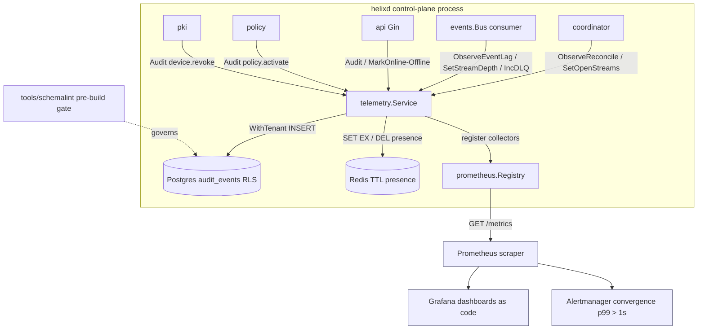
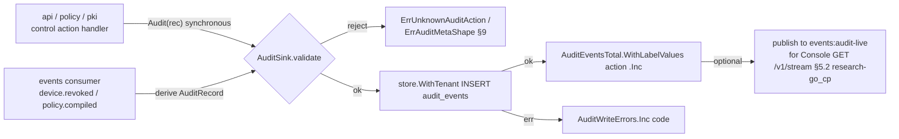
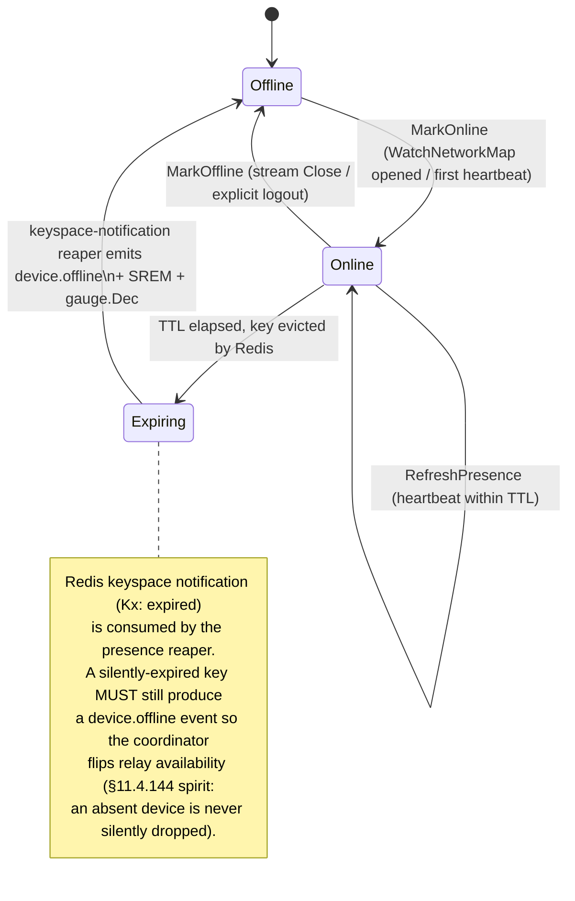
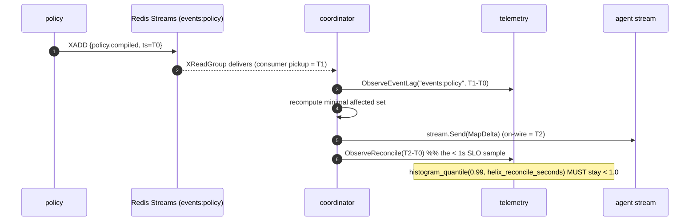
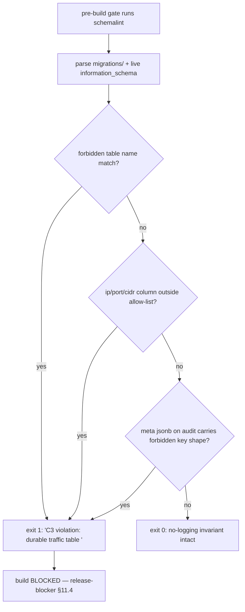

# telemetry service

**Revision:** 2
**Last modified:** 2026-06-26T12:00:00Z

> Master technical specification — Volume 3 (Control Plane, Go), nano-detail service spec.
> Deepens the telemetry part of [02 §1.1 / §4.174-row, §5.1, §10.2] — the `internal/telemetry`
> package of the `helixd` modular monolith. This is a SPEC (describe the implementation; do not
> build the product). Source evidence cited inline: [04_P1] HelixVPN-Phase1-MVP.md,
> [04_ARCH §N] HelixVPN-Architecture-Refined.md, [research-go_cp] the pass-1 control-plane doc
> `final/02-control-plane.md`, [SYNTHESIS §N] the cross-document synthesis. Unproven claims are
> marked `UNVERIFIED` per constitution §11.4.6 — never fabricated.

---

## 0. Position, ownership, and the one-sentence contract

The `telemetry` service is the control plane's **observability + audit + presence sink**. It owns
three responsibilities and **nothing else**:

1. **Aggregate counters + health** — Prometheus exposition of control-plane internal state
   (convergence latency, event lag, stream depth, Go runtime, build info) plus liveness/readiness
   health probes. Counts and gauges only — **never per-packet, per-flow, per-destination data** (C3).
2. **Control-action audit** — append-only ingestion of `audit_events` rows describing *who did what
   to the control plane* (revoke a device, activate a policy). **Never** traffic, flows, or
   destinations [04_ARCH §7, 04_P1 §11.4, C3].
3. **Live presence in TTL Redis** — the ephemeral `device:<id>:presence` key set whose **deliberate
   non-durability operationalizes the no-logging promise** [04_ARCH §4.5/§4.6]: online/offline state
   lives only in Redis with a TTL, so the durable store never accumulates a connection log.

It additionally **owns the no-logging-as-code invariant**: the CI schema-lint that fails the build if
any durable connection/traffic/packet/flow table appears (§7). The lint lives in `tools/schemalint`
but is *governed* by this service because the privacy guarantee is telemetry's charter.

### 0.1 What this service does NOT own (boundaries)

| Concern | Owner | Why not telemetry |
|---|---|---|
| Computing/streaming network maps | `coordinator` [research-go_cp §6] | telemetry only *measures* convergence; it never builds a map |
| Emitting domain events | producers (`identity`/`registry`/`policy`) [research-go_cp §5] | telemetry is a *consumer* of `events:*`, never a producer of domain events |
| Durable identity/topology/policy tables | `store` [research-go_cp §2] | telemetry owns only `audit_events` writes + presence (Redis) |
| Edge-side metrics (handshakes, transport mix, bytes-per-peer) | Rust edge [04_ARCH §9] | out of the Go control plane; the edge runs its own `/metrics` [04_ARCH §9] |
| Grafana dashboards / Alertmanager rules | `deploy/` [04_ARCH §9] | telemetry exposes the series; dashboards-as-code consume them |

### 0.2 The governing invariants this service must obey (subset of [research-go_cp §0.1])

| # | Invariant | This service's obligation |
|---|---|---|
| C2 | Postgres = truth; Redis = ephemeral | presence is Redis-only (TTL); losing Redis loses no durable state |
| C3 | No-logging by construction | exposes only aggregate counters; audits only control actions; *governs* the schema-lint |
| C5 | Push, don't poll; convergence p99 < 1 s | measures `event→delta-on-wire` and makes < 1 s a falsifiable series |
| C8 | Multi-tenant isolation at the DB (RLS) | `audit_events` writes run through `store.WithTenant`; metrics carry no tenant PII |

---

## 1. Package layout & wiring

```
internal/telemetry/
├── iface.go         # Telemetry interface (the only surface other modules import)
├── service.go       # concrete Service; wires registry + audit sink + presence + consumers
├── metrics.go       # the Prometheus metric registry (all collectors declared here)
├── audit.go         # AuditSink: validate → WithTenant insert → (optional) live fan-out
├── presence.go      # PresenceTracker: Redis TTL set/refresh/expire + gauge sync
├── health.go        # /healthz (liveness) + /readyz (readiness) handlers
├── consumers.go     # event-stream consumers that derive metrics (event lag, dlq, presence)
├── http.go          # mounts /metrics, /healthz, /readyz on the shared listener
└── slo.go           # convergence/lag/depth recording helpers used by coordinator+events
tools/schemalint/
└── main.go          # the no-logging CI gate (§7) — governed by telemetry, run pre-build
```

Wiring rule (extends [research-go_cp §1.2 R3/R4]): **telemetry is a pure consumer.** It MUST NOT
mutate topology/policy and MUST NOT publish domain events. Its only writes are (a) `audit_events`
rows (through `store.WithTenant`, R4) and (b) Redis presence keys. A `golangci-lint` custom analyzer
flags any `events.Publish` call inside `internal/telemetry` (telemetry never produces domain events).

### 1.1 The interface surface (Go signatures)

```go
// internal/telemetry/iface.go
package telemetry

import (
    "context"
    "net/http"
    "time"

    "github.com/google/uuid"
)

// Telemetry is the only surface other modules import (R1: interface, not store).
type Telemetry interface {
    // ---- audit (control actions only — C3) ----
    Audit(ctx context.Context, ev AuditRecord) error

    // ---- presence (ephemeral, Redis TTL — C2/C3) ----
    MarkOnline(ctx context.Context, tenantID, deviceID uuid.UUID, ttl time.Duration) error
    MarkOffline(ctx context.Context, tenantID, deviceID uuid.UUID) error
    RefreshPresence(ctx context.Context, tenantID, deviceID uuid.UUID, ttl time.Duration) error
    IsOnline(ctx context.Context, tenantID, deviceID uuid.UUID) (bool, error)

    // ---- SLO recording (called from coordinator/events hot paths) ----
    ObserveReconcile(d time.Duration)             // event→delta-on-wire (§6.1)
    ObserveEventLag(stream string, d time.Duration)
    SetStreamDepth(stream, group string, depth float64)
    SetOpenStreams(n int)                          // current WatchNetworkMap streams
    IncDLQ(stream string)

    // ---- HTTP surface (mounted on the shared listener, §8 of research-go_cp) ----
    MetricsHandler() http.Handler  // GET /metrics  (Prometheus text exposition)
    HealthHandler()  http.Handler  // GET /healthz  (liveness)
    ReadyHandler()   http.Handler  // GET /readyz   (readiness)
}

// AuditRecord is the in-memory shape an emitter hands to Audit(); it maps 1:1 to the
// audit_events row [research-go_cp §2.2]. There is NO ip/port/bytes field — by design (C3).
type AuditRecord struct {
    TenantID uuid.UUID         // RLS scope
    Actor    string            // user-uuid | "system"
    Action   AuditAction       // closed vocabulary, §4.2
    Target   string            // e.g. device-uuid, policy-version; opaque to telemetry
    Meta     map[string]any    // small JSON; lint-checked to carry no traffic shape (§4.4)
    TraceID  string            // correlates to the originating Envelope.trace_id [research-go_cp §5.2]
}
```

`Telemetry` is constructed once in `cmd/helixd` and injected into `coordinator`, `events`, `api`,
`policy`, `pki`, `registry`. No module imports `internal/telemetry`'s concrete types.

---

## 2. Component diagram



---

## 3. Prometheus metric registry (the complete series set)

All collectors are declared in `metrics.go` and registered into a **private** `*prometheus.Registry`
(not the global default — avoids the Go-runtime default-collector duplication and keeps the series set
auditable). `MetricsHandler()` returns `promhttp.HandlerFor(reg, …)`. [research-go_cp §10.2 names
`helix_reconcile_seconds`, `helix_events_dlq_total`, `process_resident_memory_bytes`; this section is
their canonical, complete declaration.]

### 3.1 Naming & label conventions

- Prefix `helix_` for every custom series. SI base units in the suffix (`_seconds`, `_bytes`,
  `_total`) per Prometheus convention [UNVERIFIED-exact-wording but standard practice].
- **Label cardinality is bounded by construction (C3 corollary).** Permitted labels: `stream`,
  `group`, `consumer`, `event_type`, `code` (error taxonomy §9), `version` (build). **Forbidden
  labels:** `tenant_id`, `device_id`, `overlay_ip`, `src_ip`, `dst_ip`, any high-cardinality or
  PII/traffic-shaped key. A per-tenant breakdown is NEVER a Prometheus label (it would leak
  tenant population + be unbounded) — per-tenant counters, if ever needed, live behind the
  authenticated REST `/v1/stats` (§5.2), not `/metrics`. A unit test asserts every registered
  collector's label set is a subset of the allow-list (§10 T-UNIT-3).

### 3.2 Convergence / real-time SLO series (the < 1 s promise made falsifiable)

```go
// metrics.go (excerpt)
var (
    ReconcileSeconds = prometheus.NewHistogram(prometheus.HistogramOpts{
        Name: "helix_reconcile_seconds",
        Help: "event-receive → MapDelta written to the WatchNetworkMap stream (C5 convergence).",
        // buckets straddle the 1s SLO so p99<1s is directly readable:
        Buckets: []float64{0.005, 0.01, 0.025, 0.05, 0.1, 0.25, 0.5, 0.75, 1.0, 2.5, 5.0},
    })
    EventLagSeconds = prometheus.NewHistogramVec(prometheus.HistogramOpts{
        Name: "helix_event_lag_seconds",
        Help: "Envelope.ts → consumer pickup (bus delivery latency, §6.2).",
        Buckets: []float64{0.001, 0.005, 0.01, 0.05, 0.1, 0.5, 1.0, 5.0},
    }, []string{"stream"})
    StreamDepth = prometheus.NewGaugeVec(prometheus.GaugeOpts{
        Name: "helix_stream_pending_entries",
        Help: "Redis Stream consumer-group PEL depth (un-acked backlog, §6.3).",
    }, []string{"stream", "group"})
    OpenStreams = prometheus.NewGauge(prometheus.GaugeOpts{
        Name: "helix_open_watch_streams",
        Help: "current open WatchNetworkMap server streams (coordinator load).",
    })
    DLQTotal = prometheus.NewCounterVec(prometheus.CounterOpts{
        Name: "helix_events_dlq_total",
        Help: "events routed to the dead-letter path after the delivery-count ceiling (§5.4 research-go_cp).",
    }, []string{"stream"})
    RevokeEnforceSeconds = prometheus.NewHistogram(prometheus.HistogramOpts{
        Name: "helix_revoke_enforce_seconds",
        Help: "device.revoke accepted → peer-removal delta on wire (revocation SLO, §9.3 research-go_cp).",
        Buckets: []float64{0.01, 0.05, 0.1, 0.25, 0.5, 0.75, 1.0, 2.5},
    })
)
```

### 3.3 Audit / presence / runtime series

```go
var (
    AuditEventsTotal = prometheus.NewCounterVec(prometheus.CounterOpts{
        Name: "helix_audit_events_total",
        Help: "control-action audit rows written, by action (NEVER traffic, C3).",
    }, []string{"action"}) // action label is the closed §4.2 vocabulary — bounded cardinality
    PresenceOnline = prometheus.NewGauge(prometheus.GaugeOpts{
        Name: "helix_presence_online_devices",
        Help: "devices currently flagged online in Redis TTL presence (ephemeral, §5).",
    })
    AuditWriteErrors = prometheus.NewCounterVec(prometheus.CounterOpts{
        Name: "helix_audit_write_errors_total",
        Help: "audit-sink failures by error code (§9 taxonomy).",
    }, []string{"code"})
    BuildInfo = prometheus.NewGaugeVec(prometheus.GaugeOpts{
        Name: "helix_build_info", Help: "1, labelled with version/commit (release prefix §11.4.151).",
    }, []string{"version", "commit"})
)
// Go runtime + process collectors are registered explicitly into the private registry:
//   reg.MustRegister(collectors.NewGoCollector(), collectors.NewProcessCollector(...))
// → exposes go_goroutines, go_gc_duration_seconds, process_resident_memory_bytes
//   (the §10.2 24h-soak no-leak SLO series, research-go_cp).
```

### 3.4 SLO → alert mapping (rules-as-code live in `deploy/`, telemetry only emits the series)

| SLO | Series + query | Alert threshold |
|---|---|---|
| convergence p99 < 1 s [C5, 04_ARCH §9] | `histogram_quantile(0.99, rate(helix_reconcile_seconds_bucket[5m]))` | `> 1.0` for 2 m |
| revoke < 1 s [research-go_cp §9.3] | `histogram_quantile(0.99, rate(helix_revoke_enforce_seconds_bucket[5m]))` | `> 1.0` |
| event lag healthy | `histogram_quantile(0.99, rate(helix_event_lag_seconds_bucket{stream="events:policy"}[5m]))` | `> 0.5` |
| backlog not growing | `helix_stream_pending_entries` | `> 1000` for 5 m |
| no DLQ accumulation | `increase(helix_events_dlq_total[15m])` | `> 0` |
| coordinator no leak [research-go_cp §10.2] | `deriv(process_resident_memory_bytes[6h])` | `> 0` sustained over soak |

> The recommendation to make **event-lag** and **map-convergence-time** first-class, alert-on-p99>1s
> SLOs is taken verbatim from [04_ARCH §9].

---

## 4. Control-action audit (the audit_events sink)

### 4.1 Storage (the row is owned by `store`; the *write path* is owned here)

The DDL is canonical in [research-go_cp §2.2] — reproduced for completeness, with the telemetry-side
constraints made explicit:

```sql
CREATE TABLE audit_events (
  id          bigint GENERATED ALWAYS AS IDENTITY PRIMARY KEY,
  tenant_id   uuid NOT NULL REFERENCES tenants(id) ON DELETE CASCADE,
  actor       text NOT NULL,             -- user id / "system"
  action      text NOT NULL,             -- closed vocabulary (§4.2)
  target      text,                      -- opaque id (device/policy/connector)
  ts          timestamptz NOT NULL DEFAULT now(),
  meta        jsonb                       -- small; lint-checked shape (§4.4)
);
CREATE INDEX ON audit_events (tenant_id, ts DESC);
-- RLS (C8): FORCE ROW LEVEL SECURITY + tenant_isolation, identical to every tenant table
-- [research-go_cp §2.3]. The sink writes ONLY through store.WithTenant — never raw db.Exec (R4).
-- Append-only by policy: helix_app is granted INSERT + SELECT on audit_events but NOT
-- UPDATE/DELETE → an audit row cannot be mutated or erased by the request-path role.
```

> **Append-only is a grant, not a trigger** (simplest mechanical guarantee): `REVOKE UPDATE, DELETE
> ON audit_events FROM helix_app;`. Retention pruning (if ever enabled) runs as the out-of-band
> `helix_sys` role on a schedule, not from request handling. Phase 1 default: **no auto-prune** —
> control-action audit is low-volume and operator-valuable; a documented `helixvpnctl audit prune
> --before <ts>` exists for GDPR-style erasure but is operator-driven, not automatic.

### 4.2 Closed action vocabulary (`AuditAction`)

Audit covers **control actions only**. The vocabulary is a closed Go enum so the `action` Prometheus
label and the lint allow-list are bounded and a typo cannot mint a new high-cardinality value.

```go
type AuditAction string
const (
    ActionDeviceEnrolled     AuditAction = "device.enrolled"
    ActionDeviceRevoked      AuditAction = "device.revoke"
    ActionDeviceCertIssued   AuditAction = "device.cert.issued"
    ActionDeviceCertRotated  AuditAction = "device.cert.rotated"
    ActionPolicyCreated      AuditAction = "policy.create"
    ActionPolicyActivated    AuditAction = "policy.activate"
    ActionPolicyRolledBack   AuditAction = "policy.rollback"
    ActionConnectorAttached  AuditAction = "connector.attached"
    ActionPrefixesChanged    AuditAction = "connector.prefixes.changed"
    ActionEnrollTokenMinted  AuditAction = "enroll_token.mint"
    ActionEnrollTokenUsed    AuditAction = "enroll_token.used"
    ActionTenantCreated      AuditAction = "tenant.create"
    ActionUserRoleChanged    AuditAction = "user.role.change"
    ActionAuthLogin          AuditAction = "auth.login"          // OIDC/account login (control-action audit)
    ActionAuthEnrollDenied   AuditAction = "auth.enroll.denied"  // rejected enroll attempt (abuse signal)
)
var auditVocabulary = map[AuditAction]struct{}{ /* all of the above */ }
```

> **Reconciled (§11.4.35, 2026-06-26):** `auth.login` + `auth.enroll.denied` are adopted into
> this canonical `AuditAction` enum (they are legitimate control-action audits — a login and a
> rejected enroll, never traffic). This enum is the superset source of truth; `[04-SEC §7]` and
> `[audit-and-compliance §4]` mirror it (`D-AC-1` resolved).

`Audit()` rejects any `Action` not in `auditVocabulary` with `ErrUnknownAuditAction` (§9) — a
closed set is the mechanical guarantee that audit never silently grows toward traffic logging.

These actions map directly onto the §5.3 event taxonomy [research-go_cp §5.3]: a producer that emits a
domain event (e.g. `policy.compiled`) and the audit it writes (`policy.activate`) share the
`Envelope.trace_id`, so the audit row and the bus event are correlatable.

### 4.3 Ingestion paths (synchronous write + event-derived write)

Two paths land the same row; both go through one validated sink so the C3/RLS guarantees hold once.



- **Synchronous path (authoritative):** a handler performing a privileged mutation calls `Audit()`
  *inside the same logical unit of work* as the mutation it records, so a committed
  `policy.activate` cannot exist without its audit row. Implementation: the handler's `WithTenant`
  closure does both the domain write and the audit insert in one transaction (atomic — either both
  land or neither). This is the **primary** path and the one DoD asserts.
- **Event-derived path (best-effort enrichment):** the events consumer (§6) may *also* derive an audit
  row from a bus event for Console live-streaming. To avoid double-write it is **idempotent on
  `(tenant_id, trace_id, action)`** — a partial unique index guards it:
  ```sql
  CREATE UNIQUE INDEX audit_dedup ON audit_events (tenant_id, (meta->>'trace_id'), action)
    WHERE meta ? 'trace_id';
  ```
  An insert that collides is swallowed as a no-op (the synchronous path already wrote it). For Phase 1
  the **synchronous path is canonical** and the event-derived path is OFF by default (`Meta.trace_id`
  still recorded for correlation) — enabled only when the Console live-audit feed is wired. [UNVERIFIED
  that both paths are simultaneously needed in MVP; spec keeps the synchronous path as the single
  source and documents the dedup index as the seam if the feed is added.]

### 4.4 Meta-shape guard (audit must not become a traffic log through the back door)

`Audit()` runs a `meta` shape check before insert: the JSON keys are matched against the same
forbidden-column regex the schema-lint uses (§7) — `src_ip`, `dst_ip`, `bytes_in`, `payload`,
`sni_host`, etc. A control-action audit carrying a `dst_ip` key is rejected with `ErrAuditMetaShape`.
This closes the "log traffic inside `meta.jsonb`" evasion of C3.

```go
// audit.go (excerpt)
func (s *AuditSink) validate(r AuditRecord) error {
    if _, ok := auditVocabulary[r.Action]; !ok { return ErrUnknownAuditAction }
    if len(r.Meta) > maxMetaKeys { return ErrAuditMetaShape } // bound the blob (default 16 keys)
    for k := range r.Meta {
        if forbiddenMetaKey.MatchString(k) { return ErrAuditMetaShape } // §7 regex shared
    }
    return nil
}
```

### 4.5 Audit authz (who may *read* audit)

Writing audit is internal (any control handler). **Reading** audit is RBAC-gated at the REST layer
[research-go_cp §8.1]: `GET /v1/audit` requires `admin` or `operator`; `member` is denied. RLS is the
floor — even an mis-scoped query returns only the caller's tenant rows (C8). Metrics (`/metrics`) carry
**no** audit content, only the `helix_audit_events_total{action}` aggregate count.

| Route | admin | operator | member |
|---|---|---|---|
| `GET /v1/audit` (list, tenant-scoped) | ✓ | ✓ | ✗ |
| `GET /metrics` (aggregate counts only) | scrape-network only (mTLS/allow-list, §8.3) | — | — |

---

## 5. Live presence in TTL Redis (operationalizes no-logging)

Presence is the mechanism that lets the system know *which devices are online right now* **without a
durable session/connection table** — the literal operationalization of the no-logging promise
[04_ARCH §4.5: "Live session/presence state lives in Redis (ephemeral, TTL'd) so the durable store
never accumulates a connection log"; §4.6: `device:<id>:presence`, TTL refreshed by heartbeat].

### 5.1 Key schema & TTL

| Key | Type | Value | TTL | Set/refreshed by |
|---|---|---|---|---|
| `presence:{tenant}:{device}` | string | `"1"` (or compact JSON `{"t":"masque-h3","rtt":21}`) | `PRESENCE_TTL` (default **45 s**) | `MarkOnline`/`RefreshPresence` on each `ReportStatus`/`WatchNetworkMap` heartbeat |
| `presence:{tenant}:set` | set (members) | device-ids currently online | — (members self-expire via the keyspace-notification reaper, §5.3) | reaper + Mark* |

- TTL = **3× the agent heartbeat interval** (heartbeat default 15 s [research-go_cp §4 `KeepAlive`
  20 s / `StatusReport`]; presence TTL 45 s gives 2 missed beats of grace before "offline"). The exact
  heartbeat cadence is the agent contract's; presence TTL is derived from it, never invented
  (§11.4.6) — `PRESENCE_TTL = 3 * HEARTBEAT_INTERVAL`.
- The value is **health-only** (current transport + rtt). It carries **no destination, no bytes, no
  flow** (C3) — same restriction as the `StatusReport` proto message [research-go_cp §4].
- Presence is **never** copied to Postgres. `devices.last_seen_at` is a *coarse* timestamp
  (refreshed at most every `LAST_SEEN_COARSEN` = 5 min, not per-heartbeat) so even the durable
  "last seen" cannot reconstruct a session timeline [research-go_cp §2.2 "COARSE presence"].

### 5.2 Presence operations (Go)

```go
// presence.go
func (p *PresenceTracker) MarkOnline(ctx context.Context, t, d uuid.UUID, ttl time.Duration) error {
    key := presenceKey(t, d)
    pipe := p.rdb.TxPipeline()
    pipe.Set(ctx, key, presenceVal(/*transport,rtt*/), ttl)   // SET key val EX ttl
    pipe.SAdd(ctx, setKey(t), d.String())                     // membership for fast count/list
    _, err := pipe.Exec(ctx)
    if err == nil { telemetry.PresenceOnline.Inc() }          // gauge sync (best-effort, §5.4)
    return err
}
func (p *PresenceTracker) RefreshPresence(ctx context.Context, t, d uuid.UUID, ttl time.Duration) error {
    // GETEX key EX ttl  (refresh TTL without resetting transport/rtt unless changed)
    return p.rdb.Expire(ctx, presenceKey(t, d), ttl).Err()    // online→online, no gauge change
}
func (p *PresenceTracker) MarkOffline(ctx context.Context, t, d uuid.UUID) error {
    pipe := p.rdb.TxPipeline()
    pipe.Del(ctx, presenceKey(t, d))
    pipe.SRem(ctx, setKey(t), d.String())
    _, err := pipe.Exec(ctx)
    if err == nil { telemetry.PresenceOnline.Dec() }
    return err
}
```

The `helix_presence_online_devices` gauge is the **derived** count. To survive gauge/Redis drift
(§5.4) it is **periodically reconciled** from `SCARD presence:*:set` (authoritative), not trusted as a
running tally alone.

### 5.3 Presence state machine (TTL expiry → offline event)



- Redis is configured with `notify-keyspace-events Ex` so expired-key events fire. The reaper
  subscribes to `__keyevent@<db>__:expired`, parses the device id, emits `device.offline` on
  `events:presence`, `SREM`s the membership set, and `Dec`s the gauge. **The expiry → offline event is
  mandatory**: a presence key that lapses without an `device.offline` would leave the coordinator
  advertising a dead relay (the corpus-hole / fabricated-continuity failure class, constitution
  §11.4.144).
- **UNVERIFIED:** Redis keyspace expiry notifications are best-effort and can be delayed under load
  [Redis docs note expired events fire when the key is *accessed* or actively expired]. Mitigation: a
  belt-and-suspenders sweeper runs every `PRESENCE_SWEEP` (default 30 s) doing `SMEMBERS
  presence:*:set` and `EXISTS` per member, reaping memberships whose key is gone. This is the
  reconciliation that also corrects the gauge (§5.4). The sweeper is the authoritative offline
  detector; keyspace notifications are the low-latency fast path.

### 5.4 Drift & failure handling

| Failure | Effect | Handling |
|---|---|---|
| Redis down (C2: ephemeral) | presence unknowable; **no durable state lost** | `IsOnline` returns `ErrPresenceUnavailable` (§9); coordinator treats unknown as "assume reachable via relay, mark degraded" — never errors a tunnel (fail-static C1). `helix_presence_online_devices` goes stale; a `helix_presence_backend_up` gauge (0/1) signals it. |
| gauge vs `SCARD` drift | online count wrong on dashboard | `PRESENCE_SWEEP` reconciles `PresenceOnline.Set(float64(total SCARD across tenants))` every sweep |
| keyspace notification missed | device stuck "online" | sweeper reaps it within `PRESENCE_SWEEP`; offline latency ≤ `PRESENCE_TTL + PRESENCE_SWEEP` |
| split-brain (two helixd) | both write same key | idempotent (SET is last-writer-wins; SADD is a set) — harmless |

---

## 6. Deriving SLO metrics from the event backbone

Telemetry runs a consumer in the `telemetry` consumer group on the `events:*` streams [research-go_cp
§5.1] purely to **measure** — it never reacts to topology. It computes three of the four headline
series here; the fourth (`helix_reconcile_seconds`) is recorded by the coordinator at the point of
`stream.Send` and merely *registered* here.

### 6.1 Convergence latency (`helix_reconcile_seconds`)

Measured **at the coordinator**, not in telemetry's consumer, because only the coordinator knows the
exact `stream.Send` instant. The coordinator stamps each enqueued delta with the originating
`Envelope.ts` and calls `telemetry.ObserveReconcile(time.Since(env.Ts))` immediately after a
successful `stream.Send`. Telemetry owns the histogram; the coordinator owns the measurement point.
This is the **event-receive → delta-on-wire** definition from [research-go_cp §10.2] — end-to-end the
admin-perceived "policy edit reflected < 1 s" is a *superset* (REST → compile → activate → bus →
this), tracked separately by the §10.1 reconciliation sequence's per-hop timers.



### 6.2 Event lag (`helix_event_lag_seconds{stream}`)

Telemetry's own consumer reads each `events:*` stream and observes `time.Now() - Envelope.ts` at
pickup. This isolates **bus delivery latency** from coordinator compute time — if convergence breaches
1 s, the lag series says whether the bus or the coordinator is at fault (the systematic-debugging
discriminator, §11.4.102 spirit).

### 6.3 Stream depth (`helix_stream_pending_entries{stream,group}`)

A ticker (default 5 s) runs `XPENDING <stream> <group>` (the summary form) for each (stream, group)
pair in the §5.1 matrix and `SetStreamDepth(stream, group, float64(count))`. A growing PEL means a
stuck/slow consumer — the back-pressure signal that complements the coordinator's bounded send-queue
[research-go_cp §6.4]. The DLQ counter (`helix_events_dlq_total`) is incremented by the events
package's `XAUTOCLAIM` sweeper when an entry exceeds the delivery-count ceiling [research-go_cp §5.4];
telemetry only owns the counter declaration + `IncDLQ`.

---

## 7. No-logging-as-code — the CI schema-lint (C3 enforced mechanically)

This is the privacy guarantee turned into a build gate. The lint is canonical in [research-go_cp §2.4];
this section is its nano-detail spec because the invariant is telemetry's charter.

### 7.1 What it parses and what it forbids

```go
// tools/schemalint/main.go  (run in pre-build; constitution §11.4.27 / §1.1 / §11.4.108 runtime sig)
package main

// Parses BOTH migrations/*.sql (static) AND the live information_schema (dynamic) so a table that
// exists in the DB but not in a migration (drift) is also caught.
var forbiddenTables = regexp.MustCompile(
    `(?i)\b(connections?|sessions?|flows?|traffic|packets?|netflow|bandwidth_samples?|dns_queries?|` +
    `conn_log|access_log|session_log)\b`)
var forbiddenCols = regexp.MustCompile(
    `(?i)\b(src_ip|dst_ip|dest_ip|src_port|dst_port|bytes_(in|out)|packet_count|payload|sni_host|` +
    `flow_id|session_id|conn_id)\b`)
// Exception allow-list (the ONLY ip/port/key columns permitted, asserted exhaustive):
//   devices.overlay_ip   (inet)  — identity, the device's own stable overlay addr (C6, not traffic)
//   devices.wg_pubkey    (bytea) — identity, 32B Curve25519 public key
//   advertised_prefixes.cidr (cidr) — topology, a connector's advertised network
//   overlay_pools.ula_prefix (cidr) — IPAM
// Any ip/port/cidr-shaped column NOT in this allow-list → FAIL.
```

### 7.2 The gate's verdict logic + runtime signature



- **Runtime signature (§11.4.108):** a green `schemalint` exit 0 against the *live* schema is the
  observable proving C3 is *active*, not merely promised. The §11.4.169 test matrix wires this as a
  post-deploy assertion against the deployed DB, not just the migration files.
- **Paired §1.1 mutation:** a test migration adding `connections(src_ip inet, dst_ip inet, bytes
  bigint, ts timestamptz)` MUST make the lint FAIL; removing it MUST make it pass. An analyzer that
  passes its golden-bad fixture is itself a bluff gate (§11.4.107(10)).

### 7.3 Edge cases the lint must handle (no false-pass, no false-fail)

| Case | Expected | Rationale |
|---|---|---|
| `connections` table added | FAIL | direct C3 breach |
| `device_connections_count bigint` column on `devices` | FAIL | `connections?` word-boundary match; if a legitimate aggregate is truly needed it must be a Prometheus counter, not a column |
| `audit_events.meta` containing `{"src_ip":"…"}` at runtime | FAIL via meta-shape guard (§4.4) | traffic-via-jsonb evasion |
| `advertised_prefixes.cidr` | PASS | on the topology allow-list |
| `overlay_ip` on `devices` | PASS | identity allow-list (the device's own addr, C6) |
| a `view` named `traffic_summary` over only counts | FAIL | privacy is about *shape*; rename to `metrics_summary` — the name itself is a forbidden signal; reviewer decides per §11.4.6, lint defaults to FAIL (safe) |
| comment line mentioning `bytes_out` | PASS | the parser strips SQL comments before matching (no false-fail on prose) |

---

## 8. HTTP surface, scrape security, and lifecycle

### 8.1 Endpoints (mounted on the shared listener [research-go_cp §8])

| Path | Method | Handler | Auth |
|---|---|---|---|
| `/metrics` | GET | `MetricsHandler` (promhttp) | scrape-network only (§8.3) |
| `/healthz` | GET | `HealthHandler` (liveness) | none (intra-pod) |
| `/readyz` | GET | `ReadyHandler` (readiness) | none (intra-pod) |

### 8.2 Health vs readiness semantics

```go
// health.go
// /healthz — liveness: the process event loop is alive. Returns 200 unless the process is wedged.
//   Deliberately does NOT depend on Postgres/Redis (a DB blip must not trigger a pod restart loop).
// /readyz  — readiness: dependencies usable. 200 iff Postgres reachable (SELECT 1, 200ms timeout)
//   AND Redis reachable (PING). A failing /readyz removes helixd from the LB/endpoints but does NOT
//   kill it (existing WatchNetworkMap streams keep serving from the in-mem graph — fail-static C1).
```

- Liveness MUST be cheap and dependency-free (DB down ≠ restart). Readiness gates *new* traffic only.
  This split is the standard k8s probe contract [UNVERIFIED-exact-citation but standard practice]; for
  the rootless-Podman MVP the quadlet uses `HealthCmd` on `/healthz` [research-go_cp §11.1].

### 8.3 Scrape security (`/metrics` must not leak the series set to the world)

`/metrics` carries no PII (C3 §3.1) but still reveals operational shape (tenant population via gauges,
deploy version). It is exposed **only on the internal scrape network**: bound to the pod-internal
interface, or gated by an allow-list / mTLS for the Prometheus scraper. `helixvpnctl bootstrap`
renders the scrape config so `/metrics` is never published on the public `443` listener
[research-go_cp §11.1 publishes only `443:8443` for the agent/app API; `/metrics` is a separate
internal port, default `9090`]. UNVERIFIED whether MVP uses port-separation vs path-ACL — spec
mandates *some* network isolation; port-separation is the recommended default.

---

## 9. Error taxonomy

Telemetry never aborts a control action because of its own failure (observability is best-effort
*relative to the user action*, authoritative *relative to audit*). The split:

| Code (`code` label) | Meaning | Caller-visible effect | Recovery |
|---|---|---|---|
| `ErrUnknownAuditAction` | `Action` not in closed vocabulary (§4.2) | audit insert refused; **the control action is rolled back** (audit is part of its tx) | fix the emitter — a missing action is a coding defect, fail-closed |
| `ErrAuditMetaShape` | `meta` carries forbidden key / too many keys (§4.4) | audit refused → control action rolled back (C3 fail-closed) | strip the offending key |
| `ErrAuditWrite` | Postgres insert failed (down/timeout) | control action rolled back (atomic tx) — **no silent loss** | retried by the caller's normal error path; `helix_audit_write_errors_total{code}` increments |
| `ErrPresenceUnavailable` | Redis down/timeout on a presence op | **control action NOT failed** (presence is ephemeral C2); coordinator treats state as "unknown→assume-reachable, degraded" (fail-static C1) | `helix_presence_backend_up`=0; recovers when Redis returns |
| `ErrMetricRegister` | duplicate collector at startup | **fatal at boot** (programmer error) | abort before serving — never half-registered |

> **Audit fails closed; presence fails static.** This asymmetry is deliberate and load-bearing: an
> unrecordable *control* action must not proceed un-audited (accountability), but an unknowable
> *presence* must never break an existing tunnel (C1 fail-static, C2 ephemeral). Conflating them
> would either lose audit or brick tunnels on a Redis blip.

---

## 10. Test points (tied to constitution §11.4.169 test-type coverage)

> **NOTE on §11.4.169:** the task states §11.4.169 is now a live constitution anchor mandating
> comprehensive test-type coverage. The full verbatim clause text is **UNVERIFIED** against the
> constitution submodule in this writing context (§11.4.6 — not fabricated); the test matrix below is
> mapped to the established test-type taxonomy of §11.4.27 (unit / integration / e2e / full-automation
> / security / stress / chaos / performance / Challenge) which §11.4.169 strengthens. Every PASS cites
> captured evidence per §11.4.5/§11.4.69/§11.4.107.

| ID | Type (§11.4.27/§11.4.169) | Asserts | Evidence |
|---|---|---|---|
| T-UNIT-1 | unit | `AuditSink.validate` rejects every non-vocabulary action + every forbidden `meta` key; accepts the closed set | table-test report |
| T-UNIT-2 | unit | presence TTL derivation `PRESENCE_TTL == 3*HEARTBEAT_INTERVAL`; `MarkOnline/Refresh/Offline` Redis command sequences | mini-redis transcript |
| T-UNIT-3 | unit | **every registered collector's label set ⊆ allow-list** (no `tenant_id`/`device_id`/ip labels) — C3 cardinality guard (§3.1) | label-audit assertion |
| T-UNIT-4 | unit | histogram buckets straddle 1.0 so p99<1s is directly readable (§3.2) | bucket assertion |
| T-STORE-1 | integration (RLS) | tenant A cannot read tenant B's `audit_events` even with crafted query under `FORCE ROW LEVEL SECURITY` as `helix_app`; `REVOKE UPDATE,DELETE` makes a row immutable | psql transcript |
| T-INT-1 | integration | Postgres+Redis booted **on-demand via `vasic-digital/containers`** (§11.4.76, *not* ad-hoc docker); drive enroll→online→heartbeat→offline; assert presence key set/TTL/expiry + `device.offline` emitted on key expiry | captured Redis + event log |
| T-INT-2 | integration | a committed `policy.activate` always has its `audit_events` row (atomic tx); a forced insert failure rolls back the activation | tx-log evidence |
| T-LINT-1 | meta-test (§1.1) | schema-lint FAILs on the planted `connections(src_ip,dst_ip,bytes)` migration; PASSes after removal; golden-bad fixture FAILs (analyzer self-validation §11.4.107(10)) | lint exit codes |
| T-PERF-1 | performance | `helix_reconcile_seconds` p99 < 1 s under a synthetic policy-flap load (the SLO benchmark) | histogram dump |
| T-SOAK-1 | soak/stress (§11.4.85) | N=10k open streams over 24 h; `process_resident_memory_bytes` slope ≈ 0; presence gauge stays reconciled to `SCARD` | grafana export |
| T-CHAOS-1 | chaos (§11.4.85) | kill Redis mid-run → control actions keep succeeding (audit still writes), `IsOnline`→`ErrPresenceUnavailable`, `helix_presence_backend_up`=0, no tunnel error (fail-static C1); recover → gauge re-reconciles | chaos transcript |
| T-CHAOS-2 | chaos | drop a keyspace-expiry notification → sweeper reaps within `PRESENCE_SWEEP`; offline latency ≤ `PRESENCE_TTL+PRESENCE_SWEEP` | timing capture |
| T-SEC-1 | security | `/metrics` not reachable on the public `443` listener; `GET /v1/audit` denied to `member`; audit `meta` cannot smuggle `dst_ip` | scan + RBAC matrix |
| T-CHAL-1 | Challenge (§11.4.27/§11.4.5) | full enroll→policy→delta drive asserts the < 1 s convergence series AND `schemalint` green against the *deployed* DB (runtime signature §11.4.108), captured evidence | challenge result.json |

---

## 11. Phase-1 task breakdown (workable items, §11.4.93)

Risk-descending (§11.4.132): the no-logging lint + RLS audit are the irreversible privacy/correctness
floor and land first.

- **TEL-T1 — no-logging gate.** `tools/schemalint` (§7) static+live parse + allow-list + meta-shape
  regex; paired §1.1 mutation (T-LINT-1); wire into pre-build + post-deploy runtime signature.
- **TEL-T2 — audit sink.** `AuditAction` closed vocab (§4.2); `AuditSink.validate` (§4.4);
  `WithTenant` insert + `REVOKE UPDATE,DELETE`; `helix_audit_events_total`; T-UNIT-1/T-STORE-1/T-INT-2.
- **TEL-T3 — presence.** `PresenceTracker` Redis SET/SADD/Expire/Del (§5.2); keyspace-expiry reaper +
  `PRESENCE_SWEEP` sweeper (§5.3); gauge reconcile (§5.4); T-UNIT-2/T-INT-1/T-CHAOS-1/2.
- **TEL-T4 — metric registry.** private `prometheus.Registry`; all §3 collectors + Go/process
  collectors; label allow-list test T-UNIT-3; `/metrics` handler + scrape isolation (§8.3) + T-SEC-1.
- **TEL-T5 — SLO recording.** `ObserveReconcile/EventLag/SetStreamDepth/IncDLQ/SetOpenStreams` (§6);
  coordinator + events call-sites; T-PERF-1; alert rules-as-code in `deploy/`.
- **TEL-T6 — health.** `/healthz` (dependency-free liveness) + `/readyz` (PG+Redis readiness) (§8.2);
  quadlet `HealthCmd` wiring.
- **TEL-T7 — soak + Challenge.** T-SOAK-1 (24 h, no-leak) + T-CHAL-1 (end-to-end < 1 s + deployed-DB
  lint green) via `helix_qa`/`challenges` (§11.4.27).

---

## 12. Phase-2 forward seams (additive, not a rewrite)

The MVP series + interfaces extend without reshaping: the `Telemetry` interface is bus/store-agnostic,
so the NATS-JetStream swap (D3) changes only `consumers.go`'s stream reads; per-region federation adds
a `region` label (still bounded) to the SLO histograms; the optional ClickHouse aggregate sink
[04_ARCH §4.165 `telemetry … ClickHouse optional`] mounts behind the same `Telemetry` interface as an
*export* of already-aggregated counters — **never** a connection log (C3 holds across phases, lint
gates Phase 2 too); presence migrates to NATS KV/Redis-cluster with the same TTL contract.

---

### Sources

[04_P1] HelixVPN-Phase1-MVP.md §§4–5,10,11.4 (audit table, Redis presence, no-logging CI lint,
convergence SLO) · [04_ARCH] HelixVPN-Architecture-Refined.md §4.5/§4.6 (ephemeral Redis presence
operationalizes no-logging), §4.165-row (`telemetry`: counters/health/audit, Prometheus, ClickHouse
optional), §7 (no-logging-as-code + control-only audit), §9 (Prometheus/Grafana, event-lag +
convergence p99>1s as first-class SLOs) · [research-go_cp] final/02-control-plane.md §1.1 (`telemetry`
package), §2.2/§2.3/§2.4 (audit DDL, RLS, schema-lint), §5 (event streams + envelope + taxonomy),
§6/§10.2 (coordinator convergence + `helix_reconcile_seconds`/`helix_events_dlq_total`/
`process_resident_memory_bytes`), §8 (multiplexed listener + RBAC), §11.1 (quadlet) · [SYNTHESIS] §2
(stack floor), §7 (no-logging invariants), §8 (`containers`/`helix_qa`/`challenges` wiring), §9
(constitution bindings). Proto package `helix.coordinator.v1` confirmed unified [research-go_cp §4].
UNVERIFIED markers: §11.4.169 verbatim text; Prometheus naming-convention exact wording; k8s
probe-contract citation; `/metrics` port-vs-path isolation choice — flagged inline per §11.4.6.
