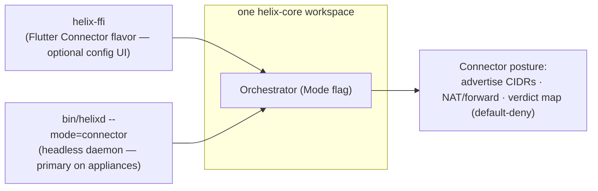
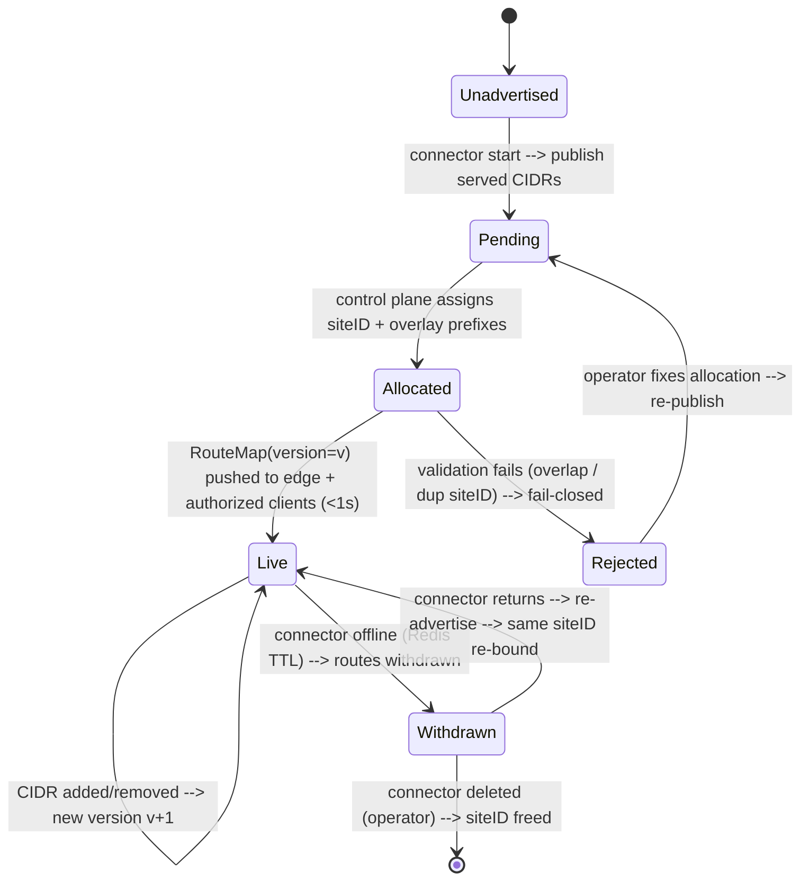

# Connector (network agent)

**Revision:** 1
**Last modified:** 2026-07-06T10:44:05Z
**Status:** active — Volume 4 (Clients) nano-detail document; closes GAP-4 in [`../v00-meta/requirements-traceability.md`](../v00-meta/requirements-traceability.md) §6.

> **Document role.** Single consolidating owner for the HelixVPN **Connector** — the appliance-side agent that advertises private LAN CIDRs to the gateway and routes authorized client traffic into those LANs without opening any inbound port. This document consolidates behaviour that was previously distributed across [`v04-client/helix-core-rust.md`](helix-core-rust.md) §9, [`v03-control-plane/svc-registry.md`](../v03-control-plane/svc-registry.md), [`v02-data-plane/routing-and-addressing.md`](../v02-data-plane/routing-and-addressing.md), the Volume-4 platform shims, and the FR-7xx requirements in [`v01-product/functional-requirements.md`](../v01-product/functional-requirements.md) §H.
>
> **SPEC-ONLY.** This is the *what-to-build* spec, not the shipped product. Every claim is cited inline; anything not yet pinned in the source docs is tagged **UNVERIFIED** per §11.4.6.

---

## Table of contents

- [0. Position, ownership & non-goals](#0-position-ownership--non-goals)
- [1. Invariants inherited from the source docs](#1-invariants-inherited-from-the-source-docs)
- [2. Functional consolidation (FR-701..707)](#2-functional-consolidation-fr-701707)
- [3. Architecture — one core, two postures](#3-architecture--one-core-two-postures)
- [4. Registry contract (advertise + route)](#4-registry-contract-advertise--route)
- [5. Data-plane routing and addressing](#5-data-plane-routing-and-addressing)
- [6. Platform shims, packaging & deployment](#6-platform-shims-packaging--deployment)
- [7. Test points — mapped to §11.4.169](#7-test-points--mapped-to-114169)
- [8. Sources verified / GAP-4 closure](#8-sources-verified--gap-4-closure)

---

## 0. Position, ownership & non-goals

### 0.1 What this document owns

| # | Contract | Owned here | Delegated to |
|---|---|---|---|
| C1 | The Connector as a **single component** with one owning nano-detail doc | this file | — |
| C2 | The Connector's **mode flag / posture**: `--mode=connector`, `CoreMode::Connector`, `Mode::Connector` | §3 | orchestrator internals live in [`v02-data-plane/orchestrator-and-state.md`](../v02-data-plane/orchestrator-and-state.md) |
| C3 | The **headless daemon** packaging and the optional Flutter/embedded config UI | §3, §6 | per-platform lifecycle in [`shim-linux.md`](shim-linux.md) §9, [`shim-android.md`](shim-android.md), [`helix-ui-flutter.md`](helix-ui-flutter.md) |
| C4 | The **registry contract**: connector enrollment, `AttachConnector`, `SetPrefixes`, CIDR conflict detection, presence | §4 | implementation detail in [`svc-registry.md`](../v03-control-plane/svc-registry.md) |
| C5 | The **advertise/route data-plane contract**: CIDR → 4via6 overlay prefix, `RouteMap` lifecycle, FIB, DNAT-back | §5 | byte-exact math in [`routing-and-addressing.md`](../v02-data-plane/routing-and-addressing.md) |
| C6 | The **local-denylist × central-policy precedence rule** at the Connector edge | §3.3 | rule authority in [`v03-control-plane/svc-policy.md`](../v03-control-plane/svc-policy.md) §4.2 |
| C7 | The Connector-specific **§11.4.169 test-type mapping** | §7 | Volume-8 harness docs in [`v08-testing/`](../v08-testing/) |

### 0.2 What this document does NOT own

- The orchestrator three-loop body, `TunnelStatus` enum, transport ladder, or kill-switch/DNS state machine — owned by [`v02-data-plane/orchestrator-and-state.md`](../v02-data-plane/orchestrator-and-state.md).
- The `Transport` trait and carrier wire formats — owned by [`v02-data-plane/transport-trait.md`](../v02-data-plane/transport-trait.md) and `transport-*.md`.
- The policy compiler grammar / `AllowedIPs` synthesis — owned by [`v03-control-plane/svc-policy.md`](../v03-control-plane/svc-policy.md).
- Enrollment token minting, OIDC, mTLS cert lifecycle — owned by [`svc-identity.md`](../v03-control-plane/svc-identity.md) and [`svc-pki.md`](../v03-control-plane/svc-pki.md).
- Availability-following / drop-detect-reconnect timings — owned by [`v02-data-plane/orchestrator-and-state.md`](../v02-data-plane/orchestrator-and-state.md) (FR-707 traceability target).

---

## 1. Invariants inherited from the source docs

| # | Invariant | Source | Connector consequence |
|---|---|---|---|
| I1 | **Outbound-only, no inbound.** The Connector dials the gateway; no port-forward or inbound listener is required on the private network. | FR-701, [`helix-core-rust.md`](helix-core-rust.md) §9.1, [`routing-and-addressing.md`](../v02-data-plane/routing-and-addressing.md) §0.2 R2 | Connector never binds a listening socket on the LAN side for the overlay. |
| I2 | **One core, no forked bodies.** Access and Connector share the same `helix-core` crate; the difference is the `Mode` parameter. | FR-703, [`helix-core-rust.md`](helix-core-rust.md) §9.1, [`shim-linux.md`](shim-linux.md) §9 | Same WG, transport ladder, reconciler, and status stream; only routing posture changes. |
| I3 | **Headless by default.** The Connector is primarily a daemon; the UI is an optional slim config surface. | FR-702, [`helix-core-rust.md`](helix-core-rust.md) §9.2 | `bin/helixd --mode=connector` is the primary appliance form. |
| I4 | **Default-deny / fail-closed.** Absent or stale policy ⇒ drop; the Connector installs the verdict map locally as well as honoring central policy. | FR-705, [`svc-policy.md`](../v03-control-plane/svc-policy.md) §4.2, [`routing-and-addressing.md`](../v02-data-plane/routing-and-addressing.md) §0.2 R3 | Local `local_denylist` is enforced at the connector edge even if the control-plane delta is delayed. |
| I5 | **No-logging by construction.** No per-flow/per-packet durable table; only aggregate counters and coarse presence. | [`svc-registry.md`](../v03-control-plane/svc-registry.md) §1.2 C3 | Connector heartbeat is coarse (`last_seen_at` debounced ≥30 s); presence TTL is ephemeral Redis. |
| I6 | **Push, don't poll.** Route/policy deltas reach affected edges in p99 < 1 s with no restart. | FR-305, [`routing-and-addressing.md`](../v02-data-plane/routing-and-addressing.md) §0.2 R1 | Connector re-reconciles on every pushed `RouteMap` version; it does not poll. |
| I7 | **Need-to-know map filtering.** A client/edge only receives routes/peers its policy already grants. | FR-207, [`routing-and-addressing.md`](../v02-data-plane/routing-and-addressing.md) §0.2 R2 | Connector's own map is also policy-filtered; it learns only the gateway/peer set it needs. |

---

## 2. Functional consolidation (FR-701..707)

The Connector requirement band (FR-7xx) is owned here; detailed implementation authority is cited per row.

| Req | Statement | Acceptance criterion | Test type(s) (from traceability matrix) | Implementation authority |
|---|---|---|---|---|
| HVPN-FR-701 | The Connector MUST dial outbound to the Gateway and MUST NOT require any inbound port-forward. | The Connector establishes the tunnel with zero inbound exposure on its network. `[evidence]` | SEC (no-inbound) + E2E | §3.1; [`helix-core-rust.md`](helix-core-rust.md) §9.1 |
| HVPN-FR-702 | The Connector MUST run headless (daemon) with an optional slim config UI. | The daemon runs without a UI; the optional UI configures it. `[evidence]` | INT | §3.2, §6; [`helix-core-rust.md`](helix-core-rust.md) §9.2 |
| HVPN-FR-703 | The Connector MUST share the same Rust `helix-core` as the Client, in advertise/route mode (not capture mode). | The Connector links the same crate; runs in advertise/route mode. | INT (shared-crate) | §3; [`helix-core-rust.md`](helix-core-rust.md) §9.1 |
| HVPN-FR-704 | The Connector MUST advertise its network's CIDRs to the Gateway and route authorized traffic into the LAN. | Advertised CIDR appears in the registry; authorized client reaches a LAN host. `[evidence]` | E2E | §4, §5; [`svc-registry.md`](../v03-control-plane/svc-registry.md) §6, [`routing-and-addressing.md`](../v02-data-plane/routing-and-addressing.md) §4 |
| HVPN-FR-705 | The Connector SHOULD support local ACLs scoped to its own network, interacting with central policy by the precedence rule. | A local ACL on the connector is honoured; local-deny overrides central-allow, central-deny overrides local-allow, and the connector advertises its `local_denylist` to the coordinator. `[evidence]` | INT (local-ACL honoured + central-deny wins) | §3.3; [`helix-core-rust.md`](helix-core-rust.md) §9.3, [`svc-policy.md`](../v03-control-plane/svc-policy.md) §4.2 |
| HVPN-FR-706 | The Connector MUST be runnable on Android/embedded appliance hardware in addition to Linux/Windows/macOS. | A Connector build runs on an embedded/Android target. `[evidence]` | E2E (embedded target) | §6; [`helix-core-rust.md`](helix-core-rust.md) §9.2, [`shim-android.md`](shim-android.md), [`shim-aurora.md`](shim-aurora.md), [`shim-harmonyos.md`](shim-harmonyos.md) |
| HVPN-FR-707 | The Connector MUST follow availability-following on drop: detect, log offline, reconnect with defined timings, resume (§11.4.144 alignment). | A simulated drop is logged offline, reconnected, and resumed with no silent gap. `[evidence]` | CHAOS (drop→resume) | [`v02-data-plane/orchestrator-and-state.md`](../v02-data-plane/orchestrator-and-state.md); this doc traces the requirement to that owner |

---

## 3. Architecture — one core, two postures

### 3.1 One binary, one core, two postures

The Connector is the **same** `helix-core` `Orchestrator` with `Mode::Connector` [`helix-core-rust.md`](helix-core-rust.md) §9.1. The three loops, status stream, reconciler, backoff, and transport layer are byte-for-byte identical to the client; only the routing posture differs:

```
client:    [app traffic] → TUN → WG encrypt → [DAITA] → Transport ──▶ gateway
connector: gateway ──▶ Transport → WG decrypt → forward into served CIDR (and reverse)
```

- **No default-route capture.** The Connector does not capture the host's default route.
- **Outbound-only.** It dials the gateway; it never listens on the LAN for overlay-initiated connections [`helix-core-rust.md`](helix-core-rust.md) §9.1, [`routing-and-addressing.md`](../v02-data-plane/routing-and-addressing.md) §0.2 R2.

### 3.2 The two entrypoints share the core



- **Headless daemon** (`bin/helixd --mode=connector`) is the primary form on network appliances — no Flutter, no FFI weight, just the core [`helix-core-rust.md`](helix-core-rust.md) §9.2, [`shim-linux.md`](shim-linux.md) §9.
- **Flutter Connector flavor** is the optional config surface; it links `helix-ffi` and drives the *same* core with `CoreMode::Connector`, calling `advertise(cidrs)` for the advertise UI [`helix-core-rust.md`](helix-core-rust.md) §9.2.

On Linux the daemon is a `Type=notify` systemd service (`helix-connectord`) with `CAP_NET_ADMIN` only, read-only rootfs protections, and a rootless Podman quadlet variant [`shim-linux.md`](shim-linux.md) §9.3/§9.4.

### 3.3 `advertise` and `local_denylist` (FFI verbs, connector only)

```rust
// helix-ffi/src/api.rs (connector mode)
pub async fn advertise(cidrs: Vec<String>) -> Result<AdvertiseResult, CoreError>;
pub async fn advertise_with_local_denylist(
    cidrs: Vec<String>,
    local_denylist: Vec<String>,
) -> Result<AdvertiseResult, CoreError>;
```

`advertise` pushes the served CIDRs into the Connector's `RouteMap`; the gateway reconciles them. `AdvertiseResult.conflicts` surfaces overlapping-CIDR findings to the UI [`helix-core-rust.md`](helix-core-rust.md) §9.3.

The `local_denylist` precedence rule (FR-705) is enforced in two places so it never fails open:

1. **Control-plane compiler** (`svc-policy.md` §4.2) — the coordinator computes the union of central policy minus local-deny for this connector.
2. **Connector local edge** — the Connector installs its local `local_denylist` as an additional verdict-map check while the central delta is in flight [`helix-core-rust.md`](helix-core-rust.md) §9.3.

Precedence:

| Local | Central | Effective verdict |
|---|---|---|
| allow | allow | allow |
| deny | allow | **deny** (local tightens) |
| allow | deny | **deny** (central default-deny wins) |
| deny | deny | deny |

The Connector advertises the `local_denylist` to the coordinator alongside its CIDR advertisements so the edge enforces it consistently [`helix-core-rust.md`](helix-core-rust.md) §9.3.

### 3.4 Status semantics on the connector

The Connector emits the **same** `TunnelStatus` stream as the client — its tunnel *to the gateway* is what `Connected{transport,rtt}` describes; `Down` means the connector lost its gateway tunnel [`helix-core-rust.md`](helix-core-rust.md) §9.4. The Connector Flutter flavor subscribes to `status_stream()` exactly as Access does.

---

## 4. Registry contract (advertise + route)

### 4.1 Connector enrollment

A Connector enrolls as a `device` row with `kind = 'connector'`. The registry inserts a 1:1 `connectors` detail row at enrollment, allocating a per-connector `site_id` via IPAM for 4via6 disambiguation [`svc-registry.md`](../v03-control-plane/svc-registry.md) §2, §4. `AttachConnector` is called when the connector first opens its control channel and refreshes `attached_at` idempotently [`svc-registry.md`](../v03-control-plane/svc-registry.md) §3.

### 4.2 Prefix advertisement

A connector advertises its served CIDRs through **either** the `Coordinator.AdvertisePrefixes` agent RPC **or** the Console REST route `POST /v1/connectors/{id}/prefixes`. Both converge on `Registry.SetPrefixes` [`svc-registry.md`](../v03-control-plane/svc-registry.md) §6.1.

`SetPrefixes` is **declarative-replace** (the full desired set), not additive. It:

1. Canonicalises and de-duplicates CIDRs (`Masked()`).
2. Detects intra-tenant overlapping prefixes against **other** connectors (advisory only — the write succeeds; conflicts are surfaced to the Console).
3. Atomically replaces the connector's `advertised_prefixes` rows.
4. Emits `connector.prefixes.changed` and, per conflict, `route.conflict.detected` inside the same `WithTenant` transaction [`svc-registry.md`](../v03-control-plane/svc-registry.md) §6.2.

An empty prefix list clears all advertisements for that connector — a legitimate "this site advertises nothing now" state [`svc-registry.md`](../v03-control-plane/svc-registry.md) §10.

### 4.3 Conflict semantics (advisory, never blocking)

Two connectors legitimately advertising the same RFC1918 CIDR (e.g. two sites both numbering `192.168.1.0/24`) is the exact "1 user → N networks" collision HelixVPN exists to solve. The registry **detects and reports** the overlap; resolution is downstream by 4via6 site disambiguation or operator policy choice [`svc-registry.md`](../v03-control-plane/svc-registry.md) §6.3.

### 4.4 Presence and route withdrawal

- Redis presence key: `helix:presence:<tenant_id>:<device_id>` with a 45 s TTL (3 × 15 s heartbeat default) [`svc-registry.md`](../v03-control-plane/svc-registry.md) §5.3.
- A connector going offline (TTL expiry or explicit `MarkPresence(false)`) causes the coordinator to withdraw its routes from dependent maps within the < 1 s reconcile budget [`routing-and-addressing.md`](../v02-data-plane/routing-and-addressing.md) §4.2.
- `last_seen_at` is rate-limited to ≥30 s to avoid a per-packet write storm [`svc-registry.md`](../v03-control-plane/svc-registry.md) §5.2.

---

## 5. Data-plane routing and addressing

### 5.1 From advertised CIDR to overlay prefix

Connectors advertise their served IPv4 LANs; the control plane compiles a `RouteMap` and pushes it to the gateway edge and to authorized clients via `WatchNetworkMap` [`routing-and-addressing.md`](../v02-data-plane/routing-and-addressing.md) §4.

Colliding RFC1918 ranges are resolved by **4via6**: each connector receives a `site_id`, and an advertised IPv4 route is encoded into a unique IPv6 overlay prefix:

```
fd<tenant>:4636:0:<site_id>:<ipv4-network>/<96+prefixlen>
```

Example from [`routing-and-addressing.md`](../v02-data-plane/routing-and-addressing.md) §3.1:

- Connector A serves `192.168.1.0/24` with site 7 → overlay route `fd..:4636:0:7:c0a8:100/120`.
- Connector B serves the same CIDR with site 8 → overlay route `fd..:4636:0:8:c0a8:100/120`.

### 5.2 Advertisement lifecycle



**UNVERIFIED:** the exact heartbeat TTL and same-siteID re-bind semantics are owned by the control-plane docs; the data-plane contract is: *a `RouteMap` with a withdrawn peer ⇒ reconcile that peer down in < 1 s, no restart* [`routing-and-addressing.md`](../v02-data-plane/routing-and-addressing.md) §4.2.

### 5.3 Packet flow — client → connector LAN host

1. Client FIB resolves the overlay destination to `NextHop{ wg_pubkey=connectorA, via_site=7 }`.
2. Client WG-encrypts to the connector peer; `AllowedIPs` includes the 4via6 prefix.
3. Gateway/edge forwards to the connector.
4. Connector decrypts, checks the verdict map (default-deny), decodes the 4via6 address to `(siteID, IPv4)`, DNATs into the served LAN, and forwards out the LAN interface [`routing-and-addressing.md`](../v02-data-plane/routing-and-addressing.md) §5.2.

The return path is the reverse: LAN reply → SNAT → WG encrypt → gateway → client.

### 5.4 Validation on ingest (fail-closed)

`helix-route` rejects a `RouteMap` version that:

- carries a `Via6` route whose `(site, v4)` does not match an `advertised_v4` + `via_connector`,
- has two peers advertising the same overlay prefix (`OverlapAdvertise`),
- gives two distinct connectors the same `siteID` (`DuplicateSiteId`) [`routing-and-addressing.md`](../v02-data-plane/routing-and-addressing.md) §4.1.

A bad map never half-applies; install errors leave the prior live map in place [`routing-and-addressing.md`](../v02-data-plane/routing-and-addressing.md) §0.2 R3.

---

## 6. Platform shims, packaging & deployment

### 6.1 Linux — primary connector host

Linux is the Connector's primary host. The daemon ships as:

- A `Type=notify` systemd service `helix-connectord` with `CAP_NET_ADMIN` only, `NoNewPrivileges=yes`, and `Restart=on-failure` [`shim-linux.md`](shim-linux.md) §9.3.
- A rootless Podman quadlet (`.container` unit) with `AddCapability=NET_ADMIN` and userspace TUN backend [`shim-linux.md`](shim-linux.md) §9.4.

### 6.2 Android / embedded / other platforms

- **Android**: the same `helix-core` `.so` is loaded with `CoreMode::Connector`; the optional Connector Flutter flavor uses `advertise()` over the JNI/UniFFI bridge [`shim-android.md`](shim-android.md) §3.1.
- **Windows**: the Connector flavor exposes `advertise(cidrs)` in the C# privileged service shim [`shim-windows.md`](shim-windows.md).
- **Aurora OS**: `helix_core_advertise_json(cidrs_json)` crosses the Qt/C++ Friflex channel because frb-in-the-embedder is UNVERIFIED on the omprussia fork [`shim-aurora.md`](shim-aurora.md).
- **HarmonyOS NEXT**: `helix_core_advertise(int64_t h, const char* cidrs_json)` is the connector-mode C-ABI verb [`shim-harmonyos.md`](shim-harmonyos.md).

**UNVERIFIED:** P3 platforms (HarmonyOS, Aurora) are tracked as platform-risk items; they get honest §11.4.3 SKIP-with-reason until on-device evidence is captured [`shim-android.md`](shim-android.md) §10.2 C12, [`functional-requirements.md`](../v01-product/functional-requirements.md) FR-1009/1010.

### 6.3 Deployment invariants

- The connector credential file (`connector.toml`) and any enrollment secret are `0600` root-owned and git-ignored — never in the unit file, never logged [`shim-linux.md`](shim-linux.md) §9.3.
- The connector is **not** a privacy client: kill-switch is typically `KillSwitchMode::Off` [`shim-linux.md`](shim-linux.md) §9.1.

---

## 7. Test points — mapped to §11.4.169

§11.4.169 mandates the closed enumerated test-type set; every PASS must cite captured physical evidence. The Connector test points below map the FR-7xx band to that vocabulary.

| §11.4.169 type | Concrete Connector test point | Evidence / oracle | Traced FR |
|---|---|---|---|
| **unit** | `classifyOverlap` symmetry; CIDR canonicalisation; `Mode::Connector` does not alter core loop bodies | table-test output; diff of client vs connector crate graph | FR-703 |
| **integration** | Enroll connector → `AttachConnector` → `SetPrefixes` → assert `advertised_prefixes` rows + `connector.prefixes.changed` event; shared-crate parity (client+connector link same `helix-core` artifact) | DB dump + event capture + build artefact hash | FR-702, FR-703, FR-704 |
| **e2e** | Client → gateway → connector → LAN host and back; unauthorized host dropped; no inbound listener on the connector network | `ping6`/`curl` + pcap + `ss -l` showing no listening socket on the LAN side | FR-701, FR-704, FR-705 |
| **full-automation** | Re-runnable script: stand up gateway, enroll connector, advertise CIDR, reach LAN host, revoke connector, assert withdrawal | 3× identical run artifacts | FR-701..705 |
| **Challenges** | Challenge bank drives enroll→advertise→conflict→revoke; scores on captured DB+event evidence, not a green log line | `result.json` + evidence dir | FR-704 |
| **HelixQA** | Connector test bank run in an autonomous QA session | HelixQA session report | FR-701..707 |
| **DDoS / load-flood** | Flood `MarkPresence` and `AdvertisePrefixes`; assert ≤1 transition event per state change and no `last_seen_at` write storm | event-rate + DB write-rate metrics | FR-707 (registry side) |
| **security** | Port-scan the connector LAN side — no listening overlay socket; `local_denylist` blocks a central-allowed flow at the connector edge; central-deny blocks a local-allowed flow | scan output + drop counters | FR-701, FR-705 |
| **stress + chaos** | Kill connector mid-flow → routes withdrawn → restored on return; corrupt `map.json` → rejected, prior map stays live | recovery trace + FIB snapshot | FR-704, FR-707 |
| **concurrency / atomicity** | Concurrent `SetPrefixes` for the same connector ⇒ last-full-set-wins, never a half-merge [`svc-registry.md`](../v03-control-plane/svc-registry.md) §10 | captured no-torn-prefix assertion | FR-704 |
| **race-condition / deadlock** | `-race` build green across connector advertise path and presence edge-detect | `go test -race` / `cargo test` output | FR-704 |
| **memory** | 24 h connector soak with flapping presence + advertising; RSS slope ≈ 0 | memory slope capture | FR-702, FR-707 |
| **benchmarking / performance** | `SetPrefixes` p99 ≤ 100 ms @ 100 CIDRs; route converge < 1 s after connector comes online | histograms vs §11 budgets | FR-704, FR-707 |

---

## 8. Sources verified / GAP-4 closure

- [`v01-product/functional-requirements.md`](../v01-product/functional-requirements.md) §H — FR-701..707 statements, acceptance criteria, and original distributed owning-doc citations.
- [`v04-client/helix-core-rust.md`](helix-core-rust.md) §9 — `Mode::Connector` packaging, headless daemon, `advertise`/`local_denylist` verbs, status semantics, one-core invariant.
- [`v03-control-plane/svc-registry.md`](../v03-control-plane/svc-registry.md) — connector enrollment, `AttachConnector`, `SetPrefixes`, conflict detection, presence model, events.
- [`v02-data-plane/routing-and-addressing.md`](../v02-data-plane/routing-and-addressing.md) — 4via6 CIDR advertisement, `RouteMap` lifecycle, FIB, DNAT-back, fail-closed validation.
- [`v04-client/shim-linux.md`](shim-linux.md) §9 — Linux connector daemon deployment (systemd + rootless Podman quadlet).
- [`v04-client/shim-android.md`](shim-android.md), [`shim-windows.md`](shim-windows.md), [`shim-aurora.md`](shim-aurora.md), [`shim-harmonyos.md`](shim-harmonyos.md) — connector-mode FFI surface on other platforms.
- [`v00-meta/requirements-traceability.md`](../v00-meta/requirements-traceability.md) §6 — GAP-4 was the absence of a single consolidating Connector doc; this document closes it.

> **GAP-4 closure note.** With `v04-client/connector.md` now the primary owning doc for FR-701..707, the Connector's traceability no longer spans multiple files as a *primary* owner. Secondary implementation authority remains in the source docs cited above, but the requirement-to-component pin is consolidated here.

*Constitution bindings: §11.4.44 (revision header), §11.4.6 (UNVERIFIED on un-pinned contracts; no invented runtime), §11.4.69 (captured-evidence acceptance), §11.4.93 (each FR → workable item), §11.4.118 (coverage honesty), §11.4.169 (mandatory test-type coverage), §11.4.161 (rootless deployment), §1.1 (paired mutations / anti-bluff).*
