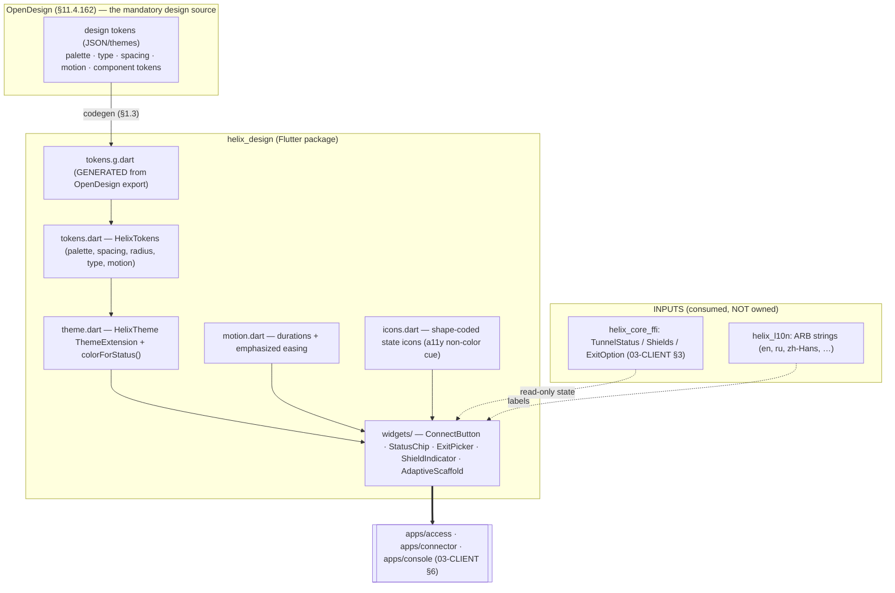
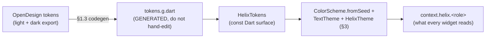
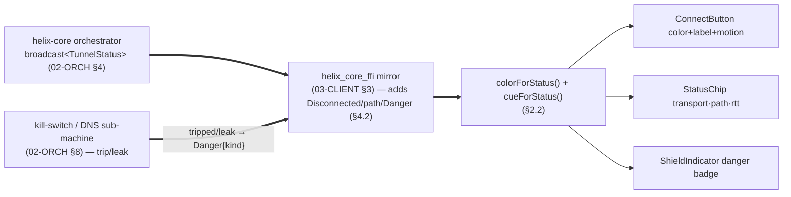
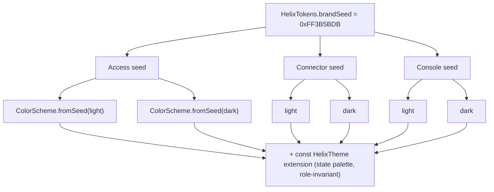
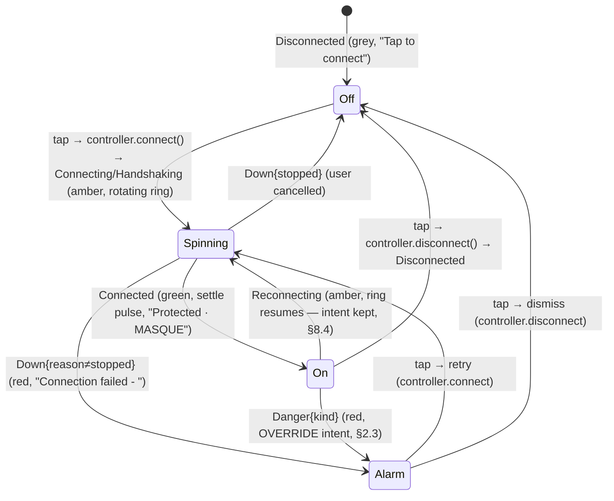
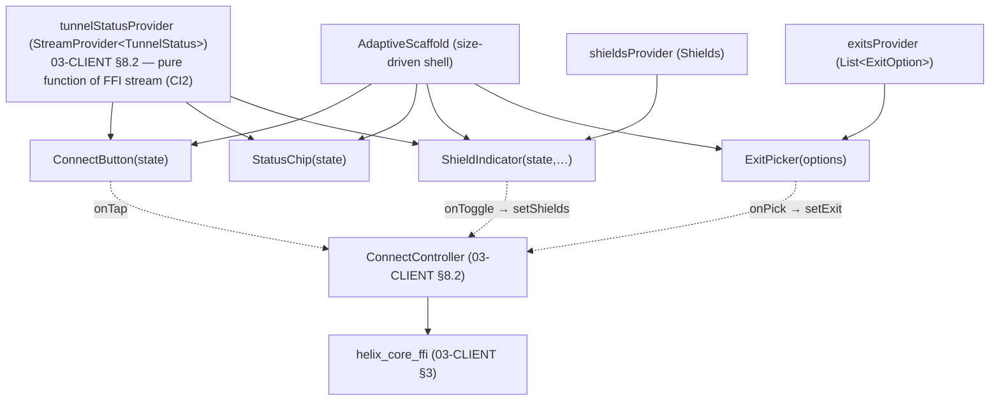
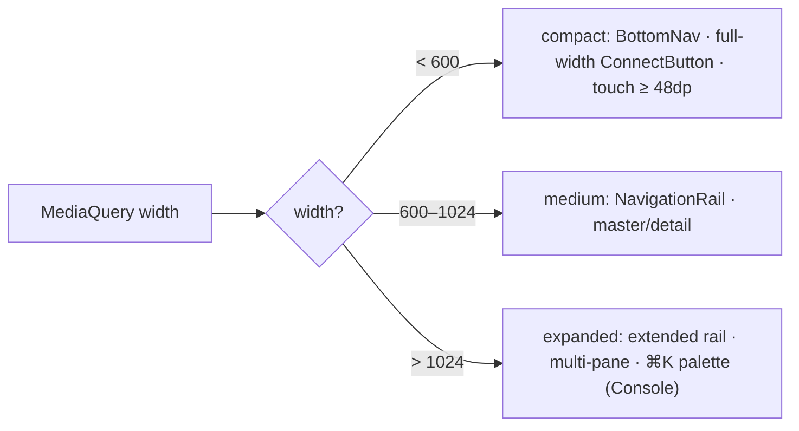
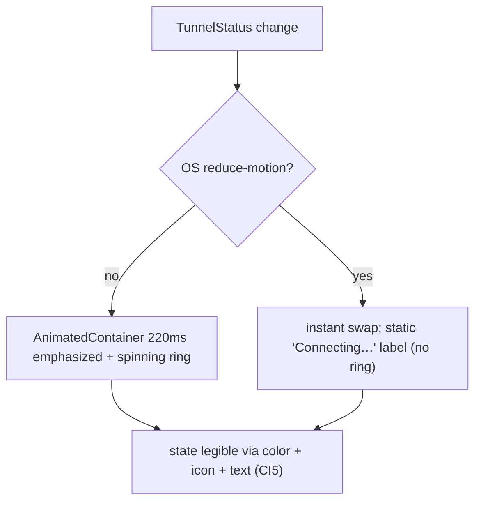

# helix_design design system

**Revision:** 1
**Last modified:** 2026-06-25T00:00:00Z

> Master technical specification — **Volume 4 (Clients)**, nano-detail deep-dive.
> This document **deepens** the *`helix_design` — the design system* section of
> the pass-1 client overview [04_UI §3, 03-CLIENT §7] into an implementation-ready
> specification of the `helix_design` Flutter package: the OpenDesign-backed token
> substrate (§11.4.162), the Material 3 theme layer, the signature
> connection-state palette, the five signature components (`ConnectButton`,
> `StatusChip`, `ExitPicker`, `ShieldIndicator`, `AdaptiveScaffold`), the
> responsive/adaptive one-tree layout, the motion system, accessibility, and the
> memory/frame budget. SPEC-ONLY: it describes **what to build and why**, to
> phase → task → subtask granularity; it does **not** build the product.
>
> **Boundary with sibling docs.** This document **consumes** the FFI `TunnelStatus`
> / `Shields` / `ExitOption` contract owned by `03-CLIENT §3` (which itself mirrors
> the core enum frozen in `v02-data-plane/orchestrator-and-state.md §4.1`), and the
> `TunnelPlatform` event contract owned by `03-CLIENT §4–§5`. It **owns** everything
> visual: tokens, theme, the signature widgets, the state→color mapping, the
> adaptive shell. It does **not** own the Riverpod providers (`03-CLIENT §8`), the
> screens, the FFI internals, or any platform shim. The widgets here are pure
> functions of the status stream (CI2); the design system never opens a tunnel.
>
> **Evidence base.** Citations inline by id: `[04_UI §N]` =
> `04_VPN_CLD/HelixVPN-helix-ui-Flutter.md`; `[04_ARCH §N]` =
> `04_VPN_CLD/HelixVPN-Architecture-Refined.md`; `[03-CLIENT §N]` =
> `final/03-client-core-and-ui.md`; `[02-ORCH §N]` =
> `final/v02-data-plane/orchestrator-and-state.md`; `[02-TX §N]` =
> `final/v02-data-plane/transport-trait.md`; `[SYN §N]` = `v09-research/_SYNTHESIS.md`;
> `[05_YBO]` = operator mandate. Any claim not grounded in the evidence base is
> tagged `UNVERIFIED` per constitution §11.4.6 — never fabricated.

---

## Table of contents

- [0. Position, ownership, and invariants](#0-position-ownership-and-invariants)
- [1. Token architecture — OpenDesign → Material 3 → HelixTokens](#1-token-architecture--opendesign--material-3--helixtokens)
- [2. The connection-state palette (the signature)](#2-the-connection-state-palette-the-signature)
- [3. HelixTheme — the ThemeExtension](#3-helixtheme--the-themeextension)
- [4. The FFI/platform surface the design system consumes](#4-the-ffiplatform-surface-the-design-system-consumes)
- [5. Signature components (nano-detail)](#5-signature-components-nano-detail)
- [6. Responsive / adaptive layout (one tree, every form factor)](#6-responsive--adaptive-layout-one-tree-every-form-factor)
- [7. Motion system](#7-motion-system)
- [8. Accessibility & i18n (CI5)](#8-accessibility--i18n-ci5)
- [9. Memory / frame budgets](#9-memory--frame-budgets)
- [10. Error handling & edge cases](#10-error-handling--edge-cases)
- [11. Test points — tied to §11.4.169](#11-test-points--tied-to-1114169)
- [12. Phase → task → subtask plan](#12-phase--task--subtask-plan)
- [13. Cross-document contracts this document fixes](#13-cross-document-contracts-this-document-fixes)
- [14. Open decisions surfaced by this document](#14-open-decisions-surfaced-by-this-document)
- [Sources verified](#sources-verified)

---

## 0. Position, ownership, and invariants

A VPN client's UI has one emotional center of gravity: **am I protected right
now?** `helix_design` makes that state instantly legible, then gets out of the
way [04_UI §3]. Material 3 is the substrate; brand tokens override the defaults so
it never reads as a stock Flutter app (a real risk to design against) [04_UI §3,
03-CLIENT §7]. Per §11.4.162 the token-and-theme system is **OpenDesign**, not
ad-hoc CSS or one-off styling.

### 0.1 What this document owns

| # | Contract | Owned here |
|---|---|---|
| DS1 | **Token substrate** — the OpenDesign-sourced design tokens (palette light+dark, typography, spacing, radius, motion, elevation) + their Flutter projection `HelixTokens` | §1 |
| DS2 | **Connection-state palette** — the four signature semantic colors (`stateDisconnected`/`stateConnecting`/`stateConnected`/`stateDanger`) and the `colorForStatus(TunnelStatus)` mapping | §2 |
| DS3 | **`HelixTheme`** — the `ThemeExtension` carrying tokens into `ThemeData`, light+dark first-class, per-role brand seed override (Access/Connector/Console) | §3 |
| DS4 | **Signature components** — `ConnectButton`, `StatusChip`, `ExitPicker`, `ShieldIndicator`, `AdaptiveScaffold` (+ `NetworkTile`, `PolicyEditor` referenced, owned by their screens' docs) | §5 |
| DS5 | **Responsive/adaptive rules** — one widget tree, branch on size never `Platform.isX`, the compact/medium/expanded breakpoints | §6 |
| DS6 | **Motion + a11y + i18n discipline** — emphasized-easing-on-state-change, semantic announcements, RTL, reduced-motion | §7–§8 |

### 0.2 What this document does NOT own

- The FFI surface (`start`/`stop`/`statusStream`/`exits`/`setShields`), the
  `TunnelStatus`/`Shields`/`ExitOption` *generation* — owned by `03-CLIENT §3`;
  this doc consumes the generated Dart mirrors as read-only inputs (§4).
- The `TunnelPlatform` shim contract and per-OS implementations — `03-CLIENT §4–§5`.
- The Riverpod providers, controllers, screens, and `runHelixApp` wiring —
  `03-CLIENT §6/§8`; this doc supplies the *widgets* those screens compose.
- The core orchestrator `TunnelStatus` enum and its emit discipline — frozen in
  `02-ORCH §4`; the design system never mutates it, only renders it.

### 0.3 Invariants this document inherits and tightens

| # | Invariant | Source | Design-system tightening |
|---|---|---|---|
| CI2 | **The UI is a pure function of the core's status stream.** No polling. | [03-CLIENT §0.1] | Every signature component is a stateless-ish `StatelessWidget` whose visual state is derived **solely** from the `TunnelStatus`/`Shields`/`ExitOption` it is handed; it holds no independent "connected" belief (§5). |
| CI5 | **State must be announced, not just colored** — never color alone for protected/unprotected. | [04_UI §9, 03-CLIENT §0.1] | Every state-bearing widget pairs its color with a `Semantics(label:)` announcement AND a non-color cue (icon shape / text); a screen-reader user and a colorblind user both get the state (§8). |
| DS-I1 | **Single token source of truth.** Screens reference *roles* (`context.helix.stateConnected`), never hardcoded `Color(0x…)` / magic spacing. | derived [04_UI §3.1] | A future white-label / self-host rebrand is a **token swap, not a refactor**; a hardcoded color in a screen is a release-blocking lint finding (§1.4). |
| DS-I2 | **Light + dark are both first-class**, not an afterthought theme. | [04_UI §9, 03-CLIENT §7.1] | Every component ships and is golden-tested in **both** themes; §11.4.162 mandates light+dark variants per component (§11). |
| DS-I3 | **No element overlaps another; no label overlays a label** (§11.4.162). | §11.4.162 | Layout uses constraint-driven composition (`Flex`/`Wrap`/`OverflowBar`), never absolute `Positioned` stacking of text; verified by a visual-regression overlap check (§11). |
| DS-I4 | **Motion is reserved for state change.** | [04_UI §3.3] | The connect transition is the one place to spend animation budget; idle screens are still. Reduced-motion accessibility short-circuits all non-essential animation (§7). |

### 0.4 The package at a glance



`helix_design` is a **decoupled, reusable** package (§11.4.28/§11.4.74) — no
project-specific glue, no `helix_core_ffi` dependency in its *code* (it depends
only on the *generated mirror types* as a type contract, injected by the consumer).
This keeps it independently publishable to its own `vasic-digital` repo
[03-CLIENT §2].

---

## 1. Token architecture — OpenDesign → Material 3 → HelixTokens

### 1.1 The three layers

1. **OpenDesign (source of truth, §11.4.162).** OpenDesign supplies the design
   tokens and themes: the full color palette in **light + dark** variants, the
   typography scale, the spacing/radius scale, and component-level tokens. Per
   §11.4.162 the project MUST install OpenDesign as a dependency and use its
   tokens/themes — NOT ad-hoc CSS/one-off tools. Missing patterns are extended
   **upstream** per §11.4.74, never duplicated in-project.
   `UNVERIFIED` (§11.4.6, pending §11.4.99 latest-source verification of
   `https://github.com/nexu-io/open-design`): OpenDesign's exact Flutter/Dart
   package name, import path, and token-export file format are not confirmed in
   the evidence base. This document fixes the **integration contract** (the token
   taxonomy OpenDesign must supply + the codegen seam) and marks the concrete API
   binding as an open item (§14 D-DS-1).
2. **Material 3 (Flutter substrate).** OpenDesign tokens are projected onto
   Flutter's Material 3 `ColorScheme` / `TextTheme` / `ThemeData`. M3 is the
   widget substrate (ripples, `NavigationBar`, `NavigationRail`, `FilledButton`
   shapes); the brand tokens override M3 defaults so the app never reads as stock
   Flutter [04_UI §3, 03-CLIENT §7].
3. **`HelixTokens` (the Dart API screens read).** A flat, `const`, compile-time
   token surface that screens and widgets reference by *role*. Screens never touch
   OpenDesign or raw M3 directly (DS-I1).



### 1.2 `HelixTokens` — the single source of truth

```dart
// helix_design/lib/tokens.dart  — the flat const token surface (DS-I1)
class HelixTokens {
  // ── connection-state palette (the signature semantic colors, §2) ──────────
  static const stateDisconnected = Color(0xFF6B7280); // neutral grey  ← Disconnected
  static const stateConnecting   = Color(0xFFF59E0B); // amber, in-motion ← Connecting/Handshaking/Reconnecting
  static const stateConnected    = Color(0xFF10B981); // green, safe   ← Connected
  static const stateDanger       = Color(0xFFEF4444); // red           ← Danger/Down

  // ── brand seed: drives the M3 ColorScheme; overridden per role (§3.3) ─────
  static const brandSeed = Color(0xFF3B5BDB);         // HelixVPN brand indigo

  // ── spacing (4-base scale) ────────────────────────────────────────────────
  static const space1 = 4.0, space2 = 8.0, space3 = 12.0, space4 = 16.0,
               space6 = 24.0, space8 = 32.0, space12 = 48.0;

  // ── radius ────────────────────────────────────────────────────────────────
  static const radiusSm = 8.0, radiusMd = 12.0, radiusLg = 20.0, radiusPill = 999.0;

  // ── motion (§7) ─────────────────────────────────────────────────────────────
  static const motionFast = Duration(milliseconds: 120);
  static const motionBase = Duration(milliseconds: 220);
  static const motionSlow = Duration(milliseconds: 360);

  // ── elevation: 0..3, used sparingly; flat surfaces, color-as-hierarchy ─────
  static const elevation0 = 0.0, elevation1 = 1.0, elevation2 = 3.0, elevation3 = 6.0;

  // Typography roles map to the M3 scale (display/headline/title/body/label) with
  // the BRAND font (NOT Roboto default); concrete TextStyles live in HelixTheme (§3.2).
}
```

> The literal hex values above are the **pass-1 token values** ratified in
> [04_UI §3.1, 03-CLIENT §7.1]. Under §11.4.162 these become the HelixVPN
> *instantiation* of OpenDesign's palette tokens: the codegen (§1.3) emits them
> into `tokens.g.dart` from the OpenDesign export, and `HelixTokens` re-exports
> the generated values so the rest of the package stays stable even if OpenDesign's
> internal naming changes. The brand seed `0xFF3B5BDB` is fixed across all three
> flavors (the per-role override changes the *derived* scheme, §3.3, not the seed).

### 1.3 The OpenDesign codegen seam (the no-drift guarantee)

The token pipeline mirrors the project's other codegen drift-gates
(`flutter_rust_bridge`, OpenAPI→Dart) [03-CLIENT §11]:

| Step | Artifact | Tracked? | Regeneration mechanism (§11.4.77) |
|---|---|---|---|
| 1 | OpenDesign token export (light+dark) | tracked input | OpenDesign CLI / package export (`UNVERIFIED` exact cmd → §14 D-DS-1) |
| 2 | `tool/gen_tokens.dart` | tracked | hand-authored generator (reads step-1 export → emits step-3) |
| 3 | `tokens.g.dart` | tracked (regenerable) | `dart run tool/gen_tokens.dart` |
| 4 | drift check | CI/local sweep | `gen_tokens` re-run + `git diff --exit-code tokens.g.dart` — a drift FAILs the build (DS-I1) |

A token edit that lands in a screen as a raw `Color(0x…)` or a magic `EdgeInsets`
constant (bypassing `HelixTokens`) is caught by a custom `analyzer` lint
(`avoid_hardcoded_design_values`, §1.4) — both are DS-I1 violations.

### 1.4 Lint enforcement of DS-I1 / DS-I3

```
custom_lint rules (helix_design/lint/):
  - avoid_hardcoded_design_values   : flag literal Color()/EdgeInsets/BorderRadius
                                       outside tokens.dart / tokens.g.dart
  - require_semantics_on_state_color : a widget reading a state-palette token MUST
                                       also attach a Semantics(label:) (CI5, §8)
  - no_text_overlap_stack            : flag a Stack whose children include >1 Text
                                       without an OverflowBar/Wrap guard (DS-I3)
```

These are **pre-build gates** (§11.4.4(b) layer 1); each has a paired §1.1 mutation
(plant a hardcoded color → lint FAILs; strip a `Semantics` → lint FAILs) per §11.

---

## 2. The connection-state palette (the signature)

### 2.1 The four states

The palette is the design system's emotional spine: four semantic colors, each
mapping a class of `TunnelStatus` to one instantly-legible meaning [04_UI §3.1].

| Token | Hex | Meaning | `TunnelStatus` variant(s) |
|---|---|---|---|
| `stateDisconnected` | `0xFF6B7280` grey | idle, off, safe-to-act | `Disconnected` |
| `stateConnecting` | `0xFFF59E0B` amber | in-motion, not-yet-protected | `Connecting`, `Handshaking`, `Reconnecting` |
| `stateConnected` | `0xFF10B981` green | protected, traffic via tunnel | `Connected{transport,path,rtt_ms}` |
| `stateDanger` | `0xFFEF4444` red | leak / kill-switch tripped / unexpected drop | `Danger{kind}`, `Down{reason}` |

### 2.2 `colorForStatus` — the one mapping the whole app reads

```dart
// helix_design/lib/theme.dart — the state→color mapping (DS-I1, CI5)
extension HelixStatusPalette on BuildContext {
  /// Total over the doc-03 FFI TunnelStatus (§4.1). Every branch is covered; an
  /// unmatched variant is a COMPILE error (exhaustive switch) — never a silent grey.
  Color colorForStatus(TunnelStatus s) => switch (s) {
    Disconnected()  => HelixTokens.stateDisconnected,
    Connecting() || Handshaking() || Reconnecting() => HelixTokens.stateConnecting,
    Connected()     => HelixTokens.stateConnected,
    Danger() || Down() => HelixTokens.stateDanger,
  };

  /// The NON-COLOR cue paired with every state (CI5: state announced, not just colored).
  HelixStateCue cueForStatus(TunnelStatus s) => switch (s) {
    Disconnected()  => HelixStateCue(icon: HelixIcons.shieldOff,   label: 'Off'),
    Connecting()    => HelixStateCue(icon: HelixIcons.shieldSpin,  label: 'Connecting'),
    Handshaking()   => HelixStateCue(icon: HelixIcons.shieldSpin,  label: 'Securing'),
    Reconnecting()  => HelixStateCue(icon: HelixIcons.shieldSpin,  label: 'Reconnecting'),
    Connected()     => HelixStateCue(icon: HelixIcons.shieldOn,    label: 'Protected'),
    Down(:final reason)  => HelixStateCue(icon: HelixIcons.shieldAlert, label: _downLabel(reason)),
    Danger(:final kind)  => HelixStateCue(icon: HelixIcons.shieldAlert, label: _dangerLabel(kind)),
  };
}

class HelixStateCue { final IconData icon; final String label;
  const HelixStateCue({required this.icon, required this.label}); }
```

### 2.3 The danger override (the honesty rule)

`Danger` and `Down{reason≠"stopped"}` **override any user intent** and paint the
red palette immediately [03-CLIENT §8.4]. The design system never paints green on
intent — only on an actual `Connected` from the core's stream (CI2). The
`Danger{kind}` source is the kill-switch/leak sub-machine in `02-ORCH §8`
(kill-switch tripped / DNS-leak), synthesized into a `TunnelStatus::Danger` at the
FFI boundary (§4.2). `Down.reason` uses the stable-prefix vocabulary
(`"stopped"`, `"auth-failed"`, `"ladder-exhausted"`, …) frozen in `02-ORCH §4.4`,
so `_downLabel` classifies without parsing prose (§11.4.6).

### 2.4 Palette ↔ status flow



### 2.5 Contrast & accessibility constraint (release-blocking)

Each state color MUST meet **WCAG AA** contrast (≥ 3:1 for the large
`ConnectButton` glyph, ≥ 4.5:1 for status text) against BOTH the light and dark
surface tokens [04_UI §9]. The four-color set is verified at token-build time by a
contrast check (§11, `SEC`/a11y test point); a token edit that breaks contrast is a
release blocker. The amber/green/grey set was chosen for **colorblind
distinguishability** (the shape cue in §2.2 is the fallback for total color
deficiency, CI5).

---

## 3. HelixTheme — the ThemeExtension

### 3.1 Why a `ThemeExtension`

Tokens are carried into `ThemeData` via a `ThemeExtension<HelixTheme>` so screens
reference roles (`context.helix.stateConnected`) and never hardcode (DS-I1). This
keeps the eight platforms visually identical, makes a white-label a token swap, and
gives `flutter_test` a single override point for golden tests [04_UI §3.1/§9].

```dart
// helix_design/lib/theme.dart
@immutable
class HelixTheme extends ThemeExtension<HelixTheme> {
  final Color stateDisconnected, stateConnecting, stateConnected, stateDanger;
  final double spaceUnit;                // 4.0 base; widgets multiply
  final HelixMotion motion;              // durations (§7)
  const HelixTheme({ required this.stateDisconnected, required this.stateConnecting,
    required this.stateConnected, required this.stateDanger,
    required this.spaceUnit, required this.motion });

  @override HelixTheme copyWith({ Color? stateDisconnected, /* … */ }) => /* … */;
  @override HelixTheme lerp(ThemeExtension<HelixTheme>? other, double t) => /* …
    lerp each state color so a theme animation (light↔dark) is smooth … */;

  static HelixTheme of(BuildContext c) => Theme.of(c).extension<HelixTheme>()!;
}

extension HelixThemeX on BuildContext {
  HelixTheme get helix => HelixTheme.of(this);   // context.helix.stateConnected
}
```

### 3.2 Theme construction (light + dark, both first-class — DS-I2)

```dart
// helix_design/lib/theme.dart
ThemeData helixTheme(HelixFlavor flavor, Brightness brightness) {
  final seed = _seedForRole(flavor);                       // §3.3
  final scheme = ColorScheme.fromSeed(seedColor: seed, brightness: brightness);
  return ThemeData(
    useMaterial3: true,
    colorScheme: scheme,
    textTheme: _brandTextTheme(scheme),                    // brand font, M3 scale (§1.2)
    extensions: const [ _helixExtension ],                 // const single instance (§9)
    // flat surfaces: low elevation, color-as-hierarchy (04_UI §3.3)
    cardTheme: const CardThemeData(elevation: HelixTokens.elevation0),
    splashFactory: InkSparkle.splashFactory,
  );
}
const _helixExtension = HelixTheme(
  stateDisconnected: HelixTokens.stateDisconnected,
  stateConnecting:   HelixTokens.stateConnecting,
  stateConnected:    HelixTokens.stateConnected,
  stateDanger:       HelixTokens.stateDanger,
  spaceUnit: HelixTokens.space1,
  motion: HelixMotion.standard,
);
```

`light + dark` are produced by the *same* call with `Brightness.light/dark`; the
state palette is **brightness-invariant** (the four semantic colors are identical
in both themes — only the M3 surface/scheme flips), because "am I protected" must
read the same regardless of theme. Privacy users skew dark; the system honors the
OS brightness with a manual override [04_UI §3.1/§9, 03-CLIENT §7.1].

### 3.3 Per-role brand override (Access / Connector / Console)

```dart
Color _seedForRole(HelixFlavor f) => switch (f) {
  HelixFlavor.access    => HelixTokens.brandSeed,                 // 0xFF3B5BDB (consumer indigo)
  HelixFlavor.connector => HelixTokens.brandSeed,                 // shared seed; role differs by accent
  HelixFlavor.console   => HelixTokens.brandSeed,                 // admin; denser tables, same brand
};
```

> `UNVERIFIED` (§11.4.6): the evidence base fixes a **single** brand seed
> `0xFF3B5BDB` and says it is "overridden per role" [04_UI §3.1, 03-CLIENT §7.1]
> but does **not** specify distinct per-role seed values. This document therefore
> ships all three roles on the one ratified seed and marks the *degree* of per-role
> divergence (a tint shift vs a distinct seed) as an open decision (§14 D-DS-2),
> rather than fabricate three hex values. The connection-state palette is
> role-invariant regardless of the outcome (the palette is the safety signal; the
> brand accent is decoration).



---

## 4. The FFI/platform surface the design system consumes

The design system renders three read-only inputs from the FFI layer. These are
**generated mirrors** [03-CLIENT §3.2] — the design system never declares parallel
types; it imports the mirror as a type contract.

### 4.1 `TunnelStatus` (consistent with `02-ORCH §4.1`)

The **core** orchestrator emits the lean five-variant enum frozen in
`02-ORCH §4.1` / `02-TX §5.2`:

```rust
// helix-core/src/status.rs — CANONICAL CORE ENUM (02-ORCH §4.1) — do NOT diverge
pub enum TunnelStatus {
    Connecting,
    Handshaking,
    Connected { transport: String, rtt_ms: u32 },   // transport = Transport::kind() (02-TX §2)
    Reconnecting,
    Down { reason: String },                         // stable-prefix vocabulary (02-ORCH §4.4)
}
```

The **client FFI projection** [03-CLIENT §3.1] mirrors that enum byte-for-byte and
**extends** it with three client-only variants/fields the UI needs:

```rust
// helix-ffi/src/api.rs — the Dart-facing mirror (03-CLIENT §3.1); frb generates the Dart twin
#[frb(mirror)]
pub enum TunnelStatus {
    Disconnected,                                            // ADDED: clean idle, distinct from Down
    Connecting,                                              // ── from here, identical to the core enum ──
    Handshaking,
    Connected { transport: String, path: String, rtt_ms: u32 }, // ADDED field: path = "direct" | "relay"
    Reconnecting,
    Down { reason: String },
    Danger { kind: String },                                // ADDED: "leak" | "killswitch_tripped"
}
```

> **Consistency boundary (§11.4.6).** The shared subset
> `{Connecting, Handshaking, Connected, Reconnecting, Down}` is **byte-for-byte the
> `02-ORCH §4.1` core enum**, and the FFI contract test asserts that match
> [03-CLIENT §3.2/§12]. The three extensions are synthesized at the FFI boundary,
> NOT in the core broadcast: `Disconnected` (the FFI's pre-`start`/post-clean-`stop`
> resting state, where the core has no `OrchState` projection — `02-ORCH §5.1` maps
> `Idle`/clean-`ShuttingDown` to no public state); `path` on `Connected`
> (`"direct"` vs `"relay"` — a Phase-2 P2P/relay indicator [03-CLIENT §3.1, §13
> T2.3], `UNVERIFIED` that the `02-ORCH` core currently emits it — a cross-doc seam
> pending the core enum extension); `Danger{kind}` (synthesized from the
> `02-ORCH §8` kill-switch/DNS sub-machine trip/leak event). The design system
> renders the 7-variant FFI projection; the *core* contract it must stay consistent
> with is the 5-variant subset. If the core enum is later extended, the FFI mirror
> tracks it and the §12 FFI contract test re-asserts byte-equality.

```dart
// the GENERATED Dart twin the design system imports (frb_generated.dart, read-only)
sealed class TunnelStatus { const TunnelStatus(); }
class Disconnected extends TunnelStatus { const Disconnected(); }
class Connecting   extends TunnelStatus { const Connecting(); }
class Handshaking  extends TunnelStatus { const Handshaking(); }
class Connected    extends TunnelStatus {
  final String transport, path; final int rttMs;
  const Connected({required this.transport, required this.path, required this.rttMs}); }
class Reconnecting extends TunnelStatus { const Reconnecting(); }
class Down  extends TunnelStatus { final String reason; const Down(this.reason); }
class Danger extends TunnelStatus { final String kind; const Danger(this.kind); }
```

### 4.2 How `Danger` / `revoked` reach the design system across platforms

`Danger{kind}` and the OS-revoked case originate below Dart and must surface to the
widgets within the convergence budget [03-CLIENT §4.1 O3]. The design system does
not implement this path — it only **consumes** the resulting `TunnelStatus`. The
load-bearing native signatures (owned by `03-CLIENT §5`, shown here only to fix
where the design-system input comes from):

```swift
// iOS/macOS NEPacketTunnelProvider (03-CLIENT §5.1) — kill-switch/leak → Danger
func emitDanger(_ kind: String) { helix_core_emit_status(.danger(kind)) }   // → FFI stream
override func stopTunnel(with reason: NEProviderStopReason, ...) { /* revoked → Down/Danger */ }
```
```kotlin
// Android VpnService (03-CLIENT §5.2)
override fun onRevoke() { coreStop(); emitEvent(REVOKED) }   // → PlatformTunnelEvent.revoked → Down
```
```cpp
// Aurora Qt/C++ backend (03-CLIENT §5.6) — same shape over the C ABI
void HelixTunnelBackend::onLeakDetected() { helix_core_emit_status_danger("leak"); }
```

The design system's contract is simply: **whatever `TunnelStatus` the FFI stream
emits, render it** (CI2). A `revoked`/`Danger` arriving while the user *intends*
connected paints red, never green (§2.3).

### 4.3 `Shields` and `ExitOption` (read by `ShieldIndicator` / `ExitPicker`)

```dart
// generated mirrors (03-CLIENT §3.1) — design system consumes, never mutates
class Shields { final bool killSwitch, dnsProtection, daita, postQuantum;
  final List<String> splitTunnel; const Shields(/* … */); }
class ExitOption { final String id, kind, label; final String? country; final int? rttMs;
  final String? jurisdiction; const ExitOption(/* … */); }
```

`setShields`/`setExit` are pure-logic FFI calls (no OS tunnel, CI1) [03-CLIENT §3.3];
the design-system widgets emit a *callback* (`onToggle`/`onPick`) and never call the
FFI directly — the screen's controller does (separation of concerns, §5).

---

## 5. Signature components (nano-detail)

Every signature widget obeys five rules: (a) **stateless render from inputs** (no
internal "connected" belief, CI2); (b) **color paired with a non-color cue + a
`Semantics` announcement** (CI5); (c) **light+dark + every state golden-tested**
(DS-I2, §11); (d) **no element/label overlap** (DS-I3); (e) **callbacks out, never
FFI calls in** (the widget is pure; the controller acts).

### 5.1 `ConnectButton` — the giant tap target

```dart
// helix_design/lib/widgets/connect_button.dart
class ConnectButton extends StatelessWidget {
  final TunnelStatus state;            // the ONLY source of visual state (CI2)
  final VoidCallback onTap;            // controller decides connect vs disconnect (03-CLIENT §8.2)
  final double diameter;              // default 200 (compact) → adaptive (§6)
  const ConnectButton({super.key, required this.state, required this.onTap,
                       this.diameter = 200});
  @override Widget build(BuildContext c) { /* §5.1.2 */ }
}
```

#### 5.1.1 Visual state machine



#### 5.1.2 Render + motion + a11y

```dart
@override Widget build(BuildContext c) {
  final color = c.colorForStatus(state);
  final cue   = c.cueForStatus(state);
  final spinning = state is Connecting || state is Handshaking || state is Reconnecting;
  return Semantics(
    button: true,
    label: 'Connection',
    value: cue.label,                                   // CI5: announce state to screen reader
    onTapHint: state is Connected ? 'Disconnect' : 'Connect',
    child: GestureDetector(
      onTap: onTap,
      child: RepaintBoundary(                            // §9: isolate the animated ring
        child: AnimatedContainer(
          duration: c.helix.motion.base,                // 220 ms, emphasized easing (§7)
          curve: HelixCurves.emphasized,
          width: diameter, height: diameter,
          decoration: BoxDecoration(shape: BoxShape.circle, color: color.withOpacity(.12),
            border: Border.all(color: color, width: 4)),
          child: Column(mainAxisAlignment: MainAxisAlignment.center, children: [
            spinning ? _SpinningRing(color: color) : Icon(cue.icon, color: color, size: 48),
            const SizedBox(height: HelixTokens.space2),
            Text(cue.label, style: c.textTheme.titleMedium),  // non-color cue (CI5)
          ]),
        ),
      ),
    ),
  );
}
```

- **Edge cases:** a `null`/uninitialized status renders `Disconnected` (the safe
  default, §10); an unknown `Down.reason` prefix renders the generic "Connection
  failed" label (never a raw prose dump, §11.4.6); rapid taps are debounced by the
  controller (the widget just forwards `onTap`).
- **Memory:** the spinning ring is the only animation; it lives behind a
  `RepaintBoundary` so it never invalidates the rest of the tree (§9). When not
  spinning, zero `AnimationController` runs (battery on idle).

### 5.2 `StatusChip` — transport · path · RTT

```dart
class StatusChip extends StatelessWidget {
  final TunnelStatus state;
  const StatusChip({super.key, required this.state});
  @override Widget build(BuildContext c) {
    final txt = switch (state) {
      Connected(:final transport, :final path, :final rttMs) =>
        '${_label(transport)} · $path · ${rttMs}ms',     // "MASQUE · direct · 23ms"
      Connecting() || Handshaking() => 'Connecting…',
      Reconnecting() => 'Reconnecting…',
      Disconnected() => 'Not connected',
      Down(:final reason) => _downLabel(reason),
      Danger(:final kind) => _dangerLabel(kind),
    };
    return Semantics(label: 'Tunnel status', value: txt,
      child: Chip(label: Text(txt, overflow: TextOverflow.ellipsis),  // DS-I3: never overflow-overlap
        avatar: Icon(c.cueForStatus(state).icon, color: c.colorForStatus(state), size: 16)));
  }
}
```

- `transport` is the `Transport::kind()` string from `02-TX §2` (`"masque-h3"` →
  display `"MASQUE"`); `path` is the Phase-2 direct/relay field; `rttMs` is the
  WG-handshake RTT EWMA, re-emitted only when it drifts > 5 ms [02-ORCH §4.3], so
  the chip updates without flicker. **Edge case:** an unknown transport string
  shows the raw label (never a crash), flagged for an `l10n` follow-up (§10).

### 5.3 `ExitPicker` — exit gateway / network / multi-hop

```dart
class ExitPicker extends StatelessWidget {
  final List<ExitOption> options;          // from core.exits(), RTT-sorted upstream (03-CLIENT §7.2)
  final String? selectedId;
  final ValueChanged<String> onPick;       // callback out (controller calls setExit)
  final ExitPickerStatus loadState;        // loading | ready | error | empty (§10)
  const ExitPicker({ super.key, required this.options, required this.selectedId,
                     required this.onPick, this.loadState = ExitPickerStatus.ready });
}
enum ExitPickerStatus { loading, ready, error, empty }
```

- Searchable, RTT-sorted, **jurisdiction labels** for multi-hop chains [04_UI §3.2,
  03-CLIENT §7.2]. Each row: `label` · `country` flag · `rttMs` · `jurisdiction`
  badge. The widget renders rows in a `ListView.builder` (constant memory for a
  long exit list, §9).
- **Edge cases (§10):** `loading` → shimmer skeletons (not a frozen spinner, the
  §11.4.107 liveness rule applies to UI loaders too); `empty` → "No exits available"
  + a retry affordance; `error` → honest error text from the FFI failure detail
  (§11.4.6, never "something went wrong"); a `selectedId` not present in `options`
  (stale selection after a map reconcile) → clears the selection and surfaces it.
- Multi-hop chain builder (Phase 2 [03-CLIENT §13 T2.1]) composes two `ExitPicker`
  pickers (entry/exit) with overlap-free jurisdiction labels (DS-I3).

### 5.4 `ShieldIndicator` — kill-switch / DNS / DAITA / PQ

```dart
class ShieldIndicator extends StatelessWidget {
  final Shields shields;                   // from core (03-CLIENT §3.1)
  final TunnelStatus state;                // to surface Danger{kind} on the relevant badge
  final ValueChanged<Shields> onToggle;    // callback out (controller calls setShields)
  const ShieldIndicator({ super.key, required this.shields, required this.state,
                          required this.onToggle });
}
```

- Renders four badges (`killSwitch`, `dnsProtection`, `daita`, `postQuantum`),
  each a small affordance with an **honest cost note on tap** ("DAITA adds cover
  traffic — uses more data") [04_UI §3.2]. A `Danger{kind:"killswitch_tripped"}`
  paints the kill-switch badge red and announces it (CI5).
- **Honest-cost rule (§11.4.6):** the cost note is factual, never marketing — e.g.
  post-quantum's note states it is a hybrid PSK that does not slow the data path
  but adds handshake bytes (the doc-01 PQ stance). No badge ever claims a protection
  it cannot prove is active; a badge's "on" state is driven by the *core's* `Shields`
  truth, not the toggle's optimistic position (CI2).

### 5.5 `AdaptiveScaffold` — the responsive shell

```dart
class AdaptiveScaffold extends StatelessWidget {
  final List<HelixDestination> destinations;   // (icon, label, route)
  final int selectedIndex; final ValueChanged<int> onSelect;
  final Widget body; final Widget? detailPane;  // expanded layouts show body|detail
  const AdaptiveScaffold({ super.key, required this.destinations, required this.selectedIndex,
                           required this.onSelect, required this.body, this.detailPane });
  @override Widget build(BuildContext c) {
    final w = MediaQuery.sizeOf(c).width;        // branch on SIZE, never Platform.isX (§6)
    return switch (HelixBreakpoint.of(w)) {
      HelixBreakpoint.compact  => _bottomNavLayout(c),     // BottomNavigationBar, single pane
      HelixBreakpoint.medium   => _railLayout(c, extended: false),  // NavigationRail, master/detail
      HelixBreakpoint.expanded => _railLayout(c, extended: true),   // extended rail, multi-pane
    };
  }
}
```

`AdaptiveScaffold` is the **only** widget that reads `MediaQuery` width; every
other widget is layout-agnostic (it fills the constraints it is given), so a
resized desktop window and a phone share one code path (§6).

### 5.6 Component data-flow (all five at once)



---

## 6. Responsive / adaptive layout (one tree, every form factor)

One `AdaptiveScaffold` reflows by **width breakpoint** — the convergent approach
that makes the same Access app feel native on a phone and a desktop, and the
Console feel native on web and desktop [04_UI §7, 03-CLIENT §7.3].

```dart
// helix_design/lib/widgets/breakpoint.dart
enum HelixBreakpoint {
  compact,   // < 600  : BottomNavigationBar · single pane · full-width ConnectButton
  medium,    // 600–1024 : NavigationRail · master/detail
  expanded;  // > 1024 : extended NavigationRail · multi-pane (Console: list | detail | live events)
  static HelixBreakpoint of(double w) =>
    w < 600 ? compact : (w <= 1024 ? medium : expanded);
}
```



Rules [04_UI §7, 03-CLIENT §7.3]:

- **Branch on size, never `Platform.isX`** for *layout* — a desktop window resized
  small behaves like a phone; web "just works" responsively (the brief's "fully
  responsive web"). `Platform.isX` is reserved for *capability* gating (§11.4.x
  flavor model, `03-CLIENT §6`), never layout.
- **Touch targets ≥ 48 dp** on compact; pointer + keyboard shortcuts on
  medium/expanded (⌘K command palette in Console).
- **Console heavy surfaces** (topology graph, policy editor, dense tables) are
  **deferred-loaded** so they never bloat Access/Connector binaries [04_UI §7,
  03-CLIENT §7.3, §9].
- **No element/label overlap at any width** (DS-I3) — reflow uses `Wrap`/`Flex`/
  `OverflowBar`, never absolute positioning of text; verified by the visual-
  regression overlap check across all three breakpoints (§11).

---

## 7. Motion system

Motion is **reserved for state change** — the connect transition is the one place
to spend the animation budget; idle screens are still (DS-I4) [04_UI §3.3].

```dart
// helix_design/lib/motion.dart
class HelixMotion {
  final Duration fast, base, slow;
  const HelixMotion({required this.fast, required this.base, required this.slow});
  static const standard = HelixMotion(
    fast: HelixTokens.motionFast,   // 120ms — micro-feedback (ripples, hover)
    base: HelixTokens.motionBase,   // 220ms — the connect-state transition (the spend)
    slow: HelixTokens.motionSlow);  // 360ms — large surface transitions (rare)
}
class HelixCurves {
  static const emphasized = Cubic(0.2, 0.0, 0.0, 1.0);   // M3 emphasized; state change only
  static const standard   = Curves.easeInOutCubicEmphasized;
}
```

- The `ConnectButton` ring uses `motion.base` + `emphasized` easing on every state
  transition (§5.1); the settle-pulse on `Connected` is a single `200ms` overshoot,
  not a loop.
- **Reduced-motion accessibility (release-blocking, CI5):** when
  `MediaQuery.disableAnimations` (OS "reduce motion") is set, all non-essential
  animation is short-circuited — the ConnectButton snaps between states (still
  legible via color+icon+label), the spinning ring becomes a static
  "Connecting…" label. The state is **never** conveyed by motion alone.



---

## 8. Accessibility & i18n (CI5)

State must be **announced, not just colored** — never rely on color alone for
protected/unprotected [04_UI §9, 03-CLIENT §0.1 CI5]. The design system enforces
this mechanically (the `require_semantics_on_state_color` lint, §1.4).

| Concern | Rule | Verified by (§11) |
|---|---|---|
| Screen reader | every state-bearing widget has `Semantics(label:, value:)`; `ConnectButton` announces "Connection: Protected" + tap hint | a11y test point (`UT`/`E2E`) |
| Color blindness | every state color paired with a shape-coded icon + text label (§2.2) | golden in a grayscale filter + manual; lint `require_semantics_on_state_color` |
| Contrast | WCAG AA against light AND dark surfaces (§2.5) | token-build contrast check (release-blocking) |
| Large text | dynamic type scales without overlap/clipping (DS-I3); labels `ellipsis`, never truncate-overlap | golden at 2.0× text scale × both themes |
| Keyboard | full keyboard nav on desktop/web; focus order = visual order; ⌘K palette in Console | `E2E` keyboard-traversal test |
| RTL / i18n | all strings from `helix_l10n` ARB (en, ru, zh-Hans, …); layout mirrors in RTL; no hardcoded English | golden in `ar`/`he` RTL locale |

i18n: all user-facing strings are ARB keys [03-CLIENT §2]; the design system ships
**no** literal copy except debug labels. `Down.reason`/`Danger.kind` prefixes
(`02-ORCH §4.4`) map to localized strings via a closed lookup (`_downLabel`),
never raw prose to the user (§11.4.6).

---

## 9. Memory / frame budgets

The design system's slice of the doc-03 budgets [03-CLIENT §10, 04_UI §10]:

| Budget | Target | How |
|---|---|---|
| Frame budget | 60/120 fps, no jank | `const` widgets everywhere; `RepaintBoundary` on the ConnectButton ring; motion only on state change (DS-I4) |
| Idle animation | zero `AnimationController` when not transitioning | the spinning ring stops + disposes its controller on `Connected`/`Disconnected` (§5.1) |
| Theme allocation | one `const HelixTheme` instance per (flavor × brightness) | `const _helixExtension` (§3.2) — no per-build allocation |
| Long lists | constant memory for N exits/devices | `ListView.builder`/`Sliver` (lazy), never a materialized `Column` (§5.3) |
| Console heavy widgets | excluded from Access/Connector binaries | deferred-loaded (`deferred as`) topology/policy/table widgets (§6) |
| Token surface | zero runtime cost | `HelixTokens` is all `const`; resolved at compile time (§1.2) |

The design system adds **no** Rust/native memory (it is pure Dart/Flutter); the
iOS NE ~15 MB working-set ceiling [03-CLIENT §0.1 CI4, §10] is the *core's* budget,
untouched by `helix_design`. The design-system contribution to install size is
tree-shaken icons/fonts + the brand typeface (one weight set, subset to used
glyphs) [03-CLIENT §10].

---

## 10. Error handling & edge cases

| # | Edge case | Behavior (§11.4.6 no-guessing) |
|---|---|---|
| E1 | FFI stream `Lagged` (broadcast ring fell behind, `02-ORCH §4.2`) | the Riverpod `StreamProvider` skips-to-latest; the widget re-renders the newest `TunnelStatus` — never an error state (§4.6 receiver contract) |
| E2 | `null` / not-yet-initialized status | render `Disconnected` (the safe default, grey, "Not connected") — never blank, never a spinner-forever |
| E3 | unknown `transport` string in `Connected` | `StatusChip` shows the raw kind label (no crash); flagged for an `l10n` mapping follow-up |
| E4 | unknown `Down.reason` / `Danger.kind` prefix | generic localized "Connection failed" / "Protection alert" label; the raw value is logged (not shown) for forensics (§11.4.6) |
| E5 | `ExitPicker` selectedId not in options (stale after reconcile, `02-ORCH §6.4`) | clear selection + surface "Exit no longer available" (honest, not silent) |
| E6 | `ExitPicker` loading / empty / error | shimmer skeleton / "No exits" + retry / honest FFI error detail — never a frozen spinner (§11.4.107 liveness) |
| E7 | `HelixTheme.of(context)` missing (extension not registered) | assertion failure in debug (fail-loud); release builds fall back to M3 defaults — caught by a startup smoke test |
| E8 | OpenDesign token missing at codegen | `gen_tokens` FAILs with the exact missing key (§1.3) — a build-blocking finding, never a silent default (§11.4.6) |
| E9 | dynamic-type overflow on a small width | text ellipsis + tooltip; layout reflows (DS-I3), never overlaps |
| E10 | rapid connect/disconnect taps | controller debounces (`03-CLIENT §8.2`); the widget forwards `onTap` idempotently (no double-start) |
| E11 | `Danger` arrives while intent = connected | red palette OVERRIDES intent immediately (§2.3); the button shows the alarm state, never green |

---

## 11. Test points — tied to §11.4.169

Every `helix_design` workable item declares its required test types from the
**§11.4.169 closed test-type vocabulary**; the only permitted absence of a
warranted type is an honest §11.4.3 SKIP-with-reason, never a silent gap. Four-layer
enforcement per §11.4.4(b) applies to every component closure. §11.4.162 adds the
**visual-regression** mandate (light+dark × breakpoint × state golden matrix).

| Code (§11.4.169) | Type | Concrete test point for `helix_design` | Evidence (§11.4.5/.69/.107/.159) |
|---|---|---|---|
| `UT` | unit / widget + golden | each component renders correctly for **every** `TunnelStatus` × {light, dark} × {compact, medium, expanded}; `colorForStatus`/`cueForStatus` exhaustive switch; `HelixBreakpoint.of` boundaries (599/600/1024/1025) | `flutter_test` + `golden_toolkit` PNG matrix |
| `IT` | integration | the design system inside a real flavor shell driven by a **fake `HelixCore`** emitting a scripted `TunnelStatus` sequence (same generated mirror types) → widgets reflect each state | scripted-stream render log |
| `E2E` | end-to-end | real connect journey on a real device: tap `ConnectButton` → `StatusChip` reads `MASQUE · direct · 23ms` → confirmed by OCR/vision validation (§11.4.158/.159) | window-scoped MP4 (`helixvpn---connect---<run-id>.mp4`, §11.4.155) + OCR verdict |
| `FA` | full-automation (deterministic §11.4.50) | N=3 identical golden runs across the full state×theme×breakpoint matrix produce byte-identical PNGs | 3× identical golden artifacts |
| `CH` | Challenges (challenges submodule) | a Challenge scores the captured connect-journey MP4 + golden matrix, not config | Challenge `result.json` |
| `HQA` | HelixQA (helix_qa submodule) | autonomous QA session drives connect→shields→exit-pick across a flavor | HelixQA session evidence |
| `SEC` | security / a11y-contrast | WCAG AA contrast check on the 4 state colors × {light,dark}; no secret in any token; `require_semantics_on_state_color` lint passes | contrast report; lint output |
| `SC` | stress + chaos (§11.4.85) | rapid `TunnelStatus` flips (1000 transitions, incl. `Connected↔Danger↔Reconnecting`) → no dropped frame, no stuck animation, controller debounce holds | frame-timeline CSV; recovery trace |
| `CONC` | concurrency | concurrent stream emission + user tap during a transition → no torn render, no double `onTap` | concurrency harness log |
| `MEM` | memory | no `AnimationController` leak across 1000 connect/disconnect cycles; constant heap for a 500-row `ExitPicker` | DevTools memory timeline |
| `BENCH` | performance | ConnectButton transition stays within the 16.6 ms (60 fps) / 8.3 ms (120 fps) frame budget; golden matrix render time | frame-time CSV |
| `RACE` | race / deadlock | provider-override race on theme swap (light↔dark mid-animation) → no inconsistent `HelixTheme` read | race harness log |
| `LOAD` | DDoS / load-flood | **SKIP** — §11.4.3: a pure-UI package has no network/request surface to flood; the load surface is the FFI/control plane (doc 02), tested there | SKIP-with-reason record |

> **Anti-bluff coupling (§11.4.107/§11.4.158/§11.4.159).** A green widget golden is
> **not** proof the user is protected — it proves the design system *renders the
> state it is handed*. The authoritative end-user evidence is the `E2E` device
> recording: a window-scoped MP4 of the real connect journey, vision-validated that
> the `StatusChip` reads the real transport/path/RTT and the `ConnectButton` is
> green, plus the §11.4.163 media-validation pipeline confirming the recording's
> on-screen content matches the SPECIFY-phase expected patterns. Fakes (the
> `HelixCore` double in `IT`/`UT`) use the **same generated mirror types** the FFI
> produces, so unit tests exercise the real contract; the user-visible claim is only
> earned by the device recording (§11.4.27/.52).

Each lint/gate (§1.4) carries a paired §1.1 meta-test mutation: plant a hardcoded
`Color(0x…)` in a screen → `avoid_hardcoded_design_values` FAILs; strip a
`Semantics` from a state widget → `require_semantics_on_state_color` FAILs; seed a
golden with an overlapping label → the DS-I3 overlap check FAILs; break a state
color's contrast → the `SEC` contrast gate FAILs.

---

## 12. Phase → task → subtask plan

Aligned to the program roadmap [SYN §4, 03-CLIENT §13]. Each subtask is a workable
item (§11.4.93 SQLite SSoT).

### Phase 0 — prove the seam (the spike)

- **T0.1 Token + theme skeleton.** `HelixTokens` (the ratified pass-1 values),
  `HelixTheme` extension, light+dark `helixTheme()`; one Flutter-Linux window
  rendering the four state colors. (Feeds the G5 FFI demo `StatusChip`
  `Connecting → Handshaking → Connected(masque,23ms)` [03-CLIENT §13 T0.1].)
- **T0.2 ConnectButton + StatusChip v0.** Driven *only* by the Rust event stream
  (CI2); the G5 demo's visible surface.

### Phase 1 — `helix_design` v1 [03-CLIENT §13 T1.2]

- **T1.1 OpenDesign integration (§11.4.162).** Resolve D-DS-1 (the OpenDesign
  package/export, §14), wire `gen_tokens` codegen + drift gate (§1.3); migrate
  `HelixTokens` to the generated source.
- **T1.2 The five signature components**, each light+dark + every-state golden
  (DS-I2), the lint rules (§1.4), accessibility (§8).
- **T1.3 `colorForStatus`/`cueForStatus`** exhaustive over the doc-03 FFI
  `TunnelStatus`; the FFI contract test asserts the shared subset matches
  `02-ORCH §4.1` byte-for-byte (§4.1).
- **T1.4 AdaptiveScaffold** + breakpoints; compact/medium/expanded goldens.
- **T1.5 Motion + reduced-motion** (§7); ShieldIndicator honest-cost notes (§5.4).

### Phase 2 — parity surfaces [03-CLIENT §13 T2.x]

- **T2.1 ExitPicker multi-hop** chain builder + jurisdiction labels (overlap-free,
  DS-I3).
- **T2.2 Direct-vs-relay `path` chip** — surface the `Connected.path` field once
  the core enum extension lands (§4.1 cross-doc seam).
- **T2.3 DAITA + PQ shield badges** wired to `Shields`.

### Phase 3 — extended reach

- **T3.1 HarmonyOS/Aurora visual parity** — the UI ports for free; golden the
  same matrix on the fork builds [03-CLIENT §13 T3.x]; the design system needs **no**
  per-platform code (the shim does, not the widgets).
- **T3.2 Console web density** — deferred-loaded heavy widgets, ⌘K palette,
  expanded multi-pane goldens.

---

## 13. Cross-document contracts this document fixes

| Contract | Fixed value | Consumed by |
|---|---|---|
| **Connection-state palette** (`stateDisconnected/Connecting/Connected/Danger` tokens + hex) | §1.2, §2.1 | every screen; the white-label token-swap path |
| **`colorForStatus`/`cueForStatus`** over the doc-03 FFI `TunnelStatus` | §2.2 | every state-bearing widget |
| **Brand seed** `0xFF3B5BDB`, light+dark first-class, per-role override seam | §1.2, §3.3 | `helixTheme(flavor, brightness)`, all three flavors |
| **`HelixTheme` ThemeExtension** + `context.helix` accessor | §3.1 | every widget; the DS-I1 no-hardcode rule |
| **Signature component API** (`ConnectButton`/`StatusChip`/`ExitPicker`/`ShieldIndicator`/`AdaptiveScaffold` signatures, callbacks-out rule) | §5 | the three apps' screens [03-CLIENT §6/§8] |
| **Breakpoint set** (compact<600 / medium 600–1024 / expanded>1024) + branch-on-size rule | §6 | `AdaptiveScaffold`, all responsive layouts |
| **CI5 announce-not-color discipline** + the §1.4 lints | §2.2, §8 | every state widget; the a11y release gate |
| **`TunnelStatus` consistency** with `02-ORCH §4.1` (5-variant core subset byte-identical; 3 client extensions FFI-synthesized) | §4.1 | the FFI contract test [03-CLIENT §12]; doc 02 (core enum) |

---

## 14. Open decisions surfaced by this document

Per §11.4.6/§11.4.66 — options + recommendation, never silently resolved.

| # | Decision | Option A | Option B | Recommendation |
|---|---|---|---|---|
| **D-DS-1** | OpenDesign (§11.4.162) Flutter binding | OpenDesign exports tokens (JSON/Style-Dictionary-style) → `gen_tokens` → `tokens.g.dart` (codegen seam, §1.3) | OpenDesign ships a Flutter package consumed at runtime | **A (codegen)** — keeps `HelixTokens` a `const` zero-runtime-cost surface (§9) and gives a build-time drift gate (§1.3). **Requires §11.4.99 latest-source verification of `github.com/nexu-io/open-design`'s actual export format before T1.1** — marked `UNVERIFIED` (§1.1) until then; extend OpenDesign upstream per §11.4.74 if its export lacks a token format. |
| **D-DS-2** | Per-role brand divergence | single seed `0xFF3B5BDB`, role distinguished by accent tint only | distinct per-role seeds (Access/Connector/Console) | **A** — the evidence base fixes one seed "overridden per role" without distinct values (§3.3); a tint shift preserves brand cohesion. Surface to the operator if a stronger per-role identity is wanted; the state palette is role-invariant either way. |
| **D-DS-3** | Brand typeface | a licensed brand sans (one weight family, subset) | a high-quality open font (Inter/IBM Plex) tokenized via OpenDesign | **B for MVP** — avoid Roboto-default look [04_UI §3.3] without licensing risk; swap to a licensed face later is a token change, not a refactor (DS-I1). `UNVERIFIED`: no specific typeface is named in the evidence base. |
| **D-DS-4** | Adaptive scaffold impl | hand-rolled `AdaptiveScaffold` (full control) | `flutter_adaptive_scaffold` package | **A** — full control over the connect-screen layout + the no-overlap guarantee (DS-I3); the package is a viable accelerator if its breakpoints map to §6 [04_UI §7]. |

---

## Sources verified

- `04_VPN_CLD/HelixVPN-helix-ui-Flutter.md` `[04_UI]` — §3 (design system: tokens,
  brand seed `0xFF3B5BDB`, connection-state palette, signature components), §4
  (Riverpod, the pure-function-of-stream rule), §7 (responsive breakpoints,
  AdaptiveScaffold), §9 (a11y: announce-not-color, light/dark, i18n), §10 (budgets),
  §12 (widget/golden testing).
- `final/03-client-core-and-ui.md` `[03-CLIENT]` — §0.1 (CI2/CI5 invariants), §3
  (FFI `TunnelStatus`/`Shields`/`ExitOption` mirror), §4–§5 (`TunnelPlatform` +
  per-platform shims, the Danger/revoked source), §6 (flavors), §7 (design-system
  overview this doc deepens), §8 (Riverpod data layer), §10 (budgets), §13 (phases).
- `final/v02-data-plane/orchestrator-and-state.md` `[02-ORCH]` — §4.1 (canonical
  5-variant `TunnelStatus`), §4.3 (rtt re-emit delta), §4.4 (`Down.reason` stable
  prefixes), §5.1 (`OrchState` no public projection for Idle/ShuttingDown), §8
  (kill-switch/DNS sub-machine = the `Danger{kind}` source).
- `final/v02-data-plane/transport-trait.md` `[02-TX]` — §2 (`Transport::kind()`
  strings the `StatusChip` shows), §5.2 (the consumed `TunnelStatus` projection),
  §9 (the §11.4.169 test-type vocabulary this doc's §11 mirrors).
- `v09-research/_SYNTHESIS.md` `[SYN]` — §2 (Flutter + Rust-core floor), §4 (phases), §5
  (`helix_design` system + signature components + connection-state palette), §9
  (constitution bindings).
- `[05_YBO]` operator mandate — eight-platform requirement; tiny/fast/stable bar;
  responsive web.

*Constitution: §11.4.44 (revision header), §11.4.6/§11.4.66 (UNVERIFIED marking;
decisions = options + recommendation), §11.4.162 (OpenDesign mandatory design
system, light+dark per component, no overlap, visual regression), §11.4.169
(comprehensive test-type coverage), §11.4.5/§11.4.69/§11.4.107/§11.4.158/§11.4.159/
§11.4.163 (captured / window-scoped / vision-validated evidence), §11.4.28/§11.4.74
(decoupled reusable package, extend-upstream), §11.4.151/§11.4.155 (release/recording
prefixes), §1.1 (paired mutations on every lint/gate).*

*End of nano-detail specification — `helix_design` design system (Volume 4,
Clients). Deepens [04_UI §3] / [03-CLIENT §7]; consumes the FFI `TunnelStatus`
contract [03-CLIENT §3] consistent with the core enum [02-ORCH §4.1]. Surfaced
decisions: D-DS-1 (OpenDesign binding), D-DS-2 (per-role brand), D-DS-3 (typeface),
D-DS-4 (adaptive scaffold) — all presented, none silently resolved (§11.4.66).*
