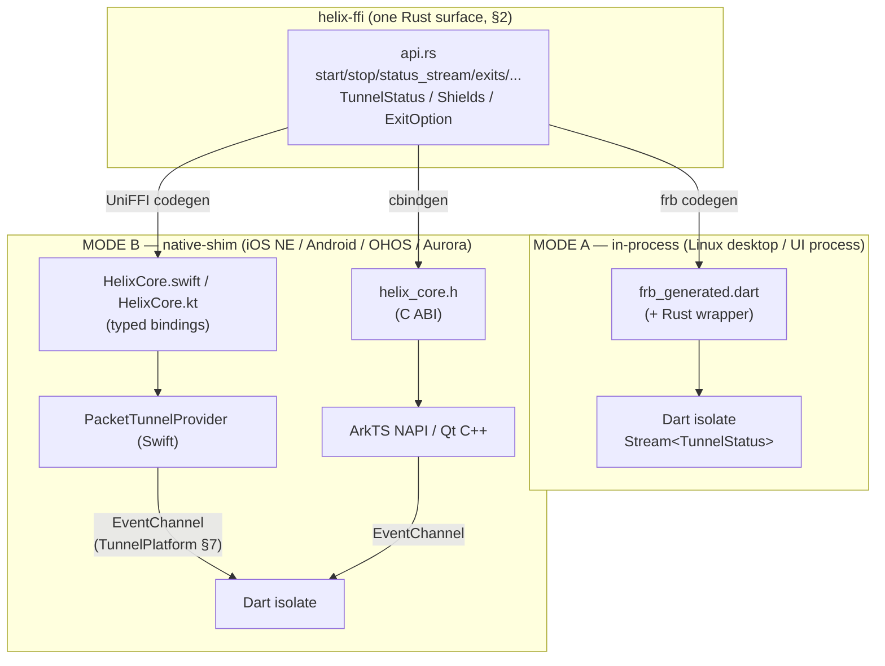
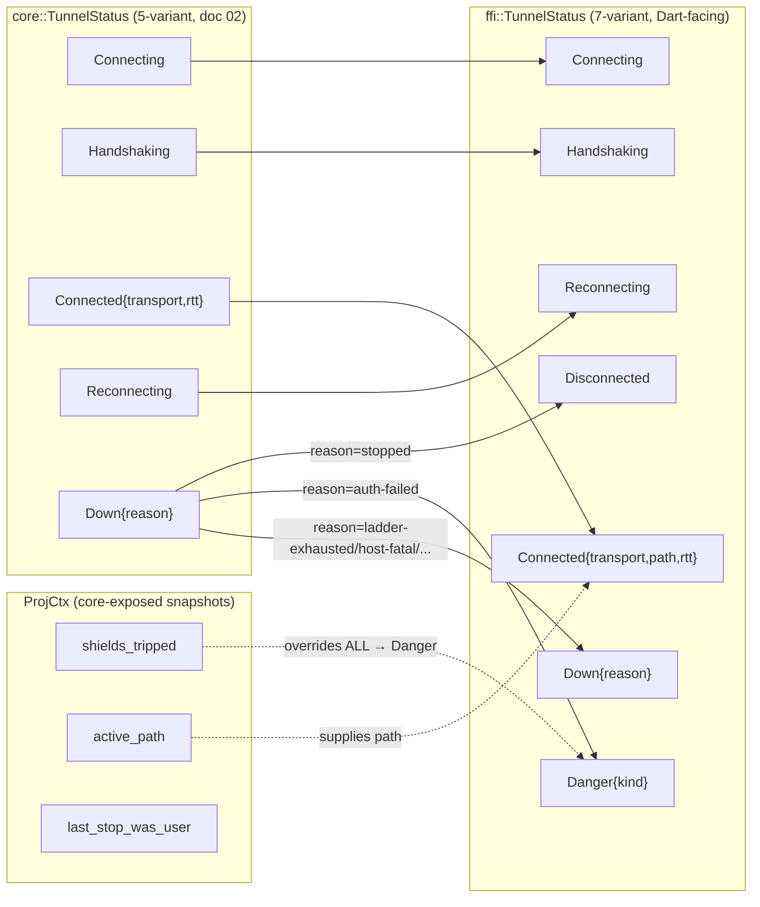
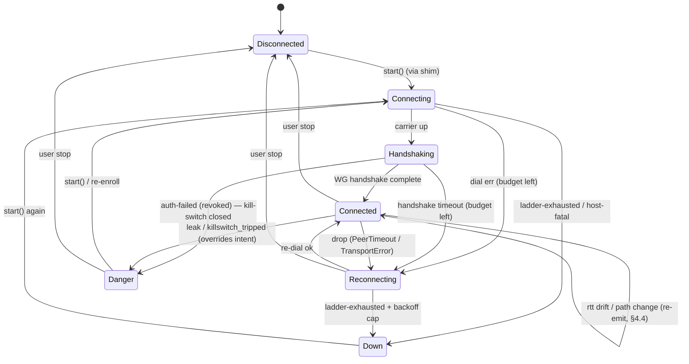
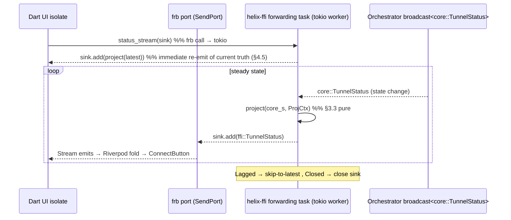
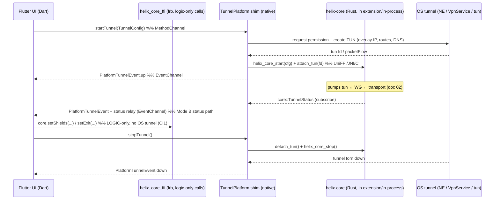
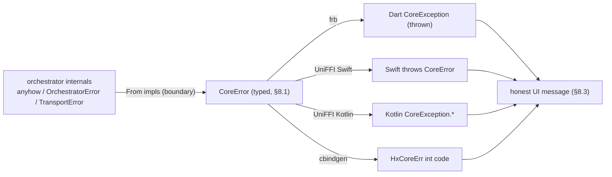
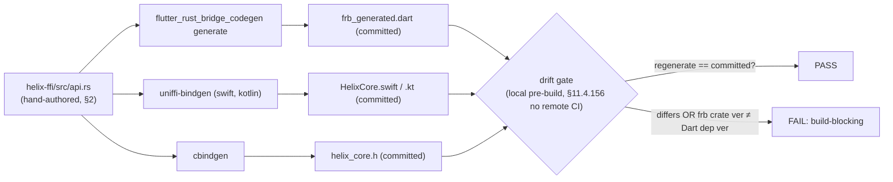

# FFI surface (Dart ⇄ Rust)

**Revision:** 2
**Last modified:** 2026-07-04T12:00:00Z

> Master technical specification — Volume 4 (Clients), nano-detail deep-dive.
> This document **deepens** the *FFI surface — Dart ⇄ `helix-core`* section of the
> pass-1 client overview [04_CLIENT §3] into an implementation-ready specification of
> the **`helix-ffi` exported surface**: the two binding generators
> (`flutter_rust_bridge` v2 primary, UniFFI native-shim fallback), the exact
> Rust/Dart/Swift/Kotlin/C signatures of `start`/`stop`/`status_stream`/`exits`/
> `set_exit`/`set_shields`/`advertise`/`attach_tun`, the mirrored `TunnelStatus`
> enum and its projection from the orchestrator's canonical enum, `StreamSink`
> event delivery, the tokio threading model, error propagation, the codegen +
> drift-gate pipeline, memory budgets, edge cases, and test points tied to the
> §11.4.169 closed test-type vocabulary.
>
> **SPEC-ONLY.** It describes *what to build* — signatures, state machines, memory
> ceilings, error taxonomy, edge cases, test points — not the shipping product.
>
> **Boundary with sibling docs.** This document **owns** only the *exported* FFI
> surface of `helix-core`. It **consumes**: the orchestrator's canonical
> `TunnelStatus` broadcast enum and `Orchestrator::{start,stop,subscribe,apply_map,
> set_pin}` API [02_ORCH §2.1, §4.1]; the `Transport`/`TransportKind` labels
> [02_TRANS §2, §3.3]; the `TunnelPlatform` MethodChannel/EventChannel shim
> contract [04_CLIENT §4]; the per-platform tunnel mechanisms (NEPacketTunnelProvider,
> VpnService) [04_CLIENT §5, research-ios_android]. The orchestrator *internals*
> (three loops, kill-switch coupling, reconciler) are doc 02's; this doc owns only
> how that core is *exposed across the language boundary*.
>
> **Evidence base.** Citations inline by id: `[04_CLIENT §N]` =
> `final/03-client-core-and-ui.md`; `[04_ARCH §5]` =
> `04_VPN_CLD/HelixVPN-Architecture-Refined.md` §5; `[04_UI]` =
> `04_VPN_CLD/HelixVPN-helix-ui-Flutter.md`; `[02_ORCH §N]` =
> `final/v02-data-plane/orchestrator-and-state.md`; `[02_TRANS §N]` =
> `final/v02-data-plane/transport-trait.md`; `[research-flutter_ffi]` /
> `[research-ios_android]` = the cited research digests; `[10_QA §N]` =
> `final/10-testing-acceptance-and-qa.md` (§11.4.169 taxonomy). Any claim not
> grounded in the evidence base is tagged `UNVERIFIED` per constitution §11.4.6 —
> never fabricated.

---

## Table of contents

- [0. Position, ownership, and the load-bearing seam](#0-position-ownership-and-the-load-bearing-seam)
- [1. Two generators, two consumption modes](#1-two-generators-two-consumption-modes)
- [2. The Rust source of truth (`helix-ffi/src/api.rs`)](#2-the-rust-source-of-truth-helix-ffisrcapirs)
- [3. The `TunnelStatus` enum — mirror + projection](#3-the-tunnelstatus-enum--mirror--projection)
- [4. `StreamSink` event delivery & the threading model](#4-streamsink-event-delivery--the-threading-model)
- [5. The Dart-facing surface (`helix_core.dart`)](#5-the-dart-facing-surface-helix_coredart)
- [6. UniFFI native-shim surface (Swift / Kotlin / C)](#6-uniffi-native-shim-surface-swift--kotlin--c)
- [7. The `TunnelPlatform` ⇄ FFI division of labor](#7-the-tunnelplatform--ffi-division-of-labor)
- [8. Error propagation across the boundary](#8-error-propagation-across-the-boundary)
- [9. Lifecycle, idempotence, and `attach_tun` fd ownership](#9-lifecycle-idempotence-and-attach_tun-fd-ownership)
- [10. Codegen + drift-gate pipeline](#10-codegen--drift-gate-pipeline)
- [11. Memory & performance budgets](#11-memory--performance-budgets)
- [12. Edge cases & failure modes](#12-edge-cases--failure-modes)
- [13. Test points — §11.4.169 closed vocabulary](#13-test-points--1114169-closed-vocabulary)
- [14. Surfaced decisions & cross-doc contracts](#14-surfaced-decisions--cross-doc-contracts)
- [Sources verified](#sources-verified)

---

## 0. Position, ownership, and the load-bearing seam

`helix-ffi` is the **single hand-authored Rust crate** that both binding generators
read; it is the only place the core's surface crosses a language boundary
[04_CLIENT §3.1]. It is decoupled and project-agnostic (`vasic-digital/helix_core`
workspace, snake_case flat submodule per §11.4.28/.29/.74): it depends *up* on
`helix-core` (orchestrator, status enum) and exposes *down* a stable Dart/Swift/
Kotlin/C surface, but contains no project-specific UI glue.

### 0.1 What this document owns

| # | Owned artifact | Where |
|---|---|---|
| F1 | The exact Rust API of `helix-ffi` (`start`/`stop`/`status_stream`/`exits`/`set_exit`/`set_shields`/`advertise`/`apply_map`/`attach_tun`/`detach_tun`) + the mirrored DTO types (`ClientConfig`, `CoreMode`, `Shields`, `ExitOption`, `AdvertiseResult`, `MapApplied`, `CoreError`) | §2 |
| F2 | The Dart-facing `TunnelStatus` (7-variant) and its **deterministic projection** from the orchestrator's canonical 5-variant `core::TunnelStatus` | §3 |
| F3 | The `StreamSink<TunnelStatus>` delivery mechanism + the tokio runtime / forwarding-task threading model + the pause/resume re-emit rule | §4 |
| F4 | The idiomatic Dart wrapper (`helix_core.dart`) and the UniFFI Swift/Kotlin/C surface | §5, §6 |
| F5 | Error propagation (frb exception ⇄ UniFFI typed error ⇄ C error code) | §8 |
| F6 | The codegen + drift-gate (a generated-Dart/Rust mismatch is a build-blocking finding) | §10 |

### 0.2 What this document does NOT own

- The orchestrator loops / kill-switch / DNS / reconciler — doc 02 [02_ORCH §3–§9];
  this doc consumes `Orchestrator::subscribe()` and the broadcast enum.
- The `Transport` trait and its impls — doc 02 [02_TRANS]; this doc surfaces only the
  `kind()` label string inside `Connected.transport`.
- The OS tunnel lifecycle (TUN creation, permission, packet pump) — the `TunnelPlatform`
  shim [04_CLIENT §4–§5]; this doc owns only the `attach_tun`/`detach_tun` handoff and
  the in-process-vs-native-shim consumption split (§7).
- The Riverpod data layer / widgets — [04_CLIENT §7–§8]; this doc stops at the
  `Stream<TunnelStatus>` the providers watch.

### 0.3 The load-bearing invariant (CI1 + CI2, restated at the FFI layer)

> **`helix-ffi` owns *logic and status*; it does NOT own the OS tunnel lifecycle.**
> Lifecycle commands flow **UI → shim → core** (the OS owns the tunnel process);
> status events flow **core → FFI → UI** (the core owns truth about protection
> state). `set_shields`/`set_exit`/`exits` are pure logic and go straight UI → FFI
> without touching the OS tunnel. The UI *only* ever believes the core's status
> stream, never its own intent. [04_CLIENT §0.1 CI1/CI2, §3.3]

This is the seam that mechanically prevents the classic "UI says connected while the
OS tunnel is actually down" bug — the FFI never *reports* a state the orchestrator did
not *emit* (§3, §4.5).

---

## 1. Two generators, two consumption modes

Two binding generators read **one** Rust surface — the canonical Mullvad/WARP pattern
[04_CLIENT §3, 04_ARCH §5.1, research-flutter_ffi §7]:

- **`flutter_rust_bridge` (frb) v2** — **2.12.0** (Flutter Favorite; `StreamSink`
  support; arbitrary/async Rust types; new SSE codec) [research-flutter_ffi §1]. The
  **primary** generator: emits the Dart⇄Rust glue (`frb_generated.dart` + a Rust
  wrapper) for the UI process.
- **UniFFI (Mozilla)** — first-party **Kotlin / Swift** output [research-flutter_ffi §2].
  The **native-shim fallback**: emits the typed Swift/Kotlin bindings a platform tunnel
  *extension* (NEPacketTunnelProvider, VpnService, HarmonyOS ArkTS→NAPI) uses when it
  links the core **directly** rather than through Dart. `uniffi-dart` is NOT
  production-ready and is NOT used for the Dart surface (frb owns Dart)
  [research-flutter_ffi §2].
- **cbindgen C header** — the **raw-C fallback** where UniFFI's language support is thin
  (HarmonyOS NAPI shim, Aurora Qt/C++ backend) [04_CLIENT §5.5/§5.6, D-CLIENT-3].

These map onto **two distinct consumption modes**, and *which mode a platform uses
decides where each `TunnelStatus` originates*:

| Mode | Where the core runs | Generator | Status path | Platforms |
|---|---|---|---|---|
| **(A) In-process frb** | the **Dart/UI process** (same process as Flutter) | frb v2 | `core → StreamSink → frb port → Dart isolate` | Linux desktop (core in-process); Windows app side talks to the privileged service over a pipe but the Dart-facing surface is still frb |
| **(B) Native-shim UniFFI/C** | a **separate OS tunnel extension process** | UniFFI (Swift/Kotlin) / cbindgen (C) | `core → shim → EventChannel → Dart` (the `TunnelPlatform` event stream, §7) | iOS/macOS NE, Android VpnService, HarmonyOS, Aurora |



> **Honest boundary (§11.4.6).** In Mode B the **core never runs in the Dart isolate** —
> it runs inside the OS extension process (the memory-constrained one, §11). The frb
> runtime + tokio threads of Mode A are therefore **NOT** part of the iOS NE footprint;
> the NE links the UniFFI/cbindgen staticlib only [research-ios_android §1 "applies to
> the process as a whole"]. This is why the iOS memory ceiling (§11) is a *native-shim*
> constraint, not an frb constraint.

---

## 2. The Rust source of truth (`helix-ffi/src/api.rs`)

This is the **only** hand-authored FFI source; both generators read it. It promotes the
pass-1 sketch [04_CLIENT §3.1] to the production surface; the lean Phase-0 subset
(`start`/`stop`/`status_stream`) is the G5 gate [04_CLIENT §13 T0.1].

```rust
// helix-ffi/src/api.rs
// frb + UniFFI generate Dart / Swift / Kotlin / C bindings from THIS file.
// The transport/WG/orchestrator internals are doc 02's; this is purely the EXPORTED surface.
use flutter_rust_bridge::frb;
use flutter_rust_bridge::StreamSink;

// ───────────────────────── construction inputs ─────────────────────────
pub struct ClientConfig {
    /// Phase 0: filesystem path to a static map.json. Phase 1+: an opaque control-plane
    /// session token (handed straight to the orchestrator; the FFI never parses it).
    pub map_path_or_session: String,
    /// Ladder seed: "auto" | "plain" | "masque" | "shadowsocks" | "uot" | "lwo".
    /// "auto" => the coordinator-pushed TransportPolicy.order decides [02_TRANS §6.2].
    pub transport: String,
    pub mode: CoreMode,
}

#[frb(mirror(CoreMode))]      // re-export helix_core::CoreMode's Dart mirror
pub enum CoreMode { Client, Connector }

// ───────────────────── lifecycle (LOGIC only — NOT the OS tunnel, CI1) ─────────────────────
/// Construct + start the orchestrator (doc 02 Orchestrator::start). Idempotent guard:
/// a second start while already running returns Err(CoreError::AlreadyStarted) (§9.2).
pub async fn start(cfg: ClientConfig) -> Result<(), CoreError>;

/// Graceful stop (doc 02 Orchestrator::stop). Idempotent: stop-when-stopped => Ok(()).
pub async fn stop() -> Result<(), CoreError>;

// ───────────────────── the live status stream (§3, §4) ─────────────────────
/// Register a sink; the FFI forwarding task projects core::TunnelStatus → ffi::TunnelStatus
/// (§3.3) and pushes each onto `sink`. Returns once the sink is registered; events arrive
/// asynchronously. The CURRENT status is re-emitted immediately on (re)registration (§4.5).
pub fn status_stream(sink: StreamSink<TunnelStatus>) -> Result<(), CoreError>;

// ───────────────────── exits / routing (Phase 1+) ─────────────────────
pub async fn exits() -> Result<Vec<ExitOption>, CoreError>;
pub async fn set_exit(id: String, multi_hop_chain: Option<Vec<String>>) -> Result<(), CoreError>;

// ───────────────────── privacy shields ─────────────────────
pub async fn set_shields(s: Shields) -> Result<(), CoreError>;

// ───────────────────── connector mode only ─────────────────────
pub async fn advertise(cidrs: Vec<String>) -> Result<AdvertiseResult, CoreError>;

// ───────── desired-state push (Phase 1 bridges WatchNetworkMap; Phase 0 file-watch) ─────────
/// Push a fresh RouteMap into the running orchestrator (doc 02 Orchestrator::apply_map).
/// Malformed JSON => Err(CoreError::Config); the last-applied map stays live (fail-static).
/// `MapApplied` reports the diff (peers added/removed/changed) for the Connector/Console UI.
pub async fn apply_map(map_json: String) -> Result<MapApplied, CoreError>;

// ───────────────────── shim handoff (called by the platform shim, NOT the UI) ─────────────────────
/// The core never opens the TUN; the shim hands it a packet fd. Ownership of `fd` transfers
/// to the core on Ok (the core close()s it on detach/stop) — §9.3. Synchronous (no await):
/// it only stores the fd + wakes loop A/B.
pub fn attach_tun(fd: i32) -> Result<(), CoreError>;
pub fn detach_tun() -> Result<(), CoreError>;

// ───────────────────── DTOs (mirrored byte-for-byte into Dart/Swift/Kotlin) ─────────────────────
pub struct Shields {
    pub kill_switch: bool,
    pub dns_protection: bool,
    pub daita: bool,
    pub post_quantum: bool,
    pub split_tunnel: Vec<String>, // per-route bypass CIDRs; per-APP split is shim-layer
}

pub struct ExitOption {
    pub id: String,
    pub kind: String,              // "privacy_exit" | "network"
    pub label: String,
    pub country: Option<String>,
    pub rtt_ms: Option<u32>,
    pub jurisdiction: Option<String>, // multi-hop labels
}

pub struct AdvertiseResult {
    pub accepted: Vec<String>,
    pub conflicts: Vec<String>,    // overlapping-CIDR conflicts surfaced to the Connector UI
}
```

> **`#[frb(mirror(T))]` semantics.** `CoreMode`/`TunnelStatus` are defined in `helix-core`
> (so the orchestrator and the FFI share one definition — no parallel hand-written enum).
> `#[frb(mirror(T))]` tells frb to generate the Dart mirror for a type owned by another
> crate [research-flutter_ffi §1, frb V2 "mirror" facility]. DTOs defined *in* `helix-ffi`
> (`ClientConfig`, `Shields`, `ExitOption`, `AdvertiseResult`, `CoreError`) need no `mirror`
> — frb auto-mirrors them. This is the corrected, precise form of the [04_CLIENT §3.1]
> sketch (which annotated own types with bare `#[frb(mirror)]`).

> **`Result<T, CoreError>` vs `anyhow::Result`.** The [04_CLIENT §3.1] sketch used
> `anyhow::Result<()>`; the production surface uses a **typed `CoreError` enum** (§8) so
> UniFFI (which needs a concrete error type, not `anyhow::Error`) and frb both surface a
> *classified* failure to the UI — a typed error drives an honest, specific UI message
> instead of an opaque string (§11.4.6). `anyhow` may remain *internal* to the orchestrator;
> the FFI boundary converts to `CoreError`.

---

## 3. The `TunnelStatus` enum — mirror + projection

### 3.1 The canonical (core-owned) enum — consumed, not redefined

The orchestrator owns the **canonical 5-variant** enum and broadcasts it on a
`tokio::sync::broadcast` channel [02_ORCH §4.1]:

```rust
// helix-core/src/status.rs  (OWNED by doc 02 — this doc CONSUMES it)
pub enum TunnelStatus {                              // core::TunnelStatus
    Connecting,
    Handshaking,
    Connected { transport: String, rtt_ms: u32 },    // transport = Transport::kind() [02_TRANS §3.3]
    Reconnecting,
    Down { reason: String },                          // stable-prefix vocabulary [02_ORCH §4.4]
}
```

### 3.2 The Dart-facing (FFI-owned) enum — the 7-variant surface

The FFI exposes the **extended 7-variant** enum the UI's color/announce logic switches on
[04_CLIENT §3.1, §7.1]. It is the Dart-facing canonical and is what the `StreamSink`
carries:

```rust
// helix-ffi re-exports + extends — the Dart-facing surface
pub enum TunnelStatus {                              // ffi::TunnelStatus
    Disconnected,                                    // clean idle — DISTINCT from Down
    Connecting,
    Handshaking,
    Connected { transport: String, path: String, rtt_ms: u32 }, // path = "direct" | "relay"
    Reconnecting,
    Down { reason: String },                         // unexpected drop (reason ∉ danger-class)
    Danger { kind: String },                         // "leak" | "killswitch_tripped" — red palette
}
```

The three FFI extensions over the core enum [04_CLIENT §3.1 status-enum note]:
1. **`Disconnected`** — clean user-idle (never started / cleanly stopped), distinct from
   `Down` (an *unexpected* drop). Drives the neutral-grey `stateDisconnected` token
   [04_CLIENT §7.1].
2. **`path`** on `Connected` — `"direct"` (P2P/NAT-traversal) vs `"relay"` (DERP-style),
   surfaced by the `StatusChip` [04_CLIENT §7.2].
3. **`Danger { kind }`** — leak / kill-switch-tripped, drives the red `stateDanger` palette
   and **overrides any user intent** [04_CLIENT §8.4].

### 3.3 The projection — `StatusProjector` (the only place the extension happens)

The helix-ffi forwarding task (§4) runs a **pure deterministic projector** from
`core::TunnelStatus` (+ two side snapshots the core exposes) to `ffi::TunnelStatus`. This
is the single, testable seam where the extension is computed — never ad-hoc in the UI:

```rust
// helix-ffi/src/project.rs
pub struct ProjCtx {
    pub last_stop_was_user: bool,   // distinguishes clean idle from drop (from Orchestrator)
    pub active_path: Option<String>,// "direct"|"relay" from the active route/transport (§14 C3)
    pub shields_tripped: Option<String>, // Some("leak")|Some("killswitch_tripped") | None
}

pub fn project(s: &core::TunnelStatus, cx: &ProjCtx) -> ffi::TunnelStatus {
    use core::TunnelStatus as C;
    // Danger overrides everything (§8.4): a live leak / tripped kill-switch always paints red.
    if let Some(kind) = &cx.shields_tripped { return ffi::TunnelStatus::Danger { kind: kind.clone() }; }
    match s {
        C::Connecting   => ffi::TunnelStatus::Connecting,
        C::Handshaking  => ffi::TunnelStatus::Handshaking,
        C::Connected { transport, rtt_ms } => ffi::TunnelStatus::Connected {
            transport: transport.clone(),
            path: cx.active_path.clone().unwrap_or_else(|| "direct".into()), // §14 C3 default
            rtt_ms: *rtt_ms,
        },
        C::Reconnecting => ffi::TunnelStatus::Reconnecting,
        // The clean-idle vs drop split: orchestrator emits Down{reason:"stopped"} on a USER
        // stop [02_ORCH §2.4 step 6] → Disconnected; every other Down is an unexpected drop.
        C::Down { reason } => match classify(reason) {
            DownClass::UserStop  => ffi::TunnelStatus::Disconnected,
            DownClass::Danger(k) => ffi::TunnelStatus::Danger { kind: k },
            DownClass::Drop      => ffi::TunnelStatus::Down { reason: reason.clone() },
        },
    }
}

/// Classify on the orchestrator's STABLE reason prefix [02_ORCH §4.4] — no prose parsing (§11.4.6).
fn classify(reason: &str) -> DownClass {
    match reason {
        "stopped"                                   => DownClass::UserStop,
        "auth-failed"                               => DownClass::Danger("killswitch_tripped".into()),
        _ /* ladder-exhausted | host-fatal | ... */ => DownClass::Drop,
    }
}
```



### 3.4 The Dart-facing state diagram (what the UI switches on)



### 3.5 What the stream MUST NOT carry (I5 at the FFI layer)

The FFI re-emits exactly what the orchestrator broadcasts: ephemeral state, never durable
per-connection records [02_ORCH §4.5]. `Connected.transport` is a *kind* label; `path` is
`"direct"|"relay"`; `rtt_ms` is an aggregate EWMA. No SSID, no gateway IP, no per-packet
data ever crosses the `StreamSink` (§11.4.10, [02_ORCH §4.5]). The projector is pure and
holds no buffer beyond the single cached latest value (§4.5).

---

## 4. `StreamSink` event delivery & the threading model

### 4.1 Why `StreamSink`

frb v2 **explicitly supports `StreamSink`**: a Rust fn takes a `StreamSink<T>` argument and
Dart receives a `Stream<T>` it can `listen()` — the canonical way to push continuous events
from a long-lived Rust task to Dart (frb issue #347, solved by `StreamSink`)
[research-flutter_ffi §1]. This `Stream<TunnelStatus>` is exactly what the Riverpod
`StreamProvider` watches [04_CLIENT §8.2, research-flutter_ffi §6].

### 4.2 The tokio runtime (Mode A, in-process)

`helix-ffi` owns **one** `tokio::runtime::Runtime`, created lazily on the first `start()` and
reused for the process lifetime (re-created only if fully torn down):

```rust
// helix-ffi/src/runtime.rs
static RT: OnceCell<tokio::runtime::Runtime> = OnceCell::new();
static ORCH: tokio::sync::Mutex<Option<helix_core::Orchestrator>> = /* ... */;

fn rt() -> &'static tokio::runtime::Runtime {
    RT.get_or_init(|| tokio::runtime::Builder::new_multi_thread()
        .worker_threads(2)              // small: the orchestrator's loops are I/O-bound (§11)
        .thread_name("helix-core")
        .enable_all()
        .build()
        .expect("tokio runtime"))
}
```

- **frb already drives Rust on its own worker thread(s)** off the Dart isolate
  [research-flutter_ffi §1]; the FFI additionally owns a tokio runtime so the orchestrator's
  three async loops + reconciler + re-dial driver run on dedicated worker threads
  [02_ORCH §2.2]. `async fn` FFI calls (`start`/`stop`/`exits`/...) are `rt().spawn`-ed and
  their result awaited by frb, so the Dart `await` never blocks the UI isolate.
- **Bridge-version pinning (mandatory).** The `flutter_rust_bridge` crate version MUST equal
  the `flutter_rust_bridge` Dart-dep version, else the generated glue mismatches
  [research-flutter_ffi §1 caveat]. Enforced by the drift gate (§10).

### 4.3 The forwarding task

`status_stream(sink)` registers the sink with a long-lived forwarding task that drains the
orchestrator broadcast receiver and pushes projected events:

```rust
pub fn status_stream(sink: StreamSink<TunnelStatus>) -> Result<(), CoreError> {
    let orch = ORCH.blocking_lock();
    let mut rx = orch.as_ref().ok_or(CoreError::NotStarted)?.subscribe(); // broadcast::Receiver
    let projector_ctx = ctx_handle();      // shared ProjCtx (updated by the orchestrator)
    sink.add(project(&last_status(), &projector_ctx.snapshot())).ok();    // §4.5 re-emit latest
    rt().spawn(async move {
        loop {
            match rx.recv().await {
                Ok(core_s) => { let _ = sink.add(project(&core_s, &projector_ctx.snapshot())); }
                Err(broadcast::error::RecvError::Lagged(_)) => continue,  // skip-to-latest (§4.6)
                Err(broadcast::error::RecvError::Closed)    => { sink.close_sink(); break; }
            }
        }
    });
    Ok(())
}
```



### 4.4 Emit discipline (coalesce, inherited from the orchestrator)

The orchestrator already coalesces: one emit per `OrchState` transition; `Connected` is
re-emitted only when `rtt_ms` drifts > `rtt_emit_delta_ms` (default 5 ms) [02_ORCH §4.3].
The FFI projector adds **one** extra coalescing rule: if `project()` yields a value
*byte-identical* to the last forwarded `ffi::TunnelStatus`, the forward is suppressed (so a
core-side re-emit that does not change the projected value — e.g. an rtt drift below the UI's
threshold — does not wake the UI). A `path` change *does* re-emit `Connected` (the
`StatusChip` updates).

### 4.5 Pause / resume + the "current truth" guarantee

Riverpod 3.0 **pauses** a `StreamProvider`'s subscription when no widget listens, and
`StreamProvider.autoDispose` tears the underlying stream down when unwatched
[research-flutter_ffi §6]. Two FFI obligations follow:

1. **The forwarding task NEVER stops on Dart pause.** It holds the broadcast receiver
   independent of Dart listen-state, because the *kill-switch / protection truth* must not be
   lost while the UI is backgrounded. A paused Dart subscription only stops *delivery* to the
   isolate; the orchestrator keeps running (Mode A) or the extension keeps running (Mode B).
2. **On (re)subscribe, the FFI re-emits the cached latest status immediately** (§4.3 first
   `sink.add`), so a resumed `StreamProvider` renders *current* truth, never a stale gap or an
   empty `AsyncLoading` that misrepresents protection state (§11.4.6, [04_CLIENT §8.4]).
   `helix-ffi` keeps exactly **one** cached `ffi::TunnelStatus` (the last forwarded value) —
   not a history (I5, §3.5).

> **Recommendation (D-FFI-1, §14).** Use **`@riverpod` / `StreamProvider.autoDispose`** for
> the tunnel-status provider so a paused subscription is cheap, BUT rely on the §4.5(2)
> re-emit for correctness on resume — do NOT make the kill-switch UI depend on a
> non-autoDispose "always alive" provider, which "is almost never destroyed"
> [research-flutter_ffi §6].

### 4.6 `Lagged` is NOT an error

`tokio::broadcast` is a bounded ring (cap 64) [02_ORCH §4.2]: a slow receiver that falls
behind gets `RecvError::Lagged(n)` and is fast-forwarded. For a *status* stream the receiver
only ever needs the **latest** state, so the forwarding task treats `Lagged` as
"continue → next `recv()` yields the newest" and never surfaces it to Dart as an error
(§4.3). This mirrors the orchestrator's documented receiver contract [02_ORCH §4.6].

### 4.7 Named backpressure policy (what happens if the Dart consumer is slow)

The mechanism above (§4.2–§4.6) *is* the backpressure policy; this subsection names it
explicitly so a slow-consumer question always has a one-line answer instead of requiring a
re-derivation from the mechanics: **bounded ring (cap 64) + drop-to-latest-on-lag, never
block, never grow unbounded, never error the UI.** Concretely: (1) the orchestrator's
broadcast sender NEVER blocks on a slow receiver — a full ring silently overwrites the
oldest unread entry (`tokio::broadcast` semantics); (2) the forwarding task NEVER buffers
past the ring — on `Lagged` it drops straight to "read the newest" (§4.6), so memory is
bounded regardless of how far behind Dart falls; (3) the UI therefore never sees a growing
backlog and never sees an out-of-order replay — it sees the current truth, possibly having
skipped some now-stale intermediate states, which is exactly correct for a *status* signal
(the UI cares "what is true now", not "the full history of transitions"); (4) this is safe
specifically because `TunnelStatus` is idempotent-to-replay state, not an event log — a
backpressure design that dropped entries from an audit/event stream would be a §11.4.10/
§11.4.13 violation, but dropping a stale *status* value the moment a fresher one exists is
not (§3.5 already forbids the stream from carrying per-packet/audit-grade data). A future
FFI stream carrying non-idempotent events (none currently planned) would need a different,
explicitly-designed backpressure policy — this one is scoped to `status_stream` only.

---

## 5. The Dart-facing surface (`helix_core.dart`)

frb mirrors every type, so the Dart `TunnelStatus` is the **generated** mirror of
`ffi::TunnelStatus` (never a hand-written parallel). The thin wrapper adds ergonomics only
[04_CLIENT §3.2]:

```dart
// helix_core_ffi/lib/helix_core.dart — idiomatic wrapper over frb_generated.dart
abstract class HelixCore {
  Future<void> start({required String transport, String? mapPathOrSession,
                      CoreMode mode = CoreMode.client});
  Future<void> stop();

  /// frb StreamSink → Dart broadcast Stream. NO polling (CI2). The first event is the
  /// current status (§4.5); subsequent events are coalesced state changes (§4.4).
  Stream<TunnelStatus> statusStream();

  Future<List<ExitOption>> exits();
  Future<void> setExit(String id, {List<String>? multiHopChain});
  Future<void> setShields(Shields s);

  // connector mode:
  Future<AdvertiseResult> advertise(List<String> cidrs);

  // shim handoff (called by the platform shim, NOT the UI):
  Future<void> attachTun(int fd);
  Future<void> detachTun();
}

/// Console (no Capability.tunnel) gets this null impl — never links the Rust staticlib (CI3).
class NoCore implements HelixCore {
  @override Stream<TunnelStatus> statusStream() => const Stream.empty();
  // every method throws StateError('Console has no tunnel core') — compile-gated out anyway.
  // ...
}
```

```dart
// the entire happy path a client app drives (the Phase-0 G5 demo, [04_CLIENT §13 T0.1]):
await core.start(transport: 'auto', mapPathOrSession: session.token);
core.statusStream().listen((s) => /* Riverpod fold → ConnectButton, [04_CLIENT §8] */);
// ...later:
await core.stop();
```

### 5.1 Dart-side error surface

Every `Future`-returning method may throw a `CoreException` (the Dart mirror of `CoreError`,
§8). The wrapper does NOT swallow it — the controller surfaces it as an honest UI message
(§8.3). `statusStream()` never throws on `Lagged` (§4.6); it closes only when the core is
torn down (`RecvError::Closed`).

---

## 6. UniFFI native-shim surface (Swift / Kotlin / C)

In Mode B the core runs inside the OS tunnel extension; UniFFI generates the typed binding
the extension calls. The **same `api.rs`** produces it; the surface is the same verbs, named
in each language's idiom. The status flows out via the platform `EventChannel` (§7), not via
frb.

### 6.1 Swift (iOS / macOS NEPacketTunnelProvider)

```swift
// generated by UniFFI from helix-ffi (HelixCore.swift) — used inside the NE extension
import HelixCore

final class PacketTunnelProvider: NEPacketTunnelProvider {
  override func startTunnel(options: [String:NSObject]?,
                            completionHandler: @escaping (Error?) -> Void) {
    let cfg = decodeTunnelConfig(options)                   // overlay IP, routes, DNS, session
    let settings = makeNetworkSettings(cfg)                 // NEPacketTunnelNetworkSettings
    setTunnelNetworkSettings(settings) { [weak self] err in
      guard err == nil, let self else { return completionHandler(err) }
      do {
        try helixCoreStart(cfg: ClientConfig(mapPathOrSession: cfg.sessionToken,
                                             transport: "auto", mode: .client))   // typed throw
        let fd = self.packetFlowFd()                        // the NE packet fd (Mode B handoff)
        try helixAttachTun(fd: fd)                          // §9.3 ownership transfer
        self.relayStatus()                                  // subscribe → EventChannel (§7)
        completionHandler(nil)
      } catch let e as CoreError { completionHandler(coreErrorToNSError(e)) }     // §8.2
        catch { completionHandler(error) }
    }
  }
  override func stopTunnel(with r: NEProviderStopReason, completionHandler: @escaping () -> Void) {
    try? helixDetachTun(); try? helixCoreStop(); completionHandler()             // O4 quiescent
  }
}
```

> `helixCoreStart`/`helixAttachTun`/`helixCoreStop` are UniFFI-generated Swift throwing
> functions; `CoreError` is a UniFFI error enum (§8.2). The Swift side reads/writes the
> packet fd handed to the core (Layer-3 IP packets) [research-ios_android §1, §3].

### 6.2 Kotlin (Android VpnService + JNI)

```kotlin
// generated by UniFFI from helix-ffi (HelixCore.kt) — used inside the foreground VpnService
class HelixVpnService : VpnService() {
  override fun onStartCommand(intent: Intent?, flags: Int, startId: Int): Int {
    val cfg = TunnelConfig.from(intent)
    val builder = Builder().addAddress(cfg.overlayIp, 32).setMtu(cfg.mtu)
    cfg.routes.forEach { builder.addRoute(it.addr, it.prefix) }          // AllowedIPs
    cfg.dnsServers.forEach { builder.addDnsServer(it) }                  // tunnel DNS
    cfg.splitExcludeApps.forEach { builder.addDisallowedApplication(it) }
    val pfd: ParcelFileDescriptor = builder.establish()!!               // OS creates TUN
    startForeground(NOTIF_ID, persistentNotification())                 // required for bg tunnel
    HelixCore.start(ClientConfig(cfg.sessionToken, "auto", CoreMode.CLIENT))
    HelixCore.attachTun(pfd.detachFd())  // detachFd transfers ownership → core close()s (§9.3)
    relayStatus()                        // subscribe → EventChannel (§7)
    return START_STICKY
  }
  override fun onRevoke()  { HelixCore.detachTun(); HelixCore.stop(); emitEvent(REVOKED) } // O3
  override fun onDestroy() { HelixCore.detachTun(); HelixCore.stop(); stopForeground(true) } // O4
}
```

> `detachFd()` transfers fd ownership to native (the core now owns `close(2)`); `getFd()`
> would keep ownership in Java [research-ios_android §3]. The choice is load-bearing for
> §9.3 (double-close avoidance). HarmonyOS/Aurora use the cbindgen C ABI (§6.3) instead of
> UniFFI Kotlin/Swift.

### 6.3 C ABI (HarmonyOS NAPI / Aurora Qt) — cbindgen fallback

```c
// helix_core.h — generated by cbindgen (the raw-C fallback, D-CLIENT-3)
typedef enum HxCoreErr {
  HX_OK = 0, HX_ERR_NOT_STARTED = 1, HX_ERR_ALREADY_STARTED = 2,
  HX_ERR_AUTH = 3, HX_ERR_CONFIG = 4, HX_ERR_HOST_FATAL = 5, HX_ERR_INTERNAL = 6
} HxCoreErr;
HxCoreErr  hx_core_start(const char* session, const char* transport, int mode);
HxCoreErr  hx_core_stop(void);
HxCoreErr  hx_attach_tun(int fd);
HxCoreErr  hx_detach_tun(void);
/// Status callback: the C consumer registers a fn-ptr; the core invokes it on each
/// projected status. `json` is a UTF-8 ffi::TunnelStatus JSON (the C ABI has no enum-payload
/// type), freed by the core after the call returns. (UNVERIFIED: exact JSON schema fixed in
/// the cbindgen contract test, §13 UNIT.)
typedef void (*hx_status_cb)(const char* json, void* user);
HxCoreErr  hx_status_subscribe(hx_status_cb cb, void* user);
```

> The C surface carries `TunnelStatus` as JSON because the C ABI cannot express a
> tagged-union-with-payload; the Swift/Kotlin UniFFI paths carry the real enum. The JSON
> schema is frozen by the cbindgen contract test (§13) and is the same projected
> `ffi::TunnelStatus` (§3.2).

---

## 7. The `TunnelPlatform` ⇄ FFI division of labor

The seam that prevents the classic bug [04_CLIENT §3.3, §4]. **Lifecycle** commands flow
UI → shim → core; **status** flows core → FFI → UI. In Mode B the status takes the
`EventChannel` (the `TunnelPlatform.events()` stream) because the core is in the extension
process, not the Dart isolate.



### 7.1 Where each TunnelStatus originates (the mode split)

| Call | Mode A (in-process frb) | Mode B (native shim) |
|---|---|---|
| `start`/`stop` | the shim calls the FFI `start`/`stop` (Linux: core in-process) | the shim calls the **UniFFI/C** `helix_core_start`/`stop` inside the extension |
| `attach_tun(fd)` | Linux tun fd → FFI `attach_tun` | NE `packetFlow` fd / `pfd.detachFd()` → UniFFI/JNI `attach_tun` |
| `status_stream` | frb `StreamSink` → Dart isolate **directly** | core subscribe → shim → **EventChannel** → Dart |
| `set_shields`/`set_exit`/`exits` | frb call, in-process | **frb call to the UI-process FFI** if a logic-only core handle exists there, else marshalled to the extension over the platform channel (D-FFI-2, §14) |

> **Honest boundary (§11.4.6 / §14 C2).** In Mode B the *logic-only* verbs
> (`set_shields`/`set_exit`/`exits`) target the core **in the extension**, while the UI runs
> in the app process. The pass-1 sketch [04_CLIENT §3.3] drew these as "straight UI → FFI";
> on iOS/Android that requires either (a) a second in-app-process core handle for pure-logic
> queries, or (b) marshalling the verb over the `TunnelPlatform` MethodChannel to the
> extension. This is surfaced as **D-FFI-2** — not silently assumed.

---

## 8. Error propagation across the boundary

### 8.1 The typed `CoreError` enum

```rust
// helix-ffi/src/error.rs
#[derive(thiserror::Error, Debug)]
pub enum CoreError {
    #[error("core not started")]            NotStarted,        // status_stream/stop before start
    #[error("core already started")]        AlreadyStarted,    // double start (§9.2)
    #[error("invalid config: {0}")]         Config(String),    // bad transport string / map path
    #[error("auth failed (revoked)")]       Auth,              // maps from Down{auth-failed}
    #[error("host fatal: {0}")]             HostFatal(String), // TUN open / firewall-apply failed
    #[error("tun fd invalid")]              BadFd,             // attach_tun(fd) not a usable fd
    #[error("internal: {0}")]               Internal(String),  // last resort; never a secret (§11.4.10)
}
```

`CoreError` is the **only** error type the FFI surface returns; the orchestrator's internal
`anyhow`/`OrchestratorError`/`TransportError` are converted at the boundary (`From` impls).
Reasons are classified on the orchestrator's stable prefixes [02_ORCH §4.4], never parsed
from prose (§11.4.6). No variant ever carries a `SecretBytes` value (§11.4.10, [02_TRANS §3.2]).

### 8.2 Per-generator mapping

| Generator | `Err(CoreError)` becomes | UI sees |
|---|---|---|
| **frb (Dart)** | a thrown `CoreException` (frb maps `Result::Err` of a custom error enum to a Dart exception of the mirrored type) | `try { await core.start() } on CoreException catch (e) { … }` |
| **UniFFI (Swift)** | a Swift `throws` of the `CoreError` error enum | `do { try helixCoreStart() } catch let e as CoreError { … }` |
| **UniFFI (Kotlin)** | a Kotlin `CoreException` subclass per variant | `try { HelixCore.start() } catch (e: CoreException.Auth) { … }` |
| **cbindgen (C)** | an `HxCoreErr` integer code (§6.3) | `if (hx_core_start(...) != HX_OK) …` |



### 8.3 Errors vs status (two distinct channels)

A **synchronous failure** of a verb (`start` could not open the TUN) is a thrown
`CoreError`; a **runtime transition** (the tunnel later drops) is a `TunnelStatus` event.
The UI must handle both: an `await core.start()` that throws `HostFatal` shows a
start-failure message; a later `Down`/`Danger` event on the stream repaints the
`ConnectButton`. A verb MUST NOT silently swallow an error and rely on the status stream to
reflect it (that would be a §11.4.1 FAIL-bluff at the boundary) — the throw and the event
are complementary, not redundant.

---

## 9. Lifecycle, idempotence, and `attach_tun` fd ownership

### 9.1 Verb lifecycle contract

| Verb | Pre-state | Post-state | Idempotence |
|---|---|---|---|
| `start` | core stopped | orchestrator running, emits `Connecting` | double `start` → `Err(AlreadyStarted)` (§9.2) |
| `stop` | running | torn down, emits `Disconnected` (`Down{stopped}` → projected) | `stop` when stopped → `Ok(())` (no-op) |
| `status_stream` | any | sink registered; **immediate** latest re-emit (§4.5) | many concurrent sinks allowed (broadcast fan-out) |
| `attach_tun(fd)` | started, no fd | core pumps `fd` | second `attach_tun` without `detach` → `Err(BadFd)`-class guard (§9.3) |
| `detach_tun` | fd attached | fd closed, pump idle | `detach` when none attached → `Ok(())` |
| `set_shields`/`set_exit`/`exits`/`advertise` | started | applied | naturally idempotent (declarative) |

### 9.2 Double-start / start-while-connected guard

`start` acquires the `ORCH` mutex and refuses if `Some(_)` is already present
(`Err(AlreadyStarted)`) — the UI's `ConnectController` must not call `start` while a tunnel
exists (it calls `toggle`, [04_CLIENT §8.2]). This guards the §11.4.84-class hazard of two
orchestrators racing one TUN fd.

### 9.3 `attach_tun` fd ownership (the double-close hazard)

`attach_tun(fd)` **takes ownership** of the fd on `Ok`: the core `close(2)`s it on
`detach_tun`/`stop`. The shim MUST therefore hand a fd it has **relinquished**:

- **Android:** use `ParcelFileDescriptor.detachFd()` (transfers ownership) — NOT `getFd()`
  (keeps ownership; the core close()ing it then double-closes when the PFD is GC'd)
  [research-ios_android §3]. The Kotlin shim (§6.2) uses `detachFd()`.
- **iOS NE:** the NE owns `packetFlow`; the core does not `close` it — instead the iOS path
  uses the read/write-callback pump (`helix_core_set_tun_writer` + `packetFlow.readPackets`)
  rather than a raw fd, so `attach_tun` on iOS registers the callback pair, not an owned fd
  [04_CLIENT §5.1]. (UNVERIFIED whether a raw fd is even exposed by `NEPacketTunnelFlow`;
  the callback-pump form is the documented path — §13 records this as the iOS handoff.)
- **Linux:** the in-process core owns the tun fd directly (no cross-process transfer).

A failed `attach_tun` MUST leave **no** half-open TUN (§11.4.14 cleanup): on `Err`, the shim
closes the fd it created and emits `PlatformTunnelEvent.error` with an honest reason
[04_CLIENT §4.1 O1].

### 9.4 Out-of-band revoke / OS kill

When the OS or admin kills the tunnel out-of-band (`onRevoke`, `device.revoked` from the
control plane), the shim calls `detach_tun` + `stop` and emits `revoked`; the FFI projects
the resulting `Down`/`auth-failed` to `Danger{killswitch_tripped}` (§3.3) so the UI repaints
red — never "still connected" [04_CLIENT §4.1 O3, CI2].

---

## 10. Codegen + drift-gate pipeline

The no-drift guarantee [04_CLIENT §11, 04_ARCH §4.2]: the generated Dart/Swift/Kotlin can
**never** silently diverge from the Rust surface. A drift is a build-blocking finding.



- **Trigger:** any edit to `api.rs` (or a mirrored core type) re-runs all three generators;
  the regenerated output MUST byte-match the committed artifacts (`git diff --exit-code`).
- **Version pin check:** the gate asserts the `flutter_rust_bridge` crate version equals the
  `flutter_rust_bridge` Dart-dep version [research-flutter_ffi §1 caveat].
- **Enum-parity check:** the §13 `UNIT` FFI-contract test asserts the Dart/Swift/Kotlin
  `TunnelStatus`/`Shields`/`ExitOption` mirrors match the Rust types byte-for-byte (the
  projected 7-variant surface) [04_CLIENT §12 FFI-contract row].
- Run **locally** (`melos run drift-check`) — there is no active server-side CI (§11.4.156).

---

## 11. Memory & performance budgets

| Budget | Target | Basis / source |
|---|---|---|
| **iOS NE process RSS (Mode B)** | steady-state **well under the device ceiling** — design to ~**12–15 MB** working set, NOT to the 50 MiB figure | iOS NE limit is **50 MiB** on iOS 15–18 (was 15 MiB on iOS 11–14), **undocumented, MUST NOT be hardcoded**, and **observed 15 MB jetsam kills on some iOS 17 devices** (PENDING_FORENSICS) [research-ios_android §1] |
| iOS NE spike control | bound packet-buffer pools; single fixed-size receive buffer to MTU+headroom; no per-flow state growth | spikes (upload-heavy bursts), not steady state, are the jetsam killer [research-ios_android §1] |
| frb runtime cost (Mode A) | tokio runtime = **2 worker threads**; broadcast cap 64; one cached latest status | the loops are I/O-bound [02_ORCH §13]; the runtime does **not** run in the iOS NE (§1) |
| FFI projection cost | `project()` is pure, allocation-light (clones small strings); callable at status-change frequency (rare) | §3.3 |
| `status_stream` fan-out | many sinks via broadcast; lagged receiver fast-forwards, never blocks the core | §4.6, [02_ORCH §4.2] |
| `attach_tun` latency | synchronous, sub-ms (stores fd + wakes loops; no await) | §2, §9.3 |
| Mobile install size contribution | lean Rust staticlib: `opt-level=z/s` + fat LTO + `codegen-units=1` + `panic=abort` + `strip`; optional `build-std` + `panic_immediate_abort` + `optimize_for_size` | [research-ios_android §2], [04_CLIENT §10] |

> **The iOS NE ceiling is the architecture (CI4).** It is the single strongest reason the
> core is Rust not Go — a GC runtime risks the working set [04_CLIENT §0.1 CI4, §10,
> 04_ARCH §5.6]. Because Mode B links only the UniFFI/cbindgen staticlib (not frb + tokio +
> Dart), the FFI generator choice does **not** inflate the NE footprint; the `MEM` test
> (§13) measures the *extension* process, plain-UDP **and** MASQUE separately (G3)
> [research-ios_android §1, 04_CLIENT §5.1].

---

## 12. Edge cases & failure modes

| # | Edge case | Required behaviour |
|---|---|---|
| E1 | `status_stream` called before `start` | `Err(NotStarted)` — never a silent empty stream that the UI reads as "Disconnected-but-fine" (§8.3) |
| E2 | Broadcast `Lagged` under a wedged UI | forwarding task skips to latest; never surfaced to Dart as an error (§4.6) |
| E3 | Dart `StreamProvider` paused (backgrounded), then resumed | forwarding task keeps running; on resume the cached latest status is re-emitted (§4.5) — no stale gap |
| E4 | Dart isolate hot-restart (dev) / app process restart | frb port invalidated; `sink.add` errors → forwarding task drops that sink; a fresh `status_stream` re-registers + re-emits latest |
| E5 | Native extension crash (Mode B) | shim emits `error`/`down` on the EventChannel; FFI/UI shows `Down` (not "connected"); the OS may restart the extension (`START_STICKY` Android) → fresh `start` |
| E6 | Double `start` | `Err(AlreadyStarted)` (§9.2) |
| E7 | `attach_tun` with an invalid/closed fd | `Err(BadFd)`; shim closes its TUN, emits `error` (no half-open TUN, §11.4.14) |
| E8 | `detach_tun` then core keeps a stale fd | forbidden — `detach_tun` `close(2)`s and clears the fd; loops idle until a fresh `attach_tun` (§9.3) |
| E9 | fd double-close (shim `getFd` + core `close`) | prevented by mandating `detachFd()` ownership transfer (§9.3) [research-ios_android §3] |
| E10 | `Connected.path` unknown at emit time | projector defaults `path = "direct"` and re-emits `Connected` when the real path resolves (§3.3, §14 C3) |
| E11 | `Danger` (leak) while user intent = connected | `Danger` **overrides** intent; UI paints red immediately (§3.3, [04_CLIENT §8.4]) — never green-on-intent |
| E12 | `CoreError::Internal` carries a secret | forbidden (§11.4.10): the boundary `From` impls scrub; the `SEC` test plants a secret and greps logs/messages empty (§13) |
| E13 | Console flavor (no `Capability.tunnel`) calls a tunnel verb | compile-gated out; runtime fallback is `NoCore` throwing `StateError` (§5, CI3) — never links the staticlib |
| E14 | frb crate ver ≠ Dart dep ver | drift gate FAILs the build (§10) [research-flutter_ffi §1] |

---

## 13. Test points — §11.4.169 closed vocabulary

Every FFI workable item declares its required test types from the §11.4.169 closed set
[10_QA §2]; the ONLY permitted absence of a warranted type is an honest §11.4.3
SKIP-with-reason. Four-layer enforcement per §11.4.4(b). Every PASS ships captured evidence
per §11.4.5/.69/.107 — never a config-only or grep-only PASS.

| Code | Type | Concrete FFI test point | Evidence |
|---|---|---|---|
| `UNIT` | unit | `project()` truth table for **all 7×(5+ctx)** input combos; `classify()` on every stable `Down.reason` prefix; `CoreError` `From` mappings; **FFI-contract**: regenerated Dart/Swift/Kotlin `TunnelStatus`/`Shields`/`ExitOption` mirrors match Rust byte-for-byte; cbindgen JSON schema frozen. Mocks allowed **only here** (§11.4.27). | `cargo test` + `dart test` output; generated-mirror diff |
| `INT` | integration (real System, no mocks) | `start`→`status_stream` against a **real orchestrator** (in-process Mode A) yields the ordered `Connecting→Handshaking→Connected` trace; `attach_tun(fd)` with a real netns tun fd pumps packets | netns capture; ordered status-trace log |
| `E2E` | end-to-end | the Phase-0 **G5** demo: Flutter-Linux window, one connect/disconnect toggle, `StatusChip` driven *only* by the Rust stream [04_CLIENT §13 T0.1] | window-scoped MP4 (§11.4.159) of the connect journey |
| `FA` | full-automation | `make qa` drives `start→status→stop` **N=3 identical** runs producing the same ordered status trace (deterministic §11.4.50/.98) | 3× identical status-trace artifacts |
| `SEC` | security | (a) plant a session token / secret in `ClientConfig`, prove it appears in **no** log/`CoreError`/stream (§11.4.10); (b) the stream carries **no** SSID/gateway-IP/per-packet data (I5, §3.5) | grep-empty proof; stream-content audit |
| `STRESS` | stress | ≥100 rapid `set_shields`/`set_exit` calls + ≥10 concurrent `status_stream` sinks; no leak, bounded broadcast | call-throughput CSV |
| `CHAOS` | chaos | mid-`start` SIGKILL of the extension (Mode B) → shim emits down → fresh start recovers; isolate hot-restart (E4) → re-subscribe re-emits latest | recovery trace |
| `CONC` | concurrency / atomicity | concurrent `status_stream` (many sinks) + `set_shields` while a re-dial swaps `active_tx` [02_ORCH §7.3]; zero dropped/duplicated terminal status | concurrency harness log |
| `RACE` | race / deadlock | `cargo test --features loom` on the `ORCH` mutex + `ProjCtx` snapshot + forwarding-task shutdown; no deadlock between `stop` and an in-flight `recv` | loom report |
| `MEM` | memory | iOS NE **extension** RSS for plain-UDP **and** MASQUE separately, ≥30% headroom under the device ceiling, 30-min soak (G3 make-or-break); no per-event heap growth in the forwarding task | Instruments / `/proc` RSS sample [research-ios_android §1] |
| `BENCH`/`PERF` | benchmarking / performance | `project()` cost; `status_stream` end-to-end latency (core emit → Dart receive); `attach_tun` latency | latency histogram CSV |
| `UI`/`UX` | UI / UX | `ConnectButton` renders correctly across **every** `ffi::TunnelStatus` (incl. `Danger`); golden frames light+dark | golden PNGs [04_CLIENT §12] |
| `REC` | recorded-evidence | window-scoped MP4 (§11.4.154/.155) of the G5 connect journey, vision-validated `StatusChip` reads `masque-h3 · direct · 23ms` (OCR) (§11.4.163) | `panoptic`→`vision_engine` verdict |
| `CHAL`/`HQA` | Challenge / HelixQA | a bank entry scores PASS only on the captured G5 status-trace + device recording, never config | Challenge / HelixQA `result.json` |

> **Anti-bluff rule (§11.4.5/.69/.107).** A green `project()` unit test is **not** proof the
> user is protected. The authoritative evidence is the `E2E`/`REC` G5 device recording: the
> `StatusChip` reading the live transport·path·rtt confirmed by OCR/vision, plus the iOS NE
> `MEM` Instruments RSS report. Fake the orchestrator with the **same generated model types**
> so unit tests exercise real contracts, but the user-visible claim is earned only by the
> device recording [04_CLIENT §12].

---

## 14. Surfaced decisions & cross-doc contracts

Per §11.4.6/§11.4.66 — options + recommendation, never silently resolved.

| # | Decision / contract | Options | Recommendation |
|---|---|---|---|
| **D-FFI-1** | Riverpod provider disposal for the status stream | `@riverpod`/`autoDispose` (paused when unwatched) **vs** always-alive `StreamProvider` | **autoDispose** — cheap when backgrounded; correctness on resume comes from the §4.5(2) cached-latest re-emit, not from keeping the provider alive [research-flutter_ffi §6] |
| **D-FFI-2** | Mode-B logic-only verbs (`set_shields`/`set_exit`/`exits`) target the in-extension core | (a) second in-app-process core handle for pure-logic queries **vs** (b) marshal over the `TunnelPlatform` MethodChannel to the extension | **Gate on the platform**: (b) for iOS/Android (single source of truth = the extension's core); (a) only if a pure read needs sub-ms latency. Surfaced, not assumed (§7.1) |
| **D-FFI-3** | Native-shim error type | UniFFI typed `CoreError` enum **vs** flat string error | **typed `CoreError`** (§8.1) — drives honest, specific UI messages; cbindgen falls back to `HxCoreErr` int codes (§6.3) |

**Cross-document contracts this document fixes** (consumed by the named docs):

| # | Contract | Fixed value | Consumed by |
|---|---|---|---|
| C1 | The Dart-facing **`ffi::TunnelStatus`** (7-variant) + the `project()` mapping from `core::TunnelStatus` | §3.2, §3.3 | doc 02 (must emit the 5-variant on its stable prefixes); all apps |
| C2 | The **two consumption modes** (in-process frb vs native-shim UniFFI/C) and where each status originates | §1, §7.1 | every per-platform shim [04_CLIENT §5] |
| C3 | **`Connected.path`** requirement — the core MUST surface `"direct"\|"relay"` (added to `core::TunnelStatus.Connected` **or** queryable via the active route), else the projector defaults `"direct"` and re-emits (§3.3, E10). **UNVERIFIED** in the current orchestrator enum [02_ORCH §4.1] (which carries only `transport`+`rtt_ms`) — recorded as a follow-up cross-doc item per §11.4.6 | §3.3 | doc 02 (orchestrator enum), doc 02 multihop/relay |
| C4 | The typed **`CoreError`** boundary enum (frb exception ⇄ UniFFI error ⇄ `HxCoreErr`) | §8 | all apps, all shims |
| C5 | **`attach_tun` fd ownership transfer** (core close()s on detach/stop; shim hands a relinquished fd: Android `detachFd`, iOS callback-pump, Linux in-process) | §9.3 | every per-platform shim [04_CLIENT §5], doc 02 (`helix-tun`) |

---

## Sources verified

- `final/03-client-core-and-ui.md` `[04_CLIENT]` — §0.1 (CI1–CI6 invariants), §3
  (FFI surface, the `api.rs` sketch, the Dart wrapper, the FFI⇄shim seam), §4
  (`TunnelPlatform` contract), §5 (per-platform shims, iOS NE, Android VpnService), §7
  (tokens / `TunnelStatus`→palette), §8 (Riverpod, offline/intent honesty), §10–§12
  (budgets, build/codegen, testing). Accessed 2026-06-25.
- `04_VPN_CLD/HelixVPN-Architecture-Refined.md` `[04_ARCH §5]` — §5.1 (two binding
  generators, Rust core + Flutter UI), §5.6 (iOS NE memory = Rust-not-Go), §5.7 (Web has
  no shim). Accessed 2026-06-25.
- `04_VPN_CLD/HelixVPN-helix-ui-Flutter.md` `[04_UI]` — §4 (Riverpod stream model), §5 (FFI
  surface), §6 (shim matrix). Accessed 2026-06-25.
- `final/v02-data-plane/orchestrator-and-state.md` `[02_ORCH]` — §2.1 (Orchestrator API +
  `subscribe`), §4.1 (canonical 5-variant `TunnelStatus`), §4.2 (broadcast cap/Lagged),
  §4.3 (emit coalescing), §4.4 (stable `Down.reason` prefixes), §4.5 (no-durable-record),
  §4.6 (receiver contract), §5.1 (OrchState), §7.3 (atomic transport swap). Accessed
  2026-06-25.
- `final/v02-data-plane/transport-trait.md` `[02_TRANS]` — §2 (`Transport` trait), §3.2
  (`SecretBytes` redaction/zeroize), §3.3 (`TransportKind` labels = `Connected.transport`),
  §5.2 (carrier↔WG↔status projection). Accessed 2026-06-25.
- `v09-research/research-flutter_ffi.md` `[research-flutter_ffi]` — §1 (frb 2.12.0,
  `StreamSink`, async fn, mirror, version-pin caveat), §2 (UniFFI first-party Kotlin/Swift;
  uniffi-dart not production-ready), §3 (per-platform staticlib/cdylib packaging), §6
  (Riverpod 3.0 `StreamProvider` pause-when-unlistened, `autoDispose`, `overrideWithValue`),
  §7 (synthesis recommendations). Accessed 2026-06-25.
- `v09-research/research-ios_android.md` `[research-ios_android]` — §1 (iOS NE memory limit
  50 MiB iOS 15–18 / 15 MiB iOS 11–14, undocumented, MUST-NOT-hardcode, observed 15 MB iOS 17
  kills, whole-process scope, spike-driven jetsam, ~12–15 MB design budget), §2 (Rust
  staticlib size-opt flags), §3 (Android `VpnService.Builder`→`establish()`→`ParcelFileDescriptor`,
  `detachFd()` ownership transfer to JNI, `protect()`). Accessed 2026-06-25.
- `final/10-testing-acceptance-and-qa.md` `[10_QA]` — §2 (the canonical §11.4.169 closed
  test-type taxonomy + abbreviations). Accessed 2026-06-25.

*Constitution: §11.4.44 (revision header), §11.4.6/§11.4.66 (decisions = options +
recommendation; UNVERIFIED never fabricated), §11.4.5/§11.4.69/§11.4.107/§11.4.159
(captured/window-scoped evidence), §11.4.10 (secrets never cross the boundary), §11.4.14
(no half-open TUN on attach failure), §11.4.28/§11.4.74 (decoupled reusable `helix-ffi`),
§11.4.156 (no active CI — local drift gate), §11.4.169 (per-item test-type coverage).*

*End of nano-detail specification — FFI surface (Dart ⇄ Rust), Volume 4 (Clients). Deepens
[04_CLIENT §3]; consumes the orchestrator status contract [02_ORCH §4] and the
`TunnelPlatform` shim contract [04_CLIENT §4]. Surfaced decisions: D-FFI-1 (provider
disposal), D-FFI-2 (Mode-B logic-verb routing), D-FFI-3 (native error type); cross-doc
contract C3 (`Connected.path`) flagged UNVERIFIED against the current orchestrator enum —
all presented, none silently resolved (§11.4.66).*
